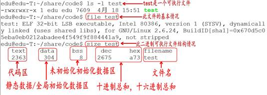

# C语言

## 1、编译过程

**C程序编译步骤：**

C代码编译可执行程序经过4步：

1. 预处理：宏定义展开、头文件展开、条件编译等，同时将代码中的注释删除，这里并不会检查语法。
2. 编译：检查语法，将预处理后的文件编译转成汇编文件（将C语言转换为汇编语言）
3. 汇编：将汇编文件生成目标文件（二进制文件）（将汇编语言转换为机器语言）
4. 链接：C语言写的程序是需要依赖各种库的，所以编译之后还需要把库链接到最终的可执行程序中去。


**gcc编译过程：**

1、分布编译

```bash
# 预处理
gcc -E hello.c -o hello.i
# 编译
gcc -S hello.i -o hello.s
# 汇编
gcc -c hello.s -o hello.o
# 链接
gcc hello.o -o hello
gcc hello.o -o hello -std=c99 #使用c99标准
```

| 选项       | 含义                        |
| ---------- | --------------------------- |
| -E         | 只进行预处理                |
| -S（大写） | 只进行预处理和编译          |
| -c（小写） | 只进行预处理、编译和汇编    |
| -o file    | 指定生出的输出文件名为 file |

| 文件后缀 | 含义                |
| :------: | ------------------- |
|    .c    | C语言源文件         |
|    .i    | 预处理后的C语言文件 |
|    .s    | 编译后的汇编文件    |
|    .o    | 编译后的目标文件    |


## 2、关键字

32个关键字：

| auto     | break  | case    | char     | const  | continue |
| -------- | ------ | ------- | -------- | ------ | -------- |
| default  | do     | double  | else     | enum   | extern   |
| float    | for    | goto    | if       | int    | long     |
| register | return | short   | signed   | sizeof | static   |
| struct   | switch | typedef | unsigned | union  | void     |
| volatile | while  |         |          |        |          |

9个控制语句：

| if()~else~ | for()~   | while()~ |
| ---------- | -------- | -------- |
| do~while() | continue | break    |
| switch     | goto     | return   |


System函数

```c
#include<stdlib.h>

int main(){
    system("notepad");	// 打开记事本
    system("pause");	// 停止程序
    return 0;
}
```


## 3、内存四区和汇编

内存四区：

- 代码区
- 数据区
- 栈区
- 堆区

  

汇编语言：

```c
int a;
int b;
int c;

__asm
{
    mov a, 10
    mov b, 20
    mov eax, a
    add eax, b
    mov c, eax
}
```

- mov：移动
- add：添加
- push：压栈
- pop：出栈
- call：调用


寄存器名字：

| 8位  | 16位 | 32位 | 64位 |
| :--: | :--: | :--: | :--: |
|  A   |  AX  | EAX  | RAX  |
|  B   |  BX  | EBX  | RBX  |
|  C   |  CX  | ECX  | RCX  |
|  D   |  DX  | EDX  | RDX  |


## 4、数据类型

数据类型关键字（12个）：

char，short，int，long，float，double，unsigned，signed，struct，union，enum，const

存储类型关键字：

auto，extern，register，static，const

其他关键字：

sizeof，typedef，volatile（防止编译器优化）


### 4.1 数据类型分类

数据类型的作用：编译器预算对象（变量）分配的内存空间大小。

数据类型：

- 基本类型
    - 整型：int、short、long
    - 字符型：char
    - 实型（浮点型）
        - 单精度实型：float
        - 双精度实型：double

- 构造类型
    - 数组类型
    - 结构类型：struct
    - 联合类型：union
    - 枚举类型：enum
- 指针类型（char \*、int \*、int \*\*等）


### 4.2 常量和变量

常量：在程序运行过程中，其值不能发生改变的量，称为常量

常量的定义方式：(建议使用#define)

```c
// 方式一（在C语言中是不安全的，C++中安全）
const 数据类型 常量名 = 值;
// 方式二（不要加分号；）
#define 常量名 值
```

变量：在程序运行过程中，其值可以发生改变的量，称为常量

变量的定义方式：

```c
数据类型 变量名 = 值;
float r = 3.4;
// 在定义局部变量时，可以在数据类型前加修饰auto，也可以不加
auto float r = 3.4;
```


### 4.3 标识符命名规则

标识符命名规则：（变量名，常量名等）

1. 不能使用系统关键字
2. 允许使用字母、数字、下划线
3. 不能用数字开头
4. 标识符字母区分大小写

命名建议：

- 见名知意
- 驼峰式命名：RoleLevel、MyDog （还可以细分为大驼峰命名和小驼峰命名）
- 下划线连接：role_level、my_dog


示例：

```c
// 符合命名规范
int ___ = 123;
float _abc_123 = 1;
float ABC = 0;
int Int = 123;
int Void =123;

// 不符合命名规范
int 1_abc_2 = 3;
```


### 4.4 整型int

| 打印格式 | 含义。                                    |
| :------: | ----------------------------------------- |
|    %d    | 输出一个==有符号==的 10 进制 int 类型。   |
|    %o    | 输出 8 进制的 int 类型。                  |
|    %x    | 输出 16 进制的 int 类型，字母以小写输出。 |
|    %X    | 输出 16 进制的 int 类型，字母以大写输出。 |
|    %u    | 输出一个10进制的==无符号数==。            |


```c
// 有符号的int类型变量的定义
signed int a = -10;
int a = -10;
// 无符号的int类型变量的定义
unsigned int a = -10;
print("%u\n", a); 	// 如果a为负值，打印的a为乱值
```


C语言中，表示不同的进制：

| 进制     | 规范                        |
| -------- | --------------------------- |
| 十进制   | 以正常数字 1-9 开头，如 123 |
| 八进制   | 以数字 0 开头，如 0123      |
| 十六进制 | 以 0x 开头，如 0x123        |
| 二进制   | C语言不能直接书写二进制数   |

定义不同进制的数据：

```c
// 定义八进制数据，以 0 开头
int a = 0475;
// 定义十六进制数据，以 0x开头
int b = 0x123ABC;
// 二进制数无法直接表示
```


通过键盘输入赋值：

```c
// 通过键盘输入赋值
// &运算符 表示取地址运算符
int a;
scanf("%d", &a);
// 打印数据
printf("%d\n", a);
```

scanf 安全问题：在VS中，会出现报错代码 C4996 ，表示 scanf 是不安全的函数或变量，是因为程序可能会由于用户的输入导致报错。（如果用户输入的不是数字，此时打印的a为乱值，导致程序的结果出错）

可以在程序第一行加上这句话：

```c
#define _CRT_SECURE_NO_WARNINGS
// 或者
#pragma warning(disable:4996)
```

另一种解决方法：

```c
// 使用安全版本
scanf_s()
```

> `scanf`和`scanf_s`是C语言中用于从标准输入（键盘）读取输入数据的函数。它们的区别在于安全性方面。
>
> 1. 参数不同：`scanf`的参数列表只包括格式字符串和对应输入数据的地址，例如：
>
>     ```c
>     scanf("%d", &num);
>     ```
>
>     而`scanf_s`的参数列表除了格式字符串和对应输入数据的地址，还需要指定输入数据的最大长度，例如：
>
>     ```c
>     scanf_s("%d", &num, sizeof(num));
>     ```
>
> 2. 安全性：`scanf_s`是为了解决`scanf`存在的缓冲区溢出问题而引入的。在`scanf`中，如果输入数据的长度超过了目标变量的长度，就会发生缓冲区溢出，可能导致程序崩溃或安全漏洞。而`scanf_s`要求提供目标变量的最大长度，可以防止缓冲区溢出。
>
> 3. 编译器支持：`scanf`是C89标准中定义的函数，而`scanf_s`是C11标准中新增的函数，并且不是所有的编译器都完全支持`scanf_s`。特别是在一些旧版本的编译器中，可能并不支持`scanf_s`。
>
> 总结起来，`scanf_s`是为了提高安全性而引入的函数，在处理输入数据时，可以避免缓冲区溢出问题。


short、int、long、long long

| 数据类型            | 占用空间                                                  |
| ------------------- | --------------------------------------------------------- |
| short（短整型）     | 2 字节                                                    |
| int（整型）         | 4 字节                                                    |
| long（长整型）      | Windows 为 4 字节，Linux 为 4 字节（32位），8字节（64位） |
| long long（长整型） | 8 字节                                                    |

当一个小的数据类型赋值给一个 大的数据类型，不会出错，因为编译器会自动转化。但当一个大的类型赋值给一个小的数据类型，那么就可能丢失高位。


|      |                   |
| ---- | ----------------- |
| %d   | int 整型          |
| %hd  | short 短整型      |
| %ld  | long 长整型       |
| %lld | long long长长整型 |


### 4.5 sizeof关键字

- sizeof 不是函数，所以不需要包含任何头文件，它的功能是计算一个数据类型的大小，单位为字节。
- sizeof 的返回值为 size_t
- size_ t 类型在32位操作系统下是 unsigned int，是一个无符号的整数。

使用格式：

```c
// sizeof(数据类型)
unsigned int len = sizeof(int);
// sizeof(变量名)
int a;
unsigned int len = sizeof(a);
// sizeof 变量名 （不建议）
unsigned int len = sizeof a;
```


### 4.6 字符型char

字符型变量用于存储一个单一字符，在C语言中用char 表示，其中每个字符变量都会占用 1 个字节。在给字符型变量赋值时，需要用一对英文半角格式的单引号(' ')把字符括起来。。

字符变量实际上并不是把该字符本身放到变量的内存单元中去，而是将该字符对应的ASCII编码放到变量的存储单元中。**char 的本质就是一个1字节大小的整型。**


定义 char 字符型变量

```c
#include<stdio.h>

int main(){
    // 字符型变量
    char ch = 'a';
    // 打印字符串变量
    printf("%c\n", ch);
    // 打印字母a对应的十进制数，97
    printf("%d\n", ch);
    printf("%d\n", sizeof(ch));		// 1个字节
    return 0;
}
```

ASCII码：

- '0'：48

- 'A'：65

- 'a'：97

```c
// 大小写转换
char ch = 'a';
char ch1 = ch - 32;
```

通过键盘输入赋值：

```c
char ch;
scanf("%c", &ch);
```


转义字符：

| 转义字符 | 含义                                                       | ASCII码值 |
| :------: | ---------------------------------------------------------- | :-------: |
|    \a    | 警报                                                       |    007    |
|    \n    | 换行（LF）                                                 |    010    |
|    \t    | 水平制表符（8个空格，将\t前面的%d等格式控制字符补齐到8位） |    009    |
|    \r    | 回车（CR），将光标移到本行开头                             |    013    |
|    \0    | 数字0                                                      |    000    |

打印%号：使用两个%%


### 4.7 实型（浮点型）float、double

实型变量也可以称为浮点型变量，浮点型变量是用来存储小数数值的。在C语言中， 浮点型变量分为两种： 单精度浮点数(float)、 双精度浮点数(double)， 但是double型变量所表示的浮点数比 float 型变量更精确。

由于浮点型变量是由有限的存储单元组成的，因此只能提供有限的有效数字。在有效位以外的数字将被舍去，这样可能会产生一些误差。

不以f结尾的常量是double类型，以f结尾的常量(如3.14f)是float类型。

```c
//传统方式赋值
float a = 3.14f; //或3.14F
double b = 3.14;
//科学法赋值
a = 3.2e3f; //3.2*1000 = 3200，e可以写E
printf("a = %f\n", a);
//保留两个小数
printf("a = %.2f\n", a);
```


浮点型所占的字节大小：

| 数据类型 | 占用空间 |
| -------- | -------- |
| float    | 4 字节   |
| double   | 8 字节   |

浮点型数据存储在内存中的格式分为 ==符号位、指数位、小数位==


### 4.8 进制

当前的计算机系统使用的基本上是二进制系统，数据在计算机中主要是以补码的形式存储的。

<font color='red'>计算机中存储的最小单位是字节</font>

C语言中，表示不同的进制：

| 进制     | 规范                        |
| -------- | --------------------------- |
| 十进制   | 以正常数字 1-9 开头，如 123 |
| 八进制   | 以数字 0 开头，如 0123      |
| 十六进制 | 以 0x 开头，如 0x123        |
| 二进制   | C语言不能直接书写二进制数   |


十进制转二进制：

除二反序取余法


十进制的小数转换成二进制：小数部分和2相乘，取整数，不足1取0，每次相乘都是小数部分，顺序看取整后的数就是转化后的结果。


二进制转十进制：

权值法：将一个二进制数依次从末尾开始乘 2 的 n 次幂，n 从0开始


十进制转八进制：

除八取余法


十进制转十六进制：

除十六取余法


二进制、八进制和十六进制之间的转换

| 十进制 | 二进制 | 八进制 | 十六进制 |
| :----: | :----: | :----: | :------: |
|   1    |   1    |   1    |    1     |
|   2    |   10   |   2    |    2     |
|   3    |   11   |   3    |    3     |
| **4**  |  100   |   4    |    4     |
|  ...   |  ...   |  ...   |   ...    |
| **8**  |  1000  |   10   |    8     |
|  ...   |  ...   |  ...   |   ...    |
| **16** | 10000  |   20   |    10    |

8421法则：十进制数可以用几个二进制数相加的表示：13 = 1 + 4 + 8，54 = 2+ 4 + 16 + 32

通过8421法则，可以快速将 2 进制数表示为 10 进制数

1 表示 2^0

10 表示 2^1

100 表示 2^2

...

1的后面有几个0就表示2的几次方

由此可知，1011011 = 1000000+10000+1000+10+1

2^6+2^4+2^3+2^1+2^0 = 64+0+16+8+0+2+1=91


二进制与八进制

1000 对应 10

10000 对应 20

...

二进制转八进制：从二进制的末尾开始，可以将每 3 位二进制位转换为 1 位八进制位

八进制转二进制：从八进制的末尾开始，将每一个八进制数，转换为 3 为二进制数


二进制与十六进制

10000 对应 10

二进制转十六进制：从二进制的末尾开始，可以将每 4 位二进制位转换为 1 位十六进制位

十六进制转二进制：从十六进制的末尾开始，将每一个十六进制数，转换为 4 为二进制数


八进制与十六进制

将八进制（十六进制）转换为二进制之后，在将二进制数转换为十六进制（八进制）数。


示例：

```c
//十六进制数：
3F2D9B73C
//转换为2进制数（每一个十六进制数对应4个二进制数）
11 1111 0010 1101 1001 1011 0111 0011 1100
//将得到的二进制数按照每三个数进行划分
1 111 110 010 110 110 011 011 011 100 111 100
//将每3个二进制转化为1个八进制数
176266333474
```


思考题：

八进制必须以 （0）开头，十六进制必须以（0x）开头。

标识符只能有（数字）、（字母）和（下划线）组成。

在C语言中的进制==表现形式==有三种，分别是（十进制）、（八进制）、（十六进制）。

（二进制不能再C语言中直接表示）


### 4.9 数据存储方式

- 原码

    - 最高位做为符号位，0表示正，为1表示负

    - 其它数值部分就是数值本身绝对值的二进制数

    - 负数的原码是在其绝对值的基础上，最高位变为1

- 反码

    - 对于正数，反码与原码相同
    - 对于负数，符号位不变，其它部分取反(1变0,0变1)

- 补码

    - 对于正数，原码、反码、补码相同
    - 对于负数，其补码为它的反码加1
    - 补码符号位不动，其他位求反，最后整个数加1，得到原码


原码无法解决正数与负数的计算问题

反码运算也不方便，通常用来作为求补码的中间过渡。

<font color='red'>**在计算机系统中，数值一律用补码来存储。**</font>

补码的作用：

- 统一了零的编码。使用反码或者原码，都会存在两种 0 的表示形式

| 十进制数 |       反码        |
| :------: | :---------------: |
|    +0    |     0000 0000     |
|    -0    | 1000 0000（原码） |
|          |     1111 1111     |

- 将符号位和其它位统一处理

- 将减法运算转变为加法运算

- 两个用补码表示的数相加时，如果最高位(符号位)有进位，则进位被舍弃

     

### 4.10 有符号和无符号的取值范围

8bit 数据：-2^7 ~2^7-1

最大存储值：0111 1111,  2^7 - 1 =127

最小值：

原码：1111 1111 -127

反码：1000 0000

补码：1000 0001 =-127

1000 0000  -0= -128

数据存储时，将-0对应的值设为最小值 -2^7


| **数据类型**  | 占用空间 | 取值范围                  |
| ------------- | -------- | ------------------------- |
| char          | 1字节    | -128到 127(-2^7  ~ 2^7-1) |
| unsigned char | 1字节    | 0 到 255(0 ~ 2^8-1)       |
| int           | 4字节    | -2^31 ~ 2^31-1            |
| unsigned int  | 4字节    | 0 ~ 2^32-1                |


### 4.11 数据溢出

当超过一个数据类型能够存放最大的范围时，数值会溢出。

有符号位最高位溢出的区别：符号位溢出会导致数的正负发生改变，但最高位的溢出会导致最高位丢失。

```c
char ch = 127;
ch = ch + 1;
printf("%d\n", ch);		// -128
```

示例：

```c
unsigned short a = 0xffff + 5;
补码： 1111 1111 1111 1111	（0xffff）
补码： 0000 0000 0000 0101 （5）
补码： 0000 0000 0000 0100	（0xffff+5）
原码： 0000 0000 0000 0100
结果： 4
    
short a = 0x7fff + 2;
补码： 0111 1111 1111 1111	（0x7fff）
补码： 0000 0000 0000 0010 （2）
补码： 1000 0000 0000 0001	（0x7fff+2）
反码： 1000 0000 0000 0000
原码： 1111 1111 1111 1111 
结果： -32767
```


### 4.12 类型限定符

| 限定符   | 含义                                                         |
| -------- | ------------------------------------------------------------ |
| extern   | 声明一个变量，extern声明的变量没有建立存储空间。 <br />extern int a; //变量在定义的时候创建存储空间 |
| const    | 定义一个常量，常量的值不能修改。  const int a = 10;          |
| volatile | 防止编译器优化代码。编译器可能会将没有赋值没有使用的变量删除，导致要使用这个变量的时候找不到。 |
| register | 定义寄存器变量，提高效率。register是建议型的指令，而不是命令型的指令，如果CPU有空闲寄存器，那么register就生效，如果没有空闲寄存器，那么register无效。 |

auto：

- 在C语言中，`auto`是一种存储类别（storage class），用于声明自动变量。自动变量是在函数内部定义的局部变量，默认情况下具有`auto`存储类别。

- `auto`关键字在现代C语言中几乎没有实际用途，因为它是默认的存储类别，不需要显式地声明。在早期版本的C语言中，`auto`关键字的主要目的是为了强调一个变量的存储类别，与显式声明外部变量（`extern`）或静态变量（`static`）形成对比。

extern：

- 在C语言中，`extern`关键字用于声明一个变量或函数是在其他文件中定义的。
- 声明外部变量：如果在一个源文件中使用了其他源文件中定义的全局变量，可以使用`extern`关键字进行声明，以告诉编译器该变量是在其他地方定义的，不需要重新分配内存空间。
- 声明外部函数：类似于声明外部变量，如果在一个源文件中调用了其他源文件中定义的函数，可以使用`extern`关键字进行函数声明。这样编译器就知道函数的定义在其他地方，可以正确链接到该函数的实现。


## 5、格式化输入输出

### 5.1 字符串常量

- 字符串是内存中一段连续的 char 空间，以'\0'(数字0)结尾。

- 字符串常量是由双引号括起来的字符序列，如“china”、“C program”，“$12.5”等都是合法的字符串常量。

字符串常量与字符常量的不同：


每个字符串的结尾，编译器会自动的添加一个结束标志位'\0'，即 "a" 包含两个字符'a'和’\0’。

```c
int main(){
    char * b = "Hello world";
    // 占位符 表示输出一个字符串 遇到\0停止
    printf("%s\n", b);		// 打印 Hello world
    
    b = "Hello\0 world";
    printf("%s\n", b);		// 打印 Hello
    
    // 当字符数组的长度刚好为字符串长度时，会打印地址后面的内容，直到遇到\0
    char c[11] = "Hello world";
    printf("%s\n", b);
    return 0;
}
```


### 5.2 printf函数和putchar函数

printf是输出一个字符串，putchar输出一个char。

printf格式字符：

| 打印格式 | 对应数据类型   | 含义                                                         |
| -------- | -------------- | ------------------------------------------------------------ |
| %d       | int            | 接受整数值并将它表示为有符号的十进制整数                     |
| %hd      | short int      | 短整数                                                       |
| %hu      | unsigned short | 无符号短整数                                                 |
| %o       | unsigned int   | 无符号8进制整数                                              |
| %u       | unsigned int   | 无符号10进制整数                                             |
| %x,%X    | unsigned int   | 无符号16进制整数，x对应的是abcdef，X对应的是ABCDEF           |
| %f       | float          | 单精度浮点数                                                 |
| %lf      | double         | 双精度浮点数                                                 |
| %e,%E    | double         | 科学计数法表示的数，此处"e"的大小写代表在输出时用的"e"的大小写 |
| %c       | char           | 字符型。可以把输入的数字按照ASCII码相应转换为对应的字符      |
| %s       | char *         | 字符串。输出字符串中的字符直至字符串中的空字符（字符串以'\0‘结尾，这个'\0'即空字符） |
| %p       | void *         | 以16进制形式输出指针                                         |
| %%       | %              | 输出一个百分号                                               |

printf附加格式：

| 字符              | 含义                                                         |
| ----------------- | ------------------------------------------------------------ |
| l（字母l）        | 附加在d,u,x,o前面，表示长整数                                |
| -                 | 左对齐                                                       |
| m(代表一个整数)   | 数据最小宽度                                                 |
| 0(数字0)          | 将输出的前面补上0直到占满指定列宽为止，不可以搭配使用-       |
| m.n(代表一个整数) | m指域宽，即对应的输出项在输出设备上所占的字符数。n指精度，用于说明输出的实型数的小数位数。对数值型的来说，未指定n时，隐含的精度为n=6位。 |

```c
long long L = 213l;
printf("%ld", L);

int a = 10;
printf("%5d", a);		// 右对齐
printf("%-5d", a);		// 左对齐
printf("%05d", a);		// 前面补0，当a的数大于5时，正常输出

float f = 3.14;
printf("%7.2f", f);		// 总共占7位，保留两位小数
```


putchar()

```c
char ch = 'a';

//printf("%c\n", ch);
// 输出字符 可以时变量 字符 数字 转义字符
putchar(ch);
putchar('B');
putchar(97);
putchar('\n');
```


### 5.3 scanf函数与getchar函数

- getchar 是从标准输入设备读取一个 char。

- scanf 通过 % 转义的方式可以得到用户通过标准输入设备输入的数据。

```c
char ch;
scanf("%c", &ch);
putchar(ch);

int a, b;
// 控制读取的字符数
scanf("%3d%d", &a, &b);
// 输入 123456
// a= 123 b=456
```


getchar()

```c
char ch;
ch = getchar();
putchar(ch);
// 只接受单个字符，如果输入多个字符，如 abc
// ch只读取第一个字符，即 a
```


## 6、运算符和表达式

### 6.1 运算符分类

| 运算符类型   | 作用                                   |
| ------------ | -------------------------------------- |
| 算术运算符   | 用于处理四则运算                       |
| 赋值运算符   | 用于将表达式的值赋给变量               |
| 比较运算符   | 用于表达式的比较，并返回一个真值或假值 |
| 逻辑运算符   | 用于根据表达式的值返回真值或假值       |
| 位运算符     | 用于处理数据的位运算                   |
| sizeof运算符 | 用于求字节数长度                       |

### 6.2 算术运算符

| 运算符 |    术语    |    示例     |   结果    |
| :----: | :--------: | :---------: | :-------: |
|   +    |    正号    |     +3      |     3     |
|   -    |    负号    |     -3      |    -3     |
|   +    |     加     |   10 + 5    |    15     |
|   -    |     减     |   10 - 5    |     5     |
|   *    |     乘     |   10 * 5    |    50     |
|   /    |     除     |   10 / 5    |     2     |
|   %    | 取模(取余) |   10 % 3    |     1     |
|   ++   |   前自增   | a=2; b=++a; | a=3; b=3; |
|   ++   |   后自增   | a=2; b=a++; | a=3; b=2; |
|   --   |   前自减   | a=2; b=--a; | a=1; b=1; |
|   --   |   后自减   | a=2; b=a--; | a=1; b=2; |

### 6.3 赋值运算符

| 运算符 |  术语  |    示例    |   结果    |
| :----: | :----: | :--------: | :-------: |
|   =    |  赋值  | a=2; b=3;  | a=2; b=3; |
|   +=   | 加等于 | a=0; a+=2; |   a=2;    |
|   -=   | 减等于 | a=5; a-=3; |   a=2;    |
|   *=   | 乘等于 | a=2; a*=2; |   a=4;    |
|   /=   | 除等于 | a=4; a/=2; |   a=2;    |
|   %=   | 模等于 | a=3; a%=2; |   a=1;    |

### 6.4 比较运算符

C 语言的比较运算中， “真”用数字“1”来表示， “假”用数字“0”来表示。 

| 运算符 |   术语   |  示例  | 结果 |
| :----: | :------: | :----: | :--: |
|   ==   |  相等于  | 4 == 3 |  0   |
|   !=   |  不等于  | 4 != 3 |  1   |
|   <    |   小于   | 4 < 3  |  0   |
|   >    |   大于   | 4 > 3  |  1   |
|   <=   | 小于等于 | 4 <= 3 |  0   |
|   >=   | 大于等于 | 4 >= 1 |  1   |

### 6.5 逻辑运算符

| 运算符 | 术语 | **示例** | 结果                                                     |
| :----: | :--: | :------: | :------------------------------------------------------- |
|   !    |  非  |    !a    | 如果a为假，则!a为真；  如果a为真，则!a为假。             |
|   &&   |  与  |  a && b  | 如果a和b都为真，则结果为真，否则为假。                   |
|  \|\|  |  或  | a \|\| b | 如果a和b有一个为真，则结果为真，二者都为假时，结果为假。 |


### 6.6 运算符优先问题

运算级：

1. []、()、.、->

2. 单目运算符：++、--、* (取值)、&(取地址)、**sizeof**
3. 双目运算符
4. 三目运算符
5. 赋值运算符
6. 逗号运算符

单目运算符和赋值运算符的结合方向为：从右到左，其他为从左到右

示例：

```c
#include <stdio.h>

 int main(){
    int a=10, b=20;
    b = ++a + --a + a++;
    printf("%d\t%d", a, b);		// a=11,b=30
    return 0;
 }
```

运行过程：

```c
// 第0步：
a = 10;
b = ++a + --a + a++;
// 第1步：
//执行++a，但是不把++a的结果放在原处，而是变为a，再计算完索引前置++和--运算之后，再将a的值放进来
a = 11;
b = a + --a + a++;
// 第2步：
a = 10;
b = a + a + a++;
// 第3步：
a = 10;
b = 10 + 10 + 10;
a++;
// 第4步：
a = 11;
b = 30;
```

实例：

```c
int a = 10;
int b = 20;
// 逗号运算符取最后一个元素的值
int c = (a, b);		// c = 20
c = (a, b+20);		// c = 40
```

```c
int a = 10;
int b = 20;
int c = b = 30; 	//先计算 b = 30，再计算 c = b
```


### 6.7 类型转换

数据有不同的类型，不同类型数据之间进行混合运算时必然涉及到类型的转换问题。

转换的方法有两种：

- 自动转换(隐式转换)：遵循一定的规则,由编译系统自动完成。

- 强制类型转换：把表达式的运算结果强制转换成所需的数据类型。

类型转换的原则：占用内存字节数少(值域小)的类型，向占用内存字节数多(值域大)的类型转换，以保证精度不降低。


```c
// 隐式类型转换
int num = 5;
float f = 3.1;
double s = num * f;
// 强制类型转换
int s = (int)(num*f);
```


## 7、程序流程结构

### 7.1 三种程序结构

C语言支持最基本的三种程序运行结构：顺序结构、选择结构、循环结构。

- 顺序结构：程序按顺序执行，不发生跳转。

- 选择结构：依据是否满足条件，有选择的执行相应功能。

- 循环结构：依据条件是否满足，循环多次执行某段代码。


### 7.2 选择结构

#### 7.2.1 if...else if...else语句


格式：

```c
// 格式1
if(关系表达式){
    语句体;  
}

// 格式2
if(关系表达式){
    语句体1;  
}else{
    语句体2;
}

// 格式3
if(关系表达式){
    语句体1;  
}else if(关系表达式){
    语句体2;
}else{
    语句体3;
}
```


#### 7.2.2 三目运算符

```c
// 表达式1?表达式2:表达式3
// 表达式1为真，选择表达式2作为结果
// 表达式1为假，选择表达式3作为结果
a = 1;
b = 2;
c = ( a > b ? a : b );
printf("%d", c); 	// c = 2
```


#### 7.2.3 switch

格式：

```c
switch(表达式){
    case 值1:
        语句体1；
        break;
    case 值2:
        语句体2；
        break;
    ...
    default:
        语句体n+1;
        break;
}
```

示例：

```c
char c = '1';
switch (c) //参数只能是整型变量
{
	case '1':
		printf("OK\n");
		break;//switch遇到break就中断了
	case '2':
		printf("not OK\n");
		break;
	default://如果上面的条件都不满足，那么执行default
		printf("are u ok?\n");
}
```


### 7.3 循环结构

#### 7.3.1 while语句


格式：

```java
while(条件判断语句){
    循环体语句;
    条件控制语句;
}
```

#### 7.3.2 do...while语句

格式

```java
do{
    循环体语句；
    条件控制语句；
}while(条件判断语句)；
```

#### 7.3.3 for语句

格式：

```c
for(初始化; 条件表达式; 控制变量增量){
    循环体语句；
}
```

示例：

```c
int i;
int sum = 0;
for (i = 0; i <= 100; i++){
    sum += i;
}
printf("sum = %d\n", sum);
```


#### 7.3.4 循环嵌套

循环语句之间可以相互嵌套：

```c
int num = 0;
int i, j, k;
for (i = 0; i < 10; i++){
    for (j = 0; j < 10; j++){
        for (k = 0; k < 10; k++){
            printf("hello world\n");
            num++;
        }
    }
}
printf("num = %d\n", num);
```


### 7.4 跳转语句

#### 7.4.1 break语句

- 当它出现在switch条件语句中时，作用是终止某个case并跳出switch结构。

- 当它出现在循环语句中，作用是跳出当前内循环语句，执行后面的代码。

- 当它出现在嵌套循环语句中，跳出最近的内循环语句，执行后面的代码。

```c
while (1){
    i++;
    printf("i = %d\n", i);

    if (i == 10){
        break; //跳出while循环
    }
}
```

#### 7.4.2 continue语句

在循环语句中，如果希望立即终止本次循环，并执行下一次循环，此时就需要使用continue语句。

```c
int sum = 0;           //定义变量sum

for (int i = 1; i <= 100; i++){
    if (i % 2 == 0){   //如果i是一个偶数，执行if语句中的代码
        continue;      //结束本次循环
    }
    sum += i;          //实现sum和i的累加
}

printf("sum = %d\n", sum);
```

#### 7.4.3 goto语句(无条件跳转，尽量少用)

```c
goto End; //无条件跳转到End的标识
printf("aaaaaaaaa\n");

End:
	printf("bbbbbbbb\n");
```


## 8、数组

### 8.1概述

在程序设计中，为了方便处理数据把具有相同类型的若干变量按有序形式组织起来——称为数组。

**数组就是在内存中连续的相同类型的变量空间。**同一个数组所有的成员都是相同的数据类型，同时所有的成员在内存中的地址是连续的。

数组属于构造数据类型：

- 一个数组可以分解为多个数组元素：这些数组元素可以是基本数据类型或构造类型。

```c
int a[10];  
struct Stu boy[10];
```

- 按数组元素类型的不同，数组可分为：数值数组、字符数组、指针数组、结构数组等类别。

```c
int a[10];
char s[10];
char *p[10];
```

通常情况下，数组元素下标的个数也称为维数，根据维数的不同，可将数组分为一维数组、二维数组、三维数组、四维数组等。通常情况下，我们将二维及以上的数组称为多维数组。

### 8.2 一维数组

#### 数组定义和索引

- 数组名字符合标识符的书写规定(数字、英文字母、下划线)

- 数组名不能与其它变量名相同，同一作用域内是唯一的

- 方括号[]中常量表达式表示数组元素的个数
- 定义数组时[]内最好是常量，使用数组时[]内即可是常量，也可以是变量

```c
//数组定义
//数据类型 数组名[元素个数]={值1，值2，...};
int arr[10] = {1,2,3,4,5,6,7,8,9,10};
//使用数组元素
//数组名[下标]
//数组下标从0开始到数组元素个数-1
print("%d", arr[0]);  // 1
```

#### 数组初始化

在定义数组的同时进行赋值，称为初始化。

**全局数组若不初始化，编译器将其初始化为零。**

局部数组若不初始化，内容为随机值。

```c
int a[10] = { 1, 2, 3, 4, 5, 6, 7, 8, 9, 10 };//定义一个数组，同时初始化所有成员变量
int a[10] = { 1, 2, 3 };//初始化前三个成员，后面所有元素都设置为0
int a[10] = { 0 };//所有的成员都设置为0
//[]中不定义元素个数，定义时必须初始化
int a[] = { 1, 2, 3, 4, 5 };//定义了一个数组，有5个成员
```

#### 数组名

数组名是一个地址的常量，代表数组中首元素的地址。

数组名是一个常量。

```c
int a[10] = { 1, 2, 3, 4, 5, 6, 7, 8, 9, 10 };//定义一个数组，同时初始化所有成员变量

// 数组名即首元素地址
printf("a = %p\n", a);
printf("&a[0] = %p\n", &a[0]);

int n = sizeof(a); //数组占用内存的大小，10个int类型，10 * 4  = 40
int n0 = sizeof(a[0]);//数组第0个元素占用内存大小，第0个元素为int，4

int i = 0;
// sizeof(a) / sizeof(a[0]) 得出数组元素个数
for (i = 0; i < sizeof(a) / sizeof(a[0]); i++)
{
    printf("%d ", a[i]);
}
printf("\n");
```


#### 冒泡排序

```c
#include <stdio.h>

int main()
{
	int a[] = {  1, -2, 3,- 4, 5, -6, 7, -8, -9, 10 };//定义一个数组，同时初始化所有成员变量

	int i = 0;
	int j = 0;
	int n = sizeof(a) / sizeof(a[0]);
	int tmp;

	//1、流程
	//2、试数
	for (i = 0; i < n-1; i++)
	{
		for (j = 0; j < n - i -1 ; j++)//内循环的目的是比较相邻的元素，把大的放到后面
		{
			if (a[j]  > a[j + 1])
			{
				tmp = a[j];
				a[j] = a[j+1];
				a[j+1] = tmp;
			}
		}
	}

	for (i = 0; i < n; i++)
	{
		printf("%d ", a[i]);
	}
	printf("\n");

	return 0;
}
```


### 8.3 二维数组

#### 数组的定义和索引

二维数组定义的一般形式是：

```c
// 类型说明符 数组名[常量表达式1][常量表达式2]
int a[3][4];
```

其中常量表达式1表示第一维下标的长度，常量表达式2 表示第二维下标的长度。

- 命名规则同一维数组

- 定义了一个三行四列的数组，数组名为a其元素类型为整型，该数组的元素个数为3×4个，即：


二维数组a是按行进行存放的，先存放a[0]行，再存放a[1]行、a[2]行，并且每行有四个元素，也是依次存放的。

- 二维数组在概念上是二维的：其下标在两个方向上变化，对其访问一般需要两个下标。

- 在内存中并不存在二维数组，二维数组实际的硬件存储器是连续编址的，也就是说内存中只有一维数组，即放完一行之后顺次放入第二行，和一维数组存放方式是一样的。


#### 数组的初始化

有初始化时，行的数量可以省，列的数量不能省。

```c
//分段赋值 	
int a[3][4] = {{ 1, 2, 3, 4 },{ 5, 6, 7, 8, },{ 9, 10, 11, 12 }};
int a[3][4] = 
{ 
    { 1, 2, 3, 4 },
    { 5, 6, 7, 8, },
    { 9, 10, 11, 12 }
};

//连续赋值
int a[3][4] = { 1, 2, 3, 4 , 5, 6, 7, 8, 9, 10, 11, 12  };

//可以只给部分元素赋初值，未初始化则为0
int a[3][4] = { 1, 2, 3, 4  };

//所有的成员都设置为0
int a[3][4] = {0};

//[]中不定义元素个数，定义时必须初始化
int a[][4] = { 1, 2, 3, 4, 5, 6, 7, 8};
```

#### 数组名

```c
//定义了一个二维数组，名字叫a
//二维数组是本质上还是一维数组，此一维数组有3个元素
//每个元素又是一个一维数组int[4]
int a[3][4] = { 1, 2, 3, 4 , 5, 6, 7, 8, 9, 10, 11, 12  };

//数组名为数组首元素地址，二维数组的第0个元素为一维数组
//第0个一维数组的数组名为a[0]
printf("%p\n", a);
printf("%p\n", a[0]);
printf("%p\n", &a[0][0]);

//测二维数组所占内存空间，有3个一维数组，每个一维数组的空间为4*4
//sizeof(a) = 3 * 4 * 4 = 48
printf("sizeof(a) = %d\n", sizeof(a));

//测第0个元素所占内存空间，a[0]为第0个一维数组int[4]的数组名，4*4=16
printf("sizeof(a[0]) = %d\n", sizeof(a[0]) );

//测第0行0列元素所占内存空间，第0行0列元素为一个int类型，4字节
printf("sizeof(a[0][0]) = %d\n", sizeof(a[0][0]));

//求二维数组行数
printf("i = %d\n", sizeof(a) / sizeof(a[0]));

// 求二维数组列数
printf("j = %d\n", sizeof(a[0]) / sizeof(a[0][0]));

//求二维数组行*列总数
printf("n = %d\n", sizeof(a) / sizeof(a[0][0]));
```


### 8.4 多维数组

多维数组的定义与二维数组类似，其语法格式具体如下：

```c
//数组类型修饰符 数组名 [n1][n2]…[nn];
int a[3][4][5];
```

定义了一个三维数组，数组的名字是a，数组的长度为3，每个数组的元素又是一个二维数组，这个二维数组的长度是4，并且这个二维数组中的每个元素又是一个一维数组，这个一维数组的长度是5，元素类型是int。


## 9、字符数组和字符串

### 9.1 字符数组和字符串区别

- C语言中没有字符串这种数据类型，可以通过char的数组来替代；

- 字符串一定是一个char的数组，但char的数组未必是字符串；

- 数字 0 (和字符 ‘\0’ 等价，但不等同于 '0') 结尾的 char 数组就是一个字符串，但如果 char 数组没有以数字 0 结尾，那么就不是一个字符串，只是普通字符数组，所以==字符串是一种特殊的char的数组==。

字符串是字符数组的一个特例，字符串是以 '\0' 结尾的字符数组。

```c
char c1[] = { 'c', ' ', 'p', 'r', 'o', 'g' }; //普通字符数组
printf("c1 = %s\n", c1); //乱码，因为没有’\0’结束符

//以‘\0’(‘\0’就是数字0)结尾的字符数组是字符串
char c2[] = { 'c', ' ', 'p', 'r', 'o', 'g', '\0'}; 
printf("c2 = %s\n", c2);

//字符串处理以‘\0’(数字0)作为结束符，后面的'h', 'l', 'l', 'e', 'o'不会输出
char c3[] = { 'c', ' ', 'p', 'r', 'o', 'g', '\0', 'h', 'l', 'l', 'e', 'o', '\0'};
printf("c3 = %s\n", c3);
```


### 9.2 字符串的初始化

- C语言没有字符串类型，通过字符数组模拟

- C语言字符串，以字符‘\0’，数字0结尾。

```c
//不指定长度, 没有0结束符，有多少个元素就有多长
char buf[] = { 'a', 'b', 'c' };
printf("buf = %s\n", buf);	//乱码

//指定长度，后面没有赋值的元素，自动补0
char buf2[100] = { 'a', 'b', 'c' };
char buf[1000]={"hello"};
printf("buf2 = %s\n", buf2);

//所有元素赋值为0
char buf3[100] = { 0 };

//char buf4[2] = { '1', '2', '3' };//数组越界

char buf5[50] = { '1', 'a', 'b', '0', '7' };
printf("buf5 = %s\n", buf5);

char buf6[50] = { '1', 'a', 'b', 0, '7' };
printf("buf6 = %s\n", buf6);

char buf7[50] = { '1', 'a', 'b', '\0', '7' };
printf("buf7 = %s\n", buf7);

//使用字符串初始化，编译器自动在后面补0，常用
char buf8[] = "agjdslgjlsdjg";

//'\0'后面最好不要连着数字，有可能几个数字连起来刚好是一个转义字符
//'\ddd'八进制字义字符，'\xdd'十六进制转移字符
// \012相当于\n
char str[] = "\012abc";
printf("str == %s\n", str);
```

使用字符串初始化，编译器自动在后面补0，常用：

```c
char * arr = "hello";
char arr[] = "hello";
// 等价与
char arr[6] = { 'h', 'e', 'l', 'l', 'o', '\0'};
```


### 9.3 字符串的输入输出

#### scanf()

由于字符串采用了'\0'标志，字符串的输入输出将变得简单方便。

```c
char ch[10];
// 当输入的字符数量大于总长度-1（10-1）时，会报错，因为要预留一个位置作为字符串结束符 \0
// scanf默认以空格分隔，因此使用scanf输入的字符串中间不能有空格
scanf("%s", ch);
//可以限定scanf读取的字符个数
//scanf("%9s", ch);

printf("%s", ch);
```

- 输入的字符数量要小于字符数组长度-1，因为要预留一维保存结束符 \0
- scanf() 函数默认以空格分隔，因此不允许输入的字符串有空格。
- 输入的字符数量可能会大于字符数组长度-1，导致程序报错，可以通过限制读取的字符数量解决。（如："%9s"）


#### gets()

```c
char *gets(char *s);
```

功能：从标准输入读入字符，并保存到s指定的内存空间，直到出现换行符或读到文件结尾为止。

参数：

- s：字符串首地址

返回值：

- 成功：读入的字符串

- 失败：NULL

`gets(str)` 与 `scanf(“%s”,str)` 的区别：

- `gets(str)` 允许输入的字符串含有空格

- `scanf(“%s”,str)` 不允许含有空格

<font color='red'>注意：由于scanf()和gets()无法知道字符串s大小，必须遇到换行符或读到文件结尾为止才接收输入，因此容易导致字符数组越界(缓冲区溢出)的情况。</font>

```c
char ch[100];
gets(ch);
// scanf也可以通过正则表达式，接受带空格的字符串
// scanf("%[^\n]", ch);
printf("%s\n", ch);
```


#### fgets()

```c
char *fgets(char *s, int size, FILE *stream);
```

功能：从stream指定的文件内读入字符，保存到s所指定的内存空间，直到出现换行字符、读到文件结尾或是已读了size - 1个字符为止，最后会自动加上字符 '\0' 作为字符串结束。

参数：

- s：字符串

- size：指定最大读取字符串的长度（size - 1）

- stream：文件指针，==如果读键盘输入的字符串，固定写为stdin==

返回值：

- 成功：成功读取的字符串

- 读到文件尾或出错： *NULL*

`fgets()` 在读取一个用户通过键盘输入的字符串的时候，同时把用户输入的回车也做为字符串的一部分。通过`scanf` 和 `gets` 输入一个字符串的时候，不包含结尾的“\n”，但通过fgets结尾多了“\n”。fgets()函数是安全的，不存在缓冲区溢出的问题。

```c
char ch[10];
fgets(ch, sizeof(ch), stdin);
printf("%s", ch);
```

- `fgets()` 会将结尾的换行符也读进来。
- `fgets()` 是安全的，当用户输入的字符数量超过字符数组，只会读取前n-1（n为字符数组长度）个字符到数组中，并在最后一位放入字符串结束符 \0 。
- 当用户输入的字符数量小于元素个数，会读入用户输入的回车符 \n 。


#### puts()

```c
int puts(const char *s);
```

功能：标准设备输出s字符串，==在输出完成后自动输出一个'\n'。==

参数：

- s：字符串首地址

返回值：

- 成功：非负数

- 失败：-1

```c
char ch[] = "hello world";
printf("%s\n", ch);
//puts 自带换行
puts(ch);
```


#### fputs()

```c
int fputs(const char * str, FILE * stream);
```

功能：将str所指定的字符串写入到stream指定的文件中， 字符串结束符 '\0'  不写入文件。 

参数：

- str：字符串

- stream：文件指针，==如果把字符串输出到屏幕，固定写为stdout==

返回值：

- 成功：0

- 失败：-1

`fputs()` 是 `puts()` 的文件操作版本，但 `fputs()` 不会自动输出一个'\n'。

```c
char ch[] = "hello world";

fputs(ch, stdout);
```


### 9.4 字符串长度 strlen()

```c
size_t strlen(const char *s);
```

功能：计算指定指定字符串s的长度，**不包含字符串结束符‘\0’**

参数：

- s：字符串首地址

返回值：

- 字符串s的长度，size_t为unsigned int类型

 ```c
char ch[100] = "hello world";
printf("数组大小：%d", sizeof(ch));		 //数组大小：100
printf("字符串长度：%d", strlen(ch));		//字符串长度：11

char ch[] = "hello world";
printf("数组大小：%d", sizeof(ch));		 //数组大小：12
printf("字符串长度：%d", strlen(ch));		//字符串长度：11
 ```


## 10、函数

### 10.1 分类和作用

C 程序是由函数组成的，我们写的代码都是由主函数 main()开始执行的。函数是 C 程序的基本模块，是用于完成特定任务的程序代码单元。

从函数定义的角度看，函数可分为系统函数和用户定义函数两种：

- **系统函数，即库函数**：这是由编译系统提供的，用户不必自己定义这些函数，可以直接使用它们，如我们常用的打印函数printf()。

- **用户定义函数**：用以解决用户的专门需要。

函数的作用：

- 函数的使用可以省去重复代码的编写，降低代码重复率
- 函数可以让程序更加模块化，从而有利于程序的阅读，修改和完善


### 10.2 产生随机数

当调用函数时，需要关心5要素：

- 头文件：包含指定的头文件

- 函数名字：函数名字必须和头文件声明的名字一样

- 功能：需要知道此函数能干嘛后才调用

- 参数：参数类型要匹配

- 返回值：根据需要接收返回值

```c
#include <time.h>
time_t time(time_t *t);
功能：获取当前系统时间
参数：常设置为NULL
返回值：当前系统时间, time_t 相当于long类型，单位为毫秒

#include <stdlib.h>
void srand(unsigned int seed);
功能：用来设置rand()产生随机数时的随机种子
参数：如果每次seed相等，rand()产生随机数相等
返回值：无

#include <stdlib.h>
int rand(void);
功能：返回一个随机数值
参数：无
返回值：随机数
```

产生随机数过程：

1、导入头文件   time.h   stdlib.h

2、添加随机数种子

3、获取随机数

```c
#include<stdio.h>
#include<time.h>
#include<stdlib.h>

int main(){
    // 添加随机数种子，使每次随机的数不一样
	srand((unsigned int)time(NULL));
    // 获取随机数
    int value = rand() % 10; 	//0~9
    return 0;
}
```


### 10.3 函数的定义和调用

定义格式：

```c
返回类型 函数名(形式参数列表){
	数据定义部分;
	执行语句部分;
}
```

包括如下内容：

- 函数名
    - 函数名的后面有个圆换号()，代表这个为函数，不是普通的变量名。
- 形参列表
    - 只有函数被调用时，才占用内存中的存储单元
- 函数体
    - 花括号{ }里的内容即为函数体的内容，这里为函数功能实现的过程
- 返回值
    - 通过函数中的return语句获得的
    - 函数返回类型决定返回值的类型
    - 对数值型数据，可以自动进行类型转换。
    - return语句可用于中断函数，return会直接返回，结束当前的函数。


函数调用：

定义函数后，我们需要调用此函数才能执行到这个函数里的代码段。这和main()函数不一样，main()为编译器设定好自动调用的主函数，无需人为调用，我们都是在main()函数里调用别的函数，==一个 C 程序里有且只有一个main()函数。==

调用：

```c
#include <stdio.h>

void print_test()
{
	printf("this is for test\n");
}

int main()
{
	print_test();	// print_test函数的调用

	return 0;
}
```


函数的形参和实参

- 形参出现在函数定义中，在整个函数体内都可以使用，离开该函数则不能使用。

- 实参出现在主调函数中，进入被调函数后，实参也不能使用。

- 实参变量对形参变量的数据传递是“值传递”，即单向传递，只由实参传给形参，而不能由形参传回来给实参。

- 在调用函数时，编译系统临时给形参分配存储单元。调用结束后，形参单元被释放。

- 实参单元与形参单元是不同的单元。调用结束后，形参单元被释放，函数调用结束返回主调函数后则不能再使用该形参变量。实参单元仍保留并维持原值。因此，在执行一个被调用函数时，形参的值如果发生改变，并不会改变主调函数中实参的值。


无参和有参函数调用：

```c
// 无参函数的定义
void test(){}
// 有参函数的定义
void test1(int a, int b){}

int main()
{
	int p = 10, q = 20;
    // 函数的调用
	test();	
	test1(p, q);
	return 0;
}
```

无返回值和有返回值函数：

```c
// 返回值为int类型的函数的定义
int test(){}

int main()
{
    // 返回值类型和接受返回值的变量类型要一致
	int a = test();
	return 0;
}
```


### 10.4 函数的声明

如果使用用户自己定义的函数，而该函数与调用它的函数（即主调函数）不在同一文件中，==或者函数定义的位置在主调函数之后==，则必须在调用此函数之前对被调用的函数作声明。

所谓函数声明，就是在函数尚在未定义的情况下，事先将该函数的有关信息通知编译系统，相当于告诉编译器，函数在后面定义，以便使编译能正常进行。

==注意：一个函数只能被定义一次，但可以声明多次。==

```c
include <stdio.h>

int max(int x, int y); // 函数的声明，分号不能省略
// int max(int, int); // 另一种方式

int main(){
	int a = 10, b = 25, num_max = 0;
	num_max = max(a, b); // 函数的调用
	printf("num_max = %d\n", num_max);
	return 0;
}

// 函数的定义
int max(int x, int y){
	return x > y ? x : y;
}
```

**函数定义和声明的区别：**

1）定义是指对函数功能的确立，包括指定函数名、函数类型、形参及其类型、函数体等，它是一个完整的、独立的函数单位。

2）声明的作用则是把函数的名字、函数类型以及形参的个数、类型和顺序(注意，不包括函数体)通知编译系统，以便在对包含函数调用的语句进行编译时，据此对其进行对照检查（例如函数名是否正确，实参与形参的类型和个数是否一致）。


### 10.5 main函数与exit函数

- 在 main 函数中调用 exit 和 return 结果是一样的。
- 在子函数中调用 return 只是代表子函数终止了，在子函数中调用 exit ，那么程序终止。


## 11、分文件编程

### 11.1 概述

- 把函数声明放在头文件xxx.h中，在主函数中包含相应头文件

- 在头文件对应的xxx.c中实现xxx.h声明的函数


### 11.2 防止头文件重复包含

当一个项目比较大时，往往都是分文件，这时候有可能不小心把同一个头文件 include 多次，或者头文件嵌套包含。

为了避免同一个文件被include多次，C/C++中有两种方式，一种是 `#ifndef` 方式，一种是 `#pragma once` 方式。

方式一：

```c
#ifndef __SOMEFILE_H__
#define __SOMEFILE_H__

// 声明语句

#endif
```

方式二：

```c
#pragma once

// 声明语句
```


## 12、指针

内存地址：

- 将内存抽象成一个很大的一维字符数组。

- 编码就是对内存的每一个字节分配一个32位或64位的编号（与32位或者64位处理器相关）。

- 这个内存编号我们称之为内存地址。

指针和指针变量：

- ==内存区的每一个字节都有一个编号，这就是“地址”。==

- 如果在程序中定义了一个变量，在对程序进行编译或运行时，系统就会给这个变量分配内存单元，并确定它的内存地址(编号)

- 指针的实质就是内存“地址”。指针就是地址，地址就是指针。

- ==指针是内存单元的编号，指针变量是存放地址的变量。==

- 通常我们叙述时会把指针变量简称为指针，实际他们含义并不一样。


### 12.1 指针变量的定义和使用

- 指针也是一种数据类型，指针变量也是一种变量

- 指针变量指向谁，就把谁的地址赋值给指针变量

-  “*” 操作符操作的是指针变量指向的内存空间

```c
int a = 0;
int *p;
p = &a;//将a的地址赋值给变量p，p也是一个变量，值是一个内存地址编号
printf("%d\n", *p);//p指向了a的地址，*p就是a的值

char b =100;
char *p1 = &b;
printf("%c\n", *p1);//*p1指向了b的地址，*p1就是b的值
```

注意：

- `&` 表示取一个变量的地址值，但是不能取寄存器的变量。（作用于变量）
- `*` 表示解引用，可以取得指针指向的变量的值。（作用于指针变量）

通过指针间接修改变量的值：

```c
int a = 0;
int *p = &a;

*p = 100;
printf("a = %d, *p = %d\n", a, *p);		// 100,100
```

在定义指针变量指向内存地址时，类型要对上

```c
char ch = 97;
int *p = &ch;
printf("%d\n", ch);		// 97 ，正常
printf("%d\n", *p);		// 乱值，因为int*指向的是4个字节的int类型空间，因此char后面的3个字节也被当做了指针指向的数据
```


### 12.2 指针大小

- 使用 sizeof() 测量指针的大小，得到的总是：4或8

- sizeof() 测的是指针变量指向存储地址的大小

- 在32位平台，所有的指针（地址）都是32位(4字节)

- 在64位平台，所有的指针（地址）都是64位(8字节)


### 12.3 野指针和空指针

野指针——指针变量指向一个未知的空间。操作系统将0-255作为系统占用不允许访问

空指针——指内存地址编号为0的空间

指针变量也是变量，是变量就可以任意赋值，不要越界即可（32位为4字节，64位为8字节），但是，任意数值赋值给指针变量没有意义，因为这样的指针就成了野指针，此指针指向的区域是未知(操作系统不允许操作此指针指向的内存区域)。所以，野指针不会直接引发错误，操作野指针指向的内存区域才会出问题。

```c
int a = 100;
int *p;
p = a; //把a的值赋值给指针变量p，p为野指针， ok，不会有问题，但没有意义

p = 0x12345678; //给指针变量p赋值，p为野指针， ok，不会有问题，但没有意义

*p = 1000;  //操作野指针指向未知区域，内存出问题，err
```

但是，野指针和有效指针变量保存的都是数值，为了标志此指针变量没有指向任何变量(空闲可用)，C语言中，可以把NULL赋值给此指针，这样就标志此指针为空指针，没有任何指针。

```c
int *p = NULL;
// NULL是一个值为0的宏常量：
#define NULL    ((void *)0)
```


### 12.4 万能指针 void *

void *指针可以指向任意变量的内存空间：

- 万能指针可以接受任意类型变量的内存地址
- 在通过万能指针修改变量的值时，需要找到变量对应的指针类型

```c
int a = 10;
void* p = &a;
*p = 100; //会报错
*((int*)p) = 100; 	//先转成int类型指针，在修改值
printf("%d\n", sizeof(void*));	// 4或8
printf("%d\n", *((int*)p));		// 100
```


### 12.5 const修饰的指针

const修饰变量是不安全的，因为可以通过指针修改其值。

```c
const int a = 10;
// a = 100; 报错

int* p = &a;
*p = 100;
printf("%d\n", a);	// 100，值被修改
```

- const在前，常量的指针，表示指针指向的值不能变
- const在后，指针是常量，表示指针的指向不能变

```c
int a = 10;
int b = 20;
const int* p = &a;
p = &b;	//可以修改指针变量的值
*p = 100; //报错，不可以修改指针指向的值

int* const p = &a;
p = &b;	//报错，指针的指向不可以变
*p = 100; //可以修改指针指向的值

const int* const p = &a; //指向和指向的值都不能变	
```


### 12.6 指针和数组

- 数组名字是数组的首元素地址，但它是一个常量，不允许赋值
- 指针计算不是简单的整数相加
    - 如果是一个int *，+1的结果是增加一个int的大小
    - 如果是一个char *，+1的结果是增加一个char大小
- 所有的指针类型，相减结果都是int类型，称为两个指针的==偏移量==

```c
int arr[] = {1,2,3,4,5,6,7,8,9,10};
int *p;
p = arr;
for(int i = 0; i < 10; i++){
    printf("%d\n", *p++);
    //p[i]  *(p+i)
}
int step = p - arr; // 两个指针变量相减，得到的是偏移量10
```

两者的区别：

- 数组名是常量，指针是变量
- 对数组名使用 `sizeof()` ，得到的是数组的大小
- 对指针变量使用 `sizeof()` ，得到的是指针类型的大小
- ==数组作为函数参数会退化为指针，丢失数组的精度==

```c
void BubbleSort(int arr[], int len){
    // len的值为1，因为此时arr退化为了指针，sizeof得到的是指针变量的大小，而不是数组元素个数
    int len = sizeof(arr) / sizeof(arr[0]);
}
//等价于
void BubbleSort(int* arr, int len){
}
```


### 12.7 指针数组

指针数组，它是数组，数组的每个元素都是指针类型。

```c
//指针数组
int a = 1;
int b = 2;
int c = 3;

int *p[3] = { &a, &b, &c };

for (int i = 0; i < sizeof(p)/sizeof(p[0]); i++ ){
    printf("%d, ", *(p[i]));
}
printf("\n");
```

```c
int a[] = { 1,2,3 };
int b[] = { 4,5,6 };
int c[] = { 7,8,9 };
// 指针数组相当于二级指针
int* arr[] = { a,b,c};

for(int i = 0; i<3; i++){
    //printf("%d\n", *arr[i]);	// 打印 1 4 7
    for(int j=0; j<3; j++){
        //printf("%d\n", a[i][j]);
        //printf("%d\n", (a[i]+j) );
        printf("%d\n", *(*(arr+i)+j) );
    }
    puts("");
}
```


### 12.8 多级指针

- C语言允许有多级指针存在，在实际的程序中一级指针最常用，其次是二级指针。

- 二级指针就是指向一个一级指针变量地址的指针。

- 三级指针基本用不着，但考试会考

```c
int a = 10;
int *p = &a; //一级指针
*p = 100; //*p就是a

int **q = &p;
//*q就是p
//**q就是a

int ***t = &q;
//*t就是q
//**t就是p
//***t就是a
```


### 12.9 指针和函数

#### 值传递和地址传递

- 值传递：形参不影响实参的值
- 地址传递：指针作为函数的参数，形参可以改变实参的值

```c
#include <stdio.h>

void swap1(int x, int y)
{
	int tmp;
	tmp = x;
	x = y;
	y = tmp;
	printf("x = %d, y = %d\n", x, y);
}

void swap2(int *x, int *y)
{
	int tmp;
	tmp = *x;
	*x = *y;
	*y = tmp;
}

int main()
{
	int a = 3;
	int b = 5;
	swap1(a, b); //值传递
	printf("a = %d, b = %d\n", a, b);

	a = 3;
	b = 5;
	swap2(&a, &b); //地址传递
	printf("a2 = %d, b2 = %d\n", a, b);

	return 0;
}
```

#### 数组名作为函数参数

数组名做函数参数，函数的形参会退化为指针

```c
void BubbleSort(int arr[], int len){
    // len的值为1，因为此时arr退化为了指针，sizeof得到的是指针变量的大小，而不是数组元素个数
    int len = sizeof(arr) / sizeof(arr[0]);
}
//等价于
void BubbleSort(int* arr, int len){
}
```

#### 指针作为函数返回值

```c
#include <stdio.h>

int a = 10;

int *getA(){
	return &a;
}


int main(){
	*( getA() ) = 111;
	printf("a = %d\n", a);

	return 0;
}
```


### 12.10 指针和字符串

#### 字符指针

- 字符数组可以修改元素的值
- 字符指针不可以修改元素的值

这是由于两者值的存放位置不同导致的：

- 字符数组的数据放在 栈区，称为 栈区字符串
- 字符指针的数据放在 数据区，称为 数据区常量区字符串
- 在数据区常量区的数据不可以修改

```c
char ch[] = "hello world";
char* p = "hello world";

// 字符数组可以修改元素的值
ch[2] = 'm';

// 字符指针不可以修改元素的值
p[2] = 'm';		// 程序会报错
*(p+2) = 'm'; 	// 程序会报错
```

#### 字符串数组

```c
char ch1[] = "hello";
char ch2[] = "world";
char ch3[] = "abc";
// 这种格式可以修改元素的值
char* arr[] = { ch1, ch2, ch3 };

// 字符串数组，这种格式不能修改元素的值
char* arr[] = { "hello", "world", "abc" };

// 字符串排序
for(int i=0; i<3-1; i++){
    for(int j=0; j<3-1-i; j++){
        if(arr[j][0]>arr[j+1][0]){
            char* temp = arr[j];
            arr[j] = arr[j+1];
            ar[j+1] = temp;
        }
    }
}
```

#### 字符指针做函数参数

- 字符数组不要传递元素个数，可以通过 \0 的到长度

```c
int my_strlen(char* ch){
    int i =0;
    while(ch[i]!='\0'){
        i++;
    }
    return i;
}

int my_strlen2(char* ch){
    char* temp = ch;
    while(*temp != '\0')temp++;
    return temp - ch;
}

int main(){
    char ch[] = "hello world";
    int len = my_strlen(ch);
    printf("%d\n", len);
}
```

#### const修饰的指针变量

```c
//当不需要修改字符数组的值时，可以用const修饰
int my_strlen(const char* ch){
    int i =0;
    while(ch[i]!='\0'){
        i++;
    }
    return i;
}
```


### 12.11 指针小结

| **定义**    | **说明**                                     |
| ----------- | -------------------------------------------- |
| int i       | 定义整形变量                                 |
| int *p      | 定义一个指向int的指针变量                    |
| int a[10]   | 定义一个有10个元素的数组，每个元素类型为int  |
| int *p[10]  | 定义一个有10个元素的数组，每个元素类型为int* |
| int func()  | 定义一个函数，返回值为int型                  |
| int *func() | 定义一个函数，返回值为int *型                |
| int **p     | 定义一个指向int的指针的指针，二级指针        |


## 13、main函数的形参

```c
int main(int argc, char *argv[]);
```

- `int argc`：表示命令行参数的数量，程序名字本身算一个参数

    `gcc -o hello hello.c` ：表示4个参数，"gcc", "-o", "hello", "hello.c"

- `char *argv[]`：命令行参数的字符串数组，表示参数具体内容

    `char *argv[]= {"gcc", "-o", "hello", "hello.c"}`

```c
int main(int argc, char* argv[]){
    for(int i=0; i<argc; i++){
        printf("%s\n", argv[i]);
    }
    
    return 0;
}
```

```bash
# 命令行：
gcc hello.c -o hello
hello.exe hello world haha
# 输出内容：
hello.exe
hello
world
haha
```


## 14、字符串处理函数

### 14.1 strcpy()

```c
#include <string.h>
char *strcpy(char *dest, const char *src);
```

功能：把src所指向的字符串复制到dest所指向的空间中，'\0'也会拷贝过去

参数：

- dest：目的字符串首地址

- src：源字符首地址

返回值：

- 成功：返回dest字符串的首地址

- 失败：NULL

注意：如果参数dest所指的内存空间不够大，可能会造成缓冲溢出的错误情况。

```c
char ch[] = "hello world";
char str[100];

strcpy(str, ch);
printf("%s\n", str);
```


### 14.2 strncpy()

```c
#include <string.h>
char *strncpy(char *dest, const char *src, size_t n);
```

功能：把src指向字符串的前n个字符复制到dest所指向的空间中，是否拷贝结束符看指定的长度是否包含'\0'。

参数：

- dest：目的字符串首地址

- src：源字符首地址

- n：指定需要拷贝字符串个数

返回值：

- 成功：返回dest字符串的首地址

- 失败：NULL

```c
char ch[] = "hello world";
char str[100] = {0};

strncpy(str, ch, 50);
printf("%s\n", str);
```


### 14.3 strcat()

```c
#include <string.h>
char *strcat(char *dest, const char *src);
```

功能：将src字符串连接到dest的尾部，‘\0’也会追加过去

参数：

- dest：目的字符串首地址

- src：源字符首地址

返回值：

- 成功：返回dest字符串的首地址

- 失败：NULL


### 14.4 strncat()

```c
#include <string.h>
char *strncat(char *dest, const char *src, size_t n);
```

功能：将src字符串前n个字符连接到dest的尾部，‘\0’也会追加过去

参数：

- dest：目的字符串首地址

- src：源字符首地址

- n：指定需要追加字符串个数

返回值：

- 成功：返回dest字符串的首地址

- 失败：NULL


### 14.5 strcmp()

```c
#include <string.h>
int strcmp(const char *s1, const char *s2);
```

功能：比较 s1 和 s2 的大小，==比较的是字符ASCII码大小==。

参数：

- s1：字符串1首地址

- s2：字符串2首地址

返回值：

- 相等：0

- 大于：>0 在不同操作系统strcmp结果会不同  返回ASCII差值

- 小于：<0


### 14.6 strncmp()

```c
#include <string.h>
int strncmp(const char *s1, const char *s2, size_t n);
```

功能：比较 s1 和 s2 前n个字符的大小，比较的是字符ASCII码大小。

参数：

- s1：字符串1首地址

- s2：字符串2首地址

- n：指定比较字符串的数量

返回值：

- 相等：0

- 大于： > 0

- 小于： < 0


### 14.7 sprintf()

```c
#include <stdio.h>
int sprintf(char *str, const char *format, ...);
```

功能：根据参数format字符串来转换并格式化数据，然后将结果输出到str指定的空间中，直到出现字符串结束符 '\0' 为止。

参数：

- str：字符串首地址

- format：字符串格式，用法和printf()一样

返回值：

- 成功：实际格式化的字符个数

- 失败： - 1

```c
char ch[100];

sprintf(ch, "hello world");
sprintf(ch, "%d+%d=%d", 1, 2, 3);
sprintf(ch, "%02d+%02d=%02d", 1, 2, 3);
```


### 14.8 sscanf()

```c
#include <stdio.h>
int sscanf(const char *str, const char *format, ...);
```

功能：从str指定的字符串读取数据，并根据参数format字符串来转换并格式化数据。

参数：

- str：指定的字符串首地址

- format：字符串格式，用法和scanf()一样

返回值：

- 成功：参数数目，成功转换的值的个数

- 失败： - 1

```c
char ch[] = "1+2=3";
int a,b,c;
sscanf(ch, "%d+%d=%d", &a, &b, &c);

char ch[] = "hello world";
char str[100];
sscanf(ch, "%s", str);	// str = "hello"
```


### 14.9 strchr()

```c
#include <string.h>
char *strchr(const char *s, int c);
```

**功能**：在字符串s中查找字母c出现的位置

**参数**：

- s：字符串首地址

- c：匹配字母(字符)

**返回值**：

- 成功：返回第一次出现的c地址

- 失败：NULL

```c
char ch[] = "hello world";
char c = '1';
char* p = strchr(ch, c);
printf("%s\n", p);		// llo world
```


### 14.10 strstr()

```c
#include <string.h>
char *strstr(const char *haystack, const char *needle);
```

功能：在字符串haystack中查找字符串needle出现的位置

参数：

- haystack：源字符串首地址

- needle：匹配字符串首地址

返回值：

- 成功：返回第一次出现的needle地址

- 失败：NULL

```c
char ch[] = "hello world";
char str[] = 'llo';
char* p = strstr();
printf("%s\n", p);
```


### 14.11 strtok()

```c
#include <string.h>
char *strtok(char *str, const char *delim);
```

功能：将字符串分割成一个个片段。当strtok()在参数str的字符串中发现参数delim中包含的分割字符时, 则会将该字符改为\0 字符，当连续出现多个时只替换第一个为\0。

参数：

- str：指向欲分割的字符串

- delim：为分割字符串中包含的所有字符

返回值：

- 成功：分割后字符串首地址

- 失败：NULL

```c
char ch[] = "www.itcast.cn";

char* p = strtok(ch, ".");

printf("%s\n", p);	// www
```

注意：strtok 会破坏源字符串，用 \0 替换标志位

- 在第一次调用时：strtok()必需给予参数s字符串

- 往后的调用则**将参数s设置成NULL**，每次调用成功则返回指向被分割出片段的指针

会保留在缓冲区，NULL是缓存区的起点

```c
char ch[] = "www.itcast.cn";

char* p = strtok(ch, ".");
printf("%s\n", p);	//www

p = strtok(NULL, ".");
printf("%s\n", p);	//itcast
```


### 14.12 atoi()

```c
#include <stdlib.h>
int atoi(const char *nptr);
```

功能：atoi()会扫描nptr字符串，跳过前面的空格字符，直到遇到数字或正负号才开始做转换，而遇到非数字或字符串结束符('\0')才结束转换，并将结果返回返回值。

参数：

- nptr：待转换的字符串

返回值：

- 成功转换后整数

```c
char ch[] = "  abc  123456abc 123";
int i = atoi(ch);
```

类似的函数有：

- atof()：把一个小数形式的字符串转化为一个浮点数。

- atol()：将一个字符串转化为long类型


## 15、内存管理

### 15.1 作用域

C语言变量的作用域分为：

- 代码块作用域(代码块是{}之间的一段代码)

- 函数作用域

- 文件作用域

#### 局部变量和全局变量

局部变量也叫 auto 自动变量(auto可写可不写)，一般情况下代码块{}内部定义的变量都是自动变量，它有如下特点：

- 在一个函数内定义，只在函数范围内有效

- 在复合语句中定义，只在复合语句中有效

- 随着函数调用的结束或复合语句的结束局部变量的声明声明周期也结束

- 如果没有赋初值，内容为随机

全局变量：

- 在函数外定义，可被本文件及其它文件中的函数所共用，若其它文件中的函数调用此变量，须用extern声明

- 全局变量的生命周期和程序运行周期一样

- **不同文件的全局变量不可重名**

```c
void fun01(int a){
    int b;	// a 和 b 都是局部变量
}

// 全局变量 在函数外部定义的变量
// 作用域：整个项目文件，在其他文件中使用 需要声明
// 生命周期：从程序创建到程序销毁
int c = 10;
int main(){
    // 局部变量，在函数内部定义的变量
    // 生命周期：从创建到函数结束
    auto int a;
    int i;
    return 0;
}
```

```c
// extern全局变量声明
// 声明一个变量，这个全局变量在别的文件中已经定义了，这里只是声明，而不是定义。
extern int a;
```


#### 静态变量

存储在数据区。

静态(static)局部变量：

- static局部变量的作用域也是在定义的函数内有效

- static局部变量的生命周期和程序运行周期一样，同时==staitc局部变量的值只初始化一次，但可以赋值多次==

- static局部变量若未赋以初值，则由系统自动赋值：**数值型变量自动赋初值0，字符型变量赋空字符**


静态(static)全局变量：

- 在函数外定义，**作用范围被限制在所定义的文件中**

- **不同文件静态全局变量可以重名，但作用域不冲突**

- static全局变量的生命周期和程序运行周期一样，同时staitc全局变量的值只初始化一次


#### 全局函数和静态函数

- 在C语言中函数默认都是全局的。
- 使用关键字static可以将函数声明为静态，函数定义为static就意味着==这个函数只能在定义这个函数的文件中使用，在其他文件中不能调用，即使在其他文件中声明这个函数都没用==。

- 对于不同文件中的 staitc 函数名字可以相同。静态函数可以和全局函数同名（在不同的文件中）。


#### 总结

| 变量类型     | 作用域         | 生命周期             | 存储位置 |
| ------------ | -------------- | -------------------- | -------- |
| 局部变量     | 函数内部       | 当前函数创建到结束   | 栈区     |
| 全局变量     | 项目中所有文件 | 从程序创建到程序销毁 | 数据区   |
| 静态局部变量 | 函数内部       | 从程序创建到程序销毁 | 数据区   |
| 静态全局变量 | 定义所在文件中 | 从程序创建到程序销毁 | 数据区   |
| 全局函数     | 项目中所有文件 | 从程序创建到程序销毁 | 代码区   |
| 静态函数     | 定义所在文件中 | 从程序创建到程序销毁 | 代码区   |


### 15.2 内存布局

#### 内存分区

C代码经过预处理、编译、汇编、链接4步后生成一个可执行程序。

在 Windows 下，程序是一个普通的可执行文件，以下列出一个二进制可执行文件的基本情况：



通过上图可以得知，在没有运行程序前，也就是说==程序没有加载到内存前==，可执行程序内部已经分好3段信息，分别为代码区（text）、数据区（data）和未初始化数据区（bss）3 个部分（有些人直接把data和bss合起来叫做静态区或全局区）。

==程序加载到内存之前：==

- **代码区**

    存放 CPU 执行的机器指令。通常代码区是==可共享的==（即另外的执行程序可以调用它），使其可共享的目的是对于频繁被执行的程序，只需要在内存中有一份代码即可。==代码区通常是只读的==，使其只读的原因是防止程序意外地修改了它的指令。另外，代码区还规划了局部变量的相关信息。

- **全局初始化数据区/静态数据区（data段）**

    该区包含了在程序中明确被==初始化的全局变量==、已经==初始化的静态变量==（包括全局静态变量和局部静态变量）和==常量数据==（如字符串常量）。

- **未初始化数据区（又叫 bss 区）**

    存入的是==全局未初始化变量==和==未初始化静态变量==。未初始化数据区的数据在程序开始执行之前被内核初始化为 0 或者空（NULL）。

程序在加载到内存前，代码区和全局区(data和bss)的大小就是固定的，程序运行期间不能改变。然后，运行可执行程序，系统把程序加载到内存，除了根据可执行程序的信息分出代码区（text）、数据区（data）和未初始化数据区（bss）之外，还**额外增加了栈区、堆区**。


程序加载到内存之后：

- **代码区（text segment）**

    加载的是可执行文件代码段，所有的可执行代码都加载到代码区，这块内存是不可以在运行期间修改的。

- **未初始化数据区（BSS）**

    加载的是可执行文件BSS段，位置可以分开亦可以紧靠数据段，存储于数据段的数据（全局未初始化，静态未初始化数据）的生存周期为整个程序运行过程。

- **全局初始化数据区/静态数据区（data segment）**

    加载的是可执行文件数据段，存储于数据段（全局初始化，静态初始化数据，文字常量(只读)）的数据的生存周期为整个程序运行过程。

- **栈区（stack）**

    栈是一种先进后出的内存结构，由编译器自动分配释放，存放函数的参数值、返回值、局部变量等。在程序运行过程中实时加载和释放，因此，局部变量的生存周期为申请到释放该段栈空间。

- **堆区（heap）**

    堆是一个大容器，它的容量要远远大于栈，但没有栈那样先进后出的顺序。用于动态内存分配。堆在内存中位于BSS区和栈区之间。一般由程序员分配和释放，若程序员不释放，程序结束时由操作系统回收。

#### 内存模型

- 代码区

- 数据区：（数据区的数据与程序同生共死）
    - 常量区：字符串常量，const修饰的常量，#define定义的常量。
    - 初始化数据区（data）
    - 未初始化数据区（bss）
- 栈区
    - 栈区大小：1M
    - 在Windows中可以扩展到 10M
    - 在linux中可以扩展到 16M
- 堆区


变量从高地址向低地址定义，数组从低地址向高地址定义。

因此，从高地址向低地址入栈，从低地址向高地址出栈。


### 15.3 堆区内存分配和释放

#### malloc()

```c
#include <stdlib.h>
void *malloc(size_t size);
```

功能：在内存的动态存储区(堆区)中分配一块长度为size字节的连续区域，用来存放类型说明符指定的类型。分配的内存空间内容不确定，一般使用memset初始化。

参数：

- size：需要分配内存大小(单位：字节)

返回值：

- 成功：分配空间的起始地址

- 失败：NULL

```c
int* p = (int*)malloc(sizeof(int));
*p = 123;
if(!p){
    printf("内存分配失败\n");
    return -1;
}
printf("%d\n", *p);
```

开辟失败程序不会崩溃，需要自行判断返回值。

> 在 C 语言中，动态分配的内存空间会一直存在，直到显式释放或者程序终止。如果你使用 `malloc` 函数分配了一块内存空间，并且没有将指针指向这块空间，这块内存空间仍然存在，直到你使用 `free` 函数释放它或者程序结束。


#### free()

```c
#include <stdlib.h>
void free(void *ptr);
```

功能：释放 ptr 所指向的一块内存空间，ptr 是一个任意类型的指针变量，指向被释放区域的首地址。对同一内存空间多次释放会出错。

参数：

- ptr：需要释放空间的首地址，被释放区应是由malloc函数所分配的区域。

返回值：无

```c
int* p = (int*)malloc(sizeof(int));
*p = 123;
free(p);
p = NULL;
```


### 15.4 内存操作函数

#### memset()

```c
#include <string.h>
void *memset(void *s, int c, size_t n);
```

功能：将s的内存区域的前n个字节以参数c填入

参数：

- s：需要操作内存s的首地址

- c：填充的字符，c虽然参数为int，但必须是unsigned char , 范围为0~255

- n：指定需要设置的大小

返回值：

- s 的首地址

```c
int* p = (int*)malloc(sizeof(int) * 10);
memset(p, 0, sizeof(int) * 10);
```


#### memcpy()

```c
#include <string.h>
void *memcpy(void *dest, const void *src, size_t n);
```

功能：拷贝 src 所指的内存内容的前 n 个字节到 dest 所值的内存地址上。

参数：

- dest：目的内存首地址

- src：源内存首地址

    ==注意：dest和src所指的内存空间不可重叠，可能会导致程序报错==

- n：需要拷贝的字节数

返回值：

- dest的首地址

```c
int arr[] = { 1,2,3,4,5,6,7,8,9,10 };
int* p = (int*)malloc(sizeof(int) * 10);

memcpy(p, arr, sizeof(int) * 10);
// 和strcpy()的区别
// strcpy() 遇到 \0 停止拷贝
// memcpy() 会一直拷贝到指定的字节数
```


#### memmove()

`memmove()` 功能用法和 `memcpy()` 一样，区别在于：`dest` 和 `src` 所指的内存空间重叠时，`memmove()` 仍然能处理，不过执行效率比  `memcpy()`  低些。


#### memcmp()

```c
#include <string.h>
int memcmp(const void *s1, const void *s2, size_t n);
```

功能：比较s1和s2所指向内存区域的前n个字节

参数：

- s1：内存首地址1

- s2：内存首地址2

- n：需比较的前n个字节

返回值：

- 相等：=0

- 大于：>0

- 小于：<0

```c
int arr1[] = { 1,2,3,4,5,6,7,8,9,10 };
int arr2[] = { 1,2,3,4,5 };

memcmp(arr1, arr2, 20);
// 和strcmp()的区别
// strcmp() 只能比较 \0 之前的内容
// memcmp() 可以比较 \0 之后的内容，比较数量和字节有关
```


### 15.5 内存常见问题

数组下标越界问题：

```c
// 数组下标越界
char ch[11] = "hello world";

char* p = (char*)malloc(sizeof(char) * 11);
strcpy(p, "hello world");
// 下标越界，但不会报错，printf能正常打印
printf("%s\n", p);
// 如果释放p的空间，程序会崩溃
free(p);
```

开辟 0 字节空间大小，会出现野指针问题：

```c
// 野指针
int* p = (int*)malloc(0);
printf("%p\n", p);
*p = 100;
printf("%d\n", *p);
// 如果释放p的空间，程序会崩溃
free(p);
```

重复释放指针：

```c
int* p = (int*)malloc(sizeof(int) * 10);

free(p);
// 再次释放程序崩溃
// free(p);

// 空指针允许多次释放
p = NULL;
free(p);
free(p);
free(p);
```

传递指针，要使用二级指针：

```c
void fun(int** p){
    *p = (int*)malloc(sizeof(int) * 10);
}

int main(void){
    int* p = NULL;
    fun(&p);
    
    free(p);
    return 0;
}
```


### 15.6 二级指针开辟的堆空间

```c
int** p = (int**)malloc(sizeof(int*) * 5);

for(int i=0; i<5; i++){
    p[i] = (int*)malloc(sizeof(int) * 3);
}

for(int i=0; i<5; i++){
    for(int j=0; i<3; i++){
        scanf("%d", &p[i][j]);
    }
}

for(int i=0; i<5; i++){
    for(int j=0; i<3; i++){
        printf("%d", p[i][j]);
    }
    printf("\n");
}

// 释放空间，从内层释放
for(int i=0; i<5; i++){
	free(p[i]);
}
free(p);
```


## 16、结构体

### 16.1 概述

数组：描述一组具有相同类型数据的有序集合，用于处理大量相同类型的数据运算。

有时我们需要将不同类型的数据组合成一个有机的整体，如：一个学生有学号/姓名/性别/年龄/地址等属性。显然单独定义以上变量比较繁琐，数据不便于管理。

Ｃ语言中给出了另一种构造数据类型——结构体。

### 16.2 定义和初始化

定义结构体变量的方式：

- 先声明结构体类型再定义变量名

- 在声明类型的同时定义变量

- 直接定义结构体类型变量（无类型名）

```c
struct stu{
    char name[21];
    int age;
    int score;
}s3, s4;	//在声明类型的同时定义变量

int main(){
    struct stu s1;
    strcpy(s1.name, "张三");
    // s1.name = "张三"; 报错
    s1.age = 18;
    s1.score = 100;
    
    struct stu s2 = {"张三", 18, 100};
    
    struct stu s5;
    scanf("%s%d%d", s5.name, &s5.age, &s5.score);
    
    // 结构体数组
    struct stu boy[3] = {
		{"Li ping", 20, 90},			
		{"Zhang ping", 21, 92},
		{"He fang", 22, 97},
    };
}
```

结构体类型和结构体变量关系：

- 结构体类型：指定了一个结构体类型，它相当于一个模型，但其中并无具体数据，系统对之也不分配实际内存单元。

- 结构体变量：系统根据结构体类型（内部成员状况）为之分配空间。

结构体的大小：

- sizeof() 作用于结构体变量，得到的不是成员大小的和，要大于成员变量需要的数据。
- 结构体成员需要==偏移对齐==。


### 16.3 结构体嵌套结构体

```c
struct person
{
	char name[20];
	char sex;
};

struct stu
{
	int id;
	struct person info;
};
```

### 16.4 结构体赋值

```c
struct stu s1;

//如果是普通变量，通过点运算符操作结构体成员
strcpy(s1.name, "abc");
s1.age = 18;
printf("s1.name = %s, s1.age = %d\n", s1.name, s1.age);

//相同类型的两个结构体变量，可以相互赋值
//把s1成员变量的值拷贝给s2成员变量的内存
//s1和s2只是成员变量的值一样而已，它们还是没有关系的两个变量
struct stu s2 = s1;
//memcpy(&s2, &s1, sizeof(s1));
printf("s2.name = %s, s2.age = %d\n", s2.name, s2.age);
```


### 16.5 结构体和指针

- 指向普通结构体变量的指针

```c
struct stu s1 = { "lily", 18 };

//如果是指针变量，通过->操作结构体成员
struct stu *p = &s1;
printf("p->name = %s, p->age=%d\n", p->name, p->age);
printf("(*p).name = %s, (*p).age=%d\n",  (*p).name,  (*p).age);
```

- 堆区结构体变量

```c
struct stu *p = NULL;

p = (struct stu *)malloc(sizeof(struct  stu));
p->age = 22;

free(p);
p = NULL;
```

- 结构体套一级指针

```c
//结构体类型的定义
struct stu
{
	char *name; //一级指针
	int age;
};

int main()
{
	struct stu *p = NULL;

	p = (struct stu *)malloc(sizeof(struct  stu));

	p->name = (char*)malloc(sizeof(char*) * 20);
	strcpy(p->name, "test");
	p->age = 22;

	printf("p->name = %s, p->age=%d\n", p->name, p->age);
	printf("(*p).name = %s, (*p).age=%d\n", (*p).name, (*p).age);

	if (p->name != NULL){
		free(p->name);
		p->name = NULL;
	}

	if (p != NULL){
		free(p);
		p = NULL;
	}

	return 0;
}
```


### 16.6 结构体做函数参数

- 结构体普通变量做函数参数

- 结构体指针变量做函数参数

```c
//函数参数为结构体指针变量
void set_stu_pro(struct stu *tmp){
	strcpy(tmp->name, "mike");
	tmp->age = 18;
}

int main(){
	struct stu s = { 0 };
	set_stu_pro(&s); //地址传递
	printf("s.name = %s, s.age = %d\n", s.name, s.age);

	return 0;
}
```

- 结构体数组名做函数参数

```c
void set_stu_pro(struct stu *tmp, int n){
	int i = 0;
	for (i = 0; i < n; i++){
		sprintf(tmp->name, "name%d%d%d", i, i, i);
		tmp->age = 20 + i;
		tmp++;
	}
}

int main(){
	struct stu s[3] = { 0 };
	int i = 0;
	int n = sizeof(s) / sizeof(s[0]);
	set_stu_pro(s, n); //数组名传递

	for (i = 0; i < n; i++){
		printf("%s, %d\n", s[i].name, s[i].age);
	}

	return 0;
}
```

- const修饰结构体指针形参变量

```c
void fun1(struct stu * const p){
	//p = NULL; //err
	p->age = 10; //ok
}

void fun2(const struct stu *  p){
	p = NULL; //ok
	//p->age = 10; //err
}

void fun3(const struct stu * const p){
	//p = NULL; //err
	//p->age = 10; //err
}
```


## 17、共用体（联合体）

- 联合union是一个能在**同一个存储空间存储不同类型数据**的类型；

- 联合体所占的内存**长度等于其最长成员的长度倍数**，也有叫做共用体；

- 同一内存段可以用来存放几种不同类型的成员，但**每一瞬时只有一种起作用**；

- 共用体变量中**起作用的成员是最后一次存放的成员**，在存入一个新的成员后原有的成员的值会被覆盖；

- 共用体变量的地址和它的各成员的地址都是同一地址。

```c
union Var{
    int a;
    float b;
    double c;
    char d;
    short f;
}

int main(){
	union Var v1;
    
    v1.a = 100;
    v1.b = 3.14;
    printf("%d\n", v1.a);	// 只有最后一次赋值有效，a为乱码
    printf("%f\n", v1.b);
    
    //1、所有成员的首地址是一样的
	printf("%p, %p, %p\n", &(v1.a), &(v1.b), &(v1.c));
    
    //2、共用体大小为最大成员类型的大小的倍数
	printf("%d\n", sizeof(v1));
    
    return 0;
}
```


## 18、枚举

枚举：将变量的值一一列举出来，变量的值只限于列举出来的值的范围内。

定义格式：

```c
enum 枚举名{
    枚举值表
};
```

- 在枚举值表中应列出所有可用值，也称为枚举元素。

- 枚举值是常量，不能在程序中用赋值语句再对它赋值。

- 枚举元素本身由系统定义了一个表示序号的数值从0开始顺序定义为0，1，2 …

```c
enum Color{
    red,blue,green,pink,yellow,black,white
}color;

int main(){
    enum Color a,b;
    a = red;	// a = 0
    b = green;	// b = 2
}
```


## 19、typedef

typedef为C语言的关键字，作用是为一种数据类型(基本类型或自定义数据类型)定义一个新名字，不能创建新类型。

- 与#define不同，typedef仅限于数据类型，而不是能是表达式或具体的值

- ==#define发生在预处理，typedef发生在编译阶段==

```c
typedef unsigned int size_t;

typedef struct stu{
    char name[21];
    int age;
}ss;	//加了typedef后，此时的ss不再是结构体变量名，而是结构体别名
```


## 20、文件操作

### 20.1 文件概述

- **磁盘文件**

    指一组相关数据的有序集合，通常存储在外部介质(如磁盘)上，使用时才调入内存。

- **设备文件**

    在操作系统中把每一个与主机相连的输入、输出设备看作是一个文件，把它们的输入、输出等同于对磁盘文件的读和写。

磁盘文件的分类：

计算机的存储在物理上是二进制的，所以物理上所有的磁盘文件本质上都是一样的：以字节为单位进行顺序存储。

从用户或者操作系统使用的角度（逻辑上）把文件分为：

- **文本文件：基于字符编码的文件** 
    - 基于字符编码，常见编码有ASCII、UNICODE等
    - 一般可以使用文本编辑器直接打开
    - 数5678的以ASCII存储形式(ASCII码)为：00110101 00110110 00110111 00111000

- **二进制文件：基于值编码的文件**
    - 基于值编码，自己根据具体应用，指定某个值是什么意思
    - 把内存中的数据按其在内存中的存储形式原样输出到磁盘上
    - 数5678的存储形式(二进制码)为：00010110 00101110


### 20.2 文件的打开和关闭

#### 文件指针

在C语言中用一个指针变量指向一个文件，这个指针称为文件指针。

```c
typedef struct
{
	short           level;	//缓冲区"满"或者"空"的程度 
	unsigned        flags;	//文件状态标志 
	char            fd;		//文件描述符
	unsigned char   hold;	//如无缓冲区不读取字符
	short           bsize;	//缓冲区的大小
	unsigned char   *buffer;//数据缓冲区的位置 
	unsigned        ar;	 //指针，当前的指向 
	unsigned        istemp;	//临时文件，指示器
	short           token;	//用于有效性的检查 
}FILE;
```

FILE 是系统使用 typedef 定义出来的有关文件信息的一种结构体类型，==结构中含有文件名、文件状态和文件当前位置等信息。==

声明 FILE 结构体类型的信息包含在头文件 “stdio.h” 中，一般设置一个指向 FILE 类型变量的指针变量，然后通过它来引用这些 FILE 类型变量。通过文件指针就可对它所指的文件进行各种操作。


C语言中有三个特殊的文件指针由系统默认打开，用户无需定义即可直接使用:

- stdin： 标准输入，默认为当前终端（键盘），我们使用的 scanf、getchar 函数默认从此终端获得数据。

- stdout：标准输出，默认为当前终端（屏幕），我们使用的 printf、puts 函数默认输出信息到此终端。

- stderr：标准出错，默认为当前终端（屏幕），我们使用的 perror 函数默认输出信息到此终端。


#### 文件的打开

任何文件使用之前必须打开：

```c
#include <stdio.h>
FILE * fopen(const char * filename, const char * mode);
```

功能：打开文件

参数：

- filename：需要打开的文件名，根据需要加上路径

- mode：打开文件的模式设置

返回值：

- 成功：文件指针

- 失败：NULL

第二个参数的几种形式(打开文件的方式)：

| **打开模式** | **含义**                                                     |
| :----------- | ------------------------------------------------------------ |
| r 或 rb      | 以**只读**方式打开一个文本文件（不创建文件，若文件不存在则报错） |
| w 或 wb      | 以**写**方式打开文件（如果文件存在则**清空文件**，文件不存在则创建一个文件） |
| a 或 ab      | 以**追加**方式打开文件，在末尾添加内容，若文件不存在则创建文件 |
| r+ 或 rb+    | 以**可读、可写**的方式打开文件（**不创建新文件**）           |
| w+ 或 wb+    | 以**可读、可写**的方式打开文件（如果文件存在则清空文件，文件不存在则创建一个文件） |
| a+ 或 ab+    | 以添加方式打开文件，打开文件并在末尾更改文件，若文件不存在则创建文件 |

注意：

- b 是二进制模式的意思，==b 只是在 Windows 有效==，在 Linux 用 r 和 rb 的结果是一样的

- Unix 和 Linux 下所有的文本文件行都是 \n 结尾，而Windows所有的文本文件行都是 \r\n 结尾

- 在Windows平台下，以“文本”方式打开文件，不加 b：
    - 当读取文件的时候，系统会将所有的 "\r\n" 转换成 "\n"
    - 当写入文件的时候，系统会将 "\n" 转换成 "\r\n" 写入 
    - 以"二进制"方式打开文件，则读写 \n 都不会进行这样的转换

- 在 Unix/Linux 平台下，“文本” 与 “二进制” 模式没有区别，"\r\n" 作为两个字符原样输入输出

```c
int main(void)
{
	FILE *fp = NULL;

	// "\\"这样的路径形式，只能在windows使用
	// "/"这样的路径形式，windows和linux平台下都可用，建议使用这种
	// 路径可以是相对路径，也可是绝对路径
	fp = fopen("../test", "w");
	//fp = fopen("..\\test", "w");
	
    // 打开失败的几个原因：
    // 1、找不到文件
    // 2、文件权限（读 写 执行）
    // 3、程序打开文件超出上限 65535
	if (fp == NULL) //返回空，说明打开失败
	{
		//perror()是标准出错打印函数，能打印调用库函数出错原因
		perror("open");
		return -1;
	}
    printf("文件打开成功：%p\n", fp);

	return 0;
}
```


#### 文件的关闭

任何文件在使用后应该关闭：

- 打开的文件会占用内存资源，如果总是打开不关闭，会消耗很多内存

- 一个进程同时打开的文件数是有限制的，超过最大同时打开文件数，再次调用 fopen 打开文件会失败

- 如果没有明确的调用 fclose 关闭打开的文件，那么程序在退出的时候，操作系统会统一关闭。

```c
#include <stdio.h>
int fclose(FILE * stream);
```

功能：关闭先前fopen()打开的文件。此动作让缓冲区的数据写入文件中，并释放系统所提供的文件资源。

参数：

- stream：文件指针

返回值：

- 成功：0

- 失败：-1

```c
FILE * fp = NULL;
fp = fopen("abc.txt", "r");
fclose(fp);
```


### 20.3 文件的顺序读写

#### 文件结尾EOF

在C语言中，EOF表示文件结束符(end of file)。在while循环中以EOF作为文件结束标志，==这种以EOF作为文件结束标志的文件，必须是文本文件==。在文本文件中，数据都是以字符的ASCII代码值的形式存放。我们知道，ASCII代码值的范围是0~127，不可能出现-1，因此可以用EOF作为文件结束标志。

```c
#define EOF (-1)
```

当把数据以二进制形式存放到文件中时，就会有-1值的出现，因此不能采用EOF作为二进制文件的结束标志。为解决这一个问题，ANSI C提供一个feof函数，用来判断文件是否结束。==feof函数既可用以判断二进制文件又可用以判断文本文件。==

```c
#include <stdio.h>
int feof(FILE * stream);
```

功能：检测是否读取到了文件结尾。==判断的是最后一次“读操作的内容”，不是当前位置内容(上一个内容)。==

参数：

- stream：文件指针

返回值：

- 非0值：已经到文件结尾

- 0：没有到文件结尾


#### 按照字符读写文件fgetc、fputc

1、写文件

```c
#include <stdio.h>
int fputc(int ch, FILE * stream);
```

功能：将ch转换为unsigned char后写入stream指定的文件中

参数：

- ch：需要写入文件的字符

- stream：文件指针

返回值：

- 成功：成功写入文件的字符

- 失败：返回-1

```c
FILE* fp = fopen("./a.txt", "w");
if (fp == NULL) {
    printf("文件打开失败\n");
    return -1;
}

char ch;
while(1){
    scanf("%c", &ch);
    if(ch == '@'){
        break;
    }
    fputc(ch, fp);
}


fclose(fp);
```


2、读文件

```c
#include <stdio.h>
int fgetc(FILE * stream);
```

功能：从stream指定的文件中读取一个字符

参数：

- stream：文件指针

返回值：

- 成功：返回读取到的字符

- 失败：-1

```c
FILE* fp = fopen("./a.txt", "r");
if (fp == NULL) {
    printf("文件打开失败\n");
    return -1;
}
// 文件指针不能修改，文件在读取时光标流会自动向下移动
while((ch=fgetc(fp)) != EOF){
    printf("%c", ch);
}

fclose(fp);
```


#### 文件加密

```c
FILE* fp1 = fopen("解密.txt", "r");
FILE* fp2 = fopen("加密.txt", "w");

char ch;
while((ch = fgets(fp1)) != EOF){
    //加密
    ch++;
    fputs(ch, fp2);
}

fclose(fp1);
fclose(fp2);
```


#### 按照行读写文件fgets、fputs

1、写文件

```c
#include <stdio.h>
int fputs(const char * str, FILE * stream);
```

功能：将str所指定的字符串写入到stream指定的文件中，字符串结束符 '\0'  不写入文件。 

参数：

- str：字符串

- stream：文件指针

返回值：6

- 成功：0

- 失败：-1

```c
FILE* fp = fopen("./a.txt", "r");
if (!fp) {
    return -1;
}

char ch[] = "ab\ncd";
fputs(ch, fp);
fcolse(fp);
```


2、读文件

```c
#include <stdio.h>
char * fgets(char * str, int size, FILE * stream);
```

功能：从stream指定的文件内读入字符，保存到str所指定的内存空间，直到出现==换行字符、读到文件结尾或是已读了size - 1个字符==为止，最后会自动加上字符 '\0' 作为字符串结束。

参数：

- str：字符串

- size：指定最大读取字符串的长度（size - 1）

- stream：文件指针

返回值：

- 成功：成功读取的字符串

- 读到文件尾或出错： NULL

 ```c
FILE* fp = fopen("./a.txt", "r");
if (!fp) {
    return -1;
}

char* p = (char*)malloc(sizeof(char*) * 5); // 要预留一个空间存放 \0
memset(p, 0, 5);
fgets(p, 5, fp);	// 自动在最后一位加 \0
printf("%s\n", p);

while(!feof(fp)){
    memset(p, 0, 5);
	fgets(p, 5, fp);	// 自动在最后一位加 \0
	printf("%s\n", p);
}

fclose(fp);
 ```


#### 文件格式化读写fprintf、fscanf

1、写文件

```c
#include <stdio.h>
int fprintf(FILE * stream, const char * format, ...);
```

功能：根据参数format字符串来转换并格式化数据，然后将结果输出到stream指定的文件中，指定出现字符串结束符 '\0' 为止。

参数：

- stream：已经打开的文件

- format：字符串格式，用法和printf()一样

返回值：

- 成功：实际写入文件的字符个数

- 失败：-1

```c
fprintf(fp, "%d %d %d\n", 1, 2, 3);
```


2、读文件

```c
#include <stdio.h>
int fscanf(FILE * stream, const char * format, ...);
```

功能：从stream指定的文件读取字符串，并根据参数format字符串来转换并格式化数据。

参数：

- stream：已经打开的文件

- format：字符串格式，用法和scanf()一样

返回值：

- 成功：参数数目，成功转换的值的个数

- 失败： - 1

```c
int a = 0;
int b = 0;
int c = 0;
fscanf(fp, "%d %d %d\n", &a, &b, &c);
printf("a = %d, b = %d, c = %d\n", a, b, c);
```


#### 大文件排序

1、生成待排序数据

```c
int main(){
	srand((size_t)time(NULL));
    FILE* fp = fopen("a.txt", "w");
	if(!fp){
        return -1;
    }
    
    for(int i=0; i<1000; i++){
        fprintf(fp, "%d\n", rand()%256);
    }
	fclose(fp);
	return 0;
}
```

2、进行大文件排序

```c
int main(){
    FILE* fp1 = fopen("a.txt", "r");
    FILE* fp2 = fopen("a_sort.txt", "w");
	if(!fp1 || !fp2){
        return -1;
    }
    
    //读取值
    int * arr = (int*)malloc(sizeof(int)*1000);
	
    for(int i=0; i<1000; i++){
        fscanf(fp1, "%d\n", arr[i]);
    }
    
    //冒泡排序
    for(int i=0; i<1000-1; i++){
        for(int j=0; i<1000-1-i; i++){
            if(arr[j] > arr[j+1]){
                int temp = arr[j];
                arr[j] = arr[j+1];
                arr[j+1] = temp;
            }
        }
    }
    
    //将结果写入文件
    for(int i=0; i<1000; i++){
        fprintf(fp2, "%d\n", arr[i]);
    }
    
    free(arr);
    fclose(fp1);
    fclose(fp2);
    return 0;
}
```


#### 按照块读写文件fread、fwrite（二进制）

1、写文件

```c
#include <stdio.h>
size_t fwrite(const void *ptr, size_t size, size_t nmemb, FILE *stream);
```

功能：以数据块的方式给文件写入内容

参数：

- ptr：准备写入文件数据的地址

- size： size_t 为 unsigned int类型，此参数指定写入文件内容的块数据大小

- nmemb：写入文件的块数，写入文件数据总大小为：size * nmemb

- stream：已经打开的文件指针

返回值：

- 成功：实际成功写入文件数据的块数目，此值和 nmemb 相等

- 失败：0

```c
int main(){
    FILE* fp = fopen("a.txt", "wb");
    if(!fp)
        return -1;
    
    int a = 5678;
    fwrite(&a, sizeof(int), 1, fp);
    
    fclose(fp);
    return 0;
}
```


2、读文件

```c
#include <stdio.h>
size_t fread(void *ptr, size_t size, size_t nmemb, FILE *stream);
```

功能：以数据块的方式从文件中读取内容

参数：

- ptr：存放读取出来数据的内存空间

- size： size_t 为 unsigned int类型，此参数指定读取文件内容的块数据大小

- nmemb：读取文件的块数，读取文件数据总大小为：size * nmemb

- stream：已经打开的文件指针

返回值：

- 成功：实际成功读取到内容的块数，如果此值比nmemb小，但大于0，说明读到文件的结尾。

- 失败：0

```c
int main(){
    FILE* fp = fopen("a.txt", "rb");
    if(!fp)
        return -1;
    
    int value;
    fwrite(&value, sizeof(int), 1, fp);
    printf("%d\n", value);
    
    fclose(fp);
    return 0;
}
```


#### 大文件拷贝

```c
#include<sys/types.h>
#include<sys/stat.h>

#define SIZE 1024

int main(int argc, char* argv[]){
    // 用户输入参数缺少
    if(argc < 3){
        printf("缺少参数\n");
        return -1;
    }
    
    // D:/copy.exe D:/test.avi D:/copy_test.avi
    // argv[0]为程序的名称
    // argv[1]为输入的文件，argv[2]为输出的文件
    FILE* fp1 = fopen(argv[1], "rb");
    FILE* fp2 = fopen(argv[2], "wb");
    
    if(!fp1 || !fp2)
    {
        printf("复制文件失败\n");
        return -2;
    }
    
    char* temp = NULL;
    int size = 0;
    struct stat st;
    stat(argv[1], &st);
    // 根据文件实际大小开辟空间
    if(st.st_size > SIZE){
        temp = (char*)malloc(sizeof(char) * SIZE);
        size = SIZE;
    }else{
        temp = (char*)malloc(sizeof(char) * st.st_size + 10);
        size = st.st_size + 10;
    }
    
    int count = 0;	// 保存实际读取到的字符数
    while(!feof(fp1)){
        memset(temp, 0, size);
        count = fread(temp, sizeof(char), size, fp1);
        fwrite(temp, sizeof(char), count, fp2);
    }
    
    free(temp);
    fclose(fp1);
    fclose(fp2);
    return 0;
}
```

使用方式：（命令行）

```bash
gcc D:/copy.c -o D:/copy.exe
D:/copy.exe D:/test.avi D:/copy_test.avi
```


### 20.4 获取文件状态

```c
#include <sys/types.h>
#include <sys/stat.h>
int stat(const char *path, struct stat *buf);
```

功能：获取文件状态信息

参数：

- path：文件名

- buf：保存文件信息的结构体

返回值：

- 成功：0

- 失败-1

```c
struct stat {
	dev_t         st_dev;         //文件的设备编号
	ino_t         st_ino;          //节点
	mode_t        st_mode;   //文件的类型和存取的权限
	nlink_t       st_nlink;     //连到该文件的硬连接数目，刚建立的文件值为1
	uid_t         st_uid;         //用户ID
	gid_t         st_gid;         //组ID
	dev_t         st_rdev;      //(设备类型)若此文件为设备文件，则为其设备编号
	off_t         st_size;        //文件字节数(文件大小)
	unsigned long st_blksize;   //块大小(文件系统的I/O 缓冲区大小)
	unsigned long st_blocks;    //块数
	time_t        st_atime;     //最后一次访问时间
	time_t        st_mtime;    //最后一次修改时间
	time_t        st_ctime;     //最后一次改变时间(指属性)
};
```

示例：

```c
#include <sys/types.h>
#include <sys/stat.h>
#include <stdio.h>

int main(int argc, char *args[])
{
	if (argc < 2)
		return 0;

	struct stat st;

	stat(args[1], &st);
	int size = st.st_size;//得到结构体中的成员变量
	printf("%d\n", size);
	return 0;
}
```


### 20.5 文件的随机读写

```c
#include <stdio.h>
int fseek(FILE *stream, long offset, int whence);
```

==功能：移动文件流（文件光标）的读写位置。==

参数：

- stream：已经打开的文件指针

- offset：根据whence来移动的位移数（偏移量），可以是正数，也可以负数，如果正数，则相对于whence往右移动，如果是负数，则相对于whence往左移动。如果向前移动的字节数超过了文件开头则出错返回，如果向后移动的字节数超过了文件末尾，再次写入时将增大文件尺寸。

- whence：其取值如下：

    ​       SEEK_SET：从**文件开头**移动offset个字节

    ​       SEEK_CUR：从**当前位置**移动offset个字节

    ​       SEEK_END：从**文件末尾**移动offset个字节

返回值：

- 成功：0

- 失败：-1

==以追加的方式，即 "a" 模式打开文件，fseek将失效，可以改用 "r+" 的模式打开文件。==

```c
FILE* fp = fopen("a.txt", "w");
if(!fp)
    return -1;
char ch1[] = "hello 哈哈哈\n";
char ch2[] = "world";
fputs(ch1, fp);
fseek(fp, -14, SEEK_CUR);
fputs(ch2, fp);

fclose(fp);
```


```c
#include <stdio.h>
long ftell(FILE *stream);
```

==功能：获取文件流（文件光标）的读写位置。==

参数：

- stream：已经打开的文件指针

返回值：

- 成功：当前文件流（文件光标）的读写位置

- 失败：-1

 

```c
#include <stdio.h>
void rewind(FILE *stream);
```

==功能：把文件流（文件光标）的读写位置移动到文件开头。==

参数：

- stream：已经打开的文件指针

返回值：

- 无返回值


示例：

```c
FILE* fp = fopen("a.txt", "r");
if(!fp)
    return -1;
char arr[100];
long pos = ftell(fp);	// 获取光标当前的位置
fgets(arr, 100, fp);
pos = ftell(fp);

rewind(fp); // 将光标启动到开头，相当于 fseek(fp, 0, SEEK_SET);

fclose(fp);
```


### 20.6 删除文件和重命名文件

```c
#include <stdio.h>
int remove(const char *pathname);
```

功能：==删除文件==

参数：

- pathname：文件名

返回值：

- 成功：0

- 失败：-1

```c
#include <stdio.h>
int rename(const char *oldpath, const char *newpath);
```

功能：==把 oldpath 的文件名改为 newpath==

参数：

- oldpath：旧文件名

- newpath：新文件名

返回值：

- 成功：0

- 失败： - 1

```c
int value = remove("D:/a.txt");
if (value == 0){
    printf("删除成功\n");
}else{
    printf("删除失败\n");
}
```


### 20.7 文件缓冲区

#### 概述

ANSI C 标准采用 “缓冲文件系统” 处理数据文件。

所谓缓冲文件系统是指系统自动地在内存区为程序中每一个正在使用的文件开辟一个文件缓冲区。==从内存向磁盘输出数据必须先送到内存中的缓冲区，装满缓冲区后才一起送到磁盘去。==

如果从磁盘向计算机读入数据，则一次从磁盘文件将一批数据输入到内存缓冲区(充满缓冲区)，然后再从缓冲区逐个地将数据送到程序数据区(给程序变量) 。

#### 磁盘文件的读取


- 磁盘文件，一般保存在硬盘、U盘等掉电不丢失的磁盘设备中，在需要时调入内存。

- 在内存中对文件进行编辑处理后，保存到磁盘中。

- 程序与磁盘之间交互，不是立即完成，系统或程序可根据需要设置缓冲区，以提高存取效率。

#### 更新缓冲区

```c
#include <stdio.h>
int fflush(FILE *stream);
```

功能：==更新缓冲区，让缓冲区的数据立马写到文件中。==

参数：

- stream：文件指针

返回值：

- 成功：0

- 失败：-1

```c
FILE* fp = fopen("a.txt", "w");

char ch;
while(1){
	scanf("%c", &ch);
    if(ch == '@')
        break;
    // 当我们在终端写了几行时，观察a.txt文件，可以发现文件内并无内容
    // 这是因为此时的内容保存在缓冲区内，只有缓冲区满了，才会将缓冲区内的所有内容写入磁盘
    fputc(ch, fp);
    // 刷新缓存区，将内容立即写入磁盘
    // 但不建议这样做，因为频繁的和硬盘交互，会损失硬盘
    fflush(fp);
}

// 当我们关闭文件时，会自动刷新缓冲区，将内容写入磁盘
fclose(fp);
```


## 21、C语言标准

C 语言的标准是由国际标准化组织（ISO）和美国国家标准学会（ANSI）制定的，它们定义了 C 语言的语法、函数库和一些约定。目前共有以下几个版本的 C 语言标准：

1. ANSI C 或 C89：于 1989 年发布，是第一个被广泛采用的 C 语言标准。它规定了 C 语言的基本语法和函数库，也称为 C89。
2. ISO C 或 C90：于 1990 年发布，与 ANSI C 基本相同，但将一些可选特性转换为了强制性特性，并增加了一些新特性，是 C89 的一个增强版。
3. C99：于 1999 年发布，增加了很多新的特性，包括变长数组、复合文字、类型别名、inline 函数和可变参数宏等。C99 是一个重要的标准，但其实现在尚未被所有编译器完全支持。
4. C11：于 2011 年发布，是当前最新的 C 语言标准，增加了一些新的特性，包括匿名结构体和联合体、_Static_assert() 语句、内存模型和线程库等。

需要注意的是，不同版本的 C 语言标准可能存在不兼容性，因此在编写代码时需要根据使用的编译器和标准进行选择。在实践中，大多数编译器都支持 ANSI C 和 ISO C 标准，并提供了对 C99 和 C11 的部分支持。

C17：在2018年，C语言标准委员会又重新制定为新的标准，官方名称为ISO/IEC 9899:2018，简称C17（也被称为为 C18），该版本对C11进行了补充和修正。


### GNU C

在1983年，理查德创立了GNU C标准，该标准应用于Linux操作系统，但是Linux操作系统也支持标准C；因此标准C是跨平台的，在Window和Linux下均支持，GNU C标准一般在Linux下使用。Linux 上可用的 C 编译器是 GCC 编译器，GCC编译器默认支持GNU C标准，同时也支持标准C，可以根据编译选项决定使用哪个C标准进行编译：

```bash
c90标准: -std=c90，C99标准: -std=c99，C11标准: -std=c11
```

GNU标准对标准C进行了一系列的扩展，以增强标准的功能，如下所示的区别：

- GNU C标准支持零长度和变量长度数组；

    ```c
    int i = 10;
    double x[i];
    ```

- case范围：GNU C支持case x...y这样的语法，区间[x,y]中的数都会满足这个case的条件；

    ```c
    switch(){
    	case '0' ... '9' : break;
        case 'a' ... 'f' : break;
    }
    ```

- 语句表达式：GNU C把包含在括号中的复合语句看成是一个表达式，称为语句表达式，它可以出现在任何允许表达式的地方。可以在语句表达式中使用原本只能在复合语句中使用的循环、局部变量等。

- typeof关键字：typeof(x)语句可以获取x的类型，因此，可以使用typeof重新定义min这个宏。

    ```c
    #define min(x,y)({\
    const typeof(x) __x = (x);\
    const typeof(y) __y = (y);\
    (void)(&__x == &__y);\
    __x<__y?__x:__y;})
    ```

    

### C89

ANSI（American National Standards Institute）制定了第一个 C 标准，在1989年被正式采用（American National Standard X3.159-1989），故称为 C89，也称为 ANSI C。

89 的主要改动：

- 定义了 C 标准库；
- 新的预处理命令和特性；
- 函数原型（prototype）；
- 新关键字：const、volatile、signed；
- 宽字符、宽字符串和多字节字符；
- 转化规则、声明（declaration）、类型检查的改变。

### C99

1999年，在做了一些必要的修正和完善后，ISO 发布了新的 C 语言标准，命名为 ISO/IEC 9899:1999，简称“C99”。

C99 的主要改动：

- 复数（complex）；
- 整数（integer）类型扩展；
- ==变长数组；==
- ==Boolean 类型；==
- 非英语字符集的更好支持；
- 浮点类型的更好支持；
- 提供全部类型的数学函数；

### C11

2007 年，C语言标准委员会又重新开始修订C语言，到了 2011 年正式发布了 ISO/IEC 9899:2011，简称为 C11 标准。

C11 标准新引入的特征尽管没 C99 相对 C90 引入的那么多，但是这些也都十分有用，比如：字节对齐说明符、泛型机制（generic selection）、==对多线程的支持==、静态断言、原子操作以及对 Unicode 的支持。


### C17

C17（也被称为为 C18）是于2018年6月发布的 ISO/IEC 9899:2018 的非正式名称，也是目前（截止到2020年6月）为止最新的 C语言编程标准，被用来替代 C11 标准。

C17 没有引入新的语言特性，只对 C11 进行了补充和修正。

### C2x

下一个版本的 C 标准，预计将于2022年12月1日完成。

有许多人提出想为 C 语言添加面向对象的特性，包括增加类、继承、多态等已被 C++ 语言所广泛使用的语法特性，但是最终被委员会驳回了。因为这些复杂的语法特性并不符合 C 语言的设计理念以及设计哲学，况且 C++ 已经有了这些特性，C 语言无需再对它们进行支持。


## 22、bool类型

在C语言标准中，没有定义 `bool` 类型。但是，C99 标准引入了新的头文件 `stdbool.h`，该头文件定义了 `bool`、`true` 和 `false` 三个标识符。因此，可以使用 `bool` 类型以及 `true` 和 `false` 值来表示布尔类型的数据。