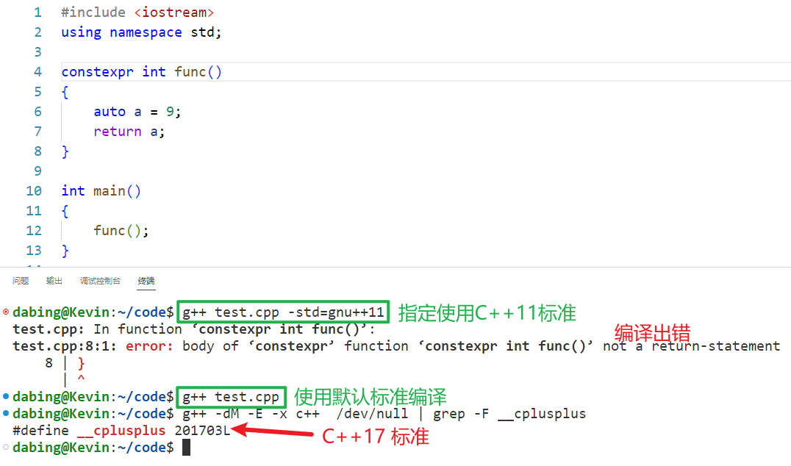
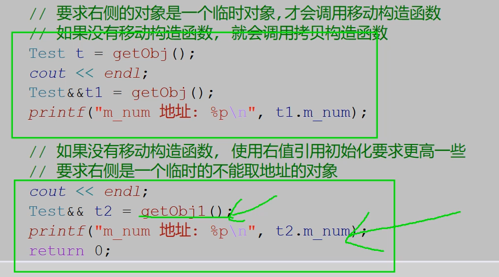

# C++11新特性

https://subingwen.cn/cplusplus/

## 1、原始字面量

字面量主要分为两大类：

- 数字类型：12、13.14
- 字符串类型："Hello world"、"abd\t" （包含转义）

如何我们要字符串按照原意输出，不进行转义，就需要使用原始字面量。

在C++11中添加了定义原始字符串的字面量，定义方式为：

```c++
R"xxx(原始字符串)xxx”
```

其中（）两边的字符串可以省略。在 R “xxx(raw string)xxx” 中，原始字符串必须用括号（）括起来，括号的前后可以加其他字符串，所加的字符串会被忽略，并且加的字符串必须在括号两边==同时出现==，否则会出现语法错误。

原始字面量 R 可以直接表示字符串的实际含义，而不需要额外对字符串做转义或连接等操作。


示例1：

```c++
string str = "D:\hello\world\test.text";	// \h和\w转义失败，对应的字符会原样输出
cout << str << endl;
string str1 = "D:\\hello\\world\\test.text";
cout << str1 << endl;
string str2 = R"(D:\hello\world\test.text)";
cout << str2 << endl;
```

输出结果：

```c++
D:helloworld    est.text
D:\hello\world\test.text
D:\hello\world\test.text
```

示例2：在C++11之前如果一个字符串分别写到了不同的行里边，需要加连接符，这种方式不仅繁琐，还破坏了表达式的原始含义，如果使用原始字面量就变得简单很多，很强直观，可读性强。

```c++
string str = "<html>\
        <head>\
        <title>\
        海贼王\
        </title>\
        </head>\
        <body>\
        <p>\
        我是要成为海贼王的男人!!!\
        </p>\
        </body>\
        </html>";
cout << str << endl;
    
string str = R"(<html>
        <head>
        <title>
        海贼王
        </title>
        </head>
        <body>
        <p>
        我是要成为海贼王的男人!!!
        </p>
        </body>
        </html>)";
cout << str << endl;
```


## 2、指针空值类型 nullptr

在C++程序开发中，为了提高程序的健壮性，一般会在定义指针的同时完成初始化操作，或者在指针的指向尚未明确的情况下，都会给指针初始化为NULL，避免产生野指针（没有明确指向的指针，操作也这种指针极可能导致程序发生异常）。C++98/03 标准中，将一个指针初始化为空指针的方式有 2 种：

```c++
char *ptr = 0;
char *ptr = NULL;
```

在底层源码中NULL这个宏是这样定义的:

```c++
#ifndef NULL
    #ifdef __cplusplus
        #define NULL 0
    #else
        #define NULL ((void *)0)
    #endif
#endif
```

也就是说如果源码是 C++ 程序，==NULL 就是 0==，如果是 C 程序 NULL 表示 (void*)0 。那么为什么要这样做呢？ 

是由于 C++ 中，void * 类型无法隐式转换为其他类型的指针，此时使用 0 代替 ((void *)0) ，用于解决空指针的问题。这个0（0x0000 0000）表示的就是虚拟地址空间中的0地址，这块地址是只读的。

C++ 中将 NULL 定义为字面常量 0，并不能保证在所有场景下都能很好的工作，比如，函数重载时，NULL 和 0 无法区分：

```c++
#include <iostream>
using namespace std;

void func(char *p)
{
    cout << "void func(char *p)" << endl;
}

void func(int p)
{
    cout << "void func(int p)" << endl;
}

int main()
{
    func(NULL);   // 想要调用重载函数 void func(char *p)
    func(250);    // 想要调用重载函数 void func(int p)

    return 0;
}
```

虽然调用 `func(NULL);` 最终链接到的还是 `void func(int p)` 和预期是不一样的，其实这个原因前边已经说的很明白了，**==在C++中NULL和0是等价的==**。

出于兼容性的考虑，C++11 标准并没有对 NULL 的宏定义做任何修改，而是另其炉灶，引入了一个新的关键字 `nullptr` 。`nullptr` 专用于初始化空类型指针，不同类型的指针变量都可以使用 `nullptr` 来初始化：

```c++
int*    ptr1 = nullptr;
char*   ptr2 = nullptr;
double* ptr3 = nullptr;
```

对应上面的代码编译器会分别将 `nullptr` 隐式转换成 `int*`、`char*` 以及 `double*` 指针类型。

使用nullptr可以很完美的解决上边提到的函数重载问题:

```c++
func(nullptr);
func(250);
```

结果：

```c++
void func(char *p)
void func(int p)
```

通过输出的结果可以看出，`nullptr` 无法隐式转换为整形，但是可以隐式匹配指针类型。在 C++11 标准下，相比 NULL 和 0，使用 `nullptr` 初始化空指针可以令我们编写的程序更加健壮。


## 3、constexpr 修饰常量表达式

### 3.1 const

在C++11之前只有const关键字，从功能上来说这个关键字有双重语义：变量只读，修饰常量，举一个简单的例子：

```c++
void func(const int num)
{
    const int count = 24;
    int array[num];            // error，num是一个只读变量，不是常量
    int array1[count];         // ok，count是一个常量

    int a1 = 520;
    int a2 = 250;
    const int& b = a1;
    b = a2;                         // error
    a1 = 1314;
    cout << "b: " << b << endl;     // 输出结果为1314
}
```

- 函数 `void func(const int num)` 的参数 `num` 表示这个变量是只读的，但不是常量，因此使用 `int array[num]; ` 这种方式定义一个数组，编译器是会报错的，提示 `num` 不可用作为常量来使用。
- `const int count = 24;` 中的 `count` 却是一个常量，因此可以使用这个常量来定义一个静态数组。

另外，变量只读并不等价于常量，二者是两个概念不能混为一谈，分析一下这句测试代码 `const int& b = a1;` ：

- b是一个常量的引用，所以b引用的变量是不能被修改的，也就是说b = a2; 这句代码语法是错误的。

- 在const对于变量a1是没有任何约束的，a1的值变了b的值也就变了

- 引用b是只读的，但是并不能保证它的值是不可改变的，也就是说它不是常量。

### 3.2 constexpr

在C++11中添加了一个新的关键字 `constexpr`，这个关键字是用来修饰常量表达式的。所谓常量表达式，指的就是由多个（≥1）常量（值不会改变）组成并且在编译过程中就得到计算结果的表达式。

C++ 程序从编写完毕到执行分为四个阶段：预处理、 编译、汇编和链接4个阶段，得到可执行程序之后就可以运行了。

**需要额外强调的是，常量表达式和非常量表达式的计算时机不同，非常量表达式只能在程序运行阶段计算出结果，但是常量表达式的计算往往发生在程序的编译阶段，这可以极大提高程序的执行效率，因为表达式只需要在编译阶段计算一次，节省了每次程序运行时都需要计算一次的时间。**

那么问题来了，编译器如何识别表达式是不是常量表达式呢？在C++11中添加了 `constexpr` 关键字之后就可以在程序中使用它来修饰常量表达式，用来提高程序的执行效率。在使用中建议将 `const` 和 `constexpr` 的功能区分开，即**凡是表达“只读”语义的场景都使用 `const`，表达“常量”语义的场景都使用 `constexpr`。**

在定义常量时，const 和 constexpr 是等价的，都可以在程序的编译阶段计算出结果，例如：

```c++
const int m = f();  // 不是常量表达式，m的值只有在运行时才会获取。
const int i=520;    // 是一个常量表达式
const int j=i+1;    // 是一个常量表达式

constexpr int i=520;    // 是一个常量表达式
constexpr int j=i+1;    // 是一个常量表达式
```

对于 C++ 内置类型的数据，可以直接用 `constexpr` 修饰，但如果是自定义的数据类型（用 `struct` 或者 `class` 实现），直接用 `constexpr` 修饰是不行的。

```c++
// 此处的constexpr修饰是无效的
constexpr struct Test
{
    int id;
    int num;
};
```

如果要定义一个结构体/类常量对象，可以这样写：

```c++
struct Test
{
    int id;
    int num;
};

int main()
{
    constexpr Test t{ 1, 2 };
    constexpr int id = t.id;
    constexpr int num = t.num;
    // error，不能修改常量
    t.num += 100;
    cout << "id: " << id << ", num: " << num << endl;

    return 0;
}
```


## 4、常量表达式函数

为了提高 C++ 程序的执行效率，我们可以将程序中值不需要发生变化的变量定义为常量，也可以使用`constexpr` 修饰函数的返回值，这种函数被称作 `常量表达式函数`，这些函数主要包括以下几种：**普通函数/类成员函数、类的构造函数、模板函数。**

### 4.1 修饰函数

> 温馨提示：由于现在编译器版本都比较高，默认的使用的C++标准也比较高（大于C++11），相关源代码请基于 C++11 标准进行测试。

`constexpr` 并不能修改任意函数的返回值，使这些函数成为常量表达式函数，必须要满足以下几个条件：

1. 函数必须要有返回值，并且return 返回的表达式必须是常量表达式。

    ```c++
    // error，无返回值，不是常量表达式函数
    constexpr void func1()
    {
        int a = 100;
        cout << "a: " << a << endl;
    }
    
    // error，返回的不是常量，不是常量表达式函数
    constexpr int func1()
    {
        int a = 100;
        return a;
    }
    ```

    

    由此可见在更新的 C++ 标准里边放宽了对 `constexpr` 的语法限制。

2. 函数在使用之前，必须有对应的定义语句。

    ```c++
    #include <iostream>
    using namespace std;
    
    constexpr int func1();
    int main()
    {
        constexpr int num = func1();	// error
        return 0;
    }
    
    constexpr int func1()
    {
        constexpr int a = 100;
        return a;
    }
    ```

    还没有定义 `func1()` 就直接调用了，应该将 `func1()` 函数的定义放到 `main()` 函数的上边。

3. 整个函数的函数体中，不能出现非常量表达式之外的语句（using 指令、typedef 语句以及 static_assert 断言、return语句除外）

    ```c++
    // error
    constexpr int func1()
    {
        constexpr int a = 100;
        constexpr int b = 10;
        for (int i = 0; i < b; ++i)
        {
            cout << "i: " << i << endl;
        }
        return a + b;
    }
    
    // ok
    constexpr int func2()
    {
        using mytype = int;
        constexpr mytype a = 100;
        constexpr mytype b = 10;
        constexpr mytype c = a * b;
        return c - (a + b);
    }
    ```

    因为 `func1()` 是一个常量表达式函数，在函数体内部是不允许出现非常量表达式以外的操作，因此函数体内部的 `for` 循环是一个非法操作。

> 以上三条规则不仅对应普通函数适用，对应类的成员函数也是适用的
>

### 4.2 修饰模板函数

C++11 语法中，`constexpr` 可以修饰函数模板，但由于模板中类型的不确定性，因此函数模板实例化后的模板函数是否符合常量表达式函数的要求也是不确定的。**如果 `constexpr` 修饰的模板函数实例化结果不满足常量表达式函数的要求，则 `constexpr` 会被自动忽略，即该函数就等同于一个普通函数。**

```c++
#include <iostream>
using namespace std;

struct Person {
    const char* name;
    int age;
};

// 定义函数模板
template<typename T>
constexpr T dispaly(T t) {
    return t;
}

int main()
{
    struct Person p { "luffy", 19 };
    //普通函数
    struct Person ret = dispaly(p);
    cout << "luffy's name: " << ret.name << ", age: " << ret.age << endl;

    //常量表达式函数
    constexpr int ret1 = dispaly(250);
    cout << ret1 << endl;

    constexpr struct Person p1 { "luffy", 19 };
    constexpr struct Person p2 = dispaly(p1);
    cout << "luffy's name: " << p2.name << ", age: " << p2.age << endl;
    return 0;
}
```


### 4.3 修饰构造函数

如果想要直接得到一个常量对象，也可以使用 `constexpr` 修饰一个构造函数，这样就可以得到一个常量构造函数了。常量构造函数有一个要求：**构造函数的函数体必须为空，并且必须采用初始化列表的方式为各个成员赋值。**

```c++
#include <iostream>
using namespace std;

struct Person {
    constexpr Person(const char* p, int age) :name(p), age(age)
    {
    }
    const char* name;
    int age;
};

int main()
{
    constexpr struct Person p1("luffy", 19);
    cout << "luffy's name: " << p1.name << ", age: " << p1.age << endl;
    return 0;
}
```


## 5、自动类型推导

在C++11中增加了很多新的特性，比如可以使用auto自动推导变量的类型，还能够结合decltype来表示函数的返回值。使用新的特性可以让我们写出更加简洁，更加现代的代码。

### 5.1 auto

在 C++11 之前 `auto` 和 `static` 是对应的，表示变量是自动存储的，但是非 `static` 的局部变量默认都是自动存储的，因此这个关键字变得非常鸡肋，在 C++11 中他们赋予了新的含义，使用这个关键字能够像别的语言一样自动推导出变量的实际类型。

推导规则:

C++11中auto并不代表一种实际的数据类型，只是一个类型声明的 “占位符”，auto并不是万能的在任意场景下都能够推导出变量的实际类型，**使用auto声明的变量必须要进行初始化，以让编译器推导出它的实际类型，在编译时将auto占位符替换为真正的类型。**使用语法如下：

```c++
auto 变量名 = 变量值;
```

根据上述语法，来列举一些简单的例子：

```c++
auto x = 3.14;      // x 是浮点型 double
auto y = 520;       // y 是整形 int
auto z = 'a';       // z 是字符型 char
auto nb;            // error，变量必须要初始化
auto double nbl;    // 语法错误, 不能修改数据类型   
```

不仅如此，auto还可以和指针、引用结合起来使用也可以带上const、volatile限定符，在不同的场景下有对应的推导规则，规则内容如下：

- <font color="red">当变量不是指针或者引用类型时，推导的结果中不会保留const、volatile关键字</font>
- <font color="red">当变量是指针或者引用类型时，推导的结果中会保留const、volatile关键字</font>

先来看一组变量带指针和引用并使用auto进行类型推导的例子：

```c++
int temp = 110;
auto *a = &temp;	
auto b = &temp;		
auto &c = temp;		
auto d = temp;	
```

- 变量 `a` 的数据类型为 `int*`，因此 `auto` 关键字被推导为 `int` 类型
- 变量 `b` 的数据类型为 `int*`，因此 `auto` 关键字被推导为 `int*` 类型
- 变量 `c` 的数据类型为 `int&`，因此 `auto` 关键字被推导为 `int` 类型
- 变量 `d` 的数据类型为 `int`，因此 `auto` 关键字被推导为 `int` 类型

在来看一组带const限定的变量，使用auto进行类型推导的例子:

```c++
int tmp = 250;
const auto a1 = tmp;
auto a2 = a1;
const auto &a3 = tmp;
auto &a4 = a3;
```

- 变量 `a1` 的数据类型为 `const int`，因此 `auto` 关键字被推导为 `int` 类型
    变量 `a2` 的数据类型为 `int`，但是 `a2` 没有声明为指针或引用因此 `const` 属性被去掉, `auto` 被推导为 `int`
    变量 `a3` 的数据类型为 `const int&`，`a3` 被声明为引用因此 `const` 属性被保留，`auto` 关键字被推导为 `int` 类型
    变量 `a4` 的数据类型为 `const int&`，`a4` 被声明为引用因此 `const` 属性被保留，`auto` 关键字被推导为 `const int` 类型

### 5.2 auto的限制

auto关键字并不是万能的，在以下这些场景中是不能完成类型推导的：

1. 不能作为函数参数使用。因为只有在函数调用的时候才会给函数参数传递实参，auto要求必须要给修饰的变量赋值，因此二者矛盾。

    ```c++
    int func(auto a, auto b)	// error
    {	
        cout << "a: " << a <<", b: " << b << endl;
    }
    ```

2. 不能用于类的非静态成员变量的初始化

    ```c++
    class Test
    {
        auto v1 = 0;                    // error
        static auto v2 = 0;             // error,类的静态非常量成员不允许在类内部直接初始化
        static const auto v3 = 10;      // ok
    }
    ```

3. 不能使用auto关键字定义数组

    ```c++
    int func()
    {
        int array[] = {1,2,3,4,5};  // 定义数组
        auto t1 = array;            // ok, t1被推导为 int* 类型
        auto t2[] = array;          // error, auto无法定义数组
        auto t3[] = {1,2,3,4,5};;   // error, auto无法定义数组
    }
    ```

4. 无法使用auto推导出模板参数

    ```c++
    template <typename T>
    struct Test{}
    
    int func()
    {
        Test<double> t;
        Test<auto> t1 = t;           // error, 无法推导出模板类型
        return 0;
    }
    ```

### 5.3 auto的应用

了解了auto的限制之后，我们就可以避开这些场景快乐的编程了，下面列举几个比较常用的场景：

1. 用于STL的容器遍历。

    在C++11之前，定义了一个stl容器之后，遍历的时候常常会写出这样的代码：

    ```c++
    #include <map>
    int main()
    {
        map<int, string> person;
        map<int, string>::iterator it = person.begin();
        for (; it != person.end(); ++it)
        {
            // do something
        }
        return 0;
    }
    ```

    可以看到在定义迭代器变量 it 的时候代码是很长的，写起来就很麻烦，使用了auto之后，就变得清爽了不少：

    ```c++
    #include <map>
    int main()
    {
        map<int, string> person;
        // 代码简化
        for (auto it = person.begin(); it != person.end(); ++it)
        {
            // do something
        }
        return 0;
    }
    ```

2. 用于泛型编程，在使用模板的时候，很多情况下我们不知道变量应该定义为什么类型，比如下面的代码：

    ```c++
    #include <iostream>
    #include <string>
    using namespace std;
    
    class T1
    {
    public:
        static int get()
        {
            return 10;
        }
    };
    
    class T2
    {
    public:
        static string get()
        {
            return "hello, world";
        }
    };
    
    template <class A>
    void func(void)
    {
        auto val = A::get();
        cout << "val: " << val << endl;
    }
    
    int main()
    {
        func<T1>();
        func<T2>();
        return 0;
    }
    ```

    

### 5.4 decltype

在某些情况下，不需要或者不能定义变量，但是希望得到某种类型，这时候就可以使用C++11提供的decltype关键字了，它的作用是在编译器编译的时候推导出一个表达式的类型，语法格式如下：

```c++
decltype (表达式)
```

decltype 是“declare type”的缩写，意思是“声明类型”。decltype的推导是在编译期完成的，它只是用于表达式类型的推导，**并不会计算表达式的值**。来看一组简单的例子：

```c++
int a = 10;
decltype(a) b = 99;                 // b -> int
decltype(a+3.14) c = 52.13;         // c -> double
decltype(a+b*c) d = 520.1314;       // d -> double
```

可以看到decltype推导的表达式可简单可复杂，在这一点上auto是做不到的，auto只能推导已初始化的变量类型。

推导规则：

1. <font color='red'>表达式为普通变量或者普通表达式或者类表达式，在这种情况下，使用decltype推导出的类型和表达式的类型是一致的。</font>

    ```c++
    class Test
    {
    public:
        string text;
        static const int value = 110;
    };
    
    int main()
    {
        int x = 99;
        const int &y = x;
        decltype(x) a = x;
        decltype(y) b = x;
        decltype(Test::value) c = 0;
    
        Test t;
        decltype(t.text) d = "hello, world";
    
        return 0;
    }
    ```

    - 变量`a`被推导为 `int`类型
    - 变量`b`被推导为 `const int &`类型
    - 变量`c`被推导为 `const int`类型
    - 变量`d`被推导为 `string`类型

2. <font color='red'>表达式是函数调用，使用decltype推导出的类型和函数返回值一致。</font>

    ```c++
    class Test{...};
    //函数声明
    int func_int();                 // 返回值为 int
    int& func_int_r();              // 返回值为 int&
    int&& func_int_rr();            // 返回值为 int&&
    
    const int func_cint();          // 返回值为 const int
    const int& func_cint_r();       // 返回值为 const int&
    const int&& func_cint_rr();     // 返回值为 const int&&
    
    const Test func_ctest();        // 返回值为 const Test
    
    //decltype类型推导
    int n = 100;
    decltype(func_int()) a = 0;		
    decltype(func_int_r()) b = n;	
    decltype(func_int_rr()) c = 0;	
    decltype(func_cint())  d = 0;	
    decltype(func_cint_r())  e = n;	
    decltype(func_cint_rr()) f = 0;	
    decltype(func_ctest()) g = Test();
    ```

    - 变量`a`被推导为 `int`类型
    - 变量`b`被推导为 `int&`类型
    - 变量`c`被推导为 `int&&`类型
    - 变量`d`被推导为 `int`类型
    - 变量`e`被推导为 `const int &`类型
    - 变量`f`被推导为 `const int &&`类型
    - 变量`g`被推导为 `const Test`类型

    函数 func_cint() 返回的是一个纯右值（在表达式执行结束后不再存在的数据，也就是临时性的数据），**对于纯右值而言，只有类类型可以携带const、volatile限定符，除此之外需要忽略掉这两个限定符，因此推导出的变量d的类型为 int 而不是 const int。**

3. <font color='red'>表达式是一个左值，或者被括号( )包围，使用 decltype推导出的是表达式类型的引用（如果有const、volatile限定符不能忽略）。</font>

    ```c++
    #include <iostream>
    #include <vector>
    using namespace std;
    
    class Test
    {
    public:
        int num;
    };
    
    int main() {
        const Test obj;
        //带有括号的表达式
        decltype(obj.num) a = 0;
        decltype((obj.num)) b = a;
        //加法表达式
        int n = 0, m = 0;
        decltype(n + m) c = 0;
        decltype(n = n + m) d = n;
        return 0;
    }
    ```

    - `obj.num` 为类的成员访问表达式，符合场景1，因此 a 的类型为 `int`
    - `obj.num` 带有括号，符合场景3，因此b 的类型为 `const int&`。
    - `n+m` 得到一个右值，符合场景1，因此c的类型为 `int`
    - `n=n+m` 得到一个左值 n，符合场景3，因此d的类型为 `int&`

    

### 5.5 decltype的应用

关于decltype的应用多出现在泛型编程中。比如我们编写一个类模板，在里边添加遍历容器的函数，操作如下：

```c++
#include <list>
using namespace std;

template <class T>
class Container
{
public:
    void func(T& c)
    {
        for (m_it = c.begin(); m_it != c.end(); ++m_it)
        {
            cout << *m_it << " ";
        }
        cout << endl;
    }
private:
    ??? m_it;  // 这里不能确定迭代器类型
};

int main()
{
    const list<int> lst;
    Container<const list<int>> obj;
    obj.func(lst);
    return 0;
}
```

在程序的第17行出了问题，关于迭代器变量一共有两种类型：只读`（T::const_iterator）`和读写`（T::iterator）`，有了 `decltype` 就可以完美的解决这个问题了，当 T 是一个 非 `const` 容器得到一个 `T::iterator`，当 T 是一个 `const `容器时就会得到一个 `T::const_iterator`。

```c++
#include <list>
#include <iostream>
using namespace std;

template <class T>
class Container
{
public:
    void func(T& c)
    {
        for (m_it = c.begin(); m_it != c.end(); ++m_it)
        {
            cout << *m_it << " ";
        }
        cout << endl;
    }
private:
    decltype(T().begin()) m_it;  // 这里不能确定迭代器类型
};

int main()
{
    const list<int> lst{ 1,2,3,4,5,6,7,8,9 };
    Container<const list<int>> obj;
    obj.func(lst);
    return 0;
}
```

`decltype(T().begin())` 这种写法在vs2017/vs2019下测试可用完美运行。


### 5.6 返回值类型后置

在泛型编程中，可能需要通过参数的运算来得到返回值的类型，比如下面这个场景：

```c++
#include <iostream>
using namespace std;
// R->返回值类型, T->参数1类型, U->参数2类型
template <typename R, typename T, typename U>
R add(T t, U u)
{
    return t + u;
}

int main()
{
    int x = 520;
    double y = 13.14;
    // auto z = add<decltype(x + y), int, double>(x, y);
    auto z = add<decltype(x + y)>(x, y);	// 简化之后的写法
    cout << "z: " << z << endl;
    return 0;
}
```

关于返回值，从上面的代码可以推断出和表达式 `t+u` 的结果类型是一样的，因此可以通过通过 `decltype` 进行推导，关于模板函数的参数 `t` 和 `u` 可以通过实参自动推导出来，因此在程序中就也可以不写。虽然通过上述方式问题被解决了，但是解决方案有点过于理想化，因为对于调用者来说，是不知道函数内部执行了什么样的处理动作的。

**在 C++11中增加了返回类型后置语法，说明白一点就是将 `decltype` 和 `auto` 结合起来完成返回类型的推导。**其语法格式如下:

```c++
// 符号 -> 后边跟随的是函数返回值的类型
auto func(参数1, 参数2, ...) -> decltype(参数表达式)
```

通过对上述返回类型后置语法代码的分析，得到结论：`auto 会追踪 decltype() 推导出的类型`，因此上边的 `add()` 函数可以做如下的修改：

```c++
#include <iostream>
using namespace std;

template <typename T, typename U>
// 返回类型后置语法
auto add(T t, U u) -> decltype(t+u) 
{
    return t + u;
}

int main()
{
    int x = 520;
    double y = 13.14;
    // auto z = add<int, double>(x, y);
    auto z = add(x, y);		// 简化之后的写法
    cout << "z: " << z << endl;
    return 0;
}
```


## 6、final 和 override

### 6.1 final

C++中增加了 `final` 关键字来限制某个类不能被继承，或者某个虚函数不能被重写，和 Java 的 `final`关键字的功能是类似的。**如果使用 `final` 修饰函数，只能修饰虚函数，并且要把final关键字放到类或者函数的后面。**

**修饰函数：**

如果使用final修饰函数，只能修饰虚函数，这样就能阻止子类重写父类的这个函数了：

```c++
class Base
{
public:
    virtual void test()
    {
        cout << "Base class...";
    }
};

class Child : public Base
{
public:
    void test() final
    {
        cout << "Child class...";
    }
};

class GrandChild : public Child
{
public:
    // 语法错误, 不允许重写
    void test()
    {
        cout << "GrandChild class...";
    }
};
```

`test()` 是基类中的一个虚函数，在子类中重写了这个方法，但是不希望孙子类中继续重写这个方法了，因此在子类中将 `test()` 方法标记为 `final`，孙子类中对这个方法就只有使用的份了。

**修饰类：**

使用 `final` 关键字修饰过的类是不允许被继承的，也就是说这个类不能有派生类。

```c++
class Base
{
public:
    virtual void test()
    {
        cout << "Base class...";
    }
};

class Child final: public Base
{
public:
    void test()
    {
        cout << "Child class...";
    }
};

// error, 语法错误
class GrandChild : public Child
{
public:
};
```

`Child` 类是被 `final` 修饰过的，因此 `Child` 类不允许有派生类 `GrandChild` 类的继承是非法的，`Child` 是个断子绝孙的类。


### 6.2 override

`override` 关键字确保在派生类中声明的重写函数与基类的虚函数有相同的签名，同时也**明确表明将会重写基类的虚函数**，这样就可以保证重写的虚函数的正确性，也提高了代码的可读性，和final一样这个关键字要写到方法的后面。使用方法如下：

```c++
class Base
{
public:
    virtual void test()
    {
        cout << "Base class...";
    }
};

class Child : public Base
{
public:
    void test() override
    {
        cout << "Child class...";
    }
};

class GrandChild : public Child
{
public:
    void test() override
    {
        cout << "Child class...";
    }
};
```

上述代码中第13行和第22行就是显示指定了要重写父类的 `test()` 方法，使用了 `override` 关键字之后，假设在重写过程中因为误操作，写错了函数名或者函数参数或者返回值编译器都会提示语法错误，提高了程序的正确性，降低了出错的概率。


## 7、模板的优化

### 7.1 模版的右尖括号

在泛型编程中，模板实例化有一个非常繁琐的地方，那就是连续的两个右尖括号（>>）会被编译器解析成右移操作符，而不是模板参数表的结束。

C++11改进了编译器的解析规则，尽可能地将多个右尖括号（>）解析成模板参数结束符，方便我们编写模板相关的代码。

### 7.2 默认模版参数

在C++98/03标准中，类模板可以有默认的模板参数。

但是不支持函数的默认模板参数，==在C++11中添加了对函数模板默认参数的支持==。

```c++
#include <iostream>
using namespace std;

template <typename T=int>	// C++98/03不支持这种写法, C++11中支持这种写法
void func(T t)
{
    cout << "current value: " << t << endl;
}

int main()
{
    func(100);
    return 0;
}
```

通过上面的例子可以得到如下结论：==当所有模板参数都有默认参数时，函数模板的调用如同一个普通函数。**但对于类模板而言，哪怕所有参数都有默认参数，在使用时也必须在模板名后跟随<>来实例化**。==

**另外：函数模板的默认模板参数在使用规则上和其他的默认参数也有一些不同，它没有必须写在参数表最后的限制。**这样当默认模板参数和模板参数自动推导结合起来时，书写就显得非常灵活了。

当默认模板参数和模板参数自动推导同时使用时（优先级从高到低）：

- ==如果可以推导出参数类型则使用推导出的类型==
- ==如果函数模板无法推导出参数类型，那么编译器会使用默认模板参数==
- ==如果无法推导出模板参数类型并且没有设置默认模板参数，编译器就会报错。==

```c++
#include <iostream>
#include <string>
using namespace std;

// 函数模板定义
template <typename T, typename U = char>
void func(T arg1 = 100, U arg2 = 100)
{
    cout << "arg1: " << arg1 << ", arg2: " << arg2 << endl;
}

int main()
{
    // 模板函数调用
    func('a');
    func(97, 'a');
    // func();    //编译报错
    return 0;
}
```

程序输出的结果为:

```c++
arg1: a, arg2: d
arg1: 97, arg2: a
```

分析一下调用的模板函数func()：

- `func('a')`：参数T被自动推导为 `char` 类型，U使用的默认模板参数为 `char` 类型
- `func(97, 'a');`：参数T被自动推导为 `int` 类型，U使用推导出的类型为 `char`
- `func();`：参数T没有指定默认模板类型，并且无法自动推导，编译器会直接报错
    - 模板参数类型的自动推导是根据模板函数调用时**指定的实参进行推断的，没有实参则无法推导**
    - 模板参数类型的自动推导**不会参考函数模板中指定的默认参数**


## 8、using的使用

在C++中using用于声明命名空间，使用命名空间也可以防止命名冲突。在程序中声明了命名空间之后，就可以直接使用命名空间中的定义的类了。在C++11中赋予了using新的功能，让C++变得更年轻，更灵活。

using 声明父类中被隐藏的函数，就可以通过子类调用父类中被隐藏的函数。

### 8.1 定义别名

在 C++中可以通过 typedef 重定义一个类型，语法格式如下：

```c++
typedef 旧的类型名 新的类型名;
// 使用举例
typedef unsigned int uint_t;
```

被重定义的类型并不是一个新的类型，仅仅只是原有的类型取了一个新的名字。

和以前的声明语句一样，这里的声明符也可以包含类型修饰，从而也能由基本数据类型构造出复合类型来。

C++11中规定了一种新的方法，使用别名声明(alias declaration)来定义类型的别名，即使用using。

在使用的时候，关键字using作为别名声明的开始，其后紧跟别名和等号，其作用是把等号左侧的名字规定成等号右侧类型的别名。

类型别名和类型的名字等价，只要是类型的名字能出现的地方，就能使用类型别名。**使用typedef定义的别名和使用using定义的别名在语义上是等效的。**

使用using定义别名的语法格式是这样的：

```c++
using 新的类型 = 旧的类型;
// 使用举例
using uint_t = int;
```

通过using和typedef的语法格式可以看到二者的使用没有太大的区别，假设我们定义一个函数指针，using的优势就能凸显出来了，看一下下面的例子：

```c++
// 使用typedef定义函数指针
typedef int(*func_ptr)(int, double);

// 使用using定义函数指针
using func_ptr1 = int(*)(int, double);
```

如果不是特别熟悉函数指针与 `typedef` ，第一眼很难看出 `func_ptr` 其实是一个别名，其本质是一个函数指针，指向的函数返回类型是`int`，函数参数有两个分别是 `int，double` 类型。

使用using定义函数指针别名的写法看起来就非常直观了，**把别名的名字强制分离到了左边，而把别名对应的实际类型放在了右边**，比较清晰，可读性比较好。


### 8.2 模板的别名

使用typedef重定义类似很方便，但是它有一点限制，比如无法重定义一个模板，比如我们需要一个固定以int类型为key的map，它可以和很多类型的value值进行映射，如果使用typedef这样直接定义就非常麻烦:

```c++
typedef map<int, string> m1;
typedef map<int, int> m2;
typedef map<int, double> m3;
```

在这种情况下我们就不自觉的想到了模板：

```c++
template <typename T>
typedef map<int, T> type;	// error, 语法错误
```

使用typename不支持给模板定义别名，这个简单的需求仅通过typedef很难办到，需要添加一个外敷类：

```c++
template <typename T>
// 定义外敷类
struct MyMap
{
    typedef map<int, T> type;
};

int main(void)
{
    MyMap<string>::type m;
    m.insert(make_pair(1, "luffy"));
    m.insert(make_pair(2, "ace"));

    MyMap<int>::type m1;
    m1.insert(1, 100);
    m1.insert(2, 200);

    return 0;
}
```

通过上边的例子可以直观的感觉到，需求简单但是实现起来并不容易。在C++11中，新增了一个特性就是可以通过使用using来为一个模板定义别名，对于上面的需求可以写成这样：

```c++
template <typename T>
using mymap = map<int, T>;
```

完整的示例代码如下:

```c++
#include <iostream>
#include <functional>
#include <map>
using namespace std;

template <typename T>
using mymap = map<int, T>;

int main(void)
{
    // map的value指定为string类型
    mymap<string> m;
    m.insert(make_pair(1, "luffy"));
    m.insert(make_pair(2, "ace"));

    // map的value指定为int类型
    mymap<int> m1;
    m1.insert(1, 100);
    m1.insert(2, 200);

    return 0;
}
```

最后在强调一点：using语法和typedef一样，并不会创建出新的类型，它们只是给某些类型定义了新的别名。==using相较于typedef的优势在于定义函数指针别名时看起来更加直观，并且可以给模板定义别名。==


## 9、委托构造和继承构造函数

### 9.1 委托构造函数

委托构造函数允许使用同一个类中的一个构造函数调用其它的构造函数，从而简化相关变量的初始化。下面举例说明：

```c++
#include <iostream>
using namespace std;

class Test
{
public:
    Test() {};
    Test(int max)
    {
        this->m_max = max > 0 ? max : 100;
    }

    Test(int max, int min)
    {
        this->m_max = max > 0 ? max : 100;              // 冗余代码
        this->m_min = min > 0 && min < max ? min : 1;   
    }

    Test(int max, int min, int mid)
    {
        this->m_max = max > 0 ? max : 100;             // 冗余代码
        this->m_min = min > 0 && min < max ? min : 1;  // 冗余代码
        this->m_middle = mid < max && mid > min ? mid : 50;
    }

    int m_min;
    int m_max;
    int m_middle;
};

int main()
{
    Test t(90, 30, 60);
    cout << "min: " << t.m_min << ", middle: " 
         << t.m_middle << ", max: " << t.m_max << endl;
    return 0;
}
```

在上面的程序中有三个构造函数，但是这三个函数中都有重复的代码，在C++11之前构造函数是不能调用构造函数的，加入了委托构造之后，我们就可以轻松地完成代码的优化了：

```c++
#include <iostream>
using namespace std;

class Test
{
public:
    Test() {};
    Test(int max)
    {
        this->m_max = max > 0 ? max : 100;
    }

    Test(int max, int min):Test(max)
    {
        this->m_min = min > 0 && min < max ? min : 1;
    }

    Test(int max, int min, int mid):Test(max, min)
    {
        this->m_middle = mid < max && mid > min ? mid : 50;
    }

    int m_min;
    int m_max;
    int m_middle;
};

int main()
{
    Test t(90, 30, 60);
    cout << "min: " << t.m_min << ", middle: " 
         << t.m_middle << ", max: " << t.m_max << endl;
    return 0;
}
```

在修改之后的代码中可以看到，重复的代码全部没有了，并且在一个构造函数中调用了其他的构造函数用于相关数据的初始化，相当于是一个链式调用。在使用委托构造函数的时候还需要注意一些几个问题：

- ==这种链式的构造函数调用不能形成一个闭环（死循环），否则会在运行期抛异常。==

- ==如果要进行多层构造函数的链式调用，建议将构造函数的调用的写在初始列表中而不是函数体内部，否则编译器会提示形参的重复定义。==

- 在初始化列表中调用了代理构造函数初始化某个类成员变量之后，就不能在初始化列表中再次初始化这个变量了。

    ```c++
    // 错误, 使用了委托构造函数就不能再次m_max初始化了
    Test(int max, int min) : Test(max), m_max(max)
    {
        this->m_min = min > 0 && min < max ? min : 1;
    }
    ```

    

### 9.2 继承构造函数

C++11中提供的继承构造函数可以让派生类直接使用基类的构造函数，而无需自己再写构造函数，尤其是在基类有很多构造函数的情况下，可以极大地简化派生类构造函数的编写。先来看没有继承构造函数之前的处理方式：

```c++
class Base
{
public:
    Base(int i) :m_i(i) {}
    Base(int i, double j) :m_i(i), m_j(j) {}
    Base(int i, double j, string k) :m_i(i), m_j(j), m_k(k) {}

    int m_i;
    double m_j;
    string m_k;
};

class Child : public Base
{
public:
    Child(int i) :Base(i) {}
    Child(int i, double j) :Base(i, j) {}
    Child(int i, double j, string k) :Base(i, j, k) {}
};

int main()
{
    Child c(520, 13.14, "i love you");
    cout << "int: " << c.m_i << ", double: " 
         << c.m_j << ", string: " << c.m_k << endl;
    return 0;
}
```

通过测试代码可以看出，在子类中初始化从基类继承的类成员，需要在子类中重新定义和基类一致的构造函数，这是非常繁琐的，C++11中通过添加继承构造函数这个新特性完美的解决了这个问题，使得代码更加精简。

继承构造函数的使用方法是这样的：通过使用 `using 类名::构造函数名`（其实类名和构造函数名是一样的）来声明使用基类的构造函数，这样子类中就可以不定义相同的构造函数了，直接使用基类的构造函数来构造派生类对象。

```c++
#include <iostream>
#include <string>
using namespace std;

class Base
{
public:
    Base(int i) :m_i(i) {}
    Base(int i, double j) :m_i(i), m_j(j) {}
    Base(int i, double j, string k) :m_i(i), m_j(j), m_k(k) {}

    int m_i;
    double m_j;
    string m_k;
};

class Child : public Base
{
public:
    using Base::Base;
};

int main()
{
    Child c1(520, 13.14);
    cout << "int: " << c1.m_i << ", double: " << c1.m_j << endl;
    Child c2(520, 13.14, "i love you");
    cout << "int: " << c2.m_i << ", double: " 
         << c2.m_j << ", string: " << c2.m_k << endl;
    return 0;
}
```

在修改之后的子类中，没有添加任何构造函数，而是添加了 `using Base::Base;` 这样就可以在子类中直接继承父类的所有的构造函数，通过他们去构造子类对象了。

另外如果在子类中隐藏了父类中的同名函数，也可以通过using的方式在子类中使用基类中的这些父类函数：

```c++
class Base
{
public:
    Base(int i) :m_i(i) {}
    Base(int i, double j) :m_i(i), m_j(j) {}
    Base(int i, double j, string k) :m_i(i), m_j(j), m_k(k) {}

    void func(int i)
    {
        cout << "base class: i = " << i << endl;
    }
    
    void func(int i, string str)
    {
        cout << "base class: i = " << i << ", str = " << str << endl;
    }

    int m_i;
    double m_j;
    string m_k;
};

class Child : public Base
{
public:
    using Base::Base;
    using Base::func;
    void func()
    {
        cout << "child class: i'am luffy!!!" << endl;
    }
};

int main()
{
    Child c(250);
    c.func();
    c.func(19);
    c.func(19, "luffy");
    return 0;
}
```


## 10、列表初始化

关于C++中的变量，数组，对象等都有不同的初始化方法，在这些繁琐的初始化方法中没有任何一种方式适用于所有的情况。为了统一初始化方式，并且让初始化行为具有确定的效果，在C++11中提出了列表初始化的概念。

### 10.1 统一的初始化

在C++98/03中，对应普通数组和可以直接进行内存拷贝（memcpy()）的对象是可以使用列表初始化来初始化数据的

```c++
// 数组的初始化
int array[] = { 1,3,5,7,9 };
double array1[3] = { 1.2, 1.3, 1.4 };

// 对象的初始化
struct Person
{
    int id;
    double salary;
}zhang3{ 1, 3000 };
```

在C++11中，列表初始化变得更加灵活了，来看一下下面这段初始化类对象的代码：

```c++
#include <iostream>
using namespace std;

class Test
{
public:
    Test(int) {}
private:
    Test(const Test &);
};

int main(void)
{
    Test t1(520);
    Test t2 = 520; 
    Test t3 = { 520 };
    Test t4{ 520 };
    int a1 = { 1314 };
    int a2{ 1314 };
    int arr1[] = { 1, 2, 3 };
    int arr2[]{ 1, 2, 3 };
    return 0;
}
```

具体地来解读一下上面代码中使用的各种初始化方式：

- t1：最中规中矩的初始化方式，通过提供的带参构造进行对象的初始化

- t2：语法错误，因为提供的拷贝构造函数是私有的。如果拷贝构造函数是公共的，520会通过隐式类型转换被 `Test(int)` 构造成一个匿名对象，然后再通过对这个匿名对象进行拷贝构造得到 `t2`（这个错误在VS中不会出现，在Linux中使用g++编译会提示描述的这个错误）
- t3 和 t4：使用了C++11的初始化方式来初始化对象，效果和 t1 的方式是相同的。
    - 在初始时，{}前面的等号是否书写对初始化行为没有任何影响。
    - t3虽然使用了等号，但是它仍然是列表初始化，因此私有的拷贝构造对它没有任何影响。
- t1、arr1和t2、arr2：这两个是基础数据类型的列表初始化方式，可以看到，和对象的初始化方式是统一的。
- t4、a2、arr2的写法，是C++11中新添加的语法格式，==使用这种方式可以直接在变量名后边跟上初始化列表，来进行变量或者对象的初始化。==

既然使用列表初始化可以对普通类型以及对象进行直接初始化，那么在使用 new 操作符创建新对象的时候可以使用列表初始化进行对象的初始化

```c++
int * p = new int{520};
double b = double{52.134};
int * array = new int[3]{1,2,3};
```

除此之外，列表初始化还可以直接用在函数返回值上：

```c++
class Person
{
public:
    Person(int id, string name)
    {
        cout << "id: " << id << ", name: " << name << endl;
    }
};

Person func()
{
    return { 9527, "华安" };
}

int main(void)
{
    Person p = func();
    return 0;
}
```

代码中的 `return { 9527, "华安" };` 就相当于 `return (9527, "华安" );` ，直接返回了一个匿名对象。通过上面的几个例子可以看出在C++11使用列表初始化是非常便利的，它统一了各种对象的初始化方式，而且还让代码的书写更加简单清晰。


### 10.2 聚合体

在C++11中，列表初始化的使用范围被大大增强了，但是一些模糊的概念也随之而来，在前面的例子可以得知，列表初始化可以用于自定义类型的初始化，但是对于一个自定义类型，列表初始化可能有两种执行结果：

```c++
struct T1
{
    int x;
    int y;
}a = { 123, 321 };

struct T2
{
    int x;
    int y;
    T2(int, int) : x(10), y(20) {}
}b = { 123, 321 };

int main(void)
{
    cout << "a.x: " << a.x << ", a.y: " << a.y << endl;
    cout << "b.x: " << b.x << ", b.y: " << b.y << endl;
    return 0;
}
```

程序执行的结果是这样的:

```c++
a.x: 123, a.y: 321
b.x: 10, b.y: 20
```

在上边的程序中都是用列表初始化的方式对对象进行了初始化，但是得到结果却不同，对象b并没有被初始化列表中的数据初始化，这是为什么呢？

- 对象a是对一个自定义的聚合类型进行初始化，它将以拷贝的形式使用初始化列表中的数据来初始化T1结构体中的成员。
- 在结构体T2中自定义了一个构造函数，因此实际的初始化是通过这个构造函数完成的。

==因为如果使用列表初始化对对象初始化时，还需要判断这个对象对应的类型是不是一个聚合体，如果是初始化列表中的数据就会拷贝到对象中。==

那么，使用列表初始化时，对于什么样的类型C++会认为它是一个聚合体呢？

- 普通数组本身可以看做是一个聚合类型
- 满足以下条件的类（class、struct、union）可以被看做是一个聚合类型:
    - 无用户自定义的构造函数。
    - 无私有或保护的非静态数据成员。
    - 无基类。
    - 无虚函数。
    - 类中不能有使用{}和=直接初始化的非静态数据成员（从c++14开始就支持了）。

### 10.3 非聚合体

对于聚合类型的类可以直接使用列表初始化进行对象的初始化，如果不满足聚合条件还想使用列表初始化其实也是可以的，需要在类的内部自定义一个构造函数, 在构造函数中使用初始化列表对类成员变量进行初始化:

```c++
struct T1
{
    int x;
    double y;
    // 在构造函数中使用初始化列表初始化类成员
    T1(int a, double b, int c) : x(a), y(b), z(c){}
    virtual void print()
    {
        cout << "x: " << x << ", y: " << y << ", z: " << z << endl;
    }
private:
    int z;
};

int main(void)
{
    T1 t{ 520, 13.14, 1314 };	// ok, 基于构造函数使用初始化列表初始化类成员
    t.print();
    return 0;
}
```

另外，需要额外注意的是聚合类型的定义并非递归的，也就是说当一个类的非静态成员是非聚合类型时，这个类也可能是聚合类型，比如下面的这个例子：

```c++
struct T1
{
    int x;
    double y;
private:
    int z;
};

struct T2
{
    T1 t1;
    long x1;
    double y1;
};

int main(void)
{
    T2 t2{ {}, 520, 13.14 };
    return 0;
}
```

可以看到，T1并非一个聚合类型，因为它有一个Private的非静态成员。但是尽管T2有一个非聚合类型的非静态成员t1，T2依然是一个聚合类型，可以直接使用列表初始化的方式进行初始化。

最后强调一下t2对象的初始化过程，对于非聚合类型的成员t1做初始化的时候，可以直接写一对空的大括号{}，这相当于调用是T1的无参构造函数。

> 对于一个聚合类型，使用列表初始化相当于对其中的每个元素分别赋值，而对于非聚合类型，则需要先自定义一个合适的构造函数，此时使用列表初始化将会调用它对应的构造函数。


### 10.4 std::initializer_list

在C++的STL容器中，可以进行任意长度的数据的初始化，使用初始化列表也只能进行固定参数的初始化，如果想要做到和STL一样有任意长度初始化的能力，可以使用 `std::initializer_list` 这个轻量级的类模板来实现。

先来介绍一下这个类模板的一些特点：

- 它是一个轻量级的容器类型，内部定义了迭代器 `iterator` 等容器必须的概念，遍历时得到的迭代器是只读的。
- 对于 `std::initializer_list<T>` 而言，它可以接收任意长度的初始化列表，但是要求元素必须是同种类型T
- 在 `std::initializer_list` 内部有三个成员接口：`size(), begin(), end()`。
- `std::initializer_list` 对象只能被整体初始化或者赋值。

==**作为普通函数参数:**==

如果想要自定义一个函数并且接收任意个数的参数（变参函数），只需要将函数参数指定为`std::initializer_list`，使用初始化列表{ }作为实参进行数据传递即可

```c++
void traversal(std::initializer_list<int> a)
{
    for (auto it = a.begin(); it != a.end(); ++it)
    {
        cout << *it << " ";
    }
    cout << endl;
}

int main(void)
{
    initializer_list<int> list;
    cout << "current list size: " << list.size() << endl;
    traversal(list);

    list = { 1,2,3,4,5,6,7,8,9,0 };
    cout << "current list size: " << list.size() << endl;
    traversal(list);
    cout << endl;
    
    list = { 1,3,5,7,9 };
    cout << "current list size: " << list.size() << endl;
    traversal(list);
    cout << endl;

    ////////////// 直接通过初始化列表传递数据 //////////////
    traversal({ 2, 4, 6, 8, 0 });
    cout << endl;

    traversal({ 11,12,13,14,15,16 });
    cout << endl;

    return 0;
}
```

`std::initializer_list` 拥有一个无参构造函数，因此，它可以直接定义实例，此时将得到一个空的`std::initializer_list`，因为在遍历这种类型的容器的时候得到的是一个只读的迭代器，因此我们不能修改里边的数据，只能通过值覆盖的方式进行容器内部数据的修改。

虽然如此，在效率方面也无需担心，`std::initializer_list` 的效率是非常高的，它的内部并不负责保存初始化列表中元素的拷贝，仅仅存储了初始化列表中元素的引用。

==**作为构造函数参数:**==

自定义的类如果在构造对象的时候想要接收任意个数的实参，可以给构造函数指定为 `std::initializer_list` 类型，在自定义类的内部还是使用容器来存储接收的多个实参。

```c++
class Test
{
public:
    Test(std::initializer_list<string> list)
    {
        for (auto it = list.begin(); it != list.end(); ++it)
        {
            cout << *it << " ";
            m_names.push_back(*it);
        }
        cout << endl;
    }
private:
    vector<string> m_names;
};

int main(void)
{
    Test t({ "jack", "lucy", "tom" });
    Test t1({ "hello", "world", "nihao", "shijie" });
    return 0;
}
```


## 11、基于范围的for循环

在C++98/03中，不同的容器和数组遍历的方式不尽相同，写法不统一，也不够简洁，而C++11基于范围的for循环可以以简洁、统一的方式来遍历容器和数组，用起来也更方便了。

### 11.1 for循环新语法

在介绍新语法之前，先来看一个使用迭代器遍历容器的例子：

```c++
#include <iostream>
#include <vector>
using namespace std;

int main()
{
    vector<int> t{ 1,2,3,4,5,6 };
    for (auto it = t.begin(); it != t.end(); ++it)
    {
        cout << *it << " ";
    }
    cout << endl;
    
    return 0;
}
```

我们在遍历的过程中需要给出容器的两端：开头（begin）和结尾（end），因为这种遍历方式不是基于范围来设计的。**在基于范围的for循环中，不需要再传递容器的两端，循环会自动以容器为范围展开，并且循环中也屏蔽掉了迭代器的遍历细节，直接抽取容器中的元素进行运算，使用这种方式进行循环遍历会让编码和维护变得更加简便。**

C++11基于范围的for循环，语法格式：

```c++
for (declaration : expression)
{
    // 循环体
}
```

在上面的语法格式中 `declaration` 表示遍历声明，在遍历过程中，当前被遍历到的元素会被存储到声明的变量中。`expression` 是要遍历的对象，它可以是表达式、容器、数组、初始化列表等。

```c++
int main(void)
{
    vector<int> t{ 1,2,3,4,5,6 };
    for (auto value : t)
    {
        cout << value << " ";
    }
    cout << endl;

    return 0;
}
```

在上面的例子中，是将容器中遍历的当前元素拷贝到了声明的变量value中，因此无法对容器中的元素进行写操作，**如果需要在遍历过程中修改元素的值，需要使用引用。**

```c++
vector<int> t{ 1,2,3,4,5,6 };
for (auto &value : t)
{
    cout << value++ << " ";
}
```

对容器的遍历过程中，如果只是读数据，不允许修改元素的值，可以使用const定义保存元素数据的变量，在定义的时候建议使用 `const auto &`，这样相对于 `const auto` 效率要更高一些。

```c++
vector<int> t{ 1,2,3,4,5,6 };
for (const auto& value : t)
{
    cout << value << " ";
}
```


### 11.2 使用细节

#### 关系型容器

使用基于范围的for循环有一些需要注意的细节，先来看一下对关系型容器map的遍历：

```c++
map<int, string> m{
    {1, "lucy"},{2, "lily"},{3, "tom"}
};

// 基于范围的for循环方式
for (auto& it : m)
{
    cout << "id: " << it.first << ", name: " << it.second << endl;
}

// 普通的for循环方式
for (auto it = m.begin(); it != m.end(); ++it)
{
    cout << "id: " << it->first << ", name: " << it->second << endl;
}
```

在上面的例子中使用两种方式对map进行了遍历，通过对比有两点需要注意的事项：

1. 使用普通的for循环方式（基于迭代器）遍历关联性容器， auto自动推导出的是一个迭代器类型，需要使用迭代器的方式取出元素中的键值对（和指针的操作方法相同）：
    - it->first
    - it->second
2. 使用基于范围的for循环遍历关联性容器，auto自动推导出的类型是容器中的 value_type，相当于一个对组（std::pair）对象，提取键值对的方式如下：
    - it.first
    - it.second

#### 元素只读

通过对基于范围的for循环语法的介绍可以得知，在for循环内部声明一个变量的引用就可以修改遍历的表达式中的元素的值，但是这并不适用于所有的情况，**对应`set`容器来说，内部元素都是只读的，这是由容器的特性决定的，因此在for循环中`auto&`会被视为`const auto & `。**

```c++
set<int> st{ 1,2,3,4,5,6 };
for (auto &item : st) 
{
    cout << item++ << endl;		// error, 不能给常量赋值
}
```

除此之外，在遍历关联型容器时也会出现同样的问题，基于范围的for循环中，虽然可以得到一个std::pair引用，但是**我们是不能修改里边的first值的，也就是key值。**

#### 访问次数

基于范围的for循环遍历的对象可以是一个表达式或者容器/数组等。假设我们对一个容器进行遍历，在遍历过程中for循环对这个容器的访问频率是一次还是多次呢？我们通过下面的例子验证一下：

```c++
#include <iostream>
#include <vector>
using namespace std;

vector<int> v{ 1,2,3,4,5,6 };
vector<int>& getRange()
{
    cout << "get vector range..." << endl;
    return v;
}

int main(void)
{
    for (auto val : getRange())
    {
        cout << val << " ";
    }
    cout << endl;

    return 0;
}
```

不论基于范围的for循环迭代了多少次，函数 `getRange()` 只在第一次迭代之前被调用，得到这个容器对象之后就不会再去重新获取这个对象了。

> 对应基于范围的for循环来说，冒号后边的表达式只会被执行一次。在得到遍历对象之后会先确定好迭代的范围，基于这个范围直接进行遍历。如果是普通的for循环，在每次迭代的时候都需要判断是否已经到了结束边界。


## 12、可调用对象包装器、绑定器

### 12.1 可调用对象

在C++中存在“可调用对象”这么一个概念。准确来说，可调用对象有如下几种定义：

- 是一个函数指针

    ```c++
    int print(int a, double b)
    {
        cout << a << b << endl;
        return 0;
    }
    // 定义函数指针
    int (*func)(int, double) = &print;
    ```

- 是一个具有operator()成员函数的类对象（仿函数）

    ```c++
    struct Test
    {
        // ()操作符重载
        void operator()(string msg)
        {
            cout << "msg: " << msg << endl;
        }
    };
    
    int main(void)
    {
        Test t;
        t("我是要成为海贼王的男人!!!");	// 仿函数
        return 0;
    }
    ```

- 是一个可被转换为函数指针的类对象

    ```c++
    using func_ptr = void(*)(int, string);
    struct Test
    {
        static void print(int a, string b)
        {
            cout << "name: " << b << ", age: " << a << endl;
        }
    
        // 将类对象转换为函数指针
        operator func_ptr()
        {
            return print;
        }
    };
    
    int main(void)
    {
        Test t;
        // 对象转换为函数指针, 并调用
        t(19, "Monkey D. Luffy");
    
        return 0;
    }
    ```

- 是一个类成员函数指针或者类成员指针

    ```c++
    struct Test
    {
        void print(int a, string b)
        {
            cout << "name: " << b << ", age: " << a << endl;
        }
        int m_num;
    };
    
    int main(void)
    {
        // 定义类成员函数指针指向类成员函数
        void (Test::*func_ptr)(int, string) = &Test::print;
        // 类成员指针指向类成员变量
        int Test::*obj_ptr = &Test::m_num;
    
        Test t;
        // 通过类成员函数指针调用类成员函数
        (t.*func_ptr)(19, "Monkey D. Luffy");
        // 通过类成员指针初始化类成员变量
        t.*obj_ptr = 1;
        cout << "number is: " << t.m_num << endl;
    
        return 0;
    }
    ```

    在上面的例子中满足条件的这些可调用对象对应的类型被统称为 `可调用类型`。C++中的可调用类型虽然具有比较统一的操作形式，但定义方式五花八门，这样在我们试图使用统一的方式保存，或者传递一个可调用对象时会十分繁琐。现在，C++11通过提供 `std::function` 和 `std::bind` 统一了可调用对象的各种操作。


​    

### 12.2 可调用对象包装器

`std::function` 是可调用对象的包装器。它是一个类模板，可以容纳除了类成员（函数）指针之外的所有可调用对象。通过指定它的模板参数，它可以用统一的方式处理函数、函数对象、函数指针，并允许保存和延迟执行它们。

基本用法：

`std::function` 必须要包含一个叫做 `functional` 的头文件，可调用对象包装器使用语法如下:

```c++
#include <functional>
std::function<返回值类型(参数类型列表)> diy_name = 可调用对象;
```

下面的实例代码中演示了可调用对象包装器的基本使用方法：

```c++
#include <iostream>
#include <functional>
using namespace std;

int add(int a, int b)
{
    cout << a << " + " << b << " = " << a + b << endl;
    return a + b;
}

class T1
{
public:
    static int sub(int a, int b)
    {
        cout << a << " - " << b << " = " << a - b << endl;
        return a - b;
    }
};

class T2
{
public:
    int operator()(int a, int b)
    {
        cout << a << " * " << b << " = " << a * b << endl;
        return a * b;
    }
};

int main(void)
{
    // 绑定一个普通函数
    function<int(int, int)> f1 = add;
    // 绑定以静态类成员函数
    function<int(int, int)> f2 = T1::sub;
    // 绑定一个仿函数
    T2 t;
    function<int(int, int)> f3 = t;

    // 函数调用
    f1(9, 3);
    f2(9, 3);
    f3(9, 3);

    return 0;
}
```

`std::function` 可以将可调用对象进行包装，得到一个统一的格式，包装完成得到的对象相当于一个函数指针，和函数指针的使用方式相同，通过包装器对象就可以完成对包装的函数的调用了。

**作为回调函数使用**

因为回调函数本身就是通过函数指针实现的，使用对象包装器可以取代函数指针的作用，来看一下下面的例子：

```c++
#include <iostream>
#include <functional>
using namespace std;

class A
{
public:
    // 构造函数参数是一个包装器对象
    A(const function<void()>& f) : callback(f)
    {
    }

    void notify()
    {
        callback(); // 调用通过构造函数得到的函数指针
    }
private:
    function<void()> callback;
};

class B
{
public:
    void operator()()
    {
        cout << "我是要成为海贼王的男人!!!" << endl;
    }
};
int main(void)
{
    B b;
    A a(b); // 仿函数通过包装器对象进行包装
    a.notify();

    return 0;
}
```

通过上面的例子可以看出，使用对象包装器 `std::function` 可以非常方便的将仿函数转换为一个函数指针，通过进行函数指针的传递，在其他函数的合适的位置就可以调用这个包装好的仿函数了。

另外，使用 `std::function` 作为函数的传入参数，可以将定义方式不相同的可调用对象进行统一的传递，这样大大增加了程序的灵活性。


### 12.3 绑定器

`std::bind` 用来将可调用对象与其参数一起进行绑定。绑定后的结果可以使用 `std::function` 进行保存，并延迟调用到任何我们需要的时候。通俗来讲，它主要有两大作用：

- **将可调用对象与其参数一起绑定成一个仿函数**。
- 将多元（参数个数为n，n>1）可调用对象转换为一元或者（n-1）元可调用对象，即只绑定部分参数。

绑定器函数使用语法格式如下：

```c++
// 绑定非类成员函数/变量
auto f = std::bind(可调用对象地址, 绑定的参数/占位符);
// 绑定类成员函/变量
auto f = std::bind(类函数/成员地址, 类实例对象地址, 绑定的参数/占位符);
```

下面来看一个关于绑定器的实际使用的例子：

```c++
#include <iostream>
#include <functional>
using namespace std;

void callFunc(int x, const function<void(int)>& f)
{
    if (x % 2 == 0)
    {
        f(x);
    }
}

void output(int x)
{
    cout << x << " ";
}

void output_add(int x)
{
    cout << x + 10 << " ";
}

int main(void)
{
    // 使用绑定器绑定可调用对象和参数
    auto f1 = bind(output, placeholders::_1);
    for (int i = 0; i < 10; ++i)
    {
        callFunc(i, f1);
    }
    cout << endl;

    auto f2 = bind(output_add, placeholders::_1);
    for (int i = 0; i < 10; ++i)
    {
        callFunc(i, f2);
    }
    cout << endl;

    return 0;
}
```

测试代码输出的结果:

```c++
0 2 4 6 8
10 12 14 16 18
```

在上面的程序中，使用了 `std::bind` 绑定器，在函数外部通过绑定不同的函数，控制了最后执行的结果。`std::bind` 绑定器返回的是一个**仿函数类型**，得到的返回值可以直接赋值给一个 `std::function`，在使用的时候我们并不需要关心绑定器的返回值类型，使用 `auto` 进行自动类型推导就可以了。

`placeholders::_1`是一个占位符，代表这个位置将在函数调用时被传入的第一个参数所替代。同样还有其他的占位符 `placeholders::_2`、`placeholders::_3`、`placeholders::_4`、`placeholders::_5`等……

有了占位符的概念之后，使得 `std::bind` 的使用变得非常灵活:

```c++
#include <iostream>
#include <functional>
using namespace std;

void output(int x, int y)
{
    cout << x << " " << y << endl;
}

int main(void)
{
    // 使用绑定器绑定可调用对象和参数, 并调用得到的仿函数
    bind(output, 1, 2)();
    bind(output, placeholders::_1, 2)(10);
    bind(output, 2, placeholders::_1)(10);

    // error, 调用时没有第二个参数
    // bind(output, 2, placeholders::_2)(10);
    // 调用时第一个参数10被吞掉了，没有被使用
    bind(output, 2, placeholders::_2)(10, 20);

    bind(output, placeholders::_1, placeholders::_2)(10, 20);
    bind(output, placeholders::_2, placeholders::_1)(10, 20);

    return 0;
}
```

通过测试可以看到，`std::bind` 可以直接绑定函数的所有参数，也可以仅绑定部分参数。在绑定部分参数的时候，通过使用 `std::placeholders` 来决定空位参数将会属于调用发生时的第几个参数。

可调用对象包装器 `std::function` 是不能实现对类成员函数指针或者类成员指针的包装的，但是通过绑定器 `std::bind` 的配合之后，就可以完美的解决这个问题了，再来看一个例子，然后再解释里边的细节：

```c++
#include <iostream>
#include <functional>
using namespace std;

class Test
{
public:
    void output(int x, int y)
    {
        cout << "x: " << x << ", y: " << y << endl;
    }
    int m_number = 100;
};

int main(void)
{
    Test t;
    // 绑定类成员函数
    function<void(int, int)> f1 = 
        bind(&Test::output, &t, placeholders::_1, placeholders::_2);
    // 绑定类成员变量(公共)
    function<int&(void)> f2 = bind(&Test::m_number, &t);

    // 调用
    f1(520, 1314);
    f2() = 2333;
    cout << "t.m_number: " << t.m_number << endl;

    return 0;
}
```

在用绑定器绑定类成员函数或者成员变量的时候==**需要将它们所属的实例对象一并传递到绑定器函数内部**==。f1的类型是 `function<void(int, int)>`，通过使用 `std::bind` 将 Test 的成员函数 output 的地址和对象 t 绑定，并转化为一个仿函数并存储到对象 f1 中。

使用绑定器绑定的类成员变量 `m_number` 得到的仿函数被存储到了类型为 `function<int&(void)>` 的包装器对象f2中，并且可以在需要的时候修改这个成员。其中 int 是绑定的类成员的类型，并且允许修改绑定的变量，因此需要指定为变量的引用，由于没有参数因此参数列表指定为 void 。

示例程序中是使用 `function` 包装器保存了 `bind` 返回的仿函数，如果不知道包装器的模板类型如何指定，可以直接使用 `auto` 进行类型的自动推导，这样使用起来会更容易一些。


## 13、Lambda表达式

lambda 表达式是 C++11 最重要也是最常用的特性之一，这是现代编程语言的一个特点，lambda 表达式有如下的一些优点：

- 声明式的编程风格：就地匿名定义目标函数或函数对象，不需要额外写一个命名函数或函数对象。
- 简洁：避免了代码膨胀和功能分散，让开发更加高效。
- 在需要的时间和地点实现功能闭包，使程序更加灵活。

**lambda表达式定义了一个匿名函数，并且可以捕获一定范围内的变量**。lambda表达式的语法形式简单归纳如下：

```c++
[capture](params) opt -> ret {body;};
```

其中 `capture` 是捕获列表，`params` 是参数列表，`opt` 是函数选项，`ret` 是返回值类型，`body` 是函数体。

1. 捕获列表[]: 捕获一定范围内的变量

2. 参数列表(): 和普通函数的参数列表一样，如果没有参数参数列表可以省略不写。

    ```c++
    auto f = [](){return 1;}	// 没有参数, 参数列表为空
    auto f = []{return 1;}		// 没有参数, 参数列表省略不写
    ```

3. opt 选项， ==不需要可以省略==

    - `mutable`: 可以修改==按值传递==进来的拷贝（注意是能修改拷贝，而不是值本身）
    - `exception`: 指定函数抛出的异常，如抛出整数类型的异常，可以使用 `throw()`;

4. 返回值类型：在C++11中，lambda表达式的返回值是通过返回值后置语法来定义的。

5. 函数体：函数的实现，这部分不能省略，但函数体可以为空。

### 13.1 捕获列表

lambda表达式的捕获列表可以捕获一定范围内的变量，具体使用方式如下：

- `[]` - 不捕捉任何变量
- `[&]` - 捕获外部作用域中所有变量, 并作为引用在函数体内使用 (==按引用捕获==)
- `[=]` - 捕获外部作用域中所有变量, 并作为副本在函数体内使用 (==按值捕获==)
    - ==拷贝的副本在匿名函数体内部是只读的==
- `[=, &foo]` - 按值捕获外部作用域中所有变量, 并按照引用捕获外部变量 foo
- `[bar]` - 按值捕获 bar 变量, 同时不捕获其他变量
- `[&bar]` - 按==引用捕获 bar 变量==, 同时不捕获其他变量
- `[this]` - 捕获当前类中的this指针
    - 让lambda表达式拥有和当前类成员函数同样的访问权限
    - ==如果已经使用了 & 或者 =, 默认添加此选项==

下面通过一个例子，看一下初始化列表的具体用法：

```c++
#include <iostream>
#include <functional>
using namespace std;

class Test
{
public:
    void output(int x, int y)
    {
        auto x1 = [] {return m_number; };                      // error
        auto x2 = [=] {return m_number + x + y; };             // ok
        auto x3 = [&] {return m_number + x + y; };             // ok
        auto x4 = [this] {return m_number; };                  // ok
        auto x5 = [this] {return m_number + x + y; };          // error
        auto x6 = [this, x, y] {return m_number + x + y; };    // ok
        auto x7 = [this] {return m_number++; };                // ok
    }
    int m_number = 100;
};
```

- x5：错误，捕获this指针，可访问类内部成员，没有捕获到变量x，y，因此不能访问。

```c++
int main(void)
{
    int a = 10, b = 20;
    auto f1 = [] {return a; };                        // error
    auto f2 = [&] {return a++; };                     // ok
    auto f3 = [=] {return a; };                       // ok
    auto f4 = [=] {return a++; };                     // error
    auto f5 = [a] {return a + b; };                   // error
    auto f6 = [a, &b] {return a + (b++); };           // ok
    auto f7 = [=, &b] {return a + (b++); };           // ok

    return 0;
}
```

- f2：正确，使用引用的方式捕获外部变量，可读写
- f4：错误，使用值拷贝的方式捕获外部变量，可读不能写

> 在匿名函数内部，需要通过lambda表达式的捕获列表控制如何捕获外部变量，以及访问哪些变量。默认状态下lambda表达式无法修改通过复制方式捕获外部变量，如果希望修改这些外部变量，需要通过引用的方式进行捕获。
>

可以通过 mutable 修改只读变量：

```c++
auto f4 = [=]() mutable {return a++; };                   
```


### 13.2 返回值

很多时候，lambda表达式的返回值是非常明显的，因此在C++11中允许省略lambda表达式的返回值。

```c++
// 完整的lambda表达式定义
auto f = [](int a) -> int
{
    return a+10;  
};

// 忽略返回值的lambda表达式定义
auto f = [](int a)
{
    return a+10;  
};
```

一般情况下，不指定 `lambda` 表达式的返回值，编译器会根据 `return` 语句自动推导返回值的类型，但需要注意的是`labmda` 表达式==不能通过列表初始化自动推导出返回值类型==。

```c++
// ok，可以自动推导出返回值类型
auto f = [](int i)
{
    return i;
}

// error，不能推导出返回值类型
auto f1 = []()
{
    return {1, 2};	// 基于列表初始化推导返回值，错误
}
```


### 13.3 函数本质

使用 `lambda` 表达式捕获列表捕获外部变量，如果希望去修改按值捕获的外部变量，那么应该如何处理呢？这就需要使用 `mutable` 选项，被 `mutable` 修改是 `lambda` 表达式就算没有参数也要写明参数列表，并且可以去掉按值捕获的外部变量的只读（const）属性。

```c++
int a = 0;
auto f1 = [=] {return a++; };              // error, 按值捕获外部变量, a是只读的
auto f2 = [=]() mutable {return a++; };     // ok
```

最后再剖析一下为什么通过值拷贝的方式捕获的外部变量是只读的:

1. `lambda` 表达式的类型在 C++11 中会被看做是一个带 `operator()` 的类，即仿函数。
2. 按照 C++ 标准，`lambda` 表达式的 `operator()` 默认是 `const` 的，一个 `const` 成员函数是无法修改成员变量值的。

`mutable` 选项的作用就在于取消 `operator()` 的 `const` 属性。

因为 `lambda` 表达式在 C++ 中会被看做是一个仿函数，因此可以使用 `std::function` 和 `std::bind` 来存储和操作 lambda 表达式：

```c++
#include <iostream>
#include <functional>
using namespace std;

int main(void)
{
    // 包装可调用函数
    std::function<int(int)> f1 = [](int a) {return a; };
    // 绑定可调用函数
    std::function<int(int)> f2 = bind([](int a) {return a; }, placeholders::_1);

    // 函数调用
    cout << f1(100) << endl;
    cout << f2(200) << endl;
    return 0;
}
```

**对于==没有捕获任何变量==的lambda表达式，还可以转换成一个普通的函数指针：**

```c++
using func_ptr = int(*)(int);
// 没有捕获任何外部变量的匿名函数
func_ptr f = [](int a)
{
    return a;  
};
// 函数调用
f(1314);
```


## 14、右值引用

### 14.1 右值

C++11 增加了一个新的类型，称为右值引用（ R-value reference），标记为 `&&`。在介绍右值引用类型之前先要了解什么是左值和右值：

- `lvalue` 是 `locator value` 的缩写，`rvalue` 是 `read value` 的缩写

- 左值是指 ==存储在内存中、有明确存储地址（**可取地址**）的数据；==

- 右值是指 ==可以提供数据值的数据（**不可取地址**）；==

通过描述可以看出，区分左值与右值的便捷方法是：可以对表达式取地址（&）就是左值，否则为右值 。**所有有名字的变量或对象都是左值，而右值是匿名的。**


C++11 中右值可以分为两种：一个是**将亡值**（ xvalue, expiring value），另一个则是**纯右值**（ prvalue, PureRvalue）：

- ==纯右值==：非引用返回的临时变量、运算表达式产生的临时变量、原始字面量和 lambda 表达式等
- ==将亡值==：与右值引用相关的表达式，比如，T&&类型函数的返回值、 std::move 的返回值等。

```c++
int value = 520;
```

在上面的语句中，value是左值，520是字面量也就是右值。其中value可以被引用，但是520就不行了，因为字面量都是右值。

### 14.2 右值引用

右值引用就是对一个右值进行引用的类型。因为右值是匿名的，所以我们只能通过引用的方式找到它。**无论声明左值引用还是右值引用都必须立即进行初始化，因为引用类型本身并不拥有所绑定对象的内存，只是该对象的一个别名。**通过右值引用的声明，该右值又“重获新生”，==其生命周期与右值引用类型变量的生命周期一样==，只要该变量还活着，该右值临时量将会一直存活下去。

关于右值引用的使用，参考代码如下：

```c++
#include <iostream>
using namespace std;

int&& value = 520;
class Test
{
public:
    Test()
    {
        cout << "construct: my name is jerry" << endl;
    }
    Test(const Test& a)
    {
        cout << "copy construct: my name is tom" << endl;
    }
};

Test getObj()
{
    return Test();
}

int main()
{
    int a1;
    int &&a2 = a1;        // error
    Test& t = getObj();   // error
    Test && t = getObj();
    const Test& t = getObj();
    return 0;
}
```

- 在上面的例子中`int&& value = 520;`里面520是纯右值，value是对字面量520这个右值的引用。
- 在`int &&a2 = a1;`中a1虽然写在了=右边，但是它仍然是一个左值，使用左值初始化一个右值引用类型是不合法的。
- 在`Test& t = getObj()`这句代码中语法是错误的，右值不能给普通的左值引用赋值。
- 在`Test && t = getObj();`中getObj()返回的临时对象被称之为将亡值，t是这个将亡值的右值引用。
- `const Test& t = getObj()`这句代码的语法是正确的，==常量左值引用是一个万能引用类型，它可以接受左值、右值、常量左值和常量右值。==


### 14.3 性能优化

在 C++ 中在进行对象赋值操作的时候，很多情况下会发生对象之间的深拷贝，如果堆内存很大，这个拷贝的代价也就非常大，在某些情况下，如果想要避免对象的深拷贝，就可以使用右值引用进行性能的优化。

再来修改一下上面的实例代码：

```c++
#include <iostream>
using namespace std;

class Test
{
public:
    Test() : m_num(new int(100))
    {
        cout << "construct: my name is jerry" << endl;
    }

    Test(const Test& a) : m_num(new int(*a.m_num))
    {
        cout << "copy construct: my name is tom" << endl;
    }

    ~Test()
    {
        delete m_num;
    }

    int* m_num;
};

Test getObj()
{
    Test t;
    return t;
}

int main()
{
    Test t = getObj();
    cout << "t.m_num: " << *t.m_num << endl;
    return 0;
};
```

测试代码执行的结果为（当时使用的vs版本为2019，vs2022已无法看到相同的输出，代码被优化了）:

```c++
construct: my name is jerry
copy construct: my name is tom
t.m_num: 100
```

通过输出的结果可以看到调用 `Test t = getObj();` 的时候调用拷贝构造函数对返回的临时对象进行了深拷贝得到了对象t，在 `getObj()` 函数中创建的对象虽然进行了内存的申请操作，但是没有使用就释放掉了。如果能够使用临时对象已经申请的资源，既能节省资源，还能节省资源申请和释放的时间，如果要执行这样的操作就需要使用右值引用了，==右值引用具有移动语义，移动语义可以将资源（堆、系统对象等）通过浅拷贝从一个对象转移到另一个对象，这样就能减少不必要的临时对象的创建、拷贝以及销毁，可以大幅提高C++应用程序的性能。==

```c++
#include <iostream>
using namespace std;

class Test
{
public:
    Test() : m_num(new int(100))
    {
        cout << "construct: my name is jerry" << endl;
    }

    Test(const Test& a) : m_num(new int(*a.m_num))
    {
        cout << "copy construct: my name is tom" << endl;
    }

    // 添加移动构造函数
    Test(Test&& a) : m_num(a.m_num)
    {
        a.m_num = nullptr;
        cout << "move construct: my name is sunny" << endl;
    }

    ~Test()
    {
        delete m_num;
        cout << "destruct Test class ..." << endl;
    }

    int* m_num;
};

Test getObj()
{
    Test t;
    return t;
}

int main()
{
    Test t = getObj();
    cout << "t.m_num: " << *t.m_num << endl;
    return 0;
};
```

测试代码执行的结果如下（当时使用的vs版本为2019，vs2022已无法看到相同的输出，代码被优化了）:

```c++
construct: my name is jerry
move construct: my name is sunny
destruct Test class ...
t.m_num: 100
destruct Test class ...
```

通过修改，在上面的代码给Test类添加了移动构造函数（参数为右值引用类型），这样在进行 `Test t = getObj();` 操作的时候并没有调用拷贝构造函数进行深拷贝，而是调用了移动构造函数，在这个函数中只是进行了浅拷贝，没有对临时对象进行深拷贝，提高了性能。

在测试程序中 `getObj()` 的返回值就是一个将亡值，也就是说是一个右值，在进行赋值操作的时候如果=右边是一个右值，那么移动构造函数就会被调用。移动构造中使用了右值引用，会将临时对象中的堆内存地址的所有权转移给对象 t，这块内存被成功续命，因此在 t 对象中还可以继续使用这块内存。

> 对于需要动态申请大量资源的类，应该设计移动构造函数，以提高程序效率。需要注意的是，我们一般在提供移动构造函数的同时，也会提供常量左值引用的拷贝构造函数，以保证移动不成还可以使用拷贝构造函数。


### 14.4 && 的特性

在 C++ 中，并不是所有情况下 && 都代表是一个右值引用，具体的场景体现在模板和自动类型推导中，如果是模板参数需要指定为 `T&&`，如果是自动类型推导需要指定为 `auto &&`，在这两种场景下 `&&` 被称作==未定的引用类型==。另外还有一点需要额外注意 `const T&&` 表示一个右值引用，不是未定引用类型。

先来看第一个例子，在函数模板中使用&&:

```c++
template<typename T>
void f(T&& param);
void f1(const T&& param);
f(10); 	
int x = 10;
f(x); 
f1(x);	// error, x是左值
f1(10); // ok, 10是右值
```

- 第4行中，对于 `f(10)` 来说传入的实参10是右值，因此 `T&&` 表示右值引用
- 第6行中，对于 `f(x)` 来说传入的实参是 `x` 是左值，因此 `T&&` 表示左值引用
- 第7行中，`f1(x)` 的参数是 `const T&&` 不是未定引用类型，不需要推导，本身就表示一个右值引用

由于上述代码中存在 `T&&` 或者 `auto&&` 这种未定引用类型，当它作为参数时，有可能被一个右值引用初始化，也有可能被一个左值引用初始化，在进行类型推导时右值引用类型（&&）会发生变化，这种变化被称为引用折叠。在C++11中引用折叠的规则如下：

- 通过右值推导 `T&&` 或者 `auto&&` 得到的是一个右值引用类型

- 通过非右值（右值引用、左值、左值引用、常量右值引用、常量左值引用）推导 `T&&` 或者 `auto&&` 得到的是一个左值引用类型

```c++
int&& a1 = 5;
auto&& bb = a1;
auto&& bb1 = 5;

int a2 = 5;
int &a3 = a2;
auto&& cc = a3;
auto&& cc1 = a2;

const int& s1 = 100;
const int&& s2 = 100;
auto&& dd = s1;
auto&& ee = s2;

const auto&& x = 5;
```

- 第2行：a1 为右值引用，推导出的 bb 为左值引用类型
- 第3行：5 为右值，推导出的 bb1 为右值引用类型
- 第7行：a3 为左值引用，推导出的 cc 为左值引用类型
- 第8行：a2 为左值，推导出的 cc1 为左值引用类型
- 第12行：s1 为常量左值引用，推导出的 dd 为常量左值引用类型
- 第13行：s2 为常量右值引用，推导出的 ee 为常量左值引用类型
- 第15行：x 为右值引用，不需要推导，只能通过右值初始化

再看最后一个例子，代码如下：

```c++
#include <iostream>
using namespace std;

void printValue(int &i)
{
    cout << "l-value: " << i << endl;
}

void printValue(int &&i)
{
    cout << "r-value: " << i << endl;
}

void forward(int &&k)
{
    printValue(k);
}

int main()
{
    int i = 520;
    printValue(i);
    printValue(1314);
    forward(250);

    return 0;
};
```

测试代码输出的结果如下:

```c++
l-value: 520
r-value: 1314
l-value: 250
```

根据测试代码可以得知，编译器会根据传入的参数的类型（左值还是右值）调用对应的重置函数（printValue），函数 forward() 接收的是一个右值，但是在这个函数中调用函数 printValue() 时，参数 k 变成了一个命名对象，编译器会将其当做左值来处理。

最后总结一下关于 && 的使用：

1. 左值和右值是独立于他们的类型的，右值引用类型可能是左值也可能是右值。
2. **编译器会将已命名的右值引用视为左值，将未命名的右值引用视为右值。**
3. `auto&&` 或者函数参数类型自动推导的 `T&&` 是一个**未定的引用类型**，它可能是左值引用也可能是右值引用类型，这取决于初始化的值类型（上面有例子）。
4. ==通过右值推导 T&& 或者 auto&& 得到的是一个右值引用类型，其余都是**左值引用类型**。==


## 15、转移和完美转发

将一个右值赋值给一个右值引用，该右值引用变为一个左值引用，不能给另一个右值引用赋值。

右值引用传递会变为左值引用



### 15.1 move

在 C++11添加了右值引用，并且不能使用左值初始化右值引用，如果想要使用左值初始化一个右值引用需要借助 `std::move()` 函数。

使用 `std::move` 方法可以==将左值转换为右值==。使用这个函数并不能移动任何东西，而是和移动构造函数一样都具有移动语义，==将对象的状态或者所有权从一个对象转移到另一个对象，只是转移，没有内存拷贝==。

从实现上讲，`std::move` 基本等同于一个类型转换：`static_cast<T&&>(lvalue);`，函数原型如下:

```c++
template<class _Ty>
_NODISCARD constexpr remove_reference_t<_Ty>&& move(_Ty&& _Arg) _NOEXCEPT
{	// forward _Arg as movable
    return (static_cast<remove_reference_t<_Ty>&&>(_Arg));
}
```

使用方法如下：

```c++
class Test
{
public：
    Test(){}
    ......
}
int main()
{
    Test t;
    Test && v1 = t;          // error
    Test && v2 = move(t);    // ok
    return 0;
}
```

- 在第4行中，使用左值初始化右值引用，因此语法是错误的
- 在第5行中，使用 `move()` 函数将左值转换为了右值，这样就可以初始化右值引用了。

假设一个临时容器很大，并且需要将这个容器赋值给另一个容器，就可以执行如下操作：

```c++
list<string> ls;
ls.push_back("hello");
ls.push_back("world");
......
list<string> ls1 = ls;        // 需要拷贝, 效率低
list<string> ls2 = move(ls);
```

如果不使用 `std::move`，拷贝的代价很大，性能较低。使用move几乎没有任何代价，只是转换了资源的所有权。如果一个对象内部有较大的堆内存或者动态数组时，使用 `move()` 就可以非常方便的进行数据所有权的转移。另外，我们也可以给类编写相应的移动构造函数（`T::T(T&& another)`）和和具有移动语义的赋值函数（`T&& T::operator=(T&& rhs)`），在构造对象和赋值的时候尽可能的进行资源的重复利用，因为它们都是接收一个右值引用参数。


### 15.2 forward

右值引用类型是独立于值的，**一个右值引用作为函数参数的形参时，在函数内部转发该参数给内部其他函数时，它就变成一个左值，并不是原来的类型了。**如果需要按照参数原来的类型转发到另一个函数，可以使用C++11提供的 `std::forward()` 函数，该函数实现的功能称之为完美转发。

```c++
// 函数原型
template <class T> T&& forward (typename remove_reference<T>::type& t) noexcept;
template <class T> T&& forward (typename remove_reference<T>::type&& t) noexcept;

// 精简之后的样子
std::forward<T>(t);
```

- ==当T为**左值引用**类型时，t将被转换为T类型的左值==
- ==当T不是左值引用类型时，t将被转换为T类型的右值==

下面通过一个例子演示一下关于forward的使用:

```c++
#include <iostream>
using namespace std;

template<typename T>
void printValue(T& t)
{
    cout << "l-value: " << t << endl;
}

template<typename T>
void printValue(T&& t)
{
    cout << "r-value: " << t << endl;
}

template<typename T>
void testForward(T && v)
{
    printValue(v);
    printValue(move(v));
    printValue(forward<T>(v));
    cout << endl;
}

int main()
{
    testForward(520);
    int num = 1314;
    testForward(num);
    testForward(forward<int>(num));
    testForward(forward<int&>(num));
    testForward(forward<int&&>(num));

    return 0;
}
```

测试代码打印的结果如下:

```c++
l-value: 520
r-value: 520
r-value: 520

l-value: 1314
r-value: 1314
l-value: 1314

l-value: 1314
r-value: 1314
r-value: 1314

l-value: 1314
r-value: 1314
l-value: 1314

l-value: 1314
r-value: 1314
r-value: 1314
```


## 16、共享智能指针

==在C++中没有垃圾回收机制，必须自己释放分配的内存，否则就会造成内存泄露。==

解决这个问题最有效的方法是使用智能指针（smart pointer）。智能指针是存储指向动态分配（堆）对象指针的类，用于生存期的控制，==能够确保在离开指针所在作用域时，自动地销毁动态分配的对象，防止内存泄露。==

智能指针的核心实现技术是引用计数，每使用它一次，内部引用计数加1，每析构一次内部的引用计数减1，减为0时，删除所指向的堆内存。

C++11中提供了三种智能指针，使用这些智能指针时需要引用头文件 `<memory>`：

- `std::shared_ptr`：共享的智能指针
- `std::unique_ptr`：独占的智能指针
- `std::weak_ptr`：弱引用的智能指针，它不共享指针，不能操作资源，是用来监视 shared_ptr 的。

### 16.1 shared_ptr的初始化

共享智能指针是指多个智能指针可以同时管理同一块有效的内存，共享智能指针 `shared_ptr` 是一个模板类，如果要进行初始化有三种方式：==通过构造函数、`std::make_shared`辅助函数以及 `reset` 方法。==

共享智能指针对象初始化完毕之后就指向了要管理的那块堆内存，如果想要查看当前有多少个智能指针同时管理着这块内存可以使用共享智能指针提供的一个成员函数 `use_count`，函数原型如下：

```c++
// 管理当前对象的 shared_ptr 实例数量，或若无被管理对象则为 0。
long use_count() const noexcept;
```

#### 通过构造函数初始化

```c++
// shared_ptr<T> 类模板中，提供了多种实用的构造函数, 语法格式如下:
std::shared_ptr<T> 智能指针名字(创建堆内存);
```

测试代码如下:

```c++
#include <iostream>
#include <memory>
using namespace std;

int main()
{
    // 使用智能指针管理一块 int 型的堆内存
    shared_ptr<int> ptr1(new int(520));
    cout << "ptr1管理的内存引用计数: " << ptr1.use_count() << endl;
    // 使用智能指针管理一块字符数组对应的堆内存
    shared_ptr<char> ptr2(new char[12]);
    cout << "ptr2管理的内存引用计数: " << ptr2.use_count() << endl;
    // 创建智能指针对象, 不管理任何内存
    shared_ptr<int> ptr3;
    cout << "ptr3管理的内存引用计数: " << ptr3.use_count() << endl;
    // 创建智能指针对象, 初始化为空
    shared_ptr<int> ptr4(nullptr);
    cout << "ptr4管理的内存引用计数: " << ptr4.use_count() << endl;

    return 0;
}
```

测试代码输出的结果如下:

```c++
ptr1管理的内存引用计数: 1
ptr2管理的内存引用计数: 1
ptr3管理的内存引用计数: 0
ptr4管理的内存引用计数: 0
```

> 如果智能指针被初始化了一块有效内存，那么这块内存的引用计数+1，如果智能指针没有被初始化或者被初始化为nullptr空指针，引用计数不会+1。另外，不要使用一个原始指针初始化多个shared_ptr。

```c++
int *p = new int;
shared_ptr<int> p1(p);
shared_ptr<int> p2(p);		// error, 编译不会报错, 运行会出错
```

#### 通过拷贝和移动构造函数初始化

当一个智能指针被初始化之后，就可以通过这个智能指针初始化其他新对象。在创建新对象的时候，对应的拷贝构造函数或者移动构造函数就被自动调用了。

```c++
#include <iostream>
#include <memory>
using namespace std;

int main()
{
    // 使用智能指针管理一块 int 型的堆内存, 内部引用计数为 1
    shared_ptr<int> ptr1(new int(520));
    cout << "ptr1管理的内存引用计数: " << ptr1.use_count() << endl;
    //调用拷贝构造函数
    shared_ptr<int> ptr2(ptr1);
    cout << "ptr2管理的内存引用计数: " << ptr2.use_count() << endl;
    shared_ptr<int> ptr3 = ptr1;
    cout << "ptr3管理的内存引用计数: " << ptr3.use_count() << endl;
    //调用移动构造函数
    shared_ptr<int> ptr4(std::move(ptr1));
    cout << "ptr4管理的内存引用计数: " << ptr4.use_count() << endl;
    std::shared_ptr<int> ptr5 = std::move(ptr2);
    cout << "ptr5管理的内存引用计数: " << ptr5.use_count() << endl;

    return 0;
}
```

测试程序输入的结果：

```c++
ptr1管理的内存引用计数: 1
ptr2管理的内存引用计数: 2
ptr3管理的内存引用计数: 3
ptr4管理的内存引用计数: 3
ptr5管理的内存引用计数: 3
```

> 如果使用拷贝的方式初始化共享智能指针对象，这两个对象会同时管理同一块堆内存，堆内存对应的引用计数也会增加；如果使用移动的方式初始智能指针对象，只是转让了内存的所有权，管理内存的对象并不会增加，因此内存的引用计数不会变化。
>

#### 通过std::make_shared初始化

通过C++提供的std::make_shared() 就可以完成内存对象的创建并将其初始化给智能指针，函数原型如下：

```c++
template< class T, class... Args >
shared_ptr<T> make_shared( Args&&... args );
```

- `T`：模板参数的数据类型
- `Args&&... args` ：要初始化的数据，如果是通过make_shared创建对象，**需按照构造函数的参数列表指定**

测试代码如下:

```c++
#include <iostream>
#include <string>
#include <memory>
using namespace std;

class Test
{
public:
    Test() 
    {
        cout << "construct Test..." << endl;
    }
    Test(int x) 
    {
        cout << "construct Test, x = " << x << endl;
    }
    Test(string str) 
    {
        cout << "construct Test, str = " << str << endl;
    }
    ~Test()
    {
        cout << "destruct Test ..." << endl;
    }
};

int main()
{
    // 使用智能指针管理一块 int 型的堆内存, 内部引用计数为 1
    shared_ptr<int> ptr1 = make_shared<int>(520);
    cout << "ptr1管理的内存引用计数: " << ptr1.use_count() << endl;

    shared_ptr<Test> ptr2 = make_shared<Test>();
    cout << "ptr2管理的内存引用计数: " << ptr2.use_count() << endl;

    shared_ptr<Test> ptr3 = make_shared<Test>(520);
    cout << "ptr3管理的内存引用计数: " << ptr3.use_count() << endl;

    shared_ptr<Test> ptr4 = make_shared<Test>("我是要成为海贼王的男人!!!");
    cout << "ptr4管理的内存引用计数: " << ptr4.use_count() << endl;
    return 0;
}
```

> 使用std::make_shared()模板函数可以完成内存地址的创建，并将最终得到的内存地址传递给共享智能指针对象管理。如果申请的内存是普通类型，通过函数的（）可完成地址的初始化，如果要创建一个类对象，函数的（）内部需要指定构造对象需要的参数，也就是类构造函数的参数。
>

#### 通过 reset方法初始化

共享智能指针类提供的 std::shared_ptr::reset 方法函数原型如下：

```c++
void reset() noexcept;

template< class Y >
void reset( Y* ptr );

template< class Y, class Deleter >
void reset( Y* ptr, Deleter d );

template< class Y, class Deleter, class Alloc >
void reset( Y* ptr, Deleter d, Alloc alloc );
```

- ptr：指向要取得所有权的对象的指针
- d：指向要取得所有权的对象的指针
- aloc：内部存储所用的分配器

测试代码如下：

```c++
#include <iostream>
#include <string>
#include <memory>
using namespace std;

int main()
{
    // 使用智能指针管理一块 int 型的堆内存, 内部引用计数为 1
    shared_ptr<int> ptr1 = make_shared<int>(520);
    shared_ptr<int> ptr2 = ptr1;
    shared_ptr<int> ptr3 = ptr1;
    shared_ptr<int> ptr4 = ptr1;
    cout << "ptr1管理的内存引用计数: " << ptr1.use_count() << endl;
    cout << "ptr2管理的内存引用计数: " << ptr2.use_count() << endl;
    cout << "ptr3管理的内存引用计数: " << ptr3.use_count() << endl;
    cout << "ptr4管理的内存引用计数: " << ptr4.use_count() << endl;

    ptr4.reset();
    cout << "ptr1管理的内存引用计数: " << ptr1.use_count() << endl;
    cout << "ptr2管理的内存引用计数: " << ptr2.use_count() << endl;
    cout << "ptr3管理的内存引用计数: " << ptr3.use_count() << endl;
    cout << "ptr4管理的内存引用计数: " << ptr4.use_count() << endl;

    shared_ptr<int> ptr5;
    ptr5.reset(new int(250));
    cout << "ptr5管理的内存引用计数: " << ptr5.use_count() << endl;

    return 0;
}
```

测试代码输入的结果:

```c++
ptr1管理的内存引用计数: 4
ptr2管理的内存引用计数: 4
ptr3管理的内存引用计数: 4
ptr4管理的内存引用计数: 4
    
ptr1管理的内存引用计数: 3
ptr2管理的内存引用计数: 3
ptr3管理的内存引用计数: 3
ptr4管理的内存引用计数: 0
    
ptr5管理的内存引用计数: 1
```

> 对于一个未初始化的共享智能指针，可以通过reset方法来初始化，当智能指针中有值的时候，调用reset会使引用计数减1。


### 16.2 shared_ptr的使用

通过智能指针可以管理一个普通变量或者对象的地址，此时原始地址就不可见了。当我们想要修改变量或者对象中的值的时候，就需要从智能指针对象中先取出数据的原始内存的地址再操作，解决方案是调用共享智能指针类提供的 get() 方法，其函数原型如下：

```c++
T* get() const noexcept;
```

测试代码如下:

```c++
#include <iostream>
#include <string>
#include <memory>
using namespace std;

int main()
{
    int len = 128;
    shared_ptr<char> ptr(new char[len]);
    // 得到指针的原始地址
    char* add = ptr.get();
    memset(add, 0, len);
    strcpy(add, "我是要成为海贼王的男人!!!");
    cout << "string: " << add << endl;
    
    shared_ptr<int> p(new int);
    *p = 100;
    cout << *p.get() << "  " << *p << endl;
    
    return 0;
}
```


### 16.3 指定删除器

当智能指针管理的内存对应的引用计数变为 0 的时候，这块内存就会被智能指针析构掉了。另外，我们在初始化智能指针的时候也可以自己指定删除动作，这个删除操作对应的函数被称之为**删除器**，这个删除器函数本质是一个**回调函数**，我们只需要进行实现，其调用是由智能指针完成的。

```c++
#include <iostream>
#include <memory>
using namespace std;

// 自定义删除器函数，释放int型内存
void deleteIntPtr(int* p)
{
    delete p;
    cout << "int 型内存被释放了...";
}

int main()
{
    shared_ptr<int> ptr(new int(250), deleteIntPtr);
    return 0;
}
```

删除器函数也可以是lambda表达式，因此代码也可以写成下面这样：

```c++
int main()
{
    shared_ptr<int> ptr(new int(250), [](int* p) {delete p; });
    return 0;
}
```

在上面的代码中，lambda表达式的参数就是智能指针管理的内存的地址，有了这个地址之后函数体内部就可以完成删除操作了。

在C++11中使用 shared_ptr 管理==动态数组==时，需要指定删除器，因为 `std::shared_ptr` 的默认删除器不支持数组对象，具体的处理代码如下：

```c++
int main()
{
    shared_ptr<int> ptr(new int[10], [](int* p) {delete[]p; });
    //通过以下语法，可以管理数组类型的地址，能够自动释放
    // c++以后得版本才支持
    shared_ptr<Test[]> ptr(new int[10]);
    return 0;
}
```

在删除数组内存时，除了自己编写删除器，也可以使用C++提供的 `std::default_delete<T>()` 函数作为删除器，这个函数内部的删除功能也是通过调用delete来实现的，要释放什么类型的内存就将模板类型T指定为什么类型即可。具体处理代码如下：

```c++
int main()
{
    shared_ptr<int> ptr(new int[10], default_delete<int[]>());
    return 0;
}
```

另外，我们还可以自己封装一个 make_shared_array 方法来让 shared_ptr 支持数组，代码如下:

```c++
#include <iostream>
#include <memory>
using namespace std;

template <typename T>
shared_ptr<T> make_share_array(size_t size)
{
    // 返回匿名对象
    return shared_ptr<T>(new T[size], default_delete<T[]>());
}

int main()
{
    shared_ptr<int> ptr1 = make_share_array<int>(10);
    cout << ptr1.use_count() << endl;
    shared_ptr<char> ptr2 = make_share_array<char>(128);
    cout << ptr2.use_count() << endl;
    return 0;
}
```


## 17、独占智能指针

### 17.1 unique_ptr的初始化

`std::unique_ptr` 是一个独占型的智能指针，它不允许其他的智能指针共享其内部的指针，可以通过它的构造函数初始化一个独占智能指针对象，但是不允许通过赋值将一个 `unique_ptr` 赋值给另一个 `unique_ptr`。

```c++
// 通过构造函数初始化对象
unique_ptr<int> ptr1(new int(10));
// error, 不允许将一个unique_ptr赋值给另一个unique_ptr
unique_ptr<int> ptr2 = ptr1;
```

`std::unique_ptr` 不允许复制，但是可以通过函数返回给其他的 `std::unique_ptr`，还可以通过 `std::move` 来转译给其他的 `std::unique_ptr`，这样原始指针的所有权就被转移了，这个原始指针还是被独占的。

```c++
#include <iostream>
#include <memory>
using namespace std;

unique_ptr<int> func()
{
    return unique_ptr<int>(new int(520));
}

int main()
{
    // 通过构造函数初始化
    unique_ptr<int> ptr1(new int(10));
    // 通过转移所有权的方式初始化
    unique_ptr<int> ptr2 = move(ptr1);
    unique_ptr<int> ptr3 = func();

    return 0;
}
```

unique_ptr独占智能指针类也有一个reset方法，函数原型如下：

```c++
void reset( pointer ptr = pointer() ) noexcept;
```

使用 reset 方法可以让 unique_ptr 解除对原始内存的管理，也可以用来初始化一个独占的智能指针。

```c++
int main()
{
    unique_ptr<int> ptr1(new int(10));
    unique_ptr<int> ptr2 = move(ptr1);

    ptr1.reset();
    ptr2.reset(new int(250));

    return 0;
}
```

- `ptr1.reset();` 解除对原始内存的管理
- `ptr2.reset(new int(250));` 重新指定智能指针管理的原始内存

如果想要获取独占智能指针管理的原始地址，可以调用get()方法，函数原型如下：

```c++
pointer get() const noexcept;
```

```c++
int main()
{
    unique_ptr<int> ptr1(new int(10));
    unique_ptr<int> ptr2 = move(ptr1);

    ptr2.reset(new int(250));
    cout << *ptr2.get() << endl;	// 得到内存地址中存储的实际数值 250

    return 0;
}
```

### 17.2 删除器

unique_ptr 指定删除器和 shared_ptr 指定删除器是有区别的，unique_ptr 指定删除器的时候需要确定删除器的类型，所以不能像 shared_ptr 那样直接指定删除器，举例说明：

```c++
shared_ptr<int> ptr1(new int(10), [](int*p) {delete p; });	// ok
unique_ptr<int> ptr1(new int(10), [](int*p) {delete p; });	// error

int main()
{
    using func_ptr = void(*)(int*);
    unique_ptr<int, func_ptr> ptr1(new int(10), [](int*p) {delete p; });

    return 0;
}
```

在上面的代码中第7行，func_ptr的类型和lambda表达式的类型是一致的。在lambda表达式没有捕获任何变量的情况下是正确的，如果捕获了变量，编译时则会报错：

```c++
int main()
{
    using func_ptr = void(*)(int*);
    unique_ptr<int, func_ptr> ptr1(new int(10), [&](int*p) {delete p; });	// error
    return 0;
}
```

上面的代码中错误原因是这样的，在lambda表达式没有捕获任何外部变量时，可以直接转换为函数指针，一旦捕获了就无法转换了，如果想要让编译器成功通过编译，那么需要使用可调用对象包装器来处理声明的函数指针：

```c++
int main()
{
    using func_ptr = void(*)(int*);
    unique_ptr<int, function<void(int*)>> ptr1(new int(10), [&](int*p) {delete p; });
    return 0;
}
```


独占指针指针可以管理数组类型的地址，能够自动释放：

```c++
unique_ptr<Test[]> ptr(new Test[3]);
// c++11后才支持
shared_ptr<Test[]> ptr(new Test[3]);
```


## 18、弱引用智能指针

弱引用智能指针 `std::weak_ptr` 可以看做是 `shared_ptr` 的助手，它不管理 `shared_ptr` 内部的指针。

`std::weak_ptr` 没有重载操作符 `*` 和 `->`，因为它不共享指针，不能操作资源，所以它的构造不会增加引用计数，析构也不会减少引用计数，它的主要作用就是作为一个旁观者监视 `shared_ptr` 中管理的资源是否存在。

### 18.1 初始化

```c++
// 默认构造函数
constexpr weak_ptr() noexcept;
// 拷贝构造
weak_ptr (const weak_ptr& x) noexcept;
template <class U> weak_ptr (const weak_ptr<U>& x) noexcept;
// 通过shared_ptr对象构造
template <class U> weak_ptr (const shared_ptr<U>& x) noexcept;
```

在C++11中，weak_ptr的初始化可以通过以上提供的构造函数来完成初始化，具体使用方法如下：

```c++
#include <iostream>
#include <memory>
using namespace std;

int main() 
{
    shared_ptr<int> sp(new int);

    weak_ptr<int> wp1;
    weak_ptr<int> wp2(wp1);
    weak_ptr<int> wp3(sp);
    weak_ptr<int> wp4;
    wp4 = sp;
    weak_ptr<int> wp5;
    wp5 = wp3;
    
    return 0;
}
```

- `weak_ptr<int> wp1;` 构造了一个空 weak_ptr 对象
- `weak_ptr<int> wp2(wp1);` 通过一个空 weak_ptr 对象构造了另一个空 weak_ptr 对象
- `weak_ptr<int> wp3(sp);` 通过一个 shared_ptr 对象构造了一个可用的 weak_ptr 实例对象
- `wp4 = sp;` 通过一个 shared_ptr 对象构造了一个可用的 weak_ptr 实例对象（这是一个隐式类型转换）
- `wp5 = wp3;` 通过一个 weak_ptr 对象构造了一个可用的 weak_ptr 实例对象


### 18.2 use_count()

通过调用std::weak_ptr类提供的use_count()方法可以获得当前所观测资源的引用计数，函数原型如下：

```c++
// 函数返回所监测的资源的引用计数
long int use_count() const noexcept;
```

修改一下上面的测试程序，添加打印资源引用计数的代码：

```c++
#include <iostream>
#include <memory>
using namespace std;

int main() 
{
    shared_ptr<int> sp(new int);

    weak_ptr<int> wp1;
    weak_ptr<int> wp2(wp1);
    weak_ptr<int> wp3(sp);
    weak_ptr<int> wp4;
    wp4 = sp;
    weak_ptr<int> wp5;
    wp5 = wp3;

    cout << "use_count: " << endl;
    cout << "wp1: " << wp1.use_count() << endl;
    cout << "wp2: " << wp2.use_count() << endl;
    cout << "wp3: " << wp3.use_count() << endl;
    cout << "wp4: " << wp4.use_count() << endl;
    cout << "wp5: " << wp5.use_count() << endl;
    return 0;
}
```

测试程序输出的结果为:

```c++
use_count:
wp1: 0
wp2: 0
wp3: 1
wp4: 1
wp5: 1
```

通过打印的结果可以知道，虽然弱引用智能指针 `wp3`、`wp4`、`wp5` 监测的资源是同一个，但是它的引用计数并没有发生任何的变化，也进一步证明了 `weak_ptr` 只是监测资源，并不管理资源。

### 18.3 expired()

通过调用 std::weak_ptr 类提供的 expired() 方法来判断观测的资源是否已经被释放，函数原型如下：

```c++
// 返回true表示资源已经被释放, 返回false表示资源没有被释放
bool expired() const noexcept;
```

函数的使用方法如下:

```c++
#include <iostream>
#include <memory>
using namespace std;

int main() 
{
    shared_ptr<int> shared(new int(10));
    weak_ptr<int> weak(shared);
    cout << "1. weak " << (weak.expired() ? "is" : "is not") << " expired" << endl;

    shared.reset();
    cout << "2. weak " << (weak.expired() ? "is" : "is not") << " expired" << endl;

    return 0;
}
```

`weak_ptr`监测的就是`shared_ptr` 管理的资源，当共享智能指针调用 `shared.reset();` 之后管理的资源被释放，因此 `weak.expired()` 函数的结果返回true，表示监测的资源已经不存在了。

### 18.4 lock()

通过调用 `std::weak_ptr` 类提供的 `lock()` 方法来获取管理所监测资源的 `shared_ptr` 对象，函数原型如下：

```c++
shared_ptr<element_type> lock() const noexcept;
```

函数的使用方法如下:

```c++
#include <iostream>
#include <memory>
using namespace std;

int main()
{
    shared_ptr<int> sp1, sp2;
    weak_ptr<int> wp;

    sp1 = std::make_shared<int>(520);
    wp = sp1;
    sp2 = wp.lock();
    cout << "use_count: " << wp.use_count() << endl;

    sp1.reset();
    cout << "use_count: " << wp.use_count() << endl;

    sp1 = wp.lock();
    cout << "use_count: " << wp.use_count() << endl;

    cout << "*sp1: " << *sp1 << endl;
    cout << "*sp2: " << *sp2 << endl;

    return 0;
}
```

测试代码输出的结果为:

```c++
use_count: 2
use_count: 1
use_count: 2
*sp1: 520
*sp2: 520
```

- `sp2 = wp.lock();` 通过调用 `lock()` 方法得到一个用于管理 `weak_ptr` 对象所监测的资源的共享智能指针对象，使用这个对象初始化 `sp2`，此时所监测资源的引用计数为2
- `sp1.reset();` 共享智能指针sp1被重置，`weak_ptr` 对象所监测的资源的引用计数减1
- `sp1 = wp.lock();` sp1重新被初始化，并且管理的还是 `weak_ptr` 对象所监测的资源，因此引用计数加1
- 共享智能指针对象 `sp1` 和 `sp2` 管理的是同一块内存，因此最终打印的内存中的结果是相同的，都是520

18.5 reset()

通过调用 std::weak_ptr 类提供的 reset() 方法来清空对象，使其不监测任何资源，函数原型如下：

```c++
void reset() noexcept;
```

函数的使用是非常简单的，示例代码如下：

```c++
#include <iostream>
#include <memory>
using namespace std;

int main() 
{
    shared_ptr<int> sp(new int(10));
    weak_ptr<int> wp(sp);
    cout << "1. wp " << (wp.expired() ? "is" : "is not") << " expired" << endl;

    wp.reset();
    cout << "2. wp " << (wp.expired() ? "is" : "is not") << " expired" << endl;

    return 0;
}
```

`weak_ptr` 对象 `sp` 被重置之后 `wp.reset();` 变成了空对象，不再监测任何资源，因此 `wp.expired()` 返回true


### 18.6 返回管理this的shared_ptr

不能使用一个原始地址初始化多个共享智能指针

```c++
Test* t = new Test;
shared_ptr<Test> ptr1(t);
//shared_ptr<Test>ptr2(t); 	error
shared_ptr<Test> ptr2 = ptr1;
```

如果在一个类中编写了一个函数，通过这个得到管理当前对象的共享智能指针，我们可能会写出如下代码：

```c++
#include <iostream>
#include <memory>
using namespace std;

struct Test
{
    shared_ptr<Test> getSharedPtr()
    {
        return shared_ptr<Test>(this);
    }
    
    ~Test()
    {
        cout << "class Test is disstruct ..." << endl;
    }

};

int main() 
{
    shared_ptr<Test> sp1(new Test);
    
    cout << "use_count: " << sp1.use_count() << endl;
    shared_ptr<Test> sp2 = sp1->getSharedPtr();
    cout << "use_count: " << sp1.use_count() << endl;
    return 0;
}
```

执行上面的测试代码，运行中会出现异常，在终端还是能看到对应的日志输出：

```c++
use_count: 1
use_count: 1
class Test is disstruct ...
class Test is disstruct ...
```

通过输出的结果可以看到一个对象被析构了两次，其原因是这样的：在这个例子中使用同一个指针 this 构造了两个智能指针对象 sp1 和 sp2，这二者之间是没有任何关系的，因为 sp2 并不是通过 sp1 初始化得到的实例对象。在离开作用域之后 this 将被构造的两个智能指针各自析构，导致重复析构的错误。

这个问题可以通过 `weak_ptr` 来解决，通过 `wek_ptr` 返回管理 `this` 资源的共享智能指针对象 `shared_ptr`。C++11中为我们提供了一个模板类叫做 `std::enable_shared_from_this<T>`，这个类中有一个方法叫做`shared_from_this()`，通过这个方法可以返回一个共享智能指针，在函数的内部就是使用 `weak_ptr` 来监测this对象，并通过调用 `weak_ptr` 的 `lock()` 方法返回一个 `shared_ptr` 对象。

修改之后的代码为：

```c++
#include <iostream>
#include <memory>
using namespace std;

struct Test : public enable_shared_from_this<Test>
{
    shared_ptr<Test> getSharedPtr()
    {
        return shared_from_this();
    }
    ~Test()
    {
        cout << "class Test is disstruct ..." << endl;
    }
};

int main() 
{
    shared_ptr<Test> sp1(new Test);
    cout << "use_count: " << sp1.use_count() << endl;
    shared_ptr<Test> sp2 = sp1->getSharedPtr();
    cout << "use_count: " << sp1.use_count() << endl;
    return 0;
}
```

测试代码输出的结果为:

```c++
use_count: 1
use_count: 2
class Test is disstruct ...
```

最后需要强调一个细节：在调用 `enable_shared_from_this` 类的 `shared_from_this()` 方法之前，必须要先初始化函数内部 `weak_ptr` 对象，否则该函数无法返回一个有效的 `shared_ptr` 对象（具体处理方法可以参考上面的示例代码）。


### 18.7 解决循环引用问题

智能指针如果循环引用会导致内存泄露，比如下面的例子：

```c++
#include <iostream>
#include <memory>
using namespace std;

struct TA;
struct TB;

struct TA
{
    shared_ptr<TB> bptr;
    ~TA()
    {
        cout << "class TA is disstruct ..." << endl;
    }
};

struct TB
{
    shared_ptr<TA> aptr;
    ~TB()
    {
        cout << "class TB is disstruct ..." << endl;
    }
};

void testPtr()
{
    shared_ptr<TA> ap(new TA);
    shared_ptr<TB> bp(new TB);
    cout << "TA object use_count: " << ap.use_count() << endl;
    cout << "TB object use_count: " << bp.use_count() << endl;

    ap->bptr = bp;
    bp->aptr = ap;
    cout << "TA object use_count: " << ap.use_count() << endl;
    cout << "TB object use_count: " << bp.use_count() << endl;
}

int main()
{
    testPtr();
    return 0;
}
```

测试程序输出的结果如下:

```c++
TA object use_count: 1
TB object use_count: 1
TA object use_count: 2
TB object use_count: 2
```

在测试程序中，共享智能指针 `ap`、`bp` 对 `TA`、`TB` 实例对象的引用计数变为 2，在共享智能指针离开作用域之后引用计数只能减为 1，这种情况下不会去删除智能指针管理的内存，导致类 `TA`、`TB` 的实例对象不能被析构，最终造成内存泄露。通过使用 `weak_ptr` 可以解决这个问题，只要将类 `TA` 或者 `TB` 的任意一个成员改为 `weak_ptr`，修改之后的代码如下：

```c++
#include <iostream>
#include <memory>
using namespace std;

struct TA;
struct TB;

struct TA
{
    weak_ptr<TB> bptr;
    ~TA()
    {
        cout << "class TA is disstruct ..." << endl;
    }
};

struct TB
{
    shared_ptr<TA> aptr;
    ~TB()
    {
        cout << "class TB is disstruct ..." << endl;
    }
};

void testPtr()
{
    shared_ptr<TA> ap(new TA);
    shared_ptr<TB> bp(new TB);
    cout << "TA object use_count: " << ap.use_count() << endl;
    cout << "TB object use_count: " << bp.use_count() << endl;

    ap->bptr = bp;
    bp->aptr = ap;
    cout << "TA object use_count: " << ap.use_count() << endl;
    cout << "TB object use_count: " << bp.use_count() << endl;
}

int main()
{
    testPtr();
    return 0;
}
```

程序输出的结果:

```c++
TA object use_count: 1
TB object use_count: 1
TA object use_count: 2
TB object use_count: 1
class TB is disstruct ...
class TA is disstruct ...
```

通过输出的结果可以看到类 `TA` 或者 `TB` 的对象被成功析构了。

上面程序中，在对类 `TA` 成员赋值时 `ap->bptr = bp;` 由于 `bptr` 是 `weak_ptr` 类型，这个赋值操作并不会增加引用计数，所以 `bp` 的引用计数仍然为1，在离开作用域之后 `bp` 的引用计数减为0，类TB的实例对象被析构。

在类TB的实例对象被析构的时候，内部的aptr也被析构，其对TA对象的管理解除，内存的引用计数减为1，当共享智能指针ap离开作用域之后，对TA对象的管理也解除了，内存的引用计数减为0，类TA的实例对象被析构。


