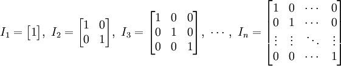

# NumPy

NumPy 是 Numerical Python 的缩写，它是一个由**多维数组对象**（ndarray）和处理这些数组的**函数**（function）集合组成的库。

[TOC]


## 1、 介绍

NumPy(Numerical Python) 是 Python 语言的一个扩展程序库，**支持大量的维度数组与矩阵运算**，此外也针对数组运算提供大量的数学函数库。

NumPy 的前身 Numeric 最早是由 Jim Hugunin 与其它协作者共同开发，2005 年，Travis Oliphant 在 Numeric 中结合了另一个同性质的程序库 Numarray 的特色，并加入了其它扩展而开发了 NumPy。NumPy 为开放源代码并且由许多协作者共同维护开发。


NumPy 是一个运行速度非常快的数学库，主要用于数组计算，包含：

- 一个强大的N维数组对象 ndarray
- 广播功能函数
- 整合 C/C++/Fortran 代码的工具
- 线性代数、傅里叶变换、随机数生成等功能


优点：

- NumPy 是 Python 科学计算基础库；
- NumPy 可以对数组进行高效的数学运算；
- NumPy 的 ndarray 对象可以用来构建多维数组；
- NumPy 能够执行傅立叶变换与重塑多维数组形状；
- NumPy 提供了线性代数，以及随机数生成的内置函数。


## 2、 ndarray对象

**NumPy 定义了一个 n 维数组对象，简称 ndarray 对象，它是一个一系列相同类型元素组成的数组集合。**

**以 0 下标为开始进行集合中元素的索引。**


ndarray 对象是用于存放**同类型元素**的**多维数组**。

ndarray 中的**每个元素**在内存中**都有相同存储大小**的区域。

ndarray 内部由以下内容组成：

- 一个指向数据（内存或内存映射文件中的一块数据）的指针。
- 数据类型或 dtype，描述在数组中的固定大小值的格子。
- 一个表示数组形状（shape）的元组，表示各维度大小的元组。
- 一个跨度元组（stride），其中的整数指的是为了前进到当前维度下一个元素需要"跨过"的字节数。

ndarray 的内部结构:


ndarray 对象由计算机内存的**连续一维部分组成**，并结合索引模式，将每个元素映射到内存块中的一个位置。内存块以行顺序(C样式)或列顺序(FORTRAN或MatLab风格，即前述的F样式)来保存元素。

### 2.1 创建ndarray对象

通过 NumPy 的内置函数 array() 可以创建 ndarray 对象，其语法格式如下：

```python
numpy.array(object, dtype = None, copy = True, order = None, subok = False, ndmin = 0)
```

参数说明：

| **序号** | **参数** | **描述说明**                                                 |
| -------- | -------- | ------------------------------------------------------------ |
| 1        | object   | 数组或嵌套的数列                                             |
| 2        | dtype    | 可选参数，通过它可以更改数组的数据类型。                     |
| 3        | copy     | 可选参数，表示数组能否被复制，默认是 True。                  |
| 4        | order    | 以哪种内存布局创建数组，有 3 个可选值，分别是 C(行序列)/F(列序列)/A(默认)。 |
| 5        | subok    | 默认返回一个与基类类型一致的数组                             |
| 6        | ndmin    | 指定生成数组的最小维度                                       |

例子：

```python
#创建一维数组
a=numpy.array([1,2,3])
print(a)
[1 2 3]
#创建二维数组
b=numpy.array([[1,2,3],[4,5,6]])
print(b)
[[1 2 3]
[4 5 6]]
#设置dtype为复数
c=numpy.array([2,4,6,8],dtype="complex")
print(c)
[2.+0.j 4.+0.j 6.+0.j 8.+0.j]
#ndim查看维度和创建指定维度数组
a = np.array([1, 2, 3,4,5], ndmin = 2)
print(a)
[[1 2 3 4 5]]
```

### 2.2 reshape数组变维

数组的形状指的是多维数组的行数和列数。Numpy 模块提供 reshape() 函数可以改变多维数组行数和列数，从而达到数组变维的目的。因此数组变维即对数组形状的重塑


```python
import numpy as np 
e = np.array([[1,2],[3,4],[5,6]]) 
print("原数组",e) 
e=e.reshape(2,3) 
print("新数组",e) 
输出：
原数组 [[1 2]
[3 4]
[5 6]]
新数组 [[1 2 3]
[4 5 6]]
```


## 3、 数据类型

| **名称**   | **描述**                                                     |
| ---------- | ------------------------------------------------------------ |
| bool_      | 布尔型数据类型（True 或者 False）                            |
| int_       | 默认的整数类型（类似于 C 语言中的 long，int32 或 int64）     |
| intc       | 与 C 的 int 类型一样，一般是 int32 或 int 64                 |
| intp       | 用于索引的整数类型（类似于 C 的 ssize_t，一般情况下仍然是 int32 或 int64） |
| int8       | 字节（-128 to 127）                                          |
| int16      | 整数（-32768 to 32767）                                      |
| int32      | 整数（-2147483648 to 2147483647）                            |
| int64      | 整数（-9223372036854775808 to 9223372036854775807）          |
| uint8      | 无符号整数（0 to 255）                                       |
| uint16     | 无符号整数（0 to 65535）                                     |
| uint32     | 无符号整数（0 to 4294967295）                                |
| uint64     | 无符号整数（0 to 18446744073709551615）                      |
| float_     | float64 类型的简写                                           |
| float16    | 半精度浮点数，包括：1 个符号位，5 个指数位，10 个尾数位      |
| float32    | 单精度浮点数，包括：1 个符号位，8 个指数位，23 个尾数位      |
| float64    | 双精度浮点数，包括：1 个符号位，11 个指数位，52 个尾数位     |
| complex_   | complex128 类型的简写，即 128 位复数                         |
| complex64  | 复数，表示双 32 位浮点数（实数部分和虚数部分）               |
| complex128 | 复数，表示双 64 位浮点数（实数部分和虚数部分）               |

numpy 的数值类型实际上是 dtype 对象的实例，并对应唯一的字符，包括 np.bool_，np.int32，np.float32，等等。

---

### 3.1 数据类型对象(dtype)

数据类型对象（Data Type Object）又称 **dtype 对象**，主要用来描述数组元素的**数据类型、大小以及字节顺序（小端法或大端法）**。同时，它也可以用来创建结构化数据。

**字节顺序是通过对数据类型预先设定 < 或 > 来决定的。** **<** 意味着小端法(最小值存储在最小的地址，即低位组放在最前面)。**>** 意味着大端法(最重要的字节存储在最小的地址，即高位组放在最前面)。

dtype 对象是使用以下语法构造的：

```python
numpy.dtype(object, align, copy)
```

- object - 要转换为的数据类型对象
- align - 如果为 true，填充字段使其类似 C 的结构体。
- copy - 复制 dtype 对象 ，如果为 false，则是对内置数据类型对象的引用

实例：

```python
a= np.dtype(np.int64) 
print(a)  
int64
# 字节顺序标注
dt = np.dtype('<i4')
print(dt)
int32

# 创建结构化数据
dt = np.dtype([('age',np.int8)]) # 创建了字段age，类型为int8
print(dt)
[('age', 'i1')]
# 将数据类型应用于 ndarray 对象
dt = np.dtype([('age',np.int8)]) 
a = np.array([(10,),(20,),(30,)], dtype = dt) 
print(a)
[(10,) (20,) (30,)]
# 类型字段名可以用于存取实际的 age 列
print(a['age'])
[10 20 30]

student = np.dtype([('name','S20'), ('age', 'i1'), ('marks', 'f4')]) 
print(student)
[('name', 'S20'), ('age', 'i1'), ('marks', 'f4')]
a = np.array([('abc', 21, 50),('xyz', 18, 75)], dtype = student) 
print(a)
[('abc', 21, 50.0), ('xyz', 18, 75.0)]
```

### 3.2 数据类型标识码

NumPy 中每种数据类型都有一个唯一标识的字符码。

| 字符 | **对应类型** | 字符 | **对应类型**          | 字符 | **对应类型**             |
| ---- | :----------- | ---- | --------------------- | ---- | ------------------------ |
| b    | 代表布尔型   | c    | 复数浮点型            | S,a  | 字节串（S）与字符串（a） |
| i    | 带符号整型   | m    | timedelta（时间间隔） | U    | Unicode                  |
| u    | 无符号整型   | M    | datatime（日期时间）  | V    | 原始数据（void）         |
| f    | 浮点型       | O    | Python对象            |      |                          |

创建数据类型：

```python
dt = np.dtype([('score','i1')])
print(dt)
[('score', 'i1')]
```

### 3.3 定义结构化数据

通常情况下，结构化数据**使用字段的形式**来描述某个对象的特征。以下示例描述一位老师的姓名、年龄、工资的特征，该结构化数据其包含以下字段：

- str 字段：name
- int 字段：age
- float 字段：salary

```python
import numpy as np
teacher = np.dtype([('name','S20'), ('age', 'i1'), ('salary', 'f4')])
#输出结构化数据teacher
print(teacher)
#将其应用于ndarray对象
b = np.array([('ycs', 32, 6357.50),('jxe', 28, 6856.80)], dtype = teacher) 
print(b)
```

结果：

```python
[('name', 'S20'), ('age', 'i1'), ('salary', '<f4')]
#输出的name为bytes字节串类型
[(b'ycs', 32, 6357.5) (b'jxe', 28, 6856.8)]
```


## 4、数组属性

- NumPy 数组的维数称为秩（rank），秩就是轴的数量，即数组的维度，一维数组的秩为 1，二维数组的秩为 2，以此类推。

- 在 NumPy中，每一个线性的数组称为是一个轴（axis），也就是维度（dimensions）。

    比如说，二维数组相当于是两个一维数组，其中第一个一维数组中每个元素又是一个一维数组。所以**一维数组就是 NumPy 中的轴（axis），第一个轴相当于是底层数组，第二个轴是底层数组里的数组。而轴的数量——秩，就是数组的维数。**

- 很多时候可以声明 axis。**==axis=0，表示沿着第 0 轴进行操作，即对每一列进行操作；axis=1，表示沿着第1轴进行操作，即对每一行进行操作。==**

NumPy 的数组中比较重要 ndarray 对象属性有：

| **属性**         | **说明**                                                     |
| ---------------- | ------------------------------------------------------------ |
| ndarray.ndim     | 秩，即轴的数量或维度的数量                                   |
| ndarray.shape    | 数组的维度，对于矩阵，n 行 m 列                              |
| ndarray.size     | 数组元素的总个数，相当于 .shape 中 n*m 的值                  |
| ndarray.dtype    | ndarray 对象的元素类型                                       |
| ndarray.itemsize | ndarray 对象中每个元素的大小，以字节为单位                   |
| ndarray.flags    | ndarray 对象的内存信息                                       |
| ndarray.real     | ndarray元素的实部                                            |
| ndarray.imag     | ndarray 元素的虚部                                           |
| ndarray.data     | 包含实际数组元素的缓冲区，由于一般通过数组的索引获取元素，所以通常不需要使用这个属性。 |

- ndarray.shape 表示数组的维度，返回一个元组，这个元组的长度就是维度的数目，即 ndim 属性(秩)。

- ndarray.shape 也可以用于调整数组大小。

    ```python
    a = np.array([[1,2,3],[4,5,6]]) 
    a.shape =  (3,2)  
    print (a)
    [[1 2]
     [3 4]
     [5 6]]
    ```

- NumPy 也提供了 reshape 函数来调整数组大小。

    ```python
    a = np.array([[1,2,3],[4,5,6]]) 
    b = a.reshape(3,2)  
    print (b)
    ```

- ndarray.itemsize 以**字节的形式**返回数组中每一个元素的大小。

    例如，一个元素类型为 float64 的数组 itemsize 属性值为 8。

- ndarray.flags 返回 ndarray 对象的内存信息，包含以下属性：

    | 属性             | 描述                                                         |
    | ---------------- | ------------------------------------------------------------ |
    | C_CONTIGUOUS (C) | 数据是在一个单一的C风格的连续段中                            |
    | F_CONTIGUOUS (F) | 数据是在一个单一的Fortran风格的连续段中                      |
    | OWNDATA (O)      | 数组拥有它所使用的内存或从另一个对象中借用它                 |
    | WRITEABLE (W)    | 数据区域可以被写入，将该值设置为 False，则数据为只读         |
    | ALIGNED (A)      | 数据和所有元素都适当地对齐到硬件上                           |
    | UPDATEIFCOPY (U) | 这个数组是其它数组的一个副本，当这个数组被释放时，原数组的内容将被更新 |

实例：

```python
x = np.array([1,2,3,4,5])  
print (x.flags)
C_CONTIGUOUS : True
F_CONTIGUOUS : True
OWNDATA : True
WRITEABLE : True
ALIGNED : True
WRITEBACKIFCOPY : False
UPDATEIFCOPY : False
```


## 5、创建数组

ndarray 数组除了可以使用底层 ndarray 构造器来创建外，也可以通过以下几种方式来创建。

### 5.1 numpy.empty

numpy.empty 方法用来创建一个指定形状（shape）、数据类型（dtype）且未初始化的数组：

```python
numpy.empty(shape, dtype = float, order = 'C')
```

参数说明：

| 参数  | 描述                                                         |
| ----- | ------------------------------------------------------------ |
| shape | 数组形状                                                     |
| dtype | 数据类型，可选                                               |
| order | 有"C"和"F"两个选项,分别代表，行优先和列优先，在计算机内存中的存储元素的顺序。 |

实例：

```python
x = np.empty([3,2], dtype = int) 
```


### 5.2 numpy.zeros

创建指定大小的数组，数组元素以 0 来填充：

```python
numpy.zeros(shape, dtype = float, order = 'C')
```

参数说明：

| 参数  | 描述                                                |
| ----- | --------------------------------------------------- |
| shape | 数组形状                                            |
| dtype | 数据类型，可选                                      |
| order | 'C' 用于 C 的行数组，或者 'F' 用于 FORTRAN 的列数组 |

实例：

```python
# 默认为浮点数
x = np.zeros(5) 
print(x)
[0. 0. 0. 0. 0.]
# 设置类型为整数
y = np.zeros((5,), dtype = int) 
print(y)
[0 0 0 0 0]
# 自定义类型
z = np.zeros((2,2), dtype = [('x', 'i4'), ('y', 'i4')])  
print(z)
[[(0, 0) (0, 0)]
 [(0, 0) (0, 0)]]
```


### 5.3 numpy.ones

创建指定形状的数组，数组元素以 1 来填充：

```python
numpy.ones(shape, dtype = None, order = 'C')
```

参数说明：

| 参数  | 描述                                                |
| ----- | --------------------------------------------------- |
| shape | 数组形状                                            |
| dtype | 数据类型，可选                                      |
| order | 'C' 用于 C 的行数组，或者 'F' 用于 FORTRAN 的列数组 |

实例：

```python
# 默认为浮点数
x = np.ones(5) 
```


## 6、从已有的数组创建数组

### 6.1 numpy.asarray

numpy.asarray 类似 numpy.array，但 numpy.asarray 参数只有三个，比 numpy.array 少两个。

```python
numpy.asarray(a, dtype = None, order = None)
```

参数说明：

| 参数  | 描述                                                         |
| :---- | :----------------------------------------------------------- |
| a     | 任意形式的输入参数，可以是，**列表, 列表的元组, 元组, 元组的元组, 元组的列表，多维数组** |
| dtype | 数据类型，可选                                               |
| order | 可选，有"C"和"F"两个选项,分别代表，行优先和列优先，在计算机内存中的存储元素的顺序。 |

实例：

```python
# 将列表转换为 ndarray:
x =  [1,2,3] 
a = np.asarray(x)  
print (a)
[1  2  3]

# 将元组转换为 ndarray:
x =  (1,2,3) 
a = np.asarray(x)  
print (a)
[1  2  3]

# 将元组列表转换为 ndarray:
x =  [(1,2,3),(4,5)] 
a = np.asarray(x)  
print (a)
[(1, 2, 3) (4, 5)]

# 设置了 dtype 参数：
x =  [1,2,3] 
a = np.asarray(x, dtype =  float)  
print (a)
[ 1.  2.  3.]
```


### 6.2  numpy.frombuffer

numpy.frombuffer 用于实现动态数组。

numpy.frombuffer 接受 buffer 输入参数，以流的形式读入转化成 ndarray 对象。

```python
numpy.frombuffer(buffer, dtype = float, count = -1, offset = 0)
```

> **注意：buffer 是字符串的时候，Python3 默认 str 是 Unicode 类型，所以要转成 bytestring 在原 str 前加上 b。**

参数说明：

| 参数   | 描述                                     |
| :----- | :--------------------------------------- |
| buffer | 可以是任意对象，会以流的形式读入。       |
| dtype  | 返回数组的数据类型，可选                 |
| count  | 读取的数据数量，默认为-1，读取所有数据。 |
| offset | 读取的起始位置，默认为0。                |

实例：

```python
s =  b'Hello World' 
a = np.frombuffer(s, dtype =  'S1')  
print (a)
[b'H' b'e' b'l' b'l' b'o' b' ' b'W' b'o' b'r' b'l' b'd']
```


### 6.3 numpy.fromiter

numpy.fromiter 方法从可迭代对象中建立 ndarray 对象，返回一维数组。

```python
numpy.fromiter(iterable, dtype, count=-1)
```

| 参数     | 描述                                   |
| :------- | :------------------------------------- |
| iterable | 可迭代对象                             |
| dtype    | 返回数组的数据类型                     |
| count    | 读取的数据数量，默认为-1，读取所有数据 |

实例：

```python
# 使用 range 函数创建列表对象  
list=range(5)
it=iter(list)
 
# 使用迭代器创建 ndarray 
x=np.fromiter(it, dtype=float)
print(x)
[0. 1. 2. 3. 4.]
```


## 7、从数值范围创建数组

### 7.1 numpy.arange

numpy 包中使用 arange 函数创建数值范围并返回 ndarray 对象，函数格式如下：

```python
numpy.arange(start, stop, step, dtype)
```

**根据 start 与 stop 指定的范围以及 step 设定的步长，生成一个 ndarray。**

参数说明：

| 参数    | 描述                                                         |
| :------ | :----------------------------------------------------------- |
| `start` | 起始值，默认为`0`                                            |
| `stop`  | 终止值（不包含）                                             |
| `step`  | 步长，默认为`1`                                              |
| `dtype` | 返回`ndarray`的数据类型，如果没有提供，则会使用输入数据的类型。 |

实例：

```python
x = np.arange(5)
print(x)
[0 1 2 3 4]
x= np.arange(10,20,2)
print(x)
[10 12 14 16 18]
```


### 7.2 numpy.linspace

numpy.linspace 函数用于创建一个**一维数组**，数组是一个等差数列构成的，格式如下：

```python
np.linspace(start, stop, num=50, endpoint=True, retstep=False, dtype=None)
```

参数说明：

| 参数       | 描述                                                         |
| :--------- | :----------------------------------------------------------- |
| `start`    | 序列的起始值                                                 |
| `stop`     | 序列的终止值，如果`endpoint`为`true`，该值包含于数列中       |
| `num`      | 要生成的等步长的样本数量，默认为`50`                         |
| `endpoint` | 该值为 `true` 时，数列中包含`stop`值，反之不包含，默认是True。 |
| `retstep`  | 如果为 True 时，生成的数组中会显示间距，反之不显示。         |
| `dtype`    | `ndarray` 的数据类型                                         |

实例:

```python
# 用到三个参数，设置起始点为 1 ，终止点为 10，数列个数为 10。
a = np.linspace(1,10,10)
print(a)
[ 1.  2.  3.  4.  5.  6.  7.  8.  9. 10.]
# 设置元素全部是1的等差数列
a = np.linspace(1,1,10)
print(a)
[1. 1. 1. 1. 1. 1. 1. 1. 1. 1.]
# 将 endpoint 设为 false，不包含终止值
a = np.linspace(10, 20,  5, endpoint =  False)  
print(a)
[10. 12. 14. 16. 18.]
# 设置间距
a =np.linspace(1,10,10,retstep= True)
print(a)
(array([ 1.,  2.,  3.,  4.,  5.,  6.,  7.,  8.,  9., 10.]), 1.0)
# 拓展例子
b =np.linspace(1,10,10).reshape([10,1])
```


### 7.3 numpy.logspace

numpy.logspace 函数用于创建一个于等比数列。格式如下：

```python
np.logspace(start, stop, num=50, endpoint=True, base=10.0, dtype=None)
```

base 参数意思是取对数的时候 log 的下标。

| 参数       | 描述                                                         |
| :--------- | :----------------------------------------------------------- |
| `start`    | 序列的起始值为：base ** start                                |
| `stop`     | 序列的终止值为：base ** stop。如果`endpoint`为`true`，该值包含于数列中 |
| `num`      | 要生成的等步长的样本数量，默认为`50`                         |
| `endpoint` | 该值为 `true` 时，数列中中包含`stop`值，反之不包含，默认是True。 |
| `base`     | 对数 log 的底数。                                            |
| `dtype`    | `ndarray` 的数据类型                                         |

实例：

```python
# 默认底数是 10
a = np.logspace(1.0,  2.0, num =  10)  
print (a)
[ 10.           12.91549665     16.68100537      21.5443469  27.82559402   
  35.93813664   46.41588834     59.94842503      77.42636827    100.    ]
# 将对数的底数设置为 2
a = np.logspace(0,9,10,base=2)
print (a)
[  1.   2.   4.   8.  16.  32.  64. 128. 256. 512.]
```


## 8、切片和索引

ndarray对象的内容可以通过索引或切片来访问和修改，与 Python 中 list 的切片操作一样。

### 8.1 使用内置的slice函数

ndarray 数组可以**基于 0 - n 的下标**进行索引，切片对象可以通过**内置的 slice 函数**，并**设置 start, stop 及 step 参数**进行，从原数组中切割出一个新数组。

实例：

```python
a = np.arange(10)  # [0 1 2 3 4 5 6 7 8 9]
s = slice(2,7,2)   # 从索引 2 开始到索引 7 停止，间隔为2
print (a[s])
[2  4  6]
```

### 8.2 使用冒号

可以通过冒号分隔切片参数 **start:stop:step** 来进行切片操作：

```python
a = np.arange(10)  
b = a[2:7:2]   # 从索引 2 开始到索引 7 停止，间隔为 2
print(b)
[2  4  6]
```

冒号 **:** 的解释：

如果只放置一个参数，如 **[2]**，将返回与该索引相对应的单个元素。如果为 **[2:]**，表示从该索引开始以后的所有项都将被提取。如果使用了两个参数，如 **[2:7]**，那么则提取两个索引(不包括停止索引)之间的项。

**多维数组的情况：**

```python
a = np.array([[1,2,3],[3,4,5],[4,5,6]])
print(a)
# 从某个索引处开始切割
print('从数组索引 a[1:] 处开始切割')
print(a[1:])

[[1 2 3]
 [3 4 5]
 [4 5 6]]
从数组索引 a[1:] 处开始切割
[[3 4 5]
 [4 5 6]]
```

### 8.3 使用省略号

切片还可以包括省略号 **…**，来使选择元组的长度与数组的维度相同。 如果在行位置使用省略号，它将返回包含行中元素的 ndarray。

实例：

```python
a = np.array([[1,2,3],[3,4,5],[4,5,6]])  
print (a[...,1])   # 第2列元素
print (a[1,...])   # 第2行元素
print (a[...,1:])  # 第2列及剩下的所有元素

[2 4 5]
[3 4 5]
[[2 3]
 [4 5]
 [5 6]]
```

### 8.4 与list的区别

对于多维的list列表，使用切片和索引，必须一维一维的进行：

```python
a = [[1,2,3],[4,5,6]]
print(a[1][2])
6
```

在narray数组中，可以通过逗号区分维数：

```python
a = np.arange(12)
a.shape = (3,4)
print(a[1][2])
print(a[1,2])
6
6
```


## 9、高级索引

NumPy 比一般的 Python 序列提供更多的索引方式。

NumPy 中的高级索引指的是使用**整数数组、布尔数组或者其他序列**来访问数组的元素。

相比于基本索引，高级索引可以访问到数组中的任意元素，并且可以用来对数组进行复杂的操作和修改。

### 9.1 整数数组索引

整数数组索引是指使用一个数组来访问另一个数组的元素。**这个数组中的每个元素都是目标数组中某个维度上的索引值。**

以下实例获取数组中 **(0,0)，(1,1)** 和 **(2,0)** 位置处的元素。

```python
x = np.array([[1,  2],  [3,  4],  [5,  6]]) 
y = x[[0,1,2],  [0,1,0]]  
print (y)
[1  4  5]
```

以下实例获取了 4X3 数组中的四个角的元素。 行索引是 [0,0] 和 [3,3]，而列索引是 [0,2] 和 [0,2]。

```python
x = np.array([[ 0, 1, 2],[ 3, 4, 5],[ 6, 7, 8],[ 9, 10, 11]])  
rows = np.array([[0,0],[3,3]]) 
cols = np.array([[0,2],[0,2]]) 
y = x[rows,cols]  
print (y)
[[ 0  2]
 [ 9 11]]
```

返回的结果是包含每个角元素的 ndarray 对象。

可以借助切片 **:** 或 **…** 与索引数组组合。如下面例子：

```python
a = np.array([[1,2,3], [4,5,6], [7,8,9]])
b = a[1:3, 1:3]
c = a[1:3,[1,2]]
d = a[...,1:]
print(b)
print(c)
print(d)
[[5 6]
 [8 9]]
[[5 6]
 [8 9]]
[[2 3]
 [5 6]
 [8 9]]
```


### 9.2 布尔索引

我们可以通过一个布尔数组来索引目标数组。

布尔索引通过布尔运算（如：比较运算符）来获取符合指定条件的元素的数组。

以下实例获取大于 5 的元素：

```python
x = np.array([[ 0, 1, 2],[ 3, 4, 5],[ 6, 7,  8],[  9, 10, 11]])  
print (x[x >  5])
[ 6  7  8  9 10 11]
```

以下实例使用了 **~**（取补运算符）来过滤 NaN。

```python
a = np.array([np.nan,  1,2,np.nan,3,4,5])  
print (a[~np.isnan(a)])
[ 1.   2.   3.   4.   5.]
```

以下实例演示如何从数组中过滤掉非复数元素。

```python
a = np.array([1,  2+6j,  5,  3.5+5j])  
print (a[np.iscomplex(a)])
[2.0+6.j  3.5+5.j]
```


### 9.3 花式索引

花式索引指的是利用整数数组进行索引。

**花式索引根据索引数组的值作为目标数组的某个轴的下标来取值。**

对于使用一维整型数组作为索引，如果目标是一维数组，那么索引的结果就是**对应位置的元素**，如果目标是二维数组，那么就是**对应下标的行**。

花式索引跟切片不一样，**它总是将数据复制到新数组中**。

#### 一维数组

一维数组只有一个轴 **axis = 0**，所以一维数组就在 **axis = 0** 这个轴上取值：

```python
x = np.arange(9)
print(x)
print("-------读取下标对应的元素-------")
x2 = x[[0, 6]] # 使用花式索引
print(x2)
print(x2[0])
print(x2[1])

[0 1 2 3 4 5 6 7 8]
-------读取下标对应的元素-------
[0 6]
0
6
```

#### 二维数组

1、传入顺序索引数组

```python
x=np.arange(32).reshape((8,4))
print(x)
# 二维数组读取指定下标对应的行
print("-------读取下标对应的行-------")
print (x[[4,2,1,7]])

[[ 0  1  2  3]
 [ 4  5  6  7]
 [ 8  9 10 11]
 [12 13 14 15]
 [16 17 18 19]
 [20 21 22 23]
 [24 25 26 27]
 [28 29 30 31]]
-------读取下标对应的行-------
[[16 17 18 19]
 [ 8  9 10 11]
 [ 4  5  6  7]
 [28 29 30 31]]
```

2、传入倒序索引数组

```python
x=np.arange(32).reshape((8,4))
print(x[[-4,-2,-1,-7]])

[[16 17 18 19]
 [24 25 26 27]
 [28 29 30 31]
 [ 4  5  6  7]]
```

3、**传入多个索引数组（要使用 np.ix_）**

np.ix_ 函数就是输入两个数组，产生笛卡尔积的映射关系。

笛卡尔乘积是指在数学中，两个集合 X 和 Y 的笛卡尔积（Cartesian product），又称直积，表示为 **X×Y**，第一个对象是X的成员而第二个对象是 Y 的所有可能有序对的其中一个成员。

例如 **A={a,b}, B={0,1,2}**，则：

```python
A×B={(a, 0), (a, 1), (a, 2), (b, 0), (b, 1), (b, 2)}
B×A={(0, a), (0, b), (1, a), (1, b), (2, a), (2, b)}
```

实例：

```python
x=np.arange(32).reshape((8,4))
print (x[np.ix_([1,5,7,2],[0,3,1,2])])

[[ 4  7  5  6]
 [20 23 21 22]
 [28 31 29 30]
 [ 8 11  9 10]]
```

关于 np.ix_ 的具体使用：

`x[np.ix_([1,5,7,2],[0,3,1,2])]` 这句话会输出一个4*4的矩阵，其中的元素分别是：

```python
x[1,0] x[1,3] x[1,1] x[1,2]
x[5,0] x[5,3] x[5,1] x[5,2]
x[7,0] x[7,3] x[7,1] x[7,2]
x[2,0] x[2,3] x[2,1] x[2,2]
```


## 10、广播（Broadcast）

广播(Broadcast)是 numpy 对**不同形状(shape)的数组进行数值计算的方式**， 对数组的算术运算通常在相应的元素上进行。

如果两个数组 a 和 b 形状相同，即满足 **a.shape == b.shape**，那么 a*b 的结果就是 a 与 b 数组对应位相乘。这要求维数相同，且各维度的长度相同。

```python
a = np.array([1,2,3,4]) 
b = np.array([10,20,30,40]) 
c = a * b 
print (c)
[ 10  40  90 160]
```

当运算中的 2 个数组的形状不同时，numpy 将自动触发广播机制。如

```python
a = np.array([[ 0, 0, 0],
           [10,10,10],
           [20,20,20],
           [30,30,30]])
b = np.array([0,1,2])
print(a + b)
[[ 0  1  2]
 [10 11 12]
 [20 21 22]
 [30 31 32]]
```

下面的图片展示了数组 b 如何通过广播来与数组 a 兼容。


4x3 的二维数组与长为 3 的一维数组相加，等效于把数组 b 在二维上重复 4 次再运算：

```python
a = np.array([[ 0, 0, 0],
           [10,10,10],
           [20,20,20],
           [30,30,30]])
b = np.array([1,2,3])
bb = np.tile(b, (4, 1))  # 重复 b 的各个维度
print(a + bb)
[[ 1  2  3]
 [11 12 13]
 [21 22 23]
 [31 32 33]]
```

**对于numpy.tile()的理解：**

```python
numpy.tile(A, reps)
```

这里的 A 就是数组，reps 可以是一个数，一个列表、元组或者数组等，就是类数组的类型。

- reps是一个数，则将A**向右复制** reps-1 次形成新的数组。
- reps是一个array-like（类数组的，如列表，元组，数组）类型的，它有两个元素，如 [m , n]，实际上就是将 A 这个块变成 m * n 个 A 组成的新数组，有 m 行，n 列 A。

```python
bb = np.tile( b, (3,1)) # 表示把 b 在行方向复制为 3 行
cc = np.tile( c, (1,3)) # 表示把 c 在列方向复制为 3 列
```


**广播的规则:**

- 让所有输入数组都向其中形状最长的数组看齐，形状中不足的部分都通过在前面加 1 补齐。
- 输出数组的形状是输入数组形状的各个维度上的最大值。
- 如果输入数组的某个维度和输出数组的对应维度的长度相同或者其长度为 1 时，这个数组能够用来计算，否则出错。
- 当输入数组的某个维度的长度为 1 时，沿着此维度运算时都用此维度上的第一组值。

**简单理解：**对两个数组，分别比较他们的每一个维度（若其中一个数组没有当前维度则忽略），满足：

- 数组拥有相同形状。
- 当前维度的值相等。
- 当前维度的值有一个是 1。

若条件不满足，抛出 **"ValueError: frames are not aligned"** 异常。


## 11、迭代数组

NumPy 迭代器对象 numpy.nditer 提供了一种灵活访问一个或者多个数组元素的方式。

迭代器最基本的任务是可以完成对数组元素的访问。

```python
a = np.arange(6).reshape(2,3)
for x in np.nditer(a):
    print (x, end=", " )
  
0, 1, 2, 3, 4, 5, 
```

以上实例不是使用标准 C 或者 Fortran 顺序，**选择的顺序是和数组内存布局一致的**，这样做是为了提升访问的效率，**默认是行序优先（row-major order，或者说是 C-order）**。

这反映了默认情况下只需访问每个元素，而无需考虑其特定顺序。我们可以通过迭代上述数组的转置来看到这一点，并与以 C 顺序访问数组转置的 copy 方式做对比，如下实例：

```python
a = np.arange(6).reshape(2,3)
for x in np.nditer(a.T):
    print (x, end=", " )
print ('\n')
 
for x in np.nditer(a.T.copy(order='C')):
    print (x, end=", " )
print ('\n')

0, 1, 2, 3, 4, 5, 

0, 3, 1, 4, 2, 5, 
```

从上述例子可以看出，a 和 a.T 的遍历顺序是一样的，也就是他们在内存中的存储顺序也是一样的，但是 **a.T.copy(order = 'C')** 的遍历结果是不同的，那是因为它和前两种的存储方式是不一样的，默认是按行访问。

### 11.1 控制遍历顺序

- `for x in np.nditer(a, order='F'):`Fortran order，即是列序优先；
- `for x in np.nditer(a.T, order='C'):`C order，即是行序优先；

可以通过显式设置，来强制 nditer 对象使用某种顺序：

```python
a = np.arange(0,60,5) 
a = a.reshape(3,4)  
print ('原始数组是：')
print (a)
print ('\n')
print ('以 C 风格顺序排序：')
for x in np.nditer(a, order =  'C'):  
    print (x, end=", " )
print ('\n')
print ('以 F 风格顺序排序：')
for x in np.nditer(a, order =  'F'):  
    print (x, end=", " )
    
原始数组是：
[[ 0  5 10 15]
 [20 25 30 35]
 [40 45 50 55]]


以 C 风格顺序排序：
0, 5, 10, 15, 20, 25, 30, 35, 40, 45, 50, 55, 

以 F 风格顺序排序：
0, 20, 40, 5, 25, 45, 10, 30, 50, 15, 35, 55,
```

### 11.2 修改数组中元素的值

nditer 对象有另一个可选参数 `op_flags`。 默认情况下，nditer 将视待迭代遍历的数组为只读对象（read-only），为了在遍历数组的同时，实现对数组元素值得修改，必须指定 readwrite 或者 writeonly 的模式。

实例：

```python
a = np.arange(0,60,5) 
a = a.reshape(3,4)  
print ('原始数组是：')
print (a)
for x in np.nditer(a, op_flags=['readwrite']): 
    x[...]=2*x 		# x[...] 是修改原 numpy 元素，x 只是个拷贝。
print ('修改后的数组是：')
print (a)

原始数组是：
[[ 0  5 10 15]
 [20 25 30 35]
 [40 45 50 55]]


修改后的数组是：
[[  0  10  20  30]
 [ 40  50  60  70]
 [ 80  90 100 110]]
```


### 11.3 使用外部循环

nditer 类的构造器拥有 flags 参数，它可以接受下列值：

| 参数            | 描述                                           |
| :-------------- | :--------------------------------------------- |
| `c_index`       | 可以跟踪 C 顺序的索引                          |
| `f_index`       | 可以跟踪 Fortran 顺序的索引                    |
| `multi_index`   | 每次迭代可以跟踪一种索引类型                   |
| `external_loop` | 给出的值是具有多个值的一维数组，而不是零维数组 |

在下面的实例中，迭代器遍历对应于每列，并组合为一维数组。

```python
a = np.arange(0,60,5) 
a = a.reshape(3,4)  
print ('原始数组是：')
print (a)
print ('\n')
print ('修改后的数组是：')
for x in np.nditer(a, flags =  ['external_loop'], order =  'F'):  
   print (x, end=", " )

原始数组是：
[[ 0  5 10 15]
 [20 25 30 35]
 [40 45 50 55]]


修改后的数组是：
[ 0 20 40], [ 5 25 45], [10 30 50], [15 35 55],
```


### 11.4 广播迭代

如果两个数组是可广播的，nditer 组合对象能够同时迭代它们。 假设数组 a 的维度为 3X4，数组 b 的维度为 1X4 ，则使用以下迭代器（数组 b 被广播到 a 的大小）。

```python
a = np.arange(0,60,5) 
a = a.reshape(3,4)  
print  ('第一个数组为：')
print (a)
print ('第二个数组为：')
b = np.array([1,  2,  3,  4], dtype =  int)  
print (b)
print ('修改后的数组为：')
for x,y in np.nditer([a,b]):  
    print ("%d:%d"  %  (x,y), end=", " )
    
第一个数组为：
[[ 0  5 10 15]
 [20 25 30 35]
 [40 45 50 55]]

第二个数组为：
[1 2 3 4]

修改后的数组为：
0:1, 5:2, 10:3, 15:4, 20:1, 25:2, 30:3, 35:4, 40:1, 45:2, 50:3, 55:4,
```


## 12、数组操作

### 12.1 修改数组形状

| 函数      | 描述                                               |
| :-------- | :------------------------------------------------- |
| `reshape` | 不改变数据的条件下修改形状                         |
| `flat`    | 数组元素迭代器                                     |
| `flatten` | 返回一份数组拷贝，对拷贝所做的修改不会影响原始数组 |
| `ravel`   | 返回展开数组                                       |

#### numpy.reshape

numpy.reshape 函数可以在不改变数据的条件下修改形状，格式如下：

```python
numpy.reshape(arr, newshape, order='C')
```

- `arr`：要修改形状的数组
- `newshape`：整数或者整数数组，新的形状应当兼容原有形状
- `order`：'C' -- 按行，'F' -- 按列，'A' -- 原顺序，'k' -- 元素在内存中的出现顺序。

实例：

```python
a = np.arange(8)
b = a.reshape(4,2)
```

#### numpy.ndarray.flat

numpy.ndarray.flat 是一个数组元素**迭代器**，实例如下:

```python
a = np.arange(9).reshape(3,3) 
print ('原始数组：')
for row in a:
    print (row)
    
#对数组中每个元素都进行处理，可以使用flat属性，该属性是一个数组元素迭代器：
print ('迭代后的数组：')
for element in a.flat:
    print (element)
    
原始数组：
[0 1 2]
[3 4 5]
[6 7 8]
迭代后的数组：
0
1
2
3
4
5
6
7
8
```

#### numpy.ndarray.flatten

numpy.ndarray.flatten 返回一份数组拷贝，对拷贝所做的**修改不会影响原始数组**，格式如下：

```python
ndarray.flatten(order='C')
```

参数说明：

- order：'C' -- 按行，'F' -- 按列，'A' -- 原顺序，'K' -- 元素在内存中的出现顺序。

返回展开的数组

#### numpy.ravel

numpy.ravel() 展平的数组元素，顺序通常是"C风格"，返回的是数组视图（view，有点类似 C/C++引用reference的意味），**修改会影响原始数组**。

该函数接收两个参数：

```python
numpy.ravel(a, order='C')
```

参数说明：

- order：'C' -- 按行，'F' -- 按列，'A' -- 原顺序，'K' -- 元素在内存中的出现顺序。


### 12.2 翻转数组

| 函数        | 描述                       |
| :---------- | :------------------------- |
| `transpose` | 对换数组的维度（转置）     |
| `ndarray.T` | 和 `self.transpose()` 相同 |
| `rollaxis`  | 向后滚动指定的轴           |
| `swapaxes`  | 对换数组的两个轴           |

#### numpy.transpose

numpy.transpose 函数用于对换数组的维度，格式如下：

```
numpy.transpose(arr, axes)
```

参数说明:

- `arr`：要操作的数组
- `axes`：整数列表，对应维度，通常所有维度都会对换。

实例：

```python
a = np.arange(12).reshape(3,4)
print (a)
print (np.transpose(a))
[[ 0  1  2  3]
 [ 4  5  6  7]
 [ 8  9 10 11]]

[[ 0  4  8]
 [ 1  5  9]
 [ 2  6 10]
 [ 3  7 11]]
```

==**numpy.ndarray.T 类似 numpy.transpose：**==

```python
print (a.T)
```

**按照指定的维度顺序进行数组维度的转换**

```python
import numpy as np

# 创建一个(3, 100, 100)的示例数组
img = np.random.rand(3, 100, 100)

# 将数组维度进行转换
img_transposed = img.transpose((1, 2, 0))

# 输出转换后的数组形状
print(img_transposed.shape)
(100,3,3)
```


#### numpy.rollaxis

numpy.rollaxis 函数向后滚动特定的轴到一个特定位置，格式如下：

```
numpy.rollaxis(arr, axis, start)
```

参数说明：

- `arr`：数组
- `axis`：要向后滚动的轴，其它轴的相对位置不会改变
- `start`：默认为零，表示完整的滚动。会滚动到特定位置。

实例：

```python
# 创建了三维的 ndarray
a = np.arange(8).reshape(2,2,2)
print (a)
print(np.where(a==6))   
print(a[1,1,0])  # 为 6

# 将轴 2 滚动到轴 0（宽度到深度）
b = np.rollaxis(a,2,0)
print (b)
# 查看元素 a[1,1,0]，即 6 的坐标，变成 [0, 1, 1]
# 最后一个 0 移动到最前面
print(np.where(b==6))  

# 将轴 2 滚动到轴 1：（宽度到高度）
c = np.rollaxis(a,2,1)
print (c)
# 查看元素 a[1,1,0]，即 6 的坐标，变成 [1, 0, 1]
# 最后的 0 和 它前面的 1 对换位置
print(np.where(c==6))  

原数组：
[[[0 1]
  [2 3]]

 [[4 5]
  [6 7]]]
(array([1]), array([1]), array([0]))
6

[[[0 2]
  [4 6]]

 [[1 3]
  [5 7]]]
(array([0]), array([1]), array([1]))

[[[0 2]
  [1 3]]

 [[4 6]
  [5 7]]]
(array([1]), array([0]), array([1]))
```


#### numpy.swapaxes

numpy.swapaxes 函数用于交换数组的两个轴，格式如下：

```python
numpy.swapaxes(arr, axis1, axis2)
```

- `arr`：输入的数组
- `axis1`：对应第一个轴的整数
- `axis2`：对应第二个轴的整数

实例：

```python
# 创建了三维的 ndarray
a = np.arange(8).reshape(2,2,2)
print (a)
print (np.swapaxes(a, 2, 0))

[[[0 1]
  [2 3]]

 [[4 5]
  [6 7]]]

[[[0 4]
  [2 6]]

 [[1 5]
  [3 7]]]
```


### 12.3 修改数组维度

| 维度           | 描述                       |
| :------------- | :------------------------- |
| `broadcast`    | 产生模仿广播的对象         |
| `broadcast_to` | 将数组广播到新形状         |
| `expand_dims`  | 扩展数组的形状             |
| `squeeze`      | 从数组的形状中删除一维条目 |

#### numpy.broadcast

numpy.broadcast 用于模仿广播的对象，它返回一个对象，该对象封装了将一个数组广播到另一个数组的结果。

该函数使用两个数组作为输入参数，如下实例：

```python
x = np.array([[1], [2], [3]])
y = np.array([4, 5, 6])  
 
# 对 y 广播 x
b = np.broadcast(x,y)  
```

#### numpy.broadcast_to

numpy.broadcast_to 函数将数组广播到新形状。它在原始数组上返回只读视图。 它通常不连续。 如果新形状不符合 NumPy 的广播规则，该函数可能会抛出ValueError。

```
numpy.broadcast_to(array, shape, subok)
```

实例：

```python
a = np.arange(4).reshape(1,4)
print (a)
print (np.broadcast_to(a,(4,4)))
[[0 1 2 3]]

[[0 1 2 3]
 [0 1 2 3]
 [0 1 2 3]
 [0 1 2 3]]
```

#### numpy.expand_dims

numpy.expand_dims 函数通过在指定位置插入新的轴来扩展数组形状，函数格式如下:

```
 numpy.expand_dims(arr, axis)
```

参数说明：

- `arr`：输入数组
- `axis`：新轴插入的位置

#### numpy.squeeze

numpy.squeeze 函数从给定数组的形状中删除一维的条目，函数格式如下：

```
numpy.squeeze(arr, axis)
```

参数说明：

- `arr`：输入数组
- `axis`：整数或整数元组，用于选择形状中一维条目的子集


### 12.4 连接数组

| 函数          | 描述                           |
| :------------ | :----------------------------- |
| `concatenate` | 连接沿现有轴的数组序列         |
| `stack`       | 沿着新的轴加入一系列数组。     |
| `hstack`      | 水平堆叠序列中的数组（列方向） |
| `vstack`      | 竖直堆叠序列中的数组（行方向） |

#### numpy.concatenate

numpy.concatenate 函数用于沿指定轴连接**相同形状**的两个或多个数组，格式如下：

```
numpy.concatenate((a1, a2, ...), axis)
```

参数说明：

- `a1, a2, ...`：相同类型的数组
- `axis`：沿着它连接数组的轴，默认为 0

实例：

```python
a = np.array([[1,2],[3,4]])
print ('第一个数组：')
print (a)
b = np.array([[5,6],[7,8]])
print ('第二个数组：')
print (b)

# 两个数组的维度相同
print ('沿轴 0 连接两个数组：')
print (np.concatenate((a,b)))
print ('沿轴 1 连接两个数组：')
print (np.concatenate((a,b),axis = 1))

第一个数组：
[[1 2]
 [3 4]]
第二个数组：
[[5 6]
 [7 8]]
沿轴 0 连接两个数组：
[[1 2]
 [3 4]
 [5 6]
 [7 8]]
沿轴 1 连接两个数组：
[[1 2 5 6]
 [3 4 7 8]]
```

#### numpy.stack

numpy.stack 函数用于沿新轴连接数组序列，格式如下：

```
numpy.stack(arrays, axis)
```

参数说明：

- `arrays`相同形状的数组序列
- `axis`：返回数组中的轴，输入数组沿着它来堆叠

实例：

```python
a = np.array([[1,2],[3,4]]) 
print ('第一个数组：')
print (a)
b = np.array([[5,6],[7,8]])
 
print ('第二个数组：')
print (b)
 
print ('沿轴 0 堆叠两个数组：')
print (np.stack((a,b),0))
 
print ('沿轴 1 堆叠两个数组：')
print (np.stack((a,b),1))

第一个数组：
[[1 2]
 [3 4]]
第二个数组：
[[5 6]
 [7 8]]
沿轴 0 堆叠两个数组：
[[[1 2]
  [3 4]]

 [[5 6]
  [7 8]]]
沿轴 1 堆叠两个数组：
[[[1 2]
  [5 6]]

 [[3 4]
  [7 8]]]
```

#### numpy.hstack

numpy.hstack 是 numpy.stack 函数的变体，它通过水平堆叠来生成数组。

```python
a = np.array([[1,2],[3,4]])
b = np.array([[5,6],[7,8]])
print ('水平堆叠：')
c = np.hstack((a,b))

[[1 2]
 [3 4]]

[[5 6]
 [7 8]]

水平堆叠：
[[1 2 5 6]
 [3 4 7 8]]
```


#### numpy.vstack

numpy.vstack 是 numpy.stack 函数的变体，它通过垂直堆叠来生成数组。


### 12.5 分割数组

| 函数     | 数组及操作                             |
| :------- | :------------------------------------- |
| `split`  | 将一个数组分割为多个子数组             |
| `hsplit` | 将一个数组水平分割为多个子数组（按列） |
| `vsplit` | 将一个数组垂直分割为多个子数组（按行） |

#### numpy.split

numpy.split 函数沿特定的轴将数组分割为子数组，格式如下：

```
numpy.split(ary, indices_or_sections, axis)
```

参数说明：

- `ary`：被分割的数组
- `indices_or_sections`：如果是一个整数，就用该数平均切分，如果是一个数组，为沿轴切分的位置（左开右闭）
- `axis`：设置沿着哪个方向进行切分，默认为 0，横向切分，即水平方向。为 1 时，纵向切分，即竖直方向。

实例：

```python
a = np.arange(9) 
print ('第一个数组：')
print (a)
 
print ('将数组分为三个大小相等的子数组：')
b = np.split(a,3)
print (b)
 
print ('将数组在一维数组中表明的位置分割：')
b = np.split(a,[4,7])
print (b)

第一个数组：
[0 1 2 3 4 5 6 7 8]

将数组分为三个大小相等的子数组：
[array([0, 1, 2]), array([3, 4, 5]), array([6, 7, 8])]

将数组在一维数组中表明的位置分割：
[array([0, 1, 2, 3]), array([4, 5, 6]), array([7, 8])]
```

#### numpy.hsplit

numpy.hsplit 函数用于水平分割数组，通过指定要返回的相同形状的数组数量来拆分原数组。

```python
harr = np.floor(10 * np.random.random((2, 6)))
print ('原array：')
print(harr)
 
print ('拆分后：')
print(np.hsplit(harr, 3))

原array：
[[4. 7. 6. 3. 2. 6.]
 [6. 3. 6. 7. 9. 7.]]
拆分后：
[array([[4., 7.],
       [6., 3.]]), array([[6., 3.],
       [6., 7.]]), array([[2., 6.],
       [9., 7.]])]
```

#### numpy.vsplit

numpy.vsplit 沿着垂直轴分割，其分割方式与hsplit用法相同。


12.6 数组元素的添加与删除

| 函数     | 元素及描述                               |
| :------- | :--------------------------------------- |
| `resize` | 返回指定形状的新数组                     |
| `append` | 将值添加到数组末尾                       |
| `insert` | 沿指定轴将值插入到指定下标之前           |
| `delete` | 删掉某个轴的子数组，并返回删除后的新数组 |
| `unique` | 查找数组内的唯一元素                     |

#### numpy.resize

numpy.resize 函数返回指定大小的新数组。

如果新数组大小大于原始大小，则包含原始数组中的元素的副本。

```
numpy.resize(arr, shape)
```

参数说明：

- `arr`：要修改大小的数组
- `shape`：返回数组的新形状

#### numpy.append

numpy.append 函数在数组的末尾添加值。 追加操作会分配整个数组，并把原来的数组复制到新数组中。 此外，输入数组的维度必须匹配否则将生成ValueError。

append 函数返回的始终是一个一维数组。

```
numpy.append(arr, values, axis=None)
```

参数说明：

- `arr`：输入数组
- `values`：要向`arr`添加的值，需要和`arr`形状相同（除了要添加的轴）
- `axis`：默认为 None。当axis无定义时，是横向加成，返回总是为一维数组！当axis有定义的时候，分别为0和1的时候。当axis有定义的时候，分别为0和1的时候（列数要相同）。当axis为1时，数组是加在右边（行数要相同）。

实例：

```python
a = np.array([[1,2,3],[4,5,6]])
 
print ('第一个数组：')
print (a)
 
print ('向数组添加元素：')
print (np.append(a, [7,8,9]))
 
print ('沿轴 0 添加元素：')
print (np.append(a, [[7,8,9]],axis = 0))
 
print ('沿轴 1 添加元素：')
print (np.append(a, [[5,5,5],[7,8,9]],axis = 1))

第一个数组：
[[1 2 3]
 [4 5 6]]

向数组添加元素：
[1 2 3 4 5 6 7 8 9]

沿轴 0 添加元素：
[[1 2 3]
 [4 5 6]
 [7 8 9]]

沿轴 1 添加元素：
[[1 2 3 5 5 5]
 [4 5 6 7 8 9]]
```

#### numpy.insert

numpy.insert 函数在给定索引之前，沿给定轴在输入数组中插入值。

如果值的类型转换为要插入，则它与输入数组不同。 插入没有原地的，函数会返回一个新数组。 此外，如果未提供轴，则输入数组会被展开。

```
numpy.insert(arr, obj, values, axis)
```

参数说明：

- `arr`：输入数组
- `obj`：在其之前插入值的索引
- `values`：要插入的值
- `axis`：沿着它插入的轴，如果未提供，则输入数组会被展开

#### numpy.delete

numpy.delete 函数返回从输入数组中删除指定子数组的新数组。 与 insert() 函数的情况一样，如果未提供轴参数，则输入数组将展开。

```
Numpy.delete(arr, obj, axis)
```

参数说明：

- `arr`：输入数组
- `obj`：可以被切片，整数或者整数数组，表明要从输入数组删除的子数组
- `axis`：沿着它删除给定子数组的轴，如果未提供，则输入数组会被展开

#### numpy.unique

numpy.unique 函数用于去除数组中的重复元素。

```
numpy.unique(arr, return_index, return_inverse, return_counts)
```

- `arr`：输入数组，如果不是一维数组则会展开
- `return_index`：如果为`true`，返回新列表元素在旧列表中的位置（下标），并以列表形式储
- `return_inverse`：如果为`true`，返回旧列表元素在新列表中的位置（下标），并以列表形式储
- `return_counts`：如果为`true`，返回去重数组中的元素在原数组中的出现次数


## 13、位运算

NumPy **"bitwise_"** 开头的函数是位运算函数。

NumPy 位运算包括以下几个函数：

| 函数          | 描述                   |
| :------------ | :--------------------- |
| `bitwise_and` | 对数组元素执行位与操作 |
| `bitwise_or`  | 对数组元素执行位或操作 |
| `invert`      | 按位取反               |
| `left_shift`  | 向左移动二进制表示的位 |
| `right_shift` | 向右移动二进制表示的位 |

**注：**也可以使用 "&"、 "~"、 "|" 和 "^" 等操作符进行计算。


## 14、字符串函数

以下函数用于对 dtype 为 numpy.string_ 或 numpy.unicode_ 的数组执行向量化字符串操作。 它们基于 Python 内置库中的标准字符串函数。

这些函数在字符数组类（numpy.char）中定义。

| 函数           | 描述                                       |
| :------------- | :----------------------------------------- |
| `add()`        | 对两个数组的逐个字符串元素进行连接         |
| multiply()     | 返回按元素多重连接后的字符串               |
| `center()`     | 居中字符串                                 |
| `capitalize()` | 将字符串第一个字母转换为大写               |
| `title()`      | 将字符串的每个单词的第一个字母转换为大写   |
| `lower()`      | 数组元素转换为小写                         |
| `upper()`      | 数组元素转换为大写                         |
| `split()`      | 指定分隔符对字符串进行分割，并返回数组列表 |
| `splitlines()` | 返回元素中的行列表，以换行符分割           |
| `strip()`      | 移除元素开头或者结尾处的特定字符           |
| `join()`       | 通过指定分隔符来连接数组中的元素           |
| `replace()`    | 使用新字符串替换字符串中的所有子字符串     |
| `decode()`     | 数组元素依次调用`str.decode`               |
| `encode()`     | 数组元素依次调用`str.encode`               |


## 15、数学函数

NumPy 包含大量的各种数学运算的函数，包括三角函数，算术运算的函数，复数处理函数等。

### 15.1 三角函数

NumPy 提供了标准的三角函数：sin()、cos()、tan()。

```python
a = np.array([0,30,45,60,90])
print ('不同角度的正弦值：')
# 通过乘 pi/180 转化为弧度  
print (np.sin(a*np.pi/180))
print ('数组中角度的余弦值：')
print (np.cos(a*np.pi/180))
print ('数组中角度的正切值：')
print (np.tan(a*np.pi/180))
```

arcsin，arccos，和 arctan 函数返回给定角度的 sin，cos 和 tan 的反三角函数。

这些函数的结果可以通过 `numpy.degrees()` 函数将弧度转换为角度。


### 15.2 舍入函数

#### numpy.around()

python内置的保留小数位数的函数是`round(a, b)`，a数据（只能是数字），b位数;
numpy提供的保留小数位数的函数是是`np.around(a, b)`，a数据（可以是list, array等），b位数。

这俩函数都保留b位有效数字，如`np.around(6.543, 2) >> 6.54`，但是位数不够时不会补零，如`np.around(6.5, 2) >> 6.5`

此外这两个保留方法都是四舍五入的，比较特殊的是`np.around(6.545, 2) >> 6.54`，`np.around(6.54501, 2) >> 6.55`，这有可能是因为6.545在内存上的值实际为6.54499999999999。


numpy.around() 函数返回指定数字的四舍五入值。

```
numpy.around(a,decimals)
```

参数说明：

- a: 数组
- decimals: 舍入的小数位数。 默认值为0。 如果为负，整数将四舍五入到小数点左侧的位置

#### numpy.floor()

numpy.floor() 返回小于或者等于指定表达式的最大整数，即向下取整。

#### numpy.ceil()

numpy.ceil() 返回大于或者等于指定表达式的最小整数，即向上取整。


## 16、算数函数

### 加减乘除

NumPy 算术函数包含简单的加减乘除: **add()**，**subtract()**，**multiply()** 和 **divide()**。

需要注意的是数组必须具有相同的形状或符合数组广播规则。

### 倒数numpy.reciprocal()

numpy.reciprocal() 函数返回参数逐元素的倒数。如 **1/4** 倒数为 **4/1**。

### numpy.power()

numpy.power() 函数将第一个输入数组中的元素作为底数，计算它与第二个输入数组中相应元素的幂。

### numpy.mod()

numpy.mod() 计算输入数组中相应元素的相除后的余数。 函数 `numpy.remainder()` 也产生相同的结果。


## 17、统计函数

NumPy 提供了很多统计函数，用于从数组中查找最小元素，最大元素，百分位标准差和方差等。

### 最大最小值numpy.amin() 和 numpy.amax()

numpy.amin() 用于计算数组中的元素沿指定轴的最小值。

numpy.amax() 用于计算数组中的元素沿指定轴的最大值。

### 最大差值numpy.ptp()

numpy.ptp()函数计算数组中元素最大值与最小值的差（最大值 - 最小值）。

### 百分度量numpy.percentile()

百分位数是统计中使用的度量，表示小于这个值的观察值的百分比。 函数numpy.percentile()接受以下参数。

```
numpy.percentile(a, q, axis)
```

参数说明：

- a: 输入数组
- q: 要计算的百分位数，在 0 ~ 100 之间
- axis: 沿着它计算百分位数的轴

**首先明确百分位数：**

第 p 个百分位数是这样一个值，它使得至少有 p% 的数据项小于或等于这个值，且至少有 (100-p)% 的数据项大于或等于这个值。

举个例子：高等院校的入学考试成绩经常以百分位数的形式报告。比如，假设某个考生在入学考试中的语文部分的原始分数为 54 分。相对于参加同一考试的其他学生来说，他的成绩如何并不容易知道。但是如果原始分数54分恰好对应的是第70百分位数，我们就能知道大约70%的学生的考分比他低，而约30%的学生考分比他高。

这里的 p = 70。

### 中位数numpy.median()

numpy.median() 函数用于计算数组 a 中元素的中位数（中值）

### 算数平均numpy.mean()

numpy.mean() 函数返回数组中元素的算术平均值。 如果提供了轴，则沿其计算。

算术平均值是沿轴的元素的总和除以元素的数量。

### 加权平均numpy.average()

numpy.average() 函数根据在另一个数组中给出的各自的权重计算数组中元素的加权平均值。

该函数可以接受一个轴参数。 如果没有指定轴，则数组会被展开。

**加权平均值即将各数值乘以相应的权数，然后加总求和得到总体值，再除以总的单位数。**


考虑数组[1,2,3,4]和相应的权重[4,3,2,1]，通过将相应元素的乘积相加，并将和除以权重的和，来计算加权平均值。

```
加权平均值 = (1*4+2*3+3*2+4*1)/(4+3+2+1)
```

```python
# 如果 returned 参数设为 true，则返回权重的和  
np.average([1,2,3,  4], axis =  1, weights =  [4,3,2,1], returned =  True)
```

### 标准差numpy.std()

标准差是一组数据平均值分散程度的一种度量。

标准差是方差的算术平方根。

标准差公式如下：

```
std = sqrt(mean((x - x.mean())**2))
```

如果数组是 [1，2，3，4]，则其平均值为 2.5。 因此，差的平方是 [2.25,0.25,0.25,2.25]，并且再求其平均值的平方根除以 4，即 sqrt(5/4) ，结果为 1.1180339887498949。

### 方差numpy.var()

统计中的方差（样本方差）是每个样本值与全体样本值的平均数之差的平方值的平均数，即 mean((x - x.mean())** 2)。

换句话说，**标准差是方差的平方根**。


## 18、排序、条件筛选函数

NumPy 提供了多种排序的方法。 这些排序函数实现不同的排序算法，每个排序算法的特征在于执行速度，最坏情况性能，所需的工作空间和算法的稳定性。 下表显示了三种排序算法的比较。

| 种类                      | 速度 | 最坏情况      | 工作空间 | 稳定性 |
| :------------------------ | :--- | :------------ | :------- | :----- |
| `'quicksort'`（快速排序） | 1    | `O(n^2)`      | 0        | 否     |
| `'mergesort'`（归并排序） | 2    | `O(n*log(n))` | ~n/2     | 是     |
| `'heapsort'`（堆排序）    | 3    | `O(n*log(n))` | 0        | 否     |

### numpy.sort()

numpy.sort() 函数返回输入数组的**排序副本**。函数格式如下：

```
numpy.sort(a, axis, kind, order)
```

参数说明：

- a: 要排序的数组
- axis: 沿着它排序数组的轴，如果没有数组会被展开，沿着最后的轴排序， axis=0 按列排序，axis=1 按行排序
- kind: 默认为'quicksort'（快速排序）
- order: 如果数组包含字段，则是要排序的字段

### numpy.argsort()

numpy.argsort() 函数返回的是数组值从小到大的==**索引值**==。

### numpy.lexsort()

numpy.lexsort() 用于**对多个序列进行排序**。把它想象成对电子表格进行排序，每一列代表一个序列，排序时优先照顾靠后的列。

这里举一个应用场景：小升初考试，重点班录取学生按照总成绩录取。在总成绩相同时，数学成绩高的优先录取，在总成绩和数学成绩都相同时，按照英语成绩录取…… 这里，总成绩排在电子表格的最后一列，数学成绩在倒数第二列，英语成绩在倒数第三列。

```python
nm =  ('raju','anil','ravi','amar') 
dv =  ('f.y.',  's.y.',  's.y.',  'f.y.') 
ind = np.lexsort((dv,nm))  
print ('调用 lexsort() 函数：') 
print (ind) 

调用 lexsort() 函数：
[3 1 0 2]
```

上面传入 np.lexsort 的是一个tuple，排序时首先排 nm，顺序为：amar、anil、raju、ravi 。综上排序结果为 [3 1 0 2]。

### msort、sort_complex、partition、argpartition

| 函数                                      | 描述                                                         |
| :---------------------------------------- | :----------------------------------------------------------- |
| msort(a)                                  | 数组按第一个轴排序，返回排序后的数组副本。np.msort(a) 相等于 np.sort(a, axis=0)。 |
| sort_complex(a)                           | 对复数按照先实部后虚部的顺序进行排序。                       |
| partition(a, kth[, axis, kind, order])    | 指定一个数，对数组进行分区                                   |
| argpartition(a, kth[, axis, kind, order]) | 可以通过关键字 kind 指定算法沿着指定轴对数组进行分区         |

partition() 分区排序：

```python
>>> a = np.array([3, 4, 2, 1])
>>> np.partition(a, 3)  # 将数组 a 中所有元素（包括重复元素）从小到大排列，3 表示的是排序数组索引为 3 的数字，比该数字小的排在该数字前面，比该数字大的排在该数字的后面
array([2, 1, 3, 4])
>>> np.partition(a, (1, 3)) # 小于 1 的在前面，大于 3 的在后面，1和3之间的在中间
array([1, 2, 3, 4])
```

找到数组的第 3 小（index=2）的值和第 2 大（index=-2）的值

```python
>>> arr = np.array([46, 57, 23, 39, 1, 10, 0, 120])
>>> arr[np.argpartition(arr, 2)[2]]
10
>>> arr[np.argpartition(arr, -2)[-2]]
57
```

### numpy.argmax() 和 numpy.argmin()

numpy.argmax() 和 numpy.argmin()函数分别沿给定轴返回最大和最小元素的**索引**。

### numpy.nonzero()

numpy.nonzero() 函数返回输入数组中非零元素的**索引**。

### numpy.where()

numpy.where() 函数返回输入数组中满足给定条件的元素的**索引**。

```python
x = np.arange(9.).reshape(3,  3)
y = np.where(x > 3)  
print (x[y])
```

### numpy.extract()

numpy.extract() 函数根据某个条件从数组中抽取元素，**返回满条件的元素**。

```python
x = np.arange(9.).reshape(3,  3)  
print ('我们的数组是：')
print (x)
# 定义条件, 选择偶数元素
condition = np.mod(x,2)  ==  0  
print ('按元素的条件值：')
print (condition)
print ('使用条件提取元素：')
print (np.extract(condition, x))

我们的数组是：
[[0. 1. 2.]
 [3. 4. 5.]
 [6. 7. 8.]]
按元素的条件值：
[[ True False  True]
 [False  True False]
 [ True False  True]]
使用条件提取元素：
[0. 2. 4. 6. 8.]
```


## 19、字节交换

在几乎所有的机器上，多字节对象都被存储为连续的字节序列。字节顺序，是跨越多字节的程序对象的存储规则。

- **大端模式：**指数据的高字节保存在内存的低地址中，而数据的低字节保存在内存的高地址中，这样的存储模式有点儿类似于把数据当作字符串顺序处理：地址由小向大增加，而数据从高位往低位放；这和我们的阅读习惯一致。
- **小端模式：**指数据的高字节保存在内存的高地址中，而数据的低字节保存在内存的低地址中，这种存储模式将地址的高低和数据位权有效地结合起来，高地址部分权值高，低地址部分权值低。

例如在 C 语言中，一个类型为 int 的变量 x 地址为 0x100，那么其对应地址表达式&x的值为 0x100。且x的四个字节将被存储在存储器的 0x100, 0x101, 0x102, 0x103位置。


### numpy.ndarray.byteswap()

numpy.ndarray.byteswap() 函数将 ndarray 中每个元素中的字节进行大小端转换。

```python
A = np.array([1, 256, 8755], dtype=np.int16)
print(A)
print(list(map(hex, A)))
print(A.byteswap(inplace=True))
print(list(map(hex, A)))
```

输出结果为：

```python
[   1  256 8755]
['0x1', '0x100', '0x2233']
[  256     1 13090]
['0x100', '0x1', '0x3322']
```

可以看到对于数组中每个元素，都是 np.int16 类型，故有 2 个字节，**可以发现高字节与低字节发生调换**。


## 20、副本和视图

- **副本**是一个数据的**完整的拷贝**，如果我们对副本进行修改，它**不会影响到原始数据，物理内存不在同一位置。**
- **视图**是数据的一个别称或引用，通过该别称或引用亦便可访问、操作原有数据，但原有数据不会产生拷贝。如果我们对视图进行修改，**它会影响到原始数据，物理内存在同一位置。**

**视图一般发生在：**

- 1、numpy 的切片操作返回原数据的视图。
- 2、调用 ndarray 的 view() 函数产生一个视图。

**副本一般发生在：**

- Python 序列的切片操作，调用deepCopy()函数。
- 调用 ndarray 的 copy() 函数产生一个副本。

### 无复制

简单的赋值不会创建数组对象的副本。 相反，它使用原始数组的相同id()来访问它。 id()返回 Python 对象的通用标识符，类似于 C 中的指针。

此外，一个数组的任何变化都反映在另一个数组上。 例如，一个数组的形状改变也会改变另一个数组的形状。

### 视图或浅拷贝

1. `ndarray.view()` 方会创建一个新的数组对象，该方法创建的新数组的维数变化不会改变原始数据的维数。

2. 使用切片创建视图修改数据会影响到原始数组。

    ```python
    arr = np.arange(12)
    a=arr[3:]
    b=arr[3:]
    a[1]=123
    b[2]=234
    ```

    变量 a,b 都是 arr 的一部分视图，对视图的修改会直接反映到原数据中。但是我们观察 a,b 的 id，他们是不同的，也就是说，视图虽然指向原数据，但是他们和赋值引用还是有区别的。

### 副本或深拷贝

`ndarray.copy()` 函数创建一个副本。 对副本数据进行修改，不会影响到原始数据，它们物理内存不在同一位置。


## 21、矩阵库(Matrix)

NumPy 中包含了一个矩阵库 numpy.matlib，该模块中的函数返回的是一个矩阵，而不是 ndarray 对象。

一个 的矩阵是一个由行（row）列（column）元素排列成的矩形阵列。

矩阵里的元素可以是数字、符号或数学式。以下是一个由 6 个数字元素构成的 2 行 3 列的矩阵：


### 转置矩阵

NumPy 中除了可以使用 numpy.transpose 函数来对换数组的维度，还可以使用 **T** 属性。

### matlib.empty()

matlib.empty() 函数返回一个新的矩阵，语法格式为：

```
numpy.matlib.empty(shape, dtype, order)
```

**参数说明：**

- **shape**: 定义新矩阵形状的整数或整数元组
- **Dtype**: 可选，数据类型
- **order**: C（行序优先） 或者 F（列序优先）

### numpy.matlib.zeros()

numpy.matlib.zeros() 函数创建一个以 0 填充的矩阵。

### numpy.matlib.ones()

numpy.matlib.ones()函数创建一个以 1 填充的矩阵。

### numpy.matlib.eye()

numpy.matlib.eye() 函数返回一个矩阵，对角线元素为 1，其他位置为零。

```
numpy.matlib.eye(n, M, k, dtype)
```

**参数说明：**

- **n**: 返回矩阵的行数
- **M**: 返回矩阵的列数，默认为 n
- **k**: 对角线的索引
- **dtype**: 数据类型

### numpy.matlib.identity()

numpy.matlib.identity() 函数返回给定大小的单位矩阵。

单位矩阵是个方阵，从左上角到右下角的对角线（称为主对角线）上的元素均为 1，除此以外全都为 0。



```python
np.matlib.identity(5, dtype =  float)
```

### numpy.matlib.rand()

numpy.matlib.rand() 函数创建一个给定大小的矩阵，**数据是随机填充的**。 `[0, 1)` 上的均匀分布


**矩阵总是二维的，而 ndarray 是一个 n 维数组。 两个对象都是可互换的。**

```python
i = np.matrix('1,2;3,4')  
print (i)

j = np.asarray(i)  
print (j)

k = np.asmatrix (j)  
print (k)

[[1  2] 
 [3  4]]

[[1  2] 
 [3  4]]

[[1  2] 
 [3  4]]
```


## 22、线性代数

NumPy 提供了线性代数函数库 **linalg**，该库包含了线性代数所需的所有功能，可以看看下面的说明：

| 函数          | 描述                             |
| :------------ | :------------------------------- |
| `dot`         | 两个数组的点积，即元素对应相乘。 |
| `vdot`        | 两个向量的点积                   |
| `inner`       | 两个数组的内积                   |
| `matmul`      | 两个数组的矩阵积                 |
| `determinant` | 数组的行列式                     |
| `solve`       | 求解线性矩阵方程                 |
| `inv`         | 计算矩阵的乘法逆矩阵             |

### 数组点积numpy.dot()

numpy.dot() 

- 对于两个一维的数组，计算的是这两个数组对应下标元素的乘积和(数学上称之为**向量点积)**；
- 对于二维数组，计算的是两个数组的**矩阵乘积**；
- 对于多维数组，它的通用计算公式如下，即结果数组中的每个元素都是：数组a的最后一维上的所有元素与数组b的倒数第二位上的所有元素的乘积和： **dot(a, b)[i,j,k,m] = sum(a[i,j,:] \* b[k,:,m])**。

```python
numpy.dot(a, b, out=None) 
```

**参数说明：**

- **a** : ndarray 数组
- **b** : ndarray 数组
- **out** : ndarray, 可选，用来保存dot()的计算结果

### 向量点积numpy.vdot()

numpy.vdot() 函数是两个向量的点积。 如果第一个参数是复数，那么它的共轭复数会用于计算。 如果参数是多维数组，它会被展开。

### 数组内积numpy.inner()

numpy.inner() 函数返回**一维数组的向量内积**。对于更高的维度，它返回最后一个轴上的和的乘积。

```python
print (np.inner(np.array([1,2,3]),np.array([0,1,0])))
# 等价于 1*0+2*1+3*0
2

a = np.array([[1,2], [3,4]]) 
print ('数组 a：')
print (a)

b = np.array([[11, 12], [13, 14]])  
print ('数组 b：')
print (b)
 
print ('内积：')
print (np.inner(a,b))

数组 a：
[[1 2]
 [3 4]]
数组 b：
[[11 12]
 [13 14]]
内积：
[[35 41]
 [81 95]]
数组 a：
[[1 2]
 [3 4]]
数组 b：
[[11 12]
 [13 14]]
内积：
[[35 41]
 [81 95]]
```

内积计算式为：

```python
1*11+2*12, 1*13+2*14 
3*11+4*12, 3*13+4*14
```

### 数组的矩阵乘积numpy.matmul

numpy.matmul 函数**返回两个数组的矩阵乘积**。 虽然它返回二维数组的正常乘积，但如果任一参数的维数大于2，则将其视为存在于最后两个索引的矩阵的栈，并进行相应广播。

另一方面，如果任一参数是一维数组，则通过在其维度上附加 1 来将其提升为矩阵，==**并在乘法之后被去除。**==

1. 对于**二维数组**，它就是矩阵乘法：

    ```python
    a = [[1,0],[0,1]] 
    b = [[4,1],[2,2]] 
    print (np.matmul(a,b))
    [[4  1] 
     [2  2]]
    ```

2. **二维和一维运算**：

    ```python
    a = [[1,0],[0,1]] 
    b = [1,2] 
    print (np.matmul(a,b))
    print (np.matmul(b,a))
    [1  2] 
    [1  2]
    ```

3. **维度大于二的数组** ：

    ```python
    a = np.arange(8).reshape(2,2,2) 
    b = np.arange(4).reshape(2,2) 
    print (np.matmul(a,b))
    [[[ 2  3]
      [ 6 11]]
    
     [[10 19]
      [14 27]]]
    ```

### 矩阵的行列式numpy.linalg.det()

numpy.linalg.det() 函数**计算输入矩阵的行列式**。

行列式在线性代数中是非常有用的值。 它从方阵的对角元素计算。 对于 2×2 矩阵，它是左上和右下元素的乘积与其他两个的乘积的差。

换句话说，对于矩阵[[a，b]，[c，d]]，行列式计算为 ad-bc。 **较大的方阵被认为是 2×2 矩阵的组合**。


### 矩阵的线性方程解numpy.linalg.solve()

numpy.linalg.solve() 函数给出了矩阵形式的线性方程的解。

考虑以下线性方程：

```
x + y + z = 6

2y + 5z = -4

2x + 5y - z = 27
```

可以使用矩阵表示为：


如果矩阵成为A、X和B，方程变为：

```
AX = B

或

X = A^(-1)B
```


### 逆矩阵numpy.linalg.inv()

numpy.linalg.inv() 函数计算矩阵的**乘法逆矩阵**。

**逆矩阵（inverse matrix）**：设A是数域上的一个n阶矩阵，若在相同数域上存在另一个n阶矩阵B，使得： AB=BA=E ，则我们称B是A的逆矩阵，而A则被称为可逆矩阵。注：E为单位矩阵。


### 求线性解的两种方法

线性方程：

```python
AX = B
那么
X = A^(-1) * B
```

1、方法1：`np.linalg.solve()` 直接求得x

```python
a = np.array([[1,1,1],[0,2,5],[2,5,-1]])
print ('数组 a：')
print (a)
ainv = np.linalg.inv(a) 
print ('a 的逆：')
print (ainv)
 
print ('矩阵 b：')
b = np.array([[6],[-4],[27]]) 
print (b)
 
print ('计算：A^(-1)B：')
x = np.linalg.solve(a,b) 
print (x)
# 这就是线性方向 x = 5, y = 3, z = -2 的解

数组 a：
[[ 1  1  1]
 [ 0  2  5]
 [ 2  5 -1]]
a 的逆：
[[ 1.28571429 -0.28571429 -0.14285714]
 [-0.47619048  0.14285714  0.23809524]
 [ 0.19047619  0.14285714 -0.0952381 ]]
矩阵 b：
[[ 6]
 [-4]
 [27]]
计算：A^(-1)B：
[[ 5.]
 [ 3.]
 [-2.]]
```

2、方法2：用 `np.linalg.inv(a)` 求得a的逆，在通过数组点积 `np.dot(ainv,b)` 求得x

```python
x = np.dot(ainv,b)
```


## 23、IO文件读写操作

Numpy 可以读写磁盘上的文本数据或二进制数据。

NumPy 为 ndarray 对象引入了一个简单的文件格式：**npy**。

npy 文件用于存储重建 ndarray 所需的数据、图形、dtype 和其他信息。

常用的 IO 函数有：

- `load()` 和 `save()` 函数是读写文件数组数据的两个主要函数，默认情况下，数组是以未压缩的原始**二进制格式**保存在扩展名为 **.npy** 的文件中。
- `savez()` 函数用于将**多个数组**写入文件，默认情况下，数组是以未压缩的原始二进制格式保存在扩展名为 **.npz** 的文件中。
- `loadtxt()` 和 `savetxt()` 函数处理正常的**文本文件(.txt 等)**

### 保存一个数组numpy.save()

numpy.save() 函数将数组保存到以 .npy 为扩展名的文件中。

```
numpy.save(file, arr, allow_pickle=True, fix_imports=True)
```

**参数说明：**

- **file**：要保存的文件，扩展名为 .npy，如果文件路径末尾没有扩展名 .npy，该扩展名会被自动加上。
- **arr**: 要保存的数组
- **allow_pickle**: 可选，布尔值，允许使用 Python pickles 保存对象数组，Python 中的 pickle 用于在保存到磁盘文件或从磁盘文件读取之前，对对象进行序列化和反序列化。
- **fix_imports**: 可选，为了方便 Pyhton2 中读取 Python3 保存的数据。

```python
a = np.array([1,2,3,4,5]) 
 
# 保存到 outfile.npy 文件上
np.save('outfile.npy',a) 
 
# 保存到 outfile2.npy 文件上，如果文件路径末尾没有扩展名 .npy，该扩展名会被自动加上
np.save('outfile2',a)
```

### 保存多个数组numpy.savez()

numpy.savez() 函数将**多个数组**保存到以 **npz** 为扩展名的文件中。

```python
numpy.savez(file, *args, **kwds)
```

参数说明：

- **file**：要保存的文件，扩展名为 **.npz**，如果文件路径末尾没有扩展名 **.npz**，该扩展名会被自动加上。
- **args**: 要保存的数组，可以使用关键字参数为数组起一个名字，非关键字参数传递的数组会自动起名为 **arr_0**, **arr_1**, …　。
- **kwds**: 要保存的数组使用关键字名称。

```python
a = np.array([[1,2,3],[4,5,6]])
b = np.arange(0, 1.0, 0.1)
c = np.sin(b)
# c 使用了关键字参数 sin_array
np.savez("runoob.npz", a, b, sin_array = c)
r = np.load("runoob.npz")  
print(r.files) # 查看各个数组名称
print(r["arr_0"]) # 数组 a
print(r["arr_1"]) # 数组 b
print(r["sin_array"]) # 数组 c
```

### 读取数组numpy.load()

读取文件：

```python
numpy.load(file)
```


### 文本文件存储np.savetxt()和np.loadtxt()

savetxt() 函数是以简单的文本文件格式存储数据，对应的使用 loadtxt() 函数来获取数据。

```
np.loadtxt(FILENAME, dtype=int, delimiter=' ')
np.savetxt(FILENAME, a, fmt="%d", delimiter=",")
```

参数 delimiter 可以**指定各种分隔符**、针对特定列的转换器函数、需要跳过的行数等。

使用：

```python
a = np.array([1,2,3,4,5]) 
np.savetxt('out.txt',a) 
b = np.loadtxt('out.txt')  
print(b)
[1. 2. 3. 4. 5.]

a=np.arange(0,10,0.5).reshape(4,-1)
np.savetxt("out.txt",a,fmt="%d",delimiter=",") # 改为保存为整数，以逗号分隔
b = np.loadtxt("out.txt",delimiter=",") # load 时也要指定为逗号分隔
print(b)
[[0. 0. 1. 1. 2.]
 [2. 3. 3. 4. 4.]
 [5. 5. 6. 6. 7.]
 [7. 8. 8. 9. 9.]]
```


## 24、搭配Matplotlib

Matplotlib 是 Python 的绘图库。 它可与 NumPy 一起使用，提供了一种有效的 MatLab 开源替代方案。 它也可以和图形工具包一起使用，如 PyQt 和 wxPython。

实例：

```python
import numpy as np 
from matplotlib import pyplot as plt 
 
x = np.arange(1,11) 
y =  2  * x +  5 
plt.title("Matplotlib demo") 
plt.xlabel("x axis caption") 
plt.ylabel("y axis caption") 
plt.plot(x,y) 
plt.show()
```


以上实例中，np.arange() 函数创建 x 轴上的值。y 轴上的对应值存储在另一个数组对象 y 中。 这些值使用 matplotlib 软件包的 pyplot 子模块的 plot() 函数绘制。

###	 图形中文显示

Matplotlib 默认情况不支持中文，我们可以使用以下简单的方法来解决。

这里我们使用思源黑体，思源黑体是 Adobe 与 Google 推出的一款开源字体。

官网：https://source.typekit.com/source-han-serif/cn/

GitHub 地址：https://github.com/adobe-fonts/source-han-sans/tree/release/OTF/SimplifiedChinese

打开链接后，在里面选一个就好了：


你也可以在网盘下载: https://pan.baidu.com/s/10-w1JbXZSnx3Tm6uGpPGOw，提取码：**yxqu**。

可以下载个 OTF 字体，比如 SourceHanSansSC-Bold.otf，将该文件文件放在当前执行的代码文件中：

SourceHanSansSC-Bold.otf 文件放在当前执行的代码文件中：

实例：

```python
import numpy as np 
from matplotlib import pyplot as plt 
import matplotlib
 
# fname 为 你下载的字体库路径，注意 SourceHanSansSC-Bold.otf 字体的路径
zhfont1 = matplotlib.font_manager.FontProperties(fname="SourceHanSansSC-Bold.otf") 
 
x = np.arange(1,11) 
y =  2  * x +  5 
plt.title("菜鸟教程 - 测试", fontproperties=zhfont1) 
 
# fontproperties 设置中文显示，fontsize 设置字体大小
plt.xlabel("x 轴", fontproperties=zhfont1)
plt.ylabel("y 轴", fontproperties=zhfont1)
plt.plot(x,y) 
plt.show()
```

执行输出结果如下图：


> 此外，我们还可以使用系统的字体：
>
> ```
> from matplotlib import pyplot as plt
> import matplotlib
> a=sorted([f.name for f in matplotlib.font_manager.fontManager.ttflist])
> 
> for i in a:
>     print(i)
> ```
>
> 打印出你的 font_manager 的 ttflist 中所有注册的名字，找一个看中文字体例如：STFangsong(仿宋）,然后添加以下代码即可：
>
> ```
> plt.rcParams['font.family']=['STFangsong']
> ```


### 格式化字符

作为线性图的替代，可以通过向 **plot() 函数**添加格式字符串来显示离散值。 可以使用以下格式化字符。

| 字符   | 描述         |
| :----- | :----------- |
| `'-'`  | 实线样式     |
| `'--'` | 短横线样式   |
| `'-.'` | 点划线样式   |
| `':'`  | 虚线样式     |
| `'.'`  | 点标记       |
| `','`  | 像素标记     |
| `'o'`  | 圆标记       |
| `'v'`  | 倒三角标记   |
| `'^'`  | 正三角标记   |
| `'<'`  | 左三角标记   |
| `'>'`  | 右三角标记   |
| `'1'`  | 下箭头标记   |
| `'2'`  | 上箭头标记   |
| `'3'`  | 左箭头标记   |
| `'4'`  | 右箭头标记   |
| `'s'`  | 正方形标记   |
| `'p'`  | 五边形标记   |
| `'*'`  | 星形标记     |
| `'h'`  | 六边形标记 1 |
| `'H'`  | 六边形标记 2 |
| `'+'`  | 加号标记     |
| `'x'`  | X 标记       |
| `'D'`  | 菱形标记     |
| `'d'`  | 窄菱形标记   |
| `'|'`  | 竖直线标记   |
| `'_'`  | 水平线标记   |

以下是颜色的缩写：

| 字符  | 颜色   |
| :---- | :----- |
| `'b'` | 蓝色   |
| `'g'` | 绿色   |
| `'r'` | 红色   |
| `'c'` | 青色   |
| `'m'` | 品红色 |
| `'y'` | 黄色   |
| `'k'` | 黑色   |
| `'w'` | 白色   |

要显示圆来代表点，而不是上面示例中的线，请使用 ob 作为 plot() 函数中的格式字符串。

实例：

```python
import numpy as np 
from matplotlib import pyplot as plt 
 
x = np.arange(1,11) 
y =  2  * x +  5 
plt.title("Matplotlib demo") 
plt.xlabel("x axis caption") 
plt.ylabel("y axis caption") 
plt.plot(x,y,"ob") 
plt.show()
```

执行输出结果如下图：


### 绘制正弦波

实例：

```python
import numpy as np 
import matplotlib.pyplot as plt 
# 计算正弦曲线上点的 x 和 y 坐标
x = np.arange(0,  3  * np.pi,  0.1) 
y = np.sin(x)
plt.title("sine wave form")  
# 使用 matplotlib 来绘制点
plt.plot(x, y) 
plt.show()
```


### 多个子图subplot()

subplot() 函数允许你在同一图中绘制不同的东西。

```python
plt.subplot(h, w, a)
```

h-高、w-宽、a-当前子图

以下实例绘制正弦和余弦值:

```python
import numpy as np 
import matplotlib.pyplot as plt 
# 计算正弦和余弦曲线上的点的 x 和 y 坐标 
x = np.arange(0,  3  * np.pi,  0.1) 
y_sin = np.sin(x) 
y_cos = np.cos(x)  
# 建立 subplot 网格，高为 2，宽为 1  
# 激活第一个 subplot
plt.subplot(2,  1,  1)  
# 绘制第一个图像 
plt.plot(x, y_sin) 
plt.title('Sine')  
# 将第二个 subplot 激活，并绘制第二个图像
plt.subplot(2,  1,  2) 
plt.plot(x, y_cos) 
plt.title('Cosine')  
# 展示图像
plt.show()
```


### 条形图bar()

pyplot 子模块提供 bar() 函数来生成条形图。

以下实例生成两组 x 和 y 数组的条形图。

```python
from matplotlib import pyplot as plt 
x =  [5,8,10] 
y =  [12,16,6] 
x2 =  [6,9,11] 
y2 =  [6,15,7] 
plt.bar(x, y, align =  'center') 
plt.bar(x2, y2, color =  'g', align =  'center') 
plt.title('Bar graph') 
plt.ylabel('Y axis') 
plt.xlabel('X axis') 
plt.show()
```


### 统计频率分布numpy.histogram()

numpy.histogram() 函数是数据的频率分布的图形表示。 水平尺寸相等的矩形对应于类间隔，称为 bin，变量 height 对应于频率。

numpy.histogram()函数将输入数组和 bin 作为两个参数。 **bin 数组中的连续元素用作每个 bin 的边界。**

实例：

```python
import numpy as np 
 
a = np.array([22,87,5,43,56,73,55,54,11,20,51,5,79,31,27])
np.histogram(a,bins =  [0,20,40,60,80,100]) 
hist,bins = np.histogram(a,bins =  [0,20,40,60,80,100])  
print (hist) 
print (bins)
[3 4 5 2 1]
[  0  20  40  60  80 100]
```

hist 表示以 bins 中每两个相邻元素为区间，统计a中落到这个区间的数目。


### hist()

Matplotlib 可以将直方图的数字表示转换为图形。 pyplot 子模块的 hist() 函数将包含数据和 bin 数组的数组作为参数，并转换为直方图。

实例：

```python
from matplotlib import pyplot as plt 
import numpy as np  
 
a = np.array([22,87,5,43,56,73,55,54,11,20,51,5,79,31,27]) 
plt.hist(a, bins =  [0,20,40,60,80,100]) 
plt.title("histogram") 
plt.show()
```


## 25、数组比较

### 数组比较`==`

[numpy数组](https://so.csdn.net/so/search?q=numpy数组&spm=1001.2101.3001.7020)可以直接使用`==`进行比较，比较的结果是和数组一样大小的bool数组。即下标相对应位置上的值相同时，为True；否则，为False。

两数组`==`的返回结果：


### any()、all()
上面提到了数组之间利用\=\=进行比较，那么这里就不得不提能对结果进一步处理的any()和all()了。
==**\=\=返回的结果还是个数组，不够直观明了。**==我就想知道这两个数组到底相不相等，不关心具体哪一位置上相等与否。那么any()和all()就是对这个结果数组进行分析的。

- any()，就是结果数组中出现一个True，那么我就返回结果True。也就是说只要两个数组中有一个位置上的值相等，我的结果就是True。
- all()，顾名思义，只有当整个结果数组全为True时，返回结果才是True。这个也是我们比较数组是否相等，真正要用到的。

 


## 26、numpy中的random函数

numpy中的random函数可以调用的方法主要有两种，一种是生成随机浮点数，二是生成随机整数。

① np.random.randn(a,b) 功能：生成a*b维的随机数，且该数服从标准正太分布 用法：

```
data = np.random.randn(5,4)
# 输出：
array([[-1.6101468 , -0.81103612,  0.44875047,  0.55987574],
       [-0.33322916,  0.18676658, -0.18424432, -0.84435811],
       [ 0.57654276,  0.28830858, -0.73403656,  1.59404864],
       [ 0.39009202,  0.86239796,  0.66290243, -0.61292579],
       [ 0.03081516,  0.99335315, -0.6875357 ,  0.90552971]])
```

② random.randint(low,high,size) 功能：生成一个<以low为下限，high为上限，size大小>的随机整数矩阵，其中数值范围包含low，不包含high 用法：

```
data = np.random.randint(low=2,high=5,size=(5,7))
# 输出:
array([[4, 2, 4, 4, 4, 4, 2],
       [4, 2, 2, 4, 3, 3, 3],
       [3, 4, 3, 4, 3, 3, 4],
       [3, 4, 2, 3, 3, 2, 2],
       [3, 3, 3, 3, 2, 3, 2]])
```

np.random.rand(n) 随机生成n个点，位于[0,1)


## 27、np.meshgrid()函数

```python
numpy.meshgrid(*xi, copy=True, sparse=False, indexing='xy')
```

参数说明：

`indexing:{'xy', 'ij'}, optional` ：可选参数，用于设置输出的是笛卡尔（‘xy’，默认）还是矩阵（‘ij’）索引。此函数通过索引关键字参数支持两种索引约定。
给出字符串“ij”返回一个带有矩阵索引的网格，而“xy”返回一个带有笛卡尔索引的网格。

在输入长度为 M 和 N 的二维情况下，对于“xy”索引，输出形状为 (N, M)，对于“ij”索引，输出形状为 (M, N)。
在输入长度为 M、N 和 P 的 3-D 情况下，对于“xy”索引，输出的形状为 (N, M, P)，对于“ij”索引，输出的形状为 (M, N, P)。

示例：

```python
import numpy as np
x = [1, 2, 3, 4]
y = [7, 8, 9]

X1, Y1 = np.meshgrid(x, y) 
print("X1:")
print(X1)
print("Y1:")
print(Y1)

X2, Y2 = np.meshgrid(x, y,indexing='ij') 
print("X2:")
print(X2)
print("Y2:")
print(Y2)  
```

输出：

```python
X1:
[[1 2 3 4]
 [1 2 3 4]
 [1 2 3 4]]
Y1:
[[7 7 7 7]
 [8 8 8 8]
 [9 9 9 9]]

X2:
[[1 1 1]
 [2 2 2]
 [3 3 3]
 [4 4 4]]
Y2:
[[7 8 9]
 [7 8 9]
 [7 8 9]
 [7 8 9]]
```


