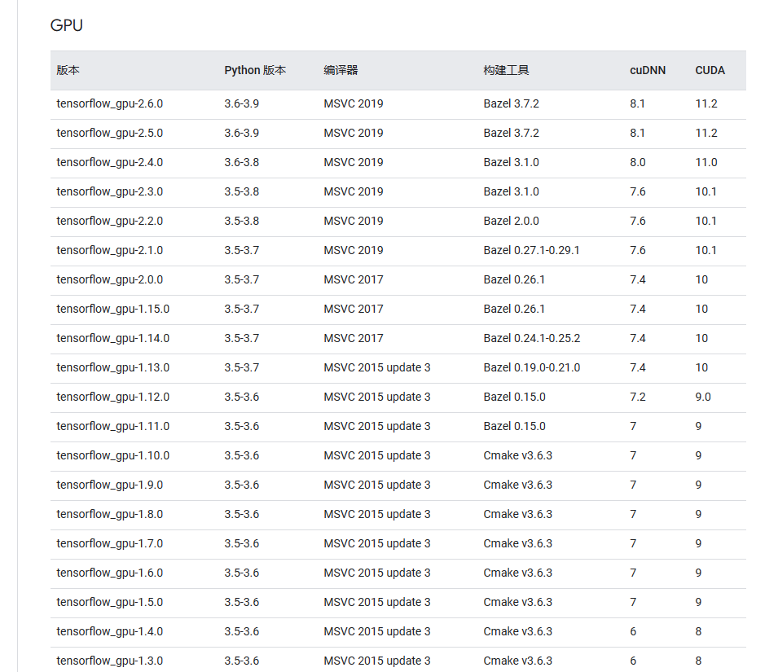

# TensorFlow

自从 TensorFlow 2.1 版本发布以后，不再需要显式地指定 GPU 版本的安装。在此之前，TensorFlow 需要分别提供 GPU 版本和 CPU 版本，用户需要根据自己的硬件环境选择相应的版本进行安装。

从 TensorFlow 2.1 版本开始，TensorFlow 默认包含了 GPU 支持，并且可以自动检测并使用可用的 GPU。无论您使用 CPU 还是 GPU 运行 TensorFlow，都可以直接通过以下命令安装 CPU 版本：

```shell
pip install tensorflow
```


## 报错：AttributeError: module 'tensorflow.compat.v2.__internal__' has no attribute '

报错是因为TensorFlow和keras的版本冲突问题

通过如下方式获取tensorflow的版本：

```python
import tensorflow as tf
tf.__version__
# 因为是版本冲突了，这里无法导入 import keras
import tensorflow.keras as tk
tk.__version__
```

解决：下载tensorflow对于版本的keras：

```python
pip install keras==x.x.x(版本号)
```

版本号为上面获取的。


根据安装的CUDA和cuDNN下载对应版本的tensorflow，2.0以上版本不用加gpu

[在 Windows 环境中从源代码构建  | TensorFlow](https://www.tensorflow.org/install/source_windows?hl=zh-cn#gpu)



