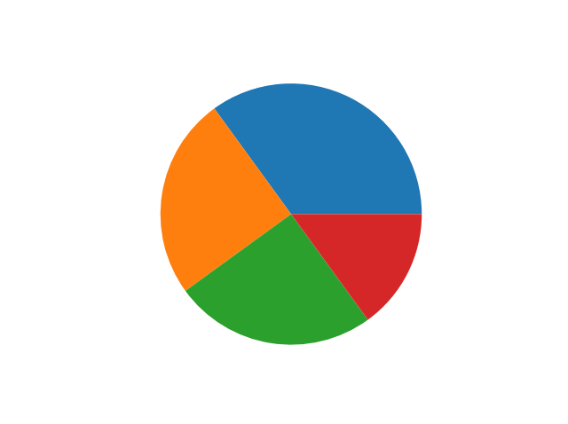

# matplotlib

目录：

[TOC]

参考：

[Matplotlib 教程 | 菜鸟教程 (runoob.com)](https://www.runoob.com/matplotlib/matplotlib-tutorial.html)

示例：

```python
import matplotlib.pyplot as plt

# 显示中文
from pylab import *
mpl.rcParams['font.sans-serif']=['SimHei']
mpl.rcParams['axes.unicode_minus']=False

plt.subplot(2, 1, 1)			# 绘制2行1列的图，当前为第一个图
plt.plot(x, y, label="a") 		# 由点绘制线段
plt.scatter(x, y, label='b')	# 绘制散点
plt.xlim(x_min, x_max)			# 限制x坐标的显示范围
plt.ylim(y_min, y_max)			# 限制y坐标的显示范围
plt.xlabel(str)					# x轴的名称
plt.ylabel(str)					# y轴的名称
plt.title(str, fontproperties='SimHei')		# 标题的名称，参数作用是显示中文
plt.legend()					# 显示上面定义的 label参数信息
plt.tight_layout()				# 绘制子图时才用，调整子图位置，防止标签信息重叠等问题
plt.show()						# 显示图片

plt.figure()					# 绘制一幅新图像
```


## 1、介绍

- Matplotlib 是 Python 的绘图库，它能让使用者很轻松地将数据图形化，并且提供多样化的输出格式。

- Matplotlib 可以用来绘制各种静态，动态，交互式的图表。

- Matplotlib 是一个非常强大的 Python 画图工具，我们可以使用该工具将很多数据通过图表的形式更直观的呈现出来。

- Matplotlib 可以绘制线图、散点图、等高线图、条形图、柱状图、3D 图形、甚至是图形动画等等。


## 2、Matplotlib Pyplot

- Pyplot 是 Matplotlib 的子库，提供了和 MATLAB 类似的绘图 API。

- Pyplot 是常用的绘图模块，能很方便让用户**绘制 2D 图表**。

- Pyplot 包含一系列绘图函数的相关函数，每个函数会对当前的图像进行一些修改，例如：给图像加上标记，生新的图像，在图像中产生新的绘图区域等等。

使用的时候，我们可以使用 import 导入 pyplot 库，并设置一个别名 **plt**：

```python
import matplotlib.pyplot as plt
```

这样我们就可以使用 **plt** 来引用 Pyplot 包的方法。

以下是一些常用的 pyplot 函数：

- `plot()`：用于绘制线图和散点图
- `scatter()`：用于绘制散点图
- `bar()`：用于绘制垂直条形图和水平条形图
- `hist()`：用于绘制直方图
- `pie()`：用于绘制饼图
- `imshow()`：用于绘制图像
- `subplots()`：用于创建子图


### 2.1 线段图 plt.plot()

- `plt.plot()`是用于Python中Matplotlib库的函数，它用于绘制一条或多条线段。
- `plot()`*函数是==绘制二维图形==的最基本函数。

**plot()** 用于画图它可以绘制点和线，语法格式如下：

```python
# 画单条线
plot([x], y, [fmt], *, data=None, **kwargs)
# 画多条线
plot([x], y, [fmt], [x2], y2, [fmt2], ..., **kwargs)
```

参数说明：

- **x, y：**点或线的节点，x 为 x 轴数据，y 为 y 轴数据，数据可以列表或数组。
- **fmt：**可选，定义基本格式（如颜色、标记和线条样式）。
- ***\*kwargs：**可选，用在二维平面图上，设置指定属性，如标签，线的宽度等。

- `ls`这个函数中的一个参数，它用于指定**绘制的线段的线型**。在Matplotlib中，可以使用若干种不同的线型来绘制线段。例如，线型 ‘Solid’ 指定了实线，而线型 ‘dash’ 指定了虚线。

示例：

```python
plt.plot(x, y, 'bo')  	# 创建 y 中数据与 x 中对应值的二维线图，使用蓝色实心圈绘制
plt.plot(xpoints, ypoints, 'o')		# 只绘制两个坐标点，而不是一条线
plt.plot(ypoints)		# 不指定 x 轴上的点，则 x 会根据 y 的值来设置为 0, 1, 2, 3..N-1。
plt.plot(x,y,x,z)		# 绘制多条线，
```


#### 1. 线型参数和标记字符

作为线性图的替代，可以通过向 plot() 函数 添加格式字符串来显示离散值。 可以使用以下格式化字符。

| 字符   | 描述         |
| :----- | :----------- |
| `'-'`  | 实线样式     |
| `'--'` | 短横线样式   |
| `'-.'` | 点划线样式   |
| `':'`  | 虚线样式     |
| `'.'`  | 点标记       |
| `','`  | 像素标记     |
| `'o'`  | 圆标记       |
| `'v'`  | 倒三角标记   |
| `'^'`  | 正三角标记   |
| `'<'`  | 左三角标记   |
| `'>'`  | 右三角标记   |
| `'1'`  | 下箭头标记   |
| `'2'`  | 上箭头标记   |
| `'3'`  | 左箭头标记   |
| `'4'`  | 右箭头标记   |
| `'s'`  | 正方形标记   |
| `'p'`  | 五边形标记   |
| `'*'`  | 星形标记     |
| `'h'`  | 六边形标记 1 |
| `'H'`  | 六边形标记 2 |
| `'+'`  | 加号标记     |
| `'x'`  | X 标记       |
| `'D'`  | 菱形标记     |
| `'d'`  | 窄菱形标记   |
| `'|'`  | 竖直线标记   |
| `'_'`  | 水平线标记   |

#### 2. 颜色字符

可以使用 `#008000` RGB 颜色符串，#号后跟6个16进制字符，前2个为红色，中间2个为绿色，后面2个为蓝色。

多条曲线不指定颜色时，会自动选择不同颜色。

| 字符  | 颜色   |
| :---- | :----- |
| `'b'` | 蓝色   |
| `'g'` | 绿色   |
| `'r'` | 红色   |
| `'c'` | 青色   |
| `'m'` | 品红色 |
| `'y'` | 黄色   |
| `'k'` | 黑色   |
| `'w'` | 白色   |


#### 3. fmt 参数

fmt 参数定义了基本格式，如标记、线条样式和颜色。

```python
fmt = '[marker][line][color]'
```

例如 **o:r**，**o** 表示实心圆标记，**:** 表示虚线，**r** 表示颜色为红色。

```python
ypoints = np.array([6, 2, 13, 10])

plt.plot(ypoints, 'o:r')
plt.show()
```


#### 4. 绘图标记 marker

绘图过程如果我们想要给坐标自定义一些不一样的标记，就可以使用 **plot()** 方法的 **marker** 参数来定义。

实例：

```python
plt.plot(ypoints, marker = 'o')
plt.show()
```


`marker` 可定义的符号：[Matplotlib 绘图标记 | 菜鸟教程 (runoob.com)](https://www.runoob.com/matplotlib/matplotlib-marker.html)

| 标记               | 符号                                          | 描述                                         |
| :----------------- | :-------------------------------------------- | :------------------------------------------- |
| "."                |                         | 点                                           |
| ","                |                         | 像素点                                       |
| "o"                |                         | 实心圆                                       |
| "v"                |                         | 下三角                                       |
| "^"                |  | 上三角                                       |
| "<"                |                         | 左三角                                       |
| ">"                |                         | 右三角                                       |
| "1"                |  | 下三叉                                       |
| "2"                |  | 上三叉                                       |
| "3"                |  | 左三叉                                       |
| "4"                |  | 右三叉                                       |
| "8"                |  | 八角形                                       |
| "s"                |  | 正方形                                       |
| "p"                |  | 五边形                                       |
| "P"                |  | 加号（填充）                                 |
| "*"                |  | 星号                                         |
| "h"                |  | 六边形 1                                     |
| "H"                |  | 六边形 2                                     |
| "+"                |  | 加号                                         |
| "x"                |  | 乘号 x                                       |
| "X"                |  | 乘号 x (填充)                                |
| "D"                |  | 菱形                                         |
| "d"                |  | 瘦菱形                                       |
| "\|"               |  | 竖线                                         |
| "_"                |  | 横线                                         |
| 0 (TICKLEFT)       |  | 左横线                                       |
| 1 (TICKRIGHT)      |  | 右横线                                       |
| 2 (TICKUP)         |  | 上竖线                                       |
| 3 (TICKDOWN)       |  | 下竖线                                       |
| 4 (CARETLEFT)      |  | 左箭头                                       |
| 5 (CARETRIGHT)     |  | 右箭头                                       |
| 6 (CARETUP)        |  | 上箭头                                       |
| 7 (CARETDOWN)      |  | 下箭头                                       |
| 8 (CARETLEFTBASE)  |  | 左箭头 (中间点为基准)                        |
| 9 (CARETRIGHTBASE) |  | 右箭头 (中间点为基准)                        |
| 10 (CARETUPBASE)   |  | 上箭头 (中间点为基准)                        |
| 11 (CARETDOWNBASE) |  | 下箭头 (中间点为基准)                        |
| "None", " " or ""  |                                               | 没有任何标记                                 |
| '$...$'            |  | 渲染指定的字符。例如 "$f$" 以字母 f 为标记。 |

定义下箭头：

```python
plt.plot([1, 2, 3], marker=matplotlib.markers.CARETDOWNBASE)
plt.show()
```


#### 5. 标记大小与颜色

我们可以自定义标记的大小与颜色，使用的参数分别是：

- markersize，简写为 **ms**：定义标记的大小。
- markerfacecolor，简写为 **mfc**：定义标记内部的颜色。
- markeredgecolor，简写为 **mec**：定义标记边框的颜色。

```python
# 设置标记大小
plt.plot(ypoints, marker = 'o', ms = 20)
# 设置标记外边框颜色
plt.plot(ypoints, marker = 'o', ms = 20, mec = 'r')
# 设置标记内部颜色
plt.plot(ypoints, marker = 'o', ms = 20, mfc = 'r')
# 自定义标记内部与边框的颜色
plt.plot(ypoints, marker = 'o', ms = 20, mec = '#4CAF50', mfc = '#4CAF50')
```


#### 6. 绘图线 ls

绘图过程如果我们自定义线的样式，包括线的类型、颜色和大小等。

==**线的类型**==

线的类型可以使用 **linestyle** 参数来定义，简写为 **`ls`**。

| 类型           | 简写      | 说明   |
| :------------- | :-------- | :----- |
| 'solid' (默认) | '-'       | 实线   |
| 'dotted'       | ':'       | 点虚线 |
| 'dashed'       | '--'      | 破折线 |
| 'dashdot'      | '-.'      | 点划线 |
| 'None'         | '' 或 ' ' | 不画线 |

实例：

```python
ypoints = np.array([6, 2, 13, 10])
plt.plot(ypoints, linestyle = 'dotted')
plt.show()
```


#### 7. 线的颜色 c

线的颜色可以使用 **color** 参数来定义，简写为 **c**。

可以使用颜色字符，也可自定义颜色类型，例如：**SeaGreen、#8FBC8F** 等，完整样式可以参考 [HTML 颜色值](https://www.runoob.com/html/html-colorvalues.html)。

实例：

```python
ypoints = np.array([6, 2, 13, 10])

plt.plot(ypoints, color = 'r')
plt.show()
```


#### 8. 线的宽度 lw

线的宽度可以使用 **linewidth** 参数来定义，简写为 **lw**，值可以是浮点数，如：**1**、**2.0**、**5.67** 等。

```python
ypoints = np.array([6, 2, 13, 10])

plt.plot(ypoints, linewidth = '12.5')
plt.show()
```


#### 9. 绘制多条线

plot() 方法中可以包含多对 x,y 值来绘制多条线。

```python
x1 = np.array([0, 1, 2, 3])
y1 = np.array([3, 7, 5, 9])
x2 = np.array([0, 1, 2, 3])
y2 = np.array([6, 2, 13, 10])

plt.plot(x1, y1, x2, y2)
plt.show()
```


### 2.2 轴标签和标题

#### 1. 轴标签

我们可以使用 **xlabel()** 和 **ylabel()** 方法来设置 x 轴和 y 轴的标签。

实例：

```python
x = np.array([1, 2, 3, 4])
y = np.array([1, 4, 9, 16])
plt.plot(x, y)

plt.xlabel("x - label")
plt.ylabel("y - label")

plt.show()
```


#### 2. 标题

我们可以使用 **title()** 方法来设置标题。

实例：

```python
x = np.array([1, 2, 3, 4])
y = np.array([1, 4, 9, 16])
plt.plot(x, y)

plt.title("RUNOOB TEST TITLE")
plt.xlabel("x - label")
plt.ylabel("y - label")

plt.show()
```


#### 3. 图形中文显示

**==1、下载开源字体==**

Matplotlib 默认情况不支持中文，我们可以使用以下简单的方法来解决。

这里我们使用思源黑体，思源黑体是 Adobe 与 Google 推出的一款开源字体。

官网：https://source.typekit.com/source-han-serif/cn/

GitHub 地址：https://github.com/adobe-fonts/source-han-sans/tree/release/OTF/SimplifiedChinese

打开链接后，在里面选一个就好了

可以下载个 OTF 字体，比如 SourceHanSansSC-Bold.otf，将该文件文件放在当前执行的代码文件中：

**SourceHanSansSC-Bold.otf 文件放在当前执行的代码文件中：**

```python
# fname 为 你下载的字体库路径，注意 SourceHanSansSC-Bold.otf 字体的路径
zhfont1 = matplotlib.font_manager.FontProperties(fname="SourceHanSansSC-Bold.otf") 

plt.title("菜鸟教程 - 测试", fontproperties=zhfont1) 
plt.xlabel("x 轴", fontproperties=zhfont1)
plt.ylabel("y 轴", fontproperties=zhfont1)
```

自定义字体样式：

```python
# fname 为 你下载的字体库路径，注意 SourceHanSansSC-Bold.otf 字体的路径，size 参数设置字体大小
zhfont1 = matplotlib.font_manager.FontProperties(fname="SourceHanSansSC-Bold.otf", size=18)
font1 = {'color':'blue','size':20}
font2 = {'color':'darkred','size':15}
x = np.arange(1,11)
y =  2  * x +  5

# fontdict 可以使用 css 来设置字体样式
plt.title("菜鸟教程 - 测试", fontproperties=zhfont1, fontdict = font1)
 
# fontproperties 设置中文显示，fontsize 设置字体大小
plt.xlabel("x 轴", fontproperties=zhfont1)
plt.ylabel("y 轴", fontproperties=zhfont1)
plt.plot(x,y)
plt.show()
```


**==2、使用系统的字体==**

```python
from matplotlib import pyplot as plt
import matplotlib
a=sorted([f.name for f in matplotlib.font_manager.fontManager.ttflist])

for i in a:
    print(i)
```

打印出你的 font_manager 的 ttflist 中所有注册的名字，找一个看中文字体例如：STFangsong(仿宋）,然后添加以下代码即可：

```python
plt.rcParams['font.family']=['STFangsong']
```


#### 4. 标题与标签的位置

**title()** 方法提供了 **`loc`** 参数来设置标题显示的位置，可以设置为: **'left', 'right', 和 'center'， 默认值为 'center'**。

**xlabel()** 方法提供了 **`loc`** 参数来设置 x 轴显示的位置，可以设置为: **'left', 'right', 和 'center'， 默认值为 'center'**。

**ylabel()** 方法提供了 **`loc`** 参数来设置 y 轴显示的位置，可以设置为: **'bottom', 'top', 和 'center'， 默认值为 'center'**。


### 2.3 网格线 grid()

我们可以使用 pyplot 中的 grid() 方法来设置图表中的网格线。

grid() 方法语法格式如下：

```python
matplotlib.pyplot.grid(b=None, which='major', axis='both', **kwargs)
```

**参数说明：**

- **b**：可选，默认为 None，可以设置布尔值，true 为显示网格线，false 为不显示，如果设置 **kwargs 参数，则值为 true。
- **which**：可选，可选值有 'major'、'minor' 和 'both'，默认为 'major'，表示应用更改的网格线。
- **axis**：可选，设置显示哪个方向的网格线，可以是取 'both'（默认），'x' 或 'y'，分别表示两个方向，x 轴方向或 y 轴方向。
- ***\*kwargs**：可选，设置网格样式，可以是 color='r', linestyle='-' 和 linewidth=2，分别表示网格线的颜色，样式和宽度。

实例：

使用默认参数：

```python
x = np.array([1, 2, 3, 4])
y = np.array([1, 4, 9, 16])

plt.title("RUNOOB grid() Test")
plt.xlabel("x - label")
plt.ylabel("y - label")
plt.plot(x, y)
plt.grid()
plt.show()
```


axis 参数使用 x，设置 x 轴方向显示网格线：

```python
...
plt.grid(axis='x')
plt.show()
```


以下实例添加一个简单的网格线，并设置网格线的样式，格式如下：

```python
grid(color = 'color', linestyle = 'linestyle', linewidth = number)
```

```python
...
plt.grid(color = 'r', linestyle = '--', linewidth = 0.5)
plt.show()
```


### 2.4 绘制多图

我们可以使用 pyplot 中的 **subplot()** 和 **subplots()** 方法来绘制多个子图。

**subplot()** 方法在绘图时需要指定位置，**subplots()** 方法可以一次生成多个，在调用时只需要调用生成对象的 ax 即可。

#### subplot()

```python
subplot(nrows, ncols, index, **kwargs)
subplot(pos, **kwargs)
subplot(**kwargs)
subplot(ax)
```

以上函数将整个绘图区域分成 nrows 行和 ncols 列，然后从左到右，从上到下的顺序对每个子区域进行编号 **1...N** ，左上的子区域的编号为 1、右下的区域编号为 N，编号可以通过参数 **index** 来设置。

示例：

```python
# 一行两列，两幅图
plt.subplot(1, 2, 1)
...
plt.subplot(1, 2, 2)
...

plt.suptitle("RUNOOB subplot Test")
plt.show()
```

#### subplots()

subplots() 方法语法格式如下：

```python
matplotlib.pyplot.subplots(nrows=1, ncols=1, *, sharex=False, sharey=False, 
                           squeeze=True, subplot_kw=None, gridspec_kw=None, **fig_kw)
```

**参数说明：**

- **nrows**：默认为 1，设置图表的行数。
- **ncols**：默认为 1，设置图表的列数。
- **sharex、sharey**：设置 x、y 轴是否共享属性，默认为 false，可设置为 'none'、'all'、'row' 或 'col'。 False 或 none 每个子图的 x 轴或 y 轴都是独立的，True 或 'all'：所有子图共享 x 轴或 y 轴，'row' 设置每个子图行共享一个 x 轴或 y 轴，'col'：设置每个子图列共享一个 x 轴或 y 轴。
- **squeeze**：布尔值，默认为 True，表示额外的维度从返回的 Axes(轴)对象中挤出，对于 N\*1 或 1\*N 个子图，返回一个 1 维数组，对于 N*M，N>1 和 M>1 返回一个 2 维数组。如果设置为 False，则不进行挤压操作，返回一个元素为 Axes 实例的2维数组，即使它最终是1x1。
- **subplot_kw**：可选，字典类型。把字典的关键字传递给 add_subplot() 来创建每个子图。
- **gridspec_kw**：可选，字典类型。把字典的关键字传递给 GridSpec 构造函数创建子图放在网格里(grid)。
- ***\*fig_kw**：把详细的关键字参数传给 figure() 函数。

实例：

```python
import matplotlib.pyplot as plt
import numpy as np

# 创建一些测试数据 -- 图1
x = np.linspace(0, 2*np.pi, 400)
y = np.sin(x**2)

# 创建一个画像和子图 -- 图2
fig, ax = plt.subplots()
ax.plot(x, y)
ax.set_title('Simple plot')

# 创建两个子图 -- 图3
f, (ax1, ax2) = plt.subplots(1, 2, sharey=True)
ax1.plot(x, y)
ax1.set_title('Sharing Y axis')
ax2.scatter(x, y)

# 创建四个子图 -- 图4
fig, axs = plt.subplots(2, 2, subplot_kw=dict(projection="polar"))
axs[0, 0].plot(x, y)
axs[1, 1].scatter(x, y)

# 共享 x 轴
plt.subplots(2, 2, sharex='col')

# 共享 y 轴
plt.subplots(2, 2, sharey='row')

# 共享 x 轴和 y 轴
plt.subplots(2, 2, sharex='all', sharey='all')

# 这个也是共享 x 轴和 y 轴
plt.subplots(2, 2, sharex=True, sharey=True)

# 创建标识为 10 的图，已经存在的则删除
fig, ax = plt.subplots(num=10, clear=True)

plt.show()
```


### 2.5 散点图 plt.scatter( )

使用方法：

```python
matplotlib.pyplot.scatter(x, y, s=None, c=None, marker=None, cmap=None, norm=None, vmin=None, vmax=None, 
                          alpha=None, linewidths=None, verts=None, edgecolors=None, hold=None, data=None, **kwargs)
```

参数说明：

- **x, y：** 散点的坐标
- **s：** 散点的面积 （默认为 20）
- **c：** 散点的颜色（默认值为蓝色，'b'，其余颜色同plt.plot( )）
- **marker：** 散点样式（默认值为实心圆，'o'，其余样式同plt.plot( )）
- **alpha：** 散点透明度（[0, 1]之间的数，0表示完全透明，1则表示完全不透明）
- **linewidths：** 散点的边缘线宽
- **edgecolors：** 散点的边缘颜色，默认为 'face'，可选值有 'face', 'none', None。
- **cmap： ** Colormap，默认 None，标量或者是一个 colormap 的名字，只有 c 是一个浮点数数组的时才使用。如果没有申明就是 image.cmap。
- **norm**：Normalize，默认 None，数据亮度在 0-1 之间，只有 c 是一个浮点数的数组的时才使用。
- **vmin，vmax：**亮度设置，在 norm 参数存在时会忽略。
- **plotnonfinite：**布尔值，设置是否使用非限定的 c ( inf, -inf 或 nan) 绘制点。

实例1：

```python
x = np.array([1, 2, 3, 4, 5, 6, 7, 8])
y = np.array([1, 4, 9, 16, 7, 11, 23, 18])

plt.scatter(x, y)
plt.show()
```


实例2：**设置图标大小**

```python
x = np.array([1, 2, 3, 4, 5, 6, 7, 8])
y = np.array([1, 4, 9, 16, 7, 11, 23, 18])
sizes = np.array([20,50,100,200,500,1000,60,90])
plt.scatter(x, y, s=sizes)
plt.show()
```


实例3： **自定义点的颜色**

```python
x = np.array([1, 2, 3, 4, 5, 6, 7, 8])
y = np.array([1, 4, 9, 16, 7, 11, 23, 18])
colors = np.array(["red","green","black","orange","purple","beige","cyan","magenta"])

plt.scatter(x, y, c=colors)
plt.show()
```


实例4：**使用随机数来设置散点图**

```python
# 随机数生成器的种子
np.random.seed(19680801)

N = 50
x = np.random.rand(N)
y = np.random.rand(N)
colors = np.random.rand(N)
area = (30 * np.random.rand(N))**2  # 0 to 15 point radii

plt.scatter(x, y, s=area, c=colors, alpha=0.5) # 设置颜色及透明度

plt.title("RUNOOB Scatter Test") # 设置标题

plt.show()
```


```python
rng = np.random.RandomState(0)

x = rng.randn(50)  # 随机产生50个X轴坐标
y = rng.randn(50)  # 随机产生50个Y轴坐标

colors = rng.rand(50)  # 随机产生50个用于颜色映射的数值
sizes = 700 * rng.rand(50)  # 随机产生50个用于改变散点面积的数值

plt.scatter(x, y, c=colors, s=sizes, alpha=0.3, cmap='viridis')

plt.show()
```

**这里从cmap中选取了一个叫做'viridis'的调色盘，其作用是，将参数c中获取到的数值，映射到“色盘”中已经对应好的颜色上**


**并且上图中从“色盘”viridis中获取到的颜色，可以通过plt.colorbar( )显示为颜色条（与热力图同理）。**


### 2.6 颜色条 Colormap

Matplotlib 模块提供了很多可用的颜色条。

颜色条就像一个颜色列表，其中每种颜色都有一个范围从 0 到 100 的值。

下面是一个颜色条的例子：


==设置颜色条需要使用 cmap 参数，**默认值为 'viridis'**，之后颜色值设置为 0 到 100 的数组。==

**如果要显示颜色条**，需要使用 **plt.colorbar()** 方法：

实例：

```python
x = np.array([5,7,8,7,2,17,2,9,4,11,12,9,6])
y = np.array([99,86,87,88,111,86,103,87,94,78,77,85,86])
colors = np.array([0, 10, 20, 30, 40, 45, 50, 55, 60, 70, 80, 90, 100])

plt.scatter(x, y, c=colors, cmap='viridis')

plt.colorbar()

plt.show()
```


换个颜色条参数， cmap 设置为 **afmhot_r**：

```python
import matplotlib.pyplot as plt
import numpy as np

x = np.array([5,7,8,7,2,17,2,9,4,11,12,9,6])
y = np.array([99,86,87,88,111,86,103,87,94,78,77,85,86])
colors = np.array([0, 10, 20, 30, 40, 45, 50, 55, 60, 70, 80, 90, 100])

plt.scatter(x, y, c=colors, cmap='afmhot_r')
plt.colorbar()
plt.show()
```


颜色条参数值：[Matplotlib 散点图 | 菜鸟教程 (runoob.com)](https://www.runoob.com/matplotlib/matplotlib-scatter.html)


### 2.7 柱形图

我们可以使用 pyplot 中的 bar() 方法来绘制柱形图。

bar() 方法语法格式如下：

```python
matplotlib.pyplot.bar(x, height, width=0.8, bottom=None, *, align='center', data=None, **kwargs)
```

**参数说明：**

**x**：浮点型数组，柱形图的 x 轴数据。

**height**：浮点型数组，柱形图的高度。

**width**：浮点型数组，柱形图的宽度。

**bottom**：浮点型数组，底座的 y 坐标，默认 0。

**align**：柱形图与 x 坐标的对齐方式，**'center' 以 x 位置为中心，这是默认值**。 'edge'：将柱形图的左边缘与 x 位置对齐。**要对齐右边缘的条形，可以传递负数的宽度值及 align='edge'。**

***\*kwargs：**：其他参数。

实例：

```python
x = np.array(["Runoob-1", "Runoob-2", "Runoob-3", "C-RUNOOB"])
y = np.array([12, 22, 6, 18])

plt.bar(x,y)
plt.show()
```


==垂直方向的柱形图可以使用 **barh()** 方法来设置：==

```python
x = np.array(["Runoob-1", "Runoob-2", "Runoob-3", "C-RUNOOB"])
y = np.array([12, 22, 6, 18])

plt.barh(x,y)
plt.show()
```


设置柱形图颜色：

```python
plt.bar(x, y, color = "#4CAF50")
plt.show()

# 自定义各个柱形的颜色
plt.bar(x, y,  color = ["#4CAF50","red","hotpink","#556B2F"])
plt.show()
```


设置柱形图宽度，**bar()** 方法使用 **width** 设置，**barh()** 方法使用 **height** 设置 height

```python
plt.bar(x, y, width = 0.1)
plt.show()
```


```python
plt.barh(x, y, height = 0.1)
plt.show()
```


### 2.8 饼图

饼图（Pie Chart）是一种常用的数据可视化图形，用来展示各类别在总体中所占的比例。

我们可以使用 pyplot 中的 **pie()** 方法来绘制饼图。

pie() 方法语法格式如下：

```python
matplotlib.pyplot.pie(x, explode=None, labels=None, colors=None, autopct=None, 
                      pctdistance=0.6, shadow=False, labeldistance=1.1, startangle=0, 
                      radius=1, counterclock=True, wedgeprops=None, textprops=None, 
                      center=0, 0, frame=False, rotatelabels=False, *, normalize=None, 
                      data=None)[source]
```

**参数说明：**

- **x**：浮点型数组或列表，用于绘制饼图的数据，表示每个扇形的面积。
- **explode**：数组，表示各个扇形之间的间隔，默认值为0。
- **labels**：列表，各个扇形的标签，默认值为 None。
- **colors**：数组，表示各个扇形的颜色，默认值为 None。
- **autopct**：设置饼图内各个扇形百分比显示格式，**%d%%** 整数百分比，**%0.1f** 一位小数， **%0.1f%%** 一位小数百分比， **%0.2f%%** 两位小数百分比。
- **labeldistance**：标签标记的绘制位置，相对于半径的比例，默认值为 1.1，如 **<1**则绘制在饼图内侧。
- **pctdistance：**：类似于 labeldistance，指定 autopct 的位置刻度，默认值为 0.6。
- **shadow：**：布尔值 True 或 False，设置饼图的阴影，默认为 False，不设置阴影。
- **radius：**：设置饼图的半径，默认为 1。
- **startangle：**：用于指定饼图的起始角度，默认为从 x 轴正方向逆时针画起，如设定 =90 则从 y 轴正方向画起。
- **counterclock**：布尔值，用于指定是否逆时针绘制扇形，默认为 True，即逆时针绘制，False 为顺时针。
- wedgeprops ：字典类型，默认值 None。用于指定扇形的属性，比如边框线颜色、边框线宽度等。例如：wedgeprops={'linewidth':5} 设置 wedge 线宽为5。
- textprops ：字典类型，用于指定文本标签的属性，比如字体大小、字体颜色等，默认值为 None。
- center ：浮点类型的列表，用于指定饼图的中心位置，默认值：(0,0)。
- frame ：布尔类型，用于指定是否绘制饼图的边框，默认值：False。如果是 True，绘制带有表的轴框架。
- rotatelabels ：布尔类型，用于指定是否旋转文本标签，默认为 False。如果为 True，旋转每个 label 到指定的角度。
- **data**：用于指定数据。如果设置了 data 参数，则可以直接使用数据框中的列作为 x、labels 等参数的值，无需再次传递。

除此之外，pie() 函数还可以**返回三个参数**：

- `wedges`：一个包含扇形对象的列表。
- `texts`：一个包含文本标签对象的列表。
- `autotexts`：一个包含自动生成的文本标签对象的列表。

实例：

```python
y = np.array([35, 25, 25, 15])

plt.pie(y)
plt.show()
```



设置饼图各个扇形的标签与颜色：

```python
y = np.array([35, 25, 25, 15])

plt.pie(y,
        labels=['A','B','C','D'], # 设置饼图标签
        colors=["#d5695d", "#5d8ca8", "#65a479", "#a564c9"], # 设置饼图颜色
       )
plt.title("RUNOOB Pie Test") # 设置标题
plt.show()
```


突出显示第二个扇形，并格式化输出百分比：

```python
import matplotlib.pyplot as plt

# 数据
sizes = [15, 30, 45, 10]

# 饼图的标签
labels = ['A', 'B', 'C', 'D']

# 饼图的颜色
colors = ['yellowgreen', 'gold', 'lightskyblue', 'lightcoral']

# 突出显示第二个扇形
explode = (0, 0.1, 0, 0)

# 绘制饼图
plt.pie(sizes, explode=explode, labels=labels, colors=colors,
        autopct='%1.1f%%', shadow=True, startangle=90)

# 标题
plt.title("RUNOOB Pie Test")

# 显示图形
plt.show()
```


```python
y = np.array([35, 25, 25, 15])

plt.pie(y,
        labels=['A','B','C','D'], # 设置饼图标签
        colors=["#d5695d", "#5d8ca8", "#65a479", "#a564c9"], # 设置饼图颜色
        explode=(0, 0.2, 0, 0), # 第二部分突出显示，值越大，距离中心越远
        autopct='%.2f%%', # 格式化输出百分比
       )
plt.title("RUNOOB Pie Test")
plt.show()
```


> **注意：** *默认情况下，第一个扇形的绘制是从 x 轴开始并逆时针移动：*
>
> 


### 2.9 直方图

我们可以使用 pyplot 中的 hist() 方法来绘制直方图。

hist() 方法是 Matplotlib 库中的 pyplot 子库中的一种用于绘制直方图的函数。

hist() 方法可以用于可视化数据的分布情况，例如观察数据的中心趋势、偏态和异常值等。

hist() 方法语法格式如下：

```python
matplotlib.pyplot.hist(x, bins=None, range=None, density=False, weights=None, 
                       cumulative=False, bottom=None, histtype='bar', align='mid', 
                       orientation='vertical', rwidth=None, log=False, color=None, 
                       label=None, stacked=False, **kwargs)
```

**参数说明：**

- `x`：表示要绘制直方图的数据，可以是一个一维数组或列表。
- `bins`：可选参数，表示直方图的箱数。默认为10。
- `range`：可选参数，表示直方图的值域范围，可以是一个二元组或列表。默认为None，即使用数据中的最小值和最大值。
- `density`：可选参数，表示是否将直方图归一化。默认为False，即直方图的高度为每个箱子内的样本数，而不是频率或概率密度。
- `weights`：可选参数，表示每个数据点的权重。默认为None。
- `cumulative`：可选参数，表示是否绘制累积分布图。默认为False。
- `bottom`：可选参数，表示直方图的起始高度。默认为None。
- `histtype`：可选参数，表示直方图的类型，可以是'bar'、'barstacked'、'step'、'stepfilled'等。默认为'bar'。
- `align`：可选参数，表示直方图箱子的对齐方式，可以是'left'、'mid'、'right'。默认为'mid'。
- `orientation`：可选参数，表示直方图的方向，可以是'vertical'、'horizontal'。默认为'vertical'。
- `rwidth`：可选参数，表示每个箱子的宽度。默认为None。
- `log`：可选参数，表示是否在y轴上使用对数刻度。默认为False。
- `color`：可选参数，表示直方图的颜色。
- `label`：可选参数，表示直方图的标签。
- `stacked`：可选参数，表示是否堆叠不同的直方图。默认为False。
- `**kwargs`：可选参数，表示其他绘图参数。

实例：

```python
# 生成一组随机数据
data = np.random.randn(1000)

# 绘制直方图
plt.hist(data, bins=30, color='skyblue', alpha=0.8)

# 设置图表属性
plt.title('RUNOOB hist() Test')
plt.xlabel('Value')
plt.ylabel('Frequency')

# 显示图表
plt.show()
```


以下实例演示了如何使用 hist() 函数绘制多个数据组的直方图，并进行比较：

```python
# 生成三组随机数据
data1 = np.random.normal(0, 1, 1000)	# 均值、标准差、数量
data2 = np.random.normal(2, 1, 1000)
data3 = np.random.normal(-2, 1, 1000)

# 绘制直方图
# 设置了 bins 参数为 30，这意味着将数据范围分成 30 个等宽的区间，然后统计每个区间内数据的频数。
plt.hist(data1, bins=30, alpha=0.5, label='Data 1')
plt.hist(data2, bins=30, alpha=0.5, label='Data 2')
plt.hist(data3, bins=30, alpha=0.5, label='Data 3')

# 设置图表属性
plt.title('RUNOOB hist() TEST')
plt.xlabel('Value')
plt.ylabel('Frequency')
plt.legend()

# 显示图表
plt.show()
```


#### 结合Pandas

```python
# 使用 NumPy 生成随机数
random_data = np.random.normal(170, 10, 250)
 
# 将数据转换为 Pandas DataFrame
dataframe = pd.DataFrame(random_data)
 
# 使用 Pandas hist() 方法绘制直方图
dataframe.hist()

# 设置图表属性
plt.title('RUNOOB hist() Test')
plt.xlabel('X-Value')
plt.ylabel('Y-Value')

# 显示图表
plt.show()
```


除了数据框之外，您还可以使用 Pandas 中的 Series 对象绘制直方图。只需将数据框中的列替换为 Series 对象即可。

```python
# 生成随机数据
data = pd.Series(np.random.normal(size=100))

# 绘制直方图
# bins 参数指定了直方图中的柱子数量
plt.hist(data, bins=10)

# 设置图形标题和坐标轴标签
plt.title('RUNOOB hist() Tes')
plt.xlabel('X-Values')
plt.ylabel('Y-Values')

# 显示图形
plt.show()
```


## 3、imshow() 方法

imshow() 函数是 Matplotlib 库中的一个函数，用于显示图像。

imshow() 函数常用于绘制二维的灰度图像或彩色图像。

imshow() 函数可用于绘制矩阵、热力图、地图等。

imshow() 方法语法格式如下：

```python
imshow(X, cmap=None, norm=None, aspect=None, interpolation=None, alpha=None, 
       vmin=None, vmax=None, origin=None, extent=None, shape=None, filternorm=1, 
       filterrad=4.0, imlim=None, resample=None, url=None, *, data=None, **kwargs)
```

**参数说明：**

- `X`：输入数据。可以是二维数组、三维数组、PIL图像对象、matplotlib路径对象等。
- `cmap`：颜色映射。用于控制图像中不同数值所对应的颜色。可以选择内置的颜色映射，如`gray`、`hot`、`jet`等，也可以自定义颜色映射。
- `norm`：用于控制数值的归一化方式。可以选择`Normalize`、`LogNorm`等归一化方法。
- `aspect`：控制图像纵横比（aspect ratio）。可以设置为`auto`或一个数字。
- `interpolation`：插值方法。用于控制图像的平滑程度和细节程度。可以选择`nearest`、`bilinear`、`bicubic`等插值方法。
- `alpha`：图像透明度。取值范围为0~1。
- `origin`：坐标轴原点的位置。可以设置为`upper`或`lower`。
- `extent`：控制显示的数据范围。可以设置为`[xmin, xmax, ymin, ymax]`。
- `vmin`、`vmax`：控制颜色映射的值域范围。
- `filternorm 和 filterrad`：用于图像滤波的对象。可以设置为`None`、`antigrain`、`freetype`等。
- `imlim`： 用于指定图像显示范围。
- `resample`：用于指定图像重采样方式。
- `url`：用于指定图像链接。

**实例：**

### 显示灰度图像

```python
# 生成一个二维随机数组
img = np.random.rand(10, 10)

# 绘制灰度图像
plt.imshow(img, cmap='gray')

# 显示图像
plt.show()
```


### 显示彩色图像

```python
# 生成一个随机的彩色图像
img = np.random.rand(10, 10, 3)

# 绘制彩色图像
# 由于彩色图像是三维数组，因此不需要设置 cmap 参数。
plt.imshow(img)

# 显示图像
plt.show()
```


### 显示热力图

```python
# 生成一个二维随机数组
data = np.random.rand(10, 10)

# 绘制热力图
# 我们设置了 cmap 参数为 hot，这意味着将使用热度颜色映射显示图像。
plt.imshow(data, cmap='hot')

# 显示图像
plt.colorbar()	# 颜色条
plt.show()
```


### 显示地图

```python
import matplotlib.pyplot as plt
import numpy as np
from PIL import Image

# 加载地图图像, 下载地址：https://static.runoob.com/images/demo/map.jpeg
img = Image.open('map.jpg')

# 转换为数组
data = np.array(img)

# 绘制地图
plt.imshow(data)

# 隐藏坐标轴
plt.axis('off')

# 显示图像
plt.show()
```


### 显示矩阵

```python
# 生成一个随机矩阵
data = np.random.rand(10, 10)

# 绘制矩阵
# 由于矩阵也是二维数组，因此可以使用 imshow() 函数将其显示出来。
plt.imshow(data)

# 显示图像
plt.show()
```


### 更多实例

以下创建了一个 4x4 的二维 numpy 数组，并对其进行了三种不同的 imshow 图像展示。

- 第一张展示了灰度的色彩映射方式，并且没有进行颜色的混合（blending）。
- 第二张展示了使用viridis颜色映射的图像，同样没有进行颜色的混合。
- 第三张展示了使用viridis颜色映射的图像，并且使用了**双立方插值方法**进行颜色混合。

```python
n = 4

# 创建一个 n x n 的二维numpy数组
a = np.reshape(np.linspace(0,1,n**2), (n,n))

plt.figure(figsize=(12,4.5))

# 第一张图展示灰度的色彩映射方式，并且没有进行颜色的混合
plt.subplot(131)
plt.imshow(a, cmap='gray', interpolation='nearest')
plt.xticks(range(n))
plt.yticks(range(n))
# 灰度映射，无混合
plt.title('Gray color map, no blending', y=1.02, fontsize=12)

# 第二张图展示使用viridis颜色映射的图像，同样没有进行颜色的混合
plt.subplot(132)
plt.imshow(a, cmap='viridis', interpolation='nearest')
plt.yticks([])
plt.xticks(range(n))
# Viridis映射，无混合
plt.title('Viridis color map, no blending', y=1.02, fontsize=12)

# 第三张图展示使用viridis颜色映射的图像，并且使用了双立方插值方法进行颜色混合
plt.subplot(133)
plt.imshow(a, cmap='viridis', interpolation='bicubic')
plt.yticks([])
plt.xticks(range(n))
# Viridis 映射，双立方混合
plt.title('Viridis color map, bicubic blending', y=1.02, fontsize=12)

plt.show()
```


## 4、imsave() 方法

imsave() 方法是 Matplotlib 库中用于将图像数据保存到磁盘上的函数。

通过 imsave() 方法我们可以轻松将生成的图像保存到我们指定的目录中。

imsave() 方法保存图片支持多种图像格式，例如 PNG、JPEG、BMP 等。

imsave() 方法的语法如下：

```python
matplotlib.pyplot.imsave(fname, arr, **kwargs)
```

**参数说明：**

- `fname`：保存图像的文件名，可以是相对路径或绝对路径。
- `arr`：表示图像的NumPy数组。
- `kwargs`：可选参数，用于指定保存的图像格式以及图像质量等参数。

实例：

```python
# 创建一个二维的图像数据
img_data = np.random.random((100, 100))

# 显示图像
plt.imshow(img_data)

# 保存图像到磁盘上
plt.imsave('runoob-test.png', img_data)
```

以上实例我们使用 imsave() 方法将这个图像保存到了当前目录下，文件名为 **runoob-test.png**。

由于没有指定图像格式，Matplotlib 库**默认将其保存为 PNG 格式的文件**。

打开当前目录，会发现一个 **runoob-test.png** 文件，如下所示：


使用 imsave() 方法将一个灰度图像和一幅彩色图像保存到当前目录上：

```python
# 创建一幅灰度图像
img_gray = np.random.random((100, 100))

# 创建一幅彩色图像
img_color = np.zeros((100, 100, 3))
img_color[:, :, 0] = np.random.random((100, 100))
img_color[:, :, 1] = np.random.random((100, 100))
img_color[:, :, 2] = np.random.random((100, 100))

# 显示灰度图像
plt.imshow(img_gray, cmap='gray')

# 保存灰度图像到磁盘上
plt.imsave('test_gray.png', img_gray, cmap='gray')

# 显示彩色图像
plt.imshow(img_color)

# 保存彩色图像到磁盘上
plt.imsave('test_color.jpg', img_color)
```

**在保存灰度图像时，我们使用了 cmap 参数将其保存为灰度图像格式。**

**在保存彩色图像时，我们没有指定图像格式，Matplotlib 库默认将其保存为 JPEG 格式的文件。**


## 5、imread() 方法

imread() 方法是 Matplotlib 库中的一个函数，用于从图像文件中读取图像数据。

imread() 方法返回一个 numpy.ndarray 对象，其形状是 **(nrows, ncols, nchannels)**，表示读取的图像的行数、列数和通道数：

- 如果图像是灰度图像，则 nchannels 为 1。
- 如果是彩色图像，则 nchannels 为 3 或 4，分别表示红、绿、蓝三个颜色通道和一个 alpha 通道。

imread() 方法的语法如下：

```python
matplotlib.pyplot.imread(fname, format=None)
```

**参数说明：**

- `fname`：指定了要读取的图像文件的文件名或文件路径，可以是相对路径或绝对路径。
- `format `：参数指定了图像文件的格式，如果不指定，则默认根据文件后缀名来自动识别格式。

实例：

```python
# 读取图像文件，下载地址：https://static.runoob.com/images/demo/map.jpeg
img = plt.imread('map.jpeg')

# 显示图像
plt.imshow(img)
plt.show()
```

注意：我们在显示图像时没有指定颜色映射，这是因为 imread() 方法已经将图像数据按照正确的颜色映射转换成了 RGB 格式，因此我们可以直接使用默认的颜色映射来显示图像。


我们可以通过更改 numpy 数组来修改图像。

例如，如果我们将数组乘以一个数 **0≤≤1**，我们将图像变暗：

```python
# 读取图像文件，下载地址：https://static.runoob.com/images/mix/tiger.jpeg
img_array = plt.imread('tiger.jpeg')
tiger = img_array/255
#print(tiger)

# 显示图像
plt.figure(figsize=(10,6))

for i in range(1,5):
    plt.subplot(2,2,i)
    x = 1 - 0.2*(i-1)
    plt.axis('off') #hide coordinate axes
    plt.title('x={:.1f}'.format(x))
    plt.imshow(tiger*x)

plt.show()
```


以下实例用于裁剪图像：

```python
# 读取图像文件，下载地址：https://static.runoob.com/images/mix/tiger.jpeg
img_array = plt.imread('tiger.jpeg')
tiger = img_array/255
#print(tiger)

# 显示图像
plt.figure(figsize=(6,6))
plt.imshow(tiger[:300,100:400,:])
plt.axis('off')
plt.show()
```


如果我们将 RGB 颜色的绿色和蓝色坐标的数组元素设置为 0，我们将得到红色的图像：

```python
# 读取图像文件，下载地址：https://static.runoob.com/images/mix/tiger.jpeg
img_array = plt.imread('tiger.jpeg')
tiger = img_array/255
#print(tiger)

# 显示图像
red_tiger = tiger.copy()

red_tiger[:, :,[1,2]] = 0

plt.figure(figsize=(10,10))
plt.imshow(red_tiger)
plt.axis('off')
plt.show()
```


## 6、其他

### 6.1 plt.tight_layout()

轴标签、标题、刻度标签等等会超出图形区域，导致显示不全。Matplotlib v1.1 引入了一个新的命令tight_layout()，作用是**自动调整子图参数**，使之填充整个图像区域。


### 6.2 坐标轴 plt.axis()

```python
matplotlib.pyplot.axis(*args, emit=True, **kwargs)
```

调用签名：

```python
xmin, xmax, ymin, ymax = axis()
xmin, xmax, ymin, ymax = axis([xmin, xmax, ymin, ymax])
xmin, xmax, ymin, ymax = axis(option)
xmin, xmax, ymin, ymax = axis(**kwargs)
```

`axis()`的返回值是由`xmin, xmax, ymin, ymax`构成的元组，元素类型为浮点数，分别表示`x,y`轴坐标的极值。

调用方式：

```python
# 不传递任何参数相当于坐标轴采用自动缩放（autoscale）方式，由matplotlib根据数据系列自动配置坐标轴范围和刻度。
axis()
# 传递一个由xmin, xmax, ymin, ymax构成的四元序列（列表、元组等）
axis([xmin, xmax, ymin, ymax])
# 传递xmin, xmax, ymin, ymax等关键字参数。
axis(**kwargs)
# 传递option字符串或布尔值
axis(option)
```

传递`option`字符串或布尔值，作用如下：

- 'on'：显示坐标轴、坐标轴标签，等价于布尔值True。
- 'off' ：不显示坐标轴、坐标轴标签，等价于布尔值False。注意Axes.set_frame_on只是不显示坐标轴，坐标轴标签仍然显示。
- 'equal'： 通过改变坐标轴极值等比例缩放， 相当于 ax.set_aspect('equal', adjustable='datalim')。在这种情况下，明确设置坐标轴极值无效。
- 'scaled'：通过改变绘图区维度等比例缩放， 相当于 ax.set_aspect('equal', adjustable='box', anchor='C')，不再进一步自动缩放坐标轴。
- 'tight'：仅修改坐标轴极值以显示全部数据，不再进一步自动缩放坐标轴。
- 'auto' ：自动缩放坐标轴。
- 'image'：使用’scaled’ 模式，但是坐标轴极值等于数据极值。
- 'square'：设置绘图区为正方形，类似于'scaled'，但是初始化时强制xmax-xmin == ymax-ymin。
  


### 6.3 plt.savefig()

```python
matplotlib.pyplot.savefig(fname, *, dpi='figure', format=None, metadata=None,
        bbox_inches=None, pad_inches=0.1,
        facecolor='auto', edgecolor='auto',
        backend=None, **kwargs
       )
```

参数说明：

- **fname：** 路径，或类似 Python 文件的对象
- **dpi：** **default:** `'figure'` 以每英寸点数为单位的分辨率。
- **bbox_inches：** **default:** `None`，若为 'tight' 则指定将图表多余的空白区域裁剪掉


### 6.4 隐藏坐标轴

```python
plt.axes().get_xaxis().set_visible(False) 
plt.axes().get_yaxis().set_visible(False)
```


### 6.5 刻度 plt.tick_params()

```python
plt.tick_params(axis='both', labelsize=14)
```

函数 tick_params() 设置刻度 的样式，其中指定的实参将影响 x 轴和 y 轴上的刻度（axes='both'），并将刻度标记的字号 设置为14（labelsize=14）。


### 6.6 显示中文的方法

#### 方法一

修改局部字体样式，在需要显示中文的地方增加 **fontproperties** 属性。

```python
import matplotlib.pyplot as plt
plt.plot([1, 2, 3, 4])
plt.title('自定义标题名称', fontproperties='SimHei')
plt.show()
```

#### 方法二

修改全局字体样式，需要使用 matplotlib 模块的 [rcParams](https://so.csdn.net/so/search?q=rcParams&spm=1001.2101.3001.7020)

```python
import matplotlib.pyplot as plt
from matplotlib import rcParams

rcParams['font.family'] = 'SimHei'
 
plt.plot([1, 2, 3, 4])
plt.title('自定义标题名称')
plt.show()
```

#### 方法三

在代码中插入以下三行代码

```python
from pylab import *
mpl.rcParams['font.sans-serif']=['SimHei']
mpl.rcParams['axes.unicode_minus']=False
```

#### 方法四

[彻底解决matplotlib中文显示问题 - 知乎](https://zhuanlan.zhihu.com/p/52779214?from_voters_page=true)

#### 附录：常用中文字体

- 宋体：SimSun

- 黑体：SimHei

- 微软雅黑：Microsoft YaHei

- 微软正黑体：Microsoft JhengHei

- 新宋体：NSimSun

- 新细明体：PMingLiU

- 细明体：MingLiU

- 标楷体：DFKai-SB

- 仿宋：FangSong

- 楷体：KaiTi

- 隶书：LiSu

- 幼圆：YouYuan

- 华文细黑：STXihei

- 华文楷体：STKaiti

- 华文宋体：STSong

- 华文中宋：STZhongsong

- 华文仿宋：STFangsong

- 方正舒体：FZShuTi

- 方正姚体：FZYaoti

- 华文彩云：STCaiyun

- 华文琥珀：STHupo

- 华文隶书：STLiti

- 华文行楷：STXingkai

- 华文新魏：STXinwei
  


