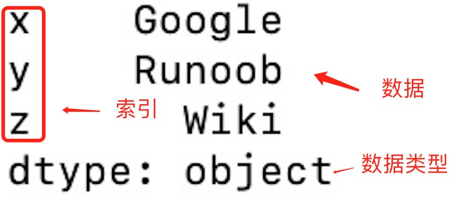
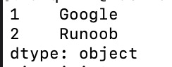

# pandas库

参考文献：

[Pandas教程（非常详细）_小熊coder的博客-CSDN博客](https://blog.csdn.net/qq_41854911/article/details/122696986?ops_request_misc=%7B%22request%5Fid%22%3A%22166886449416800180614791%22%2C%22scm%22%3A%2220140713.130102334..%22%7D&request_id=166886449416800180614791&biz_id=0&utm_medium=distribute.pc_search_result.none-task-blog-2~all~top_positive~default-2-122696986-null-null.142^v65^control,201^v3^add_ask,213^v2^t3_esquery_v3&utm_term=pandas教程&spm=1018.2226.3001.4187)

[Pandas 教程 | 菜鸟教程 (runoob.com)](https://www.runoob.com/pandas/pandas-tutorial.html)

**Pandas 是 Python 语言的一个扩展程序库，用于数据分析。**

Pandas 名字衍生自术语 "panel data"（面板数据）和 "Python data analysis"（Python 数据分析）。

Pandas 库基于 Python NumPy 库开发而来，因此，它可以与 Python 的科学计算库配合使用。Pandas 提供了两种数据结构，分别是 **Series（一维数组结构）与 DataFrame（二维数组结构）**，这两种数据结构极大地增强的了 Pandas 的数据分析能力。

Pandas 可以从各种文件格式比如 CSV、JSON、SQL、Microsoft Excel 导入数据。

Pandas 可以对各种数据进行运算操作，比如归并、再成形、选择，还有数据清洗和数据加工特征。

**数据结构**

**Series** 是一种类似于一维数组的对象，它由一组数据（各种Numpy数据类型）以及一组与之相关的数据标签（即索引）组成。

**DataFrame** 是一个表格型的数据结构，它含有一组有序的列，每列可以是不同的值类型（数值、字符串、布尔型值）。DataFrame 既有行索引也有列索引，它可以被看做由 Series 组成的字典（共同用一个索引）。

实例：

```python
import pandas as pd

mydataset = {
  'sites': ["Google", "Runoob", "Wiki"],
  'number': [1, 2, 3]
}

myvar = pd.DataFrame(mydataset)

print(myvar)
```


[TOC]


## 1、数据结构 - Series

Pandas Series 类似表格中的一个列（column），类似于一维数组，可以保存任何数据类型。

Series 由索引（index）和列组成，函数如下：

```python
pandas.Series( data, index, dtype, name, copy)
```

参数说明：

- **data**：一组数据(ndarray 类型)。
- **index**：数据索引标签，如果不指定，默认从 0 开始。
- **dtype**：数据类型，默认会自己判断。
- **name**：设置名称。
- **copy**：拷贝数据，默认为 False。

实例：

```python
import pandas as pd

a = [1, 2, 3]

myvar = pd.Series(a)

print(myvar)
```


从上图可知，**如果没有指定索引，索引值就从 0 开始**，我们可以根据索引值读取数据：

```python
print(myvar[1])

2
```

我们可以指定索引值：

```python
a = ["Google", "Runoob", "Wiki"]

myvar = pd.Series(a, index = ["x", "y", "z"])

print(myvar)
```



根据索引值读取数据:

```python
print(myvar["y"])

Runoob
```

我们也可以使用 key/value 对象，类似字典来创建 Series：

```python
sites = {1: "Google", 2: "Runoob", 3: "Wiki"}

myvar = pd.Series(sites)

print(myvar)
```


如果我们只需要字典中的一部分数据，只需要指定需要数据的索引即可，如下实例：

```python
myvar = pd.Series(sites, index = [1, 2])
```



设置 Series 名称参数：

```python
sites = {1: "Google", 2: "Runoob", 3: "Wiki"}

myvar = pd.Series(sites, index = [1, 2], name="RUNOOB-Series-TEST" )

print(myvar)
```


## 2、数据结构 - DataFrame

DataFrame 是一个表格型的数据结构，它含有一组有序的列，每列可以是不同的值类型（数值、字符串、布尔型值）。DataFrame 既有行索引也有列索引，它可以被看做由 Series 组成的字典（共同用一个索引）。


DataFrame 构造方法如下：

```python
pandas.DataFrame( data, index, columns, dtype, copy)
```

参数说明：

- **data**：一组数据(ndarray、series, map, lists, dict 等类型)。
- **index**：索引值，或者可以称为行标签。
- **columns**：列标签，默认为 RangeIndex (0, 1, 2, …, n) 。
- **dtype**：数据类型。
- **copy**：拷贝数据，默认为 False。

Pandas DataFrame 是一个二维的数组结构，类似二维数组。

实例：使用列表创建

```python
data = [['Google',10],['Runoob',12],['Wiki',13]]

df = pd.DataFrame(data,columns=['Site','Age'],dtype=float)

print(df)
```


以下实例使用 ndarrays 创建，ndarray 的长度必须相同， 如果传递了 index，则索引的长度应等于数组的长度。如果没有传递索引，则默认情况下，**索引将是range(n)，其中n是数组长度**。

实例：使用 ndarrays 创建

```python
data = {'Site':['Google', 'Runoob', 'Wiki'], 'Age':[10, 12, 13]}

df = pd.DataFrame(data)

print (df)
```


从以上输出结果可以知道， DataFrame 数据类型一个表格，包含 rows（行） 和 columns（列）：


还可以使用字典（key/value），其中字典的 key 为列名:

实例: 使用字典创建

```python
data = [{'a': 1, 'b': 2},{'a': 5, 'b': 10, 'c': 20}]

df = pd.DataFrame(data)

print (df)
```

  输出：

```python
   a   b     c
0  1   2   NaN
1  5  10  20.0
```

没有对应的部分数据为 **NaN**。

Pandas 可以使用 **`loc`** 属性返回指定行的数据，如果没有设置索引，第一行索引为 **0**，第二行索引为 **1**，以此类推：

```python
data = {
  "calories": [420, 380, 390],
  "duration": [50, 40, 45]
}

# 数据载入到 DataFrame 对象
df = pd.DataFrame(data)

# 返回第一行
print(df.loc[0])
# 返回第二行
print(df.loc[1])
```

输出：

```python
calories    420
duration     50
Name: 0, dtype: int64
calories    380
duration     40
Name: 1, dtype: int64
```

**注意：**返回结果其实就是一个 Pandas Series 数据。

也可以返回多行数据，使用 **[[ ... ]]** 格式，**...** 为各行的索引，以逗号隔开：

```python
# 返回第一行和第二行
print(df.loc[[0, 1]])
```

输出：

```python
   calories  duration
0       420        50
1       380        40
```

**注意：**返回结果其实就是一个 Pandas DataFrame 数据。

指定索引，使用 `loc` 返回指定索引:

```python
df = pd.DataFrame(data, index = ["day1", "day2", "day3"])
# 指定索引
print(df.loc["day2"])
```


## 3、CSV 文件

CSV（Comma-Separated Values，逗号分隔值，有时也称为字符分隔值，因为分隔字符也可以不是逗号），其文件以纯文本形式存储表格数据（数字和文本）。

CSV 是一种通用的、相对简单的文件格式，被用户、商业和科学广泛应用。

```python
pandas.read_csv(file)
pandas.to_csv(file)
```


Pandas 可以很方便的处理 CSV 文件，本文以 [nba.csv](https://static.runoob.com/download/nba.csv) 为例，你可以[下载 nba.csv](https://static.runoob.com/download/nba.csv) 或[打开 nba.csv](https://static.runoob.com/download/nba.csv.txt) 查看。

实例：

```python
df = pd.read_csv('nba.csv')

print(df.to_string())
```

**to_string()** 用于返回 DataFrame 类型的数据，如果不使用该函数，则输出结果为数据的前面 5 行和末尾 5 行，中间部分以 **...** 代替。

我们也可以使用 **to_csv()** 方法将 DataFrame 存储为 csv 文件：

```python
# 三个字段 name, site, age
nme = ["Google", "Runoob", "Taobao", "Wiki"]
st = ["www.google.com", "www.runoob.com", "www.taobao.com", "www.wikipedia.org"]
ag = [90, 40, 80, 98]
   
# 字典
dict = {'name': nme, 'site': st, 'age': ag}
     
df = pd.DataFrame(dict)
 
# 保存 dataframe
df.to_csv('site.csv')
```

执行成功后，我们打开 site.csv 文件，显示结果如下：


### 3.1 head()

**head( n )** 方法用于读取前面的 n 行，如果不填参数 n ，默认返回 5 行。


### 3.2 tail()

**tail( n )** 方法用于读取尾部的 n 行，如果不填参数 n ，默认返回 5 行，空行各个字段的值返回 **NaN**。


### 3.3 info()

info() 方法返回表格的一些基本信息：

```python
import pandas as pd

df = pd.read_csv('nba.csv')

print(df.info())
```

输出：

```python
<class 'pandas.core.frame.DataFrame'>
RangeIndex: 458 entries, 0 to 457          # 行数，458 行，第一行编号为 0
Data columns (total 9 columns):            # 列数，9列
 #   Column    Non-Null Count  Dtype       # 各列的数据类型
---  ------    --------------  -----  
 0   Name      457 non-null    object 
 1   Team      457 non-null    object 
 2   Number    457 non-null    float64
 3   Position  457 non-null    object 
 4   Age       457 non-null    float64
 5   Height    457 non-null    object 
 6   Weight    457 non-null    float64
 7   College   373 non-null    object         # non-null，意思为非空的数据    
 8   Salary    446 non-null    float64
dtypes: float64(4), object(5)                 # 类型
```

non-null 为非空数据，我们可以看到上面的信息中，总共 458 行，College 字段的空值最多。


## 4、JSON

JSON（**J**ava**S**cript **O**bject **N**otation，JavaScript 对象表示法），是存储和交换文本信息的语法，类似 XML。

JSON 比 XML 更小、更快，更易解析

Pandas 可以很方便的处理 JSON 数据，本文以 [sites.json](https://static.runoob.com/download/sites.json) 为例，内容如下：

```python
[
   {
   "id": "A001",
   "name": "菜鸟教程",
   "url": "www.runoob.com",
   "likes": 61
   },
   {
   "id": "A002",
   "name": "Google",
   "url": "www.google.com",
   "likes": 124
   },
   {
   "id": "A003",
   "name": "淘宝",
   "url": "www.taobao.com",
   "likes": 45
   }
]
```

实例：

```python
df = pd.read_json('sites.json')
   
print(df.to_string())
```

**to_string()** 用于返回 DataFrame 类型的数据，我们也可以直接处理 JSON 字符串。

```python
df = pd.DataFrame(data)

print(df)
```

输出：

```python
     id    name             url  likes
0  A001    菜鸟教程  www.runoob.com     61
1  A002  Google  www.google.com    124
2  A003      淘宝  www.taobao.com     45
```

JSON 对象与 Python 字典具有相同的格式，所以我们可以直接将 Python 字典转化为 DataFrame 数据：

```python
# 字典格式的 JSON                                                                                              
s = {
    "col1":{"row1":1,"row2":2,"row3":3},
    "col2":{"row1":"x","row2":"y","row3":"z"}
}

# 读取 JSON 转为 DataFrame                                                                                          
df = pd.DataFrame(s)
print(df)
```

输出：

```python
      col1 col2
row1     1    x
row2     2    y
row3     3    z
```

从 URL 中读取 JSON 数据：

```python
URL = 'https://static.runoob.com/download/sites.json'
df = pd.read_json(URL)
print(df)
```


### 4.1 内嵌的 JSON 数据

假设有一组内嵌的 JSON 数据文件 **nested_list.json** ：

```python
{
    "school_name": "ABC primary school",
    "class": "Year 1",
    "students": [
    {
        "id": "A001",
        "name": "Tom",
        "math": 60,
        "physics": 66,
        "chemistry": 61
    },
    {
        "id": "A002",
        "name": "James",
        "math": 89,
        "physics": 76,
        "chemistry": 51
    },
    {
        "id": "A003",
        "name": "Jenny",
        "math": 79,
        "physics": 90,
        "chemistry": 78
    }]
}
```

实例：

```python
df = pd.read_json('nested_list.json')

print(df)
```

输出：

```python
          school_name   class                                           students
0  ABC primary school  Year 1  {'id': 'A001', 'name': 'Tom', 'math': 60, 'phy...
1  ABC primary school  Year 1  {'id': 'A002', 'name': 'James', 'math': 89, 'p...
2  ABC primary school  Year 1  {'id': 'A003', 'name': 'Jenny', 'math': 79, 'p...
```

### 4.2 json_normalize()

这时我们就需要使用到 **json_normalize()** 方法将内嵌的数据完整的解析出来：

```python
import pandas as pd
import json

# 使用 Python JSON 模块载入数据
with open('nested_list.json','r') as f:
    data = json.loads(f.read())

# 展平数据
df_nested_list = pd.json_normalize(data, record_path =['students'])
print(df_nested_list)
```

输出：

```python
     id   name  math  physics  chemistry
0  A001    Tom    60       66         61
1  A002  James    89       76         51
2  A003  Jenny    79       90         78
```

**data = json.loads(f.read())** 使用 Python JSON 模块载入数据。

**json_normalize()** 使用了参数 **record_path** 并设置为 **['students']** 用于展开内嵌的 JSON 数据 **students**。

显示结果还没有包含 school_name 和 class 元素，如果需要展示出来可以使用 meta 参数来显示这些元数据：

```python
import pandas as pd
import json

# 使用 Python JSON 模块载入数据
with open('nested_list.json','r') as f:
    data = json.loads(f.read())

# 展平数据
df_nested_list = pd.json_normalize(
    data,
    record_path =['students'],
    meta=['school_name', 'class']
)
print(df_nested_list)
```

输出：

```python
     id   name  math  physics  chemistry         school_name   class
0  A001    Tom    60       66         61  ABC primary school  Year 1
1  A002  James    89       76         51  ABC primary school  Year 1
2  A003  Jenny    79       90         78  ABC primary school  Year 1
```

接下来，让我们尝试读取更复杂的 JSON 数据，该数据嵌套了列表和字典，数据文件 **nested_mix.json** 如下：

```python
{
    "school_name": "local primary school",
    "class": "Year 1",
    "info": {
      "president": "John Kasich",
      "address": "ABC road, London, UK",
      "contacts": {
        "email": "admin@e.com",
        "tel": "123456789"
      }
    },
    "students": [
    {
        "id": "A001",
        "name": "Tom",
        "math": 60,
        "physics": 66,
        "chemistry": 61
    },
    {
        "id": "A002",
        "name": "James",
        "math": 89,
        "physics": 76,
        "chemistry": 51
    },
    {
        "id": "A003",
        "name": "Jenny",
        "math": 79,
        "physics": 90,
        "chemistry": 78
    }]
}
```

nested_mix.json 文件转换为 DataFrame：

```python
import pandas as pd
import json

# 使用 Python JSON 模块载入数据
with open('nested_mix.json','r') as f:
    data = json.loads(f.read())
   
df = pd.json_normalize(
    data,
    record_path =['students'],
    meta=[
        'class',
        ['info', 'president'],
        ['info', 'contacts', 'tel']
    ]
)

print(df)
```

以上实例输出结果为：

```python
     id   name  math  physics  chemistry   class info.president info.contacts.tel
0  A001    Tom    60       66         61  Year 1    John Kasich         123456789
1  A002  James    89       76         51  Year 1    John Kasich         123456789
2  A003  Jenny    79       90         78  Year 1    John Kasich         123456789
```


### 4.3 读取内嵌数据中的一组数据

以下是实例文件 **nested_deep.json**，我们只读取内嵌中的 **math** 字段：

```python
{
    "school_name": "local primary school",
    "class": "Year 1",
    "students": [
    {
        "id": "A001",
        "name": "Tom",
        "grade": {
            "math": 60,
            "physics": 66,
            "chemistry": 61
        }
 
    },
    {
        "id": "A002",
        "name": "James",
        "grade": {
            "math": 89,
            "physics": 76,
            "chemistry": 51
        }
       
    },
    {
        "id": "A003",
        "name": "Jenny",
        "grade": {
            "math": 79,
            "physics": 90,
            "chemistry": 78
        }
    }]
}
```

这里我们需要使用到 **glom** 模块来处理数据套嵌，**glom** 模块允许我们使用 **.** 来访问内嵌对象的属性。

第一次使用我们需要安装 glom：

```
pip3 install glom
```

实例：

```python
import pandas as pd
from glom import glom

df = pd.read_json('nested_deep.json')

data = df['students'].apply(lambda row: glom(row, 'grade.math'))
print(data)
```

输出：

```python
0    60
1    89
2    79
Name: students, dtype: int64
```


## 5、数据清洗

数据清洗是对一些没有用的数据进行处理的过程。

很多数据集存在数据缺失、数据格式错误、错误数据或重复数据的情况，如果要对使数据分析更加准确，就需要对这些没有用的数据进行处理。

本文使用到的测试数据 [property-data.csv](https://static.runoob.com/download/property-data.csv) 如下：


上表包含了四种空数据：

- n/a
- NA
- —
- na


### 5.1 清洗空值

#### dropna()

如果我们要删除包含空字段的行，可以使用 **dropna()** 方法，语法格式如下：

```python
DataFrame.dropna(axis=0, how='any', thresh=None, subset=None, inplace=False)
```

**参数说明：**

- axis：默认为 **0**，表示逢空值剔除整行，如果设置参数 **axis＝1** 表示逢空值去掉整列。
- how：默认为 **'any'** 如果一行（或一列）里任何一个数据有出现 NA 就去掉整行，如果设置 **how='all'** 一行（或列）都是 NA 才去掉这整行。
- thresh：设置需要多少非空值的数据才可以保留下来的。
- subset：设置想要检查的列。如果是多个列，可以使用列名的 list 作为参数。
- inplace：如果设置 True，将计算得到的值直接覆盖之前的值并返回 None，修改的是源数据。

我们可以通过 **isnull()** 判断各个单元格是否为空。

```python
df = pd.read_csv('property-data.csv')

print (df['NUM_BEDROOMS'])
print (df['NUM_BEDROOMS'].isnull())
```


以上例子中我们看到 Pandas 把 n/a 和 NA 当作空数据，na 不是空数据，不符合我们要求，我们可以指定空数据类型：

```python
missing_values = ["n/a", "na", "--"]
df = pd.read_csv('property-data.csv', na_values = missing_values)

print (df['NUM_BEDROOMS'])
print (df['NUM_BEDROOMS'].isnull())
```


删除包含空数据的行：

```python
df = pd.read_csv('property-data.csv')

new_df = df.dropna()

print(new_df.to_string())
```


**注意：**默认情况下，dropna() 方法返回一个新的 DataFrame，不会修改源数据。

如果你要修改源数据 DataFrame, 可以使用 **inplace = True** 参数。

我们也可以移除指定列有空值的行：

```python
df.dropna(subset=['ST_NUM'], inplace = True)

print(df.to_string())
```


#### fillna()

我们也可以 **fillna()** 方法来替换一些空字段：

```python
df = pd.read_csv('property-data.csv')

df.fillna(12345, inplace = True)
# 我们也可以指定某一个列来替换数据
# df['PID'].fillna(12345, inplace = True)

print(df.to_string())
```


#### mean()、median() 和 mode()

替换空单元格的常用方法是计算列的均值、中位数值或众数。

Pandas使用 **mean()**、**median()** 和 **mode()** 方法计算列的均值（所有值加起来的平均值）、中位数值（排序后排在中间的数）和众数（出现频率最高的数）。

使用 mean() 方法计算列的均值并替换空单元格：

```python
df = pd.read_csv('property-data.csv')

# 均值
x = df["ST_NUM"].mean()
# 中位数
# x = df["ST_NUM"].median()
# 众数
# x = df["ST_NUM"].mode()

df["ST_NUM"].fillna(x, inplace = True)

print(df.to_string())
```


### 5.2 清洗格式错误数据

数据格式错误的单元格会使数据分析变得困难，甚至不可能。

我们可以通过包含空单元格的行，或者将列中的所有单元格转换为相同格式的数据。

以下实例会格式化日期：

```python
# 第三个日期格式错误
data = {
  "Date": ['2020/12/01', '2020/12/02' , '20201226'],
  "duration": [50, 40, 45]
}

df = pd.DataFrame(data, index = ["day1", "day2", "day3"])

df['Date'] = pd.to_datetime(df['Date'])

print(df.to_string())
```

输出：

```python
           Date  duration
day1 2020-12-01        50
day2 2020-12-02        40
day3 2020-12-26        45
```


### 5.3 清洗错误数据

数据错误也是很常见的情况，我们可以对错误的数据进行替换或移除。

以下实例会替换错误年龄的数据：

```python
person = {
  "name": ['Google', 'Runoob' , 'Taobao'],
  "age": [50, 40, 12345]    # 12345 年龄数据是错误的
}

df = pd.DataFrame(person)

df.loc[2, 'age'] = 30 # 修改数据

print(df.to_string())
```

也可以设置条件语句：

```python
for x in df.index:
  if df.loc[x, "age"] > 120:
    df.loc[x, "age"] = 120

print(df.to_string())
```

也可以将错误数据的行删除：

```python
for x in df.index:
  if df.loc[x, "age"] > 120:
    df.drop(x, inplace = True)

print(df.to_string())
```


### 5.4 清洗重复数据

如果我们要清洗重复数据，可以使用 **duplicated()** 和 **drop_duplicates()** 方法。

如果对应的数据是重复的，**duplicated()** 会返回 True，否则返回 False。

```python
person = {
  "name": ['Google', 'Runoob', 'Runoob', 'Taobao'],
  "age": [50, 40, 40, 23]  
}
df = pd.DataFrame(person)

print(df.duplicated())
```

输出：

```python
0    False
1    False
2     True
3    False
dtype: bool
```

删除重复数据，可以直接使用**drop_duplicates()** 方法。

```python
persons = {
  "name": ['Google', 'Runoob', 'Runoob', 'Taobao'],
  "age": [50, 40, 40, 23]  
}

df = pd.DataFrame(persons)

df.drop_duplicates(inplace = True)
print(df)
```

输出：

```python
     name  age
0  Google   50
1  Runoob   40
3  Taobao   23
```


## 6、常用函数

### 6.1 读取数据

| 函数                                  | 说明                       |
| :------------------------------------ | :------------------------- |
| pd.read_csv(filename)                 | 读取 CSV 文件；            |
| pd.read_excel(filename)               | 读取 Excel 文件；          |
| pd.read_sql(query, connection_object) | 从 SQL 数据库读取数据；    |
| pd.read_json(json_string)             | 从 JSON 字符串中读取数据； |
| pd.read_html(url)                     | 从 HTML 页面中读取数据。   |

### 6.2 查看数据

| 函数          | 说明                                                       |
| :------------ | :--------------------------------------------------------- |
| df.head(n)    | 显示前 n 行数据；                                          |
| df.tail(n)    | 显示后 n 行数据；                                          |
| df.info()     | 显示数据的信息，包括列名、数据类型、缺失值等；             |
| df.describe() | 显示数据的基本统计信息，包括均值、方差、最大值、最小值等； |
| df.shape      | 显示数据的行数和列数。                                     |

### 6.3 数据清洗

| 函数                             | 说明                     |
| :------------------------------- | :----------------------- |
| df.dropna()                      | 删除包含缺失值的行或列； |
| df.fillna(value)                 | 将缺失值替换为指定的值； |
| df.replace(old_value, new_value) | 将指定值替换为新值；     |
| df.duplicated()                  | 检查是否有重复的数据；   |
| df.drop_duplicates()             | 删除重复的数据。         |

### 6.4 数据选择和切片

| 函数                                          | 说明                         |
| :-------------------------------------------- | :--------------------------- |
| df[column_name]                               | 选择指定的列；               |
| df.loc[row_index, column_name]                | 通过标签选择数据；           |
| df.iloc[row_index, column_index]              | 通过位置选择数据；           |
| df.ix[row_index, column_name]                 | 通过标签或位置选择数据；     |
| df.filter(items=[column_name1, column_name2]) | 选择指定的列；               |
| df.filter(regex='regex')                      | 选择列名匹配正则表达式的列； |
| df.sample(n)                                  | 随机选择 n 行数据。          |

### 6.5 数据排序

| 函数                                                         | 说明                 |
| :----------------------------------------------------------- | :------------------- |
| df.sort_values(column_name)                                  | 按照指定列的值排序； |
| df.sort_values([column_name1, column_name2], ascending=[True, False]) | 按照多个列的值排序； |
| df.sort_index()                                              | 按照索引排序。       |

### 6.6 数据分组和聚合

| 函数                                            | 说明                         |
| :---------------------------------------------- | :--------------------------- |
| df.groupby(column_name)                         | 按照指定列进行分组；         |
| df.aggregate(function_name)                     | 对分组后的数据进行聚合操作； |
| df.pivot_table(values, index, columns, aggfunc) | 生成透视表。                 |

### 6.7 数据合并

| 函数                               | 说明                             |
| :--------------------------------- | :------------------------------- |
| pd.concat([df1, df2])              | 将多个数据框按照行或列进行合并； |
| pd.merge(df1, df2, on=column_name) | 按照指定列将两个数据框进行合并。 |

### 6.8 数据选择和过滤

| 函数                                 | 说明                                   |
| :----------------------------------- | :------------------------------------- |
| df.loc[row_indexer, column_indexer]  | 按标签选择行和列。                     |
| df.iloc[row_indexer, column_indexer] | 按位置选择行和列。                     |
| df[df['column_name'] > value]        | 选择列中满足条件的行。                 |
| df.query('column_name > value')      | 使用字符串表达式选择列中满足条件的行。 |

### 6.9 数据统计和描述

| 函数          | 说明                                                 |
| :------------ | :--------------------------------------------------- |
| df.describe() | 计算基本统计信息，如均值、标准差、最小值、最大值等。 |
| df.mean()     | 计算每列的平均值。                                   |
| df.median()   | 计算每列的中位数。                                   |
| df.mode()     | 计算每列的众数。                                     |
| df.count()    | 计算每列非缺失值的数量。                             |


## 创建DataFrame数据对象

### pd.DataFrame()

```python
class DataFrame(
		data=None, 
		index: Optional[Axes]=None, # 行标
		columns: Optional[Axes]=None,  # 列标
		dtype: Optional[Dtype]=None,  # 存储的数据类型
		copy: bool=False)
```

示例：

```python
import pandas as pd
aa = pd.DataFrame(index=range(3), columns=['a', 'b', 'c'])
```

在这个dataframe中是没有数据的，如果输出就会看到：

|      | a    | b    | c    |
| ---- | ---- | ---- | ---- |
| 0    | NaN  | NaN  | NaN  |
| 1    | NaN  | NaN  | NaN  |
| 2    | NaN  | NaN  | NaN  |


### loc()函数

```python
df.loc[index]
```

示例：

按行添加：

```python
aa.loc[0] = (0, (0.5,), (0.5,))
```

按列添加：

```python
aa.loc[:, 'a'] = 0
```


## 绘图

### 绘制散点图矩阵pd.plotting.scatter_matrix()

pandas 有一个绘制散点图矩阵(scatter_matrix)的函数，叫作 scatter_matrix。

```python
pd.plotting.scatter_matrix(frame,alpha=0.5,c,figsize=None,ax=None,diagonal='hist',
                           marker='.',density_kwds=None,hist_kwds=None, range_padding=0.05, **kwds)
```

参数说明：

- **frame**：pandas dataframe对象

- **alpha**： 图像透明度，一般取(0,1]

- **c**：颜色，用不同着色度区分不同种类

- **figsize**：以英寸为单位的图像大小，一般以元组 (width, height) 形式设置

- **ax**：可选一般为none

- **diagonal**： 必须且只能在{‘hist’, ‘kde’}中选择1个，’hist’表示**直方图**(Histogram plot),’kde’表示**核密度估计**(Kernel Density Estimation)；该参数是scatter_matrix函数的关键参数

- **marker**：Matplotlib可用的标记类型，如`.`，`,`，`o`等

    `.` ：小圆点	

    `o` 或 `0` ：大圆点	

    `,` ：正方形

    `1` ：美元（类似于奔驰的标志 ）

- **density_kwds**：(other plotting keyword arguments，可选)，与kde相关的字典参数

- **hist_kwds**：与hist相关的字典参数

- **range_padding**：(float, 可选)，图像在x轴、y轴原点附近的留白(padding)，该值越大，留白距离越大，图像远离坐标原点

- **kwds**：与scatter_matrix函数本身相关的字典参数


实例：

```python
grr = pd.plotting.scatter_matrix(iris_dataframe, c=y_train, figsize=(15, 15), marker='0',
 									hist_kwds={'bins': 50}, s=60, alpha=.8)
```


c=y_train 表示按照 y_train 着色