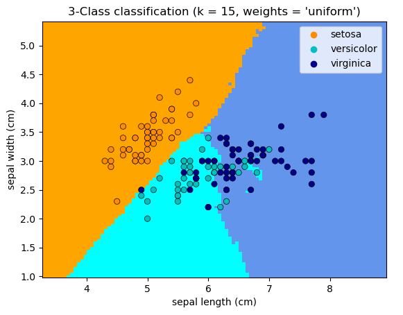
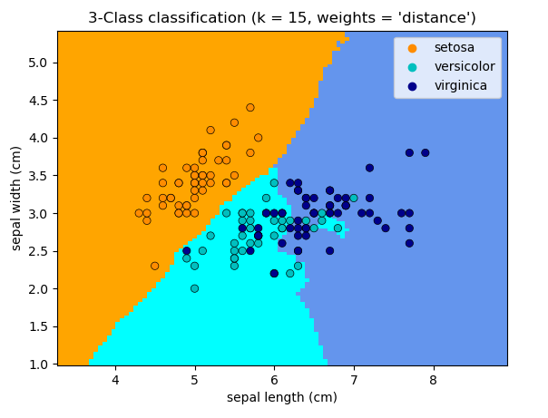

# scikit-learning


## 1、数据集

### 1.1 鸢尾花数据集sklearn.datasets.load_iris

```python
from sklearn.datasets import load_iris
iris_dataset = load_iris()
```

数据集信息：

- 这是一个三分类数据集
- 这个数据集包括 150 个数据点，每个数据点有 4 个特征
- 这 150 个数据点中，50 个为 setosa ，50 个为 versicolor ，50 个为 virginica


### 1.2 威斯康星州乳腺癌数据集

威斯康星州乳腺癌数据集（简称 cancer），里面记录了乳腺癌肿瘤的临床测量数据。

每个肿瘤都被标记为“良性”（benign，表示无害肿瘤）或“恶性”（malignant，表示癌性肿瘤），其任务是基于人体组织的测量数据来学习预测肿瘤是否为恶性。

```python
from sklearn.datasets import load_breast_cancer
cancer = load_breast_cancer()
print("cancer.keys(): \n{}".format(cancer.keys()))
```

输出：

```python
cancer.keys():
dict_keys(['feature_names', 'data', 'DESCR', 'target', 'target_names'])
```

> 包含在 scikit-learn 中的数据集通常被保存为 Bunch 对象，里面包含真实数据以及一些数据集信息。关于 Bunch 对象，你只需要知道它与字典很相似，而且还有一个额外的好处，就是你可以用点操作符来访问对象的值（比如用 bunch.key 来代替 bunch['key']）。

数据集信息：

- **这是一个二分类数据集**

- 这个数据集共包含 569 个数据点，每个数据点有 30 个特征
- 在 569 个数据点中，212 个被标记为恶性，357 个被标记为良性


### 1.3 波士顿房价数据集

与这个数据集相关的任务是，利用犯罪率、是否邻近查尔斯河、公路可达性等信息，来预测 20 世纪 70 年代波士顿地区房屋价格的中位数。

```python
from sklearn.datasets import load_boston
boston = load_boston()
```

数据集信息：

- **这是一个回归数据集**
- 这个数据集包含 506 个数据点和 13 个特征


### 1.4 划分训练集和测试集train_test_split

使用方式：

```python
from sklearn.model_selection import train_test_split
X_train, X_test, y_train, y_test = train_test_split(X,y,test_size=0.25, random_state=0, stratify=y)
```

`train_test_split` 是 scikit-learn 中的一个函数，它可以将数据集随机分为训练集和测试集。该函数有以下参数:

- `X`, `y`：要进行分割的数据。

- `test_size`：测试集所占比例，可以是一个小数或一个整数(表示样本数量)。

- `train_size`：训练集所占比例，可以是一个小数或一个整数(表示样本数量)。

    如果同时设置了 `test_size` 和 `train_size`，则优先使用 `train_size`。

    如果没有指定，则默认测试集的大小为0.25。

- `random_state`：随机种子，**如果指定了这个值，那么每次分割都会生成相同的结果。**

- `shuffle`：是否在分割前将数据打乱，默认为 True。

- `stratify`: 分层采样，根据样本的某一特征分层抽样。

    stratify 保证训练集和测试集中花的三大类的比例与输入比例相同。

如果想将全部数据用于训练，可以使用：

```python
X_train, X_test, y_train, y_test = train_test_split(X, y, test_size=0, shuffle=True, random_state=42)
```

如果想将全部数据用于测试，可以使用：

```python
X_train, X_test, y_train, y_test = train_test_split(X, y, train_size=0, shuffle=True, random_state=42)
```


## 2、KNN（K近邻算法）

### K近邻分类sklearn.neighbors.KNeighborsClassifier

分类器执行k最近邻投票。

```python
class sklearn.neighbors.KNeighborsClassifier(
    		n_neighbors=5, *, weights='uniform', algorithm='auto', 
    		leaf_size=30, p=2, metric='minkowski', metric_params=None, 
    		n_jobs=None, **kwargs）
```

参数说明：

| **参数**          | **说明**                                                     |
| ----------------- | ------------------------------------------------------------ |
| **n_neighbors**   | **int, default=5** <br />默认情况下用于[kneighbors](https://scikit-learn.org.cn/view/695.html)查询的近邻数 |
| **weights**       | **{‘uniform’, ‘distance’} or callable, default=’uniform’** <br />预测中使用的权重函数。 可能的值： <br />`'uniform'` ：**统一权重**。 每个邻域中的所有点均被加权。<br />`'distance'` ：**权重点与其距离的倒数**。 在这种情况下，查询点的**近邻比远处的近邻具有更大的影响力**。 <br />[callable]：**用户定义的函数**，该函数接受距离数组，并返回包含权重的相同形状的数组。 |
| **algorithm**     | **{‘auto’, ‘ball_tree’, ‘kd_tree’, ‘brute’}, default=’auto’** <br />用于计算最近临近点的算法： <br />`'ball_tree'` :   将使用[BallTree](https://scikit-learn.org.cn/view/691.html) <br />`'kd_tree'` ：    将使用[KDTree](https://scikit-learn.org.cn/view/693.html) <br />`'brute'` ：        将使用暴力搜索。 <br />`'auto'` ：          **将尝试根据传递给fit方法的值来决定最合适的算法。** <br />注意：在稀疏输入上进行拟合将使用蛮力覆盖此参数的设置。 |
| **leaf_size**     | **int, default=30** <br />叶大小传递给BallTree或KDTree。 <br />这会影响构造和查询的速度，以及存储树所需的内存。 最佳值取决于问题的性质。 |
| **p**             | **int, default=2** <br />**Minkowski指标的功率参数**。 当 p = 1 时，这等效于对 p = 2 使用 manhattan_distance（l1）和euclidean_distance（l2）。对于任意p，使用 minkowski_distance（l_p）。 |
| **metric**        | **str or callable, default=’minkowski’** <br />**树使用的距离度量**。 **默认度量标准为minkowski，p = 2等于标准欧几里德度量标准。** <br />有关可用度量的列表，请参见 DistanceMetric 的文档。 如果度量是“预先计算的”，则X被假定为距离矩阵，并且在拟合过程中必须为平方。 X可能是一个稀疏图，在这种情况下，只有“非零”元素可以被视为临近点。 |
| **metric_params** | **dict, default=None** <br />度量功能的其他关键字参数。      |
| **n_jobs**        | **int, default=None** <br />为临近点搜索运行的**并行作业数**。 除非在[joblib.parallel_backend](https://joblib.readthedocs.io/en/latest/parallel.html#joblib.parallel_backend)上下文中，否则None表示1。 -1表示使用所有处理器。 有关更多详细信息，请参见[词汇表](http://scikit-learn.org.cn/lists/91.html#参数)。 **不会影响拟合方法。** |

属性说明：

| 属性                         | 说明                                                         |
| ---------------------------- | ------------------------------------------------------------ |
| **classes_**                 | **array of shape (n_classes,)** <br />分类器已知的类标签     |
| **effective_metric_**        | **str or callble** <br />使用的距离度量。 它将与度量参数相同或与其相同，例如 如果metric参数设置为“ minkowski”，而p参数设置为2，则为“ euclidean”。 |
| **effective_metric_params_** | **dict** <br />度量功能的其他关键字参数。 对于大多数指标而言，它与metric_params参数相同，但是，如果将valid_metric_属性设置为“ minkowski”，则也可能包含p参数值。 |
| **outputs_2d_**              | **bool** <br />在拟合期间，当y的形状为（n_samples，）或（n_samples，1）时为False，否则为True。 |


#### 方法

| 方法                                         | 说明                                       |
| -------------------------------------------- | ------------------------------------------ |
| **`fit(, X, y)`**                            | **使用X作为训练数据和y作为目标值拟合模型** |
| `get_params([, deep])`                       | 获取此估计量的参数。                       |
| `kneighbors([, X, n_neighbors, …])`          | 查找点的K临近点。                          |
| `kneighbors_graph([, X, n_neighbors, mode])` | 计算X中点的k临近点的（加权）图             |
| **`predict(self, X)`**                       | **预测X中样本的类别标签。**                |
| `predict_proba(, X)`                         | 测试数据X的返回概率估计。                  |
| `score(, X, y[, sample_weight])`             | 返回给定测试数据和标签上的平均准确度。     |
| `set_params(, **params)`                     | 设置此估算器的参数。                       |

##### kneighbors()

```python
kneighbors(X=None, n_neighbors=None, return_distance=True)
```

查找点的 K 临近点。 返回每个点的临近点的索引和与之的距离。

参数：

| 参数                | 说明                                                         |
| :------------------ | :----------------------------------------------------------- |
| **X**               | **array-like, shape (n_queries, n_features), or (n_queries, n_indexed) if metric == ‘precomputed’** <br />查询点。 如果未提供，则返回每个索引点的临近点。 在这种情况下，查询点不被视为其自己的临近点。 |
| **n_neighbors**     | **int** <br />要获取的临近点数（默认值为传递给构造函数的值）。 |
| **return_distance** | **boolean, optional. Defaults to True.** <br />如果为False，则不会返回距离 |

返回值：

| 返回值         | 说明                                                         |
| :------------- | :----------------------------------------------------------- |
| **neigh_dist** | **array, shape (n_queries, n_neighbors)** <br />表示点的长度的数组，仅在return_distance = True时存在 |
| **neigh_ind**  | **array, shape (n_queries, n_neighbors)** <br />总体矩阵中最近点的索引。 |

##### kneighbors_graph()

计算X中点的k临近点的（加权）图形

```python
kneighbors_graph([, X, n_neighbors, mode])
```

参数：

| 参数            | 说明                                                         |
| :-------------- | :----------------------------------------------------------- |
| **X**           | **array-like, shape (n_queries, n_features), or (n_queries, n_indexed) if metric == ‘precomputed’** <br />查询点。 如果未提供，则返回每个索引点的临近点。 在这种情况下，查询点不被视为其自己的临近点。 |
| **n_neighbors** | **int** <br />每个样本的临近点数。 （默认值为传递给构造函数的值）。 |
| **mode**        | **{‘connectivity’, ‘distance’}, optional** <br />返回矩阵的类型：“连通性”将返回具有1和0的连通性矩阵，在“距离”中，边为点之间的欧几里得距离。 |

返回值：

| 返回值 | 说明                                                         |
| :----- | :----------------------------------------------------------- |
| **A**  | **sparse graph in CSR format, shape = [n_queries, n_samples_fit]** <br />n_samples_fit 是拟合数据中的样本数A [i，j]，分配了将 i 连接到 j 的边的权重。 |


#### 绘制图像

```python
import numpy as np
import matplotlib.pyplot as plt
from matplotlib.colors import ListedColormap
from sklearn import neighbors, datasets

n_neighbors = 15

# 导入需要处理的数据
iris = datasets.load_iris()

# 我们仅采用前两个特征。我们可以通过使用二维数据集来避免使用复杂的切片
X = iris.data[:, :2]
y = iris.target

h = .02  # 设置网格中的步长

# 提取色谱
cmap_light = ListedColormap(['orange', 'cyan', 'cornflowerblue'])
cmap_bold = ListedColormap(['darkorange', 'c', 'darkblue'])

for weights in ['uniform', 'distance']:
    # 我们创建最近邻分类器的实例并拟合数据。
    clf = neighbors.KNeighborsClassifier(n_neighbors, weights=weights)
    clf.fit(X, y)

    # 绘制决策边界。 为此，我们将为网格[x_min，x_max] x [y_min，y_max]中的每个点分配颜色。
    x_min, x_max = X[:, 0].min() - 1, X[:, 0].max() + 1
    y_min, y_max = X[:, 1].min() - 1, X[:, 1].max() + 1
    xx, yy = np.meshgrid(np.arange(x_min, x_max, h),
                         np.arange(y_min, y_max, h))
    # ravel()方法将数组维度拉成一维数组
    # c_()按照列连接两个数组,得到一个二维数组，第一行为x坐标，第二行为y坐标，包含了图像上的所有点
    # Z得到了图像上所有点的预测结果
    Z = clf.predict(np.c_[xx.ravel(), yy.ravel()])

    # 将结果放入颜色图
    Z = Z.reshape(xx.shape)
    plt.figure()	# 创建一个新的图像
    plt.pcolormesh(xx, yy, Z, cmap=cmap_light)

    # 绘制训练数据
    plt.scatter(X[:, 0], X[:, 1], c=y, cmap=cmap_bold,
                edgecolor='k', s=20)
    plt.xlim(xx.min(), xx.max())
    plt.ylim(yy.min(), yy.max())
    plt.title("3-Class classification (k = %i, weights = '%s')"
              % (n_neighbors, weights))

plt.show()
```

输出：




## 线性模型

### 感知器模型sklearn.linear_model.Perceptron


## 支持向量机

### 线性支持向量机sklearn.svm.LinearSVC

```python
class sklearn.svm.LinearSVC(penalty='l2', loss='squared_hinge', *, dual=True, tol=0.0001, 
                            C=1.0, multi_class='ovr', fit_intercept=True, intercept_scaling=1, 
                            class_weight=None, verbose=0, random_state=None, max_iter=1000)
```

类似于参数 `kernel= linear` 的SVC，但是它是liblinear而不是libsvm实现的，所以它在惩罚函数和损失函数的选择上更灵活，更适合大量样本。这个类既支持稠密输入又支持稀疏输入，并且多类支持是根据一对多方案处理的。

参数说明：

| 参数                  | 说明                                                         |
| --------------------- | ------------------------------------------------------------ |
| **penalty**           | **{‘l1’, ‘l2’}, default=’l2’** <br />**指定惩罚中使用的规范**。 SVC中使用的标准是“ l2”惩罚。 “ l1”会导致稀疏的coef_向量。 |
| **loss**              | **{‘hinge’, ‘squared_hinge’}, default=’squared_hinge’**<br /> **指定损失函数**。hinge是标准的SVM损失(如SVC类使用的)，而squared_hinge是hinge损失的平方。 |
| **dual**              | **bool, default=True** <br />选择算法来**解决对偶或原始优化问题**。 当 `n_samples> n_features` 时，首选dual = False。 |
| **tol**               | **float, default=1e-4** <br />设置停止的条件。               |
| **C**                 | **float, default=1.0** <br />正则化参数。 正则化的强度与C成反比。必须严格设置为正的 (C越小，能够容忍的错误越多) |
| **multi_class**       | **{‘ovr’, ‘crammer_singer’}, default=’ovr’** <br />如果y包含两个以上的类，则确定多类策略。 `ovr` 训练n_class一对多的**静态分类器**，而 `crammer_singer` 则优化所有类别的**联合目标**。 尽管从理论上讲crammer_singer很有趣，因为它是一致的，但在实践中很少使用它，因为它很少导致更好的准确性，并且计算成本更高。 如果选择“ crammer_singer”，则选项损失，惩罚和双重选择将被忽略。 |
| **fit_intercept**     | **bool, default=True** <br />是否计算此**模型的截距**。 如果设置为false，则在计算中将不使用截距（即，数据已中心化）。 |
| **intercept_scaling** | **float, default=1** <br />当 `self.fit_intercept` 为True时，实例向量x变为 `[x，self.intercept_scaling]` ，即，将具有等于intercept_scaling的恒定值的“合成”特征附加到实例向量。 截距变为intercept_scaling*综合特征权重 *注意！ 与所有其他特征一样，合成特征权重也要经过 l1 / l2正则化。 为了减轻正则化对合成特征权重（以及因此对截距）的影响，必须增加 intercept_scaling。* |
| **class_weight**      | **dict or ‘balanced’, default=None** <br />对于SVC，将类别i的参数C设置为 class_weight [i] * C。 如果未给出，则所有类均应具有权重一。 “平衡”模式使用y的值自动将权重与输入数据中的类频率成反比地调整为 n_samples /（n_classes * np.bincount（y））。 |
| **verbose**           | **int, default=0** <br />**启用详细输出**。 请注意，此设置利用 liblinear 中每个进程运行时设置的优势，如果启用该设置，则可能无法在多线程上下文中正常工作。 |
| **random_state**      | **int or RandomState instance, default=None** <br />控制伪随机数生成，以对双坐标下降数据进行混洗（如果dual = True）。 当dual = False时，LinearSVC的基础实现不是随机的，random_state对结果没有影响。 为多个函数调用传递可重复输出的int值。 <br />**在随机数据混洗时使用的伪随机数生成器的种子。** 如果是int，则random_state是随机数生成器使用的种子; 如果是RandomState实例，则random_state是随机数生成器; 如果为None，则随机数生成器是np.random使用的RandomState实例。 |
| **max_iter**          | **int, default=1000** <br />要运行的最大迭代次数。           |

属性说明：

| 属性           | 说明                                                         |
| -------------- | ------------------------------------------------------------ |
| **coef_**      | **ndarray of shape (1, n_features) if n_classes == 2 else (n_classes, n_features)** <br />分配给要素的权重（原始问题的系数）。 仅在线性内核的情况下可用。coef\_是从raw_coef_派生的只读属性，该属性遵循liblinear的内部内存布局。 |
| **intercept_** | **ndarray of shape (1,) if n_classes == 2 else (n_classes,)** <br />决策函数中的常数。 |
| **classes_**   | **ndarray of shape (n_classes,)** <br />唯一的类标签。       |
| **n_iter_**    | **int** <br />所有类的最大迭代次数。                         |

另见：

>SVC支持向量机分类器使用libsvm的实现：内核可以是非线性的，但其SMO算法不能像LinearSVC那样扩展到大量样本。此外，SVC多类模式使用一种对一种方案实现，而LinearSVC使用一种对另一种方案。 

底层的C实现在拟合模型时使用随机数生成器选择特征。 因此，对于相同的输入数据具有略有不同的结果并不罕见。 如果发生这种情况，请尝试使用较小的tol参数。

示例：

```python
>>> from sklearn.svm import LinearSVC
>>> from sklearn.pipeline import make_pipeline
>>> from sklearn.preprocessing import StandardScaler
>>> from sklearn.datasets import make_classification
>>> X, y = make_classification(n_features=4, random_state=0)	# 生成数据点和标签
>>> clf = make_pipeline(StandardScaler(),LinearSVC(random_state=0, tol=1e-5))	# 包括标准化和线性SVM
>>> clf.fit(X, y)	# 填入训练数据和标签
Pipeline(steps=[('standardscaler', StandardScaler()),
                ('linearsvc', LinearSVC(random_state=0, tol=1e-05))]
```

```python
>>> print(clf.named_steps['linearsvc'].coef_)	# 打印权重向量w
[[0.141...   0.526... 0.679... 0.493...]]
```

```python
>>> print(clf.named_steps['linearsvc'].intercept_)	# 打印偏置b
[0.1693...]
>>> print(clf.predict([[0, 0, 0, 0]]))	# 预测新数据的类别
[1]
```


#### **方法**

| 方法                                     | 说明                                       |
| ---------------------------------------- | ------------------------------------------ |
| `decision_function(self,X)`              | 预测样本的置信度得分。                     |
| `densify(self)`                          | 将系数矩阵转换为数组格式。                 |
| **`fit(self, X, y[, sample_weight])`**   | **根据给定的训练数据拟合模型。**           |
| `get_params(self[, deep])`               | 获取这个估计器的参数。                     |
| **`predict(self, X)`**                   | **预测X中样本的类别标签。**                |
| **`score(self, X, y[, sample_weight])`** | **返回给定测试数据和标签上的平均准确度。** |
| `set_params(self, **params)`             | 设置这个估计器的参数。                     |
| `sparsify(self)`                         | 将系数矩阵转换为稀疏格式。                 |

##### decision_function()

**预测样本的置信度得分**

```python
decision_function(self, X)
```

参数：X ：样本

返回值：result：ndarray


##### densify()

**将系数矩阵转换为密集数组格式**

```python
densify(self)
```

将coef\_成员（返回）转换为numpy.ndarray。 这是coef\_的默认格式，并且是拟合所需的格式，因此仅在以前稀疏的模型上才需要调用此方法。 **否则，它是无操作的。**


##### fit()

**根据给定的训练数据拟合模型**

```python
fit(self, X, y, sample_weight=None)
```

参数：

**sample_weight**：分配给单个样本的权重数组。如果没有提供，则每个样品都给予单位权重。

**返回值**：

**object** 估计器的一个实例。


#####  get_params()

**获取此估计的参数**

```python
get_params(self, deep=True)
```

参数：

- **deep**：**bool, default=True**

    如果为真，将返回此估计器的参数以及作为估计器所包含子对象的参数。

返回值：

- **params**：**mapping of string to any**

    参数名称映射到它们的值。

示例：

```python
>>> print(clf.get_params())
{'C': 1.0, 'class_weight': None, 'dual': True, 'fit_intercept': True, 'intercept_scaling': 1, 'loss': 'squared_hinge', 'max_iter': 1000, 'multi_class': 'ovr', 'penalty': 'l2', 'random_state': None, 'tol': 0.0001, 'verbose': 0}
```


#####  predict()

**预测X中样本的类标签。**

```python
predict(self, X)
```

参数：

- X：样本

返回值：

- C：每个样本预测的类标签。

示例：

```python
>>> print(clf.predict(X_1_test))
[2 2 2 2 0 0 0 2 2 0 0 0 0 0 2 0 0 0 2 0 0 2 2 2 0 0 2 0 2 0 0 2 2 2 0 2 2 0 2 2]
```


##### score()

**返回给定测试数据和标签上的平均准确度。**

在多标签分类中，这是子集精度，这是一个严格的指标，因为您需要为每个样本正确预测每个标签集。

```python
score(self, X, y, sample_weight=None)
```

参数：

- X：array-like of shape (n_samples, n_features)

    测试样本

- y：array-like of shape (n_samples,) or (n_samples, n_outputs)

    X的真实标签

- **sample_weight**：**array-like of shape (n_samples,), default=None**

    样本权重

返回值：

- **score**：**float**
    预测的平均准确度


##### set_params()

设置此估算器的参数。

该方法适用于简单的估计器以及嵌套对象（例如管道）。 后者的参数格式为\<component> __ \<parameter>，以便可以更新嵌套对象的每个组件。

```python
set_params(self, **params)
```

参数：

- ***\*params**：**dict**
    已估计的参数

返回值：

- **self**：**object**
    估计实例


##### sparsify()

**将系数矩阵转换为稀疏格式。**

**将coef_成员转换为scipy.sparse矩阵，对于L1规范化的模型，该矩阵可以比通常的numpy.ndarray具有更高的内存和存储效率。**

Intercept_成员未转换。

```python
sparsify(self)
```

==注意：==

对于非稀疏模型，即当coef中没有很多零时，这可能会增加内存的使用，所以要小心使用这种方法。

经验法则是，使用(coef == 0).sum()计算的零元素的数量必须大于50%，才能提供显著的好处。

调用此方法后，在调用densify之前，无法进一步使用partial_fit方法（如果需要使用该方法）。


#### 绘制图像

绘制线性支持向量机（基于liblinear）的支持向量

与SVC（基于Libsvm）不同，LinearSVC（基于liblinear）不提供支持向量。

```python
import numpy as np
import matplotlib.pyplot as plt
from sklearn.datasets import make_blobs
from sklearn.svm import LinearSVC

X, y = make_blobs(n_samples=40, centers=2, random_state=0)
	
plt.figure(figsize=(10, 5))
# 绘制两幅图，第一幅C=1，能容忍错误越多，第二幅C=100，能容忍错误越少
for i, C in enumerate([1, 100]):
    # "hinge"是支持向量机惯例使用的损失函数
    clf = LinearSVC(C=C, loss="hinge", random_state=42).fit(X, y)
    # 通过决策函数获得支持向量
    decision_function = clf.decision_function(X)
    # 我们也可以手动计算决策函数
    # decision_function = np.dot(X, clf.coef_[0]) + clf.intercept_[0]
    support_vector_indices = np.where((2 * y - 1) * decision_function <= 1)[0]
    support_vectors = X[support_vector_indices]

    plt.subplot(1, 2, i + 1)
    plt.scatter(X[:, 0], X[:, 1], c=y, s=30, cmap=plt.cm.Paired)	# c=y表示按照标签类别着色
    ax = plt.gca()
    xlim = ax.get_xlim()
    ylim = ax.get_ylim()
    xx, yy = np.meshgrid(np.linspace(xlim[0], xlim[1], 50),
                         np.linspace(ylim[0], ylim[1], 50))
    Z = clf.decision_function(np.c_[xx.ravel(), yy.ravel()])
    Z = Z.reshape(xx.shape)
    plt.contour(xx, yy, Z, colors='k', levels=[-1, 0, 1], alpha=0.5,
                linestyles=['--', '-', '--'])
    plt.scatter(support_vectors[:, 0], support_vectors[:, 1], s=100,
                linewidth=1, facecolors='none', edgecolors='k')
    plt.title("C=" + str(C))
plt.tight_layout()
plt.show()
```


