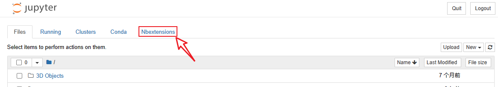

# Jupyter Notebook使用技巧

## 1、在 Jupyter notebook中使用不同虚拟环境

**需要装两个包：**

1. base环境：`conda install nb_conda`

    > 这样打开jupyter notebook的时候，新建文件按钮 里就 有 不同的虚拟环境 选项了。

2. 确保想使用的不同的虚拟环境中有 `ipykernel` 包：`conda install ipykernel`


## 2、解决Jupyter Notebook无法自动打开浏览器的问题

1. 打开cmd，输入：

```bash
jupyter notebook --generate-config
```

找到jupyter notebook --generate-config的路径

2. 找到jupyter notebook --generate-config文件，用记事本或者Notepad++打开

    

3. Ctrl+F查找 c.NotebookApp.password =


4. 在这句后面加上：

使用谷歌浏览器：

```python
import webbrowser
webbrowser.register('chrome', None, webbrowser.GenericBrowser(r'C:\Program Files(x86)\Google\Chrome\Application\chrome.exe'))
c.NotebookApp.browser = 'chrome'
```

使用edge浏览器：

```python
# c.NotebookApp.password = ''
import webbrowser
webbrowser.register('Microsoft Edge', None, webbrowser.GenericBrowser(r'C:\Program Files (x86)\Microsoft\Edge\Application\msedge.exe'))
c.NotebookApp.browser = 'Microsoft Edge'
```


## 3、快速打开

三种方法：

1. 双击应用图标

2. 在命令行中输入：jupyter notebook 回车即可。

    想指定路径的话，就先cd命令进入目标路径，再执行上面一步，即可在指定文件夹快速打开 Jupyter Notebook了。

3. 在资源管理器中进入指定路径，在路径位置输入 Jupyter Notebook


## 3、插件

### 3.1 安装nbextensions

nbextensions 是jupyter [notebook](https://so.csdn.net/so/search?q=notebook&spm=1001.2101.3001.7020) 的一个扩展，可以有很多有用的功能

1. 安装 nbextensions

    ```bash
    pip install jupyter_contrib_nbextensions -i https://pypi.tuna.tsinghua.edu.cn/simple
    jupyter contrib nbextension install --user
    ```

2. 安装 nbextensions_configurator

    ```bash
    pip install jupyter_nbextensions_configurator
    jupyter nbextensions_configurator enable --user
    ```

安装配置完成后，我们重新启动 jupyter notebook，界面变成了：



### 3.2 选择插件

点开nbextensions ，里面是所有我们可以添加的扩展

去掉勾选：


推荐插件：

| 插件名                    | 功能                                                         |
| ------------------------- | ------------------------------------------------------------ |
| **ExecuteTime**           | 设置之后，每执行一个框格的内容，都会显示执行的时间           |
| **Hinterland**            | 代码补全<br />自动补全的功能可能在你编辑的时候出现误操作，<br />你可以在「Help」选项中关闭自动提示「Continuous hints」，<br />**在需要的时候再按下「tab」键唤出提示。** |
| **Code prettify**         | 按照PEP8 Python编码规范美化代码，相当于pycharm中的`Ctrl + Alt + L` |
| **Table of Contents (2)** | 目录插件                                                     |
| **Variable Inspector**    | **变量监视工具**，点开后会出现一个浮窗实时监控变量。         |
| **codefolding**           | 代码折叠                                                     |
| **Code Font Size**        | 设置代码字体大小                                             |
| **Collapsible Headings**  | 设置了之后，标题内的部分可以折叠                             |


## 4、快捷键

### 4.1 命令模式 (按键 Esc 开启)快捷键

| 快捷键           | 作用                                                         |
| ---------------- | ------------------------------------------------------------ |
| **A**            | 在上方插入单元格                                             |
| **B**            | 在下方插入单元格                                             |
| **Ctrl-Enter**   | 运行单元格                                                   |
| **Y**            | 单元格转为代码块                                             |
| **M**            | 单元转入markdown状态                                         |
| **X**            | 剪切选中的单元                                               |
| **Z**            | 恢复刚刚删除的单元格                                         |
| **C**            | 复制选中的单元                                               |
| **V**            | 粘贴到下方单元                                               |
| **D,D**          | 删除单元                                                     |
| **L**            | 显示行号                                                     |
| **Shift-m**      | 将下方的单元格合并（merge）<br />可以按住Shift选择多个单元格 |
| **Ctrl Shift -** | 在光标位置分割单元格                                         |


### 4.2 编辑模式 ( Enter 键启动)下快捷键

| 快捷键               | 作用               |
| -------------------- | ------------------ |
| **Tab**              | 代码补全或缩进     |
| **Ctrl-Z**           | 复原               |
| **Ctrl-Y**           | 再做               |
| **Ctrl-Up**          | 跳到单元开头       |
| **Ctrl-End**         | 跳到单元末尾       |
| **Ctrl-Enter**       | 运行本单元         |
| **Ctrl-Left**        | 跳到左边一个字首   |
| **Ctrl-Right**       | 跳到右边一个字首   |
| **Shift-Tab**        | 查看当前代码的提示 |
| **Ctrl+] 和 Ctrl+[** | 代码缩进           |

函数名+？可以在下方得到提示

函数名+？？ 可以得到函数的源代码


## 5、修改颜色主题

1. 下载颜色主题包

```bash
pip install jupyterthemes
```

2. 命令行选项

| 命令          | 作用                    |
| ------------- | ----------------------- |
| jt -h         | 查看帮助                |
| jt -l         | 查看主题列表            |
| jt -T         | 工具栏是否可见          |
| jt -fs        | 代码字号（默认11）      |
| jt -nfs       | notebook字号（默认13）  |
| jt -ofs       | 输出内容字号（默认8.5） |
| jt -cellw     | 单元格宽（默认980）     |
| jt -lineh     | 单元格行高（默认170）   |
| jt -r         | 恢复默认主题            |
| jt -t onedork | 选择主题                |

注：有可能改完主题之后，工具栏不见了，方法是命令行的语句改成 "jt -t 主题名称 -N -T"


## 6、执行shell命令

在命令行前加英文感叹号即可。

```python
!pip show pandas
!pwd
!ls -l
file = !ls -l
```


## 7、魔法命令

Magic Functions

以 % 为开始的代码不是正常的 Python 代码，但是也可以被 IPython 执行，它们被称为 IPython 中的 Magic Functions。

以一个 % 为开始的被称为 line magic function，只有这一行代码被作为 magic function运行

以一个 %% 为开始的被称为 cell magic function，整个单元格内的代码会被作为 magic function 运行

例如，%time是一个line magic function，%%time 是一个cell magic function

```python
import time
```

```python
%time time.sleep(0.1)
```

```python
%%time
for i in range(3):
    time.sleep(0.1)
```

可以使用 `%lsmagic` 来查看所有可以使用的magic function。

```python
%lsmagic
```

在后方加？得到魔法命令的帮助：

```python
%time?
```

常用的魔法命令：

| 命令                        | 作用                                                         |
| --------------------------- | ------------------------------------------------------------ |
| %history <-n> \<a-b>        | 打印IPython的历史，使用参数-n可以为每一个输入标号<br />a-b 参数表示打印第a行到b行的历史 |
| %time                       | 评估命令执行时间                                             |
| %timeit <-r 数字> <-n 数字> | 对命令执行多次，取平均时间<br />-r 表示运行次数，-n 表示每一次运行轮数 |
| %run .py                    | 运行python文件                                               |


## 8、导出文件

1. file -> Download as
2. 使用命令行工具：

html:

```python
%%bash
jupyter nbconvert --to html <文件名.ipynb>
```

幻灯片：

View -> Cell Toolbar -> Attachments, 在 Slide Type 中将要保存为幻灯片的单元格转为 Slide，不需要的转为 Skip

```python
%%bash
jupyter nbconvert --to slides <文件名.ipynb>
```


