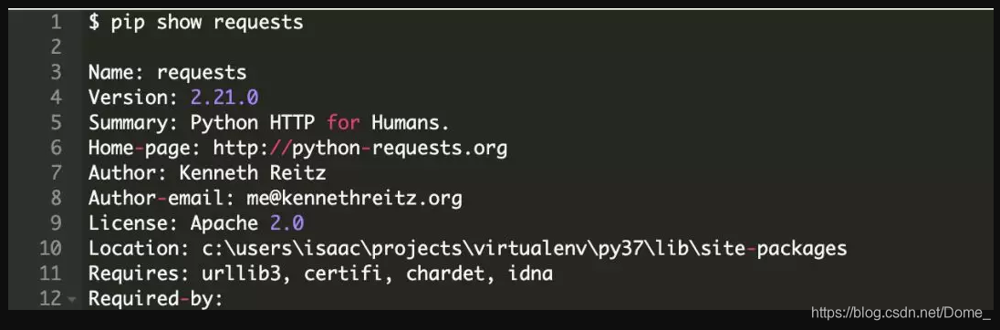

# pip入门

pip 是 Python 中的标准库管理器。它允许你安装和管理不属于 Python标准库 的其它软件包。

如果你已经了解了其他语言，那么可能会对包管理器的概念比较熟悉。JavaScript 使用 npm 管理软件包，Ruby 使用 gem，以及 .NET 使用 NuGet。Python 中，则是 pip 作为标准包管理器。

Python 拥有一个活跃的社区，它提供了一个更大的软件包集合，以供你开发所需。这些软件包发布在 Python Package Index，也被称为 **PyPI**（发音 Pie Pea Eye）。PyPI 托管了大量包，包括开发框架，工具和库。


## 1. 查看pip版本

```
pip --version
```

注意：两个横杠


## 2. 更新pip

```
python -m pip install --upgrade pip
```

注意这里，你使用了 python -m 来升级 pip。**-m 开关告诉 Python 将模块作为可执行文件运行。**如果你要升级 pip，这么做是很有必要的，在安装新的版本之前会卸载旧的版本，而当工具在运行时卸载它自己会导致错误。

当你将 pip 作为一个模块运行时，Python 会将模块加载到内存中，并允许在这个模块包运行的时候删除它。如果软件包提供了顶层脚本 __main__.py，那么你可以像运行脚本一下运行这个软件包。


## 3. 查看安装的所有包

```
pip list
```

### 3.1 查看版本过时的包

```
pip list --o
or
pip list --outdated
```

### 3.2 查看指定路径下的包

```
pip list --path 指定路径
```


## 4. 查看某个包的信息

包括包的依赖包

```
pip show packagename(包名)
```

```
所有包
pip show --verbose packagename
```


## 5. 安装包

### 5.1 基础包安装

```
pip install packagename==版本号
```

可以指定版本，不指定则默认安装最新版

解决下载慢：

```
方法1：timeut参数增加时间
pip install xxx --timeout 6000
方法2：利用镜像源
pip install -i https://pypi.douban.com/simple/ xxx
```

### 5.2 使用requirements.txt需求文件

需求文件可以精确指定需要安装的软件包和版本。运行 pip help 你可以看到一个 freeze 命令，**它会按照格式化输出以已经安装的软件包**。你可以使用这个命令，将**输出重定向到文件**以生成一个需求文件：

```
pip freeze > requirement.txt
```

freeze 命令将所有软件包以及版本信息转储到标准输出，所以你可以重定向这些输出到文件中。这样就可以在其他系统中根据这个需求文件执行精准安装。约定这个需求文件名为 requirements.txt，但是你也可以根据个人喜好命名。

通过文件下载指定的库和版本

```
pip install -r requirement.txt
```

### 5.3 微调需求文件

软件包及其依赖的版本可能会导致硬编码问题，这是因为软件包会针对 bug 以及安全修复进行频繁的更新，而你可能希望在它们发布后立即做出更改。

需求文件的格式允许你使用逻辑运算符指定依赖的版本，这为确保更新包提供了更多的灵活性，但是仍然要定义一个包的基础版本。

```
requests>=2.21.0, <3.0
```

你可以通过改变逻辑运算符为 >= 来告知 pip 精准安装已发布的指定版本或更高版本。

当你使用 requirments.txt 设置了一个新的环境，pip 会查找满足需求的**最新版本**并安装。

你可以使用带有 --upgrade 开关的 install 命令来升级你需求文件中定义的软件包：

```
pip install --upgrade -r requirements.txt
```

### 5.4 生产与开发环境的依赖关系

比方说，你可能希望对你的应用做单元测试，你需要单元测试的框架。一个流行的单元测试框架是pytest。你希望在你的开发环境中安装它，但是却不希望在生产环境也安装它，因为它不是应用的依赖。

这时你会创建第二个需求文件（requirements_dev.txt）来列出配置开发环境需要的工具：

这里需要你使用 pip 安装两个需求文件：requirements.txt 和 requirements_dev.txt。

pip 允许在需求文件内部指定一些额外的参数。你可以需改 requirements_dev.txt 文件支持同时安装生产文件 requirements.txt 中的需求：

```
#IN requirements_dex.txt
-r requirements.txt
pytext>=4.2.0
```

### 5.5 为生产环境冻结需求文件

因为已经知道开发环境应用程序的所有测试已经正常通过，所以你可能希望确保生产环境的依赖版本与整合管道或构建过程中使用的完全相同。

你创建了一个干净的生产环境，并使用 requirements.txt 文件安装了生产需求。安装完需求文件之后，你可以冻结当前这个特定的版本，并将输出转储到生产环境的 requirements_lock.txt 文件中。该 requirements_lock.txt 文件中包含精确的版本说明符，并且可以复制当前环境。


## 6. 卸载包

卸载包之前，先确保你已经对这个包运行了 show 命令：



注意最后的两个属性 Requires 和 Required-by。show 命令向我们展示了 requests 需要依赖 urllib3，certifi，chardet 和 idna。你可能希望卸载其中的两个。而且你可以看到 **requests 没有被其他包引用**，所以它可以**安全地卸载**。

你应该对 requests 中所有的依赖都运行一下 show 命令，以确保没有其他库依赖它们。你了解了这些依赖次序之后，就可以使用 uninstall 命令来卸载它们。

一次调用指定所有要卸载的包

```
pip uninstall -y urllib3 chardet idna requests
```

通过文件删除

```
pip uninstall -r requireents.txt -y
```

可以使用 -y 开关来隐藏文件列表和确认提示信息


## 7. 更新包

```
pip install -U 库名
或
pip install -upgrade 库名
指定版本：
pip install -upgrade 库名==版本号
```


## 8. pip的替代品

### 8.1 Conda

Conda 广泛用于数据科学和机器学习应用程序，并使用自己的索引来托管兼容的软件包。

Conda 不仅可以管理包的依赖项，还可以管理应用的虚拟环境，安装兼容并存的 Python 版本，为生产部署打包应用。

### 8.2 Pipenv

Pipenv 是另外一种包管理工具，旨在为 Python “提供全世界最好的包”。由于将虚拟环境与包管理合并到一个工具中，pipenv 在 Python 社区获得了极大的关注。

### 8.3 Poetry

与 Pipenv 类似，它简化了包的版本管理并隔离了开发环境与生产环境的依赖，而且它将依赖隔离到一个虚拟环境中运行。

如果你已经了解 JavaScript 和 npm，会觉得 Poetry 非常熟悉。它不只是管理包，还可以帮助你为应用和库构建发行版本并**部署到 PyPI**。