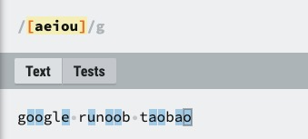

# 正则表达式

正则表达式(Regular Expression)是一种文本模式，包括**普通字符**（例如，a 到 z 之间的字母）和**特殊字符**（称为"**元字符**"）。

正则表达式使用**单个字符串**来描述、匹配一系列匹配某个句法规则的字符串。

正则表达式是繁琐的，但它是强大的，学会之后的应用会让你除了提高效率外，会给你带来绝对的成就感。


## 1、简介

除非您以前使用过正则表达式，否则您可能不熟悉一些术语。但是，毫无疑问，您已经使用过不涉及脚本的某些正则表达式概念。

例如，您很可能使用 **?** 和 ***** 通配符来查找硬盘上的文件。**?** 通配符匹配文件名中的 0 个或 1 个字符，而 ***** 通配符匹配零个或多个字符。像 **data(\w)?\.dat** 这样的模式将查找下列文件：

```python
data.dat
data1.dat
data2.dat
datax.dat
dataN.dat
```

使用 ***** 字符代替 **?** 字符扩大了找到的文件的数量。**data.\*\.dat** 匹配下列所有文件：

```python
data.dat
data1.dat
data2.dat
data12.dat
datax.dat
dataXYZ.dat
```

正则表达式的使用，可以通过简单的办法来实现强大的功能。下面先给出一个简单的示例：


- **^** 为匹配输入字符串的开始位置。
- **[0-9]+** 匹配多个数字， **[0-9]** 匹配单个数字，==**+** 匹配一个或者多个。==
- **abc$** 匹配字母 **abc** 并以 **abc** 结尾，**$** 为匹配输入字符串的结束位置。

我们在写用户注册表单时，只允许用户名包含字符、数字、下划线和连接字符 **-**，并设置用户名的长度，我们就可以使用以下正则表达式来设定。


### 1.1 为什么要使用正则表达式？

典型的搜索和替换操作要求您提供与预期的搜索结果匹配的**确切文本**。虽然这种技术对于对静态文本执行简单搜索和替换任务可能已经足够了，但它缺乏灵活性，若采用这种方法搜索动态文本，即使不是不可能，至少也会变得很困难。

通过使用正则表达式，可以：

- **测试字符串内的模式。**
    例如，可以测试输入字符串，以查看字符串内是否出现**电话号码模式**或**信用卡号码模式**。这称为**数据验证**。
- **替换文本。**
    可以使用正则表达式来识别文档中的特定文本，完全删除该文本或者用其他文本替换它。
- **基于模式匹配从字符串中提取子字符串。**
    可以查找文档内或输入域内特定的文本。

例如，您可能需要搜索整个网站，删除过时的材料，以及替换某些 HTML 格式标记。在这种情况下，可以使用正则表达式来确定在每个文件中是否出现该材料或该 HTML 格式标记。此过程将受影响的文件列表缩小到包含需要删除或更改的材料的那些文件。然后可以使用正则表达式来删除过时的材料。最后，可以使用正则表达式来搜索和替换标记。


### 1.2 发展历史

正则表达式的"祖先"可以一直上溯至对人类神经系统如何工作的早期研究。Warren McCulloch 和 Walter Pitts 这两位神经生理学家研究出一种数学方式来描述这些神经网络。

1956 年, 一位叫 Stephen Kleene 的数学家在 McCulloch 和 Pitts 早期工作的基础上，发表了一篇标题为"神经网事件的表示法"的论文，引入了正则表达式的概念。正则表达式就是用来描述他称为"正则集的代数"的表达式，因此采用"正则表达式"这个术语。

随后，发现可以将这一工作应用于使用 Ken Thompson 的计算搜索算法的一些早期研究，Ken Thompson 是 Unix 的主要发明人。正则表达式的第一个实用应用程序就是 Unix 中的 qed 编辑器。

如他们所说，剩下的就是众所周知的历史了。从那时起直至现在正则表达式都是基于文本的编辑器和搜索工具中的一个重要部分。


## 2、语法

正则表达式(regular expression)描述了一种字符串匹配的模式（pattern），可以用来检查一个串是否含有某种子串、将匹配的子串替换或者从某个串中取出符合某个条件的子串等。

例如：

- **runoo+b**，可以匹配 **runoob、runooob、runoooooob** 等，**+** 号代表前面的字符必须至少出现一次（1次或多次）。
- **runoo\*b**，可以匹配 **runob、runoob、runoooooob** 等，***** 号代表前面的字符可以不出现，也可以出现一次或者多次（0次、或1次、或多次）。
- **colou?r** 可以匹配 **color** 或者 **colour**，**?** 问号代表前面的字符最多只可以出现一次（0次或1次）。

构造正则表达式的方法和创建数学表达式的方法一样。也就是用多种元字符与运算符可以将小的表达式结合在一起来创建更大的表达式。正则表达式的组件可以是**单个的字符、字符集合、字符范围、字符间的选择或者所有这些组件的任意组合**。

正则表达式是由普通字符（例如字符 a 到 z）以及特殊字符（称为"元字符"）组成的文字模式。模式描述在搜索文本时要匹配的一个或多个字符串。**正则表达式作为一个模板，将某个字符模式与所搜索的字符串进行匹配。**


### 2.1 普通字符

普通字符包括没有显式指定为元字符的所有可打印和不可打印字符。这包括所有大写和小写字母、所有数字、所有标点符号和一些其他符号。

| 字符     | 描述                                                         |
| -------- | ------------------------------------------------------------ |
| `[ABC]`  | 匹配 **[...]** 中的所有字符。<br />例如 **[aeiou]** 匹配字符串 "google runoob taobao" 中所有的 e o u a 字母。<br /> |
| `[^ABC]` | 匹配除了 **[...]** 中字符的所有字符。<br />例如 **[^aeiou]** 匹配字符串 "google runoob taobao" 中除了 e o u a 字母的所有字母。<br /> |
| `[A-Z]`  | [A-Z] 表示一个区间，匹配所有大写字母，[a-z] 表示所有小写字母。<br /> |
| `.`      | 匹配除换行符（\n、\r）之外的任何单个字符，相等于 \[^\n\r]。<br /> |
| `[\s\S]` | 匹配所有。\s 是匹配所有空白符，包括换行，\S 非空白符，不包括换行。<br /> |
| `\w`     | 匹配字母、数字、下划线。等价于 [A-Za-z0-9_]<br /> |


### 2.2 非打印字符

非打印字符也可以是正则表达式的组成部分。下表列出了表示非打印字符的转义序列：

| 字符 | 描述                                                         |
| ---- | ------------------------------------------------------------ |
| \cx  | 匹配由x指明的控制字符。例如， \cM 匹配一个 Control-M 或回车符。<br />x 的值必须为 A-Z 或 a-z 之一。否则，将 c 视为一个原义的 'c' 字符。 |
| \f   | 匹配一个换页符。等价于 \x0c 和 \cL。                         |
| \n   | 匹配一个换行符。等价于 \x0a 和 \cJ。                         |
| \r   | 匹配一个回车符。等价于 \x0d 和 \cM。                         |
| \s   | 匹配任何空白字符，包括空格、制表符、换页符等等。等价于 [ \f\n\r\t\v]。注意 Unicode 正则表达式会匹配全角空格符。 |
| \S   | 匹配任何非空白字符。等价于 \[^ \f\n\r\t\v]。                 |
| \t   | 匹配一个制表符。等价于 \x09 和 \cI。                         |


### 2.3 特殊字符

所谓特殊字符，就是一些有特殊含义的字符，如上面说的 **runoo\*b** 中的 *****，简单的说就是表示任何字符串的意思。如果要查找字符串中的 ***** 符号，则需要对 ***** 进行转义，即在其前加一个 **\\**，**runo\\*ob** 匹配字符串 **runo\*ob**。

许多元字符要求在试图匹配它们时特别对待。若要匹配这些特殊字符，必须首先使字符"转义"，即，将反斜杠字符**\\** 放在它们前面。

下表列出了正则表达式中的特殊字符：

| 特别字符 | 描述                                                         |
| :------- | :----------------------------------------------------------- |
| $        | 匹配输入字符串的**结尾位置**。如果设置了 RegExp 对象的 Multiline 属性，则 \$ 也匹配 '\n' 或 '\r'。要匹配 ​\$ 字符本身，请使用 \\$。 |
| ( )      | 标记一个子表达式的开始和结束位置。子表达式可以获取供以后使用。<br />要匹配这些字符，请使用 \\( 和 \\)。 |
| *        | 匹配前面的子表达式**零次或多次**。<br />要匹配 * 字符，请使用 \\*。 |
| +        | 匹配前面的子表达式**一次或多次**。<br />要匹配 + 字符，请使用 \\+。 |
| .        | 匹配**除换行符 \n 之外的任何单字符**。<br />要匹配 . ，请使用 \\. 。 |
| [        | 标记一个中括号表达式的开始。<br />要匹配 [，请使用 \\[。     |
| ?        | 匹配前面的子表达式**零次或一次**，或指明一个非贪婪限定符。<br />要匹配 ? 字符，请使用 \?。 |
| \        | 将下一个字符标记为或特殊字符、或原义字符、或向后引用、或八进制转义符。<br />例如， 'n' 匹配字符 'n'。'\n' 匹配换行符。序列 '\\\\' 匹配 "\\"，而 '\\(' 则匹配 "("。 |
| ^        | 匹配输入字符串的**开始位置**，除非在方括号表达式中使用，当该符号在方括号表达式中使用时，表示不接受该方括号表达式中的字符集合。要匹配 ^ 字符本身，请使用 \^。 |
| {        | 标记限定符表达式的开始。<br />要匹配 {，请使用 \\{。         |
| \|       | 指明两项之间的一个选择。<br />要匹配 \|，请使用 \\|。        |


### 2.4 限定符

限定符用来指定正则表达式的一个给定组件必须要出现多少次才能满足匹配。有 ***** 或 **+** 或 **?** 或 **{n}** 或 **{n,}** 或 **{n,m}** 共6种。

正则表达式的限定符有：

| 字符  | 描述                                                         |
| ----- | ------------------------------------------------------------ |
| *     | 匹配前面的子表达式**零次或多次**。例如，**zo\*** 能匹配 **"z"** 以及 **"zoo"**。***** 等价于 **{0,}**。 |
| +     | 匹配前面的子表达式**一次或多次**。例如，**zo+** 能匹配 **"zo"** 以及 "**zoo"**，但不能匹配 **"z"**。**+** 等价于 **{1,}**。 |
| ?     | 匹配前面的子表达式**零次或一次**。例如，**do(es)?** 可以匹配 **"do"** 、 **"does"**、 **"doxy"** 中的 **"do"** 和 **"does"**。**?** 等价于 **{0,1}**。<br /> |
| {n}   | n 是一个非负整数。**匹配确定的 n 次。<br />**例如，**o{2}** 不能匹配 **"Bob"** 中的 **o**，但是能匹配 **"food"** 中的两个 **o**。 |
| {n,}  | n 是一个非负整数。**至少匹配n 次。**<br />例如，**o{2,}** 不能匹配 **"Bob"** 中的 **o**，但能匹配 **"foooood"** 中的所有 **o**。<br />**o{1,}** 等价于 **o+**。**o{0,}** 则等价于 **o\***。 |
| {n,m} | m 和 n 均为非负整数，其中 n <= m。**最少匹配 n 次且最多匹配 m 次。<br />**例如，**o{1,3}** 将匹配 **"fooooood"** 中的前三个 **o**。<br />**o{0,1}** 等价于 **o?**。请注意在逗号和两个数之间不能有空格。 |

实例：

以下正则表达式匹配一个正整数，**[1-9]**设置第一个数字不是 0，**[0-9]\*** 表示任意多个数字：

```python
/[1-9][0-9]*/
```


请注意，限定符出现在范围表达式之后。因此，它应用于整个范围表达式，在本例中，只指定从 0 到 9 的数字（包括 0 和 9）。

这里不使用 + 限定符，因为在第二个位置或后面的位置不一定需要有一个数字。也不使用 ? 字符，因为使用 ? 会将整数限制到只有两位数。

匹配 0~99 的两位数：

```python
/[1-9][0-9]?/
```

或

```python
/[1-9][0-9]{0,1}/
```

**`*` 和 `+` 限定符都是贪婪的，==因为它们会尽可能多的匹配文字==，只有在它们的==后面加上一个 ? 就可以实现非贪婪或最小匹配。==**

例子：

```python
<h1>RUNOOB-菜鸟教程</h1>
```

==**贪婪：**下面的表达式匹配从开始小于符号 (<) 到关闭 h1 标记的大于符号 (>) 之间的所有内容。==

```python
/<.*>/
```


==**非贪婪：**如果您只需要匹配开始和结束 h1 标签，下面的非贪婪表达式只匹配 <h1>。==

```python
/<.*?>/
```


另一种方法：

```python
/<\w+?>/
```

==通过在 *****、**+** 或 **?** 限定符之后放置 **?**，该表达式从"贪婪"表达式转换为"非贪婪"表达式或者最小匹配。==


### 2.5 定位符

定位符使您能够将正则表达式固定到行首或行尾。它们还使您能够创建这样的正则表达式，这些正则表达式出现在一个单词内、在一个单词的开头或者一个单词的结尾。

定位符用来描述字符串或单词的边界，`^` 和 `$` 分别指字符串的开始与结束，`\b` 描述单词的前或后边界，`\B` 表示非单词边界。

正则表达式的定位符有：

| 字符 | 描述                                                         |
| :--- | :----------------------------------------------------------- |
| ^    | 匹配输入字符串开始的位置。如果设置了 RegExp 对象的 Multiline 属性，^ 还会与 \n 或 \r 之后的位置匹配。 |
| $    | 匹配输入字符串结尾的位置。如果设置了 RegExp 对象的 Multiline 属性，$ 还会与 \n 或 \r 之前的位置匹配。 |
| \b   | 匹配一个单词边界，即字与空格间的位置。                       |
| \B   | 非单词边界匹配。                                             |

**注意**：不能将限定符与定位符一起使用。由于在紧靠换行或者单词边界的前面或后面不能有一个以上位置，因此不允许诸如 **`^*`** 之类的表达式。

- 若要匹配一行文本开始处的文本，请在正则表达式的开始使用 **^** 字符。不要将 **^** 的这种用法与中括号表达式内的用法混淆。
- 若要匹配一行文本的结束处的文本，请在正则表达式的结束处使用 **$** 字符。


若要在搜索章节标题时使用定位点，下面的正则表达式匹配一个章节标题，该标题只包含两个尾随数字，并且出现在行首：

```python
/^Chapter [1-9][0-9]{0,1}/
```

真正的章节标题不仅出现行的开始处，而且它还是该行中仅有的文本。它既出现在行首又出现在同一行的结尾。下面的表达式能确保指定的匹配只匹配章节而不匹配交叉引用。通过创建只匹配一行文本的开始和结尾的正则表达式，就可做到这一点。

```python
/^Chapter [1-9][0-9]{0,1}$/
```

匹配单词边界稍有不同，但向正则表达式添加了很重要的能力。**单词边界是单词和空格之间的位置。非单词边界是任何其他位置。**下面的表达式匹配单词 Chapter 的开头三个字符，因为这三个字符出现在单词边界后面：

```python
/\bCha/
```

**\b** 字符的位置是非常重要的。如果它位于要匹配的字符串的开始，它在单词的开始处查找匹配项。如果它位于字符串的结尾，它在单词的结尾处查找匹配项。例如，下面的表达式匹配单词 Chapter 中的字符串 ter，因为它出现在单词边界的前面：

```python
/ter\b/
```

下面的表达式匹配 Chapter 中的字符串 apt，但不匹配 aptitude 中的字符串 apt：

```python
/\Bapt/
```

字符串 apt 出现在单词 Chapter 中的非单词边界处，但出现在单词 aptitude 中的单词边界处。**对于 \B 非单词边界运算符，不可以匹配单词的开头或结尾**，如果是下面的表达式，就不匹配 Chapter 中的 Cha：

```python
\BCha
```


### 2.6 选择

用圆括号 **()** 将所有选择项括起来，相邻的选择项之间用 **|** 分隔。

**()** 表示捕获分组，**()** 会把每个分组里的匹配的值保存起来， 多个匹配值可以通过数字 n 来查看(**n** 是一个数字，表示第 n 个捕获组的内容)。

但用圆括号会有一个副作用，使相关的匹配会被缓存，此时可用 **?:** 放在第一个选项前来消除这种副作用。

其中 **?:** 是非捕获元之一，还有两个非捕获元是 **?=** 和 **?!**，这两个还有更多的含义，前者为正向预查，在任何开始匹配圆括号内的正则表达式模式的位置来匹配搜索字符串，后者为负向预查，在任何开始不匹配该正则表达式模式的位置来匹配搜索字符串。

#### 以下列出 ?=、?<=、?!、?<! 的使用区别

**exp1(?=exp2)**：查找 exp2 前面的 exp1。


**(?<=exp2)exp1**：查找 exp2 后面的 exp1。


**exp1(?!exp2)**：查找后面不是 exp2 的 exp1。


**(?<!exp2)exp1**：查找前面不是 exp2 的 exp1。


### 2.7 反向引用

对一个正则表达式模式或部分模式两边添加圆括号将导致相关匹配存储到一个临时缓冲区中，所捕获的每个子匹配都按照在正则表达式模式中从左到右出现的顺序存储。缓冲区编号从 1 开始，最多可存储 99 个捕获的子表达式。每个缓冲区都可以使用 **\n** 访问，其中 n 为一个标识特定缓冲区的一位或两位十进制数。

可以使用非捕获元字符 **?:**、**?=** 或 **?!** 来重写捕获，忽略对相关匹配的保存。

反向引用的最简单的、最有用的应用之一，是提供查找文本中两个相同的相邻单词的匹配项的能力。以下面的句子为例：

```
Is is the cost of of gasoline going up up?
```

上面的句子很显然有多个重复的单词。如果能设计一种方法定位该句子，而不必查找每个单词的重复出现，那该有多好。下面的正则表达式使用单个子表达式来实现这一点：

```python
var str = "Is is the cost of of gasoline going up up";
var patt1 = /\b([a-z]+) \1\b/igm;
document.write(str.match(patt1));
```

捕获的表达式，正如 **[a-z]+** 指定的，包括一个或多个字母。正则表达式的第二部分是对以前捕获的子匹配项的引用，即，单词的第二个匹配项正好由括号表达式匹配。**\1** 指定第一个子匹配项。

单词边界元字符确保只检测整个单词。否则，诸如 "is issued" 或 "this is" 之类的词组将不能正确地被此表达式识别。

正则表达式后面的全局标记 **g** 指定将该表达式应用到输入字符串中能够查找到的尽可能多的匹配。

表达式的结尾处的不区分大小写 **i** 标记指定不区分大小写。

多行标记 **m** 指定换行符的两边可能出现潜在的匹配。


## 3、修饰符（标记）

标记也称为修饰符，正则表达式的标记用于指定额外的匹配策略。

标记不写在正则表达式里，标记位于表达式之外，格式如下：

```python
/pattern/flags
```

下表列出了正则表达式常用的修饰符：

| 修饰符 | 含义                                   | 描述                                                         |
| :----- | :------------------------------------- | :----------------------------------------------------------- |
| i      | ignore - 不区分大小写                  | 将匹配设置为不区分大小写，搜索时不区分大小写: A 和 a 没有区别。 |
| g      | global - 全局匹配                      | 查找所有的匹配项。                                           |
| m      | multi line - 多行匹配                  | 使边界字符 **^** 和 **$** 匹配每一行的开头和结尾，记住是多行，而不是整个字符串的开头和结尾。 |
| s      | 特殊字符圆点 **.** 中包含换行符 **\n** | 默认情况下的圆点 **.** 是匹配除换行符 **\n** 之外的任何字符，加上 **s** 修饰符之后, **.** 中包含换行符 \n。 |

#### g 修饰符

g 修饰符可以查找字符串中所有的匹配项：


#### i 修饰符

i 修饰符为不区分大小写匹配，实例如下：


#### m 修饰符

m 修饰符可以使 **^** 和 **$** 匹配一段文本中每行的开始和结束位置。

g 只匹配第一行，添加 m 之后实现多行。


以下实例字符串中使用 **\n** 来换行：

```c#
var str="runoobgoogle\ntaobao\nrunoobweibo";
var n1=str.match(/^runoob/g);   // 匹配一个
var n2=str.match(/^runoob/gm);  // 多行匹配
```


#### s 修饰符

默认情况下的圆点 **.** 是 匹配除换行符 **\n** 之外的任何字符，加上 s 之后, **.** 中包含换行符 **\n**。


s 修饰符实例如下：

```c#
var str="google\nrunoob\ntaobao";
var n1=str.match(/google./);   // 没有使用 s，无法匹配\n
var n2=str.match(/runoob./s);  // 使用 s，匹配\n
```


## 4、元字符

下表包含了元字符的完整列表以及它们在正则表达式上下文中的行为：

| 字符         | 描述                                                         |
| :----------- | :----------------------------------------------------------- |
| \            | 将下一个字符标记为一个特殊字符、或一个原义字符、或一个 向后引用、或一个八进制转义符。例如，'n' 匹配字符 "n"。'\n' 匹配一个换行符。序列 '\\' 匹配 "\" 而 "\(" 则匹配 "("。 |
| ^            | 匹配输入字符串的开始位置。如果设置了 RegExp 对象的 Multiline 属性，^ 也匹配 '\n' 或 '\r' 之后的位置。 |
| $            | 匹配输入字符串的结束位置。如果设置了RegExp 对象的 Multiline 属性，$ 也匹配 '\n' 或 '\r' 之前的位置。 |
| *            | 匹配前面的子表达式零次或多次。例如，zo* 能匹配 "z" 以及 "zoo"。* 等价于{0,}。 |
| +            | 匹配前面的子表达式一次或多次。例如，'zo+' 能匹配 "zo" 以及 "zoo"，但不能匹配 "z"。+ 等价于 {1,}。 |
| ?            | 匹配前面的子表达式零次或一次。例如，"do(es)?" 可以匹配 "do" 或 "does" 。? 等价于 {0,1}。 |
| {n}          | n 是一个非负整数。匹配确定的 n 次。例如，'o{2}' 不能匹配 "Bob" 中的 'o'，但是能匹配 "food" 中的两个 o。 |
| {n,}         | n 是一个非负整数。至少匹配n 次。例如，'o{2,}' 不能匹配 "Bob" 中的 'o'，但能匹配 "foooood" 中的所有 o。'o{1,}' 等价于 'o+'。'o{0,}' 则等价于 'o*'。 |
| {n,m}        | m 和 n 均为非负整数，其中n <= m。最少匹配 n 次且最多匹配 m 次。例如，"o{1,3}" 将匹配 "fooooood" 中的前三个 o。'o{0,1}' 等价于 'o?'。请注意在逗号和两个数之间不能有空格。 |
| ?            | 当该字符紧跟在任何一个其他限制符 (*, +, ?, {n}, {n,}, {n,m}) 后面时，匹配模式是非贪婪的。非贪婪模式尽可能少的匹配所搜索的字符串，而默认的贪婪模式则尽可能多的匹配所搜索的字符串。例如，对于字符串 "oooo"，'o+?' 将匹配单个 "o"，而 'o+' 将匹配所有 'o'。 |
| .            | 匹配除换行符（\n、\r）之外的任何单个字符。要匹配包括 '\n' 在内的任何字符，请使用像"**(.\|\n)**"的模式。 |
| (pattern)    | 匹配 pattern 并获取这一匹配。所获取的匹配可以从产生的 Matches 集合得到，在VBScript 中使用 SubMatches 集合，在JScript 中则使用 $0…$9 属性。要匹配圆括号字符，请使用 '\(' 或 '\)'。 |
| (?:pattern)  | 匹配 pattern 但不获取匹配结果，也就是说这是一个非获取匹配，不进行存储供以后使用。这在使用 "或" 字符 (\|) 来组合一个模式的各个部分是很有用。例如， 'industr(?:y\|ies) 就是一个比 'industry\|industries' 更简略的表达式。 |
| (?=pattern)  | 正向肯定预查（look ahead positive assert），在任何匹配pattern的字符串开始处匹配查找字符串。这是一个非获取匹配，也就是说，该匹配不需要获取供以后使用。例如，"Windows(?=95\|98\|NT\|2000)"能匹配"Windows2000"中的"Windows"，但不能匹配"Windows3.1"中的"Windows"。预查不消耗字符，也就是说，在一个匹配发生后，在最后一次匹配之后立即开始下一次匹配的搜索，而不是从包含预查的字符之后开始。 |
| (?!pattern)  | 正向否定预查(negative assert)，在任何不匹配pattern的字符串开始处匹配查找字符串。这是一个非获取匹配，也就是说，该匹配不需要获取供以后使用。例如"Windows(?!95\|98\|NT\|2000)"能匹配"Windows3.1"中的"Windows"，但不能匹配"Windows2000"中的"Windows"。预查不消耗字符，也就是说，在一个匹配发生后，在最后一次匹配之后立即开始下一次匹配的搜索，而不是从包含预查的字符之后开始。 |
| (?<=pattern) | 反向(look behind)肯定预查，与正向肯定预查类似，只是方向相反。例如，"`(?<=95|98|NT|2000)Windows`"能匹配"`2000Windows`"中的"`Windows`"，但不能匹配"`3.1Windows`"中的"`Windows`"。 |
| (?<!pattern) | 反向否定预查，与正向否定预查类似，只是方向相反。例如"`(?<!95|98|NT|2000)Windows`"能匹配"`3.1Windows`"中的"`Windows`"，但不能匹配"`2000Windows`"中的"`Windows`"。 |
| x\|y         | 匹配 x 或 y。例如，'z\|food' 能匹配 "z" 或 "food"。'(z\|f)ood' 则匹配 "zood" 或 "food"。 |
| [xyz]        | 字符集合。匹配所包含的任意一个字符。例如， '[abc]' 可以匹配 "plain" 中的 'a'。 |
| [^xyz]       | 负值字符集合。匹配未包含的任意字符。例如， '[^abc]' 可以匹配 "plain" 中的'p'、'l'、'i'、'n'。 |
| [a-z]        | 字符范围。匹配指定范围内的任意字符。例如，'[a-z]' 可以匹配 'a' 到 'z' 范围内的任意小写字母字符。 |
| [^a-z]       | 负值字符范围。匹配任何不在指定范围内的任意字符。例如，'[^a-z]' 可以匹配任何不在 'a' 到 'z' 范围内的任意字符。 |
| \b           | 匹配一个单词边界，也就是指单词和空格间的位置。例如， 'er\b' 可以匹配"never" 中的 'er'，但不能匹配 "verb" 中的 'er'。 |
| \B           | 匹配非单词边界。'er\B' 能匹配 "verb" 中的 'er'，但不能匹配 "never" 中的 'er'。 |
| \cx          | 匹配由 x 指明的控制字符。例如， \cM 匹配一个 Control-M 或回车符。x 的值必须为 A-Z 或 a-z 之一。否则，将 c 视为一个原义的 'c' 字符。 |
| \d           | 匹配一个数字字符。等价于 [0-9]。                             |
| \D           | 匹配一个非数字字符。等价于 [^0-9]。                          |
| \f           | 匹配一个换页符。等价于 \x0c 和 \cL。                         |
| \n           | 匹配一个换行符。等价于 \x0a 和 \cJ。                         |
| \r           | 匹配一个回车符。等价于 \x0d 和 \cM。                         |
| \s           | 匹配任何空白字符，包括空格、制表符、换页符等等。等价于 [ \f\n\r\t\v]。 |
| \S           | 匹配任何非空白字符。等价于 [^ \f\n\r\t\v]。                  |
| \t           | 匹配一个制表符。等价于 \x09 和 \cI。                         |
| \v           | 匹配一个垂直制表符。等价于 \x0b 和 \cK。                     |
| \w           | 匹配字母、数字、下划线。等价于'[A-Za-z0-9_]'。               |
| \W           | 匹配非字母、数字、下划线。等价于 '[^A-Za-z0-9_]'。           |
| \xn          | 匹配 n，其中 n 为十六进制转义值。十六进制转义值必须为确定的两个数字长。例如，'\x41' 匹配 "A"。'\x041' 则等价于 '\x04' & "1"。正则表达式中可以使用 ASCII 编码。 |
| \num         | 匹配 num，其中 num 是一个正整数。对所获取的匹配的引用。例如，'(.)\1' 匹配两个连续的相同字符。 |
| \n           | 标识一个八进制转义值或一个向后引用。如果 \n 之前至少 n 个获取的子表达式，则 n 为向后引用。否则，如果 n 为八进制数字 (0-7)，则 n 为一个八进制转义值。 |
| \nm          | 标识一个八进制转义值或一个向后引用。如果 \nm 之前至少有 nm 个获得子表达式，则 nm 为向后引用。如果 \nm 之前至少有 n 个获取，则 n 为一个后跟文字 m 的向后引用。如果前面的条件都不满足，若 n 和 m 均为八进制数字 (0-7)，则 \nm 将匹配八进制转义值 nm。 |
| \nml         | 如果 n 为八进制数字 (0-3)，且 m 和 l 均为八进制数字 (0-7)，则匹配八进制转义值 nml。 |
| \un          | 匹配 n，其中 n 是一个用四个十六进制数字表示的 Unicode 字符。例如， \u00A9 匹配版权符号 (?)。 |

实例：

### 匹配邮箱的正则表达式

```c#
var str = "abcd test@runoob.com 1234";
var patt1 = /\b[\w.%+-]+@[\w.-]+\.[a-zA-Z]{2,6}\b/g;
document.write(str.match(patt1));
```


## 5、运算符优先级

正则表达式从左到右进行计算，并遵循优先级顺序，这与算术表达式非常类似。

相同优先级的从左到右进行运算，不同优先级的运算先高后低。下表从最高到最低说明了各种正则表达式运算符的优先级顺序：

| 运算符                      | 描述                                                         |
| :-------------------------- | :----------------------------------------------------------- |
| \                           | 转义符                                                       |
| (), (?:), (?=), []          | 圆括号和方括号                                               |
| *, +, ?, {n}, {n,}, {n,m}   | 限定符                                                       |
| ^, $, \任何元字符、任何字符 | 定位点和序列（即：位置和顺序）                               |
| \|                          | 替换，"或"操作 字符具有高于替换运算符的优先级，使得"m\|food"匹配"m"或"food"。若要匹配"mood"或"food"，请使用括号创建子表达式，从而产生"(m\|f)ood"。 |


## 6、匹配规则

### 基本模式匹配

一切从最基本的开始。模式，是正则表达式最基本的元素，它们是一组描述字符串特征的字符。模式可以很简单，由普通的字符串组成，也可以非常复杂，往往用特殊的字符表示一个范围内的字符、重复出现，或表示上下文。例如：

```python
^once
```

这个模式包含一个特殊的字符 **^**，表示该模式只匹配那些以 **once** 开头的字符串。例如该模式与字符串 **"once upon a time"** 匹配，与 **"There once was a man from NewYork"** 不匹配。


### 字符簇

在 INTERNET 的程序中，正则表达式通常用来验证用户的输入。当用户提交一个 FORM 以后，要判断输入的电话号码、地址、EMAIL 地址、信用卡号码等是否有效，用普通的基于字面的字符是不够的。

所以要用一种更自由的描述我们要的模式的办法，它就是字符簇。要建立一个表示所有元音字符的字符簇，就把所有的元音字符放在一个方括号里：

```php
[AaEeIiOoUu]
```

PHP的正则表达式有一些内置的通用字符簇，列表如下：

| 字符簇       | 描述                                |
| :----------- | :---------------------------------- |
| [[:alpha:]]  | 任何字母                            |
| [[:digit:]]  | 任何数字                            |
| [[:alnum:]]  | 任何字母和数字                      |
| [[:space:]]  | 任何空白字符                        |
| [[:upper:]]  | 任何大写字母                        |
| [[:lower:]]  | 任何小写字母                        |
| [[:punct:]]  | 任何标点符号                        |
| [[:xdigit:]] | 任何16进制的数字，相当于[0-9a-fA-F] |


### 确定重复出现

到现在为止，你已经知道如何去匹配一个字母或数字，但更多的情况下，可能要匹配一个单词或一组数字。一个单词有若干个字母组成，一组数字有若干个单数组成。跟在字符或字符簇后面的花括号({})用来确定前面的内容的重复出现的次数。

| 字符簇           | 描述                            |
| :--------------- | :------------------------------ |
| ^[a-zA-Z_]$      | 所有的字母和下划线              |
| ^[[:alpha:]]{3}$ | 所有的3个字母的单词             |
| ^a$              | 字母a                           |
| ^a{4}$           | aaaa                            |
| ^a{2,4}$         | aa,aaa或aaaa                    |
| ^a{1,3}$         | a,aa或aaa                       |
| ^a{2,}$          | 包含多于两个a的字符串           |
| ^a{2,}           | 如：aardvark和aaab，但apple不行 |
| a{2,}            | 如：baad和aaa，但Nantucket不行  |
| \t{2}            | 两个制表符                      |
| .{2}             | 所有的两个字符                  |


## 7、示例

| 正则表达式            | 描述                                                         |
| :-------------------- | :----------------------------------------------------------- |
| `hello`               | 匹配 {hello}                                                 |
| `gray|grey`           | 匹配 {gray, grey}                                            |
| `gr(a|e)y`            | 匹配 {gray, grey}                                            |
| `gr[ae]y`             | 匹配 {gray, grey}                                            |
| `b[aeiou]bble`        | 匹配 {babble, bebble, bibble, bobble, bubble}                |
| `[b-chm-pP]at|ot`     | 匹配 {bat, cat, hat, mat, nat, oat, pat, Pat, ot}            |
| `colou?r`             | 匹配 {color, colour}                                         |
| `rege(x(es)?|xps?)`   | 匹配 {regex, regexes, regexp, regexps}                       |
| `go*gle`              | 匹配 {ggle, gogle, google, gooogle, goooogle, ...}           |
| `go+gle`              | 匹配 {gogle, google, gooogle, goooogle, ...}                 |
| `g(oog)+le`           | 匹配 {google, googoogle, googoogoogle, googoogoogoogle, ...} |
| `z{3}`                | 匹配 {zzz}                                                   |
| `z{3,6}`              | 匹配 {zzz, zzzz, zzzzz, zzzzzz}                              |
| `z{3,}`               | 匹配 {zzz, zzzz, zzzzz, ...}                                 |
| `[Bb]rainf\*\*k`      | 匹配 {Brainf**k, brainf**k}                                  |
| `\d`                  | 匹配 {0,1,2,3,4,5,6,7,8,9}                                   |
| `1\d{10}`             | 匹配 11 个数字，以 1 开头                                    |
| `[2-9]|[12]\d|3[0-6]` | 匹配 2 到 36 范围内的整数                                    |
| `Hello\nworld`        | 匹配 Hello 后跟换行符，后跟 world                            |
| `\d+(\.\d\d)?`        | 包含一个正整数或包含两位小数位的浮点数。                     |
| `[^*@#]`              | 排除 *、@ 、# 三个特色符号                                   |
| `//[^\r\n]*[\r\n]`    | 匹配 **//** 开头的注释                                       |
| `^dog`                | 匹配以 "dog" 开始                                            |
| `dog$`                | 匹配以 "dog" 结尾                                            |
| `^dog$`               | is exactly "dog"                                             |


## 8、Python 正则表达式

正则表达式是一个特殊的字符序列，它能帮助你方便的检查一个字符串是否与某种模式匹配。

Python 自1.5版本起增加了re 模块，它提供 Perl 风格的正则表达式模式。

re 模块使 Python 语言拥有全部的正则表达式功能。

compile 函数根据一个模式字符串和可选的标志参数生成一个正则表达式对象。该对象拥有一系列方法用于正则表达式匹配和替换。

re 模块也提供了与这些方法功能完全一致的函数，这些函数使用一个模式字符串做为它们的第一个参数。


### 8.1 re.match函数

re.match 尝试从字符串的起始位置匹配一个模式，如果不是起始位置匹配成功的话，match() 就返回 none。

**函数语法**：

```python
re.match(pattern, string, flags=0)
```

函数参数说明：

| 参数    | 描述                                                         |
| :------ | :----------------------------------------------------------- |
| pattern | 匹配的正则表达式                                             |
| string  | 要匹配的字符串。                                             |
| flags   | 标志位，用于控制正则表达式的匹配方式，如：是否区分大小写，多行匹配等等。 |

匹配成功 re.match 方法返回一个匹配的对象，否则返回 None。

我们可以使用 group(num) 或 groups() 匹配对象函数来获取匹配表达式。

| 匹配对象方法 | 描述                                                         |
| :----------- | :----------------------------------------------------------- |
| group(num=0) | 匹配的整个表达式的字符串，group() 可以一次输入多个组号，在这种情况下它将返回一个包含那些组所对应值的元组。 |
| groups()     | 返回一个包含所有小组字符串的元组，从 1 到 所含的小组号。     |

实例：

```python
import re
print(re.match('www', 'www.runoob.com').span())  # 在起始位置匹配
print(re.match('com', 'www.runoob.com'))         # 不在起始位置匹配
```

以上实例运行输出结果为：

```python
(0, 3)
None
```

实例：

```python
import re
 
line = "Cats are smarter than dogs"
 
matchObj = re.match( r'(.*) are (.*?) .*', line, re.M|re.I)
 
if matchObj:
   print("matchObj.group() : ", matchObj.group())
   print("matchObj.group(1) : ", matchObj.group(1))
   print("matchObj.group(2) : ", matchObj.group(2))
else:
   print("No match!!")
```

输出：

```python
matchObj.group() :  Cats are smarter than dogs
matchObj.group(1) :  Cats
matchObj.group(2) :  smarter
```


### 8.2 re.search方法

re.search 扫描整个字符串并返回第一个成功的匹配。

函数语法：

```python
re.search(pattern, string, flags=0)
```

函数参数说明：

| 参数    | 描述                                                         |
| :------ | :----------------------------------------------------------- |
| pattern | 匹配的正则表达式                                             |
| string  | 要匹配的字符串。                                             |
| flags   | 标志位，用于控制正则表达式的匹配方式，如：是否区分大小写，多行匹配等等。 |

匹配成功re.search方法返回一个匹配的对象，否则返回None。

我们可以使用group(num) 或 groups() 匹配对象函数来获取匹配表达式。

| 匹配对象方法 | 描述                                                         |
| :----------- | :----------------------------------------------------------- |
| group(num=0) | 匹配的整个表达式的字符串，group() 可以一次输入多个组号，在这种情况下它将返回一个包含那些组所对应值的元组。 |
| groups()     | 返回一个包含所有小组字符串的元组，从 1 到 所含的小组号。     |

实例：

```python
import re
print(re.search('www', 'www.runoob.com').span())  # 在起始位置匹配
print(re.search('com', 'www.runoob.com').span())  # 不在起始位置匹配
```

输出：

```python
(0, 3)
(11, 14)
```

实例：

```python
import re
 
line = "Cats are smarter than dogs"
 
searchObj = re.search( r'(.*) are (.*?) .*', line, re.M|re.I)
 
if searchObj:
   print("matchObj.group() : ", searchObj.group())
   print("matchObj.group(1) : ", searchObj.group(1))
   print("matchObj.group(2) : ", searchObj.group(2))
else:
   print("No match!!")
```

输出：

```python
searchObj.group() :  Cats are smarter than dogs
searchObj.group(1) :  Cats
searchObj.group(2) :  smarter
```


### 8.3 re.match与re.search的区别

re.match只匹配字符串的开始，如果字符串开始不符合正则表达式，则匹配失败，函数返回None；而re.search匹配整个字符串，直到找到一个匹配。

实例：

```python
import re
 
line = "Cats are smarter than dogs";
 
matchObj = re.match( r'dogs', line, re.M|re.I)
if matchObj:
   print("match --> matchObj.group() : ", matchObj.group())
else:
   print("No match!!")
 
matchObj = re.search( r'dogs', line, re.M|re.I)
if matchObj:
   print("search --> searchObj.group() : ", matchObj.group())
else:
   print("No match!!")
```

输出：

```python
No match!!
search --> searchObj.group() :  dogs
```


### 8.4 检索和替换

Python 的 re 模块提供了re.sub用于替换字符串中的匹配项。

语法：

```python
re.sub(pattern, repl, string, count=0, flags=0)
```

参数：

- pattern : 正则中的模式字符串。
- repl : 替换的字符串，也可为一个函数。
- string : 要被查找替换的原始字符串。
- count : 模式匹配后替换的最大次数，默认 0 表示替换所有的匹配。

实例：

```python
import re
 
phone = "2004-959-559 # 这是一个国外电话号码"
 
# 删除字符串中的 Python注释 
num = re.sub(r'#.*$', "", phone)
print("电话号码是: ", num)
 
# 删除非数字(-)的字符串 
num = re.sub(r'\D', "", phone)
print("电话号码是 : ", num)
```

输出：

```python
电话号码是:  2004-959-559 
电话号码是 :  2004959559
```


#### repl 参数是一个函数

以下实例中将字符串中的匹配的数字乘以 2：

```python
import re
 
# 将匹配的数字乘以 2
def double(matched):
    value = int(matched.group('value'))
    return str(value * 2)
 
s = 'A23G4HFD567'
print(re.sub('(?P<value>\d+)', double, s))
```

输出:

```python
A46G8HFD1134
```


### 8.5 re.compile 函数

compile 函数用于编译正则表达式，生成一个正则表达式（ Pattern ）对象，供 match() 和 search() 这两个函数使用。

语法格式为：

```
re.compile(pattern[, flags])
```

参数：

- **pattern** : 一个字符串形式的正则表达式
- **flags** : 可选，表示匹配模式，比如忽略大小写，多行模式等，具体参数为：
    1. **re.I** 忽略大小写
    2. **re.L** 表示特殊字符集 \w, \W, \b, \B, \s, \S 依赖于当前环境
    3. **re.M** 多行模式
    4. **re.S** 即为 **.** 并且包括换行符在内的任意字符（**.** 不包括换行符）
    5. **re.U** 表示特殊字符集 \w, \W, \b, \B, \d, \D, \s, \S 依赖于 Unicode 字符属性数据库
    6. **re.X** 为了增加可读性，忽略空格和 **#** 后面的注释

实例：

```python
>>>import re
>>> pattern = re.compile(r'\d+')                    # 用于匹配至少一个数字
>>> m = pattern.match('one12twothree34four')        # 查找头部，没有匹配
>>> print m
None
>>> m = pattern.match('one12twothree34four', 2, 10) # 从'e'的位置开始匹配，没有匹配
>>> print m
None
>>> m = pattern.match('one12twothree34four', 3, 10) # 从'1'的位置开始匹配，正好匹配
>>> print m                                         # 返回一个 Match 对象
<_sre.SRE_Match object at 0x10a42aac0>
>>> m.group(0)   # 可省略 0
'12'
>>> m.start(0)   # 可省略 0
3
>>> m.end(0)     # 可省略 0
5
>>> m.span(0)    # 可省略 0
(3, 5)
```

在上面，当匹配成功时返回一个 Match 对象，其中：

- `group([group1, …])` 方法用于获得一个或多个分组匹配的字符串，当要获得整个匹配的子串时，可直接使用 `group()` 或 `group(0)`；
- `start([group])` 方法用于获取分组匹配的子串在整个字符串中的起始位置（子串第一个字符的索引），参数默认值为 0；
- `end([group])` 方法用于获取分组匹配的子串在整个字符串中的结束位置（子串最后一个字符的索引+1），参数默认值为 0；
- `span([group])` 方法返回 `(start(group), end(group))`。


### 8.6 findall

在字符串中找到正则表达式所匹配的所有子串，并返回一个列表，如果有多个匹配模式，则返回元组列表，如果没有找到匹配的，则返回空列表。

**注意：** match 和 search 是匹配一次 findall 匹配所有。

语法格式为：

```python
findall(string[, pos[, endpos]])
```

参数：

- **string** : 待匹配的字符串。
- **pos** : 可选参数，指定字符串的起始位置，默认为 0。
- **endpos** : 可选参数，指定字符串的结束位置，默认为字符串的长度。

实例：

```python
import re
 
pattern = re.compile(r'\d+')   # 查找数字
result1 = pattern.findall('runoob 123 google 456')
result2 = pattern.findall('run88oob123google456', 0, 10)
 
print(result1)
print(result2)
```

输出：

```python
['123', '456']
['88', '12']
```

多个匹配模式，返回元组列表：

```python
import re

result = re.findall(r'(\w+)=(\d+)', 'set width=20 and height=10')
print(result)
```

输出：

```python
[('width', '20'), ('height', '10')]
```


### 8.7 re.finditer

和 findall 类似，在字符串中找到正则表达式所匹配的所有子串，并把它们作为一个迭代器返回。

```
re.finditer(pattern, string, flags=0)
```

参数：

| 参数    | 描述                                                         |
| :------ | :----------------------------------------------------------- |
| pattern | 匹配的正则表达式                                             |
| string  | 要匹配的字符串。                                             |
| flags   | 标志位，用于控制正则表达式的匹配方式，如：是否区分大小写，多行匹配等等。 |

实例：

```python
import re
 
it = re.finditer(r"\d+","12a32bc43jf3") 
for match in it: 
    print (match.group() )
```

输出：

```python
12 
32 
43 
3
```


### 8.8 re.split

split 方法按照能够匹配的子串将字符串分割后返回列表，它的使用形式如下：

```python
re.split(pattern, string[, maxsplit=0, flags=0])
```

参数：

| 参数     | 描述                                                         |
| :------- | :----------------------------------------------------------- |
| pattern  | 匹配的正则表达式                                             |
| string   | 要匹配的字符串。                                             |
| maxsplit | 分隔次数，maxsplit=1 分隔一次，默认为 0，不限制次数。        |
| flags    | 标志位，用于控制正则表达式的匹配方式，如：是否区分大小写，多行匹配等等。 |

实例：

```python
>>>import re
>>> re.split('\W+', 'runoob, runoob, runoob.')
['runoob', 'runoob', 'runoob', '']
>>> re.split('(\W+)', ' runoob, runoob, runoob.') 
['', ' ', 'runoob', ', ', 'runoob', ', ', 'runoob', '.', '']
>>> re.split('\W+', ' runoob, runoob, runoob.', 1) 
['', 'runoob, runoob, runoob.']
 
>>> re.split('a*', 'hello world')   # 对于一个找不到匹配的字符串而言，split 不会对其作出分割
['hello world']
```


### 8.9 正则表达式对象

#### re.RegexObject

re.compile() 返回 RegexObject 对象。

#### re.MatchObject

group() 返回被 RE 匹配的字符串。

- **start()** 返回匹配开始的位置
- **end()** 返回匹配结束的位置
- **span()** 返回一个元组包含匹配 (开始,结束) 的位置


### 8.10 正则表达式修饰符 - 可选标志

正则表达式可以包含一些可选标志修饰符来控制匹配的模式。修饰符被指定为一个可选的标志。多个标志可以通过按位 OR(|) 它们来指定。如 re.I | re.M 被设置成 I 和 M 标志：

| 修饰符 | 描述                                                         |
| :----- | :----------------------------------------------------------- |
| re.I   | 使匹配对大小写不敏感                                         |
| re.L   | 做本地化识别（locale-aware）匹配                             |
| re.M   | 多行匹配，影响 ^ 和 $                                        |
| re.S   | 使 . 匹配包括换行在内的所有字符                              |
| re.U   | 根据Unicode字符集解析字符。这个标志影响 \w, \W, \b, \B.      |
| re.X   | 该标志通过给予你更灵活的格式以便你将正则表达式写得更易于理解。 |


### 8.11 正则表达式实例

#### 字符匹配

| 实例   | 描述           |
| :----- | :------------- |
| python | 匹配 "python". |

#### 字符类

| 实例        | 描述                              |
| :---------- | :-------------------------------- |
| [Pp]ython   | 匹配 "Python" 或 "python"         |
| rub[ye]     | 匹配 "ruby" 或 "rube"             |
| [aeiou]     | 匹配中括号内的任意一个字母        |
| [0-9]       | 匹配任何数字。类似于 [0123456789] |
| [a-z]       | 匹配任何小写字母                  |
| [A-Z]       | 匹配任何大写字母                  |
| [a-zA-Z0-9] | 匹配任何字母及数字                |
| [^aeiou]    | 除了aeiou字母以外的所有字符       |
| [^0-9]      | 匹配除了数字外的字符              |

#### 特殊字符类

| 实例 | 描述                                                         |
| :--- | :----------------------------------------------------------- |
| .    | 匹配除 "\n" 之外的任何单个字符。要匹配包括 '\n' 在内的任何字符，请使用象 '[.\n]' 的模式。 |
| \d   | 匹配一个数字字符。等价于 [0-9]。                             |
| \D   | 匹配一个非数字字符。等价于 [^0-9]。                          |
| \s   | 匹配任何空白字符，包括空格、制表符、换页符等等。等价于 [ \f\n\r\t\v]。 |
| \S   | 匹配任何非空白字符。等价于 [^ \f\n\r\t\v]。                  |
| \w   | 匹配包括下划线的任何单词字符。等价于'[A-Za-z0-9_]'。         |
| \W   | 匹配任何非单词字符。等价于 '[^A-Za-z0-9_]'。                 |


## 9、快速入门

```python
# d出现0次或1次
/used?
# b出现0次或多次
/ab*c
# b出现1次或多次
/ab+c
# 指定b出现2-6次,2次以上可以省略6
/ab{2,6}c
# 多个字符的多次匹配
/(ab)+
# 或运算,括号不能少
/a (cat|dog)
# 匹配的字符取决于[]
/[abc]+
/[a-zA-Z0-9]+
/[^0-9]+ 	# 表示数字以外的字符
# 元字符
/d	# 数字字符
/w	# 单词字符
/s	# 空白符（包含Tab和换行符）
/D	# 非数字字符
/W	# 非单词字符
/S	# 非空白符（包含Tab和换行符）
.	# 不包含换行符的任意字符
^	# 	行首
&	#	行尾
# 懒惰匹配
/<.+?>
```

实例1：

**RGB颜色匹配，16进制的颜色值（#ffffff）**

```python
/#[a-fA-F0-9]{6}\b
```

实例2：

**IPv4 地址匹配**

```python
/\d+\.\d+\.\d+\.\d+
# 不能判断是否超出范围
# 改进
/\b((25[0-5]|2[0-4]\d|[01]?\d\d?)\.){3}(25[0-5]|2[0-4]\d|[01]?\d\d?)\b
```


