# Linux基础

## 1、基础知识

 Linux内核最初只是由芬兰人林纳斯 · 托瓦斯（Linus Torvalds）在赫尔辛基大学上学时出于个人爱好而编写的。

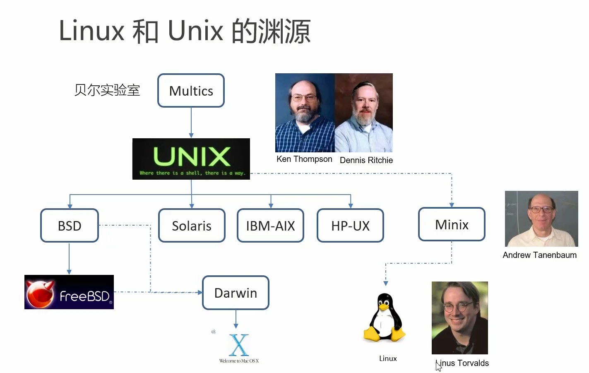

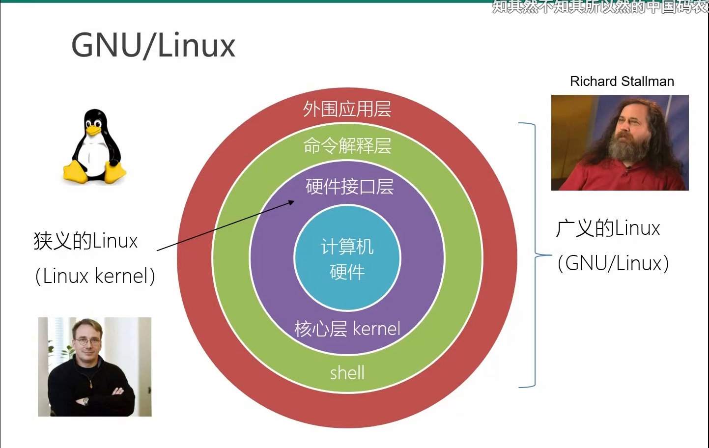

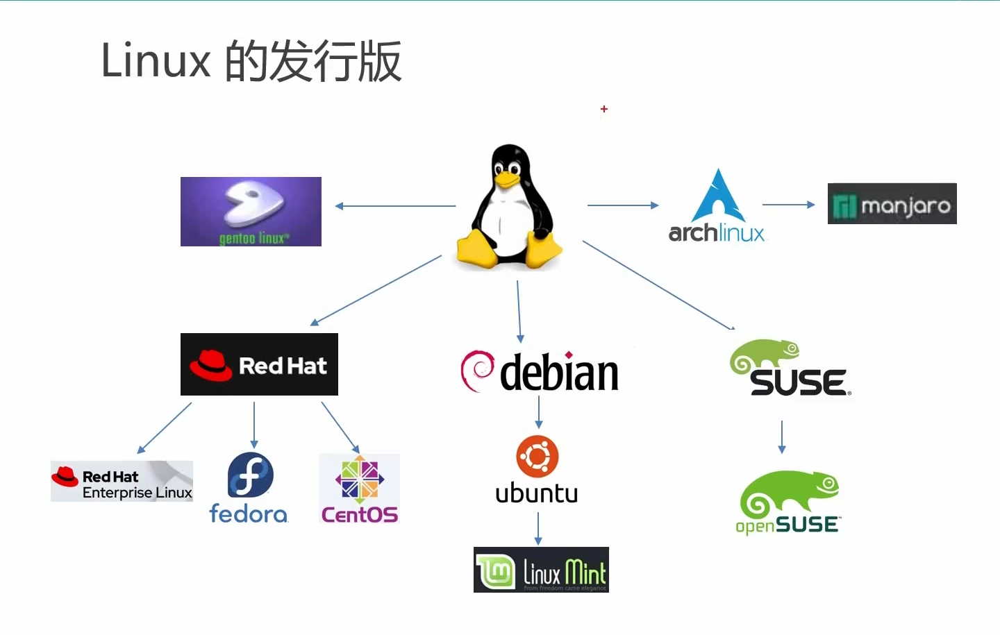

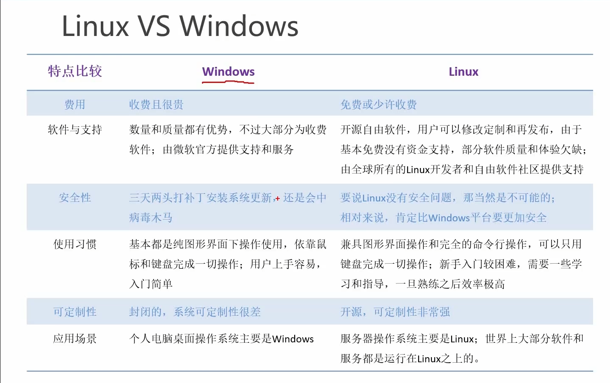


==**切换终端：Ctrl+Alt+F1~F6**==


## 2、Linux 文件系统与目录结构

​		==Linux系统中一切皆文件==

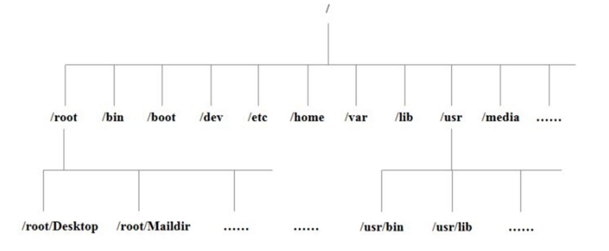

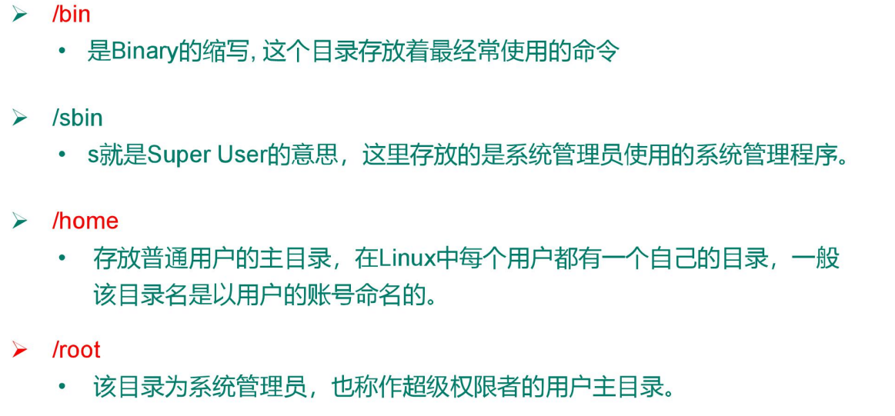

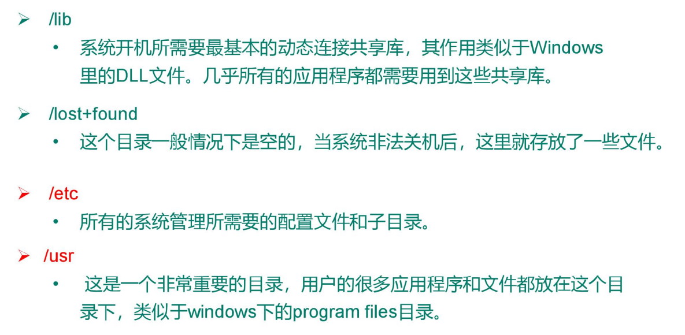

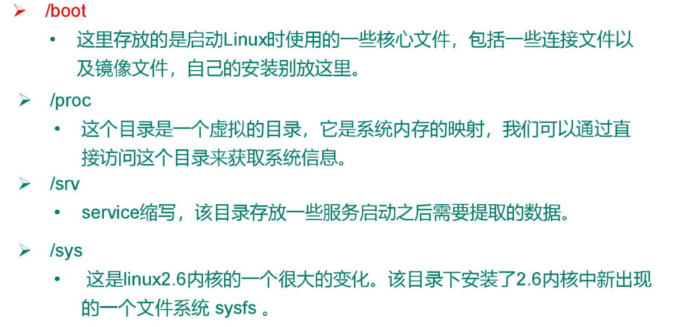

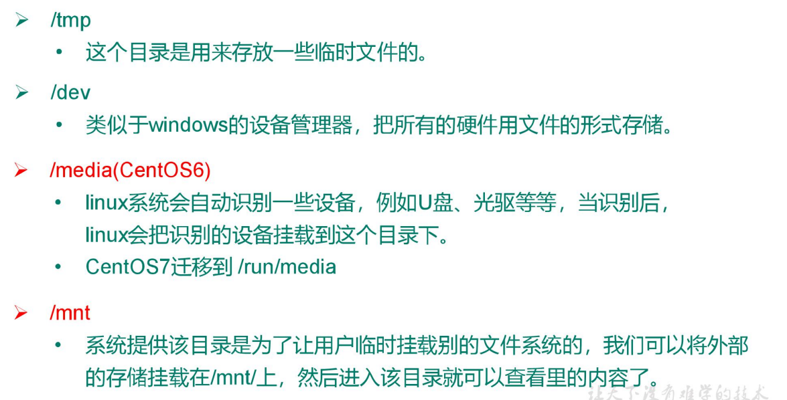

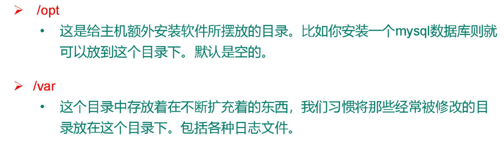

| 文件夹    | 全称                 | 中文名         | 作用                                                         | link       |
| --------- | -------------------- | -------------- | ------------------------------------------------------------ | ---------- |
| /bin      | binary               | 二进制命令     | 存放可以直接执行的命令                                       | /usr/bin   |
| /sbin     | system binary        | 系统二进制命令 | 存放超级管理员可以直接指行的命令                             | /usr/sbin  |
| /lib      | library              | 库目录         | 系统和应用程序所需要的的一些共享库文件（相当于Windows下的dll文件） | /usr/lib   |
| /lib64    |                      |                |                                                              | /usr/lib64 |
| ==/usr==  | Unix System Resource | Unix系统资源   | 类似于windows下的program files目录                           |            |
| ==/boot== |                      |                | Linux启动的核心文件，包括cpu等硬件设备的映射                 |            |
| ==/etc==  |                      |                | 系统管理所需要的的一些配置文件和子目录                       |            |
| /home     |                      |                | 存放普通用户的主目录，                                       |            |
| ==/root== |                      |                | 系统管理员的主目录                                           |            |
| /opt      | optional             | 可选目录       | 可以存放自己下载的第三方软件                                 |            |
| /media    |                      | 媒体           | U盘和光驱的默认挂载目录，可移动媒体设备的挂载点              |            |
| /mnt      | mount                |                | 也是一个挂载目录                                             |            |
| /proc     | process              | 进程           | 是Linux的一个虚拟目录，是系统内存的映射                      |            |
| /run      |                      | 运行           | 存放系统运行以来的实时信息，临时的文件系统，重启丢失         |            |
| /srv      | service              | 服务           | 存放系统服务相关的信息                                       |            |
| /sys      | system               | 系统           | 存放系统硬件信息                                             |            |
| /tmp      | temporary            | 临时           | 临时存放的信息。可以删除                                     |            |
| /var      | variable             | 变量           | 存放经常改变的信息，如系统入职log                            |            |


==挂载点：==

​		将单独划分出来的一块存储区域，挂载在一个文件夹下。这块区域在物理上可以不连续，甚至可以是其他的硬盘。


## 3、VI/VIM 编辑器

- VI 是 Unix 操作系统和类 Unix 操作系统中最通用的文本编辑器。

- VIM 编辑器是从 VI 发展出来的一个性能更强大的文本编辑器。可以主动的以字体颜色辨别语法的正确性，方便程序设计。
- VIM 与 VI 编辑器完全兼容。


### 3.1 三种模式


- 一般模式
- 编辑模式
- 指令模式


1. **一般模式**

    可以使用删除、复制、粘贴

    常用语法：

    | 语法          | 功能描述                      |
    | ------------- | ----------------------------- |
    | yy            | 复制光标当前一行              |
    | y 数字 y      | 复制一段（从第几行到第几行）  |
    | p             | 箭头移动到目的行粘贴          |
    | u             | 撤销上一步                    |
    | dd            | 删除光标当前行                |
    | d 数字 d      | 删除光标（含）后多少行        |
    | x             | 剪切一个字母，相当于 del      |
    | X             | 剪切一个字母，相当于 Backspac |
    | w             | 选词                          |
    | yw            | 复制一个词                    |
    | dw            | 删除一个词                    |
    | shift+6（^）  | 移动到行头                    |
    | shift+4 （$） | 移动到行尾                    |
    | 1+shift+g     | 移动到页头，数字              |
    | shift+g       | 移动到页尾                    |
    | 数字+shift+g  | 移动到目标行                  |

    

2. **编辑模式**

    1）进入编辑模式         

    | 按键 | 功能               |
    | ---- | ------------------ |
    | i    | 当前光标前         |
    | a    | 当前光标后         |
    | o    | 当前光标行的下一行 |
    | I    | 光标所在行最前     |
    | A    | 光标所在行最后     |
    | O    | 当前光标行的上一行 |

    

     2）退出编辑模式 按『Esc』键 退出编辑模式，之后所在的模式为一般模式。


3. **指令模式**

    - 在一般模式当中，输入『 :  /  ?』3个中的任何一个按钮，就可以将光标移动到最底下那 一行。 

    - 在这个模式当中， 可以提供你『搜寻资料』的动作，而读取、存盘、大量取代字符、 离开 

    基本语法：

    | 命令          | 功能                              |
    | ------------- | --------------------------------- |
    | :w            | 保存                              |
    | :q            | 退出                              |
    | :!            | 强制执行                          |
    | /要查找的词   | n 查找下一个，N 往上查找          |
    | :noh          | 取消高亮显示                      |
    | :set nu       | 显示行号                          |
    | :set nonu     | 关闭行号                          |
    | :%s/old/new/g | 替换内容  /g 替换匹配到的所有内容 |
    | :wq!          | 强制保存退出                      |

    

 

## 4、网络配置

- 检查是否联网：

`ping  + ip`

- Windows下的查询网络配置情况的命令：

`ipconfig`

- Linux下的查询网络配置情况的命令：

`ifconfig`


VMware自动创建了两张网卡：VMnet1、VMnet8。（这两张网卡为虚拟出来的网卡）

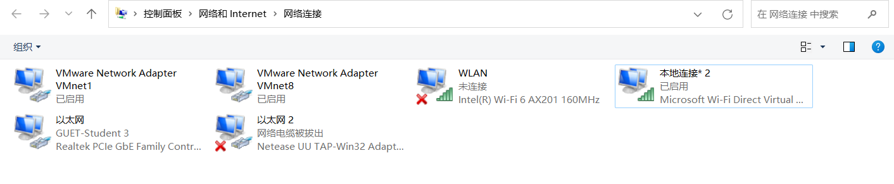

**虚拟机地址**：`192.168.201.130`

**主机地址**：`10.70.123.41`

两者IP不再一个网段内，但是可以互相ping同，这个VM创建的两个虚拟网卡VMnet1和VMnet8有关。

**VMnet1**的IP地址：`192.168.194.1`

**VMnet8**的IP地址：`192.168.201.1`

==由此可知，虚拟机与VMnet8在同一个局域网内（采用NAT模式创建的虚拟机）。==


### 4.1 网络连接方式


- **桥接模式（B）**：直接连接物理网络

    虚拟机直接连接外部物理网络的模式，主机起到了网桥的作用。

    在这种模式下，虚拟机可以直接访问外部网络，并且对外部网络是可见的。

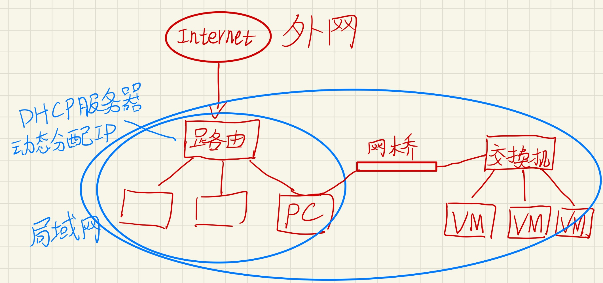

​		由主机网卡虚拟出一个网桥和交换机，网桥连接主机和交换机，交换机连接到虚拟机。

​		**虚拟机和当前局域网内的主机是平等的，但会消耗当前子网中的IP。**

​		VMware中桥接模式默认为自动桥接，也可手动配置，==创建出的虚拟网卡为VMnet0。==


- **NAT模式（N）**：用于共享主机的IP地址

    虚拟机和主机构建一个专用网络，并且通过虚拟网络地址转换（NAT）设备对IP进行转换。

    虚拟机通过共享主机IP可以访问外部网络，但外部网络无法访问虚拟机。

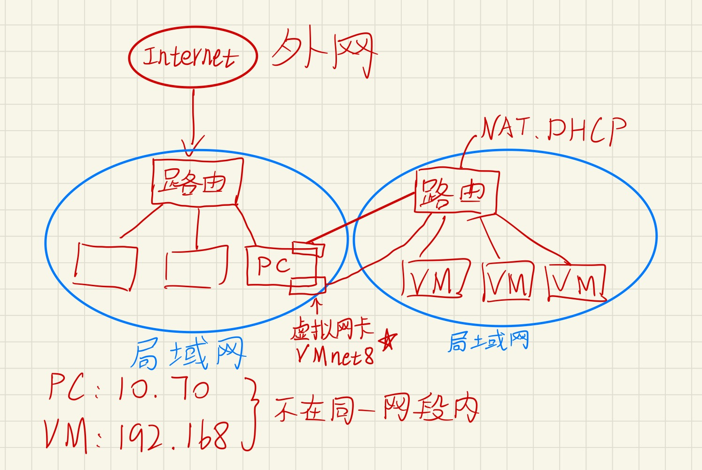

​		在主机中，虚拟出一个路由器（底层其实是创建了一个虚拟的NAT服务器和DHCP服务器）。

​		**虚拟机之间是一个局域网，可以互相访问，但怎么和PC访问呢？**

​		虚拟机访问PC就像PC访问外网一样，由路由做网络地址转换。

​		**但是此时PC就无法访问虚拟子网内部的虚拟机了。**

**解决方案：**

​		在PC上虚拟出一张网卡，让这张虚拟出的网卡连接到虚拟的路由上，此时主机和虚拟机就在同一个网段内了。==这张网卡在VMware中就叫做VMnet8。==


- **仅主机模式（H）**：与主机共享的专用网络

    虚拟机只与主机共享一个专用网络，与外部网络无法通信。

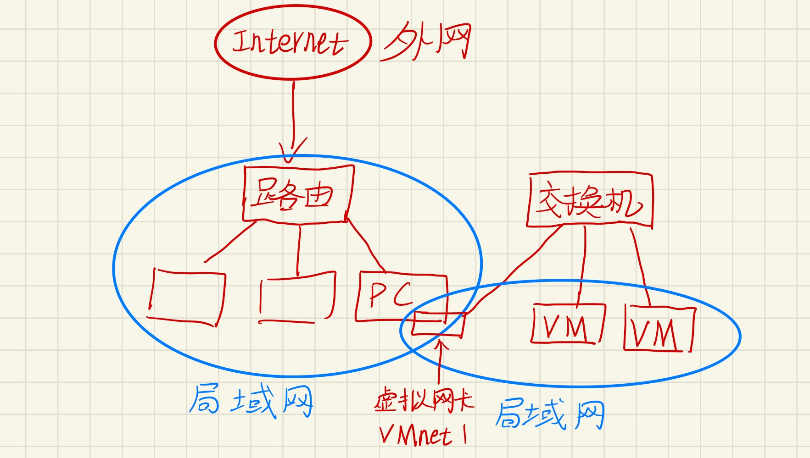

​		主机虚拟出一个交换机和一个虚拟网卡，将这个虚拟网卡和虚拟机连在这个交换机上，这个交换机不与外部连接，所以不能访问外网。==这张网卡在VMware中就叫做VMnet1。==


### 4.2 NAT模式配置解读

**虚拟机地址**：`192.168.201.130`

**主机地址**：`10.70.123.41`


1. **子网IP与子网掩码**

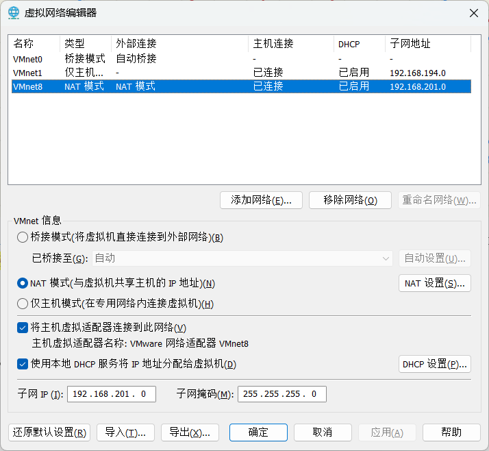

​		子网IP为 `192.168.201.0`，子网掩码为 `255.255.255.0`

​		由此可知，虚拟机地址 `192.168.201.130` 在这个子网内。

​		**我们可以通过修改子网IP和子网掩码来自定义给虚拟机的分配IP。**


2. **DHCP**

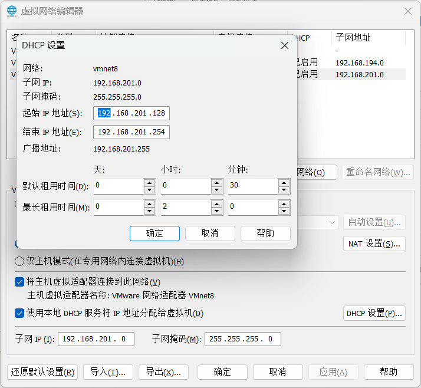

​		DHCP设置了子网分配地址的起始IP地址和结束IP地址。

​		因此这个虚拟机分配到的地址为`130` 。

​		**我们可以修改IP分配的起始和结束地址。**


3. **NAT**

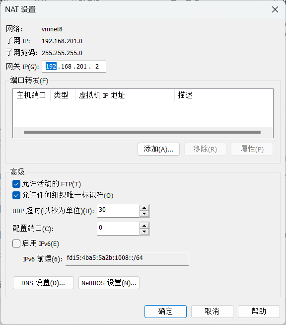

​		NAT设置了网关的IP。

​		==网关设置的地址为 `2` ，为什么是2而不是1呢？==

​		**我们查询到VMnet8的IP地址：`192.168.201.1`，因此可知地址1分配给了虚拟网卡VMnet8，所以地址2分配给了虚拟路由。我们要上网得通过路由器，因此，我们需要将网关的IP设置为虚拟路由的IP `192.168.201.2` 。**


4. 总结：
    - VMnet8就可以称为我们当前的子网，子网IP为 `192.168.201.0`
    - 主机虚拟了一张网卡，设置了IP为 `192.168.201.1`
    - 网关（虚拟路由）设置了IP为 `192.168.201.2`
    - DHCP设置避开了1和2，为 `128~254`
    - ==**因此，在这个子网下的设备就可以彼此没有IP冲突的，共同存在于虚拟子网内，可以和谐相处、彼此访问。**==


### 4.3 修改静态IP


**==注意事项：==**

- NAT模式下子网的IP是可以自己设置的，即可以是 `192.168.201.0` ，也可以是 `192.168.202.0` 。
- 但是需要注意的是，**修改了子网IP之后，DHCP和NAT设置都要改成对应的子网内。**
- **如果设置了静态IP，也要做对应的修改。如主机的VMnet8和虚拟机的静态IP。**


**==centos系统：==**

**通过控制台命令修改：**

1. **进入IP配置文件**

```bash
vim /etc/sysconfig/network-scripts/ifcfg-ens33
```


2. **将启动协议由DHCP改成static**，由动态分配IP改为静态分配IP

    需要加上自定义的静态IP地址、网关、域名解析器。

```python
BOOTPROTO="static"

ONBOOT="yes" #系统启动的时候网络接口是否有效（yes/no）

# 在最后要加三项内容
#IP 地址
IPADDR=192.168.201.100
#网关
GATEWAY=192.168.201.2
#域名解析器
DNS1=192.168.201.2

#子网掩码
NETMASK=255.255.255.0 #默认就是这个，可以不加
```

​		

3. **重启当前的网络环境**

```bash
service network restart
```


**==ubuntu系统：==**

1. 配置interfaces文件

```bash
sudo gedit /etc/network/interfaces
```


```
auto eth0
iface eth0 inet static
address		192.168.201.100	#IP地址
netmask		255.255.255.0	#子网掩码
network		192.168.201.0	#子网地址
gateway		192.168.201.2	#网关
broadcast	192.168.201.255	#广播地址
```


2. **配置DNS解析器**

```
sudo gedit /etc/resolv.conf
```

在该文件中添加（也可以添加其他的DNS）：

```
nameserver 192.168.201.2
nameserver 114.114.114.114
```


3. **在/etc/resolvconf/resolv.conf.d/base文件中设置nameserver，使其永久生效**

```
sudo gedit /etc/resolvconf/resolv.conf.d/base
```

添加nameserver后，保存退出。

```
nameserver
```


==**解决Ubuntu系统每次重启之后都需要重新配置DNS的问题：**==

之所以重启之后DNS须重新配置是因为：resolv.conf这个文件是程序动态创建的，不要直接手动编辑，修改将被覆盖。也就是说每次重新启动之后都会重新被创建。

现在总结出两个办法解决这个问题：

1. **通过/etc/network/interfaces**，在它的最后增加一句：

    ```bash
    dns-nameservers 8.8.8.8
    ```

    8.8.8.8是Google提供的DNS服务，这里只是举一个例子，你也可以改成电信运营商的DNS。重启后DNS就生效了，这时候再看/etc/resolv.conf，这个文件的最下边就多了一行：
    nameserver 8.8.8.8

2. **通过/etc/resolvconf/resolv.conf.d/base**（这个文件默认是空的）
    在里面插入：

    ```bash
    nameserver 8.8.8.8
    nameserver 8.8.4.4
    ```

    如果有多个DNS就一行一个
    修改好保存，然后执行

    ```bash
    resolvconf -u
    ```

    再看/etc/resolv.conf，最下面就多了2行：
    nameserver 8.8.8.8
    nameserver 8.8.4.4

这两种方法都能解决这个问题，可任选其一即可。
附：CentOS下修改DNS则容易的多了，直接修改/etc/resolv.conf，内容是：
nameserver 8.8.8.8
nameserver 8.8.4.4


==ubuntu 22.04 配置静态`ip`==

使用 `ifconfig` 命令查看对应 `ip` 的网络接口。若提示未找到 `ifconfig` 命令则使用如下命令按装该工具。

```bash
sudo apt-get install net-tools
```

查看需要修改的网卡，如下可以查到当前所有的网络接口信息，由于我的主机只有一块网卡，因此就只对它修改即可。

```bash
hduser@hadoop100:~$ ifconfig
ens33: flags=4163<UP,BROADCAST,RUNNING,MULTICAST>  mtu 1500
        inet 10.70.123.158  netmask 255.255.254.0  broadcast 10.70.123.255
        inet6 fe80::a6e3:3e88:f36f:1d65  prefixlen 64  scopeid 0x20<link>
        ether 00:0c:29:74:63:74  txqueuelen 1000  (以太网)
        RX packets 63540  bytes 55353390 (55.3 MB)
        RX errors 0  dropped 24776  overruns 0  frame 0
        TX packets 13819  bytes 1209794 (1.2 MB)
        TX errors 0  dropped 0 overruns 0  carrier 0  collisions 0
```

修改网卡默认配置文件

为了防止出现意外，先对文件进行备份

```bash
cd /etc/netplan/
sudo cp 01-network-manager-all.yaml 01-network-manager-all.yaml.bak
```

```bash
sudo vim /etc/netplan/01-network-manager-all.yaml
```


### 4.4 修改主机名称


1. **查看当前的主机名**： `hostname` 


2. **通过文件修改主机名**：文件位置：`/etc/hostname`

    `vim /etc/hostname`

    需要重启生效。


3. **快捷命令**： `hostnamectl`

    会显示出与主机名相关的系统信息。

    修改主机名：

```bash
hostnamectl set-hostname hadoop100(要修改的主机名)
```


### 4.5 修改hosts映射文件


- 当主机设置了静态IP后，就可以通过hosts文件将hostname和ip关联起来，这样当我们需要访问这台服务器时，就只需要知道它的主机名，hosts文件会自动由主机名转化为对应的IP。


- 文件路径： `/etc/hosts`

```bash
vim /etc/hosts
```


- 添加信息：示例

```bash
192.168.201.100 hadoop100
192.168.201.101 hadoop101
192.168.201.102 hadoop102
192.168.201.103 hadoop100
```


## 5、系统管理

### 5.1 Linux中的进程和服务

​	

- 计算机中，一个正在执行的程序或命令，被叫做 ==”进程“（process）==。
- 启动之后**一直存在、常驻内存的进程**，一般被称为 ==“服务”（service）==。


- 守护进程 - daemon = 系统服务
- 服务带d结尾的表示当前的服务是一个守护进程。


### 5.2 systemctl


- 将服务命令集中到systemctl中。

1. 基本语法

    `systemctl start| stop | restart | status  服务名`


### 5.3 系统运行级别


- 图形化界面 ： 终端中输入： `setup`


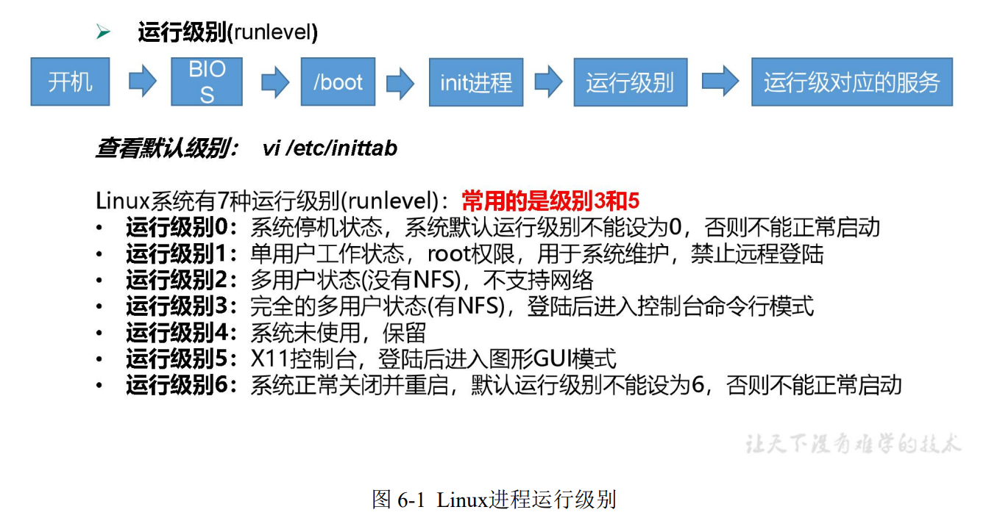

- CentOS7 的运行级别简化为：
    - multi-user.target 等价于原运行级别 3 （多用户有网，无图形界面）
    - graphical.target   等价于原运行级别 5 （多用户有网，有图形界面）

- 查看当前运行级别：
    - `systemctl get-default`

- 更改当前的运行级别
    - ctrl+F1~F5
    - 命令： `init 3 | 5 `
    - `systemctl set-default TARGET.target` （这里 TARGET 取 multi-user 或者 graphical）


### 5.4 配置服务开机自启动


centos6中：

- 查看配置项：只显示SysV服务

    `chkconfig --list`

- 关闭network的开机自启动：

    `chkconfig network off`

    `chkconfig network on`

- 针对某一级别：

    `chkconfig --level 3 network off`


centos7：

- 使用`systemctl`

- 查看所有开机自启动项：

    `systemctl list-unit-files`


### 5.5 关闭防火墙


- 旧版本： iptables
- 新版本： firewalld


- 查看当前状态：

    `systemctl status firewalld`

- 当前停止:
    `systemctl stop firewalld.service`   .service可不加

- 关闭开机自启动

    `systemctl disable firewalld.service`

- 开启

    `systemctl enable firewalld.service`


### 5.6 关机重启命令


**shutdown** 

- **默认一分钟关机**
- **取消关机**
    - `shutdown -c`   
- **立即关机**
    - `shutdown now`
- **指定时间(3分钟)**
    - `shutdown 3`
- **定时关机**
    - `shutdown 15.28`


**sync**

- **将数据由内存同步到硬盘中**
- ==**Linux系统采取预读迟写**==


**halt**

- **停机，不断电**


**poweroff**

- 关机，断电


**reboot**

- 重启


## 6、shell及bash

​		Shell 可以看作是一个命令解释器，为我们提供了交互式的文本控制台界面。我们可以通过终端控制台来输入命令，由 shell 进行解释并最终交给内核执行。


- Unix中最终解释执行的程序叫做 Bourne Shell
- Linux发展为 Bourne Again Shell    —— ==**bash**==

- Dedian使用dash


## 7、帮助命令

manual - 手册、说明书


### 7.1 man 获得帮助信息

1. 基本语法 

    man [命令或配置文件] （功能描述：获得帮助信息）

2. man cd

    会进入到BASH信息，因为cd是Shell的内置命令


**内置命令：**

一部分基础功能的系统命令是直接内嵌在 shell 中的，系统加载启动之后会随着 shell 一起加载，常驻系统内存中。这部分命令被称为“内置（built-in）命令”；相应的其它命令 被称为“外部命令”

- 判断命令是否为内嵌命令：

    `type cd`


- 查看内嵌命令帮助信息：

    `man -f cd`

    然后可选一种：`man 3 cd`


### 7.2 help 获得shell内置命令的帮助信息

- 内嵌命令

    `help cd`

- 外部命令的使用方式： 使用--help参数

    `ls --help`


## 8、文件和目录操作命令

### 8.1 pwd 打印工作目录

- **print working directory 打印工作目录**

- **显示当前工作目录的绝对路径**

    

### 8.2 ls 列出目录内容

- **list 列出目录内容**

- 基本语法 

    **ls [选项] [目录或是文件]** 

- 选项说明

    | 选项 | 功能                                                         |
    | ---- | ------------------------------------------------------------ |
    | -a   | 全部的文件，连同隐藏档( 开头为 . 的文. 的文件) 一起列出来(常用) |
    | -l   | 长数据串列出，包含文件的属性与权限等等数据；(常用)等价于“ll” |

- 显示说明 

    每行列出的信息依次是： 

    文件类型与权限 链接数 文件属主 文件属组 文件大小用byte 来表示 建立或最近修改的时间 名字

例如：

```
drwx------. 5 atguigu atguigu 4096 5 月 27 15
```


### 8.3 cd 切换路径

- **Change Directory 切换路径**

- 基本语法

    **cd [参数]**

- 参数说明

    | 参数        | 功能                                 |
    | ----------- | ------------------------------------ |
    | cd 绝对路径 | 切换路径                             |
    | cd 相对路径 | 切换路径                             |
    | cd ~或者 cd | 回到自己的家目录                     |
    | cd -        | 回到上一次所在目录                   |
    | cd ..       | 回到当前目录的上一级目录             |
    | cd -P       | 跳转到实际物理路径，而非快捷方式路径 |


### 8.4 mkdir 创建一个新的目录

- Make directory 建立目录

- 基本语法 

    **mkdir [选项] 要创建的目录** 

- 选项说明

| 选项 | 功能         |
| ---- | ------------ |
| -p   | 创建多层目录 |

**嵌套创建**


### 8.5 rmdir 删除一个空的目录

- **Remove directory 移除目录**

- 基本语法 

    **rmdir 要删除的空目录**

- 嵌套删除

    **rmdir -p 要删除的空目录**


### 8.6 touch 创建空文件

- 基本语法 

    **touch 文件名称**

- 例子

    `touch xiyou/dssz/sunwukong.txt`


### 8.7 cp 复制文件或目录

- 基本语法 

    **cp [选项] source dest （功能描述：复制source文件到dest）**

- 选项说明

    | 选项 | 功能               |
    | ---- | ------------------ |
    | -r   | 递归复制整个文件夹 |

- 经验技巧

    **强制覆盖不提示的方法：\cp**


### 8.8 rm 删除文件或目录

- 基本语法 

    **rm [选项] deleteFile （功能描述：递归删除目录中所有内容）**

- 选项说明

    | 选项 | 功能                                     |
    | ---- | ---------------------------------------- |
    | -r   | 递归删除目录中所有内容                   |
    | -f   | 强制执行删除操作，而不提示用于进行确认。 |
    | -v   | 显示指令的详细执行过程                   |
    |      |                                          |

    

### 8.9 mv 移动文件与目录或重命名

- 基本语法 

    **mv oldNameFile newNameFile （功能描述：重命名）** 

    **mv /temp/movefile /targetFolder （功能描述：移动文件）**


### 8.10 cat 查看文件内容

- 查看文件内容，从第一行开始显示。

- 基本语法 

    **cat [选项] 要查看的文件**

- 选项说明

    | 选项 | 功能描述                     |
    | ---- | ---------------------------- |
    | -n   | 显示所有行的行号，包括空行。 |

- 经验技巧 

    一般查看比较小的文件，一屏幕能显示全的。


### 8.11 more 文件内容分屏查看器

more 指令是一个基于 VI 编辑器的文本过滤器，它以全屏幕的方式按页显示文本文件 的内容。more 指令中内置了若干快捷键，详见操作说明。

- 基本语法 

    **more 要查看的文件**

- 操作说明

    | 操作           | 功能说明                                |
    | -------------- | --------------------------------------- |
    | 空白键 (space) | 代表向下翻一页；                        |
    | Enter          | 代表向下翻『一行』                      |
    | q              | 代表立刻离开 more，不再显示该文件内容。 |
    | Ctrl+F         | 向下滚动一屏                            |
    | Ctrl+B         | 返回上一屏                              |
    | =              | 输出当前行的行号                        |
    | :f             | 输出文件名和当前行的行号                |

    

### 8.12 less 分屏显示文件内容

less 指令用来分屏查看文件内容，它的功能与 more 指令类似，但是比 more 指令更加 强大，支持各种显示终端。less 指令在显示文件内容时，并不是一次将整个文件加载之后 才显示，而是根据显示需要加载内容，对于显示大型文件具有较高的效率。

- 基本语法

    **less 要查看的文件**

- 操作说明

    | 操作       | 功能说明                                           |
    | ---------- | -------------------------------------------------- |
    | 空白键     | 向下翻动一页；                                     |
    | [pagedown] | 向下翻动一页                                       |
    | [pageup]   | 向上翻动一页；                                     |
    | /字串      | 向下搜寻『字串』的功能；n：向下查找；N：向上查找； |
    | ?字串      | 向上搜寻『字串』的功能；n：向上查找；N：向下查找； |
    | q          | 离开 less 这个程序；                               |

    

### 8.13 echo 输出内容到控制台

- 基本语法 

    **echo [选项] [输出内容]**

- 选项

    **-e： 支持反斜线控制的字符转**

    | 控制字符 | 作用               |
    | -------- | ------------------ |
    | \\\      | 输出\本身          |
    | \n       | 换行符             |
    | \t       | 制表符，也就是 Tab |

- echo $
- echo $PATH


### 8.14 head 显示文件头部内容

- head 用于显示文件的开头部分内容，**默认情况下 head 指令显示文件的前 10 行内容。**

- 基本语法 

    **head 文件 （功能描述：查看文件头10行内容）** 

    **head -n 5 文件 （功能描述：查看文件头5行内容，5可以是任意行数）**

- 选项说明

    | 选项      | 功能                   |
    | --------- | ---------------------- |
    | -n <行数> | 指定显示头部内容的行数 |

    

### 8.15 tail 输出文件尾部内容

- tail 用于输出文件中尾部的内容，**默认情况下 tail 指令显示文件的后 10 行内容**

- 基本语法 

    **tail 文件 （功能描述：查看文件尾部10行内容）** 

    **tail -n 5 文件 （功能描述：查看文件尾部5行内容，5可以是任意行数）**

    **tail -f 文件 （功能描述：实时追踪该文档的所有更新）**

- ==-f 显示文件最新追加的内容，监视文件变化==
- 监控状态：Ctrl+s 暂停  Ctrl+q 继续  Ctrl+c 终止


### 8.16 \> 输出重定向和 >> 追加

- 基本语法

    **ls -l > 文件 （功能描述：列表的内容写入文件 a.txt 中（覆盖写）**

    **ls -al >> 文件 （功能描述：列表的内容追加到文件 aa.txt 的末尾）** 

    **cat 文件 1 > 文件 2 （功能描述：将文件 1 的内容覆盖到文件 2）** 

    **echo “内容” >> 文件**


### 8.17 ln 软链接

- 软链接也称为符号链接，类似于 windows 里的快捷方式，有自己的数据块，主要存放了链接其他文件的路径。

- 基本语法

    **ln -s [原文件或目录] [软链接名] （功能描述：给原文件创建一个软链接）**

- 经验技巧 

    删除软链接： rm -rf 软链接名，而不是 rm -rf 软链接名/ 

    **如果使用 rm -rf 软链接名/ 删除，会把软链接对应的真实目录下内容删掉** 

    查询：通过 ll 就可以查看，**列表属性第 1 位是 l**，尾部会有位置指向。

- ==不加参数 -s，将创建硬链接==

    ln [原文件或目录] [软链接名] 


### 8.18 history 查看已经执行过历史命令

- 基本语法 

    **history （功能描述：查看已经执行过历史命令）**

    **history  行数** （显示最近使用的 n 条命令）

    **！行号** （再次调用行号对应的命令）

- 清空

    **history -c**


## 9、时间日期类命令

- 基本语法 

    **date [OPTION]... [+FORMAT]**

- 选项说明

    | 选项           | 功能                                           |
    | -------------- | ---------------------------------------------- |
    | -d<时间字符串> | 显示指定的“时间字符串”表示的时间，而非当前时间 |
    | -s<日期时间>   | 设置系统日期时间                               |

- 参数说明

    | 参数            | 功能                         |
    | --------------- | ---------------------------- |
    | <+日期时间格式> | 指定显示时使用的日期时间格式 |

    

### 9.1 date 显示当前时间

- 基本语法 

    **date （功能描述：显示当前时间）**

    **date +%Y （功能描述：显示当前年份）** 

    **date +%m （功能描述：显示当前月份）**

    **date +%d （功能描述：显示当前是哪一天）** 

    **date "+%Y-%m-%d %H:%M:%S" （功能描述：显示年月日时分秒）**


### 9.2 date 显示非当前时间

- 基本语法 

    **date -d '1 days ago' （功能描述：显示前一天时间）** 

    **date -d '-1 days ago' （功能描述：显示明天时间）** 

    

### 9.3 date 设置系统时间

- 基本语法 

    **date -s 字符串时间**


### 9.4 cal 查看日历

- 基本语法 

    **cal [选项] （功能描述：不加选项，显示本月日历）**

- 选项说明

    | 选项       | 功能             |
    | ---------- | ---------------- |
    | 具体某一年 | 显示这一年的日历 |

    

## 10、用户权限类命令

### 10.1 useradd 添加新用户

- 基本语法 

    **useradd 用户名 （功能描述：添加新用户）** 

    **useradd -g 组名 用户名 （功能描述：添加新用户到某个组）**


### 10.2 passwd 设置用户密码

- 基本语法 

    **passwd 用户名 （功能描述：设置用户密码）**


###  10.3 id 查看用户是否存在

- 基本语法 

    id 用户名


### 10.4 cat /etc/passwd 查看创建了哪些用户


### 10.5 su 切换用户

- su: swith user

- 基本语法 

    **su 用户名称 （功能描述：切换用户，只能获得用户的执行权限，不能获得环境变量）** 

    **su - 用户名称 （功能描述：切换到用户并获得该用户的环境变量及执行权限）**


### 10.6 userdel 删除用户

- 基本语法

    **userdel 用户名 （功能描述：删除用户但保存用户主目录）** 

    **userdel -r 用户名 （功能描述：用户和用户主目录，都删除）**

- 选项说明

    | 选项 | 功能                                       |
    | ---- | ------------------------------------------ |
    | -r   | 删除用户的同时，删除与用户相关的所有文件。 |

    

### 10.7 who 查看登录用户信息

- 基本语法 

    **whoami （功能描述：显示自身用户名称）** 

    **who am i （功能描述：显示登录用户的用户名以及登陆时间）**


### 10.8 sudo 设置普通用户具有 root 权限

- 添加 atguigu 用户，并对其设置密码。 

    ```bash
    [root@hadoop101 ~]#useradd atguigu 
    [root@hadoop101 ~]#passwd atguigu 
    ```

- 修改配置文件 

    ```bash
    [root@hadoop101 ~]#vi /etc/sudoers
    ```

     修改 /etc/sudoers 文件，找到下面一行(91 行)，在 root 下面添加一行，如下所示： 

    ```bash
    ## Allow root to run any commands anywhere 
    root ALL=(ALL) ALL 
    atguigu ALL=(ALL) ALL
    ```

    

- 或者配置成采用 sudo 命令时，不需要输入密码 

- ```bash
    ## Allow root to run any commands anywhere 
    root ALL=(ALL) ALL 
    atguigu ALL=(ALL) NOPASSWD:ALL
    ```


### 10.9 usermod 修改用户属组

- 基本语法 

    **usermod -g 用户组 用户名**

- 选项说明

    | 选项 | 功能                                                     |
    | ---- | -------------------------------------------------------- |
    | -g   | 修改用户的初始登录组，给定的组必须存在。默认组 id 是 1。 |


为用户添加附属组：

- 基本语法

    **usermod -aG <附属组名> <用户名>**

- 选项说明

    | 选项 | 功能                                                         |
    | ---- | ------------------------------------------------------------ |
    | -a   | 选项表示附加，意味着将指定的组添加到用户已有的附属组列表中，而不会影响其他附属组。 |
    | -G   | 选项表示要操作的是附属组（Supplementary Groups）。           |

    


## 11、用户组管理命令

​		每个用户都有一个用户组，系统可以对一个用户组中的所有用户进行集中管理。不同 Linux 系统对用户组的规定有所不同， 如Linux下的用户属于与它同名的用户组，这个用户组在创建用户时同时创建。 

​		用户组的管理涉及用户组的添加、删除和修改。**组的增加、删除和修改实际上就是对 /etc/group文件的更新。**


### 11.1 groupadd 新增组

- 基本语法 

    **groupadd 组名**


### 11.2 groupdel 删除组

- 基本语法 

    **groupdel 组名**

### 11.3 groupmod 修改组

- 基本语法 

    groupmod -n 新组名 老组名

- 选项说明

    | 选项       | 功能描述           |
    | ---------- | ------------------ |
    | -n<新组名> | 指定工作组的新组名 |

    

### 11.4 cat /etc/group 查看创建了哪些


## 12、文件权限类命令 

### 12.1 文件属性

​		Linux系统是一种典型的多用户系统，不同的用户处于不同的地位，拥有不同的权限。 为了保护系统的安全性，Linux系统对不同的用户访问同一文件（包括目录文件）的权限做 了不同的规定。在Linux中我们可以使用ll或者ls -l命令来显示一个文件的属性以及文件所属 的用户和组。


- 从左到右的 10 个字符表示，如图 

    

    如果没有权限，就会出现减号[ - ]而已。

- 从左至右用0-9这些数字表示:

    - 0 首位表示类型

        在Linux中第一个字符代表这个文件是目录、文件或链接文件等等

        **\- 代表文件**

        **d 代表目录**

        **l 链接文档(link file)；**

    - 第1-3位确定**属主**（该文件的所有者）拥有该文件的权限。---User

    - 第4-6位确定**属组**（所有者的同组用户）拥有该文件的权限，---Group

    - 第7-9位确定**其他用户**拥有该文件的权限 ---Other

- **rwx 作用文件和目录的不同解释**

    - **作用到文件**：

        [ r ]代表可读(read): 可以读取，查看 

        [ w ]代表可写(write): 可以修改，但是不代表可以删除该文件，**删除一个文件的前提条件是对该文件所在的目录有写权限，才能删除该文件.**

        [ x ]代表可执行(execute):可以被系统执行

    - **作用到目录**：

        [ r ]代表可读(read): 可以读取，ls查看目录内容 

        [ w ]代表可写(write): 可以修改，目录内创建+删除+重命名目录 

        [ x ]代表可执行(execute):可以进入该目录


- **文件基本属性介绍**，如图：

    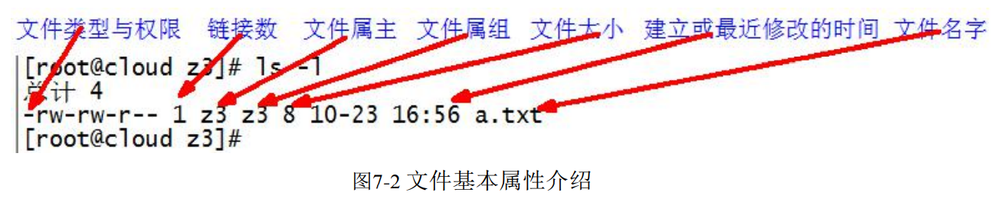

    （1）如果查看到是**文件**：链接数指的是**硬链接个数**。 

    （2）如果查看的是**文件夹**：链接数指的是**子文件夹个数**。


### 12.2 chmod 改变权限


- 第一种方式变更权限 

    chmod [{ugoa}{+-=}{rwx}] 文件或目录 

- 第二种方式变更权限 

    chmod [mode=421 ] [文件或目录]

> u:所有者 g:所有组 o:其他人 a:所有人(u、g、o的总和)
>
> r=4 w=2 x=1   rwx=4+2+1=7

示例：

```bash
[root@hadoop101 ~]# chmod 777 houge.txt
[root@hadoop101 ~]# chmod -R 777 xiyou/
```


### 12.3 chown 改变所有者

- 基本语法 

    chown [选项] [最终用户] [文件或目录]  （功能描述：改变文件或者目录的所有者）

- 选项说明

    | 选项 | 功能     |
    | ---- | -------- |
    | -R   | 递归操作 |

示例：

```bash
[root@hadoop101 xiyou]# chown -R atguigu:atguigu xiyou/
```


### 12.4 chgrp 改变所属组

- 基本语法 

    chgrp [最终用户组] [文件或目录] （功能描述：改变文件或者目录的所属组）

示例：

```bash
[root@hadoop101 ~]# chgrp root houge.txt
```


## 13、搜索查找类

### 13.1 find 查找文件或者目录

find 指令将从指定目录向下递归地遍历其各个子目录，将满足条件的文件显示在终端。

语法：

```bash
find [搜索范围] [选项]
```

选项说明：

| 选项            | 功能                                                         |
| --------------- | ------------------------------------------------------------ |
| -name<查询方式> | 按照指定的文件名查找模式查找文件                             |
| -user<用户名>   | 查找属于指定用户名的所有文件                                 |
| -size<文件大小> | 按照指定的文件大小查找文件，单位为：（配合+号或-号使用）<br />b——块（512字节）<br />c——字节<br />w——字（2字节）<br />k——千字节<br />M——兆字节<br />G——吉字节 |

实例：

```bash
# 按照文件名查找
find /root -name info
find /root -name "*.cfg"
# 按照用户名查找
find /home -user tony
# 按照文件大小查找
find /root -size +2M
```


### 13.2 locate 快速定位文件路径

locate 指令利用事先建立的系统中所有文件名称及路径的**locate数据库**实现快速定位给定的文件。

**Locate 指令无需遍历整个文件系统，查询速度较快。**为了保证查询结果的准确度，管理员必须定期更新locate时刻。

语法：

```bash
locate 搜索文件
```

**注意：由于 locate 指令基于数据库进行查询，所以第一次运行前，必须使用 updatedb 指令创建 locate 数据库。**

实例：

```bash
updatedb
locate tmp

which ls
which locate
which which
whereis locate
```


### 13.3 grep 过滤查找及“|”管道符

管道符——“|”，表示将前一个命令的处理结果输出传递给后面的命令处理。

grep 可以在文件内查找内容。

语法：

```bash
grep 选项 查找内容 源文件
```

选项说明：

| 选项 | 功能             |
| ---- | ---------------- |
| -n   | 显示匹配行及行号 |

示例：

```bash
grep -n hello test.txt 
ls | grep -n test
```


### 13.4 wc 词频统计

word count

示例：

```bash
[root@hadoop100 ~]# wc info
21  22  158   info
行数 词数 字节数 
[root@hadoop100 ~]# grep -n boot a.txt | wc
```


## 14、压缩解压类

### 14.1 gzip/gunzip

gzip 为压缩文件命令，只能将文件压缩为 *.gz 文件

gunzip 为解压缩文件命令

语法：

```bash
gzip 文件
gunzip 文件.gz
```

**注意：**

- **只能压缩文件，不能压缩目录**
- **不保留原来的文件**
- **同时多个文件会产生多个压缩包**

实例：

```bash
gzip a.txt
gunzip a.txt.gz
```


### 14.2 zip/unzip

zip 为压缩文件和目录的命令

unzip 为解压缩命令

语法：

```bash
zip [选项] XXX.zip 要压缩的内容
unzip [选项] XXX.zip
```

选项说明：

| zip 选项 | 功能     |
| -------- | -------- |
| -r       | 压缩目录 |

| unzip 选项 | 功能                     |
| ---------- | ------------------------ |
| -d<目录>   | 指定解压后文件的存放目录 |

**注意：zip 压缩命令在Windows/linux都通用，可以压缩目录且保留源文件。**


### 14.3 tar 打包

打包目录，压缩后的文件格式 .tar.gz

语法：

```bash
tar [选项] XXX.tar.gz 要打包的内容
```

选项说明：

| 选项 | 功能                         |
| ---- | ---------------------------- |
| -c   | 产生.tar打包文件             |
| -v   | 显示详细信息                 |
| -f   | 指定压缩后的文件名           |
| -z   | 使用gzip压缩或解压缩归档文件 |
| -x   | 解包.tar文件                 |
| -C   | 解压到指定目录               |

实例：

```bash
tar -zcvf temp.tar.gz a.txt b.txt c/
tar -zxvf temp.tar.gz -C /tmp
```


## 15、磁盘管理类

### 15.1 du 查看占用的磁盘空间

du：disk usage 磁盘占用情况 查看文件和目录占用的磁盘空间

显示目录下每个子目录的磁盘使用情况

语法：

```bash
du 目录/文件
```

选项说明：

| 选项          | 功能                                                 |
| ------------- | ---------------------------------------------------- |
| -h            | 以人们较易阅读的 GBytes,MBtyes,KBytes 等格式自行显示 |
| -a            | 不仅查看子目录大小，还要包含文件                     |
| -c            | 显示所有的文件和子目录大小后，显示总和               |
| -s            | 只显示总和                                           |
| --max-depth=n | 指定统计子目录的深度为第n层                          |

示例：

```bash
du -sh /
```


### 15.2 df 查看磁盘空间使用情况

df：disk free 空余磁盘

列出文件系统的整体磁盘使用量，检查文件系统的磁盘空间占用情况

语法：

```bash
df 选项
```

选项说明：

| 选项 | 功能                                                 |
| ---- | ---------------------------------------------------- |
| -h   | 以人们较易阅读的 GBytes,MBtyes,KBytes 等格式自行显示 |


示例：

```bash
[root@hecs-86422 ~]# df -h
Filesystem      Size  Used Avail Use% Mounted on
devtmpfs        893M     0  893M   0% /dev
tmpfs           909M     0  909M   0% /dev/shm
tmpfs           909M   25M  884M   3% /run
tmpfs           909M     0  909M   0% /sys/fs/cgroup
/dev/vda1        40G  5.3G   32G  15% /
tmpfs           182M     0  182M   0% /run/user/0
[root@hecs-86422 ~]# free -h
              total        used        free      shared  buff/cache   available
Mem:          1.8Gi       523Mi       510Mi        25Mi       782Mi       1.1Gi
Swap:            0B          0B          0B
```


### 15.3 lsblk 查看设备挂载情况

lsblk：list block

查看设备挂载情况

语法：

```bash
lsblk
```

选项说明：

| 选项 | 功能                                     |
| ---- | ---------------------------------------- |
| -f   | 查看详细的设备挂载情况，显示文件系统信息 |

示例：

```bash
[root@hecs-86422 ~]# lsblk
NAME   MAJ:MIN RM SIZE RO TYPE MOUNTPOINT
vda    253:0    0  40G  0 disk 
└─vda1 253:1    0  40G  0 part /
[root@hecs-86422 ~]# lsblk -f
NAME   FSTYPE LABEL UUID                                 MOUNTPOINT
vda                                                      
└─vda1 ext4         acc939b7-be07-4954-9f84-a5c9593985ec /
```

对于不同的选项，硬盘的名称可能不同，有 sda、hda、vda

现在主要的硬盘有 IDE、SATA、SCSI，在创建Linux操作系统时，如果选择IDE硬盘，创建的硬盘名称为hda、hdb、hdc...；如果选择SATA或SCSI硬盘，创建的硬盘名称为sda、sdb、sdc...；如果用到了虚拟化的模拟设备，硬盘的名称为vda。

对一块硬盘分区的话，名称就为：sda1,sda2...


### 15.4 mount/unmount 挂载/卸载

对于Linux用户来讲，不论有几个分区，分别分给哪一个目录使用，它总归就是一个根目录、一个独立且唯一的文件结构。

Linux中每个分区都是用来组成整个文件系统的一部分，它在用一种叫做“挂载”的处理方法，它整个文件系统中包含了一整套的文件和目录，并将一个分区和一个目录联系起来，要载入的那个分区将使它的存储空间在这个目录下获得。

语法：

```bash
mount [-t vfstype] [-o options] device dir 	 (功能描述：挂载设备)
unmount 设备文件名或挂载点						(功能描述：卸载设备)
```
选项说明：

| 参数       | 功能                                                         |
| ---------- | ------------------------------------------------------------ |
| -t vfstype | 指定文件系统的类型，通常不指定。mount 会自动选择正确的类型。<br />常用类型有：<br />光盘或光盘镜像：iso9669<br />DOS fat16 文件系统：msdos<br />Windows 9x fat32 文件系统:：vfat<br />Windows NT ntfs 文件系统：ntfs<br />Mount Windows 文件网络共享：smbfs<br />UNIX(LINUX) 文件网络共享：nfs |
| -o options | 主要用来描述设备或档案的挂接方式。常用的参数有:<br />loop：用来把一个文件当成硬盘分区挂接上系统<br />ro：采用只读方式挂接设备<br />rw：采用读写方式挂接设备<br />iocharset：指定访问文件系统所用字符集 |
| device     | 要挂载的设备                                                 |
| dir        | 设备在系统上的挂载点（mount point）                          |

示例：先使用lsblk查看为挂载设备名称

```bash
[root@hadoop100 ~]# lsblk
[root@hadoop100 ~]# mkdir /mnt/cdrom
[root@hadoop100 ~]# mount /dev/cdrom /mnt/cdrom
[root@hadoop100 ~]# unmount /dev/cdrom
```

设置开机自动挂载：

```bash
[root@hadoop100 ~]# vi /etc/fstab
/dev/cdrom  		/mnt/cdrom			iso9660 defaults  0 0
```


### 15.5 fdisk 分区

语法：

```bash
fdisk -l			（功能描述：查看磁盘分区详情）
fdisk 硬盘设备名			（功能描述：对新增磁盘进行分区操作）
```

选项说明：

| 选项 | 功能                   |
| ---- | ---------------------- |
| -l   | 显示所有硬盘的分区列表 |

注意：该命令必须在root用户下才能使用

示例：

```bash
[root@hadoop10 ~]# fdisk -l

磁盘 /dev/sda：53.7 GB, 53687091200 字节，104857600 个扇区
Units = 扇区 of 1 * 512 = 512 bytes
扇区大小(逻辑/物理)：512 字节 / 512 字节
I/O 大小(最小/最佳)：512 字节 / 512 字节
磁盘标签类型：dos
磁盘标识符：0x000b81d7

   设备 Boot      Start         End      Blocks   Id  System
/dev/sda1   *        2048     2099199     1048576   83  Linux
/dev/sda2         2099200   104857599    51379200   8e  Linux LVM

磁盘 /dev/mapper/centos-root：48.4 GB, 48444211200 字节，94617600 个扇区
Units = 扇区 of 1 * 512 = 512 bytes
扇区大小(逻辑/物理)：512 字节 / 512 字节
I/O 大小(最小/最佳)：512 字节 / 512 字节


磁盘 /dev/mapper/centos-swap：4160 MB, 4160749568 字节，8126464 个扇区
Units = 扇区 of 1 * 512 = 512 bytes
扇区大小(逻辑/物理)：512 字节 / 512 字节
I/O 大小(最小/最佳)：512 字节 / 512 字节
```

假如现在多了一块新硬盘，如何将新硬盘添加到当前系统中，进行分区。

1）在虚拟机设置中添加一块硬盘

```bash
[root@hadoop10 ~]# lsblk -l
NAME        MAJ:MIN RM  SIZE RO TYPE MOUNTPOINT
sda           8:0    0   50G  0 disk 
sda1          8:1    0    1G  0 part /boot
sda2          8:2    0   49G  0 part 
centos-root 253:0    0 45.1G  0 lvm  /
centos-swap 253:1    0  3.9G  0 lvm  [SWAP]
sr0          11:0    1  4.4G  0 rom  /run/media/lyb/CentOS 7 x86_64
```

可以看到当前并不能看到新的磁盘的信息，因为添加了硬盘后需要重启

```bash
reboot
```

```bash
[root@hadoop10 ~]# lsblk
NAME            MAJ:MIN RM  SIZE RO TYPE MOUNTPOINT
sda               8:0    0   50G  0 disk 
├─sda1            8:1    0    1G  0 part /boot
└─sda2            8:2    0   49G  0 part 
  ├─centos-root 253:0    0 45.1G  0 lvm  /
  └─centos-swap 253:1    0  3.9G  0 lvm  [SWAP]
sdb               8:16   0   20G  0 disk 
sr0              11:0    1  4.4G  0 rom  /run/media/root/CentOS 7 x86_64
[root@hadoop10 ~]# fdisk -l

磁盘 /dev/sda：53.7 GB, 53687091200 字节，104857600 个扇区
Units = 扇区 of 1 * 512 = 512 bytes
扇区大小(逻辑/物理)：512 字节 / 512 字节
I/O 大小(最小/最佳)：512 字节 / 512 字节
磁盘标签类型：dos
磁盘标识符：0x000b81d7

   设备 Boot      Start         End      Blocks   Id  System
/dev/sda1   *        2048     2099199     1048576   83  Linux
/dev/sda2         2099200   104857599    51379200   8e  Linux LVM

磁盘 /dev/sdb：21.5 GB, 21474836480 字节，41943040 个扇区
Units = 扇区 of 1 * 512 = 512 bytes
扇区大小(逻辑/物理)：512 字节 / 512 字节
I/O 大小(最小/最佳)：512 字节 / 512 字节


磁盘 /dev/mapper/centos-root：48.4 GB, 48444211200 字节，94617600 个扇区
Units = 扇区 of 1 * 512 = 512 bytes
扇区大小(逻辑/物理)：512 字节 / 512 字节
I/O 大小(最小/最佳)：512 字节 / 512 字节


磁盘 /dev/mapper/centos-swap：4160 MB, 4160749568 字节，8126464 个扇区
Units = 扇区 of 1 * 512 = 512 bytes
扇区大小(逻辑/物理)：512 字节 / 512 字节
I/O 大小(最小/最佳)：512 字节 / 512 字节

[root@hadoop10 ~]# fdisk /dev/sdb
欢迎使用 fdisk (util-linux 2.23.2)。

更改将停留在内存中，直到您决定将更改写入磁盘。
使用写入命令前请三思。

Device does not contain a recognized partition table
使用磁盘标识符 0x742c0221 创建新的 DOS 磁盘标签。

命令(输入 m 获取帮助)：m
命令操作
   a   toggle a bootable flag
   b   edit bsd disklabel
   c   toggle the dos compatibility flag
   d   delete a partition
   g   create a new empty GPT partition table
   G   create an IRIX (SGI) partition table
   l   list known partition types
   m   print this menu
   n   add a new partition
   o   create a new empty DOS partition table
   p   print the partition table
   q   quit without saving changes
   s   create a new empty Sun disklabel
   t   change a partition's system id
   u   change display/entry units
   v   verify the partition table
   w   write table to disk and exit
   x   extra functionality (experts only)

命令(输入 m 获取帮助)：n
Partition type:
   p   primary (0 primary, 0 extended, 4 free)
   e   extended
Select (default p): p
分区号 (1-4，默认 1)：1
起始 扇区 (2048-41943039，默认为 2048)：
将使用默认值 2048
Last 扇区, +扇区 or +size{K,M,G} (2048-41943039，默认为 41943039)：
将使用默认值 41943039
分区 1 已设置为 Linux 类型，大小设为 20 GiB

命令(输入 m 获取帮助)：p

磁盘 /dev/sdb：21.5 GB, 21474836480 字节，41943040 个扇区
Units = 扇区 of 1 * 512 = 512 bytes
扇区大小(逻辑/物理)：512 字节 / 512 字节
I/O 大小(最小/最佳)：512 字节 / 512 字节
磁盘标签类型：dos
磁盘标识符：0x742c0221

   设备 Boot      Start         End      Blocks   Id  System
/dev/sdb1            2048    41943039    20970496   83  Linux

命令(输入 m 获取帮助)：w
The partition table has been altered!

Calling ioctl() to re-read partition table.
正在同步磁盘。
[root@hadoop10 ~]# fdisk -l

磁盘 /dev/sda：53.7 GB, 53687091200 字节，104857600 个扇区
Units = 扇区 of 1 * 512 = 512 bytes
扇区大小(逻辑/物理)：512 字节 / 512 字节
I/O 大小(最小/最佳)：512 字节 / 512 字节
磁盘标签类型：dos
磁盘标识符：0x000b81d7

   设备 Boot      Start         End      Blocks   Id  System
/dev/sda1   *        2048     2099199     1048576   83  Linux
/dev/sda2         2099200   104857599    51379200   8e  Linux LVM

磁盘 /dev/sdb：21.5 GB, 21474836480 字节，41943040 个扇区
Units = 扇区 of 1 * 512 = 512 bytes
扇区大小(逻辑/物理)：512 字节 / 512 字节
I/O 大小(最小/最佳)：512 字节 / 512 字节
磁盘标签类型：dos
磁盘标识符：0x742c0221

   设备 Boot      Start         End      Blocks   Id  System
/dev/sdb1            2048    41943039    20970496   83  Linux

磁盘 /dev/mapper/centos-root：48.4 GB, 48444211200 字节，94617600 个扇区
Units = 扇区 of 1 * 512 = 512 bytes
扇区大小(逻辑/物理)：512 字节 / 512 字节
I/O 大小(最小/最佳)：512 字节 / 512 字节


磁盘 /dev/mapper/centos-swap：4160 MB, 4160749568 字节，8126464 个扇区
Units = 扇区 of 1 * 512 = 512 bytes
扇区大小(逻辑/物理)：512 字节 / 512 字节
I/O 大小(最小/最佳)：512 字节 / 512 字节

[root@hadoop10 ~]# lsblk
NAME            MAJ:MIN RM  SIZE RO TYPE MOUNTPOINT
sda               8:0    0   50G  0 disk 
├─sda1            8:1    0    1G  0 part /boot
└─sda2            8:2    0   49G  0 part 
  ├─centos-root 253:0    0 45.1G  0 lvm  /
  └─centos-swap 253:1    0  3.9G  0 lvm  [SWAP]
sdb               8:16   0   20G  0 disk 
└─sdb1            8:17   0   20G  0 part 
sr0              11:0    1  4.4G  0 rom  /run/media/root/CentOS 7 x86_64
[root@hadoop10 ~]# mkfs -t xfs /dev/sdb1
meta-data=/dev/sdb1              isize=512    agcount=4, agsize=1310656 blks
         =                       sectsz=512   attr=2, projid32bit=1
         =                       crc=1        finobt=0, sparse=0
data     =                       bsize=4096   blocks=5242624, imaxpct=25
         =                       sunit=0      swidth=0 blks
naming   =version 2              bsize=4096   ascii-ci=0 ftype=1
log      =internal log           bsize=4096   blocks=2560, version=2
         =                       sectsz=512   sunit=0 blks, lazy-count=1
realtime =none                   extsz=4096   blocks=0, rtextents=0
[root@hadoop10 ~]# ls /home
lyb
[root@hadoop10 ~]# mount /dev/sdb1 /home/lyb/
[root@hadoop10 ~]# lsblk -f
NAME   FSTYPE   LABEL           UUID                                   MOUNTPOINT
sda                                                                    
├─sda1 xfs                      aa948ed2-fb18-49d7-b459-70e1555eb381   /boot
└─sda2 LVM2_mem                 kwLtY3-uICd-bCf3-fqxt-IRyw-Bcu4-1CzfFd 
  ├─centos-root
       xfs                      23ce7dba-36b4-47f9-8506-70d27cf0298c   /
  └─centos-swap
       swap                     65dc2db9-7c78-4f80-a365-6918993b6827   [SWAP]
sdb                                                                    
└─sdb1 xfs                      77fcdb66-4240-4e80-9fb5-6fa93a7e3f20   /home/lyb
sr0    iso9660  CentOS 7 x86_64 2020-11-04-11-36-43-00                 /run/media/root/
[root@hadoop10 ~]# df -h
文件系统                 容量  已用  可用 已用% 挂载点
devtmpfs                 1.9G     0  1.9G    0% /dev
tmpfs                    1.9G     0  1.9G    0% /dev/shm
tmpfs                    1.9G   13M  1.9G    1% /run
tmpfs                    1.9G     0  1.9G    0% /sys/fs/cgroup
/dev/mapper/centos-root   46G  5.9G   40G   14% /
/dev/sda1               1014M  185M  830M   19% /boot
tmpfs                    378M   24K  378M    1% /run/user/0
/dev/sr0                 4.4G  4.4G     0  100% /run/media/root/CentOS 7 x86_64
/dev/sdb1                 20G   33M   20G    1% /home/lyb
[root@hadoop10 ~]# umount /home/lyb 
[root@hadoop10 ~]# df -h
文件系统                 容量  已用  可用 已用% 挂载点
devtmpfs                 1.9G     0  1.9G    0% /dev
tmpfs                    1.9G     0  1.9G    0% /dev/shm
tmpfs                    1.9G   13M  1.9G    1% /run
tmpfs                    1.9G     0  1.9G    0% /sys/fs/cgroup
/dev/mapper/centos-root   46G  5.9G   40G   14% /
/dev/sda1               1014M  185M  830M   19% /boot
tmpfs                    378M   24K  378M    1% /run/user/0
/dev/sr0                 4.4G  4.4G     0  100% /run/media/root/CentOS 7 x86_64
[root@hadoop10 ~]# 

```


## 16、进程管理类

进程是正在执行的一个程序或命令，每一个进程都是一个运行的实体，都有自己的地址空间，并占用一定的系统资源。

守护进程：d.service 结尾 （guard）在目录 `/usr/lib/systemd/system` 下

如 sshd.service、mysqld.service

### 16.1 ps 查看当前系统进程状态

ps：process status 进程状态

语法：

```bash
ps aux | grep xxx			（功能描述：查看系统中所有进程）
ps -ef | grep xxx			（功能描述：可以查看子父进程之间的关系）
```

选项说明：

| 选项 | 功能                                       |
| ---- | ------------------------------------------ |
| a    | 列出带有终端的所有用户的进程               |
| x    | 列出当前用户的所有进程，包括没有终端的进程 |
| u    | 面向用户友好的显示风格                     |
| -e   | 列出所有进程                               |
| -u   | 列出某个用户关联的所有进程                 |
| -f   | 显示完整格式的进程列表                     |

- ps aux 显示信息说明 

    USER：该进程是由哪个用户产生的 

    **PID：进程的 ID 号** 

    %CPU：该进程占用 CPU 资源的百分比，占用越高，进程越耗费资源； 

    %MEM：该进程占用物理内存的百分比，占用越高，进程越耗费资源；

    VSZ：该进程占用虚拟内存的大小，单位 KB； 

    RSS：该进程占用实际物理内存的大小，单位 KB

    TTY：该进程是在哪个终端中运行的。对于 CentOS 来说，tty1 是图形化终端， tty2-tty6 是本地的字符界面终端。pts/0-255 代表虚拟终端。 

    STAT：进程状态。常见的状态有：R：运行状态、S：睡眠状态、T：暂停状态、 Z：僵尸状态、s：包含子进程、l：多线程、+：前台显示 

    START：该进程的启动时间

    TIME：该进程占用 CPU 的运算时间，注意不是系统时间 

    COMMAND：产生此进程的命令名

- ps -ef 显示信息说明 

    UID：用户 ID 

    PID：进程 ID 

    **PPID：父进程 ID** 

    C：CPU 用于计算执行优先级的因子。数值越大，表明进程是 CPU 密集型运算， 执行优先级会降低；数值越小，表明进程是 I/O 密集型运算，执行优先级会提高

    STIME：进程启动的时间 

    TTY：完整的终端名称 

    TIME：CPU 时间 

    CMD：启动进程所用的命令和参


- 经验技巧 

    如果想查看进程的 CPU 占用率和内存占用率，可以使用 aux; 

    如果想查看进程的父进程 ID 可以使用 ef。


### 16.2 kill 终止进程

语法：

```bash
kill [选项] 进程号			（功能描述：通过进程号杀死进程）
killall 进程名称  			 （功能描述：通过进程名杀死进程，也支持通配符，这在系统因负载过大变得很慢时很有用）
```

选项说明：

| 选项 | 功能                 |
| ---- | -------------------- |
| -9   | 表示强迫进程立即停止 |

示例：

```bash
ps -ef | grep sshd
kill -9 5102
killall firefox
```


### 16.3 pstree 查看进程树

语法：

```bash
pstree [选项]
```

选项说明：

| 选项 | 功能               |
| ---- | ------------------ |
| -p   | 显示进程的PID      |
| -u   | 显示进程的所属用户 |

示例：

```bash
yum install pstree
pstree -p
pstree -u
```


### 16.4 top 实时监控系统进程状态

语法：

```bash
top [选项]
```

选项说明：

| 选项    | 功能                                                         |
| ------- | ------------------------------------------------------------ |
| -d 秒数 | 指定 top 命令每隔几秒更新。默认是 3 秒在 top 命令的交互模式当 中可以执行的命令 |
| -i      | 使 top 不显示任何闲置或者僵死进程。                          |
| -p      | 通过指定监控进程 ID 来仅仅监控某个进程的状态。               |

快捷键：

- Shift+P：按照CPU的占比排序（从大到小）

- Shift+M：按照Memory的占比排序（从大到小）
- N：以 PID 排序

- q：退出
- k：终止进程
- u：查看指定用户

示例：

```bash
top
top -d 1
top -i 
top -p 4910
```


### 16.5 netstat 显示网络状态和端口占用信息

语法：

```bash
netstat -anp | grep 进程号			（功能描述：查看该进程网络信息）
netstat -nlp | grep 端口号			（功能描述：查看网络端口号占用情况）
```

选项说明：

| 选项 | 功能                                                 |
| ---- | ---------------------------------------------------- |
| -a   | 显示所有正在监听（listen）和未监听的套接字（socket） |
| -n   | 拒绝显示别名，能显示数字的全部转化成数字             |
| -l   | 仅列出在监听的服务状态                               |
| -p   | 表示显示哪个进程在调用                               |


示例：

```bash
[root@hadoop10 ~]# netstat -anp
Active Internet connections (servers and established)
Proto Recv-Q Send-Q Local Address           Foreign Address         State       PID/Program name    
tcp        0      0 0.0.0.0:111             0.0.0.0:*               LISTEN      768/rpcbind         
tcp        0      0 192.168.122.1:53        0.0.0.0:*               LISTEN      1718/dnsmasq        
tcp        0      0 0.0.0.0:22              0.0.0.0:*               LISTEN      1207/sshd           
tcp        0      0 127.0.0.1:631           0.0.0.0:*               LISTEN      1210/cupsd          
tcp        0      0 127.0.0.1:25            0.0.0.0:*               LISTEN      1443/master         
tcp        0      0 127.0.0.1:6010          0.0.0.0:*               LISTEN      3911/sshd: root@pts 
tcp        0     36 192.168.100.10:22       192.168.100.1:56625     ESTABLISHED 3911/sshd: root@pts 
tcp6       0      0 :::111                  :::*                    LISTEN      768/rpcbind         
tcp6       0      0 :::22                   :::*                    LISTEN      1207/sshd           
tcp6       0      0 ::1:631                 :::*                    LISTEN      1210/cupsd          
tcp6       0      0 ::1:25                  :::*                    LISTEN      1443/master         
tcp6       0      0 ::1:6010                :::*                    LISTEN      3911/sshd: root@pts 
udp        0      0 192.168.122.1:53        0.0.0.0:*                           1718/dnsmasq        
udp        0      0 0.0.0.0:67              0.0.0.0:*                           1718/dnsmasq        
udp        0      0 0.0.0.0:111             0.0.0.0:*                           768/rpcbind         
udp        0      0 0.0.0.0:53375           0.0.0.0:*                           775/avahi-daemon: r 
udp        0      0 127.0.0.1:323           0.0.0.0:*                           794/chronyd         
udp        0      0 0.0.0.0:934             0.0.0.0:*                           768/rpcbind         
udp        0      0 0.0.0.0:5353            0.0.0.0:*                           775/avahi-daemon: r 
udp6       0      0 :::111                  :::*                                768/rpcbind         
udp6       0      0 ::1:323                 :::*                                794/chronyd         
udp6       0      0 :::934                  :::*                                768/rpcbind         
raw6       0      0 :::58                   :::*                    7           895/NetworkManager  
```


## 17、系统定时任务

### 17.1 crond 服务管理

重新启动 crond 服务

```bash
systemlctl restart crond
```

### 17.2 crontab 定时任务设置

语法：

```bash
crontab [选项]
```

选项说明：

| 选项 | 功能                            |
| ---- | ------------------------------- |
| -e   | 编辑 crontab 定时任务           |
| -l   | 查询 crontab                    |
| -r   | 删除当前用户所有的 crontab 任务 |

示例：

```bash
[root@hadoop10 ~]# crontab -l
no crontab for root
[root@hadoop10 ~]# crontab -e
```

进入 crontab 编辑界面。会打开 vim 编辑你的工作

```bash
*****执行的任务
```

| 项目      | 含义                 | 范围                              |
| --------- | -------------------- | --------------------------------- |
| 第一个“*” | 一小时当中的第几分钟 | 0-59                              |
| 第二个“*” | 一天当中的第几小时   | 0-23                              |
| 第三个“*” | 一个月当中的第几天   | 1-31                              |
| 第四个“*” | 一年当中的第几月     | 1-12                              |
| 第五个“*” | 一周当中的星期几     | 0-7 （ 0 和 7 都 代 表 星 期 日） |

特殊符号

| 特殊符号 | 含义                                                         |
| -------- | ------------------------------------------------------------ |
| *        | 代表任何时间。比如第一个“*”就代表一小时中每分钟 都执行一次的意思。 |
| ,        | 代表不连续的时间。比如“0 8,12,16 * * * 命令”，就代表 在每天的 8 点 0 分，12 点 0 分，16 点 0 分都执行一次命令 |
| -        | 代表连续的时间范围。比如“0 5 * * 1-6 命令”，代表在 周一到周六的凌晨 5 点 0 分执行命 |
| */n      | 代表每隔多久执行一次。比如“*/10 * * * * 命令”，代 表每隔 10 分钟就执行一遍命令 |

特定时间执行命令

| 时间              | 含义                                                         |
| ----------------- | ------------------------------------------------------------ |
| 45 22 * * * 命令  | 每天 22 点 45 分执行命令                                     |
| 0 17 * * 1 命令   | 每周 1 的 17 点 0 分执行命令                                 |
| 0 5 1,15 * * 命令 | 每月 1 号和 15 号的凌晨 5 点 0 分执行命                      |
| 40 4 * * 1-5 命令 | 每周一到周五的凌晨 4 点 40 分执行命                          |
| */10 4 * * * 命令 | 每天的凌晨 4 点，每隔 10 分钟执行一次命令                    |
| 0 0 1,15 * 1 命令 | 每月 1 号和 15 号，每周 1 的 0 点 0 分都会执行命令。<br />注 意：星期几和几号最好不要同时出现，因为他们定义的都 是天。非常容易让管理员混乱。 |

示例：（每隔一分钟向hello中追加内容）

```bash
*/1 * * * * echo "hello,world" >> /root/hello
```


## 18、软件包管理

### 18.1 RPM

RPM（RedHat Package Manager），RedHat软件包管理工具，类似windows里面的setup.exe 是Linux这系列操作系统里面的打包安装工具，它虽然是RedHat的标志，但理念是通用的。

RPM包的名称格式 

Apache-1.3.23-11.i386.rpm 

- “apache” ：软件名称 
- “1.3.23-11”：软件的版本号，主版本和此版本 
- “i386”：是软件所运行的硬件平台，Intel 32位处理器的统称 
- “rpm”：文件扩展名，代表RPM包

### 18.2 rpm -qa 查询命令

查询所安装的所有rpm软件包

语法：

```bash
rpm -qa
```

注意：由于软件包比较多，一般都会采取过滤。 `rpm -qa | grep rpm软件包`

实例：

```bash
rpm -qa | grep firefox
rpm -qi firefox
```

### 18.3 rpm -e 卸载命令

`rpm -e`命令用于卸载已经安装的RPM软件包。它不仅仅是删除RPM包本身，还会执行卸载操作，将相关的软件和其相关的文件、配置项一起移除。

语法：

```bash
rpm -e RPM软件
rpm -e --nodeps 软件包
```

选项说明：

| 选项     | 功能                                                         |
| -------- | ------------------------------------------------------------ |
| -e       | 卸载软件包                                                   |
| --nodeps | 卸载软件时，不检查依赖。这样的话，那些使用该软件包的软件在此之后可能就不能正常工作了。 |

### 18.4 rpm -ivh 安装命令

语法：

```bash
rpm -ivh RPM包全名
```

选项说明：

| 选项     | 功能                    |
| -------- | ----------------------- |
| -i       | install，安装           |
| -v       | --verbose，显示详细信息 |
| -h       | --hash，进度条          |
| --nodeps | 安装前不检查依赖        |

示例：

```bash
rpm -ivh firefox-45.0.1-1.el6.centos.x86_64.rpm
```

需要指定rpm包的全名。


### 18.5 YUM

rpm安装时必须指定包的全名，且不能解决包之间的依赖关系。

YUM（全称为 Yellow dog Updater, Modified）是一个在 Fedora 和 RedHat 以及 CentOS 中的 Shell 前端软件包管理器。基于 RPM 包管理，能够从指定的服务器自动下载 RPM 包并且安装，==可以自动处理依赖性关系==，并且一次安装所有依赖的软件包，无须繁琐地一次次下载、安装，如图 8-1

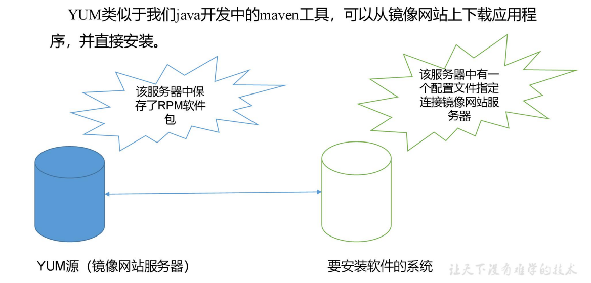


### 18.6 YUM 的常用命令

语法：

```bash
yum [选项] [参数]
```

选项说明：

| 选项 | 功能                  |
| ---- | --------------------- |
| -y   | 对所有提问都回答“yes” |

参数说明：

| 参数         | 功能                          |
| ------------ | ----------------------------- |
| install      | 安装 rpm 软件包               |
| update       | 更新 rpm 软件                 |
| check-update | 检查是否有可用的更新 rpm 软件 |
| remove       | 删除指定的 rpm 软件包         |
| list         | 显示软件包信息                |
| clean        | 清理 yum 过期的缓存           |
| deplist      | 显示 yum 软件包的所有依赖关系 |

示例：

```bash
[root@hadoop10 ~]# yum list | grep firefox
firefox.x86_64                    68.10.0-1.el7.centos       @anaconda
firefox.i686                      102.15.0-1.el7.centos      updates  
firefox.x86_64                    102.15.0-1.el7.centos      updates  
[root@hadoop10 ~]# yum remove firefox -y
[root@hadoop10 ~]# yum list | grep firefox
firefox.i686                      102.15.0-1.el7.centos      updates  
firefox.x86_64                    02.15.0-1.el7.centos      updates  
[root@hadoop10 ~]# yum -y install firefox
[root@hadoop10 ~]# yum list | grep firefox
firefox.x86_64                    102.15.0-1.el7.centos      @updates 
firefox.i686                      102.15.0-1.el7.centos      updates 
```


### 18.6 修改 YUM 源

默认的系统 YUM 源，需要连接国外 apache 网站，网速比较慢，可以修改关联的网络 YUM 源为国内镜像的网站，比如网易 163,aliyun 等

1）安装 wget, wget 用来从指定的 URL 下载文件

```bash
[root@hadoop101 ~] yum install wget
```

2）在 `/etc/yum.repos.d/` 目录下，备份默认的 repos 文件,

```bash
[root@hadoop101 yum.repos.d] pwd
/etc/yum.repos.d
[root@hadoop101 yum.repos.d] cp CentOS-Base.repo CentOS-Base.repo.backup
```

3）下载网易 163 或者是 aliyun 的 repos 文件,任选其一，如图 8-2

```bash
[root@hadoop101 yum.repos.d] wget
http://mirrors.aliyun.com/repo/Centos-7.repo //阿里云
[root@hadoop101 yum.repos.d] wget
http://mirrors.163.com/.help/CentOS7-Base-163.repo //网易 163
```

4）使用下载好的 repos 文件替换默认的 repos 文件 

例如:用 CentOS7-Base-163.repo 替换 CentOS-Base.repo

```bash
[root@hadoop101 yum.repos.d]# mv CentOS7-Base-163.repo CentOS-Base.repo
```

5）清理旧缓存数据，缓存新数据

```bash
[root@hadoop101 yum.repos.d]#yum clean all
[root@hadoop101 yum.repos.d]#yum makecach
```

yum makecache 就是把服务器的包信息下载到本地电脑缓存起来

6）测试

```bash
[root@hadoop101 yum.repos.d]# yum list | grep firefox
[root@hadoop101 ~]#yum -y install firefox
```


