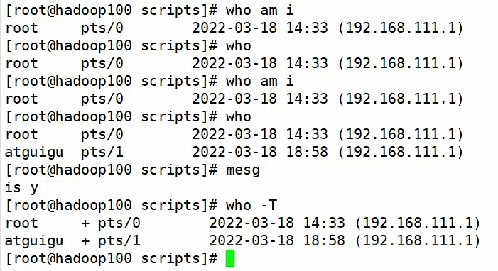

# Shell编程

## 1、Shell 概述

Shell 是一个==命令行解释器==，它接受应用程序/用户命令，然后调用操作系统内核。

Shell 相当于包在Linux内核外层的一层壳。

Shell 还是一个功能相当强大的编程语言，易编写、易调试、灵活性强。


我们不止可以在命令行一句一句的执行命令，也可以把很多命令串起来，直接写入到一个文件中，交给操作系统一行一行执行。

shell文件中的命令实际也是一行一行的解释执行的，我们就可以把它叫做==脚本==。

- Linux 提供的Shell 解析器有

    ```bash
    [atguigu@hadoop101 ~]$ cat /etc/shells
    /bin/sh
    /bin/bash
    /usr/bin/sh
    /usr/bin/bash
    /bin/tcsh
    /bin/csh
    ```

- bash 和 sh 的关系

    ```bash
    [atguigu@hadoop101 bin]$ ll | grep bash
    -rwxr-xr-x. 1 root root 941880 5月 11 2016 bash
    lrwxrwxrwx. 1 root root      4 5月 27 2017 sh-> bash
    ```

    实际上，sh 是一个指向 bash 的链接。

- Centos 默认的解析器是bash（Ubuntu 是 dash）

    ```bash
    [atguigu@hadoop101 bin]$ echo $SHELL
    /bin/bash
    ```

    

## 2、Shell 脚本编程入门

- 脚本格式 

    ==脚本以 `#!/bin/bash` 开头（指定解析器）==

- 第一个Shell脚本：`helloworld.sh`

    ```bash
    [atguigu@hadoop101 shells]$ touch helloworld.sh
    [atguigu@hadoop101 shells]$ vim helloworld.sh
    
    在helloworld.sh中输入如下内容
    #!/bin/bash
    echo "helloworld"
    ```

- 脚本的执行方式

    1. 采用 `bash` 或 `sh` + 脚本的相对路径或绝对路径（不用赋予脚本 `+x` 权限）

    ```bash
    [atguigu@hadoop101 shells]$ sh ./helloworld.sh
    Helloworld
    [atguigu@hadoop101 shells]$ bash ./helloworld.sh
    Helloworld
    ```

    2. 采用输入脚本的绝对路径或相对路径执行脚本（==必须具有可执行权限 `+x`==）

    ```bash
    [atguigu@hadoop101 shells]$ chmod +x helloworld.sh
    [atguigu@hadoop101 shells]$ ./helloworld.sh
    Helloworld
    ```

    > 注意：第一种执行方法，本质是bash解析器帮你执行脚本，所以脚本本身不需要执行权限。第二种执行方法，本质是脚本需要自己执行，所以需要执行权限。

    3. 在脚本的路径前加上 `“.”` 或者 `source`

    ```bash
    [atguigu@hadoop101 shells]$ . helloworld.sh
    [atguigu@hadoop101 shells]$ source helloworld.sh
    ```

    总结：

    - 前两种方式都是在当前 shell 中打开一个子shell来执行脚本内容，当脚本内容结束，则子shell 关闭，回到父shell中。
    - 第三种，可以使脚本内容在当前 shell 里执行，而无需打开子shell！这也是为什么我们每次要修改完 /etc/profile 文件以后，需要 source 一下的原因
    - ==开子 shell 与不开子 shell 的区别就在于，环境变量的继承关系==，如在子 shell 中设置的当前变量，父shell是不可见的。


## 3、变量

### 3.1 系统预定义变量

- 常用系统变量：`$HOME、$PWD、$SHELL、$USER` 等
- 查看某个变量值：`echo $HOME` 
- 查看所有系统变量：`env`
- 查询所有变量：`set`

示例：

```bash
[atguigu@hadoop101 shells]$ echo $HOME
/home/atguigu
[atguigu@hadoop101 shells]$ set
BASH=/bin/bash
BASH_ALIASES=()
BASH_ARGC=()
BASH_ARGV=()
```


### 3.2 自定义变量

基本语法：

- 定义变量：`变量名=变量值` ，==注意，=号前后不能有空格==

- 撤销变量：`unset 变量名`

- 声明静态变量：`readonly 变量`，==注意：不能unset==

- 查看变量的值：`echo $变量名`
- 将变量提升为全局环境变量：`export 变量名`

变量定义规则：

1. 变量名称可以==由字母、数字和下划线==组成，但是**不能以数字开头，环境变量名建议大写**。

2. 等号两侧不能有空格
3. 在bash中，**变量默认类型都是字符串类型**，无法直接进行数值运算

4. 变量的值如果有空格，需要使用双引号或单引号括起来。


示例：

```bash
# 定义变量A
[atguigu@hadoop101 shells]$ A=5
[atguigu@hadoop101 shells]$ echo $A
5
# 撤销变量A
[atguigu@hadoop101 shells]$ unset A
[atguigu@hadoop101 shells]$ echo $A
# 声明静态的变量B=2，不能unset
[atguigu@hadoop101 shells]$ readonly B=2
[atguigu@hadoop101 shells]$ echo $B
2
[atguigu@hadoop101 shells]$ B=9
-bash: B: readonly variable
# 在bash中，变量默认类型都是字符串类型，无法直接进行数值运算
[atguigu@hadoop102 ~]$ C=1+2
[atguigu@hadoop102 ~]$ echo $C
1+2
# 可把变量提升为全局环境变量，可供其他Shell程序使用
[atguigu@hadoop101 shells]$ vim helloworld.sh
 #!/bin/bash
 echo "helloworld"
 echo $B
[atguigu@hadoop101shells]$ ./helloworld.sh
Helloworld
# 发现并没有打印输出变量B的值。
[atguigu@hadoop101shells]$ export B
[atguigu@hadoop101shells]$ ./helloworld.sh
helloworld
2
```


### 3.3 特殊变量

#### $n

基本语法：

`$n`

功能描述：n为数字，`$0` 代表该脚本名称，`$1-$9` 代表第一到第九个参数，十以上的参数需要用大括号包含，如 `${10}`


示例：

```bash
[atguigu@hadoop101shells]$touch parameter.sh
[atguigu@hadoop101shells]$vim parameter.sh
#!/bin/bash
echo'==========$n=========='
echo$0
echo$1
echo$2

[atguigu@hadoop101shells]$chmod 777 parameter.sh
[atguigu@hadoop101shells]$./parameter.sh cls xz
==========$n==========
./parameter.sh
cls
xz
```


#### $#

基本语法：

`$#`

功能描述：获取所有输入参数个数，常用于循环，判断参数的个数是否正确以及加强脚本的健壮性。


示例：

```bash
[atguigu@hadoop101shells]$vim parameter.sh
#!/bin/bash
# echo后面的字符串用单引号，表示原样输出
echo '==========$n=========='
echo $0
echo $1
echo $2
echo '==========$#=========='
echo $#

[atguigu@hadoop101shells]$chmod 777 parameter.sh
[atguigu@hadoop101shells]$./parameter.sh cls xz
==========$n==========
./parameter.sh
cls
xz
==========$#==========
2
```


####  \$*、\$@

基本语法：

`$*` （功能描述：这个变量代表命令行中所有的参数，==`$*` 把所有的参数看成一个整体==） 

`$@` （功能描述：这个变量也代表命令行中所有的参数，不过 ==`$@` 把每个参数区分对待==）


示例：

```bash
[atguigu@hadoop101 shells]$ vim parameter.sh
#!/bin/bash
echo '==========$n=========='
echo $0
echo $1
echo $2
echo '==========$#=========='
echo $#
echo '==========$*=========='
echo $*
echo '==========$@=========='
echo $@
[atguigu@hadoop101 shells]$ ./parameter.sh a b c d e f g
==========$n==========
./parameter.sh
a
b
==========$#==========
7
==========$*==========
a b c d e f g
==========$@==========
a b c d e f g
```


####  \$？

基本语法：

`$？` 

功能描述：最后一次执行的命令的返回状态。如果这个变量的值为 0，证明上一 个命令正确执行；如果这个变量的值为非0（具体是哪个数，由命令自己来决定），则证明上一个命令执行不正确了。


## 4、运算符

基本语法：

`$((运算式))` 或 `$[运算式]`

`expr 1 + 2`  （需要使用空格隔开）

`expr 1 \* 2`


示例：

```bash
[atguigu@hadoop101 shells]# S=$[(2+3)*4]
[atguigu@hadoop101 shells]# echo $S
20
# 命令替换：将命令替换为它的值
[atguigu@hadoop101 shells]# a=$(expr 5 \* 2)
[atguigu@hadoop101 shells]# a=`expr 5 \* 2`
[atguigu@hadoop101 shells]# echo $a
10
```

命令替换：将命令替换为它的值

`$(命令/函数调用)`


## 5、条件判断

基本语法：

`test condition`

`[ condition ]`（==注意 condition 前后要有空格==）

**注意：条件非空即为 true，[ atguigu ]返回true，[ ] 返回false。**


示例：（为真返回 0，为假返回 1）

```bash
[atguigu@hadoop101 shells]# a=Hello
[atguigu@hadoop101 shells]# test $a = Hello
[atguigu@hadoop101 shells]# echo $?
0
[atguigu@hadoop101 shells]# [ $a = hello ] 
[atguigu@hadoop101 shells]# echo $?
1
[atguigu@hadoop101 shells]# [ abdce ] 
0
[atguigu@hadoop101 shells]# [  ] 
1
[atguigu@hadoop101 shells]# [ $a != hello ] 
```


常用判断条件：

- 两个整数之间比较

    `-eq` 等于（equal）

    `-lt` 小于（less than）

    `-gt` 大于（greater than）

    `-ne` 不等于（notequal）

    `-le` 小于等于（lessequal）

    `-ge` 大于等于（greater equal） 

    注：如果是字符串之间的比较 ，用等号 “=” 判断相等；用 “!=” 判断不等。 

- 按照文件权限进行判断

    `-r` 有读的权限（read）

    `-w` 有写的权限（write）

    `-x` 有执行的权限（execute） 

- 按照文件类型进行判断

    `-e` 文件存在（existence）

    `-f` 文件存在并且是一个常规的文件（file）

    `-d` 文件存在并且是一个目录（directory）


示例：

```bash
[atguigu@hadoop101 shells]# [ 2 -lt 8 ]
[atguigu@hadoop101 shells]# echo $?
0
[atguigu@hadoop101 shells]# [ 2 -gt 8 ]
[atguigu@hadoop101 shells]# [ -r hello.sh ]
[atguigu@hadoop101 shells]# [ -x hello.sh ]
[atguigu@hadoop101 shells]# [ -e /home/atguigu/hello.sh ]
[atguigu@hadoop101 shells]# [ -d /home/atguigu ]
```


多条件判断：`&&` 和 `||`

`&&` 表示前一条命令执行成功时，才执行后一条命令，`||` 表示上一条命令执行失败后，才执行下一条命令

```bash
[atguigu@hadoop101 ~]$ [ atguigu ] && echo OK || echo notOK
OK
[atguigu@hadoop101 shells]$ [ ] && echo OK || echo notOK
notOK
```


## 6、流程控制

### 6.1 if 判断

基本语法：

单分支：

```bash
if [ 条件判断式 ];then
	程序
fi
```

或者

```bash
if [ 条件判断式 ]
then
	程序
fi
```

多分支：

```bash
if [ 条件判断式 ]
then
	程序
elif [ 条件判断式 ]
then
	程序
else
	程序
fi
```

注意事项： 

- [ 条件判断式 ]，中括号和条件判断式之间必须有空格 
- if 后要有空格

多个条件：使用 $$ 连接

```bash
if [ $a -gt 18 ] && [ $a -lt 35 ]; then
	echo OK;
fi
```

使用参数：`-a` 表示 and，`-r` 表示 or

```bash
if [ $a -gt 18 -a $a -lt 35 ]; then
	echo OK;
fi
```

实际项目中的优化：后边跟一个 x ，防止没有输入参数时报错

```bash
#!/bin/bash

if [ "$1"x = "atguigu"x ]
then
	echo "welcome, atguigu"
fi
```

示例：

```bash
if [ $2 -lt 18 ]
then 
	echo "未成年人"
elif [ $2 -lt 35 ]
	echo "青年人"
else 
	echo "成年人"
fi
```


### 6.2 case 语句

基本语法：

```bash
case $变量名 in
"值1")
	如果变量的值等于值1，则执行程序1
;;
"值2")
	如果变量的值等于值2，则执行程序2
;;
	…省略其他分支…
*)
	如果变量的值都不是以上的值，则执行此程序
;;
esac
```

注意事项： 

（1）case 行尾必须为单词 “in” ，每一个模式匹配必须以右括号“ ）”结束。 

（2）双分号 “;;” 表示命令序列结束，相当于 java 中的 break。 

（3）最后的 “*）” 表示默认模式，相当于 java 中的 default。

示例：

```bash
#!/bin/bash

case $1 in
1)
	echo "one"
;;
2)
	echo "two"
;;
*)
	echo "number else"
;;
esac
```


### 6.3 for循环

基本语法1：

```bash
for (( 初始值;循环控制条件;变量变化 ))
do
	程序
done
```

示例：

```bash
#!/bin/bash

for (( i=1; i <= $1; i++ ))
do 
	sum=$[ $sum + $i ];
done
echo $sum
```

基本语法2：

```bash
for 变量 in 值1 值2 值3…
do
	程序
done
```

示例：

```bash
#!/bin/bash

for i in cls mly wls
do 
	echo $i
done
echo $sum
```

==在 bash 中，`{}` 可以表示一个生成序列，比如：`{1..100}` ，表示从 1 到 100 的序列==

```bash
for i in {1..100}; do sum=$[$sum+$i]; done; echo $sum
5050
```

比较 `$*` 和 `$@` 区别

`$*` 和 `$@` 都表示传递给函数或脚本的所有参数，不被双引号 “” 包含时，都以 `$1 $2 … $n ` 的形式输出所有参数。

```bash
#!/bin/bash
echo '=============$*============='
for i in $*
do
	echo"banzhanglove$i"
done
echo '=============$@============='
for j in $@
do
	echo"banzhanglove$j"
done

[atguigu@hadoop101shells]$ chmod 777 for3.sh
[atguigu@hadoop101shells]$ ./for3.sh cls mly wls
=============$*=============
banzhanglovecls
banzhanglovemly
banzhanglovewls
=============$@=============
banzhanglovecls
banzhanglovemly
banzhanglovewls
```

当它们被双引号 “” 包含时，`$*` 会将所有的参数作为一个整体，以 `“$1 $2 … $n”` 的形式输出所有参数；​`$@` 会将各个参数分开，以 `“$1” “$2” … “$n”` 的形式输出所有参数。

```bash
[atguigu@hadoop101shells]$ vim for4.sh

#!/bin/bash
echo '=============$*============='
for i in "$*"
#$*中的所有参数看成是一个整体，所以这个for循环只会循环一次
do
	echo "banzhanglove$i"
done
echo '=============$@============='
for j in "$@"
#$@中的每个参数都看成是独立的，所以“$@”中有几个参数，就会循环几次
do
	echo "banzhanglove$j"
done

[atguigu@hadoop101shells]$ chmod 777 for4.sh
[atguigu@hadoop101shells]$ ./for4.sh cls mly wls
=============$*=============
banzhang love cls mly wls
=============$@=============
banzhang love cls
banzhang love mly
banzhang love wls
```


### 6.4 while 循环

基本语法：

```bash
while [ 条件判断式 ]
do
	程序
done
```

示例：

```bash
#!/bin/bash

sum=0
i=1
while [ $i -le 100 ]
do
	sum=$[$sum+$i]
	i=$[$i+1]
done
echo $sum
```

使用更容易理解的一种方法：

```bash
#!/bin/bash

sum=0
i=1
while [ $i -le 100 ]
do
	let sum+=a
	let a++
done
echo $sum
```


## 7、 read 读取控制台输入

基本语法：

```bash
read (选项) (参数) 
```

选项：

- `-p`：指定读取值时的提示符；
- `-t`：指定读取值时等待的时间（秒）如果 -t 不加表示一直等待 

参数 

- 变量：指定读取值的变量名


示例：10秒内，读取控制台输入的名称

```bash
#!/bin/bash

read -t 10 -p "请输入您的姓名： " name
echo "welcome, $name"
```


## 8、函数

### 8.1 系统函数

#### basename

基本语法：

```bash
basename [string / pathname] [suffix]
```

功能描述：basename 命令会删掉所有的前缀包括最后一个（‘/’）字符，然后将字符串显示出来。

basename 可以理解为取路径里的文件名称

选项： 

- suffix 为后缀，如果 suffix 被指定了，basename 会将 pathname 或 string 中的 suffix 去掉。


示例：

```bash
[atguigu@hadoop101 shells]$ basename /home/atguigu/banzhang.txt
banzhang.txt
[atguigu@hadoop101 shells]$ basename /home/atguigu/banzhang.txt .txt
banzhang
```

定义日志文件，使用脚本自动生成。

```bash
#!/bin/bash

filename="$1"_log_$(date +%s)
echo $filename
```


#### dirname

基本语法

```bash
dirname 文件绝对路径
```

功能描述：从给定的包含绝对路径的文件名中去除文件名 （非目录的部分），然后返回剩下的路径（目录的部分）

dirname 可以理解为取文件路径的绝对路径名称


示例：

```bash
[atguigu@hadoop101 ~]$ dirname /home/atguigu/banzhang.txt
/home/atguigu
```


使用技巧：

```bash
#!/bin/bash
echo '==============$n=============='
echo script name: $(basename $0 .sh)
echo script path: $(cd $(dirname $0); pwd)
echo 1st parameter: $1
echo 2nd parameter: $2
```

可以将命令替换当做系统函数的调用。


### 8.2 自定义函数

基本语法：

```bash
[ function ] funname[()]
{
	Action;
	[return int;]
}
```

经验技巧：

（1）必须在调用函数地方之前，先声明函数，shell 脚本是逐行运行。不会像其它语言一样先编译。 

（2）函数返回值，只能通过 `$?` 系统变量获得，可以显示加：return返回，如果不加，将以最后一条命令运行结果，作为返回值。return后跟数值 `n(0-255)`

（3）==函数的参数列表可以不写，需要使用参数可以通过 `$1, $2, $3` 的方式获取==


示例：

```bash
[atguigu@hadoop101 shells]$ touch fun.sh
[atguigu@hadoop101 shells]$ vim fun.sh

#!/bin/bash
function add()
{
	s=$[$1 + $2]
	echo "$s"
}
read -p "Please input the number1: " n1;
read -p "Please input the number2: " n2;
add $n1 $n2;

[atguigu@hadoop101 shells]$ chmod +X fun.sh
[atguigu@hadoop101 shells]$ ./fun.sh
Please input the number1: 2
Please input the number2: 5
7
```

通过返回值：

```bash
#!/bin/bash
function add()
{
	s=$[$1 + $2]
	return $s
}
read -p "Please input the number1: " n1;
read -p "Please input the number2: " n2;
add $n1 $n2
echo "$?"
```

==注意：return 只能返回 0~255 的整数值==，因此按照字符串返回 echo 会报错；如果两个数相加的结果大于 255 ，那么打印出的值会出错（溢出）

解决方法：

==使用命令替换 `$()` 将函数的调用返回的值赋给另一个变量==

```bash
#!/bin/bash
function add()
{
	s=$[$1 + $2]
	echo $s
}
read -p "Please input the number1: " n1;
read -p "Please input the number2: " n2;
sum=$(add $n1 $n2)
echo $sum
```


## 9、自动归档文件案例

实际生产应用中，往往需要对重要数据进行归档备份。

需求：实现一个每天对指定目录归档备份的脚本，输入一个目录名称（末尾不带/）， 将目录下所有文件按天归档保存，并将归档日期附加在归档文件名上，放在 `/root/archive` 下。

这里用到了归档命令：`tar `

后面可以加上 `-c` 选项表示归档，加上 `-z` 选项表示同时进行压缩，得到的文件后缀名 为 `.tar.gz` 。

脚本实现如下：

```bash
#!/bin/bash
 
# 首先判断输入参数个数是否为1
if [ $# -ne 1 ]
then
	echo "参数个数错误！应该输入一个参数，作为归档目录名"
	exit
fi

# 从参数中获取目录名称
if [ -d $1 ]
then
	echo
else
	echo
	echo "目录不存在！"
	echo
	exit
fi

DIR_NAME=$(basename $1)
DIR_PATH=$(cd $(dirname $1); pwd)

# 获取当前日期
DATE=$(date +%y%m%d)

# 定义生成的归档文件名称
FILE=archive_${DIR_NAME}_$DATE.tar.gz
DEST=/root/archive/$FILE

# 始归档目录文件
echo "开始归档..."
echo

tar -czf $DEST $DIR_PATH/$DIR_NAME

if [ $? -eq 0]
then
	echo
	echo "归档成功！"
	echo "归档文件为：$DEST"
	echo
else
	echo "归档出现问题！"
	echo
fi

exit
```


## 10、正则表达式入门

正则表达式使用单个字符串来描述、匹配一系列符合某个语法规则的字符串。在很多文本编辑器里，正则表达式通常被用来检索、替换那些符合某个模式的文本。

在Linux中，`grep， sed，awk` 等文本处理工具都支持通过正则表达式进行模式匹配。

### 10.1 常规匹配

一串不包含特殊字符的正则表达式匹配它自己，例如：

```bash
[atguigu@hadoop101 shells]$ cat /etc/passwd | grep atguigu
```

就会匹配所有包含atguigu的行。

### 10.2 常用特殊字符

1. 特殊字符：`^` ，匹配一行的开头

2. 特殊字符：`$` ，匹配一行的结束

```bash
[atguigu@hadoop101 shells]$ cat /etc/passwd | grep ^a
[atguigu@hadoop101 shells]$ cat /etc/passwd | grep t$
```

思考：`^$` 匹配什么？

==所有的空行==

3. 特殊字符：`.` ，匹配一个任意的字符

4. 特殊字符：`*` ，表示匹配上一个字符0次或多次

```bash
[atguigu@hadoop101 shells]$ cat /etc/passwd | grep ro*t
```

思考：`.*` 匹配什么？

==匹配任意多个字符==

5. 字符区间（中括号）：`[]`

    `[ ]` 表示匹配某个范围内的一个字符，例如 

    `[6,8]` ------ 匹配 6 或者 8 

    `[0-9]` ------ 匹配一个 0-9 的数字 

    `[0-9]*` ------ 匹配任意长度的数字字符串

    `[a-z]` ------ 匹配一个 a-z 之间的字符

    `[a-z]*` ------ 匹配任意长度的字母字符串 

    `[a-c, e-f]` ------ 匹配 a-c 或者 e-f 之间的任意字符

    ```bash
    [atguigu@hadoop101 shells]$ cat /etc/passwd | grep r[a,b,c]*t
    ```

6. 特殊字符：`\`

     `\ ` 表示转义，并不会单独使用。由于所有特殊字符都有其特定匹配模式，当我们想匹配某一特殊字符本身时（例如，我想找出所有包含 '$' 的行），就会碰到困难。此时我们就要将转义字符和特殊字符连用，来表示特殊字符本身，例如

    ```bash
    [atguigu@hadoop101 shells]$ cat /etc/passwd | grep ‘a\$b’
    ```

    

高级用法：`-E` 支持扩展的正则表达式

```bash
echo "15912345678" | grep -E ^1[13578][0-9]{9}$
```


## 11、文本处理工具

### 11.1 cut

cut 的工作就是“剪”，具体的说就是在文件中负责剪切数据用的。cut 命令从文件的每 一行剪切字节、字符和字段并将这些字节、字符和字段输出。

基本用法：

```bash
cut [选项参数] filename
```

说明：默认分隔符是制表符

参数说明：

| 选项参数 | 功能                                              |
| :------: | :------------------------------------------------ |
|    -f    | 列号，提取第几列                                  |
|    -d    | 分隔符，按照指定分隔符分割列，默认是制表符 "\t"   |
|    -c    | 按照字符进行分割，后加加 n 表示取第几列 比如 -c 1 |

示例：

```bash
[atguigu@hadoop101 shells]$ touch cut.txt
[atguigu@hadoop101 shells]$ vim cut.txt
dong shen
guan zhen
wo wo
lai lai
le le

[atguigu@hadoop101 shells]$ cut -d " " -f 1 cut.txt
dong
guan
wo
lai
le
[atguigu@hadoop101 shells]$ cat cut.txt | grep guan | cut -d " " -f 1
guan

# 切割ifconfig 后打印的IP地址
[atguigu@hadoop101 shells]$ ifconfig ens33 | grep netmask | cut -d " " -f 10
192.168.111.101
```


### 11.2 awk

一个强大的文本分析工具，把文件逐行的读入，==以空格为默认分隔符将每行切片==，切开 的部分再进行分析处理。

基本用法：

```bash
awk [选项参数] '/pattern1/{action1} /pattern2/{action2}...' filename
```

- `pattern`：表示 awk 在数据中查找的内容，就是匹配模式 

- `action`：在找到匹配内容时所执行的一系列命令

参数说明：

| 选项参数 | 功能                 |
| :------: | -------------------- |
|    -F    | 指定输入文件分隔符   |
|    -v    | 赋值一个用户定义变量 |

实例：

```bash
[atguigu@hadoop101 shells]$ sudo cp /etc/passwd ./
[atguigu@hadoop101 shells]$ awk -F : '/^root/{print $7}' passwd
/bin/bash
[atguigu@hadoop101 shells]$ awk-F : '/^root/{print $1","$7}' passwd
root,/bin/bash
```

注意：只有匹配了pattern的行才会执行action。

```bash
[atguigu@hadoop101 shells]$ awk -F : 'BEGIN{print "user, shell"} {print $1","$7}
END{print "dahaige,/bin/zuishuai"}' passwd
user, shell
root,/bin/bash
bin,/sbin/nologin
。。。
atguigu,/bin/bash
dahaige,/bin/zuishuai
```

==注意：`BEGIN` 在所有数据读取行之前执行；`END` 在所有数据执行之后执行。==

将 `passwd` 文件中的用户 id 增加数值 1 并输出

```bash
[atguigu@hadoop101 shells]$ awk -v i=1-F : '{print $3+i}' passwd
 1
 2
 3
 4
```

awk的内置变量

|   变量   | 说明                                   |
| :------: | -------------------------------------- |
| FILENAME | 文件名                                 |
|    NR    | 已读的记录数（行号）                   |
|    NF    | 浏览记录的域的个数（切割后，列的个数） |

示例：

```bash
[atguigu@hadoop101 shells]$ awk -F : '{print "filename:" FILENAME ",linenum:"
 NR ",col:"NF}' passwd
 filename:passwd,linenum:1,col:7
 filename:passwd,linenum:2,col:7
 filename:passwd,linenum:3,col:7
 ...
```

切割IP

```bash
[atguigu@hadoop101 shells]$ ifconfig ens33 | awk '/netmask/ {print $2}'
192.168.6.101
```


## 12、mesg 和 write 发送消息

我们可以利用 Linux 自带的 mesg 和 write 工具，向其它用户发送消息。

 需求：实现一个向某个用户快速发送消息的脚本，输入用户名作为第一个参数，后面直接跟要发送的消息。脚本需要检测用户是否登录在系统中、是否打开消息功能，以及当前发送消息是否为空。 脚本实现如下：

```bash
#!/bin/bash

login_user=$(who | grep -i -m 1 $1 | awk '{print $1}')
if [ -z $login_user ]
then
	echo "$1不在线！"
	echo "脚本退出.."
	exit
fi

is_allowed=$(who -T | grep -i -m 1 $1 | awk '{print $2}')

if [ $is_allowed != "+" ]
then
	echo "$1没有开启消息功能"
	echo "脚本退出.."
	exit
fi

if [ -z $2]
then
	echo "没有消息发出"
	echo "脚本退出.."
	exit
fi

whole_msg=$(echo $* | cut -d "" -f 2- )
user_terminal=$(who | grep -i -m 1 $1 | awk '{print $2}')
echo $whole_msg | write $login_user $user_terminal

if [ $? != 0 ]
then
	echo "发送失败！"
else
	echo "发送成功！"
fi

exit
```



使用 `mesg ` 查看当前用户消息功能是否开启

使用 `who -T ` 查看所有用户消息功能开启情况

开启消息功能： `mesg y`

关闭消息功能： `mesg n`

发送消息： `write 用户名 控制台 `

