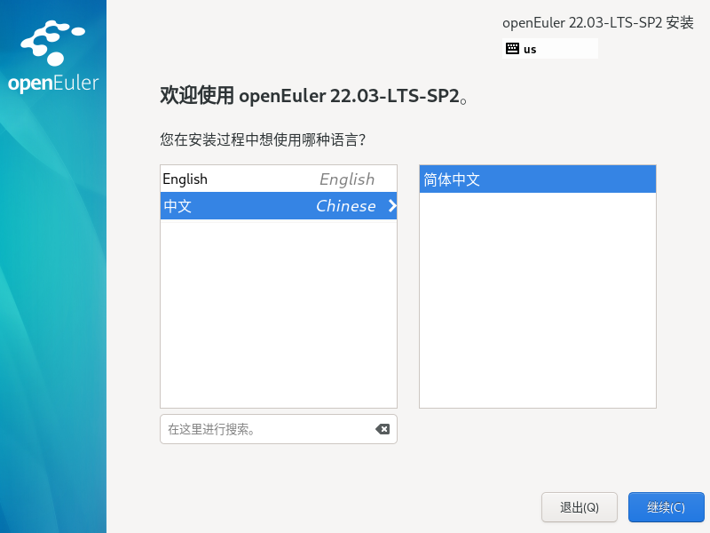
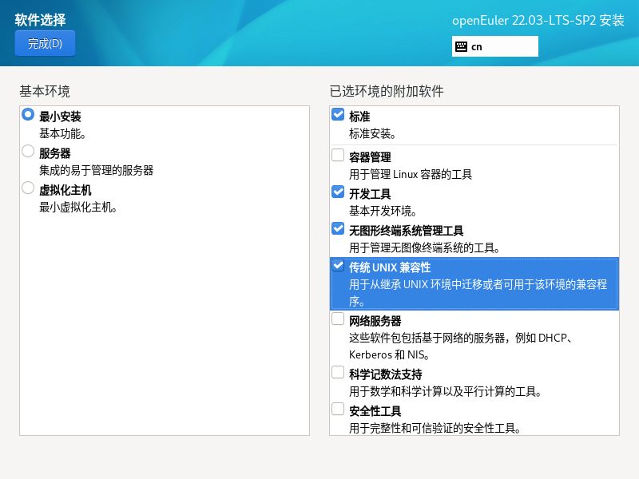
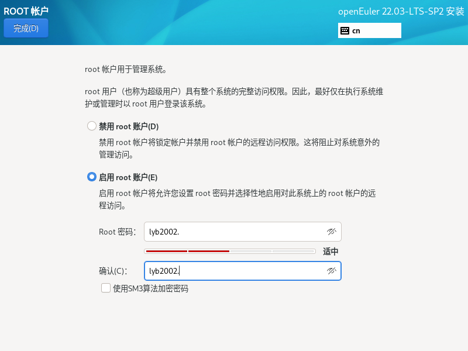
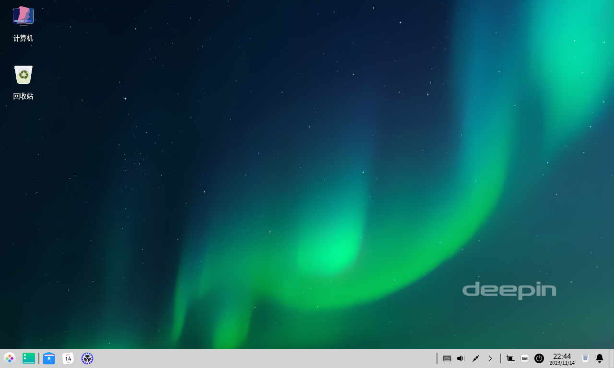

# openEuler 操作系统

## 1、安装

1、环境准备

openEuler 22.03 LTS 

https://www.openeuler.org/zh/download/?version=openEuler%2022.03%20LTS%20SP2

VMware Workstation Pro


2、在Vmware中安装








3、安装深度桌面

安装深度桌面 

```bash
sudo dnf install dde
sudo systemctl set-default graphical.target
#设置以图形界面的方式启动
sudo reboot
```

或安装gnome桌面 

```bash
sudo dnf makecache  

sudo dnf groupinstall -y GNOME  

sudo systemctl set-default graphical.target 
```

或安装优麒麟桌面 

```bash
sudo dnf makecache  

sudo dnf install ukui  

sudo systemctl set-default graphical.target
```





