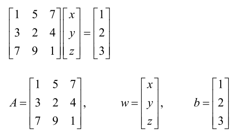

# 矩阵

## 1. 矩阵的基本知识

对于一个矩阵A

1. 矩阵的**转置**： `A.'` ——转置        `A'` ——共轭转置
2. 矩阵的**定义**：一个大的矩阵可以由较小的矩阵组装而成

```matlab
>> A=[1 2 9;4 7 5;3 1 6]
>> B=[A;11 12 13]
B=
	1	2	9
	4	7	5
	3	1	6
	11	12	13

```

3. 获得矩阵的**大小**：可以用size()命令

```matlab
>>size(A)      %return the size of A 
>>size(A,1)    %return the number of rows in A （返回行数）
>>size(A,2)    %return the number of columns in A （返回列数）

[r,c] = size(A)
或
r = size(A,1)
c = size(A,2)
```

4. 矩阵的**索引**：

    1. 通过括号，直接索引指定的行和列。如`A(2,1)`，返回的值为4；可以直接通过索引修改指定位置的元素值，如`A(2,1)=9`。
    2. 通过冒号，指定索引的范围。

    ```matlab
    % 1. A(),相当于 A
    % 2. A(:),以列向量的形式输出A的所有值
    % 3. A(1,:),指定A的第一行
    % 4. A(:,3),指定A的第三列
    % 5. A(1:3,:),指定A的前三行
    % 6. A([1,3],:),只取第二行和第三行
    % 7. A(2:end,:),取第二行到最后一行
    %% 可以对A的某一行（列）直接赋值一个行（列）向量，从而直接修改一行（列）的值
    >>A=[1  2  3;  4  5  6;  7  9  2];   %specify matrix A 
    >>B=[1; 5; 9];   					 %specify column vector B 
    >>C=[2  1  0];   					 %specify the row vector C 
    >>A(:,1) = B;    					 %replace the first column of A by B 
    >>A(2,:) = C;   					 %replace the second row of A by C 
    
    % 可以通过对矩阵的某一行（列）赋值空值，来删除这一行（列）
    >>A(:,2)=[ ]; 
    ```

5. 特殊矩阵（Special matrices）

    1. 对角矩阵（diagonal matrix）

        对角线矩阵是只有对角线项为非零的矩阵。

    2. 单位矩阵（identity matrix）

        所以非零项都为1的对角矩阵

    3. 上三角矩阵（upper triangular matrix）

        对角线以下的项都为零的矩阵

    4. 下三角矩阵（lower triangular matrix）

        对角线以上的项都为零的矩阵


## 2.MATLAB中快速生成一些特殊矩阵

通过以下命令可以快速生成一些特殊矩阵

```matlab
% 1. eye(n)
% 生成一个n乘n的单位矩阵
% 2. zeros(n,m)
% 生成一个用0填充的n乘m的矩阵
% 3. ones(n,m) 
% 生成一个用1填充的n乘m的矩阵
% 4. rand(n)
% 将生成一个n乘n矩阵，其元素是均匀分布在0和1之间的伪随机数
% 5. rand（n，m）
% 将创建一个n乘以m矩阵，其中随机生成的条目均匀分布在1和0之间
% 6. magic（n）
% 生成一个n乘n平方矩阵，其条目构成一个幻方
% 例如，沿着每行、每列或主对角线的元素的总和是相同的值。
```

7. 空矩阵（The empty matrix）

    在MATLAB中用[]表示空矩阵，这是一个尺寸为0的矩阵。

    空矩阵有一些特殊用途。例如，它可以用来减小现有矩阵的大小。

    ```matlab
    % 下列操作删除了矩阵A的第一行和第三行
    >> B=[]
    >> A([1 3],:)=[]
    ```

    

## 3. 矩阵运算（Matrix operations）

1. 矩阵的加减法

    当矩阵A和矩阵B**具有相同的行和列维度**时，才能进行加法，结果为矩阵对应位置的和。

    矩阵B的负数用-B表示，对应B中所有的元素取负数。

    即矩阵的减法可以表示为 `A-B=A+(-B)`

2. 矩阵和标量的运算

    标量可以和任意维度的矩阵运算，对应于矩阵的每个元素都与这个标量进行运算

3. 矩阵的乘法（点乘和乘法）

    1. A.*B

        点乘运算要求A和B具有相同的行和列

    2. A*B

        矩阵的乘法要求，前一个矩阵的列要等于后一个矩阵的行

    注意：矩阵的乘法一般不能交换顺序，如：`A*B≠B*A`

4. 向量内积（Inner product）
    $$
    X=[x_1,y_1],Y=[x_2,y_2]\\
    X·Y=x_1*x_2+y_1*y_2=|X||Y|cos(\theta)
    $$

    ```matlab
    % 求两个向量的角度θ的方法
    >>A=[3  4];   %specify vector A 
    >>B=[6  7];   %specify vector B 
    >>C=A*B’   %evaluate the inner product 
    >>%compute the value of the angle theta 
    >>theta=acos(C/(sqrt(A*A’)*sqrt(B*B’))) 
    ```

    

## 4. 矩阵的性质

### 4.1 基础性质

1. A+B=B+A 
2. A+(B+C)=(A+B)+C 
3. A(B+C)=AB+AC 
4. AI=IA=A   % I is the identity matrix 
5. 0A=0   %0 is the null matrix 
6. A0=0 
7. A+0=A 


### 4.2 其他性质

1. $ inv(A*B)=inv(A)*inv(B)$
2. $ (A*B)'=B'*A' $ 
3. $ (A+B)'=A'+B' $


## 5. 矩阵的行列式（Determinant of a matrix）

对于任意一个方阵A都有一个与之对应的标量，称之为方阵A的行列式。

**行列式为非零的矩阵称为非奇异或可逆矩阵，否则称为奇异矩阵。**

计算矩阵的行列式可以使用`det()`函数

```matlab
>>A=[1  2  3;  4  5  6;  7  1  2];  %specify matrix A 
>>det(A)   						    %compute the determinant 
anser: -21
```

注意：如果B是一个对角矩阵B =[b11 0 0;0 b22 0;0 0 b33]，那么行列式就是对角元素的乘积

`det(B)=b11b22b33`


## 5. 矩阵的相关命令（函数）

1.  **对角矩阵**（Diagonal matrix）

    命令diag()将在主对角线上生成具有指定元素的对角线矩阵。

    **`A=diag([1 2 3])`**

2. **单位矩阵**（Identity matrix）

    主对角线上的元素都为1的对角矩阵

    **`A=diag([1 1 1])`**

3. 矩阵的**秩**（Rank of a matrix）

    矩阵的秩a等于线性独立行或列的数目。秩可以通过找到非奇异的最高阶平方子矩阵来确定

    可以通过命令`rank()`求给定的矩阵的秩

    **`rank(A) `**

4. 矩阵的**逆**（Inverse of matrix ）

    矩阵的逆存在的条件：矩阵为方阵、矩阵的行列式不为0，即**非奇异矩阵**。

    如果方阵的任何行（列）是其他行（列）的倍数或线性组合，则矩阵时奇异的，即行列式为零没有逆。

    可以通过**`inv()`**来求一个方阵的逆。

    **注意**：对角矩阵的逆也为对角矩阵。

5. 矩阵的**转置**（Transpose of a matrix）

    `A.'`是一般转置，`A'`是共轭转置。

    一般转置为直接转置，共轭转置在转置前先对矩阵进行共轭运算（即先修改矩阵元素中复数部分的符号）。

    当A为实数矩阵时，二者没有区别

    **补充**：通过命令`conj(a)`可以求得a的共轭矩阵。

6. 对称矩阵（Symmetric matrix）

7. 矩阵的**迹**（Trace of a matrix）

    方阵的轨迹等于其对角元素的和。

    可以通过`trace(A)`命令求得

8. 矩阵的**特征值和特征向量**（Eigenvalues and eigenvectors: ）

    可以使用`eig()`求方阵的特征值和特征向量。这个函数有两种类型，一种是找到特征值，另一种是同时找到特征值和特征向量。

    ```matlab
    % 第一种
    >>A=[1  2;  3  4];   %define matrix A 
    >>eig(A)  			 %compute the engenvalues of A 
    
    %第二种
    >>A=[1  2;  3  4];  %define matrix A 
    >>[V,D]=eig(A)  %eigenvalues and eigenvectors 
    % 对角阵D存储特征值，特征向量存储在矩阵V的列中
    
    ```

9. **求解线性方程组**

    对于线性系统 $ Ax=b $ ，A是n乘n阶的矩阵，b是长度为n的列向量，x是长度为n的未知向量

    =>  $ A^{-1}A x=A^{-1}b $

    =>   $ x=A^{-1} b $

    这个求解过程很慢，可以采用更快的高斯消去方案。

    高斯消去的解决方案通过左除法运算（反斜杠）“\”实现：

    $ x=A \backslash b $

    

    ```matlab
    %First method: 
     
    >>%Slower procedure 
    >>A=[1 5 7; 3 2 4; 7 9 1];  %specify matrix A 
    >>b=[1 2 3]’;    %specify the column vector b 
    >>w=inv(A)*b;    %compute the solution of the linear system 
     
    %Second method: 
     
    >>%Faster procedure 
    >>A=[1 5 7; 3 2 4; 7 9 1];  %specify matrix A 
    >>b=[1 2 3]’;    %specify the column vector b 
    >>w=A\b    %compute the solution of the linear system 
    ```

10. 克拉姆法则（Cramer's rule）

    ```matlab
    >>A=[1 5 7; 3 2 4; 7 9 1];  %specify matrix A 
    >>b=[1 2 3]’;    %specify vector b 
    >>for n=1:3 
     	D=A; 
    	D(: , n)=b; 
     	C=D; 
    	w(n)=det(C)/det(A); 
    end 
     
    >>w=w’  
    w =  
      0.5495 
     -0.1099 
      0.1429 
    ```

