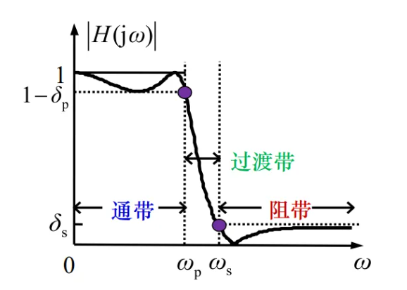
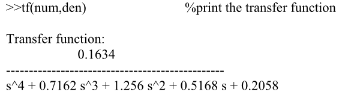
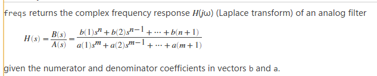

# 信号处理

## 1. 模拟滤波器

### 1.1 类型

- 巴特沃斯过滤器 	Butterworth filters 
- 切比雪夫滤波器 	Chebyshev filters
- 椭圆过滤器 			Elliptic filters 

这些滤波器通常由阻带和通带上的截止频率和波纹来指定。设计过程从确定滤波器的**最小阶数**和**适当的截止频率**开始，以满足期望的规格。

这两个参数可以通过以下命令进行估计：

```matlab
[N,Wc]=buttord(Wp,Ws,Rp,Rs,’s’);  %Butterworth filter
[N,Wc]=cheb1ord(Wp,Ws,Rp,Rs,’s’); %Chebyshev Type-I filter 
[N,Wc]=cheb2ord(Wp,Ws,Rp,Rs,’s’); %Chebyshev Type-II filter
[N,Wc]=ellipord(Wp,Ws,Rp,Rs,’s’);  %Elliptic filter 
```

N=滤波器的最低阶

Wc=截止频率（rad/s）

Rp=通带纹波（dB）

Rs=最小阻带衰减（dB）

Wp，Ws分别为通带和阻带边缘频率。



### 1.2 归一化低通模拟滤波器

模拟滤波器通常设计为归一化（截止频率为1rad/s）低通滤波器，然后通过直接替换转换为特定频率和滤波器类型（高通、带通等）。

```matlab
[z,p,k]=buttap(n);  		%normalized Butterworth filter 
[z,p,k]=cheb1ap(N,Rp); 		%normalized Chebyshev Type-I filter 
[z,p,k]=cheb2ap(N,Rs); 		%normalized Chebyshev Type-II filter 
[z,p,k]=ellipap(N,Rp,Rs); 	%normalized elliptic filter
```

N=过滤器的阶数

z=包含零点的向量

P=包含极点的向量

k=增益因子


### 1.3 传递函数

通常情况下，根据其传递函数指定设计的模拟滤波器。函数zp2tf将滤波器的零点、极点和增益特性转换为有理函数形式（传递函数）。

```matlab
[num,den]=zp2tf(z,p,k);
```

num包含分子系数，den包含分母系数

打印传递函数：

```matlab
tf(num,den)
```



### 1.4 模拟滤波器的频率响应



给定向量b和a中的分子和分母系数。

h=freqs（b，a，w）返回由系数向量b和a指定的模拟滤波器的复频率响应。

[h，w]=freqs（b，a，n）使用n个频率点来计算频率响应h，其中n是实数标量值。频率向量w是自动生成的，长度为n。如果省略n作为输入，将使用200个频率点。如果不需要返回生成的频率向量，可以使用h=freqs（b，a，n）的形式只返回频率响应h。

```matlab
w=0:0.005:3;    		%frequency vector 
H=freqs(num,den,w);  
mag=abs(H);    			%计算幅值响应 
phase=angle(H)*180/pi;  %计算相位响应
subplot(2,1,1);plot(w,mag);grid %画幅值响应
```


### 1.5 频率变换（对归一化滤波器）

前面的滤波器是针对标准化截止频率（1rad/s）设计的。我们现在将考虑一些变换，这些变换将允许我们改变截止频率，并获得低通、高通、带通和带阻滤波器。

```matlab
[num,den]=lp2lp(num,den,Wc);  	%lowpass-to-lowpass 
[num,den]=lp2hp(num,den,Wc);  	%lowpass-to-highpass 
[num,den]=lp2bp(num,den,W0,Bw); %lowpass-to-bandpass 
[num,den]=lp2bs(num,den,W0,Bw); %lowpass-to-bandstop 
```

Wc=滤波器的截止频率

W0=滤波器的中心频率（带通和带阻）

Bw=滤波器的带宽（带通与带阻）

**示例：**

设计一个截止频率为5Hz的四阶巴特沃斯低通滤波器。

```matlab
[z,p,k]=buttap(4);		%创建一个四阶的巴斯特沃低通滤波器
[num,den]=zp2tf(z,p,k);	%转换为多项式形式（频率响应的参数）
wc=2*pi*5;				%截止频率，wc=2*pi*f
[num,den]=lp2lp(num,den,wc)		%频率变换，得到所需滤波器
```


### 1.6 **更直接的生成命令**

- 巴特沃斯模拟滤波器：

    ```matlab
    [num,den]=butter(N,Wc, ‘s’);  %Lowpass Butterworth filter 
    [num,den]=butter(N,Wc,’s’);  %Bandpass Butterworth filter (order=2N) 
    [num,den]=butter(N,Wc,’high’,’s’); %Highpass Butterworth filter  
    [num,den]=butter(N,Wc,’stop’,’s’); %Bandstop Butterworth filter 
     
    [z,p,k]=butter(N,Wc,’s’);  %Lowpass Butterworth filter 
    [z,p,k]=butter(N,Wc,’s’);  %Bandpass Butterworth filter 
    [z,p,k]=butter(N,Wc,’high’,’s’); %Highpass Butterworth filter 
    [z,p,k]=butter(N,Wc,’stop’,’s’); %Bandstop Butterworth filter 
    ```

    N=order of the filter 
    Wc=cutoff frequency.  For bandstop and bandpass Wc=[Wc1,Wc2] 
    z= zeros 
    p= poles 
    k= gain 

- 切比雪夫模拟滤波器

    ```matlab
    Type-I: 
    [num,den]=cheby1(N, Rp,Wc,’s’);  %LPF: Rp=ripples (dB) in passband 
    [num,den]=cheby1(N,Rp,Wc,’high’,’s’); %HPF 
    [num,den]=cheby1(N,Rp,Wc,’stop’,’s’); %BSF: Wc=[Wc1,Wc2] 
    [num,den]=cheby1(N,Rp,Wc,’s’);  %BPF: Wc=[Wc1,Wc2] 
     
    [z,p,k]=cheby1(N,Rp,Wc,’s’);  %LPF 
    [z,p,k]=cheby1(N,Rp,Wc,’high’,’s’);  %HPF 
    [z,p,k]=cheby1(N,Rp,Wc,’stop’,’s’);  %BSF 
    [z,p,k]=cheby1(N,Rp,Wc,’s’);  %BPF 
     
    Type-II:  
    [num,den]=cheby2(N,Rs,Wc,’s’);  %LPF: Rs=decibels down 
    [num,den]=cheby2(N,Rs,Wc,’high’,’s’); %HPF 
    [num,den]=cheby2(N,Rs,Wc,’stop’,’s’); %BSF: Wc=[Wc1,Wc2] 
    [num,den]=cheby2(N,Rs,Wc,’s’);  %BPF: Wc=[Wc1,Wc2] 
     
    [z,p,k]=cheby2(N,Rs,Wc,’s’);  %LPF 
    [z,p,k]=cheby2(N,Rs,Wc,’high’,’s’);  %HPF 
    [z,p,k]=cheby2(N,Rs,Wc,’stop’,’s’);  %BSF 
    [z,p,k]=cheby2(N,Rs,Wc,’s’);  %BPF 
    ```


## 2. 数字滤波器

数字滤波器大致有两种，通常根据脉冲响应的持续时间进行分类，可以是**有限长度**的，也可以是**无限长度**的。

具有有限持续时间脉冲响应的滤波器称为**有限脉冲响应滤波器或FIR滤波器**；并且具有无限持续时间脉冲响应的滤波器被称为无**限脉冲响应滤波器或IIR滤波器**