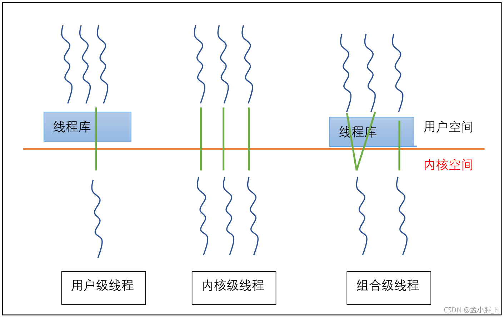

# Linux线程

## 1、线程的概念和实现方式

**概念**：线程是进程内部的一条执行序列或执行路径，一个进程可以包含多条线程。==线程是进行资源调度和分配的基本单位 。==

（1）每个进程至少有一条执行路径，所以一个进程至少有一个线程。
（2）每个进程都有一个主线程。


实现方式：

在操作系统中，线程的实现有以下三种方式：

1. **用户级线程**：由线程库中的代码进行管理，处理 ，销毁。用户自己创建的多线程，即多个处理路径，无法使用多处理器的资源，**在内核眼里就只是一条路径**。
2. **内核级线程**：由内核直接创建、直接管理、直接调度，直接结束。开销大，可以利用处理器的资源。
3. **组合级线程**：内核空间允许其使用多处理器的资源。比如用户创建多个线程，内核可以创建两个线程来处理这些线程，以达到可以有效使用处理器资源的目的。




Linux 中线程的实现：

Linux 实现线程的机制非常独特。从内核的角度来说，它并没有线程这个概念。Linux 把所有的线程都当做进程来实现。内核并没有准备特别的调度算法或是定义特别的数据结构来表征线程。==相反，线程仅仅被视为一个与其他进程共享某些资源的进程。==每个线程都拥有唯一隶属于自己的 task_struct，所以在内核中，它看起来就像是一个普通的进程（只是线程和其他一些进程共享某些资源，如地址空间）。


==进程与线程的区别：==

- 进程是资源分配的最小单位，线程是 CPU 调度的最小单位。
- 进程有自己的独立地址空间，线程共享进程中的地址空间。
- 进程的创建消耗资源大，线程的创建相对较小。
- 进程的切换开销大，线程的切换开销相对较小。


## 2、线程接口

```c
#include <pthread.h>

/*
	pthread_create()用于创建线程
	thread： 接收创建的线程的 ID
	attr： 指定线程的属性//一般传NULL
	start_routine：指定线程函数
	arg： 给线程函数传递的参数
	成功返回 0， 失败返回错误码
*/
int pthread_create(pthread_t * thread, const pthread_attr_t *attr, void *(*start_routine) ( void *), void *arg);
// clone创建内核支持的用户级线程，对内核可见且由内核调度
int clone(int(*fn)(void* arg),void *stack,int flags,void* arg);

/*
	pthread_exit()退出线程
	retval：指定退出信息
*/
int pthread_exit( void *retval);


/*
	pthread_join()：等待 thread 指定的线程退出，线程未退出时，该方法阻塞
	retval：接收 thread 线程退出时，指定的退出信息
*/
int pthread_join(pthread_t thread, void **retval);
```

pthread_create() 由基于POSIX标准的线性库创建的用户线程

> 在Linux里，pthread_create() 最终调用 clone() 实现

基于POSIX标准的线程编程接口：

- 包括一个 pthread.h 头文件和一个线程库

- 编译方法：

    ```c
    gcc **.c -o ** -lpthread
    ```

    

**线程终止：**

```c
// 正常终止
// 方法1 线程自己调用 pthread_exit()
void pthread_exit(void *rval_ptr);
// rval_ptr 线程退出返回的指针，进程中其他线程可调用 pthread_join() 访问到该指针
// 方式2 在线程函数执行 return

// 非正常终止
// 其他线程的干预
// 自身运行出错
```


**线程同步：**

```c
int pthread_join(pthread_t thread, void ** rval_ptr);
```

功能：

- 调用者将挂起并等待新进程终止
- 当新线程调用 pthread_ exit() 退出或者 return 时，进程中的其他线程可通过 pthread_join() 获得进程的退出状态

使用约束：

- 一个新线程仅仅允许一个线程使用该函数等待它终止
- 被等待的线程应该处于可join状态，即非DETACHED状态

返回值：

- 成功结束返回值为0，否则为错误编码

说明：

- 类似于 waitpid()


**线程分离：**

```c
int pthread_detach(pthread_t thread)
```

功能：

- 执行该函数后线程处于DETACHED状态
- 处于该状态的线程结束后自动释放内存资源，不能被 pthread_join() 同步

说明：

- 当线程被分离时，不要用 pthread_join() 等待其终止状态
- 为避免内存泄漏，线程终止要么处于分离状态，要么处于同步状态


示例：

```c
#include <stdio.h>
#include <unistd.h>   
#include <pthread.h>  
void *ThreadFun(void *arg)//线程函数
{  
   int num=5;
    while(num--){
        printf("Accessing %s!\n", (char*)arg);
        sleep(1);
    }
    return NULL;
}

int main()
{
    int res;
    char * url1 = "http://thread1.net";
    char * url2 = "http://thread2.net";
    void* state=NULL;
    pthread_t tid1,tid2;//定义两个表示线程的变量（标识符）
    //创建用户线程1
    res = pthread_create(&tid1, NULL, ThreadFun, (void*)url1);
    if (res != 0) {
        printf("线程创建失败");
        return 0;
    }
    //创建用户线程2
    res = pthread_create(&tid2, NULL, ThreadFun,(void*)url2);
    if (res != 0) {
        printf("线程创建失败");
        return 0;
    }
    pthread_detach(tid1);//将线程1和主线程分离
    pthread_detach(tid2);//将线程2和主线程分离
    //pthread_join(tid1,state);//令主线程等到线程1执行完成
    //pthread_join(tid2,state);//令主线程等到线程2执行完成
    printf("主线程继续其他任务！\n");
    sleep(20);
    return 0;
}
```


