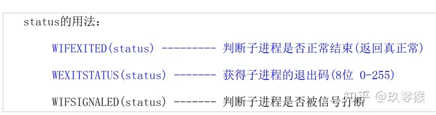

# Linux 进程编程

## 1、进程的概念

- 程序
    - 程序(program)是存放在磁盘文件中的可执行文件
- 进程
    - 程序的执行实例被称为进程(process)
    - 进程具有独立的权限与职责。如果系统中某个进程崩溃，它不会影响到其余的进程。
    - 每个进程运行在其各自的虚拟地址空间中，进程之间可以通过由内核控制的机制相互通讯。
- 进程ID（pid）
    - 每个linux进程都一定有一个唯一的数字标识符，称为进程ID(processID)，进程ID总是一非负整数。

> **pid =0 ：称为交换进程（swapper）**
> 作用： 进程调度
> **pid=1 ：init 进程**
> 作用： 系统初始化


## 2、进程结构

每一个启动的进程在内存中都有一个固定的结构：

task_struct ==》 结构体 ==》进程表项（进程控制块）

记录了进程的信息，调度策略。


## 3、获取进程标识符

- `getpid()` 获取自身的进程标识符
- `getppid()` 获取父进程的进程标识符

```c
#include<sys/types.h>
#include<unistd.h>
pid_t getpid(void);
pid_t getppid(void);
```

示例：

```c
#include<stdio.h>
#include<sys/types.h>
#include<unistd.h>

int main()
{
    pid_t pid;
    pid = getpid();
   	printf("my pid is %d\n",pid);
   	return 0;
}
```


## 4、查看系统进程

```bash
ps -ef
ps aux
```


## 5、unistd

`#include <unistd.h>` 是 C 语言标准库中的一个头文件，它包含了一些与操作系统交互相关的函数和符号常量。

其中，`<unistd.h>` 头文件定义了很多 POSIX 标准函数的原型和相关常量，例如：

- `fork()`: 创建一个新进程。
- `exec系列函数`: 进程替换，用于执行其他程序。
- `getpid()`: 获取当前进程的进程 ID。
- `getppid()`: 获取父进程的进程 ID。
- `sleep()`: 将当前进程挂起指定的时间。
- `pipe()`: 创建一个管道，用于进程间通信。
- `dup()/dup2()`: 复制文件描述符。

除此之外，`<unistd.h>` 还定义了一些符号常量，如文件描述符的常量（`STDIN_FILENO`、`STDOUT_FILENO`、`STDERR_FILENO`）、错误码等。

通过包含 `<unistd.h>` 头文件，我们可以在程序中使用其中定义的函数和常量，实现与操作系统级别的交互和控制。


## 6、init 进程

Linux内核启动之后，会创建第一个**用户级进程init**， init 进程 (pid=1) 是除了 idle 进程(pid=0，也就是 init_task) 之外另一个比较特殊的进程，它是 Linux 内核开始建立起进程概念时第一个通过 kernel_thread 产生的进程，其开始在内核态执行，然后通过一个系统调用，开始执行用户空间的 `/sbin/init` 程序。

- **1号进程(init )** 是**所有用户进程的祖先**

- **2号进程(内核线程)** 是**内核进程的祖先**


## 7、fork创建进程

```c
pid_t fork(void);
```

fork函数调用成功，返回两次 

- 返回值为0 ，代表当前进程是子进程

    ==子进程执行 fork() 返回 0==

- 返回值非负数，代表当前进程为父进程 

    ==父进程执行 fork() 返回子进程的 PID 值==

- 调用失败 ，返回-1


功能：使用fork函数创建一个进程

- 子进程完全复制父进程的资源
- 子进程的执行独立于父进程
- 进程间数据共享需通过专门的通信机制来实现


父进程的代码段是不会不复制到子进程的，而是共享，其它段需要复制，属于写拷贝 (即只有改的时候, 才需要拷贝)，这样提高效率，节省资源，总而言之，**相当于克隆了一个自己**

fork 前的代码只有父进程在跑，fork 之后的代码父子进程都在跑

示例：

```c
#include<sys/types.h>
#include<stdio.h>
#include<unistd.h>

int main()
{

   pid_t pid;

   printf("father: id=%d\n",getpid());	// fork之前，只有父进程执行

   pid = fork();

   if(pid > 0){
         printf("this is father print ,pid =%d\n",getpid());
   }else if (pid == 0){
         printf("this is child print, child pid = %d\n",getpid());
   }
   // fork之后，父子进程都会执行
   printf("fork 之后");

   return 0;
}
```

输出：

```c
father: id=1234
this is father print ,pid = 1234
this is child print, child pid = 1235
```

当调用 `fork()` 创建子进程时，子进程会继承父进程的所有资源，包括文件描述符、变量等。但是，子进程会从 `fork()` 的返回处开始执行，因此子进程不会次执行 `printf("father: id=%d\n",getpid());` 这条语句。

==注意：如果父进程提前结束，那么子进程就会变成孤儿进程。==


## 8、vfork创建进程

```c
pid_t fork(void);
```

vfork函数 也可以创建进程，与fork有什么区别？

**关键区别一：** vfork直接使用父进程存储空间，不用拷贝

**关键区别二：** vfork保证子进程先运行，当子进程调用exit退出后，父进程才执行

由此可知，由 vfork 创建的进程，子进程和父进程是不能同时运行的，因为函数不复制父进程的进程空间，而是抢占父进程的资源，导致父进程堵塞，无法继续运行，子进程完成后，父进程才能继续运行


示例：

```c
#include<stdio.h>
#include<sys/types.h>
#include<unistd.h>
#include<stdlib.h>

int main()
{
    pid_t pid;
    int cnt=0;

    pid = vfork();

    if(pid >0){
       while(1){
               printf("this is father print pid is %d\n",getpid());
               sleep(1);
       }
    }else if(pid == 0){
         while(1){
               printf("this is child print pid is =%d\n",getpid());
               sleep(1);
               cnt++;
               if(cnt == 3 ){
                   exit(0);
               }
         }
    }

   return 0;
}
```

输出：vfork保证子进程先运行，当子进程调用3次 exit退出后，父进程才执行

```bash
[root@hecs-86422 ~]# ./test3
this is child print pid is =183480
this is child print pid is =183480
this is child print pid is =183480
this is father print pid is 183479
this is father print pid is 183479
this is father print pid is 183479
this is father print pid is 183479
```

==注意：子进程改变了cnt的值，由于子进程和父进程是共享进程空间的，因此父进程中cnt的值也变了。==


## 9、进程退出

正常退出：

1. Mian函数调用return
2. 进程调用 exit()，标准c库
3. 进程调用 _exit() 或者 _Exit()，属于系统调用
4. 进程的所有线程都结束。

_exit() / _Exit 是 系统调用函数, exit 是库函数

**exit 是 \_exit 和 \_Exit 的一个封装, 会清除，冲刷缓冲区，把缓存区数据进程处理在退出。**


异常退出：

1. 调用 `abort`
2. 当进程收到某些信号时候，如 `ctrl+C`
3. 最后一个线程被取消（cancellation）,请求作出响应


### 等待子进程退出

- 为什么要等待子进程退出？

    创建子进程的目的就是为了让它去干活，在网络请求当中来了一个新客户端介入，创建子进程去交互，干活也要知道它干完没有。
    比如正常退出（exit / \_exit / \_Exit）为完成任务；若异常退出 （abort）为不想干了，或被杀了。

所以要等待子进程退出，同时还要收集它退出的状态。子进程退出时, 不管是正常还是异常, 父进程会收到信号。

子进程退出后，内存上的资源必须是父进程负责回收，但是有时候会出现下面两种情况 :

1. 子进程先结束，会通知父进程(通过信号)，让父进程回收资源，如果父进程不处理信号，子进程则变成==僵尸进程==

2. 父进程先结束，子进程就会变成==孤儿进程==，就会由1号进程 ( init ) 负责回收，但在实际编程中要避免这种情况，因为1号进程很忙

等待就是调用 `wait` 函数和 `waitpid` 函数


### wait函数

wait函数等待子进程的结束信号

它是阻塞函数，只有任意一个子进程结束，它才能继续往下执行，否则卡住那里等

它获得结束子进程的 PID 以及退出状态/退出码，并且回收子进程的内存资源

```c
#include <sys/types.h>
#include <sys/wait.h>

pid_t wait(int * status);
```

status是传出参数，传出退出状态 / 退出码

- 如果其所有子进程都还在运行，则阻塞。通俗的说就是子进程在运行的时候，父进程卡在wait位置阻塞，等子进程退出后，父进程开始运行。
- 如果一个子进程已终止，父进程正等待获取其终止状态，则会取得该子进程的终止状态立即返回。
- 如果它没有任何子进程，则立即出错返回。

> status参数： 是一个整型数指针
> 非空： 子进程退出状态放在它所指向的地址中。
> 空： 不关心退出状态



```c
#include <stdio.h>
#include <stdlib.h>
#include <sys/wait.h>

int main()
{
    pid_t pid = fork();
    if(!pid){//子1
        printf("child %d start running!\n",getpid());
        sleep(10);
        printf("child exit!\n");
        exit(10);
    }

    pid = fork();
    if(!pid){//子2
        printf("child %d start running!\n",getpid());
        sleep(15);
        printf("child exit!\n");
        exit(30);
    }

    //父进程
    //等待子进程结束
    int status = 0;
    pid_t pid1 = 0;
    pid1 = wait(&status);//等待任意一个子进程的结束
    if(WIFEXITED(status)){
        printf("%d正常结束!退出码 = %d\n", pid1, WEXITSTATUS(status));
    }
    if(WIFSIGNALED(status)){
        printf("%d被信号打断!信号 = %d\n", pid1, WTERMSIG(status));
    }

    pid1 = wait(&status);//等待任意一个子进程的结束
    if(WIFEXITED(status)){
        printf("%d正常结束!退出码 = %d\n",pid1,WEXITSTATUS(status));
    }
    if(WIFSIGNALED(status)){
        printf("%d被信号打断!信号 = %d\n",pid1,WTERMSIG(status));
    }

    return 0;
}
```


### waitpid函数

wait函数的加强版

可以选择等指定哪个子进程 , 还可以选择等待方式(可以选择堵塞、不堵塞)

```c
pid_t waitpid(pid_t pid , int *status ,int options);
```

对于 waitpid 函数种 pid 参数的作用解释如下：

|     pid     |                        作用                         |
| :---------: | :-------------------------------------------------: |
|  pid == -1  | 等待任一子进程。就这一方面而言，waitpid与wait等效。 |
| **pid > 0** |           等待其进程ID与pid相等的子进程。           |
|  pid == 0   |       等待其组ID等于调用进程组ID的任一子进程        |
|   pid <-1   |        等待其组ID等于pid绝对值的任一子进程。        |

**waitpid 的 options 常量**：

| options    | 作用                                                         |
| ---------- | ------------------------------------------------------------ |
| WCONTINUED | 若实现支持作业控制，那么由pid指定的任一子进程在暂停后已经继续，但其状态尚未报告，则返回其状态（POSIX.1的XSI扩展） |
| WNOHANG    | 若由pid指定的子进程并不是立即可用的，则waitpid不阻塞，此时其返回值为0； |
| WUNTRACED  | 若某实现支持作业控制，而由pid指定的任一子进程已处于暂停状态。 |

0 - 阻塞等待

WNOHANG - 非阻塞等待（立即返回）


## 10、exec族函数

fork/ vfork 产生的子进程内容和父进程完全一致, 但是在很多时候, 我们希望新的子进程去执行全新的程序。

而 exec 系列函数就提供了这样的功能，使用一个程序去替换进程的内容 (不会产生新的进程,是替换 )。

单独使用没有意义，一般 是和 fork/ vfork 连用。 用 fork/ vfork 产生子进程, 然后用exec替代。

使用vfork堵塞父进程， 抢了资源，但是使用exec后，子进程替换了内容，便不抢占资源了，父进程继续执行，不用等子进程

我们用fork函数创建新进程后，经常会在新进程中调用 exec 函数去执行另外一个程序。当进程调用 exec 函数时，该进程被完全替换为新程序，因为调用 exec 函数并不创建新进程，所以前后进程的ID并没有改变。

**函数族：**

> execl、execlp、execle、execv、execvp、execvpe

示例：

```c
#include <stdio.h>
#include <stdlib.h>
#include <unistd.h>

int main(int argc,char *argv[],char *env[])
{
    printf("pid = %d\n",getpid());
    pid_t pid = vfork();
    if(!pid){//子
        printf("child pid = %d\n",getpid());
        int res = execl("./tst","tst",NULL);//用这个程序替换掉子进程内容
        if(res==-1){
            perror("execl");
        }

        exit(0);
    }

    //父
    printf("parent running!\n");
    sleep(1);//....
    wait(NULL);
    printf("%d end!\n",getpid());
    return 0;
}
```


