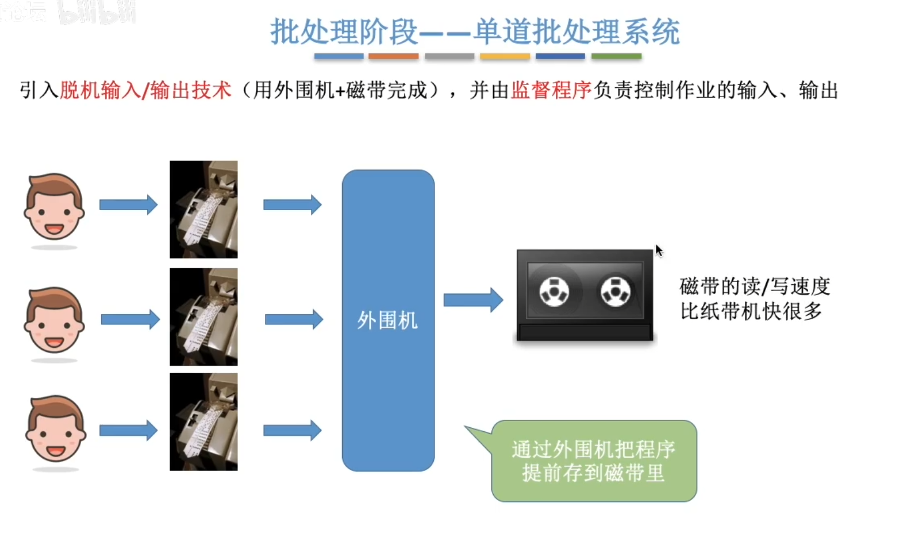
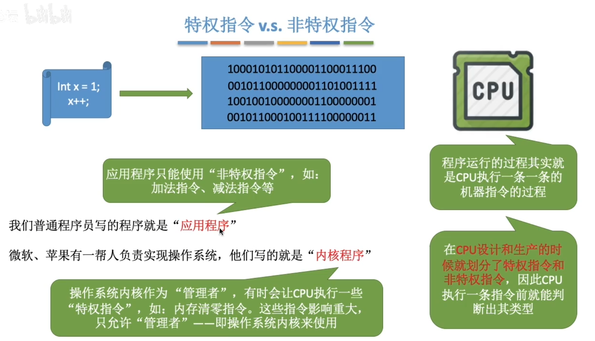

# 操作系统

## 1、概念

==操作系统==（Operating System，OS）是控制和==管理==整个计算机系统的==硬件和软件==资源，并合理地组织调度计算机的工作和资源的分配；以==提供给用户和其他软件方便的接口和环境==；它是计算机系统中最基本的==系统软件==。

1. 作为系统资源的管理者

2. 向上层提供方便易用的服务

    GUI：图形化用户接口 

    联机命令接口

    脱机命令接口

    程序接口：可以在程序中进行==系统调用==来使用程序接口。普通用户不能直接使用程序接口，只能通过程序代码间接使用。

     

## 2、特征

- 并发
- 共享
- 虚拟
- 异步

并发、共享是两个最基本的特征，二者互为存在条件

### 并发

==并发==：指两个或多个事件在同一时间间隔内发生。这些事情==宏观上是同时发生==的，但==微观上是交替发生==的。

常考易混淆概念——==并行==：指两个或多个事件在同一时刻同时发生。

==操作系统的并发性==指计算机系统中“同时”运行着多个程序，这些程序宏观上看是同时运行着的，而微观上看是交替运行的。

操作系统就是伴随着“多道程序技术”而出现的。因此，==操作系统和程序是一起诞生的==。

注意（==重要考点==）：

==单核CPU==同一时刻只能执行==一个程序==，各个程序只能==并发==地执行。

==多核CPU==同一时刻可以同时执行==多个程序==，多个程序可以==并行==地执行。

**并发性是操作系统一个最基本的特性。**

### 共享

共享：即资源共享，是指系统中的资源可供内存中多个并发执行的进程共同使用。

两种资源共享方式：

- **互斥共享方式**：系统中的某些资源，虽然可以提供给多个进程使用，但**一个时间段内只允许一个进程访问该资源。**
- **同时共享方式**：系统中的某些资源，**允许一个时间段内由多个进程“同时”对它们进行访问。**

所谓的“同时”往往是宏观上的，而在微观上，这些进程可能是交替地对该资源进行访问的（即分时共享）

生活实例：

互斥共享方式：使用QQ和微信视频。同一时间段内摄像头只能分配给其中一个进程。

同时共享方式：使用QQ发送文件A，同时使用微信发送文件B。宏观上看，两边都在同时读取并发送文件，说明两个进程都在访问硬盘资源，从中读取数据。**微观上看，两个进程是交替着访问硬盘的。**

### 并发和共享的关系

==并发性==指计算机系统中同时存在着多个运行着的程序。

==共享性==是指系统中的资源可供内存中多个并发执行的进程共同使用。

通过下述例子来看并发和共享的关系：

使用QQ发送文件A，同时使用微信发送文件B。

1. 两个进程正在并发执行（==并发性==）
2. 需要共享地访问硬盘资源（==共享性==）

### 虚拟

虚拟是指把一个物理上的实体变为若干个逻辑上的对应物。物理实体（前者）是实际存在的，而逻辑上对应物（后者）是用户感受到的。

虚拟技术：

- 空分复用技术（如虚拟存储器技术）
- 时分复用技术（如虚拟处理器）

### 异步

异步：在多道程序环境下，允许多个程序并发执行，但由于资源有限，进程的执行不是一贯到底的，而是走走停停，以不可预知的速度向前推进，这就是进程的异步性。

## 3、发展和分类

### 手工操作阶段

### 批处理阶段——单道批处理系统

### 批处理阶段——多道批处理系统

### 分时操作系统

### 实时操作系统

### 其他操作系统

### 总结

## 4、运行机制

“指令”就是处理器（CPU）能识别、执行的最基本命令

内核（Kernel）是操作系统最重要最核心的部分

为了让CPU能够判断此时运行的程序是内核程序还是应用程序，将CPU划分为两种状态，“内核态”和“用户态”。

## 5、中断

### 中断的作用

CPU上会运行两种程序，一种是==操作系统内核程序==，一种是==应用程序==

在合适的情况下，操作系统内核会把CPU的使用权主动让给应用程序

“中断”是==让操作系统内核夺回CPU使用权==的唯一途径。“中断”会使CPU由用户态变为内核态。

> 如果没有“中断”机制，那么一旦应用程序上CPU运行，CPU就会一直运行这个应用程序。

### 中断的类型

- 内中断：与当前执行的指令==有关==，中断信号来源于CPU==内部==
- 外中断：与当前执行的指令==无关==，中断信号来源于CPU==外部==

陷入指令：特殊的指令，但不是特权指令

### 中断机制的基本原理

==不同的中断信号，需要用不同的中断处理程序来处理==。当CPU检测到中断信号后，会根据中断信号的类型去查询“==中断向量表==”，以此来找到对应的中断处理程序在内存中的存放位置。

## 6、系统调用

“系统调用”是操作系统提供给对应应用程序（程序员/编程人员）使用的接口，可以理解为一种可供应用程序调用的特殊函数，应用程序可以通过系统调用来请求获得操作系统内核的服务。

