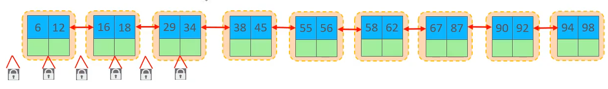
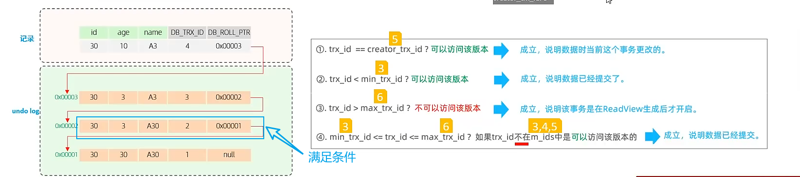

# MySQL基础

*MySQL 是最流行的关系型数据库管理系统，在 WEB 应用方面 MySQL 是最好的 RDBMS(Relational Database Management System：关系数据库管理系统)应用软件之一。*

面试题：

- 什么是事务,以及事务的四大特性?
- 事务的隔离级别有哪些, MySQL默认是哪个?
- 内连接与左外连接的区别是什么?
- 常用的存储引擎? InnoDB与MyISAM的区别?
- MySQL默认InnoDB引擎的索引是什么数据结构?
- 如何查看MySQL的执行计划?
- 索引失效的情况有哪些?
- 什么是回表查询?
- 什么是MVCC?
- MySQL主从复制的原理是什么? 
- 主从复制之后的读写分离如何实现?
- 数据库的分库分表如何实现?


## 介绍

### 怎么学？


### 数据库相关概念

| 名称           | 全称                                                       | 简称                               |
| -------------- | ---------------------------------------------------------- | ---------------------------------- |
| 数据库         | 存储数据的仓库，数据是有组织的进行存储                     | DataBase（DB）                     |
| 数据库管理系统 | 操纵和管理数据库的大型软件                                 | DataBase Management System（DBMS） |
| SQL            | 操作关系型数据库的编程语言，定义了一套操作型数据库统一标准 | Structured Query Language（SQL）   |

主流的关系型数据库管理系统

- Oracle
- MySQL
- SQL Server
- PostgreSQL


### RDBMS 术语

在我们开始学习MySQL 数据库前，让我们先了解下RDBMS的一些术语：

- **数据库:** 数据库是一些关联表的集合。
- **数据表:** 表是数据的矩阵。在一个数据库中的表看起来像一个简单的电子表格。
- **列:** 一列(数据元素) 包含了**相同类型**的数据, 例如邮政编码的数据。
- **行：**一行（元组，或记录）是**一组相关的数据**，例如一条用户订阅的数据。
- **冗余**：存储两倍数据，冗余降低了性能，但提高了数据的安全性。
- **主键**：主键是唯一的。一个数据表中只能包含一个主键。你可以使用主键来查询数据。
- **外键：**外键用于关联两个表。
- **复合键**：复合键（组合键）将多个列作为一个索引键，一般用于复合索引。
- **索引：**使用索引可快速访问数据库表中的特定信息。索引是对数据库表中一列或多列的值进行排序的一种结构。类似于书籍的目录。
- **参照完整性:** 参照的完整性要求关系中不允许引用不存在的实体。与实体完整性是关系模型必须满足的完整性约束条件，目的是保证数据的一致性。

MySQL 为关系型数据库(Relational Database Management System), 这种所谓的"关系型"可以理解为"表格"的概念, 一个关系型数据库由一个或数个表格组成, 如图所示的一个表格:


- 表头(header): 每一列的名称;
- 列(col): 具有相同数据类型的数据的集合;
- 行(row): 每一行用来描述某条记录的具体信息;
- 值(value): 行的具体信息, 每个值必须与该列的数据类型相同;
- **键(key)**: 键的值在当前列中具有唯一性。

RDBMS 即关系数据库管理系统(Relational Database Management System)的特点：

- 数据以表格的形式出现
- 每行为各种记录名称
- 每列为记录名称所对应的数据域
- 许多的行和列组成一张表单
- 若干的表单组成database

### MySQL数据库

MySQL 是一个关系型数据库管理系统，由瑞典 MySQL AB 公司开发，目前属于 Oracle 公司。MySQL 是一种关联数据库管理系统，关联数据库将数据保存在不同的表中，而不是将所有数据放在一个大仓库内，这样就增加了速度并提高了灵活性。

- MySQL 是开源的，目前隶属于 Oracle 旗下产品。
- MySQL 支持大型的数据库。可以处理拥有上千万条记录的大型数据库。
- MySQL 使用标准的 SQL 数据语言形式。
- MySQL 可以运行于多个系统上，并且支持多种语言。这些编程语言包括 C、C++、Python、Java、Perl、PHP、Eiffel、Ruby 和 Tcl 等。
- MySQL 对 PHP 有很好的支持，PHP 是很适合用于 Web 程序开发。
- MySQL 支持大型数据库，支持 5000 万条记录的数据仓库，32 位系统表文件最大可支持 4GB，64 位系统支持最大的表文件为8TB。
- MySQL 是可以定制的，采用了 GPL 协议，你可以修改源码来开发自己的 MySQL 系统。


## MySQL安装与启动

### Windows上安装

- 版本

    MySQL官方提供了两种不同的版本：

    - 社区版（MySQL Community Server）

        免费，MySQL不提供任何技术支持

    - 商业版（MySQL Enterprise Edition）

        收费，可以试用30天，官方提供技术支持


- 下载

[MySQL :: Download MySQL Installer](https://dev.mysql.com/downloads/installer/)


> **注意：**安装过程我们需要通过开启管理员权限来安装，否则会由于权限不足导致无法安装。


- 安装

双击


选择默认的开发者模式安装


安装MySQL的组件，点击 Execute ，等待安装完成点击 next


再次点击next，进入配置界面（注意MySQL默认的端口号是3306）


使用推荐的。点击next


设置默认的root用户的密码（123456）


将 MySQL 注册为 Windows 的一个系统服务


执行刚才配置的信息


点击cancer退出


### 启动与停止

==方法1：==

win+r，输入：services.msc


找到MySQL80，右键启动或停止


==方法2：==

在命令行输入：

- 启动

    ```bash
    net start mysql80
    ```

- 停止

    ```bash
    net stop mysql80
    ```

必须以管理员的身份启动命令行


### 客户端连接

==方式1：MySQL提供的客户端命令行工具==


输入密码连接


==方式2：系统自带的命令行工具执行指令==

```bash
mysql [-h 127.0.0.1] [-p 3306] -u root -p
```

-h、-p 可以省略，默认连接本机的3306端口

参数说明：

- **-h** : 指定客户端所要登录的 MySQL 主机名, 登录本机(localhost 或 127.0.0.1)该参数可以省略;
- **-u** : 登录的用户名;
- **-p** : 告诉服务器将会使用一个密码来登录, 如果所要登录的用户名密码为空, 可以忽略此选项。

想要在任意路径下执行该命令，需要配置环境变量

`C:\Program Files\MySQL\MySQL Server 8.0\bin`


演示：


## 数据模型

- 关系型数据库（RDBMS）

概念：建立在关系模型基础上，由多张相互连接的二维表组成的数据库。

特点：

1. 使用表存储数据，格式统一，便于维护
2. 使用SQL语言操作，标准统一，使用方便


- 数据模型


## SQL

### SQL通用语法

1. SQL语句可以单行或多行书写，以分号结尾。
2. SQL语句可以使用空格/缩进来增强语句的可读性。
3. MySQL数据库的SQL语句不区分大小写，关键字建议使用大写。
4. 注释：
    - 单行注释：-- 注释内容 或 # 注释内容（MySQL特有）
    - 多行注释：/* 注释内容 */

### SQL分类

| 分类 | 全称                       | 说明                                                   |
| ---- | -------------------------- | ------------------------------------------------------ |
| DDL  | Data Definition Language   | 数据定义语言，用来定义数据库对象（数据库、表、字段）   |
| DML  | Data Manipulation Language | 数据操作语言，用来对数据库表中的数据进行增删改         |
| DQL  | Data Query Language        | 数据查询语言，用来查询数据库中表的记录                 |
| DCL  | Data Control Language      | 数据控制语言，用来创建数据库用户、控制数据库的访问权限 |

### DDL

DDL - 数据定义语言

==数据库操作：==

- 查询

    查询所有数据库

    ```mysql
    SHOW DATABASES;
    ```

    查询当前数据库

    ```mysql
    SELECT DATABASE();
    ```

- 创建 (utf8mb4)

    ```mysql
    CREATE DATABASE [IF NOT EXISTS] 数据库名 [DEFAULT CHARSET 字符集] [COLLATE 排序规则]
    ```

- 删除

    ```mysql
    DROP DATABASE [IF EXISTS] 数据库名;
    ```

- 使用

    ```mysql
    USE 数据库名;
    ```

    

==表操作：==

- 查询

    查询当前数据库所有表

    ```mysql
    SHOW TABLES;
    ```

    查询表结构

    ```mysql
    DESC 表名;
    ```

    查询指定表的建表语句

    ```mysql
    SHOW CREATE TABLE 表名;
    ```

- 创建

    ```mysql
    CREATE TABLE 表名(
    	字段1 字段1类型[COMMENT 字段1注释],
    	字段2 字段1类型[COMMENT 字段2注释],
    	字段3 字段1类型[COMMENT 字段3注释],
    	......
    	字段n 字段1类型[COMMENT 字段n注释]
    )[COMMENT 表注释];
    ```

    示例：

    

    ```mysql
    mysql> create table tb_user(
        -> id int comment '编号',
        -> name varchar(50) comment '姓名',
        -> age int comment '年龄',
        -> gender varchar(1) comment '性别'
        -> )comment '用户表';
    Query OK, 0 rows affected (0.02 sec)
    ```

    

==表操作 - 数据类型==

MYSQL中的数据类型有很多，主要分为三类：**数值类型、字符串类型、日期时间类型**。


- TINYINT
- SMALLINT
- MEDIUMINT
- INT
- BIGINT
- FLOAT
- DOUBLE
- DECIMAL


案例：设计一张员工信息表，要求如下：

1. 编号（纯数字）
2. 员工工号（字符串类型，长度不超过10位）
3. 员工姓名（字符串类型，长度不超过10位）
4. 性别（男/女，存储一个汉字）
5. 年龄（正常人年龄，不可能存储负数）
6. 身份证号（二代身份证均为18位，身份证中有X这样的字符）
7. 入职时间（取值年月日即可）

```mysql
CREATE TABLE emp(
	id INT COMMENT '编号',
	workno VARCHAR(10) COMMENT '员工工号',
    name VARCHAR(10) COMMENT '姓名',
    gender CHAR(1) COMMENT '性别',
    age TINYINT UNSIGNED COMMENT '年龄',
    idcard CHAR(18) COMMENT '身份证',
    entrydate DATE COMMENT '入职时间'
)COMMENT '员工表';
```


==表操作 - 修改==

- 添加字段

    ```mysql
    ALTER TABLE 表名 ADD 字段名 类型（长度） [COMMENT 注释] [约束];
    ```

- 修改字段

    修改数据类型

    ```mysql
    ALTER TABLE 表名 MODIFY 字段名 新数据类型（长度）;
    ```

    修改字段名和字段类型

    ```mysql
    ALTER TABLE 表名 CHANGE 旧字段名 新字段名 类型（长度） [COMMENT 注释] [约束];
    ```

- 删除字段

    ```mysql
    ALTER TABLE 表名 DROP 字段名;
    ```

- 修改表名

    ```mysql
    ALTER TABLE 表名 RENAME TO 新表名;
    ```

    

==表操作 - 删除==

- 删除表

    ```mysql
    DROP TABLE [IF EXISTS] 表名;
    ```

- 删除指定表，并重新创建该表

    ```mysql
    TRUNCATE TABLE 表名;
    ```

    

### 图形化界面工具DataGrip

- MySQL图形化界面工具

    Sqlyog、Navicat、DataGrip

下载安装DataGrip，创建一个项目名为 mysql-base

点击加号，添加数据源：


配置连接信息并下载驱动


测试连接，显示 Succeeded 表示连接成功


成功后点击apply，点击ok

相关操作：

创建数据库


创建表


修改表


自己通过sql语句的方式操作表


### DML

Data Manipulation Language —— 数据操作语言，用来对数据库中的表的数据记录进行增删改操作。

- 添加数据（INSERT）
- 修改数据（UPDATE）
- 删除数据（DELETE）


==DML-添加数据==

- 给指定字段添加数据

    ```mysql
    INSERT INTO 表名（字段名1，字段名2，...） VALUES (值1，值2，...)；
    ```

- 给全部字段添加数据

    ```mysql
    INSERT INTO 表名 VALUES （值1，值2，...）;
    ```

- 批量添加数据

    ```mysql
    INSERT INTO 表名（字段名1，字段名2，...） VALUE (值1，值2，...),(值1，值2，...),(值1，值2，...);
    ```

    ```mysql
    INSERT INTO 表名 VALUE (值1，值2，...),(值1，值2，...),(值1，值2，...);
    ```

- 注意：

    - 插入数据时，指定的字段顺序需要与值的顺序是一一对应的。
    - 字符串和日期类型数据应该包含在引号中。
    - 插入的数据的大小，应该在字段的规定范围内。


==DML-修改数据==

- 修改数据

    ```mysql
    UPDATE 表名 SET 字段名1=值1，字段名2=值2，...[WHERE 条件];
    ```

- 注意：

    - 修改语句的条件可以有，也可以没有，如果没有条件，则会修改整张表的所有数据


==DML-删除数据==

- 删除数据

    ```mysql
    DELETE FROM 表名 [WHERE 条件];
    ```

- 注意：
    - DELETE 语句的条件可以有，也可以没有，如果没有条件，则会删除整张表的所有数据。
    - DELETE 语句不能删除某一个字段的值（可以使用UPDATE）。


### DQL

Data Query Language —— 数据查询语言，用来查询数据库中表的记录。

查询关键字：==SELECT==

- DQL - 语法

    ```mysql
    SELECT
    	字段列表
    FROM
    	表名列表
    WHERE
    	条件列表
    GROUP BY
    	分组字段列表
    HAVING
    	分组后条件列表
    ORDER BY
    	排序字段列表
    LIMIT
    	分页参数
    ```

- 基本查询

- 条件查询（WHERE）

- 聚合函数（count、max、min、avg、sum）

- 分组查询（GROUP BY）

- 排序查询（ORDER  BY）

- 分页查询（LIMIT）


#### 基本查询

- ==基本查询==

    查询多个字段

    ```mysql
    SELECT 字段1，字段2，字段3，... FROM 表名;
    
    SELECT * FROM 表名;
    ```

    设置别名

    ```mysql
    SELECT 字段1 [AS 别名1], 字段2 [AS 别名2]... FROM 表名;
    ```

    去除重复记录

    ```mysql
    SELECT DISTINCT 字段列表 FROM 表名;
    ```

    

案例：

```mysql
-- 准备数据
create table emp
(
    id          int comment '编号',
    workno      varchar(10) comment '工号',
    name        varchar(10) comment '姓名',
    gender      char(1) comment '性别',
    age         tinyint unsigned comment '年龄',
    idcard      char(18) comment '身份证号',
    workaddress varchar(50) comment '工作地址',
    entrydate   date comment '入职时间'
)comment '员工表';

insert into emp (id, workno, name, gender, age, idcard, workaddress, entrydate)
values (1, '1', '柳岩', '女', 20, '1234567812345678', '北京', '2000-01-01'),
       (2, '2', '张无忌', '男', 18, '1234567812345678', '北京', '2000-01-01'),
       (3, '3', '韦一笑', '男', 38, '1234567812345678', '上海', '2000-01-01'),
       (4, '4', '赵敏', '女', 18, '1234567812345678', '北京', '2000-01-01'),
       (5, '5', '小昭', '女', 16, '1234567812345678', '上海', '2000-01-01'),
       (6, '6', '杨逍', '男', 28, '1234567812345678', '北京', '2000-01-01'),
       (7, '7', '范瑶', '男', 40, '1234567812345678', '北京', '2000-01-01'),
       (8, '8', '黛绮丝', '女', 38, '1234567812345678', '天津', '2000-01-01'),
       (9, '9', '范凉凉', '女', 45, '1234567812345678', '北京', '2000-01-01'),
       (10, '10', '陈友谅', '男', 53, '1234567812345678', '上海', '2000-01-01'),
       (11, '11', '张士诚', '男', 55, '1234567812345678', '江苏', '2000-01-01'),
       (12, '12', '常遇春', '男', 32, '1234567812345678', '北京', '2000-01-01'),
       (13, '13', '张三丰', '男', 88, '1234567812345678', '江苏', '2000-01-01'),
       (14, '14', '灭绝', '女', 65, '1234567812345678', '西安', '2000-01-01'),
       (15, '15', '胡青牛', '男', 70, '1234567812345678', '西安', '2000-01-01'),
       (16, '16', '周芷若', '女', 18, null, '北京', '2000-01-01');


-- 查询指定字段 name，workno，age 返回
select name,workno,age from emp;

-- 查询返回所有字段
select * from emp;

-- 查询所有员工的工作地址
select workaddress as '工作地址' from emp;
select workaddress '工作地址' from emp;

-- 查询所有员工的上班地址（不要重复）
select distinct workaddress '工作地址' from emp;
```


#### 条件查询

- ==条件查询==

    语法

    ```mysql
    SELECT 字段列表 FROM 表名 WHERE 条件列表;
    ```

    条件

    | 比较运算符          | 功能                                       |
    | ------------------- | ------------------------------------------ |
    | >                   | 大于                                       |
    | >=                  | 大于等于                                   |
    | <                   | 小于                                       |
    | <=                  | 小于等于                                   |
    | =                   | 等于                                       |
    | <> 或 !=            | 不等于                                     |
    | BETWEEN ... AND ... | 在某个范围之内（含最大、最小值）           |
    | IN(...)             | 在in之后的列表中的值，多选一               |
    | LIKE 占位符         | 模糊匹配（_匹配单个字符，%匹配任意个字符） |
    | IS NULL             | 是NULL                                     |
    | AND 或 &&           | 并且（多个条件同时成立）                   |
    | OR 或 \|\|          | 或者                                       |
    | NOT 或 !            | 非，不是                                   |

    

案例：

```mysql
-- 查询年龄等于88的员工
select * from emp where age = 88;

-- 查询年龄小于20的员工
select * from emp where age < 20;

-- 查询没有身份证号的员工信息
select * from emp where idcard is NULL;

-- 查询有身份证号的员工信息
select * from emp where idcard is NOT NULL;

-- 年龄在15和20岁之间
select * from emp where age between 15 and 20;

-- 查询年龄等于18 或 20 或40 的员工信息
select * from emp where age = 18 or age = 20 or age =40;
select * from emp where age in(18,20,40);

-- 查询姓名为2个字的姓名
select * from emp where name like '__';

-- 查询身份证号最后一位是X的员工信息
select * from emp where idcard like '%X';
```


#### 聚合函数

介绍：将一列数据作为一个整体，进行纵向计算。

常见的聚合函数：

| 函数  | 功能     |
| ----- | -------- |
| count | 统计数量 |
| max   | 最大值   |
| min   | 最小值   |
| avg   | 平均值   |
| sum   | 求和     |

语法：

```mysql
SELECT 聚合函数（字段列表） FROM 表名；
```

==注意：null值不参与所有聚合函数运算。==


实例：

```mysql
-- 统计表的员工的总数量
select count(*) from emp;
select count(idcard) from emp;

-- 统计员工的平均年龄
select avg(age) from emp;

-- 统计员工的最大年龄
select max(age) from emp;

-- 统计西安地区的员工年龄之和
select sum(age) from emp where workaddress = '西安';
```


#### 分组查询

语法

```mysql
SELECT 字段列表 FROM 表名 [WHERE 条件] GROUP BY 分组字段名 [HAVING 分组后过滤条件];
```

where 与 having 区别

- 执行时机不同：where 是分组之前进行过滤，不满足where条件，不参与分组；而having是分组之后对结果进行过滤。
- 判断条件：where不能对聚合函数进行判断，而having可以。


注意：

- 执行顺序：where > 聚合函数 > having。
- 分组之后，查询的字段一般为聚合函数和分组字段，查询其他字段无任何意义。


实例：

```mysql
-- 根据性别进行分组，统计男性员工 和女性员工的数量
select gender,count(*) from emp group by gender ;

-- 根据性别进行分组，统计男性员工 和女性员工的平均年龄

select gender,avg(age) from emp group by gender ;

-- 查询年龄小于45的员工，并根据工作地址分组，获取员工数量大于等于3的工作地址
select workaddress,count(*) address_count from emp where age < 45 group by workaddress having address_count>= 3;
```


#### 排序查询

语法

```mysql
SELECT 字段列表 FROM 表名 ORDER BY 字段1 排序方式1，字段2 排序方式2；
```

排序方式：

- ASC：升序（默认）
- DESC：降序

注意：如果是多字段排序，当第一个字段值相同时，才会根据第二个字段进行排序。


实例：

```mysql
-- 根据年龄对员工进行升序排序
select * from emp order by age asc;

-- 根据入职时间，对员工进行降序排序
select * from emp order by entrydate desc ;

-- 根据年龄对公司员工进行升序排序，年龄相同，在按照入职时间进行降序排序
select * from emp order by age asc,entrydate desc;
```


#### 分页查询

语法

```mysql
SELECT 字段列表 FROM 表名 LIMIT 起始索引，查询记录数 ;
```

注意：

- **起始索引从0开始，起始索引 = （查询页码-1） * 每页显示记录数。**
- **分页查询是数据库的方言，不同的数据库有不同的实现，MySQL中是LIMIT。**
- **如果查询的是第一页数据，起始索引可以省略，直接简写为 limit 10。**

实例：

```mysql
-- 查询第1页员工数据，每页显示10条记录
select * from emp limit 0,10;
select * from emp limit 10;

-- 查询第2页员工数据，每页显示10条记录
select * from emp limit 10,10;
```


#### 练习

安装要求完成如下DQL语句编写

1. 查询年龄为 20,21,22,23 岁的女性员工信息。
2. 查询性别为男，并且年龄在 20~40 岁（含）以内的姓名为三个字的员工。
3. 统计员工表中，年龄小于60岁的，男性员工和女性员工的人数。
4. 查询所有年龄小于等于35岁员工的姓名和年龄，并对查询结果按年龄升序排序，如果年龄相同按入职时间降序排列
5. 查询性别为男，且年龄在20-40岁（含）以内的前5个员工信息，对查询结果按年龄升序排序，年龄相同按入职时间升序排序。


```mysql
-- 1. 查询年龄为 20,21,22,23 岁的女性员工信息。
select * from emp where age in(20,21,22,23) and gender='女' ;

-- 2. 查询性别为男，并且年龄在 20~40 岁（含）以内的姓名为三个字的员工。
select * from emp where gender='男' and age>=20 and age<=40 and name like '___';

-- 3. 统计员工表中，年龄小于60岁的，男性员工和女性员工的人数。
select gender,count(*) from emp where age<60 group by gender;

-- 4. 查询所有年龄小于等于35岁员工的姓名和年龄，并对查询结果按年龄升序排序，如果年龄相同按入职时间降序排列
select name,age from emp where age<=35 order by age asc, entrydate desc ;

-- 5. 查询性别为男，且年龄在20-40岁（含）以内的前5个员工信息，对查询结果按年龄升序排序，年龄相同按入职时间升序排序。
select * from emp where gender='男' and age between 20 and 40 order by age asc, entrydate desc limit 5 ;
```


#### DQL 执行顺序

1. from
2. where
3. group by
4. select
5. order by
6. limit


### DCL

DCL- Data Control Language（数据控制语言），用来哦管理数据库 用户，控制数据库的访问 权限。


DCL - 管理用户：

1. 查询用户

    ```mysql
    USE mysql;
    SELECT * FROM user;
    ```

2. 创建用户

    ```mysql
    CREATE USER '用户名'@'主机名' IDENTIFIED BY '密码' ;
    ```

3. 修改用户密码

    ```mysql
    ALTER USER '用户名'@'主机名' IDENTIFIED WITH mysql_native_password BY '新密码' ;
    ```

4. 删除用户

    ```mysql
    DROP USER '用户名'@'主机名' ;
    ```

    

实例：

```mysql
-- 创建itcast用户，只能在当前主机localhost访问，密码123456
create user 'itcast'@'localhost' identified by '123456' ;

-- 创建heima用户，可以在任意主机访问该数据库，密码123456
create user 'heima'@'%' identified by '123456' ;

-- 修改heima用户的密码为1234
alter user 'heima'@'%' identified with mysql_native_password by '1234' ;

-- 删除itcast@localhost用户
drop user 'itcast'@'localhost' ;
```


DCL - 权限控制

MySQL中定义了很多种权限，但是常用的就以下几种：

| 权限                | 说明               |
| ------------------- | ------------------ |
| ALL, ALL PRIVILEGES | 所有权限           |
| SELECT              | 查询数据           |
| INSERT              | 插入数据           |
| UPDATE              | 修改数据           |
| DELETE              | 删除数据           |
| ALTER               | 修改表             |
| DROP                | 删除数据库/表/视图 |
| CREATE              | 创建数据库/表      |

1. 查询权限

    ```mysql
    SHOW GRANTS FOR '用户名'@'主机名' ;
    ```

2. 授予权限

    ```mysql
    GRANT 权限列表 ON 数据库名.表名 TO '用户名'@'主机名' ;
    ```

3. 撤销权限

    ```mysql
    REVOKE 权限列表 ON 数据库名.表名 FROM '用户名'@'主机名' ;
    ```

    

示例：

```mysql
grant all on itcast.* to 'heima'@'%' ;
```


## 函数

函数 是一段可以直接被另一段程序调用的程序或代码。

### 字符串函数

| 函数                     | 功能                                                        |
| ------------------------ | ----------------------------------------------------------- |
| CONCAT(S1,S2,...,Sn)     | 字符串拼接，将S1，S2，...，Sn拼接为一个字符串               |
| LOWER(str)               | 将字符串str全部转为小写                                     |
| UPPER(str)               | 将字符串str全部转为大写                                     |
| LPAD(str,n,pad)          | 左填充，用字符串pad对str的左边进行填充，达到n个字符串的长度 |
| RPAD(str,n,pad)          | 右填充，用字符串pad对str的右边进行填充，达到n个字符串的长度 |
| TRIM(str)                | 去掉字符串头部和尾部的空格                                  |
| SUBSTRING(str,start,len) | 返回从字符串str从start位置起的len个长度的字符串             |

示例：

```mysql
select concat('Hello',' MySql');

select lower('Hello');

select upper('Hello');

select lpad('01', 5, '-');
```

由于业务需求变更，企业员工的工号，统一为5位数，目前不足5位数的全部在前面补0.

比如，1号员工的工号为00001.

```mysql
update emp set workmo = lpad(workno, 5, '0');
```

### 数值函数

| 函数       | 功能                               |
| ---------- | ---------------------------------- |
| CEIL(x)    | 向上取整                           |
| FLOOR(x)   | 向下取整                           |
| MOD(x,y)   | 返回x/y的模                        |
| RAND()     | 返回0~1内的随机数                  |
| ROUND(x,y) | 求参数x的四舍五入的值，保留y位小数 |

示例：

通过数据库的函数，生成一个六位数的随机验证码。

```mysql
select lpad(round(rand()*1000000,0), 6, '0');
```

### 日期函数

| 函数                               | 功能                                              |
| ---------------------------------- | ------------------------------------------------- |
| CURDATE()                          | 返回当前日期                                      |
| CURTIME()                          | 返回当前时间                                      |
| NOW()                              | 返回当前日期和时间                                |
| YEAR(date)                         | 获取指定date的年份                                |
| MONTH(date)                        | 获取指定date的月份                                |
| DAY(date)                          | 获取指定date的日期                                |
| DATE_ADD(date, INTERVAL expr type) | 返回一个日期/时间值加上一个时间间隔expr后的时间值 |
| DATEDIFF(date1, date2)             | 返回起始时间date1和结束时间date2之间的天数        |

示例：

查询所有员工的入职天数，并根据入职天数倒序排序。

```mysql
select name, datediff(curdate(), entrydate) as 'entrydays' from emp order by entrydays desc;
```

### 流程函数

| 函数                                                | 功能                                                      |
| --------------------------------------------------- | --------------------------------------------------------- |
| IF(value, t, f)                                     | 如果value为true，则返回t，否则返回f                       |
| IFNULL(value1,value2)                               | 如果value不为空，则返回value1，否则返回value2             |
| CASE WHEN [val1] THEN [res1] ... else [default] END | 如果val1为true，返回res1，... 否则返回default默认值       |
| CASE WHEN [val1] THEN [RES1] ... ELSE [DEFAULT] END | 如果expr的值等于val1，返回res1，... 否则返回default默认值 |

示例：

```mysql
select if(true, 'OK', 'Error');

select ifnull('OK', 'Default');
select ifnull('', 'Default');

select ifnull(null, 'Default');

select
	name,
	(case workaddress when '北京' then '一线城市' when '上海' then '一线城市' else '二线城市') as '工作地址'
from emp;

select
	id,
	name,
	(case when math >= 85 then '优秀' when math >= 60 then '及格' else '不及格' end) '数学',
	(case when english >= 85 then '优秀' when english >= 60 then '及格' else '不及格' end) '英语',
	(case when Chinese >= 85 then '优秀' when Chinese >= 60 then '及格' else '不及格' end) '语文'
from score;
```


## 约束

概念：约束是作用于表上中字段上的规则，用于限制存储在表中的数据。

目的：保证数据库中数据的正确、有效性和完整性。

分类：

| 约束     | 描述                                                     | 关键字      |
| -------- | -------------------------------------------------------- | ----------- |
| 非空约束 | 限制该字段的数据不能为null                               | NOT NULL    |
| 唯一约束 | 保证该字段的所有数据都是唯一、不重复的                   | UNIQUE      |
| 主键约束 | 主键是一行数据的唯一标识，要求非空且唯一                 | PRIMARY KEY |
| 默认约束 | 保存数据时，如果未指定该字段的值，则采用默认值           | DEFAULT     |
| 检查约束 | 保证字段值满足某一个条件                                 | CHECK       |
| 外键约束 | 用来让两张表的数据之间建立连接，保证数据的一致性和完整性 | FOREIGN KEY |

注意：约束是作用于表中字段上的，可以在创建表/修改表的时候添加约束。

### 演示

| 字段名 |  字段含义  |  字段类型   |         约束条件          |         约束关键字          |
| :----: | :--------: | :---------: | :-----------------------: | :-------------------------: |
|   id   | ID唯一标识 |     int     |    主键，并且自动增长     | PRIMARY KEY, AUTO_INCREMENT |
|  name  |    姓名    | varchar(10) |     不为空，并且唯一      |      NOT NULL, UNIQUE       |
|  age   |    年龄    |     int     |  大于0，并且小于等于120   |            CHECK            |
| status |    状态    |   char(1)   | 如果没有指定该值，默认为1 |           DEFAULT           |
| gender |    性别    |   char(1)   |            无             |                             |

```mysql
create table user(
	id int primary key auto_increment comment '主键',
    name varchar(10) not null unique comment '姓名',
    age int check ( age > 0 && age <= 120) comment '年龄',
    status char(1) default '1' comment '状态',
    gender char(1) comment '性别'
) comment '用户表';
```

插入数据

```mysql
insert into user(name,age,status,gender) values ('Tom1',19,'1','男'),('Tom2',25,'0','男');
```

```mysql
# 创建索引
alter table tb_user add unique key (name);
# 删除索引
alter table tb_user drop index name;
```


### 外键约束

概念：外键用来让两张表的数据之间建立连接，从而保证数据的一致性和完整性。


> 注意：目前上述的两张表，在数据库层面，并未建立外键关联，所以是无法保证数据的一致性和完整性。

语法：

```mysql
create table 表名(
	字段名 数据类型,
    ...
    [CONSTRAINT] [外键名称] FOREIGN KEY (外键字段名) REFERENCES 主表 (主表列名)
);
```

```mysql
ALTER TABLE 表名 ADD CONSTRAINT 外键名称 FOREIGN KEY (外键字段名) REFERENCES 主表(主表列名);
```

删除外键

```mysql
ALTER TABLE 表名 DROP FOREIGN KEY 外键名称;
```

### 外键删除和更新行为


```mysql
ALTER TABLE 表名 ADD CONSTRAINT 外键名称 FOREIGN KEY (外键字段名) REFERENCES 主表(主表列名) ON UPDATE CASCADE ON DELETE CASCADE;
```


## 多表查询

### 多表关系

概述：项目开发中，在进行数据库表结构设计时，会根据业务需求及业务模块之间的关系，分析并设计表结构，由于业务之间相互关联，所以各个表结构之间也存在着各种联系，基本上分为三种：

- 一对多（多对一）
- 多对多
- 一对一


多对多：

- 案例：学生与课程的关系
- 关系：一个学生可以选修多门课程，一门课程也可以供多个学生选择
- 实现：建立第三张中间表，中间表至少包含两个外键，分别关联两方主键


### 多表查询 - 概念

```mysql
select * from emp, dept;
```

如果emp表中有 17 条数据，dept表中有 6 条数据，那么查询的结果会有 102 条数据（==笛卡尔积==）。


在进行多表查询时，要消除无效的笛卡尔积。

```mysql
select * from emp, dept where emp.dept_id = dept.id;
```


多表查询分类：

- 连接查询

    **内连接**：相当于查询A、B交集部分数据

    **外连接**：

    ​			左外连接：查询**左表**所有数据，以及两张表交集部分数据

    ​			右外连接：查询**右表**所有数据，以及两张表交集部分数据

    **自连接**：当前表与自身的连接查询，自连接必须使用表别名

- 子查询


### 多表查询 - 内连接


内连接查询语法：

- 隐式内连接

    ```mysql
    SELECT 字段列表 FROM 表1，表2 WHERE 条件...;
    ```

- 显示内连接

    ```mysql
    SELECT 字段列表 FROM 表1 [INNER] JOIN 表2 ON 连接条件;
    ```

    

### 多表查询 - 外连接

- 左外连接

    ```mysql
    SELECT 字段列表 FROM 表1 LEFT [OUTER] JOIN 表2 ON 条件...;
    ```

- 右外连接

    ```mysql
    SELECT 字段列表 FROM 表1 RIGHT [OUTER] JOIN 表2 ON 条件...;
    ```

    

### 多表查询 - 自连接

自连接查询语法：

```mysql
SELECT 字段列表 FROM 表A 别名A JOIN 表A 别名B ON 条件...;
```

==必须要对表起别名。==


### 联合查询 union

对于 union 查询，就是把多次查询的结果合并起来，形成一个新的查询结果集。

```mysql
SELECT 字段列表 FROM 表A ...
UNION [ALL]
SELECT 字段列表 FROM 表B ...;
```

不加 all 去重

==对于联合查询的多张表的列数必须保持一致，字段类型也需要保持一致。==


### 子查询

概念：SQL语句中嵌套SELECT语句，称为==嵌套查询==，又称为==子查询==。

```mysql
SELECT * FROM t1 WHERE column1 = (SELECT COLUMN1 FROM t2);
```

子查询外部的语句可以是 INSERT / UPDATE / DELETE / SELECT 的任何一个。


根据子查询结果不同，分为：

- 标量子查询（子查询结果为单个值）
- 列子查询（子查询结果为一列）
- 行子查询（子查询结果为一行）
- 表子查询（子查询结果为多行多列）

根据子查询位置，分为：WHERE 之后、FROM 之后、SELECT 之后。


#### 标量子查询

子查询返回的结果是单个值（数字、字符串、日期等），最简单的形式，这种子查询称为标量子查询。

常用的操作符：= 	<> 	> 	>= 	< 	<=


#### 列子查询

子查询返回的结果是一列（可以是多行），这种子查询称为列子查询。

常用的操作符：IN、NOT IN、ANY、SOME、ALL


#### 行子查询

子查询返回的结果是一行（可以是多列），这种子查询称为行子查询。

常用的操作符：=、<>、IN、NOT IN


#### 表子查询

子查询返回的结果是多行多列，这种子查询称为表子查询。

常用的操作符：IN


## 事务

事务是一组操作的集合，它是一个不可分割的工作单位，事务会把所有的操作作为一个整体一起向系统提交或撤销操作请求，即这些操作==要么同时成功，要么同时失败==。


默认MySQL的事务是自动提交的，也就是说，当执行一条DML语句，MySQL会立即隐式的提交事务。

### 操作演示

方式一：

- 查看/设置事务提交方式（1为自动提交，0为手动提交）

    ```mysql
    SELECT @@autocommit;
    SET @@autocommit=0;
    ```

- 提交事务

    ```mysql
    COMMIT;
    ```

- 回滚事务

    ```mysql
    ROLLBACK;
    ```

    

方式二：**（不修改事务的提交方式）**

- 开启事务

    ```mysql
    START TRANSACTION 或 BEGIN;
    ```

- 提交事务

    ```mysql
    COMMIT;
    ```

- 回滚事务

    ```mysql
    ROLLBACK;
    ```

    

### 事务的四大特性（ACID）


- 原子性（==A==tomicity）：事务是不可分割的最小操作单元，要么全部成功，要么全部失败。
- 一致性（==C==onsistency）：事务完成时，必须使所有的数据都保持一致状态。
- 隔离性（==I==solation）：数据库系统提供的隔离机制，保证事务在不受外部并发操作影响的独立环境下运行。
- 持久性（==D==urability）：事务一旦提交或回滚，它对数据库中的数据的改变就是永久的。


### 并发事务问题

事务A和事务B同时对一个数据库进行操作

|    问题    | 描述                                                         |
| :--------: | :----------------------------------------------------------- |
|    脏读    | 一个事务读到另一个事务还没有提交的数据。                     |
| 不可重复读 | 一个事务先后读取同一条记录，但两次读取的数据不同，称之为不可重复读。 |
|    幻读    | 一个事务按照条件查询数据时，没有对应的数据行，但是在插入数据时，又发现这行数据已经存在，好像出现了“幻影”。 |

 

### 事务隔离级别

|                    隔离级别                    | 脏读 | 不可重复读 | 幻读 |
| :--------------------------------------------: | :--: | :--------: | :--: |
|   <font color='red'>Read uncommitted</font>    |  √   |     √      |  √   |
|    <font color='red'>Read committed</font>     |  ×   |     √      |  √   |
| <font color='red'>Repeatable Read(默认)</font> |  ×   |     ×      |  √   |
|     <font color='red'>Serializable</font>      |  ×   |     ×      |  ×   |


```mysql
-- 查看事务隔离级别
SELECT @@TRANSACTION_ISOLATION;

-- 设置事务隔离级别
SET [SESSION|GLOBAL] TRANSACTION ISOLATION LEVEL { READ UNCOMMITTED | READ COMMITTED | REPEATABLE READ | SERIALIZABLE}
```


# MYSQL进阶

## 存储引擎


### MySQL体系结构


- **连接层**

    最上层是一些客户端和链接服务，主要完成一些类似于连接处理、==授权认证==、及相关的安全方案。服务器也会为安全接入的每个客户端验证它所具有的==操作权限==。

- **服务层**

    第二层架构主要完成大多数的核心服务功能，如SQL接口，并完成缓存的查询，SQL的分析和优化，部分内置函数的执行。所有跨存储引擎的功能也在这一层实现， 如过程、函数等。

- **==引擎层==**

    存储引擎真正的负责了MySQL中数据的存储和提取，服务器通过API和存储引擎进行通信。不同的存储引擎具有不同的功能，这样我们可以根据自己的需要，来选取合适的存储引擎。

- **存储层**

    主要是将数据存储在文件系统之上,并完成与存储引擎的交互。


### 存储引擎简介


- 存储引擎就是==存储数据、建立索引、更新/查询数据==等技术的实现方式。

- 存储引擎是==基于表==，而不是基于库的，所以存储引擎也可被称为==表类型==。


在MySQL5.5之后，存储引擎默认版本为 InnoDB。

1. 在创建表时，指定存储引擎

    ```mysql
    CREATE TABLE 表名(
    	字段1 字段1类型 [COMMENT 字段1注释],
        ...
        字段n 字段n类型 [COMMENT 字段n注释]
    )ENGINE = INNODB [COMMENT 表注释];
    ```

2. 查看当前数据库支持的存储引擎

    ```mysql
    SHOW ENGINES；
    ```

    

### InnoDB

- 介绍

    InnoDB是一种兼顾高可靠性和高性能的通用存储引擎，在 MySQL 5.5 之后，InnoDB是默认的 MySQL 存储引擎。

- 特点

    DML操作遵循 ACID 模型，==**支持事务**==；

    ==**行级锁**==，提高并发访问性能；

    ==**支持外键** FOREIGN KEY **约束**==，保证数据的完整性和正确性。

- 文件

    xxx.idb : xxx代表的是表名，innoDB引擎的每张表都会对应一个表空间文件，存储该表的表结构（frm、sdi）、数据和索引。

    参数：innodb_file_per_table 


查看idb文件

- 进入目录 `MySQL Server 8.0/Data/itheima`
- 在当前目录进入 cmd
- 输入指令 `idb2sdi  account.idb`


idb文件属于表空间

逻辑存储结构

- TableSpace：表空间
- Segment：段
- Extent：区
- Page：页
- Row：行


### MyISAM

- 介绍

    MyISAM是MySQL早期的默认存储引擎

- 特点

    不支持事务，不支持外键

    支持表锁，不支持行锁

    访问速度快

- 文件

    xxx.sdi : 存储表结构信息

    xxx.MYD : 存储数据

    xxx.MYI : 存储索引


### Memory

- 介绍

    Memory引擎的表数据是**存储在内存中**的，由于受到硬件问题、或者断电问题的影响，只能将这些表作为临时表或缓存使用。

- 特点

    内存存放

    **hash索引**（默认）

- 文件

    xxx.sdi : 存储表结构信息


### 面试题

InnoDB 和 MyISAM的 3 大区别


### 存储引擎选择


## Linux系统安装MySQL

**1、准备一台云服务器或者虚拟机**


**2、下载对应版本的MySQL**


**3、创建目录**

```bash
mkdir mysql
```


**4、将压缩包解压到创建的mysql文件夹中**

```bash
tar -xvf mysql-8.0.33-1.el8.x86_64.rpm-bundle.tar -C mysql
```

**5、进入目录，查看有哪些安装包**

```bash
cd mysql
```


解压出的安装包都是 rpm 格式的，因此要使用 rpm 这种包资源管理器的形式进行安装。

**6、安装mysql的安装包**

卸载系统自带的mariadb：

```bash
sudo rpm -qa | grep mariadb | xargs sudorpm -e --nodeps
```

rpm 不会考虑包之间的依赖关系，因此要注意安装顺序。

注意：按照依赖关系依次安装rpm包 依赖关系依次为 ==common→libs→client→server==

```bash
cd mysql

# 安装MySQL依赖
rpm -ivh mysql-community-common-8.0.33-1.el8.x86_64.rpm

rpm -ivh mysql-community-client-plugins-8.0.33-1.el8.x86_64.rpm

rpm -ivh mysql-community-libs-8.0.33-1.el8.x86_64.rpm

# 安装mysql-client
rpm -ivh mysql-community-client-8.0.33-1.el8.x86_64.rpm
# 安装mysql-server
sudo yum install libaio

rpm -ivh mysql-community-icu-data-files-8.0.33-1.el8.x86_64.rpm

rpm -ivh mysql-community-server-8.0.33-1.el8.x86_64.rpm
```

```bash
cd mysql

# 安装MySQL依赖
rpm -ivh mysql-community-common-8.0.26-1.el7.x86_64.rpm

rpm -ivh mysql-community-client-plugins-8.0.26-1.el7.x86_64.rpm

rpm -ivh mysql-community-libs-8.0.26-1.el7.x86_64.rpm

rpm -ivh mysql-community-libs-compat-8.0.26-1.el7.x86_64.rpm

yum install openssl-deval

rpm -ivh mysql-community-devel-8.0.26-1.el7.x86_64.rpm

# 安装mysql-client
rpm -ivh mysql-community-client-8.0.26-1.el7.x86_64.rpm
# 安装mysql-server
rpm -ivh mysql-community-server-8.0.26-1.el7.x86_64.rpm
```

**7、启动MySQL服务**

```bash
systemctl start mysqld
systemctl restart mysqld
systemctl stop mysqld
```

**8、查询自动生成的root用户密码**

```bash
grep 'temporary password' /var/log/mysqld.log
```

命令行执行指令：

```bash
mysql -u root -p
```

然后输入上面查询到的自动生成的密码，完成登录。

**9、修改root用户密码**

登录到MySQL之后，需要将自动生成的不便记忆的密码修改了，修改成自己熟悉的便于记忆的密码。

```mysql
ALTER USER 'root'@'localhost' IDENTIFIED BY '123456';
```

会报错，密码不满足规则

将密码校验登记设置为最低

```mysql
set global validate_password.policy = 0;
set global validate_password.length = 6;
```

**10、创建用户**

==**默认的root用户只能当前节点localhost访问，是无法远程访问的，我们还需要创建一个root账户，用户远程访问**==

```mysql
create user 'root'@'%' IDENTIFIED WITH mysql_native_password BY '123456';
```

**11、给root用户分配所有权限**

```mysql
grant all on *.* to 'root'@'%';
```


## 索引

### 索引概述

- 介绍

    **索引 ( index ) 是帮助 MySQL 高效获取数据的==数据结构== ( 有序 )。**在数据之外，数据库系统还维护着满足特定查找算法的数据结构，这些数据结构以某种方式引用 ( 指向 ) 数据，这样就可以在这些数据结构上实现高级查找算法，这种数据结构就是索引。

- 演示

    

- 优缺点

    | 优势                                                         | 劣势                                                         |
    | ------------------------------------------------------------ | ------------------------------------------------------------ |
    | 提高数据检索的效率，降低数据库的I0成本                       | 索引列也是要占用空间的。                                     |
    | 通过索引列对数据进行排序，降低数据排序的成本，降低CPU的消耗。 | 索引大大提高了查询效率，同时却也降低更新表的速度，如对表进行INSERT、UPDATE、DELETE时， 效率降低。 |

    

### 索引结构-介绍

MySQL的索引是在存储引擎层实现的，不同的存储引擎有不同的结构，主要包含以下几种：

| 索引结构              | 描述                                                         |
| --------------------- | ------------------------------------------------------------ |
| ==B+Tree索引==        | ==最常见的索引类型，大部分引擎都支持B+树索引==               |
| Hash索引              | 底层数据结构是用哈希表实现的，只有**精确匹配索引**列的查询才有效，**不支持范围查询** |
| R-Tree（空间索引）    | 空间索引是MyISAM引擎的一个特殊索引类型，主要用于地理空间数据类型，通常使用较少 |
| Full-text（全文索引） | 是一种通过**建立倒排索引**，快速匹配文档的方式。类似于Lucene，Solr，ES |


| 索引           | InnoDB          | MyISAM | Memory   |
| -------------- | --------------- | ------ | -------- |
| ==B+Tree索引== | 支持            | 支持   | 支持     |
| Hash索引       | 不支持          | 不支持 | **支持** |
| R-Tree索引     | 不支持          | 支持   | 不支持   |
| Full-text索引  | 5.6版本之后支持 | 支持   | 不支持   |


### 索引结构-Btree

- **二叉树**：一个节点做多包含两个子节点，一个节点左侧的所有节点都要比该节点小，右侧的所有节点都要比该节点大。


**<font color='red'>二叉树缺点：顺序插入时，会形成一个链表，查询性能大大降低。大数据量情况下，层级较深，检索速度慢。</font>**


- **红黑树**：自平衡的二叉树


**<font color='red'>红黑树：大数据量情况下，层级较深，检索速度慢。</font>**


- **B-tree**（==多路==平衡查找树）

以一颗最大度数（max-degree）为5（5阶）的b-tree为例（每个节点最多存储4个key，5个指针）：


在B树中，有 n 个 key，则有 （n+1）个指针。

> 树的度数指的是一个节点的子节点个数。


### 索引结构-B+tree

- B+Tree

以一颗最大度数（max-degree）为 4（4阶）的b+tree为例：


特点：

- 所有的元素都会出现在叶子结点，叶子结点用来存放数据。

- 上面的非叶子结点主要起到索引的作用。

- 叶子结点形成了一个单向链表，每一个结点都会通过一个指针指向下一结点。


MySQL索引数据结构对经典的B+tree进行了优化。在原B+Tree的基础上，增加了一个指向相邻叶子结点的链表指针，就形成了带有顺序指针的B+Tree，提高区间访问的性能。


### 索引结构-Hash

- Hash

    哈希索引就是采用一定的hash算法，将键值换算成新的hash值，映射到对应的槽位上，然后存储在hash表中。

    如果两个（或多个）键值，映射到一个相同的槽位上，他们就产生了==hash冲突==（也称为==hash碰撞==），**可以通过链表来解决**。


Hash索引的特点：

1. Hash索引只能用于对等比较（=，in），==**不支持范围查询**==（between，>，<，...）
2. ==**无法利用检索完成排序操作**==
3. ==查询效率高==，通常只需要一次检索就可以了，效率通常要高于B+tree索引


- 存储引擎支持

    在MySQL中，**支持 hash 索引的是 Memory 引擎**，而 **InnoDB 中具有自适应hash功能**，hash索引是存储引擎根据 B+Tree 索引在指定条件下自动构建的。


### 面试题

**<font color='red'>为什么InnoDB存储引擎选择使用B+Tree索引结构？</font>**

- 相对于二叉树，层级更少，搜索效率高；
- 对于B-tree，无论是叶子结点还是非叶子结点，都会保存数据，这样导致一页中存储的键值减少，指针跟着减少，要同样保存大量数据，只能增加树的高度，导致性能降低；
- 相比于Hash索引，B+Tree支持范围匹配及排序操作。


### 索引分类

| 分类     | 含义                                                 | 特点                     | 关键字   |
| -------- | ---------------------------------------------------- | ------------------------ | -------- |
| 主键索引 | 针对于表中主键创建的索引                             | 默认自动创建，只能有一个 | PRIMARY  |
| 唯一索引 | 避免同一个表中数据列中的值重复                       | 可以有多个               | UNIQUE   |
| 常规索引 | 快速定位特定数据                                     | 可以有多个               |          |
| 全文索引 | 全文索引查找的是文本中的关键词，而不是比较索引中的值 | 可以有多个               | FULLTEXT |


在InnoDB存储引擎中，根据索引的**存储形式**，又可以分为以下两种：

| 分类                            | 含义                                                         | 特点                           |
| ------------------------------- | ------------------------------------------------------------ | ------------------------------ |
| ==聚集索引==（Clusterd Index）  | 将数据存储与索引放到了一块，索引结构的叶子节点保存了**行数据** | **==必须有，而且只能有一个==** |
| ==二级索引==（Secondary Index） | 将数据与索引分块存储，索引结构的叶子结点关联的是对应的**主键** | 可以存在多个                   |

**聚集索引选取原则：**

- 如果存在主键，主键索引就是聚集索引。
- 如果不存在主键，将使用第一个唯一索引（UNIQUE）索引作为聚集索引。
- 如果表没有主键，或没有合适的唯一索引，则InnoDB会自动生成一个==rowid==作为隐藏的聚集索引。


如果一张表有主键，主键所构建的主键索引就是聚集索引。（B+Tree）

**聚集索引的结构是叶子节点下面挂的数据就是这一行的数据。**（比如5下面挂的就是这一行的数据）


如果针对name字段建立一个索引，name字段以及其他字段建立的索引为**二级索引**。

二级索引叶子节点下面如果挂这一行的数据，那么数据库将会非常冗余，因此，**二级索引的叶子节点下面挂的是这一行元素的id值（主键值）。**


**<font color='red'>那么当我们执行一条SQL语句时，它是如何执行的？</font>**

**执行情况：**

我们现在要执行一条SQL语句

```mysql
SELECT * FROM USER WHERE name = 'Arm';
```

1、根据name字段查询，将会走二级索引：


由二级索引可以拿到这行数据的主键id。

2、根据拿到的主键，到聚集索引中找到这一行的数据。


这个过程称为 **回表查询** 。

**==回表查询：先走二级索引找到对应的主键值，再根据主键值到聚集索引当中拿到这一行当中的行数据。==**


### 思考题

**<font color='red'>1. 以下SQL语句，那个执行效率高？为什么？</font>**

```mysql
select * from user where id = 10;

select * from user where name='Arm';

备注：id为主键，name字段创建的有索引；
```

第一条，只需要在聚集查询中找到对应的行数据

第二条，首先需要到对应的二级索引中查询到对应的id，在通过聚集索引找到对应的行数据，需要扫描两个索引。这个过程需要回表查询。

因此，根据id查询的性能要高于name。


**<font color='red'>2. InnoDB主键索引的B+tree高度有多高？</font>**


由此可知，3层的B+Tree树就可存放上千万条数据。


### 索引语法

- 创建索引

    ```mysql
    CREATE [UNIQUE | FULLTEXT] INDEX index_name ON table_name (index_col_name,...);
    ```

- 查看索引

    ```mysql
    SHOW INDEX FROM table_name;
    ```

- 删除索引

    ```mysql
    DROP INDEX index_name FROM table_name;
    ```

    

### SQL性能分析

#### 查看执行频次

- SQL执行频率

MySQL 客户端连接成功后，通过 show [session|global] status 命令可以提供服务器状态信息。通过如下指令，可以查看当前数据库的 INSERT、UPDATE、DELETE、SELECTD的访问频次；

```mysql
SHOW GLOBAL STATUS LIKE 'Com_______';
```


#### 慢查询日志

慢查询日志记录了所有执行时间超过指定参数（long_query_time，单位：秒，默认10秒）的所有SQL语句的日志。

查看慢查询日志的开启情况：

```mysql
show variables like 'slow_query_log';
```


MySQL的慢查询日志默认没有开启，需要在MySQL的配置文件（`/etc/my.cnf`）中配置如下信息：

```mysql
# 开启MySQL慢日志的开关
slow_query_log=1
# 设置慢日志的时间为2秒，SQL语句执行时间超过2秒，就会视为慢查询，记录慢查询日志
long_query_time=2
```

配置完毕之后，通过以下指令重新启动MySQL服务器进行测试，查看慢日志文件中记录的信息 `/var/lib/mysql/localhost-slow.log`

```bash
systemctl restart mysqld
```


#### show profiles

慢日志只能找到执行时间超过2秒的记录，但是对于执行时间为1.9秒等的记录无法找到，因此需要用到profile

show profiles 能够在做SQL优化时帮助我们了解时间都耗费到哪里去了。通过have_profiling参数，能够看到当前MySQL是否支持profile操作：

```mysql
SELECT @@have_profiling;
```

默认profiling是关闭的，可以通过set语句在session/global级别开启profiling；

```mysql
SET profiling = 1;
```


执行一系列的业务SQL的操作，然后通过如下指令查看指令的执行耗时：

```mysql
# 查看每一条SQL的耗时基本情况
show profiles;

# 查看指定query_id的SQL语句各个阶段的耗时情况
show profile for query query_id;

# 查看指定query_id 的SQL语句CPU的使用情况；
show profile cpu for query query_id;
```


#### explain执行计划

- 以上方法都是通过时间评判SQL语句的执行效率，执行时间短，则说明SQL语句的执行性能强。
- 这种判定只能初步判定，要真正的判定SQL语句的执行性能，还需要借助explain。


- explain执行计划

EXPAIN 或者 DESC 命令获取 MySQL 何如执行 SELECT 语句的信息，包括在 SELECT 语句执行过程中如何连接和连接的顺序。

语法：

```mysql
# 直接在select语句之前加上关键字 explain/desc
EXPLAIN SELECT 字段列表 FROM 表名 WHERE 条件;
```


EXPLAIN 执行计划各字段含义：

- id

    select查询的序列号，表示查询中执行select子句或者是操作表的顺序（id相同，执行顺序从上到下；id不同，值越大，越先执行）。

- select_type

    表示 SELECT 的类型， 常见的取值有 SIMPLE （简单表，即不使用表连接或者子查询）、PRIMARY（主查询，即外层的查询）、UNION（UNION 中的第二个或者后面的查询语句）、SUBQUERY（SELECT/WHERE之后包含了子查询）等

- ==type==

    表示连接的类型，性能由好到差的连接类型为 NULL、system、const、eq_ref、ref、range、index、all。

- ==possible_key==

    显示可能应用在这张表上的索引，一个或多个。

- ==key==

    实际用到的索引，如果为NULL，则没有使用索引。

- ==Key_len==

    表示索引中使用的字节数，该值为索引字段最大可能长度，并非实际使用长度，在不损失精确性的前提下，长度越短越好。

- rows

    MySQL认为必须要执行查询的行数，在innodb引擎的表中，是一个估计值，可能并不总是准确的。

- filtered

    表示返回结果的行数占需要读取行数的百分比，filtered 的值越大越好。


### 索引使用原则

#### 验证索引效率

在未建立索引之前，执行如下SQL语句，查看SQL的耗时。

```mysql
SELECT * FROM tb_sku WHERE sn = '100000003145001';
```

tb_sku 表存储了1000万条数据。

通过主键查询，耗时0.00秒：

```mysql
SELECT * FROM tb_sku WHERE id = '1';
```

对无索引的字段查询，耗时20秒：

```mysql
SELECT * FROM tb_sku WHERE sn = '100000003145001';
```

这个性能极低。

对 sn 字段建立索引，验证索引对于性能的提升。(建立索引耗时1分17秒，耗时较长)

```mysql
create index idx_sku_sn on tb_sku(sn);
```

> 创建索引实际就是构建B+Tree这种数据结构的过程。

再次执行刚才的 SQL ，耗时0.01秒，这就是索引对于性能的提升。


#### 最左前缀法则

如果索引了多列（联合索引），要遵守最左前缀法则。最左前缀法则指的是查询从索引的最左列开始，并且不跳过索引中的列。

如果跳跃某一列，==索引将部分失效（后面的字段索引失效）。==


举例：

对 字段 profession、 age、 status 建立联合索引（按顺序）

 ```mysql
# 使用联合索引
explain select * from tb_user where profession = '软件工程' and age = 31 and status = '0';

# 索引生效
explain select * from tb_user where profession = '软件工程' and age = 31;

# 索引生效
explain select * from tb_user where profession = '软件工程';

# 最左列没有出现，索引全部失效，全文索引
explain select * from tb_user where age = 31 and status = '0';

# profession 走索引，status 并未走索引，索引部分失效
explain select * from tb_user where profession = '软件工程' and status = '0';

# 使用联合索引，和第一条效果一样
explain select * from tb_user where age = 31 and status = '0' and profession = '软件工程';
 ```


#### 范围查询

联合索引中，出现范围查询（>,<)，==范围查询右侧的列索引失效==

```mysql
explain select * from tb_user where profession = '软件工程' and age>30 and status='0';
```

**这种情况下，status的索引会失效。**

==要规避这种情况，要在业务允许的情况下，使用 `>=` 或者 `<=` 这样的范围查询。==


#### 索引列运算

不要在索引列上进行运算操作，索引将失效。

```mysql
explain select * from tb_user where substring(phone,10,2) = '15';
```


#### 字符串不加引号

字符串类型字段使用时，不加引号，索引将失效。


#### 模糊匹配

如果仅仅是尾部模糊匹配，索引不会失效。如果是头部模糊匹配，索引失效。


#### or连接的条件

用 or 分开的条件，如果or前的条件中的列有索引，而**后面的列中没有索引**，那么涉及的索引都不会被用到。

```mysql
explain select * from tb_user where id = 10 or age = 23;
explain select * from tb_user where phone = '17799990017' or age = 23;
```

由于age没有索引，所以即使id、phone有索引，索引也会失效。所以需要针对于age也要建立索引。

```mysql
create index idx_user_age on tb_user(age);
```


#### 数据分布影响

如果MySQL评估使用索引比全表更慢，则不使用索引。

```mysql
# 索引
explain select * from tb_user where phone >= '17799990020';
# 全表扫描
explain select * from tb_user where phone >= '17799990000';
```

这张表的所有数据都满足 phone >= '17799990000' ，此时MySQL认为走索引的效率不如全表扫描。

当绝大部分数据都满足条件时，就走全表扫描。

```mysql
explain select * from tb_user where profession is null;
explain select * from tb_user where profession is not null;
```

无法认为null或者not null就是走索引的，要看数据分布。


#### SQL提示

当联合索引和单列索引都存在时，选择联合索引，是MySQL优化器自动选择的结果。

SQL提示，是优化数据库的一个重要手段，简单来说，就是在SQL语句中加入一些人为的提示来达到优化操作的目的。

use index:

```mysql
explain select * from tb_user use index(ids_user_pro) where profession = '软件工程';
```

ignore index:

```mysql
explain select * from tb_user ignore index(idx_user_pro) where profession = '软件工程';
```

force index:

```mysql
explain select * from tb_user force index(idx_user_pro) where profession = '软件工程';
```

use 表示推荐MySQL使用这个索引，具体用不用这个索引，由MySQL决定；ignore 表示忽略这个索引；force 表示强制使用这个索引。


#### 覆盖索引

尽量使用覆盖索引（查询使用了索引，并且需要返回的列，在该索引中已经全部能够找到），减少select *。

```mysql
explain select * form tb_user where profession = '软件工程' and age = 31 and status = '0';

# Using where , using index
explain select id,profession form tb_user where profession = '软件工程' and age = 31 and status = '0';
explain select id,profession,age form tb_user where profession = '软件工程' and age = 31 and status = '0';
explain select id,profession,age,status form tb_user where profession = '软件工程' and age = 31 and status = '0';

# Using index condition
explain select id,profession,age,status,name form tb_user where profession = '软件工程' and age = 31 and status = '0';
```

==`using index condition` ：查找使用了索引，但是需要回表查询数据==

==`using where;using index` ：查找使用了索引，但是需要的数据都在索引列中能找到，所以不需要回表查询数据。==


#### 思考题

一张表，有四个字段 (id, username, password, status)，由于数据量大，需要对以下SQL语句进行优化，该如何进行才是最优方案：

```mysql
select id,username,password from tb_user where username = 'itcast';
```

最优方案：对 username 和 password 这两个字段建立一个联合索引。


#### 前缀索引

当字段类型为字符串(varchar, text等) 时，有时候需要索引很长的字符串，这会让索引变得很大，查询时，浪费大量的磁盘lO，影响查询效率。此时可以只将字符串的一部分前缀，建立索引，这样可以大大节约索引空间，从而提高索引效率。

语法：

```mysql
create index idx_xxxx on table_name(column(n));
```

前缀长度：

可以根据索引的选择性来决定，而选择性是指不重复的索引值(基数)和数据表的记录总数的比值，索引选择性越高则查询效率越高，唯一索引的选择性是1，这是最好的索引选择性，性能也是最好的。

```mysql
select count(distinct email)/count(*) from tb_user;
select count(distinct substring(email,1,5))/count(*) from tb_user;
```

==前缀索引一定要回表。==


#### 单列索引和联合索引

单列索引：即一个索引只包含单个列。

联合索引：即一个索引包含了多个列。

在业务场景中，如果存在多个查询条件，考虑针对于查询字段建立索引时，**建议建立联合索引，而非单列索引。**


单列索引：对phone和name字段分别建立了单列索引，但最终只会使用到phone的索引，必然会回表查询。

```mysql
create index idx_user_phone ontb_user(phone;
create index idx_user_name ontb_user(name);
explain select id,phone,name from tb_user where phone = '1779999010' and name = '韩信';
```

联合索引：增加联合索引，此时有3个索引，MySQL会自动选择联合索引。

```mysql
create unique index idx_user_phone_name ontb_user(phone,name);
explain select id,phone,name from tb_user where phone = '1779999010' and name = '韩信';
```

多条件联合查询时，MySQL优化器会评估哪个字段的索引效率更高，会选择该索引完成本次查询。


### 索引设计原则

1、针对于**数据量较大**，且**查询比较频繁**的表建立索引。

2、针对于常作为查询条件(where) 、排序(order by)、分组(group by)操作的字段建立索引。

3、尽量选择**区分度高**的列作为索引，尽量建立**唯一索引**，区分度越高，使用索引的效率越高。

4、如果是字符串类型的字段，字段的长度较长，可以针对于字段的特点，建立**前缀索引**。

5、**尽量使用联合索引**，减少单列索引，查询时，联合索引很多时候可以覆盖索引，节省存储空间，避免回表，提高查询效率。

6、**要控制索引的数量**，索引并不是多多益善，索引越多，维护索引结构的代价也就越大，会影响增删改的效率。

7、**如果索引列不能存储NULL值，请在创建表时使用NOT NULL约束它。**当优化器知道每列是否包含NULL值时，它可以更好地确定哪个索引最有效地用于查询。


## SQL优化

### 插入数据

insert优化

```mysql
insert into tb_user values(1,'tom');
insert into tb_user values(2,'cat');
...
```

优化方法：

1、批量插入

**每一次 insert 都需要与MySQL建立连接，性能低，建议批量插入**

```mysql
insert into tb_user values(1,'tom')(2,'cat');
```

2、手动提交事务

```mysql
start transaction;
insert into tb_user values(1,'tom')(2,'cat')(3,'jerry');
insert into tb_user values(4,'tom')(5,'cat')(6,'jerry');
commit;
```

3、==主键顺序插入==

4、大批量插入数据

如果一次性需要插入大批量数据，使用insert语句插入性能较低，此时可以使用MySQL数据库提供的load指令进行插入。操作如下：


```mysql
# 客户端连接服务器时，加上参数	--local-infile
mysql --local-infile -u root -p
# 设置全局参数local_infile为1，开启从本地加载文件导入数据的开关
select @@local_infile;
set global local_infile = 1;
# 执行load指令将准备好的数据，加载到表结构中
load data local infile './root/sql1.log' into table 'tb_user' fields terminated by ',' lines terminated by '\n';
```


### 主键优化

数据组织方式：

在InnoDB存储引擎中，表数据都是根据主键顺序组织存放的，这种存储方式的表称为==索引组织表==（index organized table ==IOT==）。


- ==**页分裂**==

页可以为空，也可以填充一半，也可以填充100%。每个页包含了2-N行数据（如果一行数据太大，会行溢出），根据主键排序。

**顺序插入：**


**乱序插入:**


找到第一个数据页50%的位置，将其后的数据移动到新开辟的页中。


将50插入其后


更改链表指针


这种现象称为 **<font color='red'>页分裂</font>**


- **==页合并==**

当删除一行记录时，实际上记录并没有被物理删除，只是记录被标记（flaged）为删除并且它的空间变得允许被其他记录声明使用。

当页中删除的记录达到 ==MERGE_THRESHOLD（默认为页的50%）==，InnoDB会开始寻找最靠近的页（前或后）看看是否可以将两个页合并以优化空间使用。


**MERGE_THRESHOLD：合并页的阈值，可以自己设置，在创建表或者创建索引时指定。**


### 主键设计原则

- 满足业务需求的情况下，尽量降低主键的长度。

    对于一张表来说，聚集索引或者主键索引只有一个，但是二级索引可以有很多个，在二级索引的叶子节点中，挂的就是数据的主键。如果主键较长，且二级索引较多，会占用较多的存储空间，且搜索时会占用大量的磁盘IO。

- 插入数据时，尽量选择顺序插入，选择使用 AUTO_INCREMENT 自增主键。

- 尽量不要使用UUID做主键或者是其他自然主键，如身份证号。

- 业务操作时，避免对主键的修改。


### order by优化

MySQL中排序有两种方式：

1、**Using filesort** ：通过表的索引或全表扫描，读取满足条件的数据行，然后在排序缓冲区sort buffer中完成排序操作，==**所有不是通过索引直接返回排序结果的排序都叫 FileSort 排序**==。

2、**Using index** ：通过有序索引顺序扫描**直接返回有序数据**，这种情况即为using index，不需要额外排序，操作效率高。

```mysql
# 未建立索引，通过 Using filesort 排序
explain select id,age,phone from tb_user order by age,phone;

# 创建联合索引
create index idx_user_age_phone on tb_user(age,phone);
# 使用索引排序 Using index
explain select id,age,phone from tb_user order by age;
explain select id,age,phone from tb_user order by age,phone;
# 倒序排序 BackWard index scan（反向扫描索引） Using index
explain select id,age,phone from tb_user order by age desc,phone desc;

# Using index, Using filesort （违背最左前缀法则）
explain select id,age,phone from tb_user order by phone,age;

# 根据age升序排，phone倒序排
# Using index, Using filesort
explain select id,age,phone from tb_user order by age asc,phone desc;
# 优化
create index idx_user_age_pho_ad on tb_user(age asc,phone desc);
```

- 根据排序字段建立合适的索引，多字段排序时，也遵循最左前缀法则。
- 尽量使用覆盖索引。（回表查询会导致 Using filesort）
- 多字段排序，一个升序一个降序，此时需要注意联合索引在创建时的规则（ASC/DESC）。
- **如果不可避免的出现filesort，大数据量排序时，可以适当增大排序缓冲区大小 sort_buffer_size（默认256k）。**

```mysql
show variables like 'sort_buffer_size';
```

如果排序时，256k占满了，会在磁盘文件中排序，性能较低。


### group by优化

```mysql
# 执行分组操作，根据profession字段分组
# Using temporary 使用了临时表，性能较低
explain select profession,count(*) from tb_user group by profession;

# 创建索引
create index idx_user_pro_age_sta on tb_user(profession,age,status);
# 分组操作，Using index，性能高
explain select profession,count(*) from tb_user group by profession;
# Using index, Using temporary
explain select age,count(*) from tb_user group by age;
# Using index，最左前缀法则
explain select profession,age,count(*) from tb_user group by profession,age;
# Using index
explain select age,count(*) from tb_user where profession = '软件工程' group by age;
```

在分组操作时，可以通过索引来提供效率。

分组操作时，索引的使用也是满足最左前缀法则的。


### limit优化

```mysql
# 越往后，耗时越大
select * from tb_user limit 0,10;
select * from tb_user limit 10,10;
select * from tb_user limit 1000000,10;
select * from tb_user limit 5000000,10;
select * from tb_user limit 9000000,10;
```

在大数据量情况下进行分页，越往后效率越低，耗时越长。

一个常见又非常头疼的问题就是 limit 2000000,10，此时需要MySQL排序前2000010记录,仅仅返回2000000 - 2000010的记录，其他记录丢弃，查询排序的代价非常大。

==官方提供的优化方案：通过覆盖索引加子查询的形式==

```mysql
select id from tb_user order by id limit 9000000,10;

# 报错，不支持在in之后使用limit
select * from tb_user where id in (select id from tb_user order by id limit 9000000,10);

select s.* from tb_user s, (select id from tb_user order by id limit 9000000,10) a where s.id=a.id;
```

优化思路：一般分页查询时，通过创建 覆盖索引 能够比较好的提供性能，可以通过覆盖索引加子查询形式进行优化。


### count优化

```mysql
explain select count(*) from tb_user;
```

MyISAM 引擎把一个表的总行数存在了磁盘上，因此执行 count(*) 的时候会直接返回这个数，效率很高。

InnoDB 引擎就麻烦了，它执行 count(*) 的时候，需要把数据一行一行地从引擎里面读出来。然后累积计数。

==优化思路：自己计数。== 使用key-values形式的数据库，如redis


count() 是一个聚合函数，对于返回的结果集，一行一行地判断，如果 count 函数的参数不是 NULL，累计值就加1，否则不加，最后返回累计值。

用法：`count(*)、count(主键)、count(字段)、count(1)`

- count(主键)

    InnoDB 引擎会遍历整张表，把每一行的 主键id 值都取出来，返回服务层。服务层拿到主键后，直接按行进行累加（主键不可能为null）。

- count(字段)

    没有not null约束: InnoDB引擎会遍历整张表把每一行的字段值都取出来，返回给服务层，服务层判断是否为null，不为null,，计数累加。

    有not null约束: InnoDB 引擎会遍历整张表把每一行的字段值都取出来，返回给服务层，直接按行进行累加。

- count(1)

    InnoDB 引擎会遍历整张表，但不取值。服务层对于返回的每一行，放一个数字 “1” 进去，直接按行进行累加。

- count(*)

    **InnoDB 引擎并不会把全部字段取出来，而是专门做了优化，不取值，服务层直接按行进行累加。**


**<font color='red'>按照效率排序的话，count(字段)<count(主键)<count(1)≈count(\*)，所以尽量使用count(\*)</font>**


### update优化

注意：使用update更新时，要根据索引字段进行更新，否则会出现行锁变为表锁，会锁住整张表。

```mysql
update student set no = '2000100100' where id =1;

update student set no = '2000100105' where name = '韦一笑';
```

<font color='red'>InnoDB的行锁是针对索引加的锁，不是针对记录加的锁，并且该索引不能失效，否则会从行锁升级为表锁。</font>


## 视图

### 介绍和基本语法

介绍：

视图（view）是一种虚拟存在的表。视图中的数据并不在数据库中实际存在，行和列数据来自定义视图的查询中使用的表，并且是**在使用视图时动态生成的**。

通俗的讲，**视图只保存了查询的SQL的逻辑，不保存查询结果**。所以我们在创建视图的时候，主要的工作就落在创建这条SQL查询语句上。


创建：

```mysql
CREATE [OR REPLACE] VIEW 视图名称[(列名列表)] AS SELECT语句 [WITH [CASCADED | LOCAL] CHECK OPTION]
```

查询：

```mysql
# 查看创建视图语句
SHOW CREATE VIEW 视图名称;
# 查看视图数据
SELECT * FROM 视图名称...;
```

修改：

```mysql
# 方式一
CREATE [OR REPLACE] VIEW 视图名称[(列名列表)] AS SELECT语句 [WITH [CASCADED | LOCAL] CHECK OPTION]
# 方式二
ALTER VIEW 视图名称[(列名列表)] AS SELECT语句 [WITH [CASCADED | LOCAL] CHECK OPTION]
```

删除：

```mysql
DROP VIEW [IF EXISTS] 视图名称 [,视图名称]...;
```


### 检查选项(cascaded)

当使用 WITH CHECK OPTION 子句创建视图时，MySQL会通过视图检查正在更改的每个行，例如 插入、更新、删除，以使其符合视图的定义。MySQL允许基于另一个视图创建视图，它还会检查依赖视图中的规则以保持一致性。为了确定检查的范围，mysql提供了两个选项：CASCADED 和 LOCAL，默认值为 CASCADED。

CASCADED：


LOCAL:


### 更新及作用

- 视图的更新

要是视图可更新，视图中的行与基础表中的行之间必须存在一对一的关系。如果视图包含以下任何一项，则该视图不可更新：

1. 聚合函数或窗口函数（SUM()、MIN()、MAX()、COUNT()等）
2. DISTINCT
3. GROUP BY
4. HAVING
5. UNION 或者 UNION ALL


- 作用
    - 简单

        视图不仅可以简化用户对数据的理解，也可以简化他们的操作。那些被经常使用的查询可以被定义为视图，从而使得用户不必为以后得操作每次指定全部的条件。

    - 安全

        数据库可以授权，但不能授权到数据库特定行和特定的列上。通过视图用户只能查询和修改他们所能见到的数据。

    - 数据独立

        视图可以帮助用户屏蔽真实表结构变化带来的影响。


### 案例

根据如下需求，定义视图

1、为了保证数据库的安全性，开发人员在操作tb_user表时，只能看到的用户的基本字段，屏蔽手机号和邮箱两个字段。

2、查询每个学生所选修的课程（三张表联查），这个功能在很多的业务中都有使用到，为了简化操作，定义一个视图。

```mysql
create view tb_user_view as select id,name,profession,age,gender from tb_user;

select * from tb_user_view;
```

```mysql
select s.name,s.no,c.name from student s,student_course sc,course c where s.id = sc.studentid and sc.courseid = c.id;

create view tb_stu_course_view as select s.name student_name,s.no student_no,c.name course_name from student s,student_course sc,course c where s.id = sc.studentid and sc.courseid = c.id;

select * from tb_stu_course_view;
```


## 存储过程

### 介绍

一个业务逻辑可能要多次操作数据库，操作多次数据库就意味着多次网络请求。

优化：在数据库层面将多条SQL封装到一个集合中。

- **介绍：**

存储过程是事先经过编译并存储在数据库中的一段SQL语句的集合，调用存储过程可以简化应用开发人员的很多工作，减少数据在数据库和应用服务器之间的传输，对于提高数据处理效率是有好处的。

存储过程思想上很简单，就是数据库 SQL 语言层面的代码封装和重用。

- **特点：**

==封装，复用==

可以**接受参数**，也可以**返回数据**

**减少网络交互，效率提升**


### 基本语法

- 创建

```mysql
CREATE PROCEDURE 存储过程名称([参数列表])
BEGIN
	SQL语句;
END;
```

- 调用

```mysql
CALL 名称([参数]);
```

- 查看

```mysql
-- 查询指定数据库的存储过程及状态信息
SELECT * FROM INFORMATION_SCHEMA.ROUTINES WHERE ROURINE_SHEMA = 'XXX';
-- 查询某个存储过程的定义
SHOW CREATE PROCEDURE 存储过程名称;
```

- 删除

```mysql
DROP PROCEDURE [IF EXISTS] 存储过程名称;
```

<font color='red'>注意：在命令行中，执行创建存储过程的SQL时，需要通过关键字 delimiter 指定SQL语句的结束符。</font>

```mysql
delimiter $$
delimiter ;
```


示例：

```mysql
-- 创建
create procedure p1()
begin
	select count(*) from student;
end;

-- 调用
call p1();

-- 查看
select * from information_schema.ROUTINES where ROUTINE_SCHEMA = 'itcast';

show create procedure p1;

-- 删除
drop procedure if exists p1;
```


### 系统变量

==系统变量==是MySQL服务器提供，不是用户定义的，属于服务器层面。分为==全局变量（GLOBAL）、会话变量（SESSION）==。

- 查看系统变量

```mysql
-- 查看所有系统变量
SHOW [SESSION|GLOBAL] VARIABLES;
-- 可以通过like模糊匹配方式查找变量
SHOW [SESSION|GLOBAL] VARIABLES LIKE '____';
-- 查看指定变量的值
SELECT @@[SESSION|GLOBAL] 系统变量名;
```

- 设置系统变量

```mysql
SET [SESSION|GLOBAL] 系统变量名=值;
SET @@[SESSION|GLOBAL]系统变量名=值;
```

改变当前会话变量，在新建的会话中值还是原来的。

改变全局变量，重启服务后，系统变量复原。

```bash
systemctl restart mysqld
```

<font color='red'>注意：
如果没有指定SESSION/GLOBAL，默认是SESSION，会话变量。 mysql服务重启后，所设置的全局参数会失效，要想不失效，可以在 /etc/my.cnf 中配置</font>


### 用户定义变量

用户定义变量 是用户根据需要自己定义的变量，**用户变量不用提前声明，在用的时候直接用 "@变量名" 使用就可以。**其作用域为当前连接。

- 赋值

推荐使用 := ，因为在MySQL中 = 也用于判定相等

```mysql
SET @var_name = expr [,@var_name = expr]...;
SET @var_name := expr [,@var_name = expr]...;
```

```mysql
SELECT @var_name := expr [,@var_name = expr]...;
SELECT 字段名 INTO @var_name FROM 表名;
```

- 使用

```mysql
SELECT @var_name;
```

<font color='red'>注意：用户定义的变量无需对其进行声明或初始化，只不过获取到的值为NULL。</font>


### 局部变量

局部变量 是根据需要定义的在局部生效的变量，访问之前，需要**DECLARE**声明。可用作存储过程内的局部变量和输入参数，**局部变量的范围是在其内声明的 BEGIN ... END 块。**

- 声明

```mysql
DECLARE 变量名 变量类型 [DEFAULT ...];
```

变量类型就是数据库字段类型：INT、BIGINT、CHAR、VARCHAR、DATE、TIME等。

- 赋值

```mysql
SET 变量名=值;
SET 变量名:=值;
SELECT 字段名 INTO 变量名 FROM 表名...;
```


示例：

```mysql
create procedure p2()
begin
	declare stu_count int default 0;
	select count(*) into stu_count from student;
	select stu_count;
end;

call p2();
```


### if 判断

语法：

```mysql
IF 条件1 THEN
	...
ELSEIF 条件2 THEN
	...
ELSE
	...
END IF;
```


示例：

```mysql
-- 根据定义的分数score变量，判定当前分数对应的分数等级。
-- score >= 85 分，等级为优秀。
-- score >= 60 分 且 score <85 分，等级为及格。
-- score < 60 分，等级为不及格。

create procedure p3()
begin
	declare score int defult 58;
	declare result varchar(10);
	if score >= 85 then 
		set result := '优秀';
	elseif score >= 60 then
		set result := '及格';
	else
		set result := '不及格';
	end if;
	select result;
end;

call p3();
```


### 参数(IN,OUT,INOUT)

| 类型  |                     含义                     | 备注 |
| :---: | :------------------------------------------: | :--: |
|  IN   |   该类参数作为输入，也就是需要调用时传入值   | 默认 |
|  OUT  | 该类参数作为输出，也就是该参数可以作为返回值 |      |
| INOUT |    既可以作为输入参数，也可以作为输出参数    |      |

用法：

```mysql
CREATE PROCEDURE 存储过程名称([IN/OUT/INOUT] 参数名 参数类型)
BEGIN
	--SQL语句
END;
```

示例：

```mysql
-- 根据传入参数score，判定当前分数对应的分数等级，并返回。
-- score >= 85 分，等级为优秀。
-- score >= 60 分 且 score <85 分，等级为及格。
-- score < 60 分，等级为不及格。

create procedure p4(in score int,out result VARCHAR(10))
begin
	if score >= 85 then 
		set result := '优秀';
	elseif score >= 60 then
		set result := '及格';
	else
		set result := '不及格';
	end if;
end;

call p4(68,@result);
select @result;
```

```mysql
-- 将传入的 200分制的分数，换算成100分制，然后返回分数 --》inout
create procedure p5(inout score double)
begin
	set score := score * 0.5;
end;

set @score=78;
call p5(@score);
select @score;
```


### case

语法一

```mysql
CASE case_value
	WHEN when_value1 THEN statement_list1
	[WHEN when_value2 THEN statement_list2]...
	[ELSE statement_list]
END CASE;
```

语法二

```mysql
CASE 
	WHEN search_condition1 THEN statement_list1
	[WHEN search_condition2 THEN statement_list2]...
	[ELSE statement_list]
END CASE;
```


### while循环

while 循环是有条件的循环控制语句。满足条件后，在执行循环体中的SQL语句。具体语法为：

```mysql
# 先判定条件，如果条件为true，则执行逻辑，否则，不执行逻辑
WHILE 条件 DO
	SQL逻辑...
END WHILE;
```


### repeat循环

repeat是有条件的循环控制语句，当满足条件的时候退出循环。具体语法为：

```mysql
# 先执行一次逻辑，然后判定逻辑是否满足，如果满足，则退出。如果不满足，则继续下一次循环
REPEAT
	SQL逻辑...
	UNTIL 条件
END REPEAT;
```


### loop循环

loop 实现简单的循环，如果不在SQL逻辑中增加退出循环的条件，可以用其来实现简单的死循环。LOOP可以配合一下两个语句使用：

- LEAVE ：配合循环使用，退出循环。
- ITERATE ：必须用在循环中，作用是跳过当前循环剩下的语句，直接进入下一次循环。

```mysql
[begin_label:] LOOP
	SQL逻辑
END LOOP [end_label];
```

```mysql
LEAVE label;	-- 退出指定标记的循环体
ITERATE label;	-- 直接进入下一次循环
```


示例：

```mysql
create procedure p9(in n int)
begin
	declare total int default 0;
	
	sum: loop
		if n<=0 then
			leave sum;
		end if;
		
		set total := total + n;
		set n := n - 1;
	end loop sum;
	
	select total;
end;
```


### cursor游标

局部变量不能接受一个结果集或表，只能接受某一行某一列的值，因此要使用游标。

游标（cursor）是用来存储查询结果集的数据类型，在存储过程和函数中可以使用游标对结果集进行循环的处理。游标的使用包括游标的声明、OPEN、FETCH 和 CLOSE，其语法分别如下。

- 声明游标

```mysql
DECLARE 游标名称 CURSOR FROM 查询语句;
```

- 打开游标

```mysql
OPEN 游标名称;
```

- 获取游标记录

```mysql
FETCH 游标名称 INTO 变量[,变量];
```

- 关闭游标

```mysql
CLOSE 游标名称;
```


示例：

```mysql
-- 根据传入的参数uage，来查询用户表tb_user中，所有用户年龄小于等于uage的用户姓名（name）和专业（profession），并将用户的姓名和专业插入到所创建的一张新表(id,name,profession)中。

create procedure p11(in uage int)
begin
	declare uname varchar(100);
	declare upro varchar(100);
	declare u_cursor cursor from select name,profession from tb_user where age<=uage;
	# 加入handler条件处理程序
	declare exit handler for SQLSTATE = '02000' close u_cursor;
	
	drop table if exists tb_user_pro;
	create table if not exists tb_user_pro(
    	id int primary key auto_increment,
        name varchar(100),
        profession varchar(100)
    );
    
    open u_cursor;
    # 无法退出循环，需要使用条件处理程序
    while true do
    	fetch u_cursor into uname,upro;
    	insert into tb_user_pro values (null,uname,upro);
    end while;
	close u_cursor;
end;
```

<font color='red'>注意：游标的声明要在局部变量的声明之后 </font>


### 条件处理程序handler

条件处理程序（Handler）可以用来定义在流程控制结构执行过程中遇到问题时相应的处理步骤。具体语法为：

```mysql
DECLARE handler_action HANDLER FOR condition_value [,condirion_value]... statement;

handler_action
	CONTINUE : 继续执行当前程序
	EXIT : 终止执行当前程序
	
condition_value
	SQLSTATE sqlstate_value : 状态码，如 02000
    SQLWARNING : 所有以01开头的SQLSTATE代码的简写
    NOT FOUND : 所有以02开头的SQLSTATE代码的简写
    SQLEXCEPTION : 所有没有被SQLWARNING 或 NOT FOUND捕获的SQLSTATE代码的简写

```


## 存储函数

存储函数是有==返回值==的存储过程，存储函数的==参数只能是IN类型的==。具体语法如下：

```mysql
CREATE FUNCTION 存储函数名称([参数列表])
RETURNS type [characteristic...]
BEGIN
	SQL语句;
	RETURN ...;
END;

characteristic 说明：
- DETERMINISTIC：相同的输入参数总是产生相同的结果
- NO SQL：不包含SQL语句。
- READS SQL DATE：包含读取数据的语句，但不包含写入数据的语句。
```

存储函数能做的存储过程也能做，而且存储函数有个弊端，就是必须要有返回值。能够使用存储函数的地方，我们可以使用存储过程替代。


示例：

```mysql
create function fun1(n int)
returns int deterministic
begin
	declare total int default 0;
	
	while n>0 do
		set total := total + n;
		set n := n - 1;
	end while;
	
	return total;
end;

select fun1(100);
```


## 触发器

### 介绍

触发器是与表相关的数据库对象，指在 insert/update/delete 之前或之后，触发并执行触发器中定义的SQL语句集合。触发器的这种特性可以协助应用在数据库端确保数据的完整性，日志记录，数据效验等操作。

使用别名 OLD 和 NEW 来引用触发器中发生变化的记录内容，这与其他的数据库是相似的。现在触发器还只支持行级触发，不支持语句级触发。

|   触发器类型    |                       NEW 和 OLD                       |
| :-------------: | :----------------------------------------------------: |
| INSERT 型触发器 |             NEW 表示将要或者已经新增的数据             |
| UPDATE 型触发器 | OLD 表示修改之前的数据，NEW 表示将要或已经修改后的数据 |
| DELETE 型触发器 |             OLD 表示将要或者已经删除的数据             |

> 行级触发：一条update语句更新了5条数据，那么触发器会被触发5次。
>
> 语句级触发：一条update语句更新了5条数据，那么触发器只会被触发1次。


语法：

- 创建

```mysql
CREATE TRIGGER trigger_name
BEFORE/AFTER INSERT/UPDATE/DELETE
ON tb_name FOR EACH ROW 	# 行级触发器
BEGIN
	trigger_stmt;
END;
```

- 查看

```mysql
SHOW TRIGGERS;
```

- 删除

```mysql
DROP TRIGGER [schema_name.]trigger_name; # 如果没有指定schema_name，默认为当前数据库
```


### insert类型

- 定义触发器，完成以下需求

通过触发器记录 tb_user 表的数据变更日志，将变更日志插入到日志表user_logs中，包含增加，删除，修改；

```mysql
create table user_logs(
	id int(11) not null auto_increment;
    operation varchar(20) not null comment '操作类型，insert/update/delete',
    operate_time datetime not null comment '操作时间',
    operate_id int(11) not null comment '操作的ID',
    operate_params varchar(500) comment '操作参数',
	primary key('id')
)engine=innodb default charset=utf8;
```

定义触发器：

```mysql
create trigger tb_user_insert_trigger
	after insert on tb_user for each row
begin
	insert into user_logs(id,operation,operate_time,operate_id,operate_params) values 
	(null, 'insert', now(), new.id, concat('插入的数据内容为：id=',new.id,',name=',new.name,',phone=',new.phone,',email=',new.email));
end;
```


### update

```mysql
create trigger tb_user_update_trigger
	after update on tb_user for each row
begin
	insert into user_logs(id,operation,operate_time,operate_id,operate_params) values 
	(null, 'update', now(), new.id, concat('更新之前的数据内容为
    ：id=',old.id,',name=',old.name,',phone=',old.phone,',email=',old.email,
                                           '|更新之后的数据内容为
    ：id=',new.id,',name=',new.name,',phone=',new.phone,',email=',new.email
     ));
end;
```


### delete

```mysql
create trigger tb_user_delete_trigger
	after delete on tb_user for each row
begin
	insert into user_logs(id,operation,operate_time,operate_id,operate_params) values 
	(null, 'delete', now(), old.id, concat('删除前的数据内容为：id=',old.id,',name=',old.name,',phone=',old.phone,',email=',old.email));
end;
```


## 视图、存储和触发器总结

1. 视图（view）
    - 虚拟存在的表，不保存查询结果，只保存查询的SQL逻辑
    - 简单、安全、数据独立
2. 存储过程（PROCEDURE）
    - 实现定义并存储在数据库中的一段SQL语句的集合
    - 减少网络交互，提高性能、封装重用
    - 变量、if、case、参数（in/out/inout）、while、repeat、loop、cursor、handler
3. 存储函数（FUNCTION）
    - 存储函数是有返回值的存储过程，参数类型只能为IN类型
    - 存储函数都可以被存储过程替代
4. 触发器（TRIGGER）
    - 可以在表数据进行INSERT、UPDATE、DELETE之前或之后触发
    - 保证数据完整性、日志记录、数据效验


## 锁

### 概述

- 介绍：

锁是计算机协调多个进程或线程并发访问某一资源的机制。 在数据库中，除传统的计算资源(CPU、 RAM、1/0)的争用以外，数据也是一种供许多用户共享的资源。如何保证数据并发访问的一致性、有效性是所有数据库必须解决的一个问题，锁冲突也是影响数据库并发访问性能的一个重要因素。从这个角度来说，锁对数据库而言显得尤其重要，也更加复杂。


- 分类

MySQL中的锁，按照锁的粒度分，分为以下三类：

1. 全局锁：锁定数据库中所有表。
2. 表级锁：每次操作锁住整张表。
3. 行级锁：每次操作锁住对应的行数据。


### 全局锁

#### 介绍和一致性数据备份

全局锁就是对整个数据库实例加锁，加锁后整个实例就处于只读的状态，后续的DML语句，DDL语句，已经更新操作的事务提交语句都将被阻塞。

其典型的使用场景是**做全库的逻辑备份**，对所有的表进行锁定，从而获取一致性视图，保证数据的完整性。

数据不一致问题：


加全局锁：（musqldump 是mysql用于备份的语句）


加全局锁语句：

```mysql
# 加全局锁
flush tables with read lock;
# 备份数据库（不是mysql语句，在命令行中执行）
mysqldump -uroot -p1234 itcast>itcast.sql
# 解锁
unlock tables;
```


- 特点

数据库中加全局锁，是一个比较重的操作，存在一下问题：

1. 如果在主库上备份，那么在备份期间都不能执行更新操作，业务基本上就得停摆。
2. 如果在从库上备份，那么在备份期间从库不能执行从主库同步过来的二进制日志（binlog），会导致主从延迟。


在InnoDB引擎中，我们可以在备份时加上参数 `--single-transaction` 参数来完成不加锁的一致性数据备份。

```bash
mysqldump -- single-transaction -uroot -p123456 itcast>itcat.sql
```


### 表级锁

介绍：

表级锁，每次操作锁住整张表。锁定粒度大，发生锁冲突的概率最高，并发度最低。应用在MyISAM、InnoDB、BDB等存储引擎中。


对于表级锁，主要分为以下三类：

1. 表锁
2. 元数据锁（meta data lock，MDL）
3. 意向锁


#### 表锁

**对于表锁，分为两类：**

1. **表共享读锁（read lock）**
2. **表独占写锁（write lock）**

语法：

```mysql
# 加锁
lock tables 表名... read/write;
# 释放锁
unlock tables / 客户端断开连接
```


<font color='red'>读锁不会阻塞其他客户端的读，但是会阻塞写。写锁即会阻塞其他客户端的读，又会阻塞其他客户端的写。</font>


#### 元数据锁

元数据锁（meta data lock，MDL）

**MDL加锁过程是系统自动控制的，无需显式使用**，在访问一张表的时候会自动加上。MDL锁主要作用是维护表元数据的数据一致性，在表上有活动事务的时候，不可以对元数据进行写入操作。

简单说就是，如果某一张表存在未提交的事务，就不能去修改这张表的表结构。

<font color='red'>为了避免DML与DDL冲突，保证读写的正确性。</font>

在MySQL5.5中引入了MDL，当对一张表进行增删改查的时候，加MDL读锁（共享）；当对表结构进行变更操作的时候，加MDL写锁（排他）。

| 对应SQL                                        | 锁类型                                               | 说明                                              |
| ---------------------------------------------- | ---------------------------------------------------- | ------------------------------------------------- |
| lock tables xxx read / write                   | SHARED READ ONLY / SHARED NO READ WRITE SHARED_WRITE |                                                   |
| select 、select ...lock in share mode          | SHARED_READ                                          | 与SHARED READ 、SHARED WRETE兼容，与EXCLUSIVE互斥 |
| insert 、update、delete、select ... for update | SHARED_WRITE                                         | 与SHARED READ 、SHARED WRETE兼容，与EXCLUSIVE互斥 |
| alter table ...                                | EXCLUSIVE                                            | 与其他的DML都互斥                                 |

查看元数据锁：

```mysql
select object_type,object_schema,object_name,lock_type,lock_duration from performance_schema.metadata_locks;
```

只有使用了增删改查语句时，才会产生元数据锁。


#### 意向锁

为了避免DML在执行时，加的行锁与表锁的冲突，在InnoDB中加入了意向锁，使得表锁不用检查每行数据是否加锁，使用意向锁来减少表锁的检查。


有了意向锁之后，线程A在加锁时，会对这张表加上意向锁，那么线程B对这张表加锁时，就会检查这张表的意向锁，根据意向锁来判断能不能对这张表加锁成功。

如果说意向锁与当前要加的表锁是兼容的，那么直接加锁；

如果说意向锁与当前要加的表锁是不兼容的，那么就会处于阻塞状态，直到线程A将事务提交，把行锁释放；


意向锁分类：

1. 意向共享锁（IS）：有语句 select ... lock in share mode 添加。
2. 意向排他锁（IX）：有insert、update、delete、select ... for update 添加。


1. 意向共享锁（IS）：与表锁共享锁（read）兼容，与表锁排它锁（write）互斥。
2. 意向排他锁（IX）：与表锁共享锁（read）及排它锁（write）都互斥。意向锁之间不会互斥。


查看意向锁及行锁的加锁情况：

```mysql
select object_schema,object_name,index_name,lock_type,lock_mode,lock_data from performance_schema.data_locks;
```


意向共享锁与表锁的兼容情况：

打开两个终端并分别连接数据库：

```mysql
# 终端1
mysql> begin;
Query OK, 0 rows affected (0.00 sec)

# 加入这一行的行锁共享锁，同时为这张表加上意向共享锁
mysql> select * from tb_user where id=1 lock in share mode;
+----+--------+------+--------+
| id | name   | age  | gender |
+----+--------+------+--------+
|  1 | 小明   |   15 | 男     |
+----+--------+------+--------+
1 row in set (0.00 sec)

mysql> commit;
Query OK, 0 rows affected (0.00 sec)

# 终端2
# record代表的是记录，行锁，IS代表的是意向共享锁
mysql> select object_schema,object_name,index_name,lock_type,lock_mode,lock_data from performance_schema.data_locks;
+---------------+-------------+------------+-----------+---------------+-----------+
| object_schema | object_name | index_name | lock_type | lock_mode     | lock_data |
+---------------+-------------+------------+-----------+---------------+-----------+
| itheima       | tb_user     | NULL       | TABLE     | IS            | NULL      |
| itheima       | tb_user     | PRIMARY    | RECORD    | S,REC_NOT_GAP | 1         |
+---------------+-------------+------------+-----------+---------------+-----------+
2 rows in set (0.01 sec)

# 可以为这张表加读锁，因为表锁共享读锁与意向共享锁是兼容的
mysql> lock tables tb_user read;
Query OK, 0 rows affected (0.00 sec)

mysql> unlock tables;
Query OK, 0 rows affected (0.00 sec)

# 加写锁会处于阻塞状态，因为表锁中的写锁与意向共享锁是互斥的
# 终端1中的事务一旦提交，那么涉及到的行锁和意向共享锁都会释放，释放后加锁成功
mysql> lock tables tb_user write;
Query OK, 0 rows affected (10.65 sec)

mysql> unlock tables;
Query OK, 0 rows affected (0.00 sec)

```

意向排他锁与表锁的兼容情况：

打开两个终端并分别连接数据库：

```mysql
# 终端1
mysql> begin;
Query OK, 0 rows affected (0.00 sec)

# 执行update会自动为这一行加上行锁，也会为这张表加上意向排它锁
mysql> update tb_user set age=18 where id=1;
Query OK, 1 row affected (0.00 sec)
Rows matched: 1  Changed: 1  Warnings: 0

mysql> commit;
Query OK, 0 rows affected (0.01 sec)

# 终端2
# record代表的是记录，行锁，IX代表的是意向排他锁
mysql> select object_schema,object_name,index_name,lock_type,lock_mode,lock_data from performance_schema.data_locks;
+---------------+-------------+------------+-----------+---------------+-----------+
| object_schema | object_name | index_name | lock_type | lock_mode     | lock_data |
+---------------+-------------+------------+-----------+---------------+-----------+
| itheima       | tb_user     | NULL       | TABLE     | IX            | NULL      |
| itheima       | tb_user     | PRIMARY    | RECORD    | X,REC_NOT_GAP | 1         |
+---------------+-------------+------------+-----------+---------------+-----------+
2 rows in set (0.00 sec)

# 加表锁共享读锁，InnoDB引擎会判定这张表的意向锁的情况，由于这张表有一个意向排它锁，因此两者互斥，会处于阻塞状态
mysql> lock tables tb_user read;
Query OK, 0 rows affected (1 min 35.98 sec)

mysql> unlock tables;
Query OK, 0 rows affected (0.00 sec)
# 加写锁同样会处于阻塞状态
```


### 行级锁

- 介绍

行级锁，每次操作锁住对应的行数据。锁定粒度最小，发生锁冲突的概率最低，并发度最高。应用在InnoDB存储引擎中。

InnoDB的数据是基于索引组织的，**行锁是通过对索引上的索引项加锁来实现的，而不是对记录加的锁**。

对于行级锁，主要分为以下三类：

1. 行锁（Record Lock，也叫记录锁）：锁定单个行记录的锁，防止其他事务对此进行update和delete。在RC、RR隔离级别下都支持。


2. 间隙锁（Gap Lock）：锁定索引记录间隙（不含该记录），确保索引记录间隙不变，防止其他事务在这个间隙进行insert，产生幻读。在RR隔离级别下支持。



3. 临键锁（Next-key Lock）：行锁和间隙锁的组合，同时锁住数据，并锁住数据前面的间隙Gap。在RR隔离级别下支持。


#### 行锁

InnoDB实现了以下两种类型的行锁：

1. 共享锁（S）：允许一个事务去读一行，阻止其他事务获得相同数据集的排它锁。
2. 排它锁（X）：允许获取排它锁的事务更新数据，阻止其他事务获得相同数据集的共享锁和排它锁。

共享锁和排它锁的兼容情况：

| 请求锁类型<br />当前锁类型 | S（共享锁） | X（排它锁） |
| :------------------------: | :---------: | :---------: |
|        S（共享锁）         |    兼容     |    冲突     |
|        X（排它锁）         |    冲突     |    冲突     |

执行增删改查时，所加的锁的类型：

| SQL                           | 行锁类型                            | 说明                                     |
| :---------------------------- | :---------------------------------- | ---------------------------------------- |
| INSERT ...                    | 排它锁                              | 自动加锁                                 |
| UPDATE ...                    | 排它锁                              | 自动加锁                                 |
| DELETE ...                    | 排它锁                              | 自动加锁                                 |
| SELECT (正常)                 | <font color='red'>不加任何锁</font> |                                          |
| SELECT ... LOCK IN SHARE MODE | 共享锁                              | 需要手动在SELECT之后加LOCK IN SHARE MODE |
| SELECT ... FOR UPDATE         | 排它锁                              | 需要手动在SELECT之后加FOR UPDATE         |

默认情况下，InnoDB在 REPEATABLE READ事务隔离级别运行，InnoDB使用 next-key 锁进行搜索和索引扫描，以防止幻读。

1. 针对唯一索引进行检索时，对已存在的记录进行等值匹配时，将自动优化为行锁。
2. InnoDB的行锁是针对于索引加的锁，不通过索引条件检索数据，那么InnoDB将对表中的所有记录加锁， 此时 <font color='red'>就会升级为表锁</font>。

打开两个终端并分别连接数据库：

```mysql
# 终端1
mysql> select * from tb_user;
+----+--------+------+--------+
| id | name   | age  | gender |
+----+--------+------+--------+
|  1 | 小明   |   18 | 男     |
|  2 | 小红   |   22 | 女     |
|  3 | 小亮   |   24 | 男     |
+----+--------+------+--------+
3 rows in set (0.00 sec)

mysql> begin;
Query OK, 0 rows affected (0.00 sec)

# 由于name字段没有索引，在更新时行锁升级为了表锁
mysql> update tb_user set name='小强' where name='小明';
Query OK, 1 row affected (0.00 sec)
Rows matched: 1  Changed: 1  Warnings: 0

# 终端2
mysql> begin;
Query OK, 0 rows affected (0.00 sec)

# 小明和id=3为不同的数据行，但是执行该命令会处于阻塞状态
mysql> update tb_user set name = '小王' where id=3;

```

在更新时，name字段是没有索引的，此时会对所有的记录加锁，就会升级为表锁。

==建立索引在更新数据，可以避免行锁升级为表锁：==

```mysql
create index idx_user_name on tb_user(name);
```


#### 间隙锁/临键锁

默认情况下，InnoDB在 REPEATABLE READ事务隔离级别运行，InnoDB使用 next-key 锁进行搜索和索引扫描，以防止幻读。

1. 索引上的等值查询(唯一索引)， 给不存在的记录加锁时，优化为间隙锁。

2. 索引上的等值查询(普通索引)，向右遍历时最后一一个值不满足查询需求时，next-key lock退化为间隙锁。

3. 索引上的范围查询(唯一索引)——会访问到不满 足条件的第一个值为止。

<font color='red'>注意：间隙锁唯一目的是防止其他事务插入间隙。间隙锁可以共存，一个事务采用的间隙锁不会阻止另一个事务在同一间隙上采用间隙锁。</font>

打开两个终端并分别连接数据库：


可以看到，表上加了间隙锁，锁住了3~8之间的间隙，因此插入id为7的数据将被阻塞。

==因此可以看出，间隙锁可以用来防止幻读。==


### 总结

1. 概述
    - 在并发访问时，解决数据访问的一致性、有效性问题
    - 全局锁、表级锁、行级锁
2. 全局锁
    - 对整个数据库实例加锁，加锁后整个实例就处于只读状态
    - 性能较差，数据逻辑备份时使用
3. 表级锁
    - 操作锁住整张表，锁定粒度大，发生锁冲突的概率高
    - 表锁、元数据锁、意向锁
4. 行级锁
    - 操作锁住对应的行数据，锁定粒度最小，发生锁冲突的概率最低
    - 行锁、间隙锁、临键锁


## InnoDB引擎

### 逻辑存储结构

在Linux系统，mysql的文件存放在 `/var/lib/mysql` 路径下

```bash
cd /var/lib/mysql
```


### 架构

MySQL5.5 版本开始，默认使用InnoDB存储引擎，它擅长事务处理，具有崩溃恢复特性，在日常开发中使用非常广泛。下面是InnoDB架构图，左侧为**内存结构**，右侧为**磁盘结构**。


#### 内存架构

- Buffer Pool：缓冲池
- Change Buffer：更改缓冲区
- Log Buffer：日志缓冲区
- Adaptive Hash Index：自适应Hash索引


缓冲池：


更改缓冲区：


简单理解：在Buffer Pool中不存在，不专门为修改去进行IO操作，而是等待下次读这个数据的时候顺便去发起IO操作。

自适应hash索引：


```mysql
# 查看自适应hash索引是否打开
show variables like '%hash_index%';
```

日志缓冲区：


```mysql
# 查看缓冲区大小
show variables like '%log_buffer_size%';
# 查看日志刷新到磁盘时机
show variables like '%flush_log%';
```

日志刷新到磁盘时机变量的值的含义：

1：日志在每次事务提交时写入并刷新到磁盘。

0：每秒将日志写入并刷新到磁盘一次。

2：日志在每次事务提交后写入，并每秒刷新到磁盘一次。


#### 磁盘架构

- System Tablespace：系统表空间
- File-Per-Table Tablespaces：每个表的文件表空间
- General Tablespaces：通用表空间
- Undo Tablespaces：撤销表空间
- Temporary Tablespaces：临时表空间
- Doublewrite Buffer Files：双写缓冲区
- Redo log：重做日志


### 后台线程

后台线程的作用就是将InnoDB存储引擎缓存池中的数据在合适的时机刷新到磁盘文件中。

1. **Master Thread**

核心后台线程，负责调度其他线程，还负责将缓冲池中的数据异步刷新到磁盘中，保持 数据的一致性，还包括脏页的刷新、合并插入缓存、undo页的回收。

2. **IO Thread**

在InnoDB存储引擎中大量使用了AIO（异步非阻塞IO）来处理IO请求，这样可以极大地提高数据库的性能，而IO Thread主要负责这些IO请求的回调。

| 线程类型             | 默认个数 | 职责                         |
| -------------------- | -------- | ---------------------------- |
| Read thread          | 4        | 负责读操作                   |
| Write thread         | 4        | 负责写操作                   |
| Log thread           | 1        | 负责将日志缓冲区刷新到磁盘   |
| Insert buffer thread | 1        | 负责将写缓冲区内容刷新到磁盘 |

查看InnoDB引擎状态信息

```mysql
show engine innodb status;
```

3. **Purge Thread**

主要用于回收事务已经提交了的undo log，在事务提交之后，undo log可能不用了，就用它来回收。

4. **Page Cleaner Thread**

协助 Master Thread 刷新脏页到磁盘的线程，它可以减轻 Master Thread 的工作压力，减少阻塞。


### 事务原理

事务 是一组操作的集合，它是一个不可分割的工作单位，事务会把所有的操作作为一个整体一起向系统提交或撤销操作请求，即这些操作要么同时成功，要么同时失败。


特性：

- 原子性（Atomicity）：事务是不可分割的最小操作单元，要么全部成功，要么全部失败。
- 一致性（Consistency）：事务完成时，必须使所有的数据都保持一致状态。
- 隔离性（Isolation）：数据库系统提供的隔离机制，保证事务在不受外部并发操作影响的独立环境下运行。
- 持久性（Durability）：事务一旦提交或回滚，它对数据库中的数据的改变就是永久的。


#### redo log

保证事务的持久性

重做日志，记录的是事务提交时数据页的物理修改，是用来实现事务的持久性。

该日志文件由两部分组成：重做日志缓冲（redo log buffer）以及重做日志文件（redo log file），前者是在内存中，后者在磁盘中。当事务提交之后会把所有修改信息都存到该日志文件中，**用于在刷新脏页到磁盘，发生错误时，进行数据恢复使用，保证事务的持久性。**


==没有redo log时的执行情况：==

在一定时机，将脏页的数据刷新到磁盘中，使缓冲区中的数据和磁盘中保持一致。但是脏页的数据并不是实时刷新的，而是一段时间之后通过后台线程刷新到磁盘中。如果脏页在往磁盘中刷新的过程中出错了，此时内存当中的数据没有刷新到磁盘中，但是事务已经提交成功了，**此时数据的持久性没有得到保障。**

****

==使用redo log时的执行情况：==

当我们对缓冲区内的数据进行了增删改之后，首先会把我们增删改的数据记录在redolog buffer当中。**当事务提交时，会把redolog buffer中的数据直接刷新到磁盘文件中，持久化的保存在磁盘文件中**。在接下来过一段时间之后，进行脏页刷新时出错了，我们可以通过redo log进行恢复。


如果每一次提交时，不需要redolog，直接把Buffer pool当中的数据刷新到磁盘文件中，会存在严重的性能问题。因为通常在一组事务当中，通常会操作很多条记录，而这些记录都是随机的去操作我们的数据页的，那么这个时候就会涉及到大量的随机磁盘IO，性能是比较低的。redolog日志的文件是追加的，是顺序磁盘IO，性能高。

WAL：先写日志


#### undo log

保证事务的原子性

回滚日志，用于记录数据被修改前的信息，作用包含两个：**提供回滚和MVCC(多版本并发控制)**。

undo log和redo log记录物理日志不一样,它是**逻辑日志**。可以认为当delete一条记录时，undo log中会记录一条对应的insert记录，反之亦然，当update一 条记录时，它记录一条对应相反的update记录。当执行rollback时，就可以从undo log中的逻辑记录读取到相应的内容并进行回滚。

Undo log销毁: undo log在事务执行时产生，事务提交时，并不会立即删除undo log，因为这些日志可能还用于MVCC。

Undo log存储: undo log采用**段的方式**进行管理和记录，存放在前面介绍的rollback segment回滚段中，内部包含1024个undo log segment。


### MVCC

#### 基本概念

- 当前读

读取的是记录的最新版本，读取时还要保证其他并发事务不能修改当前记录，会对读取的记录进行加锁。对于我们日常的操作，如:

select ... lock in share mode(共享锁), select ... for update、update、insert、 delete(排他锁)都是一 种当前读。

- 快照读

简单的select (不加锁) 就是快照读，快照读，读取的是记录数据的可见版本，有可能是历史数据，不加锁，是非阻塞读。

Read Committed：每次select, 都生成一个快照读。

Repeatable Read：开启事务后第一个select语句才是快照读的地方。

Serializable：快照读会退化为当前读。

- MVCC

**全称Multi-Version Concurrency Control，多版本并发控制。**指维护一个数据的多个版本，使得读写操作没有冲突，快照读为MySQL实现MVCC提供了一个非阻塞读功能。MVCC的具体实现，还需要依赖于数据库记录中的**三个隐式字段、undo log日志、readView。**

#### 隐藏字段

- 记录中的隐藏字段

当我们创建一张表时，MySQL会自动为表添加三个字段（有主键，则添加两个）


| 隐藏字段    | 含义                                                         |
| ----------- | ------------------------------------------------------------ |
| DB_TRX_ID   | 最近修改事务的ID，记录插入这条记录或最后一次修改该记录的事务ID。 |
| DB_ROLL_PTR | 回滚指针，指向这条记录的上一个版本，用于配合undo log，指向上一个版本。 |
| DB_ROW_ID   | 隐藏主键，如果表结构没有指定主键，将会生成该隐藏字段。       |

查看表结构：

```bash
cd /var/lib/mysql
cd itcast
ibd2sdi stu.idb
```


#### undo log 版本链

- undo log

回滚日志，在insert、update、delete的时候产生的便于数据回滚的日志。

当insert的时候，产生的undo log日志只在回滚时需要，在事务提交后，可被立即删除。

而update、delete的时候，产生的undo log日志不仅在回滚时需要，在快照读时也需要，不会立即被删除。


不同事务或相同事务对同一条记录进行修改，会导致该记录的undolog生成一条记录版本链表，链表的头部是最新的旧记录，链表尾部是最早的旧记录。


#### readview

- readview

ReadView（读视图）是 ==快照读== SQL执行时MVCC提取数据的依据，记录并维护系统当前活跃的事务（未提交的）id。

ReadView中包含了四个核心字段：

| 字段           | 含义                                                 |
| -------------- | ---------------------------------------------------- |
| m_ids          | 当前活跃的事务ID集合                                 |
| min_trx_id     | 最小活跃事务ID                                       |
| max_trx_id     | 预分配事务ID，当前最大事务ID+1（因为事务ID是自增的） |
| creator_trx_id | ReadView创建者的事务ID                               |

ReadView版本链访问规则


<font color='red'>不同的隔离级别，生成ReadView的时机不同：</font>

- <font color='red'>READ COMMITTED：在事务中每一次执行快照读时生成ReadView。</font>
- <font color='red'>REPEATABLE READ：仅在事务中第一次执行快照读时生成ReadView，后续复用该ReadView。</font>


#### 原理分析（RC级别）

RC隔离级别下，在事务中每一次执行快照读时生成ReadView。


事务5的第一次快照读，能够读取到 DB_TRX_ID 为2的数据。



事务5的第二次快照读，能够读取到 DB_TRX_ID 为3的数据。


#### 原理分析（RR级别）

RR隔离级别下，仅在事务第一次执行快照读时生成ReadView，后续复用该ReadView。


### 总结


1、逻辑存储结构

​		表空间、段、区、页、行

2、架构

​		内存结构

​		磁盘结构

3、事务原理

​		原子性 —— undo log

​		持久性 —— redo log

​		一致性 —— undo log + redo log

​		隔离性 —— 锁 + MVCC

4、MVCC

​		记录隐藏字段、undo log版本链、readView


## MySQL管理

### 系统数据库

Mysql数据库安装完成后，自带了四个数据库，具体作用如下：

| 数据库             | 含义                                                         |
| ------------------ | ------------------------------------------------------------ |
| mysql              | 存储MySQL服务器正常运行所需要的各种信息（时区、主从、用户、权限等） |
| information schema | 提供了访问数据库元数据的各种表和视图，包括数据库、表、字段类型及访问权限等 |
| performance_schema | 为MySQL服务器运行时状态提供了一个底层监控功能，主要用于收集数据库服务器性能参数 |
| sys                | 包含了一系列方便DBA和开发人员利用 performance_schema 性能数据库进行性能调优和诊断的视图 |

### 常用工具

- **mysql**

该mysql不是指mysql服务，而是指mysql的客户端工具。

```bash
语法：
	mysql [options] [database]
选项：
	-u, --user=name			# 指定用户名
	-p, --password[=name]	# 指定密码
	-h, --host=name			# 指定服务器IP或域名
	-p, --port=port			# 指定连接端口
	-e, --excute=name		# 执行SQL语句并退出
```

`-e` 选项可以在Mysql客户端执行sql语句，而不用连接到Mysql数据库再执行，对于一些批处理脚本，这种方式尤其方便。

```bash
mysql -uroot -p123456 itcast -e 'select * from stu'
```


- **mysqladmin**

mysqladmin 是一个执行管理操作的客户端程序。可以用它来检查服务器的配置和当前状态、创建并删除数据库等。

```bash
mysqladmin --help
mysqladmin -uroot -p12345 version
mysqladmin -uroot -p12345 create db02
mysqladmin -uroot -p12345 drop db02
```


- **mysqlbinlog**

由于服务器生成的二进制日志文件以二进制格式保存，所以如果想要检查这些文件的文本格式，就会使用到mysqlbinlog日志管理工具。

```bash
语法：
	mysqlbinlog [options] log-files1 log-file2 ...
选项：
	-d, --database=name			# 指定数据库名称，只列出指定的数据库相关操作
	-o, --offset=#				# 忽略掉日志中的前n行命令
	-r, --result-file=name		# 将输出的文本格式日志输出到指定文件
	-s, --short-form			# 显示简单格式，省略掉一些信息
	--start-datatime=date1 --stop-datetime=date2		# 指定日期间隔内的所有日志
	--start-position=pos1 --stop-position=pos2			# 指定位置间隔内的所有日志
```


- **mysqlshow**

mysqlshow 客户端对象查找工具，用来很快地查找存在哪些数据库、数据库中的表、表中的列或者索引。

```bash
语法：
	mysqlshow [options] [db_name[table_name[col_name]]]
选项：
	--count			显示数据库及表的统计信息（数据库，表均可以不指定）
	-i 				显示指定数据库或者指定表的状态信息
示例：
	#查询每个数据库的表的数量及表中的记录数
	mysqlshow -uroot -p123456 --count
	#查询test库中每个表中的字段书，及行数
	mysqlshow -uroot -p2143 test --count
    #查询test库中book表的详细情况
    mysqlshow -uroot -p2143 test book --count
```


- **mysqldump**

mysqldump客户端工具用来备份数据库或在不同数据库之间进行数据迁移。备份内容包含创建表，及插入表的SQL语句。

```bash
语法:
	mysqldump [options] db_name [tables]
	mysqldump [options] --database/-B db1 [db2 d3...]
	mysqldump [options] --all-databases/-A
连接选项:
	-u, --user=name				#指定用户名
	-p, --password[=name]		#指定密码
	-h, --host=name				#指定服务器ip或域名
	-P, --port=#				#指定连接端口
输出选项:
	--add-drop-database			#在每个数据库创建语句前加_上drop database语句
	-add-drop-table				#在每个表创建语句前加上drop table语句,默认开启;不开启(--skip-add-drop-table)
	-n, --no-create-db			#不包含数据库的创建语句
	-t, --no-create-info		#不包含数据表的创建语句
	-d, --no-data				#不包含数据
	-T, --tab=name				#自动生成两个文件: -个.sq|文件，创建表结构的语句;一个.txt文件， 数据文件
	
示例：
	mysqldump -uroot -p123456 db01 > db01.sql
```


- **mysqlimport/source**

mysqlimport是客户端数据导入工具，用来导入mysqldump 加-T参数后导出的文本文件。

```bash
语法:
	mysqlimport [options] db_name textfile1 [textfile2..]
示例:
	mysqlimport -uroot -p2143 test /tmp/city.txt
```

如果需要导入sql文件,可以使用mysql中的source指令:

```mysql
source /rootx/xxxx.sql
```


