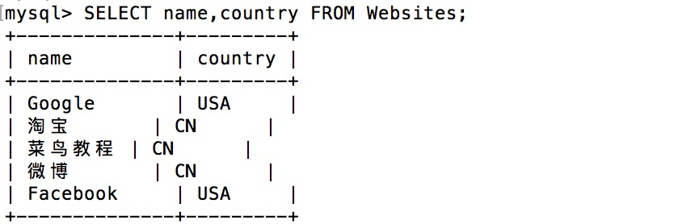
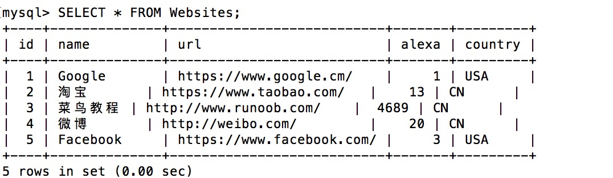
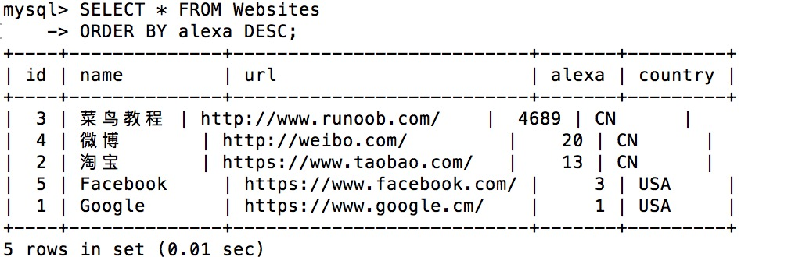
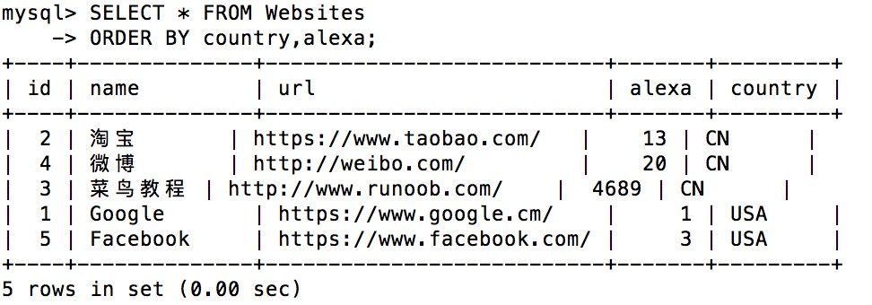
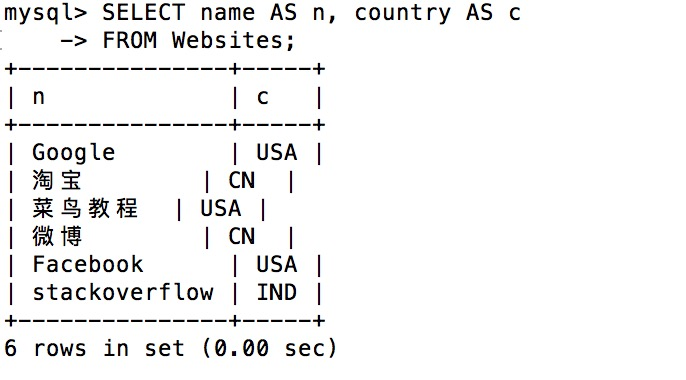
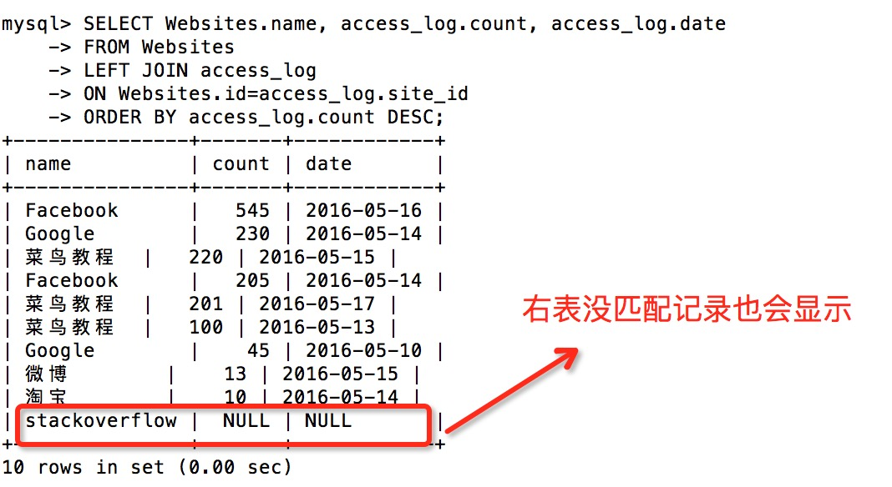

# SQL教程

SQL 是用于访问和处理数据库的标准的计算机语言。

在本教程中，您将学到如何使用 SQL 访问和处理数据系统中的数据，这类数据库包括：MySQL、SQL Server、Access、Oracle、Sybase、DB2 等等。


## 1、SQL简介

**SQL** (Structured Query Language:结构化查询语言) 是用于管理关系数据库管理系统（RDBMS）。 SQL 的范围包括数据插入、查询、更新和删除，数据库模式创建和修改，以及数据访问控制。

### 1.1 SQL是什么？

- SQL 指结构化查询语言，全称是 Structured Query Language。
- SQL 让您可以访问和处理数据库，包括数据插入、查询、更新和删除。
- SQL 在1986年成为 ANSI（American National Standards Institute 美国国家标准化组织）的一项标准，在 1987 年成为国际标准化组织（ISO）标准。

### 1.2 SQL 能做什么？

- SQL 面向数据库执行查询
- SQL 可从数据库取回数据
- SQL 可在数据库中插入新的记录
- SQL 可更新数据库中的数据
- SQL 可从数据库删除记录
- SQL 可创建新数据库
- SQL 可在数据库中创建新表
- SQL 可在数据库中创建存储过程
- SQL 可在数据库中创建视图
- SQL 可以设置表、存储过程和视图的权限

### 1.3 SQL 是一种标准

虽然 SQL 是一门 ANSI（American National Standards Institute 美国国家标准化组织）标准的计算机语言，但是仍然存在着多种不同版本的 SQL 语言。

然而，为了与 ANSI 标准相兼容，它们必须以相似的方式共同地来支持一些主要的命令（比如 SELECT、UPDATE、DELETE、INSERT、WHERE 等等）。

### 1.4 RDBMSD

RDBMS 指关系型数据库管理系统，全称 Relational Database Management System。

RDBMS 是 SQL 的基础，同样也是所有现代数据库系统的基础，比如 MS SQL Server、IBM DB2、Oracle、MySQL 以及 Microsoft Access。

RDBMS 中的数据存储在被称为表的数据库对象中。

表是相关的数据项的集合，它由列和行组成。


## 2、SQL语法

### 2.1 数据库表

一个数据库通常包含一个或多个表。每个表有一个名字标识（例如:"Websites"）,表包含带有数据的记录（行）。

在本教程中，我们在 MySQL 的 RUNOOB 数据库中创建了 Websites 表，用于存储网站记录。

我们可以通过以下命令查看 "Websites" 表的数据：

```mysql
mysql> use RUNOOB;
Database changed

mysql> set names utf8;
Query OK, 0 rows affected (0.00 sec)

mysql> SELECT * FROM Websites;
+----+--------------+---------------------------+-------+---------+
| id | name         | url                       | alexa | country |
+----+--------------+---------------------------+-------+---------+
| 1  | Google       | https://www.google.cm/    | 1     | USA     |
| 2  | 淘宝          | https://www.taobao.com/   | 13    | CN      |
| 3  | 菜鸟教程      | http://www.runoob.com/    | 4689  | CN      |
| 4  | 微博          | http://weibo.com/         | 20    | CN      |
| 5  | Facebook     | https://www.facebook.com/ | 3     | USA     |
+----+--------------+---------------------------+-------+---------+
5 rows in set (0.01 sec)
```

**解析**

- **use RUNOOB;** 命令用于选择数据库。
- **set names utf8;** 命令用于设置使用的字符集。
- **SELECT \* FROM Websites;** 读取数据表的信息。
- 上面的表包含五条记录（每一条对应一个网站信息）和5个列（id、name、url、alexa 和country）。


下面是 "access_log" 网站访问记录表的数据：

```mysql
mysql> SELECT * FROM access_log;
+-----+---------+-------+------------+
| aid | site_id | count | date       |
+-----+---------+-------+------------+
|   1 |       1 |    45 | 2016-05-10 |
|   2 |       3 |   100 | 2016-05-13 |
|   3 |       1 |   230 | 2016-05-14 |
|   4 |       2 |    10 | 2016-05-14 |
|   5 |       5 |   205 | 2016-05-14 |
|   6 |       4 |    13 | 2016-05-15 |
|   7 |       3 |   220 | 2016-05-15 |
|   8 |       5 |   545 | 2016-05-16 |
|   9 |       3 |   201 | 2016-05-17 |
+-----+---------+-------+------------+
9 rows in set (0.00 sec)
```


### 2.2 SQL 语句

您需要在数据库上执行的大部分工作都由 SQL 语句完成。

下面的 SQL 语句从 "Websites" 表中选取所有记录：

```mysql
SELECT * FROM Websites;
```

> SQL 对大小写不敏感：SELECT 与 select 是相同的。

#### SQL 语句后面的分号？

某些数据库系统要求在每条 SQL 语句的末端使用分号。

分号是在数据库系统中分隔每条 SQL 语句的标准方法，这样就可以在对服务器的相同请求中执行一条以上的 SQL 语句。

#### 一些最重要的 SQL 命令

- **SELECT** - 从数据库中提取数据
- **UPDATE** - 更新数据库中的数据
- **DELETE** - 从数据库中删除数据
- **INSERT INTO** - 向数据库中插入新数据
- **CREATE DATABASE** - 创建新数据库
- **ALTER DATABASE** - 修改数据库
- **CREATE TABLE** - 创建新表
- **ALTER TABLE** - 变更（改变）数据库表
- **DROP TABLE** - 删除表
- **CREATE INDEX** - 创建索引（搜索键）
- **DROP INDEX** - 删除索引


## 3、SELECT 语句

SELECT 语句用于从数据库中选取数据。

结果被存储在一个结果表中，称为结果集。

语法：

```mysql
SELECT column1, column2, ...
FROM table_name;
```

与

```mysql
SELECT * FROM table_name;
```

**参数说明：**

- **column1, column2, ...**：要选择的字段名称，可以为多个字段。如果不指定字段名称，则会选择所有字段。
- **table_name**：要查询的表名称。

实例：

```mysql
SELECT name,country FROM Websites;
```



```mysql
SELECT * FROM Websites;
```




## 4、SELECT DISTINCT 语句

SELECT DISTINCT 语句用于返回唯一不同的值。

在表中，一个列可能会包含多个重复值，有时您也许希望仅仅列出不同（distinct）的值。

DISTINCT 关键词用于返回唯一不同的值。

语法：

```mysql
SELECT DISTINCT column1, column2, ...
FROM table_name;
```

**参数说明：**

- **column1, column2, ...**：要选择的字段名称，可以为多个字段。如果不指定字段名称，则会选择所有字段。
- **table_name**：要查询的表名称。

实例：

```mysql
SELECT DISTINCT country FROM Websites;
```


## 5、WHERE 子句

WHERE 子句用于过滤记录。

WHERE 子句用于提取那些满足指定条件的记录。

语法：

```mysql
SELECT column1, column2, ...
FROM table_name
WHERE condition;
```

参数说明：

- **column1, column2, ...**：要选择的字段名称，可以为多个字段。如果不指定字段名称，则会选择所有字段。
- **table_name**：要查询的表名称。

实例：

```mysql
SELECT * FROM Websites WHERE country='CN';
```


**文本字段 vs. 数值字段**

SQL 使用单引号来环绕文本值（大部分数据库系统也接受双引号）。

在上个实例中 'CN' 文本字段使用了单引号。

如果是数值字段，请不要使用引号。

```mysql
SELECT * FROM Websites WHERE id=1;
```


==**WHERE 子句中的运算符**==

下面的运算符可以在 WHERE 子句中使用：

| 运算符  | 描述                                                       |
| :------ | :--------------------------------------------------------- |
| =       | 等于                                                       |
| <>      | 不等于。**注释：**在 SQL 的一些版本中，该操作符可被写成 != |
| >       | 大于                                                       |
| <       | 小于                                                       |
| >=      | 大于等于                                                   |
| <=      | 小于等于                                                   |
| BETWEEN | 在某个范围内                                               |
| LIKE    | 搜索某种模式                                               |
| IN      | 指定针对某个列的多个可能值                                 |


## 6、AND & OR 运算符

AND & OR 运算符用于基于一个以上的条件对记录进行过滤。

如果第一个条件和第二个条件都成立，则 AND 运算符显示一条记录。

如果第一个条件和第二个条件中只要有一个成立，则 OR 运算符显示一条记录。

实例：

```mysql
SELECT * FROM Websites
WHERE country='CN'
AND alexa > 50;
```


```mysql
SELECT * FROM Websites
WHERE country='USA'
OR country='CN';
```


```mysql
SELECT * FROM Websites
WHERE alexa > 15
AND (country='CN' OR country='USA');
```


## 7、ORDER BY 关键字

ORDER BY 关键字用于对结果集进行排序。

ORDER BY 关键字用于对结果集按照一个列或者多个列进行排序。

ORDER BY 关键字默认按照升序对记录进行排序。如果需要按照降序对记录进行排序，您可以使用 DESC 关键字。

```mysql
SELECT column1, column2, ...
FROM table_name
ORDER BY column1, column2, ... ASC|DESC;
```

- **column1, column2, ...**：要排序的字段名称，可以为多个字段。
- **ASC**：表示按升序排序。ascend
- **DESC**：表示按降序排序。descend

实例：

```mysql
SELECT * FROM Websites
ORDER BY alexa;
```


```mysql
SELECT * FROM Websites
ORDER BY alexa DESC;
```



根据多列排序：

```mysql
SELECT * FROM Websites
ORDER BY country,alexa;
```




## 8、INSERT INTO 语句

INSERT INTO 语句用于向表中插入新记录。

INSERT INTO 语句可以有两种编写形式。

第一种形式无需指定要插入数据的列名，只需提供被插入的值即可：

```mysql
INSERT INTO table_name
VALUES (value1,value2,value3,...);
```

第二种形式需要指定列名及被插入的值：

```mysql
INSERT INTO table_name (column1,column2,column3,...)
VALUES (value1,value2,value3,...);
```

**参数说明：**

- **table_name**：需要插入新记录的表名。
- **column1, column2, ...**：需要插入的字段名。
- **value1, value2, ...**：需要插入的字段值。

实例：

```mysql
INSERT INTO Websites (name, url, alexa, country)
VALUES ('百度','https://www.baidu.com/','4','CN');

INSERT INTO Websites (name, url, country)
VALUES ('stackoverflow', 'http://stackoverflow.com/', 'IND');
```


## 9、UPDATE 语句

UPDATE 语句用于更新表中已存在的记录。

语法：

```mysql
UPDATE table_name
SET column1 = value1, column2 = value2, ...
WHERE condition;
```

参数说明：

- **table_name**：要修改的表名称。
- **column1, column2, ...**：要修改的字段名称，可以为多个字段。
- **value1, value2, ...**：要修改的值，可以为多个值。
- **condition**：修改条件，用于指定哪些数据要修改。

> **请注意 SQL UPDATE 语句中的 WHERE 子句！**
> WHERE 子句规定哪条记录或者哪些记录需要更新。如果您省略了 WHERE 子句，所有的记录都将被更新！

实例：

```mysql
UPDATE Websites 
SET alexa='5000', country='USA' 
WHERE name='菜鸟教程';
```

**Update 警告！**

在更新记录时要格外小心！在上面的实例中，如果我们省略了 WHERE 子句，如下所示：

```mysql
UPDATE Websites
SET alexa='5000', country='USA'
```

执行以上代码会将 Websites 表中所有数据的 alexa 改为 5000，country 改为 USA。

执行没有 WHERE 子句的 UPDATE 要慎重，再慎重。


## 10、DELETE语句

DELETE 语句用于删除表中的行。

语法：

```mysql
DELETE FROM table_name
WHERE condition;
```

参数说明：

- **table_name**：要删除的表名称。
- **condition**：删除条件，用于指定哪些数据要删除。

> **请注意 SQL DELETE 语句中的 WHERE 子句！** 
> WHERE 子句规定哪条记录或者哪些记录需要删除。如果您省略了 WHERE 子句，所有的记录都将被删除！

实例：

```mysql
DELETE FROM Websites
WHERE name='Facebook' AND country='USA';
```

**删除所有数据**

您可以在不删除表的情况下，删除表中所有的行。这意味着表结构、属性、索引将保持不变：

```mysql
DELETE FROM table_name;
```

**注释：**在删除记录时要格外小心！因为您不能重来！


## 11、SELECT TOP，LIMIT，ROWNUM 子句

### SELECT TOP 子句

SELECT TOP 子句用于规定要返回的记录的数目。

SELECT TOP 子句对于拥有数千条记录的大型表来说，是非常有用的。

> **注意:** *并非所有的数据库系统都支持 SELECT TOP 语句。 MySQL 支持 LIMIT 语句来选取指定的条数数据， Oracle 可以使用 ROWNUM 来选取。*

### SQL Server / MS Access 语法

```mysql
SELECT TOP number|percent column_name(s)
FROM table_name;
```

### MySQL 语法

```mysql
SELECT column_name(s)
FROM table_name
LIMIT number;
```

### Oracle 语法

```mysql
SELECT column_name(s)
FROM table_name
WHERE ROWNUM <= number;
```

**SELECT TOP PERCENT 实例**

在 Microsoft SQL Server 中还可以使用百分比作为参数。

下面的 SQL 语句从 websites 表中选取前面百分之 50 的记录：

```mysql
SELECT TOP 50 PERCENT * FROM Websites;
```


## 12、LIKE 操作符

LIKE 操作符用于在 WHERE 子句中搜索列中的指定模式。

语法：

```mysql
SELECT column1, column2, ...
FROM table_name
WHERE column LIKE pattern;
```

参数说明：

- **column1, column2, ...**：要选择的字段名称，可以为多个字段。如果不指定字段名称，则会选择所有字段。
- **table_name**：要查询的表名称。
- **column**：要搜索的字段名称。
- **pattern**：搜索模式。

实例：

```mysql
SELECT * FROM Websites
WHERE name LIKE 'G%';
```


**提示：**"%" 符号用于在模式的前后定义通配符（默认字母）。

下面的 SQL 语句选取 name 以字母 "k" 结尾的所有客户：

```mysql
SELECT * FROM Websites
WHERE name LIKE '%k';
```

下面的 SQL 语句选取 name 包含模式 "oo" 的所有客户：

```mysql
SELECT * FROM Websites
WHERE name LIKE '%oo%';
```


通过使用 NOT 关键字，您可以选取不匹配模式的记录。

```mysql
SELECT * FROM Websites
WHERE name NOT LIKE '%oo%';
```


## 13、通配符

通配符可用于替代字符串中的任何其他字符。

**在 SQL 中，通配符与 SQL LIKE 操作符一起使用。**

SQL 通配符用于搜索表中的数据。

在 SQL 中，可使用以下通配符：

| 通配符                         | 描述                       |
| :----------------------------- | :------------------------- |
| %                              | 替代 0 个或多个字符        |
| _                              | 替代一个字符               |
| [*charlist*]                   | 字符列中的任何单一字符     |
| [^*charlist*] 或 [!*charlist*] | 不在字符列中的任何单一字符 |

实例：

```mysql
SELECT * FROM Websites
WHERE url LIKE 'https%';

SELECT * FROM Websites
WHERE url LIKE '%oo%';

SELECT * FROM Websites
WHERE name LIKE '_oogle';

SELECT * FROM Websites
WHERE name LIKE 'G_o_le';
```

### 使用 SQL [charlist] 通配符

MySQL 中使用 **REGEXP** 或 **NOT REGEXP** 运算符 (或 RLIKE 和 NOT RLIKE) 来操作正则表达式。

下面的 SQL 语句选取 name 以 "G"、"F" 或 "s" 开始的所有网站：

```mysql
SELECT * FROM Websites
WHERE name REGEXP '^[GFs]';
```

下面的 SQL 语句选取 name 以 A 到 H 字母开头的网站：

```mysql
SELECT * FROM Websites
WHERE name REGEXP '^[A-H]';
```


## 14、IN 操作符

IN 操作符允许您在 WHERE 子句中规定多个值。

语法：

```mysql
SELECT column1, column2, ...
FROM table_name
WHERE column IN (value1, value2, ...);
```

参数说明：

- **column1, column2, ...**：要选择的字段名称，可以为多个字段。如果不指定字段名称，则会选择所有字段。
- **table_name**：要查询的表名称。
- **column**：要查询的字段名称。
- **value1, value2, ...**：要查询的值，可以为多个值。

实例：

```mysql
SELECT * FROM Websites
WHERE name IN ('Google','菜鸟教程');
```


## 15、BETWEEN 操作符

BETWEEN 操作符选取介于两个值之间的数据范围内的值。这些值可以是数值、文本或者日期。

语法：

```mysql
SELECT column1, column2, ...
FROM table_name
WHERE column BETWEEN value1 AND value2;
```

参数说明：

- column1, column2, ...：要选择的字段名称，可以为多个字段。如果不指定字段名称，则会选择所有字段。
- table_name：要查询的表名称。
- column：要查询的字段名称。
- value1：范围的起始值。
- value2：范围的结束值。

实例：

```mysql
SELECT * FROM Websites
WHERE alexa BETWEEN 1 AND 20;

SELECT * FROM Websites
WHERE alexa NOT BETWEEN 1 AND 20;

# 带有 IN 的 BETWEEN 操作符实例
SELECT * FROM Websites
WHERE (alexa BETWEEN 1 AND 20)
AND country NOT IN ('USA', 'IND');

# 带有文本值的 BETWEEN 操作符实例
SELECT * FROM Websites
WHERE name BETWEEN 'A' AND 'H';

# 带有文本值的 NOT BETWEEN 操作符实例
SELECT * FROM Websites
WHERE name NOT BETWEEN 'A' AND 'H';

# 带有日期值的 BETWEEN 操作符实例
SELECT * FROM access_log
WHERE date BETWEEN '2016-05-10' AND '2016-05-14';


```

> **请注意，在不同的数据库中，BETWEEN 操作符会产生不同的结果！**
>
> 在某些数据库中，BETWEEN 选取介于两个值之间但不包括两个测试值的字段。
> 在某些数据库中，BETWEEN 选取介于两个值之间且包括两个测试值的字段。
> 在某些数据库中，BETWEEN 选取介于两个值之间且包括第一个测试值但不包括最后一个测试值的字段。
>
> **因此，请检查您的数据库是如何处理 BETWEEN 操作符！**


## 16、别名

通过使用 SQL，可以为表名称或列名称指定别名。

基本上，创建别名是为了让列名称的可读性更强。

### 列的 SQL 别名语法

```mysql
SELECT column_name AS alias_name
FROM table_name;
```

### 表的 SQL 别名语法

```mysql
SELECT column_name(s)
FROM table_name AS alias_name;
```

列的别名实例：

```mysql
SELECT name AS n, country AS c
FROM Websites;
```

**提示：**如果列名称包含空格，要求使用双引号或方括号：



在下面的 SQL 语句中，我们把三个列（url、alexa 和 country）结合在一起，并创建一个名为 "site_info" 的别名：

```mysql
SELECT name, CONCAT(url, ', ', alexa, ', ', country) AS site_info
FROM Websites;
```


表的别名实例：

```mysql
SELECT w.name, w.url, a.count, a.date
FROM Websites AS w, access_log AS a
WHERE a.site_id=w.id and w.name="菜鸟教程";
```

在下面的情况下，使用别名很有用：

- 在查询中涉及超过一个表
- 在查询中使用了函数
- 列名称很长或者可读性差
- 需要把两个列或者多个列结合在一起


## 17、连接(JOIN)

SQL join 用于把来自两个或多个表的行结合起来。

下图展示了 LEFT JOIN、RIGHT JOIN、INNER JOIN、OUTER JOIN 相关的 7 种用法。


> **A inner join B** 取交集。
>
> **A left join B** 取 A 全部，B 没有对应的值为 null。
>
> **A right join B** 取 B 全部 A 没有对应的值为 null。
>
> **A full outer join B** 取并集，彼此没有对应的值为 null。
>
> 对应条件在 **on** 后面填写。

最常见的 JOIN 类型：**SQL INNER JOIN（简单的 JOIN）**。 SQL INNER JOIN 从多个表中返回满足 JOIN 条件的所有行。

语法：

```mysql
SELECT column1, column2, ...
FROM table1
JOIN table2 ON condition;
```

**参数说明：**

- **column1, column2, ...**：要选择的字段名称，可以为多个字段。如果不指定字段名称，则会选择所有字段。
- **table1**：要连接的第一个表。
- **table2**：要连接的第二个表。
- **condition**：连接条件，用于指定连接方式。

实例：

```mysql
SELECT Websites.id, Websites.name, access_log.count, access_log.date
FROM Websites
INNER JOIN access_log
ON Websites.id=access_log.site_id;
```

### 不同的 SQL JOIN

在我们继续讲解实例之前，我们先列出您可以使用的不同的 SQL JOIN 类型：

- **INNER JOIN**：如果表中有至少一个匹配，则返回行
- **LEFT JOIN**：即使右表中没有匹配，也从左表返回所有的行
- **RIGHT JOIN**：即使左表中没有匹配，也从右表返回所有的行
- **FULL JOIN**：只要其中一个表中存在匹配，则返回行


### INNER JOIN 关键字

INNER JOIN 关键字在表中存在至少一个匹配时返回行。

语法：

```mysql
SELECT column_name(s)
FROM table1
INNER JOIN table2
ON table1.column_name=table2.column_name;
```

或：

```mysql
SELECT column_name(s)
FROM table1
JOIN table2
ON table1.column_name=table2.column_name;
```

**参数说明：**

- columns：要显示的列名。
- table1：表1的名称。
- table2：表2的名称。
- column_name：表中用于连接的列名。

**注释：**INNER JOIN 与 JOIN 是相同的。


实例：

```mysql
SELECT Websites.name, access_log.count, access_log.date
FROM Websites
INNER JOIN access_log
ON Websites.id=access_log.site_id
ORDER BY access_log.count;
```


### LEFT JOIN 关键字

LEFT JOIN 关键字从左表（table1）返回所有的行，即使右表（table2）中没有匹配。如果右表中没有匹配，则结果为 NULL。

语法：

```mysql
SELECT column_name(s)
FROM table1
LEFT JOIN table2
ON table1.column_name=table2.column_name;
```

或：

```mysql
SELECT column_name(s)
FROM table1
LEFT OUTER JOIN table2
ON table1.column_name=table2.column_name;
```

**注释：**在某些数据库中，LEFT JOIN 称为 LEFT OUTER JOIN。


实例：

```mysql
SELECT Websites.name, access_log.count, access_log.date
FROM Websites
LEFT JOIN access_log
ON Websites.id=access_log.site_id
ORDER BY access_log.count DESC;
```



**注释：**LEFT JOIN 关键字从左表（Websites）返回所有的行，即使右表（access_log）中没有匹配。


### RIGHT JOIN 关键字

RIGHT JOIN 关键字从右表（table2）返回所有的行，即使左表（table1）中没有匹配。如果左表中没有匹配，则结果为 NULL。

语法：

```mysql
SELECT column_name(s)
FROM table1
RIGHT JOIN table2
ON table1.column_name=table2.column_name;
```

或

```mysql
SELECT column_name(s)
FROM table1
RIGHT OUTER JOIN table2
ON table1.column_name=table2.column_name;
```

**注释：**在某些数据库中，RIGHT JOIN 称为 RIGHT OUTER JOIN。


实例：

```mysql
SELECT websites.name, access_log.count, access_log.date
FROM websites
RIGHT JOIN access_log
ON access_log.site_id=websites.id
ORDER BY access_log.count DESC;
```


**注释：**RIGHT JOIN 关键字从右表（access_log）返回所有的行，即使左表（Websites）中没有匹配。


### FULL OUTER JOIN 关键字

FULL OUTER JOIN 关键字只要左表（table1）和右表（table2）其中一个表中存在匹配，则返回行.

**FULL OUTER JOIN 关键字结合了 LEFT JOIN 和 RIGHT JOIN 的结果。**

语法：

```mysql
SELECT column_name(s)
FROM table1
FULL OUTER JOIN table2
ON table1.column_name=table2.column_name;
```

实例：

MySQL中不支持 FULL OUTER JOIN，你可以在 SQL Server 测试以下实例。

```mysql
SELECT Websites.name, access_log.count, access_log.date
FROM Websites
FULL OUTER JOIN access_log
ON Websites.id=access_log.site_id
ORDER BY access_log.count DESC;
```

**注释：**FULL OUTER JOIN 关键字返回左表（Websites）和右表（access_log）中所有的行。如果 "Websites" 表中的行在 "access_log" 中没有匹配或者 "access_log" 表中的行在 "Websites" 表中没有匹配，也会列出这些行。


## 18、UNION 操作符

UNION 操作符用于合并两个或多个 SELECT 语句的结果集。

- 请注意，UNION 内部的每个 SELECT 语句必须拥有**相同数量的列**。

- 列也必须拥有**相似的数据类型**。

- 同时，每个 SELECT 语句中的列的**顺序必须相同**。

语法：

```mysql
SELECT column_name(s) FROM table1
UNION
SELECT column_name(s) FROM table2;
```

**注释：**默认地，UNION 操作符选取不同的值。**如果允许重复的值，请使用 UNION ALL。**

或

```mysql
SELECT column_name(s) FROM table1
UNION ALL
SELECT column_name(s) FROM table2;
```

**注释：**UNION 结果集中的列名总是等于 UNION 中第一个 SELECT 语句中的列名。


实例：

```mysql
SELECT country FROM Websites
UNION
SELECT country FROM apps
ORDER BY country;
```

**注释：**UNION 不能用于列出两个表中所有的country。UNION 只会选取不同的值。请使用 UNION ALL 来选取重复的值！

```mysql
SELECT country FROM Websites
UNION ALL
SELECT country FROM apps
ORDER BY country;
```

带有 WHERE 的 SQL UNION ALL

```mysql
SELECT country, name FROM Websites
WHERE country='CN'
UNION ALL
SELECT country, app_name FROM apps
WHERE country='CN'
ORDER BY country;
```


## 19、SELECT INTO 语句

通过 SQL，您可以从一个表复制信息到另一个表。

SELECT INTO 语句从一个表复制数据，然后把数据插入到另一个新表中。

> **注意：**
>
> MySQL 数据库不支持 SELECT ... INTO 语句，但支持 [INSERT INTO ... SELECT](https://www.runoob.com/sql/sql-insert-into-select.html) 。
>
> 当然你可以使用以下语句来拷贝表结构及数据：
>
> ```mysql
> CREATE TABLE 新表
> AS
> SELECT * FROM 旧表 
> ```

语法：

我们可以复制所有的列插入到新表中：

```mysql
SELECT *
INTO newtable [IN externaldb]
FROM table1;
```

或者只复制希望的列插入到新表中：

```mysql
SELECT column_name(s)
INTO newtable [IN externaldb]
FROM table1;
```

**提示：**新表将会使用 SELECT 语句中定义的列名称和类型进行创建。您可以使用 AS 子句来应用新名称。

实例：

```mysql
SELECT *
INTO WebsitesBackup2016
FROM Websites;
```

**提示：**SELECT INTO 语句可用于通过另一种模式创建一个新的空表。只需要添加促使查询没有数据返回的 WHERE 子句即可：

```mysql
SELECT *
INTO newtable
FROM table1
WHERE 1=0;
```


## 20、INSERT INTO SELECT 语句

INSERT INTO SELECT 语句从一个表复制数据，然后把数据插入到一个已存在的表中。目标表中任何已存在的行都不会受影响。

语法：

我们可以从一个表中复制所有的列插入到另一个已存在的表中：

```mysql
INSERT INTO table2
SELECT * FROM table1;
```

或者我们可以只复制指定的列插入到另一个已存在的表中：

```mysql
INSERT INTO table2
(column_name(s))
SELECT column_name(s)
FROM table1;
```

实例：

```mysql
INSERT INTO Websites (name, country)
SELECT app_name, country FROM apps;
```

**select into from 和 insert into select 都是用来复制表**

两者的主要区别为： **select into from** 要求目标表不存在，因为在插入时会自动创建；**insert into select from** 要求目标表存在。


## 21、CREATE DATABASE 语句

CREATE DATABASE 语句用于创建数据库。

语法：

```mysql
CREATE DATABASE dbname;
```

实例：

```mysql
CREATE DATABASE my_db;
```


## 22、CREATE TABLE 语句

CREATE TABLE 语句用于创建数据库中的表。

表由行和列组成，每个表都必须有个表名。

语法：

```mysql
CREATE TABLE table_name
(
column_name1 data_type(size),
column_name2 data_type(size),
column_name3 data_type(size),
....
);
```

- column_name 参数规定表中列的名称。

- data_type 参数规定列的数据类型（例如 varchar、integer、decimal、date 等等）。

- size 参数规定表中列的最大长度。

实例：

现在我们想要创建一个名为 "Persons" 的表，包含五列：PersonID、LastName、FirstName、Address 和 City。

```mysql
CREATE TABLE Persons
(
PersonID int,
LastName varchar(255),
FirstName varchar(255),
Address varchar(255),
City varchar(255)
);
```

PersonID 列的数据类型是 int，包含整数。

LastName、FirstName、Address 和 City 列的数据类型是 varchar，包含字符，且这些字段的最大长度为 255 个字符。

空的 "Persons" 表如下所示：

| PersonID | LastName | FirstName | Address | City |
| :------- | :------- | :-------- | :------ | :--- |
|          |          |           |         |      |

**提示：**可使用 INSERT INTO 语句向空表写入数据。


## 23、约束（Constraints）

SQL 约束用于规定表中的数据规则。

如果存在违反约束的数据行为，行为会被约束终止。

约束可以在创建表时规定（通过 CREATE TABLE 语句），或者在表创建之后规定（通过 ALTER TABLE 语句）。

**SQL CREATE TABLE + CONSTRAINT 语法**：

```mysql
CREATE TABLE table_name
(
column_name1 data_type(size) constraint_name,
column_name2 data_type(size) constraint_name,
column_name3 data_type(size) constraint_name,
....
);
```

在 SQL 中，我们有如下约束：

- **NOT NULL** - 指示某列不能存储 NULL 值。
- **UNIQUE** - 保证某列的每行必须有唯一的值。
- **PRIMARY KEY** - NOT NULL 和 UNIQUE 的结合。确保某列（或两个列多个列的结合）有唯一标识，有助于更容易更快速地找到表中的一个特定的记录。
- **FOREIGN KEY** - 保证一个表中的数据匹配另一个表中的值的参照完整性。
- **CHECK** - 保证列中的值符合指定的条件。
- **DEFAULT** - 规定没有给列赋值时的默认值。

### 23.1 NOT NULL 约束

在默认的情况下，表的列接受 NULL 值。

NOT NULL 约束强制列不接受 NULL 值。

NOT NULL 约束强制字段始终包含值。这意味着，如果不向字段添加值，就无法插入新记录或者更新记录。

实例：

```mysql
CREATE TABLE Persons (
    ID int NOT NULL,
    LastName varchar(255) NOT NULL,
    FirstName varchar(255) NOT NULL,
    Age int
);
```

#### 添加 NOT NULL 约束

在一个已创建的表的 "Age" 字段中添加 NOT NULL 约束如下所示：

```mysql
ALTER TABLE Persons
MODIFY Age int NOT NULL;
```

#### 删除 NOT NULL 约束

在一个已创建的表的 "Age" 字段中删除 NOT NULL 约束如下所示：

```mysql
ALTER TABLE Persons
MODIFY Age int NULL;
```

### 23.2 UNIQUE 约束

UNIQUE 约束唯一标识数据库表中的每条记录。

UNIQUE 和 PRIMARY KEY 约束均为列或列集合提供了**唯一性**的保证。

PRIMARY KEY 约束拥有自动定义的 UNIQUE 约束。

**请注意，每个表可以有多个 UNIQUE 约束，但是每个表只能有一个 PRIMARY KEY 约束。**

语法：
**MySQL：**

```mysql
CREATE TABLE Persons
(
P_Id int NOT NULL,
LastName varchar(255) NOT NULL,
FirstName varchar(255),
Address varchar(255),
City varchar(255),
UNIQUE (P_Id)
)
```

**SQL Server / Oracle / MS Access：**

```mysql
CREATE TABLE Persons
(
P_Id int NOT NULL UNIQUE,
LastName varchar(255) NOT NULL,
FirstName varchar(255),
Address varchar(255),
City varchar(255)
)
```

如需命名 UNIQUE 约束，并定义多个列的 UNIQUE 约束，请使用下面的 SQL 语法：

**MySQL / SQL Server / Oracle / MS Access：**

```mysql
CREATE TABLE Persons
(
P_Id int NOT NULL,
LastName varchar(255) NOT NULL,
FirstName varchar(255),
Address varchar(255),
City varchar(255),
CONSTRAINT uc_PersonID UNIQUE (P_Id,LastName)
)
```

#### 添加 UNIQUE 约束

当表已被创建时，如需在 "P_Id" 列创建 UNIQUE 约束，请使用下面的 SQL：

```mysql
ALTER TABLE Persons
ADD UNIQUE (P_Id)
```

如需命名 UNIQUE 约束，并定义多个列的 UNIQUE 约束，请使用下面的 SQL 语法：

```mysql
ALTER TABLE Persons
ADD CONSTRAINT uc_PersonID UNIQUE (P_Id,LastName)
```

#### 撤销 UNIQUE 约束

如需撤销 UNIQUE 约束，请使用下面的 SQL：

**MySQL：**

```mysql
ALTER TABLE Persons
DROP INDEX uc_PersonID
```

**SQL Server / Oracle / MS Access：**

```mysql
ALTER TABLE Persons
DROP CONSTRAINT uc_PersonID
```

### 23.3 PRIMARY KEY 约束

PRIMARY KEY 约束唯一标识数据库表中的每条记录。

主键必须包含唯一的值。

主键列不能包含 NULL 值。

**每个表都应该有一个主键，并且每个表只能有一个主键。**

语法：

**MySQL：**

```mysql
CREATE TABLE Persons
(
P_Id int NOT NULL,
LastName varchar(255) NOT NULL,
FirstName varchar(255),
Address varchar(255),
City varchar(255),
PRIMARY KEY (P_Id)
)
```

**SQL Server / Oracle / MS Access：**

````mysql
CREATE TABLE Persons
(
P_Id int NOT NULL PRIMARY KEY,
LastName varchar(255) NOT NULL,
FirstName varchar(255),
Address varchar(255),
City varchar(255)
)
````

如需命名 PRIMARY KEY 约束，并定义多个列的 PRIMARY KEY 约束，请使用下面的 SQL 语法：

**MySQL / SQL Server / Oracle / MS Access：**

```mysql
CREATE TABLE Persons
(
P_Id int NOT NULL,
LastName varchar(255) NOT NULL,
FirstName varchar(255),
Address varchar(255),
City varchar(255),
CONSTRAINT pk_PersonID PRIMARY KEY (P_Id,LastName)
)
```

**注释：**在上面的实例中，只有一个主键 PRIMARY KEY（pk_PersonID）。然而，pk_PersonID 的值是由两个列（P_Id 和 LastName）组成的。

#### 添加 PRIMARY KEY 约束

```mysql
ALTER TABLE Persons
ADD PRIMARY KEY (P_Id)
```

如需命名 PRIMARY KEY 约束，并定义多个列的 PRIMARY KEY 约束，请使用下面的 SQL 语法：

```mysql
ALTER TABLE Persons
ADD CONSTRAINT pk_PersonID PRIMARY KEY (P_Id,LastName)
```

#### 撤销 PRIMARY KEY 约束

**MySQL：**

```mysql
ALTER TABLE Persons
DROP PRIMARY KEY
```

**SQL Server / Oracle / MS Access：**

```mysql
ALTER TABLE Persons
DROP CONSTRAINT pk_PersonID
```

### 23.4 FOREIGN KEY 约束

一个表中的 FOREIGN KEY 指向另一个表中的 UNIQUE KEY(唯一约束的键)。

让我们通过一个实例来解释外键。请看下面两个表：

"Persons" 表：

| P_Id | LastName  | FirstName | Address      | City      |
| :--- | :-------- | :-------- | :----------- | :-------- |
| 1    | Hansen    | Ola       | Timoteivn 10 | Sandnes   |
| 2    | Svendson  | Tove      | Borgvn 23    | Sandnes   |
| 3    | Pettersen | Kari      | Storgt 20    | Stavanger |

"Orders" 表：

| O_Id | OrderNo | P_Id |
| :--- | :------ | :--- |
| 1    | 77895   | 3    |
| 2    | 44678   | 3    |
| 3    | 22456   | 2    |
| 4    | 24562   | 1    |

请注意，"Orders" 表中的 "P_Id" 列指向 "Persons" 表中的 "P_Id" 列。

"Persons" 表中的 "P_Id" 列是 "Persons" 表中的 PRIMARY KEY。

"Orders" 表中的 "P_Id" 列是 "Orders" 表中的 FOREIGN KEY。

FOREIGN KEY 约束用于预防破坏表之间连接的行为。

FOREIGN KEY 约束也能防止非法数据插入外键列，因为它必须是它指向的那个表中的值之一。

语法：

**MySQL：**

```mysql
CREATE TABLE Orders
(
O_Id int NOT NULL,
OrderNo int NOT NULL,
P_Id int,
PRIMARY KEY (O_Id),
FOREIGN KEY (P_Id) REFERENCES Persons(P_Id)
)
```

**SQL Server / Oracle / MS Access：**

```mysql
CREATE TABLE Orders
(
O_Id int NOT NULL PRIMARY KEY,
OrderNo int NOT NULL,
P_Id int FOREIGN KEY REFERENCES Persons(P_Id)
)
```

如需命名 FOREIGN KEY 约束，并定义多个列的 FOREIGN KEY 约束，请使用下面的 SQL 语法：

**MySQL / SQL Server / Oracle / MS Access：**

```mysql
CREATE TABLE Orders
(
O_Id int NOT NULL,
OrderNo int NOT NULL,
P_Id int,
PRIMARY KEY (O_Id),
CONSTRAINT fk_PerOrders FOREIGN KEY (P_Id)
REFERENCES Persons(P_Id)
)
```

#### 添加 FOREIGN KEY 约束

```mysql
ALTER TABLE Orders
ADD FOREIGN KEY (P_Id)
REFERENCES Persons(P_Id)
```

如需命名 FOREIGN KEY 约束，并定义多个列的 FOREIGN KEY 约束，请使用下面的 SQL 语法：

```mysql
ALTER TABLE Orders
ADD CONSTRAINT fk_PerOrders
FOREIGN KEY (P_Id)
REFERENCES Persons(P_Id)
```

#### 撤销 FOREIGN KEY 约束

**MySQL：**

```mysql
ALTER TABLE Orders
DROP FOREIGN KEY fk_PerOrders
```

**SQL Server / Oracle / MS Access：**

```mysql
ALTER TABLE Orders
DROP CONSTRAINT fk_PerOrders
```

### 23.5 CHECK 约束

CHECK 约束用于限制列中的值的范围。

如果对单个列定义 CHECK 约束，那么该列只允许特定的值。

如果对一个表定义 CHECK 约束，那么此约束会基于行中其他列的值在特定的列中对值进行限制。

语法：

**MySQL：**

```mysql
CREATE TABLE Persons
(
P_Id int NOT NULL,
LastName varchar(255) NOT NULL,
FirstName varchar(255),
Address varchar(255),
City varchar(255),
CHECK (P_Id>0)
)
```

**SQL Server / Oracle / MS Access：**

```mysql
CREATE TABLE Persons
(
P_Id int NOT NULL CHECK (P_Id>0),
LastName varchar(255) NOT NULL,
FirstName varchar(255),
Address varchar(255),
City varchar(255)
)
```

如需命名 CHECK 约束，并定义多个列的 CHECK 约束，请使用下面的 SQL 语法：

**MySQL / SQL Server / Oracle / MS Access：**

```mysql
CREATE TABLE Persons
(
P_Id int NOT NULL,
LastName varchar(255) NOT NULL,
FirstName varchar(255),
Address varchar(255),
City varchar(255),
CONSTRAINT chk_Person CHECK (P_Id>0 AND City='Sandnes')
)
```

#### 添加 CHECK 约束

```mysql
ALTER TABLE Persons
ADD CHECK (P_Id>0)
```

如需命名 CHECK 约束，并定义多个列的 CHECK 约束，请使用下面的 SQL 语法：

```mysql
ALTER TABLE Persons
ADD CONSTRAINT chk_Person CHECK (P_Id>0 AND City='Sandnes')
```

#### 撤销 CHECK 约束

**SQL Server / Oracle / MS Access：**

```mysql
ALTER TABLE Persons
DROP CONSTRAINT chk_Person
```

**MySQL：**

```mysql
ALTER TABLE Persons
DROP CHECK chk_Person
```

### 23.6 DEFAULT 约束

DEFAULT 约束用于向列中插入默认值。

如果没有规定其他的值，那么会将默认值添加到所有的新记录。

语法：

```mysql
CREATE TABLE Persons
(
    P_Id int NOT NULL,
    LastName varchar(255) NOT NULL,
    FirstName varchar(255),
    Address varchar(255),
    City varchar(255) DEFAULT 'Sandnes'
)
```

通过使用类似 GETDATE() 这样的函数，DEFAULT 约束也可以用于插入系统值：

```mysql
CREATE TABLE Orders
(
    O_Id int NOT NULL,
    OrderNo int NOT NULL,
    P_Id int,
    OrderDate date DEFAULT GETDATE()
)
```

#### 添加 DEFAULT 约束

**MySQL：**

```mysql
ALTER TABLE Persons
ALTER City SET DEFAULT 'SANDNES'
```

**SQL Server / MS Access：**

```mysql
ALTER TABLE Persons
ADD CONSTRAINT ab_c DEFAULT 'SANDNES' for City
```

**Oracle：**

```mysql
ALTER TABLE Persons
MODIFY City DEFAULT 'SANDNES'
```

#### 撤销 DEFAULT 约束

**MySQL：**

```mysql
ALTER TABLE Persons
ALTER City DROP DEFAULT
```

**SQL Server / Oracle / MS Access：**

```mysql
ALTER TABLE Persons
ALTER COLUMN City DROP DEFAULT
```


## 24、CREATE INDEX 语句

CREATE INDEX 语句用于在表中创建索引。

在不读取整个表的情况下，索引使数据库应用程序可以更快地查找数据。

用户无法看到索引，它们只能被用来加速搜索/查询。

**注释：**更新一个包含索引的表需要比更新一个没有索引的表花费更多的时间，这是由于索引本身也需要更新。因此，理想的做法是仅仅在常常被搜索的列（以及表）上面创建索引。

语法：

在表上创建一个简单的索引。允许使用重复的值：

```mysql
CREATE INDEX index_name
ON table_name (column_name)
```

在表上创建一个唯一的索引。不允许使用重复的值：唯一的索引意味着两个行不能拥有相同的索引值。

```mysql
CREATE UNIQUE INDEX index_name
ON table_name (column_name)
```

实例：

```mysql
CREATE INDEX PIndex
ON Persons (LastName)
```

```mysql
CREATE INDEX PIndex
ON Persons (LastName, FirstName)
```


## 25、撤销索引、撤销表以及撤销数据库

通过使用 DROP 语句，可以轻松地删除索引、表和数据库。

### 25.1 DROP INDEX 语句

用于 MySQL 的 DROP INDEX 语法：

```mysql
ALTER TABLE table_name DROP INDEX index_name
```

### 25.2 DROP TABLE 语句

DROP TABLE 语句用于删除表。

```mysql
DROP TABLE table_name
```

### 25.3 DROP DATABASE 语句

DROP DATABASE 语句用于删除数据库。

```mysql
DROP DATABASE database_name
```

### 25.4 TRUNCATE TABLE 语句

如果我们仅仅需要删除表内的数据，但并不删除表本身，那么我们该如何做呢？

请使用 TRUNCATE TABLE 语句：

```mysql
TRUNCATE TABLE table_name
```


## 26、ALTER TABLE 语句

ALTER TABLE 语句用于在已有的表中添加、删除或修改列。

语法：

如需在表中添加列，请使用下面的语法:

```mysql
ALTER TABLE table_name
ADD column_name datatype
```

如需删除表中的列，请使用下面的语法（请注意，某些数据库系统不允许这种在数据库表中删除列的方式）：

```mysql
ALTER TABLE table_name
DROP COLUMN column_name
```

要改变表中列的数据类型，请使用下面的语法：

**SQL Server / MS Access：**

```mysql
ALTER TABLE table_name
ALTER COLUMN column_name datatype
```

**My SQL / Oracle：**

```mysql
ALTER TABLE table_name
MODIFY COLUMN column_name datatype
```


## 27、AUTO INCREMENT 字段

Auto-increment 会在新记录插入表中时生成一个唯一的数字。

我们通常希望在每次插入新记录时，自动地创建主键字段的值。

我们可以在表中创建一个 auto-increment 字段。

语法：

```mysql
CREATE TABLE Persons
(
ID int NOT NULL AUTO_INCREMENT,
LastName varchar(255) NOT NULL,
FirstName varchar(255),
Address varchar(255),
City varchar(255),
PRIMARY KEY (ID)
)
```

默认地，AUTO_INCREMENT 的开始值是 1，每条新记录递增 1。

要让 AUTO_INCREMENT 序列以其他的值起始，请使用下面的 SQL 语法：

```mysql
ALTER TABLE Persons AUTO_INCREMENT=100
```


## 28、视图（Views）

视图是可视化的表。

### 28.1 CREATE VIEW 语句

在 SQL 中，视图是基于 SQL 语句的结果集的可视化的表。

视图包含行和列，就像一个真实的表。视图中的字段就是来自一个或多个数据库中的真实的表中的字段。

您可以向视图添加 SQL 函数、WHERE 以及 JOIN 语句，也可以呈现数据，就像这些数据来自于某个单一的表一样。


