# 1、Math

- 是一个帮助我们用于进行数学计算的工具类
- ==私有化构造方法，所有的方法都是静态的==


Math中常用的方法

| 方法名                                            | 说明                                      |
| ------------------------------------------------- | ----------------------------------------- |
| public static int            abs( int a )         | 获取绝对值                                |
| public static double    ceil( double a )          | 向上取整                                  |
| public static double    floor( double a )         | 向下取整                                  |
| public static int            round( float a )     | 四舍五入                                  |
| public static int            max( int a, int b )  | 获取两个int值中的较大值                   |
| public static double    pow( double a, double b ) | 返回 a 的 b 次幂的值                      |
| public static double    random( )                 | 返回值为 double 的随机值，范围 [0.0, 1.0) |
| public static double   sqrt( double a )           | 返回平方根                                |
| public static double   cbrt( double a )           | 返回立方根                                |

ctrl + n 查询源代码

int的范围：-2147483648~2147483647


# 2、System

System也是一个工具类，提供了一些与系统相关的方法

| 方法名                                                       | 说明                         |
| ------------------------------------------------------------ | ---------------------------- |
| public static void   exit( int status )                      | 终止当前运行的 java 虚拟机   |
| public static long   currentTimeMillis( )                    | 返回当前系统的时间毫秒值形式 |
| public static void   arraycopy( 数据源数组，起始索引，目的地数组，起始索引，拷贝个数 ) | 数组拷贝                     |

1 秒 = 1000 毫秒


# 3、Runtime

Runtime 表示当前虚拟机的运行状态

| 方法名                                                   | 说明                                        |
| -------------------------------------------------------- | ------------------------------------------- |
| public static Runtime   getRuntime()                     | 获取系统的运行环境对象                      |
| public            void          exit( )                  | 停止虚拟机                                  |
| public            int             availableProcessors( ) | 获得CPU的线程数                             |
| public            long          maxMemory( )             | JVM能从系统中获取总内存的大小（单位byte）   |
| public            long          totalMemory( )           | JVM已经从系统中获取总内存的大小（单位byte） |
| public            long          freeMemory( )            | JVM剩余内存大小（单位byte）                 |
| public            Process    exec(String command)        | 运行cmd命令                                 |

Runtime 类的构造函数为私有类型

有一个私有的静态的Runtime对象，通过getRuntime() 获得

保证了 JVM 中只有一个 Runtime 对象，表示当前的运行环境

当前使用的内存大小：

`Runtime.getRuntime().totalMemory()/1024/1024 - Runtime.getRuntime().freeMemory()/1024/1024`


# 4、Object

- Object是Java中的顶级父类。所有的类都直接或间接的继承于Object类。
- Object类中的方法可以被所有子类访问，所以我们要学习Object类和其中的方法。


Object的构造方法

| 方法名          | 说明     |
| --------------- | -------- |
| public Object() | 空参构造 |

顶级父类只有空参构造


Object的成员方法（11个）

| 方法名                                          | 说明                     |
| ----------------------------------------------- | ------------------------ |
| public           String       toString()        | 返回对象的字符串表示形式 |
| public           boolean   equals( Object obj ) | 比较两个对象是否相等     |
| protected    Object       clone( Object obj )   | 对象克隆                 |

## toString()

```java
Object obj = new Object();
String str1 = obj.toString();
System.out.println(str1);
// 包名 类名 地址值
// java.lang.Object@4eec7777

//直接打印一个对象，和使用toString的效果是一样的
Student stu = new Student();
String str2 = stu.toString();
// 两者效果相同
System.out.println(str2);
System.out.println(stu);
//核心逻辑:
//当我们打印一个对象的时候，底层会调用对象的tostring方法。把对象变成字符串。
//然后再打印在控制台上，打印完毕换行处理。
```

如果我们打印对象不是想获取对象的地址值，而是对象的属性值，怎么做？

==处理方案：重写父类 toString() 方法==

因此，如果我们打印一个对象，想要看到属性值的话。那么就直写tostring方法就可以了:

在重写的方法中，把对象的属性值进行拼接。


## equals( Object obj )

```java
Student s1 = new Student();
Student s2 = new Student();
//Object类中，equals是使用 == 号实现的比较，因此对于引用数据类型比较的是 两者的地址值
boolean result1 = s1.equals(s2);
System.out.println(result1);
//两者地址值不相等，因此打印false
//false
```

如果我们想比较两个引用类型的内容是否相等，而不是地址值，怎么做？

==处理方案：重写父类 equals() 方法==

快捷键：alt + insert

选择 equals() and hashCode()

```java
@Override
public boolean equals(Object o) {
    if (this == o) return true;
    if (o == null || getClass() != o.getClass()) return false;
    Student student = (Student) o;
    return Objects.equals(name, student.name) && Objects.equals(age, student.age);
}
```

==**面试题：**==

```java
String s = "abc";
StringBuilder sb = new StringBuilder("abc");

System.out.println(s.equals(sb));	//false
//因为equals.方法是被s调用的，而s是字符申.
//所以equals要看string类中的
//字符申中的equals方法，先判新参数是否为字符中
//如果是字符串，再比较内部的属性
//但是如果参数不是字符串，直接返回false
System.out.println(sb.equals(s));	//false
//因为equals方法足被sb调用的，而sb是stringBuilder
//用以这里的equals方法要看stringBuilder中的equals方法
//那么在StringBuilder当中，没有重写equals方法
//使用的是object中的
//在0bject.当中默认是使用==号比较两个对象的地址值
//而这里的s和sb记录的地址值是不一-样的，所以结果返回false
```


## clone( Object obj )

对象克隆：把A对象的属性值完全拷贝给B对象，也叫对象拷贝，对象复制

- 在Java中，`clone`方法是一个受保护的方法，不能直接从类的实例中调用。这是因为`clone`方法的默认访问级别是受保护的，只能被类本身和其子类访问。如果你要在一个类的外部调用`clone`方法，你需要创建一个该类的子类，并从子类中调用`clone`方法。

- 另外，需要注意的是，如果一个类没有实现`Cloneable`接口，那么调用`clone`方法时会抛出`CloneNotSupportedException`异常。因此，如果你想使用`clone`方法，需要确保你的类实现了`Cloneable`接口。

- 此外，即使一个类实现了`Cloneable`接口，默认的`clone`方法实现仍然是浅拷贝（即只拷贝对象的引用而不拷贝对象的内容），如果你需要进行深拷贝（即拷贝对象的内容），需要在类中自定义`clone`方法的实现。

需要实现 Clonable 接口：`implements Clonable`

该接口里面没有抽象方法，表示当前接口是一个标记性接口

现在Cloneable表示一旦了实现，那么当前类的对象就可以被克隆，如果没有实现，当前类的对象就不能克隆

细节:

方法在底层会帮我们创建一个对象， 并把原对象中的数据拷贝过去。

书写细节:

1. 重写0bject中的clone方为

2. javabean类实现Cloneable接口
3. 创建原对象并调用clone就可以了。

```java
@Override
protected Object clone() throws CloneNotSupportedException {
    return super.clone();
}
```


**浅克隆，浅拷贝**

- 不管对象内部的属性是基本数据类型还是引用数据类型，都完全拷贝过来

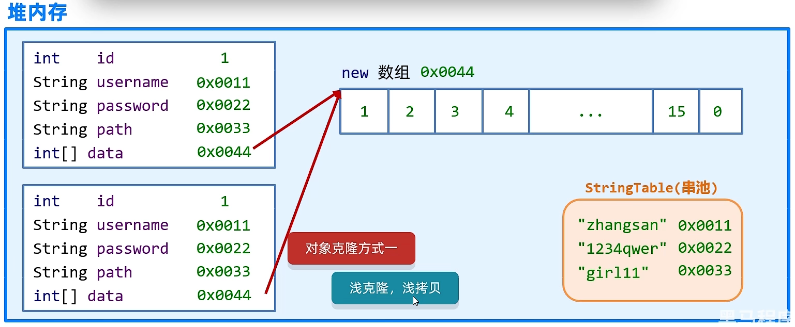

**深克隆，深拷贝**

- 基本数据类型拷贝过来
- 字符串复用
- 引用数据类型会重新创建新的


**object中的 clone 是浅克隆，选用重写 clone 方法实现深克隆**

```java
@Override
protected Object clone() throws CloneNotSupportedException {
    int[] data = this.data;
    int[] newData = new int[data.length];
    for (int i = 0; i < data.length; i++) {
        newData[i] = data[i];
    }
    User u = (User) super.clone();
    u.data = newData;

    return u;
}
```

**使用第三方工具，实现深克隆**	`gson-2.6.2.jar`

1. 将第三方写的代码导入到项目中

    在当前模块创建 lib 文件夹，将jar包放在文件夹中

    右键，选择 Add as library

2. 编写代码

    ```java
    Gson gson = new Gson();
    //把对象变成一个字符串
    String s = gson.toJson(u1);
    //再把字符串变回对象就可以了
    User user = gson.fromJson(s, User.class);
    ```

    

# 5、Objects

Objects是一个工具类，提供了一些方法去完成一些功能。

Objects的成员方法：

| 方法名                                                       | 说明                                      |
| ------------------------------------------------------------ | ----------------------------------------- |
| public           static   boolean      equals( Object a, Object b) | 先做非空判断，比较两个对象                |
| public           static   boolean      isNull( Object obj )  | 判断对象是否为null，为null返回true， 反之 |
| protected     static   boolean     nonNull( Object obj )     | 判断对象是否为null，跟isNull的结果相反    |


```java
boolean result = Objects.equals(s1, s2);
//1.方法的底层会判断s1足否为nu11， 如果为null，直按退回false
//2.如果s1不为null，那么就利用s1再次调用equals方法
//3.此时s1是student类型，所以最终还是会调用student中的equals方法。
// 如果没有重写，比较地址值，如果正写了，就比较属性值。

student s3 = new student();
student s4 = null ;
System.out.println(objects.isNuLL(s3));//false
System.out.println(Objects.isNuLL(s4));//true .
```

1. Objects是一个对象工具类，提供了一些操作对象的方法
2. equals(对象1,对象2) ：先做非空判断，比较两个对象
3. isNull(对象)：判断对象是否为空
4. nonNull(对象)：判断对象是否不为空


# 6、BigInteger

在Java中，整数有四种类型：byte，short， int，long。

在底层占用字节个数：byte 1个字节、short 2个字节、int 4个字节、long 8个字节。

## BigInteger 构造方法

| 方法名                                       | 说明                                     |
| -------------------------------------------- | ---------------------------------------- |
| public  BigInterger( int num, Random rnd )   | 获取随机大整数，范围：[ 0~2 的num次方-1] |
| public  BigInterger( String val )            | 获取指定的大整数                         |
| public  BigInterger( String val, int redix)  | 获取指定进制的大整数                     |
| public static BigInteger value0f( long val ) | 静态方法获取BigInteger的对象，内部有优化 |

- 对象一旦创建，内部记录的值不能发生改变

- 静态方法 valueOf 的取值范围较小

    - 在 long 的取值范围之内

    - 在内部对常用的数字: -16~16进行了优化。

        提前把 -16 ~16 先创建好 BigInteger 的对象，如果多次获取不会重新创建新的。

BigInteger 构造方法小结

1. 如果 BigInteger 表示的数字没有超出long的范围，可以用静态方法获取。
2. 如果 BigInteger 表示的超出long的范围，可以用构造方法获取。
3. 对象一旦创建，BigInteger 内部记录的值不能发生改变。
4. 只要进行计算都会产生一个新的 BigInteger 对象


## BigInteger 成员方法

| 方法名                                                       | 说明                              |
| ------------------------------------------------------------ | --------------------------------- |
| public  BigInterger   add( BigInterger val )                 | 加法                              |
| public  BigInterger   subtract( BigInterger val )            | 减法                              |
| public  BigInterger   multiply( BigInterger val )            | 乘法                              |
| public  BigInterger   divide( BigInterger val )              | 除法，获取商                      |
| public  BigInterger[]   divideAndRemainder( BigInterger val ) | 除法，获取商和余数                |
| public  BigInterger   equals( BigInterger val )              | 比较是否相同                      |
| public  BigInterger   pow( BigInterger val )                 | 次幂                              |
| public  BigInterger   max/min( BigInterger val )             | 返回较大值/较小值                 |
| public  int   intValue( BigInterger val )                    | 转为int类型整数，超出范围数据有误 |


## BigInteger 底层原理


1. 对于计算机而言，其实是没有数据类型的概念的，都是0101010101。

2. 数据类型是编程语言自己规定的。

BigInteger 类中，有以下两个常量成员：

- final int signum;

    用于记录整数的符号位，正数为 1，负数为 -1

- final int[] msg;

    数组中的每一个元素记录一个 32位的整数，元素拼接起来就是原来整数的补码


**存储过程：**

1. 将一个数字的二进制数转换为补码

2. 从右往左，每32位分为一组

3. 将每一组转成对应的整数

4. 将整数按照顺序放在一个数组中

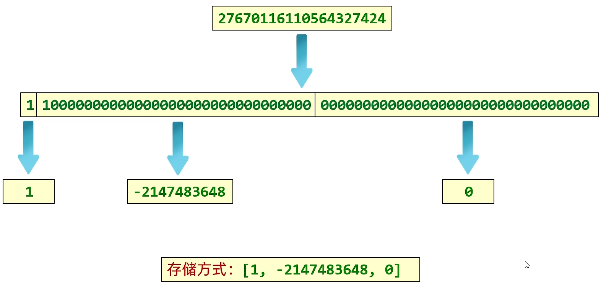


**BigInterge 的存储上限：**

数组的最大长度是 int 的最大值：2147483647

数组中的每一位能表示的数字：-2147483648~2147483647

数组中最多能存储元素个数: 21亿多

数组中每一位能表示的数字: 42亿多

**BigInteger 能表示的最大数字为: 42亿的21亿次方**


# 7、BigDecima

- 用于小数的精确计算
- 用来表示很大的小数


## 构造方法

| 方法名                                        | 说明                                    |
| --------------------------------------------- | --------------------------------------- |
| public  BigDecima( double val  )              | 可能不精确                              |
| public  BigDecima( String val  )              | 不会遇到不精确的问题                    |
| public static BigDecima value0f( double val ) | 静态方法获取BigDecima的对象，内部有优化 |

- double 可能是不精确的，不建议使用
- 通过传递字符串来创建 BigDecima 对象

细节：

1. 如果要表示的数字不大，没有超出 double的取值范围，建议使用静态方法
2. 如果要表示的数字比较大，超出 double 的取值范围，建议使用构造方法
3. 如果我们传递的是0~10之间的整数，包含0，包含10，那么方法会返回已经创建好的对象，不会重新new


## 成员方法

| 方法名                                                       | 说明                              |
| ------------------------------------------------------------ | --------------------------------- |
| public  BigDecima   add( BigDecima val )                     | 加法                              |
| public  BigDecima   subtract( BigDecima val )                | 减法                              |
| public  BigDecima   multiply( BigDecima val )                | 乘法                              |
| public  BigDecima   divide( BigDecima val )                  | 除法（除不尽时后报错）            |
| public  BigDecima   divide( BigDecima val, 精确几位, 舍入模式 ) | 除法（解决除不尽的问题）          |
| public  BigInterger   equals( BigInterger val )              | 比较是否相同                      |
| public  BigInterger   pow( BigInterger val )                 | 次幂                              |
| public  BigInterger   max/min( BigInterger val )             | 返回较大值/较小值                 |
| public  int   intValue( BigInterger val )                    | 转为int类型整数，超出范围数据有误 |

舍入模式：RoundingMode.HALF_UP


## 底层原理

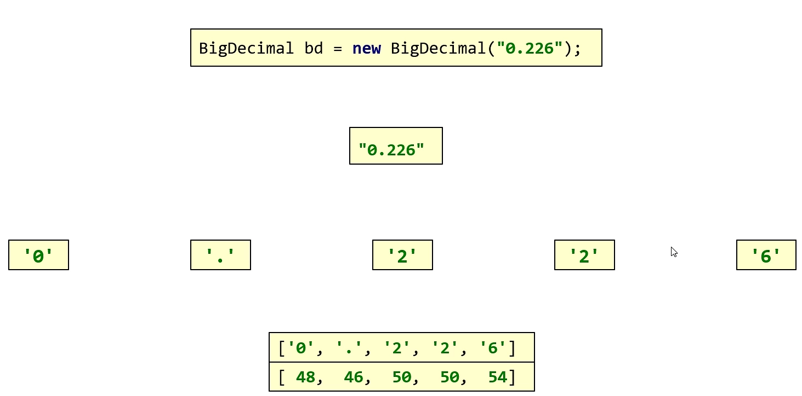

将小数切分为单个字符存储，转为ASCII码表值进行存储


# 8、正则表达式

正则表达式的作用

作用一：校验字符串是否满足规则

作用二：在一段文本中查找满足要求的内容

使用方法：

字符串.matches("正则表达式");

```java
System.out.println("a".matches("[a-zA-Z]"));
```

pattern类

- **字符类语法示例：**

1. \[abc\]：代表a或者b，或者c字符中的一个。
2. \[^abc\]：代表除a,b,c以外的任何字符。
3. [a-z]：代表a-z的所有小写字符中的一个。
4. [A-Z]：代表A-Z的所有大写字符中的一个。
5. [0-9]：代表0-9之间的某一个数字字符。
6. [a-zA-Z0-9]：代表a-z或者A-Z或者0-9之间的任意一个字符。
7. [a-dm-p]：a 到 d 或 m 到 p之间的任意一个字符。 

- **逻辑运算符语法示例：**

1. &&：并且
2. |    ：或者
3. \  ：转义字符

- **预定义语法示例：**

1. "." ： 匹配任何字符。
2. "\d"：任何数字[0-9]的简写；
3. "\D"：任何非数字\[^0-9\]的简写；
4. "\s"： 空白字符：[ \t\n\x0B\f\r] 的简写
5. "\S"： 非空白字符：\[^\s\] 的简写
6. "\w"：单词字符：[a-zA-Z_0-9]的简写
7. "\W"：非单词字符：\[^\w\]

- **数量词语法示例：**

1. X? : 0次或1次
2. X* : 0次到多次
3. X+ : 1次或多次
4. X{n} : 恰好n次
5. X{n,} : 至少n次
6. X{n,m}: n到m次(n和m都是包含的)


使用插件：anyrule 快速生成正则表达式


## 爬虫

Pattern：表示正则表达式

Matcher：文本匹配器，作用按照正则表达式的规则去读取字符串，从头开始读取。在大串中去找符合匹配规则的子串。

```java
String str = "Java自从95年问世以来，经历了很多版本，目前企业中用的最多的是Java8和Java11，"
    + "因为这两个是长期支持版本，下一个长期支持版本是Java17，相信在未来不久Java17也会逐渐登上历史舞台";

//获取正则表达式的对象
Pattern p = Pattern.compile("Java\\d{0,2}");

//获取文本匹配器的对象
Matcher m = p.matcher(str);

//拿着文本匹配器从头开始读取，寻找是否有满足规则的子串
//如果没有，方法返回false
//如果有，返回true。在底层记录子串的起始素引和结束索引+1
boolean b = m.find();

//方法底层会根据find方法记录的索引进行字符串的截取
//substring(起始索引，结束索引);包头不包尾
// (e,4) 但足不包含4索引
//会把藏取的小串进行返回。
string s1 = m.group();
system. out. print1n(s1);

//第二次在调用find的时候，会继续读取后面的内容
//读取到第一个满足要求的子串，方法会维续返回true
//并把第二个子串的起始索引和结束索引+1,进行记录
b = m.find();
```

简化：

```java
//1.获取正则表达式的对象
Pattern p = Pattern.compile("Java\\d{0,2}");
//2.获取文本匹配器的对象
//拿着m去读取str，找符合p规则的子申
Matcher m = p.matcher(str);

//3.利用循环获取
while(m.find()){
	string s = m.group();
	System.out.print1n(s);
}
```


## 带条件爬取

```java
String s = "Java自从95年问世以来，经历了很多版本，目前企业中用的最多的是Java8和Java11，" 
    +"因为这两个是长期支持版本，下一个长期支持版本是Java17，相信在未来不久Java17也会逐渐登上历史舞台";

//需求1:爬取版本号为8，11.17的Java文本，但是只要Java，不显示版本号。
//需求2:爬取版本号为8，11，17的Java文本。正确爬取结果为:Java8 Java11 Java17 Java17
//需求3:爬取除了版本号为8，11.17的Java文本，

//1.定义正则表达式
//?理解为前面的数据Java
//=表示在Java后面要跟随的数据
//但是在获取的时候，只获取前半部分
//需求1:
String regex1 = "((?i)Java)(?=8|11|17)";
//需求2:
String regex2 = "((?i)Java)(8|11|17)";
String regex3 = "((?i)Java)(?:8|11|17)";
//需求3:
String regex4 = "((?i)Java)(?!8|11|17)";

```

`(?!)` 忽略大小写

`(?=)` 匹配但不显示=后面的内容

`(?:) `

`(?!)`


## 贪婪爬取

只写 + 号表示贪婪匹配，如果在 + 号后面加问号表示非贪婪爬取

`+? 非贪婪匹配`
`*? 非贪婪匹配`

贪婪爬取：在爬取数据的时候尽可能的**多获取数据**

非贪婪爬取：在爬取数据的时候尽可能的**少获取数据**

举例：

如果获取数据：ab+（默认为贪婪爬取）

贪婪爬取获取结果：abbbbbbbbbbbb

非贪婪爬取获取结果：ab


正则表达式在字符串方法中的使用

| 方法名                                                       | 说明                               |
| ------------------------------------------------------------ | ---------------------------------- |
| public   String[]   matches(String regex)                    | 判断字符串是否满足正则表达式的规则 |
| public   String      replaceAll(String regex, String newStr) | 按照正则表达式的规则进行替换       |
| public   String[]    split(String regex)                     | 按照正则表达式的规则切割字符串     |

示例：

```java
String s = "小诗诗dqwefqwfqwfwq12312小丹丹dqwefqwfqwfwq12312小惠惠" ;
//细节:
//方法在底层跟之前一样也会创建文本解析器的对象
//然后从头开始去读取字符串中的内容，只要有满足的，那么就用第二个参数去替换。
String resut1 = s.replaceA11("[\\w&&[^_ ]]+", "vs");
System.out.println(resutl);

String[] arr = s.split( regex: "[\\w&&[^ ]]+");
for (int i = 0; i < arr.1ength; i++) {
	System.out.println(arr[i]);
}
```


## 捕获分组

分组就是一个小括号

```java
// 邮箱号
String regex1 = "\\W+@[ \\w&&[^_ ]]{2, 6}(\\.[a-zA-Z]{2,3}){1,2})";
// 简易身份证号码
String regex2 = "[1-9]\\d{16}(\\d|X|x)";
// 24小时时间
String regex3 = "([01]\\d|2[0-3]):[0-5]\\d:[0-5]\ld";
String regex4 = "([01]\\d|2[0-3])(:[0-5]\\d){2}"
```

每组是有组号的，也就是序号。

规则1：从1开始，连续不间断。

规则2：以左括号为基准，最左边的是第一-组， 其次为第二组，以此类推。

`(\\d+){\d+)(\\d+)`

**捕获分组就是把这一组数据捕获出来，再用一次**

需求1：判断一个字符串的开始字符和结束字符是否一致? 只考一个字符

举例：a12a	b456b	17891	&abc& 

```java
String regex1 = "(.).+\\1";
System.out.println("a12a".matches(regex1));
```

需求2：判断一个字符串的开始部分和结束部分是否一致?可以有多个字符

举例：abc123abc 	b456b 	123789123 	&!@abc&!@

```java
String regex2 = "(.+).+\\1";
System.out.println("abc123abc".matches(regex2));
```

需求3：判断一个字符串的开始部分和结束部分是否一致?开始部分内部每个字符也需要一致

举例：aaa123aaa	bbb456bbb	111789111 &&abc&&

```java
String regex2 = "((.)\\2*).+\\1";
System.out.println("aaa123aaa".matches(regex2));
```


后续还要继续使用本组的数据。
正则内部使用：`\\` 组号
正则外部使用：`$` 组号

```java
String str = "我要学学编编编编程程程程程程程";

str.replaceAll("(.)\\1+", "&1");
```


非捕获分组：

分组之后不需要再用本组数据，仅仅是把数据括起来，==不占组号==

| 符号     | 含义                       | 举例              |
| -------- | -------------------------- | ----------------- |
| (?:正则) | 捕获所有                   | java(?:8\|11\|17) |
| (?=正则) | 捕获前面部分               | java(?=8\|11\|17) |
| (?!正则) | 获取不是指定内容的前面部分 | java(?!8\|11\|17) |


# 9、JDK7 时间

JDK7前时间相关的类

| 类名             | 作用       |
| ---------------- | ---------- |
| Date             | 时间       |
| SimpleDateFormat | 格式化时间 |
| Calendar         | 日历       |

## Date

**世界标准时间**：格林尼治时间 / 格林威指时间 ，简称 GMT

到 2012 年，取消了 格林尼治时间，改用原子钟 作为世界标准时间

**原子钟**：利用铯原子的震动的频率计算出来的时间，作为世界标准时间（UTC）。

**中国标准时间**：世界标准时间 +8小时

**时间换算单位**：

1     秒 = 1000 毫秒

1 毫秒 = 1000 微秒

1 微秒 = 1000 纳秒


Date时间类

`java.util.Date`类 表示特定的瞬间，精确到毫秒。

Date类是一个JDK写好的Javabean类，用来描述时间，精确到毫秒。

利用空参构造创建的对象，默认表示系统当前时间。

利用有参构造创建的对象，表示指定的时间。

```java
//1.创建对象表示一个时间
Date d = new Date();

//2.创建对象表示一个指定的时间
Date d2 = new Date(0L);

//3.修改时间
d2.setTime(1000L);

//4.getTime获取当前时间的毫秒值
long time = d2.getTime();
```

实例：

需求1:打印时间原点开始一年之后的时间

需求2:定义任意两个Date对象，比较-下哪个时间在前，哪个时间在后

```java
//需求1:打印制间原点开始一年之后的时间
//1.创建一个对象，表示时间原点
Date d1 = new Date(0L);

//2.获取d1时间的毫秒值
1ong time = d1.getTime();

//3.在这个基础上我们要加一年的毫秒值即可
time = time + 1000L*60*68*24*365;

//4.把计算之后的时间意秒值。再设置回d1当中
d1.setTime(time);

//5.打印d1
System.out.println(d1);

//需求2:定义任意两个Date对象，比较-下哪个时间在前，哪个时间在后
Random r = new Randon();
Date d1 = new Date(Math.abs(r.nextInt()));
Date d2 = new Date(Math.abs(r.nextInt()));
long time1 = d1.getTime();
long time2 = d2.getTime();

if(time1 > time2){
	System.out.print1n("第一个时间在后而，第二个时间在前而");
}else if(time1 < time2){
	System.out.println("第二个时间在后面,第一个时间在前面");
}else{
	System.out.print1n("表示两个时间-样");
}
```


## SimpleDateFormat

作用：

- 格式化：把时间变成我们喜欢的格式。

- 解析：把字符串表示的时间变成Date对象。

构造方法：

| 构造方法                                  | 说明                                    |
| ----------------------------------------- | --------------------------------------- |
| public SimpleDateFormat()                 | 构造一个SimpleDateFormat,使用默认格式   |
| public SimpleDateFormat( String pattern ) | 构造一个SimpleDateFormat,使用指定的格式 |

常用方法：

| 常用方法                                | 说明                           |
| --------------------------------------- | ------------------------------ |
| public final String format( Date date ) | 格式化（ 日期对象 -> 字符串 ） |
| public Date parse( String source )      | 解析（ 字符串 -> 日期对象 ）   |

格式化的时间形式的常用的模式对应关系如下：

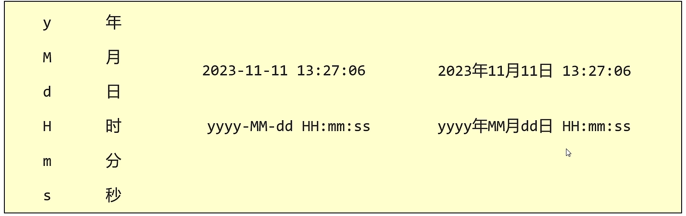


```java
//1.利用空参构造创建SimpleDateFormat对象，默认格式
SimpleDateFormat sdf1 = new SimpleDateFormat();
Date d1 = new Date(0L);
String str1 = sdf1.format(d1);
System.out.println(str1);//1970/1/1 上午8:00

//2.利用带参构造创建SimpleDateFormat对象，指定格式
SimpleDateFormat sdf2 = new SimpleDateFormat("yyyy年MM月dd日 HH:mm:ss");
String str2 = sdf2.format(d1);
System.out.println(str2);//1970年01月01日 08:00:00

String str = "2023-11-11 11:11:11";
SimpleDateFormat sdf = new SimpleDateFormat("yyyy-MM-dd HH:mm:ss");
Date date = sdf.parse(str);
System.out.println(str);
```

练习：假设，你初恋的出生年月日为: 2000-11-11

请用字符串表示这个数据,并将其转换为: 2000年11月11日

```java
String str = "2000-11-11";
SimpleDateFormat sdf = new SimpleDateFormat("yyyy-MM-dd");
Date date = sdf.parse(str);
SimpleDateFormat sdf3 = new SimpleDateFormat("yyyy年MM月dd日");
String result = sdf3.format(date);
System.out.println(result);
```


## Calendar

Calendar概述

- Calendar代表了系统当前时间的日历对象，可以单独修改、获取时间中的年，月，日
- 细节: Calendar是一个抽象类，不能直接创建对象。


获取Calendar日历类对象的方法

| 方法名                               | 说明                   |
| ------------------------------------ | ---------------------- |
| public static Calendar getInstance() | 获取当前时间的日历对象 |


Calendar常用方法

| 方法名                                   | 说明                        |
| ---------------------------------------- | --------------------------- |
| public final Date getTime()              | 获取日期对象                |
| public final setTime(Date date)          | 给日历设置日期对象          |
| public long getTimeInMillis()            | 拿到时间毫秒值              |
| public void setTimeInMillis(long millis) | 给日历设置时间毫秒值        |
| public int get(int field)                | 取日历中某个字段信息        |
| public void set(int field, int value)    | 修改日历的某个字段信息      |
| public void add(int field, int amount)   | 为某个字段增加/减少指定的值 |


总结;

1. Calendar 表示什么？

    表示一个时间的日历对象

2. 如何获取对象

    通过 getInstance 方法获取对象

3. 常见方法：

    setXxx：修改

    getXxx：获取

    add：在原有基础上进行增加或者减少

4. 细节：

    日历类中月份的范围：0~11

    日历类中星期的特点：星期日是一周中的第一天


# 10、JDK8 时间类

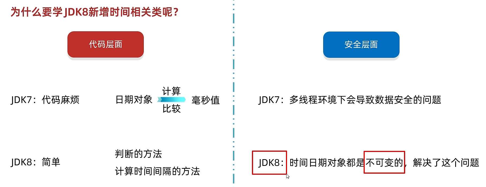

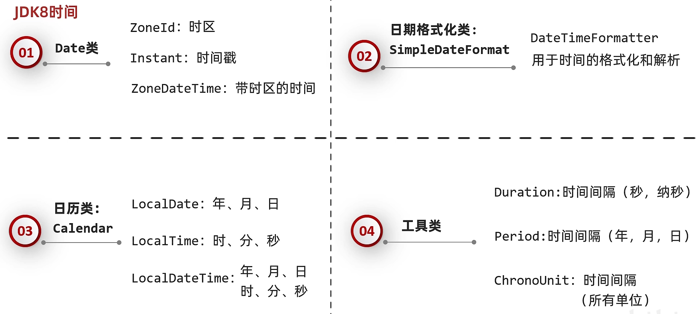


**ZoneId 时区**

Asia/Shanghai

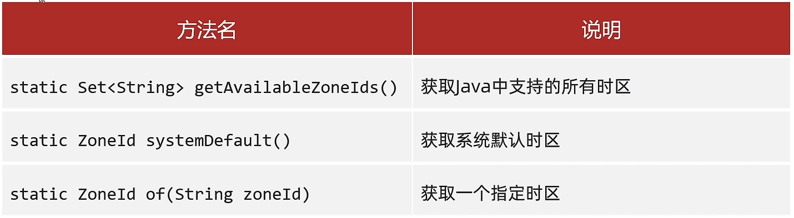

Instant 时间戳

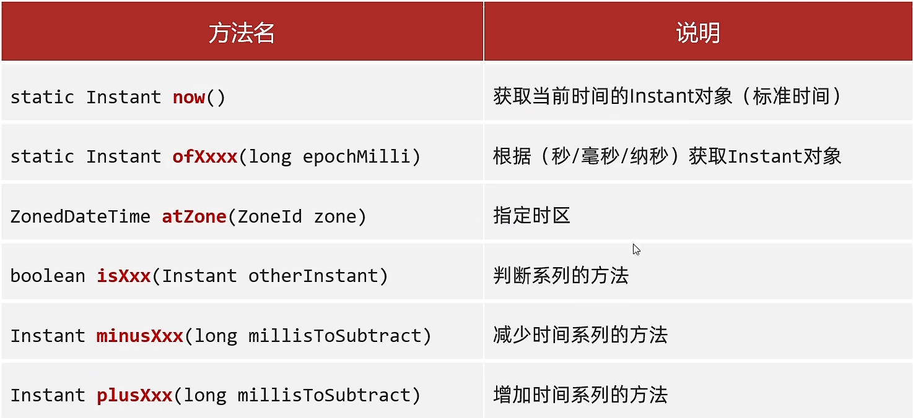

ZoneDateTime：带时区的时间

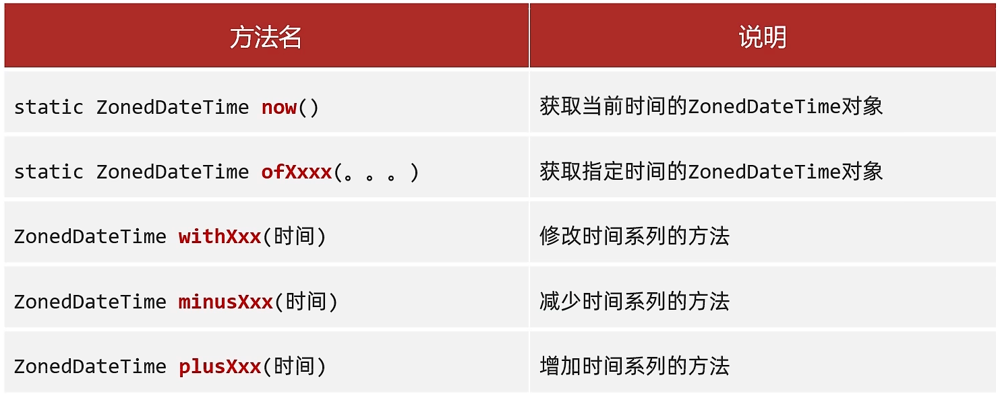

DateTimeFormatter 用于时间的格式化和解析

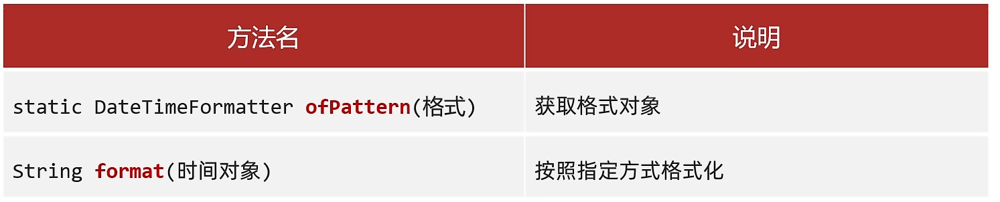

LocalDate、LocalTime、LocalDateTime

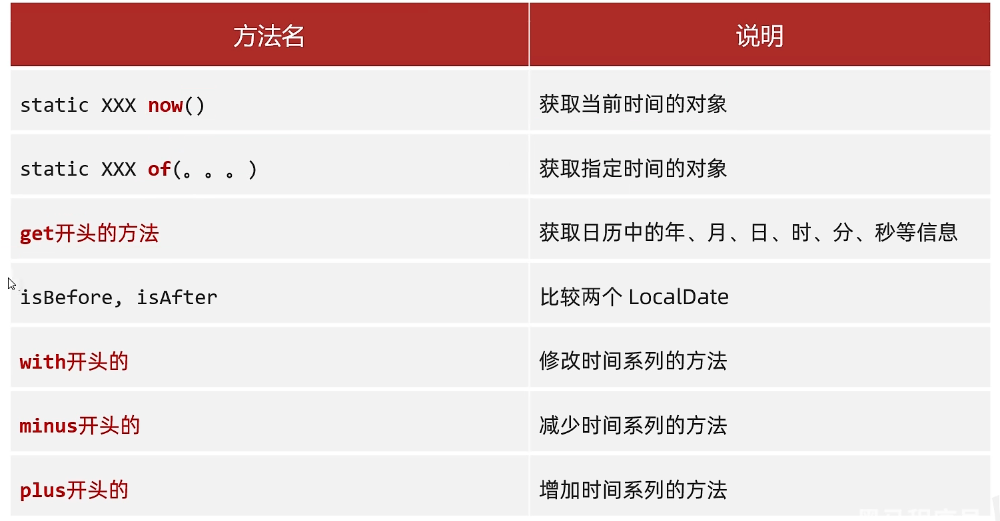

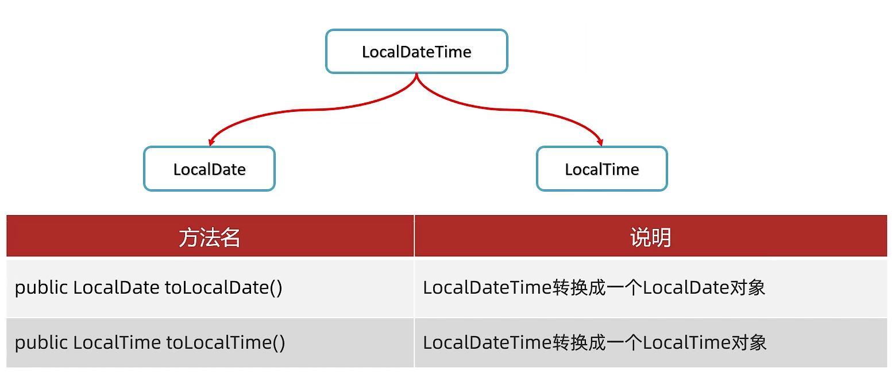

Duration、Period、ChronoUnit

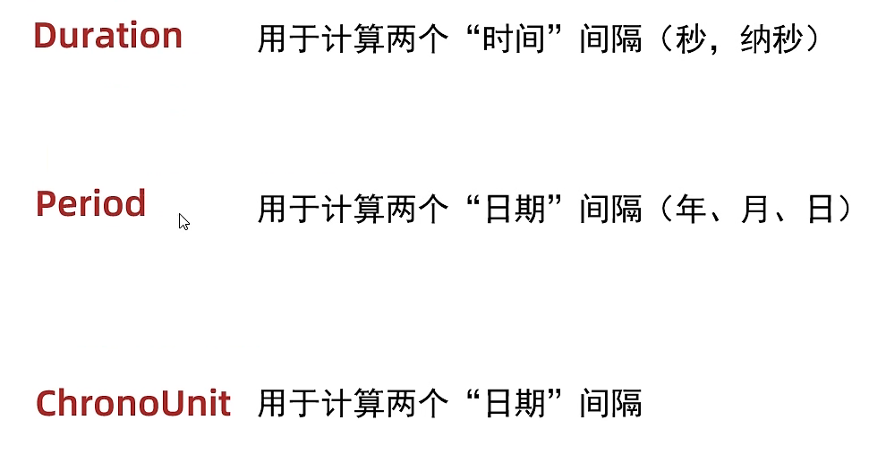


# 11、包装类

**包装类：基本数据类型对应的引用类型**

用一个对象，把基本数据类型包装起来

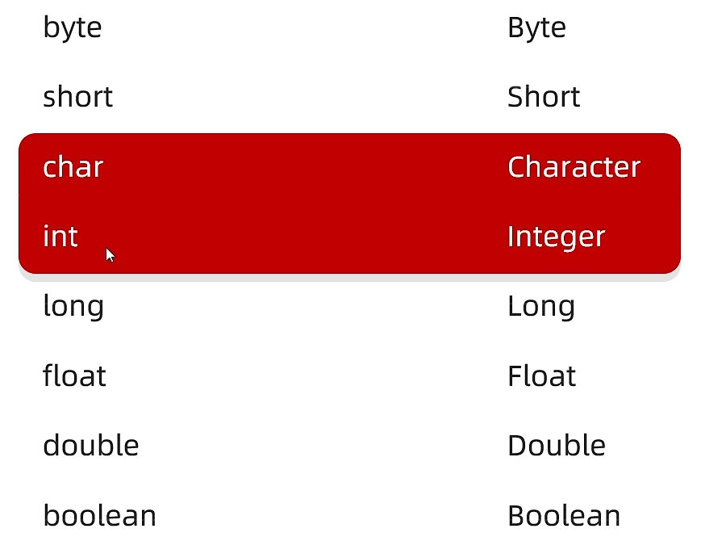

获取Interger对象

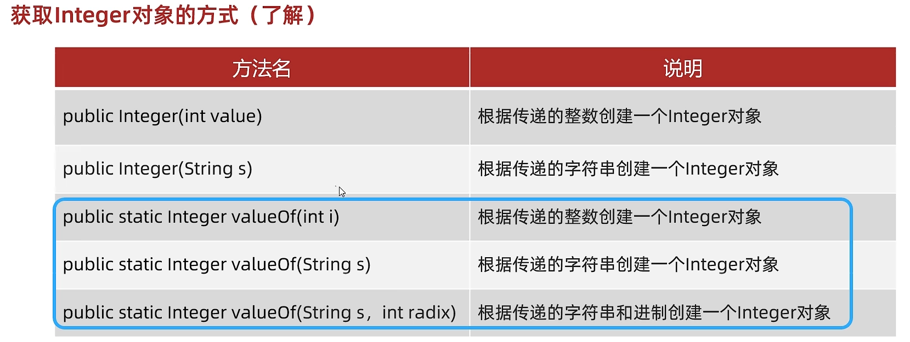

优化：-128~127 之间的对象已经定义好了，获取的是同一个对象

在 JDK5 的时候提出了一个机制：自动装箱和自动拆箱

自动装箱：把基本数据类型会自动的变成其对应的包装类

自动拆箱：把包装类自动的变成其对象的基本数据类型

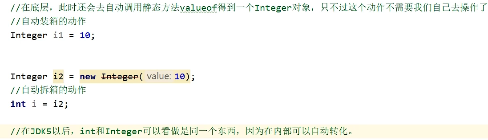


Integer 成员方法

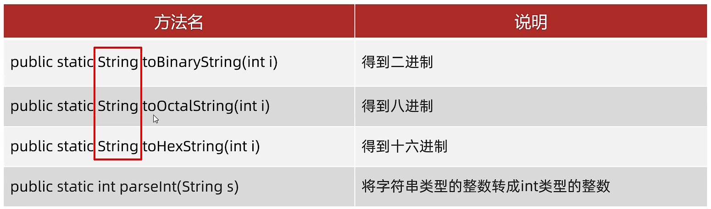


# 12、Arrays

操作数组的工具类

| 方法名                                                       | 说明                     |
| ------------------------------------------------------------ | ------------------------ |
| `public static String   toString( 数组 )`                    | 把数组拼接成一个字符串   |
| `public static int      binarySearch( 数组，查找的元素 )`    | 二分查找法查找元素       |
| `public static int[]    copyOf( 原数组，新数组长度 )`        | 拷贝数组                 |
| `public static int[]    copyOfRange( 原数组，起始索引，结束索引 )` | 拷贝数组（指定范围）     |
| `public static void     fill( 数组，元素 )`                  | 填充数组                 |
| `public static void     sort( 数组 )`                        | 按照默认方式进行数组排序 |
| `public static void     sort( 数组，排序规则 )`              | 按照指定的规则排序       |

实例：

```java
System.out.println("---------toSting---------");
int[] arr = {1,2,3,4,5,6};
System.out.println(Arrays.toString(arr));

System.out.println("---------binarySearch---------");
System.out.println(Arrays.binarySearch(arr, 3));
//如果查找的元素是不存在的，返回值是 -插入点-1
//如果要查找的数字是0，此时0是不存在的，但是按照上面的规则-插入点，应该是-0
//为了避免这种情况，Java在这个基础上-1
System.out.println(Arrays.binarySearch(arr, 7)); //-7

System.out.println("---------copyOf---------");
//如果新数组的长度是小于老数组的长度，会部分拷贝
//如果新数组的长度是等于老数组的长度，会完全拷贝
//如果新数组的长度是大于老数组的长度，会补上默认初始值
int[] newArr = Arrays.copyOf(arr,2);
System.out.println(Arrays.toString(newArr));

System.out.println("---------fill---------");
//覆盖原来的数据
Arrays.fill(arr,100);
System.out.println(Arrays.toString(arr));

System.out.println("---------sort---------");
//默认升序排序，底层使用快速排序
int[] arr2 = {10,2,3,5,7,4,6};
Arrays.sort(arr2);
System.out.println(Arrays.toString(arr2));
```

按照指定排序规则

```java
// 只能给引用数据类型的数组进行排序
// 如果数组是基本数据类型，需要变成其对应的包装类

Integer[] arr = {2,1,3,5,6,8,4,9};

// 底层原理：
// 插入排序 + 二分查找
// compare 方法的形式参数：
// 参数一 o1：表示无序序列中，遍历得到的每一个元素
// 参数二 o2：有序序列中的元素
// 返回值：
// 负数：表示当前要插入的元素是小的，放在前面
// 正数：表示当前要插入的元素是大的，放在后面
// 0：表示当前要插入的元素跟现在的元素比是一样的也会放在后面
// 简单理解：
// o1 - o2 ：升序排列
// o2 - o1 ：降序排列
Arrays.sort(arr, new Comparator<Integer>() {
    @Override
    public int compare(Integer o1, Integer o2) {

        return 0;
    }
});
```


# 13、Lambda 表达式

```java
// 使用匿名内部类
Arrays.sort(arr, new Comparator<Integer>() {
    @Override
    public int compare(Integer o1, Integer o2) {

        return 0;
    }
});

// 使用Lambda表达式
Arrays.sort(arr, (Integer o1, Integer o2) -> {
    return 0;
});
```

函数式编程：

- 函数式编程（Functional programming）是一种思想特点。
- 面向对象：先找对象，让对象做事情。
- 函数式编程思想，忽略面向对象得到复杂语法，强调做什么，而不是谁去做。
- 而我们要学习的Lambda表达式就是函数式思想的体现


Lambda 表达式是 JDK 8 开始后的一种新语法形式。

```java
() -> {
    
}
```

- `()` ：对应方法的形参
- `->` ：固定格式
- `{}` ：对应着方法的方法体

注意点：

- Lambda表达式可以用来简化匿名内部类的书写
- Lambda表达式==只能简化函数式接口的匿名内部类的写法==
- 函数式接口：
    - ==有且仅有一个抽象方法的接口叫做函数时接口，接口上方可以加 `@FunctionalInterface` 注解==

```java
public class LambdaDemo {
    public static void main(String[] args) {

        method(new Swim() {
            @Override
            public void swimming() {
                System.out.println("正在游泳");
            }
        });

        method(
                ()->{
                    System.out.println("正在游泳");
                }
        );

    }

    public static void method(Swim s){
        s.swimming();
    }
}

@FunctionalInterface
interface Swim{
    public abstract void swimming();
}
```


总结：

1. Lambda表达式的基本作用？

    简化函数式接口的匿名内部类的写法。

2. Lambda表达式有什么使用前提？

    必须式接口的匿名内部类，接口中只能有一个抽象方法

3. Lambda的好处？

    Lambda是一个匿名函数，我们可以把Lambda表达式理解为是一段可以传递的代码，它可以写出更简洁、更灵活的代码，作为一种更紧凑的代码风格，使Java语言表达能力得到了提升。


lambda的省略规则:

1. 参数类型可以省略不写。
2. 如果只有一个参数，参数类型可以省略，同时()也可以省略。
3. 如果Lambda表达式的方法体只有一行，==大括号，分号，return可以省略不写， 需要同时省略。==

```java
Arrays.sort(arr, (Integer o1, Integer o2) -> {
    	return 0;
	}
);

// 简化
Arrays.sort(arr, (o1, o2) -> o1-o2);
```


# 14、经典算法题

**第一题：不死神兔**

有一个很有名的数学逻辑题叫做不死神兔问题，有一对兔子,从出生后第三个月起每个月都生一对兔子，小兔子长到第三个月后每个月又生一对兔子，假如兔子都不死，问第十二个月的兔子对数为多少?


**第二题：猴子吃桃子**

有一堆桃子,猴子第一-天吃了其中的一半，并多吃了一个!以后每天猴子都吃当前剩下来的一半，然后再多吃一个，第10天的时候(还没吃)，发现只剩下一个桃子了，请问，最初总共多少个桃子?


**第三题：爬楼梯**

可爱的小明特别喜欢爬楼梯，他有的时候一次爬一个台阶，有的时候一次爬两个台阶。如果这个楼梯有20个台阶，小明一共有多少种爬法呢?


# 15、集合进阶

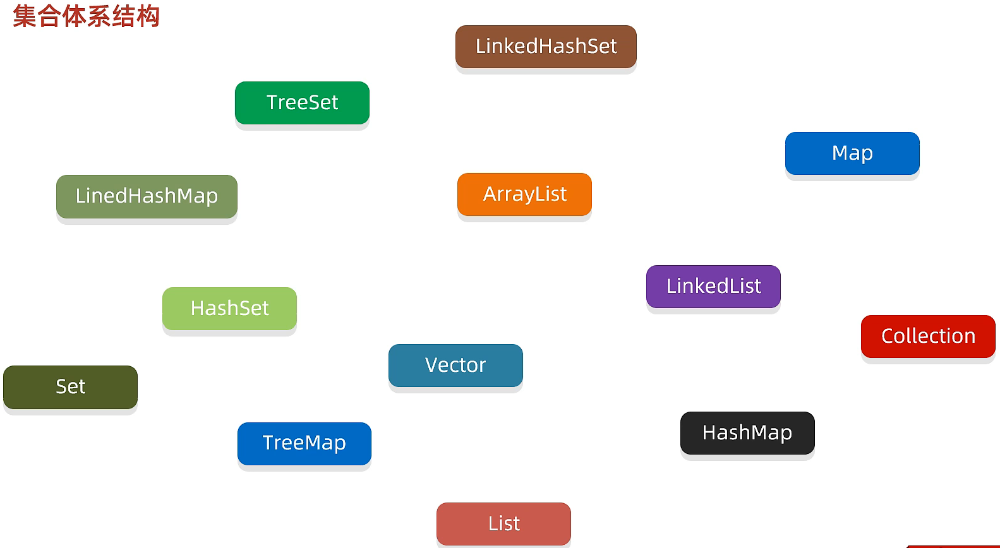

可以分为两类：

- Collection：单列集合
- Map：双列集合


## Collection

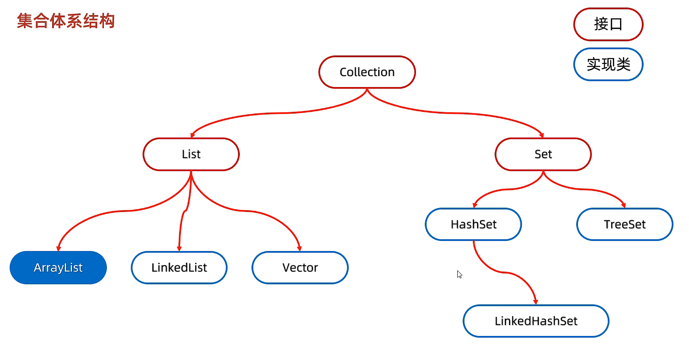

Collection 是单列集合的祖宗接口，它的功能是全部单列集合都可以继承使用的。

- **List系列集合**：添加的元素是有序、可重复、有索引
- **Set系列集合**：添加的元素是无序、不重复、无索引


### Collection 方法

| 方法名称                                 | 说明                             |
| ---------------------------------------- | -------------------------------- |
| `public  boolean  add( E e )`            | 把给定的对象添加到当前集合中     |
| `public  void  clear()`                  | 清空集合中所有的元素             |
| `public  boolean  remove( E e )`         | 把给定的对象在当前集合中删除     |
| `public  boolean contains( Object obj )` | 判断当前集合中是否包含给定的对象 |
| `public  boolean isEmpty()`              | 判断当前集合是否为空             |
| `public  int  size()`                    | 返回集合中元素的个数/集合的长度  |


**contains方法细节：**

contains 方法底层依赖 equals 方法判断对象是否一致

如果是自定义对象，没有重新 equals 方法，那么默认是使用 Object类中的 equals 方法，依赖地址值进行判断。

所以，需要在自定义的 JaveBean 中，重写 equals 方法就可以了


### Collection 遍历方式

- 迭代器遍历
- 增强for遍历
- Lambda表达式遍历


#### 迭代器遍历

- **迭代器不依赖索引**

- 迭代器在Java中的类是 ==Iterator==，迭代器是集合专用的遍历方式。

Collection 集合获取迭代器

| 方法名称                  | 说明                                    |
| ------------------------- | --------------------------------------- |
| `Iterator<E>  iterator()` | 返回迭代器对象，默认指向当前集合的0索引 |

Iterator 中的常用方法

| 方法名称             | 说明                                                      |
| -------------------- | --------------------------------------------------------- |
| `boolean  hasNext()` | 判断当前位置是否有元素，有元素返回true ,没有元素返回false |
| `E  next()`          | 获取当前位置的元素，并将迭代器对象移向下一个位置。        |

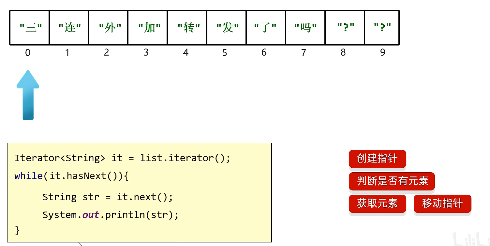

实例：

```java
Collection<String> coll = new ArrayList<>();

coll.add("aaa");
coll.add("bbb");
coll.add("ccc");
coll.add("ddd");

Iterator<String> it = coll.iterator();
while (it.hasNext()){
    String str = it.next();
    System.out.println(str);
}
```

**细节注意点：**

1. 报错NoSuchElementException

2. 迭代器遍历完毕，指针不会复位

3. 循环中只能用一次 next 方法

4. 迭代器遍历时，不能用集合的方法进行增加或者删除

    - 如果实在要删除，可以用迭代器提供的 remove 方法进行删除  `it.remove()`

    - 如果我要添加，暂时没有方法


#### 增强for遍历

- **增强for的底层就是迭代器，为了简化迭代器的代码书写的。**
- 它是JDK5之后出现的，其内部原理就是一个Iterator迭代器
- 所有的单列集合和数组才能用增强for进行遍历。


格式：

```java
for(元素的数据类型 变量名 : 数组或集合){
    
}
```

实例：

```java
for (String s : list){
    System.out.println(s);
}
```

IDEA快捷键：`集合变量.for`

增强for的细节

- 修改增强for中的变量，不会改变集合中原来的数据。


#### Lambda表达式遍历

得益于JDK 8开始的新技术Lambda表达式，提供了一种更简单、更直接的遍历集合的方式。

| 方法名称                                             | 说明               |
| ---------------------------------------------------- | ------------------ |
| `default void forEach(Consumer<? super T>  action):` | 结合lambda遍历集合 |


```java
// 底层原理：
// 其实也会自己遍历集合，依次得到每一个元素
// 把得到的每一个元素传递给下面的accept方法
coll.forEach(new Consumer<String>() {
    @Override
    public void accept(String s) {
        System.out.println(s);
    }
});

// 使用lambda表达式
// 一行搞定
coll.forEach(s -> System.out.println(s));
```


### 总结

1. Collection是 单列集合的顶层接口，所有方法被List和Set系列集合共享

2. 常见成员方法:

  `add、clear、remove、contains、isEmpty、size`

3. 三种通用的遍历方式：

    - 迭代器：在遍历的过程中需要删除元素,请使用迭代器。

    - 增强for、 Lambda：仅仅想遍历，那么使用增强for或Lambda表达式。


## List集合系列

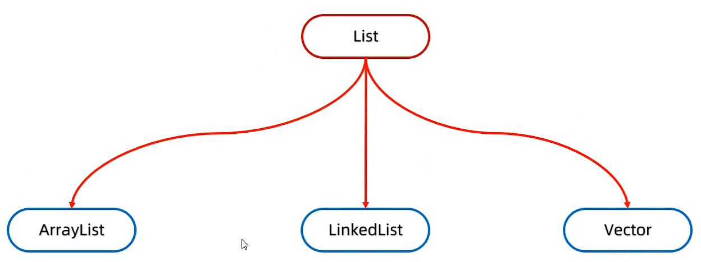

List集合的特点：

- 有序：存和取的元素顺序一致
- 有索引：可以通过索引操作元素
- 可重复：存储的元素可以重复

List集合的特有方法：

- Collection的方法List都继承了
- List集合因为有索引， 所以多了很多索引操作的方法。

| 方法名称                          | 说明                                   |
| --------------------------------- | -------------------------------------- |
| `void  add(int index, E element)` | 在此集合中的指定位置插入指定的元素     |
| `E remove(int index)`             | 删除指定索引处的元素，返回被删除的元素 |
| `E set(int index, E element)`     | 修改指定索引处的元素，返回被修改的元素 |
| `E get(int index)`                | 返回指定索引处的元素                   |


add：有两个重载，优先调用，实参跟形参类型一致的那个方法。


### List集合的遍历方式

- 迭代器遍历
- 列表迭代器遍历
- 增强for遍历
- Lambda表达式遍历
- 普通for循环（因为list集合存在索引）


列表迭代器：

`hasPrevious()`：从后往前

`previous()`

```java
ListIterator<String> it = list.listIterator();
while (it.hasNext()){
    String str = it.next();
    if("bbb".equals(str)){
        it.add("qqq");
    }
    System.out.println(str);
}
System.out.println(list);
```

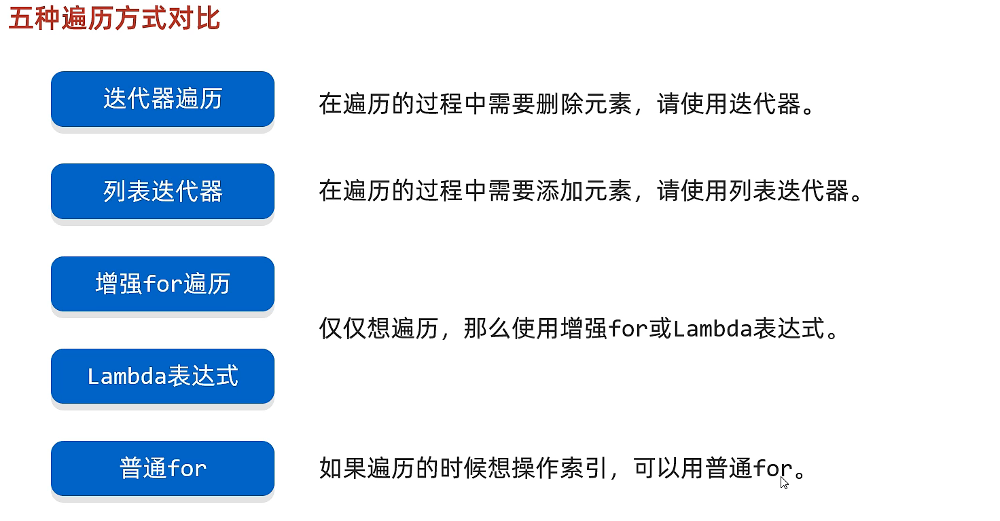


### List实现类-ArrayList

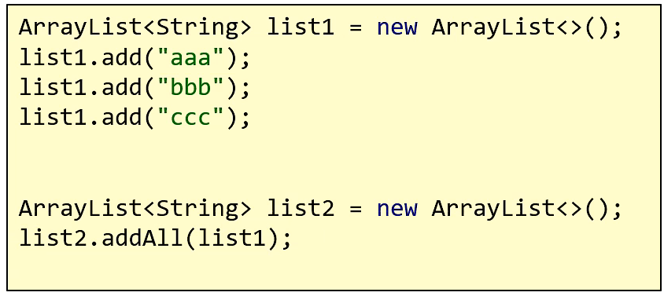

底层原理：

1. 利用空参创建的集合，在底层创建一个默认长度为 0 的数组
2. 添加第一个元素时，底层会创建一个新的长度为 10 的数组
3. 存满时，会扩容 1.5 倍
4. 如果一次添加多个元素，1.5倍还放不下，则新创建数组的长度以实际为准


底层数组名称：elementData

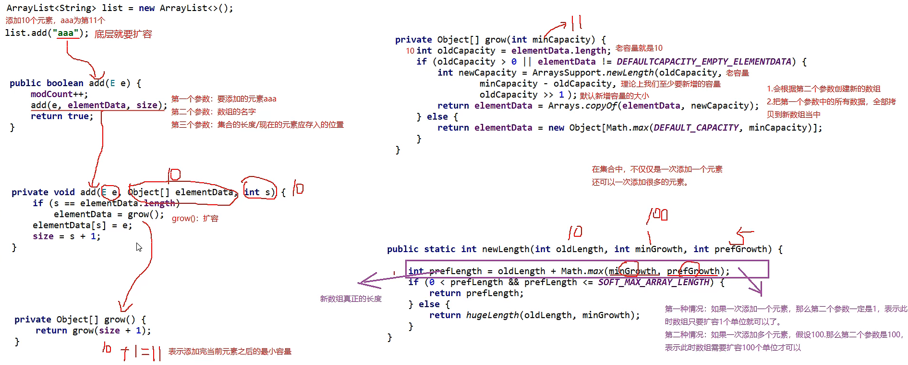


### List实现类-LinkedList

底层数据结构是双链表，查询慢，增删快，但是如果操作的是首尾元素，速度也是极快的。

LinkedList本身多了很多直接操作首尾元素的特有API

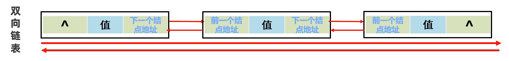

特有方法：

| 特有方法                       | 说明                             |
| ------------------------------ | -------------------------------- |
| `public  void addFirst( E e )` | 在该列表开头插入指定的元素       |
| `public  void addLast( E e )`  | 将指定的元素追加到此列表的末尾   |
| `public  E  getFirst()`        | 返回此列表中的第一个元素         |
| `public  E  getLast()`         | 返回此列表中的最后一个元素       |
| `public  E  removeFirst()`     | 从此列表中删除并返回第一个元素   |
| `public  E  removeLast()`      | 从此列表中删除并返回最后一个元素 |

底层源码：

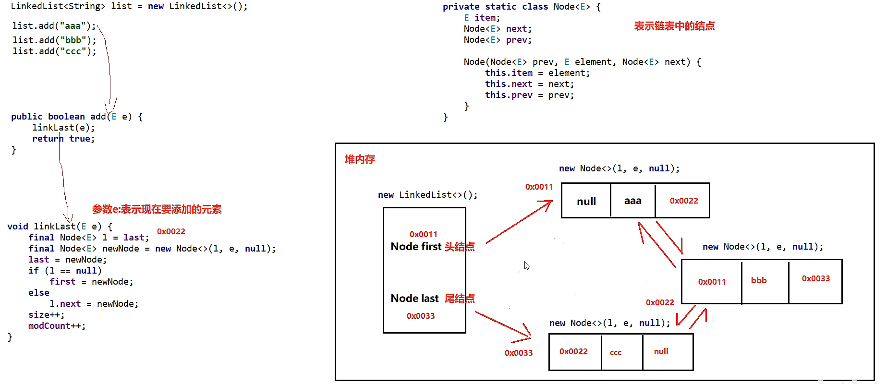


### 迭代器底层源码

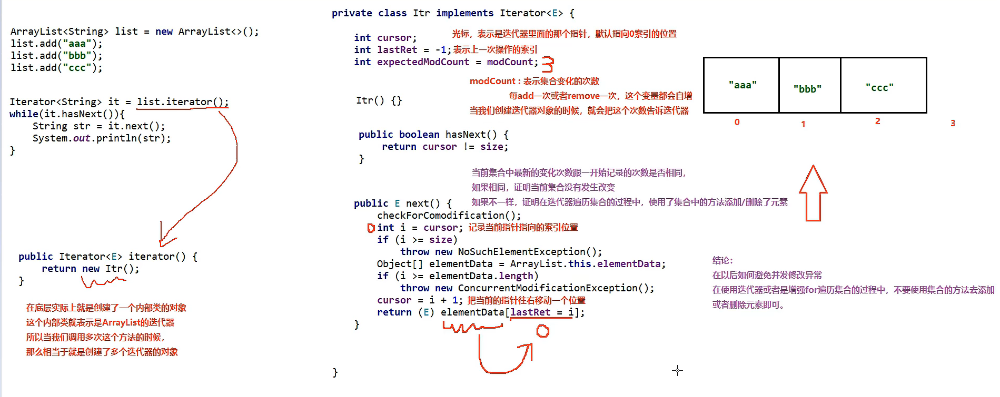


## Set集合系列

无序：存取顺序不一致

不重复：可以去除重复

无索引：没有带索引的方法，所以不能使用普通for循环遍历，也不能通过索引来获取元素


Set集合的实现类

- HashSet：无序、不重复、无索引
- LinkHashSet：有序、不重复、无索引
- TreeSet：可排序、不重复、无索引


==Set接口中的方法基本上与Collection的API一致。==

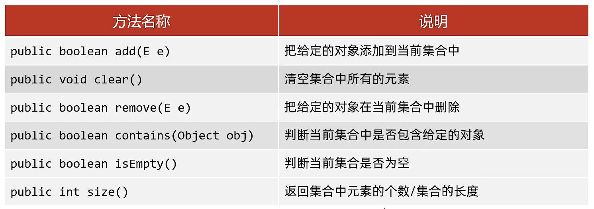


### HashSet

HashSet底层原理

- HashSet集合底层采取==哈希表==存储数据
- 哈希表是一种对于增删改查数据性能都较好的结构


哈希表组成

- JDK8 之前：数组 + 链表
- jDK8 开始：数组 + 链表 + 红黑树


哈希值

- 根据 hashCode 方法算出来的 int 类型的整数
- 该方法定义在 Object 类中，所有对象都可以调用，**默认使用地址值进行计算**
- 一般情况下，会重写 hashCode 方法，利用对象内部的属性值计算哈希值


对象的哈希值特点

- 如果没有重写 hashCode 方法，不同对象计算出的哈希值是不同的
- 如果已经重写 hashcode 方法，不同的对象只要属性值相同，计算出的哈希值就是一样的
- 在小部分情况下，不同的属性值或者不同的地址值计算出来的哈希值也有可能一样。(==哈希碰撞==)


==HashSet 底层原理==

**0.75 加载因子**：HashSet的扩容时机

**JDK8 以后的优化**：当链表长度大于 8 而且数组长度大于等于 64 时，会将链表转成 红黑树

==**如果集合中存储的是自定义对象，必须要重写 hashCode 和 equals 方法**==

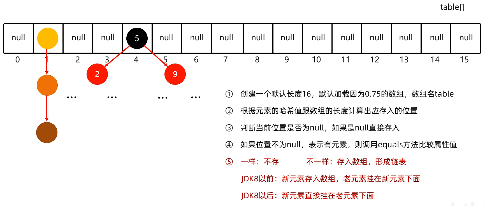

**HashSet的三个问题**

问题1: HashSet为什么存和取的顺序不一样?

遍历时从 0 索引开始。


问题2: HashSet为什么没有索引?

数组 + 链表 + 红黑树，无法指定索引顺序


问题3: HashSet 是利用什么机制保证数据去重的?

HashCode方法、equals方法


### LinkedHashSet

- **有序**、不重复、无索引。
- 这里的有序指的是保证存储和取出的元素顺序一致
- **原理**：底层数据结构是依然哈希表，只是每个元素又额外的**多了一个双链表的机制记录存储的顺序**。

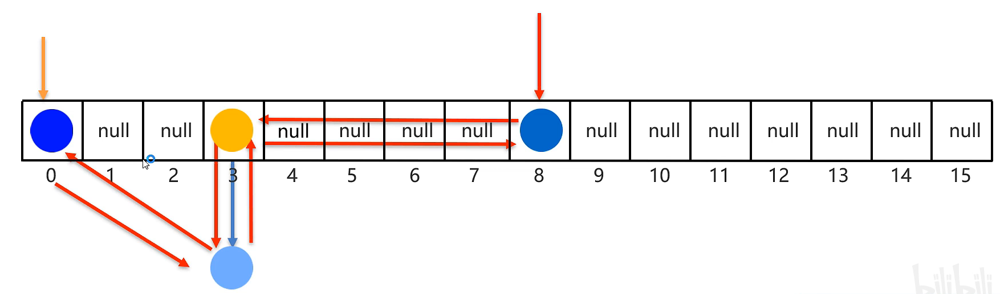

在以后如果要数据去重，我们使用哪个?

- 默认使用 HashSet

- 如果要求去重且存取有序，才使用 LinkedHashSet


### TreeSet

TreeSet的特点

- 不重复、无索引、==可排序==
- 可排序：按照元素的默认规则(有小到大)排序。
- TreeSet 集合底层是基于==红黑树==的数据结构实现排序的，增删改查性能都较好。


TreeSet集合默认的规则

- 对于数值类型：Integer , Double，默认按照从小到大的顺序进行排序。
- 对于字符、字符串类型：按照字符在 ASCII 码表中的数字升序进行排序。


TreeSet的两种比较方式

方式一：**默认排序/自然排序：Javabean 类实现 Comparable 接口指定比较规则**

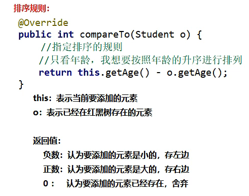

```java
//1.创建三个学生对象
Student s1 = new Student("zhangsan", 23);
Student s2 = new Student("lisi", 24);
Student s3 = new Student("wangwu", 25);

//2.创建集合对象
TreeSet<Student> ts = new TreeSet<>();
//3.添加元素
ts.add(s3);
ts.add(s2);
ts.add(s1);

//4.打印集合
System.out.print1n(ts);
```

```java
@Override
//this: 表示当前要添加的元素
//o: 表示已经在红黑树存在的元素
//返回值:
//负数: 表示当前要添加的元素是小的，存左边
//正数: 表示当前要添加的元素是大的，存右边
//0: 表示当前要添加的元素已经存在，舍弃
public int compareTo(Student o) {
	System.out.printl("------------");
	System.out.print1n("this:" + this);
	System.out.print1n("o:" + o);
	//指定排序的规则
	//只看年龄，我想要按照年龄的升序进行排列
	return this.getAge() - o.getAge();
}
```


**方式二：比较器排序：创建 TreeSet 对象时候，传递比较器 Comparator 指定规则**

**使用原则：默认使用第一种，如果第一种不能满足当前需求，就使用第二种**

```java
//1.创建集合
//o1: 表示当前要添加的元素
//o2: 表示已经在红黑树存在的元素
// 返回值规则跟之前是-样的
TreeSet<String> ts = new TreeSet<>(new Comparator<String>(){
	@Override
	public int compare(String o1, String o2) {
	//按照长度排序
	int i = o1.1ength() - o2.1ength();
	//如果一样长则按照首字母排序
	i = i == 0 ? o1.compareTo(o2) : i;
	return i;
});
    
//使用lambda表达式
TreeSet<String> ts = new TreeSet<>((o1, o2) -> {
	//按照长度排序
	int i = o1.1ength() - o2.1ength();
	//如果一样长则按照首字母排序
	i = i == 0 ? o1.compareTo(o2) : i;
	return i;
});
    
//2.添加元素
ts.add("c");
ts.add("ab");
ts.add("df");
ts.add("gwer");
    
//3.打印集合
System.out.println(ts);
```


## 使用场景

1. 如果想要集合中的元素可重复
    - 用 `ArrayList` 集合， 基于数组的。( 用的最多)
2. 如果想要集合中的元素可重复，而且当前的==增删操作明显多于查询==
    - 用 `LinkedList` 集合， 基于链表的。
3. 如果想对集合中的元素去重
    - 用 `HashSet` 集合, 基于哈希表的。(用的最多)
4. 如果想对集合中的元素去重，而且**保证存取顺序**
    - 用 `LinkedHashSet` 集合, 基于哈希表和双链表，效率低于 `HashSet`。
5. 如果想对集合中的元素进行==排序==
    - 用 `TreeSet` 集合，基于红黑树。后续也可以用List集合实现排序。


## 双列集合的特点


① 双列集合一次需要存一对数据，分别为键和值

② 键不能重复，值可以重复

③ 键和值是一一对应的，每一个键只能找到自己对应的值

④ 键 + 值 这个整体我们称之为“键值对”或者“键值对对象”，在Java中叫做 “**Entry对象**"


## Map

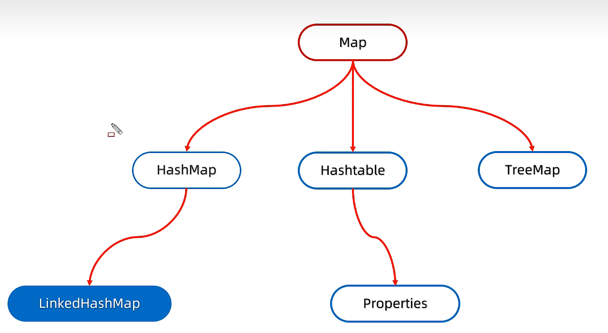

### Map的常见API

Map是双列集合的顶层接口，它的功能是全部双列集合都可以继承使用的

| 方法名称                                | 说明                                 |
| --------------------------------------- | ------------------------------------ |
| `V get( K key)`                         | 通过key获取value                     |
| `V put( K key, V value )`               | 添加元素                             |
| `V remove( Object key )`                | 根据键删除键值对元素                 |
| `void clear()`                          | 移除所有键值对元素                   |
| `boolean containsKey( Object key )`     | 判断集合是否包含指定的键             |
| `boolean containsValue( Object value )` | 判断集合是否包含指定的值             |
| `boolean isEmpty()`                     | 判断集合是否为空                     |
| `int size()`                            | 集合的长度，也就是集合中键值对的个数 |

实例：

```java
Map<String, String> m = new HashMap<>();

//添加
String value1 = m.put("郭靖", "黄蓉");
System.out.println(value1); //不存在返回 null
m.put("韦小宝", "木健平");
m.put("尹志平", "小龙女");

String value2 = m.put("韦小宝", "双儿");
System.out.println(value2); //返回被覆盖的值：木健平
System.out.println(m);

//删除
String result = m.remove("郭靖");
System.out.println(result); // 返回郭靖的值

System.out.println(m);
```

### Map的遍历方式

1. **键找值**

```java
Map<String,String> map = new HashMap<>();

map.put("郭靖", "黄蓉");
map.put("韦小宝", "木健平");
map.put("尹志平", "小龙女");

Set<String> keys = map.keySet();
//使用增强for循环
for (String key : keys) {
    System.out.println(key);
    String value = map.get(key);
    System.out.println(key + "=" + value);
}

//使用迭代器
Iterator<String> it = keys.iterator();
while (it.hasNext()){
    String key = it.next();
    String value = map.get(key);
    System.out.println(key + "=" + value);
}

//使用lambda表达式
keys.forEach(s -> {
    String value = map.get(s);
    System.out.println(s + "=" + value);
}
);
```

2. **键值对**

```java
Map<String,String> map = new HashMap<>();

map.put("标枪选手", "马超");
map.put("人物挂件", "明世隐");
map.put("与龙骑士", "尹志平");

Set<Map.Entry<String, String>> entries = map.entrySet();

for (Map.Entry<String, String> entry : entries) {
    String key = entry.getKey();
    String value = entry.getValue();
    System.out.println(key + "=" + value);
}

//forEach源码
for (Map.Entry<String, String> entry : map.entrySet()) {
    String key = entry.getKey();
    String value = entry.getValue();
    System.out.println(key + "=" + value);
}
```

3. **lambda 表达式**

```java
Map<String,String> map = new HashMap<>();

map.put("标枪选手", "马超");
map.put("人物挂件", "明世隐");
map.put("与龙骑士", "尹志平");

map.forEach(new BiConsumer<String, String>() {
    @Override
    public void accept(String key, String value) {
        System.out.println(key + "=" + value);
    }
});

//lambda表达式
map.forEach((key, value) -> System.out.println(key + "=" + value));
```


### HashMap

HashMap的特点

① HashMap 是 Map 里面的一个实现类。

② 没有额外需要学习的特有方法，直接使用 Map 里面的方法就可以了。

③ 特点都是由键决定的：无序、不重复、无索引

④ HashMap 跟 HashSet 底层原理是一模一样的，都是哈希表结构

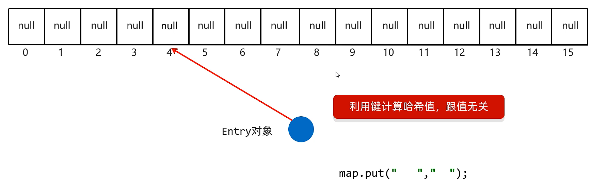

总结：

1. HashMap 底层是哈希表结构的

2. 依赖 hashCode 方法和 equals 方法保证==键的唯一==

3. ==如果**键**存储的是自定义对象， 需要重写 hashCode 和 equals 方法==

  如果**值**存储自定义对象，不需要重写 hashCode 和 equals 方法

实例：

```java
String[] arr = {"A", "B", "C", "D"};
ArrayList<String> list = new ArrayList();
Random r = new Random();
for (int i = 0; i<80; i++ ){
    int index = r.nextInt(arr.length);
    list.add(arr[index]);
}

HashMap<String, Integer> hm = new HashMap<>();

for (String name : list) {
    if(hm.containsKey(name)){
        int count = hm.get(name);
        count++;
        hm.put(name, count);
    }else {
        hm.put(name, 1);
    }
}

System.out.println(hm);
```

==HashMap源码分析：==

- 在HashMap中，每一个元素都是一个 Node对象

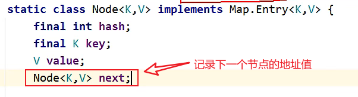

- 默认初始化大小为 16，当存储的数量（存储因子）达到 0.75 时，扩容为原来的两倍
- 数组最长 ： 1 << 30
- 空参构造不会创建底层数组，**在添加元素（put() 方法）时创建底层数组**
- 一个链表长度超过 8，且数组的长度超过 64 时，会调用方法 treeifyBin，将链表转换为红黑树

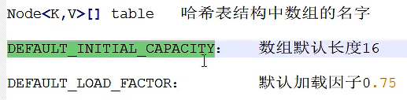

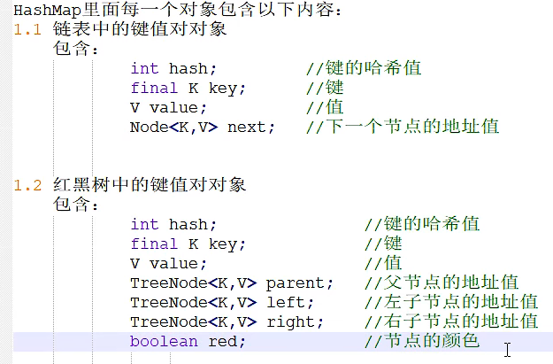


### LinkedHashMap

- 由键决定：有序、不重复、无索引。
- 这里的有序指的是保证存储和取出的元素顺序一致
- 原理：底层数据结构是依然哈希表，只是每个键值对元素又额外的多了一个双链表的机制记录存储的顺序。


### TreeMap

- TreeMap 跟 TreeSet 底层原理一样，都是红黑树结构的。

- 由键决定特性：不重复、无索引、==可排序==

- 可排序：==对键进行排序。==

- ==注意：默认按照键的从小到大进行排序，也可以自己规定键的排序规则==

代码书写两种排序规则

- 实现 Comparable 接口， 指定比较规则。
- 创建集合时传递 Comparator 比较器对象，指定比较规则。


TreeMap底层源码：

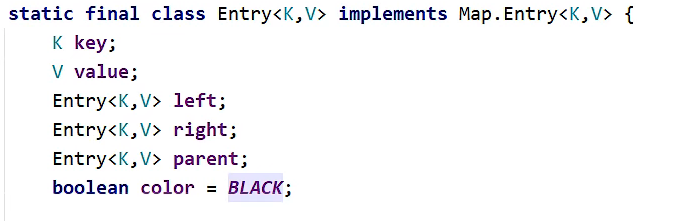


## Map面试题

**1、TreeMap添加元素的时候，键是否需要重写hashCode和equals方法？**

此时是不需要重写的。


**2、HashMap是哈希表结构的，JDK8开始由数组，链表，红黑树组成的。**

**既然有红黑树，HashMap的键是否需要实现Compareable接口或者传递比较器对象呢？**

不需要的。

因为在HashMap的底层，默认是==利用哈希值的大小关系==来创建红黑树的


**3、TreeMap和HashMap谁的效率更高？**

如果是最坏情况，添加了8个元素，这8个元素形成了链表，此时TreeMap的效率要更高

但是这种情况出现的几率非常的少。

一般而言，还是HashMap的效率要更高。


**4、你觉得在Map集合中，java会提供一个如果键重复了，不会覆盖的put方法呢？**

此时 `putIfAbsent` 本身不重要。

传递一个思想：

​	代码中的逻辑都有两面性，如果我们只知道了其中的A面，而且代码中还发现了有变量可以控制两面性的发生。
​	那么该逻辑一定会有B面。
​	

	习惯：
		boolean类型的变量控制，一般只有AB两面，因为boolean只有两个值
		int类型的变量控制，一般至少有三面，因为int可以取多个值。


**5、三种双列集合，以后如何选择？**

HashMap、LinkedHashMap、TreeMap

默认：HashMap（效率最高）

如果要保证存取有序：LinkedHashMap

如果要进行排序：TreeMap


## 集合工具类Collections


- java.util.Collections：是集合工具类
- 作用：Collections 不是集合，而是集合的工具类


常用的 API

| 方法名称                                                     | 说明                              |
| ------------------------------------------------------------ | --------------------------------- |
| `public static <T> boolean addAll(Collection<T> c, T...elements)` | 批量添加元素                      |
| `public static void shuffle(List<?> list)`                   | 打乱List集合元素的顺序            |
| `public static <T> void sort(List<?> list)`                  | 排序                              |
| `public static <T> void sort(List<?> list, Collection<T> c)` | 根据指定的规则排序                |
| `public static <T> int binarySearch(List<T> list, T key)`    | 以二分查找查找元素                |
| `public static <T> void copy(List<T> dest, List<T> src)`     | 拷贝集合中的元素                  |
| `public static <T> int fill(List<T> list, T obj)`            | 使用指定的元素填充集合            |
| `public static <T> void max/min(Collection<T> coll)`         | 根据默认的自然排序获取最大/最小值 |
| `public static <T> void swap(List<?> list, int i, int j)`    | 交换集合中指定位置的元素          |


# 16、泛型

泛型：是JDK5中引入的特性，可以在**编译阶段约束操作**的数据类型，并进行检查。

泛型的格式：<数据类型>

注意：泛型只能支持引用数据类型。


如果没有给集合指定类型，默认所有的数据类型都是Object类型

此时可以想集合中添加任意的数据类型

坏处：无法使用其他类特有的行为

多态的弊端是不能访问子类的特有功能

此时推出了泛型，可以在添加数据时就把类型进行统一，在获取数据时，也省了强转，非常方便


**泛型的好处：**

- 统一数据类型
- **把运行时期的问题提前到了编译期间，避免了强制类型转换可能出现的异常，因为在编译阶段类型就能确定下来。**


扩展知识点：Java 中的泛型是伪泛型

**泛型的擦除：**

在Java文件中有泛型，在字节码文件中，泛型被擦除

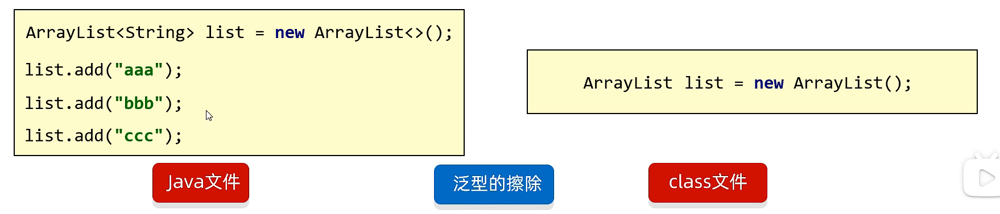


泛型的细节

- 泛型中不能写基本数据类型
- 指定泛型的具体类型后，传递数据时，可以传入该类类型或者其子类类型
- 如果不写泛型，类型默认是Object


泛型可以在很多地方进行定义

- 类后面			—— 泛型类
- 方法上面	    —— 泛型方法
- 接口后面        —— 泛型接口


## 泛型类

使用场景：当一个类中，某个变量的数据类型不确定时，就可以定义带有泛型的类

格式：

```java
修饰符 class 类名<类型>{
    
}
```

举例：

```java
public class ArrayList<E>{
    
}
```


## 泛型方法

方法中形参类型不确定时，可以使用类名后面定义的泛型\<E>

格式：

```java
修饰符 <类型> 返回值类型 方法名(类型 变量名){
    
}
```

实例：

```java
public <T> void show( T t ){
    
}
```

此处T可以理解为变量，但是不是用来记录数据的，而是记录类型的，可以写成: T、E、K、V等


## 泛型接口

格式：

```java
修饰符 interface 接口名<类型>{
    
}
```

实例：

```java
public interface List<E>{
    
}
```

使用泛型接口：

- 方式1：实现类给出的具体类型
- 方式2：实现类延续泛型，创建对象时再确定


## 泛型的继承和通配符

泛型不具备继承性，但数据具备继承性。

```java
ArrayList<Ye> list1 = new ArrayList<>();
ArrayList<Fu> list2 = new ArrayList<>();
ArrayList<Zi> list3 = new ArrayList<>();

method(list1);
method(list2);
method(list3);

//此时，泛型里面写的是什么类型，那么只能传递什么类型的数据。
//public static void method(ArrayList<Ye> list){   
//}

public static<E> void method(ArrayList<E> list){   
}
```

弊端:

利用泛型方法有一个小弊端，此时他可以接受任意的数据类型 Ye Fu Zi Student

希望：

本方法虽然不确定类型，但是以后我希望只能传递 Ye Fu Zi

此时我们就可以使用泛型的通配符:

?也表示不确定的类型，他可以进行类型的限定


==泛型通配符：==

- `? extends E`：**表示可以传递E或者E所有的子类类型**

- `? super E`：**表示可以传递E或者E所有的父类类型**

```java
public static void method(ArrayList< ? extends Ye > list){   
}
```

应用场景：

1. 如果我们在定义类、方法、接口的时候，如果类型不确定，就可以定义泛型类、泛型方法、泛型接口。
2. 如果类型不确定，但是能知道以后**只能传递某个继承体系中的**，就可以**泛型的通配符**

关键点：

​	可以限定类型的范围。


# 17、可变参数

JDK5 时提出的新特性，方法形参的个数是可以发生变化的，0，1，2，3。。。

格式：

```java
属性类型...名字
```

实例：

```java
public static int getSum(int...args){
    
}
```

底层：

- **可变参数底层就是一个数组**
- 只不过不需要我们自己创建了，Java 会帮我们创建好

注意事项：

- 在方法的形参中最多只能写一个可变参数
- 在方法中，如果除了可变参数以外，还有其他参数，那么可变参数要写在最后


# 数据结构

## 平衡二叉树

确定支点：从添加的节点开始，不断的往父节点找不平衡的节点


RR（右右）：左旋（一次左旋）

RL（右左）：先局部右旋，再左旋

LL（左左）：右旋（一次右旋）

LR（左右）：先局部左旋，再右旋


## 红黑树

- 红黑树是一种自平衡的二叉查找树，是计算机科学中用到的一种数据结构。

- 1972年出现，当时被称之为平衡二叉B树。后来，1978年被修改为如今的"红黑树"

- 它是一种特殊的二叉查找树，红黑树的每一个节点上都有存储位表示节点的颜色

- ==每一个节点可以是红或者黑==；红黑树==不是高度平衡的==，它的平衡是通过"==红黑规则=="进行实现的


平衡二叉树：

- 高度平衡
- 当左右子树高度差超过 1 时，通过旋转保持平衡（平衡规则太严格）

红黑树：

- 是一个二叉查找树
- 但是不是高度平衡的
- 条件：特有的红黑规则


数据结构(红黑树)红黑规则

① 每一个节点或是红色的，或者是黑色的

② 根节点必须是黑色

③ 如果一个节点没有子节点或者父节点，则该节点相应的指针属性值为Nil，这些Nil视为叶节点，每个叶节点(Nil)是黑色的

④ 如果某一个节点是红色，那么它的子节点必须是黑色(不能出现两个红色节点相连的情况)

⑤ 对每一个节点，从该节点到其所有后代叶节点的简单路径上，==均包含相同数目的黑色节点==;


红黑树再添加节点时，添加的节点默认时红色的（效率更高）

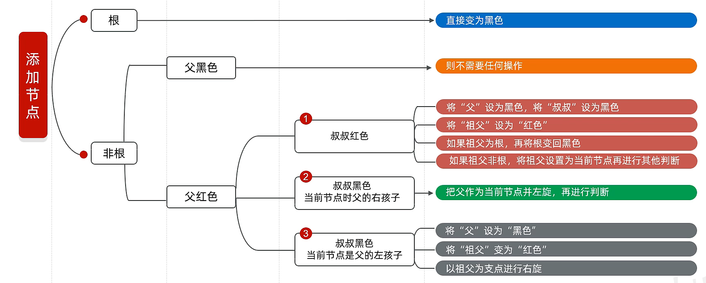


