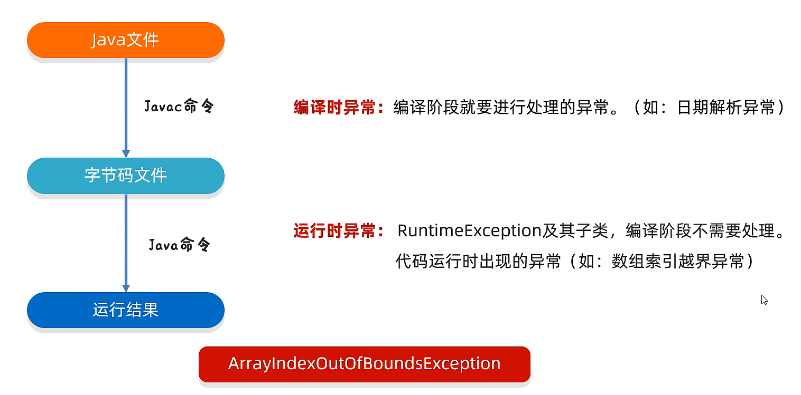

# 1、Stream流

Steam流的使用步骤：

1、先得到一条Stream流（流水线），并把数据放上去


实例：

```java
ArraryList<String> list = new ArraryList<>();
Collections.addAll(list,"a","b","c");
list.stream().forEach(s -> System.out.println(s));

//零散数据
Stream.of(1,2,3,4,5).forEach(s -> System.out.println(s));
```

2、Stream流的中间方法


实例：

```java
list.stream.filter(s -> s.startWith("张")).forEach(s -> System.out.println(s));
```

- distinct()：依赖 hashCode 和 equals 方法

3、Stream流的终结方法


```java
list.stream().collect(Collections.toList())
```


# 2、方法引用

- 把已经有的方法拿过来用，当作函数式接口中抽象方法的方法体


使用条件：

**引用处：**

1. 引用处必须式函数式接口

**被引用处：**

1. 被引用的方法必须已经存在
2. 被引用方法的形参和返回值需要跟抽象方法保持一致

3. 被引用方法的功能要能满足当前需求


方法引用符： `::`


方法引用的分类：

1、引用静态方法

2、引用成员方法

3、引用构造方法


## 引用静态方法

格式：`类名::静态方法`

范例：`Integer::parseInt`


```java
ArraryList<String> list = new ArraryList<>();
Collections.addAll(list,"1","2","3");

list.stream().map(Integer::parseInt).forEach(s -> System.out.println(s));
```


## 引用成员方法

格式：`对象::成员方法`

① 其他类：`其他类对象::方法名`

② 本类：`this::成员方法`

③ 父类：`super::方法名`

本类和父类引用处不能是静态方法


```java
//StringOperation为其他类，stringJudge为该类的方法
StringOperation so = new StringOperation();
list.stream().filter(so::stringJudge).forEach(s -> System.out.println(s));

//引用本类中的方法，注意：this在静态方法中不存在，会报错
list.stream().filter(this::stringJudge).forEach(s -> System.out.println(s));
```


## 引用构造方法

格式：`类名::new`

范例：`Student::new`


 ```java
list.stream().map(Student::new).collect(Collections.toList());
 ```


## 其他调用方法

### 使用类名引用成员方法

格式：`类名::成员方法`

范例：`String::substring`


方法引用的规则:

1. 需要有函数式接口

2. 被引用的方法必须已经存在

3. 被引用方法的形参，需要跟抽象方法的第二个形参到最后一个形参保持一致， 返回值需要保持一致。

4. 被引用方法的功能需要满足当前的需求


```java
//拿着流里面的每一个数据，去调用string类中的toUpperCase方法，方法的返回值就是转换之后的结果
list.stream().map(String::toUpperCase).forEach(s -> System.out.println(s));
```

抽象方法形参的详解：

第一个参数：表示被引用方法的调用者，决定了可以引用哪些类中的方法

在Stream流当中，第一个参数一般都表示流里面的每一个数据。

假设流里面的数据是字符串，那么使用这种方式进行方法引用，只能引用String这个类中的方法

第二个参数到最后一个参数：跟被引用方法的形参保持一致，如果没有第二个参数，说明被引用的方法需要无参的成员方法

简述：==第一个参数决定了能用哪些类中的方法== （流中的数据是 String类型，因此只能引用String类中的方法）


### 引用数组的构造方法

格式：`数据类型[]::new`

范例：`int[]::new`


```java
/*
Integer[] arr = list.stream().toArray(new IntFunction<Integer[]>() {
@Override
public Integer[] apply(int value) {
return new Integer[va1ue];
});*/

Integer[]arr2 = list.stream().toArray(Integer[]::new);
```


# 3、异常

异常：异常就是代表程序出现的问题

误区：不是让我们以后不出异常，而是程序出了异常之后，该如何处理


- **Error：代表的系统级别错误(属于严重问题)**

    系统一旦出现问题，sun公司会把这些错误封装成Error对象。
    Error是给sun公司自己用的，不是给我们程序员用的。
    因此我们开发人员不用管它。

- **Exception：叫做异常，代表程序可能出现的问题。**

    我们通常会用 Exception 以及他的子类来封装程序出现的问题。

- **运行时异常：RuntimeException及其子类，编译阶段不会出现异常提醒。**

    运行时出现的异常(如：数组索引越界异常)

- **编译时异常：编译阶段就会出现异常提醒的。**(如: 日期解析异常)


总结：

1. 异常是什么?

    程序中可能出现的问题

2. 异常体系的最.上层父类是谁?异常分为几类?

    - 父类: Exception。
    - 异常分为两类:编译时异常、运行时异常

3. 编译时异常和运行时异常的区别?

    - 编译时异常：没有继承RuntimeExcpetion的异常，直接继承于Excpetion。
        编译阶段就会错误提示
    - 运行时异常：RuntimeException本身和子类。
        编译阶段没有错误提示，运行时出现的


## 编译时异常和运行时异常



- 编译时异常：除了RuntimeExcpetion和他的子类，其他都是编译时异常。
- 运行时异常：RuntimeException本身和所有子类。
  

## 异常的作用

作用一：异常是用来查询 bug 的关键参考信息

作用二：异常可以作为方法内部的一种特殊返回值，以便通知调用者底层的执行情况


## 异常的处理方式

1、JVM 默认的处理方式

2、自己处理

3、调用者处理


### JVM 默认的处理方式

- 把异常的名称，异常原因及异常出现的位置等信息输出在了控制台
- ==程序停止执行，下面的代码不会再执行了==


### try...catch捕获异常

**自己处理（捕获异常）**

格式：

```java
try {
    可能出现异常的代码;
} catch(异常类名 变量名) {
    异常的处理代码;
}
```

目的：当代码出现异常时，可以让程序继续往下执行。

JDK 7以后，可以在 catch 中同时捕获多个异常，中间用 | 进行隔开

表示如果出现了A异常或者B异常，采取同一种处理方案

```java
int[] arr = {1, 2, 3, 4, 5, 6};

try{
	System.out.println(arr[1B]);//ArrayIndexOutOfBoundsException
	System.out.println(2/0);//ArithmeticException
	String s = null;
	System.out.println(s.equa1s("abc"));
}catch(ArrayIndexOutOfBoundsException | ArithmeticException e){
	System.out.println("索引越界了");
}catch(NullPointerException e){
	System.out.println("空指针异常");
}catch (Exception e){
	System.out.printin("Exception");
}
```


**捕获异常的四个问题：**

灵魂一问：**如果 try 中没有遇到问题，怎么执行?**

会把 try 中的代码执行完毕，但不会执行 catch 中的代码。


灵魂二问：**如果try中可能会遇到多个问题，怎么执行?**

会写多个 catch 与之对应

细节：如果我们要捕获多个异常，这些异常中如果存在父子关系的话。那么父类一定要写在下面


灵魂三问：**如果try中遇到的问题没有被捕获，怎么执行?**

相当于 try...catch 的代码白写了，最终还是会交给虚拟机进行处理。


灵魂四问：**如果try中遇到了问题，那么try下面的其他代码还会执行吗?**

下面的代码就不会执行了，直接跳转到对应的 catch 当中，执行 catch 里面的语句体

但是如果没有对应 catch 与之匹配，那么还是会交给虚拟机进行处理


## 异常中的常见方法

Throwable 的成员方法：


## 抛出异常

- `throws`

    写在方法定义处，表示声明一个异常

    告诉调用者，使用本方法可能会有哪些异常

```java
public void 方法() throws 异常类名1,异常类名2...{
    ...
}
```

编译时异常：必须要写

运行时异常：可以不写


- `throw`

    写在方法内，结束方法

    手动抛出异常对象，交给调用者

    方法中下面的代码就不再执行了

```java
public void 方法(){
    throw new NullPointerException();
}
```


## 自定义异常

定义步骤：

1、定义异常类

2、写继承关系

3、空参构造

4、带参构造


意义：就是为了让控制台的报错信息更加的见名知意

```java
public class NameFormatException extends RuntimeException{
    // 运行时异常：RuntimeException
    // 编译时异常：Exception 核心：提醒程序员见检查本地信息
    public NameFormatException(){

    }

    public NameFormatException(String message){
        super(message);
    }
}
```


# 4、File

1、File 表示什么？

- File 对象就表示一个路径，可以是文件的路径、也可以是文件夹的路径
- 这个路径可以是存在的，也允许是不存在的


2、构造方法：


3、绝对路径和相对路径是什么意思?

绝对路径是带盘符的。

相对路径是不带盘符的，默认到当前项目下去找。


## 成员方法（判断、获取）


## 成员方法（创建、删除）


重点：delete方法默认只能删除文件和空文件夹，delete方法直接删除不走回收站


## 成员方法（获取并遍历）


重点：

- 当调用者 File 表示的路径不存在时，返回null
- 当调用者 File 表示的路径是文件时，返回null
- 当调用者 File 表示的路径是一个空文件夹时，返回一个长度为 0 的数组
- 当调用者 File 表示的路径是一个有内容的文件夹时，将里面所有文件和文件夹的路径放在File数组中返回
- 当调用者 File 表示的路径是一个有隐藏文件的文件夹时，将里面所有文件和文件夹的路径放在File数组中返回，包含隐藏文件
- 当调用者 File 表示的路径是需要权限才能访问的文件夹时，返回null


