# Java基础篇

## 1、入门

### java工具

下载好java后，在bin目录下有两个工具是我们需要用到的：

- javac ：编译
- java ：运行

使用javac编译.java文件后，会生成.class文件。

使用java运行文件（不带后缀）


### 环境变量

jdk17不用手动配置环境变量

安装java时，把 `java，javac，javaw，jshell` 放到了（相当于快捷方式）如下路径 ：`C:\Program Files\Common Files\Oracle\Java\javapath` ，再将该路径配置系统的环境变量中 。

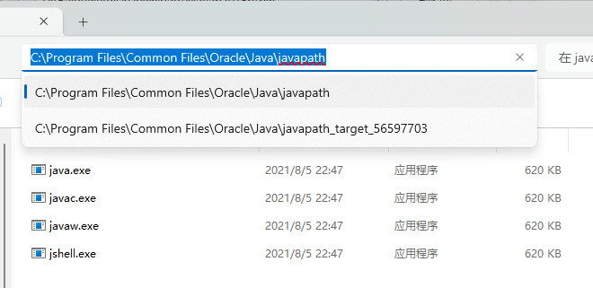

但是java自动配置的环境只包含了四个工具，因此要使用其他工具，还是需要手动配置环境变量。

配置方法：

1、新建变量，变量名为 `JAVA_HOME` ，值为java的安装路径。（不带bin）

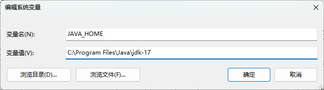

2、在系统环境变量Path中添加如下变量：`%JAVA_HOME%\bin`

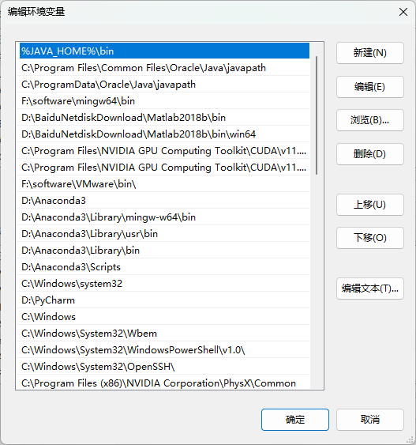


### 跨平台和特性

java 三大类：

- **Java SE** ：Java 语言的（标准版），用于**桌面应用的开发**，是其他两个版本的基础。

    > 学习目的：为将来从事的 Java EE 的开发打基础
    >
    > 桌面应用：用户只要打开程序，程序的界面会让用户在最短的时间内找到他们需要的功能，同时主动带领用户完成他们的工作并得到最好的体验。

- **Java ME** ：Java 语言的（小型版），用于嵌入式电子设备或者小型移动设备。

- **Java EE** ：Java 语言的（企业版），用于 Web 方向的**网站**开发。在这个领域，是当之无愧的的No1。

    > 网站开发：浏览器+服务器


java特性：

- 面向对象
- 安全性
- 多线程
- 简单易用
- 开源
- 跨平台


跨平台：java可以在任何操作系统运行（Write Once Run Anywhere）

- Windows
- macOS
- Linux


跨平台原理：

高级语言的编译运行方式：

- ==编程==：java程序员写的.java代码，c程序员写的.c代码，python程序员写的.py代码

- ==编译==：机器只认识0011的机器语言，把.java .c .py的代码做转化让机器认识的过程
- ==运行==：让机器执行编译后的指令

高级语言的编译运行方式：

- 编译型
- 解释性
- 混合型，半编译，半解释

编译型：

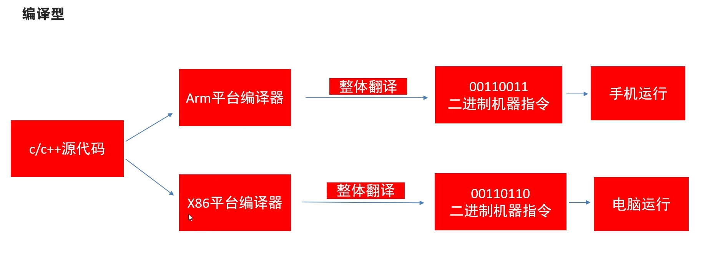

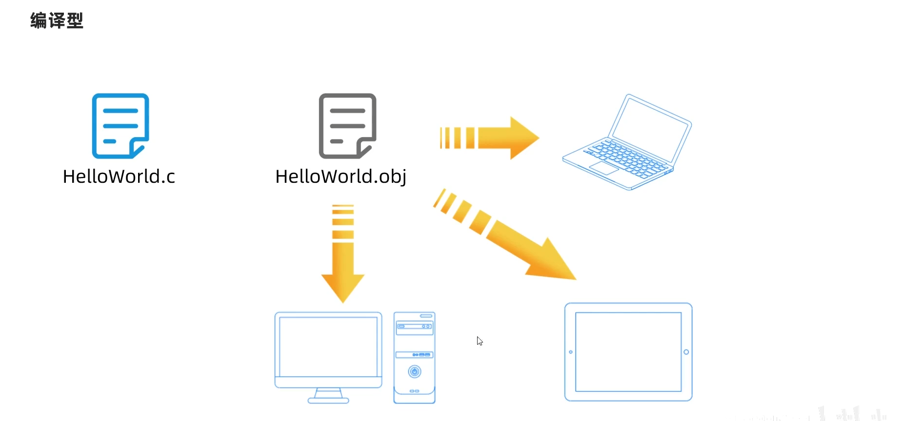

解释型：

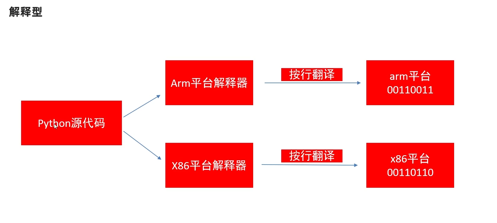

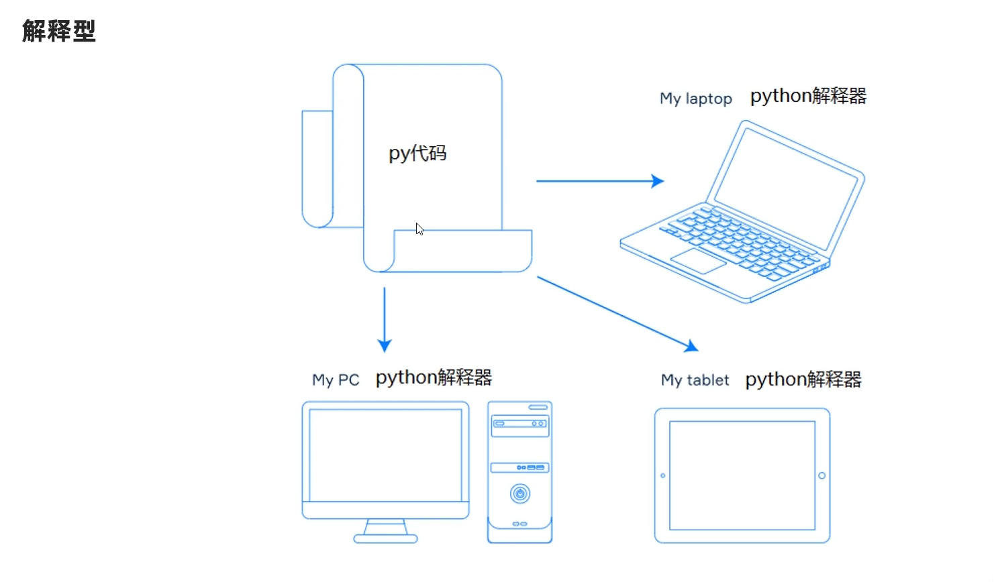

混合型：（java）

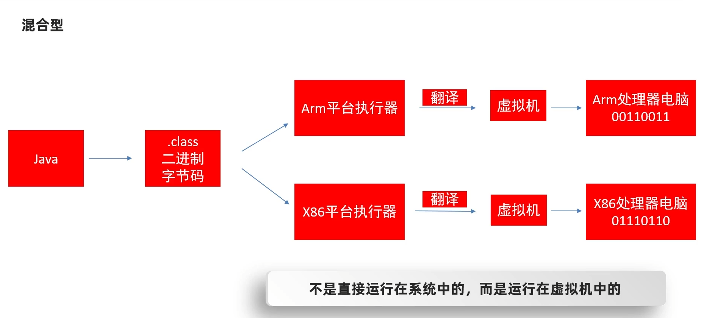

java 跨平台原理：

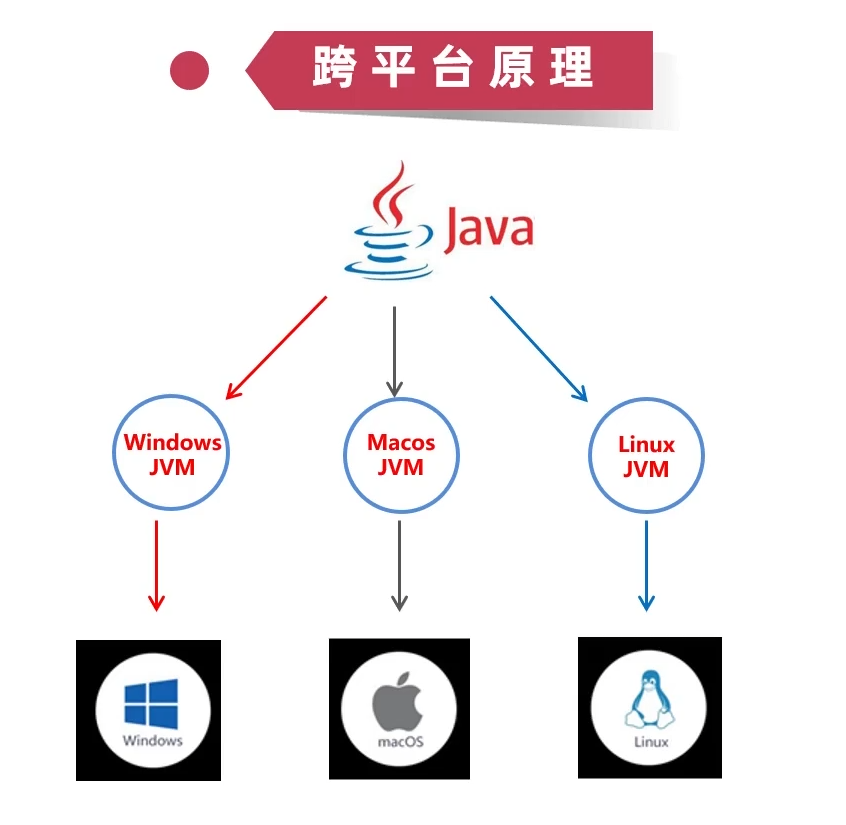

- **Java语言的跨平台是通过虚拟机实现的。**
- Java语言不是直接运行在操作系统里面的，而是运行在虚拟机中的。
- 针对于不同的操作系统，安装不同的虚拟机就可以了。


### JRE和JDK

**JVM**（java Virtual Machine）：java的虚拟机，真正运行java程序的地方

**核心类库**：java事先定义好的类

**开发工具**：

- javac编译工具
- java运行工具
- jdb调试工具
- jhat内存分析工具

JDK：JVM、核心类库和开发工具组成的整体

JDK（Java Development kit）：Java**开发工具包**

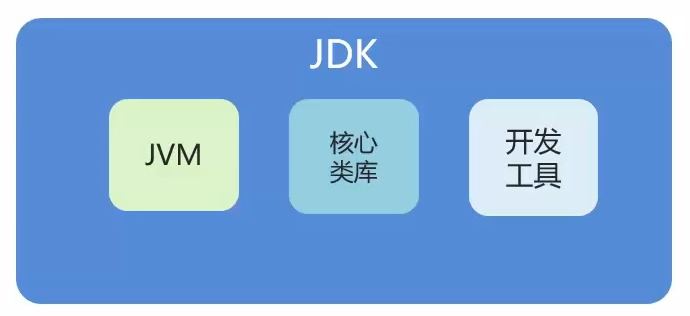

JRE（Java Runtime Environment）：java的**运行环境**

只需要运行工具，不需要编译工具

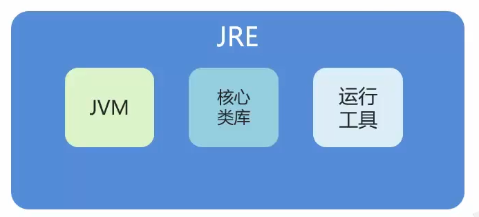

**JDK、JRE和JVM三者的包含关系：**

- **JDK包含了JRE**
- **JRE包含了JVM**


## 2、基础概念

java文件的类名和文件名要一样

### 2.1 注释

注释分类：

- 单行注释

    ```java
    //注释信息
    ```

- 多行注释

    ```java
    /*注释信息*/
    ```

- 文档注释

    ```java
    /** 注释信息**/
    ```


注释内容不会参与编译与运行，仅仅是对代码的解释说明。


### 2.2 关键字

关键字：被Java赋予了特定涵义的英文单词

- 关键字的字母==全部小写==。

- class：用于（创建/定义）一个类，类是Java最基础的组成单元


### 2.3 字面量

告诉程序员：数据在程序中的书写格式

| 字面量类型 |               说明               |            举例             |
| :--------: | :------------------------------: | :-------------------------: |
|  整数类型  |         不带小数点的数字         |          666, -88           |
|  小数类型  |          带小数点的数字          |        13.14, -5.21         |
| 字符串类型 |       用双引号括起来的内容       | "Hello World", "黑马程序员" |
|  字符类型  | 用单引号括起来的，内容只能有一个 |       'A', '0', '我'        |
|  布尔类型  |         布尔值，表示真假         |   只有两个值：true, false   |
|   空类型   |        一个特殊的值，空值        |            null             |

特殊类型：`\t, \n, \r.....`

- `\t` ：在打印的时候，把前面字符串的长度补齐到8，或者8的整数倍。最少补1个空格，最多补8个空格。

    ```java
    System.out.println("name" + '\t' + "age");
    ```

    

### 2.4 变量

数据类型 变量名 = 数据值;

```java
public class VariableDemo1{
    public static void main(String[] args){
    	int a = 10;  
        int b = 10;
        System.out.println(a+b);
    }
}
```


### 2.5 计算机中的数据存储

在计算机中，任意数据都是以二进制的形式来存储的

- 二进制：0b
- 八进制：0
- 十六进制：0x

十进制转其他进制：

除基取余法：不断的除以基数（几进制，基数就是几）得到余数，直到商为0，再将余数倒着拼起来即可。


### 2.6 数据类型

基本数据类型和整数数据类型

| 数据类型 | 关键字  | 取值范围                                 | 内存占用 |
| :------: | :-----: | :--------------------------------------- | :------: |
|   整数   |  byte   | -128~127                                 |    1     |
|          |  short  | -32768~32767                             |    2     |
|          |   int   | -2147483648~2147483647                   |    4     |
|          |  long   | -9223372036854775808~9223372036854775807 |    8     |
|  浮点数  |  float  | -3.401298e-38 到 3.402823e+38            |    4     |
|          | double  | -4.9000000e-324 到 1.797693e+308         |    8     |
|   字符   |  char   | 0-65535                                  |    2     |
|   布尔   | boolean | true, false                              |    1     |

long 类型变量：需要加入 L 标识（大小写都可以）

float 类型变量：需要加入 F 标识（大小写都可以）

字符串：String


### 2.7 标识符

硬性要求：

- 由数字、字母、下划线（_）和美元符（$）组成
- 不能以数字开头
- 不能是关键字
- 区分大小写

软性建议：

- ==小驼峰命名法：方法、变量==

    规范1：标识符是一个单词的时候，全部小写

    范例1：name

    规范2：标识符由多个单词组成的时候，第一个单词首字母小写，其他单词首字母大写

    范例2：firstName

- ==大驼峰命名法：类名==

    规范1：标识符是一个单词的时候，首字母大写

    范例1：Student

    规范2：标识符由多个单词组成的时候，每个单词的首字母大写

    范例2：GoodStudent


### 2.7 键盘录入

- Java帮我们写好了一个类叫Scanner，这个类就可以接收键盘输入的数字。

使用步骤：

1. 导包 —— Scanner这个类在哪

    ```java
    import java.util.Scanner;
    ```

2. 创建对象 —— 表示我要开始使用Scanner这个类了

    ```java
    Scanner sc = new Scanner(System.in);
    ```

3. 接收数据 —— 真正开始干活了

    ```java
    int i = sc.nextInt();
    ```

    


## 3、IDEA

Intellij IDEA，是用于java语言开发的集成环境，它是业界公认的目前用于java程序开发最好的工具。

下载：[IntelliJ IDEA – the Leading Java and Kotlin IDE (jetbrains.com)](https://www.jetbrains.com/idea/)

- project（项目）
    - module（模块）
        - package（包）
            - class（类）

包的命名：公司域名反写+功能 `com.itheima.demo1`

快速生成main函数：`psvm`

快速生成输出函数：`sout`


设置自动导包：Settings -> Editor -> General -> Auto Import 


IDEA 类的操作：新建类、删除类、修改类名

IDEA 模块的操作：新建模块、删除模块、修改模块、导入模块

IDEA 模块的操作：关闭项目、新建项目、打开项目、修改项目


## 4、运算符

运算符：对字面量或变量进行操作的符号。

表达式：用运算符把字面量或者变量连接起来，符合java语法的句子就可以称为表达式。

- 算术运算符
- 自增自减运算符
- 赋值运算符
- 关系运算符
- 逻辑运算符
- 三元运算符
- 运算符优先级

### 算术运算符

- \+	加
- \-     减
- \*    乘 
- /     除
- %   取模、取余

### 隐式转换和强制转换

不同数据类型不能直接做运算

隐式转换：

- 把一个取值范围小的数值，转换成取值范围大的数据
- byte -》short -》int -》long -》float -》double
- byte、short 、char 三种类型运算时，都会直接先提升为int，再进行运算

强制转换：

- 格式：目标数据类型 变量名 = ( 目标数据类型 ) 被强转的数据;

### 字符串和字符的加操作

字符串：

- 当 "+" 操作中出现字符串时，这个 "+" 是字符串连接符，而不是算术运算符了。

- 连续进行 "+" 操作时，从左到右逐个执行。

    1 + 99 + "年黑马"     ——》 "100年黑马"

    1 + 2 + "abc" + 2 + 1 ——》 "3abc21"

字符：

- 字符 + 字符 或 字符 + 数字 ，会把字符通过ASCII码表查询到对应的数字再进行计算。

    1 + 'a' ——》 98

    'a' + "abc" ——》"aabc"

### 自增自减运算符

- ++、--
- 先加和后加，单独写一行结果是一样的，有赋值操作时有区别。

### 赋值和关系运算符

赋值运算符：扩展的运算符底层隐藏了一个强制转换

- =、+=、-=、*=、/=、%=
- ==、!=、>、>=、<、<=

### 逻辑运算符

- &、|、^、!

### 短路逻辑运算符

- &&、||
- 当前一个表达式已经能够得出整个表达式的结果时，不会执行后面的表达式

### 三元运算符

格式：

- 关系表达式？表达式1：表达式2；

### **原码反码补码**

[运算符-12-多学一招原码反码补码_哔哩哔哩_bilibili](https://www.bilibili.com/video/BV17F411T7Ao/?p=38&spm_id_from=pageDriver&vd_source=9ee4e4e88a104cb8b17a1c0f21495c43)

- **原码**：十进制数据的二进制表现形式，最左边是符号位，0为正，1为负。

    利用原码对正数进行计算是不会有问题的。

    但是如果是负数计算，结果就出错，实际运算的结果，跟我们预期的结果是相反的。

- **反码**：为了解决原码不能计算负数的问题而出现的。

    正数的反码不变，负数的反码在原码的基础上，符号位不变，数值取反，0变1,1变0 。

    ==反码可以完美解决负数计算的问题。==

    ==问题：会出现两个0 , `1000 0000` 和 `0000 0000` 。因此跨0会产生1个误差==

- 补码：在反码的基础上加1。

    ==补码完美解决正数和负数的计算问题。==

    为了解决负数计算时跨0的问题而出现的。

正数的原、反、补码都是一样的。


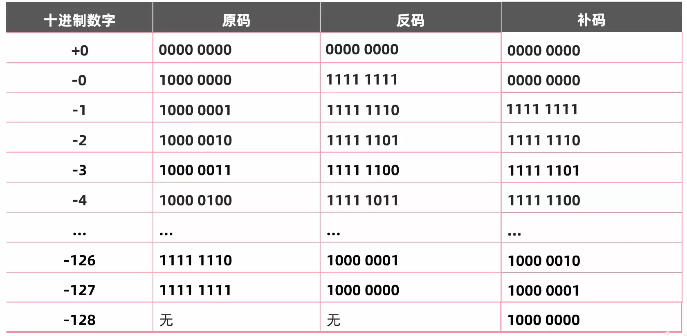

其他运算符：

- &	  逻辑与
- |       逻辑或
- <<     左移
- \>\>     右移
- \>\>\>   无符号右移


## 5、判断与循环

### if

格式：

```java
// 格式1
if(关系表达式){
    语句体;  
}

// 格式2
if(关系表达式){
    语句体1;  
}else{
    语句体2;
}

// 格式3
if(关系表达式){
    语句体1;  
}else if(关系表达式){
    语句体2;
}else{
    语句体3;
}
```

### switch

格式：

```java
switch(表达式){
    case 值1:
        语句体1；
        break;
    case 值2:
        语句体2；
        break;
    ...
    default:
        语句体n+1;
        break;
}
```

- case 后面的值只能是字面量，不能是变量
- case 给出的值不允许重复

switch新特性：jdk12

```java
int number = 1;
switch(number){
    case 1 -> {
        System.out.println("一");
    }
    case 2 -> {
        System.out.println("二");
    }
    case 3 -> {
        System.out.println("三");
    }
    default -> {
        System.out.println("无");
    }
}

// 或者
switch(number){
    case 1 -> System.out.println("一");

    case 2 -> System.out.println("二");

    case 3 -> System.out.println("三");
    default -> System.out.println("无");
}
```


### for

格式：

```java
for(int i = 1;i <= 10;i++){
    System.out.println("Hello World");
}
```

### while

格式：

```java
while(条件判断语句){
    循环体语句;
    条件控制语句;
}
```

### do...while

```java
do{
    循环体语句；
    条件控制语句；
}while(条件判断语句)；
```


### break和continue

- break：结束整个循环
- continue：跳过本次循环


### 生成随机数

```java
import java.util.Random
    
Random r = new Ramdom();

int number = r.nextInt(随机数的范围);
```


## 6、数组

### 数组定义和静态初始化

格式：

```java
// 格式一
int [] array;
// 格式二
int array[];
```

初始化：就是在内存中，为数组容器开辟空间，并将数据存入容器中的过程。

格式：

```java
// 完整格式
int[] array = new int[]{ 11, 22, 33};
// 简化格式
int[] array = { 11, 22, 33};
double[] array2 = { 11.1, 22.2, 33.3};
```


### 数组的地址值和元素访问

地址值

```java
int[] array = { 11, 22, 33};
System.out.println(array); //[I@776ec8df 地址值
//[ : 表示当前是一个数组
//D : 表示当前数组里面的元素都是double类型
//I : 表示当前数组里面的元素都是int类型
//@ : 表示一个间隔符号。（固定格式）
//776ec8df : 数组的真正地址值
```

元素访问

```java
数组名[索引]
```


### 数组遍历

```java
int[] arr = {1,2,3,4,5};
// 在java中，关于数组的一个长度属性：length
// 调用方式：数组名.length
for(int i=0; i<arr.length; i++){
    System.out.println(arr[i]);
}

// 扩展：
// 自动的快速生成数组的遍历方式
// idea提供的
// 数组名.fori
arr.fori
```


### 数组的动态初始化

初始化时只指定数组长度，由系统为数组分配初始值。

格式：

```java
数据类型[] 数组名 = new 数据类型[数组长度];
int[] a = new int[3];
String[] arr = new String[50];
```

数组默认初始化值的规律：

- 整数类型：默认初始化值0
- 小数类型：默认初始化值0.0
- 字符类型：默认初始化值 '/u0000' 空格
- 布尔类型：默认初始化值false
- 引用数据类型：默认初始化值 null


### 数组的内存图

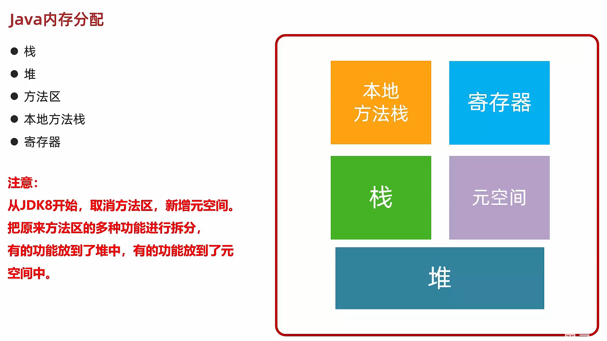

- 栈：方法运行时使用的内存，比如main方法运行，进入方法栈中执行
- 堆：存储对象或者数组，new来创建的，都存储在堆内存
- 方法区.：存储可以运行的class文件
- 本地方法栈：JVM在使用操作系统功能的时候使用，和我们开发无关
- 寄存器：给CPU使用，和我们开发无关


1、只要是new出来的一 定是在堆里面开辟了一个小空间

2、如果new了多次，那么在堆里面有多个小空间，每个小空间中都有各自的数据

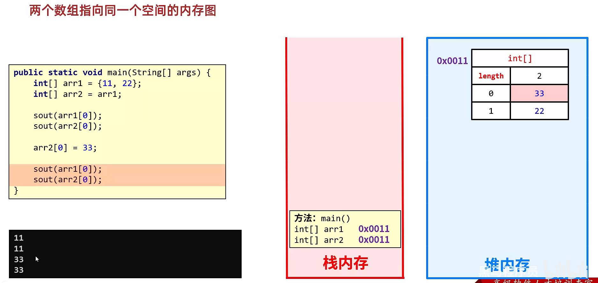

当两个数组指向同一个小空间时，其中一个数组对小空间中的值发生了改变，那么其他数组再次访问的时候都是修改之后的结果了。


### 二维数组

格式：

```java
数据类型[][] 数组名 = new 数据类型[][]{{元素1},{元素2}};
数据类型[][] 数组名 = {{元素1},{元素2}};
```

范例：

```java
int[][] arr = new int[][]{{11,22},{33,44}};
int[][] arr = {{11,22},{33,44}};
```

动态初始化格式：

```java
数据类型[][] 数组名 = new 数据类型[m][n];
```

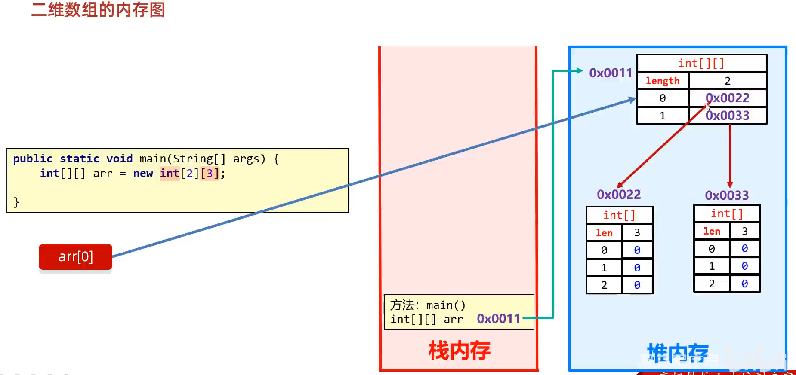

可以自己创建一维数组，一维数组长度可以不一样

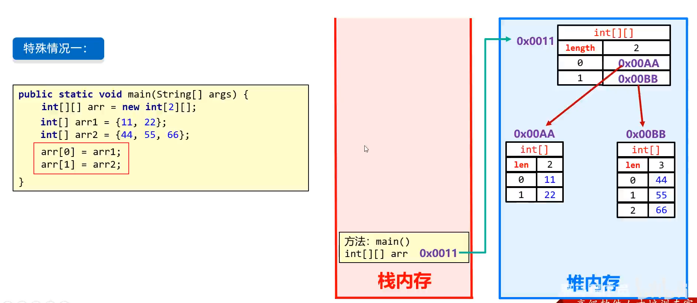


## 7、方法

### 什么是方法？

方法（method）是程序中最小的执行单元。

作用：

- 提高代码的复用性

- 提供代码可维护性

### 方法的定义和调用

- **方法定义**：把一些代码打包在一起，该过程成为方法定义。
- **方法调用**：方法定义后并不是直接运行的，需要手动调用才能执行，该过程称为方法调用。


最简单的方法定义和调用

格式：

```java
public static void 方法名(){
    方法体（就是打包起来的代码）;
}
```

调用：

```java
方法名（）;
```


实例：

```java
package com.itheima.methoddemo;

public class MethodDemo3 {
    public static void main(String[] args){
        getSum();
    }
    
    public static void getSum(){
        int num1 = 10;
        int num2 = 20;
        int result = num1 + num2;
        System.out.println(result);
    }
}
```


### 带参数的方法

定义格式：

```java
public static void 方法名（参数1，参数2，...）{
    ...
}
```

调用格式：

```java
方法名（参数1，参数2，...）；
```

注意：方法调用时，参数的数量与类型必须与方法定义中小括号里面的变量一一对应，否则程序将报错。


### 带返回值的方法

格式：

```java
public static 返回值类型 方法名 （参数）{
    方法体；
    return 返回值；
}
```

调用：

```java
// 直接调用
方法名（实参）;
// 赋值调用
整数类型 变量名 = 方法名（实参）;
// 输出调用
System.out.println(方法名（实参）);
```


### 方法重载

- 在同一个类中，定义了多个==同名的方法==，这些同名的方法具有同种的功能。
- 每个方法具有==不同的参数类型或参数个数==，这些同名的方法，就构成了重载关系

- ==与返回值无关==
- 不再同一个类中的函数，不构成重载关系

参数不同：个数不同、类型不同、顺序不同（不同形参类型）


### 方法内存

- 方法调用的基本内存原理
- 方法传递基本数据类型的内存原理
- 方法传递引用数据类型的内存原理

在Java中，所有的对象（包括整型数组）都保存在堆区。原因是 Java 的内存管理由垃圾回收器负责，无需手动释放内存，所以所有的对象都在堆区进行分配和管理。

C++里面的数组是开辟在栈的，但是用new是开在堆区的。

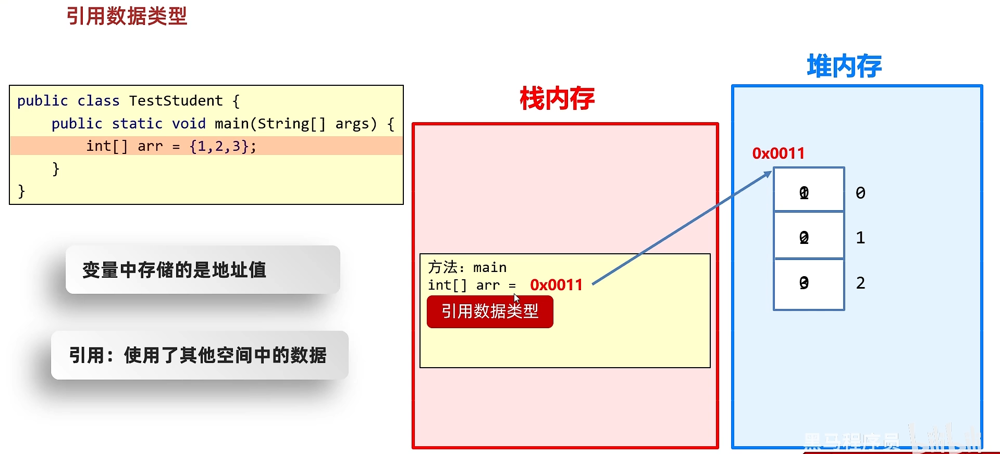

==基本数据类型==：数据值是存储在自己的空间中

特点：赋值给其他变量，也是赋的真实的值。

==引用数据类型==：数据值是存储在其他空间中,自己空间中存储的是地址值。

特点：赋值给其他变量，赋的地址值。


### 方法的值传递

- 传递基本数据类型时，传递的是真实的数据，形参的改变，不影响实际参数的值

- 传递引用数据类型时，传递的是地址值，形参的改变，影响实际参数的值


在Java中，方法默认情况下是无法直接修改传入的实参的值的。Java采用的是"按值传递"机制，即将实参的值复制一份传递给方法。

可以通过返回值的方式将修改后的值传递回去。

```java
public class Main {
    public static void main(String[] args) {
        int value = 10;
        System.out.println("Before modify: " + value); // 输出 10
        value = modifyValue(value);
        System.out.println("After modify: " + value); // 输出 100
    }
    
    public static int modifyValue(int val) {
        return 100; // 返回修改后的值
    }
}
```

但是，你可以通过其他方式改变实参的值。其中一种方式是传递可变对象（如数组或自定义类的实例），然后在方法内部通过修改对象的成员来改变实参的值。

```java
public class Main {
    public static void main(String[] args) {
        int[] array = {1, 2, 3};
        System.out.println("Before modify: " + array[0]); // 输出 1
        modifyArray(array);
        System.out.println("After modify: " + array[0]); // 输出 100
    }
    
    public static void modifyArray(int[] arr) {
        arr[0] = 100; // 修改数组的第一个元素
    }
}
```


### idea快速抽取方法

Ctrl+Alt+M


## 8、面向对象

### 类与对象

- 类（设计图）：是对象共同特征的描述；
- 对象：是真实存在的具体东西。

在java中，必须先设计类，才能获得对象


如何定义类

```java
public class 类名 {
    1、成员变量(代表属性, 一般是名词)
    2、成员方法(代表行为, 一般是动词)
    3、构造器
    4、代码块
    5、内部类
}
```

如何得到类的对象

```java
类名 对象名 = new 类名();
```

如何使用对象

```java
// 访问属性
对象名.成员变量
// 访问行为
对象名.方法名(...)
```


定义类的补充注意事项

- 用来描述一类事物的类，专业叫做：==Javabean类==。

    在Javabean类中，是不写main方法的。

- 在以前，编写main方法的类，叫做==测试类==。

    我们可以在测试类中创建javabean类的对象并进行赋值调用。

- 类名首字母建议大写，需要见名知意，驼峰模式。

- **一个Java文件中可以定义多个class类，且只能一个类是public修饰，而且public修饰的类名必须成为代码文件名。**

    **实际开发中建议还是一个文件定义一个class类。**

- 成员变量的完整定义格式是：`修饰符 数据类型 变量名称=初始化值; ` 一般无需指定初始化值，存在默认值。

对象的成员变量的默认值规则

| 数据类型 | 明细                   | 默认值 |
| -------- | ---------------------- | ------ |
| 基本类型 | byte、short、int、long | 0      |
|          | float、double          | 0.0    |
|          | boolean                | false  |
| 引用类型 | 类、接口、数组、String | null   |


### 封装

对象代表什么，就得封装对应的数据，并提供数据对应的行为


private关键字

- 是一个权限修饰符
- 可以修饰成员(成员变量和成员方法)
- 被private修饰的成，员只能在本类中才能访问.

防止给成员变量赋一个不合法的值。（使用public方法赋值）


### 就近原则和this关键字

```java
public class GirlFriend {
    private int age;
    
    public void method(){
        int age = 10;
        //谁离我近就用谁
        System.out.println(age); // 10
        System.out.println(this.age); // 0
    }
    
}
```


### 构造方法

构造方法也叫作构造器、构造函数。
作用：在创建对象的时候给成员变量进行赋值的。


特点:

- 方法名与类名相同，大小写也要一致
- 没有返回值类型，连void都没有
- 没有具体的返回值(不能由return带回结果数据)

执行时机:

- 创建对象的时候由虚拟机调用，不能手动调用构造方法
- 每创建一次对象，就会调用一次构造方法


构造方法注意事项
①构造方法的定义

- 如果没有定义构造方法，系统将给出一-个默认的无参数构造方法
- 如果定义了构造方法，系统将不再提供默认的构造方法

②构造方法的重载

- 带参构造方法， 和无参数构造方法，两者方法名相同，但是参数不同，这叫做构造方法的重载

③推荐的使用方式

- 无论是否使用，都手动书写无参数构造方法，和带全部参数的构造方法


### 标准JavaBean

标准的JavaBean类：

① 类名需要见名知意

② 成员变量使用==private==修饰

③ 提供至少两个构造方法

- **无参构造方法**
- **带全部参数的构造方法**

④ 成员方法

- **提供每一个成员变量对应的setXx()/getXxx()**
- 如果还有其他行为， 也需要写上


快速生成 JavaBean

快捷键：

- alt + insert

- alt + Fn +insert

插件：

- ptg（在设置插件中下载）
- 下载后，右键空白处，选择 `Ptg To JavaBean`


### 三中情况的对象内存图

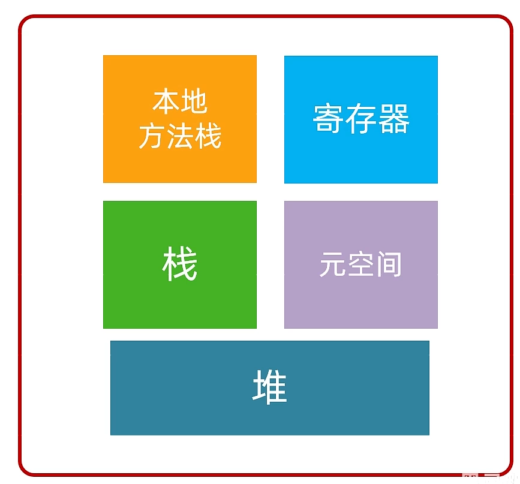

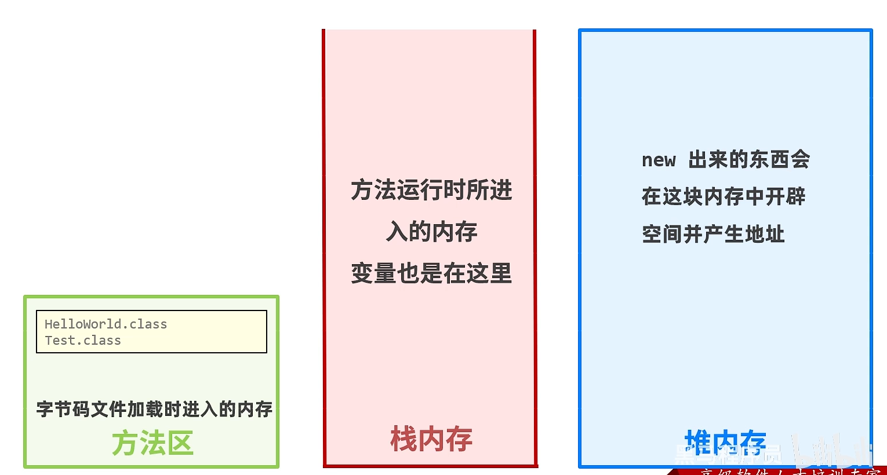

一个对象的内存图：

1. 加载class文件
2. 申明局部变量
3. 在堆内存中开辟一个空间
4. 默认初始化
5. 显示初始化
6. 构造方法初始化

7. 将堆内存中的地址值赋值给左边的局部变量

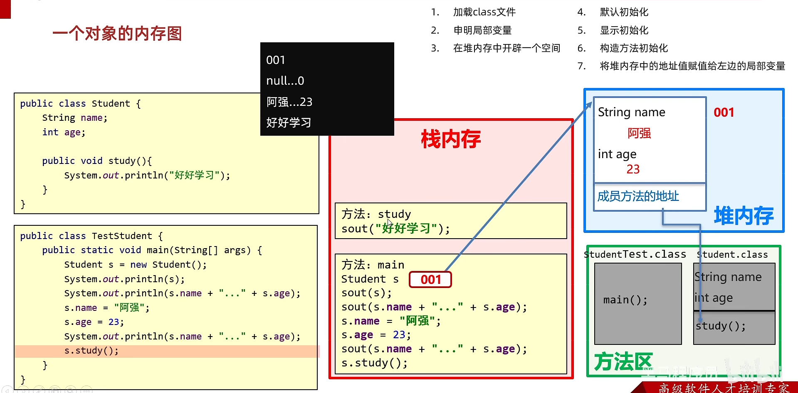

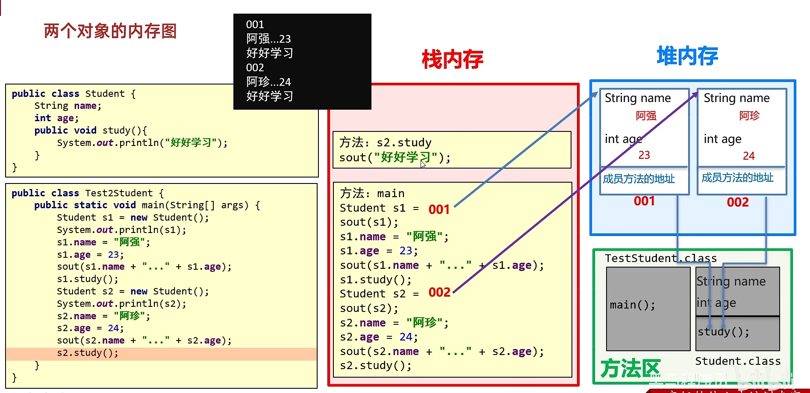

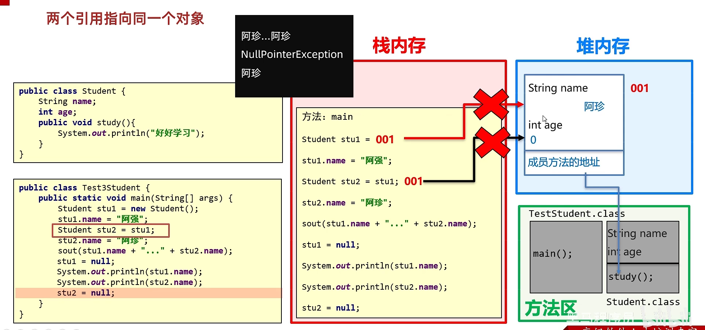


### 基本数据类型和引用数据类型

- 基本数据类型
    - 数据值是存储在自己空间里的
    - 特点：赋值给其他变量，也是赋的真实的值。
- 引用数据类型
    - 数据值是存储在其他空间中，自己空间中存储的是地址值。
    - 特点：赋值给其他变量，赋的地址值。


### this的内存原理

this的作用：区分局部变量和成员变量

this的本质：所在方法调用者的地址值

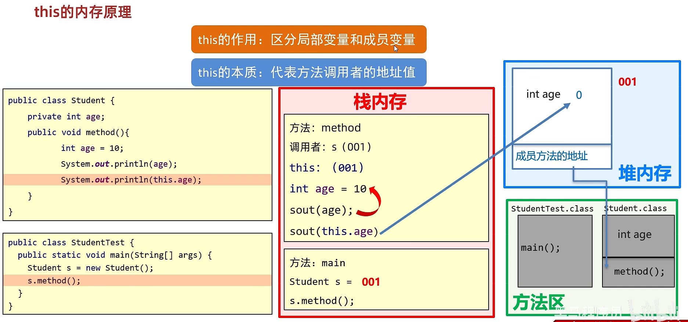


### 成员和局部变量

成员变量：类中方法外的遍历

局部变量：方法中的变量

|     区别     |                  成员变量                  |                    局部变量                     |
| :----------: | :----------------------------------------: | :---------------------------------------------: |
| 类中位置不同 |                类中，方法外                |               方法内、方法申明上                |
| 初始化值不同 |               有默认初始化值               |            没有)使用之前需要完成赋值            |
| 内存位置不同 |                   堆内存                   |                     栈内存                      |
| 生命周期不同 | 随着对象的创建而存在，随着对象的消失而消失 | 随着方法的调用而存在， 随着方法的运行结束而消失 |
|    作用域    |                整个类中有效                |                 当前方法中有效                  |


## 9、字符串

### API和API帮助文档

API (Application Programming Interface) ：应用程序编程接口

Java API：指的就是JDK中提供的各种功能的Java类

这些类将底层的实现封装了起来，我们不需要关心这些类是如何实现的，只需要学习这些类如何使用即可。


### String概述

java.lang 是java的核心包，在使用时不需要导包

java.lang.String类代表字符串，Java 程序中的所有字符串文字(例如"abc" )都为此类的对象。

字符串的值不能改变，一旦创建就不能改变


### String构造方法

1、直接赋值

```java
String s1 = "abc";
```


2、使用new获取一个字符串对象

```java
String s2 = new String();
```

| 构造方法                       | 说明                             |
| ------------------------------ | -------------------------------- |
| public String()                | 创建空白字符串，不含任何内容     |
| public String(String original) | 根据传入的字符串，创建字符串对象 |
| public String(char[] chs)      | 根据字符数组，创建字符串对象     |
| public String(byte[] chs)      | 根据字节数组，创建字符串对象     |


直接赋值：

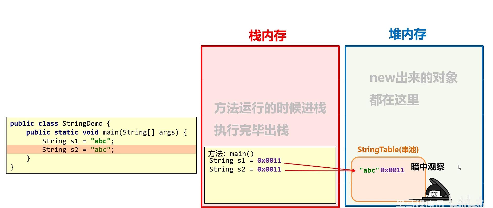

当使用双引号直接赋值时，系统会检查该字符串在串池中是否存在。

- 不存在：创建新的
- 存在：复用


new：

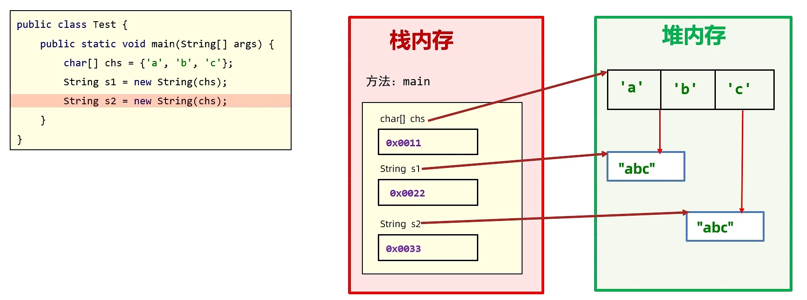

字符串不会复用。


### 字符串的比较

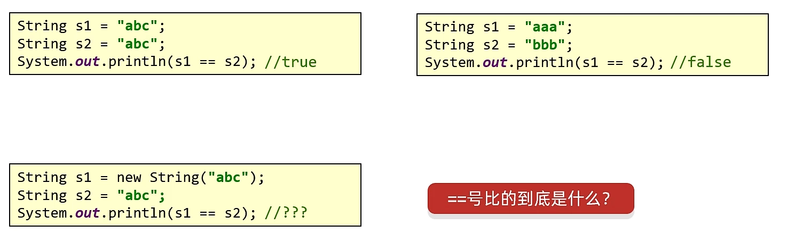

**基本数据类型比较数据值，引用数据类型比较地址值**

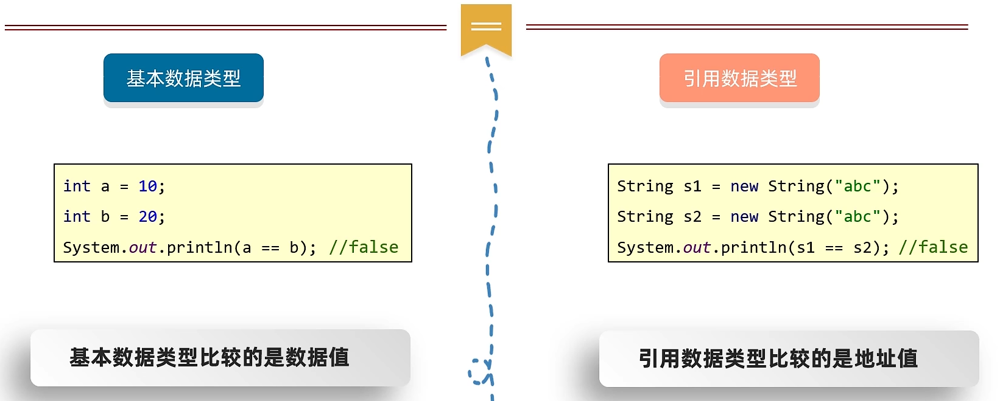

```java
// 完全一样结果为true，否则为false
boolean equals(要比较的字符串)
// 忽略大小写
boolean equalsIgnoreCase(要比较的字符串)
```

示例：

```java
boolean result = s1.equals(s2);
```


### 索引和长度

```java
// 根据索引返回字符
public char charAt(int index)
// 返回此字符串的长度
public int length()
// 数组的长度
数组名.length
//字符串的长度
字符串对象.length()
```


### 截取子串

```java
String substring(int beginIndex, int endIndex)
//注意点:包头不包尾，包左不包右
//只有返回值才是截取的小串
String substring(int beginIndex)	//截取到末尾
```


### 替换

```java
String replace(旧值,新值)	//替换
//注意点:只有返回值才是替换之后的结果
```


### StringBuilder

StringBuilder可以看成是一个容器， 创建之后里面的内容是可变的

作用：提高字符串的操作效率


构造方法：

| 方法名                           | 说明                                       |
| -------------------------------- | ------------------------------------------ |
| public StringBuilder()           | 创建一个空白可变字符串对象，不含有任何内容 |
| public StringBuilder(String str) | 根据字符串的内容,来创建可变字符串对象      |

常用方法：

| 方法名                                 | 说明                                               |
| -------------------------------------- | -------------------------------------------------- |
| public StringBuilder append (任意类型) | 添加数据，并返回对象本身                           |
| public StringBuilder reverse()         | 反转容器中的内容                                   |
| public int length()                    | 返回长度(字符出现的个数)                           |
| public String toString()               | 通过toString(就可以实现把StringBuilder转换为String |


### StringJoiner

- StringJoiner跟StringBuilder一样，也可以看成是一个容器，创建之后里面的内容是可变的。
- 作用：提高字符串的操作效率，而且代码编写特别简洁，但是目前市场上很少有人用。
- JDK8出现的

| 方法名                                             | 说明                                                         |
| -------------------------------------------------- | ------------------------------------------------------------ |
| public StringJoiner (间隔符号)                     | 创建一个StringJoiner对象， 指定拼接时的间隔符号              |
| public StringJoiner (间隔符号，开始符号，结束符号) | 创建一个StringJoiner对象， 指定拼接时的间隔符号、开始符号、结束符号 |

示例：

```java
StringJoiner sj = new StringJoiner("---");
//输出：1---2---3
StringJoiner sj = new StringJoiner("， ", "[", "]");
//输出：[1, 2, 3]
```

成员方法：

| 方法名                               | 说明                                       |
| ------------------------------------ | ------------------------------------------ |
| public StringJoiner add (添加的内容) | 添加数据，并返回对象本身                   |
| public int length()                  | 返回长度(字符出现的个数)                   |
| public String toString()             | 返回一个字符串(该字符串就是拼接之后的结果) |


### 字符串底层原理

扩展底层原理1：字符串存储的内存原理

- 直接赋值会复用字符串常量池中的

- new出来不会复用，而是开辟一个新的空间

扩展底层原理2：==号比较的到底是什么?

- 基本数据类型比较 数据值
- 引用数据类型比较 地址值

扩展底层原理3：字符串拼接的底层原理

- 拼接的时候没有变量，都是字符串

- 触发字符串的优化机制。

- 在编译的时候就已经是最终的结果了。


有变量参与：

- 一个加号，堆内存中两个对象

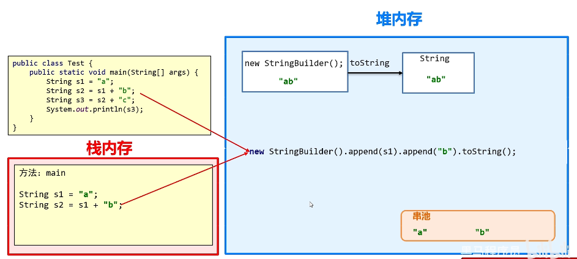

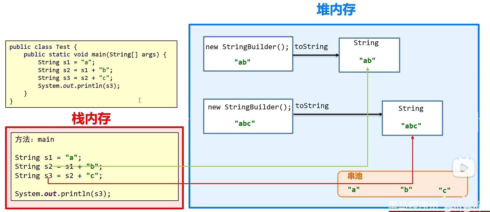

JDK8字符串拼接的底层原理：预估拼接后字符串长度。

字符串拼接的时候有变量参与:

- 在内存中创建了很多对象
- 浪费空间，时间也非常慢

结论:

- 如果很多字符串变量拼接,不要直接+。在底层会创建多个对象，浪费时间，浪费性能。
- 如果没有变量参与，都是字符串直接相加，编译之后就是拼接之后的结果，会复用串池中的字符串。
- 如果有变量参与，每一行拼接的代码，都会在内存中创建新的字符串浪费内存。


扩展底层原理4：StringBuilder提高效率原理图

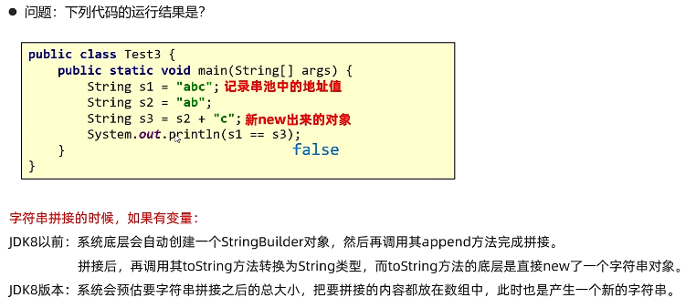

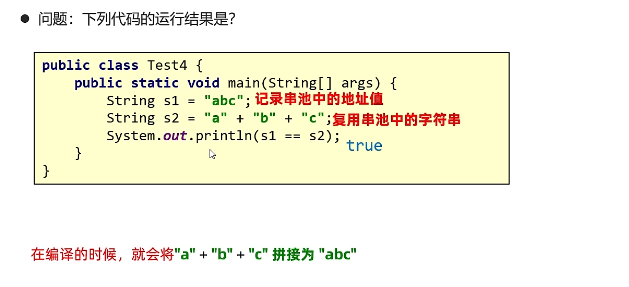

所有要拼接的内容都会往StringBuilder中放，不会创建很多无用的空间，节约内存


扩展底层原理5：StringBuilder源码分析

- 默认创建一个长度为16的字节数组
- 添加的内容长度小于16，直接存
- 添加的内容大于16会扩容(原来的容量*2+2)
- 如果扩容之后还不够，以实际长度为准

扩容：

- 老容量*2+2
- 如果超出*2+2的容量则以实际容量为准

```java
StringBuilder sb = new StringBuilder();
sb.capcity();
sb.length();
```


## 10、ArrayList

### 集合的基本使用

集合和数组的对比

|          | 集合                                         | 数组                                                 |
| -------- | -------------------------------------------- | ---------------------------------------------------- |
| 长度     | 固定                                         | 可变                                                 |
| 存储类型 | 可以存储基本数据类型<br />可以存引用数据类型 | 可以存引用数据类型<br />基本数据类型需要转换为包装类 |

```java
ArrayList<String> list = new ArrayList<String>();
//JDK7
ArrayList<String> list = new ArrayList<>();
//此时我们创建的是ArrayList的对象，而ArrayList 是java已经写好的一个类
//这个类在底层做了一些处理
//打印对象不是地址值，而是集合中存储数据内容
//在展示的时候会拿[]把所有的数据进行包裹
```

成员方法：

| 方法名               | 说明                                |
| -------------------- | ----------------------------------- |
| boolean add(E e)     | 添加元素，返回值表示是否添加成功    |
| boolean remove(E e)  | 删除指定元素,返回值表示是否删除成功 |
| E remove(int index)  | 删除指定索引的元素返回被删除元素    |
| E set(int index,E e) | 修改指定索引下的元素,返回原来的元素 |
| E get(int index)     | 获取指定索引的元素                  |
| int size()           | 集合的长度，也就是集合中元素的个数  |


### 添加字符串和遍历

```java
public class Test1 {
    pub1ic static void main(string[] args) {
        //1.创建集合
        ArrayList<string> list = new ArrayList<>();

        //2.添加元衰
        list.add("点赞了吗? ");
        list.add("收藏了吗? ");
        list.add("投币了吗? ");
        list.add("转发了吗? ");

        //3.遍历
        System.out.print("[");
        for (1nt i = 0; i < list.size(); i++) {
            if(i == list.size() - 1){
                system.out.print(1ist .get(i));
            }e1se{
                System.out.print(1ist.get(i) + ",");
            }
        }
        system. out .println("]");
    }
}
```


### 添加基本数据类型

基本数据类型对应的包装类

| 基本数据类型 |  包装类   |
| :----------: | :-------: |
|     byte     |   Byte    |
|    short     |   Short   |
|     char     | Character |
|     int      |  Integer  |
|     long     |   Long    |
|    float     |   Float   |
|    double    |  Double   |
|   boolean    |  Boolean  |

```java
public class Test2 {
    public static void main(String[] args) {
        //1.创建集合
        ArrayList<Integer> 1ist = new ArrayList<>();
        
        //2.添加元素
        //jdk5以后int Integer 之间是可以互相转化的
        1ist.add(1);
        1ist.add(2);
        list.add(3);
        list.add(4);
        list.add(5);
        
        //3.遍历集合
        System.out.print("[");
        for (1nt i = 0; i < list.size(); i++) {
            if(i == list.size() - 1){
                system.out.print(1ist .get(i));
            }e1se{
                System.out.print(1ist.get(i) + ",");
            }
        }
        system. out .println("]");
    }
}
```


## 11、面向对象进阶

### static静态变量

static表示静态，是Java中的一个修饰符，可以修饰成员方法，成员变量

- 被static修饰的成员变量，叫做**静态变量**

    特点:

    - 被该类所有对象共享
    - 不属于对象，属于类。
    - **随着类的加载而加载，优先于对象存在**

    调用方式:

    - 类名调用 ( 推荐 )
    - 对象名调用.

- 被static修饰的成员方法，叫做**静态方法**

    特点:

    - 多用在测试类和**工具类**中
    - Javabean类中很少会用

    调用方式:

    - 类名调用(推荐)
    - 对象名调用


工具类

Javabean类：用来描述一类事物的类。 比如，Student, Teacher, Dog, Cat等

测试类：用来检查其他类是否书写正确，带有main方法的类，是程序的入口

工具类：不是用来描述一类事物的，而是帮我们做一些事情的类。

- **私有化构造方法：为了不让外界创建它的对象**
- **方法需要定义为静态，方便调用**


内存图：

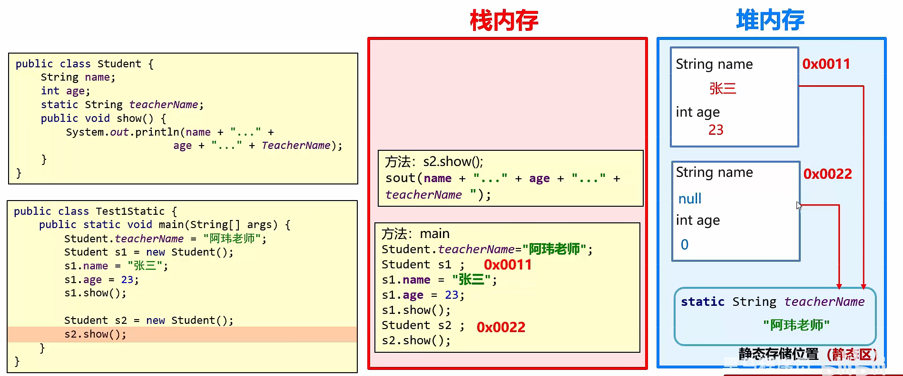


注意事项：

- 静态方法中，只能访问静态。
- 非静态方法可以访问所有。
- 静态方法中没有this关键字


### 继承

- Java中提供一个关键字 `extends`，用这个关键字，我们可以让一个类和另一个类建立起继承关系。

- ```java
    public class Student extends Person {}
    ```

- Student称为==子类（派生类）==，Person称为==父类（基类或超类）==。


使用继承的好处

- 可以把多个子类中重复的代码抽取到父类中了，提高代码的复用性。
- 子类可以在父类的基础上，增加其他的功能，使子类更强大。


什么时候用继承?

当类与类之间，存在相同(共性)的内容，并满足子类是父类中的一种，就可以考虑使用继承，来优化代码


继承后子类的特点?

- 子类可以得到父类的属性和行为，子类可以使用。
- 子类可以在父类的基础上新增其他功能，子类更强大。


### 继承特点和体系设计

Java只支持单继承，不支持多继承，但支持多层继承。

单继承：一个子类只能继承一个父类

不支持多继承：子类不能同时继承多个父类

多层继承：子类A继承父类B，父类B可以继承父类C

子类A**直接继承**父类B，子类A**间接继承**父类C

==每一个类都直接或者间接的继承于Object==


总结：

1. Java只能单继承：一个类只能继承一个直接父类。
2. Java不支持多继承、但是支持多层继承。
3. Java中所有的类都直接或者间接继承于0bject类。
4. 子类只能访问父类中非私有的成员


### 继承内存图

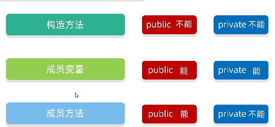

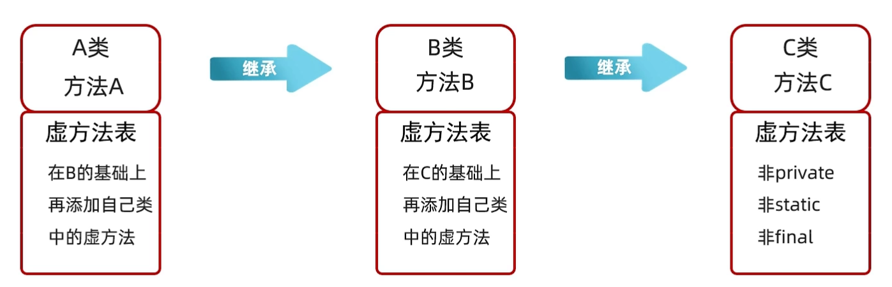

只有父类中的虚方法才能被子类继承


### 继承中成员变量、方法和构造的访问特点

**成员变量**：就近原则：谁离我近，我就用谁

先在局部位置找，本类成员位置找，父类成员位置找，逐级往上。

```java
// 局部变量
name
// 成员变量
this.name
// 父类变量
super.name
```


**成员方法：**

直接调用满足就近原则：谁离我近，我就用谁

super调用，直接访问父类

作用：重写方法


**构造方法：**

- 父类中的构造方法不会被子类继承
- 子类中所有的构造方法默认先访问父类中的无参构造，再执行自己。

为什么?

- 子类在初始化的时候， 有可能会使用到父类中的数据，如果父类没有完成初始化，子类将无法使用父类的数据。
- 子类初始化之前， 一定要调用父类构造方法先完成父类数据空间的初始化。

怎么调用父类构造方法的?

- **子类构造方法**的第一行语句默认都是：super()， 不写也存在，且必须在第一行。
- 如果想调用父类有参构造， 必须手动写super进行调用。

总结：

- 子类不能继承父类的构造方法，但是可以通过super调用
- 子类构造方法的第一行，有一个默认的super();
- 默认先访问父类中无参的构造方法，再执行自己。
- 如果想要方法文父类有参构造，必须手动书写。


### 重写方法

方法的重写

- 当父类的方法不能满足子类现在的需求时，需要进行方法重写

书写格式

- 在继承体系中，子类出现了和父类中一模一样的方法声明，我们就称子类这个方法是重写的方法。

@Override重写注解

- @Override是放在重写后的方法上，校验子类重写时语法是否正确。
- 加上注解后如果有红色波浪线，表示语法错误。
- 建议重写方法都加@Override注解，代码安全，优雅!

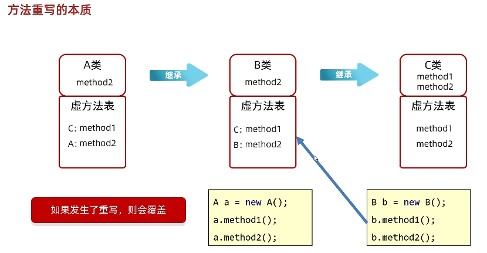

方法重写注意事项和要求

1. 重写方法的名称、形参列表必须与父类中的一致。

2. 子类重写父类方法时，访问权限子类必须大于等于父类(暂时了解 :空着不写< protected < public)

3. 子类重写父类方法时，返回值类型子类必须小于等于父类

4. 建议：重写的方法尽量和父类保持一致。 

5. 只有被添加到虚方法表中的方法才能被重写


方法重写的本质?

覆盖虛方法表中的方法


### this、super总结

this：理解为一个变量，表示当前方法调用者的地址值;
super：代表父类存储空间。

| 关键字 | 访问成员变量                         | 访问成员方法                             | 访问构造方法                    |
| ------ | ------------------------------------ | ---------------------------------------- | ------------------------------- |
| this   | this.成员变量<br />访问本类成员变量  | this.成员方法(...)<br />访问本类成员方法 | this(..)<br />访问本类构方法    |
| super  | super.成员变量<br />访问父类成员变量 | super.成员方(...)<br />访问父类成员方法  | super(..)<br />访问父类构造方法 |


### 多态

什么是多态?

- 同类型的对象，表现出的不同形态

多态的表现形式

- 父类类型 对象名称 = 子类对象;

多态的前提

- 有继承/实现关系

- 有父类引用指向子类对象

- 有方法重写


多态中调用成员的特点

- 变量调用：编译看左边，运行也看左边。
- 方法调用：编译看左边，运行看右边。


多态的优势和弊端

优势：

- 在多态形式下，右边对象可以实现解耦合,便于扩展和维护。

```java
Person p =new Student ();
p. work(); // 业务逻辑发生改变时，后续代码无需修改
```

- 
    定义方法的时候，使用父类型作为参数，可以接收所有子类对象，体现多态的扩展性与便利。

弊端：

- 不能调用子类的特有功能

解决方案：

```java
Animal a = new Dog();
Dog d = (Dog)a;
d.lookHome();

// 判断类型
if(a instanceof Dog){
    Dog d = (Dog)a;
	d.lookHome();
}else if(a instanceof Cat){
    Cat c = (Dog)a;
	c.lookHome();
}

// 新特性
if(a instanceof Dog d){
	d.lookHome();
}else if(a instanceof Cat c){
	c.lookHome();
}
```


