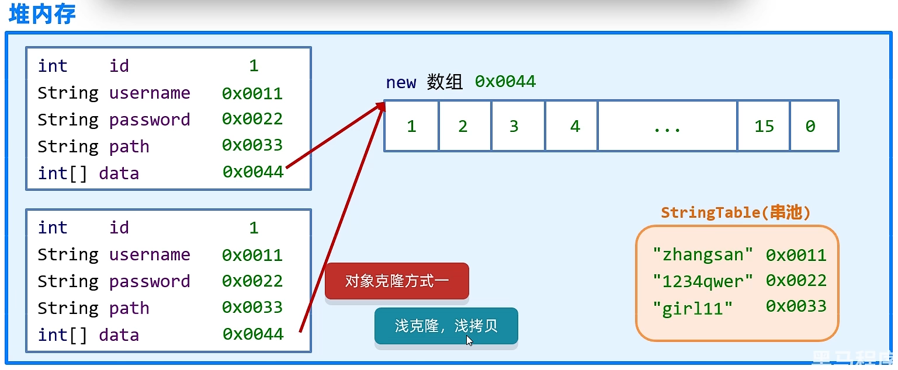
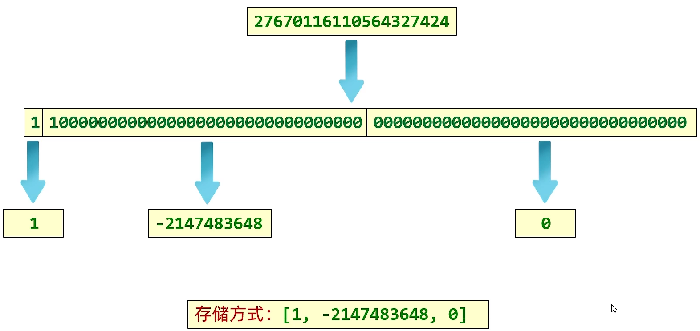

# 1、Math

- 是一个帮助我们用于进行数学计算的工具类
- ==私有化构造方法，所有的方法都是静态的==


Math中常用的方法

| 方法名                                            | 说明                                      |
| ------------------------------------------------- | ----------------------------------------- |
| public static int            abs( int a )         | 获取绝对值                                |
| public static double    ceil( double a )          | 向上取整                                  |
| public static double    floor( double a )         | 向下取整                                  |
| public static int            round( float a )     | 四舍五入                                  |
| public static int            max( int a, int b )  | 获取两个int值中的较大值                   |
| public static double    pow( double a, double b ) | 返回 a 的 b 次幂的值                      |
| public static double    random( )                 | 返回值为 double 的随机值，范围 [0.0, 1.0) |
| public static double   sqrt( double a )           | 返回平方根                                |
| public static double   cbrt( double a )           | 返回立方根                                |

ctrl + n 查询源代码

int的范围：-2147483648~2147483647


# 2、System

System也是一个工具类，提供了一些与系统相关的方法

| 方法名                                                       | 说明                         |
| ------------------------------------------------------------ | ---------------------------- |
| public static void   exit( int status )                      | 终止当前运行的 java 虚拟机   |
| public static long   currentTimeMillis( )                    | 返回当前系统的时间毫秒值形式 |
| public static void   arraycopy( 数据源数组，起始索引，目的地数组，起始索引，拷贝个数 ) | 数组拷贝                     |

1 秒 = 1000 毫秒


# 3、Runtime

Runtime 表示当前虚拟机的运行状态

| 方法名                                                   | 说明                                        |
| -------------------------------------------------------- | ------------------------------------------- |
| public static Runtime   getRuntime()                     | 获取系统的运行环境对象                      |
| public            void          exit( )                  | 停止虚拟机                                  |
| public            int             availableProcessors( ) | 获得CPU的线程数                             |
| public            long          maxMemory( )             | JVM能从系统中获取总内存的大小（单位byte）   |
| public            long          totalMemory( )           | JVM已经从系统中获取总内存的大小（单位byte） |
| public            long          freeMemory( )            | JVM剩余内存大小（单位byte）                 |
| public            Process    exec(String command)        | 运行cmd命令                                 |

Runtime 类的构造函数为私有类型

有一个私有的静态的Runtime对象，通过getRuntime() 获得

保证了 JVM 中只有一个 Runtime 对象，表示当前的运行环境

当前使用的内存大小：

`Runtime.getRuntime().totalMemory()/1024/1024 - Runtime.getRuntime().freeMemory()/1024/1024`


# 4、Object

- Object是Java中的顶级父类。所有的类都直接或间接的继承于Object类。
- Object类中的方法可以被所有子类访问，所以我们要学习Object类和其中的方法。


Object的构造方法

| 方法名          | 说明     |
| --------------- | -------- |
| public Object() | 空参构造 |

顶级父类只有空参构造


Object的成员方法（11个）

| 方法名                                          | 说明                     |
| ----------------------------------------------- | ------------------------ |
| public           String       toString()        | 返回对象的字符串表示形式 |
| public           boolean   equals( Object obj ) | 比较两个对象是否相等     |
| protected    Object       clone( Object obj )   | 对象克隆                 |

## toString()

```java
Object obj = new Object();
String str1 = obj.toString();
System.out.println(str1);
// 包名 类名 地址值
// java.lang.Object@4eec7777

//直接打印一个对象，和使用toString的效果是一样的
Student stu = new Student();
String str2 = stu.toString();
// 两者效果相同
System.out.println(str2);
System.out.println(stu);
//核心逻辑:
//当我们打印一个对象的时候，底层会调用对象的tostring方法。把对象变成字符串。
//然后再打印在控制台上，打印完毕换行处理。
```

如果我们打印对象不是想获取对象的地址值，而是对象的属性值，怎么做？

==处理方案：重写父类 toString() 方法==

因此，如果我们打印一个对象，想要看到属性值的话。那么就直写tostring方法就可以了:

在重写的方法中，把对象的属性值进行拼接。


## equals( Object obj )

```java
Student s1 = new Student();
Student s2 = new Student();
//Object类中，equals是使用 == 号实现的比较，因此对于引用数据类型比较的是 两者的地址值
boolean result1 = s1.equals(s2);
System.out.println(result1);
//两者地址值不相等，因此打印false
//false
```

如果我们想比较两个引用类型的内容是否相等，而不是地址值，怎么做？

==处理方案：重写父类 equals() 方法==

快捷键：alt + insert

选择 equals() and hashCode()

```java
@Override
public boolean equals(Object o) {
    if (this == o) return true;
    if (o == null || getClass() != o.getClass()) return false;
    Student student = (Student) o;
    return Objects.equals(name, student.name) && Objects.equals(age, student.age);
}
```

==**面试题：**==

```java
String s = "abc";
StringBuilder sb = new StringBuilder("abc");

System.out.println(s.equals(sb));	//false
//因为equals.方法是被s调用的，而s是字符申.
//所以equals要看string类中的
//字符申中的equals方法，先判新参数是否为字符中
//如果是字符串，再比较内部的属性
//但是如果参数不是字符串，直接返回false
System.out.println(sb.equals(s));	//false
//因为equals方法足被sb调用的，而sb是stringBuilder
//用以这里的equals方法要看stringBuilder中的equals方法
//那么在StringBuilder当中，没有重写equals方法
//使用的是object中的
//在0bject.当中默认是使用==号比较两个对象的地址值
//而这里的s和sb记录的地址值是不一-样的，所以结果返回false
```


## clone( Object obj )

对象克隆：把A对象的属性值完全拷贝给B对象，也叫对象拷贝，对象复制

- 在Java中，`clone`方法是一个受保护的方法，不能直接从类的实例中调用。这是因为`clone`方法的默认访问级别是受保护的，只能被类本身和其子类访问。如果你要在一个类的外部调用`clone`方法，你需要创建一个该类的子类，并从子类中调用`clone`方法。

- 另外，需要注意的是，如果一个类没有实现`Cloneable`接口，那么调用`clone`方法时会抛出`CloneNotSupportedException`异常。因此，如果你想使用`clone`方法，需要确保你的类实现了`Cloneable`接口。

- 此外，即使一个类实现了`Cloneable`接口，默认的`clone`方法实现仍然是浅拷贝（即只拷贝对象的引用而不拷贝对象的内容），如果你需要进行深拷贝（即拷贝对象的内容），需要在类中自定义`clone`方法的实现。

需要实现 Clonable 接口：`implements Clonable`

该接口里面没有抽象方法，表示当前接口是一个标记性接口

现在Cloneable表示一旦了实现，那么当前类的对象就可以被克隆，如果没有实现，当前类的对象就不能克隆

细节:

方法在底层会帮我们创建一个对象， 并把原对象中的数据拷贝过去。

书写细节:

1. 重写0bject中的clone方为

2. javabean类实现Cloneable接口
3. 创建原对象并调用clone就可以了。

```java
@Override
protected Object clone() throws CloneNotSupportedException {
    return super.clone();
}
```


**浅克隆，浅拷贝**

- 不管对象内部的属性是基本数据类型还是引用数据类型，都完全拷贝过来



**深克隆，深拷贝**

- 基本数据类型拷贝过来
- 字符串复用
- 引用数据类型会重新创建新的


**object中的 clone 是浅克隆，选用重写 clone 方法实现深克隆**

```java
@Override
protected Object clone() throws CloneNotSupportedException {
    int[] data = this.data;
    int[] newData = new int[data.length];
    for (int i = 0; i < data.length; i++) {
        newData[i] = data[i];
    }
    User u = (User) super.clone();
    u.data = newData;

    return u;
}
```

**使用第三方工具，实现深克隆**	`gson-2.6.2.jar`

1. 将第三方写的代码导入到项目中

    在当前模块创建 lib 文件夹，将jar包放在文件夹中

    右键，选择 Add as library

2. 编写代码

    ```java
    Gson gson = new Gson();
    //把对象变成一个字符串
    String s = gson.toJson(u1);
    //再把字符串变回对象就可以了
    User user = gson.fromJson(s, User.class);
    ```

    

# 5、Objects

Objects是一个工具类，提供了一些方法去完成一些功能。

Objects的成员方法：

| 方法名                                                       | 说明                                      |
| ------------------------------------------------------------ | ----------------------------------------- |
| public           static   boolean      equals( Object a, Object b) | 先做非空判断，比较两个对象                |
| public           static   boolean      isNull( Object obj )  | 判断对象是否为null，为null返回true， 反之 |
| protected     static   boolean     nonNull( Object obj )     | 判断对象是否为null，跟isNull的结果相反    |


```java
boolean result = Objects.equals(s1, s2);
//1.方法的底层会判断s1足否为nu11， 如果为null，直按退回false
//2.如果s1不为null，那么就利用s1再次调用equals方法
//3.此时s1是student类型，所以最终还是会调用student中的equals方法。
// 如果没有重写，比较地址值，如果正写了，就比较属性值。

student s3 = new student();
student s4 = null ;
System.out.println(objects.isNuLL(s3));//false
System.out.println(Objects.isNuLL(s4));//true .
```

1. Objects是一个对象工具类，提供了一些操作对象的方法
2. equals(对象1,对象2) ：先做非空判断，比较两个对象
3. isNull(对象)：判断对象是否为空
4. nonNull(对象)：判断对象是否不为空


# 6、BigInteger

在Java中，整数有四种类型：byte，short， int，long。

在底层占用字节个数：byte 1个字节、short 2个字节、int 4个字节、long 8个字节。

## BigInteger 构造方法

| 方法名                                       | 说明                                     |
| -------------------------------------------- | ---------------------------------------- |
| public  BigInterger( int num, Random rnd )   | 获取随机大整数，范围：[ 0~2 的num次方-1] |
| public  BigInterger( String val )            | 获取指定的大整数                         |
| public  BigInterger( String val, int redix)  | 获取指定进制的大整数                     |
| public static BigInteger value0f( long val ) | 静态方法获取BigInteger的对象，内部有优化 |

- 对象一旦创建，内部记录的值不能发生改变

- 静态方法 valueOf 的取值范围较小

    - 在 long 的取值范围之内

    - 在内部对常用的数字: -16~16进行了优化。

        提前把 -16 ~16 先创建好 BigInteger 的对象，如果多次获取不会重新创建新的。

BigInteger 构造方法小结

1. 如果 BigInteger 表示的数字没有超出long的范围，可以用静态方法获取。
2. 如果 BigInteger 表示的超出long的范围，可以用构造方法获取。
3. 对象一旦创建，BigInteger 内部记录的值不能发生改变。
4. 只要进行计算都会产生一个新的 BigInteger 对象


## BigInteger 成员方法

| 方法名                                                       | 说明                              |
| ------------------------------------------------------------ | --------------------------------- |
| public  BigInterger   add( BigInterger val )                 | 加法                              |
| public  BigInterger   subtract( BigInterger val )            | 减法                              |
| public  BigInterger   multiply( BigInterger val )            | 乘法                              |
| public  BigInterger   divide( BigInterger val )              | 除法，获取商                      |
| public  BigInterger[]   divideAndRemainder( BigInterger val ) | 除法，获取商和余数                |
| public  BigInterger   equals( BigInterger val )              | 比较是否相同                      |
| public  BigInterger   pow( BigInterger val )                 | 次幂                              |
| public  BigInterger   max/min( BigInterger val )             | 返回较大值/较小值                 |
| public  int   intValue( BigInterger val )                    | 转为int类型整数，超出范围数据有误 |


## BigInteger 底层原理


1. 对于计算机而言，其实是没有数据类型的概念的，都是0101010101。

2. 数据类型是编程语言自己规定的。

BigInteger 类中，有以下两个常量成员：

- final int signum;

    用于记录整数的符号位，正数为 1，负数为 -1

- final int[] msg;

    数组中的每一个元素记录一个 32位的整数，元素拼接起来就是原来整数的补码


**存储过程：**

1. 将一个数字的二进制数转换为补码

2. 从右往左，每32位分为一组

3. 将每一组转成对应的整数

4. 将整数按照顺序放在一个数组中




**BigInterge 的存储上限：**

数组的最大长度是 int 的最大值：2147483647

数组中的每一位能表示的数字：-2147483648~2147483647

数组中最多能存储元素个数: 21亿多

数组中每一位能表示的数字: 42亿多

**BigInteger 能表示的最大数字为: 42亿的21亿次方**


# 7、BigDecima

- 用于小数的精确计算
- 用来表示很大的小数


## 构造方法

| 方法名                                        | 说明                                    |
| --------------------------------------------- | --------------------------------------- |
| public  BigDecima( double val  )              | 可能不精确                              |
| public  BigDecima( String val  )              | 不会遇到不精确的问题                    |
| public static BigDecima value0f( double val ) | 静态方法获取BigDecima的对象，内部有优化 |

- double 可能是不精确的，不建议使用
- 通过传递字符串来创建 BigDecima 对象

细节：

1. 如果要表示的数字不大，没有超出 double的取值范围，建议使用静态方法
2. 如果要表示的数字比较大，超出 double 的取值范围，建议使用构造方法
3. 如果我们传递的是0~10之间的整数，包含0，包含10，那么方法会返回已经创建好的对象，不会重新new


## 成员方法

| 方法名                                                       | 说明                              |
| ------------------------------------------------------------ | --------------------------------- |
| public  BigDecima   add( BigDecima val )                     | 加法                              |
| public  BigDecima   subtract( BigDecima val )                | 减法                              |
| public  BigDecima   multiply( BigDecima val )                | 乘法                              |
| public  BigDecima   divide( BigDecima val )                  | 除法（除不尽时后报错）            |
| public  BigDecima   divide( BigDecima val, 精确几位, 舍入模式 ) | 除法（解决除不尽的问题）          |
| public  BigInterger   equals( BigInterger val )              | 比较是否相同                      |
| public  BigInterger   pow( BigInterger val )                 | 次幂                              |
| public  BigInterger   max/min( BigInterger val )             | 返回较大值/较小值                 |
| public  int   intValue( BigInterger val )                    | 转为int类型整数，超出范围数据有误 |

舍入模式：RoundingMode.HALF_UP


## 底层原理


将小数切分为单个字符存储，转为ASCII码表值进行存储


# 8、正则表达式

正则表达式的作用

作用一：校验字符串是否满足规则

作用二：在一段文本中查找满足要求的内容

使用方法：

字符串.matches("正则表达式");

```java
System.out.println("a".matches("[a-zA-Z]"));
```

pattern类

- **字符类语法示例：**

1. \[abc\]：代表a或者b，或者c字符中的一个。
2. \[^abc\]：代表除a,b,c以外的任何字符。
3. [a-z]：代表a-z的所有小写字符中的一个。
4. [A-Z]：代表A-Z的所有大写字符中的一个。
5. [0-9]：代表0-9之间的某一个数字字符。
6. [a-zA-Z0-9]：代表a-z或者A-Z或者0-9之间的任意一个字符。
7. [a-dm-p]：a 到 d 或 m 到 p之间的任意一个字符。 

- **逻辑运算符语法示例：**

1. &&：并且
2. |    ：或者
3. \  ：转义字符

- **预定义语法示例：**

1. "." ： 匹配任何字符。
2. "\d"：任何数字[0-9]的简写；
3. "\D"：任何非数字\[^0-9\]的简写；
4. "\s"： 空白字符：[ \t\n\x0B\f\r] 的简写
5. "\S"： 非空白字符：\[^\s\] 的简写
6. "\w"：单词字符：[a-zA-Z_0-9]的简写
7. "\W"：非单词字符：\[^\w\]

- **数量词语法示例：**

1. X? : 0次或1次
2. X* : 0次到多次
3. X+ : 1次或多次
4. X{n} : 恰好n次
5. X{n,} : 至少n次
6. X{n,m}: n到m次(n和m都是包含的)


使用插件：anyrule 快速生成正则表达式


## 爬虫

Pattern：表示正则表达式

Matcher：文本匹配器，作用按照正则表达式的规则去读取字符串，从头开始读取。在大串中去找符合匹配规则的子串。

```java
String str = "Java自从95年问世以来，经历了很多版本，目前企业中用的最多的是Java8和Java11，"
    + "因为这两个是长期支持版本，下一个长期支持版本是Java17，相信在未来不久Java17也会逐渐登上历史舞台";

//获取正则表达式的对象
Pattern p = Pattern.compile("Java\\d{0,2}");

//获取文本匹配器的对象
Matcher m = p.matcher(str);

//拿着文本匹配器从头开始读取，寻找是否有满足规则的子串
//如果没有，方法返回false
//如果有，返回true。在底层记录子串的起始素引和结束索引+1
boolean b = m.find();

//方法底层会根据find方法记录的索引进行字符串的截取
//substring(起始索引，结束索引);包头不包尾
// (e,4) 但足不包含4索引
//会把藏取的小串进行返回。
string s1 = m.group();
system. out. print1n(s1);

//第二次在调用find的时候，会继续读取后面的内容
//读取到第一个满足要求的子串，方法会维续返回true
//并把第二个子串的起始索引和结束索引+1,进行记录
b = m.find();
```

简化：

```java
//1.获取正则表达式的对象
Pattern p = Pattern.compile("Java\\d{0,2}");
//2.获取文本匹配器的对象
//拿着m去读取str，找符合p规则的子申
Matcher m = p.matcher(str);

//3.利用循环获取
while(m.find()){
	string s = m.group();
	System.out.print1n(s);
}
```


## 带条件爬取

```java
String s = "Java自从95年问世以来，经历了很多版本，目前企业中用的最多的是Java8和Java11，" 
    +"因为这两个是长期支持版本，下一个长期支持版本是Java17，相信在未来不久Java17也会逐渐登上历史舞台";

//需求1:爬取版本号为8，11.17的Java文本，但是只要Java，不显示版本号。
//需求2:爬取版本号为8，11，17的Java文本。正确爬取结果为:Java8 Java11 Java17 Java17
//需求3:爬取除了版本号为8，11.17的Java文本，

//1.定义正则表达式
//?理解为前面的数据Java
//=表示在Java后面要跟随的数据
//但是在获取的时候，只获取前半部分
//需求1:
String regex1 = "((?i)Java)(?=8|11|17)";
//需求2:
String regex2 = "((?i)Java)(8|11|17)";
String regex3 = "((?i)Java)(?:8|11|17)";
//需求3:
String regex4 = "((?i)Java)(?!8|11|17)";

```

`(?!)` 忽略大小写

`(?=)` 匹配但不显示=后面的内容

`(?:) `

`(?!)`


## 贪婪爬取

只写 + 号表示贪婪匹配，如果在 + 号后面加问号表示非贪婪爬取

`+? 非贪婪匹配`
`*? 非贪婪匹配`

贪婪爬取：在爬取数据的时候尽可能的**多获取数据**

非贪婪爬取：在爬取数据的时候尽可能的**少获取数据**

举例：

如果获取数据：ab+（默认为贪婪爬取）

贪婪爬取获取结果：abbbbbbbbbbbb

非贪婪爬取获取结果：ab


正则表达式在字符串方法中的使用

| 方法名                                                       | 说明                               |
| ------------------------------------------------------------ | ---------------------------------- |
| public   String[]   matches(String regex)                    | 判断字符串是否满足正则表达式的规则 |
| public   String      replaceAll(String regex, String newStr) | 按照正则表达式的规则进行替换       |
| public   String[]    split(String regex)                     | 按照正则表达式的规则切割字符串     |

示例：

```java
String s = "小诗诗dqwefqwfqwfwq12312小丹丹dqwefqwfqwfwq12312小惠惠" ;
//细节:
//方法在底层跟之前一样也会创建文本解析器的对象
//然后从头开始去读取字符串中的内容，只要有满足的，那么就用第二个参数去替换。
String resut1 = s.replaceA11("[\\w&&[^_ ]]+", "vs");
System.out.println(resutl);

String[] arr = s.split( regex: "[\\w&&[^ ]]+");
for (int i = 0; i < arr.1ength; i++) {
	System.out.println(arr[i]);
}
```


## 捕获分组

分组就是一个小括号

```java
// 邮箱号
String regex1 = "\\W+@[ \\w&&[^_ ]]{2, 6}(\\.[a-zA-Z]{2,3}){1,2})";
// 简易身份证号码
String regex2 = "[1-9]\\d{16}(\\d|X|x)";
// 24小时时间
String regex3 = "([01]\\d|2[0-3]):[0-5]\\d:[0-5]\ld";
String regex4 = "([01]\\d|2[0-3])(:[0-5]\\d){2}"
```

每组是有组号的，也就是序号。

规则1：从1开始，连续不间断。

规则2：以左括号为基准，最左边的是第一-组， 其次为第二组，以此类推。

`(\\d+){\d+)(\\d+)`

**捕获分组就是把这一组数据捕获出来，再用一次**

需求1：判断一个字符串的开始字符和结束字符是否一致? 只考一个字符

举例：a12a	b456b	17891	&abc& 

```java
String regex1 = "(.).+\\1";
System.out.println("a12a".matches(regex1));
```

需求2：判断一个字符串的开始部分和结束部分是否一致?可以有多个字符

举例：abc123abc 	b456b 	123789123 	&!@abc&!@

```java
String regex2 = "(.+).+\\1";
System.out.println("abc123abc".matches(regex2));
```

需求3：判断一个字符串的开始部分和结束部分是否一致?开始部分内部每个字符也需要一致

举例：aaa123aaa	bbb456bbb	111789111 &&abc&&

```java
String regex2 = "((.)\\2*).+\\1";
System.out.println("aaa123aaa".matches(regex2));
```


后续还要继续使用本组的数据。
正则内部使用：`\\` 组号
正则外部使用：`$` 组号

```java
String str = "我要学学编编编编程程程程程程程";

str.replaceAll("(.)\\1+", "&1");
```


非捕获分组：

分组之后不需要再用本组数据，仅仅是把数据括起来，==不占组号==

| 符号     | 含义                       | 举例              |
| -------- | -------------------------- | ----------------- |
| (?:正则) | 捕获所有                   | java(?:8\|11\|17) |
| (?=正则) | 捕获前面部分               | java(?=8\|11\|17) |
| (?!正则) | 获取不是指定内容的前面部分 | java(?!8\|11\|17) |


# 9、JDK7 时间


