# 1、阶段项目

AWT包 和 Swing包

主界面分析：

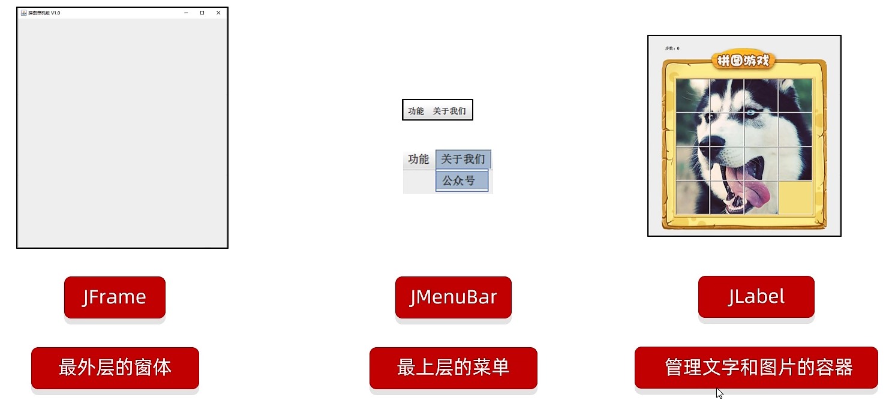

练习1：设计主界面

```java
import javax.swing.*;

//1.创建一个游戏的主界面
JFrame gameJFrame = new JFrame();
gameJFrame.setSize(603,680);
gameJFrame.setVisible(true);

//2.创建登录界面
JFrame loginJFrame = new JFrame();
loginJFrame.setSize(488,430);
loginJFrame.setVisible(true);

//3.创建一个注册界面
JFrame registerJFrame = new JFrame();
registerJFrame.setSize(488,500);
registerJFrame.setVisible(true);
```

练习2：创建主界面

```java
public class RegisterJFrame extends JFrame {
	//跟注册相关的代码，都写在这个界面里
}

public class LoginJFrame extends JFrame {
	 //跟登录相关的代码都写在这里
}

public class GameJFrame extends JFrame {
	//以后跟游戏相关的所有逻辑都写在这个类中
}
```

菜单制作

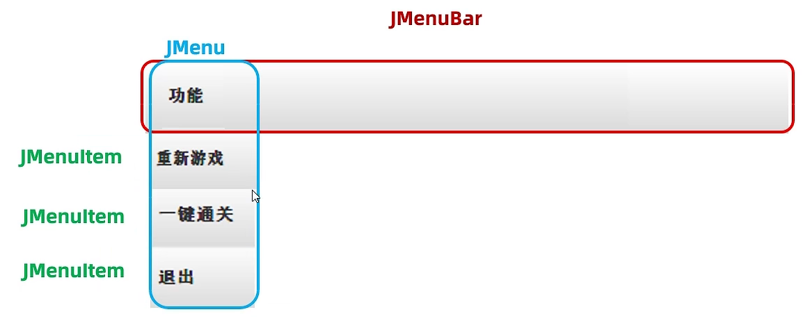

1. 先创建 JMenuBar
2. 再创建 Jmenu
3. 再创建 JMenuItem
4. 把 JMenuItem 放到 JMenu 里面
5. 把 JMenu 放到 JMenuBar 里面
6. 最后把 JMenuBar 添加到整个JFrame 界面中

```java
private void intiJMebuBar() {
    //创建整个的菜单对象
    JMenuBar jMenuBar = new JMenuBar();
    //创建菜单上面的两个选项的对象 （功能 关于我们）
    JMenu functionJMenu = new JMenu("功能");
    JMenu aboutJMenu = new JMenu("关于我们");
    //创建选项下面的条目对象
    JMenuItem replayItem = new JMenuItem("重新游戏");
    JMenuItem relogItem = new JMenuItem("重新登录");
    JMenuItem closeItem = new JMenuItem("关闭游戏");

    JMenuItem accountItem = new JMenuItem("公众号");

    //将每一个选项下面的条目添加到选项当中
    functionJMenu.add(replayItem);
    functionJMenu.add(relogItem);
    functionJMenu.add(closeItem);
    aboutJMenu.add(accountItem);

    //将菜单里面的两个选项添加到菜单中
    jMenuBar.add(functionJMenu);
    jMenuBar.add(aboutJMenu);

    //给整个界面设置菜单
    this.setJMenuBar(jMenuBar);
}
```

添加图片

JLabel管理区域：图片、文字

ImageIcon对象

```java
private void initImage() {
    //初始化图片
    //创建一个图片ImageIcon的对象
    ImageIcon icon = new ImageIcon("D:\\project\\java\\project_game\\puzzlegame\\image\\animal\\animal1\\1.jpg");
    //创建一个JLabel的对象（管理容器）
    JLabel jLabel = new JLabel(icon);
    //指定图片的位置
    jLabel.setBounds(0, 0, 105, 105);
    //把管理容器添加到界面中
    //this.add(jLabel);
    this.getContentPane().add(jLabel);
}
```

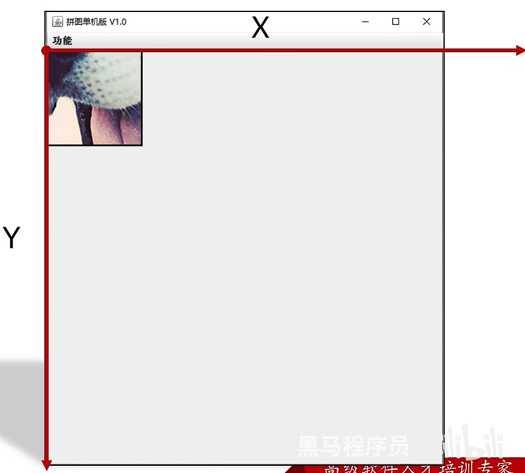

优化：

```java
private void initImage() {
        //初始化图片
        int number = 1;
        for (int i = 0; i < 4; i++) {
            for (int j = 0; j < 4; j++) {
                //创建一个JLabel的对象（管理容器）
                JLabel jLabel = new JLabel(new ImageIcon("image\\animal\\animal3\\" + number + ".jpg"));
                //指定图片的位置
                jLabel.setBounds(105*j, 105*i, 105, 105);
                //把管理容器添加到界面中
                //this.add(jLabel);
                this.getContentPane().add(jLabel);
                number++;
            }
        }

    }
```


打乱图片：

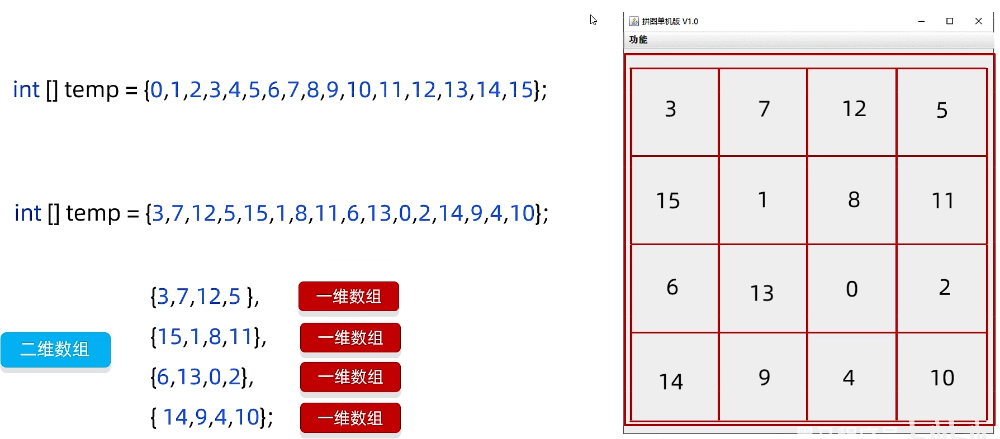

```java
private void initData() {
        int[] tmpArr = {0, 1, 2, 3, 4, 5, 6, 7, 8, 9, 10, 11, 12, 13, 14, 15};

        Random r = new Random();

        for (int i = 0; i < tmpArr.length; i++) {
            int index = r.nextInt(tmpArr.length);
            int temp = tmpArr[i];
            tmpArr[i] = tmpArr[index];
            tmpArr[index] = temp;
        }
		int[][] data = new int[4][4];
        for (int i = 0; i < tmpArr.length; i++) {
            data[i / 4][i % 4] = tmpArr[i];
        }
    }
```


事件：

- 可以被组件识别的操作
- 当你对组件干了某件事情之后，就会执行对应的代码

核心要素：

- 事件源：按钮 图片 窗体

- 事件：某些操作

    如：鼠标单击，鼠标划入。。。

- 绑定监听：当事件源上发生了某个事件，则执行某段代码

    - KeyListener：键盘监听
    - MouseListener：鼠标监听
    - ActionListener：动作监听


```java
//创建一个按钮对象
JButton jtb = new JButton("点我啊");
//设置位置和宽高
jtb.setBounds(0,0,100,50);
//给按钮添加动作监听
//addAcionListener：表示我要给组件添加哪个事件监听（动作监听鼠标左键点击，空格）
//jtb.addAcionListener(new MyActionListener());
//使用匿名内部类
jtb.addActionListener(new ActionListener(){
    @Override
    public void actionPerformed(ActionEvent e){
        System.out.println("1");
    }
});

//把按钮添加到界面当中
jFrame.getContentPane().add(jtb);
```

```java
public class MyJFrame extends JFrame implements ActionListener {
    JButton jtb1 = new JButton("点我啊");
    JButton jtb2 = new JButton("再点我啊");

    public MyJFrame(){
        //设置界面的宽高
        this.setSize(603,680);
        //设置界面的标题
        this.setTitle("拼图单机版 v1.0");
        //设置界面置顶
        this.setAlwaysOnTop(true);
        //设置界面居中
        this.setLocationRelativeTo(null);
        //设置关闭模式
        this.setDefaultCloseOperation(WindowConstants.EXIT_ON_CLOSE);

        //取消默认的居中放置，只有取消了才会按照XY轴的形式添加组件
        this.setLayout(null);

        jtb1.setBounds(0,0,100,50);
        jtb1.addActionListener(this);

        jtb2.setBounds(100,0,100,50);
        jtb2.addActionListener(this);

        //把按钮添加到界面当中
        this.getContentPane().add(jtb1);
        this.getContentPane().add(jtb2);

        this.setVisible(true);

    }

    @Override
    public void actionPerformed(ActionEvent e) {
        Object source = e.getSource();
        if(source == jtb1){
            jtb1.setSize(200, 200);
        }else if(source == jtb2){
            Random r = new Random();
            jtb2.setLocation(r.nextInt(500), r.nextInt(500));
        }
    }
}
```

鼠标监听机制-MouseListener

- 划入动作
- 按下动作
- 松开动作
- 划出动作

单机事件：按下、松开

如果以后我想监听一个按钮的单击事件，有几种方式?

- 动作监听
- 鼠标监听中的单击事件
- 鼠标监听中的松开事件

```java
public class MyJFrame extends JFrame implements MouseListener {
    JButton jtb1 = new JButton("点我啊");
    
    public MyJFrame(){
        //设置界面的宽高
        this.setSize(603,680);
        //设置界面的标题
        this.setTitle("拼图单机版 v1.0");
        //设置界面置顶
        this.setAlwaysOnTop(true);
        //设置界面居中
        this.setLocationRelativeTo(null);
        //设置关闭模式
        this.setDefaultCloseOperation(WindowConstants.EXIT_ON_CLOSE);

        //取消默认的居中放置，只有取消了才会按照XY轴的形式添加组件
        this.setLayout(null);

        jtb1.setBounds(0,0,100,50);

        jtb1.addMouseListener(this);


        //把按钮添加到界面当中
        this.getContentPane().add(jtb1);

        this.setVisible(true);

    }

    @Override
    public void mouseClicked(MouseEvent e) {
        System.out.println("单击");
    }

    @Override
    public void mousePressed(MouseEvent e) {
        System.out.println("按下不松");
    }

    @Override
    public void mouseReleased(MouseEvent e) {
        System.out.println("松开");
    }

    @Override
    public void mouseEntered(MouseEvent e) {
        System.out.println("划入");
    }

    @Override
    public void mouseExited(MouseEvent e) {
        System.out.println("划出");
    }
}
```

键盘事件：

- 如果按下一个按键不松，会重复调用KeyPressed方法
- 每个按键都有一个编号与之对应

```java
@Override
public void keyReleased(KeyEvent e) {
    //上下左右进行判断
    //左：37 上：38 右：39 下：40
    int code = e.getKeyCode();
    if(code == 37){
        System.out.println("向左移动");
        if(y == 3){
            return;
        }
        data[x][y] = data[x][y+1];
        data[x][y+1] = 0;
        y++;
        //调用方法按照最新的数字加载图片
        initImage();
    }else if(code ==38){
        System.out.println("向上移动");
        if(x == 3){
            return;
        }
        //x,y 表示空白方块
        //x+1,y 表示空白方块下方的数字
        data[x][y] = data[x+1][y];
        data[x+1][y] = 0;
        x++;
        //调用方法按照最新的数字加载图片
        initImage();
    }else if(code ==39){
        System.out.println("向右移动");
        if(y == 0){
            return;
        }
        data[x][y] = data[x][y-1];
        data[x][y-1] = 0;
        y--;
        //调用方法按照最新的数字加载图片
        initImage();
    }else if(code ==40){
        System.out.println("向下移动");
        if(x == 0){
            return;
        }
        data[x][y] = data[x-1][y];
        data[x-1][y] = 0;
        x--;
        //调用方法按照最新的数字加载图片
        initImage();
    }
}
```

查看完整图片

- 按照A不松开，显示完整图片
- 松开A显示随机打乱的图片

```java
@Override
public void keyPressed(KeyEvent e) {
    //按下不送时，会调用这个方法
    int code = e.getKeyCode();
    if(code == 65){
        //把界面中所有的图片全部删除
        this.getContentPane().removeAll();
        //加载第一张完整的图片
        JLabel all = new JLabel(new ImageIcon(path + "all.jpg"));
        all.setBounds(83,134,420,420);
        this.getContentPane().add(all);

        //添加背景图片
        ImageIcon bg = new ImageIcon("puzzlegame\\image\\background.png");
        JLabel background = new JLabel(bg);
        background.setBounds(40,40,508,560);
        this.getContentPane().add(background);
        //刷新界面
        this.getContentPane().repaint();
    }
}

@Override
public void keyReleased(KeyEvent e) {
    ...
    }else if(code == 65){
        initImage();
    }
}
```

作弊码

按一下W，直接胜利

```java
@Override
public void keyReleased(KeyEvent e) {
    ...
    }else if(code == 87){
        //松开W时，直接胜利
            data = new int[][]{
                    {1,2,3,4},
                    {5,6,7,8},
                    {9,10,11,12},
                    {13,14,15,0}
            };
            initImage();
    }
}
```

判断胜利

判断二维数组的数字是否按照顺序进行排序，如果是，则显示胜利图片

实现步骤：

1. 定义一个正确的二维数组
2. 在加载图片之前，先判断一下二位数组中的数字跟win数组中是否相同
3. 如果相同展示胜利图标
4. 如果不同则不展示正确图标

```java
//定义一个二维数组，存储正确的数据
int[][] win = {
    {1,2,3,4},
    {5,6,7,8},
    {9,10,11,12},
    {13,14,15,0}
};

private void initImage() {
    //细节：先加载的图片再上方，后加载的图片在下方
    //清空原本已经出现的所有图片
    this.getContentPane().removeAll();

    if (victory()) {
        //显示胜利图标
        JLabel winJLabel = new JLabel(new ImageIcon("D:\\project\\java\\project_game\\puzzlegame\\image\\win.png"));
        winJLabel.setBounds(203,283,197,73);
        this.getContentPane().add(winJLabel);
    }
    ...
}

@Override
public void keyReleased(KeyEvent e) {
	//判断游戏是否胜利，如果胜利，直接结束该方法
    if(victory()){
        //结束方法
        return;
    }
    ...
}

public boolean victory(){
    for (int i = 0; i < data.length; i++) {
        for (int j = 0; j < data[i].length; j++) {
            if(data[i][j] != win[i][j]){
                //一个数据不同，返回false
                return false;
            }
        }
    }
    //所有数据相同，返回true
    return true;
}
```

计步功能

```java
//定义一个变量，记录游戏步数
int step = 0;

private void initImage() {
	...
    JLabel stepCount = new JLabel("步数：" + step);
    stepCount.setBounds(50,30,100,20);
    this.getContentPane().add(stepCount);
    ...
}

@Override
public void keyReleased(KeyEvent e) {
	...
}
```

重新开始

1. 给重新游戏绑定点击事件

    MouseLisener、ActionLisener

2. 重新打乱二维数组中的数字

3. 加载图片

4. 计步器清零


关闭游戏

1. 给关闭游戏绑定事件
2. 结束虚拟机，关闭所有


关于我们

点击公众号，显示弹窗，称为 JDialog

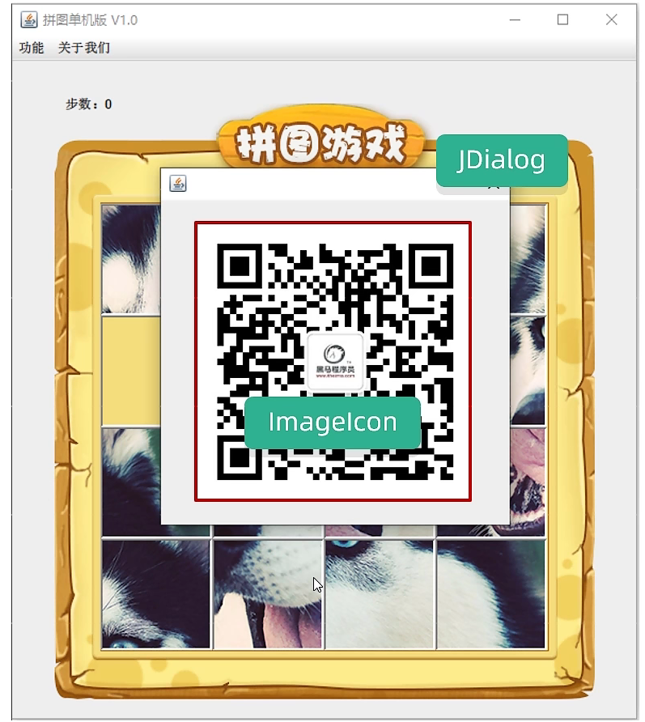

```java
@Override
public void actionPerformed(ActionEvent e) {
    //获取当前被点击的条目对象
    Object obj = e.getSource();
    if(obj == replayItem){
        System.out.println("重新游戏");

        //再次打乱二维数组中的数据
        initData();
        //计步器清零
        step = 0;
        //重新加载图片
        initImage();

    }else if(obj == relogItem){
        System.out.println("重新登录");
        //返回登录界面

        //关闭当前的游戏界面
        this.setVisible(false);
        //打开游戏界面
        new LoginJFrame();

    }else if(obj == closeItem){
        System.out.println("关闭游戏");
        //直接关闭虚拟机即可
        System.exit(0);

    }else if(obj == accountItem){
        System.out.println("公众号");

        //创建一个弹框对象
        JDialog jDialog = new JDialog();
        //创建管理图片的容器对象JLabel
        JLabel jLabel = new JLabel(new ImageIcon("puzzlegame\\image\\about.png"));
        //设置位置和宽高
        jLabel.setBounds(0,0,258,258);
        //把图片添加到弹框中
        jDialog.getContentPane().add(jLabel);
        //给弹框设置大小
        jDialog.setSize(344,344);
        //弹框置顶
        jDialog.setAlwaysOnTop(true);
        //让弹框居中
        jDialog.setLocationRelativeTo(null);
        //弹框不关闭则无法操作下面的界面
        jDialog.setModal(true);
        //让弹框显示出来
        jDialog.setVisible(true);

    }
}
}
```


# 2、游戏打包exe

## 主要步骤

1. 将代码打包成jar包。
2. 整合资源文件
3. 将jar包打包成exe
4. 将jdk、资源文件、jar包转换后的exe三者再次打包成最终的exe。


## 准备软件

1. **Idea**：将代码打包成 jar 包（java形式的压缩包）

2. **exe4j**：将 jar 包转换成 exe 的工具。

3. **innosetup**：将游戏用到的图片，Java 的运行环境和第二步打包的代码，组合成最终的安装程序。

**备注1：**exe4j和innosetup安装非常简单，傻瓜式下一步即可。

**备注2：**===、exe4j支持的JDK版本是8~11==，其他版本的JDK不行，所以我也给大家提供了 JDK11版本。

**备注3：**64位的操作系统用exe4j_windows-x64_6_0_2.exe

32位的操作系统用exe4j_windows_6_0_2.exe

**备注4：**打开我的电脑，右键空白处，点击属性，在弹出界面的中央就能查看自己电脑是64位的还是32位的。


安装软件：

- 安装 JDK 11 版本，不需要配置环境变量
- 安装 exe4j
- 安装 innosetup


## 代码改写

代码中所有图片用到的路径需要把模块名删除，改写之后如下：

在不同的情况下，相对路径的相对位置是不一样的。

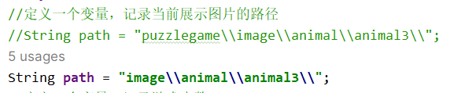


## 打包步骤

### 第一步：代码打包成 jar 包

1. 点击File，再点 Project Structure。

2. 点击 Artifaces。

3. 下方图片箭头指向位置应为空白，如果有其他内容，可以选中之后，点击减号删除。

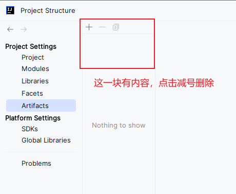

4. 选中左侧的Artifacts =》点击 + 号 =》点击 JAR =》点击From modules with dependencies...

    如下图所示：

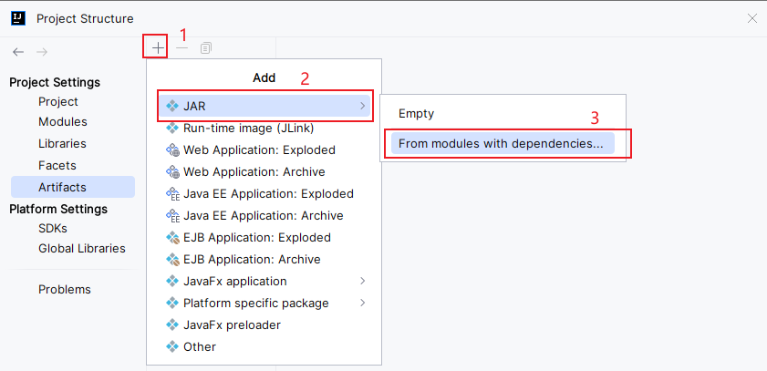

5. Module：选择要打包的项目。

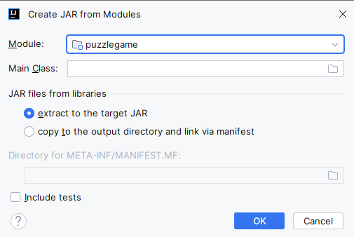

6. Main Class：项目中是哪个main方法所在的类去启动项目，这里就选择哪个类。我的项目是由app里面的main方法启动的，所以我就选择App

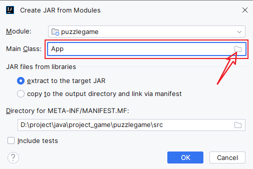

7. 设置 META-INF/MANIFEST.MF。

    点击箭头指向的图标进行设置。

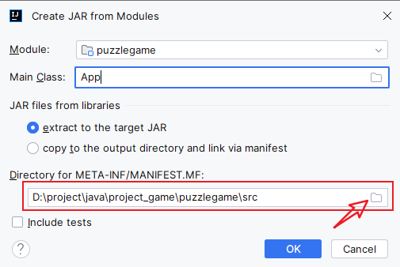

8. 选择当前模块

    点击OK

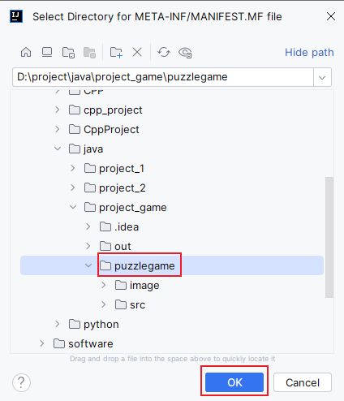

9. 此时这里的路径就是模块所在路径，点击OK

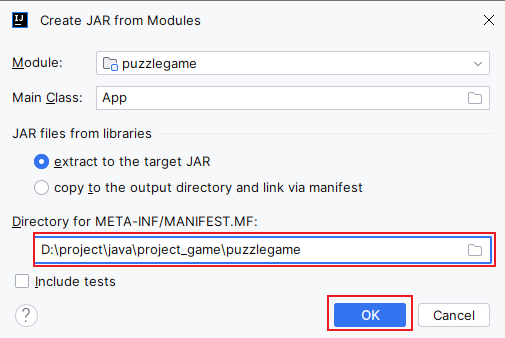

10. 如果没有弹框报错，第十步可以跳过，直接看十一步。

    如果出现弹框报错，表示当前模块下已存在META-INF文件夹了。可以在本地找到已存在的META-INF文件夹，右键点击DELETE删除即可。

    查找方式如下：

    右键模块点击open in，点击Explorer，在模块里面找到META-INF文件删除即可。

11. 如果没有报错，就出现一个puzzlegame：jar的提示。

    点击右下角的OK。

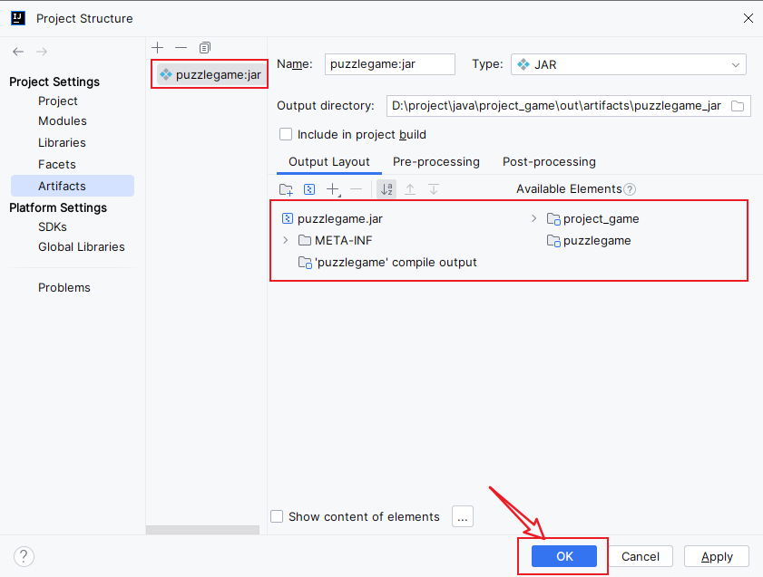

12. 在idea主界面上方，点击Build里面的Build Artifacts。

    如果是灰色的不能按，请确定在上面第一步~第九步有没有配置好jar包的信息。

    如果已经配置好了jar的信息，此处就可以正常点击。

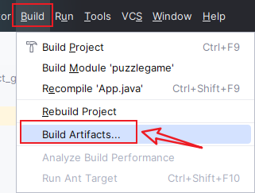

13. 在主界面正中央。

    选择puzzlegame:jar。再选择Build。idea会帮我们生成jar包。

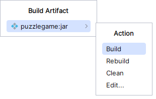

14. 等页面右下角的进度条结束，jar就已经生成完毕。

15. 点击File，再点Project Structure。

    点击Artifaces。

    在下图红色框中的路径下，可以找到生成好的jar包。

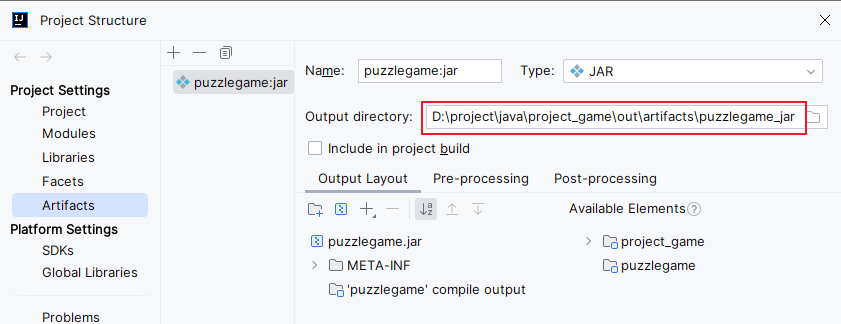


### 第二步：整合资源文件

1. 将第一步创建好的 jar 包拷贝到桌面上。

2. 在桌面上新建一个文件夹 resource。

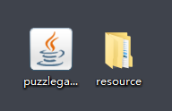

3. 将《拼图游戏》中的 image 文件夹粘贴到 resource 文件夹当中。

此时在桌面中的resource文件夹下的image文件夹下，就会看到游戏里面用到的所有图片。

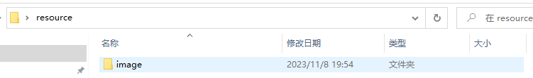


### 第三步：将 jar 包打包成 exe

1. 双击打开安装好的exe4j.exe，注册软件。

点击下面的Enter License

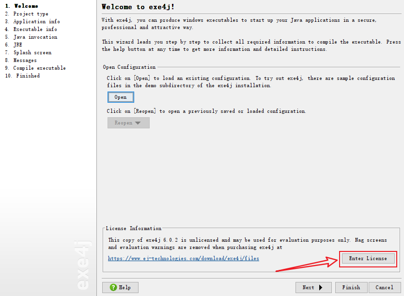

2. 输入用户名，公司名和注册码后点击ok

    用户名，公司名随便填，最好都是小写字母。

    注册码：L-g782dn2d-1f1yqxx1rv1sqd

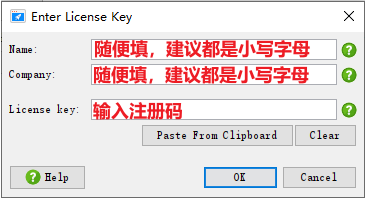

3. 注册完毕之后点击右下角的next

    备注：exe4j.exe 只识别 JDK8 到 JDK11，如果安装时出现弹框报错，请检查 JDK 版本

4. 选择JAVA转EXE。

    点击右下角的next

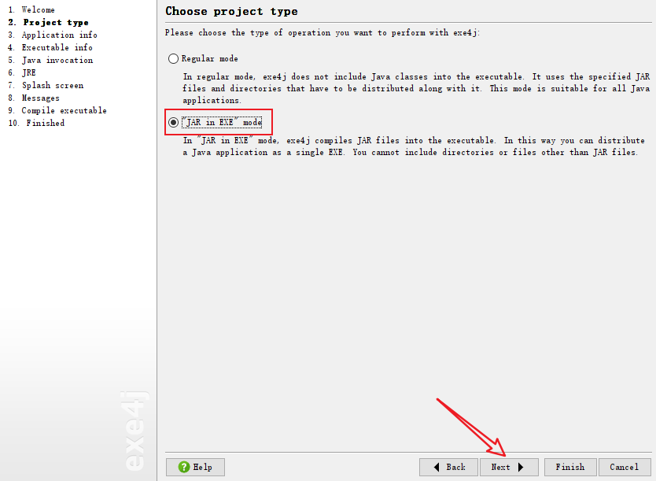

5. 输入名称 puzzlegame

    输出保存 exe 的路径，建议选择到桌面上。

    点击右下角的 next

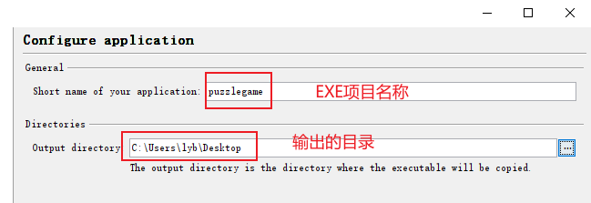

6. 选择以图形界面的形式启动游戏

    输入应用名称，puzzlegame

    点击高级设置 Advanced Options，选择32-bit or 64-bit

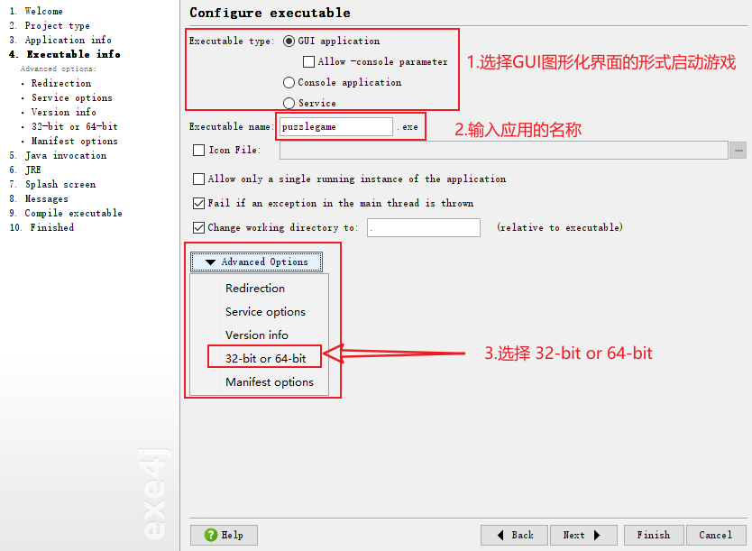

7. 勾选 Generate 64-bit executable

    表示要生成64位的exe安装包，如果未勾选默认生成32位的安装包。

    点击右下角next

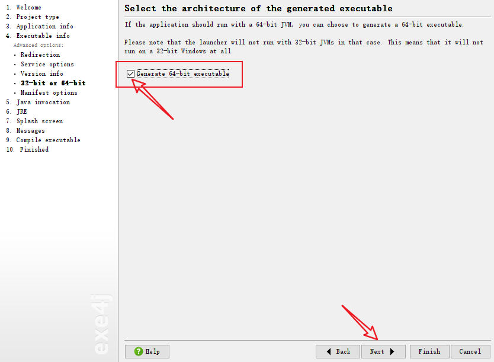

8. 然后一直下一步，一直出现如下界面

    在本界面开始jar包并以及配置启动类。

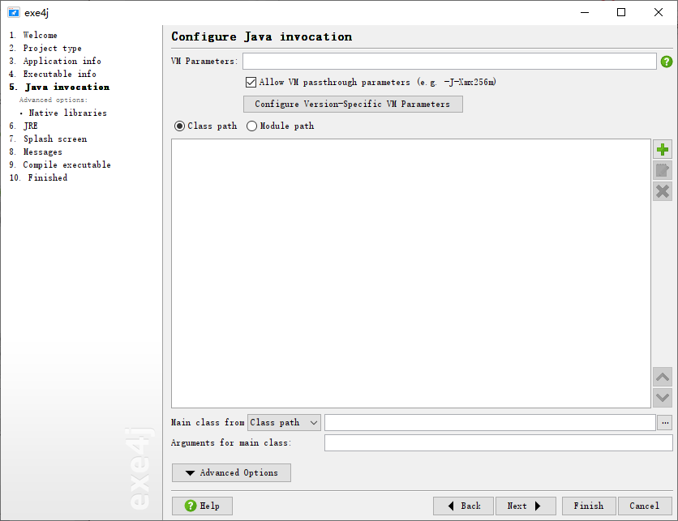

9. 第一行，VM参数配置的地方加上：-Dfile.encoding=utf-8

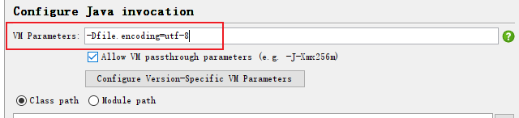

10. 点击右侧绿色的+，添加jar包

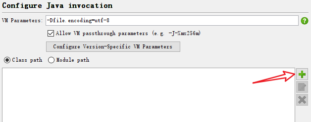

11. 添加jar包

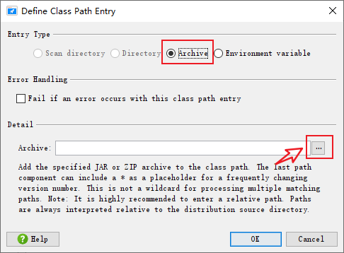

12. 选择桌面上的puzzlegame.jar。

    点击下面的打开。

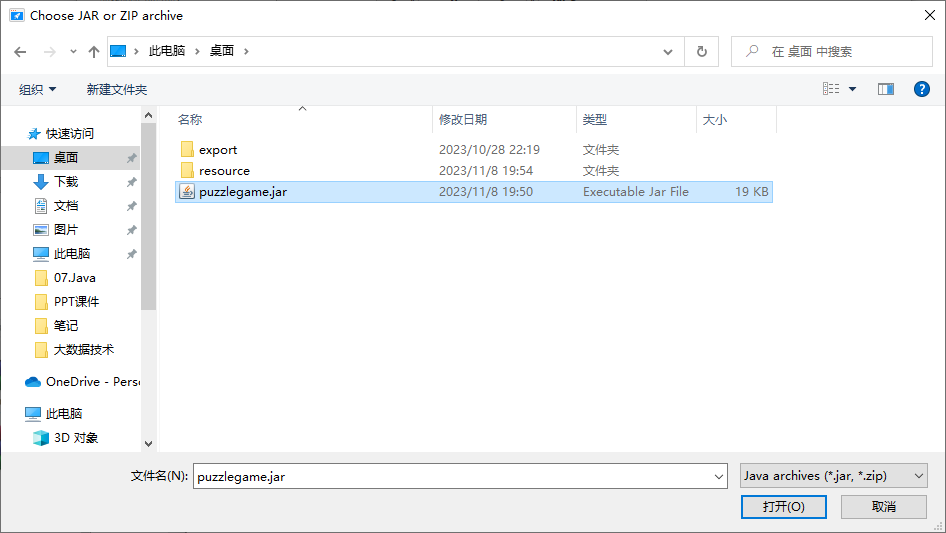

13. 检查路径，如果无误点击右下角的OK

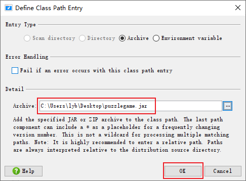

14. 选择项目启动类

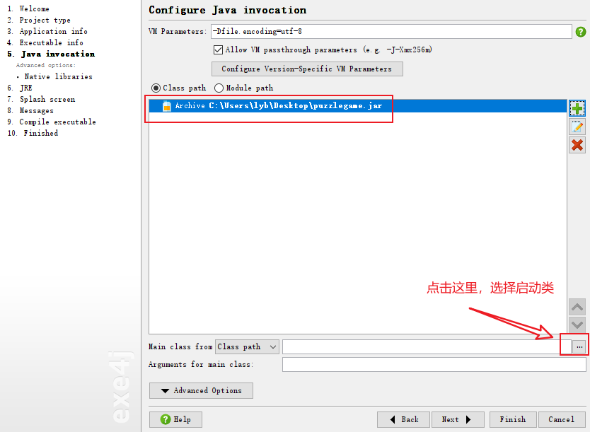

15. 因为程序主入口main方法写在App类中，所有选择app，并点击OK。

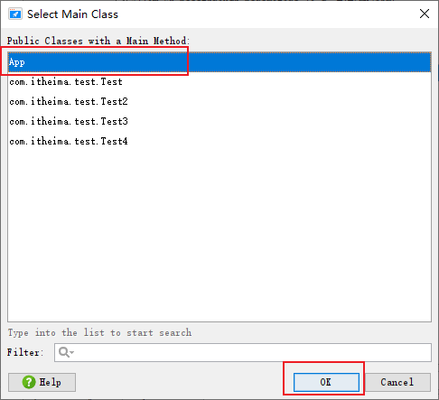

16. 本页面中，一共修改了三处。

    三处全部操作完毕。点击右下角的next

17. 填写最小启动的JDK版本。输入1.8

    配置exe加载的JDK，选择第一个。

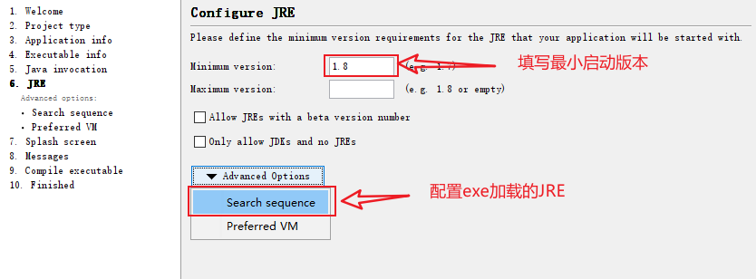

18. 点击+

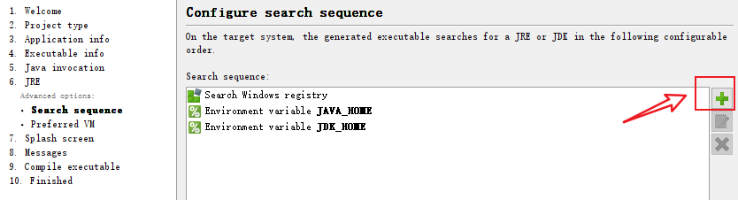

19. 选择Directory

    下面输入.\jdk

    **（注意：输入点杠jdk，都要是英文状态下输入）**

    点击OK

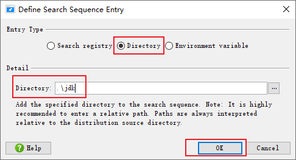

20. 再次点击+

21. 选择Directory

    下面输入.\image

    **（输入点杠image，都要是英文状态下输入）**

    点击OK

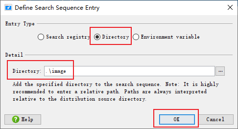

22. 点击右下角的next

23. 选择Client VM

    点击右下角的next

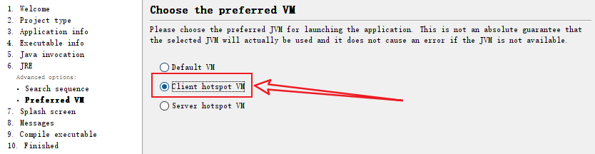

24. 然后一直下一步，最终出现如下界面

    点击右下角的Exit退出。

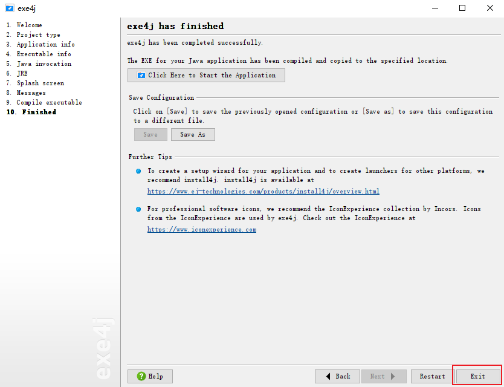

25. 点击Exit后，会提示是否需要保存刚刚的配置信息，可以点击Yes，并选择一个路径进行保存。

26. 如果第三步选择的exe保存的路径是桌面，那么在桌面上

    就能看到生成的puzzlegame.exe文件了。

    四个文件分别为：

    左一：刚刚用jar生成的exe文件。

    左二：idea生成的jar包

    左三：游戏用到的资源图片

    左四：刚刚用exe4J设置完毕之后保存的信息。

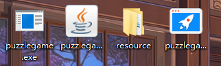


### 第四步：将jdk、资源文件、jar包转换后的exe三者再次打包成最终的exe。

刚刚，我们仅仅是把java代码变成了exe。下面我们要把游戏中依赖的资源文件，也就是使用到的所有图片，还有JDK三者再次打包成最终的exe，这样在没有jdk电脑环境下也能运行。

1. 打开inno setup
2. 在欢迎页面点击右下角的关闭

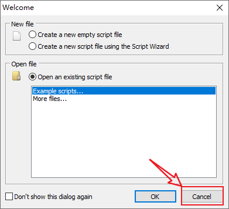

3. 点击左上角的File

    再点击NEW

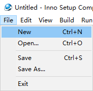

4. 点击next

5. 输入应用名称 puzzlegame

    点击next

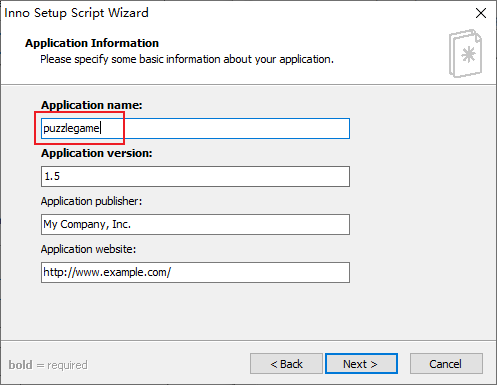

6. 不修改任何东西，直接点击next

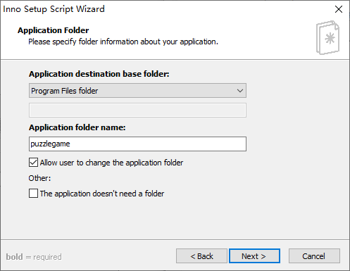

7. 点击这里，选择桌面上已经生成好的puzzlegame.exe

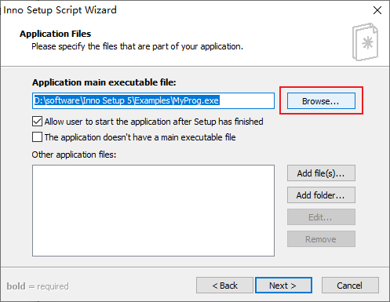

8. 点击Add folder

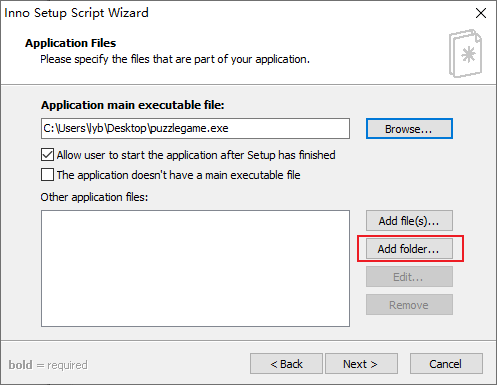

9. 选择桌面的resource，再点击确定。

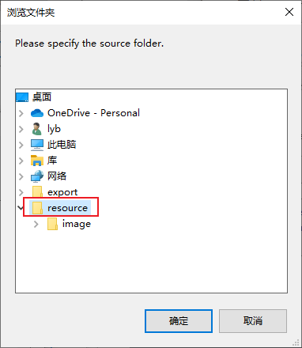

10. 如果出现下面弹框，则点击是。

    如果没有出现也没有任何关系。

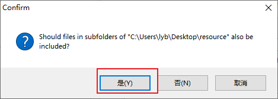

11. 再点击 Add file(s)…

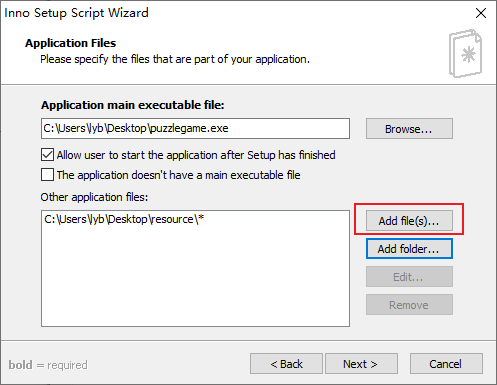

12. 选中桌面的 puzzlegame.exe，再次添加一次。

    点击下面的打开。

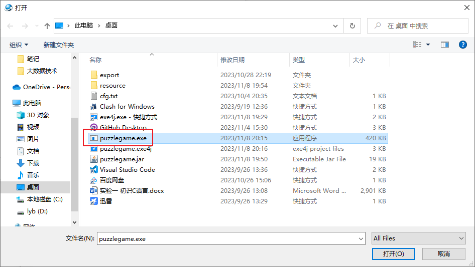

13. 在本页面中一共设置了三处地方。

    全部设置完毕，点击next。

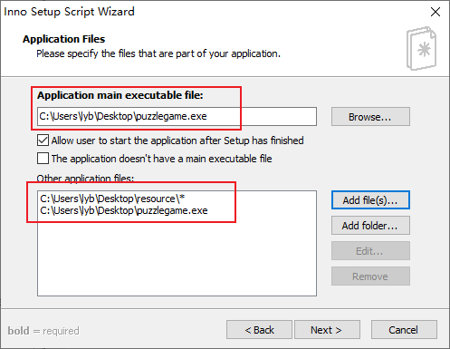

14. 默认不用选择，点击next

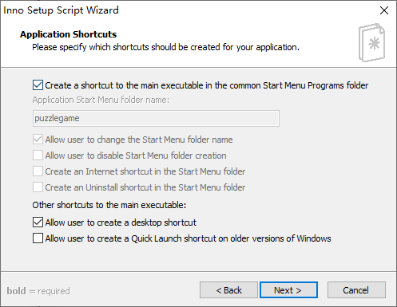

15. 默认不用选择，点击next

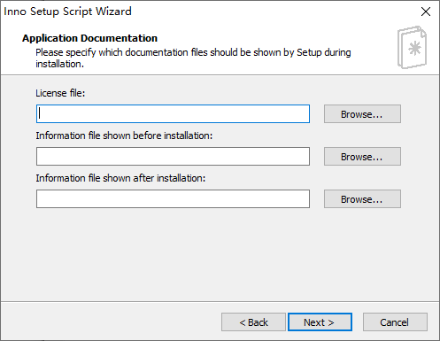

16. 选择语言，还是默认，点击next

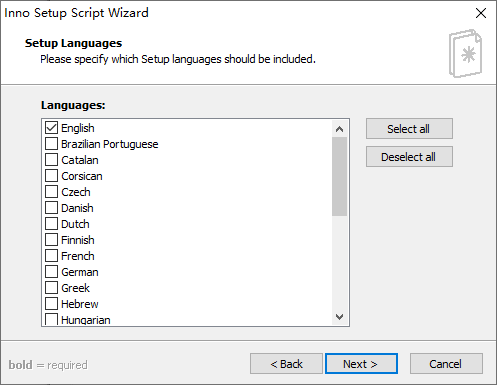

17. 选择输出路径，还是选择桌面。

    输入最终安装包的名字，不能跟已有的 puzzlegame 重名。

    所以我写setup，再点击右下角next

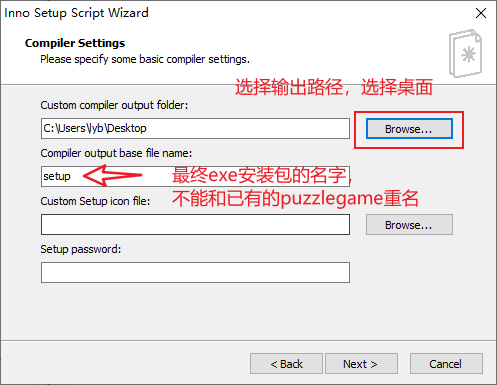

18. 默认点击next

19. 完成，点击finish

20. 配置到最后一步了，脚本文件，到这里会弹出问你是否马

    上编译，选择否，先把脚本写好再自己编译

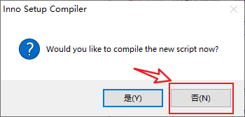

21. 上面红色箭头处添加一行脚本。

    #define MyJdkName "jdk"

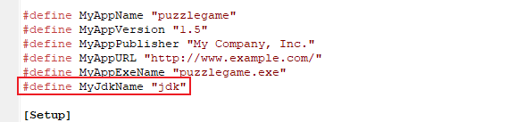

22. 往下拉，把有红色框起来的这一行删掉

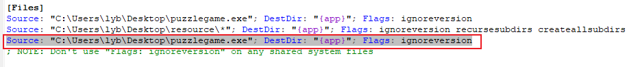

23. 在上一步删除位置添加一段行的文字

    Source: "自己本地JDK路径\*"; DestDir: "{app}\{#MyJdkName}"; Flags: ignoreversion recursesubdirs createallsubdirs

    **千万注意：这段文字不要直接复制。根据自己电脑中JDK的安装位置进行修改，添加完毕之后如下图**

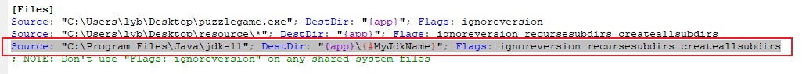

24. 点击上方的绿色按钮开始编译。

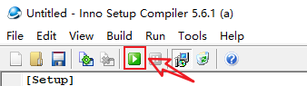

25. 此时会询问，是否需要保存。

    可以点击是，选择一个位置保存一下刚刚修改之后的结果。

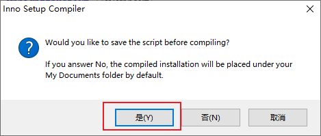

26. 然后等待绿色滚动条结束

27. 当绿色滚动条结束后，会自动安装setup.exe文件。

    此时可以点击否，先不安装。

    在桌面上，会多了一个setup.exe文件和一个后缀名为iss的文件

    setup.exe：打包成功的游戏安装包。

    iss文件：就是刚刚设置的脚本文件。

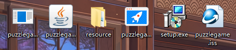

28. 现在就可以把这个exe文件发给你的好基友了，他的电脑

    上不需要安装JDK，直接双击这个安装包就可以玩游戏了。

    在安装的时候可以选择安装路径。

    还可以在桌面生成快捷方式。


## 注意事项

1. 安装完毕之后，可以到安装目录去找 puzzlegame.exe

    双击就可以玩游戏了。刚刚桌面上的5个文件可以全部删除。以后双击puzzlegame.exe就可以玩游戏了。

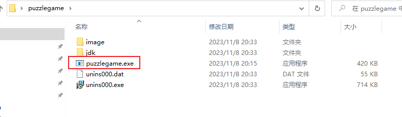

2. 如果游戏运行之后，有效果但是无图片，或者部分图片无法加载。如下图所示：此时背景图片无法加载。

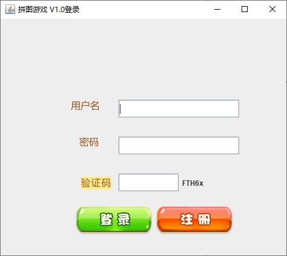

修改步骤一：

检查安装目录下image文件夹中是否有该图片。如果没有将缺少的图片粘贴进去重新运行游戏。

修改步骤二：

检查代码，图片的路径需要把模块名删掉。

代码修改后，需要重新生成exe安装包，重新安装游戏。

