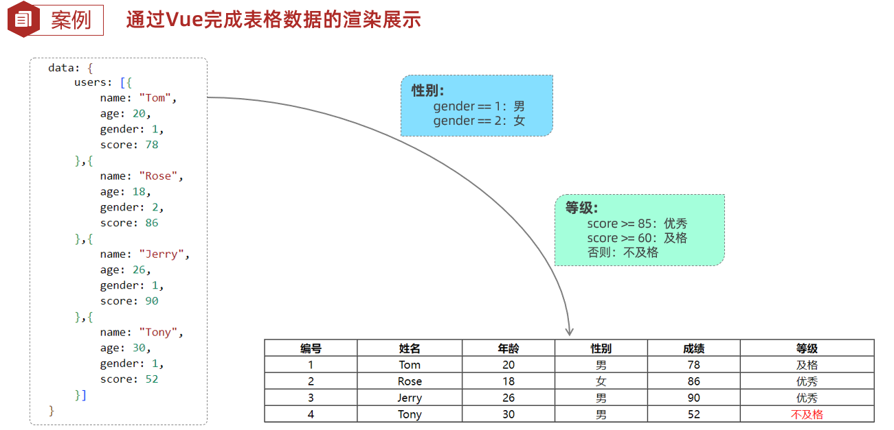
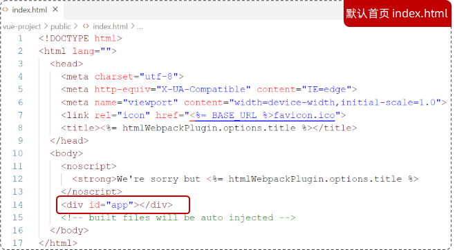
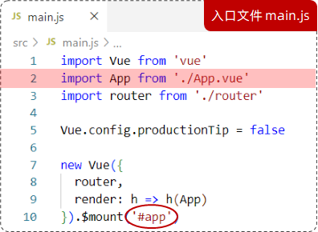
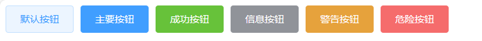
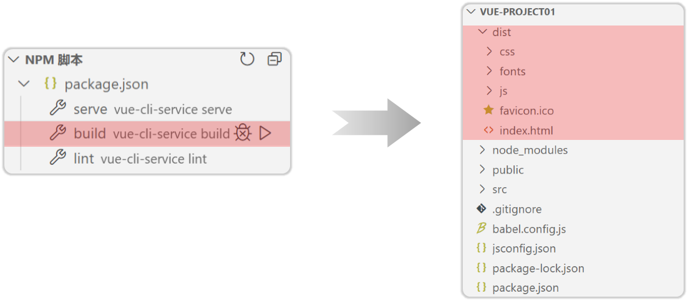

# JavaWeb


什么是Web？

Web：全球广域网，也称为万维网（www World Wide Web），能够通过浏览器访问的网站。


Web网站的工作流程

一个Web网站由 前端服务器、后端服务器和数据库服务器组成。


前端Web开发

- HTML、CSS、JavaScript
- Vue、Element、Nginx

后端Web开发

- Maven
- SpringBoot Web 基础篇
- MySQL
- SpringBoot Mybatis
- SpringBoot Web 开发篇
- SpringBoot Web 进阶篇


# 1、Web开发

- 网页有哪些部分组成?
    - 文字、图片、音频、视频、超链接...
- 我们看到的网页，背后的本质是什么?
    - 程序员写的前端代码
- 前端的代码是如何转换成用户眼中的网页的?
    - 通过浏览器转化(解析和渲染)成用户看到的网页
    - 浏览器中对代码进行解析渲染的部分，称为浏览器内核


Web标准

- Web标准也称为网页标准，由一系列的标准组成，大部分由W3C ( World Wide Web Consortium, 万维网联盟)负责制定。
- 三个组成部分：==前端三剑客==
    - HTML：负责网页的**结构**（页面元素和内容）。
    - CSS：负责网页的**表现**（页面元素的外观、位置等页面样式，如:颜色、大小等）。
    - JavaScript：负责网页的**行为**（交互效果）。


基于 JS 封装的高级框架 Vue.js

基于 Vue.js 封装的桌面端组件库 Element、Ax、Os


# 2、HTML

## 2.1 入门

**什么是HTML？**

HTML ( HyperText Markup Language)：**超文本标记语言**。

- 超文本:超越了文本的限制，比普通文本更强大。除了文字信息，还可以定义图片、音频、视频等内容。
- 标记语言：由标签构成的语言
    - HTML标签都是**预定义**好的。 例如:使用 `<a>` 展示超链接,使用 `` 展示图片, `<video>` 展示视频。
    - HTML代码直接在浏览器中运行，HTML标签由浏览器解析。


**什么是CSS？**

CSS (Cascading Style Sheet)：层叠样式表，用于控制页面的样式(表现)


快速入门

```html
<html>
    <head>
        <title>HTML快速入门</title>
    </head>
    <body>
        <h1>
            Hello,HTML
        </h1>
    </body>
    
</html>
```


特点：

1. 不区分大小写
2. 不区分单双引号
3. 语法结构松散


## 2.2 安装Vscode

安装插件：

1. Chinese

2. Code Spell Checker

    拼写检查器

3. HTML CSS Support

    自动补全

4. JavaScript (ES6) code snippets

    支持ES6语法提示

5. Mithril Emmet

    一个能大幅度提高前端开发效率的一个工具，用于补全代码

6. Path Intellisense

    路径提示插件

7. Vue 3 Snippets

    在 Vue 2 或者 Vue 3 开发中提供代码片段，语法高亮和格式化的 VS Code 插件，能极大提高你 的开发效率。

8. VueHelper

    vscode最好的vue代码提示插件，不仅包括了vue2所有api，还含有vue-router2和vuex2的代码

9. Auto Close Tag

    自动闭合HTML/XML标签

10. Auto Rename Tag

    自动完成另一侧标签的同步修改

11. Beautify

    格式化 html，js，css

12. Bracket Pair Colorizer

    给括号加上不同的颜色，便于区分不同的区块，使用者可以定义不同括号类型和不同颜色

13. open in browser

    vscode不像IDE一样能够直接在浏览器中打开html，而该插件支持快捷键与鼠标右键快速在浏览器中 打开html文件，支持自定义打开指定的浏览器，包括：Firefox，Chrome，Opera，IE以及Safari

14. Vetur

    Vue多功能集成插件，包括：语法高亮，智能提示，emmet，错误提示，格式化，自动补全， debugger。vscode官方钦定Vue插件，Vue开发者必备

15. File Utils

    File Utils插件,可以方便快捷的来创建、复制、移动、重命名文件和目录。

16. IntelliJ IDEA Keybindings

    安装VSCode的插件 IntelliJ IDEA Keybindings 即可在VSCode中使用IDEA的快捷键。


## 2.3 新闻案例

### 实现标题-排版

- 标题：\<title>

- 图片标签：\
    - src：指定图像的 url （绝对路径 / 相对路径）
    - width：图像的宽度 （px 像素 / % 相对于父元素的百分比）
    - height：图像的高度 （px 像素 / % 相对于父元素的百分比）
- 标题标签：\<h1> - \<h6>
- 水平分割线：\<hr>


在 VsCode 中编写 html，可以输入 ! 一键生成

```html
<!-- 文档类型为HTML -->
<!DOCTYPE html>
<html lang="en">
<head>
    <meta charset="UTF-8">
    <meta name="viewport" content="width=device-width, initial-scale=1.0">
    <title>焦点访谈</title>
</head>
<body>
     新浪政务 > 正文

    <h1>焦点访谈：中国底气 新思想夯实大国粮仓</h1>

    <hr>
    2023年03月02日 21:50 央视网
    <hr>
</body>
</html>
```


### 实现标题-样式1

- CSS引入方式：
  
    - **行内样式**：写在标签的 style 属性中(不推荐)
    
        ```html
        <h1 style="xxx: xxx; xxx: xxx;">中国新闻网</h1>
        ```
    
    - **内嵌样式**：写在 style 标签中 (可以写在页面任何位置，但通常约定写在head标签中)
    
        ```html
        <style>
            h1 {
                xxx: xxx;
                xxx: xxx;
            }
        </style>
        ```
    
    - **外联样式**：写在一个单独的 .css 文件中(需要通过 link 标签在网页中引入)
    
        ```html
        h1 {
        	xxx: xxx;
        	xxx: xxx;
        }
        
        <link rel="stylesheet" href='css/news.css'>
        ```
    
        

- 颜色表示形式：

    |  **表示方式**  | **表示含义**                      | **取值**                                    |
    | :------------: | :-------------------------------- | ------------------------------------------- |
    |     关键字     | 预定义的颜色名                    | red、green、blue...                         |
    |   rgb表示法    | 红绿蓝三原色，每项取值范围：0-255 | rgb(0,0,0)、rgb(255,255,255)、rgb(255,0,0)  |
    | 十六进制表示法 | #开头，将数字转换成十六进制表示   | #000000、#ff0000、#cccccc，简写：#000、#ccc |

- 颜色属性：color

- 拾色器：EDGE插件，Smart Color Picker

```html
<!DOCTYPE html>
<html lang="en">
<head>
    <meta charset="UTF-8">
    <meta name="viewport" content="width=device-width, initial-scale=1.0">
    <title>焦点访谈</title>
    <!-- 方式二：内嵌样式 -->
    <style>
        h1 {
            /* color: red; */
            /* color: rgb(255, 0, 0); */
            color: #4D4F53;
        }
    </style>

    <!-- 方式三：外联方式 -->
    <!-- <link rel="stylesheet" href="../css/news.css"> -->
</head>
<body>
     新浪政务 > 正文

    <!-- 方式一：行内样式 -->
    <!-- <h1 style="color: red;">焦点访谈：中国底气 新思想夯实大国粮仓</h1> -->
    
    <h1>焦点访谈：中国底气 新思想夯实大国粮仓</h1>
    <hr>
    2023年03月02日 21:50 央视网
    <hr>

</body>
</html>
```


### 实现标题-样式2

- 没有任何语义的标签：\<span> （用来组合行内标签）
    - \<span>是一个在开发网页时大量会用到的没有语义的布局标签
    - 特点：一行可以显示多个(组合行内元素)， 宽度和高度默认由内容撑开


- css选择器：用来选取需要设置样式的元素（标签）

    - **元素选择器**

        ```html
        h1{
        	color: red;
        }
        <h1> Hello CSS </h1>
        ```

    - **id选择器**

        ```html
        #hid{
        	color: red;
        }
        <h1 id="hid"> Hello CSS </h1>
        ```

    - **类选择器**

        ```html
        .cls{
        	color: red;
        }
        <h1 class="cls"> Hello CSS </h1>
        ```

- 优先级：id选择器 > 类选择器 > 元素选择器

- CSS属性：

    - color：设置文本的颜色
    - font-size：字体大小（注意：记得加px）

```html
<!DOCTYPE html>
<html lang="en">
<head>
    <meta charset="UTF-8">
    <meta name="viewport" content="width=device-width, initial-scale=1.0">
    <title>焦点访谈</title>
    <!-- 方式二：内嵌样式 -->
    <style>
        h1 {
            /* color: red; */
            /* color: rgb(255, 0, 0); */
            color: #4D4F53;
        }

        .cls{
            color: #968D92;
        }

        #time {
            color: #968D92;
            font-size: 13px;
        }

    </style>

    <!-- 方式三：外联方式 -->
    <!-- <link rel="stylesheet" href="../css/news.css"> -->
</head>
<body>
     新浪政务 > 正文

    <!-- 方式一：行内样式 -->
    <!-- <h1 style="color: red;">焦点访谈：中国底气 新思想夯实大国粮仓</h1> -->
    
    <h1>焦点访谈：中国底气 新思想夯实大国粮仓</h1>

    <hr>
    <span class="cls" id="time">2023年03月02日 21:50</span> <span class="cls">央视网</span>
    <hr>

</body>
</html>
```


### 实现标题-超链接

1、超链接

- 标签：\<a href="..." target="...">央视网\</a>

- 属性：
    - href：指定资源访问的 url

    - target：指定在何处打开资源链接
        - \_self：默认值，在当前页面打开
        - \_blank：在空白页面打开


2、CSS属性

- text-decoration：规定添加到文本的修饰，none表示定义标准的文本。
- color：定义文本的颜色


### 实现正文-排版

- 视频标签：\<video>
    - src：规定视频的url
    - controls：显示播放控件
    - width：播放器的宽度
    - height：播放器的高度

- 音频标签：\<audio>
    - src：规定音频的url
    - controls：显示播放控件

- 段落标签：\<p>
- 换行标签：\<br>

- 文本加粗标签： \<b> / \<strong>


**CSS样式：**

- line-height：设置行高
- text-indent：定义第一个行内容的缩进
- text-align：规定元素中的文本的水平对齐方式


空格：在HTML中无论输入多少个空格，只会显示一个。 可以使用空格占位符：==\&nbsp;==

```html
<!DOCTYPE html>
<html lang="en">
<head>
    <meta charset="UTF-8">
    <meta name="viewport" content="width=device-width, initial-scale=1.0">
    <title>焦点访谈</title>
    <style>
       ...
        p {
            text-indent: 35px; /* 首行缩进 */
            line-height: 40px; /* 设置行高 */
        }

        #plast {
            text-align: right; /* 向右对齐 */
        }

    </style>

</head>
<body>
    ...

    <!-- 正文 -->
    <video src="../video/1.mp4" controls="controls" width="950px"></video>

    <!-- <audio src="../audio/1.mp3" controls></audio> -->
    <p>
    <strong>央视网消息</strong>（焦点访谈）：...
    </p>
    <p>
    人勤春来早...。
    </p>

    

    <p>
        今年，...
    </p>

    
    <p>
        国务院发展...
    </p>
    <p>
        国家仓廪充实，...
    </p>

    <p id="plast">
        责任编辑：王树淼 SN242
    </p>

</body>
</html>
```


### 实现正文-页面布局

**盒子模型**

- 盒子：页面中所有的元素（标签），都可以看做是一个 ==盒子==，由盒子将页面中的元素包含在一个矩形区域内，通过盒子的视角更方便的进行页面布局

- 盒子模型组成：==内容区域（content）、内边距区域（padding）、边框区域（border）、外边距区域（margin）==


布局标签：实际开发网页中，会大量频繁的使用 div 和 span 这两个没有语义的布局标签。

标签：\<div> \<span>

特点：

**div标签：**

- 一行只显示一个（独占一行）

- **宽度默认是父元素的宽度，高度默认由内容撑开**

- 可以设置宽高（width、height）

**span标签：**

- 一行可以显示多个

- 宽度和高度默认**由内容撑开**

- 不可以设置宽高（width、height）

```html
<head>
    <style>
        div {
            width: 200px;
            height: 200px;
            box-sizing: border-box; /* 指定width height为盒子的高宽 */
            background-color: aquamarine; /* 背景色 */

            padding: 20px; /* 内边距, 上 右 下 左 */
            border: 10px solid red; /* 边框, 宽度 线条类型 颜色 */
            margin: 30px; /* 外边距, 上 右 下 左 */
        }
    </style>
</head>
```


版心居中：版面的内容位于正中间

```html
<html lang="en">
<head>
    ...
    <style>
        #center {
            width: 65%;
            margin: 0 auto;
        }
    </style>

</head>

<body>
    <div id="center">
        ......
    </div>
</body>

</html>
```

CSS属性：

- width：设置宽度
- height：设置高度
- border：设置边框的属性，如：1px solid #000;
- padding：内边距
- margin：外边距

注意：如果只需要设置某一个方位的边框、内边距、外边距，可以在属性名后加上 –位置，如：padding-top、padding-left、padding-right …


## 2.4 表格标签

| **标签** | **描述**                         | **属性/备注**                                                |
| -------- | -------------------------------- | ------------------------------------------------------------ |
| \<table> | 定义表格整体，可以包裹多个 \<tr> | border：规定表格边框的宽度<br />width：规定表格的宽度<br />cellspacing: 规定单元之间的空间。 |
| \<tr>    | 表格的行，可以包裹多个 \<td>     |                                                              |
| \<td>    | 表格单元格(普通)，可以包裹内容   | 如果是表头单元格，可以替换为  \<th><br />\<th>具有加粗居中的效果 |


## 2.5 表单标签

场景：在网页中主要负责数据采集功能，如 注册、登录等数据采集。

标签：\<form>

表单项：不同类型的 input 元素、下拉列表、文本域等。

- \<input>：定义表单项，通过type属性控制输入形式

- \<select>：定义下拉列表

- \<textarea>：定义文本域

属性：

- action：规定当提交表单时向何处发送表单数据，URL

- method：规定用于发送表单数据的方式。GET、POST

```html
<!-- 
    form表单属性：
    	action：表单提交url，往何处提交数据，如果不指定，默认提交到当前页面
    	method：表单的提交方式
    		get：在url后面拼接数据，比如：?username=Tom&age=12，url长度有限制，默认值
    		post：在消息体（请求体）中传递的，参数大小无限制的
-->
<form action="" method="post">
    用户名：<input type="text" name="username">
    年龄：<input type="text" name="age">

    <input type="submit" value="提交">
</form>
```

**==注意：表单项必须有name属性才可以提交==**


## 2.6 表单项标签

- **\<input>**：表单项，通过 type 属性控制输入形式。

- **\<select>**：定义下拉列表，\<option> 定义列表项。

- **\<textarea>**：文本域


\<input> 的 type 属性取值：

|       **type取值**       | **描述**                             | **形式**                                                     |
| :----------------------: | ------------------------------------ | ------------------------------------------------------------ |
|           text           | 默认值，定义单行的输入字段           |  |
|         password         | 定义密码字段                         |  |
|          radio           | 定义单选按钮                         |  |
|         checkbox         | 定义复选框                           |  |
|           file           | 定义文件上传按钮                     |  |
| date/time/datetime-local | 定义日期/时间/日期时间               |  |
|          number          | 定义数字输入框                       |  |
|          email           | 定义邮件输入框                       |  |
|          hidden          | 定义隐藏域                           |                                                              |
| submit / reset / button  | 定义提交按钮 / 重置按钮 / 可点击按钮 |  |

==\<label> 标签：==

- 将一个元素用  label 标签包裹起来，那么你点击label标签包裹的任何一个区域，都可以聚焦到当前这个元素上。

- 如：`<label><input type="radio" name="gender" value="1">男</label>`

    加了 label 标签，点击 男 字，也可以选中标签

    不加 label 标签，只有点击按钮，才能选中标签

```html
<body>
    <form action="" method="post">
        姓名：<input type="text" name="name"> <br><br>
        密码：<input type="password" name="password"> <br><br>
        性别：<label><input type="radio" name="gender" value="1">男</label>
              <label><input type="radio" name="gender" value="2">女</label><br><br>
        爱好：<label><input type="checkbox" name="hobby" value="java"> java </label>
             <label><input type="checkbox" name="hobby" value="game"> game </label>
             <label><input type="checkbox" name="hobby" value="sing"> sing </label><br><br>
        图像：<input type="file" name="image"> <br><br>
        生日：<input type="date" name="birthday"> <br><br>
        时间：<input type="time" name="time"> <br><br>
        日期时间：<input type="datetime-local" name="datetime"> <br><br>
        邮箱：<input type="email" name="email"> <br><br>
        年龄：<input type="number" name="age"> <br><br>
        学历：<select name="degree">
                <option value="">------- 请选择 -------</option>
                <option value="1">大专</option>
                <option value="2">本科</option>
                <option value="3">硕士</option>
                <option value="4">博士</option>
              </select> <br><br>
        描述：<textarea name="description" cols="30" rows="10"></textarea> <br><br>
        <input type="hidden" name="id" value="1">

        <!-- 表单常见按钮 -->
        <input type="button" value="按钮">
        <input type="reset" value="重置">
        <input type="submit" value="提交">

    </form>
</body>
```


# 3、JavaScript

## 3.1 介绍

什么是 JavaScript？

- JavaScript（简称：JS） 是一门跨平台、面向对象的脚本语言。是用来控制网页行为的，它能使网页可交互。

- JavaScript 和 Java 是完全不同的语言，不论是概念还是设计。但是基础语法类似。

- JavaScript 在 1995 年由 Brendan Eich 发明，并于 1997 年成为 ECMA 标准。

- ECMAScript6 (ES6) 是最主流的 JavaScript 版本（发布于 2015 年)。

> **ECMA**：ECMA国际（前身为欧洲计算机制造商协会），制定了标准化的脚本程序设计语言 ECMAScript，这种语言得到广泛应用。而JavaScript是遵守ECMAScript的标准的。


## 3.2 js引入方式

**内部脚本**：将JS代码定义在HTML页面中

- JavaScript代码必须位于 \<script>\</script> 标签之间

- 在HTML文档中，可以在任意地方，放置任意数量的 \<script>

- 一般会把脚本置于 \<body> 元素的底部，可改善显示速度

```html
<script>
	alert("Hello JavaScript")
</script>
```


**外部脚本**：将 JS 代码定义在外部 JS 文件中，然后引入到 HTML 页面中

- 外部 JS 文件中，只包含 JS 代码，不包含 \<script> 标签

- \<script> 标签**不能自闭合**

```html
<script src="js/demo.js"></script>
```

```html
alert("Hello JavaScript")
```


示例：

```html
<!DOCTYPE html>
<html lang="en">
<head>
    <meta charset="UTF-8">
    <meta name="viewport" content="width=device-width, initial-scale=1.0">
    <title>Document</title>
    <!-- 内部脚本 -->
    <!-- <script>
        alert("Hello JS")
    </script> -->

    <!-- 外部脚本 -->
    <script src="../js/demo.js"></script>
</head>
<body>
    
</body>
</html>
```


## 3.3 js基础语法

### 书写语法

- **区分大小写**：与 Java 一样，变量名、函数名以及其他一切东西都是区分大小写的

- 每行结尾的**分号可有可无**

- 注释：
    - 单行注释：// 注释内容
    - 多行注释：/* 注释内容 */

- 大括号表示代码块

    ```javascript
    //判断
    if(count == 3){
        alert(count);
    }
    ```

    

### 输出语句

- 使用 `window.alert()` 写入警告框

- 使用 `document.write()` 写入 HTML 输出

- 使用 `console.log()` 写入浏览器控制台

```html
<script>
    window.alert("Hello JavaScript"); //浏览器弹出警告框
    
    document.write("Hello JavaScript"); //写入HTML,在浏览器展示
    
    console.log("Hello JavaScript"); //写入浏览器控制台
</script>
```


### 变量

- JavaScript 中用 ==var== 关键字（variable 的缩写）来声明变量 。

- JavaScript 是一门弱类型语言，变量==可以存放不同类型的值== 。

- 变量名需要遵循如下规则：
    - 组成字符可以是任何字母、数字、下划线（_）或美元符号（$）
    - 数字不能开头
    - 建议使用驼峰命名

```javascript
var a = 20;
a = "张三";
```

注意事项：

- ECMAScript 6 新增了 ==let== 关键字来定义变量。它的用法类似于 var，但是所声明的变量，只在 let 关键字所在的**代码块内有效**，且不允许重复声明。

- ECMAScript 6 新增了 ==const== 关键字，用来声明一个只读的常量。一旦声明，常量的值就不能改变。

- var 关键字声明的变量为 全局变量，并且可以 重复定义。


### 数据类型

- JavaScript中分为：原始类型 和 引用类型。

- 原始类型：
    - `number`：数字（整数、小数、NaN(Not a Number)）
    - `string`：字符串，单双引皆可
    - `boolean`：布尔。true，false
    - `null`：对象为空
    - `undefined`：当声明的变量未初始化时，该变量的默认值是 undefined
- 使用 typeof 运算符可以获取数据类型

```javascript
alert(type 3);		//number

alert(type "A");	//string

alert(type true);	//boolean

alert(type null);	//object

var a;
alert(type a);		//undefined
```


### 运算符

算术运算符：+ , - , * , / , % , ++ , --

赋值运算符：= , += , -= , *= , /= , %=

比较运算符：> , < , >= , <= , != , == , **===** （全等于）

逻辑运算符：&& , || , !

三元运算符：条件表达式 ? true_value: false_value


== 与 ===：

== 会进行类型转换，=== 不会进行类型转换

```javascript
var a = 10;
alert(a == "10"); //true
alert(a === "10"); //false
alert(a === 10); //true
```


类型转换：

- 字符串类型转为数字：
    - 将字符串字面值转为数字。 如果字面值不是数字，则转为NaN。

- 其他类型转为boolean：
    - Number：0 和 NaN为false，其他均转为true。
    - String：空字符串为false，其他均转为true。
    - Null 和 undefined ：均转为false。


将字符串转化为数字：`parseInt`

```javascript
alert(parseInt("12")) //12
alert(parseInt("12A15")) //12
alert(parseInt("A45")) //NaN
```


### 流程控制语句

- if…else if …else…

- switch

- for 

- while

- do … while


## 3.4 js函数

介绍：函数（方法）是被设计为执行特定任务的代码块。

定义：JavaScript 函数通过 function 关键字进行定义，语法为：

```javascript
function functionName(参数1,参数2..){
    //要执行的代码
}
```

注意：

- 形式参数不需要类型。因为JavaScript是弱类型语言

- 返回值也不需要定义类型，可以在函数内部直接使用return返回即可

- 调用：函数名称(实际参数列表)

示例：

```javascript
function add(a , b){
    return a + b;
}

var result = add(10,20);
alert(result)
```


定义方式二：

```javascript
var functionName = function (参数1,参数2..){
    //要执行的代码
}
```

示例：

```javascript
var add = function(a , b){
    return a + b;
}

var result = add(10,20);
alert(result)
```

注意事项：

- JS中，函数调用**可以传递任意个数的参数**。


## 3.5 js对象

- Array

- String

- JSON

- BOM

- DOM

### Array

JavaScript 中 Array对象用于定义数组。

定义

```javascript
var 变量名 = new Array(元素列表); //方式一
var 变量名 = [ 元素列表 ]; //方式二
```

访问

```javascript
arr[ 索引 ] = 值; 
```

示例：

```javascript
var arr = new Array(1,2,3,4);
var arr = [1,2,3,4];
arr[10] = "hello";
alert(arr[9])	//undefined
```

注意事项：

- JavaScript 中的数组相当于 Java 中集合，数组的长度是可变的，而 JavaScript 是弱类型，所以可以存储任意的类型的数据。


属性：

| **属性** | **描述**                     |
| -------- | ---------------------------- |
| length   | 设置或返回数组中元素的数量。 |

方法：

| **方法**  | **描述**                                             |
| --------- | ---------------------------------------------------- |
| forEach() | 遍历数组中的每个==有值==的元素，并调用一次传入的函数 |
| push()    | 将新元素添加到数组的末尾，并返回新的长度。           |
| splice()  | 从数组中删除元素。                                   |

```javascript
var arr = {1,2,3,4};
for(let i; i< arr.length; i++){
    console.log(arr[i])
}

//forEach 只遍历有值的元素
arr.forEach(function(e){
    console.log(e);
})

//ES6 箭头函数：(...) -> {...} 简化函数的定义
arr.forEach((e) -> {
    console.log(e);
})

//添加元素
arr.push(7,8,9);
console.log(arr);

//删除元素，从2开始，删除2个元素
arr.splice(2,2);
console.log(arr);
```

**箭头函数**(ES6)：是用来简化函数定义语法的。具体形式为: (…) => { … } ，如果需要给箭头函数起名字： var xxx = (…) => { … }


### String

String字符串对象创建方式有两种：

```javascript
var 变量名 = new String("…") ; //方式一
var 变量名 = "…" ; //方式二
```

实例：

```javascript
var str = "Hello String";
var str = 'Hello String';
```

属性：

| **属性** | **描述**       |
| -------- | -------------- |
| length   | 字符串的长度。 |

方法：

| **方法**    | **描述**                                 |
| ----------- | ---------------------------------------- |
| charAt()    | 返回在指定位置的字符。                   |
| indexOf()   | 检索字符串。                             |
| trim()      | 去除字符串两边的空格                     |
| substring() | 提取字符串中两个指定的索引号之间的字符。 |


### 自定义对象

定义格式：

```javascript
var 对象名 = {
    属性名1: 属性值1, 
    属性名2: 属性值2,
    属性名3: 属性值3,
    函数名称: function(形参列表){}
};
```

调用格式：

```javascript
对象名.属性名;
对象名.函数名();
```

实例：

```javascript
var user = {
    name:"Tom", 
    age:20, 
    gender:"male",
    /*eat: function(){
        alert("用膳~");
    }*/
    eat(){
        alert("用膳~");
    }
};

console.log(user.name);
user.eat();
```


### JSON

概念：JavaScript Object Notation，JavaScript对象标记法。

JSON 是通过 JavaScript 对象标记法书写的==文本==。

由于其语法简单，层次结构鲜明，现多用于作为==数据载体==，在网络中进行数据传输

```javascript
{
    name:"Tom", 
    age:20, 
    gender:"male"
};

//JSON要求所有的 key 用双引号引起来
{
    "name":"Tom",
    "age":20,
    "gender":"male"
}
```

JSON要求所有的 key 用双引号引起来


**基础语法**

定义

```javascript
var 变量名 = '{"key1": value1, "key2": value2}';
```

value 的数据类型为：

- 数字（整数或浮点数）

- 字符串（在双引号中）

- 逻辑值（true 或 false）

- 数组（在方括号中）

- 对象（在花括号中）

- null

示例：

```javascript
var userStr = '{"name":"Jerry","age":18, "addr":["北京","上海","西安"]}';
```

==JSON字符串转为JS对象==

```javascript
var jsObject = JSON.parse(userStr);
```

==JS对象转为JSON字符串==

```javascript
var jsonStr = JSON.stringify(jsObject);
```


### BOM

概念：Browser Object Model 浏览器对象模型，允许JavaScript与浏览器对话， JavaScript 将浏览器的各个组成部分封装为对象。

组成：

- Window：浏览器窗口对象

- Navigator：浏览器对象

- Screen：屏幕对象

- History：历史记录对象

- Location：地址栏对象


#### Window

介绍：浏览器窗口对象。

获取：直接使用window，其中 window. 可以省略。

```javascript
window.alert("Hello Window");
alert("Hello Window");
```

属性

- history：对 History 对象的只读引用。请参阅 [History ](https://www.w3school.com.cn/jsref/dom_obj_history.asp)[对象](https://www.w3school.com.cn/jsref/dom_obj_history.asp)。

- location：用于窗口或框架的 Location 对象。请参阅 [Location ](https://www.w3school.com.cn/jsref/dom_obj_location.asp)[对象](https://www.w3school.com.cn/jsref/dom_obj_location.asp)。

- navigator：对 Navigator 对象的只读引用。请参阅 [Navigator ](https://www.w3school.com.cn/jsref/dom_obj_navigator.asp)[对象](https://www.w3school.com.cn/jsref/dom_obj_navigator.asp)。

方法

- alert()：显示带有一段消息和一个确认按钮的警告框。

- confirm()：显示带有一段消息以及确认按钮和取消按钮的对话框。

- setInterval()：按照指定的周期（以毫秒计）来调用函数或计算表达式。

- setTimeout()：在指定的毫秒数后调用函数或计算表达式。

```html
<script>
    //获取
    // window.alert("Hello BOM")
    // alert("Hello BOM")

    //方法
    //confirm - 对话框 -- 确认：true ，取消：false
    var flag = confirm("您确认删除吗？")
    alert(flag)

    //定时器 - setInterval -- 2000 表示每个两秒执行一次
    var i = 0;
    setInterval(function(){
        i++;
        console.log("定时器执行了"+i+"次");
    },2000)

    //定时器 - setTimeout -- 延迟指定时间执行一次
    setTimeout(function(){
        alert("JS");
    }, 3000)
</script>
```


#### Location

介绍：地址栏对象。

获取：使用 window.location 获取，其中 window. 可以省略。

```javascript
window.location.属性;
location.属性;
```

属性：

- href：设置或返回完整的URL。

```javascript
location.href = "https://www.itcast.cn";
```

示例：

```html
<script>
    //location
    alert(location.href)
    location.href = "https://www.itcast.cn";
</script>
```

会自动跳转到 href 指定的网址


### DOM

概念：Document Object Model ，文档对象模型。

将标记语言的各个组成部分封装为对应的对象：

- Document：整个文档对象

- Element：元素对象

- Attribute：属性对象

- Text：文本对象

- Comment：注释对象

DOM树


JavaScript 通过DOM，就能够对HTML进行操作：

- 改变 HTML 元素的内容

- 改变 HTML 元素的样式（CSS）

- 对 HTML DOM 事件作出反应

- 添加和删除 HTML 元素


DOM是 W3C（万维网联盟）的标准，定义了访问HTML和XML文档的标准，分为3个不同的部分：

1. **Core DOM** - 所有文档类型的标准模型
- Document：整个文档对象
  
- Element：元素对象
  
- Attribute：属性对象
  
- Text：文本对象
  
- Comment：注释对象
  
2. **XML DOM** - XML 文档的标准模型 

3. **HTML DOM** - HTML 文档的标准模型
- Image：\
  
- Button ：\<input type='button'>


#### 对象的获取

HTML中的Element对象可以通过Document对象获取，而Document对象是通过window对象获取的。 

Document对象中提供了以下获取Element元素对象的函数：

1. 根据id属性值获取，返回单个Element对象

    ```javascript
    var h1 = document.getElementById('h1');
    ```

2. 根据标签名称获取，返回Element对象==数组==

    ```javascript
    var divs = document.getElementsByTagName('div');
    ```

3. 根据name属性值获取，返回Element对象==数组==

    ```javascript
    var hobbys = document.getElementsByName('hobby');
    ```

4. 根据class属性值获取，返回Element对象==数组==

    ```javascript
    var clss = document.getElementsByClassName('cls');
    ```

    

#### 操作对象

查看文档

```javascript
var divs = document.getElementsByClassName('cls');
var div1 = divs[0];

div1.innerHTML = "666";
```


## 3.6 js事件监听

**事件**：HTML事件是发生在HTML元素上的 “事情”。比如：

- 按钮被点击

- 鼠标移动到元素上

- 按下键盘按键

**事件监听**：JavaScript可以在事件被侦测到时 ==执行代码==。


### 事件绑定

方式一：通过 HTML标签中的事件属性进行绑定

```html
<input type="button" onclick="on()" value="按钮1">

<script>
    function on(){
        alert('我被点击了!');
    }
</script>
```

方式二：通过 DOM 元素属性绑定

```html
<input type="button" id="btn" value="按钮2">

<script>
    document.getElementById('btn').onclick=function(){
        alert('我被点击了!');
    }
</script>
```

示例：

```html
<body>
    <input type="button" id="btn1" value="事件绑定1" onclick="on()">
    <input type="button" id="btn2" value="事件绑定2">
</body>

<script>
    function on(){
        alert("按钮1被点击")
    }

    document.getElementById('btn2').onclick = function (){
        alert("按钮2被点击")
    }
</script>
```


### 常见事件

| **事件名**  |         **说明**         |
| :---------: | :----------------------: |
|   onclick   |       鼠标单击事件       |
|   onblur    |       元素失去焦点       |
|   onfocus   |       元素获得焦点       |
|   onload    | 某个页面或图像被完成加载 |
|  onsubmit   |  当表单提交时触发该事件  |
|  onkeydown  |    某个键盘的键被按下    |
| onmouseover |   鼠标被移到某元素之上   |
| onmouseout  |     鼠标从某元素移开     |


# 4、Vue

Vue 是一套==前端框架==，免除原生JavaScript中的DOM操作，简化书写。

基于 MVVM(Model-View-ViewModel) 思想，实现数据的 ==双向绑定==，将编程的关注点放在数据上。

官网： https://v2.cn.vuejs.org/


框架：是一个半成品软件，是一套可重用的、通用的、软件基础代码模型。基于框架进行开发，更加快捷、更加高效。


## Vue快速入门

- 新建HTML页面，引入Vue.js文件（Vue.js 是官方提供的文件，要使用 Vue ，必须引入该文件）

```html
<script src="js/vue.js"></script>
```

- 在JS代码区域，创建Vue核心对象，定义数据模型

el ：选择需要，相当于css的选择器，指定要控制的区域（id选择器）

```html
<script>
    new Vue({
        el: "#app",
        data: {
            message: "Hello Vue!"
        }
    })
</script>
```

- 编写视图

v-model：绑定数据模型

{{ message }}：直接获取数据模型中的数据，展示出来，称为==插值表达式==

```html
<div id="app">
    <input type="text" v-model="message">
    {{ message }}
</div>
```


**插值表达式**

- 形式：{{ 表达式 }}。

- 内容可以是：
    - 变量
    - 三元运算符
    - 函数调用
    - 算术运算


## Vue常用指令

- 指令：HTML 标签上带有 v- 前缀 的特殊属性，不同指令具有不同含义。例如：v-if，v-for…

- 常用指令

|              **指令**              | **作用**                                                |
| :--------------------------------: | ------------------------------------------------------- |
|             ==v-bind==             | 为HTML标签绑定属性值，如设置 href , css 样式等          |
|            ==v-model==             | 在**表单元素**上创建双向数据绑定                        |
|                v-on                | 为HTML标签绑定事件                                      |
| v-if  <br />v-else-if<br /> v-else | 条件性的渲染某元素，判定为true时渲染，否则不渲染        |
|               v-show               | 根据条件展示某元素，**区别在于切换的是display属性的值** |
|               v-for                | 列表渲染，遍历容器的元素或者对象的属性                  |

==v-if 和 v-show 的区别：v-if 当条件不成立时，这个元素不会渲染，v-show 通过 display 属性控制元素展示或隐藏。==

- v-bind

    ```html
    <a v-bind:href="url">传智教育</a>
    <a :href="url">传智教育</a>
    ```

- v-model

    ```html
    <input type="text" v-model="url">
    ```

    ```html
    <script>
      new Vue({
         el: "#app",
         data: {
            url: "https://www.itcast.cn"
         }
      })
    </script>
    ```

- 注意事项

    - ==通过 v-bind 或者 v-model 绑定的变量，必须在数据模型中声明。==

- v-on

    ```html
    <input type="button" value="按钮" v-on:click="handle()">
    <input type="button" value="按钮" @click="handle()">
    
    <script>
        new Vue({
            el: "#app",
            data: {
    	//...
            },
            methods: {
                handle:function(){
                    alert('我被点击了');
                }
            },
        })
    </script>
    ```

- v-if

    ```html
    年龄<input type="text" v-model="age">,经判定为:
    <span v-if="age <= 35">年轻人</span>
    <span v-else-if="age > 35 && age < 60">中年人</span>
    <span v-else>老年人</span>
    ```

- v-show

    ```html
    年龄<input type="text" v-model="age">,经判定为:
    <span v-show="age <= 35">年轻人</span>
    <span v-show="age > 35 && age < 60">中年人</span>
    <span v-show="age >= 60">老年人</span>
    ```

- v-for

    ```html
    <div v-for="addr in addrs">{{addr}}</div>
    <div v-for="(addr,index) in addrs">{{index + 1}} : {{addr}}</div>
    
    data: {
       . . .
       addrs: ['北京','上海','广州','深圳','成都','杭州']
    },
    ```


## Vue案例



```html
<!DOCTYPE html>
<html lang="en">
<head>
    <meta charset="UTF-8">
    <meta name="viewport" content="width=device-width, initial-scale=1.0">
    <title>Vue案例</title>
    <script src="../js/vue.js"></script>
</head>
<body>
    <div id="app">
        <table border="1" cellspacing="0" width="60%">
            <tr>
                <th>编号</th>
                <th>姓名</th>
                <th>年龄</th>
                <th>性别</th>
                <th>成绩</th>
                <th>等级</th>
            </tr>

            <tr align="center" v-for="(user, index) in users">
                <td>{{index+1}}</td>
                <td>{{user.name}}</td>
                <td>{{user.age}}</td>
                <td>
                    <span v-if="user.gender == 1">男</span>
                    <span v-if="user.gender == 2">女</span>
                </td>
                <td>{{user.score}}</td>
                <td>
                    <span v-if="user.score >= 85">优秀</span>
                    <span v-else-if="user.score >= 60">及格</span>
                    <span v-else style="color: red;">不及格</span>
                </td>
            </tr>
        </table>
    </div>
</body>
<script>
    new Vue({
        el: "#app",
        data: {
            users: [{
                name: "Tom", age: 20, gender: 1, score: 78
            },{
                name: "Rose", age: 18, gender: 2, score: 86
            },{
                name: "Jerry", age: 26, gender: 1, score: 90
            },{
                name: "Tony", age: 30, gender: 1, score: 52
            }]
        }
    })
</script>
</html>
```


## Vue生命周期

- 生命周期：指一个对象从创建到销毁的整个过程。

- 生命周期的八个阶段：每触发一个生命周期事件，会自动执行一个生命周期方法(钩子)。

| **状态**      | **阶段周期** |
| ------------- | ------------ |
| beforeCreate  | 创建前       |
| created       | 创建后       |
| beforeMount   | 挂载前       |
| **mounted**   | ==挂载完成== |
| beforeUpdate  | 更新前       |
| updated       | 更新后       |
| beforeDestroy | 销毁前       |
| destroyed     | 销毁后       |


```html
<script>
    new Vue({
        el: "#app",
        data: {
            
        },
        mounted() {
            console.log("Vue挂载完毕,发送请求获取数据");
        },
        methods: {
           
        },
    })
</script>
```

- mounted：挂载完成，Vue初始化成功，HTML页面渲染成功。（发送请求到服务端，加载数据）


# 5、Ajax

概念：Asynchronous JavaScript And XML，==异步==的JavaScript和XML。

作用：

- 数据交换：通过Ajax可以给服务器发送请求，并获取服务器响应的数据。

- 异步交互：可以在==不重新加载整个页面==的情况下，与服务器交换数据并==更新部分网页==的技术，如：搜索联想、用户名是否可用的校验等等。


**同步与异步**


同步：服务器在处理逻辑的过程中，客户端要处于等待状态。

异步：服务器在处理逻辑的过程中，客户端可以执行其他操作。


**原生Ajax**

1. 准备数据地址：http://yapi.smart-xwork.cn/mock/169327/emp/list

2. 创建XMLHttpRequest对象：用于和服务器交换数据

3. 向服务器发送请求

4. 获取服务器响应数据

```html
<body>
    <input type="button" value="获取数据" onclick="getData()">
    <div id="div1"></div>
</body>

<script>
    function getData(){
        //1. 创建XMLHttpRequest 
        var xmlHttpRequest  = new XMLHttpRequest();
        //2. 发送异步请求
        xmlHttpRequest.open('GET','http://yapi.smart-xwork.cn/mock/169327/emp/list');
        xmlHttpRequest.send();//发送请求
        //3. 获取服务响应数据
        xmlHttpRequest.onreadystatechange = function(){
            if(xmlHttpRequest.readyState == 4 && xmlHttpRequest.status == 200){
                document.getElementById('div1').innerHTML = xmlHttpRequest.responseText;
            }
        }
    }
</script>
```

这种方式比较繁琐，而且可能会有浏览器兼容问题。


# 6、Axios

介绍：Axios 对原生的Ajax进行了封装，简化书写，快速开发。

官网： https://www.axios-http.cn/

 入门：

1. 引入Axios的js文件

```html
<script src="js/axios-0.18.0.js"></script>
```

2. 使用Axios发送请求，并获取响应结果

```html
axios({
    method: "get",
    url: "http://yapi.smart-xwork.cn/mock/169327/emp/list"
}).then((result) => {
    console.log(result.data);
});

axios({
    method: "post",
    url: "http://yapi.smart-xwork.cn/mock/169327/emp/deleteById",
    data: "id=1"
}).then((result) => {
    console.log(result.data);
});
```


**请求方式别名**

- axios.get(url [, config])

- axios.delete(url [, config])

- axios.post(url [, data[, config]])

- axios.put(url [, data[, config]])

发送GET请求

```javascript
axios.get("http://yapi.smart-xwork.cn/mock/169327/emp/list").then((result) => {
    console.log(result.data);
});
```

发送POST请求

```javascript
axios.post("http://yapi.smart-xwork.cn/mock/169327/emp/deleteById","id=1").then((result) => {
    console.log(result.data);
});
```

==推荐方式！！！==


案例：

基于Vue及Axios完成数据的动态加载展示

1. **数据准备的url：** http://yapi.smart-xwork.cn/mock/169327/emp/list

2. 在页面加载完成后，自动发送异步请求，加载数据，渲染展示页面(性别：1 代表男，2 代表女)。

```html
<!DOCTYPE html>
<html lang="en">
<head>
    <meta charset="UTF-8">
    <meta name="viewport" content="width=device-width, initial-scale=1.0">
    <title>Document</title>
    <script src="../js/axios-0.18.0.js"></script>
    <script src="../js/vue.js"></script>
</head>
<body>
    <div id="app">
        <table border="1" cellspacing="0" width="60%">
            <tr>
                <th>编号</th>
                <th>姓名</th>
                <th>图像</th>
                <th>性别</th>
                <th>职位</th>
                <th>入职日期</th>
                <th>最后操作时间</th>
            </tr>

            <tr align="center" v-for="(emp, index) in emps">
                <td>{{index+1}}</td>
                <td>{{emp.name}}</td>
                <td>
                    
                </td>
                <td>
                    <span v-if="emp.gender == 1">男</span>
                    <span v-if="emp.gender == 2">女</span>
                </td>
                <td>{{emp.job}}</td>
                <td>{{emp.entrydate}}</td>
                <td>{{emp.updatetime}}</td>
            </tr>

        </table>
    </div>
</body>
<script>
    new Vue({
        el: "#app",
        data: {
            emps:[]
        },
        mounted() {
            axios.get("http://yapi.smart-xwork.cn/mock/169327/emp/list").then(result => {
                this.emps = result.data.data;
            })
        },
    });
</script>
</html>
```


# 7、前端工程化

## 前后端分离开发

前后端混合开发


前后端分离开发

当前最为主流的开发模式：前后端分离


## 接口文档管理平台YApi

介绍：YApi 是高效、易用、功能强大的 api 管理平台，旨在为开发、产品、测试人员提供更优雅的接口管理服务

地址： [YApi Pro-高效、易用、功能强大的可视化接口管理平台](https://yapi.pro/)

- **API接口管理**
- **Mock服务**

生成的 Mock 数据

生成的 Mock 数据可以直接用 ajax 请求使用，也可以通过服务器代理使用（不需要修改项目一行代码）

```json
{  
  "errcode": 304,  
  "errmsg": "JtkMIoRu)N#ie^h%Z77[F)",  
  "data": {  
    "boolean": true,  
    "array": ["Bob", "Jim", "Bob", "Jim"],  
    "combine": "true & Bob, Jim, Bob, Jim"  
  }  
}  
```


平台使用：

- 添加项目


- 添加分类


- 添加接口


配置请求的参数需要指定ID


设置返回的数据


设置高级Mock，配置期望返回的数据


## 环境准备

实际的前端开发

- **模块化**：JS、CSS
- **组件化**：UI结构、样式、行为
- **规范化**：目录结构、编码、接口
- **自动化**：构建、部署、测试

**前端工程化**：是指在企业级的前端项目开发中，把前端开发所需的工具、技术、流程、经验等进行规范化、标准化。


介绍： Vue-cli 是Vue官方提供的一个脚手架，用于快速生成一个 Vue 的项目模板。

Vue-cli提供了如下功能：

- 统一的目录结构

- 本地调试

- 热部署

- 单元测试

- 集成打包上线

依赖环境：NodeJS 


**环境准备：**

- **安装NodeJS**


- **验证环境变量**

    NodeJS 安装完成后，会自动配置好环境变量，通过 node -v 验证

    

- 配置npm的全局安装路径

    以管理员身份运行命令行

    

    输入如下指令：

    ```bash
    npm config set prefix "D:\software\nodejs"
    # 验证
    npm config get prefix 
    ```

    注意：D:\software\nodejs 这个目录是NodeJS的安装目录

    

- **切换淘宝镜像**

    使用管理员身份运行命令行，在命令行中，执行如下指令：

    ```bash
    npm config set registry https://registry.npmmirror.com
    npm config get registry
    ```

- **安装Vue-cli**

    使用管理员身份运行命令行，在命令行中，执行如下指令：

    ```bash
    npm install -g @vue/cli
    ```

    这个过程中，会联网下载，可能会耗时几分钟，耐心等待。

- **验证安装**

    ```bash
    vue --version
    ```

    


## Vue项目

**Vue项目-创建**

方式一：命令行

```bash
vue create vue-project01 
```

方式二：图形化界面

```bash
vue ui
```


勾选路由功能


**Vue项目-目录结构**

基于Vue脚手架创建出来的工程，有标准的目录结构，如下：


src 目录：


**Vue项目-启动**

方式一：


方式二：

```bash
npm run serve
```


**Vue项目-配置端口**

vue.config.js

```javascript
const { defineConfig } = require('@vue/cli-service')
module.exports = defineConfig({
  transpileDependencies: true,
  devServer: {
    port: 7000,
  }
})
```


## Vue项目开发流程






Vue的组件文件以 .vue结尾，每个组件由三个部分组成：`<template> 、<script>、<style>` 。

`<div id="app"></div>`  =>  `'#app'`  =>  `h(App)`  =>  `App.vue`


# 8、Vue组件库Element

- 什么是Element？

Element：是饿了么团队研发的，一套为开发者、设计师和产品经理准备的基于 Vue 2.0 的桌面端**组件库**。

组件：组成网页的部件，例如 超链接、按钮、图片、表格、表单、分页条等等。

官网：[https://element.eleme.cn/#/zh-CNListener](https://element.eleme.cn/)

对比：


## 快速入门

- 安装ElementUI组件库 （在当前工程的目录下），在命令行执行指令：

    ```bash
    npm install element-ui@2.15.3 
    ```

- 引入ElementUI组件库（main.js）

    ```javascript
    import ElementUI from 'element-ui';
    import 'element-ui/lib/theme-chalk/index.css';
    
    Vue.use(ElementUI);
    ```

- 访问官网，复制组件代码，调整

    [组件 | Element](https://element.eleme.cn/#/zh-CN/component/table)

    在 `src/views/element` 目录下存放Element组件，在该目录下创建 `ElementView.vue`

    ElementView.vue

    ```vue
    <template>
        <div>
            <!-- button按钮 -->
            <el-row>
                <el-button>默认按钮</el-button>
                <el-button type="primary">主要按钮</el-button>
                <el-button type="success">成功按钮</el-button>
                <el-button type="info">信息按钮</el-button>
                <el-button type="warning">警告按钮</el-button>
                <el-button type="danger">危险按钮</el-button>
            </el-row>
        </div>
    </template>
    
    <script>
    export default {
        
    }
    </script>
    
    <style>
    </style>
    ```

- 在 App.vue 中导入ElementView

    App.vue

    ```vue
    <template>
      <div>
        <!-- <h1>{{ message }}</h1> -->
        <element-view></element-view>
      </div>
    </template>
    
    <script>
    import ElementView from './views/element/ElementView.vue'
    export default {
      components: { ElementView },
      data () {
        return {
          message: "Hello vue"
        }
      }
    }
    </script>
    
    <style>
    
    </style>
    ```

- 启动项目

    


## 常见组件

### 表格

- Table 表格：用于展示多条结构类似的数据，可对数据进行排序、筛选、对比或其他自定义操作。


```vue
<template>
  <div>
    <!-- 表格 -->
    <el-table :data="tableData" border style="width: 100%">
      <el-table-column prop="date" label="日期" width="180"> </el-table-column>
      <el-table-column prop="name" label="姓名" width="180"> </el-table-column>
      <el-table-column prop="address" label="地址"> </el-table-column>
    </el-table>
  </div>
</template>

<script>
export default {
  data() {
    return {
      tableData: [
        {
          date: "2016-05-02",
          name: "王小虎",
          address: "上海市普陀区金沙江路 1518 弄",
        },
        {
          date: "2016-05-04",
          name: "王小虎",
          address: "上海市普陀区金沙江路 1517 弄",
        },
        {
          date: "2016-05-01",
          name: "王小虎",
          address: "上海市普陀区金沙江路 1519 弄",
        },
        {
          date: "2016-05-03",
          name: "王小虎",
          address: "上海市普陀区金沙江路 1516 弄",
        },
      ],
    };
  },
};
</script>

<style>
</style>
```


### 分页组件

- Pagination 分页：当数据量过多时，使用分页分解数据。


```vue
<template>
  <div>
    <!-- Pagination 分页属性 -->
    <el-pagination background layout="sizes, prev, pager, next, jumper, total" :total="1000">
    </el-pagination>
  </div>
</template>

<script>
export default {
  
};
</script>

<style>
</style>
```

layout 属性：


- `sizes` ：显示每一页展示多少条
- `prev` ：是否展示上一页的按钮
- `pager` ：展示每一页的页码
- `next` ：是否展示下一页的按钮
- `jumper` ：是否展示前往多少页的选项
- `total` ：是否展示总共的记录数

可以更改顺序，控制显示的顺序


Events事件

| 事件名称       | 说明                               | 回调参数 |
| :------------- | :--------------------------------- | :------- |
| size-change    | pageSize 改变时会触发              | 每页条数 |
| current-change | currentPage 改变时会触发           | 当前页   |
| prev-click     | 用户点击上一页按钮改变当前页后触发 | 当前页   |
| next-click     | 用户点击下一页按钮改变当前页后触发 | 当前页   |

```vue
<template>
  <div>
    <!-- Pagination 分页属性 -->
    <el-pagination background layout="sizes, prev, pager, next, jumper, total"
     @size-change="handleSizeChange"
     @current-change="handleCurrentChange"
     :total="1000">
    </el-pagination>
  </div>
</template>

<script>
export default {
  data() {
    return {
      tableData: [
        {
          date: "2016-05-02",
          name: "王小虎",
          address: "上海市普陀区金沙江路 1518 弄",
        },
        {
          date: "2016-05-04",
          name: "王小虎",
          address: "上海市普陀区金沙江路 1517 弄",
        },
        {
          date: "2016-05-01",
          name: "王小虎",
          address: "上海市普陀区金沙江路 1519 弄",
        },
        {
          date: "2016-05-03",
          name: "王小虎",
          address: "上海市普陀区金沙江路 1516 弄",
        },
      ],
    };
  },
  methods:{
    handleSizeChange:function(val){
        alert("每页记录数变化" + val)
    },
    handleCurrentChange:function(val){
        alert("页码发生变化" + val)
    }
  }
};
</script>

<style>
</style>
```


### 对话框

- Dialog 对话框：在保留当前页面状态的情况下，告知用户并承载相关操作。


```vue
<template>
  <div>
    
    <!-- Dialog对话框 -->
    <!-- Table -->
    <el-button type="text" @click="dialogTableVisible = true">打开嵌套表格的 Dialog</el-button>

    <el-dialog title="收货地址" :visible.sync="dialogTableVisible">
      <el-table :data="gridData">
        <el-table-column property="date" label="日期" width="150" ></el-table-column>
        <el-table-column property="name" label="姓名" width="200" ></el-table-column>
        <el-table-column property="address" label="地址" width="300"></el-table-column>
      </el-table>
    </el-dialog>
  </div>
</template>

<script>
export default {
  data() {
    return {
      gridData: [
        {
          date: "2016-05-02",
          name: "王小虎",
          address: "上海市普陀区金沙江路 1518 弄",
        },
        {
          date: "2016-05-04",
          name: "王小虎",
          address: "上海市普陀区金沙江路 1518 弄",
        },
        {
          date: "2016-05-01",
          name: "王小虎",
          address: "上海市普陀区金沙江路 1518 弄",
        },
        {
          date: "2016-05-03",
          name: "王小虎",
          address: "上海市普陀区金沙江路 1518 弄",
        },
      ],
      dialogTableVisible: false,
      dialogFormVisible: false,

    };
  },
};
</script>

<style>
</style>
```


### 表单

Form 表单：由输入框、选择器、单选框、多选框等控件组成，用以收集、校验、提交数据。

```vue
<template>
  <div>
 	 <!-- Dialog对话框-Form表单 -->
    <el-button type="text" @click="dialogFormVisible = true"
      >打开嵌套Form的 Dialog</el-button
    >
    <el-dialog title="Form表单" :visible.sync="dialogFormVisible">
      <el-form ref="form" :model="form" label-width="80px">
        <el-form-item label="活动名称">
          <el-input v-model="form.name"></el-input>
        </el-form-item>
        <el-form-item label="活动区域">
          <el-select v-model="form.region" placeholder="请选择活动区域">
            <el-option label="区域一" value="shanghai"></el-option>
            <el-option label="区域二" value="beijing"></el-option>
          </el-select>
        </el-form-item>
        <el-form-item label="活动时间">
          <el-col :span="11">
            <el-date-picker
              type="date"
              placeholder="选择日期"
              v-model="form.date1"
              style="width: 100%"
            ></el-date-picker>
          </el-col>
          <el-col class="line" :span="2">-</el-col>
          <el-col :span="11">
            <el-time-picker
              placeholder="选择时间"
              v-model="form.date2"
              style="width: 100%"
            ></el-time-picker>
          </el-col>
        </el-form-item>

        <el-form-item>
          <el-button type="primary" @click="onSubmit">立即创建</el-button>
          <el-button>取消</el-button>
        </el-form-item>
      </el-form>
    </el-dialog>
  </div>
</template>

<script>
export default {
  data() {
    return {
      form: {
        name: "",
        region: "",
        date1: "",
        date2: "",
      }
      dialogTableVisible: false,
      dialogFormVisible: false,
    };
  },
  methods: {
    onSubmit: function(){
        alert(JSON.stringify(this.form));
    }
  },
};
</script>

<style>
</style>
```


## 案例

根据页面原型完成员工管理页面开发，并通过Axios完成数据异步加载。


步骤：

- 创建页面，完成页面的整体布局规划

- 布局中各个部分的组件实现

- 列表数据的异步加载，并渲染展示


Vue项目中使用Axios:

- 在项目目录下安装axios：`npm install axios`;

- 需要使用axios时，导入axios：`import axios from 'axios'`;


**EmpView.vue**

```vue
<template>
  <div>
    <el-container style="height: 700px; border: 1px solid #eee">
      <el-header style="font-size: 40px; background-color: rgb(238, 241, 246)"
        >tlias 智能学习辅助系统</el-header
      >
      <el-container>
        <el-aside width="230px" style="border: 1px solid #eee">
          <el-menu :default-openeds="['1', '3']">
            <el-submenu index="1">
              <template slot="title"
                ><i class="el-icon-message"></i>系统信息管理</template
              >
                <el-menu-item index="1-1">部门管理</el-menu-item>
                <el-menu-item index="1-2">员工管理</el-menu-item>
            </el-submenu>
          </el-menu>
        </el-aside>


        <el-main>
            <!-- 表单 -->
            <el-form :inline="true" :model="searchForm" class="demo-form-inline">
                <el-form-item label="姓名">
                    <el-input v-model="searchForm.name" placeholder="审批人"></el-input>
                </el-form-item>

                <el-form-item label="性别">
                    <el-select v-model="searchForm.gender" placeholder="性别">
                        <el-option label="男" value="1"></el-option>
                        <el-option label="女" value="2"></el-option>
                    </el-select>
                </el-form-item>

                <el-form-item>
                    <el-button type="primary" @click="onSubmit">查询</el-button>
                </el-form-item>

                <el-form-item label="入职日期">
                    <!-- 日期选择器 -->
                    <el-date-picker
                        v-model="searchForm.entrydate"
                        type="daterange"
                        range-separator="至"
                        start-placeholder="开始日期"
                        end-placeholder="结束日期">
                    </el-date-picker>
                </el-form-item>
            </el-form>

            <!-- 表格 -->
            <el-table :data="tableData" border>
                <el-table-column prop="name" label="姓名" width="180"></el-table-column>
                <el-table-column label="图像" width="180">
                    <template slot-scope="scope">
                        
                    </template>
                </el-table-column>
                <el-table-column label="性别" width="140">
                    <template slot-scope="scope">
                        {{ scope.row.gender == 1 ? '男':'女' }}
                    </template>
                </el-table-column>
                <el-table-column prop="job" label="职位" width="140"></el-table-column>
                <el-table-column prop="entrydate" label="入职日期" width="180"></el-table-column>
                <el-table-column prop="updatetime" label="最后操作时间" width="230"></el-table-column>
                <el-table-column label="操作" >
                    <el-button type="primary" size="mini">编辑</el-button>
                    <el-button type="danger" size="mini">删除</el-button>
                </el-table-column>
            </el-table>

            <br>

            <!-- 分页条 -->
            <el-pagination
            background
            layout="sizes, prev, pager, next, jumper, total"
            @size-change="handleSizeChange"
            @current-change="handleCurrentChange"
            :total="1000"
            >
            </el-pagination>

        </el-main>


      </el-container>
    </el-container>
  </div>
</template>

<script>
import axios from 'axios';

export default {
    data () {
        return {
            tableData: [],
            searchForm: {
                name:"",
                gender:"",
                entrydate: []
            }
        }
    },
    methods: {
        handleSizeChange: function (val) {
            alert("每页记录数变化" + val);
        },
        handleCurrentChange: function (val) {
            alert("页码发生变化" + val);
        },
        onSubmit:function(){
            alert("我要查询数据了");
        }
    },
    mounted() {
        //发送异步请求，获取数据
        axios.get("https://mock.apifox.cn/m1/3128855-0-default/emp/list").then((result) => {
            this.tableData = result.data.data;
        });
    },
};
</script>

<style>
</style>
```

==报错注意：==

创建的**EmpView.vue**在目录`\emp\EmpView.vue`，因此在template中通过 `emp-view` 引入，==即 `文件夹名-view`==

```vue
<template>
  <div id="app">
    <h1>{{ message }}</h1>
    <!-- <element-view></element-view> -->
    <!-- 员工管理 -->
    <emp-view></emp-view>
  </div>
</template>

<script>
// import ElementView from './views/element/ElementView.vue'
import EmpView from './views/emp/EmpView.vue'
  export default{
    components: { EmpView },
    data(){
      return{
        message: "Hello Vue-cli"
      }
    }
  }
</script>

<style>
#app {
  font-family: Avenir, Helvetica, Arial, sans-serif;
  -webkit-font-smoothing: antialiased;
  -moz-osx-font-smoothing: grayscale;
  text-align: center;
  color: #2c3e50;
}
</style>

```


# 9、Vue路由

==前端路由: URL中的hash(#号) 与组件之间的对应关系。==


Vue Router

- 介绍： Vue Router 是 Vue 的官方路由。

- 组成：
    - VueRouter：路由器类，根据路由请求在路由视图中动态渲染选中的组件
    - \<router-link>：请求链接组件，浏览器会解析成 \<a>
    - \<router-view>：动态视图组件，用来渲染展示与路由路径对应的组件


使用：

- 安装 (创建Vue项目时已选择)

    ```bash
    npm install vue-router@3.5.1
    ```

- 定义路由

    在 `router/index.js` 文件中

    ```javascript
    const routes = [
      {
        path: '/emp',
        name: 'emp',
        component: () => import('../views/tlias/EmpView.vue')
      },
      {
        path: '/dept',
        name: 'dept',
        component: () => import('../views/tlias/DeptView.vue')
      },
      {
        path: '/',
        redirect: '/dept'
      }
    ]
    ```

- 使用路由链接组件 router-link

    在 `src/views/tlias/DeptView.vue` 和`EmpView.vue` 中

    ```vue
    <el-menu-item index="1-1">
        <router-link to="/dept">部门管理</router-link>
    </el-menu-item>
    <el-menu-item index="1-2">
        <router-link to="/emp">员工管理</router-link>
    </el-menu-item>
    ```

- 使用路由展示组件 router-view

    在 `src/App.vue` 中

    ```vue
    <template>
      <div>
        <router-view></router-view>
      </div>
    </template>
    ......
    ```

    

# 10、打包部署

**打包**



**部署**

Nginx

- 介绍：Nginx是一款轻量级的Web服务器/反向代理服务器及电子邮件（IMAP/POP3）代理服务器。其特点是占有内存少，并发能力强，在各大型互联网公司都有非常广泛的使用。

- 官网：https://nginx.org/

1、下载并解压nginx压缩包。

目录结构：


2、部署：将打包好的 dist 目录下的文件，复制到nginx安装目录的html目录下。


3、启动：双击 nginx.exe 文件即可，Nginx服务器默认占用 80 端口号

**注意事项：**

Nginx默认占用80端口号，如果80端口号被占用，可以在nginx.conf中修改端口号。(netstat –ano | findStr 80)


