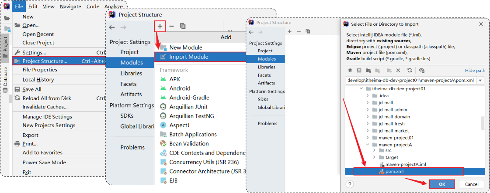
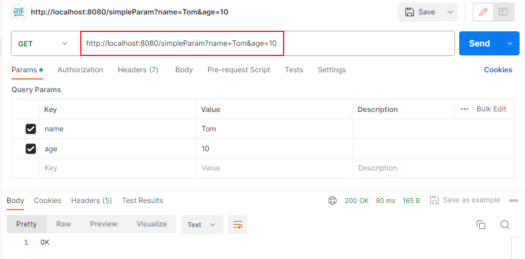
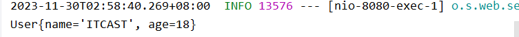

# Web后端开发

# 1、Maven

**什么是maven?**

Maven是apache旗下的一个开源项目，是一款用于管理和构建java项目的工具。

> Apache 软件基金会，成立于1999年7月，是目前世界上最大的最受欢迎的开源软件基金会，也是一个专门为支持开源项目而生的非盈利性组织。
>
> 开源项目：[https://www.apache.org/index.html#projects-list](https://www.apache.org/index.html)


**Maven的作用?**

1、**依赖管理**：方便快捷的管理项目依赖的资源(jar包)，避免版本冲突问题

2、**统一项目结构**：提供标准、统一的项目结构


3、**项目构建**：标准跨平台（Linux、Windows、MacOS）的自动化项目构建方式

编译 =》 测试 =》 打包 =》 发布

**Maven：清理、编译、测试、打包、发布**


## Maven概述

介绍：project object model

- Apache Maven 是一个项目管理和构建工具，它基于项目对象模型(POM)的概念，通过一小段描述信息来管理项目的构建。

- 作用： 
    - 方便的依赖管理
    - 统一的项目结构
    - 标准的项目构建流程

- 官网：http://maven.apache.org/


仓库：用于存储资源，管理各种jar包。

- 本地仓库：自己计算机上的一个目录。

- 中央仓库：由Maven团队维护的全球唯一的。 仓库地址：https://repo1.maven.org/maven2/

- 远程仓库(私服)：一般由公司团队搭建的私有仓库。


查找顺序：本地仓库、远程仓库、中央仓库


## Maven安装

安装步骤：

1. 解压 apache-maven-3.6.1-bin.zip 。

    

2. 配置本地仓库：修改 conf/settings.xml 中的 \<localRepository> 为一个指定目录。

    ```xml
    <localRepository>D:\software\apache-maven-3.6.1\mvn_repo</localRepository>
    ```

3. 配置阿里云私服：修改 conf/settings.xml 中的 \<mirrors>标签，为其添加如下子标签：

    ```xml
    <mirror>  
    	<id>alimaven</id>  
    	<name>aliyun maven</name>  
    	<url>http://maven.aliyun.com/nexus/content/groups/public/</url>
    	<mirrorOf>central</mirrorOf>          
    </mirror>
    ```

4. 配置环境变量: MAVEN_HOME 为maven的解压目录，并将其bin目录加入PATH环境变量。

    测试：

    ```bash
    mvn -v
    ```

    


## IDEA集成Maven

1、配置Maven环境(当前工程)

- 选择 IDEA中 File --> Settings --> Build,Execution,Deployment --> Build Tools --> Maven

- 设置 IDEA 使用本地安装的 Maven，并修改配置文件及本地仓库路径


2、配置Maven环境(全局)


### 创建Maven项目

1. 创建模块，选择Maven，点击Next

    

2. 填写模块名称，坐标信息，点击finish，创建完成

3. 编写 HelloWorld，并运行

**解决报错** ：java 错误 不支持发行版本5

在 `maven\conf\setting.xml` 中，加入如下代码

17 为 jdk 的版本号

```xml
<profile>
    <id>development</id>
    <activation>
        <jdk>17</jdk>
        <activeByDefault>true</activeByDefault>
    </activation>
    <properties>
        <maven.compiler.source>17</maven.compiler.source>
        <maven.compiler.target>17</maven.compiler.target>
        <maven.compiler.compilerVersion>17</maven.compiler.compilerVersion>
    </properties>
</profile>
```

重启idea

**设置完成后,新建maven项目,不用修改设置即可编译成功.**


**==Maven坐标==**

- 什么是坐标？
    - Maven 中的坐标是==资源的唯一标识，通过该坐标可以唯一定位资源位置。==
    - 使用坐标来定义项目或引入项目中需要的依赖。

- Maven 坐标主要组成
    - **groupId**：定义当前Maven项目隶属组织名称（通常是域名反写，例如：com.itheima）
    - **artifactId**：定义当前Maven项目名称（通常是模块名称，例如 order-service、goods-service）
    - **version**：定义当前项目版本号


### 导入Maven项目

方式一：打开IDEA，选择右侧Maven面板，点击 + 号，选中对应项目的pom.xml文件，双击即可。


方式二：打开IDEA，选择右侧Maven面板，点击 + 号，选中对应项目的pom.xml文件，双击即可。




## 依赖管理

依赖：指当前项目运行所需要的jar包，一个项目中可以引入多个依赖。

配置：

1. 在 pom.xml 中编写 \<dependencies> 标签

2. 在 \<dependencies> 标签中 使用 \<dependency> 引入坐标

3. 定义坐标的 groupId，artifactId，version

4. 点击刷新按钮，引入最新加入的坐标

```xml
<dependencies>
    <dependency>        
        <groupId>ch.qos.logback</groupId>        
        <artifactId>logback-classic</artifactId>       
        <version>1.2.3</version>    
    </dependency>
</dependencies>
```

注意事项：

- 如果引入的依赖，在本地仓库不存在，将会连接远程仓库/中央仓库，然后下载依赖。（这个过程会比较耗时，耐心等待）

- 如果不知道依赖的坐标信息，可以到https://mvnrepository.com/中搜索。


## 依赖传递

依赖具有传递性

- 直接依赖：在当前项目中通过依赖配置建立的依赖关系

- 间接依赖：被依赖的资源如果依赖其他资源，当前项目间接依赖其他资源


以图表的形式展示依赖关系：在pom文件中右键，选择 Diagrams - show Diagram。。。


**排除依赖**

- 排除依赖指主动断开依赖的资源，被排除的资源无需指定版本。
- 通过标签 \<exclusion> 排除依赖

```xml
<dependency>
    <groupId>com.itheima</groupId>
    <artifactId>maven-projectB</artifactId>
    <version>1.0-SNAPSHOT</version>
    <exclusions>
        <exclusion>
            <groupId>junit</groupId>
            <artifactId>junit</artifactId>
        </exclusion>
    </exclusions>
</dependency>
```


## 依赖范围

依赖的jar包，默认情况下，可以在任何地方使用。可以通过 \<scope>…</ scope > 设置其作用范围。

作用范围：

- 主程序范围有效。（main文件夹范围内）

- 测试程序范围有效。（test文件夹范围内）

- 是否参与打包运行。（package指令范围内）

| **scope值**     | **主程序** | **测试程序** | **打包（运行）** | **范例**    |
| --------------- | ---------- | ------------ | ---------------- | ----------- |
| compile（默认） | Y          | Y            | Y                | log4j       |
| test            | -          | Y            | -                | junit       |
| provided        | Y          | Y            | -                | servlet-api |
| runtime         | -          | Y            | Y                | jdbc驱动    |

```xml
<dependency>
    <groupId>junit</groupId>
    <artifactId>junit</artifactId>
    <version>4.10</version>
    <scope>test</ scope >
</dependency>
```


## 生命周期

Maven的生命周期就是为了对所有的maven项目构建过程进行抽象和统一。

Maven中有3套==相互独立==的生命周期：

- `clean`：清理工作。

- `default`：核心工作，如：编译、测试、打包、安装、部署等。

- `site`：生成报告、发布站点等。


每套生命周期包含一些阶段（phase），**阶段是有顺序的，后面的阶段依赖于前面的阶段。**

生命周期阶段：

- `clean`：移除上一次构建生成的文件

- `compile`：编译项目源代码

- `test`：使用合适的单元测试框架运行测试(junit)

- `package`：将编译后的文件打包，如：jar、war等

- `install`：**安装项目到本地仓库**


在==同一套生命周期==中，当运行后面的阶段时，前面的阶段都会运行。


**执行指定生命周期的两种方式：**

- 在idea中，右侧的maven工具栏，选中对应的生命周期，双击执行。

- 在命令行中，通过命令执行。

    ```bash
    mvn clean
    mvn compile
    ```

    


# 2、Web后端开发入门

## Spring介绍

Spring

官网：[spring.io](https://spring.io/)

Spring发展到今天已经形成了一种开发生态圈，Spring提供了若干个子项目，每个项目用于完成特定的功能。


**Spring Boot** **可以帮助我们非常快速的构建应用程序、简化开发、提高效率 。**


## SpringBootWeb快速入门


**需求**：使用 SpringBoot 开发一个web应用，浏览器发起请求 /hello后，给浏览器返回字符串 "Hello World ~"。 


**步骤**：

1. **创建springboot工程，并勾选web开发相关依赖。**


2. **定义HelloController类，添加方法 hello，并添加注解。**

创建模块 com.itheima.controller，新建类 HelloController

```java
package com.itheima.controller;

import org.springframework.web.bind.annotation.RequestMapping;
import org.springframework.web.bind.annotation.RestController;

//请求处理类
//加上注解，表示这是一个请求处理类
@RestController
public class HelloController {
    
    //请求处理方法，"/hello"指定了我们要处理的请求
    @RequestMapping("/hello")
    public String hello(){
        System.out.println("Hello World~");
        return "Hello World~";
    }
}
```

3. **运行测试**

在Spring工程自动创建的启动类中运行测试。


启动后，会占用端口 8080


在浏览器中输入：`localhost:8080/hello`，如果获得返回信息，且控制台可以看到输出的Hello World，说明入门程序没有问题。


## Http协议

### 概述

概念：==H==yper ==T==ext ==T==ransfer ==P==rotocol，超文本传输协议，规定了浏览器和服务器之间数据传输的规则。


特点：

基于TCP协议：面向连接，安全

基于请求-响应模型的：一次请求对应一次响应

HTTP协议是无状态的协议：**对于事务处理没有记忆能力。**每次请求-响应都是独立的。

- 缺点：多次请求间不能共享数据。

- 优点：速度快


### 请求协议

**请求数据格式**

- ==请求行==：请求数据第一行  (请求方式、资源路径、协议)
- ==请求头==：第二行开始，格式 key：value


请求头参数：

| Host            | 请求的主机名                                                 |
| --------------- | ------------------------------------------------------------ |
| User-Agent      | 浏览器版本，例如Chrome浏览器的标识类似Mozilla/5.0 ... Chrome/79，IE浏览器的标识类似Mozilla/5.0 (Windows NT ...) like Gecko |
| Accept          | 表示浏览器能接收的资源类型，如text/\*，image/\*或者\*/\*表示所有； |
| Accept-Language | 表示浏览器偏好的语言，服务器可以据此返回不同语言的网页；     |
| Accept-Encoding | 表示浏览器可以支持的压缩类型，例如gzip,  deflate等。         |
| Content-Type    | 请求主体的数据类型。                                         |
| Content-Length  | 请求主体的大小（单位：字节）。                               |

- ==请求体==：POST请求，存放请求参数

**==请求方式-GET==**: 请求参数在请求行中，没有请求体，如：**/brand/findAll?name=OPPO&status=1**。GET请求**大小是有限制的**。

**==请求方式-POST==**: 请求参数在请求体中，POST请求**大小是没有限制的**。


### 响应协议

- ==响应行==：响应数据第一行(协议、状态码、描述)
- ==响应头==：第二行开始，格式key：value
- ==响应体==：最后一部分，存放响应数据


状态码：

| 1xx  | 响应中-临时状态码，表示请求已经接收，告诉客户端应该继续请求或者如果它已经完成则忽略它。 |
| ---- | ------------------------------------------------------------ |
| 2xx  | **成功**-表示请求已经被成功接收，处理已完成。                |
| 3xx  | **重定向**-重定向到其他地方；让客户端再发起一次请求以完成整个处理。 |
| 4xx  | **客户端错误**-处理发生错误，**责任在客户端**。如：请求了不存在的资源、客户端未被授权、禁止访问等。 |
| 5xx  | **服务器错误**-处理发生错误，**责任在服务端**。如：程序抛出异常等。 |

常见的响应状态码：

| 状态码  | 英文描述                               | 解释                                                         |
| ------- | -------------------------------------- | ------------------------------------------------------------ |
| ==200== | **`OK`**                               | 客户端请求成功，即**处理成功**，这是我们最想看到的状态码     |
| 302     | **`Found`**                            | 指示所请求的资源已移动到由`Location`响应头给定的 URL，浏览器会自动重新访问到这个页面 |
| 304     | **`Not Modified`**                     | 告诉客户端，你请求的资源至上次取得后，服务端并未更改，你直接用你本地缓存吧。隐式重定向 |
| 400     | **`Bad Request`**                      | 客户端请求有**语法错误**，不能被服务器所理解                 |
| 403     | **`Forbidden`**                        | 服务器收到请求，但是**拒绝提供服务**，比如：没有权限访问相关资源 |
| ==404== | **`Not Found`**                        | **请求资源不存在**，一般是URL输入有误，或者网站资源被删除了  |
| 405     | **`Method Not Allowed`**               | 请求方式有误，比如应该用GET请求方式的资源，用了POST          |
| 428     | **`Precondition Required`**            | **服务器要求有条件的请求**，告诉客户端要想访问该资源，必须携带特定的请求头 |
| 429     | **`Too Many Requests`**                | 指示用户在给定时间内发送了**太多请求**（“限速”），配合 Retry-After(多长时间后可以请求)响应头一起使用 |
| 431     | **` Request Header Fields Too Large`** | **请求头太大**，服务器不愿意处理请求，因为它的头部字段太大。请求可以在减少请求头域的大小后重新提交。 |
| ==500== | **`Internal Server Error`**            | **服务器发生不可预期的错误**。服务器出异常了，赶紧看日志去吧 |
| 503     | **`Service Unavailable`**              | **服务器尚未准备好处理请求**，服务器刚刚启动，还未初始化好   |

状态码大全：https://cloud.tencent.com/developer/chapter/13553 

常见的响应头：

| Content-Type     | 表示该响应内容的类型，例如text/html，application/json。      |
| ---------------- | ------------------------------------------------------------ |
| Content-Length   | 表示该响应内容的长度（字节数）。                             |
| Content-Encoding | 表示该响应压缩算法，例如gzip。                               |
| Cache-Control    | 指示客户端应如何缓存，例如max-age=300表示可以最多缓存300秒。 |
| Set-Cookie       | 告诉浏览器为当前页面所在的域设置cookie。                     |


### 协议解析

客户端浏览器：内置了Http解析程序，会自动解析，不需要处理

服务端：ServerSocket

可以使用ServerSocket编写解析程序


使用 ServerSocket 编写非常繁琐，所有的 Web开发都需要解析 Http协议，而Http协议是同一的标准的，通用的。因此有很多公司已经把这部分代码写好了，将其封装到了软件中——Web服务器。

如：jetty、WebLogic、WebSphere、TomCat


**Web服务器**

Web服务器是一个软件程序，对HTTP协议的操作进行封装，使得程序员不必直接对协议进行操作，让Web开发更加便捷。主要功能是 "提供网上信息浏览服务" 。


## TomCat

### 介绍

**概念**： Tomcat是Apache 软件基金会一个核心项目，是一个开源免费的轻量级**Web服务器**，支持Servlet/JSP少量JavaEE规范。

**JavaEE**：Java Enterprise Edition，Java企业版。指Java企业级开发的技术规范总和。包含13项技术规范：JDBC、JNDI、EJB、RMI、JSP、Servlet、XML、JMS、Java IDL、JTS、JTA、JavaMail、JAF

**Tomcat 也被称为 Web容器、Servlet容器。Servlet程序需要依赖于 Tomcat才能运行** 

官网：https://tomcat.apache.org/


1. Web服务器

    - 对HTTP协议操作进行封装，简化web程序开发。

    - 部署web项目，对外提供网上信息浏览服务。

2. Tomcat

    - 一个轻量级的web服务器，支持servlet、jsp等少量javaEE规范。

    - 也被称为web容器、servlet容器。


### 基本使用

**下载**：官网下载，地址 https://tomcat.apache.org/download-90.cgi

**安装**：绿色版，直接解压即可


**卸载**：直接删除目录即可

**启动**：双击：`bin/startup.bat `


控制台中文乱码：修改 `conf/logging.properties`

```properties
java.util.logging.ConsoleHandler.level = FINE
java.util.logging.ConsoleHandler.formatter = org.apache.juli.OneLineFormatter
java.util.logging.ConsoleHandler.encoding = GBK
```


**关闭**：

- 直接×掉运行窗口：强制关闭

- bin\shutdown.bat：正常关闭

- Ctrl+C：正常关闭

**访问**：`localhost:8080`

**部署**：将项目放置到 webapps 目录下， 即部署完成


**常见问题**：

- 启动窗口一闪而过：检查JAVA_HOME环境变量是否正确配置

- 端口号冲突：找到对应程序，将其关闭掉


**配置Tomcat端口号**（conf/server.xml）


注意：Http默认端口：80

将TomCat端口配置为80，访问时可以不加端口号


### 入门程序解析

SpringBootWeb-入门程序解析


**起步依赖：**

- spring-boot-starter-web：包含了web应用开发所需要的常见依赖。

- spring-boot-starter-test：包含了单元测试所需要的常见依赖。

- 官方提供的starter：[https://docs.spring.io/spring-boot/docs/2.7.4/reference/htmlsingle/#using.build-systems.starters](https://docs.spring.io/spring-boot/docs/2.7.4/reference/htmlsingle/)


我们在pom文件中引入依赖的时候，是没有加版本号的，这是因为SpringBoot项目有一个统一的父工程，也就是所配置的parent。

所有的Spring工程都有继承这样一个父工程。起步依赖版本都在父工程中已经进行了统一管理。


**基于Springboot开发的web应用程序，内置了tomcat服务器，当启动类运行时，会自动启动内嵌的tomcat服务器。**


## 请求响应

在入门程序中，编写了 RestController类，在浏览器地址栏输入地址即可访问到对应的数据。


但是我们所编写的Controller类，没有实现任何的接口，也没有继承任何的类。因此这个程序TomCat是不识别的，也不能够直接运行。


但是，TomCat识别一项JavaEE里的规范技术：**Servlet**，TomCat也称为Servlet容器。

SpringBoot底层为我们提供了一个非常核心的Servlet程序：==**DispatcherServlet**==。

DispatcherServelet 继承体系：


由此可见，DispatcherServlet实现了一个接口，就是Servlet接口。

因此，它就是一个可以被TomCat识别的Servlet程序。

**有了DispatcherServelet之后，前端发起的请求都会先经过DispatcherServelet，再由DispatcherServelet将请求转给后面各个Controller程序；由Controller程序再对请求进行处理；处理完成之后，Controller程序再将处理结果返回给DispatcherServelet；DispatcherServelet再给浏览器响应数据。**

DispatcherServelet在Web请求中是一个非常重要的类，这个类在SpringBoot中称为：==**核心控制器 或 前端控制器**==

**如何在Servlet当中获取请求的数据呢？**

Tomcat会接收浏览器的请求信息，并对其进行解析，它会将解析后的所有请求信息封装到一个对象当中，这个对象就是：**==HttpServletRequest==** 对象，也叫请求对象。

响应数据对象：**==HttpServletResponse==** 对象，通过这个对象我们就可以设置我们要响应的数据。然后Tomcat就会根据这个对象设置的响应信息来响应数据给浏览器。


**请求响应：**

- 请求（HttpServletRequest）：获取请求数据

- 响应（HttpServletResponse）：设置响应数据

- **BS架构**：Browser/Server，浏览器/服务器架构模式。客户端只需要浏览器，应用程序的逻辑和数据都存储在服务端。

- **CS架构**：Client/Server，客户端/服务器架构模式。


### 请求-postman工具

当前最为主流的开发模式：前后端分离


**postman**

Postman是一款功能强大的网页调试与发送网页HTTP请求的Chrome插件。

作用：**常用于进行接口测试**

可以模拟浏览器发起任何形式的http请求，请求的过程中可以很方便的携带很多参数和请求头等信息。

后端工程师进行接口测试的首选工具。


1、下载安装包：[Download Postman | Get Started for Free](https://www.postman.com/downloads/)

2、安装：直接双击即可。

3、注册账户

4、创建工作空间


5、添加请求并测试


6、保存请求


### 请求-简单参数

- **原始方式**

    在原始的web程序中，获取请求参数，需要通过HttpServletRequest 对象手动获取。

    ```java
    @RestController
    public class RequestController {
        //原始方式
        @RequestMapping("/simpleParam")
        public String simpleParam(HttpServletRequest request){
            //获取请求参数
            String name = request.getParameter("name");
            String ageStr = request.getParameter("age");
    
            int age = Integer.parseInt(ageStr);
            System.out.println(name + ":" +age);
            return "OK";
        }
    }
    ```



**使用 HttpServletRequest 对象获取参数的方式比较繁琐，而且需要手动类型转换。**


- **SpringBoot方式**

    简单参数：参数名与形参变量名相同，定义形参即可接收参数。

    ```java
    //SpringBoot方式
    @RequestMapping("/simpleParam")
    public String simpleParam(String name, Integer age){
        //获取请求参数
        System.out.println(name + ":" +age);
        return "OK";
    }
    ```

    会自动进行类型转换，只有参数名相同即可

接收POST请求：


不论是POST请求，还是GET请求，只需要将参数名与形参名保持一致即可。

- 当参数名不一致时：

    不会报错，但得到的值为null

    

- **参数名不一致的处理**：

    如果方法形参名称与请求参数名称不匹配，可以使用 @RequestParam 完成映射。

    `@RequestParam(name = "name")`

    ```java
    //SpringBoot方式
    @RequestMapping("/simpleParam")
    public String simpleParam(@RequestParam(name = "name") String username, Integer age){
        //获取请求参数
        System.out.println(username + ":" +age);
        return "OK";
    }
    ```

- **注意事项**：`@RequestParam` 中的 required 属性默认为 true，代表该请求参数必须传递，**如果不传递将报错**。 如果该参数是可选的，可以将 required 属性设置为 false。

    

    设置 required属性：

    `@RequestParam(name = "name", required = false)`

    ```java
    //SpringBoot方式
    @RequestMapping("/simpleParam")
    public String simpleParam(@RequestParam(name = "name", required = false) String username, Integer age){
        //获取请求参数
        System.out.println(username + ":" +age);
        return "OK";
    }
    ```

    

**总结：**

1. **原始方式获取请求参数**

    - Controller方法形参中声明 HttpServletRequest 对象

    - 调用对象的getParameter(参数名)

2. **SpringBoot中接收简单参数**
- 请求参数名与方法形参变量名相同
    
- 会自动进行类型转换
    
3. **@RequestParam注解**
- 方法形参名称与请求参数名称不匹配，通过该注解完成映射
    
- 该注解的required属性默认是true，代表请求参数必须传递


### 请求-实体参数

如果前端传递的参数很多，通过简单参数的接收方式比较繁琐，而且不便于后期的维护。

因此，我们可以考虑将所有的请求参数都封装到以一个实体类中。


- 简单实体对象：请求参数名与形参对象属性名相同，定义POJO接收即可

    

    创建一个包：`com.itheima.pojo`

    在这个包下创建一个JavaBean类：`User`

    ```java
    public class User {
        private String name;
        private Integer age;
    }
    ```

    生成该类的 get 和 set 方法，toString方法。

    添加处理方法：

    ```java
    @RequestMapping("/simplePojo")
    public String simplePojo(User user){
        System.out.println(user);
        return "OK";
    }
    ```

    重启服务，测试

    


- 复杂实体对象：请求参数名与形参对象属性名相同，按照对象层次结构关系即可接收嵌套POJO属性参数。


输出结果：


### 请求-数组集合参数

- **数组参数**：请求参数名与形参数组名称相同且请求参数为多个，定义数组类型形参即可接收参数
- **集合参数**：请求参数名与形参集合名称相同且请求参数为多个，**@RequestParam** 绑定参数关系


添加处理方法：

方法一：使用数组接收参数

```java
//数组集合参数
@RequestMapping("/arrayParam")
public String arrayParam(String[] hobby){
    System.out.println(Arrays.toString(hobby));
    return "OK";
}
```

方法二：使用集合接收参数

```java
//集合集合参数
@RequestMapping("/listParam")
public String listParam(@RequestParam List<String> hobby){
    System.out.println(hobby);
    return "OK";
}
```


### 请求-日期参数

- 日期参数：使用 @DateTimeFormat 注解完成日期参数格式转换 


添加处理方法：

```java
//日期时间参数
@RequestMapping("/dateParam")
public String dateParam(@DateTimeFormat(pattern = "yyyy-MM-dd HH:mm:ss") LocalDateTime updateTime){
    System.out.println(updateTime);
    return "OK";
}
```


### 请求-Json参数

- JSON参数：JSON数据==键名==与形参对象==属性名==相同，**定义POJO类型**形参即可接收参数，需要使用 ==@RequestBody== 标识


**键名和属性名必须一样。**


```java
//json参数
@RequestMapping("/jsonParam")
public String jsonParam(@RequestBody User user){
    System.out.println(user);
    return "OK";
}
```


### 请求-路径参数

- 路径参数：通过请求URL直接传递参数，使用{…}来标识该路径参数，需要使用 ==@PathVariable== 获取路径参数


1 是一个路径参数，因此在服务端不能写 `@RequestMapping("/path/1")`，因为当路径参数改变时，这个方法就不能接收到了。

使用 `{}` 指定参数

```java
//路径参数
@RequestMapping("/path/{id}")
public String pathParam(@PathVariable Integer id){
    System.out.println(id);
    return "OK";
}
```

传递多个路径参数


```java
//路径参数
@RequestMapping("/path/{id}/{name}")
public String pathParam2(@PathVariable Integer id, @PathVariable String name){
    System.out.println(id);
    System.out.println(name);
    return "OK";
}
```


### 响应-@ResponseBody


@ResponseBody

- 类型：**方法注解、类注解**

- 位置：Controller方法上/类上

- 作用：将方法返回值直接响应，如果返回值类型是 实体对象/集合 ，将会转换为JSON格式响应

- 说明：**@RestController = @Controller + @ResponseBody** ;


加了@RestController注解的类，表示它的所有的方法的返回值都会作为响应数据。

如果是一个对象或者集合，会先转Json，在进行响应。

对于不同的接口，响应的数据格式很随意，这种方式非常不便于管理，很难维护。

因此，在项目开发过程中，一般会设置一个统一的响应结果。

**统一响应结果：**


将返回的信息都封装到Result中，只返回Result对象，前端只会拿到这一种数据，只需要对一种格式进行解析。

**总结：**

1. @ResponseBody

    - 位置：Controller类上/方法上

    - 作用：将方法返回值直接响应，若返回值类型是 实体对象/集合 ，转JSON格式响应

2. 统一响应结果

    - Result（code、msg、data）


### 响应-案例

**案例：获取员工数据，返回统一响应结果，在页面渲染展示**

加载并解析emp.xml文件中的数据，完成数据处理，并在页面展示。


步骤：

1、在pom.xml文件中引入dom4j的依赖，用于解析XML文件

```xml
<dependency>
    <groupId>org.dom4j</groupId>
    <artifactId>dom4j</artifactId>
    <version>2.1.3</version>
</dependency>
```

2、引入资料中提供的解析XML的工具类XMLParserUtils、对应的实体类Emp、XML文件 emp.xml


3、引入资料中提供的静态页面文件，放在resources下的static目录下

==Springboot项目的静态资源(html，css，js等前端资源)默认存放目录为：classpath:/static 、 classpath:/public、 classpath:/resources==


4、编写Controller程序，处理请求，响应数据

```java
@RestController
public class EmpController {

    @RequestMapping("/listEmp")
    public Result list(){
        //1. 加载并解析emp.xml
        String file = this.getClass().getClassLoader().getResource("emp.xml").getFile();
        System.out.println(file);
        List<Emp> empList = XmlParserUtils.parse(file, Emp.class);

        //2. 对数据进行转换处理
        empList.stream().forEach(emp->{
            //处理 gender 1：男 2：女
            String gender = emp.getGender();
            if("1".equals(gender)){
                emp.setGender("男");
            }else if("2".equals(gender)){
                emp.setGender("女");
            }

            //处理job
            String job = emp.getJob();
            if("1".equals(job)){
                emp.setJob("讲师");
            }else if("2".equals(job)){
                emp.setJob("班主任");
            }else if("3".equals(job)){
                emp.setJob("就业指导");
            }

        });

        //3. 响应数据
        return Result.success(empList);
    }
}
```


## 分层解耦

上面的案例中，将所有的程序都编写在Controller程序中，复用性查，难以维护。

### 三层架构


**三层架构：**


- **controller**：控制层，接收前端发送的请求，对请求进行处理，并响应数据。

- **service**：业务逻辑层，处理具体的业务逻辑。

- **dao**：数据访问层(Data Access Object)（持久层），负责数据访问操作，包括数据的增、删、改、查。


拆分前后对比


### 分层解耦

- **内聚**：软件中各个功能模块内部的功能联系。

- **耦合**：衡量软件中各个层/模块之间的依赖、关联的程度。

- ==**软件设计原则**：高内聚低耦合。==

上述使用的三层架构中，出现了耦合的现象：


当我们将 Service层的处理类 EmpServiceA 切换为 EmpServiceB 时，controller层的代码也需要跟着改动，这种情况我们称为 **controller层和Service层耦合了**。


**解耦**：

1、删除new对象的代码，此时运行会报错。（空指针异常）

2、创建一个容器，将要使用的类对象放在这个容器中，controller层需要用到时，在这个容器内找。


重点：

- **控制反转：** Inversion Of Control，简称==IOC==。对象的创建控制权由程序自身转移到外部（容器），这种思想称为控制反转。

- **依赖注入：** Dependency Injection，简称==DI==。容器为应用程序提供运行时，所依赖的资源，称之为依赖注入。

- **Bean对象：**IOC容器中创建、管理的对象，称之为bean。


### IOC & DI入门

1. Service层 及 Dao层的实现类，交给IOC容器管理。

    只需要加上 ==@Component== 注解，表示将当前类交给IOC容器管理，成为IOC容器中的bean

    

2. 为Controller及Service注入运行时依赖的对象。

    只需要在创建对象的语句上，加上注解 ==@Autowired== ，表示运行时，IOC容器会提供该类型的bean对象，并赋值给该变量 - 依赖注入

    

3. 运行测试。


### IOC详解

- **Bean的声明**

要把某个对象交给IOC容器管理，需要在对应的类上加上如下注解之一：

| 注解        | 说明                 | 位置                                            |
| ----------- | -------------------- | ----------------------------------------------- |
| @Component  | 声明bean的基础注解   | 不属于以下三类时，用此注解                      |
| @Controller | @Component的衍生注解 | 标注在控制器类上                                |
| @Service    | @Component的衍生注解 | 标注在业务类上                                  |
| @Repository | @Component的衍生注解 | 标注在数据访问类上（由于与mybatis整合，用的少） |

注意事项：

- 声明bean的时候，可以通过value属性指定bean的名字，如果没有指定，默认为类名首字母小写。

- 使用以上四个注解都可以声明bean，但是在springboot集成web开发中，声明控制器bean只能用@Controller。


- **Bean组件扫描**

前面声明bean的四大注解，要想生效，还需要被组件==扫描注解@ComponentScan==扫描。

==@ComponentScan注解==虽然没有显式配置，但是实际上已经包含在了启动类声明注解 ==@SpringBootApplication== 中，**默认扫描的范围是启动类所在包及其子包**。


手动设置包扫描：`@ComponentScan({"dao", "com.itheima"})`


### DI详解

- **Bean注入**

==@Autowired注解==，默认是按照**类型**进行，如果存在多个相同类型的bean，将会报出如下错误：


通过以下几种方案来解决：

- `@Primary`

- `@Qualifier`

- `@Resource`


总结：

1. **依赖注入的注解**

    - @Autowired：默认按照类型自动装配。

    - 如果同类型的bean存在多个：
        - @Primary
        - @Autowired + @Qualifier("bean的名称")
        - @Resource(name="bean的名称")

2. **@Resource 与 @Autowired区别（面试题）**

    - @Autowired 是spring框架提供的注解，而@Resource是JDK提供的注解。

    - @Autowired 默认是按照**类型**注入，而@Resource默认是按照**名称**注入。


