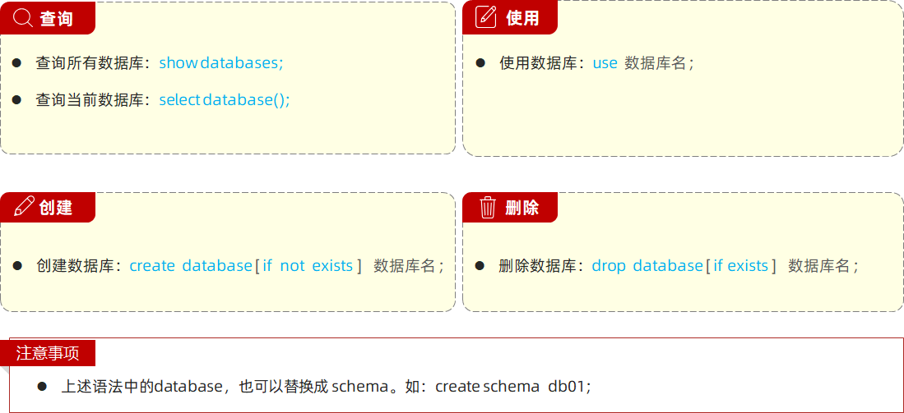

# 数据库

- 数据库：DataBase（DB），是存储和管理数据的仓库

- 数据库管理系统：DataBase Management System (DBMS)，操纵和管理数据库的大型软件。

- SQL：Structured Query Language，操作关系型数据库的编程语言，定义了一套操作关系型数据库统一标准。

数据库产品：

| Oracle     | 收费的大型数据库，Oracle公司的产品。                         |
| ---------- | ------------------------------------------------------------ |
| MySQL      | 开源免费的中小型数据库。Sun公司收购了MySQL，Oracle收购Sun公司。 |
| SQL Server | MicroSoft公司收费的中型的数据库。C#、.net等语言常使用。      |
| PostgreSQL | 开源免费中小型的数据库。                                     |
| DB2        | IBM公司的大型收费数据库产品。                                |
| SQLite     | 嵌入式的微型数据库。如：作为Android内置数据库                |
| MariaDB    | 开源免费的中小型的数据库。                                   |


# 1、Mysql概述

## 1.1 安装、配置

MySQL官方提供了两种不同的版本：


1、官网下载地址：https://dev.mysql.com/downloads/mysql/


2、解压

解压到想安装的位置


3、配置

3.1 配置环境变量

在`系统变量`中新建MYSQL_HOME


在`系统变量`中找到并**双击**`Path`


4、验证

在cmd中，输入mysql（==以管理员身份运行==）


5、初始化Mysql

在刚才的命令行中，输入如下的指令： 

```mysql
mysqld --initialize-insecure
```


稍微等待一会，如果出现没有出现报错信息，则证明data目录初始化没有问题，此时再查看MySQL目录下已经有data目录生成。

tips：如果出现如下错误


是由于权限不足导致的，以管理员方式运行 cmd


6、注册Mysql服务

命令行（注意必须以管理员身份启动）中，输入如下的指令，回车执行： 

```bash
mysqld -install
```


7、启动MySQL服务

在黑框里敲入`net start mysql`，回车。

```bash
net start mysql  // 启动mysql服务
    
net stop mysql  // 停止mysql服务
```


8、修改默认账户密码

```bash
mysqladmin -u root password 123456
```


9、登录Mysql

```bash
mysql -uroot -p123456
```


**到这里你就可以开始你的MySQL之旅了！**

退出mysql：

```
exit
quit
```

登陆参数：

```
mysql -u用户名 -p密码 -h要连接的mysql服务器的ip地址(默认127.0.0.1) -P端口号(默认3306)
```


## 1.2 卸载MySQL

如果你想卸载MySQL，也很简单。

点击开始菜单，输入cmd，选择 "命令提示符"，选择右侧的 "以管理员身份运行"。


1. 敲入`net stop mysql`，回车。

```
net stop mysql
```


2. 再敲入`mysqld -remove mysql`，回车。

```
mysqld -remove mysql
```


3. 最后删除MySQL目录及相关的环境变量。

**至此，MySQL卸载完成！**


## 1.3 数据模型

关系型数据库（RDBMS）: 建立在关系模型基础上，由多张相互连接的二维表组成的数据库。


特点：

- 使用表存储数据，格式统一，便于维护

- 使用SQL语言操作，标准统一，使用方便，可用于复杂查询


# 2、SQL

## 2.1 SQL简介

SQL：一门操作关系型数据库的编程语言，定义操作所有关系型数据库的统一标准。

通用语法：

- SQL语句可以单行或多行书写，以分号结尾。

- SQL语句可以使用空格/缩进来增强语句的可读性。

- MySQL数据库的SQL语句**不区分大小写**。

- 注释：

    1. 单行注释：-- 注释内容 或 # 注释内容(MySQL特有)

    2. 多行注释： /* 注释内容 */


SQL分类

SQL语句通常被分为四大类：

| **分类** | **全称**                    | **说明**                                               |
| -------- | --------------------------- | ------------------------------------------------------ |
| DDL      | Data Definition  Language   | 数据定义语言，用来定义数据库对象(数据库，表，字段)     |
| DML      | Data Manipulation  Language | 数据操作语言，用来对数据库表中的数据进行增删改         |
| DQL      | Data Query Language         | 数据查询语言，用来查询数据库中表的记录                 |
| DCL      | Data Control  Language      | 数据控制语言，用来创建数据库用户、控制数据库的访问权限 |


## 2.2 DDL


DDL 英文全称是 Data Definition Language，数据定义语言，用来定义数据库对象(数据库、表)。



MySQL客户端工具-图形化工具


使用IDEA


DDL（表操作）


| **约束** | **描述**                                         | **关键字**  |
| -------- | ------------------------------------------------ | ----------- |
| 非空约束 | 限制该字段值不能为null                           | not null    |
| 唯一约束 | 保证字段的所有数据都是唯一、不重复的             | unique      |
| 主键约束 | 主键是一行数据的唯一标识，要求非空且唯一         | primary key |
| 默认约束 | 保存数据时，如果未指定该字段值，则采用默认值     | default     |
| 外键约束 | 让两张表的数据建立连接，保证数据的一致性和完整性 | foreign key |


## 2.3 DML

DML英文全称是Data Manipulation Language(数据操作语言)，用来对数据库中表的数据记录进行增、删、改操作。

- 添加数据（INSERT）

- 修改数据（UPDATE）

- 删除数据（DELETE）


## 2.4 DQL

DQL英文全称是Data Query Language(数据查询语言)，用来查询数据库表中的记录。

关键字：SELECT


## 2.5 多表设计

概述

项目开发中，在进行数据库表结构设计时，会根据业务需求及业务模块之间的关系，分析并设计表结构，由于业务之间相互关联，所以各个表结构之间也存在着各种联系，基本上分为三种：

- 一对多(多对一)

- 多对多

- 一对一


一对多关系实现：在数据库表中多的一方，添加字段，来关联一的一方的主键。


一对一关系：多用于单表拆分，将一张表的基础字段放在一张表中，其他字段放在另一张表中，以提升操作效率


多对多：通过中间表来维护，中间表的两个外键，分别关联另外两张表的主键。


## 员工信息统计

图形报表


报表组件库：

==Apache ECharts==


# 3、多表查询

多表查询: 指从多张表中查询数据

笛卡尔积: 笛卡尔乘积是指在数学中，两个集合(A集合 和 B集合)的所有组合情况。


## 内连接


## 外连接


## 子查询


# 4、事务

**事务** 是一组操作的集合，它是一个不可分割的工作单位。事务会把所有的操作作为一个整体一起向系统提交或撤销操作请求，即这些操作 要么同时成功，要么同时失败。


## 四大特性（ACID）


## 索引


优缺点：


语法：

- 创建索引

```mysql
create  [ unique ]  index 索引名 on  表名 (字段名,... ) ;
```

- 查看索引

```mysql
show  index  from  表名;
```

- 删除索引

```mysql
drop  index  索引名  on  表名;
```


