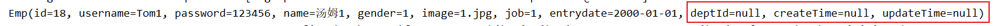

# MyBatis

什么是 Mybatis？

- MyBatis是一款优秀的 **持久层** 框架，用于简化JDBC的开发。

- MyBatis本是 Apache的一个开源项目iBatis, 2010年这个项目由apache迁移到了google code，并且改名为MyBatis 。2013年11月迁移到Github。

- 官网：https://mybatis.org/mybatis-3/zh/index.html 


# 1、Mybatis入门

用 java 程序编写 sql 语句，通过 Mybatis 在发送给数据库执行，数据库再将结果返回给Mybatis。


## 1.1 快速入门程序

步骤：

1. 准备工作(创建springboot工程、数据库表user、实体类User)


2. 引入Mybatis的相关依赖，配置Mybatis(数据库连接信息)


3. 编写SQL语句(注解/XML)


1、创建新模块


2、新建User类


3、引入相关依赖


4、编写Mapper接口


5、编写单元测试


6、运行单元测试


## 1.2 配置SQL提示

@Select 注解中，IDEA不会识别SQL语句是否准确。

因此需要配置SQL提示（新版本自带）


问题：（user报红）


- 产生原因：Idea和数据库没有建立连接，不识别表信息

- 解决方式：在Idea中配置MySQL数据库连接


根本解决：


## 1.3 JDBC介绍

JDBC： ( Java DataBase Connectivity )，就是使用Java语言操作关系型数据库的一套API。


本质：

- sun公司官方定义的一套操作所有关系型数据库的规范，即接口。

- 各个数据库厂商去实现这套接口，提供数据库驱动jar包。

- 我们可以使用这套接口（JDBC）编程，真正执行的代码是驱动jar包中的实现类。


JDBC **vs** MyBatis


## 1.4 数据库连接池


不使用连接池，每一次访问都需要创建一个新的连接


标准接口：DataSource

- 官方(sun)提供的数据库连接池接口，由第三方组织实现此接口。

- 功能：获取连接


常见产品：


Druid（德鲁伊）

- Druid连接池是阿里巴巴开源的数据库连接池项目

- 功能强大，性能优秀，是Java语言最好的数据库连接池之一

切换Druid数据库连接池

官方地址：https://github.com/alibaba/druid/tree/master/druid-spring-boot-starter

pom.xml

```xml
<dependency>
    <groupId>com.alibaba</groupId>
    <artifactId>druid-spring-boot-starter</artifactId>
    <version>1.2.8</version>
</dependency>
```

application.properties

```properties
spring.datasource.druid.driver-class-name=com.mysql.cj.jdbc.Driver
spring.datasource.druid.url=jdbc:mysql://localhost:3306/mybatis
spring.datasource.druid.username=root
spring.datasource.druid.password=1234
```

也可以直接使用初始的方式

```properties
spring.datasource.driver-class-name=com.mysql.cj.jdbc.Driver
spring.datasource.url=jdbc:mysql://localhost:3306/mybatis
spring.datasource.username=root
spring.datasource.password=1234
```


## 1.5 lombok工具包

问题：


Lombok是一个实用的Java类库，能通过注解的形式自动生成构造器、getter/setter、equals、hashcode、toString等方法，并可以自动化生成日志变量，简化java开发、提高效率。

| **注解**                | **作用**                                                     |
| ----------------------- | ------------------------------------------------------------ |
| @Getter/@Setter         | 为所有的属性提供get/set方法                                  |
| @ToString               | 会给类自动生成易阅读的  toString 方法                        |
| @EqualsAndHashCode      | 根据类所拥有的非静态字段自动重写 equals 方法和  hashCode 方法 |
| ==@Data==               | 提供了更综合的生成代码功能（@Getter  + @Setter + @ToString + @EqualsAndHashCode） |
| ==@NoArgsConstructor==  | 为实体类生成无参的构造器方法                                 |
| ==@AllArgsConstructor== | 为实体类生成除了static修饰的字段之外带有各参数的构造器方法。 |

引入：

```xml
<dependency>
    <groupId>org.projectlombok</groupId>
    <artifactId>lombok</artifactId>
</dependency>
```

注意：Lombok会在编译时，自动生成对应的java代码。我们使用lombok时，还需要安装一个lombok的插件(idea自带)。


# 2、Mabatis基础操作

## 2.1 准备工作

- 准备数据库表 emp

- 创建一个新的springboot工程，选择引入对应的起步依赖（mybatis、mysql驱动、lombok）


- application.properties中引入数据库连接信息


- 创建对应的实体类 Emp（实体类属性采用驼峰命名）


- 准备Mapper接口 EmpMapper


## 2.2 删除操作

### 根据主键删除

- SQL语句:


- 接口方法:


在测试类中编写测试方法，Mapper类方法可以有返回值，表示影响的记录数


## 2.3 预编译SQL

配置日志输出

- 可以在application.properties中，打开mybatis的日志，并指定输出到控制台。

```properties
#指定mybatis输出日志的位置,输出控制台
mybatis.configuration.log-impl=org.apache.ibatis.logging.stdout.StdOutImpl
```

- 运行上面编写的测试用例


在SQL语句中，使用 `#{}` 这样的占位符，最终会被 `?` 替代，称为预编译SQL

优势：

- 性能更高

- 更安全(防止SQL注入)


### SQL注入

**SQL注入**是通过操作输入的数据来修改事先定义好的SQL语句，以达到执行代码对服务器进行攻击的方法。

密码： `' or '1' = '1`

```mysql
select count(*) from emp where username='zhangwuji' and password='1234';
select count(*) from emp where username='zhangwuji' and password='' or '1' = '1';
```

通过预编译的sql，可以防止SQL注入问题

参数占位符：


## 2.4 新增员工


- SQL语句:

```mysql
insert into emp(username, name, gender, image, job, entrydate, dept_id, create_time, update_time) values ('songyuanqiao','宋远桥',1,'1.jpg',2,'2012-10-09',2,'2022-10-01 10:00:00','2022-10-01 10:00:00');
```

- 接口方法:

```java
@Insert("insert into emp(username, name, gender, image, job, entrydate, dept_id, create_time, update_time) " +
        "values(#{username}, #{name}, #{gender}, #{image}, #{job}, #{entrydate}, #{deptId}, #{createTime}, #{updateTime})")
public void insert(Emp emp);
```

编写测试方法：

```java
@Test
public void testInsert(){
    //构造员工对象
    Emp emp = new Emp();
    emp.setUsername("Tom");
    emp.setName("汤姆");
    emp.setImage("1.jpg");
    emp.setGender((short)1);
    emp.setJob((short)1);
    emp.setEntrydate(LocalDate.of(2000,1,1));
    emp.setCreateTime(LocalDateTime.now());
    emp.setUpdateTime(LocalDateTime.now());
    emp.setDeptId(1);

    //执行新增员工信息操作
    empMapper.insert(emp);
}
```


### 主键返回

描述：在数据添加成功后，需要获取插入数据库数据的主键。

如：添加套餐数据时，还需要维护套餐菜品关系表数据。

实现：

```java
@Options(keyProperty = "id", useGeneratedKeys = true)
@Insert("insert into emp(username, name, gender, image, job, entrydate, dept_id, create_time, update_time) " +
        "values(#{username}, #{name}, #{gender}, #{image}, #{job}, #{entrydate}, #{deptId}, #{createTime}, #{updateTime})")
public void insert(Emp emp);
```

==使用注解 `@Options`==

- 声明两个属性：
    - `useGeneratedKeys = true` ：需要拿到生成的主键值
    - `keyProperty = "id"` ：拿到的主键封装到 emp 对象的 id 属性中


## 2.5 更新

- SQL语句(根据ID更新员工信息)


- 接口方法


## 2.6 查询（根据ID查询）

- SQL语句

```mysql
select *  from emp where id = 19;
```

- 接口方法

```java
@Select("select * from emp where id = #{id}")
public Emp getById(Integer id);
```

问题：



`deptId=null, createTime=null, updateTime=null` 这三个字段数据没有封装进来


## 2.7 数据封装

- 实体类属性名 和 数据库表查询返回的字段名一致，mybatis会自动封装。

- 如果实体类属性名 和 数据库表查询返回的字段名不一致，不能自动封装。


解决方案：

**方案一**：给字段起别名，让别名与实体类属性一致

```java
//方案一：给字段起别名，让别名与实体类属性一致
@Select("select id, username, password, name, gender, image, job, entrydate, " +
        "dept_id deptId, create_time createTime, update_time updateTime from emp where id = #{id}")
public Emp getById(Integer id);
```


**方案二**：通过@Results，@Result注解手动映射封装

```java
//方案二：通过@Results，@Result注解手动映射封装
@Results({
    @Result(column = "dept_id", property = "deptId"),
    @Result(column = "create_time", property = "createTime"),
    @Result(column = "update_time", property = "updateTime")
})
@Select("select * from emp where id = #{id}")
public Emp getById(Integer id);
```


**方案三**：==开启Mybatis的驼峰命名自动映射开关== （**开启驼峰命名**）

在 `application.properties` 文件中，配置如下内容

```properties
#开启Mybatis的驼峰命名自动映射开关
mybatis.configuration.map-underscore-to-camel-case=true
```

直接使用原来的代码

```java
//方案三：开启Mybatis的驼峰命名自动映射开关 -- a_cloumn ---> aCloumn
//根据ID查询员工
@Select("select * from emp where id = #{id}")
public Emp getById(Integer id);
```


## 2.8 查询（条件查询）

- SQL语句


- 接口方法

`#{}` 要生成预编译的SQL，因此不能放在引号内


使用concat函数进行拼接


## 2.9 参数名说明

- 在springBoot的==2.x版本==


- 在springBoot的==1.x版本==/**单独使用mybatis**


==原因：使用springboot1.x或者单独使用Mybatis时，对Mapper接口进行编译时，不会保留方法的形参名称。==

springBoot的==2.x版本==会将形参名保留下了。


# 3、XML映射文件

规范：

- XML映射文件的名称与Mapper接口名称一致，并且将XML映射文件和Mapper接口放置在相同包下（==同包同名==）。

- **XML映射文件的namespace属性为Mapper接口全限定名一致。**

- **XML映射文件中 sql 语句的 id 与 Mapper 接口中的方法名一致，并保持返回类型一致。**


1、在resources目录下，创建Mapper接口的同名包

没有创建包的选项，选择Directory，用 / 分隔目录


2、创建与Mapper接口同名的XML映射文件


3、填写XML文件的配置约束

从官网找：[入门_MyBatis中文网](https://mybatis.net.cn/getting-started.html)

```xml
<?xml version="1.0" encoding="UTF-8" ?>
<!DOCTYPE mapper
  PUBLIC "-//mybatis.org//DTD Mapper 3.0//EN"
  "http://mybatis.org/dtd/mybatis-3-mapper.dtd">
```

4、编写SQL语句


**XML文件使用时机：**

使用Mybatis的注解，主要是来完成一些简单的增删改查功能。如果需要实现复杂的SQL功能，建议使用XML来配置映射语句。

官方说明：https://mybatis.net.cn/getting-started.html


### MybatisX

MybatisX 是一款基于 IDEA 的快速开发Mybatis的插件，为效率而生。


安装完成后，可以发现对应的 Mapper 接口和 XML 文件前面多了一个小鸟的标志。


# 4、Mybatis动态SQL

随着用户的输入或外部条件的变化而变化的SQL语句，我们称为 **动态SQL。**


使用动态SQL


## 4.1 动态SQL - if、where、set

`<if>`

`<if>`：用于判断条件是否成立。使用 `test` 属性进行条件判断，如果条件为 true，则拼接 SQL。

`<where>`：where 元素只会在子元素有内容的情况下才插入where子句。而且**会自动去除子句的开头的AND 或OR。**

==当 where 中所有的条件都不成立时，会自动去除where标签。==


> \<where> 标签当内部字句都不成立时，不会生成。 至少有一个字句成立时，才会生成。
>
> \<where> 标签存在时，会自动删除字句中多余的 and 或者 or


案例：

需求：动态更新员工信息，如果更新时传递有值，则更新；如果更新时没有传递值，则不更新。

解决方案：动态SQL

不使用动态SQL的情况：


更改为动态SQL：

快速生成XML文件信息：


==`<set>`：动态地在行首插入 SET 关键字，并会删掉额外的逗号。（用在update语句中）==


小结：


## 4.2 动态SQL - foreach

- SQL语句


- 接口方法


- XML映射文件


测试


## 4.3 动态SQL - sql 和 include

问题分析：代码的复用性差


使用 `<sql>` 和 `<include>` 这两个标签


```xml
<?xml version="1.0" encoding="UTF-8" ?>
<!DOCTYPE mapper
        PUBLIC "-//mybatis.org//DTD Mapper 3.0//EN"
        "http://mybatis.org/dtd/mybatis-3-mapper.dtd">

<mapper namespace="com.lyb.mapper.EmpMapper">

    <sql id="commonSelect">
        select id, username, password, name, gender, image, job, entrydate, dept_id, create_time, update_time
        from emp
    </sql>

    <!--resultType：单条记录所封装的类型-->
    <select id="list" resultType="com.lyb.pojo.Emp">
        <include refid="commonSelect"/>
        <where>
            <if test="name != null">
                name like concat('%', #{name}, '%')
            </if>
            <if test="gender != null">
                and gender = #{gender}
            </if>
            <if test="begin != null and end != null">
                and entrydate between #{begin} and #{end}
            </if>
            order by update_time desc
        </where>
    </select>
</mapper>
```


