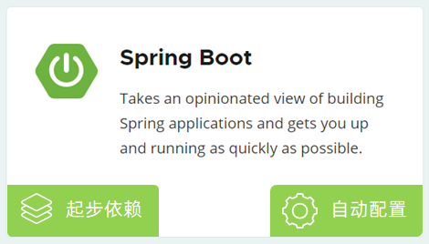
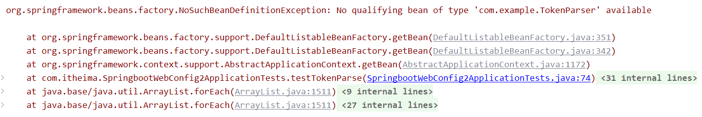
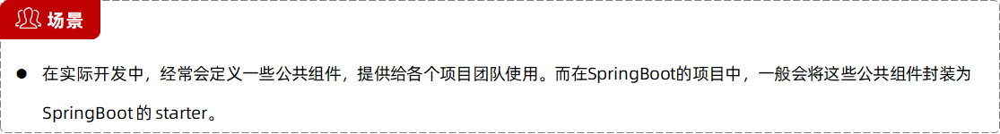
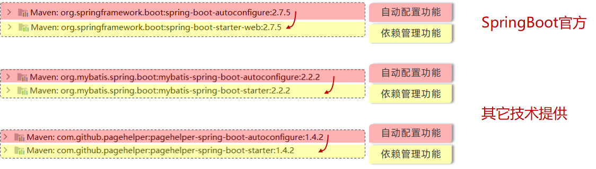
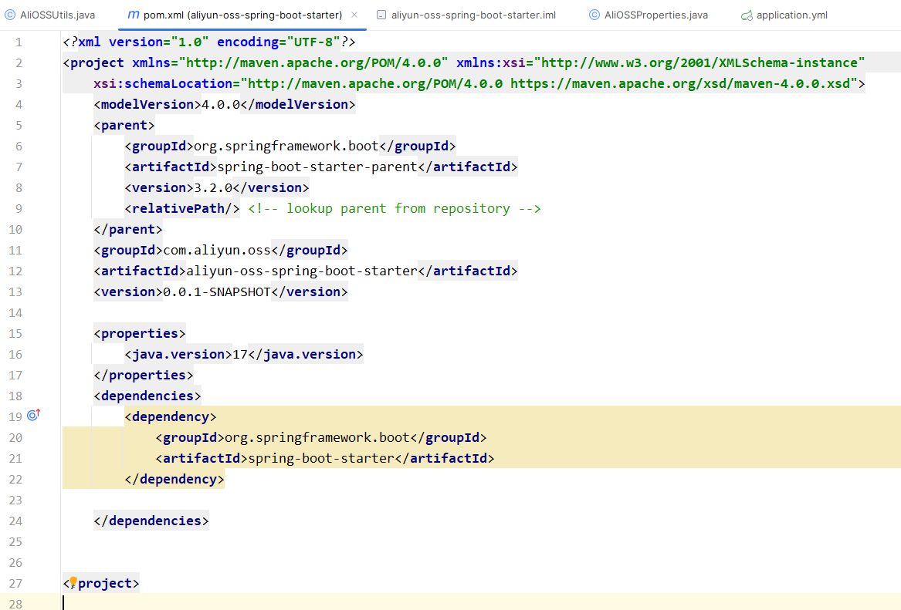

# SpringBoot原理篇

# 1、配置优先级

SpringBoot 中支持三种格式的配置文件：


注意事项：

虽然springboot支持多种格式配置文件，但是在项目开发时，推荐统一使用一种格式的配置 （yml是主流）。

优先级：properties 》 yml  》 yaml


SpringBoot 除了支持配置文件属性配置，还支持 ==Java系统属性== 和 ==命令行参数== 的方式进行属性配置。


优先级：命令行参数 》 Java系统属性


项目打包时，如何指定命令行参数和Java系统属性？

①. 执行maven打包指令package


②. 执行java指令，运行jar包

```java
java -Dserver.port=9000 -jar tlias-web-management-0.0.1-SNAPSHOT.jar --server.port=10010
```

注意事项：

==Springboot项目进行打包时，需要引入插件 spring-boot-maven-plugin (基于官网骨架创建项目，会自动添加该插件)==


总结：


java系统属性要高于三种配置文件


# 2、Bean管理

## 获取Bean

默认情况下，Spring项目启动时，会把bean都创建好放在IOC容器中，如果想要主动获取这些bean，可以通过如下方式：

- 根据name获取bean：


- 根据类型获取bean：


- 根据name获取bean（带类型转换）：


在测试类中，编写如下方法：

```java
@Autowired
private ApplicationContext applicationContext; //IOC容器对象

//获取bean对象
@Test
public void testGetBean(){
    //根据bean的名称获取
    DeptController bean1 = (DeptController) applicationContext.getBean("deptController");
    System.out.println(bean1);

    //根据bean的类型获取
    DeptController bean2 = applicationContext.getBean(DeptController.class);
    System.out.println(bean2);

    //根据bean的名称 及 类型获取
    DeptController bean3 = applicationContext.getBean("deptController", DeptController.class);
    System.out.println(bean3);
}
```

运行测试方法：

可以看到获取的 Bean 是同一个。


默认情况下，Bean对象是单例的。（单例模式）


## bean作用域

- Spring支持五种作用域，后三种在web环境才生效：

| **作用域**    | **说明**                                            |
| ------------- | --------------------------------------------------- |
| ==singleton== | 容器内同  名称 的 bean 只有一个实例（单例）（默认） |
| ==prototype== | 每次使用该  bean 时会创建新的实例（非单例）         |
| request       | 每个请求范围内会创建新的实例（web环境中，了解）     |
| session       | 每个会话范围内会创建新的实例（web环境中，了解）     |
| application   | 每个应用范围内会创建新的实例（web环境中，了解）     |

- 可以通过 @Scope 注解来进行配置作用域：


**bean 默认初始化的时机**：在容器启动的时候初始化，如果希望延迟初始化，可以在类上加上注解 `@Lazy`

**bean 的作用域设置**：`@scope("prototype")`

```java
@Lazy   //延迟初始化，延迟到第一次使用时
@Scope("prototype") //设置作用域为非单例
@RestController
@RequestMapping("/depts")
public class DeptController {
}
```


注意事项：

- 默认singleton的bean，在容器启动时被创建，**可以使用@Lazy注解来延迟初始化**（延迟到第一次使用时）。

- prototype的bean，每一次使用该bean的时候都会创建一个新的实例。

- **实际开发当中，绝大部分的Bean是单例的，也就是说绝大部分Bean不需要配置scope属性。**


## 第三方bean

自己声明bean的注解的方式：


**@Bean 注解**

如果要管理的bean对象来自于第三方（不是自定义的），是无法用 @Component 及衍生注解声明bean的，就需要用到 @Bean注解。

若要管理的第三方bean对象，建议对这些bean进行集中分类配置，可以通过 @Configuration 注解声明一个配置类。

**方式一**：在启动类中定义一个方法，返回值为new一个需要的类对象，在该方法上加上@Bean注解。

这样Spring框架就知道需要创建这个类的实例化对象，并交给IOC容器管理。


**方式二**：单独定义一个配置类，在配置类中对第三方的bean进行集中管理。


使用：

```java
@Autowired
private SAXReader saxReader;

//第三方bean的管理
@Test
public void testThirdBean() throws Exception {
    //SAXReader saxReader = new SAXReader();

    Document document = saxReader.read(this.getClass().getClassLoader().getResource("1.xml"));
    Element rootElement = document.getRootElement();
    String name = rootElement.element("name").getText();
    String age = rootElement.element("age").getText();

    System.out.println(name + " : " + age);
}
```


**注意事项：**

- 通过 `@Bean` 注解的 name 或 value 属性可以声明 bean 的名称，如果不指定，**默认 bean 的名称就是方法名**。

- 如果第三方 bean 需要依赖其它 bean 对象，**直接在 bean 定义方法中设置形参即可**，容器会根据类型自动装配。

```java
@Configuration //配置类
public class CommonConfig {

    //声明第三方bean
    @Bean //将当前方法的返回值对象交给IOC容器管理, 成为IOC容器bean
          //通过@Bean注解的name/value属性指定bean名称, 如果未指定, 默认是方法名
    public SAXReader reader(DeptService deptService){
        //注入bean对象，直接在 bean 定义方法中设置形参即可，容器会根据类型自动装配
        System.out.println(deptService);
        return new SAXReader();
    }

}
```


思考：

1. `@Component` 及衍生注解 与 `@Bean` 注解使用场景？

    - 项目中自定义的，使用@Component及其衍生注解

    - 项目中引入第三方的，使用@Bean注解


# 3、SpringBoot原理

## 3.1 简介


**Spring**

Spring是目前世界上最流行的java框架，它可以帮助我们更加快速更加容易的来构建Java项目。

在Spring家族当中，提供了很多优秀的框架，而所有的框架都是基于一个基础的框架的——Spring Framework。

直接基于Spring Framework框架进行开发，会非常的繁琐，主要体现在两个方面：==依赖、配置==


基于此，Spring官方在4.0版本之后，又推出了一个全新的框架，也就是Spring Boot框架。

通过Spring Boot来简化Spring的开发（简化而不是替代）

**Spring Boot**

Spring Boot 框架之所以使用起来更简单、快捷，是因为Spring boot框架底层提供了两个非常重要的功能：

- 起步依赖
- 自动配置




## 3.2 起步依赖

**起步依赖原理**

Spring框架

使用Spring框架进行Web程序开发，需要引入一系列的依赖，而且依赖的版本必须匹配，否则可能会出现版本冲突问题。


Spring Boot框架

使用SpringBoot框架进行Web程序开发，只需要引入一个依赖即可，即Web开发的起步依赖。


==起步依赖原理：Maven 工程的依赖传递。==


## 3.3 自动配置

**SpringBoot的自动配置就是当spring容器启动后，一些配置类、bean对象就自动存入到了IOC容器中，不需要我们手动去声明，从而简化了开发，省去了繁琐的配置操作。**

例子：

我们可以之间在类中注入 Gson 类对象，但是我们并没有google提供的bean对象，然而我们却可以直接通过 `@Autowired` 从Spring容器当中注入这个对象并使用。

这就是 Spring Boot 项目在启动的时候，帮我们自动配置好了，这就是自动配置的效果。


**研究 Spring Boot 自动配置原理**：其实就是研究在 SpringBoot 项目当中，我们在引入依赖之后，是如何将依赖 Jar 包当中所定义的配置类以及这些 bean 加载到 Spring 的 IOC 容器当中的。


### 自动配置原理（面试高频）

解析SpringBoot自动配置的原理：就是分析在SpringBoot项目当中，引入对应的依赖之后，是如何将jar包当中提供的这些bean以及配置类加载到当前项目的Spring IOC容器当中。


1、在xml文件中导入该模块的坐标

2、测试：



报错：没有找到这样一个bean定义异常。

我们引入的这些第三方了的bean没有生效。

原因：我们在类上加了一个 `@Component` 注解，但这个类并不一定会被扫描到

在启动类上的 `@SpringBootApplication` 注解具备包扫描的作用，但默认的扫描范围是==当前包及其子包==。


方案一：`@ComponentScan` 组件扫描

Value 属性 或 basePackages属性

```java
@ComponentScan({"com.example","com.itheima"})
@SpringBootApplication
public class SpringbootWebConfig2Application {
}
```

==注意：一旦声明了 ComponentScan 注解，默认扫描的包就会被覆盖掉。==

这种方式，使用繁琐，性能低。


方案二：`@Import` 导入。使用 `@Import` 导入的类会被Spring加载到IOC容器中，导入形式主要有以下几种：

- 导入 普通类

- 导入 配置类

- 导入 ImportSelector 接口实现类
- @EnableXxxx注解，封装@Import注解 （方便、优雅）


导入 ImportSelector 接口实现类 需要有一个类实现该接口，方法的返回值为字符串数组，包含了需要导入的类的全限定名。

一般情况，由第三方包实现一个注解，该注解使用了 `@Import` 注解，导入了自己实现的bean。

而在程序中使用时，只需要加上第三方实现的注解名称即可。


### 自动配置原理-源码跟踪


==`@SpringBootApplication`：==

该注解标识在SpringBoot工程引导类上，是SpringBoot中==最最最重要==的注解。**该注解由三个部分组成：**

- **`@SpringBootConfiguration`**：该注解与 @Configuration 注解作用相同，用来声明当前也是一个配置类。

- **`@ComponentScan`**：组件扫描，默认扫描当前引导类所在包及其子包。

- **`@EnableAutoConfiguration`**：SpringBoot实现自动化配置的核心注解。


### 原理分析-@Conditional

**作用：按照一定的条件进行判断，在满足给定条件后才会注册对应的 bean 对象到 Spring IOC 容器中。**

位置：方法、类

`@Conditional` 本身是一个父注解，派生出大量的子注解：

- `@ConditionalOnClass`：判断环境中是否有对应字节码文件，才注册bean到IOC容器。

- `@ConditionalOnMissingBean`：判断环境中没有对应的bean（类型 或 名称） ，才注册bean到IOC容器。

- `@ConditionalOnProperty`：判断配置文件中有对应属性和值，才注册bean到IOC容器。


### 案例（自定义starter）



SpringBoot官方提供的 starter 一般的命名规范：`spring-boot-starter-功能`  功能在后

第三方整合SpringBoot提供的起步依赖命名规范：`功能-spring-boot-starter` 功能在前



**自定义一个起步依赖时，按照规范，需要定义两个模块**：

1、**starter 模块**，没有代码，仅仅做一件事情，就是进行**依赖管理**，将当前程序开发所需要的所有依赖都定义在这个starter起步依赖当中。在starter当中，还引入了一个包，就是 autoconfigure 包，在这个包当中完成自动配置工作。（在starter中将autoconfigure这个自动配置的包引入进来，将来在项目开发工程中，我只需要引入这个起步依赖就可以了，它会自动将autoconfigure传递下来）

2、**autoconfigure 模块**，其中定义自动配置类，在自动配置类中，就声明了一些bean对象。

那么这些配置类，在配置好之后，是如何被SpringBoot项目在启动的时候，加载到从而完成自动配置的呢？

SpringBoot在启动的时候会加载一份配置文件，老版本：`spring.factories`，新版本：`autoconfigure.import` 。我们可以在这两个配置文件中，配置这个自动配置类，配置好之后，最终就会被加载到并通过import这个注解直接加载到IOC容器中。


**自定义starter**

需求：

- 需求：自定义aliyun-oss-spring-boot-starter，完成阿里云OSS操作工具类 AliyunOSSUtils 的自动配置。

- 目标：引入起步依赖引入之后，要想使用阿里云OSS，注入 AliyunOSSUtils直接使用即可。


步骤：

1. 创建 aliyun-oss-spring-boot-starter 模块

2. 创建 aliyun-oss-spring-boot-autoconfigure 模块，在starter中引入该模块

3. 在 aliyun-oss-spring-boot-autoconfigure 模块中的定义自动配置功能，并定义自动配置文件 META-INF/spring/xxxx.imports


1、创建 aliyun-oss-spring-boot-starter 模块

点击 File-》new -》 module


2、将pom文件中不需要的依赖删除



3、生成iml文件，删除其他不要的文件

按两下ctrl键，选择模块，输出 `mvn idea:module`


4、创建autoconfigure模块，精简pom文件


5、同3，生成iml文件，删除不需要的文件，注意保留src文件夹


6、删除启动类、测试类和配置文件


7、在start模块的pom文件中，加载autoconfigure模块


8、在**autocongigure模块**的pom文件中，导入oss的依赖

```xml
<!--阿里云OSS-->
<dependency>
    <groupId>com.aliyun.oss</groupId>
    <artifactId>aliyun-sdk-oss</artifactId>
    <version>3.15.1</version>
</dependency>
<dependency>
    <groupId>javax.xml.bind</groupId>
    <artifactId>jaxb-api</artifactId>
    <version>2.3.1</version>
</dependency>
<dependency>
    <groupId>javax.activation</groupId>
    <artifactId>activation</artifactId>
    <version>1.1.1</version>
</dependency>
<!-- no more than 2.3.3-->
<dependency>
    <groupId>org.glassfish.jaxb</groupId>
    <artifactId>jaxb-runtime</artifactId>
    <version>2.3.3</version>
</dependency>
```

9、拷贝阿里云oss的两个类


AliOSSProperties

```java
package com.aliyun.oss;

import lombok.Data;
import org.springframework.boot.context.properties.ConfigurationProperties;
import org.springframework.stereotype.Component;

@Data
@Component
@ConfigurationProperties(prefix = "aliyun.oss")
public class AliOSSProperties {
    private String endpoint;
    private String accessKeyId;
    private String accessKeySecret;
    private String bucketName;
}
```

AliOSSUtils

```java
package com.aliyun.oss;

import com.aliyuncs.exceptions.ClientException;
import org.springframework.beans.factory.annotation.Autowired;
import org.springframework.stereotype.Component;
import org.springframework.web.multipart.MultipartFile;

import java.io.IOException;
import java.io.InputStream;
import java.util.UUID;

/**
 * 阿里云 OSS 工具类
 */
@Component
public class AliOSSUtils {

    @Autowired
    private AliOSSProperties aliOSSProperties;

    public AliOSSUtils() throws ClientException {
    }

    /**
     * 实现上传图片到OSS
     */
    public String upload(MultipartFile file) throws IOException {
        //获取阿里云OSS参数
        String endpoint = aliOSSProperties.getEndpoint();
        String accessKeyId = aliOSSProperties.getAccessKeyId();
        String accessKeySecret = aliOSSProperties.getAccessKeySecret();
        String bucketName = aliOSSProperties.getBucketName();

        // 获取上传的文件的输入流
        InputStream inputStream = file.getInputStream();

        // 避免文件覆盖
        String originalFilename = file.getOriginalFilename();
        String fileName = UUID.randomUUID().toString() + originalFilename.substring(originalFilename.lastIndexOf("."));

        //上传文件到 OSS
        OSS ossClient = new OSSClientBuilder().build(endpoint, accessKeyId, accessKeySecret);
        ossClient.putObject(bucketName, fileName, inputStream);

        //文件访问路径
        String url = endpoint.split("//")[0] + "//" + bucketName + "." + endpoint.split("//")[1] + "/" + fileName;
        // 关闭ossClient
        ossClient.shutdown();
        return url;// 把上传到oss的路径返回
    }

}
```

解决报错，引入缺少的依赖

```xml
<dependency>
    <groupId>org.springframework.boot</groupId>
    <artifactId>spring-boot-starter-web</artifactId>
    <version>3.2.0</version>
</dependency>
```


10、修改文件，创建一个AliOSSAutoCongiguration类

AliOSSProperties

```java
package com.aliyun.oss;

import org.springframework.boot.context.properties.ConfigurationProperties;
import org.springframework.stereotype.Component;

@ConfigurationProperties(prefix = "aliyun.oss")
public class AliOSSProperties {
    private String endpoint;
    private String accessKeyId;
    private String accessKeySecret;
    private String bucketName;

    public String getEndpoint() {
        return endpoint;
    }

    public String getAccessKeyId() {
        return accessKeyId;
    }

    public String getAccessKeySecret() {
        return accessKeySecret;
    }

    public String getBucketName() {
        return bucketName;
    }

    public void setEndpoint(String endpoint) {
        this.endpoint = endpoint;
    }

    public void setAccessKeyId(String accessKeyId) {
        this.accessKeyId = accessKeyId;
    }

    public void setAccessKeySecret(String accessKeySecret) {
        this.accessKeySecret = accessKeySecret;
    }

    public void setBucketName(String bucketName) {
        this.bucketName = bucketName;
    }
}
```

AliOSSUtils

```java
package com.aliyun.oss;

import com.aliyuncs.exceptions.ClientException;
import org.springframework.beans.factory.annotation.Autowired;
import org.springframework.web.multipart.MultipartFile;

import java.io.IOException;
import java.io.InputStream;
import java.util.UUID;

/**
 * 阿里云 OSS 工具类
 */

public class AliOSSUtils {

    private AliOSSProperties aliOSSProperties;

    public AliOSSProperties getAliOSSProperties() {
        return aliOSSProperties;
    }

    public void setAliOSSProperties(AliOSSProperties aliOSSProperties) {
        this.aliOSSProperties = aliOSSProperties;
    }

    /**
     * 实现上传图片到OSS
     */
    public String upload(MultipartFile file) throws IOException {
        //获取阿里云OSS参数
        String endpoint = aliOSSProperties.getEndpoint();
        String accessKeyId = aliOSSProperties.getAccessKeyId();
        String accessKeySecret = aliOSSProperties.getAccessKeySecret();
        String bucketName = aliOSSProperties.getBucketName();

        // 获取上传的文件的输入流
        InputStream inputStream = file.getInputStream();

        // 避免文件覆盖
        String originalFilename = file.getOriginalFilename();
        String fileName = UUID.randomUUID().toString() + originalFilename.substring(originalFilename.lastIndexOf("."));

        //上传文件到 OSS
        OSS ossClient = new OSSClientBuilder().build(endpoint, accessKeyId, accessKeySecret);
        ossClient.putObject(bucketName, fileName, inputStream);

        //文件访问路径
        String url = endpoint.split("//")[0] + "//" + bucketName + "." + endpoint.split("//")[1] + "/" + fileName;
        // 关闭ossClient
        ossClient.shutdown();
        return url;// 把上传到oss的路径返回
    }

}
```

AliOSSAutoConfiguration

```java
package com.aliyun.oss;

import com.aliyuncs.exceptions.ClientException;
import org.springframework.boot.context.properties.EnableConfigurationProperties;
import org.springframework.context.annotation.Bean;
import org.springframework.context.annotation.Configuration;

@Configuration
@EnableConfigurationProperties(AliOSSProperties.class)
public class AliOSSAutoConfiguration {

    @Bean
    public AliOSSUtils aliOSSUtils(AliOSSProperties aliOSSProperties) {

        AliOSSUtils aliOSSUtils = new AliOSSUtils();
        aliOSSUtils.setAliOSSProperties(aliOSSProperties);
        return aliOSSUtils;
    }
}
```

11、创建文件，并添加配置类的全类名


```
com.aliyun.oss.AliOSSAutoConfiguration
```


测试：

在测试模块的pom文件中引入依赖：

```xml
<dependency>
    <groupId>com.aliyun.oss</groupId>
    <artifactId>aliyun-oss-spring-boot-starter</artifactId>
    <version>0.0.1-SNAPSHOT</version>
</dependency>
```

测试

```java
@RestController
public class UploadController {

    @Autowired
    private AliOSSUtils aliOSSUtils;

    @PostMapping("/upload")
    public String upload(MultipartFile image) throws Exception {
        //上传文件到阿里云 OSS
        String url = aliOSSUtils.upload(image);

        return url;
    }

}
```


# 4、Web后端开发总结

三层架构：


Controller：控制器层，负责接收请求，响应数据

Service：业务层，负责具体的业务逻辑处理

Dao：数据访问层（持久层），处理数据访问操作，完成数据库中数据的增删改查


在执行具体的业务处理之前，需要进行一些通用的业务处理，比如 登录校验，统一的字符编码等时，可以借助于 JavaWeb 当中三大组件之一的过滤器，或者是Spring当中的拦截器。

分层解耦：为了实现三层架构中，层与层之间的解耦。Spring架构中的第一大核心：控制反转IOC 和 依赖注入 DI。

控制反转：将对象创建的控制权由应用程序自身交给外部容器，这个容器就是我们常说的IOC容器或Spring容器。


各个技术归属说明：


Spring 框架当中的Web开发模块我们也成为 SpringMVC框架

SpringMVC 并不是一个单独的框架，其实就是Spring框架的一部分，是Spring框架当中提供的Web开发模块，是用来简化原始的Servlet程序的开发的。


