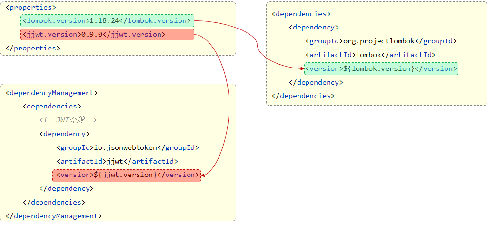

# Maven高级

# 1、分模块设计与开发

为什么要分模块设计？


将项目按照功能拆分成若干个子模块，方便项目的管理维护、扩展，也方便模块间的相互调用，资源共享。


**实践**


分模块开发

步骤：

- 创建maven模块 tlias-pojo，存放实体类。

- 创建maven模块 tlias-utils，存放相关工具类。

注意事项：

- 分模块开发需要先针对模块功能进行设计，再进行编码。不会先将工程开发完毕，然后进行拆分。


## 报错：java: 程序包xxx不存在

报错解决：java: 程序包com.lyb.pojo不存在

生成iml文件，按两下ctrl

选择模块，输入：

```
mvn idea:module
```


# 2、继承与聚合

## 继承

每一个maven工程都用到了 lombok 这个模块，都需要添加相关的依赖，这是很繁琐的。


将子工程共有的依赖可以定义在父工程中。只要子工程继承了父工程，这个依赖就会继承下来。

- 概念：继承描述的是两个工程间的关系，与java中的继承相似，子工程可以继承父工程中的配置信息，常见于依赖关系的继承。

- 作用：简化依赖配置、统一管理依赖

- 实现：`<parent> … </parent>`


所有的 springboot 工程都有一个统一的父工程。


**继承关系实现**

步骤：

①. 创建 maven 模块 tlias-parent ，该工程为父工程，==设置打包方式 pom (默认jar) 。==

②. 在**子工程**的 pom.xml 文件中，配置继承关系。

③. 在**父工程**中配置各个工程共有的依赖（**子工程会自动继承父工程的依赖**）。

> jar：普通模块打包，springboot项目基本都是jar包（内嵌tomcat运行）
>
> war：普通web程序打包，需要部署在外部的tomcat服务器中运行
>
> pom：父工程或聚合工程，该模块不写代码，仅进行依赖管理

==maven 不支持多继承，但支持多重继承==


注意事项：

- 在子工程中，配置了继承关系之后，坐标中的 groupId 是可以省略的，因为会自动继承父工程的 。

- relativePath 指定父工程的 pom 文件的相对位置（如果不指定，将从本地仓库/远程仓库查找该工程）。
- **若父子工程都配置了同一个依赖的不同版本，以子工程的为准。**


## 版本锁定

在各个子工程中，可能配置了不同版本的依赖，当版本变动时，需要检查所有工程的版本，很不方便。


在maven中，可以在父工程的pom文件中通过 `<dependencyManagement>` 来统一管理依赖版本。

注意：使用 `<dependencyManagement>` 这个标签，==仅仅代表我们要统一管理这个依赖的版本==，并不会直接把jwt这项依赖加入进来。如果在子工程中需要用到这个依赖，还需要在子工程中通过 `dependency` 标签将依赖引入进来，只不过，**此时子工程不需要指定版本了**。


注意事项：子工程引入依赖时，无需指定 `<version>` 版本号，父工程统一管理。变更依赖版本，只需在父工程中统一变更。


**自定义属性/引用属性**

`<properties>`




面试题：

1. `<dependencyManagement>` 与 `<dependencies>` 的区别是什么?

`<dependencies>` 是直接依赖，在父工程配置了依赖，子工程会直接继承下来。 

`<dependencyManagement>` 是统一管理依赖版本，不会直接依赖，还需要在子工程中引入所需依赖(无需指定版本)


## 聚合


将一个项目拆分为多个模块，项目的多个模块之间存在依赖关系，当项目很大时，项目模块之间的关系可能会错综复杂。

此时，如何项目开发完毕，需要打包上线了，可以执行maven中的 package 生命周期。


可以看到有两个警告，没有找到这两个jar包。

这是因为我们在执行 package、install 这些生命周期的时候，会到本地仓库中去找这两个模块。然而本地仓库中没有这两个模块。

**我们需要在本地仓库中按照这两个jar包，执行maven中的 install 生命周期。**

再次执行package打包操作，再次报错，需要将parent模块也执行install。

由此可见，这样的操作非常繁琐，需要将模块的父工程和依赖的其他模块按照顺序按照到maven的本地仓库，然后才可以对这个模块进行打包。


Maven中的聚合就是用来解决这个问题的。轻松实现一键项目构建。

- 聚合

       将多个模块组织成一个整体，同时进行项目的构建。

- 聚合工程

       一个不具有业务功能的“空”工程（有且仅有一个pom文件，**就是此处的父工程**）

- 作用

       快速构建项目（无需根据依赖关系手动构建，==直接在聚合工程上构建即可==）

实现：

- maven中可以通过 `<modules>` 设置当前聚合工程所包含的子模块名称


**注意事项：** 聚合工程中所包含的模块，在构建时，==会自动根据模块间的依赖关系设置构建顺序，与聚合工程中模块的配置书写位置无关==。


此时，只需要在parent工程中，执行响应的maven指令即可。

执行clear生命周期：


## 总结

- 作用
    - **聚合用于快速构建项目**
    - **继承用于简化依赖配置、统一管理依赖**

- 相同点：
    - ==聚合与继承的 pom.xml 文件打包方式均为 pom==，可以将两种关系制作到同一个pom文件中
    - 聚合与继承均属于**设计型模块**，并无实际的模块内容

- 不同点：
    - **聚合**是在聚合工程中配置关系，聚合可以感知到参与聚合的模块有哪些
    - **继承**是在子模块中配置关系，父模块无法感知哪些子模块继承了自己


# 3、私服

## 介绍


中央仓库只有一个，并不是所有人都可以向中央仓库中上传jar包。


可以搭建一个私服，完成资源的共享，同时让私服连接中央仓库，私服中没有的jar包再去中央仓库找。


**私服是一种特殊的远程仓库，它是架设在局域网内的仓库服务，用来代理位于外部的中央仓库，用于解决团队内部的资源共享与资源同步问题。**

注意事项：私服在企业项目开发中，一个项目/公司，只需要一台即可（无需我们自己搭建，会使用即可）。


## 资源上传与下载

上传资源：

1. 执行 `install` 指令将 jar 包安装到本地仓库
2. 然后执行 `deploy` 指令将本地仓库中的 jar 包上传到私服中

需要指定访问私服的用户名/密码，以及上传资源的位置（url地址）


下载：

需要配置私服的地址（url地址）


项目版本：

- RELEASE（发行版本）：功能趋于稳定、当前更新停止，可以用于发行的版本，存储在私服中的RELEASE仓库中。

- SNAPSHOT（快照版本）：功能不稳定、尚处于开发中的版本，即快照版本，存储在私服的SNAPSHOT仓库中。

当我们创建maven模块时，默认就是快照版本：


配置：settings.xml在安装maven的目录的conf文件夹中

1. 设置私服的访问用户名/密码（settings.xml中的servers中配置）


2. IDEA的maven工程的pom文件中配置上传（发布）地址


3. 设置私服依赖下载的仓库组地址（settings.xml中的mirrors、profiles中配置）


搭建本地私服：


# 4、总结


