# Git

参考视频教程：

【尚硅谷新版Git快速入门(3h迅速掌握git)】 https://www.bilibili.com/video/BV1wm4y1z7Dg/?share_source=copy_web&vd_source=acf4f201b81ed35f992c013b7f4b91b1


## 1、软件配置管理SCM

软件配置管理 —— Software Configuration Management

软件配置管理(SCM)是指通过执行版本控制、变更控制的规程，以及使用合适的配置管理软件,来保证所有配置项的完整性和可跟踪性。配置管理是对工作成果的一种有效保护。


为什么要学GIT？

一些常用的SCM软件：

- **Visual SourceSafa：VSS**，美国微软公司出品的版本控制系统——==**集中式版本控制系统**==

    不适合复杂的多人协作的开发环境，服务器上的同一份开发文件大家不能同时修改，在同一个时间点只能由一个人锁定服务器的文件进行开发，开发完成以后还要释放服务器及文件的锁定状态。这样的操作方式对于程序的开发效率较低。

> 集中式版本控制系统的简单理解：用一个服务器保存项目的所有文档资源，这个服务器称为中央服务器，每一个开发人员通过相关的客户端开发软件与服务器进行交互。

- **Concurrent Version System：CVS**，老牌的版本控制系统，它是基于客服端 / 服务器的行为使得其可容纳多用户，构成网络也很方便。——**集中式版本控制系统**

    支持多人协作、同时开发，开发效率不错。

- **Subversion：SVN**，CVS的升级版本，**开放源代码**的版本控制系统，通过采用**分支管理系统**的高效管理，简而言之就是用于多个人共同开发同一个项目，实现共享资源，实现最终**集中式管理**。

上述软件的问题：需要中央服务器来作为整个项目的资源库，对资源进行管理和存储，一旦服务器发生故障和损坏，那么整个项目的资源将会丢失或损坏，给项目造成不可丢失的损失。项目的开发和工程进度就会受到极大的影响。

==**基于互联网的分布式版本控制系统Git很好的解决了这些问题。**==

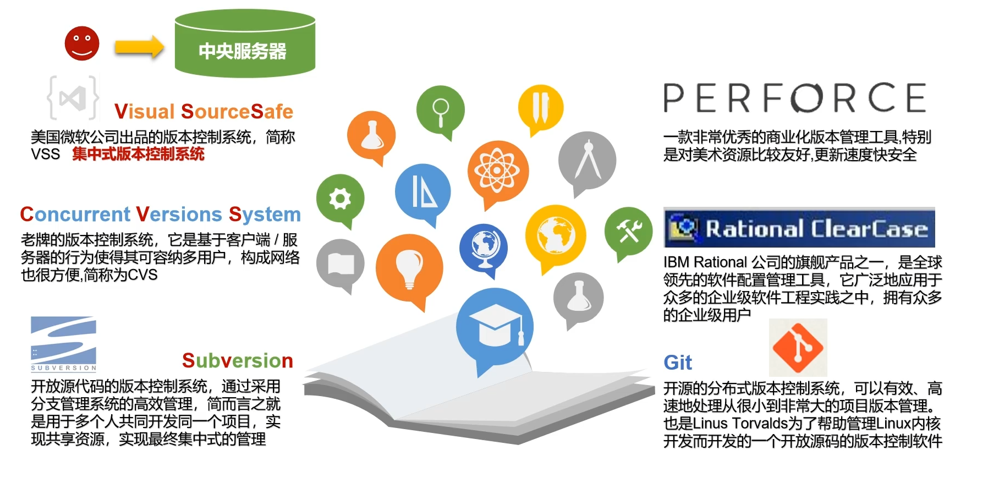


## 2、版本控制VCS

版本控制系统（Version Control system）

**版本控制分类**：

- 集中式版本控制
- 分布式版本控制
- 多人协作开发


**版本控制软件的基础功能**：

1. **保存和管理文件**

    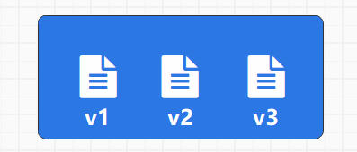

2. **提供客户端工具进行访问**

    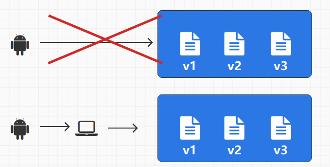

3. **提供不同版本文件的比对功能**

    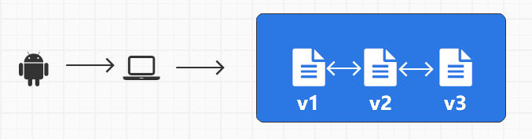

### 2.1 集中式版本控制软件

不可避免的问题：中央服务器损坏或者宕机，将无法再对其进行操作。因此需要分布式版本控制加以解决。

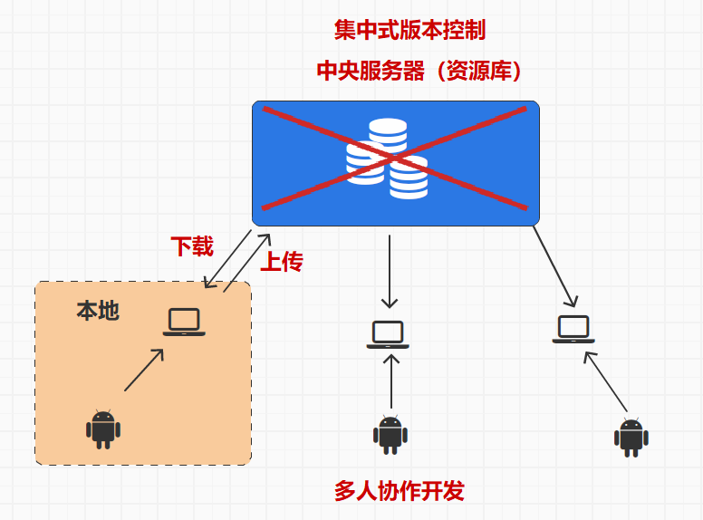

集中式版本控制软件会出现**文件冲突问题**，如下图所示，张三、李四、王五三个人同时对一份文件进行操作，都将text.txt文件下载到本地，操作完成都在上传到中央服务器，但是张三和李四的提交被最后提交的王五覆盖了，这种问题是非常严重的。

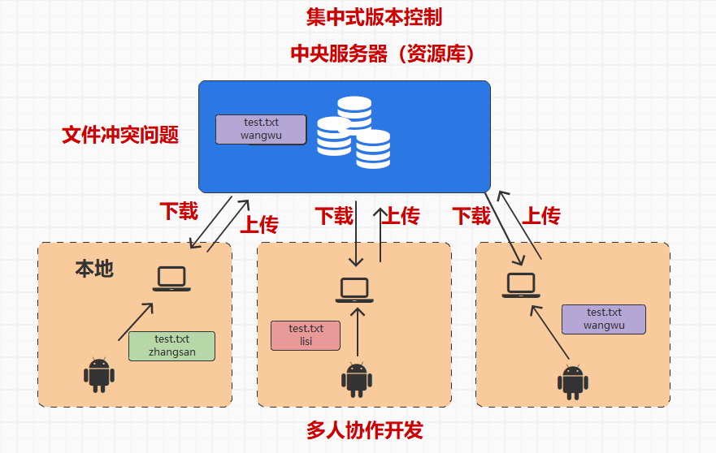

==**VSS的解决方案**==：给每个文件加上一把锁。如下图所示，张三对test.txt文件进行了锁定，张三和李四都可以对文件进行下载，但是李四不能修改该文件，因为张三对其锁定了；张三上传后，中央服务器会放开该文件的锁定状态，李四要修改这份文件，会重新下载张三修改后的文件，在这个文件之上进行修改。

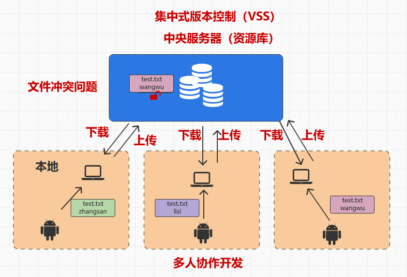

==**CVS、SVN的解决方案**==：本质上不能直接解决所谓的文件冲突问题。在修改文件前，先进行约束，将每一行进行区分，例如，张三做文件的第一行，李四做文件的第二行，王五做文件的第三行。这样约束之后，提交文件时只要比对文件内容，做一个合并操作即可。


### 2.2 分布式版本控制软件

在本地创建了一个仓库，该仓库与中央服务器内容一致。当中央服务器出现问题时，可以通过本地的仓库进行操作；中央服务器恢复时，再对其进行同步操作即可。

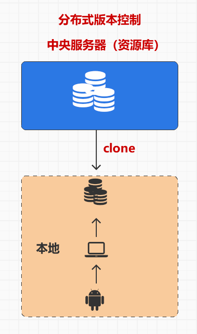


## 3、安装Git和GUI客户端

1. 下载

下载网址：[Git (git-scm.com)](https://git-scm.com/) ，点击Downloads

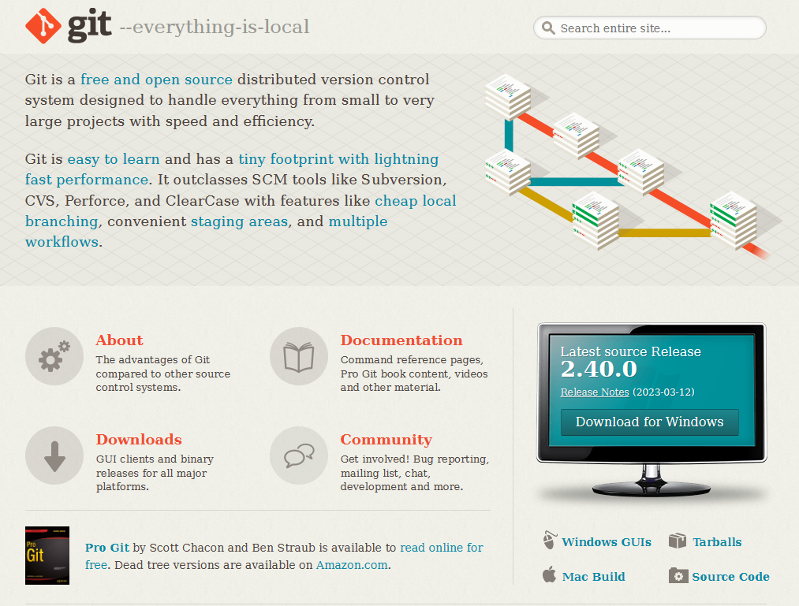

下载图形客户端，点击View GUI Clients，下载GitHub Desktop

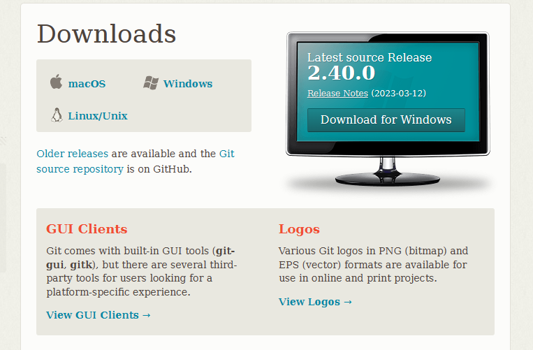

2. 安装

全部默认即可（一路回车）

3. 检查安装成功

右键菜单中有Git的按键


## 4、GitHubDesktop的使用

第一行：从互联网克隆一个仓库

第二行：在本地创建一个仓库

第三行：添加一个已经存在的仓库

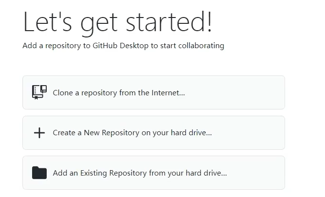

**在options中配置用户名和邮箱**

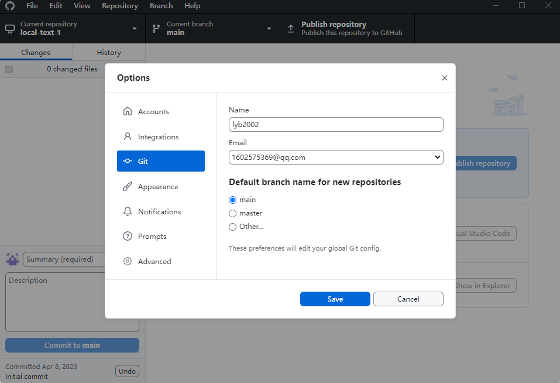

### 4.1 仓库操作

**创建仓库**：   仓库名、描述、仓库路径、勾选为为仓库创建一个README文件。

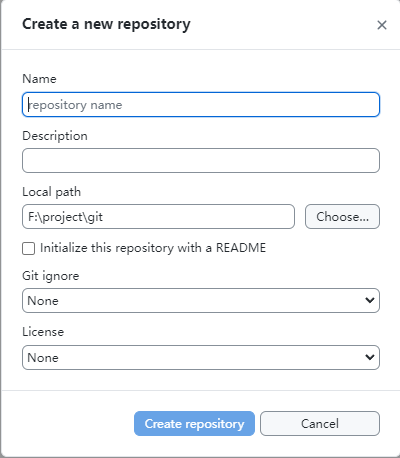

**各个部分的功能**：show in Explorer可以在本地资源管理器中查看仓库

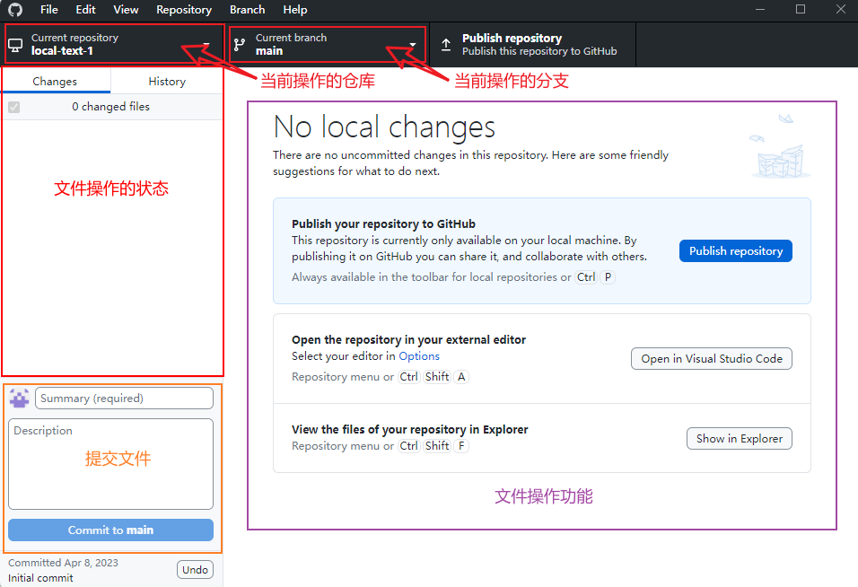


### 4.2 文件操作

在仓库路径下添加文件a.txt，并写入内容。

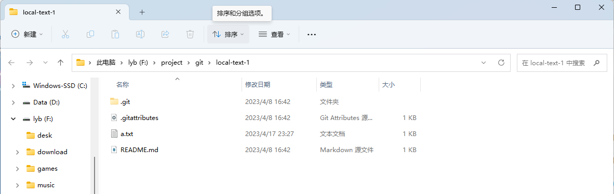

只要在仓库路径下进行文件操作，我们的软件都会自动识别修改。

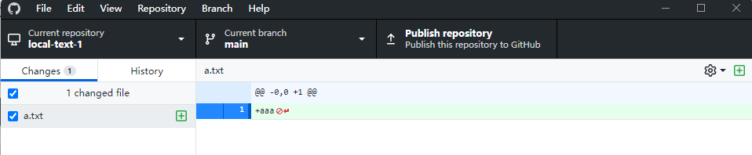

这是因为，客户端为我们提供了比对功能。仓库中的文件存储在 `.git` 路径下，我们操作的文件在仓库路径，客户端为我们比对这两个路径下的文件是否一致。

点击Commit提交操作：

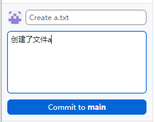


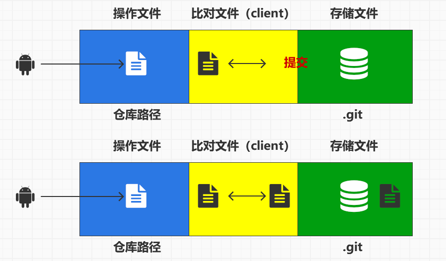

我们对文件a进行修改在提交，并不是覆盖仓库中的原文件，而是创建了一个新的文件。==**旧的文件依然存在，每个文件的版本号是不一样的，通过不同的版本号进行区分。**==

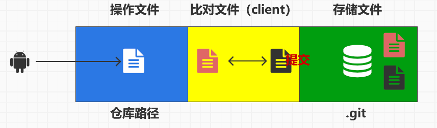

==**Git用40个16进制的数字组成版本号，在历史记录中可以查看每次提交产生的版本号。**==在 `.git\objects\` 路径下可以找到这个版本号的文件，里面记录了这次提交的相关信息。

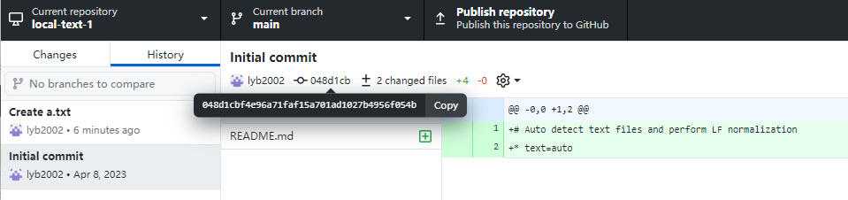

**文件的增加、修改、删除都要进行提交操作。**


### 4.3 分支

#### 4.3.1 分支原理

有三个开发人员，分别负责开发软件的不同功能，为了避免开发过程中文件的损坏和丢失，将每一次的操作都提交到我们的版本库中。

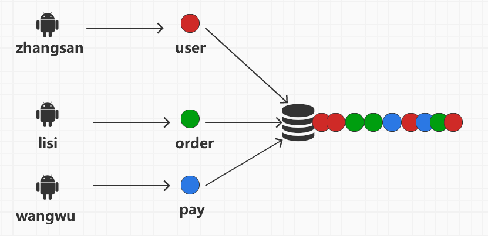

问题：

1、三个开发人员的提交过程会很乱，我们的历史记录当中我们的提交是没有什么规律可言的，很难定位到每一次提交都提交了哪些内容。

2、不同的开发人员在开发过程可能会用到同一份开发文件，可能会出现频繁的冲突问题和未知的风险。

3、频繁的修改会产生大量的版本信息，导致仓库的容量越来越大，定位和比对文件的效率会变得越来越低。

解决方法：

==**分支**：当前版本库的一个副本。==我们的开发人员就可以在这个副本上进行文件操作，在处理完成的最后，在将副本合在一起。

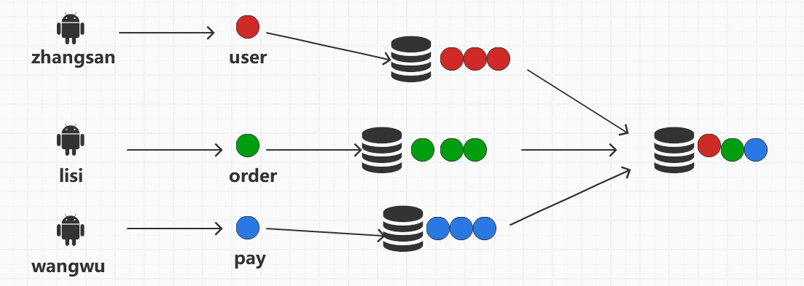


#### 4.3.2 分支操作

**创建分支**： 点击new branch，输入分支名。

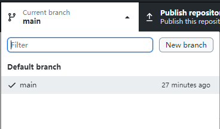

创建了两个分支，user和order，分别进行操作。

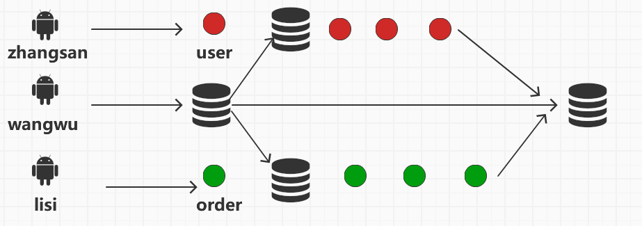

**合并分支**：先切换到main分支，在点击底部的merge合并分支，将user和order分支合并到主分支


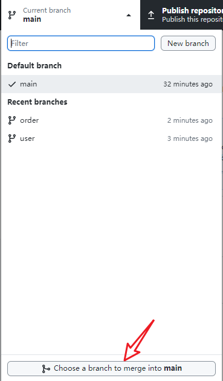

**处理合并冲突**：不同的分支操作了同一个文件，就会产生冲突，需要人工处理。


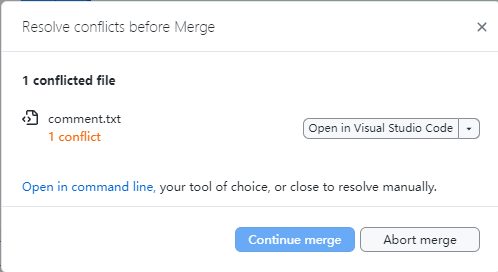

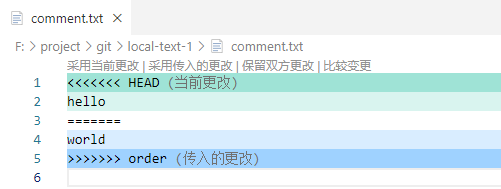


### 4.4 标签

为我们的历史提交信息添加标签，可以增加描述信息，让我们的提交操作更加清晰。

对历史信息右键，点击Create Tag

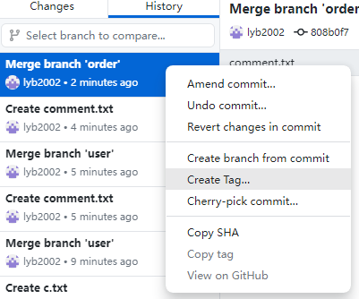

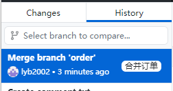


### 4.5 远程仓库

#### 4.5.1 GitHub

GItHub是第三方的代码托管平台

1. 在GitHub上创建仓库

    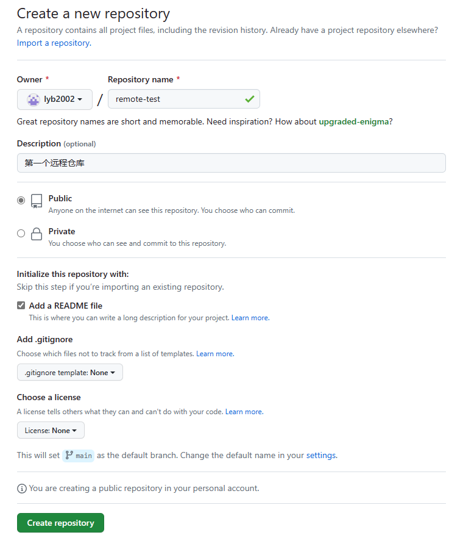

2. 查看在GitHub上创建的仓库信息

    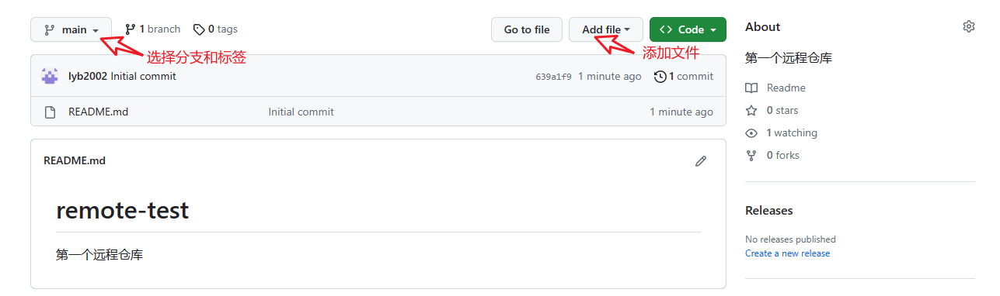

3. 创建并修改text.txt

    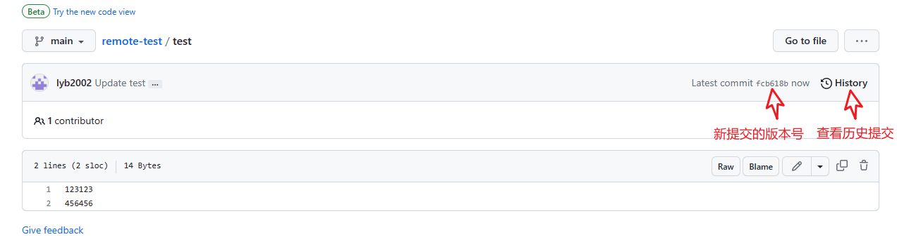

4. 在GitHub Desktop上关联远程仓库账号

    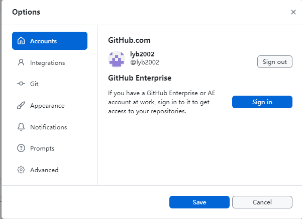

5. 从GitHub上克隆仓库到本地

    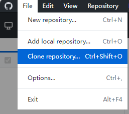                       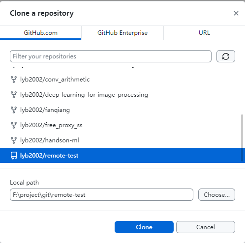   

6. Git的用户名和邮箱要与远程仓库保持一致，不然后报错

    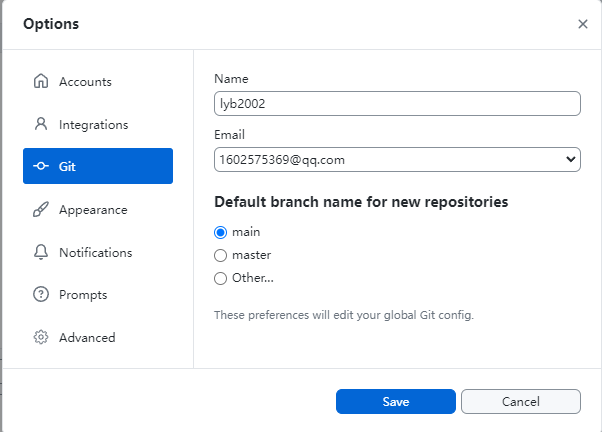

7. 将本地仓库推送到GitHub上

    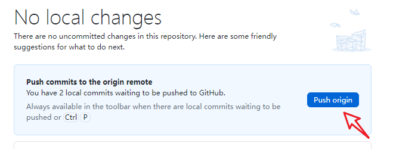


#### 4.5.2 gitee

1. 从gitee上克隆仓库到本地，需要复制仓库的URL，通过URL克隆

    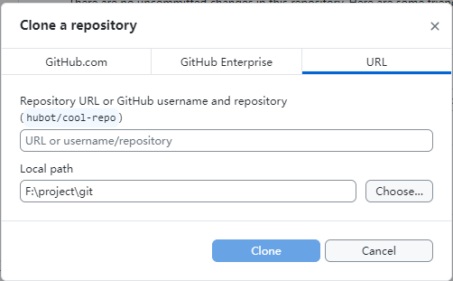

2. 将本地仓库推送到gitee，和GitHub一样，点击Push origin

    


### 4.6 README和IGNORE

- README

    对我们仓库的描述信息，别人可以通过README快速的了解

- IGNORE

    忽略，排除指定的文件类型或指定文件

    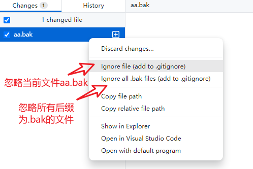

### 4.7 文件图标和比对功能

- 文件图标

    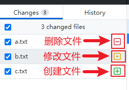

- 比对功能

    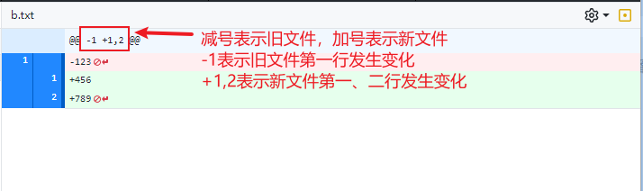


## 5、代码编辑器集成Git

### 5.1 Pycharm集成GitHub

==**初始化仓库： **== 首先添加好账户，再选择初始提交的文件即可。

1、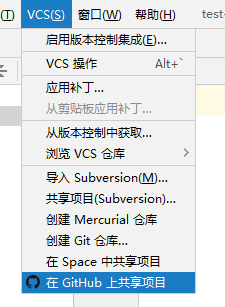2、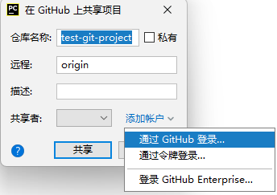3、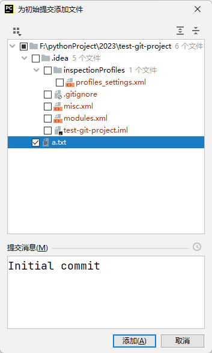


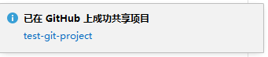

==**将修改push推送到远程仓库：**==

- 修改后文件的颜色会发生变化：

    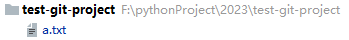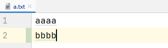

- 点击commit file将文件提交到本地仓库

    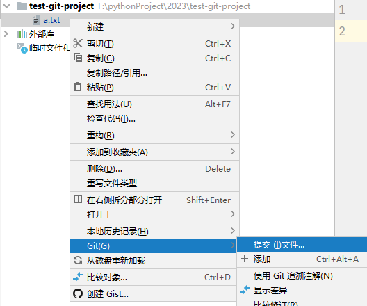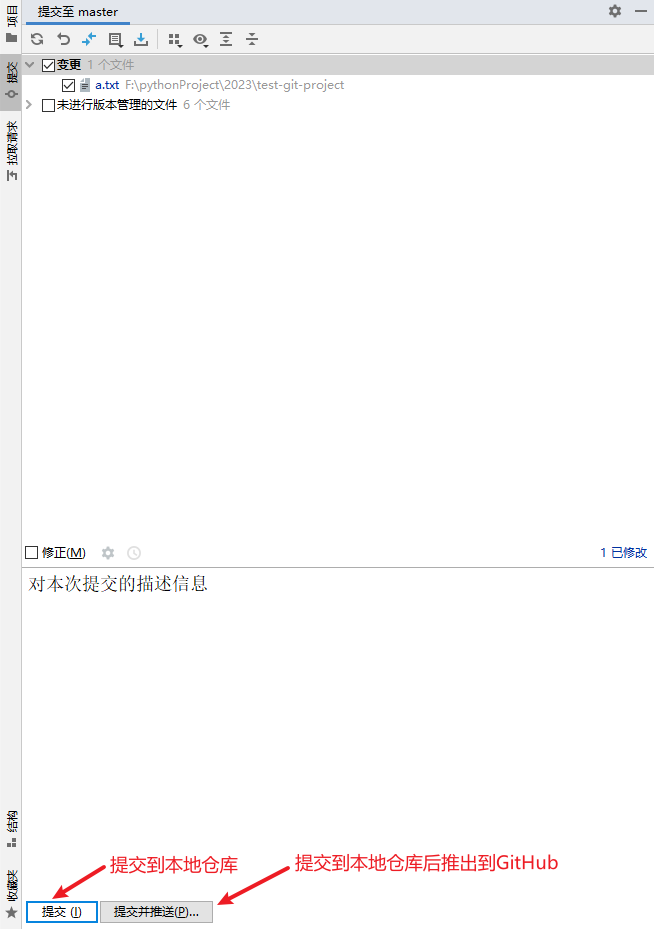

**==远程仓库发生了修改，将远程仓库的文件同步到本地：==**

- 选择Pull拉取远程仓库的信息

    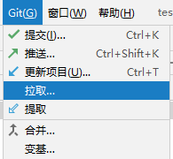

**==克隆远程仓库到本地==**：

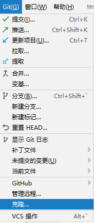         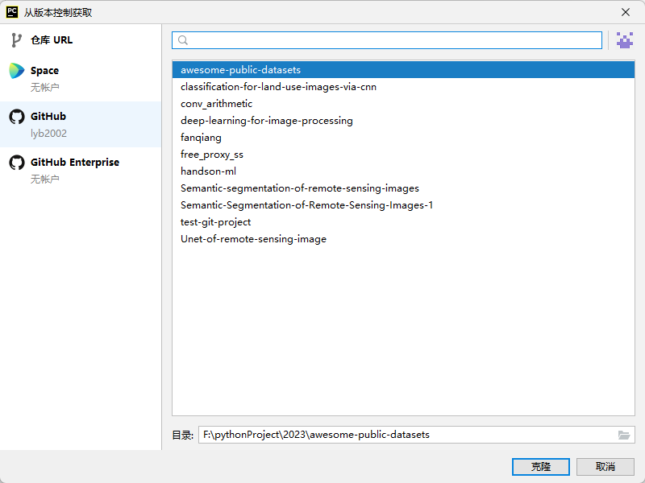


## 6、Git

### 6.1 版本号介绍

- 每一次提交会产生一个**40位**的16进制的版本号

- Git 通过当前的内容采用一种特殊的加密函数算法 **SHA-1** 算出版本号

- 通过版本号可以定位仓库中的文件：2 + 38 （前2位当做文件夹名，后38位当做文件名）

    `.git/objects/`

### 6.2 版本号文件操作

- 通过客户端工具查看不了定位到的文件中的内容

- 通过Git查看：

    ```bash
    git cat-file -p 版本号
    ```

提交信息的版本号里面指向了文件状态信息的版本号，文件状态的版本号里指向了文件内容的版本号

提交信息还指向了上一次提交的版本号，文件状态指向了前面提交的其他文件内容。

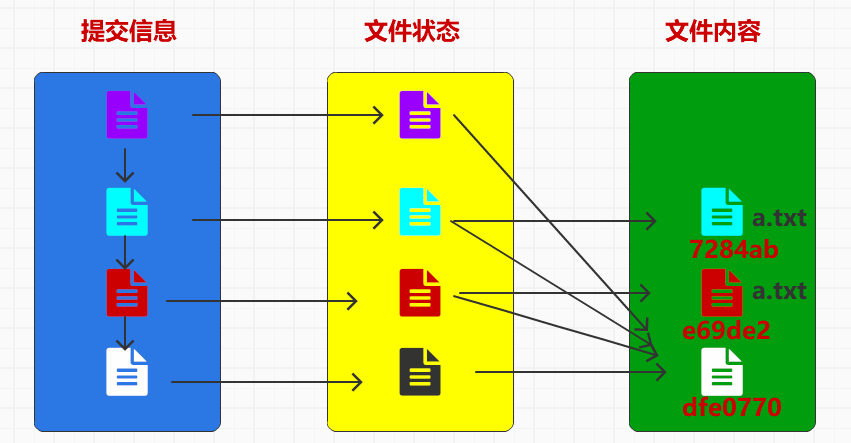

### 6.3 版本号分支操作

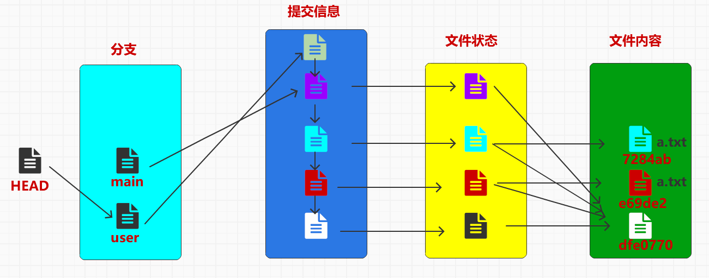


### 6.4 Git介绍

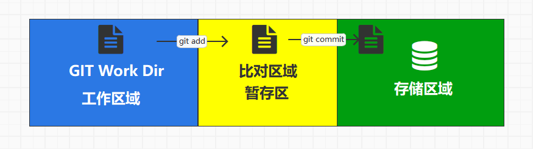

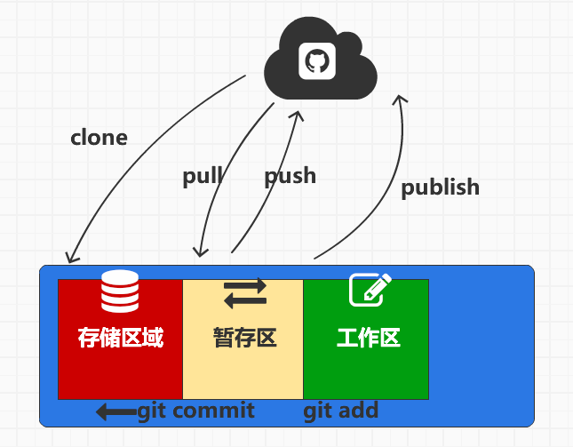

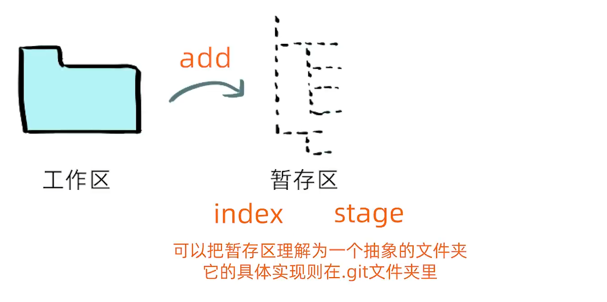

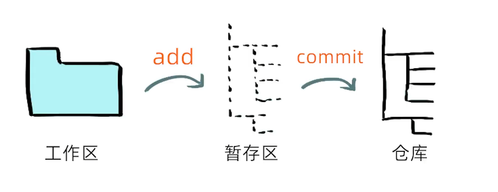

### 6.5 Git命令—仓库操作

#### 查看git版本

```bash
git -v
```

#### 初始化仓库

```bash
git init
```

使用 git 命令创建的是一个空的仓库，没有任何提交信息，客户端创建的仓库会默认进行一次初始化提交。

#### 从远程仓库克隆仓库

```bash
git clone <URL(HTTPS)> <可以自定义仓库名>
```

#### 配置仓库

```bash
git config <配置名> <配置的值>
```

配置用户名和邮箱：

```bash
git config user.name lyb2002
git config user.email 1602575369@qq.com
```

可以直接修改 `.git/config` 文件：

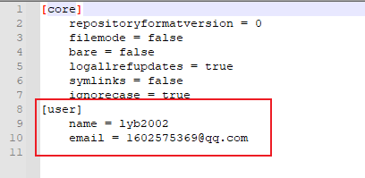

==**全局配置：**==

增加 --global 参数，对整个git软件用全局的配置

```bash
git config --global user.name lyb2002
git config --global user.email 1602575369@qq.com
```

全局配置的位置： `用户/用户名/.gitconfig`


### 6.6 Git命令—文件操作

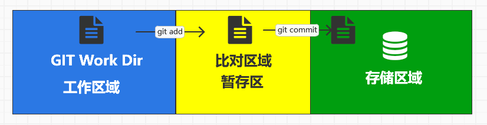

#### 查看暂存区状态

```bash
git status
```

能够识别到工作区中为追踪的文件

#### 将工作区文件加入暂存区

```bash
git add <文件名>
```

等同于将文件放入暂存区，作比对操作

**这个移动并不是真正的移动，这只是逻辑上的一个概念**

使用通配符，添加所有的txt文件：

```bash
git add *.txt
```

#### 将文件从暂存区删除

```bash
git rm --cached <文件名>
```

#### 将暂存区文件存储到仓库中

```bash
git commit -m <对本次提交的描述信息>
```

-m 表示消息

#### 查看历史提交

```bash
git log
```

简洁的方式：

```bash
git log --oneline
```

#### 误删除

恢复误删除的文件

```bash
git restore <文件>
```

问题：将误删除的操作提交了

**方法1：**将当前的版本库重置到某一次提交

```bash
git reset --hard <版本号>
```

这个方法会有问题，就是把我们的提交过程丢失了 `git log`

**方法2：**将版本恢复到每一次提交之前

```bash
git revert <版本号>
```

注意：恢复到某一次提交**之前**，因此版本号要填写我们要恢复到的版本的下一个。


### 6.7 Git命令—分支操作

#### 创建分支

```bash
git branch <分支名>
```

**注意：git中的分支是基于提交操作的，因此在创建分支之前，必须要有一次提交操作。**

#### 查看分支

```bash
git branch -v
```

#### 切换分支

```bash
git checkout <分支名>
```

#### 创建并切换分支

合并创建和切换分支操作

```bash
git branch -b <分支名>
```

#### 删除分支

```bash
git branch -d <分支名>
```

#### 合并分支和冲突处理

先切换到master分支

```bash
git merge <需要合并的分支名>
```

当两个分支有两个相同的文件名内容不同时，会引发冲突，需要手动解决。

打开产生冲突的文件，人工选择需要保存的内容，然后像普通文件那样，进行add和commit操作，就可以解决文件冲突。


### 6.8 Git命令—标签操作

查看某一次提交的信息：

```bash
git log <版本号>
```

这个命令会把这一次提交之前的历史打印出来

问题：版本号太长，不方便；版本看不出这次提交在干什么。

解决：可以给这个提交增加一个标记，这个标记就称之为标签。

简单理解：对这个提交起一个别名，以后就可以通过这个别名进行访问。

#### 查看标签

```bash
git tag
```

#### 增加标签

```bash
git tag <别名/标签> <版本号>
```

#### 删除标签

```bash
git tag -d <标签>
```

#### 标签的使用

```bash
git log <标签>
```

通过标签创建分支：

```bash
git branch <分支名> <标签名>
```


### 6.9 Git命令—远程仓库

#### 绑定远程仓库

```bash
git remote add origin <URL网址>
```

直接修改 `.git/config` 文件：

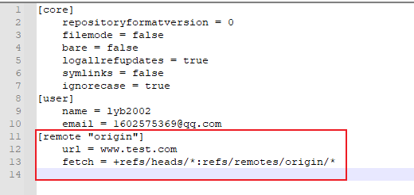

#### 删除绑定

```bash
git remote remove
```

#### 重命名origin

```bash
git remote rename
```

#### 推送到远程仓库

```bash
git push origin
```

#### 同步远程仓库的内容

```bash
git pull origin
```

#### SSH方式需要安全认证

使用SSH推送方式需要安全认证（gitee示例）

1. 生成安全证书：

    ```bash
    ssh-keygen -t rsa -C<ssh地址>
    ```

    然后一路回车

    会产生一个安全认证文件，保存在路径： `用户/用户名/.ssh/id_rsa.pub`

2. 将 `id_rsa.pub` 中的内容拷贝

    在gitee的设置中找到ssh公钥，将复制的公钥粘贴到指定位置，点击确定


### git终端显示中文

```bash
git config --global core.quotepath false
```


## 7、GitLab搭建

搭建自己的代码托管平台，中文名称之为 极狐

### 7.1 GitLab介绍

- GitLab是由GitLabInc开发，使用MIT许可证的基于网络的Git仓库管理工具，且具有wiki和issue跟踪功能。
- 使用Git作为代码管理工具，并在此基础上搭建起来的Web服务。

- GitLib由乌克兰程序员DmitriyZaporozhets和ValerySizov开发，它使用Ruby语言写成。后来，一些部分用Go语言重写。
- GitLab被IBM，Sony，JulichResearchCenter，NASA，Alibab，Invincea，O'ReillyMedia，Leibniz-Rechenzentrum(LRZ)，CERN，SpaceX等组织使用。

### 7.2 GitLab软件下载

官网地址：https://about.gitlab.com/

1、点击安装

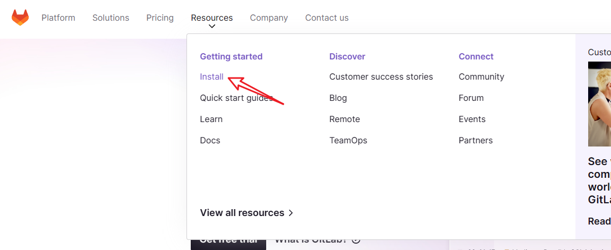

2、选择要安装的版本

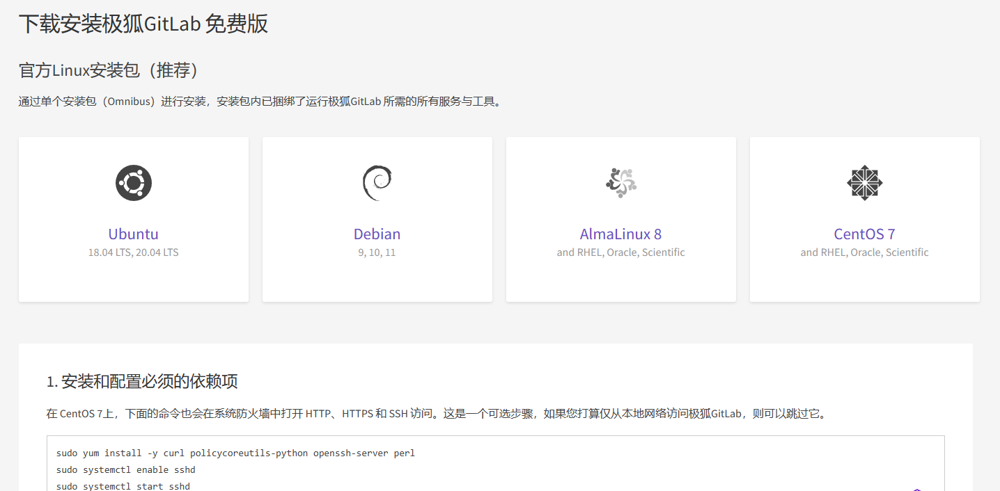

软件安装包的下载地址：https://packages.gitlab.com/gitlab/gitlab-ce

如果下载不了，或下载比较慢，可以根据提示在在linux系统中直接采用wget指令下载

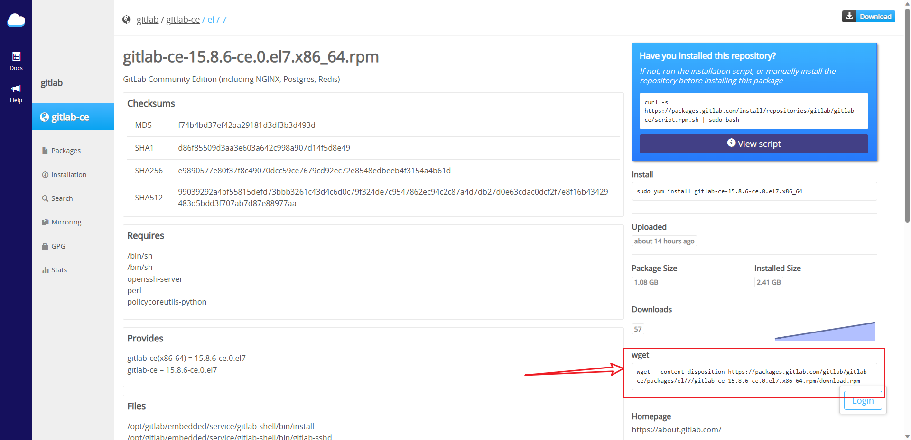

### 7.3 GitLab软件安装

1、安装软件

直接采用下载的RPM软件包安装即可：后面的文件路径需要改成自己的存放路径和文件名

```bash
sudo rpm -ivh /opt/module/software/gitlab-ce-15.7.0-ce.0.el7.x86_64.rpm
```

2、安装配置依赖项

在CentOS 7上，下面的命令也会在系统防火墙中打开HTTP、HTTPS和SSH访问。这是一个可选步骤，如果您打算仅从本地网络访问极狐GitLab，则可以跳过它

```bash
sudo yum install -y curl policycoreutils-python openssh-server perl
sudo systemctl enable sshd
sudo systemctl start sshd
sudo firewall-cmd --permanent --add-service=http
sudo firewall-cmd --permanent --add-service=https
sudo systemctl reload firewalld
```

```bash
# 为了演示方便，我们也可以直接关闭防火墙
sudo systemctl stop firewalld
```

### 7.4 初始化GitLab

```bash
# 配置软件镜像
curl -fsSL https://packages.gitlab.cn/repository/raw/scripts/setup.sh | /bin/bash
# 安装（URL的地址的linux1需要改成自己电脑的主机名）
sudo EXTERNAL_URL="https://linux1" yum install -y gitlab-ce
# 初始化
sudo gitlab-ctl reconfigure
```

### 7.5 启动Gitlab

```bash
# 启动
gitlab-ctl start
# 停止
gitlab-ctl stop
```

### 7.6 访问GitLab

使用浏览器访问GitLab，输入网址：http://linux1/users/sign_in （linux1改成自己的主机名）


初始化时，软件会提供默认管理员账户：root,但是密码是随机生成的。


根据提示，在 `/etc/gitlab/initial_root_password` 文件中查找密码

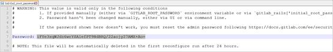

输入账号，密码，进入系统

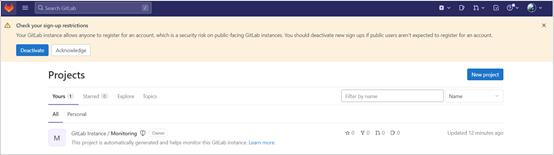

### 7.7 修改密码

默认的密码是随机的，且不容易记忆，还会在系统初始化后24小时被删除，所以需要先修改一下密码

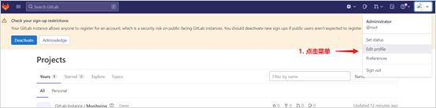

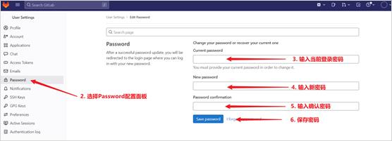


### 7.8 创建项目


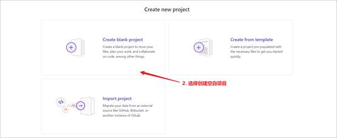

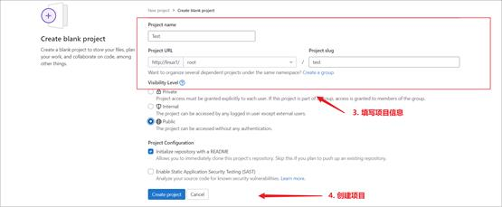

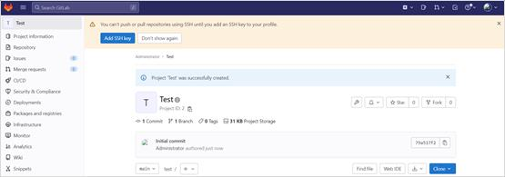

