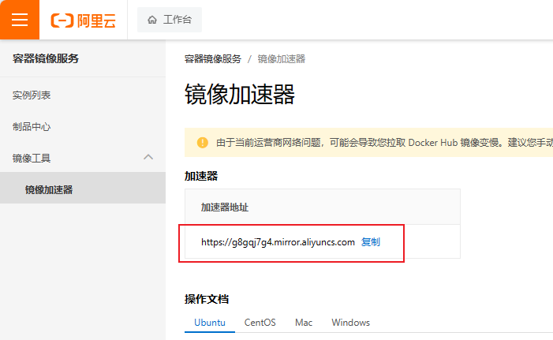

# Docker

## 1、介绍

- **容器和镜像**

当我们利用Docker安装应用时，Docker会自动搜索并下载应用**镜像（image）**。镜像不仅包含应用本身，还包含应用运行所需要的环境、配置、系统函数库。Docker会在运行镜像时创建一个隔离环境，称为**容器（container）**。

Docker安装软件的过程，就是自动搜索下载镜像，然后创建并运行容器的过程。

- **镜像仓库**

Docker官方提供了一个专门管理、存储镜像的网站，并对外开放了镜像上传、下载的权利。Docker官方维护了一个公共仓库：[Docker Hub Container Image Library | App Containerization](https://hub.docker.com/)

Docker官方提供了一些基础镜像，然后各大软件公司又在基础镜像基础上，制作了自家软件的镜像，全部都存放在这个网站。

基本上我们常用的各种软件都能在这个网站上找到，我们甚至可以自己制作镜像上传上去。

像这种提供存储、管理Docker镜像的服务器，被称为DockerRegistry，可以翻译为镜像仓库。DockerHub网站是官方仓库，阿里云、华为云会提供一些第三方仓库，我们也可以自己搭建私有的镜像仓库。

官方仓库在国外，下载速度较慢，一般我们都会使用第三方仓库提供的镜像加速功能，提高下载速度。而企业内部的机密项目，往往会采用私有镜像仓库。

总之，镜像的来源有两种：

- 基于官方基础镜像自己制作
- 直接去DockerRegistry下载


**总结一下**：

Docker本身包含一个后台服务，我们可以利用Docker命令告诉Docker服务，帮助我们快速部署指定的应用。Docker服务部署应用时，首先要去搜索并下载应用对应的镜像，然后根据镜像创建并允许容器，应用就部署完成了。


## 2、Docker的安装

官方教程：[Install Docker Engine on CentOS | Docker Docs](https://docs.docker.com/engine/install/centos/)

1、卸载旧版

首先如果系统中已经存在旧的Docker，则先卸载：

```Shell
yum remove docker \
    docker-client \
    docker-client-latest \
    docker-common \
    docker-latest \
    docker-latest-logrotate \
    docker-logrotate \
    docker-engine
```


2、配置Docker的yum库

首先要安装一个yum工具

```Bash
yum install -y yum-utils
```

安装成功后，执行命令，配置Docker的yum源：

```Bash
yum-config-manager --add-repo https://download.docker.com/linux/centos/docker-ce.repo
```


3、安装Docker

最后，执行命令，安装Docker

```Bash
yum install -y docker-ce docker-ce-cli containerd.io docker-buildx-plugin docker-compose-plugin
```


4、启动和校验

```Bash
# 启动Docker
systemctl start docker

# 停止Docker
systemctl stop docker

# 重启
systemctl restart docker

# 设置开机自启
systemctl enable docker

# 执行docker ps命令，如果不报错，说明安装启动成功
docker ps

# 查看docker
docker images
```


5、配置镜像加速

这里以阿里云镜像加速为例。

5.1 注册阿里云账号

首先访问阿里云网站:  https://www.aliyun.com/   注册一个账号。

5.2 开通镜像服务

在首页的产品中，找到阿里云的**容器镜像服务**：


点击后进入控制台：


5.3 配置镜像加速

找到**镜像工具**下的**镜像加速器**：



页面向下滚动，即可找到配置的文档说明：


具体命令如下：

```Bash
# 创建目录
sudo mkdir -p /etc/docker

# 复制内容，注意把其中的镜像加速地址改成你自己的
sudo tee /etc/docker/daemon.json <<-'EOF'
{
  "registry-mirrors": ["https://g8gqj7g4.mirror.aliyuncs.com"]
}
EOF

# 重新加载配置
sudo systemctl daemon-reload

# 重启Docker
sudo systemctl restart docker
```


## 3、部署MySQL

如果是利用传统方式部署MySQL，大概的步骤有：

- 搜索并下载MySQL安装包
- 上传至Linux环境
- 编译和配置环境
- 安装

而使用Docker安装，仅仅需要一步即可，在命令行输入下面的命令（建议采用CV大法）：

```bash
docker run -d \
  --name mysql \
  -p 3306:3306 \
  -e TZ=Asia/Shanghai \
  -e MYSQL_ROOT_PASSWORD=123 \
  mysql
```


大家可以发现，当我们执行命令后，Docker做的第一件事情，是去自动搜索并下载了MySQL，然后会自动运行MySQL，我们完全不用插手，是不是非常方便。

而且，这种安装方式你完全不用考虑运行的操作系统环境，它不仅仅在CentOS系统是这样，在Ubuntu系统、macOS系统、甚至是装了WSL的Windows下，都可以使用这条命令来安装MySQL。

要知道，**不同操作系统下其安装包、运行环境是都不相同的**！如果是**手动安装，必须手动解决安装包不同、环境不同的、配置不同的问题**！


## 4、命令解读


```bash
docker run -d \
  --name mysql \
  -p 3306:3306 \
  -e TZ=Asia/Shanghai \
  -e MYSQL_ROOT_PASSWORD=123 \
  mysql
```

- `docker run` ：创建并运行一个容器，`-d` 是让容器在后台运行

- `--name` ：给容器起一个名字，必须唯一

- `-p` ：设置映射端口（前面为宿主机端口，后面为容器内端口）

    > 容器是隔离环境，外界不访问。容器有自己的ip地址，我们的主机可以ping到虚拟机，但不能ping到容器。
    >
    > - 可以**将宿主机端口映射容器内到端口**，当访问宿主机指定端口时，就是在访问容器内的端口了。
    > - 容器内端口往往是由容器内的进程决定，例如MySQL进程默认端口是3306，因此容器内端口一定是3306；而宿主机端口则可以任意指定，一般与容器内保持一致。
    > - 格式： `-p 宿主机端口:容器内端口`

- `-e KEY=VALUE` ：设置环境变量， 配置容器内进程运行时的一些参数

    > 可以在官方容器仓库查看需要配置的环境变量。
    >
    > - `TZ=Asia/Shanghai`是设置时区
    > - `MYSQL_ROOT_PASSWORD=123`是设置MySQL默认密码

- `mysql` ：设置镜像名称，Docker会根据这个名字搜索并下载镜像

    > - 格式：`REPOSITORY:TAG`，例如`mysql:8.0`，其中`REPOSITORY`可以理解为镜像名，`TAG`是版本号
    > - 在未指定`TAG`的情况下，默认是最新版本，也就是`mysql:latest`

镜像的名称不是随意的，而是要到DockerRegistry中寻找，镜像运行时的配置也不是随意的，要参考镜像的帮助文档，这些在DockerHub网站或者软件的官方网站中都能找到。


## 5、Docker基础

### 5.1 常见命令

Docker最常见的命令就是操作镜像、容器的命令，详见官方文档：[Docker Docs](https://docs.docker.com/)


查看命令：[Use the Docker command line | Docker Docs](https://docs.docker.com/engine/reference/commandline/cli/)

比较常见的命令有：

|    **命令**    |            **说明**            |                         **文档地址**                         |
| :------------: | :----------------------------: | :----------------------------------------------------------: |
|  docker pull   |            拉取镜像            | [docker pull](https://docs.docker.com/engine/reference/commandline/pull/) |
|  docker push   |    推送镜像到DockerRegistry    | [docker push](https://docs.docker.com/engine/reference/commandline/push/) |
| docker images  |          查看本地镜像          | [docker images](https://docs.docker.com/engine/reference/commandline/images/) |
|   docker rmi   |          删除本地镜像          | [docker rmi](https://docs.docker.com/engine/reference/commandline/rmi/) |
|   docker run   | 创建并运行容器（不能重复创建） | [docker run](https://docs.docker.com/engine/reference/commandline/run/) |
|  docker stop   |          停止指定容器          | [docker stop](https://docs.docker.com/engine/reference/commandline/stop/) |
|  docker start  |          启动指定容器          | [docker start](https://docs.docker.com/engine/reference/commandline/start/) |
| docker restart |          重新启动容器          | [docker restart](https://docs.docker.com/engine/reference/commandline/restart/) |
|   docker rm    |          删除指定容器          | [docs.docker.com](https://docs.docker.com/engine/reference/commandline/rm/) |
|   docker ps    |            查看容器            | [docker ps](https://docs.docker.com/engine/reference/commandline/ps/) |
|  docker logs   |        查看容器运行日志        | [docker logs](https://docs.docker.com/engine/reference/commandline/logs/) |
|  docker exec   |            进入容器            | [docker exec](https://docs.docker.com/engine/reference/commandline/exec/) |
|  docker save   |     保存镜像到本地压缩文件     | [docker save](https://docs.docker.com/engine/reference/commandline/save/) |
|  docker load   |     加载本地压缩文件到镜像     | [docker load](https://docs.docker.com/engine/reference/commandline/load/) |
| docker inspect |        查看容器详细信息        | [docker inspect](https://docs.docker.com/engine/reference/commandline/inspect/) |

补充：默认情况下，每次重启虚拟机我们都需要手动启动Docker和Docker中的容器。通过命令可以实现开机自启：

```PowerShell
# Docker开机自启
systemctl enable docker

# Docker容器开机自启
docker update --restart=always [容器名/容器id]
```


案例：查看DockerHub，拉取Nginx镜像，创建并运行Nginx容器

- 在DockerHub中搜索Nginx镜像，查看镜像的名称。镜像仓库：https://hub.docker.com/
- 拉取Nginx镜像

```bash
[root@hadoop10 ~]# docker pull nginx
Using default tag: latest
latest: Pulling from library/nginx
a2abf6c4d29d: Pull complete 
a9edb18cadd1: Pull complete 
589b7251471a: Pull complete 
186b1aaa4aa6: Pull complete 
b4df32aa5a72: Pull complete 
a0bcbecc962e: Pull complete 
Digest: sha256:0d17b565c37bcbd895e9d92315a05c1c3c9a29f762b011a10c54a66cd53c9b31
Status: Downloaded newer image for nginx:latest
docker.io/library/nginx:latest
```

- 查看本地镜像列表

```bash
[root@hadoop10 ~]# docker images
REPOSITORY   TAG       IMAGE ID       CREATED         SIZE
nginx        latest    605c77e624dd   21 months ago   141MB
mysql        latest    3218b38490ce   21 months ago   516MB
```

- 创建并运行Nginx容器

```bash
[root@hadoop10 ~]# docker run -d --name nginx -p 80:80 nginx
4095e7fd3029ccdec22b1253208d6879ea64d007ff191457089109c05eb0bfc3
```

- 查看容器

```bash
[root@hadoop10 ~]# docker ps
CONTAINER ID   IMAGE     COMMAND                   CREATED         STATUS         PORTS                               NAMES
4095e7fd3029   nginx     "/docker-entrypoint.…"   9 seconds ago   Up 8 seconds   0.0.0.0:80->80/tcp, :::80->80/tcp   nginx
[root@hadoop10 ~]# docker ps --format "table {{.ID}}\t{{.Image}}\t{{.Ports}}\t{{.Status}}\t{{.Names}}"
CONTAINER ID   IMAGE     PORTS                               STATUS         NAMES
4095e7fd3029   nginx     0.0.0.0:80->80/tcp, :::80->80/tcp   Up 2 minutes   nginx
```

- 停止容器

```bash
[root@hadoop10 ~]# docker stop nginx
nginx
[root@hadoop10 ~]# docker ps --format "table {{.ID}}\t{{.Image}}\t{{.Ports}}\t{{.Status}}\t{{.Names}}"
CONTAINER ID   IMAGE     PORTS     STATUS    NAMES
[root@hadoop10 ~]# docker ps --format "table {{.ID}}\t{{.Image}}\t{{.Ports}}\t{{.Status}}\t{{.Names}}" -a
CONTAINER ID   IMAGE     PORTS     STATUS                      NAMES
4095e7fd3029   nginx               Exited (0) 46 seconds ago   nginx
51a3844ccd9d   mysql               Exited (0) 15 hours ago     mysql
```

- 再次启动容器

```bash
[root@hadoop10 ~]# docker start nginx
nginx
```

- 进入Nginx容器

```bash
[root@hadoop10 ~]# docker exec -it nginx bash
root@4095e7fd3029:/# ls
bin   docker-entrypoint.d   home   media  proc	sbin  tmp
boot  docker-entrypoint.sh  lib    mnt	  root	srv   usr
dev   etc		    lib64  opt	  run	sys   var
root@4095e7fd3029:/# ls -l
total 12
drwxr-xr-x.   2 root root 4096 Dec 20  2021 bin
drwxr-xr-x.   2 root root    6 Dec 11  2021 boot
drwxr-xr-x.   5 root root  340 Oct  2 06:54 dev
drwxr-xr-x.   1 root root   41 Dec 29  2021 docker-entrypoint.d
-rwxrwxr-x.   1 root root 1202 Dec 29  2021 docker-entrypoint.sh
drwxr-xr-x.   1 root root   19 Oct  2 06:49 etc
drwxr-xr-x.   2 root root    6 Dec 11  2021 home
drwxr-xr-x.   1 root root   45 Dec 20  2021 lib
drwxr-xr-x.   2 root root   34 Dec 20  2021 lib64
drwxr-xr-x.   2 root root    6 Dec 20  2021 media
drwxr-xr-x.   2 root root    6 Dec 20  2021 mnt
drwxr-xr-x.   2 root root    6 Dec 20  2021 opt
dr-xr-xr-x. 215 root root    0 Oct  2 06:54 proc
drwx------.   2 root root   37 Dec 20  2021 root
drwxr-xr-x.   1 root root   23 Oct  2 06:54 run
drwxr-xr-x.   2 root root 4096 Dec 20  2021 sbin
drwxr-xr-x.   2 root root    6 Dec 20  2021 srv
dr-xr-xr-x.  13 root root    0 Oct  2 06:41 sys
drwxrwxrwt.   1 root root    6 Dec 29  2021 tmp
drwxr-xr-x.   1 root root   66 Dec 20  2021 usr
drwxr-xr-x.   1 root root   19 Dec 20  2021 var
```

- 删除容器

```bash
[root@hadoop10 ~]# docker rm nginx
Error response from daemon: You cannot remove a running container 4095e7fd3029ccdec22b1253208d6879ea64d007ff191457089109c05eb0bfc3. Stop the container before attempting removal or force remove
[root@hadoop10 ~]# docker stop nginx
nginx
[root@hadoop10 ~]# docker rm nginx
nginx
#强制删除
[root@hadoop10 ~]# docker rm nginx -f
```


### 5.2 命令别名

有些命名很长很难记，可以为该命令设置别名。

```bash
[root@hadoop10 ~]# vi ~/.bashrc 
```

```bash
# .bashrc

# User specific aliases and functions

alias rm='rm -i'
alias cp='cp -i'
alias mv='mv -i'
alias dps='docker ps --format "table {{.ID}}\t{{.Image}}\t{{.Ports}}\t{{.Status}}\t{{.Names}}"'
alias dis='docker images'
# Source global definitions
if [ -f /etc/bashrc ]; then
        . /etc/bashrc
fi
```

```bash
[root@hadoop10 ~]# source ~/.bashrc 
[root@hadoop10 ~]# dps
CONTAINER ID   IMAGE     PORTS     STATUS    NAMES
[root@hadoop10 ~]# dis
REPOSITORY   TAG       IMAGE ID       CREATED         SIZE
nginx        latest    605c77e624dd   21 months ago   141MB
mysql        latest    3218b38490ce   21 months ago   516MB
```


### 5.3 数据卷

案例：利用Nginx容器部署静态资源

需求：

- 创建Nginx容器，修改nginx容器内的html目录下的index.html文件，查看变化
- 将静态资源部署到nginx的html目录

```bash
[root@hadoop10 ~]# docker exec -it nginx bash
root@829163e3c25f:/# cd /usr/share/nginx/html
root@829163e3c25f:/usr/share/nginx/html# vi index.html
bash: vi: command not found
```

显示没有vi命令，这是由于Docker镜像只包含当前应用所必备的系统函数。

因此，所以的Docker镜像都是最小化的系统环境，只具备运行所必须的。

由此可见，想要在容器内修改文件非常困难。


- **数据卷（volume）**是一个虚拟目录，是**容器内目录**与**宿主机目录**之间映射的桥梁。

`/var/lib/docker/volumes` 是一个固定的目录，docker会默认在这个路径创建数据卷。


每一个数据卷都与宿主机上的一个目录一一对应，所以卷是虚拟的、逻辑的，但是对应到宿主机上的文件目录是一样的。

Docker会实现宿主机和Nginx容器之间的双向绑定和映射。只要我们将静态资源放入宿主机对应目录，就可以被Nginx代理了。

> **为什么不让容器目录直接指向宿主机目录呢？**
>
> - 因为直接指向宿主机目录就与宿主机强耦合了，如果切换了环境，宿主机目录就可能发生改变了。由于容器一旦创建，目录挂载就无法修改，这样容器就无法正常工作了。
> - 但是容器指向数据卷，一个逻辑名称，而数据卷再指向宿主机目录，就不存在强耦合。如果宿主机目录发生改变，只要改变数据卷与宿主机目录之间的映射关系即可。


- 数据卷的相关命令：

|       **命令**        |       **说明**       |                         **文档地址**                         |
| :-------------------: | :------------------: | :----------------------------------------------------------: |
| docker volume create  |      创建数据卷      | [docker volume create](https://docs.docker.com/engine/reference/commandline/volume_create/) |
|   docker volume ls    |    查看所有数据卷    | [docs.docker.com](https://docs.docker.com/engine/reference/commandline/volume_ls/) |
|   docker volume rm    |    删除指定数据卷    | [docs.docker.com](https://docs.docker.com/engine/reference/commandline/volume_prune/) |
| docker volume inspect | 查看某个数据卷的详情 | [docs.docker.com](https://docs.docker.com/engine/reference/commandline/volume_inspect/) |
|  docker volume prune  | 清除所有未使用数据卷 | [docker volume prune](https://docs.docker.com/engine/reference/commandline/volume_prune/) |


- 挂载操作：在执行docker run命令时，使用 ==-v 数据卷:容器内目录== 可以完成数据卷挂载。
- 当创建容器时，如果挂载了数据卷且数据卷不存在，会自动创建数据卷。

```bash
[root@hadoop10 ~]# docker rm -f nginx
nginx
[root@hadoop10 ~]# docker run -d --name nginx -p 80:80 -v html:/usr/share/nginx/html nginx
c036ba466276b7c1d26fe94bc06d9e4c332c9893d01a8a54ba1e0b081a244a70
[root@hadoop10 ~]# docker ps
CONTAINER ID   IMAGE     COMMAND                   CREATED         STATUS         PORTS                               NAMES
c036ba466276   nginx     "/docker-entrypoint.…"   5 seconds ago   Up 3 seconds   0.0.0.0:80->80/tcp, :::80->80/tcp   nginx
[root@hadoop10 ~]# docker volume ls
DRIVER    VOLUME NAME
local     f97bade094c17a861221a02cf7320e68c0b01527afa91b86f8b3998ecfc21ba4
local     html
[root@hadoop10 ~]# docker volume inspect html
[
    {
        "CreatedAt": "2023-10-02T16:08:26+08:00",
        "Driver": "local",
        "Labels": null,
        "Mountpoint": "/var/lib/docker/volumes/html/_data",
        "Name": "html",
        "Options": null,
        "Scope": "local"
    }
]
```


总结：

- 什么是数据卷？

    数据卷是一个虚拟目录，它将宿主机目录映射到容器内目录，方便我们操作容器内文件，或者方便迁移容器产生的数据。

- 如何挂载数据卷？

    创建容器时，利用 -v 数据卷名：容器内目录完成挂载

    容器创建时，如果发现挂载的数据卷不存在时，会自动创建


### 5.4 本地目录挂载

案例：MySQL容器的数据挂载

需求：

- 查看mysql容器，判断是否有数据卷挂载
- 基于宿主机目录实现MySQL数据目录、配置文件、初始化脚本的挂载（查阅官方镜像文档）


```bash
# 查看容器详情
docker inspect mysql
# 可以看到mysql也有挂载，但数据卷的名字很长，是自动生成的
```

**像这种，不是我们创建的卷，由程序自动创建的卷，叫做匿名卷。**

mysql挂载的目录：`/var/lib/mysql`

- 为什么MySQL要将数据存储目录挂载到宿主机呢？

    MySQL在运行过程中，会不断产生数据，不做挂载的话，将来这个容器的体积会越来越大，做数据迁移将会非常不方便。因此处于数据解耦的考虑，将数据挂载出去了。

但是MySQL使用的是匿名卷，如果此时要对MySQL版本进行升级，需要将旧版本删掉，在创建新的容器。原来的数据卷和数据都还在，但是新创建的容器的数据卷名字变了，原来的数据在旧的卷里，等于丢失了。


我们可以自定义挂载目录：

- 在执行docker run命令时，使用 **-v 本地目录：容器内目录** 可以完成本地目录挂载
- 本地目录必须以 “/” 或 “./” 开头，如果直接以名称开头，会被识别为数据卷而非本地目录
    - `-v mysql : /var/lib/mysql` 会被识别为一个数据卷叫mysql
    - `-v ./mysql : /var/lib/mysql` 会被识别为当前目录下的mysql目录


```bash
[root@hadoop10 ~]# mkdir mysql
[root@hadoop10 ~]# cd mysql/
[root@hadoop10 mysql]# mkdir data
[root@hadoop10 mysql]# mkdir conf
[root@hadoop10 mysql]# mkdir init
[root@hadoop10 mysql]# docker rm -f mysql
mysql
[root@hadoop10 mysql]# docker run -d \
>     --name mysql \
>     -p 3306:3306 \
>     -e TZ=Asia/Shanghai \
>     -e MYSQL_ROOT_PASSWORD=123 \
>     -v /root/mysql/data:/var/lib/mysql \
>     -v /root/mysql/init:/docker-entrypoint-initdb.d \
>     -v /root/mysql/conf:/etc/mysql/conf.d \
>     mysql
b36a4e0b500ba3e610d7e13b09760e330c90904a66dd61bb3084d30c970fe53e
[root@hadoop10 mysql]# dps
CONTAINER ID   IMAGE     PORTS                                                  STATUS          NAMES
b36a4e0b500b   mysql     0.0.0.0:3306->3306/tcp, :::3306->3306/tcp, 33060/tcp   Up 10 seconds   mysql
c036ba466276   nginx     0.0.0.0:80->80/tcp, :::80->80/tcp                      Up 32 minutes   nginx
```

挂载在指定的路径，哪怕现在我把容器删了，将来再运行容器，数据依然还在。


### 5.5 Dockerfile语法

镜像就是包含了应用程序、程序运行的系统函数库、运行配置等文件的文件包。构建镜像的过程其实就是把上述文件打包的过程。

Docker会把每一步产生的文件分别打成一个包，作为镜像的一部分，最终合在一起作为镜像。


由于制作镜像的过程中，需要逐层处理和打包，比较复杂，所以Docker就提供了自动打包镜像的功能。我们只需要将打包的过程，每一层要做的事情用固定的语法写下来，交给Docker去执行即可。

而这种记录镜像结构的文件就称为**Dockerfile**，其对应的语法可以参考官方文档：

https://docs.docker.com/engine/reference/builder/

Dockerfile就是一个文本文件，其中包含一个个的指令（Instruction），用指令来说明要执行什么操作来构建镜像。将来Docker可以根据Dockerfile帮助我们构建镜像。常见指令如下：

|    **指令**    |                   **说明**                   |                           **示例**                           |
| :------------: | :------------------------------------------: | :----------------------------------------------------------: |
|    **FROM**    |                 指定基础镜像                 |                       `FROM centos:6`                        |
|    **ENV**     |        设置环境变量，可在后面指令使用        |                       `ENV key value`                        |
|    **COPY**    |         拷贝本地文件到镜像的指定目录         |                 `COPY ./xx.jar /tmp/app.jar`                 |
|    **RUN**     |  执行Linux的shell命令，一般是安装过程的命令  | `RUN tar -zxvf /tmp/jre11.tar.gz && Exports path=/tmp/jre11:$path` |
|   **EXPOSE**   | 指定容器运行时监听的端口，是给镜像使用者看的 |                        `EXPOSE 8080`                         |
| **ENTRYPOINT** |     镜像中应用的启动命令，容器运行时调用     |                `ENTRYPOINT java -jar xx.jar`                 |

例如，要基于Ubuntu镜像来构建一个Java应用，其Dockerfile内容如下：

```Dockerfile
# 指定基础镜像
FROM ubuntu:16.04
# 配置环境变量，JDK的安装目录、容器内时区
ENV JAVA_DIR=/usr/local
ENV TZ=Asia/Shanghai
# 拷贝jdk和java项目的包
COPY ./jdk8.tar.gz $JAVA_DIR/
COPY ./docker-demo.jar /tmp/app.jar
# 设定时区
RUN ln -snf /usr/share/zoneinfo/$TZ /etc/localtime && echo $TZ > /etc/timezone
# 安装JDK
RUN cd $JAVA_DIR \
 && tar -xf ./jdk8.tar.gz \
 && mv ./jdk1.8.0_144 ./java8
# 配置环境变量
ENV JAVA_HOME=$JAVA_DIR/java8
ENV PATH=$PATH:$JAVA_HOME/bin
# 指定项目监听的端口
EXPOSE 8080
# 入口，java项目的启动命令
ENTRYPOINT ["java", "-jar", "/app.jar"]
```

同学们思考一下：以后我们会有很多很多java项目需要打包为镜像，他们都需要Linux系统环境、JDK环境这两层，只有上面的3层不同（因为jar包不同）。如果每次制作java镜像都重复制作前两层镜像，是不是很麻烦。

所以，就有人提供了基础的系统加JDK环境，我们在此基础上制作java镜像，就可以省去JDK的配置了：

```Dockerfile
# 基础镜像
FROM openjdk:11.0-jre-buster
# 设定时区
ENV TZ=Asia/Shanghai
RUN ln -snf /usr/share/zoneinfo/$TZ /etc/localtime && echo $TZ > /etc/timezone
# 拷贝jar包
COPY docker-demo.jar /app.jar
# 入口
ENTRYPOINT ["java", "-jar", "/app.jar"]
```

是不是简单多了。


### 5.6 自定义镜像

当写好Dockerfile，可以用如下命令来构建镜像：

```bash
docker build -t myImage:1.0 .
```

- `-t` ：是个镜像起名，格式为 `repository:tag`，不指定tag时，默认为latest
- `.` ：是指定Dockerfile所在的目录，如果就在当前目录，则指定为 "."


总结：

- 镜像的结构是怎么样的？

    镜像中包含了应用程序所需要的运行环境、函数库、配置、以及应用本身等各种文件，这些文件分层打包而成。

- Dockfile是做什么的？

    Dockfile就是利用固定的指令来描述镜像的结构和构建过程，这样Docker才可以依次来构建镜像

- 构建镜像的命令是什么？

    docker build -t 镜像名 Dockerfile目录

 

### 5.7 容器网络互联

默认情况下，所有的容器都是以bridge方式连接到Docker的一个虚拟网桥上：


但是这个ip地址是docker网桥给分配的，现在假设容器重新启动，ip地址可能就变了。

为了解决这张问题，我们需要使用自定义网络。

**加入自定义网络的容器才可以通过==容器名==互相访问**，Docker的网络操作命令如下：

|         **命令**          |         **说明**         |                         **文档地址**                         |
| :-----------------------: | :----------------------: | :----------------------------------------------------------: |
|   docker network create   |       创建一个网络       | [docker network create](https://docs.docker.com/engine/reference/commandline/network_create/) |
|     docker network ls     |       查看所有网络       | [docs.docker.com](https://docs.docker.com/engine/reference/commandline/network_ls/) |
|     docker network rm     |       删除指定网络       | [docs.docker.com](https://docs.docker.com/engine/reference/commandline/network_rm/) |
|   docker network prune    |     清除未使用的网络     | [docs.docker.com](https://docs.docker.com/engine/reference/commandline/network_prune/) |
|  docker network connect   | 使指定容器连接加入某网络 | [docs.docker.com](https://docs.docker.com/engine/reference/commandline/network_connect/) |
| docker network disconnect | 使指定容器连接离开某网络 | [docker network disconnect](https://docs.docker.com/engine/reference/commandline/network_disconnect/) |
|  docker network inspect   |     查看网络详细信息     | [docker network inspect](https://docs.docker.com/engine/reference/commandline/network_inspect/) |


```bash
docker network create heima
docker network connect heima mysql
#在创建容器时，指定自定义网络
docker run -d --name dd -p 8080:8080 --network heima docker-demo
```


## 6、项目部署

### 6.1 部署java应用


我们要部署的就是其中的`hm-service`，其中的配置文件采用了多环境的方式：


其中的`application-dev.yaml`是部署到开发环境的配置，`application-local.yaml`是本地运行时的配置。


## 7、DockerCompose

大家可以看到，我们部署一个简单的java项目，其中包含3个容器：

- MySQL
- Nginx
- Java项目

而稍微复杂的项目，其中还会有各种各样的其它中间件，需要部署的东西远不止3个。如果还像之前那样手动的逐一部署，就太麻烦了。

而Docker Compose就可以帮助我们实现**多个相互关联的Docker容器的快速部署**。它允许用户通过一个单独的 docker-compose.yml 模板文件（YAML 格式）来定义一组相关联的应用容器。

docker-compose文件中可以定义多个相互关联的应用容器，每一个应用容器被称为一个服务（service）。由于service就是在定义某个应用的运行时参数，因此与`docker run`参数非常相似。

举例来说，用docker run部署MySQL的命令如下：

```Bash
docker run -d \
  --name mysql \
  -p 3306:3306 \
  -e TZ=Asia/Shanghai \
  -e MYSQL_ROOT_PASSWORD=123 \
  -v ./mysql/data:/var/lib/mysql \
  -v ./mysql/conf:/etc/mysql/conf.d \
  -v ./mysql/init:/docker-entrypoint-initdb.d \
  --network hmall
  mysql
```

如果用`docker-compose.yml`文件来定义，就是这样：

```YAML
version: "3.8"

services:
  mysql:
    image: mysql
    container_name: mysql
    ports:
      - "3306:3306"
    environment:
      TZ: Asia/Shanghai
      MYSQL_ROOT_PASSWORD: 123
    volumes:
      - "./mysql/conf:/etc/mysql/conf.d"
      - "./mysql/data:/var/lib/mysql"
    networks:
      - new
networks:
  new:
    name: hmall
```

对比如下：

| **docker run 参数** | **docker compose 指令** |  **说明**  |
| :-----------------: | :---------------------: | :--------: |
|       --name        |     container_name      |  容器名称  |
|         -p          |          ports          |  端口映射  |
|         -e          |       environment       |  环境变量  |
|         -v          |         volumes         | 数据卷配置 |
|      --network      |        networks         |    网络    |

编写好docker-compose.yml文件，就可以部署项目了。常见的命令：

https://docs.docker.com/compose/reference/

基本语法如下：

```Bash
docker compose [OPTIONS] [COMMAND]
```

其中，OPTIONS和COMMAND都是可选参数，比较常见的有：

| **类型** |                        **参数或指令**                        |          **说明**           |
| :------: | :----------------------------------------------------------: | :-------------------------: |
| Options  |                              -f                              | 指定compose文件的路径和名称 |
|    -p    | 指定project名称。project就是当前compose文件中设置的多个service的集合，是逻辑概念 |                             |
| Commands |                              up                              |  创建并启动所有service容器  |
|   down   |                   停止并移除所有容器、网络                   |                             |
|    ps    |                      列出所有启动的容器                      |                             |
|   logs   |                      查看指定容器的日志                      |                             |
|   stop   |                           停止容器                           |                             |
|  start   |                           启动容器                           |                             |
| restart  |                           重启容器                           |                             |
|   top    |                        查看运行的进程                        |                             |
|   exec   |                 在指定的运行中容器中执行命令                 |                             |


