# Hadoop


## Hadoop2.x和3.x的区别

### 性能变化

Hadoop 3.x相较于Hadoop 2.x有一些重要的变化和更新，包括以下几个方面：

1. **YARN资源调度器的改进**：YARN成为了Hadoop 3.x的默认资源调度器和应用程序管理器。YARN 3.x相较于之前的版本有着更好的性能、可扩展性和可靠性，特别是在大规模集群中的表现更加优秀。
2. **HDFS存储系统的改进**：Hadoop 3.x对HDFS进行了许多优化和改进，包括EC（Erasure Coding）编码的支持、内存缓存管理的改进、数据块大小的灵活配置等。这些改进可以显著提高Hadoop在大数据环境下的性能表现和数据存储的可靠性。
3. **支持GPU加速计算**：Hadoop 3.x开始支持将GPU用于加速计算，支持多种GPU加速技术，如CUDA、OpenCL等。
4. **后向兼容性**：Hadoop 3.x对API和协议进行了一些调整以更好地支持新的功能和特性，但保持了与Hadoop 2.x的后向兼容性。

总之，Hadoop 3.x相较于之前的版本提供了更好的性能、可靠性、扩展性和灵活性，并且支持一些新的技术和特性，如YARN、EC编码、GPU加速计算等。


### 命令变化

Hadoop 2.x和Hadoop 3.x的命令基本一致，不过有一些细微的差别。以下是其中的一些变化：

1. 命令前缀的变化：在Hadoop 2.x中，大部分命令都以`hadoop`开头，如`hadoop fs`、`hadoop jar`等；而在Hadoop 3.x中，许多命令被拆分成了独立的模块并以模块名作为前缀，如`hdfs dfs`、`yarn application`、`mapred queue`等。
2. 配置参数的变化：在Hadoop 2.x中，许多配置参数需要在`hadoop-env.sh`或`yarn-env.sh`等配置文件中进行设置，而在Hadoop 3.x中，这些配置参数通常可以通过命令行选项进行设置。
3. 命令选项的变化：在Hadoop 3.x中，部分命令的选项发生了变化或新增了新的选项，例如`hdfs dfs`中新增了`-touchz`选项用于创建一个空文件。
4. 新增了一些命令：在Hadoop 3.x中新增了一些命令，如`hdfs crypto`用于对加密区域进行管理、`yarn node`用于显示节点的信息等。

总体上来说，Hadoop 3.x相较于Hadoop 2.x变化不大，但有一些细节上的差异需要注意。如果要使用Hadoop 3.x，可以查看对应版本的官方文档来了解具体的命令和选项。


## 网络配置问题

### 不同电脑互相ping通

要使两台在同一子网下的电脑上面使用虚拟机可以互相ping通，需要进行以下几个步骤：

1. 确认两台主机和虚拟机的IP地址：在Linux虚拟机中使用`ifconfig`命令查看虚拟机的IP地址。**确保两台主机和虚拟机的IP地址在同一个子网段内**，例如都是192.168.1.xx。==（使用桥接方式创建网卡，使虚拟机和主机在同一网段下）==

2. 禁用Linux虚拟机的防火墙：在Linux虚拟机中执行以下命令禁用防火墙：

    ```
    Copy Codesudo systemctl stop firewalld.service
    sudo systemctl disable firewalld.service
    ```

3. 确认两台主机上是否已安装ping工具：可以在终端中输入`ping`命令检查是否已安装。

4. 在两台主机上分别ping另一台主机以及对方的虚拟机IP地址：在终端中输入`ping <目标地址>`命令进行测试，如果能够ping通，则表示网络配置正确，否则需要进一步检查网络配置是否正确。

如果以上步骤都正确执行且仍无法ping通，则可能是由于不同虚拟机软件的网络配置不同或有其他网络配置问题，需要进一步排查。


## Linux系统安装和配置

### 1、下载VMware和Ubuntu系统

[华为开源镜像站_软件开发服务_华为云 (huaweicloud.com)](https://mirrors.huaweicloud.com/home)

### 2、在VM上安装操作系统

1. 先创建空的虚拟机
2. 再选在下载好的 ios 镜像文件
3. 启动虚拟机，安装操作系统

### 3、添加中文输入法

设置—》文本输入/键盘—》点击+号，添加中文输入法/

### 4、安装VMware Tools工具

1. 左上角—》虚拟机—》安装VMware Tools工具
2. 安装完vmware tool后，打开vmware tool就会出现如下图里的VMwareTools-10.3.23-16594550.tar.gz的linux压缩包文件

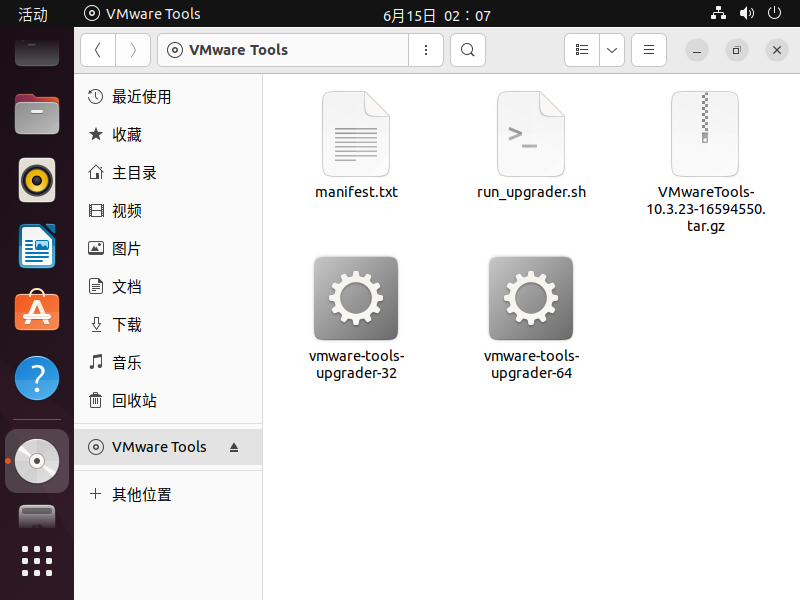

3. 这里我们鼠标右键选择使用归档管理器打开，然后另存到桌面（为了方便使用终端找到该压缩文件）

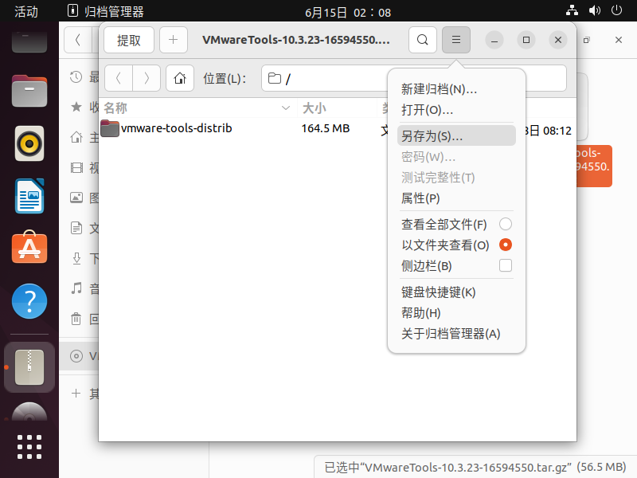

4. 打开终端，进入桌面目录，即输入”cd 桌面”，再解压VMwareTools-9.9.0-2304977.tar.gz压缩包，即在终端输入”tar -zxvf VMwareTools-10.3.23-16594550.tar.gz”。（ 注意这里的压缩包名称需要根据自己的实际情况来输入，像我的是VMwareTools-10.3.23-16594550.tar.gz。 ）

    ```bash
    tar -zxvf VMwareTools-10.3.23-16594550.tar.gz
    ```

    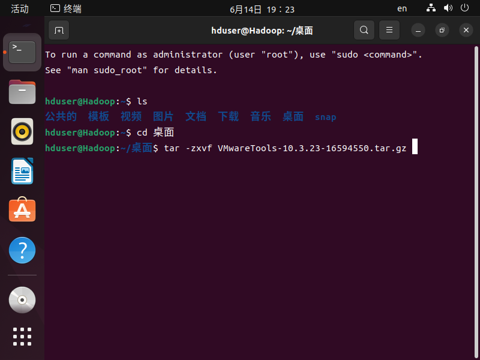

5. 进入桌面后，输入：cd vmware-tools-distrib/

    ```bash
    cd vmware-tools-distrib/
    ```

    

6. 进入vmware-tools-distrib文件夹后，继续输入：sudo ./vmware-install.pl

    ```bash
    sudo ./vmware-install.pl
    ```

    

7. 一直回车（注意看每个回应的语句，个别版本需要手动回复yes）。

8. 直到出现Enjoy, –the VMware team，就表示安装成功了，然后手动重启虚拟机。

    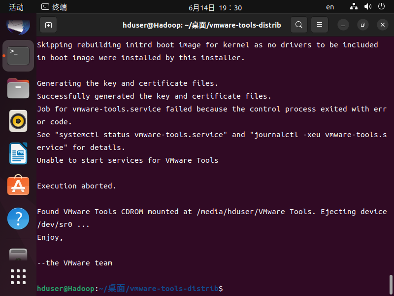

9. 重启虚拟机后，我们发现菜单栏 - 虚拟机 - 安装VMware Tools变成了“重新安装”字眼，这也表明VMware Tools已经安装成功了。

> 对于 Linux 的较高发行版，系统会提示用户选择集成的 open-vm-tools。
>
> 使用 Ubuntu 22.04 系统安装完VMware Tools 后并没有用，使用如下方法：

==**安装open-vm-tools**==
open-vm-tools 是VMware Tools 的开源实现，由一套虚拟化实用程序组成，这些程序可增强虚拟机在 VMware 环境中的功能。open-vm-tools由两个组件构成，

- open-vm-tools：这个装上之后虚机就有了显示驱动，屏幕可以自适应大小
- open-vm-tools-desktop：作用主要是主机和虚拟机之间的复制粘贴。其实，大文件的拖放也可以利用Share文件夹。

```bash
sudo apt-get update
sudo su
apt-get install open-vm-tools
apt-get install open-vm-tools-desktop
reboot
```


## Hadoop的安装与配置

搭建Hadoop集群需要以下几个步骤：

1. 搭建linux系统：首先需要在每一台电脑上安装linux操作系统，并确保配置好网络和防火墙以及SSH远程连接。
2. 安装JDK：在每一台机器上安装Java开发工具包（JDK）。
3. 安装Hadoop：在每一台机器上下载和安装Hadoop分布式系统，确保安装的版本相同并且配置文件统一。
4. 配置Hadoop集群：修改Hadoop的配置文件（[hadoop-env.sh](http://hadoop-env.sh/)、core-site.xml、hdfs-site.xml、mapred-site.xml等），设置Hadoop默认的存储路径、节点角色、备份数量等参数。
5. 启动Hadoop集群：提取一个节点作为主节点，[使用hadoop-daemon.sh](http://xn--hadoop-daemon-he5uj694b.sh/) start [namenode和hadoop-daemon.sh](http://xn--namenodehadoop-daemon-uo00b.sh/) start jobtracker等命令启动相应的服务，再依次启动其他节点服务。
6. 测试Hadoop集群：通过hadoop fs -ls /命令测试是否能够连接到Hadoop集群，也可以通过运行MapReduce任务进行测试。


### 配置单节点集群（Hadoop Single Node Cluster）

- Hadoop Single Node Cluster 只以一台机器来建立Hadoop环境，但你仍然可以使用Hadoop命令，只是无法发挥使用多台机器的威力。

- 因为只有一台服务器，所有的功能都集中在一台服务器中。

#### 1、安装JDK

- Hadoop是基于Java开发的，所有必须先安装Java环境。

- 点击“终端”，输入以下代码查看Java版本

    ```bash
    java -version
    ```

- JDK: Java Development Kit, Java语言的软件开发工具包

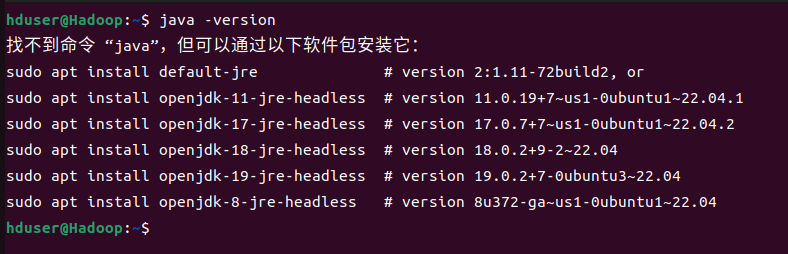

- 在Linux中既可以使用apt进行软件包的管理，也可以使用apt-get下载安装软件包（或称为套件）。在这里我们会使用apt-get安装jdk。

- 不过，在安装之前，为了获取最新的软件包版本必须先运行**apt-get update**。此命令会连接到APT Server，更新最新的软件包信息。

- 运行apt-get必须具有superuser（超级用户）权限，但superuser权限很大，为了安全考虑，一般我们在运行是不会以superuser来登录系统。我们可以在命令前加上**sudo**命令，系统会询问superuser密码（既安装是输入的密码），这样就可以获得superuser权限。

    ```bash
    sudo apt-get update
    ```

- 使用apt-get安装JDK，在“终端”输入以下命令：

    ```bash
    sudo apt-get install default-jdk
    ```

    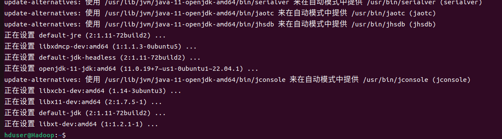

- 再次使用以下命令查看Java版本

    ```bash
    java -version
    ```

- 系统响应已安装的Java版本时，代表已经成功安装了JDK

    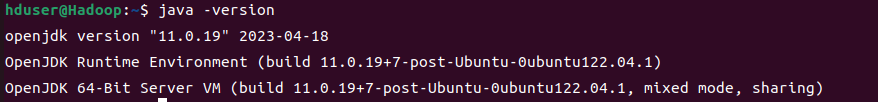

- 查询Java安装路径

    ```bash
    update-alternatives --display java
    ```

    > update-alternatives --display java命令是Ubuntu或Debian Linux上的一个命令行工具，用于管理操作系统中安装的多个版本的同一种类软件（如Java）。该命令用于查看Java可执行文件的当前或备选版本，并可以使用数字键选择要使用的默认版本。
    >
    > update-alternatives还支持其他相关命令，如--install、--remove、--set等，用于添加、卸载或设置软件的备选版本。

    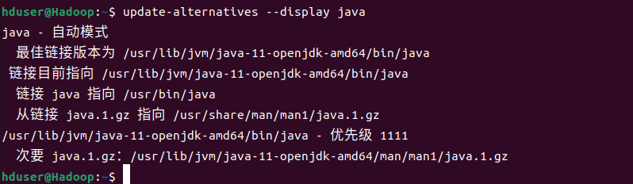

#### 2、设置SSH无密码登录

- Hadoop是由很多台服务器所组成的，当我们启动Hadoop系统时，NameNode必须与DataNode连接，并管理这些节点（DataNode）。此时系统会要求用户输入密码。**为了让系统顺利运行不需手动输入密码，就需要SSH设置成无密码登录。**

- 注意，无密码登录并非不需要密码，而是**以事先交换的SSH Key（密钥）来进行身份验证**。

- Hadoop使用SSH（Secure Shell）连接是目前较可靠、专为远程登录其他服务器提供的安全性协议。通过SSH会对所有传输的数据进行加密。**利用SSH协议可以防止远程管理系统时信息外泄的问题。**

- ==安装SSH==，在“终端”输入以下命令：

    ```bash
    sudo apt-get install ssh
    ```

    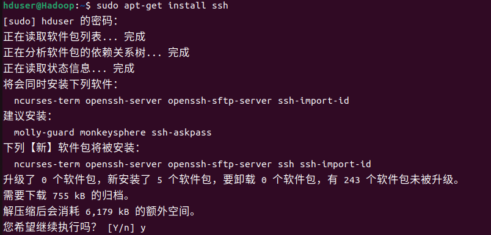

- ==安装rsync==，在“终端”输入以下命令：

    ```bash
    sudo apt-get install rsync
    ```

    > rsync是一种用于文件备份和同步的远程和本地文件传输工具，其名称来源于"remote sync"。它可以在本地计算机或在不同的远程计算机之间快速、安全地传输和同步文件和目录。rsync的工作原理是比较源和目标文件之间的差异（增量备份），只传输已更改的部分，因此效率非常高。
    >
    > rsync的特点包括：
    >
    > - 传输数据时可以加密，提高了安全性；
    > - 可以压缩数据，减少带宽占用；
    > - 支持增量备份，避免了重复传输的文件和数据，提高了效率；
    > - 可以在断点处恢复传输过程，避免了重新传输全部内容；
    > - 能够进行本地和远程的文件同步，提供了非常便捷的文件备份方式。
    >
    > rsync被广泛应用于Linux系统的维护、备份和同步，也逐渐在其他操作系统上得到应用。通过rsync命令，我们可以轻松备份和同步文件夹和文件，从而保证数据的安全性和可靠性。

- ==产生SSH Key（密钥）==，在“终端”输入以下命令：

    ```bash
    ssh-keygen -t dsa -P '' -f ~/.ssh/id_dsa
    ```

    > ssh-keygen是一个用于生成、管理和转换SSH密钥对的工具，常用于远程登录和文件传输中的身份验证。该命令可以为当前用户生成RSA、DSA、ECDSA、ED25519等多种类型的密钥对，并将其保存到指定的文件夹（如~/.ssh）中。
    >
    > ssh-keygen -t dsa -P '' -f ~/.ssh/id_dsa命令的含义为：
    >
    > - -t dsa：指定要生成的**密钥类型为DSA**（Digital Signature Algorithm）；
    > - -P ''：设置密钥对的**密码为空**，即不使用口令保护密钥（也可以设置其他的密码选项）；
    > - -f ~/.ssh/id_dsa：指定生成的**密钥对文件名**为id_dsa，并保存在~/.ssh目录下。
    >
    > 因此，这个命令将在当前用户的主目录下（如果不存在的话）创建.ssh文件夹，并在其中生成一个DSA密钥对文件（id_dsa和id_dsa.pub）。**id_dsa文件包含私钥，需要妥善保管，而id_dsa.pub文件则包含公钥，可以自由分发给需要访问该用户系统的其他用户。**
    >
    > 生成的密钥对可用于SSH登录、SCP和SFTP文件传输等操作中。**我们可以将公钥存储到目标主机的authorized_keys文件中，以实现免密码登录**；同时，也可以将私钥拷贝到其他计算机上，从而实现SSH连接等功能。

    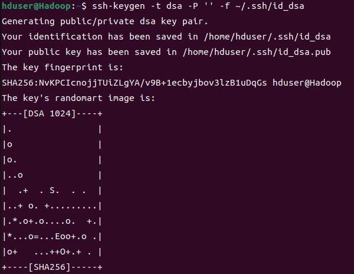

- 查看产生的密钥，SSH Key会产生在用户的根目录下，也就是 `/home/hduser`

    在“终端”输入以下命令：

    ```bash
    ll ~/.ssh
    ```

    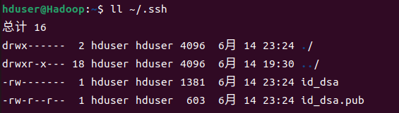

- ==将产生的Key放置到许可证文件中==，为了能够无密码登录本机，我们必须将产生的公钥加入到许可证文件中。

    在“终端”输入以下命令：

    ```bash
    cat ~/.ssh/id_dsa.pub >> ~/.ssh/authorized_keys
    ```

    > 重定向符号“>>”会将命令执行后产生的标准输出（stdout）重定向附加在该文件之后。
    >
    > 如果文件不存在，就会先创建一个新文件，然后把标准输出（stdout）的内容存储在这个文件中。
    >
    > 如果文件已经存在，就会将标准输出（stdout）的数据附加至文件内容的后面，而不会覆盖原来文件的内容。

#### 3、下载安装Hadoop

- 登录Hadoop官网下载页面

    https://archive.apache.org/dist/hadoop/common/ 

- 选择需要的版本，鼠标右键复制链接

    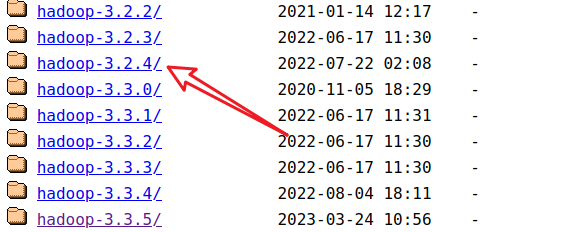

    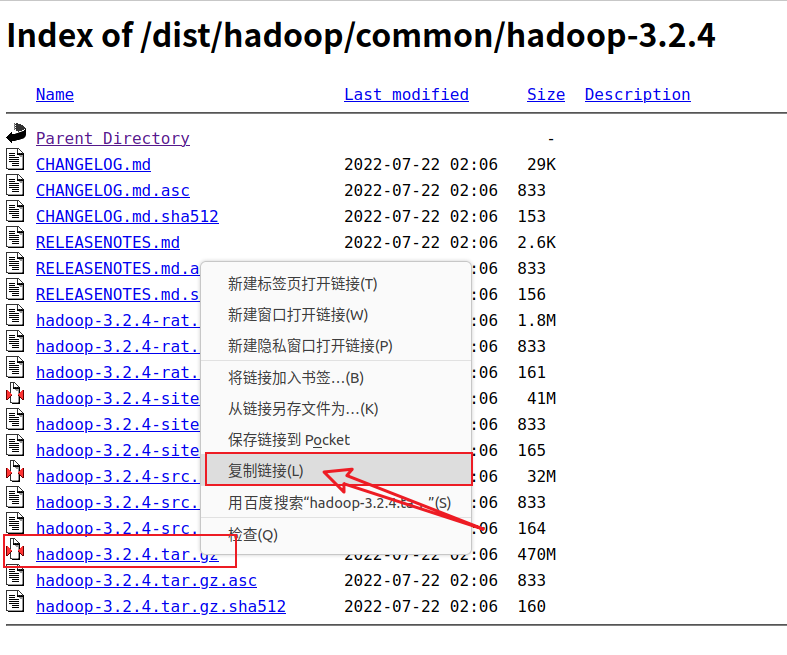

- 在“终端”输入wget及空格键，然后粘贴之前复制的链接

    ```bash
    wget https://archive.apache.org/dist/hadoop/common/hadoop-3.2.4/hadoop-3.2.4.tar.gz
    ```

    

    > wget是一个Linux和UNIX操作系统中的命令行工具，它用于从Web服务器上下载文件，支持HTTP、HTTPS和FTP等多种协议。使用wget命令可以方便地下载网页、图片、视频和软件等文件。
    >
    > wget命令的一般语法为：
    >
    > ```
    > Copy Codewget [option] [URL]
    > ```
    >
    > 其中，[option]是wget的各种选项，[URL]是要下载的文件的URL链接。常用的一些选项包括：
    >
    > - -O：指定下载文件的保存名称；
    > - -c：断点续传，继续已下载的任务；
    > - -r：递归下载，下载指定URL链接下所有链接的文件；
    > - -np：不跟随父级链接；
    > - -k：转换HTML文件中的链接。
    >
    > 例如，要将http://www.example.com/test.zip文件下载到本地/home/user/downloads目录下，可以使用以下命令：
    >
    > ```
    > Copy Codewget http://www.example.com/test.zip -P /home/user/downloads
    > ```
    >
    > 此外，wget还支持通过代理服务器进行下载、设置下载速度限制等高级功能。总的来说，wget是一个非常实用的命令行工具，在许多情况下可以帮助我们快速高效地获取需要的文件。

- 解压hadoop-2.6.0.tar.gz

    ```bash
    sudo tar -zxvf hadoop-3.2.4.tar.gz
    ```

- 移动hadoop2.6.0目录到 `/usr/local/hadoop`

    ```bash
    sudo mv hadoop-3.2.4 /usr/local/hadoop
    ```

- 查看Hadoop安装目录 `/usr/local/hadoop`

    ```bash
    ll /usr/local/hadoop
    ```

    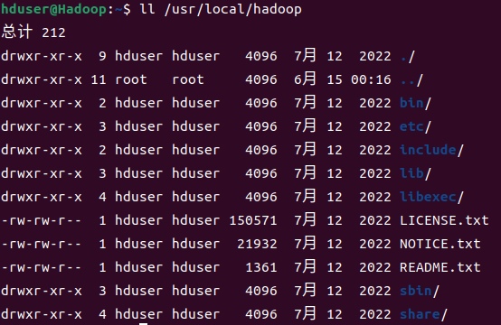

    | **目录** | **说明**                                                     |
    | -------- | ------------------------------------------------------------ |
    | bin/     | 各项运行文件，包括Hadoop、HDFS、YARN等                       |
    | sbin/    | 各项shell运行文件，包括start-all.sh、stop-all.sh             |
    | etc/     | etc/hadoop子目录包括Hadoop配置文件，例如hadoop-env.sh、core-site.xml、yarn-site.xml、mapred-site.xml、hdfs-site.xml |
    | lib/     | Hadoop函数库                                                 |
    | logs/    | 系统日志，可以查看系统运行情况                               |

#### 4、设置hadoop环境变量

- 运行hadoop必须设置很多环境变量，可是如果每次登录时都必须重新设置就会很麻烦。因此可以再~/.bashrc文件中设置每次登录时都会自动运行一次环境变量设置。
- 通俗来说，就是我们可以将一些常用的命令或者自定义的环境变量放到.bashrc文件中，这样**每次打开终端就会自动执行这些设置**，方便我们进行开发工作。

- 编辑 ~/.bashrc，在“终端”输入以下命令：

    ```bash
    sudo gedit ~/.bashrc
    ```

- 在打开的文件末尾添加以下内容：(**记得保存**)

    ```bash
    export JAVA_HOME=/usr/lib/jvm/java-11-openjdk-amd64
    export HADOOP_HOME=/usr/local/hadoop
    export PATH=$PATH:$HADOOP_HOME/bin
    export PATH=$PATH:$HADOOP_HOME/sbin
    export HADOOP_MAPRED_HOME=$HADOOP_HOME
    export HADOOP_COMMON_HOME=$HADOOP_HOME
    export HADOOP_HDFS_HOME=$HADOOP_HOME
    export YARN_HOME=$HADOOP_HOME
    export HADOOP_COMMON_LIB_NATIVE_DIR=$HADOOP_HOME/lib/native
    export HADOOP_OPTS="-Djava.library.path=$HADOOP_HOME/lib"
    export JAVA_LIBRARY_PATH=$HADOOP_HOME/lib/native:$JAVA_LIBRARY_PATH
    ```

    //==**第一行是你的jdk安装路径，安装你自己下载的版本以及安装路径更改**==

    //第二行是hadoop的安装路径

    > 在Linux系统中，":"是环境变量的分隔符。
    >
    > 环境变量PATH是一个用于存放可执行文件路径的环境变量，多个路径之间需要使用冒号":"进行分隔。

    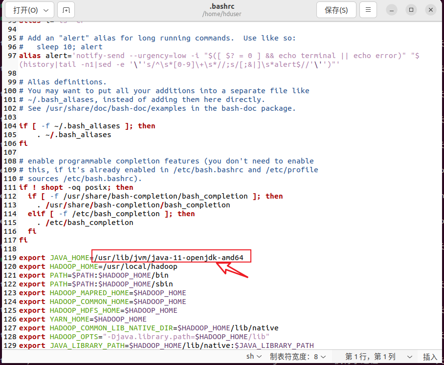

- 让~/.bashrc设置生效

    当修改~/.bashrc之后，先从系统注销再登录系统，这样设置就会生效，或者使用source命令让~/.bashrc设置生效

    ```bash
    source ~/.bashrc
    ```

#### 5、编辑Hadoop-env.sh

- hadoop-env.sh是hadoop的配置文件，在这里必须设置Java的安装路径，在“终端”输入以下命令

    ```bash
    sudo gedit /usr/local/hadoop/etc/hadoop/hadoop-env.sh
    ```

- 原文件中JAVA_HOME的设置是：

    ```bash
    export JAVA_HOME=${JAVA_HOME}
    ```

    修改为：

    ```bash
    export JAVA_HOME=/usr/lib/jvm/java-11-openjdk-amd64
    ```

- 修改完保存并关闭文件

    

#### 6、设置core-site.xml

- 在“终端”输入以下命令

    ```bash
    sudo gedit /usr/local/hadoop/etc/hadoop/core-site.xml
    ```

- 设置HDFS的默认名称

    ```xml
    <property>
       <name>fs.default.name</name>
       <value>hdfs://localhost:9000</value>
    </property>
    ```

    修改完保存并关闭文件

    在core-site.xml中，我们**必须设置HDFS的默认名称**，当使用命令或程序要存取HDFS时，可使用此名称。

    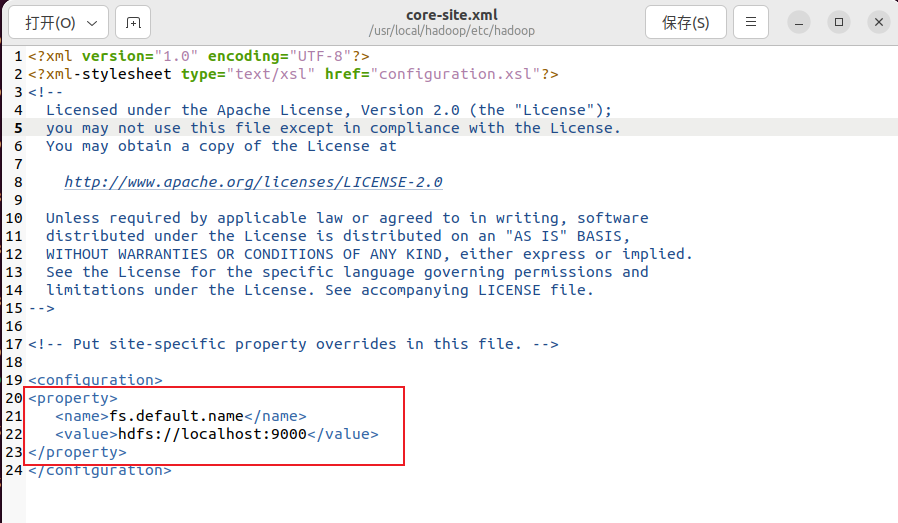

#### 7、编辑yarn-site.xml

- yarn-site.xml文件中含有MapReduce2（YARN）相关的配置设置。

- 在“终端”输入以下命令

    ```bash
    sudo gedit /usr/local/hadoop/etc/hadoop/yarn-site.xml
    ```

- 编辑yarn-site的配置

    ```xml
    <property>
       <name>yarn.nodemanager.aux-services</name>
       <value>mapreduce_shuffle</value>
    </property>
    <property>
       <name>yarn.nodemanager.aux-services.mapreduce.shuffle.class</name>
       <value>org.apache.hadoop.mapred.ShuffleHandler</value>
    </property>
    ```

    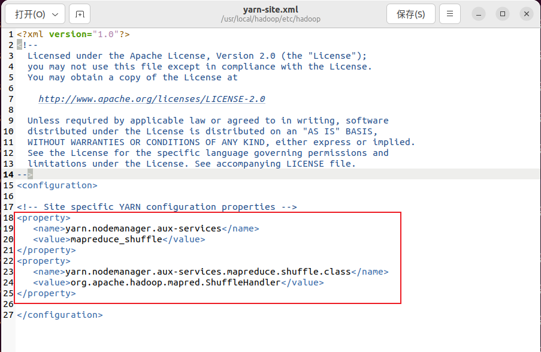

    修改完保存并关闭文件

#### 8、设置mapred-site.xml

- mapred-site.xml用于设置监控Map与Reduce程序的JobTracker任务分配情况以及TaskTracker任务运行情况。Hadoop提供了设置的模板文件，可以自行复制修改。

- 在“终端”输入以下命令，复制模板文件：由mapred-site.xml.template至mapred-site.xml

    ```bash
    sudo cp /usr/local/hadoop/etc/hadoop/mapred-site.xml.template /usr/local/hadoop/etc/hadoop/mapred-site.xml
    ```

    **hadoop-3.2.4没有这个模板文件，而是直接为mapred-site.xml，所以直接跳过这步**

- 在“终端”输入以下命令

    ```bash
    sudo gedit /usr/local/hadoop/etc/hadoop/mapred-site.xml
    ```

- 编辑mapred-site.xml的配置

    ```xml
    <property>
       <name>mapreduce.framework.name</name>
       <value>yarn</value>
    </property>
    ```

    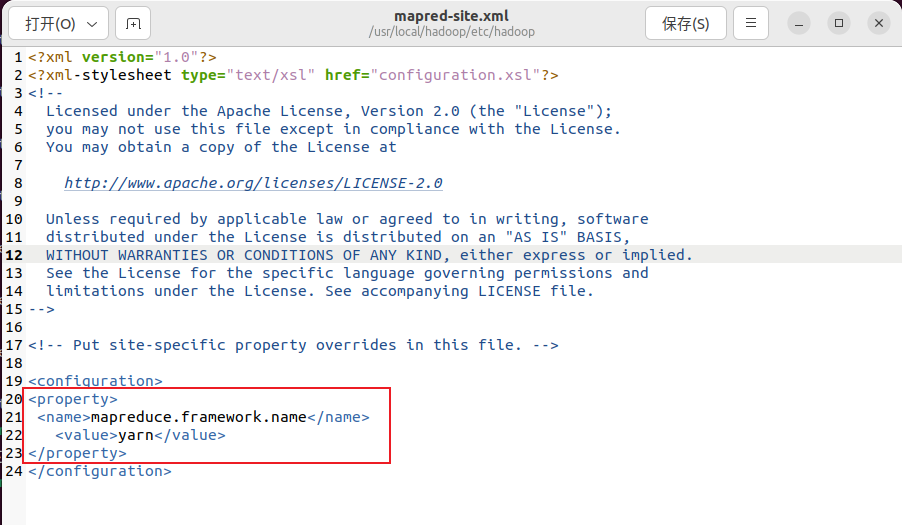

    修改完保存并关闭文件

#### 9、编辑hdfs-site.xml

- hdfs-site.xml用于设置HDFS分布式文件系统

- 在“终端”输入以下命令

    ```bash
    sudo gedit /usr/local/hadoop/etc/hadoop/hdfs-site.xml
    ```

- 输入以下内容：

    ```xml
    <property>
       <name>dfs.replication</name>
       <value>3</value>
    </property>
    <property>
       <name>dfs.namenode.name.dir</name>
       <value> file:/usr/local/hadoop/hadoop_data/hdfs/namenode</value>
    </property>
    <property>
       <name>dfs.datanode.data.dir</name>
       <value> file:/usr/local/hadoop/hadoop_data/hdfs/datanode</value>
    </property>
    ```

    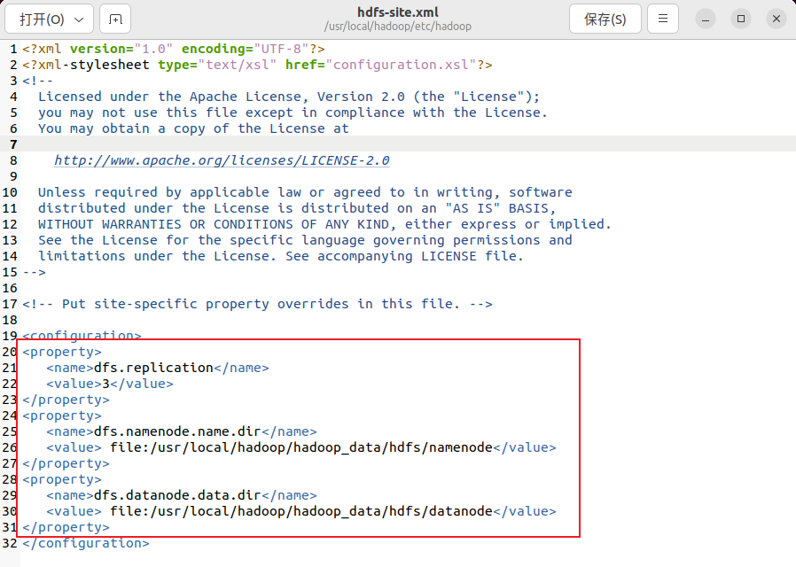

    > - 设置blocks副本备份数量
    >
    >     ```xml
    >     <property>
    >        <name>dfs.replication</name>
    >        <value>3</value>
    >     </property>
    >     ```
    >
    > - 设置NameNode数据存储目录
    >
    >     ```xml
    >     <property>
    >        <name>dfs.namenode.name.dir</name>
    >        <value> file:/usr/local/hadoop/hadoop_data/hdfs/namenode</value>
    >     </property>
    >     ```
    >
    > - 设置DataNode数据存储目录
    >
    >     ```xml
    >     <property>
    >        <name>dfs.datanode.data.dir</name>
    >        <value> file:/usr/local/hadoop/hadoop_data/hdfs/datanode</value>
    >     </property>
    >     ```

#### 10、创建并格式化HDFS目录

- 创建NameNode数据存储目录

    ```bash
    sudo mkdir -p /usr/local/hadoop/hadoop_data/hdfs/namenode
    ```

- 创建DataNode数据存储目录

    ```bash
    sudo mkdir -p /usr/local/hadoop/hadoop_data/hdfs/datanode
    ```

- 将Hadoop目录的所有者更改为hduser

    ```bash
    sudo chown hduser:hduser -R /usr/local/hadoop
    ```

- Linux是多人多任务的操作系统，所有的目录或文件都具有所有者。使用chown可以将目录或文件的所有者更改为hduser。

- 将HDFS进行格式化

    ```bash
    hadoop namenode -format
    ```

    > Note：如果你的HDFS已经有数据，可以执行以上HDFS格式化命令，这个操作会删除所有的数据。

#### 11、启动Hadoop

- 方法一：分别启动HDFS、YARN，使用 `start-dfs.sh` 启动HDFS、`start-yarn.sh` 启动YARN
- 方法二：同时启动HDFS、YARN，使用 `start-all.sh`

```bash
# 方法1
start-dfs.sh
start-yarn.sh

# 方法2
start-all.sh
```


关闭防火墙：

```bash
systemctl stop firewalld.service
systemctl disable firewalld.service
```


```bash
sudo ufw status
sudo ufw enable
sudo ufw disable
```


## CentOS7.5和hadoop3.1.3

### 1、安装VMware和CentOS7.5

- CentOS 7中已经自带VMtools，因此不用再单独安装

- 主机名：`hadoop100`


### 2、网络配置

#### 设置静态ip

**通过控制台命令修改：**

1. **进入IP配置文件**

```bash
vim /etc/sysconfig/network-scripts/ifcfg-ens33
```

2. **将启动协议由DHCP改成static**，由动态分配IP改为静态分配IP

    需要加上自定义的静态IP地址、网关、域名解析器。

```python
BOOTPROTO="static"

ONBOOT="yes" #系统启动的时候网络接口是否有效（yes/no）

# 在最后要加三项内容
#IP 地址
IPADDR=192.168.173.100
#网关
GATEWAY=192.168.173.10
#域名解析器
DNS1=192.168.173.10

#子网掩码
NETMASK=255.255.255.0 #默认就是这个，可以不加
```

3. **重启当前的网络环境**

```bash
service network restart
```


#### 修改主机名称

1. **查看当前的主机名**： 

    ```bash
    hostname
    ```

2. **通过文件修改主机名**：文件位置：`/etc/hostname`

    ```bash
    vim /etc/hostname
    ```

    需要重启生效。

    ```bash
    reboot
    ```

3. **快捷命令**： `hostnamectl`

    会显示出与主机名相关的系统信息。

    修改主机名：

```bash
hostnamectl set-hostname hadoop100(要修改的主机名)
```


#### 修改hosts映射文件

- 当主机设置了静态IP后，就可以通过hosts文件将hostname和ip关联起来，这样当我们需要访问这台服务器时，就只需要知道它的主机名，hosts文件会自动由主机名转化为对应的IP。

- 文件路径： `/etc/hosts`

```bash
vim /etc/hosts
```

- 添加信息：示例

```bash
192.168.173.100 hadoop100
192.168.173.101 hadoop101
192.168.173.102 hadoop102
192.168.173.103 hadoop103
192.168.173.104 hadoop104
```


#### 重启

```bash
reboot
```


### 3、配置Xshell

#### 下载Xshell

[家庭/学校免费 - NetSarang Website (xshell.com)](https://www.xshell.com/zh/free-for-home-school/)

#### 修改 windows 的主机映射文件（hosts文件）

输入IP地址和用户身份验证，即可连接虚拟机

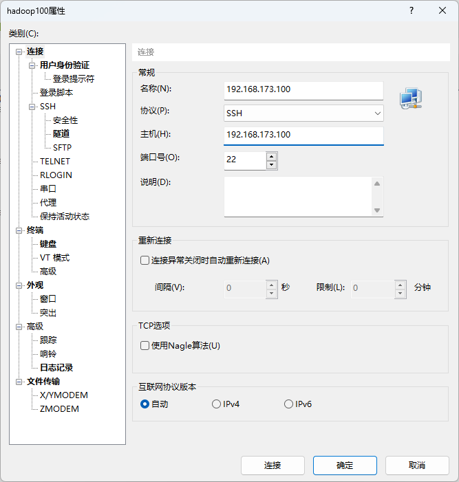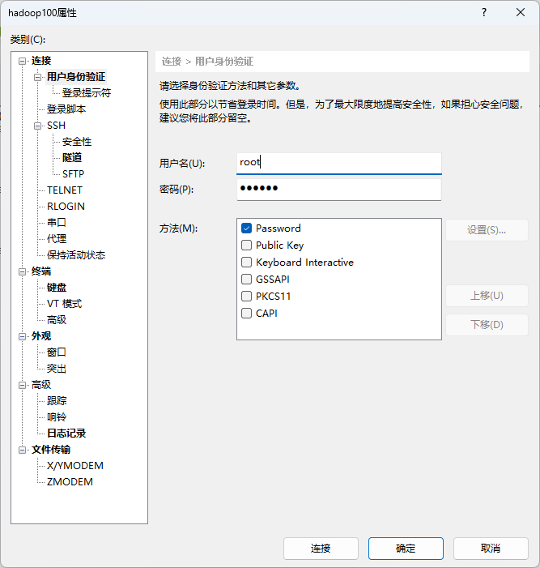

但是，使用这种输入 ip 的方式很不方便，可以通过设置映射，从而用名称代替 ip。

1. 进入文件路径，并打开 hosts 文件。

    ```bash
    C:\Windows\System32\drivers\etc
    ```

2. 打开 hosts 文件

    ```bash
    192.168.173.100 hadoop100
    192.168.173.101 hadoop101
    192.168.173.102 hadoop102
    192.168.173.103 hadoop103
    192.168.173.104 hadoop104
    ```

    


### 4、模板虚拟机环境准备

#### 安装 epel-release

注：Extra Packages for Enterprise Linux 是为“红帽系”的操作系统提供额外的软件包， 适用于 RHEL、CentOS 和 Scientific Linux。相当于是一个软件仓库，大多数 rpm 包在官方 repository 中是找不到的）

```bash
 yum install -y epel-release
```

- **注意：如果 Linux 安装的是最小系统版，还需要安装如下工具；如果安装的是 Linux 桌面标准版，不需要执行如下操作** 

➢ net-tool：工具包集合，包含 ifconfig 等命令

```bash
yum install -y net-tools  
```

➢ vim：编辑器 

```bash
yum install -y vim
```

#### 关闭防火墙

```bash
systemctl status firewalld
systemctl stop firewalld
systemctl disable firewalld.service
```

注意：在企业开发时，通常单个服务器的防火墙时关闭的。公司整体对外会设置非常安全的防火墙

#### 创建和配置atguigu用户

创建 atguigu 用户，并修改 atguigu 用户的密码 

```bash
useradd atguigu
passwd atguigu
```

配置 atguigu 用户具有 root 权限，方便后期加 sudo 执行 root 权限的命令

```bash
vim /etc/sudoers
```

修改/etc/sudoers 文件，在%wheel 这行下面添加一行，如下所示：

```bash
## Allow root to run any commands anywhere
root ALL=(ALL) ALL
## Allows people in group wheel to run all commands
%wheel ALL=(ALL) ALL
atguigu ALL=(ALL) NOPASSWD:ALL
```

> 注意：atguigu 这一行不要直接放到 root 行下面，因为所有用户都属于 wheel 组，你先配置了 atguigu 具有免密功能，但是程序执行到%wheel 行时，该功能又被覆盖回需要密码。所以 atguigu 要放到%wheel 这行下面。

#### 卸载虚拟机自带的 JDK

==注意：如果你的虚拟机是最小化安装不需要执行这一步。==

```bash
rpm -qa | grep -i java | xargs -n1 rpm -e --nodeps
```

➢ rpm -qa：查询所安装的所有 rpm 软件包 

➢ grep -i：忽略大小写 

➢ xargs -n1：表示每次只传递一个参数 

➢ rpm -e –nodeps：强制卸载软件

#### 重启

```bash
reboot
```


### 5、克隆虚拟机

右键—》管理—》克隆—》**创建完整克隆**

分别命名为hadoop102、hadoop103、hadoop104

#### 修改克隆虚拟机ip

以hadoop103为例

```bash
su root
vim /etc/sysconfig/network-scripts/ifcfg-ens33
```

只需修改IPADDR

```bash
IPADDR=192.168.173.103
```

#### 修改克隆虚拟机主机名

```bash
vim /etc/hostname
```

改为

```bash
hadoop103
```

#### 重启克隆机

```bash
reboot
```


### 6、在hadoop102安装JDK

1）卸载现有 JDK 注意：安装 JDK 前，一定确保提前删除了虚拟机自带的 JDK。

2）用 XShell 传输工具将 JDK 导入到 opt 目录下面的 software 文件夹下面

```bash
sudo mkdir /opt/software
sudo mkdir /opt/module
```

如果使用Xftp传输时显示失败，是因为权限的问题，可以切换root用户，也可更改目录属主：

```bash
sudo chown -R atguigu:atguigu software
```

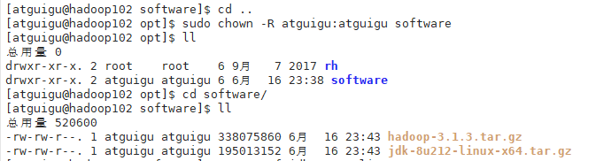

3）解压JDK

```bash
tar -zxvf jdk-8u212-linux-x64.tar.gz 
```

移动jdk到module目录

```bash
sudo mv /opt/software/jdk1.8.0_212 /opt/module/
```

4）配置环境变量

原本的配置目录：`sudo vim /etc/profile`

现在不这么配，因为里面的shell脚本配置了for循环，会遍历 `etc/profile.d` 目录下的所有后缀为 `.sh` 的文件，如下所示

```bash
for i in /etc/profile.d/*.sh /etc/profile.d/sh.local ; do
    if [ -r "$i" ]; then
        if [ "${-#*i}" != "$-" ]; then
            . "$i"
        else
            . "$i" >/dev/null
        fi
    fi
done
```

进入目录：

```bash
cd /etc/profile.d/
```

配置自己的my_env.sh脚本：

```bash
sudo vim my_env.sh
```

添加如下内容：

```bash
#JAVA_HOME
export JAVA_HOME=/opt/module/jdk1.8.0_212
export PATH=$PATH:$JAVA_HOME/bin
```

刷新配置：

```bash
source /etc/profile
```

查看是否配置成功：(出现java信息即成功)

```bash
java
```


### 7、在hadoop102安装hadoop

解压第5步传输的文件到module目录下：

```bash
sudo tar -zxvf hadoop-3.1.3.tar.gz -C /opt/module/
```

进入目录：

```bash
cd /opt/module/hadoop-3.1.3/
```

打印路径并复制：`/opt/module/hadoop-3.1.3`

```bash
pwd
```

修改自己配置的my_env.sh脚本：

```bash
sudo vim /etc/profile.d/my_env.sh
```

添加如下内容：

```bash
#HADOOP_HOME
export HADOOP_HOME=/opt/module/hadoop-3.1.3
export PATH=$PATH:$HADOOP_HOME/bin
export PATH=$PATH:$HADOOP_HOME/sbin
```

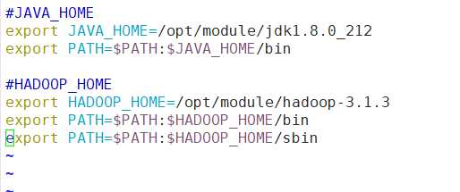

刷新配置文件：

```bash
source /etc/profile
```

查看是否配置成功：(出现hadoop信息即成功)

```bash
hadoop
```


### 8、Hadoop的目录结构

```bash
[atguigu@hadoop102 hadoop-3.1.3]$ ll
总用量 176
drwxr-xr-x. 2 atguigu atguigu    183 9月  12 2019 bin
drwxr-xr-x. 3 atguigu atguigu     20 9月  12 2019 etc
drwxr-xr-x. 2 atguigu atguigu    106 9月  12 2019 include
drwxr-xr-x. 3 atguigu atguigu     20 9月  12 2019 lib
drwxr-xr-x. 4 atguigu atguigu    288 9月  12 2019 libexec
-rw-rw-r--. 1 atguigu atguigu 147145 9月   4 2019 LICENSE.txt
-rw-rw-r--. 1 atguigu atguigu  21867 9月   4 2019 NOTICE.txt
-rw-rw-r--. 1 atguigu atguigu   1366 9月   4 2019 README.txt
drwxr-xr-x. 3 atguigu atguigu   4096 9月  12 2019 sbin
drwxr-xr-x. 4 atguigu atguigu     31 9月  12 2019 share
```

重要目录:

| 目录  | 作用                                                       |
| ----- | ---------------------------------------------------------- |
| bin   | 存放对 Hadoop 相关服务（hdfs，yarn，mapred）进行操作的脚本 |
| etc   | Hadoop 的配置文件目录，存放 Hadoop 的配置文件              |
| lib   | 存放 Hadoop 的本地库（对数据进行压缩解压缩功能）           |
| sbin  | 存放启动或停止 Hadoop 相关服务的脚本                       |
| share | 存放 Hadoop 的依赖 jar 包、文档、和官方案例                |


### 9、Hadoop 运行模式

1）Hadoop 官方网站：http://hadoop.apache.org/ 

2）Hadoop 运行模式包括：**本地模式、伪分布式模式以及完全分布式模式。** 

-  ==本地模式==：单机运行，只是用来演示一下官方案例。生产环境不用。

- ==伪分布式模式==：也是单机运行，但是具备 Hadoop 集群的所有功能，一台服务器模 拟一个分布式的环境。个别缺钱的公司用来测试，生产环境不用。

- ==完全分布式模式==：多台服务器组成分布式环境。生产环境使用。

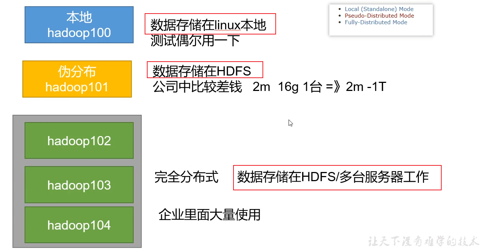

#### 本地模式

进入hadoop目录下：

```bash
cd /opt/module/hadoop-3.1.3
```

创建在 hadoop-3.1.3 文件下面创建一个 wcinput 文件夹：

```bash
mkdir wcinput
```

在 wcinput 文件下创建一个 word.txt 文件：

```bash
cd wcinput
vim word.txt
```

在文件中输入如下内容：

```bash
hadoop yarn
hadoop mapreduce
atguigu
atguigu
```

回到 Hadoop 目录/opt/module/hadoop-3.1.3

```bash
cd /opt/module/hadoop-3.1.3
```

执行程序

```bash
hadoop jar 
share/hadoop/mapreduce/hadoop-mapreduce-examples-3.1.3.jar 
wordcount wcinput wcoutput
```


查看结果

```bash
cat part-r-00000
```

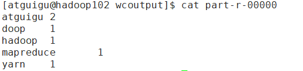

> 再次执行上述程序会报错，因为输出路径不能存在。


#### 完全分布式

分析：

1）准备 3 台客户机（==关闭防火墙、静态 IP、主机名称==） 

2）安装 JDK 

3）配置环境变量 

4）安装 Hadoop 

5）配置环境变量 

6）配置集群

7）单点启动 

8）配置 ssh 

9）群起并测试集群

### 10、完全分布式运行模式

需要前完成前面的虚拟机准备工作

#### 编写集群分发脚本 xsync

**1）scp（secure copy）==安全拷贝==**

- scp 定义

    scp 可以实现服务器与服务器之间的数据拷贝。（from server1 to server2）

- 基本语法

    scp      -r          \$pdir/\$fname ​                            \$user@​\$host:\$pdir/​\$fname 

    命令    递归      要拷贝的文件路径/名称             目的地用户@主机:目的地路径/名称

- 案例实操

    前提：在 hadoop102、hadoop103、hadoop104 都==**已经创建好的/opt/module、  /opt/software 两个目录，并且已经把这两个目录修改为 atguigu:atguigu**==

    ```bash
    sudo chown atguigu:atguigu -R /opt/module
    ```

    **在 hadoop102 上**，将 hadoop102 中/opt/module/jdk1.8.0_212 目录拷贝到 hadoop103 上。（传数据）

    ```bash
    scp -r /opt/module/jdk1.8.0_212 atguigu@hadoop103:/opt/module
    ```

    **在 hadoop103 上**，将 hadoop102 中/opt/module/hadoop-3.1.3 目录拷贝到 hadoop103 上。（拉数据）

    ```bash
    scp -r atguigu@hadoop102:/opt/module/hadoop-3.1.3 /opt/module/
    ```

    在 **hadoop103** 上操作，将 **hadoop102** 中/opt/module 目录下所有目录拷贝到 **hadoop104** 上。（中介）

    ```bash
    scp -r atguigu@hadoop102:/opt/module/* atguigu@hadoop104:/opt/module
    ```

> scp命令是Linux/Unix系统中的一种常用命令，其全称为secure copy，可以实现在不同主机之间复制文件和目录。与cp命令不同的是，scp命令支持在网络间进行文件传输，并可以通过ssh协议进行加密传输，保证了文件传输的安全性。
>
> 常用的scp命令选项包括：
>
> - -r：递归复制目录及其内容；
> - -P：指定远程主机的端口号；
> - -p：保留源文件的原有修改时间、访问时间和权限等属性；
> - -q：不显示传输进度等详细信息

**2）rsync ==远程同步工具==**

remote synchronization（远程同步）。rsync 主要用于备份和镜像。具有速度快、避免复制相同内容和支持符号链接的优点。 

==rsync 和 scp 区别==：用 rsync 做文件的复制要比 scp 的速度快，**rsync 只对差异文件做更新**。scp 是把所有文件都复制过去。

- 基本语法

    rsync        -av                 \$pdir/\$fname ​                        \$user@​\$host:\$pdir/​\$fname 

    命令          选项参数       要拷贝的文件路径/名称         目的地用户@主机:目的地路径/名称

选项参数说明 

| 选项 | 功能         |
| ---- | ------------ |
| -a   | 归档拷贝     |
| -v   | 显示复制过程 |

- 案例实操

    删除 hadoop103 中/opt/module/hadoop-3.1.3/wcinput

    ```bash
    rm -rf wcinput/
    ```

    同步 hadoop102 中的/opt/module/hadoop-3.1.3 到 hadoop103

    ```bash
    rsync -av hadoop-3.1.3/ atguigu@hadoop103:/opt/module/hadoop-3.1.3/
    ```

**3）xsync ==集群分发脚本==**

- 需求：循环复制文件到所有节点的相同目录下

- 需求分析：

    rsync 命令原始拷贝：

    ```bash
    rsync -av /opt/module atguigu@hadoop103:/opt/
    ```

    期望脚本：

    xsync 要同步的文件名称

    期望脚本在任何路径都能使用（脚本放在声明了全局环境变量的路径）

    ```bash
    [atguigu@hadoop102 ~]$ echo $PATH
    /usr/local/bin:/usr/bin:/usr/local/sbin:/usr/sbin:/opt/module/jdk1.8.0_212/bin:/opt/module/hadoop-3.1.3/bin:/opt/module/hadoop-3.1.3/sbin:/home/atguigu/.local/bin:/home/atguigu/bin
    ```

    > 最后部分，用户的bin目录在PATH中

- 脚本实现

    在/home/atguigu/bin 目录下创建 xsync 文件

    ```bash
    [atguigu@hadoop102 module]$ cd /home/atguigu/
    [atguigu@hadoop102 ~]$ mkdir bin
    [atguigu@hadoop102 ~]$ cd bin
    [atguigu@hadoop102 bin]$ vim xsync
    ```

    在该文件中编写如下代码

    [28_尚硅谷_Hadoop_入门_xsync分发脚本_哔哩哔哩_bilibili](https://www.bilibili.com/video/BV1Qp4y1n7EN/?p=28&spm_id_from=pageDriver&vd_source=9ee4e4e88a104cb8b17a1c0f21495c43)

    ```bash
    #!/bin/bash
    
    #1. 判断参数个数
    if [ $# -lt 1 ]
    then
    	echo Not Enough Arguement!
    	exit;
    fi
    
    #2. 遍历集群所有机器
    for host in hadoop102 hadoop103 hadoop104
    do
    	echo ==================== $host ====================
    	#3. 遍历所有目录，挨个发送
    	for file in $@
    	do
            #4. 判断文件是否存在
            if [ -e $file ]
                then
                #5. 获取父目录
                pdir=$(cd -P $(dirname $file); pwd)
                
                #6. 获取当前文件的名称
                fname=$(basename $file)
                ssh $host "mkdir -p $pdir"
                rsync -av $pdir/$fname $host:$pdir
            else
            	echo $file does not exists!
            fi
        done
    done
    ```

- 修改脚本 xsync 具有执行权限

    ```bash
    chmod 777 xsync
    ```

- 测试脚本

    ```bash
    xsync /home/atguigu/bin
    ```

- 同步环境变量

    方法1：将脚本复制到/bin 中，以便全局调用

    ```bash
    [atguigu@hadoop102 bin]$ sudo cp xsync /bin/
    ```

    方法2：指定xsync路径

    同步环境变量配置（root 所有者）

    ```bash
    [atguigu@hadoop102 ~]$ sudo ./bin/xsync /etc/profile.d/my_env.sh
    ```

    ==注意：如果用了 sudo，那么 xsync 一定要给它的路径补全。==

- 让环境变量生效

    ```bash
    [atguigu@hadoop103 bin]$ source /etc/profile
    [atguigu@hadoop104 opt]$ source /etc/profile
    ```

    

####  SSH 无密登录配置

- 基本语法 

    ssh 另一台电脑的 IP 地址

- 无密钥配置

    生成公钥和私钥

    ```bash
    [atguigu@hadoop102 ~]$ cd /home/atguigu/.ssh/
    [atguigu@hadoop102 .ssh]$ ssh-keygen -t rsa
    ```

    然后**敲（三个回车）**，就会生成两个文件 id_rsa（私钥）、id_rsa.pub（公钥）

- 将公钥拷贝到要免密登录的目标机器上

    ```bash
    [atguigu@hadoop102 .ssh]$ ssh-copy-id hadoop102
    [atguigu@hadoop102 .ssh]$ ssh-copy-id hadoop103
    [atguigu@hadoop102 .ssh]$ ssh-copy-id hadoop104
    ```

    注意： 

    还需要在 hadoop103 上采用 atguigu 账号配置一下无密登录到 hadoop102、hadoop103、 hadoop104 服务器上。 

    还需要在 hadoop104 上采用 atguigu 账号配置一下无密登录到 hadoop102、hadoop103、 hadoop104 服务器上。 

    **还需要在 hadoop102 上采用 root 账号**，配置一下无密登录到 hadoop102、hadoop103、 hadoop104；

- .ssh 文件夹下（~/.ssh）的文件功能解释

    | known_hosts     | 记录 ssh 访问过计算机的公钥（public key） |
    | --------------- | ----------------------------------------- |
    | id_rsa          | 生成的私钥                                |
    | id_rsa.pub      | 生成的公钥                                |
    | authorized_keys | 存放授权过的无密登录服务器公钥            |

    

#### 集群配置

**1）集群部署规划** 

注意： 

➢ NameNode 和 SecondaryNameNode 不要安装在同一台服务器 

➢ ResourceManager 也很消耗内存，不要和 NameNode、SecondaryNameNode 配置在 同一台机器上。

|      | hadoop102                  | hadoop103                            | hadoop104                           |
| ---- | -------------------------- | ------------------------------------ | ----------------------------------- |
| HDFS | ==NameNode==<br />DataNode | <br />DataNode                       | ==SecondaryNameNode==<br />DataNode |
| YARN | <br />NodeManager          | ==ResourceManager==<br />NodeManager | NodeManager                         |

**2）配置文件说明** 

Hadoop 配置文件分两类：**默认配置文件和自定义配置文件**，只有用户想修改某一默认配置值时，才需要修改自定义配置文件，更改相应属性值。

（1）默认配置文件：

| 要获取的默认文件     | 文件存放在 Hadoop 的 jar 包中的位置                       |
| -------------------- | --------------------------------------------------------- |
| [core-default.xml]   | hadoop-common-3.1.3.jar/core-default.xml                  |
| [hdfs-default.xml]   | hadoop-hdfs-3.1.3.jar/hdfs-default.xml                    |
| [yarn-default.xml]   | hadoop-yarn-common-3.1.3.jar/yarn-default.xml             |
| [mapred-default.xml] | hadoop-mapreduce-client-core-3.1.3.jar/mapred-default.xml |

（2）自定义配置文件： 

**core-site.xml、hdfs-site.xml、yarn-site.xml、mapred-site.xml** 四个配置文件存放在 $HADOOP_HOME/etc/hadoop 这个路径上，用户可以根据项目需求重新进行修改配置。

**3）配置集群**

（1）核心配置文件 

==配置 core-site.xml==

```bash
[atguigu@hadoop102 ~]$ cd $HADOOP_HOME/etc/hadoop
[atguigu@hadoop102 hadoop]$ vim core-site.xml
```

文件内容如下：

```xml
<?xml version="1.0" encoding="UTF-8"?>
<?xml-stylesheet type="text/xsl" href="configuration.xsl"?>

<configuration>
    <!-- 指定 NameNode 的地址 -->
    <property>
        <name>fs.defaultFS</name>
        <value>hdfs://hadoop102:8020</value>
    </property>
    
    <!-- 指定 hadoop 数据的存储目录 -->
    <property>
        <name>hadoop.tmp.dir</name>
        <value>/opt/module/hadoop-3.1.3/data</value>
    </property>
    
    <!-- 配置 HDFS 网页登录使用的静态用户为 atguigu -->
    <property>        
        <name>hadoop.http.staticuser.user</name>
        <value>atguigu</value>
    </property>
</configuration>
```

（2）HDFS 配置文件 

==配置 hdfs-site.xml==

```bash
[atguigu@hadoop102 hadoop]$ vim hdfs-site.xml
```

文件内容如下：

```xml
<?xml version="1.0" encoding="UTF-8"?>
<?xml-stylesheet type="text/xsl" href="configuration.xsl"?>

<configuration>
	<!-- nn web 端访问地址-->
	<property>
		<name>dfs.namenode.http-address</name>
		<value>hadoop102:9870</value>
	</property>
	<!-- 2nn web 端访问地址-->
	<property>
		<name>dfs.namenode.secondary.http-address</name>
		<value>hadoop104:9868</value>
	</property>
</configuration>
```

（3）YARN 配置文件 

==配置 yarn-site.xml==

```bash
[atguigu@hadoop102 hadoop]$ vim yarn-site.xml
```

文件内容如下：

```xml
<?xml version="1.0" encoding="UTF-8"?>
<?xml-stylesheet type="text/xsl" href="configuration.xsl"?>

<configuration>
    <!-- 指定 MR 走 shuffle -->
    <property>
        <name>yarn.nodemanager.aux-services</name>
        <value>mapreduce_shuffle</value>
    </property>
    
    <!-- 指定 ResourceManager 的地址-->
    <property>
        <name>yarn.resourcemanager.hostname</name>
        <value>hadoop103</value>
    </property>
    
    <!-- 环境变量的继承 -->
    <property>
    	<name>yarn.nodemanager.env-whitelist</name>
   <value>JAVA_HOME,HADOOP_COMMON_HOME,HADOOP_HDFS_HOME,HADOOP_CONF_DIR,CLASSPATH_PREPEND_DISTCACHE,HADOOP_YARN_HOME,HADOOP_MAPRED_HOME</value>
    </property>
</configuration>
```

（4）MapReduce 配置文件 

==配置 mapred-site.xml==

```bash
[atguigu@hadoop102 hadoop]$ vim mapred-site.xml
```

文件内容如下：

```xml
<?xml version="1.0" encoding="UTF-8"?>
<?xml-stylesheet type="text/xsl" href="configuration.xsl"?>

<configuration>
    <!-- 指定 MapReduce 程序运行在 Yarn 上 -->
    <property>
        <name>mapreduce.framework.name</name>
        <value>yarn</value>
    </property>
</configuration>
```

4）在集群上分发配置好的 Hadoop 配置文件

```bash
[atguigu@hadoop102 hadoop]$ xsync /opt/module/hadoop-3.1.3/etc/hadoop/
```

5）去 103 和 104 上查看文件分发情况

```bash
[atguigu@hadoop103 ~]$ cat /opt/module/hadoop-3.1.3/etc/hadoop/core-site.xml
[atguigu@hadoop104 ~]$ cat /opt/module/hadoop-3.1.3/etc/hadoop/core-site.xml
```


#### 群起集群

**1）配置 workers**

```bash
[atguigu@hadoop102 hadoop]$ vim /opt/module/hadoop-3.1.3/etc/hadoop/workers
```

在该文件中增加如下内容：

```bash
hadoop102
hadoop103
hadoop104
```

**==注意：该文件中添加的内容结尾不允许有空格，文件中不允许有空行。==**

同步所有节点配置文件

```bash
[atguigu@hadoop102 hadoop]$ xsync /opt/module/hadoop-3.1.3/etc
```

**2）启动集群**

​		（1）如果集群是第一次启动，需要在 hadoop102 节点格式化 NameNode（==注意：格式化 NameNode，会产生新的集群 id，导致 NameNode 和 DataNode 的集群 id 不一致，集群找不到已往数据。如果集群在运行过程中报错，需要重新格式化 NameNode 的话，一定要先停止 namenode 和 datanode 进程，并且要删除所有机器的 data 和 logs 目录，然后再进行格式化。==）

```bash
[atguigu@hadoop102 hadoop-3.1.3]$ hdfs namenode -format
```

​		（2）启动 HDFS

```bash
[atguigu@hadoop102 hadoop-3.1.3]$ sbin/start-dfs.sh
```

​		（3）==**在配置了 ResourceManager 的节点（hadoop103）**==启动 YARN

```bash
[atguigu@hadoop103 hadoop-3.1.3]$ sbin/start-yarn.sh
```

​		（4）Web 端查看 HDFS 的 NameNode 

​				（a）浏览器中输入：http://hadoop102:9870 

​				（b）查看 HDFS 上存储的数据信息 

​		（5）Web 端查看 YARN 的 ResourceManager 

​				（a）浏览器中输入：http://hadoop103:8088 

​				（b）查看 YARN 上运行的 Job 信息

> 初始化完成之后，在路径 /opt/module/hadoop-3.1.3 下多了两个文件夹，data 和 logs 

**3）集群基本测试**

​		（1）上传文件到集群 

​			➢ 上传小文件

```bash
[atguigu@hadoop102 ~]$ hadoop fs -mkdir /input
[atguigu@hadoop102 ~]$ hadoop fs -put $HADOOP_HOME/wcinput/word.txt /input
```

​			➢ 上传大文件

```bash
[atguigu@hadoop102 ~]$ hadoop fs -put /opt/software/jdk-8u212-linux-x64.tar.gz /
```

​		（2）上传文件后查看文件存放在什么位置

​			➢ 查看 HDFS 文件存储路径

```bash
[atguigu@hadoop102 subdir0]$ pwd
/opt/module/hadoop-3.1.3/data/dfs/data/current/BP-314497982-192.168.173.102-1687138219317/current/finalized/subdir0/subdir0
[atguigu@hadoop102 subdir0]$ cat blk_1073741825
doop yarn
hadoop mapreduce
atguigu
atguigu
```

​		（3）拼接 

​				-rw-rw-r--. 1 atguigu atguigu 134217728 5 月 23 16:01 blk_1073741836 

​				-rw-rw-r--. 1 atguigu atguigu 1048583 5 月 23 16:01 blk_1073741836_1012.meta 

​				-rw-rw-r--. 1 atguigu atguigu 63439959 5 月 23 16:01 blk_1073741837 

​				-rw-rw-r--. 1 atguigu atguigu 495635 5 月 23 16:01 blk_1073741837_1013.meta

```bash
[atguigu@hadoop102 subdir0]$ cat blk_1073741836>>tmp.tar.gz
[atguigu@hadoop102 subdir0]$ cat blk_1073741837>>tmp.tar.gz
[atguigu@hadoop102 subdir0]$ tar -zxvf tmp.tar.gz
```

​		（4）下载

```bash
[atguigu@hadoop104 software]$ hadoop fs -get /jdk-8u212-linux-x64.tar.gz ./
```

​		（5）执行 wordcount 程序

```bash
[atguigu@hadoop102 hadoop-3.1.3]$ hadoop jar share/hadoop/mapreduce/hadoop-mapreduce-examples-3.1.3.jar wordcount /input /output
```


## Hadoop 基本命令

### 基本语法

hadoop fs 和 hdfs dfs（**hadoop fs**和**hdfs dfs**命令等效。）

- hdfs dfs 只能操作HDFS文件系统
- hadoop fs 可操作任意文件系统，不仅仅是hdfs文件系统，使用范围更广

### 启动命令

```bash
# 启动namenode，datanode，启动文件系统
start-dfs.sh 
# 关闭文件系统
stop-dfs.sh 
# 启动resourcemanager,nodemanager
start-yarn.sh 
# 关闭resourcemanager,nodemanager
stop-yarn.sh 
# 启动hdfs，yarn
start-all.sh 
# 关闭hdfs，yarn
stop-all.sh 
```


### 上传

```bash
# 上传命令
# 从本地剪切粘贴到HDFS
hadoop fs -moveFromLocal 
# 从本地拷贝文件到HDFS
hadoop fs -copyFromLocal
# 同copyFromLocal
hadoop fs -put
# 追加一个文件到已经存在的文件末尾
hadoop fs -appendToFile
```

### 下载

```bash
# 从HDFS拷贝到本地
hadoop fs -copyToLocal
# 等同于copyToLocal，生产环境更习惯用get
hadoop fs -get
```

### 增删改

```bash
# 增
# 创建路径
hadoop fs -mkdir

# 删
# 删除文件或文件夹
hadoop fs -rm
# 递归删除目录及目录里面内容（非空目录）
hadoop fs -rm -r
# 只能删除空目录
hadoop fs -rmdir

# 改
# Linux文件系统中的用法一样，修改文件所属权限
hadoop fs -chgrp
hadoop fs -chmod
hadoop fs -chown
# 从HDFS的一个路径拷贝到HDFS的另一个路径（注意区别-put）
hadoop fs -cp
# 在HDFS目录中移动文件（注意区别-get）
hadoop fs -mv
# 设置HDFS中文件的副本数量 
hadoop fs -setrep
hadoop fs -setrep 副本数量 <path>
```

### 查

```bash
# 显示目录信息
hadoop fs -ls
# 显示文件内容
hadoop fs -cat
# 显示一个文件的末尾1kb的数据（一般用于查看日志）
hadoop fs -tail
# 统计文件系统的容量、可用空间和已用空间信息
hadoop fs -df
# 统计文件夹的大小信息
hadoop fs -du
hadoop fs -df [-h] <path>
# 命令用于统计指定目录下的目录数、文件数、字节数
hadoop fs -count
hadoop fs -count [-h] <path>  (-h 参数使用便于操作人员读取单位信息格式)
```


