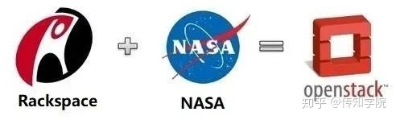

# OpenStack

参考文献：

[不懂OpenStack？看这篇就够了！ - 知乎 (zhihu.com)](https://zhuanlan.zhihu.com/p/151323403)

## 1、OpenStack的起源

OpenStack是Rackspace和NASA共同成立的一个开发项目。

- Rackspace：这家公司一直在做和亚马逊一样的云主机和云储存服务。

    具体说来，Rackspace其实是与亚马逊的云计算平台竞争！可Rackspace始终都干不过亚马逊，排名第二。于是Rackspace一气之下，干脆就把它们的云储存服务给开源了。

- NASA：这不，无独不成偶，NASA（美国国家航空总局）在云计算方面的研究也是心力交瘁。投入大量资金不说，他们还发现云计算好像不是他们应该干的事。此外，还有一个原因是NASA和Eucalyptus云计算管理平台闹不合，于是NASA一气之下也要开源。

故事的结局就是：NASA和Rackspace一起开放源代码！

当然，Rackspace和NASA并不是简单地代码一丢完事，而是联手共同成立了OpenStack这个开源项目。

OpenStack是一种基础架构解决方案，用于满足各种规模的可扩展公共云和私有云的需求。

## 2、OpenStack概述

### 2.1 OpenStack任务

- OpenStack 是典型的 **IaaS(基础设施即服务) 模式**的云平台。既然是典型的基础设施服务方面的云平台，那么，它的首要任务就很明显了：管理基础设施资源，便于用户的调用和使用。
- 基础设施资源包括：计算（CPU）、存储（硬盘）、网络（网卡）

### 2.2 OpenStack的硬件组成

- **Controller Node+Network Node+Compute Node** 这三节点是OpenStack的最小结构。

看一看—— “生产环境中，通常应用较多的部署组件图”：

我们大概看一下，这四大节点，都是干什么的？

- **控制节点：**主要负责对整个云平台所有节点的管理和控制，包括虚拟机创建时节点的选择，网络和存储资源的分配等。里面包含着核心组件如图所示，有—Keystone、Glance、Swift 等（核心组件的讲解放在下面单独讲）
- **计算节点：**负责对虚拟机的运行提供硬件支持。
- **网络节点：**主要负责对网络通信功能的控制管理。包括各节点直接的通信、虚拟机之间的通信以及云平台与外网的通信等。
- **存储节点：**则负责对虚拟机存储资源的管理，通常包括**块存储和对象存储**。

上面的图是硬件的部署图，我们再看一下架构工作的流程图：

## 3、OpenStack核心组件

OpenStack 的组件主要包括**身份认证（代号 Keystone）、计算（代号为 Nova），网络管理（代号 Neutron）、块存储（代号 Cinder）、对象存储（代号为 Swift）、镜像服务（代号 Glance）以及 UI 服务（代号 Horizon），还有其他多种可选组件。**

|  组件名  |   代号   |
| :------: | :------: |
| 身份认证 | Keystone |
|   计算   |   Nova   |
| 网络管理 | Neutron  |
|  块存储  |  Cinder  |
| 对象存储 |  Swift   |
| 镜像服务 |  Glance  |
| UI 服务  | Horizon  |

首先，先按照服务类型的不同可以分为如下四类：**基础服务、存储服务、共享服务、后台服务**。

Q:具体这四大类，是干什么的？

A:

基础服务：实现 OpenStack 基本功能所需部署的，提供基础功能的组件。

存储服务：顾名思义，就是与数据存储相关的部件。OpenStack支持多种数据存储方式。包括**对象存储、块存储、共享文件**等等。

共享服务：包括为其他组件提供公共服务的组件。

后台服务：平台需要的服务支撑，对用户是透明的。

1. **基础服务—组件：Horizon、Nova、Neutron**

    核心的基础组件就3个：Horizon、计算Nova、网络Neutron

    「Horizon」：web方式管理云平台，建云主机，分配网络，配安全组，加云盘。

    「Nova」：负责响应虚拟机创建的请求、调度、销毁云主机

    「Neutron」：实现SDN（软件定义网络），提供一整套API，用户可以基于该API实现自己定义专属网络，不同厂商可以基于此API提供自己的产品实现

2. **存储服务—组件：Swift、Cinder、Manila**

    核心的存储组件就2个：对象存储Swift、块存储Cinder

    「Swift」：REST风格的接口和扁平的数据组织结构。

    「Cinder」：提供持久化块存储，即为云主机提供附加云盘。

3. **共享服务—组件：Keystone、Glance、Ceilometer**

    核心的共享组件就3个：认证服务 Keystone、镜像服务 Glance、计费服务 Ceilometer

    「Keystone」：为访问 OpenStack 各组件提供认证和授权功能。

    「Glance」：为云主机安装操作系统提供不同的镜像选择。

    「Ceilometer」：收集云平台资源使用数据，用来计费性能监控。

4. **后台服务—组件：Mariadb、RabbitMQ、memcached**

