# Linux基础

## 1、基础知识

 

​		Linux内核最初只是由芬兰人林纳斯 · 托瓦斯（Linus Torvalds）在赫尔辛基大学上学时出于个人爱好而编写的。

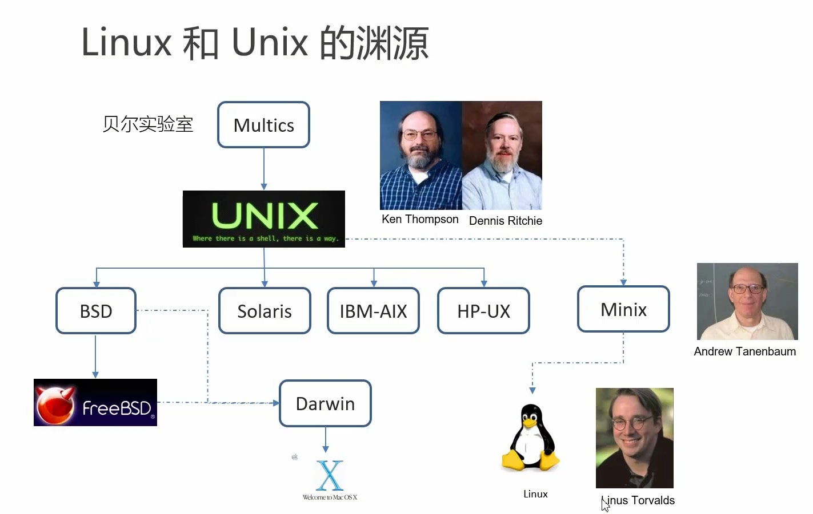

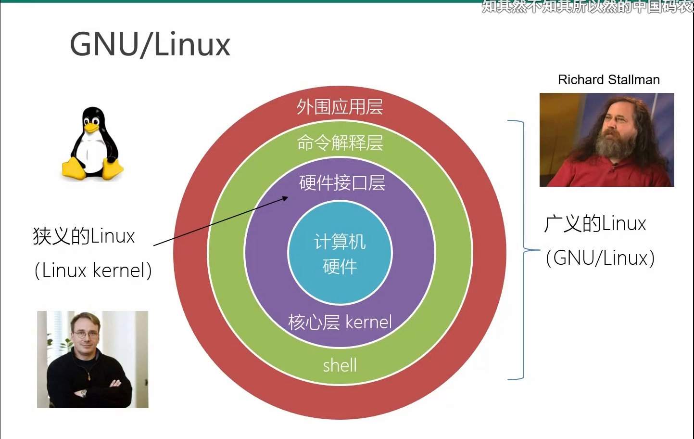

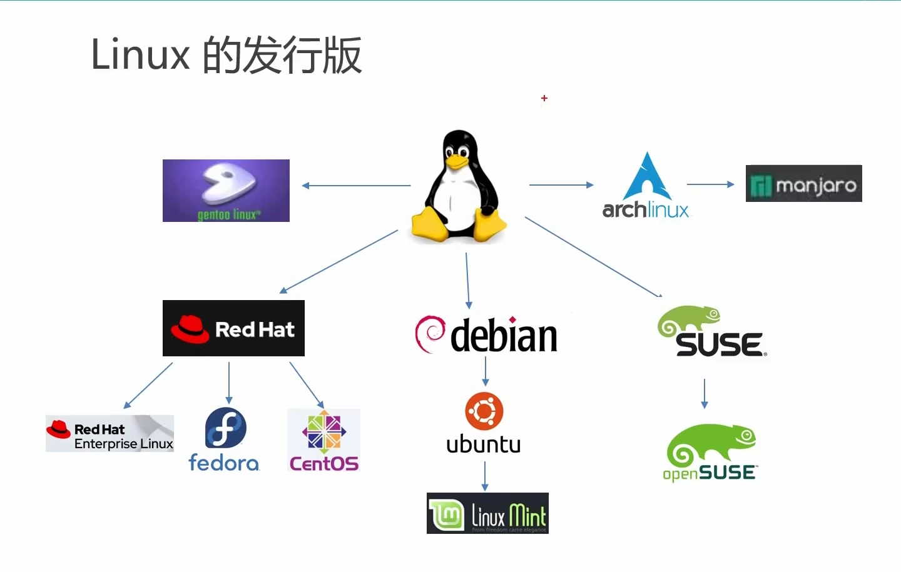

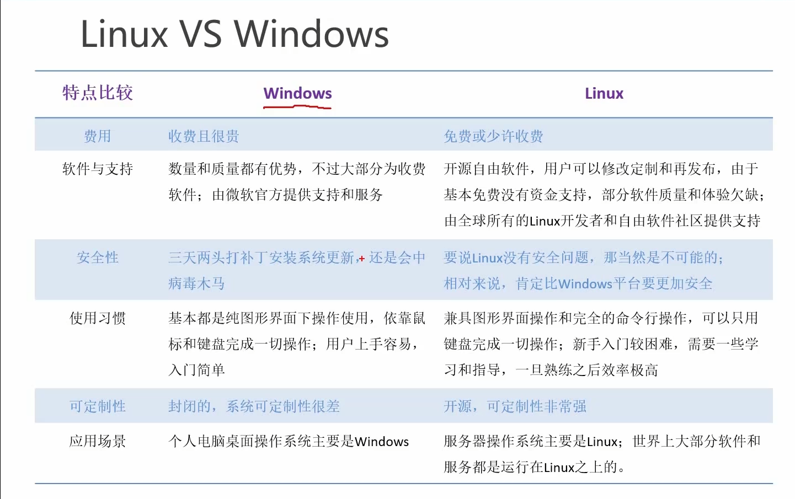


==**切换终端：Ctrl+Alt+F1~F6**==


## 2、Linux 文件系统与目录结构

​		==Linux系统中一切皆文件==

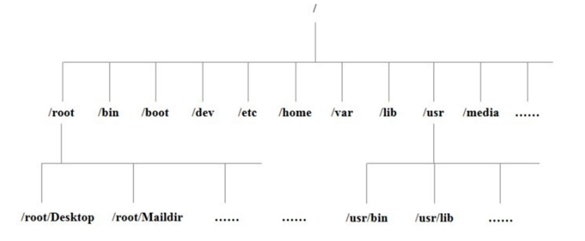

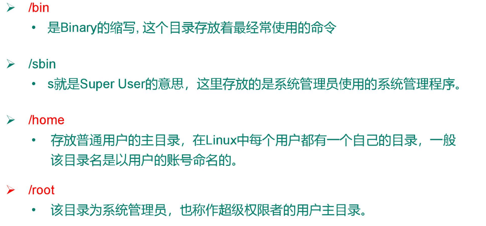

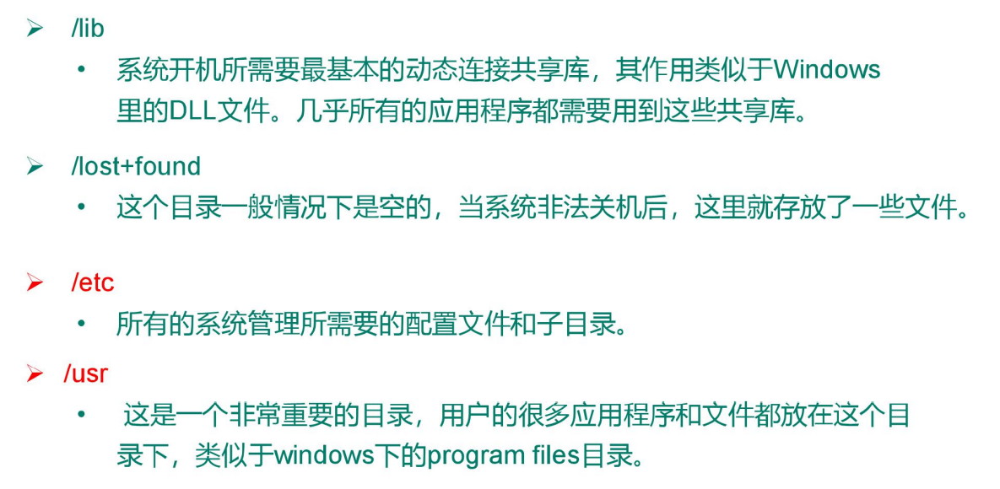

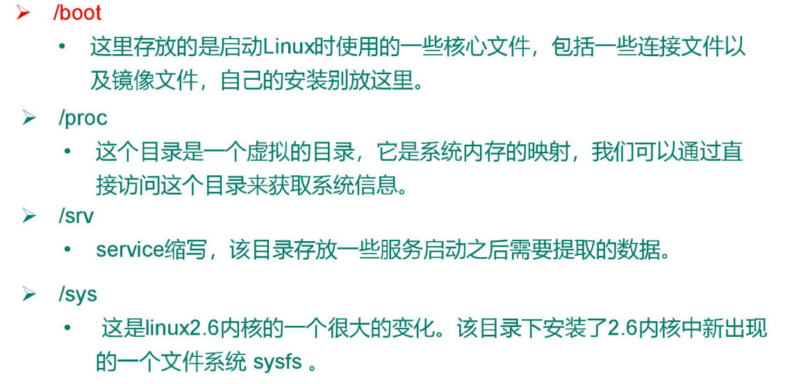


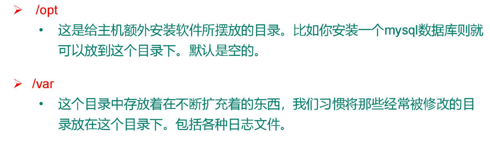

| 文件夹    | 全称                 | 中文名         | 作用                                                         | link       |
| --------- | -------------------- | -------------- | ------------------------------------------------------------ | ---------- |
| /bin      | binary               | 二进制命令     | 存放可以直接执行的命令                                       | /usr/bin   |
| /sbin     | system binary        | 系统二进制命令 | 存放超级管理员可以直接指行的命令                             | /usr/sbin  |
| /lib      | library              | 库目录         | 系统和应用程序所需要的的一些共享库文件（相当于Windows下的dll文件） | /usr/lib   |
| /lib64    |                      |                |                                                              | /usr/lib64 |
| ==/usr==  | Unix System Resource | Unix系统资源   | 类似于windows下的program files目录                           |            |
| ==/boot== |                      |                | Linux启动的核心文件，包括cpu等硬件设备的映射                 |            |
| ==/etc==  |                      |                | 系统管理所需要的的一些配置文件和子目录                       |            |
| /home     |                      |                | 存放普通用户的主目录，                                       |            |
| ==/root== |                      |                | 系统管理员的主目录                                           |            |
| /opt      | optional             | 可选目录       | 可以存放自己下载的第三方软件                                 |            |
| /media    |                      | 媒体           | U盘和光驱的默认挂载目录，可移动媒体设备的挂载点              |            |
| /mnt      | mount                |                | 也是一个挂载目录                                             |            |
| /proc     | process              | 进程           | 是Linux的一个虚拟目录，是系统内存的映射                      |            |
| /run      |                      | 运行           | 存放系统运行以来的实时信息，临时的文件系统，重启丢失         |            |
| /srv      | service              | 服务           | 存放系统服务相关的信息                                       |            |
| /sys      | system               | 系统           | 存放系统硬件信息                                             |            |
| /tmp      | temporary            | 临时           | 临时存放的信息。可以删除                                     |            |
| /var      | variable             | 变量           | 存放经常改变的信息，如系统入职log                            |            |


==挂载点：==

​		将单独划分出来的一块存储区域，挂载在一个文件夹下。这块区域在物理上可以不连续，甚至可以是其他的硬盘。


## 3、VI/VIM 编辑器

- VI 是 Unix 操作系统和类 Unix 操作系统中最通用的文本编辑器。

- VIM 编辑器是从 VI 发展出来的一个性能更强大的文本编辑器。可以主动的以字体颜 色辨别语法的正确性，方便程序设计。
- VIM 与 VI 编辑器完全兼容。


### 3.1 三种模式


- 一般模式
- 编辑模式
- 指令模式


1. **一般模式**

    可以使用删除、复制、粘贴

    常用语法：

    | 语法          | 功能描述                      |
    | ------------- | ----------------------------- |
    | yy            | 复制光标当前一行              |
    | y 数字 y      | 复制一段（从第几行到第几行）  |
    | p             | 箭头移动到目的行粘贴          |
    | u             | 撤销上一步                    |
    | dd            | 删除光标当前行                |
    | d 数字 d      | 删除光标（含）后多少行        |
    | x             | 剪切一个字母，相当于 del      |
    | X             | 剪切一个字母，相当于 Backspac |
    | w             | 选词                          |
    | yw            | 复制一个词                    |
    | dw            | 删除一个词                    |
    | shift+6（^）  | 移动到行头                    |
    | shift+4 （$） | 移动到行尾                    |
    | 1+shift+g     | 移动到页头，数字              |
    | shift+g       | 移动到页尾                    |
    | 数字+shift+g  | 移动到目标行                  |

    

2. **编辑模式**

    1）进入编辑模式         

    | 按键 | 功能               |
    | ---- | ------------------ |
    | i    | 当前光标前         |
    | a    | 当前光标后         |
    | o    | 当前光标行的下一行 |
    | I    | 光标所在行最前     |
    | A    | 光标所在行最后     |
    | O    | 当前光标行的上一行 |

    

     2）退出编辑模式 按『Esc』键 退出编辑模式，之后所在的模式为一般模式。


3. **指令模式**

    - 在一般模式当中，输入『 :  /  ?』3个中的任何一个按钮，就可以将光标移动到最底下那 一行。 

    - 在这个模式当中， 可以提供你『搜寻资料』的动作，而读取、存盘、大量取代字符、 离开 

    基本语法：

    | 命令          | 功能                              |
    | ------------- | --------------------------------- |
    | :w            | 保存                              |
    | :q            | 退出                              |
    | :!            | 强制执行                          |
    | /要查找的词   | n 查找下一个，N 往上查找          |
    | :noh          | 取消高亮显示                      |
    | :set nu       | 显示行号                          |
    | :set non      | 关闭行号                          |
    | :%s/old/new/g | 替换内容  /g 替换匹配到的所有内容 |
    | :wq!          | 强制保存退出                      |

    

 

## 4、网络配置

- 检查是否联网：

`ping  + ip`

- Windows下的查询网络配置情况的命令：

`ipconfig`

- Linux下的查询网络配置情况的命令：

`ifconfig`


VMware自动创建了两张网卡：VMnet1、VMnet8。（这两张网卡为虚拟出来的网卡）

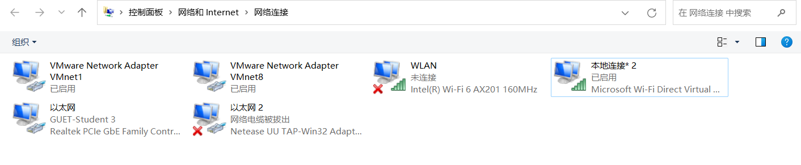

**虚拟机地址**：`192.168.201.130`

**主机地址**：`10.70.123.41`

两者IP不再一个网段内，但是可以互相ping同，这个VM创建的两个虚拟网卡VMnet1和VMnet8有关。

**VMnet1**的IP地址：`192.168.194.1`

**VMnet8**的IP地址：`192.168.201.1`

==由此可知，虚拟机与VMnet8在同一个局域网内（采用NAT模式创建的虚拟机）。==


### 4.1 网络连接方式


- **桥接模式（B）**：直接连接物理网络

    虚拟机直接连接外部物理网络的模式，主机起到了网桥的作用。

    在这种模式下，虚拟机可以直接访问外部网络，并且对外部网络是可见的。

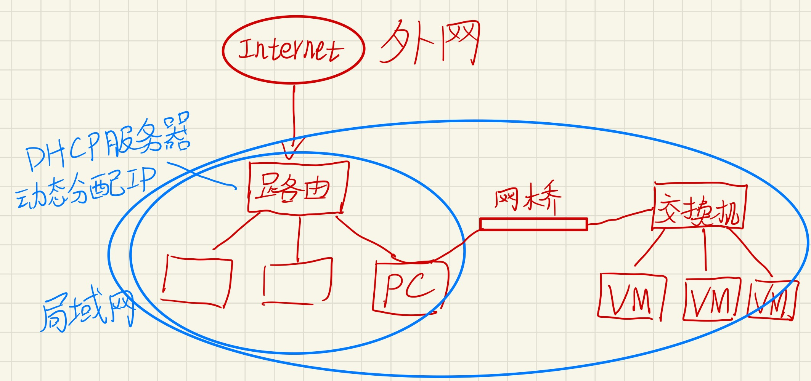

​		由主机网卡虚拟出一个网桥和交换机，网桥连接主机和交换机，交换机连接到虚拟机。

​		**虚拟机和当前局域网内的主机是平等的，但会消耗当前子网中的IP。**

​		VMware中桥接模式默认为自动桥接，也可手动配置，==创建出的虚拟网卡为VMnet0。==


- **NAT模式（N）**：用于共享主机的IP地址

    虚拟机和主机构建一个专用网络，并且通过虚拟网络地址转换（NAT）设备对IP进行转换。

    虚拟机通过共享主机IP可以访问外部网络，但外部网络无法访问虚拟机。

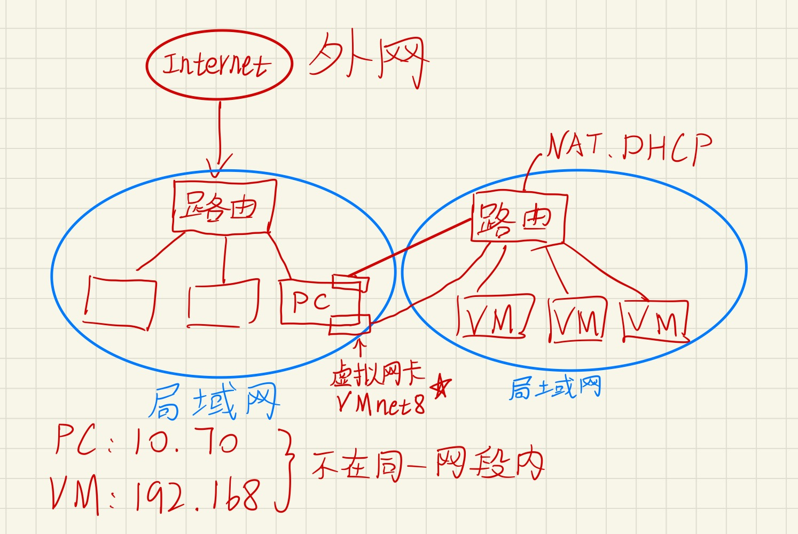

​		在主机中，虚拟出一个路由器（底层其实是创建了一个虚拟的NAT服务器和DHCP服务器）。

​		**虚拟机之间是一个局域网，可以互相访问，但怎么和PC访问呢？**

​		虚拟机访问PC就像PC访问外网一样，由路由做网络地址转换。

​		**但是此时PC就无法访问虚拟子网内部的虚拟机了。**

**解决方案：**

​		在PC上虚拟出一张网卡，让这张虚拟出的网卡连接到虚拟的路由上，此时主机和虚拟机就在同一个网段内了。==这张网卡在VMware中就叫做VMnet8。==


- **仅主机模式（H）**：与主机共享的专用网络

    虚拟机只与主机共享一个专用网络，与外部网络无法通信。

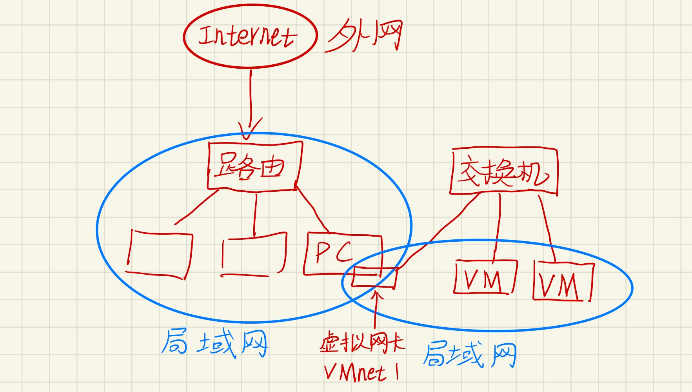

​		主机虚拟出一个交换机和一个虚拟网卡，将这个虚拟网卡和虚拟机连在这个交换机上，这个交换机不与外部连接，所以不能访问外网。==这张网卡在VMware中就叫做VMnet1。==


### 4.2 NAT模式配置解读

**虚拟机地址**：`192.168.201.130`

**主机地址**：`10.70.123.41`


1. **子网IP与子网掩码**

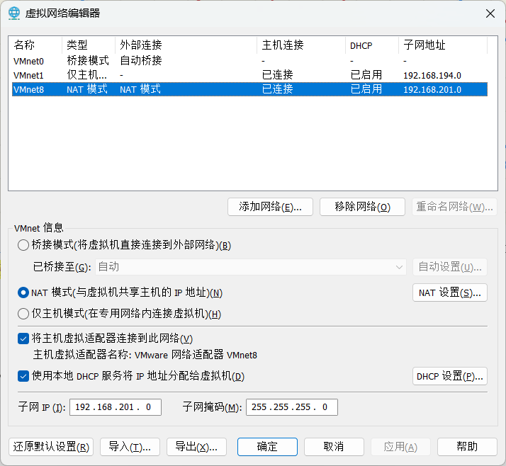

​		子网IP为 `192.168.201.0`，子网掩码为 `255.255.255.0`

​		由此可知，虚拟机地址 `192.168.201.130` 在这个子网内。

​		**我们可以通过修改子网IP和子网掩码来自定义给虚拟机的分配IP。**


2. **DHCP**

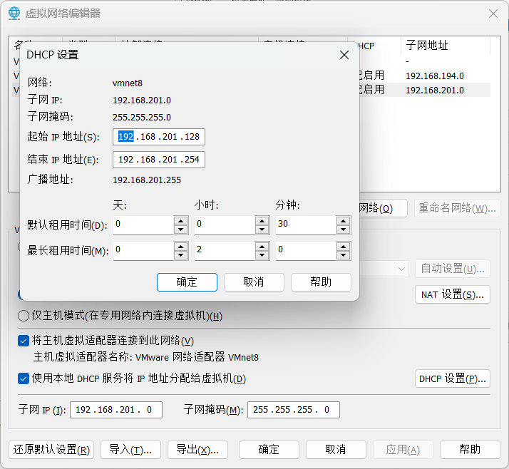

​		DHCP设置了子网分配地址的起始IP地址和结束IP地址。

​		因此这个虚拟机分配到的地址为`130` 。

​		**我们可以修改IP分配的起始和结束地址。**


3. **NAT**

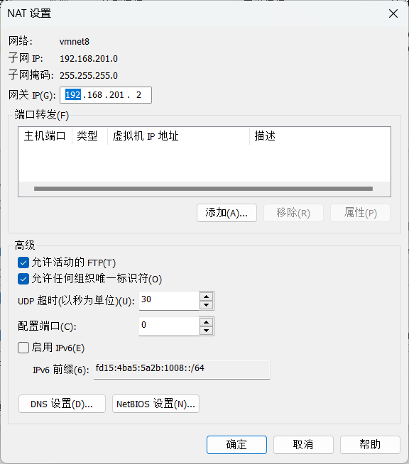

​		NAT设置了网关的IP。

​		==网关设置的地址为 `2` ，为什么是2而不是1呢？==

​		**我们查询到VMnet8的IP地址：`192.168.201.1`，因此可知地址1分配给了虚拟网卡VMnet8，所以地址2分配给了虚拟路由。我们要上网得通过路由器，因此，我们需要将网关的IP设置为虚拟路由的IP `192.168.201.2` 。**


4. 总结：
    - VMnet8就可以称为我们当前的子网，子网IP为 `192.168.201.0`
    - 主机虚拟了一张网卡，设置了IP为 `192.168.201.1`
    - 网关（虚拟路由）设置了IP为 `192.168.201.2`
    - DHCP设置避开了1和2，为 `128~254`
    - ==**因此，在这个子网下的设备就可以彼此没有IP冲突的，共同存在于虚拟子网内，可以和谐相处、彼此访问。**==


### 4.3 修改静态IP


**==注意事项：==**

- NAT模式下子网的IP是可以自己设置的，即可以是 `192.168.201.0` ，也可以是 `192.168.202.0` 。
- 但是需要注意的是，**修改了子网IP之后，DHCP和NAT设置都要改成对应的子网内。**
- **如果设置了静态IP，也要做对应的修改。如主机的VMnet8和虚拟机的静态IP。**


**==centos系统：==**

**通过控制台命令修改：**

1. **进入IP配置文件**

```bash
vim /etc/sysconfig/network-scripts/ifcfg-ens33
```


2. **将启动协议由DHCP改成static**，由动态分配IP改为静态分配IP

    需要加上自定义的静态IP地址、网关、域名解析器。

```python
BOOTPROTO="static"

ONBOOT="yes" #系统启动的时候网络接口是否有效（yes/no）

# 在最后要加三项内容
#IP 地址
IPADDR=192.168.201.100
#网关
GATEWAY=192.168.201.2
#域名解析器
DNS1=192.168.201.2

#子网掩码
NETMASK=255.255.255.0 #默认就是这个，可以不加
```

​		

3. **重启当前的网络环境**

```bash
service network restart
```


**==ubuntu系统：==**

1. 配置interfaces文件

```bash
sudo gedit /etc/network/interfaces
```


```
auto eth0
iface eth0 inet static
address		192.168.201.100	#IP地址
netmask		255.255.255.0	#子网掩码
network		192.168.201.0	#子网地址
gateway		192.168.201.2	#网关
broadcast	192.168.201.255	#广播地址
```


2. **配置DNS解析器**

```
sudo gedit /etc/resolv.conf
```

在该文件中添加（也可以添加其他的DNS）：

```
nameserver 192.168.201.2
nameserver 114.114.114.114
```


3. **在/etc/resolvconf/resolv.conf.d/base文件中设置nameserver，使其永久生效**

```
sudo gedit /etc/resolvconf/resolv.conf.d/base
```

添加nameserver后，保存退出。

```
nameserver
```


==**解决Ubuntu系统每次重启之后都需要重新配置DNS的问题：**==

之所以重启之后DNS须重新配置是因为：resolv.conf这个文件是程序动态创建的，不要直接手动编辑，修改将被覆盖。也就是说每次重新启动之后都会重新被创建。

现在总结出两个办法解决这个问题：

1. **通过/etc/network/interfaces**，在它的最后增加一句：

    ```bash
    dns-nameservers 8.8.8.8
    ```

    8.8.8.8是Google提供的DNS服务，这里只是举一个例子，你也可以改成电信运营商的DNS。重启后DNS就生效了，这时候再看/etc/resolv.conf，这个文件的最下边就多了一行：
    nameserver 8.8.8.8

2. **通过/etc/resolvconf/resolv.conf.d/base**（这个文件默认是空的）
    在里面插入：

    ```bash
    nameserver 8.8.8.8
    nameserver 8.8.4.4
    ```

    如果有多个DNS就一行一个
    修改好保存，然后执行

    ```bash
    resolvconf -u
    ```

    再看/etc/resolv.conf，最下面就多了2行：
    nameserver 8.8.8.8
    nameserver 8.8.4.4

这两种方法都能解决这个问题，可任选其一即可。
附：CentOS下修改DNS则容易的多了，直接修改/etc/resolv.conf，内容是：
nameserver 8.8.8.8
nameserver 8.8.4.4


==ubuntu 22.04 配置静态`ip`==

使用 `ifconfig` 命令查看对应 `ip` 的网络接口。若提示未找到 `ifconfig` 命令则使用如下命令按装该工具。

```bash
sudo apt-get install net-tools
```

查看需要修改的网卡，如下可以查到当前所有的网络接口信息，由于我的主机只有一块网卡，因此就只对它修改即可。

```bash
hduser@hadoop100:~$ ifconfig
ens33: flags=4163<UP,BROADCAST,RUNNING,MULTICAST>  mtu 1500
        inet 10.70.123.158  netmask 255.255.254.0  broadcast 10.70.123.255
        inet6 fe80::a6e3:3e88:f36f:1d65  prefixlen 64  scopeid 0x20<link>
        ether 00:0c:29:74:63:74  txqueuelen 1000  (以太网)
        RX packets 63540  bytes 55353390 (55.3 MB)
        RX errors 0  dropped 24776  overruns 0  frame 0
        TX packets 13819  bytes 1209794 (1.2 MB)
        TX errors 0  dropped 0 overruns 0  carrier 0  collisions 0
```

修改网卡默认配置文件

为了防止出现意外，先对文件进行备份

```bash
cd /etc/netplan/
sudo cp 01-network-manager-all.yaml 01-network-manager-all.yaml.bak
```

```bash
sudo vim /etc/netplan/01-network-manager-all.yaml
```


### 4.4 修改主机名称


1. **查看当前的主机名**： `hostname` 


2. **通过文件修改主机名**：文件位置：`/etc/hostname`

    `vim /etc/hostname`

    需要重启生效。


3. **快捷命令**： `hostnamectl`

    会显示出与主机名相关的系统信息。

    修改主机名：

```bash
hostnamectl set-hostname hadoop100(要修改的主机名)
```


### 4.5 修改hosts映射文件


- 当主机设置了静态IP后，就可以通过hosts文件将hostname和ip关联起来，这样当我们需要访问这台服务器时，就只需要知道它的主机名，hosts文件会自动由主机名转化为对应的IP。


- 文件路径： `/etc/hosts`

```bash
vim /etc/hosts
```


- 添加信息：示例

```bash
192.168.201.100 hadoop100
192.168.201.101 hadoop101
192.168.201.102 hadoop102
192.168.201.103 hadoop100
```


## 5、系统管理

### 5.1 Linux中的进程和服务

​	

- 计算机中，一个正在执行的程序或命令，被叫做 ==”进程“（process）==。
- 启动之后**一直存在、常驻内存的进程**，一般被称为 ==“服务”（service）==。


- 守护进程 - daemon = 系统服务
- 服务带d结尾的表示当前的服务是一个守护进程。


### 5.2 systemctl


- 将服务命令集中到systemctl中。

1. 基本语法

    `systemctl start| stop | restart | status  服务名`


### 5.3 系统运行级别


- 图形化界面 ： 终端中输入： `setup`


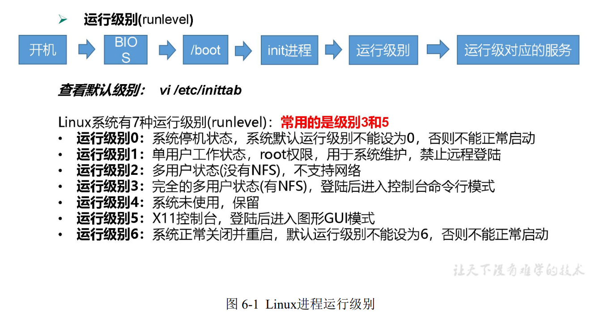

- CentOS7 的运行级别简化为：
    - multi-user.target 等价于原运行级别 3 （多用户有网，无图形界面）
    - graphical.target   等价于原运行级别 5 （多用户有网，有图形界面）

- 查看当前运行级别：
    - `systemctl get-default`

- 更改当前的运行级别
    - ctrl+F1~F5
    - 命令： `init 3 | 5 `
    - `systemctl set-default TARGET.target` （这里 TARGET 取 multi-user 或者 graphical）


### 5.4 配置服务开机自启动


centos6中：

- 查看配置项：只显示SysV服务

    `chkconfig --list`

- 关闭network的开机自启动：

    `chkconfig network off`

    `chkconfig network on`

- 针对某一级别：

    `chkconfig --level 3 network off`


centos7：

- 使用`systemctl`

- 查看所有开机自启动项：

    `systemctl list-unit-files`


### 5.5 关闭防火墙


- 旧版本： iptables
- 新版本： firewalld


- 查看当前状态：

    `systemctl status firewalld`

- 当前停止:
    `systemctl stop firewalld.service`   .service可不加

- 关闭开机自启动

    `systemctl disable firewalld.service`

- 开启

    `systemctl enable firewalld.service`


### 5.6 关机重启命令


**shutdown** 

- **默认一分钟关机**
- **取消关机**
    - `shutdown -c`   
- **立即关机**
    - `shutdown now`
- **指定时间(3分钟)**
    - `shutdown 3`
- **定时关机**
    - `shutdown 15.28`


**sync**

- **将数据由内存同步到硬盘中**
- ==**Linux系统采取预读迟写**==


**halt**

- **停机，不断电**


**poweroff**

- 关机，断电


**reboot**

- 重启


## 6、shell及bash

​		Shell 可以看作是一个命令解释器，为我们提供了交互式的文本控制台界面。我们可以通过终端控制台来输入命令，由 shell 进行解释并最终交给内核执行。


- Unix中最终解释执行的程序叫做 Bourne Shell
- Linux发展为 Bourne Again Shell    —— ==**bash**==

- Dedian使用dash


## 7、帮助命令

manual - 手册、说明书


### 7.1 man 获得帮助信息

1. 基本语法 

    man [命令或配置文件] （功能描述：获得帮助信息）

2. man cd

    会进入到BASH信息，因为cd是Shell的内置命令


**内置命令：**

一部分基础功能的系统命令是直接内嵌在 shell 中的，系统加载启动之后会随着 shell 一起加载，常驻系统内存中。这部分命令被称为“内置（built-in）命令”；相应的其它命令 被称为“外部命令”

- 判断命令是否为内嵌命令：

    `type cd`


- 查看内嵌命令帮助信息：

    `man -f cd`

    然后可选一种：`man 3 cd`


### 7.2 help 获得shell内置命令的帮助信息

- 内嵌命令

    `help cd`

- 外部命令的使用方式： 使用--help参数

    `ls --help`


## 8、文件和目录操作命令

### 8.1 pwd 打印工作目录

- **print working directory 打印工作目录**

- **显示当前工作目录的绝对路径**

    

### 8.2 ls 列出目录内容

- **list 列出目录内容**

- 基本语法 

    **ls [选项] [目录或是文件]** 

- 选项说明

    | 选项 | 功能                                                         |
    | ---- | ------------------------------------------------------------ |
    | -a   | 全部的文件，连同隐藏档( 开头为 . 的文. 的文件) 一起列出来(常用) |
    | -l   | 长数据串列出，包含文件的属性与权限等等数据；(常用)等价于“ll” |

- 显示说明 

    每行列出的信息依次是： 

    文件类型与权限 链接数 文件属主 文件属组 文件大小用byte 来表示 建立或最近修改的时间 名字

例如：

```
drwx------. 5 atguigu atguigu 4096 5 月 27 15
```


### 8.3 cd 切换路径

- **Change Directory 切换路径**

- 基本语法

    **cd [参数]**

- 参数说明

    | 参数        | 功能                                 |
    | ----------- | ------------------------------------ |
    | cd 绝对路径 | 切换路径                             |
    | cd 相对路径 | 切换路径                             |
    | cd ~或者 cd | 回到自己的家目录                     |
    | cd -        | 回到上一次所在目录                   |
    | cd ..       | 回到当前目录的上一级目录             |
    | cd -P       | 跳转到实际物理路径，而非快捷方式路径 |


### 8.4 mkdir 创建一个新的目录

- Make directory 建立目录

- 基本语法 

    **mkdir [选项] 要创建的目录** 

- 选项说明

| 选项 | 功能         |
| ---- | ------------ |
| -p   | 创建多层目录 |

**嵌套创建**


### 8.5 rmdir 删除一个空的目录

- **Remove directory 移除目录**

- 基本语法 

    **rmdir 要删除的空目录**

- 嵌套删除

    **rmdir -p 要删除的空目录**


### 8.6 touch 创建空文件

- 基本语法 

    **touch 文件名称**

- 例子

    `touch xiyou/dssz/sunwukong.txt`


### 8.7 cp 复制文件或目录

- 基本语法 

    **cp [选项] source dest （功能描述：复制source文件到dest）**

- 选项说明

    | 选项 | 功能               |
    | ---- | ------------------ |
    | -r   | 递归复制整个文件夹 |

- 经验技巧

    **强制覆盖不提示的方法：\cp**


### 8.8 rm 删除文件或目录

- 基本语法 

    **rm [选项] deleteFile （功能描述：递归删除目录中所有内容）**

- 选项说明

    | 选项 | 功能                                     |
    | ---- | ---------------------------------------- |
    | -r   | 递归删除目录中所有内容                   |
    | -f   | 强制执行删除操作，而不提示用于进行确认。 |
    | -v   | 显示指令的详细执行过程                   |
    |      |                                          |

    

### 8.9 mv 移动文件与目录或重命名

- 基本语法 

    **mv oldNameFile newNameFile （功能描述：重命名）** 

    **mv /temp/movefile /targetFolder （功能描述：移动文件）**


### 8.10 cat 查看文件内容

- 查看文件内容，从第一行开始显示。

- 基本语法 

    **cat [选项] 要查看的文件**

- 选项说明

    | 选项 | 功能描述                     |
    | ---- | ---------------------------- |
    | -n   | 显示所有行的行号，包括空行。 |

- 经验技巧 

    一般查看比较小的文件，一屏幕能显示全的。


### 8.11 more 文件内容分屏查看器

more 指令是一个基于 VI 编辑器的文本过滤器，它以全屏幕的方式按页显示文本文件 的内容。more 指令中内置了若干快捷键，详见操作说明。

- 基本语法 

    **more 要查看的文件**

- 操作说明

    | 操作           | 功能说明                                |
    | -------------- | --------------------------------------- |
    | 空白键 (space) | 代表向下翻一页；                        |
    | Enter          | 代表向下翻『一行』                      |
    | q              | 代表立刻离开 more，不再显示该文件内容。 |
    | Ctrl+F         | 向下滚动一屏                            |
    | Ctrl+B         | 返回上一屏                              |
    | =              | 输出当前行的行号                        |
    | :f             | 输出文件名和当前行的行号                |

    

### 8.12 less 分屏显示文件内容

less 指令用来分屏查看文件内容，它的功能与 more 指令类似，但是比 more 指令更加 强大，支持各种显示终端。less 指令在显示文件内容时，并不是一次将整个文件加载之后 才显示，而是根据显示需要加载内容，对于显示大型文件具有较高的效率。

- 基本语法

    **less 要查看的文件**

- 操作说明

    | 操作       | 功能说明                                           |
    | ---------- | -------------------------------------------------- |
    | 空白键     | 向下翻动一页；                                     |
    | [pagedown] | 向下翻动一页                                       |
    | [pageup]   | 向上翻动一页；                                     |
    | /字串      | 向下搜寻『字串』的功能；n：向下查找；N：向上查找； |
    | ?字串      | 向上搜寻『字串』的功能；n：向上查找；N：向下查找； |
    | q          | 离开 less 这个程序；                               |

    

### 8.13 echo 输出内容到控制台

- 基本语法 

    **echo [选项] [输出内容]**

- 选项

    **-e： 支持反斜线控制的字符转**

    | 控制字符 | 作用               |
    | -------- | ------------------ |
    | \\\      | 输出\本身          |
    | \n       | 换行符             |
    | \t       | 制表符，也就是 Tab |

- echo $
- echo $PATH


### 8.14 head 显示文件头部内容

- head 用于显示文件的开头部分内容，**默认情况下 head 指令显示文件的前 10 行内容。**

- 基本语法 

    **head 文件 （功能描述：查看文件头10行内容）** 

    **head -n 5 文件 （功能描述：查看文件头5行内容，5可以是任意行数）**

- 选项说明

    | 选项      | 功能                   |
    | --------- | ---------------------- |
    | -n <行数> | 指定显示头部内容的行数 |

    

### 8.15 tail 输出文件尾部内容

- tail 用于输出文件中尾部的内容，**默认情况下 tail 指令显示文件的后 10 行内容**

- 基本语法 

    **tail 文件 （功能描述：查看文件尾部10行内容）** 

    **tail -n 5 文件 （功能描述：查看文件尾部5行内容，5可以是任意行数）**

    **tail -f 文件 （功能描述：实时追踪该文档的所有更新）**

- ==-f 显示文件最新追加的内容，监视文件变化==
- 监控状态：Ctrl+s 暂停  Ctrl+q 继续  Ctrl+c 终止


### 8.16 \> 输出重定向和 >> 追加

- 基本语法

    **ls -l > 文件 （功能描述：列表的内容写入文件 a.txt 中（覆盖写）**

    **ls -al >> 文件 （功能描述：列表的内容追加到文件 aa.txt 的末尾）** 

    **cat 文件 1 > 文件 2 （功能描述：将文件 1 的内容覆盖到文件 2）** 

    **echo “内容” >> 文件**


### 8.17 ln 软链接

- 软链接也称为符号链接，类似于 windows 里的快捷方式，有自己的数据块，主要存放了链接其他文件的路径。

- 基本语法

    **ln -s [原文件或目录] [软链接名] （功能描述：给原文件创建一个软链接）**

- 经验技巧 

    删除软链接： rm -rf 软链接名，而不是 rm -rf 软链接名/ 

    **如果使用 rm -rf 软链接名/ 删除，会把软链接对应的真实目录下内容删掉** 

    查询：通过 ll 就可以查看，**列表属性第 1 位是 l**，尾部会有位置指向。

- ==不加参数 -s，将创建硬链接==

    ln [原文件或目录] [软链接名] 


### 8.18 history 查看已经执行过历史命令

- 基本语法 

    **history （功能描述：查看已经执行过历史命令）**

    **history  行数**

    **！行号**

- 清空

    **history -c**


## 9、时间日期类命令

- 基本语法 

    **date [OPTION]... [+FORMAT]**

- 选项说明

    | 选项           | 功能                                           |
    | -------------- | ---------------------------------------------- |
    | -d<时间字符串> | 显示指定的“时间字符串”表示的时间，而非当前时间 |
    | -s<日期时间>   | 设置系统日期时间                               |

- 参数说明

    | 参数            | 功能                         |
    | --------------- | ---------------------------- |
    | <+日期时间格式> | 指定显示时使用的日期时间格式 |

    

### 9.1 date 显示当前时间

- 基本语法 

    **date （功能描述：显示当前时间）**

    **date +%Y （功能描述：显示当前年份）** 

    **date +%m （功能描述：显示当前月份）**

    **date +%d （功能描述：显示当前是哪一天）** 

    **date "+%Y-%m-%d %H:%M:%S" （功能描述：显示年月日时分秒）**


### 9.2 date 显示非当前时间

- 基本语法 

    **date -d '1 days ago' （功能描述：显示前一天时间）** 

    **date -d '-1 days ago' （功能描述：显示明天时间）** 

    

### 9.3 date 设置系统时间

- 基本语法 

    **date -s 字符串时间**


### 9.4 cal 查看日历

- 基本语法 

    **cal [选项] （功能描述：不加选项，显示本月日历）**

- 选项说明

    | 选项       | 功能             |
    | ---------- | ---------------- |
    | 具体某一年 | 显示这一年的日历 |

    

## 10、用户权限类命令

### 10.1 useradd 添加新用户

- 基本语法 

    **useradd 用户名 （功能描述：添加新用户）** 

    **useradd -g 组名 用户名 （功能描述：添加新用户到某个组）**


### 10.2 passwd 设置用户密码

- 基本语法 

    **passwd 用户名 （功能描述：设置用户密码）**


###  10.3 id 查看用户是否存在

- 基本语法 

    id 用户名


### 10.4 cat /etc/passwd 查看创建了哪些用户


### 10.5 su 切换用户

- su: swith user

- 基本语法 

    **su 用户名称 （功能描述：切换用户，只能获得用户的执行权限，不能获得环境变量）** 

    **su - 用户名称 （功能描述：切换到用户并获得该用户的环境变量及执行权限）**


### 10.6 userdel 删除用户

- 基本语法

    **userdel 用户名 （功能描述：删除用户但保存用户主目录）** 

    **userdel -r 用户名 （功能描述：用户和用户主目录，都删除）**

- 选项说明

    | 选项 | 功能                                       |
    | ---- | ------------------------------------------ |
    | -r   | 删除用户的同时，删除与用户相关的所有文件。 |

    

### 10.7 who 查看登录用户信息

- 基本语法 

    **whoami （功能描述：显示自身用户名称）** 

    **who am i （功能描述：显示登录用户的用户名以及登陆时间）**


### 10.8 sudo 设置普通用户具有 root 权限

- 添加 atguigu 用户，并对其设置密码。 

    ```bash
    [root@hadoop101 ~]#useradd atguigu 
    [root@hadoop101 ~]#passwd atguigu 
    ```

- 修改配置文件 

    ```bash
    [root@hadoop101 ~]#vi /etc/sudoers
    ```

     修改 /etc/sudoers 文件，找到下面一行(91 行)，在 root 下面添加一行，如下所示： 

    ```bash
    ## Allow root to run any commands anywhere 
    root ALL=(ALL) ALL 
    atguigu ALL=(ALL) ALL
    ```

    

- 或者配置成采用 sudo 命令时，不需要输入密码 

- ```bash
    ## Allow root to run any commands anywhere 
    root ALL=(ALL) ALL 
    atguigu ALL=(ALL) NOPASSWD:ALL
    ```


### 10.9 usermod 修改用户属组

- 基本语法 

    **usermod -g 用户组 用户名**

- 选项说明

    | 选项 | 功能                                                     |
    | ---- | -------------------------------------------------------- |
    | -g   | 修改用户的初始登录组，给定的组必须存在。默认组 id 是 1。 |

    


## 11、用户组管理命令

​		每个用户都有一个用户组，系统可以对一个用户组中的所有用户进行集中管理。不同 Linux 系统对用户组的规定有所不同， 如Linux下的用户属于与它同名的用户组，这个用户组在创建用户时同时创建。 

​		用户组的管理涉及用户组的添加、删除和修改。**组的增加、删除和修改实际上就是对 /etc/group文件的更新。**


### 11.1 groupadd 新增组

- 基本语法 

    **groupadd 组名**


### 11.2 groupdel 删除组

- 基本语法 

    **groupdel 组名**

### 11.3 groupmod 修改组

- 基本语法 

    groupmod -n 新组名 老组名

- 选项说明

    | 选项       | 功能描述           |
    | ---------- | ------------------ |
    | -n<新组名> | 指定工作组的新组名 |

    

### 11.4 cat /etc/group 查看创建了哪些


## 12、文件权限类命令 

### 12.1 文件属性

​		Linux系统是一种典型的多用户系统，不同的用户处于不同的地位，拥有不同的权限。 为了保护系统的安全性，Linux系统对不同的用户访问同一文件（包括目录文件）的权限做 了不同的规定。在Linux中我们可以使用ll或者ls -l命令来显示一个文件的属性以及文件所属 的用户和组。


- 从左到右的 10 个字符表示，如图 

    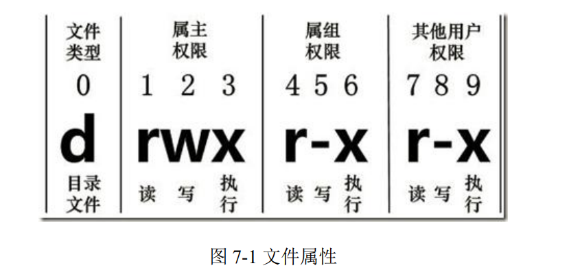

    如果没有权限，就会出现减号[ - ]而已。

- 从左至右用0-9这些数字表示:

    - 0 首位表示类型

        在Linux中第一个字符代表这个文件是目录、文件或链接文件等等

        **\- 代表文件**

        **d 代表目录**

        **l 链接文档(link file)；**

    - 第1-3位确定**属主**（该文件的所有者）拥有该文件的权限。---User

    - 第4-6位确定**属组**（所有者的同组用户）拥有该文件的权限，---Group

    - 第7-9位确定**其他用户**拥有该文件的权限 ---Other

- **rwx 作用文件和目录的不同解释**

    - **作用到文件**：

        [ r ]代表可读(read): 可以读取，查看 

        [ w ]代表可写(write): 可以修改，但是不代表可以删除该文件，**删除一个文件的前提条件是对该文件所在的目录有写权限，才能删除该文件.**

        [ x ]代表可执行(execute):可以被系统执行

    - **作用到目录**：

        [ r ]代表可读(read): 可以读取，ls查看目录内容 

        [ w ]代表可写(write): 可以修改，目录内创建+删除+重命名目录 

        [ x ]代表可执行(execute):可以进入该目录


- **文件基本属性介绍**，如图：

    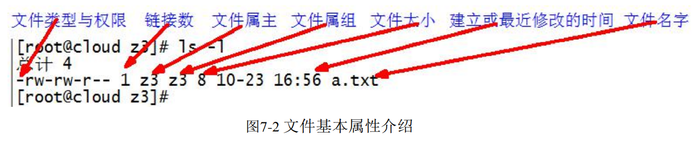

    （1）如果查看到是**文件**：链接数指的是**硬链接个数**。 

    （2）如果查看的是**文件夹**：链接数指的是**子文件夹个数**。


