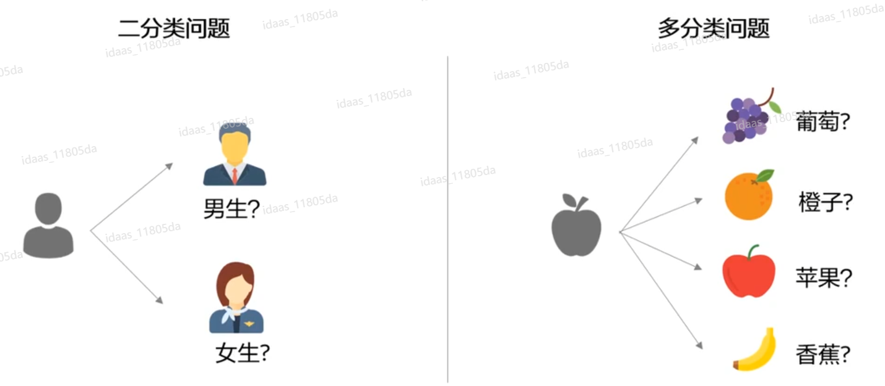
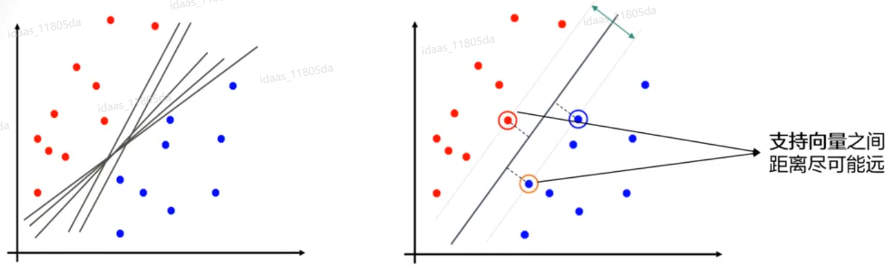

# 机器学习中的常见算法


## 1、感知器

- 感知机是由美国学者Frank  Rosenblatt在1957年提出来的。
- 感知器算法是最简单的可以学习的机器。感知器算法是很多更复杂算法的基础，如支持向量机和多层感知器人工神经网络。

- **感知器算法要求样本是线性可分的，通过梯度下降法有限次的迭代后就可以收敛得到一个解。**当样本非线性时，使用感知器算法不会收敛。为了使感知器算法在样本集不是线性可分时仍能得到收敛的解，可以在梯度下降过程中让步长按照一定的规则逐渐缩小，这样就可以强制算法收敛。

### 1.1 感知器是什么

- 感知机**接收多个输入信号，输出一个信号**。

- 如图是一个接收两个输入信号的感知机的例子。

    x1、x2是输入信号， y是输出信号，w1、w2是权重（w是weight的首字母）。图中的○称为“神经元”或者“节点”。

    

- 输入信号被送往神经元时，会被分别乘以固定的权重（w1x1、w2x2）。

- 神经元会计算传送过来的信号的总和，**只有当这个总和超过 了某个界限值时，才会输出1。**这也称为“**神经元被激活**”。这里将这个界限值称为**阈值**，用符号θ表示。

感知机的运行原理只有这些！把上述内容用数学式来表示，就是下列式子：
$$
y =\begin{cases}
0 \quad (w_1x_1 +w_2x_2 \le \theta)\\
1 \quad (w_1x_1 +w_2x_2 > \theta)
\end{cases}\tag{1.1}
$$

感知机的多个输入信号都有各自固有的权重，这些权重发挥着控制各个信号的重要性的作用。也就是说，**权重越大，对应该权重的信号的重要性就越高**。


### 1.2 引入偏置

用感知器实现与门：

```python
def AND(x1, x2):
 	w1, w2, theta = 0.5, 0.5, 0.7
 	tmp = x1*w1 + x2*w2
 	if tmp <= theta:
 		return 0
 	elif tmp > theta:
 		return 1
```

上面的与门的实现比较直接、容易理解，但是考虑到以后的事情，我们将其修改为另外一种实现形式。

在此之前，**首先把式(1.1)中的 `θ` 换成 `−b`** ，于 是就可以用式(1.2)来表示感知机的行为。
$$
y =\begin{cases}
0 \quad (b+w_1x_1 +w_2x_2 \le 0)\\
1 \quad (b+w_1x_1 +w_2x_2 > 0)
\end{cases}\tag{1.2}
$$

式（1.1）和式（1.2）虽然有一个符号不同，但表达的内容是完全相同的。 **此处，b称为偏置，w1和w2称为权重。**

感知机会计算输入信号和权重的乘积，然后加上偏置，如果这个值大于0则输出1，否则输出0。

使用偏置后的与门：

```python
def AND(x1, x2):
 	x = np.array([x1, x2])
 	w = np.array([0.5, 0.5])
 	b = -0.7
 	tmp = np.sum(w*x) + b
 	if tmp <= 0:
 		return 0
 	else:
 		return 1
```

- 这里把−θ命名为偏置b，但是请注意，偏置和权重w1、w2的作用是不 一样的。
- **==具体地说，w1和w2是控制输入信号的重要性的参数，而偏置是调整神经元被激活的容易程度（输出信号为1的程度）的参数。==**

> 比如，若b为 −0.1，则只要输入信号的加权总和超过0.1，神经元就会被激活。但是如果b 为−20.0，则输入信号的加权总和必须超过20.0，神经元才会被激活。像这样， 偏置的值决定了神经元被激活的容易程度。


### 1.3 感知器的局限性

使用感知机可以实现与门、与非门、或门三种逻辑电路。（与非门和或门的实现和上面AND门函数一样，三者的区别仅在于权重和偏置不同）

但是，**使用感知器无法实现异或门。**(XOR gate)

异或门也被称为逻辑异或电路。如下图所示，仅当x1或x2中的一方为 1时，才会输出1（“异或”是拒绝其他的意思）

|  x1  |  x2  |  y   |
| :--: | :--: | :--: |
|  0   |  0   |  0   |
|  1   |  0   |  1   |
|  0   |  1   |  1   |
|  1   |  1   |  0   |

**为什么无法实现异或门呢？**

因为实际上感知器的权重和参数对应了空间中的一条直线（以或门为例，w1,w2,b）

权重参数为 (b, w1, w2) = (−0.5, 1.0, 1.0)，感知机会生成由直线−0.5 + x1 + x2 = 0分割开的两个空间。其中一个空间输出1，另一个空间输出0


但是，异或门无法用一条直线正确分割


### 1.4 线性和非线性

由上述内容可知，感知机的局限性就在于它只能表示由一条直线分割的空间。

但如果使用一条弯曲的曲线，就可以将异或门正确分割。

在机器学习中，曲线分割而成的空间称为**非线性空间**，由直线分割而成的空间称为**线性空间**。

**由此可知，单层感知机无法分离非线性空间，只能用于线性可分的样本中。**


### 1.5 多层感知机

**叠加了多层的感知机也称为多层感知机（multi-layered perceptron）。**

通过多层感知机就能够实现或异门。

- 异或门的制作方法有很多，其中之一就是组合我们前面做好的与门、与 非门、或门进行配置。

- 与门、与非门、或门用下图中的符号表示

    

- 要实现异或门的话，需要如何配置与门、与非门和或门呢？

    

- 异或门可以通过下图所示的配置来实现。这里，x1和x2表示输入信号， y表示输出信号。x1和x2是与非门和或门的输入，而与非门和或门的输出则是与门的输入。

    

实现异或门：

```python
def XOR(x1, x2):
 	s1 = NAND(x1, x2)
 	s2 = OR(x1, x2)
 	y = AND(s1, s2)
 	return y
```

这样，异或门的实现就完成了。下面我们试着用感知机的表示方法（明确地显示神经元）来表示这个异或门，结果如下图所示。


异或门是一种多层结构的神经网络。这里，将最左边的一列称为第0层，中间的一列称为第1层，最右边的一列称为第2层。

与门、或门是单层感知机，而异或门是2层感知机。叠加了多层的感知机也称为多层感知机（multi-layered perceptron）


### 1.6 感知机算法求解

#### 方法1

输入：训练数据集 $T=\{(x_1,y_1),(x_2,y_2),\cdots,(x_N,y_N)\}$ ，其中 $x_i\in X=R^n$，$y_i\in Y=\{-1,+1\}$，$i=1,2,\cdots,N$；学习率 $\eta(0<\eta\le1)$。

输出：$w,b$；

感知器模型：
$$
f(x)=sign(w·x+b)
$$
训练步骤：（**如果标签不是正负1的格式，如0,1等，要将标签0转换为标签-1**）

1. 选取初值 $w_0,b_0$

2. 在训练集中选取数据 $(x_i,y_i)$

3. 如果 $y_i(w·x_i+b)\leq0$
    $$
    w \gets w+\eta y_ix_i \\
    b \gets b+\eta y_i
    $$
    
4. 转至2，直至训练集中没有误分类点

这种学习算法直观上有如下解释：当一个实例点被误分类，即位于分离超平面的错误一侧时，则调整w, b的值，使分离超平面向该误分类点的一侧移动，以减
少该误分类点与超平面间的距离，直至超平面越过该误分类点使其被正确分类。

步骤3的解释：当分类正确时，$y_i$ 和 $wx_i+b$ 的符号相同，相乘大于0，错分则小于0，所以当小于0时，需要调整权重。


• 目标：最优化目标函数 $J(w)$

$J(w)$ = 训练错误数 

• 学习算法 ：梯度下降法（gradient descent） 
$$
w(t+1)=w(t)-\eta \nabla J,\quad (\nabla J<阈值)
$$
#### 方法2

线性判别函数的**齐次简化**
$$
g(x)=w^Tx+w_0 \quad \to \quad g(y)=\alpha^Ty\\
其中，y=[1,x]^T = [1,x_1,x_2,\dots,x_d]^T，增广的特征向量 \\
\alpha=[w_0,w]^T=[w_0,w_1,w_2,\dots,w_d]^T，增广的权重向量
$$
那么，决策规则（两类$w_1,w_2$）
$$
g(y)\begin{cases}>\\< \end{cases}0，则y\in \begin{cases}w_1\\w_2 \end{cases}
$$
假设，存在一个$\alpha$，使所有样本被正确分类。即：$\exists\alpha，\forall i=1,\dots,N$
$$
\begin{cases}
若y_i \in w_1，则\alpha ^Ty_i>0\\
若y_i \in w_2，则\alpha ^Ty_i<0\\
\end{cases}
$$
为进一步简化推导，把样本向量再进行如下规范化（**如果标签不是正负1的格式，如0,1等，要将标签0转换为标签-1**）
$$
令y_i^`=\begin{cases}
y_i，\quad&&若y_i\in w_1\\
-y_i,&&若y_i\in w_2
\end{cases}
$$
于是，对正确分类样本 $i$，$\alpha^Ty_i^`>0$

**准则函数：**
$$
J_p(\alpha)=\sum_{\alpha y_k\leq0}(-\alpha^T y_k)
$$
当且仅当$J_p(\alpha^*)=minJ_p(\alpha)=0$时， $\alpha^*$是解向量

==**梯度下降法迭代求解：**==
$$
\alpha(t+1) =\alpha(t)-\rho_t\nabla J_p(\alpha)\\
\nabla J_p(\alpha)=\frac{\partial J_p(\alpha)}{\partial \alpha}=\sum_{\alpha^T y_k\leq 0}(-y_k)\\
\therefore \alpha(t+1)=\alpha(t)+\rho_t\sum_{\alpha^T y_k\leq 0}y_k
$$
得到迭代公式：（这里的yi不同于方法1的yi）
$$
\alpha \gets \alpha + \eta y_i
$$


梯度下降迭代算法步骤:

1. 任意选择初始的权向量$\alpha(0)$ ，置t = 0
2. 考察样本$y_i$，若 $\alpha(t)^Ty_i\leq0$ (或 $b$) ，则$\alpha(t+1)=\alpha(t)+\rho_t y_i$，否则继续
3. 考察另一个样本，重复②，直至对所有样本都有 $\alpha(t)^Ty_i>0$，即$J_p(\alpha)=0$ 


收敛性：对于线性可分的样本集，梯度下降的迭代算法经过有限次修正后一定会收敛到一个解向量$\alpha^*$

变增量法，如绝对修正法，可使用可变步长减少迭代步数：
$$
\rho_t = \frac{|\alpha(k)^Ty_i|}{||y_i||^2}
$$

#### 两种方法的变换原理

使用两种方法的前提：将标签改为（-1,1）的格式，**如果标签不是正负1的格式，如0,1等，要将标签0转换为标签-1**

对于方法1：
$$
w \gets w+\eta y_ix_i \\
b \gets b+\eta y_i
$$


对于方法2：
$$
\alpha=(b,w)\\
\alpha \gets \alpha + \eta y_i
$$
方法2中的yi不同于方法1中的，方法1中的yi表示标签，这里表示增广后的特征向量x。（$y_i=(1,x_i)$）

将 $\alpha$ 展开：
$$
(b,w) \gets (b,w)+\eta (1,x_i)
$$
由于y_i经过了规范化处理，所以将$\alpha$拆分后相较于方法1，省去了y_i
$$
b \gets b + \eta\\
w \gets w + \eta x_i
$$
去除规范化处理后，这两种方法的迭代过程就变成一样的了，也就是说两种方法的迭代原理其实是一样的，只不过方法1看起来更加直观，容易使用代码实现，而方法2更加简洁，不过理解起来不那么容易，而且在实现时需要对特征向量、权重向量进行增广，还要对增广后的特征向量进行规范化处理。


## 2、线性回归

- **线性回归（Linear regression）：**线性回归是利用数理统计中回归分析，来确定两种或两种以上变量间相互依赖的定量关系的一种统计分析方法。
- 线性回归是一种有监督学习。


- 计算公式：其中w为权重参数，b为偏置，x表示标本。
    $$
    h_w(x)=w^Tx+b
    $$

- 模型预测与真实值的关系如下。其中y表示真实值，$\varepsilon$表示误差。
    $$
    y=w^Tx+\varepsilon
    $$

- 误差$\varepsilon$受到众多因素独立影响，根据中心极限定律，误差$\varepsilon$服从正态分布。根据正态分布函数与最大似然估计，可以求出线性回归的损失函数为：
    $$
    J(w)=\frac{1}{2m}\sum(h_w(x)-y)^2
    $$

- 我们想要预测值与真实值最接近，就是求损失值最小。可以使用梯度下降的方法求出当损失函数达到最小的时候的权重参数w，继而完成模型构建。

### 线性回归拓展 - 多项式回归

- 多项式回归，是线性回归的拓展，通常数据集的复杂度会超过用一条直线来拟合的可能性，也就是使用**原始的线性回归模型会明显欠拟合**。解决的办法就是使用多项式回归。

$$
h_w(x)=w_1x+w_2x^2+L+w_nx^n+b
$$

- 这里的n次方就是多项式回归维度（degree）
- 多项式回归仍然是线性回归的一种，是因为其非线性体现在特征的维度上，而其**权重参数w之间的关系仍然是线性的**。

### 防止过拟合

- 正则项有助于减少过拟合，w值在样本空间中不能过大/过小，可以在目标函数之上增加一个平方和损失：

$$
J(w)=\frac{1}{2}\sum(h_w(x)-y)^2+\lambda\sum w^2
$$

- 正则项（norm）：这里这个正则项叫做L2-norm，使用这个损失函数的线性回归也叫**Ridge回归**。

$$
J(w)=\frac{1}{2}\sum(h_w(x)-y)^2+\lambda\sum |w^2|
$$

- 追加了绝对值损失的线性回归叫做**Lasso回归**。


## 3、逻辑回归

- 逻辑回归：逻辑回归模型是一种**分类模型**，用来解决分类问题。模型的定义：

$$
P(Y=1|x)=\frac{e^{wx+b}}{1+e^{wx+b}}\\
P(Y=0|x)=\frac{1}{1+e^{wx+b}}
$$

​	其中w称为权重，b称为偏置，其中的wx+b看出对x的线性函数。然后对比上面两个概率值，概率值大的就是x对于的类。


- 逻辑回归与线性回归都是广义线性模型。逻辑回归在线性回归的基础，上引入了非线性因素(sigmoid函数)，并设定了阈值，因此可以处理2分类问题。
- 根据逻辑回归的模型函数，可以通过**最大似然估计计算出逻辑回归的损失函数**为:

$$
J(w)=\frac{1}{m}\sum(y\log h_w(x)+(1-y)\log(1-h_w(x)))
$$

- 其中w为权重参数，m为样本个数，x表示样本，**y表示真实值**。 同样可以通过梯度下降算法求得所有权重参数w的值。

### 逻辑回归拓展 - Softmax函数

- 逻辑回归只能用于二分类问题，如果是多分类问题，我们通常使用Softmax函数。



- Softmax回归是逻辑回归的一般化，适用于K分类的问题。
- Softmax函数的本质就是将一个K维的任意实数向量压缩(映射)成另一个K维的实数向量，其中向量中的每个元素取值都介于(0，1 )之间。

- Softmax回归概率函数为:

$$
p(y=k|x;w)=\frac{e^{w_k^tx}}{\sum^{k}_{l=1}e^{w^T_lx}}
$$

- Softmax为多类问题中的每个分类分配了概率值。这些概率加起来等于1.


## 4、决策树

- **决策树( decision tree)** 是一个树结构(可以是二叉树或非二叉树)。其每个**非叶节点**表示一个**特征属性上的测试**，每个**分支**代表这个特征属性**在某个值域上的输出**，而每个**叶节点**存放一个类别。使用决策树进行决策的过程就是从根节点开始，测试待分类项中相应的特征属性，并按照其值选择输出分支，直到到达叶子节点，将叶子节点存放的类别作为决策结果。

- **决策树的构造**就是**进行属性的选择**，确定各个特征属性之间的树结构。构建决策树的**关键步骤**就是按照所有的特征属性进行划分操作，对所有的划分操作的结果集的“ 纯度”进行比较，选择“纯度”最高的属性作为分割数据集的数据点。
- 纯度的量化指标主要通过**信息熵与GINI系数**，公式如下:

$$
H(X)=-\sum^{K}_{k=1}p_k\log_2(p_k)\\
Gini = 1-\sum^{K}_{k=1}p^2_k
$$

- 其中**pk表示样本属于类别k的概率(共有K个类别)**，分割前与分割后的**纯度差异越大**，决策树越好。
- 常见的决策树算法有ID3，C4.5， CART等。

### 决策树的构建过程

- **特征选择:**从训练数据的特征中选择一个特征作为当前节点的分裂标准(特征选择的标;准不同产生了不同的特征决策树算法)。”
- **决策树生成:**根据所选特征评估标准，从上至下递归地生成子节点，直到数据集不可分则停止决策树停止生长。
- **剪枝:**决策树容易过拟合，需要剪枝来缩小树的结构和规模(包括预剪枝和后剪枝)。


## 5、支持向量机

- 支持向量机（简称SVM）是一个功能强大并且全面的机器学习模型，它能够执行**线性或非线性分类、回归，甚至是异常值检测任务**。它是机器学习领域最受欢迎的模型之一，任何对机器学习感兴趣 的人都应该在工具箱中配备一个。
- SVM特别适用于中小型复杂数据集的分类。


### 5.1 基本概念

#### 超平面（Hyperplane）

在几何中，**超平面指的是比所处空间少一个维度的子空间**。 任意超平面可以用下面如下线性方程来描述：
$$
w^Tx+b=0
$$


#### 点到超平面的距离

- **二维空间** 

    二维空间点 $(x,y)$ 到直线 $Ax+By+C=0$ 的距离公式是：
    $$
    \frac{|Ax+By+C|}{\sqrt{A^2+B^2}}
    $$

- **N维空间**

    点 $x=(x_1,x_2,\cdots,x_n)$ 到超平面 $w^Tx+b=0$ 的距离为：
    $$
    \frac{|w^Tx+b|}{||w||}
    $$
    其中，$||w||=\sqrt{w_1^2+\cdots+w_n^2}$ 


#### 决策边界（decision boundary）

分类模型学习到的用于区分数据类别的边界。主要有**线性决策边界 (linear decision boundaries)和非线性决策边界 (non-linear decision boundaries)**


#### 决策边界的选择

可用于分类的超平面有多种，如何选择是模型训练的核心问题。一般的模型都试图找到鲁棒性强、泛化能力强的分类决策边界。


#### 支持向量（support vector）

各类样本，距离超平面最近的点称为支持向量，超平面是仅由支持向量决定的


#### 间隔（margin）

异类支持向量到超平面的距离之和称为间隔，通常每类只选一个支持向量。


#### 硬间隔和软间隔

你可以将SVM分类器视为在类别之间拟合可能的**最宽的街道**（上图两条平行的蓝线所示）。因此这也叫作**大间隔分类（large margin classification）**。

请注意，在街道以外的地方增加更多训练实例，不会对决策边界产生影响：也就是说**它完全由位于街道边缘的实例所决定（或者称之 为“支持”）**。这些实例被称为支持向量。


==**硬间隔：**==

如果我们严格地让所有实例都不在街道上，并且位于正确的一 边，这就是硬间隔分类。

硬间隔分类有两个主要问题：

- 首先，==**它只在数据是线性可分离的时候才有效**；==

- 其次，==**它对异常值非常敏感**。==

    下图显示了有一个额外异常值的鸢尾花数据：左图的数据根本找不出硬间隔，而右图最终显示的决策边界与无异常值时的决策边界也大不相同，可能无法很好地泛化。

    

要避免这些问题，最好使用更灵活的模型。**目标是尽可能在保持街道宽阔和限制间隔违例（即位于街道之上，甚至在错误的一边的实例）之间找到良好的平衡**，这就是**软间隔分类**。

==**软间隔：**==

在Scikit-Learn的SVM类中，可以通过超参数C来控制这个平衡： C值越小，则街道越宽，但是间隔违例也会越多。

下图显示了在一个非线性可分离数据集上，两个软间隔SVM分类器各自的决策边界和间隔。**左边使用了高C值，分类器的间隔违例较少，但是间隔也较小。右边使用了低C值，间隔大了很多，但是位于街道上的实例也更多。**看起来第二个分类器的泛化效果更好，因为大多数间隔违例实际上都位于决策边界正确的一边，所以即便是在该训练集上，它做出的错误预测也会更少。


==如果你的SVM模型过度拟合，可以试试通过降低C来进行正则化。==


### 5.2 支持向量机的原理

- **支持向量机( support vector machine，SVM)**是一种二分类模型，它的基本模型是定义在特征空间上的**间隔最大的线性分类器**。
- SVM还包括**核技巧**，这使它成为**实质上的非线性分类器**。支持向量机的学习算法是求解凸二次规划的最优化算法。


#### 优化问题

- 对于两类标记为正负的样本，其中○表示+1，×表示-1。用 $f(x)=w^Tx+b=0$ 表示分割超平面（总比当前坐标轴少一个维度），使正样本一侧的所有点满足 $f(x)=w^T·x+b\geq 1$ ，负样本一侧的所有点满足 $f(x)=w^T·x+b\leq -1$ ，最终任何一侧的点都满足 $y_i(w^Tx_i + b)\geq 1$ 。
- 我们的目的就是确定这里面的参数 $w$ 和 $b$ 。距离超平面最近的点称为支持向量，超平面是仅由支持向量确定的。
- 定义函数间隔 $\hat{\gamma}=y(w^Tx+b)$ 为优化对象，目的使支持向量对应的函数间隔最大化。
- 但是这样是有问题的，如果等比例地放大或缩小 $w$ 和 $b$ ，函数间隔变为原来的两倍，但是分割超平面 $f(x)=2w^Tx+2b=0$ 并没有变，因此在此基础上定义几何间隔 $\gamma=\dfrac{\hat{\gamma}}{||w||}$ ，且固定函数间隔 $\hat{\gamma}=1$ （**==即支持向量的 $f(x)=w^Tx+b$ 函数值为 1 或 -1==**），则几何间隔 $\gamma=\dfrac{|y(w^Tx+b)|}{||w||}=\dfrac{1}{||w||}$ ，代表支持向量到分割超平面的距离。


那么，现在我们的目标是使几何间隔最大化，即：
$$
\max \gamma ,\\
s.t.\quad y(w^Tx+b)\geq 1
$$
可以等价为一下形式：
$$
\max \frac{1}{||w||} =\min \frac{1}{2}||w||^2
$$
所以寻找超平面的问题变为一个优化问题：
$$
\min \frac{1}{2} ||w||^2,\\
s.t. \quad y_i(w^Tx_i+b)\geq 1
$$


#### 线性支持向量机

- 直线被用来将数据分割到不同类别中，而实际上我们可以多条直线将数据分来。SVM的核心思路是找到一个直线，使离直线比较近的点，尽可能远离这条直线，这可以使模型具有很强的泛化能力。而这些点就被称为**支持向量(Support Vector)**
- 在二维空间中，我们用**直线**来分割，如果是高维空间，我们使用**超平面**来分割。



#### 非线性支持向量机


对于线性不可分的数据

- 使用**核函数**来构建非线性支持向量机。
- 核函数允许算法在变换后的**高维特征空间**中拟合最大的超平面。


**核函数：核函数在低维和高维空间中的内积相等。**


## 6、K最近邻算法

- **K最近邻(k-Nearest Neighbor, KNN)分类算法**，是一个理论上比较成熟的方法，也是最简单的机器学习算法之一。该方法的思路是:如果一个样本在特征空间中的k个最相似(即特征空间中最邻近)的样本中的大多数属于某一个类别，则该样本也属于这个类别。
- KNN的核心思想是“近朱者赤，近墨者黑，其在逻辑上十分的简洁。
- **KNN是非参数方法，常用在决策边界非常不规则的数据集中使用。**
    - KNN在分类预测时，一般采用**多数表决法**; KNN在做回归预测时，一般**采用平均值法**。
- KNN的需要非常大的计算量。
- K值越大越容易欠拟合，因为分割过于粗糙，越小越容易过拟合，因为分割过于细腻。


## 7、朴素贝叶斯

**朴素贝叶斯方法**是一组基于贝叶斯定理的有监督学习算法，在给定类变量值的情况下，假设每一对特征之间的**条件独立性**为“朴素”假设。贝叶斯定理给出了类变量$y$和相关特征向量$x_1$到$x_n$之间的关系式：
$$
P(y|x_1,...,x_n)=\frac{P(y)P(x_1,...,x_n|y)}{{P}(x_1,...,x_n)}
$$
使用朴素的**条件独立性假设**:
$$
P(x_i|y,x_1,...,x_{i-1},...,x_n)=P(x_i|y)
$$
由上式可知，**不同的特征$x$之间是相互独立的，即属性$x_i$是否发生对属性$x_j$没有影响。**

有了上述的假设之后，对所有的, 这个关系可以被简化成：
$$
P(y|x_1,...,x_n)=\frac{P(y)\prod_{i=1}^{n}P(x_i|y)}{P(x_1,...,x_n)}
$$


- **P(Y|X)是后验概率，P(Y)是先验概率。**
- **P(X|Y)是似然度，P(X)是边际似然度。**
- 使用条件：必须假设特征之间是相互独立的。


### 最小错误率Bayes

假设待识别的特征(样本)为X，样本分为m类，各类的先验概率和各类的类概密均已知，就有m个判别函数，由Bayes公式可知：
$$
P(w_i|x)=\frac{P(x|w_i)P(w_i)}{\sum\limits_{j=1}^{m}P(x|w_j)P(w_j)}=\frac{P(x|w_i)P(w_i)}{P(x)}
$$
在取得一个观察特征(样本)X后，在特征X的条件下，**看哪个类的概率最大，应该把X归于概率最大的那个类**。由此，可得到**最大后验概率判决准则**的几种等价形式：
$$
\begin{aligned}
&(1)\quad若P(x|w_j)P(w_j)=\mathop{\max}_{i\in1,2,\cdots,m}P(x|w_i)P(w_i)，则x\in w_j \\
&(2)\quad若L(x)=\frac{P(x|w_j)}{P(x|w_i)}>\frac{P(w_i)}{P(w_j)}，i=1,2,\cdots,m,i\neq j,则x\in w_j\\
&(3)\quad若\ln L(x)=\ln P(x|w_j)-\ln P(x|w_i)>\ln \frac{P(w_i)}{P(w_j)}，i=1,2,\cdots,m,i\neq j,则x\in w_j
\end{aligned}
$$
==**其中, $L(x)$ 称为似然比, 　$\ln L(x)$称为对数似然比**==
==**$P(ω_1)/P(ω_2)$称为似然比阈值**==

例子：
已知有两类 $w_1$ 和 $w_2$ ，它们的先验概率分别是 0.8 和 0.2 ，现在做了两次实验，从类条件概率密度曲线上查得两个样本 $x_1$ 和 $x_2$ 的类条件概率密度值如下
$$
P(x_1|w_1)=0.1,\quad P(x_1|w_2)=0.7\\
P(x_2|w_1)=0.3,\quad P(x_2|w_2)=0.45
$$
用最小错误率贝叶斯决策规则对这两个样本进行分类:

对样本x1:
$$
L(x_1)=\frac{P(x_1|w_1)}{P(x_1|w_2)}=\frac{1}{7}<\frac{1}{4}=\frac{P(w_2)}{P(w_1)}=\lambda\\
\therefore x_1\in w_2
$$
对样本x2:
$$
L(x_2)=\frac{P(x_2|w_1)}{P(x_2|w_2)}=\frac{2}{3}>\frac{1}{4}=\frac{P(w_2)}{P(w_1)}=\lambda\\
\therefore x_2\in w_1
$$


==**最大后验概率判决准则使决策的错误率最小。**==最大后验概率判决准则的一个优良性质就是使**平均错误概率达到最小**。 因此,==最大后验概率判决准则又称为最小错误概率判决准则。==


### 最小风险的Bayes决策


- 图中，**直线B的划分把正常药品误判为异常药品**，这样扩大了总错误率，会给企业带来一定的损失；直线A的划分将异常药品误判为正常药品，虽然使错误分类最小，但会使病人因失去正确的治疗而遭受极大的损失。**可见使错误率最小并不一定是最佳选择**。
- 实际应用时，从根据不同性质的错误会引起不同程度的损失考虑出发，**宁可扩大一些总的错误率，但也要使总的损失减少**。这时图中的直线B的划分最为实用。这会引进一个与损失有关联的概念-风险。在做决策时，要考虑所承担的风险。**基于最小风险的Bayes决策规则正是为了体现这一点而产生的。**


例子：

在上述例子的前提下，增加条件：$\lambda_{11}=0.5,\lambda_{12}=6,\lambda_{21}=2,\lambda_{22}=1$

若按最小风险的Bayes判决进行判断, 先计算后验概率：
$$
P(w_1|x)=\frac{P(x|w_1)P(w_1)}{\sum\limits_{j=1}^2 P(x|w_j)P(w_j)}\\
P(w_2|x)=1-P(w_1|x)
$$
条件风险：
$$
R(\alpha_1|x)=\sum\limits_{i=1}^2 \lambda_{1i}P(w_i|x)\\
R(\alpha_2|x)=\sum\limits_{i=1}^2 \lambda_{2i}P(w_i|x)
$$
R越大，则表示风险越大，要选择另一类。

另一种方法：同最小错误率Bayes一样
$$
L(x_1)=\frac{P(x_1|w_1)}{P(x_1|w_2)}=\frac{1}{7}<\lambda·\frac{\lambda_{12}-\lambda_{22}}{\lambda_{21}-\lambda_{11}} = \frac{1}{4}·\frac{6-1}{2-0.5}=\frac{5}{6}\\
\therefore x_1\in w_2
$$

$$
L(x_2)=\frac{P(x_2|w_1)}{P(x_2|w_2)}=\frac{2}{3}<\lambda·\frac{\lambda_{12}-\lambda_{22}}{\lambda_{21}-\lambda_{11}} = \frac{1}{4}·\frac{6-1}{2-0.5}=\frac{5}{6}\\
\therefore x_2\in w_2
$$


## 8、集成学习

- 集成学习是一种机器学习范式，在这种范式中，多个学习者被训练和组合以解决同一一个问题。通过使用多个学习者，集成的泛化能力可以比单个学习者强得多。
- 如果随机向数千人提出一个复杂的问题，然后汇总他们的答案。在许多情况下，会发现这个汇总的答案比专家的答案更好。这就是群众智慧。


- 分类：Bagging和Boosting
- Bagging（比如，随机森林）
    - 独立构建数个基本学习器，然后平均它们的预测。
    - 平均而言，组合学习者通常比任何单基学习器更好，因为它们的方差减少了。
- Boosting（比如，Adaboost，GBDT，XGboost）
    - 按顺序的方式构建基学习器，逐步减少基学习器的偏差。综合学习器最终具有很强的拟合数据的能力，但也要注意过拟合可能发生。

### 随机森林

- 随机森林（Random Forest）=Bagging + CART决策树。
- 随机森林构建多个决策树，并将他们合并在一起，以获得更准确和稳定的预测。
    - 随机森林可用于分类和回归问题。


### GBDT

- GBDT是Boosting算法的一种。
- 综合模型的结果是**所有基础学习器**的结果**相加**等于预测值，其本质是下一个基础学习器去**拟合误差函数**对预测值的**残差**(这个残差就是**预测值与真实值之间的误差**)。
- GBDT在模型训练的时候，是要求模型预测的样本**损失尽可能的小**。


- **非常容易过拟合**


## 9、K-means

- K-means算法是**输入聚类个数k**，以及包含**n个数据对象**的数据集，输出满足方差最小的标准的k个聚类的一种算法。
- K-means算法需要输入聚类的最终个数k，然后将n个数据对象划分为k个聚类，而最终所获得的聚类满足: 
    - (1)同一聚类中的对象相似度较高; 
    - (2)而不同聚类中的对象相似度较小。


## 10、层次聚类

- 层次聚类法试图在**不同层次**对数据集进行划分，从而形成**树形的聚类结构**，数据集的划分可采用**“自下向上”**的聚合策略，也可以采用**“自顶向下”**的分拆策略。聚类的层次被表示成树形图。**树根拥有所有样本的唯一聚类， 叶子是仅有一个样本的聚类**。


