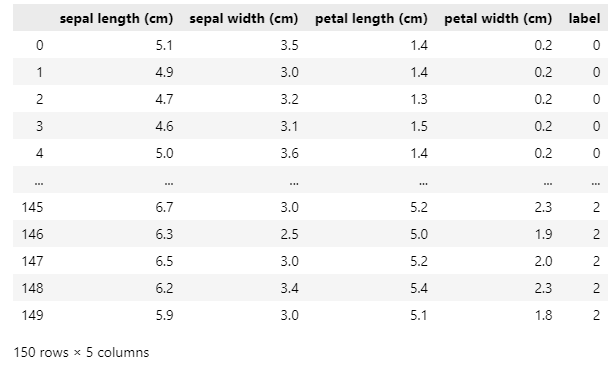
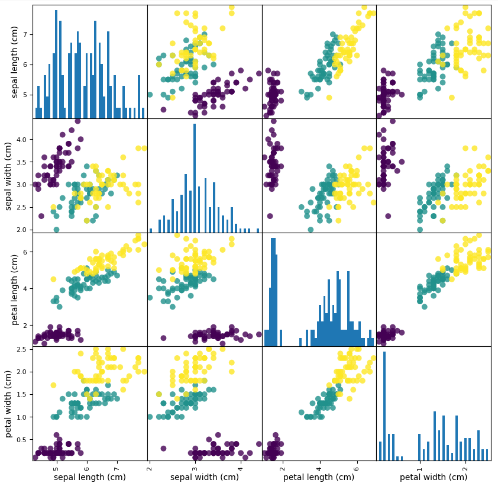
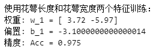
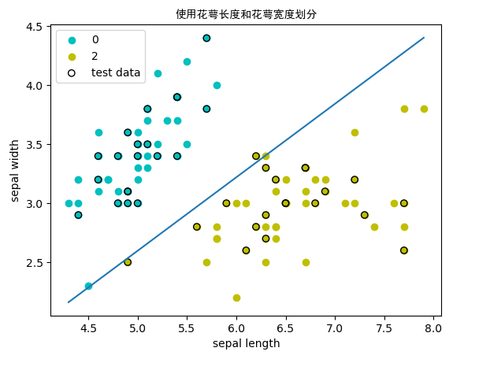
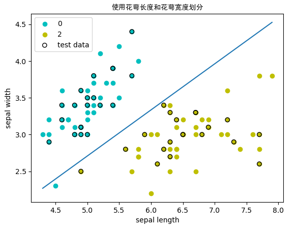

# 算法搭建

## 0、数据集

### 0.1 鸢尾花数据集

```python
# 加载数据集
from sklearn.datasets import load_iris
iris_dataset = load_iris()
```


```python
# 查看数据集的keys
print('Keys of iris_dataset: \n{}'.format(iris_dataset.keys()))

Keys of iris_dataset: 
dict_keys(['data', 'target', 'frame', 'target_names', 'DESCR', 'feature_names', 'filename', 'data_module'])
```


```python
# 查看标签名和特征名
print("Target names: \n{}".format(iris_dataset['target_names']))
print("Feature names: \n{}".format(iris_dataset['feature_names']))

Target names: 
['setosa' 'versicolor' 'virginica']
Feature names: 
['sepal length (cm)', 'sepal width (cm)', 'petal length (cm)', 'petal width (cm)']
```


```python
# 查看数据data类型和大小
print("Type of data: {}".format(type(iris_dataset['data'])))
print("Shape of data: {}".format(iris_dataset['data'].shape))

Type of data: <class 'numpy.ndarray'>
Shape of data: (150, 4)
```


```python
# data 里面是花萼长度、花萼宽度、花瓣长度、花瓣宽度的测量数据
# 查看data前5个数据
print("First five rows of data:\n{}".format(iris_dataset['data'][:5]))
```


```python
# 查看标签target类型和大小
print("Type of target: {}".format(type(iris_dataset['target'])))
print("Shape of target: {}".format(iris_dataset['target'].shape))
```


```python
# 查看target的数据
print("Target:\n{}".format(iris_dataset['target']))

Target:
[0 0 0 0 0 0 0 0 0 0 0 0 0 0 0 0 0 0 0 0 0 0 0 0 0 0 0 0 0 0 0 0 0 0 0 0 0
 0 0 0 0 0 0 0 0 0 0 0 0 0 1 1 1 1 1 1 1 1 1 1 1 1 1 1 1 1 1 1 1 1 1 1 1 1
 1 1 1 1 1 1 1 1 1 1 1 1 1 1 1 1 1 1 1 1 1 1 1 1 1 1 2 2 2 2 2 2 2 2 2 2 2
 2 2 2 2 2 2 2 2 2 2 2 2 2 2 2 2 2 2 2 2 2 2 2 2 2 2 2 2 2 2 2 2 2 2 2 2 2
 2 2]
```


可视化数据集：

```python
df = pd.DataFrame(iris_dataset.data, columns=iris_dataset.feature_names)
df['label'] = iris_dataset.target
df
```



```python
# 将数据data转换为DataFrame格式
# 利用iris_dataset.feature_names中的字符串对数据列进行标记
iris_dataframe = pd.DataFrame(iris_dataset.data, columns=iris_dataset.feature_names)
# 利用DataFrame创建散点图矩阵，按标签target着色
grr = pd.plotting.scatter_matrix(iris_dataframe, c=iris_dataset.target, figsize=(10, 10), 
                                 marker='o',hist_kwds={'bins': 50}, s=50, alpha=.8)
```




## 1、感知器算法

### 自定义感知器函数

```python
# 自定义感知器模型
def perceptron(X,y,eta):    # eta 表示学习率
    w = np.ones(X.shape[1])   # 初始化w,b
    b = 0
    def sign_y(x,w,b):        # 计算w*x+b的值，以便于乘以真实标记y判断是否误分类
        y1 = np.dot(x,w)+b
        return y1
    while True:   # 下面定义了循环结束条件，只要还有误分类点，就会一直循环下去
        wrong_count = 0    
        for i in range(len(X)):
            x = X[i]
            yi = y[i]
            if yi * sign_y(x,w,b) <= 0: # 小于0，则表示该样本分类错误，需要更新w，b
                w = w + eta * yi * x
                b = b + eta * yi
                wrong_count += 1
        if wrong_count == 0:    # 定义函数结束条件，一次循环下来，误分类点为0，即所有点都正确分类了
            return w,b
```


### 自定义感知器类：

（包括训练、测试精度和画出分类图形）

```python
# 自定义感知器模型
class MyPerceptron:
    def __init__(self,w,b=0,eta=0.1):
        """初始化感知器模型的权重、偏置和学习率"""
        self.w = np.array(w)    # 初始化权重
        self.b = b              # 初始化偏置
        self.eta = eta          # 初始化学习率

    def sign_y(self,xi):
        """计算w*x+b的值,即预测值y1,以便于乘以真实标记y判断是否误分类"""        
        y1 = np.dot(xi, self.w) + self.b
        return y1

    def train_ppt(self,X_train,y_train): 
        """训练感知器模型"""
        while True:   # 下面定义了循环结束条件，只要还有误分类点，就会一直循环下去
            wrong_count = 0    # 用于记录分类错误的点数
            for i in range(len(X_train)):
                xi = X_train[i]
                yi = y_train[i]
                if yi * self.sign_y(xi) <= 0:       # 小于0，则表示该样本分类错误，需要更新w，b
                    self.w = self.w + self.eta * yi * xi
                    self.b = self.b + self.eta * yi
                    wrong_count += 1
            if wrong_count == 0:    # 定义函数结束条件，一次循环下来，误分类点为0，即所有点都正确分类了
                return self.w,self.b          
    
    def accuracy(self,X_test,y_test):
        """精度计算函数，使用混淆矩阵计算"""
        c_matrix = np.zeros((2,2))
        for i in range(len(X_test)):
            xi = X_test[i]
            yi = y_test[i]
            if yi * self.sign_y(xi) > 0:
                if yi == -1:
                    c_matrix[0][0] += 1
                elif yi == 1:
                    c_matrix[1][1] += 1
            else:
                if yi == -1:
                    c_matrix[1][0] += 1
                elif yi == 1:
                    c_matrix[0][1] += 1
        acc = (c_matrix[0][0] + c_matrix[1][1]) / c_matrix.sum()
        return acc
    
    def plot_result(self,X_00,X_01,X_20,X_21,X_test_0,X_test_1,title,xlabel,ylabel):
        """
        可视化分类结果
        X_00,X_01           分别表示第0类(setosa)数据的第一个特征和第二个特征
        X_20,X_21           分别表示第2类(virginica)数据的第一个特征和第二个特征
        X_test_0,X_test_1   分别表示测试数据的第一个特征和第二个特征
        title               图形的标题
        xlabel              图形的 x 轴的名称
        ylable              图形的 y 轴的名称
        """
        # 画出数据点，测试集的数据用黑色的外边标记出来
        plt.scatter(X_00, X_01, c='c', label='0')
        plt.scatter(X_20, X_21, c='y', label='2')
        plt.scatter(X_test_0, X_test_1, c='None', edgecolors='k', label='test data')
        # 利用w和b绘制分割直线
        # 先计算直线最左侧的点的坐标 (x_1,y_1) 和最右侧点的坐标 (x_2,y_2)，再通过这两点画出直线
        x_1 = min(np.min(X_00), np.min(X_20))
        y_1 = (-self.b - self.w[0] * x_1) / self.w[1]
        x_2 = max(np.max(X_00), np.max(X_20))
        y_2 = (-self.b - self.w[0] * x_2) / self.w[1]
        plt.plot([x_1, x_2], [y_1, y_2])
        plt.title(title, fontproperties='SimHei')    # fontproperties参数是为了能够显示中文
        plt.xlabel(xlabel)
        plt.ylabel(ylabel)
        plt.legend()        # 显示标签信息
        plt.show()
```

使用模型：

```python
# 使用花萼长度和花萼宽度两个特征训练
print('使用花萼长度和花萼宽度两个特征训练：')
ppt1 = MyPerceptron(w=[1,1], b=0, eta=0.1)              # 初始化模型，初始权重为[1,1]、偏置为0，学习率为0.1
w_1,b_1 = ppt1.train_ppt(X_a_train, y_a_train)          # 训练模型，输出模型得到的权重和偏置
print('权重: w_1 = {}\n偏置: b_1 = {}'.format(w_1,b_1))  
acc_1 = ppt1.accuracy(X_a_test, y_a_test)               # 计算模型精度
print('精度: Acc = {}'.format(acc_1))
```



可视化分类效果

```python
# 可视化分类效果
ppt1.plot_result(X_a[:50,0],X_a[:50,1],X_a[50:100,0],X_a[50:100,1],X_a_test[:,0],X_a_test[:,1],
                 title='使用花萼长度和花萼宽度划分',xlabel='sepal length',ylabel='sepal width')
```



### sklearn提供的感知器模型

训练模型，得到w和b：

```python
from sklearn.linear_model import Perceptron
# fit_intercept表示是否对截距进行估计
# n_iter_no_change在提前停止之前等待验证分数无改进的迭代次数，用于提前停止迭代
# eta0 学习率，决定梯度下降时每次参数变化的幅度
perceptron = Perceptron(fit_intercept=True, n_iter_no_change=40, eta0=0.1, shuffle=True)
perceptron.fit(X_a_train, y_a_train)  
w = perceptron.coef_[0]     # 注意输出的是二维数组，加上[0]后， w=[ 3.09 -4.93]
b = perceptron.intercept_   # b=-2.1
```

利用模型预测：计算错分类数

```python
y_a_pred = perceptron.predict(X_a_test)
miss_classified = (y_a_pred != y_a_test).sum()
print("MissClassified: ",miss_classified)
```

计算模型精度：

1. 使用`sklearn`的新指标

```python
from sklearn.metrics import accuracy_score
print('Accuracy : % .2f' % accuracy_score(y_a_pred, y_a_test))
```

2. 使用 `Perceptron.score()`：结合predict()函数和accuracy_score()函数 返回感知机的预测正确率

```python
print("Accuracy Score : % .2f" % perceptron.score(X_a_test,y_a_test))
```

画出结果：

```python
# 画出数据点，测试集的数据用黑色的外边标记出来
plt.scatter(X_a[:50,0], X_a[:50,1], c='c', label='0')
plt.scatter(X_a[50:100,0], X_a[50:100,1], c='y', label='2')
plt.scatter(X_a_test[:,0], X_a_test[:,1], c='None', edgecolors='k', label='test data')
# 利用w和b绘制分割直线
# 先计算直线最左侧的点的坐标 (x_1,y_1) 和最右侧点的坐标 (x_2,y_2)，再通过这两点画出直线
x_1 = min(np.min(X_a[:50,0]), np.min(X_a[50:100,0]))
y_1 = (-b - w[0] * x_1) / w[1]
x_2 = max(np.max(X_a[:50,0]), np.max(X_a[50:100,0]))
y_2 = (-b - w[0] * x_2) / w[1]
plt.plot([x_1, x_2], [y_1, y_2])
plt.title('使用花萼长度和花萼宽度划分', fontproperties='SimHei')    # fontproperties参数是为了能够显示中文
plt.xlabel('sepal length')
plt.ylabel('sepal width')
plt.legend()        # 显示标签信息
plt.show()
```




