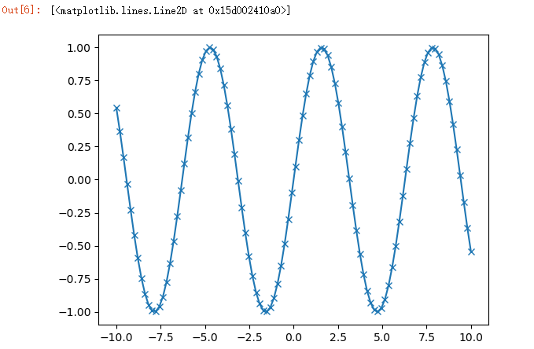

# 机器学习实战笔记

参考书籍：

- Python机器学习基础教程

    


## 1、预备知识

### 1.1 机器学习基础概念

- 机器学习（machine learning）是从数据中提取知识。它是统计学、人工智能和计算机科学交叉的研究领域，也被称为预测分析（predictive analytics）或统计学习（statistical  learning）。

#### 为何选择机器学习

在“智能”应用的早期，许多系统使用人为制订的`if`和`else`决策规则来处理数据， 或根据用户输入的内容进行调整。

>  想象有一个垃圾邮件过滤器，其任务是酌情将收到的某 些邮件移动到垃圾邮件文件夹。你可以创建一个关键词黑名单，所有包含这些关键词的邮件都会被标记为垃圾邮件。这是用专家设计的规则体系来设计“智能”应用的一个示例。 

人为制订的决策规则对某些应用来说是可行的，特别是人们对其模型处理过程非常熟悉的应用。但是，人为制订决策规则主要有两个缺点。

- 做决策所需要的逻辑只适用于单一领域和单项任务。任务哪怕稍有变化，都可能需要重写整个系统。

- 想要制订规则，需要对人类专家的决策过程有很深刻的理解。

####  机器学习任务类别和特殊名词

1. **监督学习算法（supervised learning algorithm）**

    从输入 / 输出对中进行学习的机器学习算法叫作监督学习算法（supervised learning algorithm）， 因为每个用于算法学习的样例都对应一个预期输出，好像有一个“老师”在监督着算法。

    监督机器学习任务的示例如下。

    - 识别信封上手写的邮政编码
    - 基于医学影像判断肿瘤是否为良性
    - 检测信用卡交易中的诈骗行为

2. **无监督学习算法（unsupervised learning algorithm）**

    在无监督学习中，只有输入数据是已知的，没有为算法提供输出数据。虽然这种算法有许多成功的 应用，但理解和评估这些算法往往更加困难。

    无监督学习的示例如下。

    - 确定一系列博客文章的主题
    - 将客户分成具有相似偏好的群组
    - 检测网站的异常访问模式

无论是监督学习任务还是无监督学习任务，将输入数据表征为计算机可以理解的形式都是 十分重要的。通常来说，将数据想象成表格是很有用的。

在机器学习中，这里的每个实体或每一行被称为一个**样本（sample）或数据点**，而每一列 （用来描述这些实体的属性）则被称为**特征（feature）**

构建良好的数据表征，这被称为**特征提取（feature  extraction）或特征工程（feature engineering）**。


### 1.2 必要的库和工具

scikit-learn 是基于 NumPy 和 SciPy 科学计算库的。

#### Jupyter Notebook

Jupyter Notebook 是可以在浏览器中运行代码的交互环境。这个工具在探索性数据分析方面非常有用，在数据科学家中广为使用。


#### NumPy

NumPy 是 Python 科学计算的基础包之一。它的功能包括多维数组、高级数学函数（比如 线性代数运算和傅里叶变换），以及伪随机数生成器。

- **在 scikit-learn 中，NumPy 数组是基本数据结构。**scikit-learn 接受 NumPy 数组格式的数据。你用到的所有数据都必须转换成 NumPy 数组。
- NumPy 的核心功能是 ndarray 类， 即多维（n 维）数组。**数组的所有元素必须是同一类型。**

NumPy 数组如下所示：

```python
import numpy as np
x = np.array([[1, 2, 3], [4, 5, 6]])
print("x:\n{}".format(x))

x:
[[1 2 3]
 [4 5 6]]
```


#### SciPy

SciPy 是 Python 中用于科学计算的**函数**集合。它具有线性代数高级程序、数学函数优化、 信号处理、特殊数学函数和统计分布等多项功能。

**scikit-learn 利用 SciPy 中的函数集合来实现算法。**

对我们来说，==**SciPy 中最重要的是 `scipy.sparse`**==：它可以给出**稀疏矩阵 （sparse matrice）**，==稀疏矩阵是 scikit-learn 中数据的另一种表示方法==。如果想保存一个大部分元素都是 0 的二维数组，就可以使用稀疏矩阵.

```python
from scipy import sparse
# 创建一个二维NumPy数组，对角线为1，其余都为0
eye = np.eye(4)
print("NumPy array:\n{}".format(eye))

NumPy array:
[[ 1. 0. 0. 0.]
 [ 0. 1. 0. 0.]
 [ 0. 0. 1. 0.]
 [ 0. 0. 0. 1.]]
```

```python
# 将NumPy数组转换为CSR格式的SciPy稀疏矩阵
# 只保存非零元素
sparse_matrix = sparse.csr_matrix(eye)
print("\nSciPy sparse CSR matrix:\n{}".format(sparse_matrix))

SciPy sparse CSR matrix:
 (0, 0) 1.0
 (1, 1) 1.0
 (2, 2) 1.0
 (3, 3) 1.0
```

通常来说，创建稀疏数据的稠密表示（dense representation）是不可能的（因为太浪费内 存），所以我们需要直接创建其稀疏表示（sparse representation）。下面给出的是创建同一稀疏矩阵的方法，**用的是 COO 格式**：

```python
data = np.ones(4)
row_indices = np.arange(4)
col_indices = np.arange(4)
eye_coo = sparse.coo_matrix((data, (row_indices, col_indices)))
print("COO representation:\n{}".format(eye_coo))

COO representation:
 (0, 0) 1.0
 (1, 1) 1.0
 (2, 2) 1.0
 (3, 3) 1.0
```


#### matplotlib

matplotlib 是 Python 主要的**科学绘图库**，其功能为生成可发布的可视化内容，如折线图、直方图、散点图等。

-  在 Jupyter Notebook 中， 你 可 以 使 用 `%matplotlib notebook` 和 `%matplotlib inline` 命令，将图像直接显示在浏览器中。

     我们推荐使用 `%matplotlib notebook` 命令，它可以提供交互环境

示例：

```python
%matplotlib inline
import matplotlib.pyplot as plt

# 在-10和10之间生成一个数列，共100个数
x = np.linspace(-10, 10, 100)
# 用正弦函数创建第二个数组
y = np.sin(x)
# plot函数绘制一个数组关于另一个数组的折线图
plt.plot(x, y, marker="x")
```




#### pandas

**pandas 是用于处理和分析数据的 Python 库。**

- 它基于一种叫作 DataFrame 的数据结构，这种数据结构模仿了 R 语言中的 DataFrame。简单来说，**一个 pandas DataFrame 是一张表格，类似于 Excel 表格。**
- pandas 中**包含大量用于修改表格和操作表格的方法**，尤其是可以像 SQL一样对表格进行查询和连接。
- NumPy 要求数组中的所有元素类型必须完全相 同，而 pandas 不是这样，**每一列数据的类型可以互不相同**（比如整型、日期、浮点数和字符串）。
- pandas 的另一个强大之处在于，**它可以从许多文件格式和数据库中提取数据**，如SQL、Excel 文件和逗号分隔值（CSV）文件。

下面是利用字典 创建 DataFrame 的一个小例子：

```python
import pandas as pd
from IPython.display import display

# 创建关于人的简单数据集
data = {'Name': ["John", "Anna", "Peter", "Linda"],
 		'Location' : ["New York", "Paris", "Berlin", "London"],
 		'Age' : [24, 13, 53, 33]
 		}
data_pandas = pd.DataFrame(data)
# IPython.display可以在Jupyter Notebook中打印出“美观的”DataFrame
display(data_pandas)
```


查询这个表格的方法有很多种。举个例子：

```python
# 选择年龄大于30的所有行
display(data_pandas[data_pandas.Age > 30])
```


### 1.3 第一个应用：鸢尾花分类

假设有一名植物学爱好者对她发现的鸢尾花的品种很感兴趣。她收集了每朵鸢尾花的一些测量数据：
**花瓣的长度和宽度以及花萼的长度和宽度**，所有测量结果的单位都是厘米。


她还有一些鸢尾花的测量数据，这些花之前已经被植物学专家鉴定为属于 setosa、 versicolor 或 virginica 三个品种之一。对于这些测量数据，她可以确定每朵鸢尾花所属的品 种。我们假设这位植物学爱好者在野外只会遇到这三种鸢尾花。

- 我们的目标是构建一个机器学习模型，可以从这些已知品种的鸢尾花测量数据中进行学习，从而能够预测新鸢尾花的品种。
-  因为我们有已知品种的鸢尾花的测量数据，所以这是一个**监督学习**问题。
- 在这个问题中，我们要在多个选项中预测其中一个（鸢尾花的品种）。这是一个**分类（classification）问题**的示例。可能的输出（鸢尾花的不同品种）叫作**类别（class）**。数据集中的每朵鸢尾花都属于三个类别之一，所以这是一个**三分类问题**。
- 单个数据点（一朵鸢尾花）的预期输出是这朵花的品种。对于一个数据点（样本）来说，它的品种叫作**标签（label）。**


#### 1.3.1 初识数据

本例中我们用到了鸢尾花（Iris）数据集，这是机器学习和统计学中一个经典的数据集。它包含在 scikit-learn 的 datasets 模块中。

我们可以调用 load_iris 函数来加载数据：

```python
from sklearn.datasets import load_iris
iris_dataset = load_iris()
```

load_iris 返回的 iris 对象是一个 Bunch 对象，与字典非常相似，里面包含键和值：

```python
print("Keys of iris_dataset: \n{}".format(iris_dataset.keys()))

Keys of iris_dataset:
dict_keys(['target_names', 'feature_names', 'DESCR', 'data', 'target'])
```

**DESCR 键**对应的值是数据集的简要说明。我们这里给出说明的开头部分（你可以自己查看其余的内容）：

```python
print(iris_dataset['DESCR'][:193] + "\n...")

Iris Plants Database
====================
Notes
----
Data Set Characteristics:
 :Number of Instances: 150 (50 in each of three classes)
 :Number of Attributes: 4 numeric, predictive att
...
----
```

**target_names 键**对应的值是一个字符串数组，里面包含我们要预测的花的品种：

```python
print("Target names: {}".format(iris_dataset['target_names']))

Target names: ['setosa' 'versicolor' 'virginica']
```

**feature_names 键**对应的值是一个字符串列表，对每一个特征进行了说明：

```python
print("Feature names: \n{}".format(iris_dataset['feature_names']))

Feature names:
['sepal length (cm)', 'sepal width (cm)', 'petal length (cm)', 'petal width (cm)']
```

数据包含在 **target** 和 **data** 字段中。data 里面是**花萼长度、花萼宽度、花瓣长度、花瓣宽度**的测量数据，格式为 NumPy 数组：

```python
print("Type of data: {}".format(type(iris_dataset['data'])))

Type of data: <class 'numpy.ndarray'>
```

**data 数组**的每一行对应一朵花，列代表每朵花的四个测量数据：

```python
print("Shape of data: {}".format(iris_dataset['data'].shape))

Shape of data: (150, 4)
```

可以看出，数组中包含 150 朵不同的花的测量数据。前面说过，机器学习中的个体叫作样本（sample），其属性叫作特征（feature）。==data 数组的形状（shape）是**样本数乘以特征数**。这是 scikit-learn 中的约定，你的数据形状应始终遵循这个约定。==

下面给出前 5 个样本的特征数值：

```python
print("First five rows of data:\n{}".format(iris_dataset['data'][:5]))

First five rows of data:
[[ 5.1 3.5 1.4 0.2]
 [ 4.9 3. 1.4 0.2]
 [ 4.7 3.2 1.3 0.2]
 [ 4.6 3.1 1.5 0.2]
 [ 5. 3.6 1.4 0.2]]
```

从数据中可以看出，前 5 朵花的花瓣宽度都是 0.2cm，第一朵花的花萼最长，是 5.1cm。

**target 数组**包含的是测量过的每朵花的品种，也是一个 NumPy 数组：

```python
print("Type of target: {}".format(type(iris_dataset['target'])))

Type of target: <class 'numpy.ndarray'>
```

target 是一维数组，每朵花对应其中一个数据：

```python
print("Shape of target: {}".format(iris_dataset['target'].shape))

Shape of target: (150,)
```

品种被转换成从 0 到 2 的整数：

```python
print("Target:\n{}".format(iris_dataset['target']))

Target:
[0 0 0 0 0 0 0 0 0 0 0 0 0 0 0 0 0 0 0 0 0 0 0 0 0 0 0 0 0 0 0 0 0 0 0 0 0
 0 0 0 0 0 0 0 0 0 0 0 0 0 1 1 1 1 1 1 1 1 1 1 1 1 1 1 1 1 1 1 1 1 1 1 1 1
 1 1 1 1 1 1 1 1 1 1 1 1 1 1 1 1 1 1 1 1 1 1 1 1 1 1 2 2 2 2 2 2 2 2 2 2 2
 2 2 2 2 2 2 2 2 2 2 2 2 2 2 2 2 2 2 2 2 2 2 2 2 2 2 2 2 2 2 2 2 2 2 2 2 2
 2 2]
```

上述数字的代表含义由 iris['target_names'] 数组给出：0 代表 setosa，1 代表 versicolor， 2 代表 virginica。


#### 1.3.2 衡量模型是否成功：训练数据与测试数据

我们想要利用这些数据构建一个机器学习模型，用于预测新测量的鸢尾花的品种。但在将模型应用于新的测量数据之前，我们需要知道模型是否有效，也就是说，我们是否应该相信它的预测结果。

- 不幸的是，我们不能将用于构建模型的数据用于评估模型。因为我们的模型会一直记住整个训练集，所以对于训练集中的任何数据点总会预测正确的标签。

    这种“记忆”无法告诉我们模型的**泛化（generalize）**能力如何（换句话说，在新数据上能否正确预测）。

- 我们要用新数据来评估模型的性能。新数据是指模型之前没有见过的数据，而我们有这些新数据的标签。

- 通常的做法是将收集好的带标签数据（此例中是 150 朵花的测量数据） 分成两部分。

    一部分数据用于构建机器学习模型，叫作**训练数据（training data）或训练集（training set）**。

    其余的数据用来评估模型性能，叫作**测试数据（test data）、测试集（test set）或留出集（hold-out set）。**

scikit-learn 中的 train_test_split 函数可以打乱数据集并进行拆分。这个函数将 75% 的行数据及对应标签作为训练集，剩下 25% 的数据及其标签作为测试集。训练集与测试集的分配比例可以是随意的，但使用 25% 的数据作为测试集是很好的经验法则。


scikit-learn 中的**数据通常用大写的 X 表示，而标签用小写的 y 表示。**这是受到了数学标准公式 f(x)=y 的启发，其中 x 是函数的输入，y 是输出。我们用大写的 X 是因为数据是 一个二维数组（矩阵），用小写的 y 是因为目标是一个一维数组（向量），这也是数学中的约定。

**对数据调用 train_test_split，并对输出结果采用下面这种命名方法：**

```python
from sklearn.model_selection import train_test_split
X_train, X_test, y_train, y_test = train_test_split(
 	iris_dataset['data'], iris_dataset['target'], random_state=0)
```

- 在对数据进行拆分之前，train_test_split 函数利用**伪随机数生成器**将数据集打乱。

    如果我们只是将最后 25% 的数据作为测试集，那么所有数据点的标签都是 2，因为数据点是按标签排序的（参见之前 iris['target'] 的输出）。

- 为了确保多次运行同一函数能够得到相同的输出，我们利用 random_state 参数指定了随机数生成器的种子。这样函数输出就是**固定不变**的，所以这行代码的输出始终相同。

train_test_split 函数的输出为 X_train、X_test、y_train 和 y_test，它们都是 NumPy 数组。X_train 包含 75% 的行数据，X_test 包含剩下的 25%：

```python
print("X_train shape: {}".format(X_train.shape))
print("y_train shape: {}".format(y_train.shape))

X_train shape: (112, 4)
y_train shape: (112,)
```

```python
print("X_test shape: {}".format(X_test.shape))
print("y_test shape: {}".format(y_test.shape))

X_test shape: (38, 4)
y_test shape: (38,)
```


#### 1.3.3 要事第一：观察数据(数据可视化)

在构建机器学习模型之前，通常最好检查一下数据，看看如果不用机器学习能不能轻松完成任务，或者需要的信息有没有包含在数据中。

- 此外，检查数据也是发现**异常值**和**特殊值**的好方法。

    举个例子，可能有些鸢尾花的测量单 位是英寸而不是厘米。在现实世界中，经常会遇到不一致的数据和意料之外的测量数据。

检查数据的最佳方法之一就是将其可视化。

- 一种可视化方法是绘制==**散点图（scatter plot）**==。

    数据散点图将一个特征作为 x 轴，另一个特征作为 y 轴，将每一个数据点绘制为图上的一个点。

    不幸的是，计算机屏幕只有两个维度，所以我们一次只能绘制两个特征（也可能是 3 个）。

    用这种方法难以对多于 3 个特征的数据集作图。

- 解决这个问题的一种方法是绘制==**散点图矩阵（pair plot）**==，从而可以两两查看所有的特征。

    如果特征数不多的话，比如我们这里有 4 个，这种方法是很合理的。

    但是你应该记住，散点图矩阵**无法同时显示所有特征之间的关系**，所以这种可视化方法可能无法展示数据的某些有趣内容。

为了绘制训练集中特征的散点图矩阵，我们首先将 NumPy 数组转换成 pandas DataFrame。pandas 有一个绘制散点图矩阵的函数，叫作 **scatter_matrix**。

矩阵的对角线是每个特征的直方图：

```python
# 利用X_train中的数据创建DataFrame
# 利用iris_dataset.feature_names中的字符串对数据列进行标记
iris_dataframe = pd.DataFrame(X_train, columns=iris_dataset.feature_names)
# 利用DataFrame创建散点图矩阵，按y_train着色
grr = pd.ploscatter_matrix(iris_dataframe, c=y_train, figsize=(15, 15), marker='o',
 						hist_kwds={'bins': 20}, s=60, alpha=.8, cmap=mglearn.cm3)
```


#### 1.3.4 构建第一个模型：k近邻算法

k 近邻算法中 k 的含义是，我们可以考虑训练集中与新数据点最近的任意 k 个邻居（比如说，距离最近的 3 个或 5 个邻居），而不是只考虑最近的那一个。

scikit-learn 中所有的机器学习模型都在各自的类中实现，这些类被称为 Estimator 类。k 近邻分类算法是在 neighbors 模块的 KNeighborsClassifier 类中实现的。我们需 要将这个类实例化为一个对象，然后才能使用这个模型。这时我们需要设置模型的参数。 KNeighborsClassifier 最重要的参数就是邻居的数目，这里我们设为 1：

```python
from sklearn.neighbors import KNeighborsClassifier
knn = KNeighborsClassifier(n_neighbors=1)
```

想要基于训练集来构建模型，需要调用 knn 对象的 fit 方法，输入参数为 X_train 和 y_ train，二者都是 NumPy 数组，前者包含训练数据，后者包含相应的训练标签：

```python
knn.fit(X_train, y_train)
```

#### 1.3.5 做出预测

```python
X_new = np.array([[5, 2.9, 1, 0.2]])
prediction = knn.predict(X_new)
print("Prediction: {}".format(prediction))

Prediction: [0]
```

#### 1.3.6 评估模型

这里需要用到之前创建的测试集。这些数据没有用于构建模型，但我们知道测试集中每朵 鸢尾花的实际品种。

因此，我们可以对测试数据中的每朵鸢尾花进行预测，并将预测结果与标签（已知的品 种）进行对比。我们可以通过计算精度（accuracy）来衡量模型的优劣，精度就是品种预 测正确的花所占的比例：

```python
y_pred = knn.predict(X_test)
print("Test set score: {:.2f}".format(np.mean(y_pred == y_test)))

Test set score: 0.97
```

我们还可以使用 knn 对象的 score 方法来计算测试集的精度：

```python
print("Test set score: {:.2f}".format(knn.score(X_test, y_test)))

Test set score: 0.97
```


## 2、监督学习

记住，每当想要根据给定输入预测某个结果，并且还有输入 / 输出对的示例时，都应该使用监督学习。这些输入 / 输出对构成了训练集，我们利用它来构建机器学习模型。

### 2.1 分类与回归

监督机器学习问题主要有两种，分别叫作**分类（classification）**与**回归（regression）**

- **分类问题**的目标是预测**类别标签（class label）**，这些标签来自预定义的可选列表。

    分类问题有时可分为二分类 （binary classification，在两个类别之间进行区分的一种特殊情况）和多分类（multiclass  classification，在两个以上的类别之间进行区分）。

    在二分类问题中，我们通常将其中一个类别称为正类（positive class），另一个类别称为反 类（negative class）。

- **回归任务**的目标是预测一个连续值，编程术语叫作**浮点数（floating-point number）**，数学术语叫作**实数（real number）**。

区分分类任务和回归任务有一个简单方法，就是问一个问题：输出是否具有某种连续性。


### 2.2 泛化、过拟合与欠拟合

---

- 如果一个模型能够对没见过的数据做出准确预测，我们就说它能够从训练集**泛化（generalize）**到测试集。我们想要构建一个泛化精度尽可能高的模型。

- 构建一 个对现有信息量来说过于复杂的模型，这被称为**过拟合（overfitting）**

    如果你在拟合模型时过分关注训练集的细节，得到了一个在训练集上表现很好、但不能泛化到新数据上的模型，那么就存在过拟合。

- 与之相反，选择过于简单的模型被称为**欠拟合（underfitting）**。

我们的模型越复杂，在训练数据上的预测结果就越好。但是，如果我们的模型过于复杂， 我们开始过多关注训练集中每个单独的数据点，模型就不能很好地泛化到新数据上。

**二者之间存在一个最佳位置，可以得到最好的泛化性能。这就是我们想要的模型。**

下图给出了过拟合与欠拟合之间的权衡：


**模型复杂度与数据集大小的关系:**

通常来说，收集更多的数据点可以有更大的变化范围，所以更大的数据集可以用来构建更复杂的模型。但是，仅复制相同的数据点或收集非常相似的数据是无济于事的。

收集更多数据，适当构建更复杂的模型，对监督学习任务往往特别有用。


### 2.3 监督学习算法

补充数据集：

1. 威斯康星州乳腺癌数据集（简称 cancer），里面记录了乳腺癌肿瘤的临床测量数据。**二分类数据集**

    ```python
    from sklearn.datasets import load_breast_cancer
    cancer = load_breast_cancer()
    ```

2. 波士顿房价数据集，通过犯罪率、是否邻近查尔斯河、公路可达性等信息来预测 20 世纪 70 年代波士顿地区房屋价格的中位数。**回归数据集**

    ```python
    from sklearn.datasets import load_boston
    boston = load_boston()
    ```

#### 2.3.1 K近邻

k-NN 算法可以说是最简单的机器学习算法。构建模型只需要保存训练数据集即可。想要对新数据点做出预测，算法会在训练数据集中找到最近的数据点，也就是它的“最近邻”。

##### 1. K近邻分类

- 随着邻居个数越来越多，决策边界也越来越平滑。更平滑的边界对应更简单的模型。
- 使用**更少**的邻居对应**更高的模型复杂度**，而使用**更多**的邻居对应**更低的模型复杂度**

在乳腺癌数据集研究：

```python
from sklearn.datasets import load_breast_cancer

cancer = load_breast_cancer()
X_train, X_test, y_train, y_test = train_test_split(
 	cancer.data, cancer.target, stratify=cancer.target, random_state=66)

training_accuracy = []
test_accuracy = []
# n_neighbors取值从1到10
neighbors_settings = range(1, 11)
for n_neighbors in neighbors_settings:
	# 构建模型
	clf = KNeighborsClassifier(n_neighbors=n_neighbors)
	clf.fit(X_train, y_train)
	# 记录训练集精度
	training_accuracy.append(clf.score(X_train, y_train))
	# 记录泛化精度
	test_accuracy.append(clf.score(X_test, y_test))
plt.plot(neighbors_settings, training_accuracy, label="training accuracy")
plt.plot(neighbors_settings, test_accuracy, label="test accuracy")
plt.ylabel("Accuracy")
plt.xlabel("n_neighbors")
plt.legend()
```

输出：


- 单一邻居时的测试集精度比使用更多邻居时要低，这表示单一近邻的模型过于复杂。
- 与之相反，当考虑 10 个邻居时，模型又过于简单，性能甚至变得更差。
- 最佳性能在中间的某处，邻居个数大约为 6。


