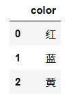
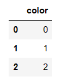
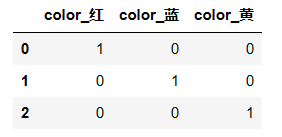

# 机器学习

```python
# 数据集
from sklearn.datasets import load_*,fetch_*
# 数据集划分
from sklearn.model_selection import train_test_split
# 特征抽取
from sklearn.feature_extraction import DictVectorizer,text.CountVectorizer
```


# 1、机器学习概述

## 1.1 人工智能概述

==**机器学习与人工智能、深度学习**==


- 机器学习和人工智能，深度学习的关系
    - 机器学习是人工智能的一个实现途径
    - 深度学习是机器学习的一个方法发展而来

- 达特茅斯会议-人工智能的起点

    1956年8月，在美国汉诺斯小镇宁静的达特茅斯学院中，

    约翰·麦卡锡（John McCarthy）

    马文·闵斯基（Marvin Minsky，人工智能与认知学专家）

    克劳德·香农（Claude Shannon，信息论的创始人）

    艾伦·纽厄尔（Allen Newell，计算机科学家）

    赫伯特·西蒙（Herbert Simon，诺贝尔经济学奖得主）等科学家正聚在一起，讨论着一个完全不食人间烟火的主题：

    **用机器来模仿人类学习以及其他方面的智能。**

    会议足足开了两个月的时间，虽然大家没有达成普遍的共识，但是却为会议讨论的内容起了一个名字：

    [人工智能](https://baike.baidu.com/item/人工智能)

    因此，1956年也就成为了人工智能元年。


==**机器学习、深度学习能做些什么**==

**机器学习的应用场景非常多，可以说渗透到了各个行业领域当中。医疗、航空、教育、物流、电商等等领域的各种场景。**


- 用在挖掘、预测领域：
    - 应用场景：店铺销量预测、量化投资、广告推荐、企业客户分类、SQL语句安全检测分类…
- 用在图像领域：
    - 应用场景：街道交通标志检测、人脸识别等等


- 用在自然语言处理领域：
    - 应用场景：文本分类、情感分析、自动聊天、文本检测等等


## 1.2 什么是机器学习

**定义：**

- 机器学习是从**数据**中**自动分析获得模型**，并利用**模型**对未知数据进行预测。

**解释：**


- 我们人从大量的日常经验中归纳规律，当面临新的问题的时候，就可以利用以往总结的规律去分析现实状况，采取最佳策略。

- 从数据（大量的猫和狗的图片）中自动分析获得模型（辨别猫和狗的规律），从而使机器拥有识别猫和狗的能力。

- 从数据（房屋的各种信息）中自动分析获得模型（判断房屋价格的规律），从而使机器拥有预测房屋价格的能力。

==**关键：**==

- 数据
- 模型
- 预测

**数据集构成：**

- 结构：**特征值+目标值**


> 注：
>
> - 对于每一行数据我们可以称之为**样本**。
> - 有些数据集可以没有目标值：


## 1.3 机器学习算法分类

**算法**是核心，**数据**与**计算**是基础

- 监督学习(supervised learning)（预测）
    - 定义：输入数据是由输入特征值和目标值所组成。函数的输出可以是一个连续的值(称为回归），或是输出是有限个离散值（称作分类）。
    - **==分类== k-近邻算法、贝叶斯分类、决策树与随机森林、逻辑回归、神经网络**
    - **==回归== 线性回归、岭回归**
- 无监督学习(unsupervised learning)
    - 定义：输入数据是由输入特征值所组成。
    - **聚类 k-means**


- 根据目标值是否连续，可以分为：
    - 分类问题
    - 回归问题


## 1.4 机器学习开发流程


- 流程图：


==**开发流程：**==

1. **获取数据**
2. **数据预处理**
3. **特征工程**
4. **机器学习算法训练 - 模型**
5. **模型评估**
6. **应用**


# 2、数据集

```python
# 导入鸢尾花数据集
from sklearn.datasets import load_iris
# 划分训练集和测试集
from sklearn.model_selection import train_test_split
```


## 2.1 可用数据集


Kaggle网址：https://www.kaggle.com/datasets

UCI数据集网址： http://archive.ics.uci.edu/ml/

scikit-learn网址：[http://scikit-learn.org/stable/datasets/index.html#datasets](http://scikit-learn.org/stable/datasets/index.html)


## 2.2 sklearn数据集

### 2.2.1 scikit-learn数据集API介绍

```python
from sklearn.datasets import load_iris
```

- `sklearn.datasets`
    - 加载获取流行数据集
    - `datasets.load_*()`
        - 获取小规模数据集，数据包含在datasets里
    - `datasets.fetch_*(data_home=None)`
        - 获取大规模数据集，需要从网络上下载，函数的第一个参数是data_home，表示数据集下载的目录,默认是 ~/scikit_learn_data/

**load_*   获取小规模数据集**

**fetch_*  获取大规模数据集**


### 2.2.2 sklearn小数据集

- `sklearn.datasets.load_iris()`

    加载并返回鸢尾花数据集

- `sklearn.datasets.load_boston()`

    加载并返回波士顿房价数据集


### 2.2.3 sklearn大数据集

- sklearn.datasets.fetch_20newsgroups(data_home=None,subset=‘train’)
    - **subset：'train'或者'test'，'all'，可选，选择要加载的数据集。**
    - 训练集的“训练”，测试集的“测试”，两者的“全部”


## 2.3 数据集划分

```python
sklearn.model_selection.train_test_split(arrays, *options)
```

机器学习一般的数据集会划分为两个部分：

- 训练数据：用于训练，**构建模型**
- 测试数据：在模型检验时使用，用于**评估模型是否有效**

划分比例：

- 训练集：70% 80% 75%
- 测试集：30% 20% 30%

**数据集划分api**

```python
X_train, X_test, y_train, y_test = train_test_split(X, y, test_size=0.25, random_state=0, stratify=y)
```

参数含义：

- X： 数据集的特征值
- y： 数据集的标签值
- test_size： 测试集的大小，一般为float
- random_state： 随机数种子,不同的种子会造成不同的随机采样结果。相同的种子采样结果相同。
- return： 训练集特征值，测试集特征值，训练标签，测试标签(默认随机取)


# 3、特征工程(Feature Engineering)


## 3.1 基本概念

==**为什么需要特征工程？**==

机器学习领域的大神Andrew Ng(吴恩达)老师说“Coming up with features is difficult, time-consuming, requires expert knowledge. “Applied machine learning” is basically feature engineering. ”

注：业界广泛流传：数据和特征决定了机器学习的上限，而模型和算法只是逼近这个上限而已。


==**什么是特征工程？**==

特征工程是使用**专业背景知识和技巧处理数据**，**使得特征能在机器学习算法上发挥更好的作用的过程**。

- 意义：会直接影响机器学习的效果

- pandas	数据清洗、数据处理
- sklearn    特征工程


==**特征工程内容**==

- 特征抽取
- 特征预处理
- 特征降维


## 3.2 特征抽取/特征提取

**API：**

```python
sklearn.feature_extraction
```


**任务：**将任意数据（如文本或图像）转换为可用于机器学习的数字特征

文本 —》数值

类型 —》数值

>注：特征值化是为了计算机更好的去理解数据


**分类**

- 字典特征提取(特征离散化)
- 文本特征提取
- 图像特征提取（深度学习将介绍）


### 字典特征提取

**作用：对字典数据进行特征值化**

**对于特征当中存在类别信息的我们都会做one-hot编码处理**

接口：

```python
sklearn.feature_extraction.DictVectorizer(sparse=True,…)
```

方法：

```python
DictVectorizer.fit_transform(X)
# X: 字典或者包含字典的迭代器返回值：返回sparse矩阵

DictVectorizer.inverse_transform(X)
# X: array数组或者sparse矩阵 返回值:转换之前数据格式

DictVectorizer.get_feature_names_out()
# 返回类别名称
```


实例：**one-hot编码/哑变量**

```python
[{'city': '北京','temperature':100}
{'city': '上海','temperature':60}
{'city': '深圳','temperature':30}]
```


代码：

```python
from sklearn.feature_extraction import  DictVectorizer

def dict_demo():
    """
    字典特征抽取
    :return:
    """
    data = [{'city': '北京','temperature':100},{'city': '上海','temperature':60},
            {'city': '深圳','temperature':30}]
    # 1、实例化一个转换器类
    transfer = DictVectorizer(sparse=True)
    # 2、调用fit_transform()
    data_new = transfer.fit_transform(data)
    print(data_new)
    print('特征名字：', transfer.get_feature_names_out())
    return None

if __name__ == '__main__':
    # 代码1：字典特征抽取
    dict_demo()
```

输出：

```python
  (0, 1)	1.0
  (0, 3)	100.0
  (1, 0)	1.0
  (1, 3)	60.0
  (2, 2)	1.0
  (2, 3)	30.0
特征名字： ['city=上海' 'city=北京' 'city=深圳' 'temperature']
```

应用场景：

- 数据集当中类别特征值比较多
- 数据本身是字典类型


### 文本特征提取

**作用：对文本数据进行特征值化**

接口：返回词频矩阵

```python
sklearn.feature_extraction.text.CountVectorizer(stop_words=[])
```

方法：

```python
CountVectorizer.fit_transform(X)
# X: 文本或者包含文本字符串的可迭代对象 返回值：返回sparse矩阵

CountVectorizer.inverse_transform(X)
# X: array数组或者sparse矩阵 返回值:转换之前数据格

CountVectorizer.get_feature_names()
# 返回值:单词列表
```


- **`sklearn.feature_extraction.text.TfidfVectorizer`**

实例：通过词频，自动忽略标点

```python
["life is short,i like python",
"life is too long,i dislike python"]
```


## 3.3、特征预处理


## 3.4、特征降维


# 独热编码

独热编码（One-hot encoding）是将离散型的特征转换为数值型特征的一种方法，通常用于机器学习中的数据预处理和特征工程。在进行独热编码时，有两种常见的方式：

1. **替换原内容**：这种方式是将原始特征中每个可能的取值都编码成一个唯一的数字，并将原特征中的每个值替换为相应的数字。然后，对于每个离散型特征，建立一个新的二元特征，其中每个二元特征对应着原特征中的一种取值。如果原特征有N个不同的取值，那么就需要新建N个二元特征。每个样本对应的二元特征中只有一个值为1，其他值都为0，表示该样本对应的原特征的取值。
2. **转换为列数**：这种方式是将原始特征中每个可能的取值都作为一个新的列，若一个样本的特征取值为该列的取值，则该列对应的值为1，否则为0。例如，如果原特征有N个不同的取值，那么就需要新建N个特征列。这种方式产生的特征矩阵中每一行对应一个样本，每一列对应一个离散型特征的一个取值。

需要注意的是，对于某些机器学习算法，这两种方式可能会产生不同的结果。在使用独热编码进行数据预处理和特征工程时，我们需要根据具体情况选择合适的编码方式，以获得更好的模型性能。

```python
df = pd.DataFrame({'color': ['红', '蓝', '黄']})
df
```



```python
# 替换原内容
from sklearn.preprocessing import LabelEncoder
lbl = LabelEncoder()   
df['color'] = lbl.fit(list(df.values)).transform(list(df.values))
df
```



```python
# 转换为列数
df = pd.DataFrame({'color': ['红', '蓝', '黄']})
pd.get_dummies(df)
```




