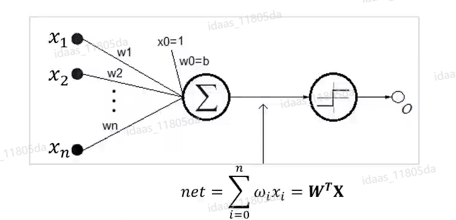

# 深度学习基础

- 深度学习，是一种基于无监督特征学习和特征层次结构学习的模型，在计算机视觉，语言识别，自然语言处理等领域有着突出优势。

| 传统机器学习                                                 | 深度学习                                                     |
| ------------------------------------------------------------ | ------------------------------------------------------------ |
| 对计算机硬件需求较小：计算量级有限，一般不需要GPU显卡做并行运算 | 对硬件有一定要求：大量数据需要进行大量的矩阵运算，**需配用GPU做并行运算** |
| 适合小数据量训练，再增加数据量难以提升性能                   | 高维的权重参数，海量的训练数据下可以获得高性能               |
| 需要将问题逐层分解                                           | **“端到端”的学习**                                           |
| 人工进行特征选择                                             | 利用算法自动提取特征                                         |
| 特征可解释性强                                               | **特征可解释性弱**                                           |

## 1、神经网络

### 1.1、神经网络定义

- 目前，关于神经网络的定义尚不统一， 按美国神经网络学家Hecht Nielsen 的观点，神经网络的定义是:“ **神经网络是由多个非常简单的处理单元彼此按某种方式相互连接而形成的计算机系统，该系统靠其状态对外部输入信息的动态响应来处理信息**”
- 综合神经网络的来源、特点和各种解释，它可简单地表述为:**人工神经网络是一种旨在模仿人脑结构及其功能的信息处理系统。**
- 人工神经网络(简称神经网络) :是由人工神经元互连组成的网络，它是从微观结构和功能上对人脑的抽象、简化，是模拟人类智能的一条重要途径，反映了人脑功能的若干基本特征，如并行信息处理、学习、联想、模式分类、记忆等。
- 深度学习一般指深度神经网络，深度指神经网络的层数（多层）。

### 1.2、单层感知机

- 输入权重：$X=[x_0,x_1,\cdots,x_n]^T$.

- 权重：$W=[w_0,w_1,\cdots,w_n]$，其中$w_0$称为偏置。

- 激活函数：$O=sign(net)=\begin{cases}1,net>0, \\ -1,otherwise. \end{cases}$

    

- 上面的感知机，相当于一个分类器，它使用高维X向量做输入，在高维空间对输入的样本进行二分类：当$W^TX>0$时，$O=1$，相当于样本被归类为其中一类。否则，$O=-1$，相当于样本被归类为另一类。
- 这两类的边界在哪里呢？就是$W^TX=0$，这是一个高维的超平面。

### 1.3、 XOR问题

- 1969年，美国数学家及人工智能先驱Minsky在其著作中证明了感知机本质上是一种线性模型，只能处理线性分类问题，**无法处理非线性数据**。
- **无法解决异或问题**。

### 1.4、多层感知机 - 前馈神经网络

- 在单层感知机的基础上多加一层隐藏层。
- 多层的感知机其实就是一种**前馈神经网络**。
- 在神经网络中，各个神经单元都是**分层排列**的。
    - **输入**节点没有计算功能，只是为了**输入特征向量**。
    - 基于**计算功能**的神经元都在**隐藏层**，它们都**具有激活函数**。激活函数通过计算将结果输入下一层直到计算的结果通过输出层。
    - 神经元只接受前一层的输出，并将结果传给下一层。
    - **同一层神经元之间并不存在相互的联系，层与层之间的信息只沿着一个方向**。
- 加入了两层的隐藏层，就可以**解决XOR**问题。

### 1.5、隐藏层数对神经网络的影响

- 隐含层数对神经网络的性能有一个巨大的影响。
- **增加的隐藏层数越多，它的分辨能力越强。**

## 2、梯度下降与损失函数

- 对于多元函数$O=f(x)=f(x_0,x_1,\cdots,x_n)$，其在$X'=[x_0',x_1',\cdots,x_n']^T$处的梯度为：

$$
\nabla f(x_0',x_1',\cdots,x_n')=[\frac{\partial f}{\partial x_0},\frac{\partial f}{\partial x_1},\cdots,\frac{\partial f}{\partial x_2}]^T|_{X=X'}
$$

​		**梯度向量的方向，指向函数增长最快的方向**。因此，**负梯度向量$-\nabla f$,则指向函数下降最快的方向**。

- 在训练深度学习网络的时候，我们要首先要**参数化描述目标分类的错误**，这就是**损失函数(误差函数**)，它反映了感知器目标输出和实际输出之间的误差。最常用的误差函数为**均方误差**:

$$
E(w)=\frac{1}{2}\sum_{d\in D}(t_d-p_d)^2,
$$

- 其中，$d$为训练样例，$D$为训练样例集，$t_d$为目标输出，$0_a$为实际输出。
- **机器学习模型训练的目标就是找到损失函数的最小值， 使得模型尽可能地拟合训练数据集。** 
- **梯度下降法的思想是让损失函数沿着负梯度的方向进行搜索，不断迭代更新参数，最终使得损失函数最小化。**
- 损失函数的权值
    - **目的：**损失函数E(W)是定义在权值空间上的函数。我们的目的是**搜索使得E(W)最小的权值向量W**。
    - **限制**：$E(w)=\frac{1}{2}\sum_{d\in D}(t_d-p_d)^2$的复杂高维曲面，在数学上，尚没有求极值解的有效方法。

___

- **交叉熵误差：**

$$
E(W)=\frac{1}{n}\sum_{d\in D}(t_d\ln o_d+(1-t_d)\ln (1-d_d))^2
$$

- **交叉熵误差**刻画了**两个概率分布之间的距离**，**是分类问题中使用较多的一种损失函数**。
- 一般**均方误差**更多得用于**回归问题**，而**交叉熵误差**更多的用于**分类问题**。

- 为什么要使用交叉熵误差？
    - 例如，使用sigmoid函数作为损失函数，导数容易产生饱和，从而使得参数更新慢，参数更新慢，难以找到最小值。

### 梯度下降法的更新权重

$$
w'=w-\varepsilon *\frac{\partial Loss}{\partial w}
$$

- $w'$是更新后的权重参数，$w$是更新前的权重参数，$\varepsilon$是学习率（步长）
- 在FNN中，用梯度下降法的参数更新公式：

$$
W_{t+1}=W_t-\eta \frac{dC}{dW}
$$

​		其中$C=J(W)$为损失函数。

- **在计算时，$W$要对应到里面的每一个元素$w_i$。**

### 全局梯度下降算法（BGD）

- 对于训练样例集D中的每一个样例即为$<X,t>$，$X$是输入值向量，$t$为目标输出，$o$为实际输出，$\eta$是学习率。
    - 初始化每个$w_i$为**绝对值较小的随机值**
    - 遇到终值条件前，do：
        - **初始化每个$\Delta w_i$为零**
        - **对于D中每个$<X,t>$，**do：
            - 将$X$输入此单元，计算输出$o$
            - 对于此单元的每个$w_i$，do：$\Delta w_i=\eta(t-o)x_i$
        - 对于此单元的每个$w_i$，do：$w_i+=\Delta w_i$
    
    绝对值较小，可以为正也可以为负。
    
    终值条件，**设置阈值和迭代次数**
    
- 这个版本的梯度下降法，十几岁并不常用，它的主要问题是：

    - **收敛过程非常慢**，因此每次更新权值都需要计算所有的训练样例；

### 随机梯度下降算法（SGD）

- 针对原始梯度下降算法的弊端，一个常见的变体称为增量梯度下降（Incremental Gradient Descent），亦即**随机梯度下降**( SGD: Stochastic Gradient Descent) 。其中一种实现称为**在线学习**( Online Learning )，它根据每一个样例来更新梯度:

$$
\Delta w_i = \eta \sum_{d\in D}(t_d-o_d)x_{id}\Rightarrow \Delta w_i=\eta(t_d-o_d)x_{id}
$$

- **只随机选取一个样本对权重更新。**
- **局限性：**不能找到我们的全局最小值，有可能认为局部最小值就是我们的全局最小值了。

### 小批量梯度下降（MBGD）

- 针对上两种梯度下降算法的弊端，提出了一个实际工作中最常用的梯度下降算法，即Mini-Batch SGD。它的思想是**每次使用一小批固定尺寸( BS: Batch Size )**的样例来计算$\Delta w_i$，然后更新权值。
- **从D中选择下一批（BS个）样例**，对这批样例中的每一个计算。
- 将数据集按照固定尺寸划分为不同的Batch，**每一次更新权重时要选取不同的Batch。**

## 3、反向传播算法

- 信号正向传播，误差反向传播
- 对于训练样例集$D$中的每一个样例记为$<X,t>$, $X$是输入值向量，$t$为目标输出，$o$为实际输出，$w$为权重系数
- 损失函数：

$$
E(w)=\frac{1}{2}\sum_{d\in D}(t_d-o_d)^2
$$

- 根据如下公式可以发现，**损失函数中产生的误差**，是通过**输入层到隐藏层到输出层逐渐积累**形成的。
- 其中**$w_c$指隐藏层到输出层的权重系数**，**$w_b$指输入层到隐藏层的权重系数**。$f$指的是激活函数，$D$表示输出层的集合，$C$和$B$分别隐藏层与输入层的集合。
    - 输出层的误差： $E=\dfrac{1}{2}\sum_{d\in D}(t_d-o_d)^2$
    - 误差隐藏层展开：$E=\dfrac{1}{2}\sum_{d\in D}[t_d-f(net_d)]^2=\dfrac{1}{2}\sum_{d\in D}[t_d-f(\sum_{c\in C}w_cy_c)]^2$
    - 误差输入层展开：$E=\dfrac{1}{2}\sum_{d\in D}[t_d-f(\sum_{c\in C}w_cf(cet_c))]^2=\dfrac{1}{2}\sum_{d\in D}[t_d-f(\sum_{c\in C}w_cf(\sum_{b\in B}w_bx_b))]^2$
- 有了误差E，那么为了使误差越来越小，可以采用梯度下降法迭代计算进行$w_c$和$w_b$的求解，即求得所有$W_c$和$W_b$使得误差E最小
- 公式如下：

$$
\Delta w_c=-\eta \frac{\partial E}{\partial w_c},c\in C\\
\Delta w_b=-\eta \frac{\partial E}{\partial w_b},b\in B\\
$$

- 存在数个隐藏层也可以使用求导的链式法则逐层求导，迭代求解最优参数。
- **对于任意层的神经网络，训练的公式经过整理以后如下：**

$$
\Delta w_{ji}=-\eta \delta_jx_{ji}\\
\delta_j=\begin{cases}
o_j(1-o_j)(t_j-o_j),j\in outputs,(1)\\
o_j(1-o_j)\sum_{k\in DS(j)}\delta_kw_{kj},otherwise,(2)
\end{cases}
$$

- **BP算法训练网络的步骤如下:**
    - 取出下一个训练样例$<X, T>$,将$X$输入网络，得到实际输出$o$。
    - **根据输出层误差公式( 1 )求取输出层$\delta$，并更新权值。**
    - 对于隐层，根据**隐层误差传播公式( 2 )从输出往输入方向反向、逐层、迭代计算各层的$\delta$，**每计算好一层的$ \delta$，更新该层权值，直至所有权值更新完毕。
    - 返回1中继续。

- **$\delta$指惯性，计算好$\Delta w_{ji}$之后，用公式$W_i+=\Delta w_i$更新权重。**

## 4、激活函数

- **激活函数（Activation functions）**对于神经网络模型去学习、理解**非常复杂和非线性的函数**来说具有非常重要的作用，激活函数的存在**将非线性特性引入到我们的网络中。**
- 如果我们不运用激活函数，则输出信号将仅仅是一个简单的线性函数。线性函数的复杂性有限，从数据中学习复杂函数映射的能力更小。

$$
output=f(w_1x_1+w_2x_2+w_3x_3)=f(W^t\cdot X)
$$

### 4.1 Sigmoid函数

$$
f(x)=\frac{1}{1+e^{-x}}
$$

- 分母加1是为了保障分母不等于0；
- 分母最小为1，最大为无穷，所以**函数的取值范围：$[0,1]$;**
- 函数的**导数的取值范围：$[0,1/4]$;**
- **那么在远离中心点的位置，导数普遍为0。**
    - 出现的问题：**一般来说，如果网络在5层以内产生梯度退化为0**的这一种现象，那么我们就将这种现象叫做**梯度消失问题**。

- **梯度消失问题是Sigmoid问题的缺点。**
- **Sigmoid函数适合用于二分类问题。**

### 4.2 tanh函数

$$
\tanh x=\frac{e^x-e^{-x}}{e^x+e^{-x}}
$$

- 值域：$[-1,1]$，导数值域：$[0,1]$.
- 也存在梯度消失的问题。
- **多用于多分类问题。**

### 4.3 Softsign函数

$$
f(x)=\frac{x}{1+|x|}
$$

- 值域：$[-1,1]$，导数值域：$[0,1]$。
- 导数在远离中心点处，仍会出现为0的情况。
- 减缓了梯度消失问题，但是还会出现梯度消失问题。

### 4.4 ReLU函数

- Rectified Linear Unit

- **并没有解决梯度消失问题，但可以很大程度上避免这个问题。**

$$
y=\begin{cases}
x,\quad x\ge 0\\
0,\quad x<0
\end{cases}
$$

- 计算量较小。
- 让负方向的值为0，也相当于做了**特征选择**。
- Relu激活函数的导数是常数，它永远不会趋于0，它没有出现饱和的问题，所以说**Relu函数能够很快的去更新我们的参数，也是减缓了梯度消失问题。**

- **缺点：**在x=0时，出现了一个棱角，在某些问题上，不够平滑。也就是说**在做回归任务时，我们没法更好的去预测我们的一个预测值。**

