# 特殊指标概念

## 1. IoU(Intersection over Union)

IOU的全称为**交并比**，是目标检测中使用的一个概念，IoU计算的是“预测的边框”和“真实的边框”的交叠率-，即它们的交集和并集的比值。最理想情况是完全重叠，即比值为1。

### 1.1 IoU的计算

IoU等于“预测的边框”和“真实的边框”之间交集和[并集](https://so.csdn.net/so/search?q=并集&spm=1001.2101.3001.7020)的比值。

$$
IOU=\frac{A\cap B}{A\cup B}
$$
IoU相当于两个区域重叠的部分除以两个区域的集合部分得出的结果。

**一般来说，这个score ＞ 0.5 就可以被认为一个不错的结果了。**

**mean IU**指的是不同类别识别准确度的平均值，比如一幅图中要识别三个物体，mean IU就是三个物体分别准确度加起来的平均值。

### 1.2 使用条件： 

IoU是一个简单的测量标准，只要是在输出中得出一个预测范围(bounding boxex)的任务都可以用IoU来进行测量。为了可以使IoU用于测量任意大小形状的物体检测，我们需要：
1、 **ground-truth bounding boxes**（人为在训练集图像中标出要检测物体的大概范围）；
2、我们的算法得出的**结果范围**。

也就是说，这个标准用于测量真实和预测之间的相关度，相关度越高，该值越高。
如下图：

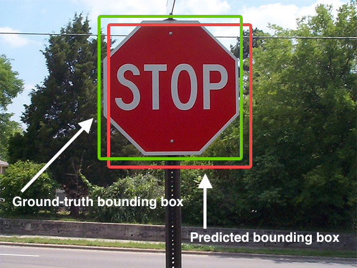

### 1.3 优缺点

普通IOU的优缺点很明显，优点：

- IOU具有尺度不变性
- 满足非负性

同时，由于IOU并没有考虑框之间的距离，所以它的作为loss函数的时候也有相应的缺点：

- 在A框与B框不重合的时候IOU为0，不能正确反映两者的距离大小。

- IoU无法精确的反映两者的重合度大小。如下图所示，三种情况IOU都相等，但看得出来他们的重合度是不一样的，左边的图回归的效果最好，右边的最差。

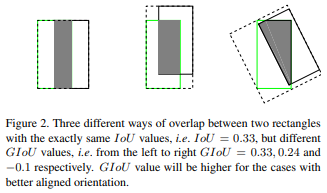

### 1.4 对IOU的改进

普通IOU是对两个框的**距离不敏感**的，下面两张图中，左图预测框的坐标要比右图预测框的坐标更接近真实框。但两者的IOU皆为0，如果直接把IOU当作loss函数进行优化，则loss=0，没有梯度回传，所以无法进行训练。

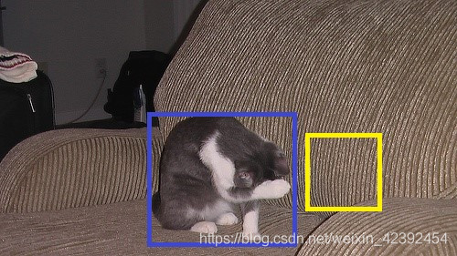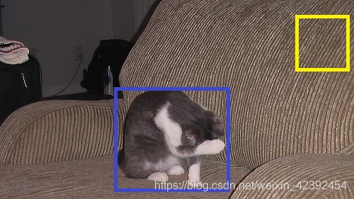

#### GIOU

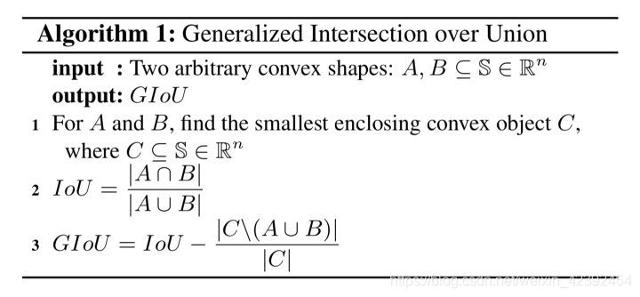

1. 对于任意的两个Ａ、B框，首先找到一个能够包住它们的最小方框，例如在上述场景 A 和 B 中，C 的形状分别为:

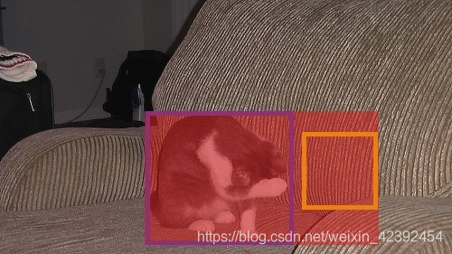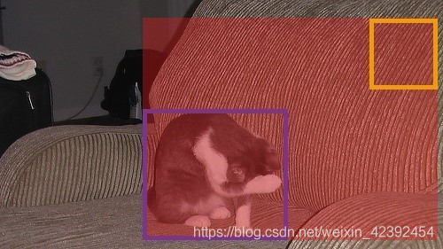

2. 计算IOU

3. 根据A、B，我们可以算出C的面积，有了C的面积就可以计算出GIOU了：

$$
GIOU=IOU−\frac{C−(A∪B)}{C} \\

GIOU = -1 + \frac{(A\cup B)}{C} \quad\quad\quad(IOU=0)
$$

而当IOU为0时，意味着A与B非常远时，$\frac{A\cup B}{C} $无限接近于0，GIOU趋近于-1，同理当IOU为1时，两框重合，$ \frac{A\cup B}{C} $为1。所以GIOU的取值为(-1, 1]。

GIOU作为loss函数时，为$L=1−GIOU$ ，当A、B两框不相交时A∪B值不变，最大化GIOU就是就小化C ，这样就会促使两个框不断靠近。

#### DIOU

尽管GIoU解决了在IoU作为损失函数时梯度无法计算的问题，且加入了最小外包框作为惩罚项。但是它任然存在一些问题。下图第一行的三张图片是GIoU迭代时预测框收敛情况。其中黑色框代表anchor，蓝色框代表预测框，绿色框代表真实框。

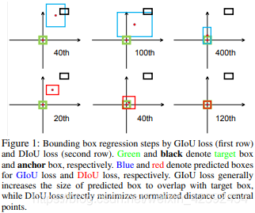

上图中可以看出，GIoU在开始的时候需要将检测结果方法使其与目标框相交，之后才开始缩小检测结果与GT重合，这就带来了需要较多的迭代次数才能收敛问题，特别是对于水平与垂直框的情况下。此外，其在一个框包含另一个框的情况下，GIoU降退化成IoU，无法评价好坏，见下图所示：

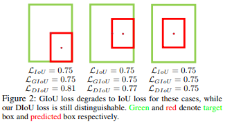

综合以上的问题，又有大神提出了DIoU：
$$
DIoU=\frac{ρ^2(A,B)}{c^2}
$$
其中d=ρ(A,B)是A框与B框中心点坐标的欧式距离，而c则是包住它们的最小方框的对角线距离。

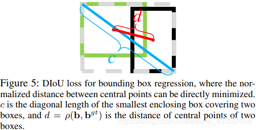

完整的DIoU Loss定义如下：
$$
L DIoU=1−IoU+\frac{ρ^2(A,B)}{c^2}
$$
从公式和示意图中，我们可以看到，DIoU有几个优点：

DIoU的惩罚项是基于中心点的距离和对角线距离的比值，避免了像GIoU在两框距离较远时，产生较大的外包框，Loss值较大难以优化（因为它的惩罚项是A ∪ B A \cup BA∪B比上最小外包框的面积）。所以DIoU Loss收敛速度会比GIoU Loss快。
即使在一个框包含另一个框的情况下，c值不变，但d值也可以进行有效度量。

#### CIOU

同时DIoU的作者考虑到，在两个框中心点重合时，c与d的值都不变。所以此时需要引入框的宽高比：
$$
CIoU=\frac{ρ^2(A,B)}{c^2}+αv
$$
其中α 是权重函数，v用来度量宽高比的一致性：
$$
α=\frac{v}{(1−IoU)+v}\\

v = \frac{4}{π^2} (arctan\frac{w^{gt}}{h^{gt}} − arctan\frac{w}{h})^2
$$
最终CIoU Loss定义为：
$$
CIoU=1−IoU+\frac{ρ^2(A,B)}{c^2} +αv
$$

## 2. batchsize

中文翻译为批大小（批尺寸）。

简单点说，批量大小将决定我们**一次训练的样本数目**。

batch_size将影响到模型的优化程度和速度。

**batchsize的正确选择是为了在内存效率和内存容量之间寻找最佳平衡。**

Batch_Size的取值：

**全批次（蓝色）**

如果数据集比较小，我们就采用全数据集。全数据集确定的方向能够更好的代表样本总体，从而更准确的朝向极值所在的方向。

注：对于大的数据集，我们不能使用全批次，因为会得到更差的结果。

**迷你批次（绿色）**

选择一个适中的Batch_Size值。就是说我们选定一个batch的大小后，将会以batch的大小将数据输入深度学习的网络中，然后计算这个batch的所有样本的平均损失，即代价函数是所有样本的平均。

**随机（Batch_Size等于1的情况）（红色）**

每次修正方向以各自样本的梯度方向修正，横冲直撞各自为政，难以达到收敛。
### 适当的增加Batch_Size的优点：
1.通过并行化提高内存利用率。

2.单次epoch的迭代次数减少，提高运行速度。（单次epoch=(全部训练样本/batchsize)/iteration=1） iteration：中文翻译为迭代。

3.适当的增加Batch_Size,梯度下降方向准确度增加，训练震动的幅度减小。（看上图便可知晓）

**Batch_Size的正确选择是为了在内存效率和内存容量之间寻找最佳平衡。**

深度学习中经常看到epoch、iteration和batchsize，下面按照自己的理解说说这三个区别：

（1）**batchsize**：批大小。在深度学习中，一般采用SGD训练，即每次训练在训练集中取batchsize个样本训练；
（2）**iteration**：1个iteration等于使用batchsize个样本训练一次；
（3）**epoch**：1个epoch等于使用训练集中的全部样本训练一次；

**举个例子，训练集有1000个样本，batchsize=10，那么：**
**训练完整个样本集需要：**
**100次iteration，1次epoch。**

## 3. epoch

**当一个完整的数据集通过了神经网络一次并且返回了一次，这个过程称为一次epoch。然而，当一个epoch对于计算机而言太庞大的时候，就需要把它分成多个小块。**

### 为什么要使用多于一个epoch?

在神经网络中传递完整的数据集一次是不够的，而且我们需要将完整的数据集在同样的神经网络中传递多次。但请记住，我们使用的是有限的数据集，并且我们使用一个迭代过程即梯度下降来优化学习过程。如下图所示。因此仅仅更新一次或者说使用一个epoch是不够的。

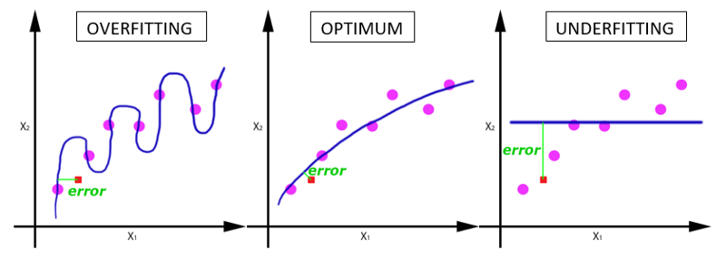

随着epoch数量增加，神经网络中的权重的更新次数也在增加，曲线从欠拟合变得过拟合。