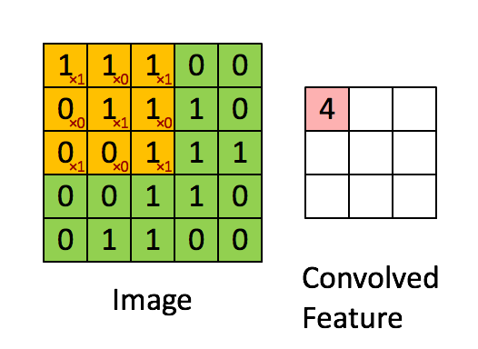

# 神经网络中的常见概念

## 1. 通道（channel）

 `in_channels` 和 `out_channels` ，即输入[通道](https://so.csdn.net/so/search?q=通道&spm=1001.2101.3001.7020)数和输出通道数

1. 对于最初输入图片样本的通道数 in_channels 取决于图片的类型，如果是彩色的，即RGB类型，这时候通道数固定为3，如果是灰色的，通道数为1。
2. 卷积完成之后，输出的通道数 out_channels 取决于过滤器的数量。从这个方向理解，这里的 out_channels 设置的就是过滤器的数目。
3. 对于第二层或者更多层的卷积，此时的 in_channels 就是上一层的 out_channels ， out_channels 还是取决于过滤器数目。

对于第1点可以参考下图：

这里输入通道数是3，每个通道都需要跟一个卷积核做卷积运算，然后将结果相加得到一个特征图的输出，**这里有4个过滤器，因此得到4个特征图的输出，输出通道数为4**。

再来看一下单通道的例子：

输入是灰色图片，输入通道数是1，卷积核有3个，做三次卷积操作，生成3个特征图，输出通道数为3。

计算机要表示整张图片，就是用数字去表示整张图片的所有像素，但是每个像素需要三个数值来表示，于是就有了图片的3通道。每个通道分别表示RGB三种颜色。

最初的通道数是3，但是有的[神经网络](https://so.csdn.net/so/search?q=神经网络&spm=1001.2101.3001.7020)通道数目多达100多个，怎么理解呢？

我们依然可以类比RGB通道，对于多通道我们可以看做是颜色表示的更抽象版本，**每一个通道都表示图像某一方面的信息**。

## 2. 卷积核（kernel）和过滤器（filter）的区别

- [卷积核](https://so.csdn.net/so/search?q=卷积核&spm=1001.2101.3001.7020)就是由长和宽来指定的，是一个二维的概念。
- 而过滤器是是由长、宽和[深度](https://so.csdn.net/so/search?q=深度&spm=1001.2101.3001.7020)指定的，是一个三维的概念。
- **过滤器可以看做是卷积核的集合**。
- **过滤器比卷积核高一个维度——深度**。

下面结合一个[多通道](https://so.csdn.net/so/search?q=多通道&spm=1001.2101.3001.7020)的例子马上就能理解了：

上图是对一个3通道的图片做卷积操作，卷积核的大小为 3×3 ，卷积核的数目为3，此时**过滤器指的就是这三个卷积核的集合**，维度是 3×3×3 ，前面的 3×3 指的是卷积核的高度（H）和宽度（W），后面的那个 3 指的是**卷积核的数目**。
上面的操作是对三个通道分别做卷积操作，然后将卷积的结果相加，最后输出一个特征图。

即： **一个过滤器就对应一个特征图**。

一般情况下，过滤器的概念应当应用在多通道的情况下，因为在多通道情况下，我们没办法说一个卷积操作就能够产生一个特征图，于是有了过滤器这个概念，便于描述这种情况。

再来看一个单通道的例子：

上图就是对一个单通道的图片做卷积操作，卷积核的大小是 3 × 3  ，卷积核的数目为1，最终得到1个特征图。

在**单通道**情况下，其实过滤器和卷积核可以看做一个东西，即 **filter=kernel** 。

如果要得到**多个特征图**其实只需要**多加几个卷积核**即可。

这时候，**一个卷积核就对应一个特征图**。

## 3. 张量（tensor）

张量=容器

张量是现代机器学习的基础。它的核心是一个**数据容器**，多数情况下，它包含数字，有时候它也包含字符串，但这种情况比较少。因此把它想象成一个数字的水桶。

装在张量/容器水桶中的每个数字称为“标量”。标量是一个数字。

实际上，你可以使用一个数字的张量，我们称为0维张量，也就是一个只有0维的张量。它仅仅只是带有一个数字的水桶。想象水桶里只有一滴水，那就是一个0维张量。

**它仅仅是组织数据成为可用的格式。**

### 1、1维张量/向量

- 1维张量：数组。数组在深度学习中称为1维张量。

- 1维张量只有一个坐标轴。
- 1维张量称为“向量”。

### 2、2维张量

- 矩阵——2维张量称为矩阵

- 可以把它看作为一个带有行和列的数字网格
- 这个行和列表示两个坐标轴，一个矩阵是二维张量，意思是有两维，也就是**有两个坐标轴的张量**。

张量具有“形状”，它的形状是一个水桶，既装着我们的数据也定义了张量的最大尺寸。

### 3、3维张量

这时张量真正开始变得有用，我们经常需要把一系列的二维张量存储在水桶中，这就形成了3维张量。

- 一个三维张量有三个坐标轴
- 一个3维张量是一个数字构成的立方体。

### 4、总结

这里有一些存储在各种类型张量的公用数据集类型：

- 3维=时间序列
- 4维=图像
- 5维=视频

几乎所有的这些张量的**共同之处是样本量**。样本量是集合中**元素的数量**，它可以是一些图像，一些视频，一些文件或者一些推特。

通常，真实的数据至少是一个数据量。

把形状里**不同维数看作字段**。我们找到一个字段的**最小值**来描述数据。

因此，4维张量通常存储图像，那是因为样本量占据张量的第4个字段。

例如，一个图像可以用三个字段表示：

**(width, height, color_depth) = 3D**

但是，在机器学习工作中，我们经常要处理不止一张图片或一篇文档——我们要处理一个集合。我们可能有10,000张郁金香的图片，这意味着，我们将用到4D张量

**(sample_size, width, height, color_depth) = 4D**

### 5、时间序列数据

用3D张量来模拟时间序列会非常有效！

医学扫描——我们可以将脑电波（EEG）信号编码成3D张量，因为它可以由这三个参数来描述：

**(time, frequency, channel)**

如果我们有多个病人的脑电波扫描图，那就形成了一个4D张量：

**(sample_size, time, frequency, channel)**

### 6、文本数据

可以用3D张量来存储文本数据。

首先，推特有140个字的限制。其次，推特使用UTF-8编码标准，这种编码标准能表示百万种字符，但实际上我们只对前128个字符感兴趣，因为他们与ASCII码相同。所以，一篇推特文可以包装成一个2D向量：

（140,128）

如果我们下载了一百万篇川普哥的推文（印象中他一周就能推这么多），我们就会用3D张量来存：

**(number_of_tweets_captured, tweet, character)**

这意味着，我们的川普推文集合看起来会是这样：

(1000000,140,128)

### 7、图片

4D张量很适合用来存诸如JPEG这样的图片文件。

一张图片有三个参数：高度、宽度和颜色深度。一张图片是3D张量，**一个图片集则是4D，第四维是样本大小**。

TensorFlow这样存储图片数据：

**(sample_size, height, width, color_depth)**

### 8、视频

5D张量可以用来存储视频数据。TensorFlow中，视频数据将如此编码：

**(sample_size, frames, width, height, color_depth)**

如果我们考察一段5分钟（300秒），1080pHD（1920 x 1080像素），每秒15帧（总共4500帧），颜色深度为3的视频，我们可以用4D张量来存储它：

**(4500,1920,1080,3)**

当我们有多段视频的时候，张量中的第五个维度将被使用。如果我们有10段这样的视频，我们将得到一个5D张量：

**(10,4500,1920,1080,3)**