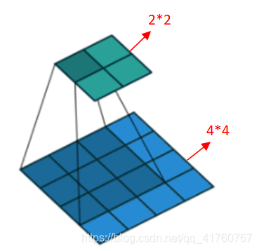
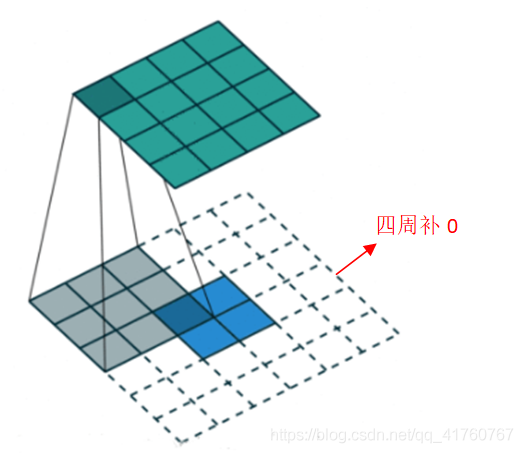
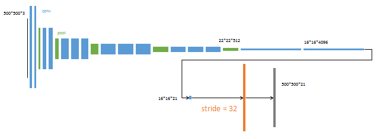
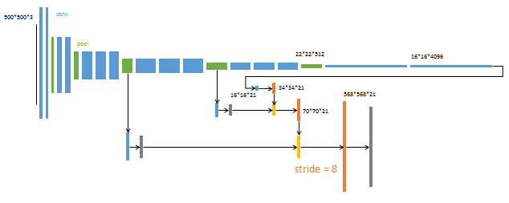
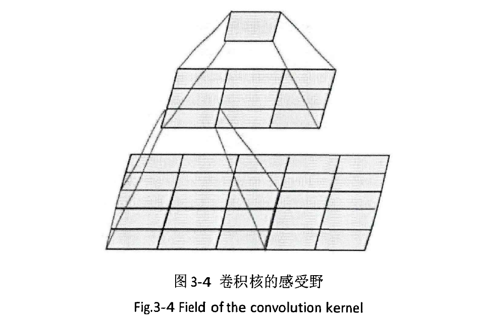

# 全卷积神经网络（FCN）

参考文献：

1. [FCN（全卷积神经网络）详解_晓野豬的博客-CSDN博客_fcn](https://blog.csdn.net/qq_41731861/article/details/120511148?ops_request_misc=%7B%22request%5Fid%22%3A%22166783331316782428625803%22%2C%22scm%22%3A%2220140713.130102334..%22%7D&request_id=166783331316782428625803&biz_id=0&utm_medium=distribute.pc_search_result.none-task-blog-2~all~top_positive~default-2-120511148-null-null.142^v63^control,201^v3^add_ask,213^v1^control&utm_term=FCN&spm=1018.2226.3001.4187)
2. [四、全卷积网络FCN详细讲解（超级详细哦）_会哭泣的猫的博客-CSDN博客_全卷积网络](https://blog.csdn.net/qq_41760767/article/details/97521397?ops_request_misc=%7B%22request%5Fid%22%3A%22166783331316782428625803%22%2C%22scm%22%3A%2220140713.130102334..%22%7D&request_id=166783331316782428625803&biz_id=0&utm_medium=distribute.pc_search_result.none-task-blog-2~all~top_positive~default-1-97521397-null-null.142^v63^control,201^v3^add_ask,213^v1^control&utm_term=FCN&spm=1018.2226.3001.4187)

3. [FCN全卷积网络理解及代码实现（来自pytorch官方实现）_是七叔呀的博客-CSDN博客_fcn代码](https://blog.csdn.net/m0_46378271/article/details/125286033?spm=1001.2014.3001.5506)

## 1.简介

全卷积网络（Fully Convolutional Networks，FCN）是Jonathan Long等人于2015年在Fully Convolutional Networks for Semantic Segmentation一文中提出的用于图像语义分割的一种框架，**是深度学习用于语义分割领域的开山之作**。FCN将传统CNN后面的**全连接层换成了卷积层**，这样网络的输出将是**热力图**而非类别；同时，为解决卷积和池化导致图像尺寸的变小，使用上采样方式对图像尺寸进行恢复。

**核心思想**

- 不含全连接层的全卷积网络，可适应任意尺寸输入；
- 反卷积层增大图像尺寸，输出精细结果；
- 结合不同深度层结果的跳级结构，确保鲁棒性和精确性。

## 2. CNN和FCN

CNN的强大之处在于它的多层结构能自动学习特征，可学习到多个层次的特征：

- **较浅**的卷积层感知域较小，学习到一些**局部区域**的特征；

- **较深**的卷积层感知域较大，学习到更加**抽象**一些的特征；

抽象特征对分类很有帮助，可以很好地判断出一幅图像中包含什么类别的物体。但抽象特征对物体的大小、位置和方向等敏感性低，因为丢失了一些物体的细节，不能很好地给出物体的具体轮廓、指出每个像素具体属于哪个物体，因此难以做到精确的分割。而FCN是从抽象的特征中恢复出每个像素所属的类别，即从**图像级别的分类**进一步延伸到**像素级别的分类**.

**CNN:** 在传统的CNN网络中，在最后的卷积层之后会连接上若干个**全连接层**，将卷积层产生的特征图（feature map）映射成为一个**固定长度的特征向量**。一般的CNN结构适用于图像级别的**分类和回归**任务，因为它们最后都期望得到输入图像的分类的概率，如ALexNet网络最后输出一个1000维的向量表示输入图像属于每一类的概率。

**FCN:** FCN是对图像进行**像素级**的分类（也就是**每个像素点都进行分类**），从而解决了语义级别的图像分割问题。与上面介绍的经典CNN在卷积层使用全连接层得到固定长度的特征向量进行分类不同，**FCN可以接受任意尺寸的输入图像**，采用反卷积层对最后一个卷积层的特征图（feature map）进行上采样，使它恢复到输入图像相同的尺寸，从而可以对每一个像素都产生一个预测，同时保留了原始输入图像中的空间信息，最后奇偶在上采样的特征图进行像素的分类。

换为卷积层之后，最后得到的是1000通道的2D图像，可以可视化为heat map图。

**FCN与CNN的区别在于FCN把CNN最后的全连接层换成卷积层，其输出的是一张已经标记好的图，而不是一个概率值。**

## 3. 上采样

FCN网络一般是用来对图像进行语义分割的，于是就需要对图像上的各个像素进行分类，这就需要一种上采样方法将最后得到的输出图**恢复到原图的大小**。

在卷积过程的**卷积操作和池化操作会使得特征图的尺寸变小**，为得到原图像大小的稠密像素预测，需要对得到的特征图进行上采样操作。可通过双线性插值（Bilinear）实现上采样，且**双线性插值易于通过固定卷积核的转置卷积（transposed convolution）实现**，转置卷积即为反卷积（deconvolution）。在论文中，作者并没有固定卷积核，而是让卷积核变成可学习的参数。转置卷积操作过程如下

### 3.1 双线性插值上采样

参考：[双线性插值_太阳花的小绿豆的博客-CSDN博客_双线性插值](https://blog.csdn.net/qq_37541097/article/details/112564822)

#### 3.1.1 线性插值

**线性插值**：`线性插值是指插值函数为一次多项式的插值方式。线性插值的几何意义即为利用过A点和B点的直线来近似表示原函数。线性插值可以用来近似代替原函数，也可以用来计算得到查表过程中表中没有的数值。`

那么如下图所示，假设已知$y_1=f(x_1),y_2=f(x_2)$,现在要通过线性插值的方式得到区间$[x_1,x_2]$内任何一点的$f(x)$值。

易得公式：
$$
\frac{y-y_1}{x-x_1}=\frac{y_2-y_1}{x_2-x_1}
$$
变换：
$$
y=\frac{x_2-x}{x_2-x_1}y_1+\frac{x-x_1}{x_2-x_1}y_2
$$
为方便理解，写成：
$$
f(x)=\frac{x_2-x}{x_2-x_1}f(x_1)+\frac{x-x_1}{x_2-x_1}f(x_2)
$$
#### 3.1.2 双线性插值

**双线性插值**：`双线性插值，又称为双线性内插。在数学上，双线性插值是有两个变量的插值函数的线性插值扩展，其核心思想是在两个方向分别进行一次线性插值。`

双线性插值就是分别在两个方向上分别进行一次简单的线性插值即可。如下图所示，每个点的数值是由$z=f(x,y)$即x , y 两个变量决定。下图可理解为沿z轴方向的俯视图（画三维麻烦）。我们已知$Q_{11},Q_{12},Q_{21},Q_{22}$四个点的值，现在要在这四个点中插入一个点P，并计算出P点的值。

这四个点的值：
$$
f(Q_{11})=f(x_1,y_1)\\
f(Q_{12})=f(x_1,y_2)\\
f(Q_{21})=f(x_2,y_1)\\
f(Q_{22})=f(x_2,y_2)\\
$$
要求P点的值，可以先用线性插值的方法，求得R1和R2的值。对于R1，可以根据Q11和Q21两个点线性插值得到，R2，可以根据Q12和Q22两个点线性插值得到。然后再通过对R1和R2进行线性插值得到点P的值。

**由于Q11和Q21两个点的y值是相同的，所以两点的连线可看做只关于x一个变量的函数，因此可以用上面的线性插值方法。**

由上面的公式：
$$
f(x)=\frac{x_2-x}{x_2-x_1}f(x_1)+\frac{x-x_1}{x_2-x_1}f(x_2)
$$
可以得到R1：
$$
f(R_1)=\frac{x_2-x}{x_2-x_1}f(Q_{11})+\frac{x-x_1}{x_2-x_1}f(Q_{21})
$$
同理，可以得到R2：
$$
f(R_2)=\frac{x_2-x}{x_2-x_1}f(Q_{12})+\frac{x-x_1}{x_2-x_1}f(Q_{22})
$$
得到了R1和R2的插值后，就可以通过这两点去计算P点的值。由于R1和R2两个点的x值是相同的，所以两点的连线可看做只关于y 一个变量的函数。因此，通过线性插值公式可以的到：
$$
f(P)=\frac{y_2-y}{y_2-y_1}f(R_1)+\frac{y-y_1}{y_2-y_1}f(R_2)
$$
带入f(R1)和f(R2)后，可以得到：
$$
\begin{align*}
f(P)=\frac{(x_2-x)(y_2-y)}{(x_2-x_1)(y_2-y_1)}f(Q_{11})+\frac{(x-x_1)(y_2-y)}{(x_2-x_1)(y_2-y_1)}f(Q_{21})\\
+\frac{(x_2-x)(y-y_1)}{(x_2-x_1)(y_2-y_1)}f(Q_{12})+\frac{(x-x_1)(y-y_1)}{(x_2-x_1)(y_2-y_1)}f(Q_{22})
\end{align*}
$$

#### 3.1.3 图像处理中的双线性插值

在图像处理中，常见的坐标系如下图所示，以图像**左上角为坐标原点**，水平向右为x轴正方向，竖直向下为y轴正方向。

注意像素值是从(0, 0)点开始，假设我们在图像中插入一个点P，离P点最近的相邻四个像素点是Q11,Q12,Q21,Q22，并利用双线性插值的方法求其值。

前面我们已经得到了双线性插值的计算公式（由于图像中的y轴方向与之前的方向相反，我将相邻四个像素点的下标进行了调整，故公式不变）：
$$
\begin{align*}
f(P)=\frac{(x_2-x)(y_2-y)}{(x_2-x_1)(y_2-y_1)}f(Q_{11})+\frac{(x-x_1)(y_2-y)}{(x_2-x_1)(y_2-y_1)}f(Q_{21})\\
+\frac{(x_2-x)(y-y_1)}{(x_2-x_1)(y_2-y_1)}f(Q_{12})+\frac{(x-x_1)(y-y_1)}{(x_2-x_1)(y_2-y_1)}f(Q_{22})
\end{align*}
$$

由于四个点Q11,Q12,Q21,Q22是图像中相邻的像素，故有：
$$
x_2-x_1=1,\quad y_2-y_1=1
$$
公式可以简化：
$$
\begin{align*}
f(P)=(x_2-x)(y_2-y)f(Q_{11})+(x-x_1)(y_2-y)f(Q_{21})\\
+(x_2-x)(y-y_1)f(Q_{12})+(x-x_1)(y-y_1)f(Q_{22})
\end{align*}
$$
我们令：
$$
x-x_1=u,\quad y-y_1=v
$$
**带入公式得**：(公式1)
$$
f(P)=(1-u)(1-v)f(Q_{11})+u(1-v)f(Q_{21})\\
+(1-u)vf(Q_{12})+uvf(Q_{22})
$$
我们另：
$$
x_1=i, \quad y_1=j\\
f(Q_{11})=f(i,j)
$$
那么有：
$$
f(Q_{11})=f(i,j),\quad f(Q_{12})=f(i,j+1)\\
f(Q_{21})=f(i+1,j),\quad f(Q_{22})=f(i+1,j+1)
$$
**带入公式进一步得**：（公式2）
$$
f(P)=(1-u)(1-v)f(i,j)+u(1-v)f(i+1,j)\\
+(1-u)vf(i,j+1)+uvf(i+1,j+1)
$$

#### 3.1.4 示例1 数学

假设P点的坐标是(2.6,2.4)，那么距离最近的四个像素点是(2,2),(2,3),(3,2),(3,3)那么u = 0.6 , v = 0.4 假设：
$$
f(2,2)=20,\quad f(2,3)=15\\
f(3,2)=30,\quad f(3,3)=40
$$

计算：
$$
f(P)=0.4\times 0.6\times 20+0.6\times 0.6\times 30+0.4\times0.4\times 15+0.6\times0.4\times 40\\
=27.6\approx28
$$

#### 3.1.5 示例2 resize

下图为该3 × 3灰度图片的grid网格（蓝色），从( 0 , 0 )点开始。现在要通过双线性插值的方式resize到2 × 2 大小。首先，需要计算resize后2 × 2 大小的灰度图片映射在原图像（3 × 3灰度图片）上的坐标。

**根据计算公式（dst表示resize后的信息，src为resize前的信息）：**
$$
SrcX=(dstX+0.5)\times (srcWidth/dstWidth)-0.5\\
SrcY=(dstY+0.5)\times (srcWidth/dstWidth)-0.5
$$
可以得到2 × 2灰度图片(0,0)点坐标映射在原图上的坐标：
$$
x=(0+0.5)\times (3/2)-0.5=0.25\\
y=(0+0.5)\times (3/2)-0.5=0.25
$$
以此类推，可得到如下图所示的黄色grid网格：

对于点(1.75,0.25)，周围最近的四个像素是**(1,0),(2,0),(1,1),(2,1)**可得**u = 0.75 , v = 0.25** :
$$
f(1.75,0.25)=(1−u)(1−v)f(1,0)+u(1−v)f(2,0)\\
+(1−u)vf(1,1)+uvf(2,1)\\
=0.25∗0.75∗20+0.75∗0.75∗10+0.25∗0.25∗40+0.75∗0.25∗60\\=23.125≈23
$$

**上述计算公式的个人理解：**

上述的变换公式是为了将**源图像和目标图像几何中心对齐**，因为源图像和目标图像的原点（0，0）均选择左上角，然后根据插值公式计算目标图像每点像素，假设你需要将一幅5x5的图像缩小成3x3，那么源图像和目标图像各个像素之间的对应关系如下。如果没有这个中心对齐，根据基本公式去算，就会得到左边这样的结果；而**用了对齐，就会得到右边的结果**：

### 3.2 反卷积上采样

**怎样上采样：** 普通的卷积操作，会使得分辨率降低，如下图3\*3的卷积核去卷积4\*4得到2*2的输出。

上采样的过程也是卷积，那么怎么会得到分辨率提高呢？之前我们看卷积时有个保持输出与输入同分辨率的方法就是**周围补0**。

其实上面这种补0的方法是有问题的，你想一下，只在四周补0会导致最边上的信息不太好，那我们把这个信息平均下，在每个像素与像素之间补0，如下图所示：

### 3.3 反池化上采样

反池化可以用下图来理解，再**池化时需要记录下池化的位置**，反池化时**把池化的位置直接还原，其他位置填0**。

#### 3.4 不同方法的优缺点

上面三种方法各有优缺，**双线性插值方法实现简单，无需训练**；**反卷积上采样需要训练，但能更好的还原特征图**；

## 4. 跳级(strip)结构

如果仅对最后一层的特征图进行上采样，得到原图大小的分割，最终的分割效果往往并不理想。因为最后一层的特征图太小，这意味着过多细节的丢失。因此，通过跳级结构将最后一层的预测（富有全局信息）和更浅层（富有局部信息）的预测结合起来，在遵守全局预测的同时进行局部预测。

将底层（stride 32）的预测（FCN-32s）进行2倍的上采样得到原尺寸的图像，并与从pool4层（stride 16）进行的预测融合起来（相加），这一部分的网络被称为FCN-16s。随后将这一部分的预测再进行一次2倍的上采样并与从pool3层得到的预测融合起来，这一部分的网络被称为FCN-8s。图示如下：

## 5. FCN网络结构

FCN网络结构主要分为两个部分：**全卷积部分和反卷积部分**。其中全卷积部分为一些经典的CNN网络（如AlexNet，VGG，ResNet等），用于**提取特征**；反卷积部分则是通过上采样得到原尺寸的**语义分割图像**。

FCN的输入可以为任意尺寸的彩色图像，输出与输入尺寸相同，**通道数为n（目标类别数）+1（背景）**。

FCN网络结构如下：

在FCN中第6、7、8层都是通过卷积得到的，卷积核的大小全部是1 \* 1，第6层的输出是4096 \* 16 \* 16，第7层的输出是4096 \* 16 \* 16，第8层的输出是21 \* 16 \* 16（16是输入图像大小的1/32）,即1000个大小是7*7的特征图（称为heatmap）

- 蓝色：卷积层。

- 绿色：Max Pooling层。

- 黄色: 求和运算, 使用逐数据相加，把三个不同深度的预测结果进行融合：**较浅的结果更为精细，较深的结果更为鲁棒**。

- 灰色: 裁剪, 在融合之前，使用裁剪层统一两者大小, 最后裁剪成和输入相同尺寸输出。

- 对于不同尺寸的输入图像，各层数据的尺寸（height，width）相应变化，深度（channel）不变。

- 全卷积层部分进行特征提取, 提取卷积层（3个蓝色层）的输出来作为预测21个类别的特征。

- 图中虚线内是反卷积层的运算, 反卷积层（3个橙色层）可以把输入数据尺寸放大。和卷积层一样，升采样的具体参数经过训练确定。

### 5.1 FCN训练阶段

- **阶段1**：以经典的分类网络为初始化，最后两级为全连接（红色），参数弃去不用。

- **阶段2**：**FCN-32s** 网络—从特征小图预测分割小图，之后直接升采样为大图。

    32s表示上采样倍率为32

- **阶段3**：**FCN-16s** 网络—上采样分为两次完成。在第二次升采样前，把第4个pooling层的预测结果融合进来，使用跳级结构提升精确性。

- **阶段4**：**FCN-8s** 网络—升采样分为三次完成。 进一步融合了第3个pooling层的预测结果。

## 6. FCN网络结构详解(基于原作者论文)

参考：

1. [FCN全卷积网络理解及代码实现（来自pytorch官方实现）_是七叔呀的博客-CSDN博客_fcn代码](https://blog.csdn.net/m0_46378271/article/details/125286033?spm=1001.2014.3001.5506)
2. [FCN网络结构详解(语义分割)_哔哩哔哩_bilibili](https://www.bilibili.com/video/BV1J3411C7zd/?vd_source=a0d4f7000e77468aec70dc618794d26f)

1. 在PASCAL数据集上，相较于当年其他的主流网络mean IoU提升了20%左右。
2. 左图中，得到的特征层的channel是21，因为PASCAL VOC的类别为20，加上背景21。
3. 然后对它进行一个上采样，就可以得到与原图同样大小的一个特征图，**特征图上的每一个pixel在channel方向有21个值**，对这21个值进行softmax处理，就可以得到该像素针对每一个预测类别的概率，我们就可以**选取概率最大的那个类别作为该像素的一个预测类别**。

#### 6.1 从全连接层到卷积层转换的原理

- padding设为0，得到的就是1*1的矩阵，此时两者效果相同。

- 在忽略偏置时，一个卷积核相当于FC1一个节点参数量，一共4096个卷积核，FC也是4096个节点。所以二者的参数是相同的。
- 不忽略偏置的正常卷积操作，4096个卷积核应该有**4096个偏置项**

#### 6.2 FCN-32s

- 原论文中，在backbone的第一个卷积层处，将padding设置为100，防止输入的图像大小小于32*32而出错，现在来看没有必要，因为很少对这么小的图像进行语义分割。
- 因为进行了padding，所以最终要得到与原图同样的大小，**需要进行裁剪**。
- 在FC6处，将padding设置为3，（(7-1)/2=3），那么通过卷积的操作后，不会改变高和宽，选取了4096个卷积核，所以输出的channel为4096。 
- FC7，卷积核为1*1，步长为1，所以输出大小也不变。
- 在之后的卷积层中，卷积核的个数与分类的类别个数一样，即**num_cls（包含背景）**

## 7. FCN的不足

- 得到的结果还不够精细，对细节不够敏感；
- 未考虑像素与像素之间的关系，缺乏空间一致性等。

## 8.  pythorch官方实现的FCN

1. 
2. https://github.com/WZMIAOMIAO/deep-learning-for-image-processing

FCN是2015年提出的首个端对端的针对[像素](https://so.csdn.net/so/search?q=像素&spm=1001.2101.3001.7020)级预测的全卷积网络。
如今的[pytorch](https://so.csdn.net/so/search?q=pytorch&spm=1001.2101.3001.7020)实现的FCN都是基于ResNet-50的backbone，不是论文中的VGG16，且使用的是空洞卷积（也叫膨胀卷积）

## 9. 特殊名词

1. backbone: 主干
2. groud truth: 标准答案

3. padding：填充0，设置为x，就表示在原图的左右和上下两侧填充x行和列的0
4. stride: 步长
5. kernel: 卷积核

## 空洞卷积

- 在卷积神经网络中，感受野是一个非常重要的概念，**感受野是每层输出的特征图的像素点在输入图片中映射区域的大小**。
- 感受野越大，卷积核所能接触到的感受面越大，能学习到的东西也就越全面，这对后面的学习会有一定的影响。
- 在图像分割领域，图像输入到卷积神经网络，通过下池化去降低图像的尺寸并增大感受野，通过增大感受野去获取图像的全局的信息。如图３－４，通过２次３Ｘ３的卷积后卷积核的感受野大小，但是在每次池化都会将特征图的分辨率降为之前的二分之一。
- 虽然在池化后能够扩大卷积核的感受野，但是图像的一些细节信息就会损失，并且在上采样的时候无法重建图像的细节信息，就会导致输出的分割图较为粗糙。

- 空洞卷积（Dilated Convolution）可以增大感受野的同时不用去降低特征图的尺寸。空洞卷积核在普通卷积核加入扩张率（dilation rate），即在普通卷积核中插入rate-1个０，当rate等于１时即为普通卷积核，通过将卷积核扩大获取更大的感受野。