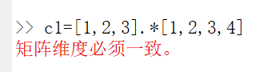

# MATLAB基础知识

## 1. 符号

1. 加减乘除运算符： +    -   *   /  \

2. 矩阵运算运算符：  .*   ./   .^

3. 逻辑运算符： ==   ~=

4. 分号;符: 在输出的语句后面加分号，可取消其输出

5. %：注释本行

6. %% ：两个百分号加一个空格，上方会增加一条分割线，同时注释本行

7. 冒号（:）运算符：

    1. 初值：增量：终值 —— 产生由初值开始、不超过终值的等增量数组，省略增量时默认为1
    2. 特殊用法——对于数组a，a(:,j)表示数组a的第j列，a(:)表示将数组a的所有元素按地址顺序排成列向量

    ```matlab
    a = [1 2 3
    4 5 6
    7 8 9]
    
    %转变成
    a = [1
    4
    7
    2
    5
    8
    3
    6
    9]
    ```

    

>"左除"运算符"\\",  3\\2相当于2/3
>
>注意：在MATLAB中冒号(:)运算符和在Python中的冒号运算不同

在python中，冒号运算：

**初值：终值：步长**     

产生的是从初值到终值-1的序列（python中第一个元素序号为0） （：：-1表示倒序）

在MATLAB中，冒号运算：

**初值：增量：终值**

产生从初值到终值的序列（MATLAB中第一个元素序列为1）

两者的区别在于**增量的位置，元素的序号**（python从0开始，MATLAB从1开始）


## 2. 命令

whos: 显示当前所有变量类型，大小，字节数等

clc: 清空命令行窗口

clear：清空工作区的所有变量

close (all) : 关闭所有的figure窗口


## 3. 数据类型

1. 普通变量直接定义

2. 向量的定义

    1. 直接定义：

        行向量：v1=[1 2 3] 或 v1=[1,2,3]

        列向量：v2=[1;2;3] 或 v2=[1,2,3]'

    2. 通过冒号创建：

        v3=0:1:5    等价于 v3=[0,1,2,3,4,5]

        v4=0:2:5  等价于 v4=[0 2 4]

3. 矩阵的定义

    M=[3 4 6; 0 2 17;4 4 33]

    M =

    ```matlab
     3     4     6
     0     2    17
     4     4    33
    ```

> 在MATLAB中，**数组**是一个广义的概念，不但**包括传统意义下的向量和矩阵**，还包括一些扩展定义
>
> 注：**向量是数字的一维数组。**有两种类型，一种是行向量（逗号或空格分隔），一种是列向量（分号分隔）。**矩阵是数字的二维数组。**

在MATLAB中，数组的编址是**按列编址**，如：M(2,3) 即是 M(8)


## 4. 运算

1. 向量

向量可以直接进行加减运算，为对应位置的元素运算；

向量也可以直接进行点乘和点除运算（.*、./），同样为对应位置的元素运算

向量可以直接进行乘除运算，为矩阵运算，但是乘法运算要满足矩阵运算条件，即前一个向量的列等于后一个向量的行；除法运算则要求两个向量维度一致。

> 向量a,b的除法a/b，相当于给定两个向量A、B，求一个常量x，使得A=x * B。举个例子： [2 4]/[1 2]=2。
>
> 但是两个向量并不一定成比例，所以求得的x一般为使误差的平方和最小的那个值
>
> 使（2 - x * 1)^2 + (5 - x * 2)^2 最小的x

2. 矩阵

矩阵直接乘除为矩阵运算，要满足矩阵乘法的要求，即前一个矩阵的列等于下一个矩阵的行

点乘为对应位置元素相乘，要满足向量点乘条件，即两个矩阵的维数要一致

两个向量维度必须一致




## 5. 常用的函数

| Symbol   | Symbol   | Symbol        | Meaning                               |
| -------- | -------- | ------------- | ------------------------------------- |
| sin(x)   | sqrt(x)  | sum()         |                                       |
| cos(x)   | exp(x)   | size()        |                                       |
| tan(x)   | abs(x)   | repmat(A,m,n) | 把A复制m*n块                          |
| acos(x)  | fix(x)   | find()        | 返回向量或矩阵中不为0的元素的位置索引 |
| asin(x)  | ceil(x)  |               |                                       |
| atan(x)  | floor(x) |               |                                       |
| log(x)   | round(x) |               |                                       |
| log10(x) | disp()   |               |                                       |
| log2(x)  | input()  |               |                                       |


## 6. 系统常量

| Symbol | Meaning      |
| ------ | ------------ |
| pi     | π            |
| Inf    | 无穷         |
| NaN    | 不定值表达式 |
| i,j    | 根号负一     |


# MATLAB作图

1. plot()

2. xlabel()

3. ylabel()

4. title()

5. subplot()

    subplot(m,n,p)  m*n网格，在p指定区域创建坐标系

6. hold on

    **plot(s1);hold on;plot(s2,'r')**

    在同一个图中绘制两条曲线，第二条颜色设为红色

7. figure()

    与subplot()不同，这是另外绘制一张图

8. stem()

    散点图


# 定义符号

1. 定义一个符号

    `syms t `

2. 对符号求导（Differentiate）

    ` diff(t) `

    结果为1

3. 对符号求积分（integrate ）

    `int(t)`

    结果为t^2/2

4. 取傅里叶变换

    `fourier(t) `

5. 拉普拉斯变换

    ` laplace(s)`

6. z变换

    `ztrans(t) `