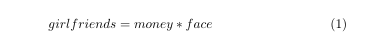
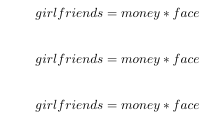
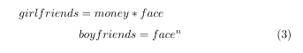
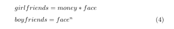
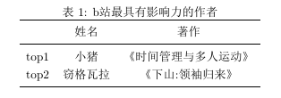

# LaTeX论文排版

## 1. 论文整体框架

### **1.1 声明类**

相当于在说：“我想写一篇文章”

```latex
\documentclass[UTF8]{ctexart}
```

上面就声明了，文件编码为`UTF8`，文件类型为中文

在overleaf时，

```latex
\documentclass[conference]{IEEEtran}
```


### **1.2 导入包**

导入一些特定的包，来完成一些复杂的操作

相当于在说：“我要开始写文章”

```latex
\usepackage{mathtools,wallpaper}

\usepackage{t1enc}
\usepackage{pagecolor}
```

可以一次性导入全部宏，每个包之间用逗号分隔，也可以一行行导入，用到什么导什么。


### **1.3 环境**

相当于在说：“我正在写文章”

```latex
\begin{document}
	文章
\end{document}
```

文章中的部分写在内部


## 2. 开始写文章

在完成上述的论文框架搭建之后，就可以开始写文章了

### **2.1 maketitle**

写文章的标题

```latex
\title{标题\LaTeX}  
\author{xxx}
\date{62-50-0202}
\maketitle
```

注意：

`\maketitle`一定要加上，不然显示不了
`\date{62-50-0202}`可以不加，会默认显示写作时间，如果不想显示，直接`\date{}`


### 2.2 摘要

```l
\begin{abstract}
	摘要
\end{abstract}
```


### 2.3 章节

```latex
\section{\LaTeX 的使用}
\subsection{\LaTeX 的基本知识}
\subsubsection{\LaTeX 的结构}
```

`\LaTeX`是属于LaTeX的一个特殊符号

分章节，一般都是无脑sub,但是注意，最多到`\subsubsection`，没有`\subsubsubsection`,如果你还想在\subsubsection以下分段的话，只能选择`\paragraph`

`\paragraph`的作用只是**另起一段并在开头添加了粗体的段标题**，后面的文字将会紧跟标题，不会像section一样另起一段。

在ctexart类型文章中，标题\section标题是居中的，现需要改为左对齐，需要设置如下：

```latex
\CTEXsetup[format={\Large\bfseries}]{section}
```


### 2.4 列表

```latex
\begin{enumerate}
\item 第一条
\item 第二条
\item 第三条
\end{enumerate}

%无序列表
\begin{itemize}
\item 无编号的列表
\item 带编号的列表
\item 带标签的列表
\end{itemize}
```

和body最外面套的document环境一样，`\begin {...} \end{...}`把一段内容圈到对应环境里面,enumerate就表示列表（枚举）


## 3. font字体

### 3.1 粗体和斜体

```latex
\textbf{文本}		%粗体命令，将文本内容变成粗体
\textit{文本}		%斜体命令
```


### 3.2 字号

对指定文本：

```latex
{\normalsize 不大}
	
{\large 大}
	
{\Large 大大}
	
{\LARGE 大大大}
	
{\huge 大大大大}
	
{\Huge 大大大大大}
```


对所有文本：

需要加入：`\usepackage{type1cm} ` （其中的 cm 为 Computer Modern 的缩写）

`\fontsize{字号}{行距}`

这个命令对其后所有文本都起作用，在使用此命令后需要用 `\selectfont` 才能使字体大小设置起作用。

LaTeX没有小四，只有pt，可以通过下面的字号对应的转换表选择对应的pt大小。

| 字号                             | 初号      | 小初      | 一号      | 小一      | 二号      | 小二      | 三号      | 小三        | 四号      | 小四      | 五号         | 小五        | 六号         | 小六        | 七号        | 小七       |
| -------------------------------- | --------- | --------- | --------- | --------- | --------- | --------- | --------- | ----------- | --------- | --------- | ------------ | ----------- | ------------ | ----------- | ----------- | ---------- |
| 大小                             | 42<br>pt  | 36<br/>pt | 26<br/>pt | 24<br/>pt | 22<br/>pt | 18<br/>pt | 16<br/>pt | 15<br/>pt   | 14<br/>pt | 12<br/>pt | 10.5<br/>pt  | 9<br/>pt    | 7.5<br/>pt   | 6.5<br/>pt  | 5.5<br/>pt  | 5<br/>pt   |
| 1.5行距时的 \baselineskip 设置值 | 63<br/>pt | 54<br/>pt | 39<br/>pt | 36<br>pt  | 33<br/>pt | 27<br/>pt | 24<br/>pt | 22.5<br/>pt | 21<br/>pt | 18<br/>pt | 15.75<br/>pt | 13.5<br/>pt | 11.25<br/>pt | 9.75<br/>pt | 8.25<br/>pt | 7.5<br/>pt |

**比如：`\fontsize{12pt}{18pt}\selectfont` 就设置了 小四，且 1.5 倍行距。**

```
错误：
Latex font warning: font shape `OT1/cmr/m/n' in size <15> not available

LaTeX font warning: size s stitutions with differences
       up to 0.6 pt have occurred

解决方案：\usepackage{type1cm}
```

通常我们会根据具体要求在源文件的导言区加入下面的语句，以方便设置字号：

```latex
\newcommand{\xiaosi}{\fontsize{12pt}{18pt}\selectfont}    % 小四, 1.5倍行距
```

`\song\xiaosi `可以快速设置为“宋体，小四，1.5 倍行距”。


### 3.3 字体

对指定文本：

```latex
{\songti 宋体}
{\youyuan 幼圆}
```

中国人专属


对所有文本：

`\CJKfamily` 命令，他不带有任何参数，他对其后的整个文本起作用

```latex
\newcommand{\song}{\CJKfamily{song}}    	% 宋体
\newcommand{\fs}{\CJKfamily{fs}}            % 仿宋体
\newcommand{\kai}{\CJKfamily{kai}}          % 楷体
\newcommand{\hei}{\CJKfamily{hei}}        	% 黑体
\newcommand{\li}{\CJKfamily{li}}            % 隶书
```


### 3.4 居中显示

```latex
\begin{center}
	居中显示
\end{center}
```


## 4. 目录

```latex
%%%要运行两次：第一次加载，第二次新增的条目才能显示
\tableofcontents
```

目录会自动解析文章的section和列表，并动态标号


## 5. 页

### 5.1 另起一页

```latex
%%%想要另起一页
\newpage

%%%一般下面这种用的多
\clearpage
```


### 5.2 页号

```latex
\pagestyle{empty}%%整篇文章不显示

\thispagestyle{empty}%%仅当前页

\setcounter{page}{1}%%页号从正文开始
```

页号默认在右上角

```
\usepackage{fancyhdr}
\pagestyle{fancy}
\lfoot{}%这条语句可以让页码出现在下方

\renewcommand{\headrulewidth}{0pt} %改为0pt即可去掉页眉下面的横线
```


## 6. 公式

### 6.1 普通公式

```latex
\begin{equation}
girlfriends=money*face
\end{equation}
```

运行效果：



不许要右侧的编号

```latex
%写法1
\begin{equation}
girlfriends=money*face \notag
\end{equation}

%写法2
\begin{equation*}
girlfriends=money*face
\end{equation*}

%写法3
\[
girlfriends=money*face
\]
```

运行效果：




### 6.2 换行公式

普通公式在一个环境里不支持`\\`换行。

要实现换行，需要用到`align`换行公式

```latex
%换行公式
\begin{align}
girlfriends=money*face \notag \\ %%如果想要这一行没标号的话，notag要加在\\之前
boyfriends=face^n 
\end{align}
```



还可以使用`&`实现行间对齐：

```latex
\begin{align}
&girlfriends=money*face \notag \\ 
&boyfriends=face^n 
\end{align}
```



### 6.3 行内公式

用`$ $`实现文字内部插入公式

> 注意的是，现在latex最好不要用`$ $`这种行内公式写法，最好使用`\( \)`的写法。同样行间公式也应该用`\[ \]`而不是`$$ $$`


### 6.4 矩阵和大括号

需要导入宏包`mathtools`

mathtools包里的环境只能放在equation的环境中

```latex 
\begin{equation*}
A=\begin{bmatrix}
1&2&3\\
4&5&6
\end{bmatrix}
\end{equation*}
```

$$
\begin{equation*}
A=\begin{bmatrix}
1&2&3\\
4&5&6
\end{bmatrix}
\end{equation*}
$$

```latex
\begin{equation*}
y=\begin{cases}
&\lambda e^{-\lambda x} \\
&0
\end{cases}
\end{equation*}
```

$$
\begin{equation*}
y=\begin{cases}
&\lambda e^{-\lambda x} \\
&0
\end{cases}
\end{equation*}
$$


## 7. 表格

### 7.1 普通表格

```latex
\begin{tabular}{|l|c|r|}
\hline
name&money&face\\
\hline
廖亦彬&0&thick\\
\hline
\end{tabular}
```

`{|l|c|r|}`指定了表格有3列，4条竖线
l表示靠左 c表示居中  r表示靠右

三个`\hline`指定了表格有2行，3条行线
各个行线之间为每一行内容，每一个属性用`&`连接


### 7.2 三线表

三线表是paper里面常见的表格形式，也是很多表格变体的基础。
需要导入`booktabs`

```latex
\begin{table}[!htbp]
	\centering
	\caption{b站最具有影响力的作者}
	\begin{tabular}{ccc}
		\toprule
		&姓名&著作\\
		\midrule
		top1&小猪&《时间管理与多人运动》\\
		top2&窃格瓦拉&《下山:领袖归来》\\
		\bottomrule
	\end{tabular}
\end{table}
```




## 8. 标签与引用

当paper里面公式很多的时候，文中若想引用远处的某个公式，可以使用**`\label{}`和`\ref{}`的组合**。它能对某个公式、表格、图片指定一个名称，随后可以在文中任何地方引用这个名称。

```latex
\begin{equation}
	y=\sum^{n}_{i=1}x^{2}+1 \label{eq:here}  %%eq可以也换成tab（表）、fig（图）
\end{equation}
	
我来引用(\ref{eq:here})
```


## 9. 图片

插入图片需要导入包：

```latex
\usepackage{graphicx}
```

*注意：你在自动补全的时候可能会看到另一个长得很像的包：`graphics`,这个包版本很久远了，所以我们一般都不会再去用它，注意不要选错。*

### 9.1 插入图片

```latex
\includegraphics[]{universe.jpg}

\includegraphics[width=30cm]{universe.jpg}

\includegraphics[width=300mm]{universe.jpg}

\includegraphics[width=3in]{universe.jpg}

\includegraphics[width=0.5\textwidth]{universe.jpg}
```

`{}`必选参数中输入你要引用的图片名称(overleaf会自动补全)，可选参数`[]`，用于指定图片显示大小。

最后一种方法应用最广，含义就是图片宽度以**整个文字页宽度的0.5倍显示**，`\textwidth`引用了全局宽度。


### 9.2 引用图片

上述插入图片的方法，仅仅是插入一张图片，没有名字等描述信息。

所以一般情况下，我们插入图片，不只是需要`\includegraphics`，我们需要将它放到一个**图片环境**中去，并添加一些图片的额外信息，比方说名字。

```latex
\begin{figure}
\centering
\includegraphics[scale=1.7]{universe.jpg}
\caption{The Universe}
\label{fig:universe}
\end{figure}
```

`\caption`,就是给你的图片一个**名字**，caption内部也是一个计数器，你在引用图片的时候引用的就是这幅图片caption的计数值(e.g.,Figure 1,Figure 2)

注意：**label必须在caption后面**,因为label这个别名需要caption的计数值才能引用。


### 9.3 浮动体(双栏跨栏图)

浮动体这个概念其实是很早之前文字编辑排版里的一个原则：图片表格等不能影响文字的阅读。所以图片表格这类内容将会服从文字优先，也就是一般不会被插入到文字内，如果你插入的地方之上已有文字，那么图片会自动浮动到下一页或者上一页，由于给浮动体排版的计算过程消耗不低，因此像microsoft之类的软件一般不会有浮动体这个概念。

强制图片在文字中间：

```latex
\begin{figure}[hbt!]  %加上可选参数
\centering
\includegraphics[scale=1.7]{universe.jpg}
\caption{The Universe}
\label{fig:universe}
\end{figure}
```

`h`表示here,`b`表示bottom，`t`表示top,`!`表示强制

`\textwidth`是页宽，如果是双栏的template的话，那么应该使用`\linewidth`即**单栏行宽**。

强制让一张图片跨栏，同时不想那么难看的话，你可以让他强制到下一页。

```latex
\begin{figure*}[hbt!]  % 双栏跨栏浮动体
\centering
\includegraphics[width=0.8\textwidth]{universe.jpg}
\caption{The Universe}
\label{fig:universe}
\end{figure*}
```

这里的`*`表示的就是这幅图片**是双栏跨栏图**。


## 10. 超链接

很多论文pdf里面我们会看到很多红色绿色的框框把你的引用框起来，然后只要点击就能快速跳转。

方法：在**导言区最后**导入一个包就可以

```latex
\usepackage{hyperref}

\usepackage[colorlinks]{hyperref}
%这种方式链接就不会有框框起来，会变成有颜色的图标，
```


## 11. 参考文献

导包:`\usepackage{cite}`

添加引用配置，`\bibliographystyle{plain}`放在`\begin{document}`后面，`\bibliography{ref}`放在`\end{document}`前面。

```latex
\bibliographystyle{unsrt} //参考文献格式，可自由调整！
\bibliography{refs}
```

```
# 按照cite顺序自动排序文献编号，用\bibliographystyle{unsrt}
1. plain，按字母的顺序排列，比较次序为作者、年度和标题
2. unsrt，样式同plain，只是按照引用的先后排序
3. alpha，用作者名首字母+年份后两位作标号，以字母顺序排序
4. abbrv，类似plain，将月份全拼改为缩写，更显紧凑
5. ieeetr，国际电气电子工程师协会期刊样式
6. acm，美国计算机学会期刊样式
7. siam，美国工业和应用数学学会期刊样式
8. apalike，美国心理学学会期刊样式
```

