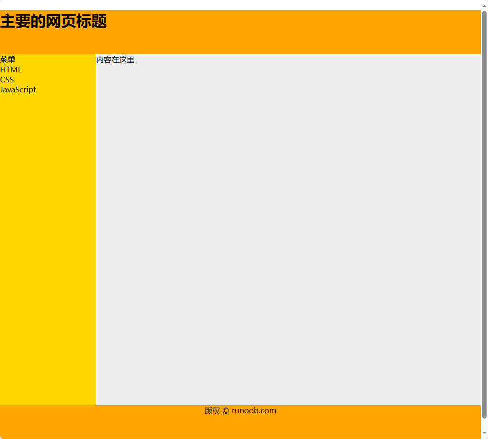

# HTML

超文本标记语言（英语：HyperText Markup Language，简称：HTML）是一种用于创建网页的标准标记语言。

您可以使用 HTML 来建立自己的 WEB 站点，HTML 运行在浏览器上，由浏览器来解析。

HTML文档的后缀名：

- **.html**
- **.htm**

以上两种后缀名没有区别，都可以使用。

HTML/CSS/JS 在线工具：https://c.runoob.com/front-end/61

参考手册：https://www.runoob.com/tags/html-reference.html

HTML实例：https://www.runoob.com/html/html-examples.html

## HTML 简介

实例：

```html
<!DOCTYPE html>
<html>
<head>
<meta charset="utf-8">
<title>菜鸟教程(runoob.com)</title>
</head>
<body>
 
<h1>我的第一个标题</h1>
 
<p>我的第一个段落。</p>
 
</body>
</html>
```

实例解析：


- **`<!DOCTYPE html>`** 声明为 HTML5 文档
- **`<html>`** 元素是 HTML 页面的根元素
- **`<head>`** 元素包含了文档的元（meta）数据，如 **`<meta charset="utf-8">`** 定义网页编码格式为 **utf-8**。
- **`<title>`** 元素描述了文档的标题
- **`<body>`** 元素包含了可见的页面内容
- **`<h1>`** 元素定义一个大标题
- **`<p>`** 元素定义一个段落

> **注：**在浏览器的页面上使用键盘上的 F12 按键开启调试模式，就可以看到组成标签。


### 什么是HTML?

HTML 是用来描述网页的一种语言。

- HTML 指的是超文本标记语言: **H**yper**T**ext **M**arkup **L**anguage
- HTML 不是一种编程语言，而是一种**标记**语言
- 标记语言是一套**标记标签** (markup tag)
- HTML 使用标记标签来**描述**网页
- HTML 文档包含了HTML **标签**及**文本**内容
- HTML文档也叫做 **web 页面**


### HTML 标签

HTML 标记标签通常被称为 HTML 标签 (HTML tag)。

- HTML 标签是由*尖括号*包围的关键词，比如 `<html>`
- HTML 标签通常是*成对出现*的，比如 `<b>` 和 `</b>`
- 标签对中的第一个标签是*开始标签*，第二个标签是*结束标签*
- 开始和结束标签也被称为*开放标签*和*闭合标签*

<标签>内容</标签>


### HTML 元素

"HTML 标签" 和 "HTML 元素" 通常都是描述同样的意思.

但是严格来讲, 一个 HTML 元素包含了开始标签与结束标签，如下实例:

HTML 元素:

`<p>` 这是一个段落。`</p>`


### HTML版本

从初期的网络诞生后，已经出现了许多HTML版本:

| 版本      | 发布时间 |
| :-------- | :------- |
| HTML      | 1991     |
| HTML+     | 1993     |
| HTML 2.0  | 1995     |
| HTML 3.2  | 1997     |
| HTML 4.01 | 1999     |
| XHTML 1.0 | 2000     |
| HTML5     | 2012     |
| XHTML5    | 2013     |


### <!DOCTYPE> 声明

\<!DOCTYPE> 声明有助于浏览器中正确显示网页。


网络上有很多不同的文件，如果能够正确声明HTML的版本，浏览器就能正确显示网页内容。

doctype 声明是不区分大小写的，以下方式均可：

```html
<!DOCTYPE html>
<!DOCTYPE HTML>
<!doctype html>
<!Doctype Html>
```

**HTML5**

```html
<!DOCTYPE html>
```

**HTML 4.01**

```html
<!DOCTYPE HTML PUBLIC "-//W3C//DTD HTML 4.01 Transitional//EN"
"http://www.w3.org/TR/html4/loose.dtd">
```

**XHTML 1.0**

```html
<!DOCTYPE html PUBLIC "-//W3C//DTD XHTML 1.0 Transitional//EN"
"http://www.w3.org/TR/xhtml1/DTD/xhtml1-transitional.dtd">
```


### 中文编码

目前在大部分浏览器中，直接输出中文会出现中文乱码的情况，这时候我们就需要在头部将字符声明为 UTF-8 或 GBK。

`<meta charset="UTF-8">`


## HTML 元素

HTML 文档由 HTML 元素定义。

| 开始标签 *              | **元素内容** | **结束标签 \*** |
| ----------------------- | ------------ | --------------- |
| \<p>                    | 这是一个段落 | \</p>           |
| \<a href="default.htm"> | 这是一个链接 | \</a>           |
| \<br>                   | 换行         |                 |

*****开始标签常被称为**起始标签（opening tag）**，结束标签常称为**闭合标签（closing tag）**。

元素语法：

- HTML 元素以**开始标签**起始
- HTML 元素以**结束标签**终止
- **元素的内容**是开始标签与结束标签之间的内容
- 某些 HTML 元素具有**空内容（empty content）**
- 空元素**在开始标签中进行关闭**（以开始标签的结束而结束）
- 大多数 HTML 元素可拥有**属性**

即使 \<br> 在所有浏览器中都是有效的，但使用 \<br /> 其实是更长远的保障。

HTML 提示：使用小写标签

因为万维网联盟（W3C）在 HTML 4 中**推荐**使用小写，而在未来 (X)HTML 版本中**强制**使用小写。


## HTML 属性

- HTML 元素可以设置**属性**
- 属性可以在元素中添加**附加信息**
- 属性一般描述于**开始标签**
- 属性总是以名称/值对的形式出现，**比如：name="value"**。

```html
<a href="http://www.runoob.com">这是一个链接</a>
```

**HTML 属性参考手册**

https://www.runoob.com/tags/html-reference.html

| 属性  | 描述                                                         |
| :---- | :----------------------------------------------------------- |
| class | 为html元素定义一个或多个类名（classname）(类名从样式文件引入) |
| id    | 定义元素的唯一id                                             |
| style | 规定元素的行内样式（inline style）                           |
| title | 描述了元素的额外信息 (作为工具条使用)                        |


## HTML 标题\<h1>

HTML 标题（Heading）是通过 \<h1> - \<h6> 标签来定义的。

```html
<h1>这是一个标题</h1>
<h2>这是一个标题</h2>
<h3>这是一个标题</h3>
```

请确保将 HTML 标题 标签只用于标题。不要仅仅是为了生成**粗体**或**大号**的文本而使用标题。

搜索引擎使用标题为您的网页的结构和内容编制索引。

因为用户可以通过标题来快速浏览您的网页，所以用标题来呈现文档结构是很重要的。

应该将 h1 用作主标题（最重要的），其后是 h2（次重要的），再其次是 h3，以此类推。


## HTML 水平线\<hr>

\<hr> 标签在 HTML 页面中创建水平线。

hr 元素可用于分隔内容。

```html
<p>这是一个段落。</p>
<hr>
<p>这是一个段落。</p>
<hr>
<p>这是一个段落。</p>
```


## HTML 注释\<!-- -->

可以将注释插入 HTML 代码中，这样可以提高其可读性，使代码更易被人理解。浏览器会忽略注释，也不会显示它们。

注释写法如下:

```html
<!-- 这是一个注释 -->
```

**注释:** 开始括号之后（左边的括号）需要紧跟一个叹号 **!** (英文标点符号)，结束括号之前（右边的括号）不需要，合理地使用注释可以对未来的代码编辑工作产生帮助。


## HTML 段落\<p>

HTML 可以将文档分割为若干段落。

HTML 段落是通过标签 \<p> 来定义的。

```html
<p>这是一个段落。</p>
<p>这是另外一个段落。</p>
```

**注意：**浏览器会自动地在段落的前后添加空行。（\</p> 是块级元素）


## HTML 折行\<br>

如果您希望在不产生一个新段落的情况下进行换行（新行），请使用 **\<br>** 标签：

```html
<p>这个<br>段落<br>演示了分行的效果</p>
```

\<br /> 元素是一个空的 HTML 元素。由于关闭标签没有任何意义，因此它没有结束标签。


## HTML 文本格式化

HTML 使用标签 \<b>("bold") 与 \<i>("italic") 对输出的文本进行格式, 如：**粗体** or *斜体*

这些HTML标签被称为格式化标签。

> **通常标签 `<strong>` 替换加粗标签 `<b>` 来使用, `<em>` 替换 `<i>` 标签使用。**

文本格式化标签：

| 标签      | **描述**     |
| --------- | ------------ |
| \<b>      | 定义粗体文本 |
| \<em>     | 定义着重文字 |
| \<i>      | 定义斜体字   |
| \<small>  | 定义小号字   |
| \<strong> | 定义加重语气 |
| \<sub>    | 定义下标字   |
| \<sup>    | 定义上标字   |
| \<ins>    | 定义插入字   |
| \<del>    | 定义删除字   |

"计算机输出"标签：

| **标签** | **描述**           |
| -------- | ------------------ |
| \<code>  | 定义计算机代码     |
| \<kbd>   | 定义键盘码         |
| \<samp>  | 定义计算机代码样本 |
| \<var>   | 定义变量           |
| \<pre>   | 定义预格式文本     |

引文, 引用, 及标签定义：

| **标签**      | **描述**           |
| ------------- | ------------------ |
| \<abbr>       | 定义缩写           |
| \<address>    | 定义地址           |
| \<bdo>        | 定义文字方向       |
| \<blockquote> | 定义长的引用       |
| \<q>          | 定义短的引用语     |
| \<cite>       | 定义引用、引证     |
| \<dfn>        | 定义一个定义项目。 |


## HTML 链接\<a>

HTML 链接是通过标签 \<a> 来定义的。

超链接可以是一个字，一个词，或者一组词，也可以是一幅图像，您可以点击这些内容来跳转到新的文档或者当前文档中的某个部分。

```html
<a href="https://www.runoob.com">这是一个链接</a>
```

当您把鼠标指针移动到网页中的某个链接上时，箭头会变为一只小手。

在标签 \<a> 中使用了href属性来描述链接的地址。

默认情况下，链接将以以下形式出现在浏览器中：

- 一个未访问过的链接显示为蓝色字体并带有下划线。
- 访问过的链接显示为紫色并带有下划线。
- 点击链接时，链接显示为红色并带有下划线。

### target 属性

使用 target 属性，你可以定义被链接的文档在何处显示。

下面的这行会在新窗口打开文档：

```html
<a href="https://www.runoob.com/" target="_blank" rel="noopener noreferrer">访问菜鸟教程!</a>
```

-  _blank ：新窗口打开。
- _parent ：在父窗口中打开链接。
- _self ：默认，当前页面跳转。
- _top：在当前窗体打开链接，并替换当前的整个窗体(框架页)。


### id 属性

id 属性可用于创建一个 HTML 文档书签。

**提示:** 书签不会以任何特殊方式显示，即在 HTML 页面中是不显示的，所以对于读者来说是隐藏的。

实例：

在HTML文档中插入ID:

```html
<a id="tips">有用的提示部分</a>
```

在HTML文档中创建一个链接到"有用的提示部分(id="tips"）"：

```html
<a href="#tips">访问有用的提示部分</a>
```

或者，从另一个页面创建一个链接到"有用的提示部分(id="tips"）"：

```html
<a href="https://www.runoob.com/html/html-links.html#tips">
访问有用的提示部分</a>
```

> \#号被称为锚点（Anchor），用于在 HTML 页面中创建内部链接。通过在链接的href属性中使用锚点名称，可以跳转到同一页面上的指定位置。

> **注释：** 请始终将正斜杠添加到子文件夹。假如这样书写链接：href="https://www.runoob.com/html"，就会向服务器产生两次 HTTP 请求。这是因为服务器会添加正斜杠到这个地址，然后创建一个新的请求，就像这样：href="https://www.runoob.com/html/"。


## HTML 头部\<head>

\<head> 元素包含了所有的头部标签元素。在 \<head>元素中你可以插入脚本（scripts）, 样式文件（CSS），及各种meta信息。

可以添加在头部区域的元素标签为: \<title>, \<style>, \<meta>, \<link>, \<script>, \<noscript> 和 \<base>。

### \<title> 元素

\<title> 标签定义了不同文档的标题。

\<title> 在 HTML/XHTML 文档中是必需的。

\<title> 元素:

- 定义了浏览器工具栏的标题
- 当网页添加到收藏夹时，显示在收藏夹中的标题
- 显示在搜索引擎结果页面的标题

### \<base> 元素

\<base> 标签描述了基本的链接地址/链接目标，该标签作为HTML文档中所有的链接标签的默认链接:

```html
<head>
<base href="http://www.runoob.com/images/" target="_blank">
</head>
```

### \<link> 元素

\<link> 标签定义了文档与外部资源之间的关系。

\<link> 标签通常用于链接到样式表:

```html
<head>
<link rel="stylesheet" type="text/css" href="mystyle.css">
</head>
```

- rel：必需。定义当前文档与被链接文档之间的关系。rel 是 relationship的英文缩写。
- type：规定被链接文档的 MIME 类型。
- href：定义被链接文档的位置。

### \<style> 元素

\<style> 标签定义了HTML文档的样式文件引用地址.


在\<style> 元素中你也可以直接添加样式来渲染 HTML 文档:

```html
<head>
<style type="text/css">
body {
    background-color:yellow;
}
p {
    color:blue
}
</style>
</head>
```

### \<meta> 元素

meta标签描述了一些基本的元数据。

\<meta> 标签提供了元数据。元数据也不显示在页面上，但会被浏览器解析。

META 元素通常用于指定网页的描述，关键词，文件的最后修改时间，作者，和其他元数据。

元数据可以使用于浏览器（如何显示内容或重新加载页面），搜索引擎（关键词），或其他Web服务。

\<meta> 一般放置于 \<head> 区域

实例：

为搜索引擎定义关键词:

```html
<meta name="keywords" content="HTML, CSS, XML, XHTML, JavaScript">
```

为网页定义描述内容:

```html
<meta name="description" content="免费 Web & 编程 教程">
```

定义网页作者:

```html
<meta name="author" content="Runoob">
```

每30秒钟刷新当前页面:

```html
<meta http-equiv="refresh" content="30">
```

### \<script> 元素

\<script>标签用于加载脚本文件，如： JavaScript。


## HTML CSS

CSS (Cascading Style Sheets) 用于渲染HTML元素标签的样式。

CSS 是在 HTML 4 开始使用的，是为了更好的渲染HTML元素而引入的.

CSS 可以通过以下方式添加到HTML中:

- ==内联样式==：在HTML元素中使用"style" **属性**
- ==内部样式表==：在HTML文档头部 \<head> 区域使用\<style> **元素** 来包含CSS
- ==外部引用==：使用外部 CSS **文件**

最好的方式是通过外部引用CSS文件.

### 内联样式

当特殊的样式需要应用到个别元素时，就可以使用内联样式。 使用内联样式的方法是在相关的标签中使用样式属性。样式属性可以包含任何 CSS 属性。

以下实例显示出如何改变段落的颜色和左外边距。

```html
<p style="color:blue;margin-left:20px;">这是一个段落。</p>
```

背景颜色

背景色属性（background-color）定义一个元素的背景颜色：

```html
<body style="background-color:yellow;">
<h2 style="background-color:red;">这是一个标题</h2>
<p style="background-color:green;">这是一个段落。</p>
</body>
```

字体, 字体颜色 ，字体大小

我们可以使用font-family（字体），color（颜色），和font-size（字体大小）属性来定义字体的样式:

```html
<h1 style="font-family:verdana;">一个标题</h1>
<p style="font-family:arial;color:red;font-size:20px;">一个段落。</p>
```

现在通常使用font-family（字体），color（颜色），和font-size（字体大小）属性来定义文本样式，而不是使用\<font>标签。

**文本对齐方式**

使用 text-align（文字对齐）属性指定文本的水平与垂直对齐方式：

```html
<h1 style="text-align:center;">居中对齐的标题</h1>
<p>这是一个段落。</p>
```

### 内部样式表

当单个文件需要特别样式时，就可以使用内部样式表。你可以在\<head> 部分通过 \<style>标签定义内部样式表:

```html
<head>
    <style type="text/css">
        body {
            background-color:yellow;
        }
        p {
            color:blue;
        }
    </style>
</head>
```

### 外部样式表

当样式需要被应用到很多页面的时候，外部样式表将是理想的选择。使用外部样式表，你就可以通过更改一个文件来改变整个站点的外观。

```html
<head>
    <link rel="stylesheet" type="text/css" href="mystyle.css">
</head>
```


## HTML 图像

HTML 图像是通过标签 \ 来定义的.

\ 是空标签，意思是说，它只包含属性，并且没有闭合标签。

要在页面上显示图像，你需要使用源属性（src）。src 指 "source"。源属性的值是图像的 URL 地址。

```html

```

**注意：** 图像的名称和尺寸是以属性的形式提供的。

### Alt 属性

alt 属性用来为图像定义一串预备的可替换的文本。

替换文本属性的值是用户定义的。

```html

```

在浏览器无法载入图像时，替换文本属性告诉读者她们失去的信息。此时，浏览器将显示这个替代性的文本而不是图像。为页面上的图像都加上替换文本属性是个好习惯，这样有助于更好的显示信息，并且对于那些使用纯文本浏览器的人来说是非常有用的。

### 设置图像的高度与宽度

height（高度） 与 width（宽度）属性用于设置图像的高度与宽度。

属性值默认单位为像素:

```html

```

**提示:** 指定图像的高度和宽度是一个很好的习惯。如果图像指定了高度宽度，页面加载时就会保留指定的尺寸。如果没有指定图片的大小，加载页面时有可能会破坏HTML页面的整体布局。

### 图像标签

| 标签    | 描述                     |
| ------- | ------------------------ |
| \  | 定义图像                 |
| \<map>  | 定义图像地图             |
| \<area> | 定义图像地图中可点击区域 |


## HTML 表格

HTML 表格由 **\<table>** 标签来定义。

HTML 表格是一种用于展示结构化数据的标记语言元素。

每个表格均有若干行（由 **\<tr>** 标签定义），每行被分割为若干单元格（由 **\<td>** 标签定义），表格可以包含标题行（**\<th>**）用于定义列的标题。

- **tr**：tr 是 table row 的缩写，表示表格的一行。
- **td**：td 是 table data 的缩写，表示表格的数据单元格。
- **th**：th 是 table header的缩写，表示表格的表头单元格。

数据单元格可以包含文本、图片、列表、段落、表单、水平线、表格等等。

```html
<table border="1">
  <thead>
    <tr>
      <th>列标题1</th>
      <th>列标题2</th>
      <th>列标题3</th>
    </tr>
  </thead>
  <tbody>
    <tr>
      <td>行1，列1</td>
      <td>行1，列2</td>
      <td>行1，列3</td>
    </tr>
    <tr>
      <td>行2，列1</td>
      <td>行2，列2</td>
      <td>行2，列3</td>
    </tr>
  </tbody>
</table>
```

以上的表格实例代码中，\<table> 元素表示整个表格，它包含两个主要部分：\<thead> 和 \<tbody>。

- **\<thead > 用于定义表格的标题部分:** 在 \<thead > 中，使用 \<th > 元素定义列的标题，以上实例中列标题分别为"列标题1"，"列标题2"和"列标题3"。
- **\<tbody > 用于定义表格的主体部分:** 在 \<tbody > 中，使用 \<tr > 元素定义行，并在每行中使用 \<td > 元素定义单元格数据，以上实例中有两行数据，每行包含三个单元格。

通过使用 \<th > 元素定义列标题，可以使其在表格中以粗体显示，与普通单元格区分开来。

HTML 表格还可以具有其他部分，如 \<tfoot > （表格页脚）和 \<caption > （表格标题），\<tfoot > 可用于在表格的底部定义摘要、统计信息等内容。 \<caption > 可用于为整个表格定义标题。

HTML 表格还支持合并单元格和跨行/跨列的操作，以及其他样式和属性的应用，以满足各种需求。

我们也可以使用 CSS 来进一步自定义表格的样式和外观。

### 表格和边框属性

如果不定义边框属性，表格将不显示边框。有时这很有用，但是大多数时候，我们希望显示边框。

使用边框属性来显示一个带有边框的表格：

```html
<table border="1">
    <tr>
        <td>Row 1, cell 1</td>
        <td>Row 1, cell 2</td>
    </tr>
</table>
```

### 表格表头

表格的表头使用 \<th> 标签进行定义。

大多数浏览器会把表头显示为粗体居中的文本：

```html
<table border="1">
    <tr>
        <th>Header 1</th>
        <th>Header 2</th>
    </tr>
    <tr>
        <td>row 1, cell 1</td>
        <td>row 1, cell 2</td>
    </tr>
    <tr>
        <td>row 2, cell 1</td>
        <td>row 2, cell 2</td>
    </tr>
</table>
```


## HTML 列表

HTML 支持有序、无序和定义列表:

### 无序列表

无序列表是一个项目的列表，此列项目使用粗体圆点（典型的小黑圆圈）进行标记。

无序列表使用 \<ul> 标签

```html
<ul>
    <li>Coffee</li>
    <li>Milk</li>
</ul>
```

### 有序列表

同样，有序列表也是一列项目，列表项目使用数字进行标记。 有序列表始于 \<ol> 标签。每个列表项始于 \<li> 标签。

列表项使用数字来标记。

```html
<ol>
    <li>Coffee</li>
    <li>Milk</li>
</ol>
```

### 自定义列表

自定义列表不仅仅是一列项目，而是项目及其注释的组合。

自定义列表以 \<dl> 标签开始。每个自定义列表项以 \<dt> 开始。每个自定义列表项的定义以 \<dd> 开始。

```html
<dl>
    <dt>Coffee</dt>
    <dd>- black hot drink</dd>
    <dt>Milk</dt>
    <dd>- white cold drink</dd>
</dl>
```

浏览器显示如下：

Coffee

- black hot drink

Milk

\- white cold drink


## HTML 区块

大多数 HTML 元素被定义为**块级元素**或**内联元素**。

块级元素在浏览器显示时，通常会以新行来开始（和结束）。

实例: \<h1>, \<p>, \<ul>, \<table>

内联元素在显示时通常不会以新行开始。

实例: \<b>, \<td>, \<a>, \

### \<div> 元素

HTML \<div> 元素是块级元素，它可用于组合其他 HTML 元素的容器。

\<div> 元素没有特定的含义。除此之外，由于它属于块级元素，浏览器会在其前后显示折行。


如果与 CSS 一同使用，\<div> 元素可用于对大的内容块设置样式属性。

\<div> 元素的另一个常见的用途是文档布局。它取代了使用表格定义布局的老式方法。使用 \<table> 元素进行文档布局不是表格的正确用法。\<table> 元素的作用是显示表格化的数据。

### \<span> 元素

HTML \<span> 元素是内联元素，可用作文本的容器

\<span> 元素也没有特定的含义。

当与 CSS 一同使用时，\<span> 元素可用于为部分文本设置样式属性。


## HTML 布局

大多数网站会把内容安排到多个列中（就像杂志或报纸那样）。

大多数网站可以使用 \<div> 或者 \<table> 元素来创建多列。CSS 用于对元素进行定位，或者为页面创建背景以及色彩丰富的外观。

> 虽然我们可以使用HTML table标签来设计出漂亮的布局，但是table标签是不建议作为布局工具使用的 - 表格不是布局工具。

### 使用\<div>元素

div 元素是用于分组 HTML 元素的块级元素。

下面的例子使用五个 div 元素来创建多列布局：

```html
<!DOCTYPE html>
<html>
    <head> 
        <meta charset="utf-8"> 
        <title>菜鸟教程(runoob.com)</title> 
        <style>
            html, body {
                height: 100%;
                margin: 0;
                padding: 0;
            }

            #container {
                height: 100%;
            }

            #header {
                background-color:#FFA500;
                height: 10%;
                margin-bottom: 0;
            }

            #menu {
                background-color:#FFD700;
                height: 80%;
                width: 20%;
                float:left;
            }

            #content {
                background-color:#EEEEEE;
                height: 80%;
                width: 80%;
                float:left;
            }

            #footer {
                background-color:#FFA500;
                clear:both;
                text-align:center;
                height: 10%;
            }
        </style>
    </head>
    <body>
        <div id="container">

            <div id="header">
                <h1 style="margin-bottom:0;">主要的网页标题</h1>
            </div>

            <div id="menu">
                <b>菜单</b><br>
                HTML<br>
                CSS<br>
                JavaScript
            </div>

            <div id="content">
                内容在这里
            </div>

            <div id="footer">
                版权 © runoob.com
            </div>

        </div>

    </body>
</html>
```




## HTML 表单

HTML 表单用于收集用户的输入信息。

HTML 表单表示文档中的一个区域，此区域包含交互控件，将用户收集到的信息发送到 Web 服务器。

HTML 表单通常包含各种输入字段、复选框、单选按钮、下拉列表等元素。

以下是一个简单的HTML表单的例子：

- `<form>` 元素用于创建表单，`action` 属性定义了表单数据提交的目标 URL，`method` 属性定义了提交数据的 HTTP 方法（"post" 或 "get"）。
- `<label>` 元素用于为表单元素添加标签，提高可访问性。
- `<input>` 元素是最常用的表单元素之一，它可以创建文本输入框、密码框、单选按钮、复选框等。`type` 属性定义了输入框的类型，`id` 属性用于关联 `<label>` 元素，`name` 属性用于标识表单字段。
- `<select>` 元素用于创建下拉列表，而 `<option>` 元素用于定义下拉列表中的选项。

```html
<!DOCTYPE html>
<html lang="en">
<head>
    <meta charset="UTF-8">
    <meta name="viewport" content="width=device-width, initial-scale=1.0">
    <title>Document</title>
</head>
<body>
    <form action="/" method="post">
        <!-- 文本输入框 -->
        <label for="name">用户名：</label>
        <input type="text" id="name" name="name" required>
        <br>

        <!-- 密码输入框 -->
        <label for="password">密码：</label>
        <input type="password" id="password" name="password" required>
        <br>

        <!-- 单选按钮 -->
        <label>性别：</label>
        <input type="radio" id="male" name="gender" value="male" checked>
        <label for="male">男</label>
        <input type="radio" id="female" name="gender" value="female">
        <label for="female">女</label>
        <br>

        <!-- 复选框 -->
        <input type="checkbox" id="subscribe" name="subscribe" checked>
        <label for="subscribe">订阅推送消息</label>
        <br>

        <!-- 下拉列表 -->
        <label for="country">国家</label>
        <select name="country" id="country">
            <option value="cn">CN</option>
            <option value="usa">USA</option>
            <option value="uk">UK</option>
        </select>
        <br>

        <!-- 提交按钮 -->
        <input type="submit" value="提交">

    </form>
</body>
</html>
```

### \<input>输入标签

-  `<input type="text">`：文本域（Text Fields），在大多数浏览器中，文本域的默认宽度是 20 个字符。

- `<input type="password">`：密码字段

- `<input type="radio">`：单选按钮（Radio Buttons）

- `<input type="checkbox">`：复选框（Checkboxes）

- `<input type="submit">`：提交按钮(Submit)，当用户单击确认按钮时，表单的内容会被传送到服务器。表单的动作属性 **action** 定义了服务端的文件名。

    ```html
    <form name="input" action="html_form_action.php" method="get">
    ```

method 属性，它用于定义表单数据的提交方式，可以是以下值：

- **post**：指的是 HTTP POST 方法，表单数据会包含在表单体内然后发送给服务器，用于提交敏感数据，如用户名与密码等。
- **get**：默认值，指的是 HTTP GET 方法，表单数据会附加在 **action** 属性的 URL 中，并以 **?**作为分隔符，一般用于不敏感信息，如分页等。例如：`https://www.runoob.com/?page=1`，这里的 page=1 就是 get 方法提交的数据。


## HTML 框架

通过使用框架，你可以在同一个浏览器窗口中显示不止一个页面。

**iframe语法:**

```html
<iframe src="URL"></iframe>
```

该 URL 指向不同的网页。

**设置高度与宽度**

height 和 width 属性用来定义iframe标签的高度与宽度。

属性默认以像素为单位, 但是你可以指定其按比例显示 (如："80%")。

```html
<iframe src="demo_iframe.htm" width="200" height="200"></iframe>
```

**移除边框**

frameborder 属性用于定义iframe表示是否显示边框。

设置属性值为 "0" 移除iframe的边框:

```html
<iframe src="demo_iframe.htm" frameborder="0"></iframe>
```

**使用 iframe 来显示目标链接页面**

iframe 可以显示一个目标链接的页面

目标链接的属性必须使用 iframe 的属性，如下实例:

```html
<iframe src="demo_iframe.htm" name="iframe_a"></iframe>
<p><a href="https://www.runoob.com" target="iframe_a" rel="noopener">RUNOOB.COM</a></p>
```


## HTML 颜色

HTML 颜色由红色、绿色、蓝色混合而成。

HTML 颜色由一个十六进制符号来定义，这个符号由红色、绿色和蓝色的值组成（RGB）。

每种颜色的最小值是0（十六进制：#00）。最大值是255（十六进制：#FF）。

- **颜色十六进制(Color HEX)**：\#000000
- **颜色RGB(Color RGB)**：rgb(0,0,0)


**Web安全色**

数年以前，当大多数计算机仅支持 256 种颜色的时候，一系列 216 种 Web 安全色作为 Web 标准被建议使用。其中的原因是，微软和 Mac 操作系统使用了 40 种不同的保留的固定系统颜色（双方大约各使用 20 种）。

我们不确定如今这么做的意义有多大，因为越来越多的计算机有能力处理数百万种颜色，不过做选择还是你自己。

最初，216 跨平台 web 安全色被用来确保：**当计算机使用 256 色调色板时，所有的计算机能够正确地显示所有的颜色。**


### 颜色名

141个颜色名称是在HTML和CSS颜色规范定义的（17标准颜色，再加124）

| **颜色名** | **HEX** |
| ---------- | ------- |
| AliceBlue  | #F0F8FF |
| Aqua       | #00FFFF |
| Black      | #000000 |
| Blue       | #0000FF |
| GhostWhite | #F8F8FF |
| LightCyan  | #E0FFFF |
| Red        | #FF0000 |


## HTML脚本

JavaScript 使 HTML 页面具有更强的动态和交互性。

- \<script> 标签用于定义客户端脚本，比如 JavaScript。

- \<script> 元素既可包含脚本语句，也可通过 src 属性指向外部脚本文件。


JavaScript 最常用于图片操作、表单验证以及内容动态更新。

```html
<script>
	document.write("Hello World!");
</script>
```

- \<noscript> 标签提供无法使用脚本时的替代内容，比方在浏览器禁用脚本时，或浏览器不支持客户端脚本时。

- \<noscript>元素可包含普通 HTML 页面的 body 元素中能够找到的所有元素。

只有在浏览器不支持脚本或者禁用脚本时，才会显示 \<noscript> 元素中的内容：

```html
<script>
	document.write("Hello World!")
</script>
<noscript>抱歉，你的浏览器不支持 JavaScript!</noscript>
```


实例：

```html
<!DOCTYPE html>
<html lang="en">
<head>
    <meta charset="UTF-8">
    <meta name="viewport" content="width=device-width, initial-scale=1.0">
    <title>Document</title>
</head>
<body>
    <script>document.write("<p>这是一个段落。</p>");</script>

    <p id="demo"> JavaScript 可以触发事件，就像按钮点击。</p>
    <script>
        function myFunction()
        {
            document.getElementById("demo").innerHTML="Hello JavaScript!";
        }
    </script>

    <button type="button" onclick="myFunction()">点我！</button>

</body>
</html>
```


## HTML字符实体

HTML 中的预留字符必须被替换为字符实体。

一些在键盘上找不到的字符也可以使用字符实体来替换。

在 HTML 中不能使用小于号（<）和大于号（>），这是因为浏览器会误认为它们是标签。

如果希望正确地显示预留字符，我们必须在 HTML 源代码中使用字符实体（character entities）。 

如需显示小于号，我们必须这样写：**&lt** 或 **&#60** 或 **&#060**


**不间断空格(Non-breaking Space)**

HTML 中的常用字符实体是不间断空格(`&nbsp;`)。

浏览器总是会截短 HTML 页面中的空格。如果您在文本中写 10 个空格，在显示该页面之前，浏览器会删除它们中的 9 个。如需在页面中增加空格的数量，您需要使用 `&nbsp; `字符实体。


**结合音标符**

发音符号是加到字母上的一个"glyph(字形)"。

一些变音符号, 如 尖音符 ( ̀) 和 抑音符 ( ́) 。

变音符号可以出现字母的上面和下面，或者字母里面，或者两个字母间。

变音符号可以与字母、数字字符的组合来使用。

| 音标符 | 字符 | Construct | 输出结果 |
| :----- | :--- | :-------- | :------- |
| ̀       | a    | `a&#768;` | à        |
| ́       | a    | `a&#769;` | á        |
| ̂       | a    | `a&#770;` | â        |
| ̃       | a    | `a&#771;` | ã        |
| ̀       | O    | `O&#768;` | Ò        |
| ́       | O    | `O&#769;` | Ó        |
| ̂       | O    | `O&#770;` | Ô        |
| ̃       | O    | `O&#771;` | Õ        |


**字符实体**

| 显示结果 | 描述        | 实体名称            | 实体编号  |
| :------- | :---------- | :------------------ | :-------- |
|          | 空格        | `&nbsp;`            | `&#160;`  |
| <        | 小于号      | `&lt;`              | `&#60;`   |
| >        | 大于号      | `&gt;`              | `&#62;`   |
| &        | 和号        | `&amp;`             | `&#38;`   |
| "        | 引号        | `&quot;`            | `&#34;`   |
| '        | 撇号        | `&apos;` (IE不支持) | `&#39;`   |
| ￠       | 分          | `&cent;`            | `&#162;`  |
| £        | 镑          | `&pound;`           | `&#163;`  |
| ¥        | 人民币/日元 | `&yen;`             | `&#165;`  |
| €        | 欧元        | `&euro;`            | `&#8364;` |
| §        | 小节        | `&sect;`            | `&#167;`  |
| ©        | 版权        | `&copy;`            | `&#169;`  |
| ®        | 注册商标    | `&reg;`             | `&#174;`  |
| ™        | 商标        | `&trade;`           | `&#8482;` |
| ×        | 乘号        | `&times;`           | `&#215;`  |
| ÷        | 除号        | `&divide;`          | `&#247;`  |

虽然 html 不区分大小写，但实体字符对大小写敏感。


## HTML URL

统一资源定位器(Uniform Resource Locators)

URL 是一个网页地址。

URL可以由字母组成，如"runoob.com"，或互联网协议（IP）地址： 192.68.20.50。大多数人进入网站使用网站域名来访问，因为 名字比数字更容易记住。

一个统一资源定位器(URL) 用于定位万维网上的文档。

一个网页地址实例: http://www.runoob.com/html/html-tutorial.html 语法规则:

```
scheme://host.domain:port/path/filename
```

说明:

- - scheme - 定义因特网服务的类型。最常见的类型是 http
    - host - 定义域主机（http 的默认主机是 www）
    - domain - 定义因特网域名，比如 runoob.com
    - :port - 定义主机上的端口号（http 的默认端口号是 80）
    - path - 定义服务器上的路径（如果省略，则文档必须位于网站的根目录中）。
    - filename - 定义文档/资源的名称


**常见的 URL Scheme**

以下是一些URL scheme：

| Scheme | 访问               | 用于...                             |
| :----- | :----------------- | :---------------------------------- |
| http   | 超文本传输协议     | 以 http:// 开头的普通网页。不加密。 |
| https  | 安全超文本传输协议 | 安全网页，加密所有信息交换。        |
| ftp    | 文件传输协议       | 用于将文件下载或上传至网站。        |
| file   |                    | 您计算机上的文件。                  |


## 速查列表

HTML 基本文档

```html
<!DOCTYPE html> 
<html> 
    <head> 
        <title>文档标题</title> 
    </head> 
    <body> 
        可见文本... 
    </body> 
</html>
```


基本标签（Basic Tags）

```html
<h1>最大的标题</h1> 
<h2> . . . </h2> 
<h3> . . . </h3> 
<h4> . . . </h4> 
<h5> . . . </h5> 
<h6>最小的标题</h6>   
<p>这是一个段落。</p> 
<br> （换行） 
<hr> （水平线） 
<!-- 这是注释 -->
```


文本格式化（Formatting）

```html
<b>粗体文本</b> 
<code>计算机代码</code> 
<em>强调文本</em> 
<i>斜体文本</i> 
<kbd>键盘输入</kbd>  
<pre>预格式化文本</pre> 
<small>更小的文本</small> 
<strong>重要的文本</strong>   
<abbr> （缩写） 
<address> （联系信息） 
<bdo> （文字方向） 
<blockquote> （从另一个源引用的部分） 
<cite> （工作的名称） 
<del> （删除的文本） 
<ins> （插入的文本） 
<sub> （下标文本） 
<sup> （上标文本）
```


链接（Links）

```html
普通的链接：<a href="http://www.example.com/">链接文本</a> 
图像链接： <a href="http://www.example.com/"></a> 
邮件链接： <a href="mailto:webmaster@example.com">发送e-mail</a> 
书签： 
<a id="tips">提示部分</a> 
<a href="#tips">跳到提示部分</a>
```


图片（Images）

```html

```


样式/区块（Styles/Sections）

```html
<style type="text/css">
    h1 {color:red;} 
    p {color:blue;}
</style> 
<div>文档中的块级元素</div> 
<span>文档中的内联元素</span>
```


无序列表

```html
<ul>    
    <li>项目</li>    
    <li>项目</li> 
</ul>
```


有序列表

```html
<ol>    
    <li>第一项</li>    
    <li>第二项</li> 
</ol>
```


定义列表

```html
<dl>  
    <dt>项目 1</dt>    
    <dd>描述项目 1</dd>  
    <dt>项目 2</dt>    
    <dd>描述项目 2</dd> 
</dl>
```


表格（Tables）

```html
<table border="1">   
    <tr>     
        <th>表格标题</th>     
        <th>表格标题</th>   
    </tr>   
    <tr>     
        <td>表格数据</td>     
        <td>表格数据</td>   
    </tr> 
</table>
```


框架（Iframe）

```html
<iframe src="demo_iframe.htm"></iframe>
```


表单（Forms）

```html
<form action="demo_form.php" method="post/get"> 
    <input type="text" name="email" size="40" maxlength="50"> 
    <input type="password"> <input type="checkbox" checked="checked"> 
    <input type="radio" checked="checked"> 
    <input type="submit" value="Send"> 
    <input type="reset"> 
    input type="hidden"> 
    <select> 
        <option>苹果</option> 
        <option selected="selected">香蕉</option> 
        <option>樱桃</option> 
    </select> 
    <textarea name="comment" rows="60" cols="20"></textarea>  
</form>
```


 实体（Entities）

```html
&lt; 等同于 < 
&gt; 等同于 > 
&#169; 等同于 ©
```


