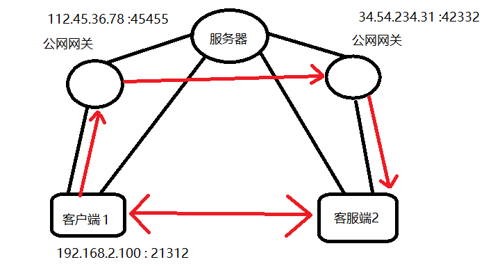
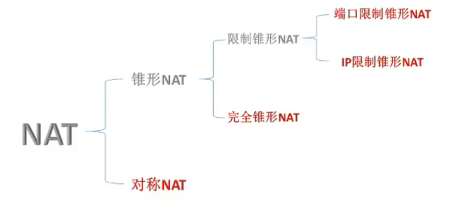

# P2P网络结构

## 1、基本概念

- **Peer to Peer（对等网络）**
- 对等网络，即[对等计算](https://baike.baidu.com/item/对等计算/5937281?fromModule=lemma_inlink)机网络，是一种在对等者（Peer）之间分配任务和工作负载的分布式[应用架构](https://baike.baidu.com/item/应用架构/1473973?fromModule=lemma_inlink)，是对等计算模型在[应用层](https://baike.baidu.com/item/应用层/4329788?fromModule=lemma_inlink)形成的一种组网或网络形式。
- 国内一些媒体将P2P翻译成“[点对点](https://baike.baidu.com/item/点对点/7452984?fromModule=lemma_inlink)”或者“[端对端](https://baike.baidu.com/item/端对端/7453016?fromModule=lemma_inlink)”，学术界则统一称为对等网络（Peer-to-peer networking）或对等计算（Peer-to-peer computing），其可以**定义为：网络的参与者共享他们所拥有的一部分硬件资源（处理能力、存储能力、[网络连接](https://baike.baidu.com/item/网络连接/5658236?fromModule=lemma_inlink)能力、打印机等），这些[共享资源](https://baike.baidu.com/item/共享资源/10366244?fromModule=lemma_inlink)通过网络提供服务和内容，能被其它对等节点（Peer）[直接访问](https://baike.baidu.com/item/直接访问/8845360?fromModule=lemma_inlink)而无需经过中间实体。** **在此网络中的参与者既是资源、服务和内容的==提供者（Server）==，又是资源、服务和内容的==获取者（Client）==。**
- 在P2P[网络环境](https://baike.baidu.com/item/网络环境/4422188?fromModule=lemma_inlink)中，彼此连接的多台计算机之间都处于对等的地位，各台计算机有相同的功能，==无主从之分==，一台计算机既可作为服务器，设定共享资源供网络中其他计算机所使用，又可以作为工作站，整个网络一般来说不依赖专用的集中服务器，也没有专用的工作站。

## 2、网络特点

- 对等网络是一种[网络结构](https://baike.baidu.com/item/网络结构/8259917?fromModule=lemma_inlink)的思想。**它与目前网络中占据[主导地位](https://baike.baidu.com/item/主导地位/6316812?fromModule=lemma_inlink)的客户端/服务器（[Client/Server](https://baike.baidu.com/item/Client%2FServer/1504488?fromModule=lemma_inlink)）结构（也就是WWW所采用的[结构方式](https://baike.baidu.com/item/结构方式/7254693?fromModule=lemma_inlink)）的一个本质区别是，==整个网络结构中不存在中心节点（或中心服务器）==。**
- 在P2P结构中，每一个节点（peer）大都同时具有**信息消费者、[信息提供者](https://baike.baidu.com/item/信息提供者/12754057?fromModule=lemma_inlink)和[信息通讯](https://baike.baidu.com/item/信息通讯/19069781?fromModule=lemma_inlink)**等三方面的功能。
- 从计算模式上来说，**P2P打破了传统的Client/Server ([C/S](https://baike.baidu.com/item/C%2FS/826311?fromModule=lemma_inlink))模式**，在网络中的每个节点的地位都是对等的。每个节点既充当服务器，为其他节点提供服务，同时也享用其他节点提供的服务。

- 非中心化
- 可扩展性
- 健壮性
- 高性价比
- 隐私保护
- 负载均衡

## 3、用到P2P技术的应用

1. 远程工具 teamviewer
2. 迅雷
3. 快播
4. 区块链
5. 大疆
6. QQ文件的在线传输方式

## 4、实现原理

- 网络通讯要由客户端通过公网网关向服务器发送数据，那么就需要**客户端的IP和端口与服务器的IP和端口形成一个一对一的关系，这个关系就叫做网络地址映射**（Network Address Transform，NAT）。
- 那么对外而言，客户端的IP和端口就等同于公网网关对应的IP和端口。
- 那么，当前客户端直接向对应客户端的网关发送数据，就可以实现在没有服务器的情况下，两个客户端直接通信。

- 上述是最理想的情况，就是公网网关允许任意一个公网IP向他发送数据，但实际情况会受到很多限制，如下面的NAT类型。

### NAT类型

- NAT分为**锥形NAT**和**对称NAT**。

- **完全锥形NAT**

    只要外界的未知的IP地址能够说出请求的IP和端口，就允许它传送数据。

    

- **IP限制锥形NAT**

    防止未知IP的访问，只允许你发送数据到的那个IP地址，返回数据。也就是只有那一台服务器可以返回数据。

- **端口限制锥形NAT**

    只允许你发送数据到的那个IP地址和端口，返回数据。也就是只有那一台服务器的那一个端口可以返回数据。

**理解锥形和对称：**

- ==锥形NAT：==
    - 如果客户端的进程同时对不同的IP发送数据，网关只会给你分配一个IP和端口。
    - **锥形限制NAT只限制入，不限制出。**可就是客户端可以通过一个IP和端口，访问多个服务器IP，但是外界只能通过这一个IP和端口访问客户端。
- ==对称NAT：==
    - 客户端向每一个服务器发送数据，网关都会分配一个IP和端口。