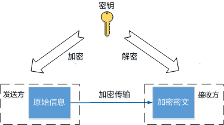
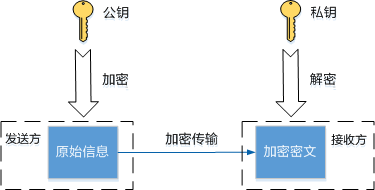
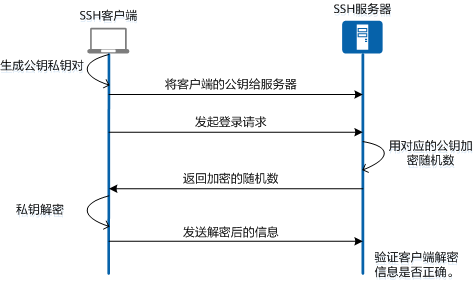

# SSH

- SSH（Secure Shell，安全外壳）是一种==网络安全协议==，通过加密和认证机制实现安全的访问和文件传输等业务。
- 传统远程登录或文件传输方式，例如Telnet、FTP，使用明文传输数据，存在很多的安全隐患。随着人们对网络安全的重视，这些方式已经慢慢不被接受。
- SSH协议通过对网络数据进行==加密和验证==，在不安全的网络环境中提供了安全的登录和其他安全网络服务。
- 作为Telnet和其他不安全远程shell协议的安全替代方案，目前SSH协议已经被全世界广泛使用，大多数设备都支持SSH功能。

## SSH端口号是什么？

- 当SSH应用于STelnet，SFTP以及SCP时，使用的默认SSH端口都是==22==。

- 当SSH应用于NETCONF时，可以指定SSH端口是==22或者830==。

- SSH端口支持修改，更改后当前所有的连接都会断开，SSH服务器开始侦听新的端口。

## SSH是如何工作的？

SSH由服务器和客户端组成，在整个通信过程中，为建立安全的SSH通道，会经历如下几个阶段：

- **连接建立**

    SSH服务器在指定的端口侦听客户端的连接请求，在客户端向服务器发起连接请求后，双方建立一个==TCP==连接。

- **版本协商**

    SSH协议目前存在SSH1.X（SSH2.0之前的版本）和SSH2.0版本。SSH2.0协议相比SSH1.X协议来说，在结构上做了扩展，可以支持更多的认证方法和密钥交换方法，同时提高了服务能力。**SSH服务器和客户端通过协商确定最终使用的SSH版本号。**

- **算法协商**

    SSH支持多种加密算法，双方根据各自支持的算法，协商出最终用于产生会话密钥的密钥交换算法、用于数据信息加密的加密算法、用于进行数字签名和认证的公钥算法以及用于数据完整性保护的HMAC算法。

- **密钥交换**

    服务器和客户端通过密钥交换算法，动态生成共享的会话密钥和会话ID，建立加密通道。会话密钥主要用于后续数据传输的加密，会话ID用于在认证过程中标识该SSH连接。

- **用户认证**

    SSH客户端向服务器端发起认证请求，服务器端对客户端进行认证。SSH支持以下几种认证方式：

    - **密码（password）认证**：客户端通过用户名和密码的方式进行认证，将加密后的用户名和密码发送给服务器，服务器解密后与本地保存的用户名和密码进行对比，并向客户端返回认证成功或失败的消息。
    - **密钥（publickey）认证**：客户端通过用户名，公钥以及公钥算法等信息来与服务器进行认证。
    - **password-publickey认证**：指用户需要同时满足密码认证和密钥认证才能登录。
    - **all认证**：只要满足密码认证和密钥认证其中一种即可。

- **会话请求**

    认证通过后，SSH客户端向服务器端发送会话请求，请求服务器提供某种类型的服务，即请求与服务器建立相应的会话。

- **会话交互**

    会话建立后，SSH服务器端和客户端在该会话上进行数据信息的交互。

- **使用PuTTY和OpenSSH**

    **PuTTY**是Windows上经典的免费SSH连接工具，通常用于使用SSH协议远程登录设备，最新版本可以在PuTTY官网下载。

    **OpenSSH**是SSH协议的开源实现，支持在Unix操作系统上运行，最新版本可以在OpenSSH官网下载。目前Windows10已经包含OpenSSH客户端和服务器软件，可在“设置—应用—应用与功能—可选功能”中搜索安装。

- **SSH密钥**

- **对称加密和非对称加密**

    提高安全性的基本方式就是加密，**加密算法通过密钥将明文转换为密文进行安全传输**。SSH在工作过程中结合使用了**对称加密**和**非对称加密**两种类型的算法，通过事先生成的SSH密钥来保证信息传输的安全性。两种加密算法的加解密过程见下图。
    - 对称加密算法

        

    - 非对称加密算法

        

        

    **对称加密算法使用同一个密钥对数据进行加密和解密。**SSH连接建立过程中生成的会话密钥就是对称密钥，该对称密钥是由客户端和服务器端基于共享的部分信息和各自的私有数据使用密钥交换算法分别生成的。**因为对称加密算法加解密的速度很快，所以适用于传输大量数据的场景。**

​		**非对称加密的发送和接收需要使用一对关联的SSH密钥，==公钥和私钥==。**私钥由生成的一方自己保管，公钥可以发送给任何请求通信的		其他人。发送方用收到的公钥对自己的通信内容进行加密，**只有接收方可以使用私钥进行解密获取通信内容**。非对称加密的私钥不需		要暴露在网络中，安全性大大增加，但是**加解密的速度比对称密钥慢得多**。

​		SSH连接过程中的**两个阶段使用了非对称加密**。一个是在**密钥交换阶段**，服务器和客户端都生成了自己临时的公钥和私钥，用于计算		出同一个用于后续加密通信内容的会话密钥。另外一个就是在**用户认证阶段**，利用只有匹配的私钥可以唯一解密公钥加密的内容这一		特点，通过客户端的公钥私钥对验证客户端的身份。	

- **密钥认证**

    SSH用户认证最基本的两种方式是密码认证和密钥认证。密码认证是将自己的用户名和密码发送给服务器进行认证，这种方式比较简单，且每次登录都需要输入用户名和密码。密钥认证使用公钥私钥对进行身份验证，实现安全的免密登录，是一种广泛使用且推荐的登录方式。密钥认证的基本原理是服务器端使用客户端的公钥对随机内容加密，客户端使用自己的私钥解密并发送给服务器以证实自己的身份，具体的过程见下图。

    

    SSH密钥认证登录流程

    - 在进行SSH连接之前，SSH客户端需要先生成自己的公钥私钥对，并将自己的公钥存放在SSH服务器上。
    - SSH客户端发送登录请求，SSH服务器就会根据请求中的用户名等信息在本地搜索客户端的公钥，并用这个公钥加密一个随机数发送给客户端。
    - 客户端使用自己的私钥对返回信息进行解密，并发送给服务器。
    - 服务器验证客户端解密的信息是否正确，如果正确则认证通过。

## GPT回答如何工作

SSH密钥对是一种非对称加密方式，由公钥和私钥两部分组成。其中公钥可以自由传输，而私钥必须保密保存。在SSH连接中，密钥对的工作原理如下：

1. 客户端发送请求连接到服务器，并发送自己的公钥给服务器；
2. 服务器接收到客户端的请求后，将客户端公钥添加到~/.ssh/authorized_keys文件中保存；
3. 服务器通过其自己的私钥进行数字签名，将签名的数据发回给客户端；
4. 客户端使用服务器公钥对服务器签名的数据进行验证；
5. 如果验证成功，则建立SSH会话，并使用密钥对进行身份验证和加密通信。

这里的数字签名采用的是非对称加密的方式，即使用私钥对数据进行签名，在网络传输中只有公钥才能解开签名，从而确保数据的安全性和真实性。因此，SSH密钥对能够有效地防止中间人攻击、欺骗和窃听等问题，提高了用户和服务器之间的安全性。

与传统的密码登录方式相比，SSH密钥对具备更高的安全性和便捷性。密钥对可以永久保存于本地，而不必每次登录都输入密码，同时也不必担心密码在传输过程中被窃听或劫持。此外，由于SSH密钥对采用非对称加密方式，因此在安全性上要比双方使用相同的对称加密算法更高。

