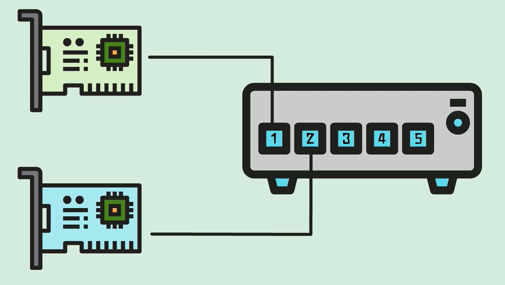
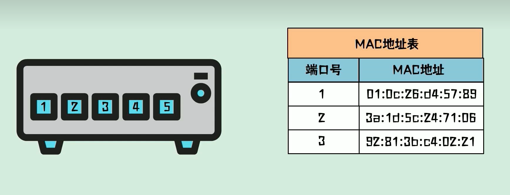
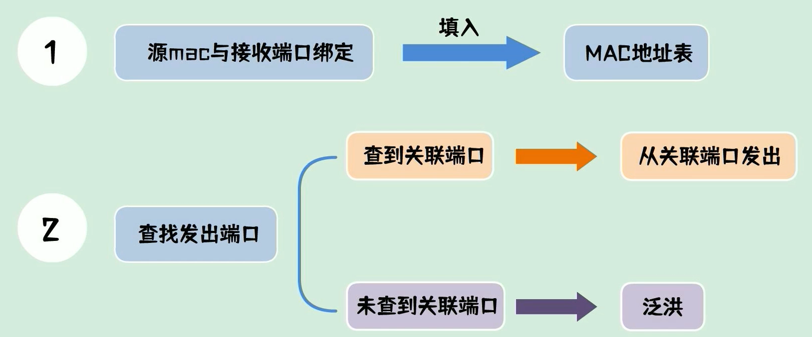
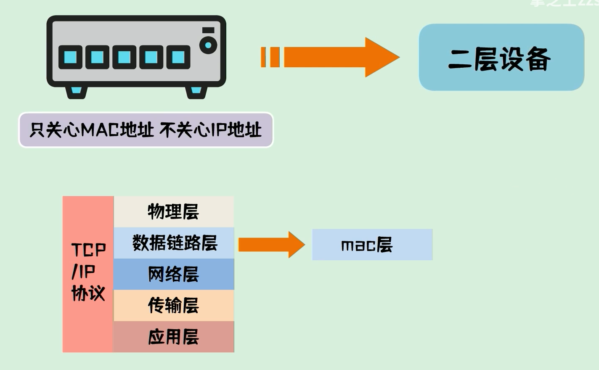
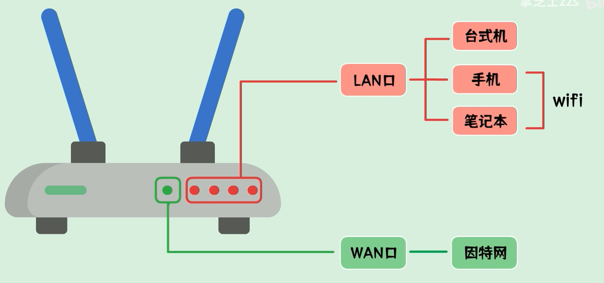
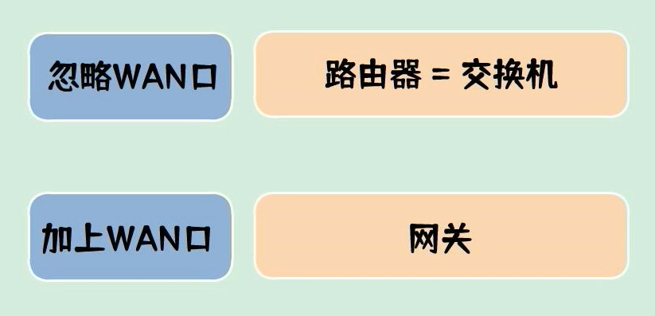
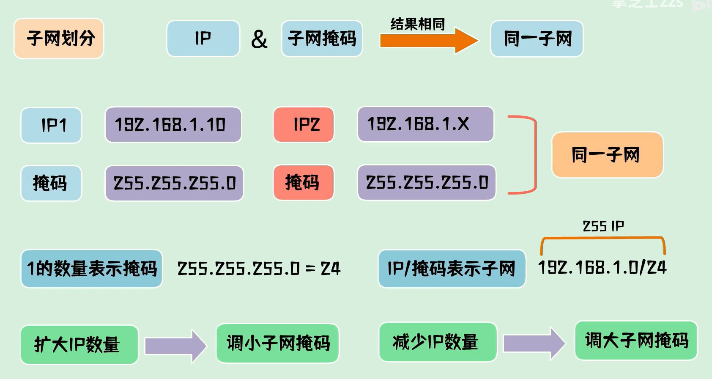
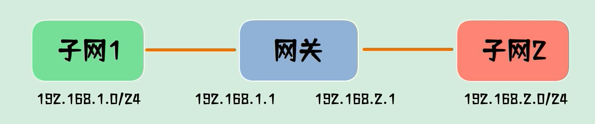
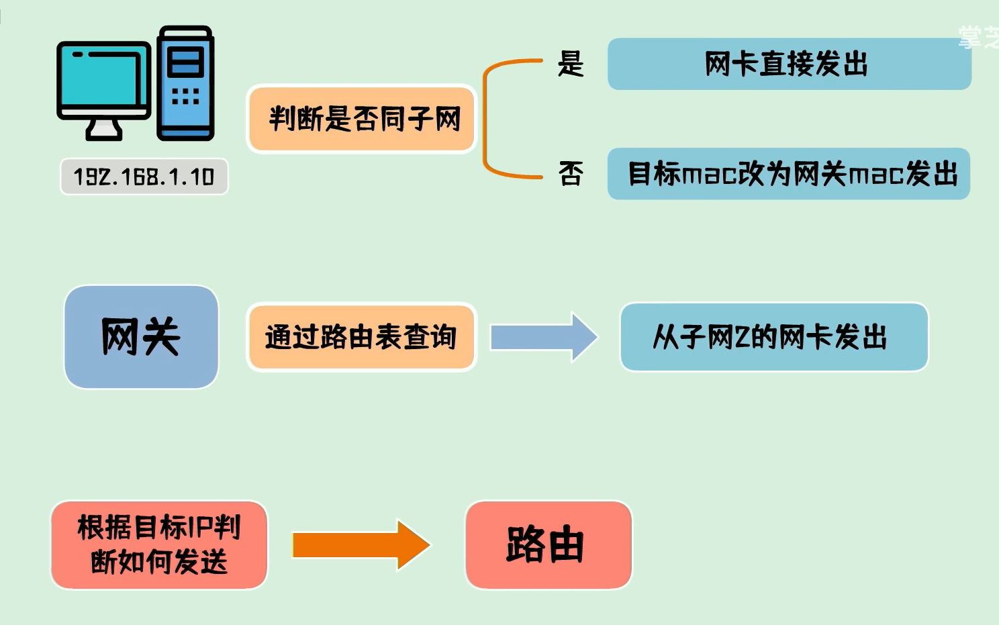

# 计算机网络基础知识

## 1、局域网原理

### 1.1 交换机

- **交换机**
    - 作用：把数据包发送到正确的位置
    - 根据数据包中的**目标Mac地址**，找到它对应的**物理端口**
- 一台交换机有很多的端口，它们都有自己的编号。
- **计算机的网卡通过网线连接到交换机的网口上，这个端口就是一个确定的物理位置**

- 我们只要知道某个网卡的Mac地址在哪个端口上，我们就能正确的把数据包发给它

- 所以，在交换机中，有一张端口与Mac地址的映射关系表——**MAC地址表**

- 交换机维护这张表，想要与某个mac地址通讯时，只要来查询一下，这个mac地址在哪个端口上，然后从对应的端口发送出去就可以了。

### 1.2 数据包

- **数据包**
    - 每一包数据都会有两个mac地址，一个是发送方的mac地址，称为源mac，另一个是接收方的mac地址，称为目标mac。

- 如果目标mac在这个网络中，则它一定能受到群发的数据包。
- 由此可见，**交换机只关心MAC地址，不关心IP地址。**

- MAC地址在TCP/IP协议中的第二层，数据链路层，因此，**交换机通常称为二层设备**。

### 1.3 路由器

- **路由器**
    - 包含两种接口：**LAN口和WAN口**。
    - LAN口可以有多个，用来接家庭网络设备。
    - WAN口只有一个，用来接入运营商网络，以连接到互联网中。

- 如果路由器忽略WAN口，就相当于交换机。加上WAN口，要**引入网关的概念**。

- **子网的划分：将IP地址和子网掩码按位与。**

- TCP/IP协议规定，**不同子网之间是不可以直接通信的**，如果要通信，需要通过网关来进行转发。

- 网关上有两个网卡，分别配置了属于两个子网的ip地址，可以在两个子网之间转发数据包。

- 路由器担任网关，它的行为成为路由。

### 1.4 网关

- 网关(Gateway)又称**网间连接器、协议转换器**。

- 网关在**传输层**上以实现网络互连，是最复杂的网络互连设备，仅用于两个**高层协议不同的**网络互连。网关的结构也和路由器类似，**不同的是互连层**。

- 网关既可以用于==广域网互连==，也可以用于==局域网互连==。 

- 网关是一种充当**转换**重任的计算机系统或设备。在使用不同的通信协议、数据格式或语言，甚至体系结构完全不同的两种系统之间，网关是一个**翻译器**。

- 与网桥只是简单地传达信息不同，网关对收到的信息要重新打包，以适应目的系统的需求。同时，网关也可以提供**过滤和安全**功能。大多数网关运行在OSI 7层协议的顶层--应用层。

大家都知道，从一个房间走到另一个房间，必然要经过一扇门。同样，从一个网络向另一个网络发送信息，也必须经过一道“关口”，这道关口就是网关。顾名思义，网关(Gateway)就是一个网络连接到另一个网络的“关口”。

在OSI中，网关有两种：一种是面向连接的网关，一种是无连接的网关。*当两个子网之间有一定距离时，往往将一个网关分成两半，中间用一条链路连接起来，我们称之为半网关。*

按照不同的分类标准，网关也有很多种。TCP/IP协议里的网关是最常用的，在这里我们所讲的“网关”均指TCP/IP协议下的网关。

#### 那么网关到底是什么呢？

网关实质上是**一个网络通向其他网络的IP地址**。比如有网络A和网络B，
网络A的IP地址范围为
“192.168.1.1~192. 168.1.254”，
子网掩码为
255.255.255.0；

网络B的IP地为
“192.168.2.1~192.168.2.254”，
子网掩码为
255.255.255.0。

**在没有路由器的情况下，两个网络之间是不能进行TCP/IP通信的，即使是两个网络连接在同一台交换机(或集线器)上，TCP/IP协议也会根据子网掩码(255.255.255.0)判定两个网络中的主机处在不同的网络里。**而要实现这两个网络之间的通信，则必须通过网关。如果网络A中的主机发现数据包的目的主机不在本地网络中，就把数据包转发给它自己的网关，再由网关转发给网络B的网关，网络B的网关再转发给网络B的某个主机。

#### 网关的作用及工作流程的通俗解释

​		假设你的名字叫小不点，你住在一个大院子里，你的邻居有很多小伙伴，在门口传达室还有个看大门的李大爷，李大爷就是你的网关。当你想跟院子里的某个小伙伴玩，只要你在院子里大喊一声他的名字，他听到了就会回应你，并且跑出来跟你玩。

​		但是你不被允许走出大门，你想与外界发生的一切联系，都必须由门口的李大爷（网关）用电话帮助你联系。假如你想找你的同学小明聊天，小明家住在很远的另外一个院子里，他家的院子里也有一个看门的王大爷（小明的网关）。但是你不知道小明家的电话号码，不过你的班主任老师有一份你们班全体同学的名单和电话号码对照表，**你的老师就是你的DNS服务器**。于是你在家里拨通了门口李大爷的电话，有了下面的对话：

小不点：李大爷，我想找班主任查一下小明的电话号码行吗？
李大爷：好，你等着。（接着李大爷给你的班主任挂了一个电话，问清楚了小明的电话）问到了，他家的号码是211.99.99.99
小不点：太好了！李大爷，我想找小明，你再帮我联系一下小明吧。
李大爷：没问题。（接着李大爷向电话局发出了请求接通小明家电话的请求，最后一关当然是被转接到了小明家那个院子的王大爷那里，然后王大爷把电话给转到小明家）
就这样你和小明取得了联系。

### 1.5 交换机与路由器的联系与区别

- 交换机不能分配IP，连接在交换机上的电脑的IP不相同。
- 交换机相当于你将一个路由器接口扩展成了交换机端口数减一。
- **交换机不分配IP**，交换机端口也**不获得IP地址**,是连入交换机端口中的电脑(网络终端)网卡获得IP地址,==**这个地址由交换机所连入的网络中的DHCP服务器分配**==(路由里面一般都有DHCP服务器,也就是说该路由可以分配IP地址),设为自动获取就好,也可手工指定. 而这个地址绝对是唯一的.不会冲突. 
- **如果你交换机最上面是路由，连交换机端口，和你直接连路由没有区别.**

### 1.6 IP地址重复问题

- IP分为**内网IP**和**外网IP**，互相是不影响的。
- 不管你是局域网还是广域网，只要同在一个网络里硬件的IP就不能一样，这个是基本前提。
- 举个例子，你自己办理的有线宽带，然后在猫上挂载了一个路由器，路由器上有连接了很多电脑，那这样就是典型的外网和内网设置，路由器的IP是宽带猫自动分配的，**属于运营商的外网IP**，这个IP运营商是给了你就不能再给别人了，那样就冲突了，你挂载到路由器下面的所有电脑的IP是路由器自动分配的，**属于内网IP**，也不能一样，你所有电脑的上网请求是通过路由器连接外网转发的。

- **总结：**
    - 在同一个内网中，IP是不能一样的，在不同的内网中，IP是可以重复的；
    - **在外网中的IP是唯一的**，分配给你了就不能再分配给其他人。
    - 只要区分内网和外网，IP是可以一样的，现在传统的IPV4的外网IP已经快用完了，连接到外网的设备越来越多，目前已经开始想最新的IPV6过渡，不过暂时还没大规模推广而已

